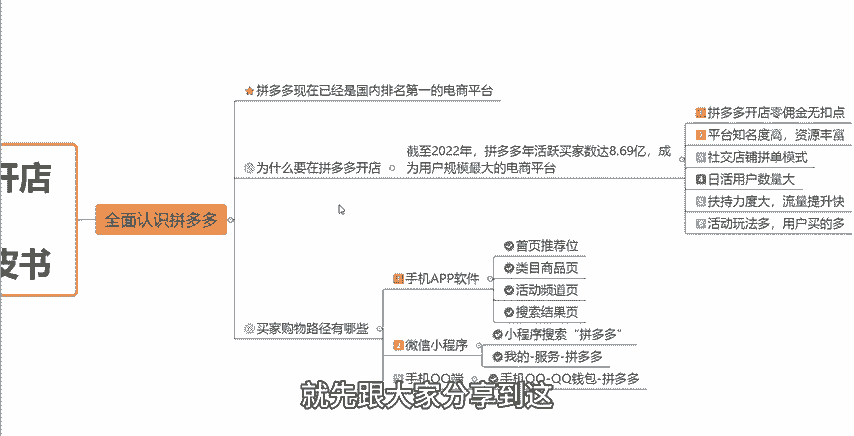

# 【拼多多运营实操教程】最系统的零基础拼多多开店教程全套，电商运营大佬专为学渣研制的新手开店保姆级教程！全程干货，简单粗暴 - P2：2、拼多多开店-平台优势 - -拼多多开店 - BV1BH1qYpEqw

hello，大家好。那么今天呢我们来学习一下关于拼多多新手开店实操运营白皮书的这个系列的第一章的一个内容。今天要跟大家分享的这个知识点呢是全面的认识拼多多，如果说我想要在拼多多这个平台上开一家店铺。

但是我连拼多多是什么都不知道，以及拼多多这个平台，它跟其他的电商平台有什么样的一个区别啊。拼多多开店它会有什么样的一个优势等等。这些东西如果说我都不清楚的话，我盲目的直接去开一个店铺。

这种情况啊肯定是不建议大家这样去做的，对吧？所以说首先我们要去开店的话，要了解的第一个内容就是什么是拼多多以及拼多多开店的优势，它有哪些来我们一起学习一下。那么到底什么呀？什么是拼多多呢？

首先啊拼多多在我们所有的这样的一个中国国内当中的一个电商平台当中啊，它已经是这个用户规模最大的一个电商平台了。所以说已经是这个国内排名第一的一个这个电商平台。在这样大的一个体能啊，体量之下。

我们想要去做一个拼多多的店铺，对不对？我想要去卖我的产品啊。它是就会有一个非常非常大的一个市场，用户的需求也会非常非常的多，对不对？截止2022年这样的一个时间节点啊，拼多多这个平台上啊。

年活跃买家的一个数量就已经达到了8。69个亿。你你想想这是什么样的一个用户买家基数啊，所以说它已经成为了这个用户规模最大的一个电商平台。我们在在这样的一个平台，在这样的一个势能之下。

我们想要去做一个店铺想要去卖一个产品。那么自然而然我们的这样的一个客户的需求是不是就会更加的多，对不对？那整个这个平台来讲啊，给就是整个平台它的一个订单呢？它的一个体量也会非常非常的大。

所以说我们选择这个拼多多开店啊去做出作为一个这种我们的一个销售途径是非常好的一个选择啊。那作为我们中小卖家来讲，它作为我们一个创业的一个方向呢。也是非常不错的。那么这么大的一个市这个市场啊。

跟这种原本我们所说的这种传统的电商平台，它到底有什么样的一个区别。我们1。1点来看一下啊。首先第一个点我们在拼多多这个平台上开店呢，它是没有这一个佣金的，是零佣金无扣点的。每一笔订单呢。

它其实只需要支付一个叫做支付服务费就可以了。这个服务费的这个比例呢是千分之6。所以说基本上是可以忽略不计的。那么在这种情况下，我们在拼多多这样的一个平台上去做店啊，它是没有太大的一个压力的，对不对？

拼多多平台啊本身是具备非常高的一个知名度啊，对不对？知名度是非常高的，尤其像近几年对不对？各大的综艺啊，包括说我们的这个春节联欢晚会啊，包括像其他等等的这个平台，其实都会有拼多多它的一个赞助啊。

或者说去打一些广告。这就导致了拼多多平台，它的一个用户认知呢也是非越来越好的，对不对？在这么大的一个广告的投入之下，拼多多平台它后续也会拥有更多的这样的一个获客的途径跟推广的一些途径。

所以说它的这个市场的体量啊，它的这个资源是非常非常丰富的。这个大家都不用去担心的。那么同时呢。拼多多这个平台，它本身是一个这种以社交电商为属性的这样的一个模式。嗯，大家在拼多多这个平台上。

如果说有买过东西的，应该都知道就是我们。呃，非常常见的一个这个买东西的一个方式叫做拼单，对不对？那以及大家在微信上会经常有好亲朋好友，对吧？给你发一个链接，让你帮忙砍一刀。这个它其实就是拼多多它平台呃。

这样的一个电商，我们把它叫做社交属性啊，那这种属性给我们带来最大的一个好处是什么呢？就是它的一个订单量是非常非常大的。与此同时啊它的这个日活跃度啊，日用户量也是非常非常大的。

就是上面跟大家讲过的这样的一个平台的一个用户的体量。所以说他就给我们带来了一个非常非常大的一个市场的覆盖范围，市场覆盖的一个范围更大呢。那自然而然，订单的一个数量也也就会越来越多。

那同时拼多多这个平台啊其实是非常扶持呃，我们作为这样的一个中小卖家去开店，它会给到我们很多的一个流量扶持。我们经常说到的一个话题啊，就是我们新店在操作之后，如果说。达到了这个平台的一个考核的一个维度。

平台他都会比如说送你一些这个呃推广的一些礼包啊，一些券啊，这些都是真金白银，我们可以直接拿过来用的，可以放在我们的这个平台上去做一些付费推广的。它对于我们这个后续的推广啊，以及后续的店铺运营。

都是有一个呃非常好的一个帮助一个提升的。那么同时呢。拼多多这个平台啊，它还有非常非常多的一系列的这种活动玩法啊，非常非常多的活动。那么这些活动都会有对应的这种资源位，对应的活动推广啊。

以及对应的一些活动的流量啊，对应的活动推荐啊，包括说我们的产品报名这些活动之后啊，也能够得到对应的一个比如说搜索推荐以及这个个性化的一个展示页面的一个推荐。那么与此同时啊，因为活动打法的一个原因，对吧？

经常大家会在拼多多上看到各种各样的一个活动。然后它的一个价格呢也非常的给力啊，非常的低。所以说它的用户转化率普遍来讲都是比较比较高的，因为大家在就是这个网上买东西都会有一个共同的认知。

就是我比如说我想买一些性价比比较高的，想买一些比较便宜的东西，我都会第一时间想到拼多多这个平台，是不是？所以说。啊，以上的这几个点，也就是为什么我们在选择在拼多多开店的一个原因，相对比其他的。

比如说淘宝啊、京东啊，或者说现在比较流行的抖音啊，这些平台来讲是更加适合我们新手以及新店来做的一个这种平台。因为拼多多上买这个卖东西，相对来讲是更加容易一点的，也是比较适合我们去做的。那么与此同时啊。

我们还要去了解清楚，就是。在拼多多上坐店。它到底有哪些好处，对不对？把这个点搞清楚。那这个点搞清楚了之后，我们还要去搞清楚什么呢？就是我们的买家从哪里来。

通通他通过哪些途径可以看到我的店铺来到我的店铺来我们的店铺里面买东西，对吧？我只能知道我的产品在哪些位置啊，在哪些位置展示，然后对应的这些展示位置，我应该是做什么呢？对吧？

我应该做什么来提高更多的一个曝光呢？我们先来看一下。这呃拼多多这个平台呢，它的展示方式啊其实可以分为这三大类。一个是这个手机端的APP软件，也就是我们手机上的这个拼多多的软件啊。

第二个是我们的这个微信小程序。第三个是我们的手机QQ端，主要是这三个途径啊。那么第一个这个手机APP大家都知道啊。那么在拼多多这样的一个APP里面啊，我们可以去找到我们的店铺，找到我们的产品。

而我们的产品的展示位置主要有这四个地方，大家可以看一下，第一个首页推荐位，第二个类目商品页，第三个活动频道页，第四个搜索结果页啊，主要是这四个展示位置，我们在这些展示位置上都可以得到曝光。

那么在微信小程序方面呢。因为在很早之前啊，在拼多多最开始，它其实就是基于这个微信平台，基于微信用户来打造的。正是因为这一点啊，所以说我们有非常非常多的这个微信用户的一个体量，它跟微信是打通的啊打通的。

其实微信啊相当于我们国内来讲，应该是说这种使用的人最多的一个工具，对不对？那也是我们日常就是支付啊，基本上是大家都会用微信支付。所以说它的体量是非常大的。

那么这也奠定了我们拼多多它的一个用户基数是非常大的。我们可以直接在微信的小程序当中去搜索拼多多就可以看到一个这个拼多多的一个进入的这个端口了。那还有一个地方大家可以在微信上看一下，就是在微信当中。

我点击我的然后点击服务啊，然后往下滑，大家也可以看到这个拼多多的一个进入的一个这个端口。那么还有一个呢就是我们的手机QQ端啊，手机QQ端跟微信的这个端口是一样的。大家在这个手机QQ的QQ钱包当中。

也可以找到这个拼多多它的一个进入的一个渠道进入的一个端口。所以说拼多多它的一个。展示的这个渠道跟进入的一个路径来讲是非常非常多的，是多方位的这样的一个平台啊，这个是我们其他的一些这种电商的平台。

其他一些传统电商都是不具备的。比如说像淘宝，那淘宝的话，你只能从这个淘宝的这个APP去进入，对不对？在微信上啊，包括在QQ上，你是没有办法进去的，没有办法打开的，是不是？

所以说这都是呃拼多多它的一个优势点，对吧？为什么说推荐大家，你想做店的话，就先来做拼多多这个平台。那么就是基于。就是基于这些原因啊，所以说在这样的一个平台的情况下面，我们去做店，对于我们新手来讲，嗯。

它的是非常适合的啊，非常能够会快速的看到效果的一个平台。好吧，那么在认识完拼多多之后呢，后面的一些系列课程，我们会学习到更多的关于我们比如说开店的一些方式方法。包括我们后期的一些运营的这个操作方法。

我都会一一的来跟大家进行分享。所以大家在这个开视频的过程当中，以及在你们自己坐店的过程当中，如果说有遇到任何的问题，有遇到任何不懂的地方呢，大家都可以随时的来跟我进行交流沟通。

在评论区可以直接找到我好吧，那么这一期的视频就先跟大家分享到这，感谢大家的一个观看。

Yeah。Oh。

