# 【拼多多运营实操教程】最系统的零基础拼多多开店教程全套，电商运营大佬专为学渣研制的新手开店保姆级教程！全程干货，简单粗暴 - P30：30、拼多多开店-搜索推广获取权重 - -拼多多开店 - BV1BH1qYpEqw

hello，各位小伙伴们，大家好，欢迎来到今天的拼多多系列课程啊。今天还是由我西楼巨黄的西楼啊来带大家认识一下这个拼多多搜索推广如何来获取权重。呃，因为近期呢可能是因为618的一个影响。

所以说呃同行呢开车会非常的严重啊，但是说有很多的小伙伴呢私信我说呃，拼多多的搜索推广呢啊，开的非常的差，但是获取不到太多的一个流量和曝光。

那么今天呢我们就先来认识一下拼多多的这个搜索推广到底应该如何获取到更多的权重。首先我们先要了解一下拼多多直通车里面的它整体这个权重是如何来进行获得的，它重点考核的几个点是哪几个点啊，首先啊主要有3个啊。

第一个呢是点击率啊，关键词的点击率越高，那么获取到的权重也就越高。第二个呢是转化率，只有当你的关键词有了。

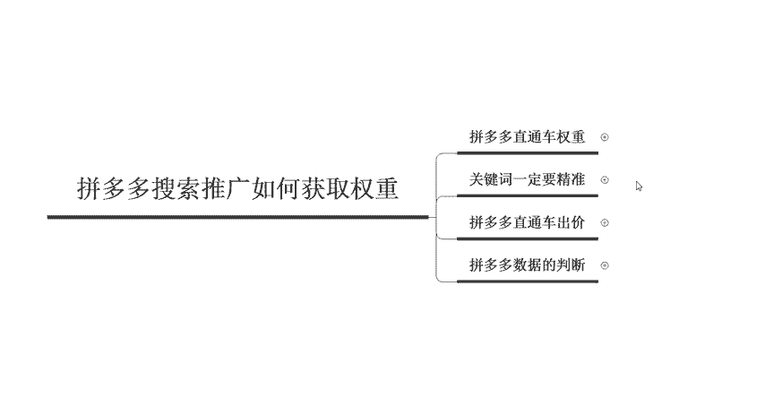

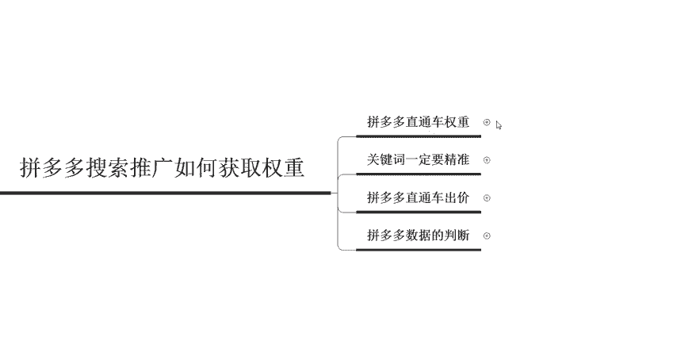

转化啊，有了成交之后才会有权重啊，所以说转化率也是需要控制的啊，那么第三个呢就是关键词整体的一个成交量，直接成交或者是间接成交啊，都是可以的。一般情况下。

我们都会把这些东西呢呃划分为我们呃关键词的一个质量分。质量分。如果是7到8分啊，有点击的词啊，那么也是可以的啊。然后整体的话啊，如果说你要做好这个拼多的直通车，那么有几个点大家需要注意的啊。

首先第一个呢就是关键词，你在选择关键词的时候呢，一定要选择的精准啊。因为这个里面呢呃比如说会有一些我们的一个成交词，或者是我们的属性词啊，二级是三级是分隔词。那这种不同关键词的一个分类呢。

也是对于拼多多来说是非常重要的啊。比如说成交词就相当于是我们包含转化的这些关键词，一般情况下都是二级的。

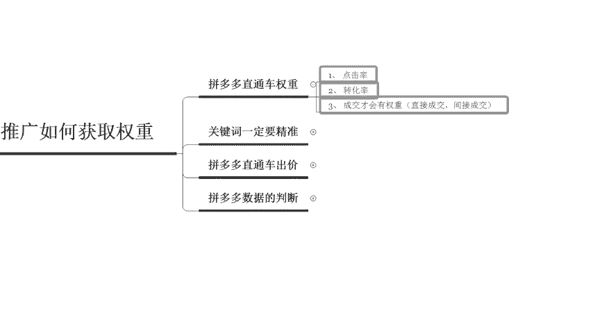

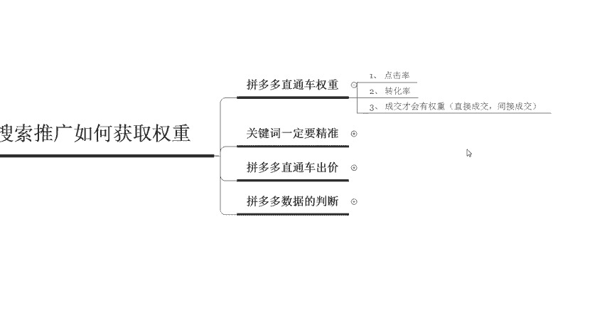

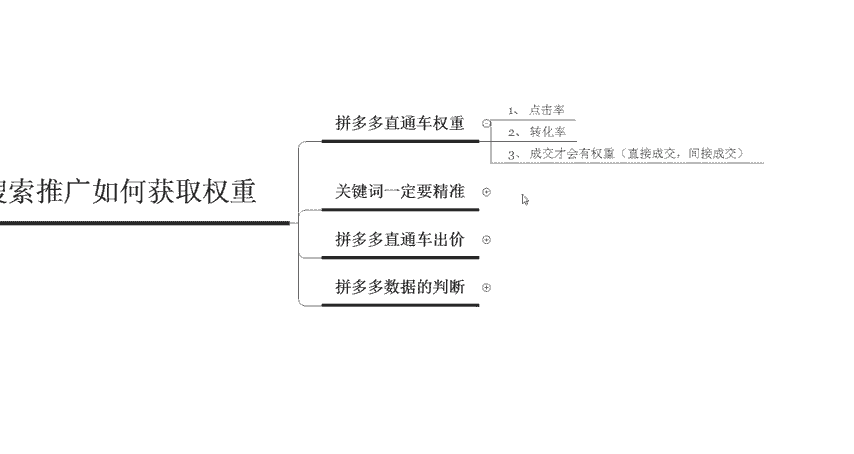

融合词啊，那么第第二个呢就是属性词，二级词，三级词，还有风格词啊，比如说呃韩版呀、欧欧美风啊、中国风啊，这种啊都是属于这个属性词呃，和这个风格词。然后第三个呢就是类目词啊，但是说类目词呢。

它的一个需求量比较大，但是不够精准。比如说女装或者大码女装呃，然后呢就是二级词和长尾词。二级词呢相对来说需求量比较大，也是相对来说比较精准的。所以说我们一般在开车的时候选择的都是二级关键词啊。

最后一个呢就是长尾关键词。财用长尾关键词选择5到8个就可以了。它的需求量可能会比较小，而且呢这个呃关键词呢是非常的精准的。所以说这个一般情况下，我们前期在转化的过程中都是使用长尾关键词来带动转化啊。

那么第四个呢就是关键词与宝贝本身的呃信息啊相关性，还有这个宝贝标题一定要达成高度的一致。在选择关键词。

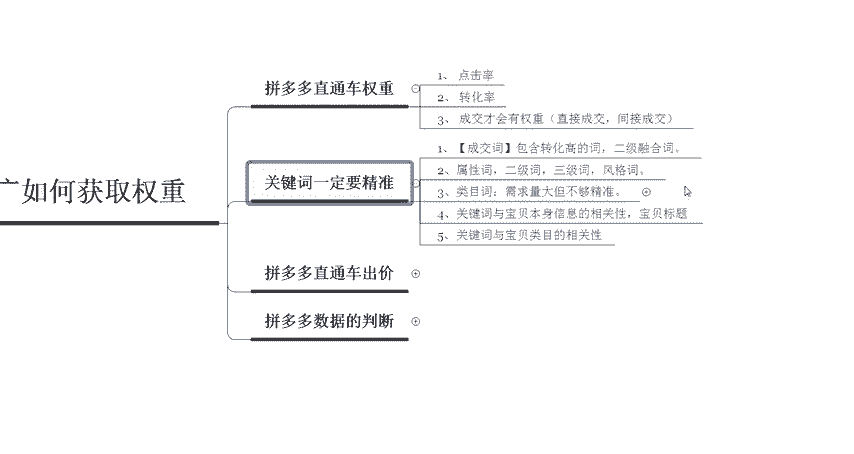

之后呃跟你的产品相似呃相符程度啊，是到底是应该怎么样来体现呢？主要就体现在宝贝的标题信息和直通车的一个推广内容信息上。就是说我们的创意啊，然后如果说你的关键词呢是在标题中用到了这个呃用到的啊。

然后呢在直通车推广标题里面也出现过，那么这个关键词呢，跟你的相关度就会非常的高。所以说这个呢就是关键词与这个呃宝贝本身的一个文本相关性。那最后一个呢就是宝贝的这个我们宝贝的一个类目和关键词的一个相关度。

因为在这个拼多多里面的类目是非常的多，而且它推荐流量的时候呢，都是按照呃类目来进行推荐的。所以说你发布的宝贝的类目呢和关键词优先的这个类目呢一定要一致啊，千万不要放错类目了。如果说你把这几个点学会啊。

这5个点学会了。那么啊对于这个拼多多直通车搜索推广这一块呢啊你基本上就没有太大的一个问题了啊，选词这边肯定是没有问题的啊，然后呢。

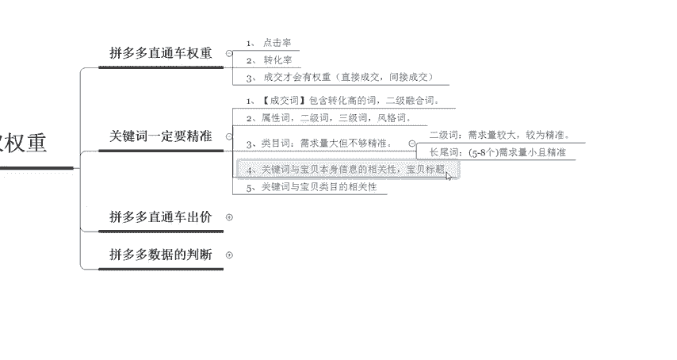

呃，其实呃在做好这个拼多多的时候呢，是不是说选好词就可以了呢？也并不是啊我们需要把对应的拼多多直通车的一个出价啊，其实在出价的时候呢，要根据于不同的一个关键词，有不同的一个出价啊。

我们这边呢是给大家分了几个类型啊，分了几个类型。首先呢就是呃第一个类型呢是这个二级的精准词，二级的精准词呢，我们是呃经常开，而且是最主流来进行使用的。所以说我们的一个出价呢，相对来说也是比较高的啊。

要抢到很高的一个排位获取很高的一个点击。但是说这种呢这种模式呢是比较费钱的。如果说你没有什么预算或者是小商家啊，我不太建议你这样去做啊。如果说你直接开一个女装。

那这样的一个关键词呢啊比如说大码女装或者是这个欧美女装，那这样的关键词呢，它点击量会非常的多。所以说你花到的钱也会非常的多。那第二种呢就是风格词和长尾词啊，风格词和长。

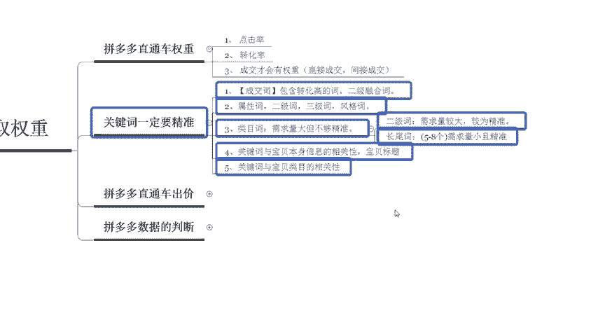

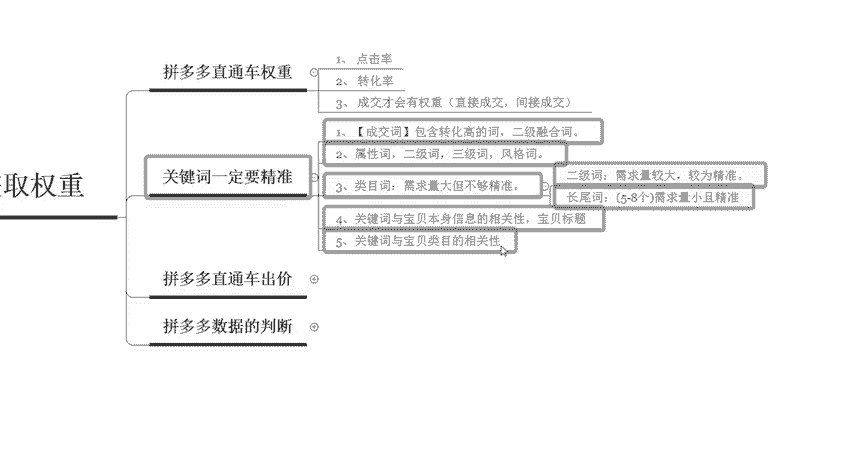

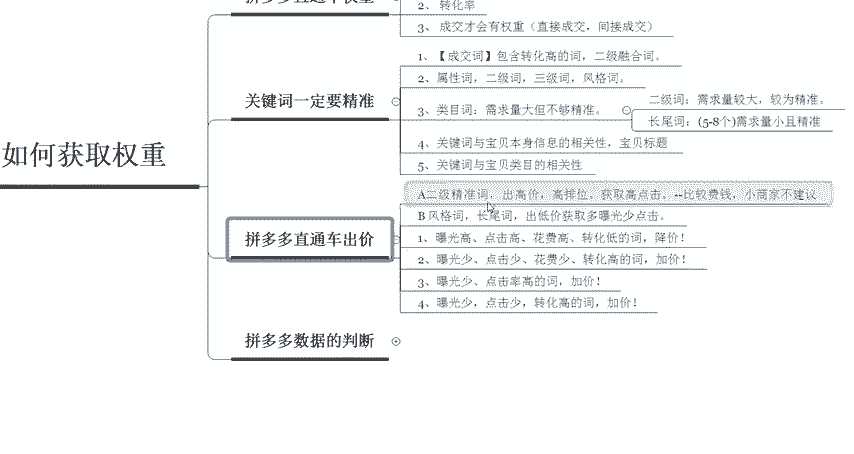

位词呢就是要开这个低价啊，因为消费者呢这个人群是比较精准的，他知道明确的知道他到底是需要什么样的一个产品啊，他需要什么样的一个风格。所以说我们可以以低价获得获取到的这个更多的一个曝光啊，曝光比较多。

但是说点击会比较少。那么我们具体在调价的时候呢，就是基于这以下的几个准则。如果说曝光比较高，那么点击也高，花费高，同时这种呢啊转化比较低的关键词，我们就去降价。如果说曝光比较少，点击量也比较少。

花费肯定也就少。但是转化率比较高的啊，就可以加价啊，这个两个呢是不同的一个阶段啊，不同的一个阶段。那第三个呢就是它的曝光量也很少。然后但是点击率非常高。那这样的情况下你可以加价。因为它点击率比较高。

消费者喜欢你可以加价，获取到更多的一个曝光量。那最后一个呢就是曝光少，但是点击也少啊，但是同时它的转化率比较高。那这样的关键词呢也是需要去加价的。

那么以上呢就是拼多多的这个直通车出价上面调价的一些呃基本的一些操作。

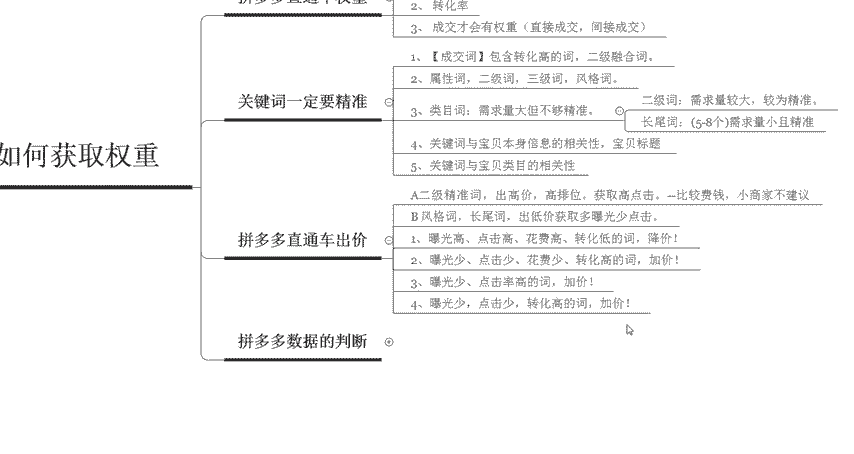

那么最后一个呢就是在我们日常操作过程中呢，并不是说你把车子啊放在那里就可以了。日常维护过程中，我们需要不断的去做数据的一个判断。所以说到时候呢大家需要制作独立的一个数据统计的一个表格。

然后看到啊这个投产高的，然后就加价啊，看到投产低的就去降价啊，这不是炒股啊，这个拼多多呢在开车的时候不是炒股啊，客单价高的产品呢观察周期一定要长啊，所以说不要不要这个在判断的时候呢。

不要以炒股的一个心态啊啊，我现在出价低了，然后整体的一个数据呢是慢慢开始上升的那这那你这个时候才去加价啊，不是这样的啊，当有了数据表现之后，你实时的就需要把价格给调整好啊。

那么以上呢啊可能讲的东西会比较多啊，那么以上呢就是我们在做拼多多搜索推广的时候，如何来获取权重的一些细节点啊，那么关于这一个点呢啊因为有很多的一些。

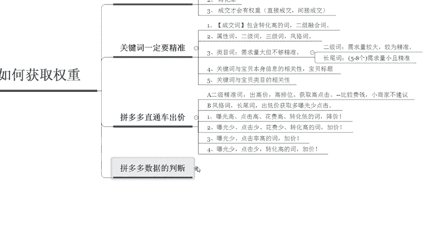

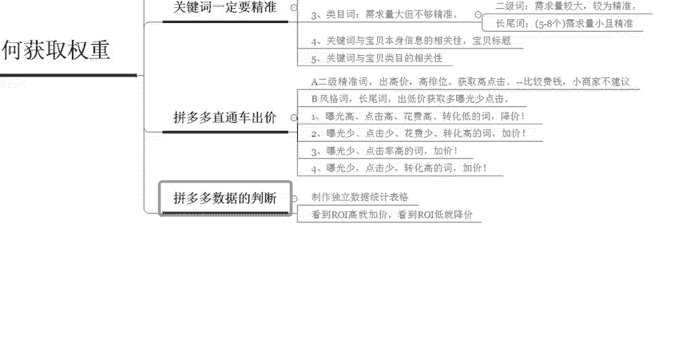

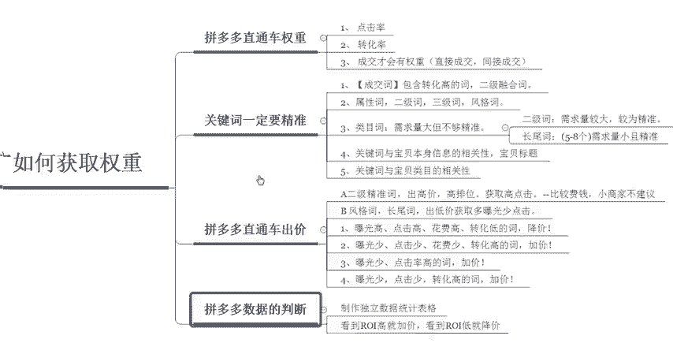

些专业的词语，那如果说大家不理解或者是不还是不知道怎么样去做的啊，那可以随时私信我啊，我定期呢也会在这个平台上呢去分享更多的一些拼多多干货的一个内容啊，包括给大家解决问题啊，可以直接在评论区啊。

给我留言也可以，我都会一一的去做回复啊。那么啊今天给大家分享的一个内容呢到这里就结束了，感谢大家的观看啊。最后告诉大家一个小秘密啊。你现在私信我的话，还可以领取这个拼多多搜索推广的一个福利大礼包哟啊。

然后呢感谢大家的观看啊，再见。

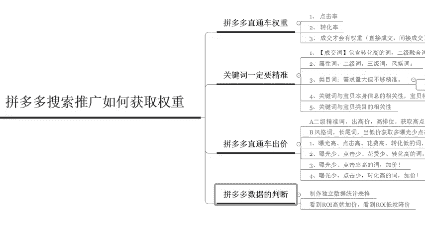

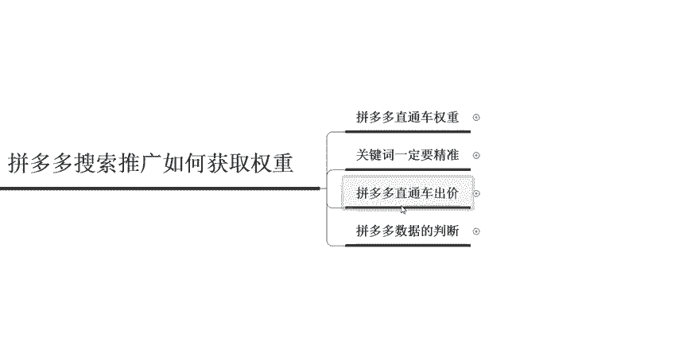

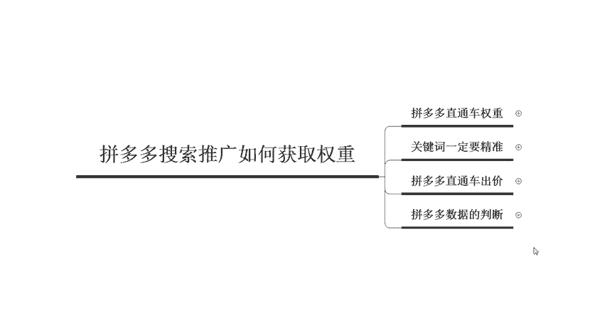