# 【拼多多运营实操教程】最系统的零基础拼多多开店教程全套，电商运营大佬专为学渣研制的新手开店保姆级教程！全程干货，简单粗暴 - P31：31、拼多多开店-搜索推广规则 - -拼多多开店 - BV1BH1qYpEqw

hello，各位朋友们，大家好啊，首先欢迎大家来到我的拼多多系列课堂啊。前段时间呢有很多的朋友留言给我说啊，老师不知道怎么样去拼多多里面开车。那开车呢呃还不知道应该怎么样去操作啊，老师开不好啊。

那么今天呢就由我巨皇教育的西楼老师带大家认识一下拼多多的基础搜索推广。那么首先我们先来了解一下拼多多搜索推广里面的排名到底是以一个什么样的表现形式来进行排名的。首先在拼多多里面呢。

我们综合的排名等于关键词的一个出价乘以关键词的质量得分啊，也就是说在拼多多里面你出的价格越高。那么你的排名也就会越靠前。

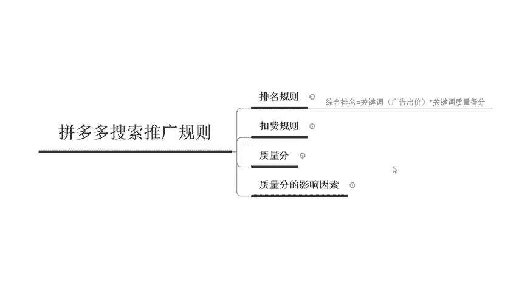

啊，具体表现的位置呢，你们可以打开拼多多的商家后台，然后找到对应开车的一个位置。那么可以看到呃市场平均的一个出价是多少啊，那么在这边呢可以直接点击，然后调整一个呃自定义的一个出价啊。

因为现在这个拼多多呢也为了呃有更加精确的一个操作。所以说呃有了这个精确匹配的一个溢价。那么大家一般情况下都是开30%。

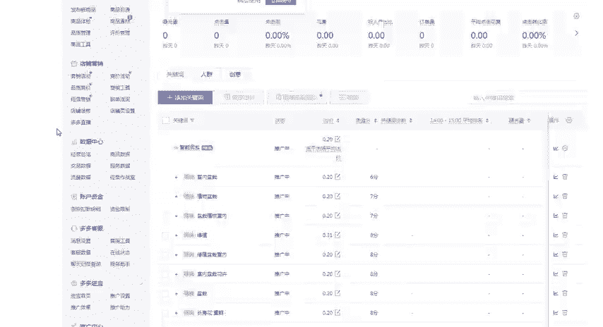

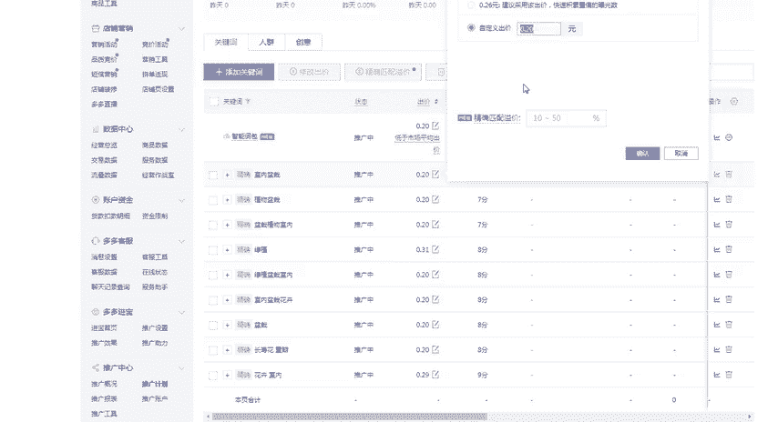

好，那么这个呢就是我们在啊拼多多里面怎么样来看这个出价啊，那么第二个呢啊要让大家了解的是拼多多搜索推广里面的扣费规则。

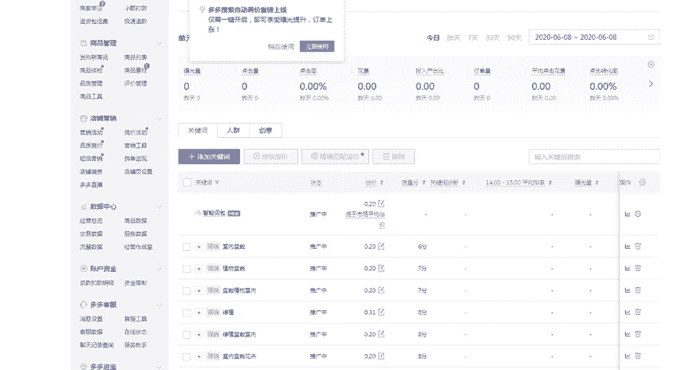

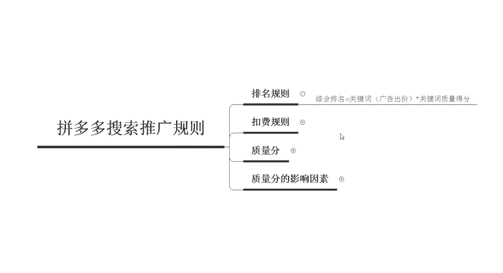

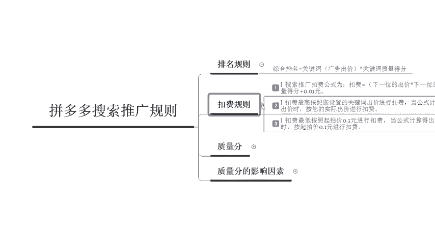

呃，扣费规则呢主要有3个啊主要有3个。第一个呢是搜索推广的扣费公式是啊下一位的出价乘以下一位的质量得分，然后再除以你自己的一个质量得分，加上一分钱啊，也就是说下一位的出价乘以下一位的质量得分是什么呢？

是等于它的排名，也就是说它的排名，然后除以你的质量得分，对吧？排名，然后除以这个质量得分，得出来，就是我们自己的一个广告位的一个出价，但是说如果说你的出价跟同行的是一样的。

那么你能不能排名比它排到更靠前的一个位置呢啊，很显然是不行的。所以说最后面需要加一分钱啊，加完这一分钱，那么你的排名呢，就可以比它更高啊，就可以比它更高。那么同样啊扣费的时候呢。

是按照您设置的这个关键词的出价进行扣费的啊。如果说你的公式计算得出的金额是呃大于你的一个出价的啊，那么是按照实际的一个出价来进行扣费啊。那么第三个扣费规则呢是扣费最。第一是按照起拍价啊，0。

1元来进行扣费的啊，如果说你的公式得出的一个金额呢是小于这个0。1元的啊，那么按照0。1起拍的一个价格，0。1元来进行扣费。啊，这就是说为什么呃，在最开始的时候啊，有一些人在开车的时候呢。

他很容易可以把这个排名做到呃，0。0。0。09，也就是几分钱就可以做一个点击。但是现在来说呃，已经不太现实了。因为拼多多系统的一个规则呢，把这个扣费的一个规则呢已经做了一定的调整。

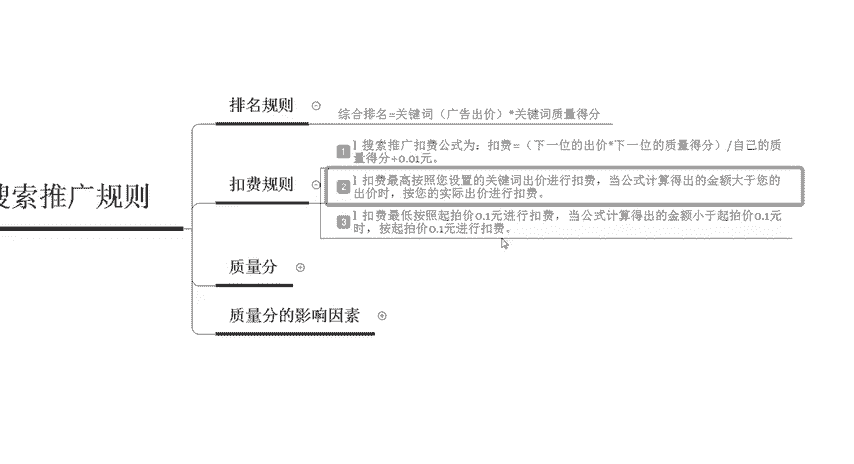

比如在很早的时候啊，我们开车可以做到这样的数据啊，点击的一个单价呢可以是9分钱或者是8分钱啊。那么现在呢目前为止啊，最低的一个点击单价呢也就是一毛钱了啊。因为这个是平台的一个修改啊，平台的一个修改。

好啊，那么第三个要带大家认识的呢是质量分啊，是质量分啊。

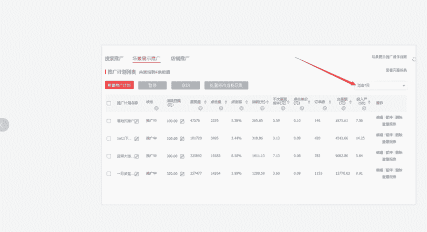

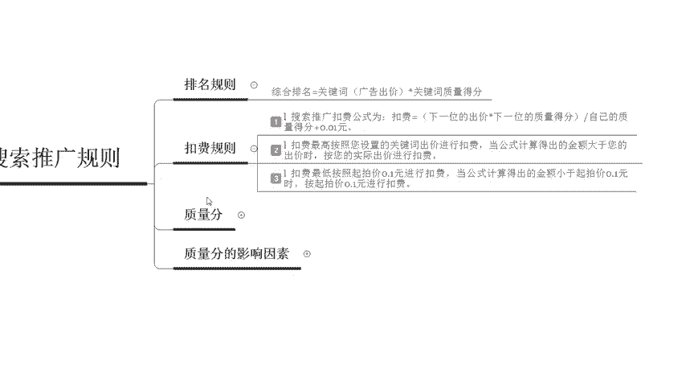

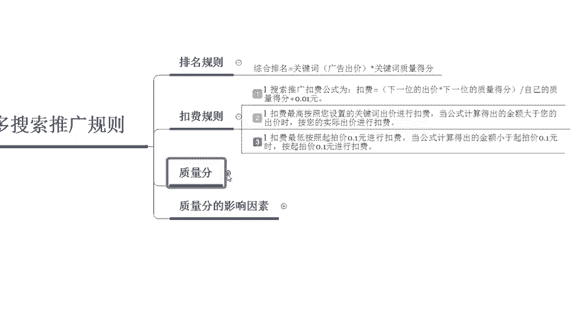

质量分呢，它其实是在搜索推广中衡量这个关键词和商品的推广信息，以及拼多多用户的一个搜索意向相关性的一个综合指标啊。怎么来理解呢？大家可以简单的把它理解为是一个权重的一个计算得分就可以了。啊。

因为这个东西呢最呃它是以这个十分制的一个形式来进行呈现的。如果你的分值越高，那么说明你可以获取到更多的流量啊，权重和排名也就越高。那么到底有哪些因素会影响到我们的质量分的一个高低呢啊。

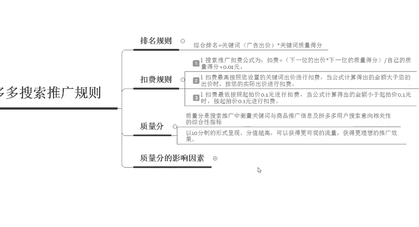

主要有三个点。第一个呢是关键词的一个相关性啊，相关性呢是指的是文本相关性。也就是说你的关键词和你商品里面的标题如果是相符的。那么ok啊，你的质量分就会变得更高啊，最起码在相关性这一栏啊，它会变得更高。

那么第二个呢是类目相关性。这也就是说为什么我们在发布宝贝的时候，一定要选择对对应的一个类目啊，如果你的商品的类目跟你关键词的一个类目是不一致的。那么你的质量分就会非常的差啊。

那么第三个呢是推广商品的一个质量。这就是说我们单品的啊点击率转化率啊以及销量等等都会影响到呃质量分的一个高低好，那么以上呢就是我们对于拼多多搜索推广的一些基础的规则，那么下一节课呢，我也会给大家呃继续。

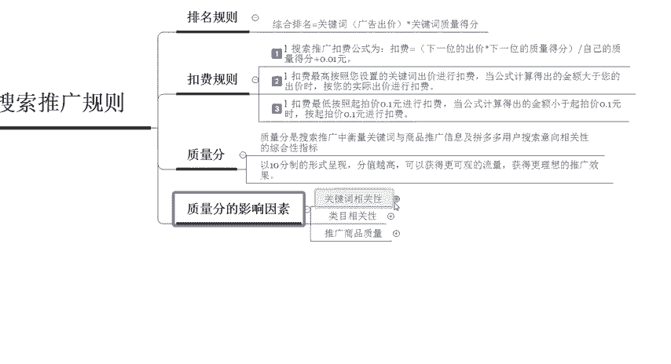

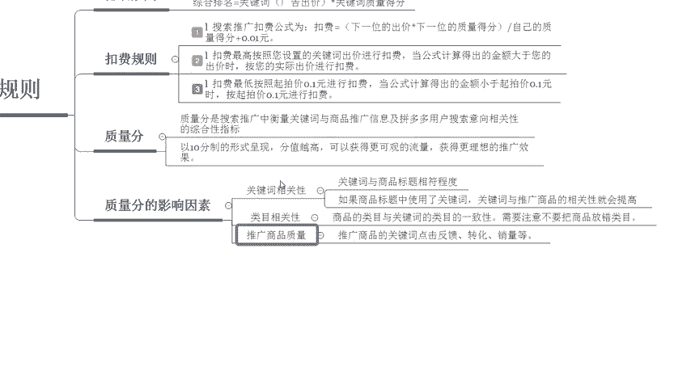

呃，分享一些更深入的一些内容啊，包括我也会定期的啊更新更多的一些拼多多干货内容。那么大家可以私信我啊，可以领取一些福利大礼包。

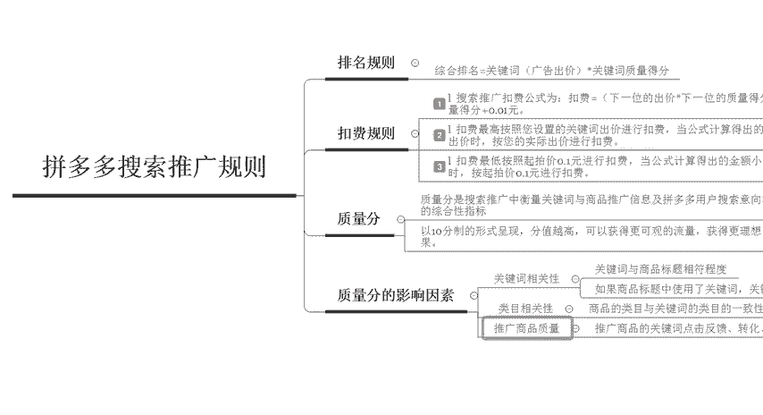