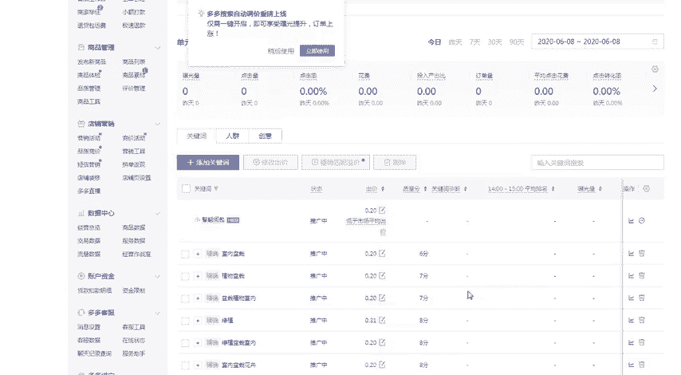
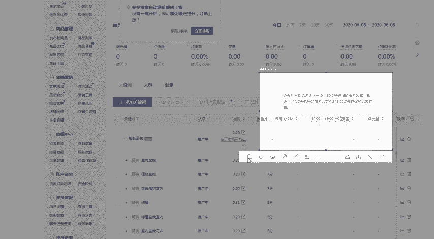
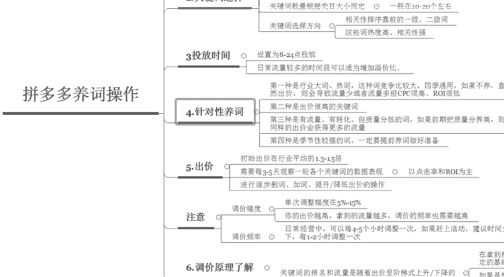

# 【拼多多运营实操教程】最系统的零基础拼多多开店教程全套，电商运营大佬专为学渣研制的新手开店保姆级教程！全程干货，简单粗暴 - P32：32、拼多多开店-养词操作 - -拼多多开店 - BV1BH1qYpEqw

hello，各位小伙伴们，大家好。首先欢迎大家来到我的拼多多系列课堂。呃，前几节课呢已经给大家讲解过了拼多多的一些呃搜索推广的基础规则。那么今天这节课呢。给大家分享的是拼多多的养殖操作啊。

那么接下来就由我巨黄教育的希罗老师带大家来认识一下啊，如何给拼多多的关键词来进行养殖。那么首先第一个呢是要注意在养殖的时候呢，一定要选择好对应的一个时间节点。这个时间节点呢。呃。

有很大一部分人呢往往都容易忽略啊。所以说我们在呃商品销售旺季到来之前的1到2个月左右，就必须要开始进行养殖了。因为养殖是需要有一段的时间的啊，并不是说你开始养了之后，它直接就可以上十分啊。

因为在提前开始操作呢，整体行业的竞争会比较小，出价来说也比较低，所以说我们的成本会呃可以控制的很好。那么第二个呢是关键词上面的一些选择呃，在选词的时候呢。

首先你要确保你的产品呢测图测款以测图测款的这个阶段呢已经结束。那么从测图测款。阶段累积的一些点击率比较高的关键词开始起步，逐步的往里面去添加入更多的关键词。那么第四呃第三小步呢是关键词的一个数量呢。

是需要根据类目的大小而定的。如果说你的呃类目比较大的话，那么你可以多选一些词。如果说你的类目比较小的话，那么你能使用的关键词大概也就是5到10个。所以在选择关键词的时候。

我建议你们选择10个到20个左右的关键词就可以了。那第三个呢呃第四个呢是关键词的一个选择的方向。啊，我们选择的关键词呢相关性的一个排序尽量的靠前啊，然后这个一级词或者二级词会比较好一些。

因为这些词的热度比较高，相关性也会比较强。那么第三个啊板块呢，我们要分析的是投放的时间。呃，选择投放的一个时间呢呃选择为早上的8点到晚上的24点去进行投放。日常的流量比较多的时间段呢。

可以适当的增加溢价比。比如说我们在晚上的呃6点到晚上的9点之间。这一段时间呢啊浏览量是最高的，那么我们可以把溢价调高一些啊调高一些。那么第四个板块呢是针对性的来进行养磁啊，也就是说第一种呢。

我们优先选择的是行业的大词和热词。这种词呢竞争比较大，4G比较通用啊。如果说不养的话，直接贸然的去出价可能会导致我们的流量获取到的流量比较少，或者是流量多，但是CPC比较高啊，ROI比较低。好。

那么第四种我们选择的关键词呢是季节性比较强的词，一定要提前做好养殖的一个准备啊，比如说现在已经夏季了，那么我们提前要养的词呢就是秋季的产品了。好，那么第五个板块我们讲出价啊。

每一个关键词呢到底应该怎么样去进行出价？那么我们初始的出价呢一般都在行业平均的1。3倍到1。5倍啊，但是出价完成之后呢，需要每隔3到5天观察一轮关各个关键词的一个数据表现，然后来进行调价啊。

调价的时候呢，需要进行逐步的一些三词加词或者是呃提高出价或者是降低出价的一些一系列的一个操作啊。那么我们在观察数据的时候呢，主要以关键词的点击率和投产为主啊和投产为主。但是说有一个点大家需要注意一下。

就是在出价或者调价的一个过程中，我们调价的一个幅度和调价的频率。调价的幅度呢，单次调价的幅度啊，尽量控制在5%到15%左右，也就是说你出价如果说是1块钱。那么你调整的一个价格呢。

大概在5分到一毛钱左右啊，5分到一毛钱左右。那么如果说你的出价越高，你拿到的流量也就越多，调价的频率也需要越高啊，那么。第二个啊，评调价的一个频率到底应该怎么样来控制呢？在日常经营的过程中啊。

可以每到每隔4到5个小时来调整一次。如果说我们已经上了活动啊，那么你建议你的时间呢啊在你允许的情况下，平均每1到2个小时就可以调整一次啊。在后台里面呢这个排名的一个呃刷新时间呢是一个小时刷新一次。

所以说大家整点去进行调啊调整就可以了。

好，那么最后一个呢我要给大家讲呃分析的呢是这个调价的原理啊，大家来了解一下。因为关键词的一个排名和流量呢都是随着出价啊，然后乘这个阶梯式的上升或者是下降的。所以说啊大家一定要了解清楚啊。

为什么要这样去调价啊，在拿到相对满意的流量之后呢，我们慢慢的小幅度降价去进行调整。也就是说我们的排名可以直接卡在呃前三或者是排名第一啊。

如果说你一旦卡好这个位置之后在直到我们达到了对应的一个流量保持相对稳定的基础上，那么出价最低的一个目的啊，这就是我们需要所需要达到的啊，那么呃如果大家是想要一次性的增大流量。

那就需要先大幅度的去调高出价，这也就是常说的啊上下坡法啊来进行调价。那么以上呢就是我们关于拼多多啊，如何来进行。养持的一系列的操作啊，那么大家有没有学到呢？啊，我会定期的啊分享更多的一个干货内容。

大家可以私信我啊，领取福利大礼包。

