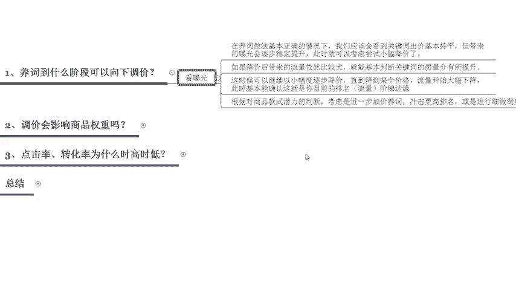

# 【拼多多运营实操教程】最系统的零基础拼多多开店教程全套，电商运营大佬专为学渣研制的新手开店保姆级教程！全程干货，简单粗暴 - P33：33、拼多多开店-搜索推广托价技巧 - -拼多多开店 - BV1BH1qYpEqw

hello，各位小伙伴们，大家好。首先欢迎大家来到我的拼多多系列课堂啊。那么前段时间呢有很多的同学私信我啊，说老师呃我的拼多多的这个搜索推广呢已经开的非常好了。但是说我的PPC一直降不下来啊。

然后容易翻车，那么今天呢就由我巨黄教育的西罗老师带大家认识一下拼多多搜索推广的一些脱价技巧啊，那么首先我们要解决的问题呢？啊，主要有3个，第一个养殖到什么阶段可以向下去进行调价。

那么第二个呢是调价会不会影响我们商品整体的一个权重。那么第三个呢是点击率和转化率，为什么在操作的时候会时高时低。那么最后呢是一个总结啊，那么我们先来看第一个点，延养殖到什么样的一个阶段可以向下调价呢？

这也是很多的同学在困惑的一个点啊，其实呢在操作的时候啊，主要是看你的一个呃开车的一个曝光。

当你的曝光量达到一定的数值的时候，那么你就可以开始向下调价了。

在养殖的一个做法呢，基本正确的情况下，我们就会看到关键词的一个出价会基本的持平。但是呢带来的一个曝光量呢，它会逐步稳定的提升。比如说你在开车的时候，你出两毛钱。那么你的这个曝光量呢第一天可能是100。

第二天可能是500，第三天有可能就是1500。所以说它那个曝光量呢会逐步的提升。那么这个时候啊，那么我们就可以考虑尝试小幅度的降价了。那么第二个点，如果在操作的时候呢。

我们降价带来的一个流量依然是比较大的。比如我们原先呢预期的就可以呃每一个关键词呢带到啊1000左右的一个曝光就可以了啊，但是我们现在呢已经达到了2000至3000的一个曝光。

如果我们调低了一毛钱或者是5分钱之后，那么我们的带来的流量呢依旧是在1000至上的，那么我们基本就可以判断这个关键词的质量分呢是有所提升的。那么这个时候呢，我们可以继续啊以小幅度。来逐步去进行降价。

那么直到降到某个价格，流量开始大幅度下降的时候，那么这个时候就可以判断，所这就是你目前最合适的一个啊排名阶梯的边缘。比如你原先在排名第一名。那么你降价了之后呢，跑到了第四名。这样的情况下呢。

你的流量就会下滑的比较多。所以说那么我们在操作的时候呢，需要根据对商品的呃款式潜力的一些判断，考虑是不是需要进行下一步的一个加价，养殖，以冲击更高的排名，或者是进行啊细微的一些调整啊。

维持在目前的一个排名上。那么这个呢是需要我们自己来去进行判断的啊，那这个呢就是养殖到什么样的一个阶段可以向下去进行调价的一个技巧。那么第二个呢是调价啊，有很多的人在问啊，调价会不会影响我们商品的权重啊。

但其实不会啊调价本身呢对于商品的权重是没有任何直接的一个影响的。

它影响到的呢大幅度的一个调价呢可能会对产品的排名或者是曝光造成比较大的一个影响。从而间接影响到产品的质量分和产品的权重。所以说建议你调价的时候呢，调价的幅度只要不是过大。

那么基本上不会影响到你单品的一个权重的。那么第三个点呢是点击率和转化率为什么会时高时低。有的时候点击率呢非常的高，有的时候点击率非常的低，这个呢也是属于一个很正常的一个情况。

那么在大家投放的一个基数比较小的一个情况下，排名会比较比较低。那么我们商品的数据变化呢比较大是正常的。如果说你的商品啊商品的这个每天的点击量可以维持稳定在1000个之上。

那么相关的数据呢就会逐步的稳定下来。所以说开车也是要看对应的数据量的，必须要在绝对的数据支撑下面，然后才可以啊判断这一个产品到底是好是坏啊，那么最后呢。

总结啊，出价和排名呢永远是一个动态变化的一个课程啊，不仅你的商品的数据在变。那么你的竞争对手，出价的一些数据啊，乃至于整个行业的整体流量也是在不断变化的。所以说我们在操作车子的过程中。

我们需要根据每天的变化，不断的去调整出价优化商品才可以获取到稳定提升的表现。那么以上呢就是关于啊如何在选择这个拼多多啊搜索推广的一些啊托价要注意的一些地方。那么你们大家学到了吗？啊。

那么我也会定期更新分享更多的一些干货内容。那么呃大家如果有任何的疑虑都可以直接私信我，那么私信我呢也有对应的福利大礼包领取哦。

