# 【拼多多运营实操教程】最系统的零基础拼多多开店教程全套，电商运营大佬专为学渣研制的新手开店保姆级教程！全程干货，简单粗暴 - P34：34、拼多多开店-质量分细化规则 - -拼多多开店 - BV1BH1qYpEqw

hello，各位小伙伴们，大家好。首先欢迎大家来到我的拼多多系列课堂啊，那么前段时间呢我讲解了这个拼多多的一个质量分啊，或者是开车过程中啊，一定要先做质量分。但是说呃还是有很多小伙伴私信我啊。

不知道怎么样去呃分析拼多多的一个质量分。那么今天呢就由我呃巨黄教育的希罗老师带大家认识一下拼多多质量分的一个细化规则啊，那么有很多的小伙伴会纳闷，为什么说平台会有质量分的一个指标的考核呢。

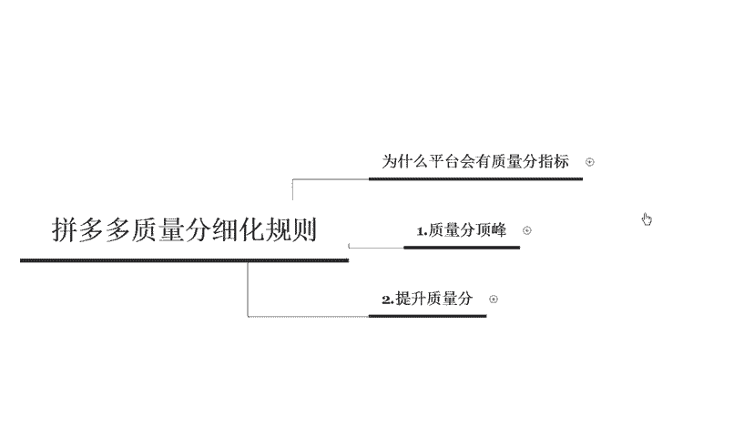

其实它的原因是多方面的啊，首先从消费者的角度来说啊，如果仅仅是按照这个出价来进行展示排名的话啊，那么消费者所看到的东西呢，很有可能被几家出价非常高的一些大佬垄断。因为比你有钱的人总是会存在的。

所以说他们会不断的去砸这个广告费。那么这样就会导致消费者呢，他会找不到自己想要的一个产品啊，不利于消费者的一个消费体验。啊，那这是从消费者的角度来说的啊，那么从平台的角度来说呢。

由于搜索推广呢是按照这个点击付费的，所以说曝光和展示它是不计费的。所以说当你商品的点击率很低的时候，意味着平台大量的一个曝光资源啊，会浪费掉啊，这肯定也是呃也不是这个平台所乐于见到的一个情况啊。

白白的给了你对应的一个广告位啊，但是说消费者呢嗯并不买账啊，并不会去购买你的产品，或者点击你的产品。

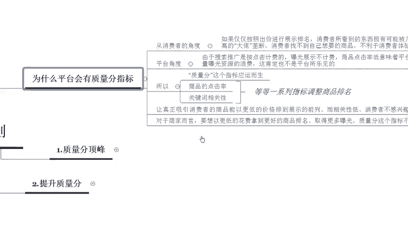

所以呢质量分这个指标就应运而生了啊，那质量分呢就关乎的是商品的一个点击率，还有关键词的一个相关性等等这一系列指标的一个调整啊，相当于是商品的一个综合排名。所以说啊质量分的一个存在呢。

是让真正的啊吸引到消费者的这些商品呢可以以更低的价格啊，展现到这个平台的这个前列。而相关性比较低的，或者消费者不感兴趣的商品呢，很难被硬推，直接把它硬推到这个啊非常靠前的一个位置啊。所以说对于商家来说。

想要以更低的一个花费拿到更好的一个商品排名，取得更多的一个曝光量。质量分啊，这个指标是大家啊永远不要忽视的一个地方。

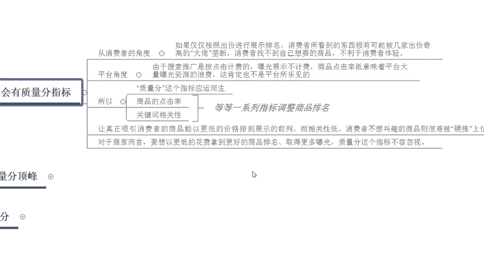

好，那么我们质量分啊，接下来呢就来了解一下质量分到底是一个什么样的一个形态啊。有很多的人都知道，在拼多多里面呢，质量分是以十分制的一个形式存在的。

那么质量分的顶峰仅仅只是有这个十分嘛啊但其实并不是其实十分之上呢还有一些隐藏分。那隐藏分都包含哪些东西呢，比如说我们关键词的点击率，还有关键词的一个啊相关性啊，以及投放的稳定程度啊。

还有整体的这个ROY啊，也就是投产啊，同样是十分的关键词出价也是一样的。但是说有一些商家它的排名就是高啊，有些呢就比较低。这是因为质量分只是说影响的因素呢有这个点击率啊，相关性还有稳定啊。

投放的这个稳定程度，还有ROY。但是关键词达到十分，只能说是入门了啊，后续还要在以上的这些维度啊，这四个维度里面进行进一步的一些优化。你点击率越高。那么你后期所获。

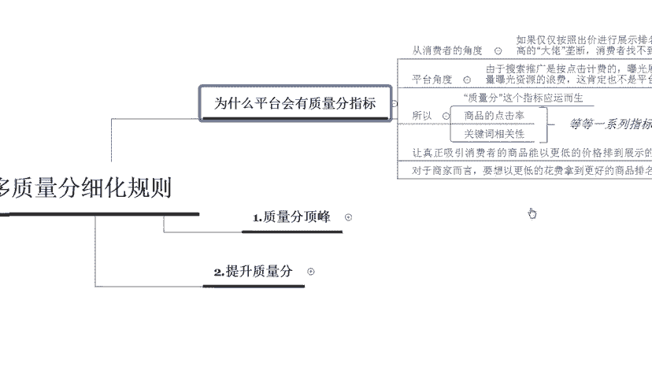

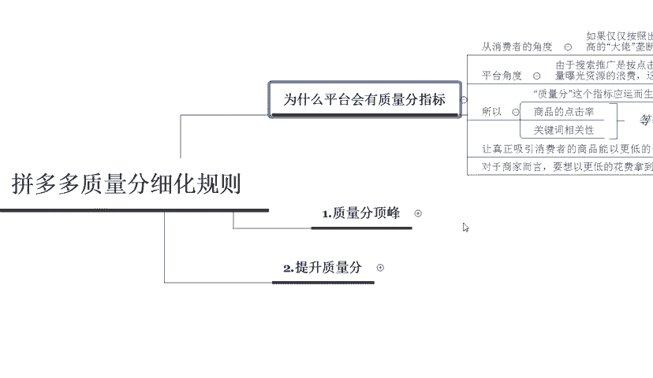

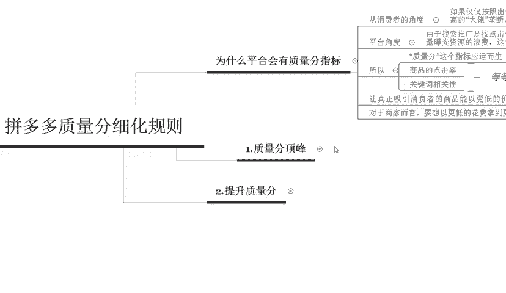

渠道的一个流量也就越多。

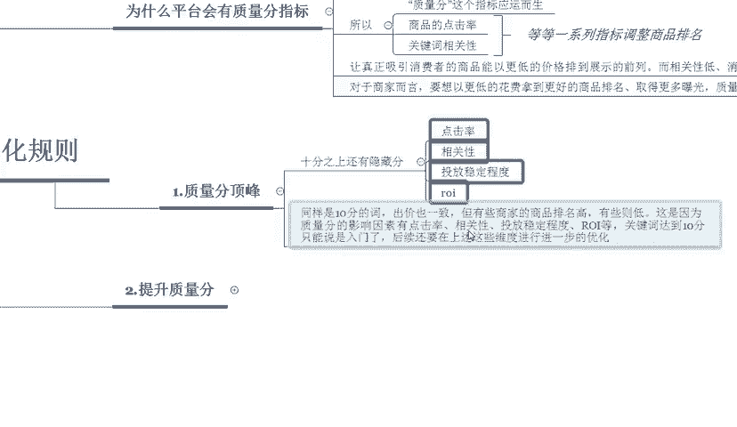

那么如何来提升我们的质量分呢？啊，在提升质量分的时候呢啊相关到的相关的一些东西呢会非常的多啊。所以呢这一节课呢啊可能就没有办法给大家完完整整的展示。那么大家可以持续关注我的一个课程，在下一节课啊。

我来给大家啊详细的分解一下拼多多到底应该怎么样提升质量分啊，而且呢我也会定期分享更多的一些其他干货的内容。比如说搜索推广啊，比如说主图的一些设计等等啊，那么私信我啊，并且啊留言给老师。

那么会有福利大礼包领取哦啊，大家快快来找我吧。

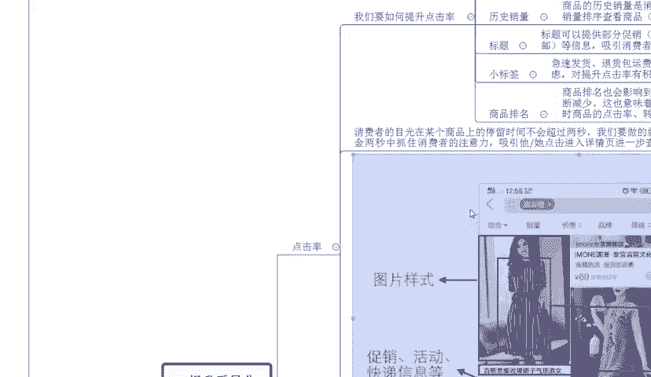

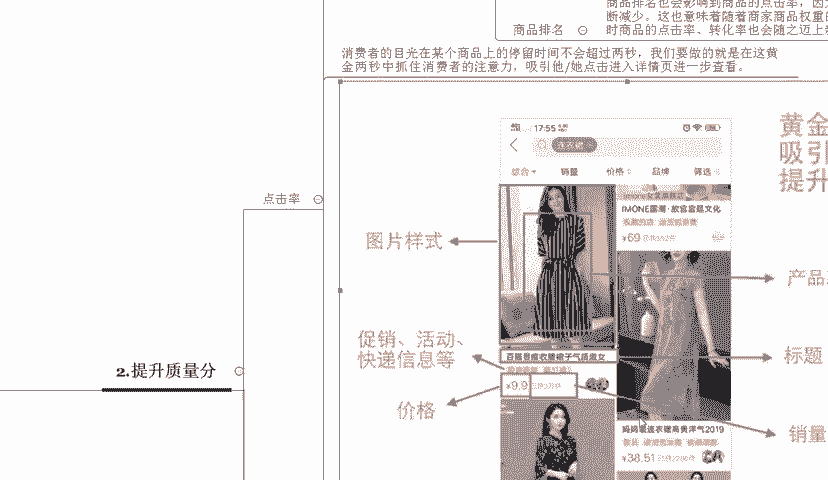

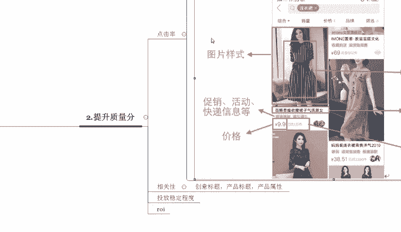

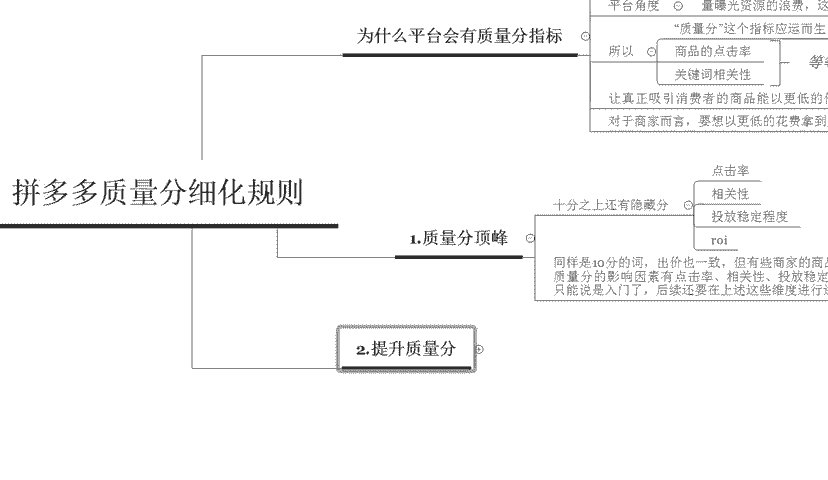