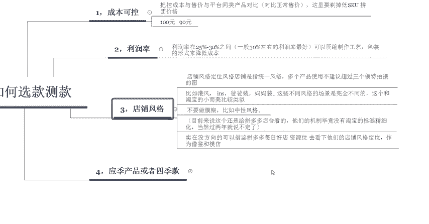
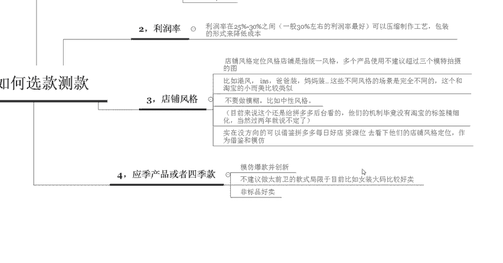

# 【拼多多运营实操教程】最系统的零基础拼多多开店教程全套，电商运营大佬专为学渣研制的新手开店保姆级教程！全程干货，简单粗暴 - P35：35、拼多多开店-如何选款测款 (2) - -拼多多开店 - BV1BH1qYpEqw

hello，各位小伙伴们，大家好啊，欢迎大家来到我的拼多多系列课堂啊，最近呢有很多的新手留言给我啊，说不知道如何来选款测款。

那么啊今天就有我巨黄教育的西楼老师来给大家啊带大家一起认识一下拼多多如何来选款和测款啊，那么首先这一节课程呢啊选款测款的四个要点啊，总共有4个要点啊，第一个是可控的一个成本。

第二个是需要找好我们对应的一个利润率。第三个是店铺风格上面的选择。那么第四个呢是啊选择产品的时候啊，需要找这个应记产品或者是呃四季款啊，那么首先我们先来认识一下啊，什么叫做成本可控。

在拼多多里面，我们需要把控成本与售价和呃平台同类商品的一些对比。比如说啊同行的这个价格呢卖29块钱，那么你的产品呢也需要卖29块钱。当然这里面要剔除掉一些低价SKU和拼团的一些价格。

因为这些价格呢都是用来啊引流的啊，所以说啊正常情况下，我们实际的一个售价呢，其实跟呃平台同行啊同类型产品呢，你最好是低于它的百分之呃低于它10%。也就是说同行卖100块钱。那么你需要控制在百分之呃。

你需要控制在这个90块钱。

因为如果你是一个新店，刚开始开始去操作的话，那么前期你的价格肯定要比它呃低出这么一点点的。那么第二个呢是我们需要控制对应的一个利润率啊，大部分的一个产品利润率呢，在25%到30%之间，一般情况下。

30%左右这个利润率是比较好的。那么我们可以通过压缩制作的一些工艺或者是包装的一些形式啊来降低我们的成本啊，其实有很多的拼多多里面啊，它的产产品呢都是属于残次品啊，就是说工厂呢有一些好的一些工厂呢。

它都会有个品控。比如说啊毛巾，那你在品控的时候呢，有一些呃好的毛巾呢呃就会直接被送走，然后去销售。像一些制作比较差的啊，可能就会被品控拦下。那么这一部分呢可能就需要返厂。但是说返厂的一个成本又比较高。

所以说这些产品呢就变成了滞销。那有其实在拼多多里面有很多的产品呢都是从这样来的。

然后第三个呢是店铺风格上面的一些选择。当然这个店铺风格里面包含的东西可能会比较多啊，所以说我详细的讲一下啊，在这个店铺风格定位的时候呢，我们一定要去找统一的一个风格啊。多个产品呢。

我不建议你们使用超过3个以上的模特。比如说你做女装啊，做女装呢尽量的选择同一个模特或者是两个模特，如果说超过三个以上，那就说明你的店铺里面可能就比较杂啊比较杂乱了啊。那么同样的在选择风格的时候啊。

像港风啊INS或者是爸爸装妈妈装这些不同风格的场景呢也是完全不一样的。所以说我们在操作的时候呢，啊可以参考这个淘宝小而美的店铺啊来进行操作啊，跟淘宝的小儿美也是比较类似的。那么在选择店铺风格的时候呢。

我建议大家也不要去做比较模糊或者是比较中性的一个风格。

比如说你的产品呢既可以卖给青年，又可以卖给中年啊，那么像这种产品呢，尽量的不要把它呃不要去做啊。目前来说这个呃我们选风格的时候呢，还是给这个拼多多后台看的。因为他们现在的这个机制，没有淘宝这个标签化。

那么精细。那淘宝呢它可以精确到每一个人啊，现在呢在拼多多里面，它顶多也就是给你精确到某一个类目啊。所以说如果你呃做的这种中性风格呢，它没有办法识别啊，他没有办法识别的。所以说如果你实在没有方向的话。

那么你也可以去借鉴啊拼多多的每日好店或者是资源位啊，然后去看一下他们店铺的一些风格和定位啊，作为借鉴和模仿的一个方向啊。那么第四个，我们在选择主推产品的时候，应该选择应地的产品或者是4G款啊。

你可以去模仿爆款并且创新。那么呃或者是啊找一些非标品，非标品在拼多多里面相。

对来说是比较好卖的啊，我不太建议你做太前卫的款式啊。因为现在拼多多里面前卫的款式是比较局限的，你卖什么维密的内衣，那肯定是啊卖不动的。因为它主要针对的人群呢是四五线的城市，他们没有那么时髦。

也没有那么前卫啊，比如说啊像这个女装啊，女装里面呢还是大码女装会比较好卖。

好，以上呢就是啊四个点啊，拼多多在操作的一个过程中如何来选款和测款啊，那么啊大家有没有学到呢？还还如果大家有任何不理解的地方啊，可以直接私信我啊，我也会定期的分享更多的一些干货内容啊。现在私信我。

有拼多多福利大礼包领取哦啊，感谢大家的观看，那么我们今天的课程呢到这里就结束啊，再见。

