# 【拼多多运营实操教程】最系统的零基础拼多多开店教程全套，电商运营大佬专为学渣研制的新手开店保姆级教程！全程干货，简单粗暴 - P36：36、拼多多开店-搜索推广如何提升质量分 - -拼多多开店 - BV1BH1qYpEqw

hello，各位小伙伴们，大家好啊，我是巨黄教育的西楼啊，那么欢迎大家来到我的拼多多系列课堂。那么上一节课呢给大家啊分析了质量分到底是一个有什么样的一个细则。我们在操作的时候都应该注意哪些点。

那么今天我们就带大家来认识一下拼多多搜索推广中如何提升质量分啊，那我们在开车的过程中呢，所有商品啊或者是所有的啊推广的关键词，重点所考核的指标呢，就是以下四个。第一个点击率，第二个相关性。

第三个是投放的稳定程度。第四个是投产啊，所以说那么我们现在来认识一下第一个点击率到底应该怎么样来提升啊，首先我们要知道哪些因素会影响到我们的点击率，影响点击率的一个因素会非常的多啊。

那么我们到底要如何提升我们的点击率呢啊，第一个首先从商品的主图上来看啊，商品的一个主图呢是展现展现面积。最大的一个要素也是对于点击影响最大的元素之一。啊。如果大家有进行过呃测试，那么在测试的时候呢。

一定要经过啊多角度的主图啊清除主图上的一些牛皮癣啊，努力的突出商品的一些卖点，然后来提升主图的一个质感。那么当你的主图做的足够好的时候，消费者自然就会买账，自然就会喜欢你的产品。

那么第二个呢是商品的款式啊，尤其是针对于一些服饰鞋包类。那商品的款式呢大部分呢啊都是通过这个呃消费者是否点击最终还是要取决于是否对于这款商品来感兴趣。所以说大家一定要提前去进行测款。

挑选点击率比较高的一些呃优良的啊比较有潜力的款式来进行操作。那么第三个会影响到点击率的一个因素呢，叫做价格。在拼多多里面商品的款式相差不多的情况下，价格的影响啊。价格是影响点击和转化的一个重要因素。

但是说有一些高价的产品也不是说没有机会。因为你对应的一个价格和价值。如果说有很高的一个性价比的话，消费者也还是会买账的啊，一定要让消费者觉得值得。那么第4个啊影响到我们点击率的一个因素呢。

叫做历史的一个销量啊，历史的销量呢是消费者非常关注的因素之一。因为在拼多多里面所针对的人群呢，大概都是呃四五千城市小城市和小镇的这些人啊会更多一些。所以说他们都会有一种比较盲目的一个从众心理。

当你的一个商品销量高了之后，他们自然而然就会喜欢。啊，那呃下一个呢是影响了我们点击率的一个因素呢是标题。在标题里面标题里面可以提供一些呃部分的一些呃促销信息啊。

比如说买赠或者是物流顺丰包邮等等信息来吸引消费者进行点击啊，那么再下一个呢是影响到呃点击率的因素叫做小标签。那这个小标签，比如说啊我们商品开通的一些服务极速退货啊，急速发货，还有这个退货包运费啊。

满减等等这些信息的小标签也能有效的吸引到消费者的一些啊注意打消消费者这个顾虑啊，那最后一个呢就是商品的一个排名。当你的商品排名更高的时候，那点击率自然也就会更高。首先先让这个消费者。

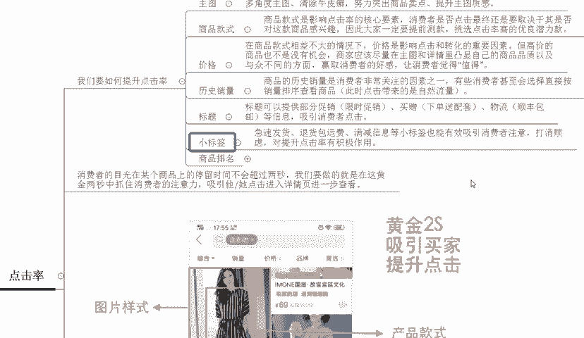

看到你的产品，他才会去进行点击。所以说消费者的目光呢在某个商品上面停留的时间呢不会超过2秒钟的一个时间。我们要做的就是在这2秒的黄金时间内抓住消费者的一个呃注意力吸引它。

并且让他点击我们的产品进入到我们的链接内啊一看啊，所以说啊大家可以看一下啊，整体的我们在拼多多里面搜索出来的一个结果呢就是现在的这张图，那它展示的一个效果呢啊最大的一个位置就是图片的一个样式。

我们的产品长的什么样子啊，然后呢产品的一个款式的一些展现。那么在下面呢就是标题啊。

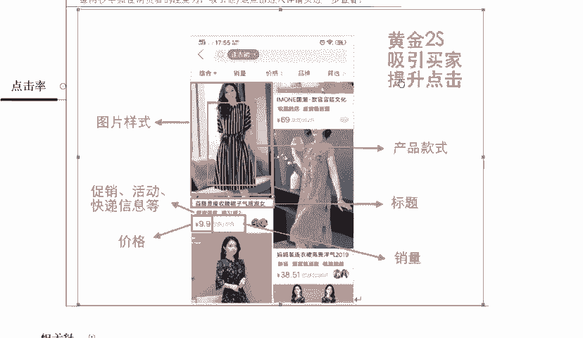

百搭显瘦啊，收腰裙子气质淑宁。那这个标题呢消费者也会看到啊也会看到。然后呢，再下面就是促销的信息活动，还有快递等等信息。那么再下面就是价格啊，最后一个就是销量啊等等这些因素啊都会展现在消费者面前。

所以说它会直接影响到我们商品的点击率。所以如果说你想要把点击率给做高。那么这几个点必须要全部做到位。

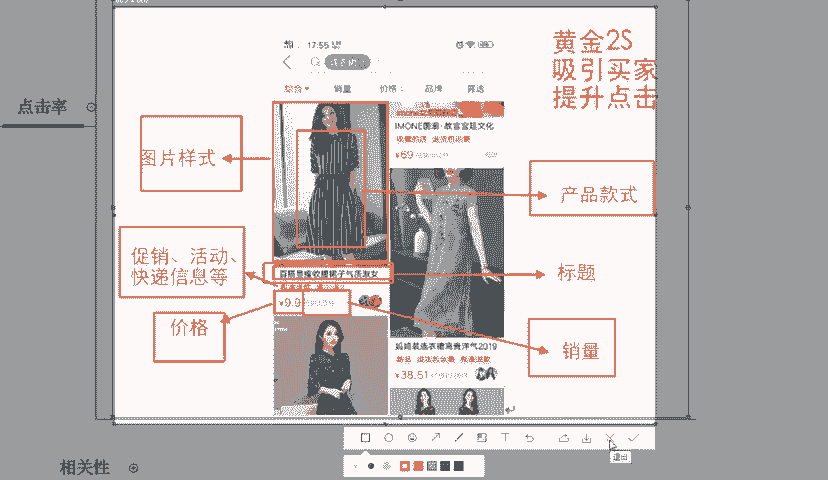

那么第二个提升质量分的一个因素呢，叫做文本的相关性。那这个文本相关性呢相对来说就比较简单一点了啊，通过我们在开车的时候的一些创意标题，产品标题，还有产品的属性。

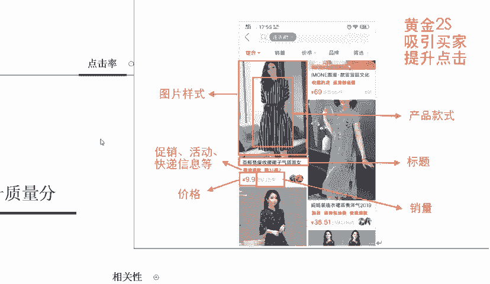

比如我们在开车的时候啊，大家直接来看后台。开车的时候呢，我们商品的一个分类啊，对应的一个类目啊，选对了类目之后呢，然后再写对应的一个标题。比如说我标题里面写了电动掏耳神器啊。

那么在我们的呃商品的一些规格里面啊，比如说我们的规格。

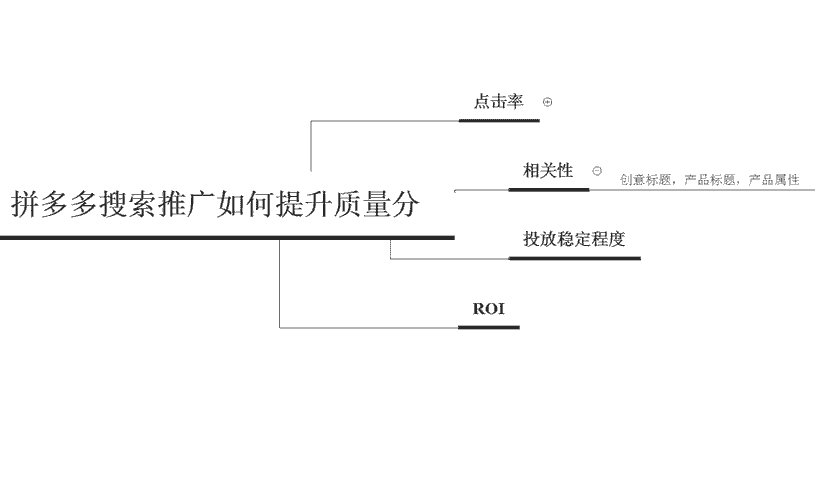

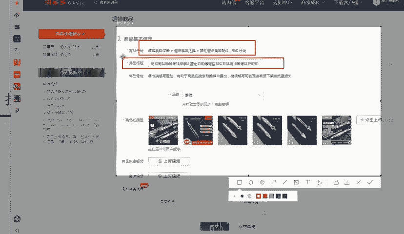

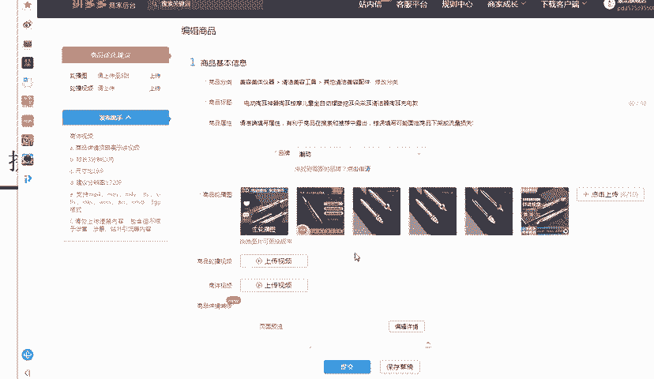

在规格里面呢写填写了对应的一个颜色，比如说玫瑰金啊，或者是星空黑。那么这种属性的这个产品啊，或者是这些关键词啊，关键字如果你在开车的过程中直接添加到这个呃搜索推广里面啊，我们点击这个推广计划。

在添加关键词的时候呢。

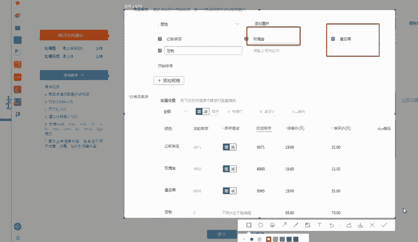

你就需要根据于产品的标题，还有属性来添加对应的关键词。这样的话它的质量分就会显得更高啊就会更高。好，我们大家来看一下。啊，我随便找了个产品啊，随便找了个产品啊，点击添加关键词啊，添加关键词之后呢啊。

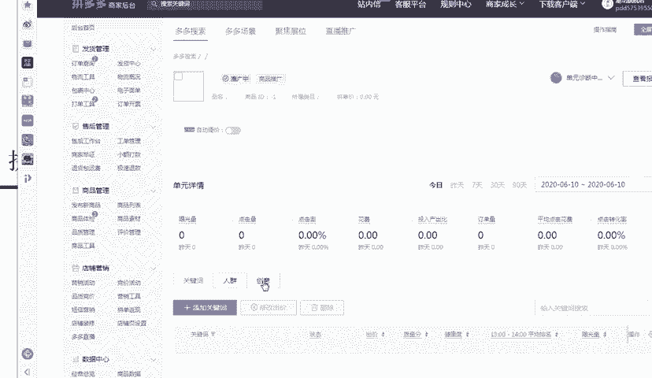

系统呢会给你推荐一些啊比较好用的一些关键词或者是拓展词。那么大家都可以在这里面去找。那么我们要挑选呢就是以这个关键词的相关性来进行排序啊，一定要找这种五格满格的。当你的这个相关性满格了之后。

我们的一个质量分也会变得越高。

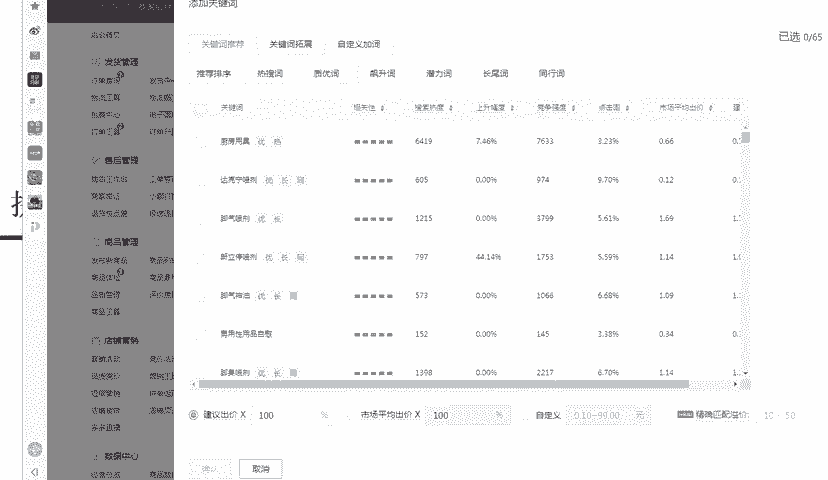

所以说这是这一个点大家也是一定要注意的。好，那么第三个会影响到我们质量分的一个因素呢，叫做投放的稳定程度。这个往往大部分的人都会比较忽略的一个点。就是说你在开车的过程中不能开了第一天，然后第二天停掉。

第三天再开，这样的情况下会影响到你的质量分啊，质量分它是一个长期的并且需要稳呃稳步的去获取的一些呃权重的一个东西。所以说千万不能中断啊，千万不能中断。每次中断的一个时间呢不要超过8个小时。

比如说你早凌晨的这个一点的时候还进行投放。那么你凌晨2点到7点的时候呢，可以选择不投放。那么这个是可以的啊，如果超过的这个时间太多，那么也就意味着你获取到的权重呢，可能就没有了啊。

因为在拼多多里面是每一天刷新一次权重啊。那最后一个这个影响质量分的一个因素呢，叫做ROI啊，就是在我们的呃后台啊所看到的投入产出比。当你的投入产出比越高的情况。

那么你所获取到的关键词的质量分也就会越高啊，因为对应的每一个关键词，它其实都有对应的一个呃投入产出比啊，或者是质量分的一个考核标准了。好，那么以上呢就是在拼多多搜索推广中。

如何提升质量分的啊几个相关的因素。那么现在大家到底有没有了解清楚呢？啊，如果说大家有任何不理解的地方啊，欢迎大家直接私信我啊，直接来找我啊。那么我也我也会定期的在这里分享更多的一些干货内容啊。

并且现在私信我，会有福利大礼包领取哦。

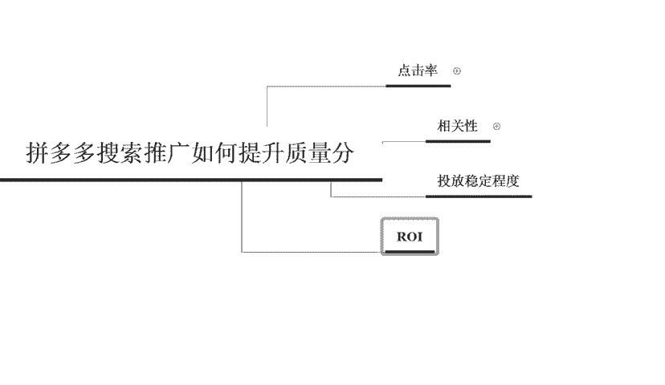