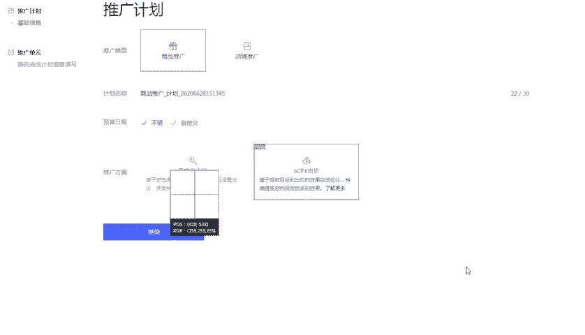
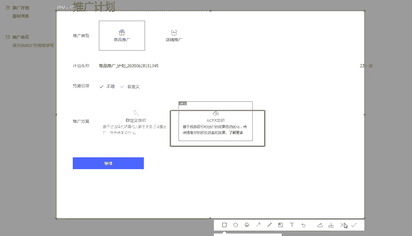
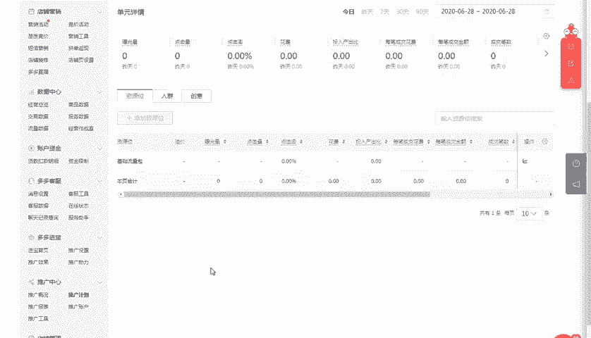
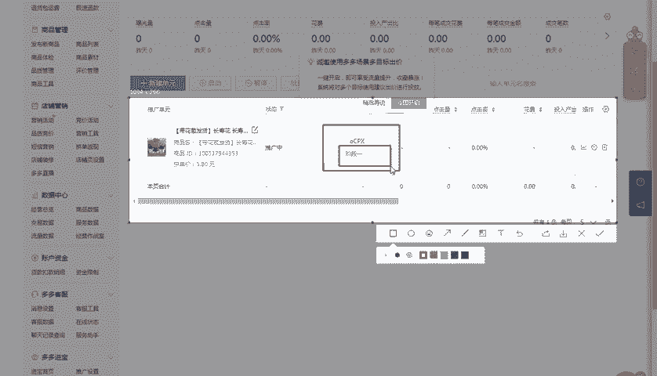
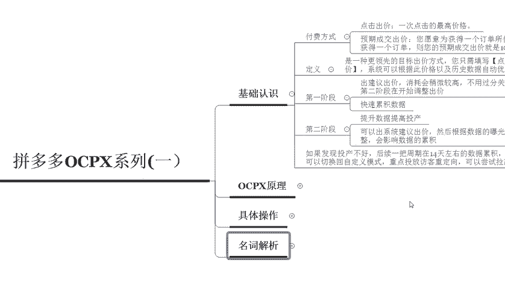

# 【拼多多运营实操教程】最系统的零基础拼多多开店教程全套，电商运营大佬专为学渣研制的新手开店保姆级教程！全程干货，简单粗暴 - P37：37、拼多多开店-ocpx系列（一） - -拼多多开店 - BV1BH1qYpEqw

电商无止径学海苦做舟。hello大家好，我是巨黄教育的西楼。那么欢迎大家来到我的拼多多系列干货分享的课堂。那么今天带给大家的一个内容是相对深入一些的啊拼多多OCP叉系列。呃。

今天呢我们先来呃讲这节呃这个整体的一个课程呢，我们分为四节。那么今天呢我们先来了解一下基础的这个OC叉啊，到底是一个什么样的东西啊，所以说我们先来做一个基础的认识。

其实呢它就是针对于拼多多的一个场景推广。当我们打开拼多多的后台之后呢，你会发现嗯在拼多多的这个智能推广计划里面呢，有不同的一个出价方式啊，一种呢是普通的一个出价。

一种呢就是啊这个OCP叉的这样的一个出价方式。所以说它其实本质上呢还是属于这个场景推广中的一种。那么我们在打开后台之后，可以看到对应的。比如说我们点击呃推广计划，点击推广计划。当你新建计划的时候啊。

新建这个多多场景计划的时候，它有两种不同的一个推广方式啊，就像我们现在所看到的这样，我们点击多多场景。然后点击新建计划，在新建计划的一个过程中，这边会显示推广方案中，会让你选择啊OCP叉的一个出价。

所以说这个呢就是它具体的一个展现位置。那么我们先来了解一下这个呃出价的一个方式呢，对于我们来说，到底可以给我们带来一个什么样的效果啊，首先呢它的一个付费方式呢。

跟我们呃日常的一个多多推广的付费方式是不太一样的啊，它是按照点击来进行出价的，每一次点击呢，它是按照这个呃一次点击的最高价格来进行设置的。比如说我们预期的一个呃我们在设置的时候呢。

它是会有对应的一个预期成交成交的一个出价啊，比如说你愿意为一个获取一个订单所付出的一个推广花费到底是多少钱。比如说你愿意花10块钱，然后获得一个订单，那么预期成交的一个出价呢，就设置为10块就可以了。

所以说在使用这样的一个方式的时候呢，可以很快速的啊或者是很。

直接的把我们的预期投产可以控制的非常的好。那么第二个呢是我们先来了解一下这个OCP叉它的一个呃定义啊，它其实呢是一种更加领先的一个目标出价的方式。目前呢是呃只需要填写好这个点击出价。

还有预期成交的一个出价就可以了啊。然后系统会根据这个出价的一个价格，还有历史数据的一个呃历史的这个数据来自动进行优化触达率更高的这个转化率的一些人群。所以说这个工具呢是非常的好用的。

那么我们在操作的一个过程呢，它是分为两个阶段的啊，就像我们比如说创建了计划之后呢，它会有对应的两个阶段。第一个阶段呢，它属于这个呃普通的一个阶段啊，就是说我们直接出一个建议的出价就可以了。

就这个呃这个跟我们日常在开车的时候是一样的啊，比如我们日常开车的时候需要先进行测图测款啊，那么同时我们在开这个OCP叉的时候也是一样的啊，出价的时候，第一阶段我们先选择建议出价。

消耗呢可能会稍微更高一些啊，但是呢这个部分呢，你不需要过分的去关注于投产，让流量升起来之后呢，然后达到第二阶段之后才开始调整出价。所以说第一阶段我们所需要达到的一个目的呢，就是为了快速的累积数据。

那么一旦进入到第二个阶段之后，我们就可以不断的去优化投产了。所以说我们在第二阶段主要的一个目的呢，就是提升数据提高我们的一个投产。可以在出呃，我们在出价的一个过程中呢，可以使用系统建议的一个出价。

然后呢，根据数据的曝光，还有它的一个呃具体的一些数据调整啊，就OK了啊。但是这个在操作的过程中呢，你不要频繁的去调整，会影响数据的一个累积。在开这个计划的时候呢。数据的累积是非常重要的，你开的时间越长。

然后累积的一个权重也就越高。好，比如说我们点击这一个方式啊这个方式啊这个计划啊点击这个计划之后呢，然后大家在这边就可以看到我们目前这个OCP仓是属于定啊是属于哪一个阶段。

当你的这个阶段进入到第二周期的时候，那么你就可以开始优化，慢慢的这个优化出价啊，然后来提高你的投产啊，所以说这个东西呢相对来说是比较智能的啊，如果说你发现投产不好的情况下。

那么后期呢你可以把一周期在14天左右的一个数据累积。然后呢，结结合对应的一个数据变化啊，后期可以切换回自定义的一个模式，重点去投放访客的一个从定向啊，然后呢可以尝试拉高投产。

好，那么以上呢就是我们对于这个拼多多场景推广OCP加啊OCP叉系列的第一个部分的讲解，我们先基础的认识一下啊，那么后面呢还会有三节的一个系列课程给大家详细的来分解这个OCP叉具体的啊操作的一个原理。

还有具体操作的时候，我们应该怎么样去调整啊，包括我们操作的时候的一些注意点啊，所以说整个电商呢呃学习是无止境的啊，其实想要开一家这个盈利的店铺呢，并不难难的是不会运营啊。

所以说呃如果说你想要把这个拼多多给做好啊，包括在做拼多多过程中有任何遇到不理解的地方，你也可以直接私信我，或者是在评论区留言啊，老师看到之后都会一一回复。

那么后期呢我也会定期的在这个平台分享更多的拼多多干货的一个内容啊。那么现在私信我，还有更多的这个拼多多福利大礼包可以领取啊那大家呃今天给大家的一个分享呢，到这里就结束了。

感谢大家的观看，再见。😊。