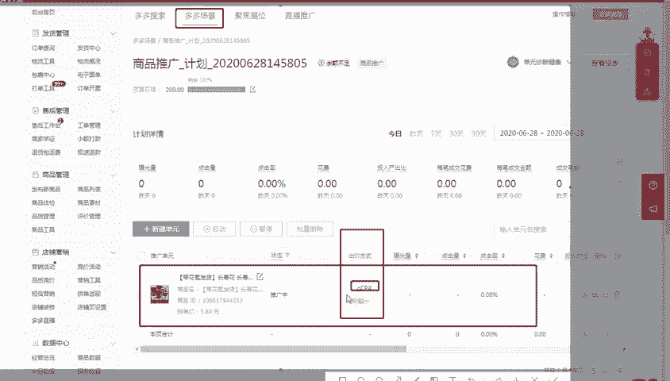
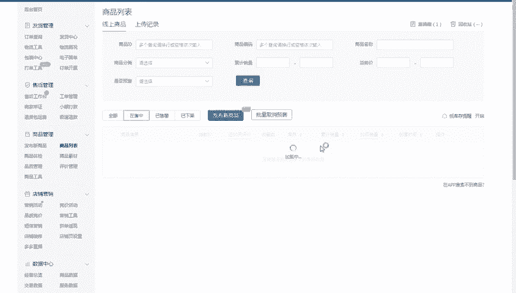

# 【拼多多运营实操教程】最系统的零基础拼多多开店教程全套，电商运营大佬专为学渣研制的新手开店保姆级教程！全程干货，简单粗暴 - P38：38、拼多多开店-ocpx系列（二） - -拼多多开店 - BV1BH1qYpEqw

电商无止径学海苦舟周。hello大家好，我是巨黄教育的西楼。欢迎大家来到我的拼多多干货分享的系列课堂啊。那么今天呢是延续于我们上一节课程所提到的啊，拼多多OCP叉系列。2啊。

今天主要给大家啊分享的是这个OCP叉的一个原理啊，就是我们在呃操作过程中呢啊需要先了解它到底是怎么样去运行的。然后呢，我们才可以更清楚的了解，我们后期到底应该怎么样去做。好。

那么现在呢就跟着我来一起认识一下啊，这个OCP叉具体的一个原理是怎么样来进行运营。好，首先呢我们先讲一下这个OCP叉的一个概要啊。在做这个工具的时候呢。

呃它其实是一个根据于这个呃算法机制计算出来一个智能出价模式。所以说我更多的呢把它叫做是这个呃智能场景。呃，我习惯性的把它叫做为智能场景，本质上呢还是按照这个点击扣费的啊，就是CPC的一个模式。啊。

本质上呢它是还是按照这个点击来进行扣费的啊。所以说你不用担心啊在开这个OCP叉的时候会浪费掉钱啊这样子的啊，它不是按照这个展现来进行扣费啊，有很多的这个场景呢，都是按照这个展展现来扣费啊。

有很多的呃小伙伴呢可能接触过这个呃淘宝的这个转展啊啊，所以说呃因为最近呢有很多的这个小伙伴给我留言说是不是跟淘宝的转展差不多啊。但其实它的一个运营模式呢，跟这个转展是差不多的啊。

但实际的一个扣费的一个原理，还是说跟转展有那么呃稍微有那么一点点的不一样啊，有那么一点点的不一样。然后第二个呢我们来了解一下做这个OCP叉啊来出这个工具的时候呢，呃是不是说必须要去做啊。

或者说你在使用这个工具的时候呢，它有什么样的一个必要性啊。首先呢呃原本呢我们都会遇到这样的一个。问题啊什么问题呢？就是说。投放的一个效率不稳定，然后转化比较差啊。第三个呢就是点击单价可能会比较高。

如果说你的店铺在投放广告的时候呢，发现了你的店铺呢会有这三个问题，那么OK你现在呢我们就可以使用这些啊这个工具啊，这个OCP叉的一个工具啊来解决啊这样的一个呃主要的一个问题。那么在实际操作的时候。

它是以个什么样的原理来进行的？原本呢我们在操作的一个过程中呢，我们场景是有CPCPM还有CPS啊等等各种各样的这个推广方式。每一个推广方式呢，它也都是不一样的啊。比如说。简单的啊搜索推广加场景推广啊。

搜索推广加场景推广。那它在操作的过程中呢，就是按照点击来进行扣费的呃扣费的啊。然后我们出价的时候呢，是人工来进行出价。就是说我们可能会随时需要去调整它啊，如果说你人工出价啊，今天这个出价偏高了。

那可能你获取到曝光量就会非常的多，你偏低了之后可能就获取不到这个曝光量，所以说它非常的不好控制啊，这个是搜索推广和普通的场景推广啊，这个呃带来的具体的一个效果。那么第二个呢是我们在拼多多推广的时候呢。

有一个东西呢叫做聚焦展位，聚焦展位呢，它是按照这个曝光来进行扣费的。而且呢是人工出价，所以说我们更加的不好控制。尤其是按照曝光扣费，这个呢是适用于一些大店铺或者品牌店铺，对于这些产品非常有实力啊。

非常有信心的。那么这个时候你才会按这个曝光来进行扣费啊，才会去开这个对应的一个聚焦展位。那第三个呢就是我。我们日常啊经常会使用到的这个多多进宝是按照这个成交来进行扣费的，也是我们人工来进行设置佣金的啊。

所以说针对于啊像前面的按照点击扣费，这个呢就是属于CPC的一个模式。按照展现扣费呢，就是CPM的一个模式。最后这个多多进宝呢是按照这个CPS啊，就是按照成交进行扣费，成交了之后才会扣除你的佣金。

那最后呢我们的这个OCP叉是一个什么样的一个结构呢？它呃本质上还是呃是这个按照点击来进行扣费。但是说你在实际操作的过程中呢，它是分为两个阶段啊，比如说打开我们的后台啊，这就是一个很清晰的啊。

我们可以看到这个呢是多多场景里面的一个计划。在这个计划里面呢，我们在实际操作的过程中，这个实际的这个出价方式啊，OCP叉它这边呢会分为两个阶段啊，当然这个在上一节课的时候呢，也给大家提到过啊。

它是呃它有这样。

的两个阶段，每一个阶段呢它所带来的一个效果也是不一样的啊。如果说是阶段一的话，我们结合市场平均出价的一个水平，还有历史投放的一个数据来进行调整就可以了。那么一旦进入到阶段2。

那么我们就可以直接根据预期的一个成交价格来进行出价啊，比如说我们想要花5块钱把我们的店铺成交一单啊。那么我们实际的一个扣费的一个价格呢，就会控制在一定的范围以内。

所以说呢这个就是OCP3给我们带来的一个非常好的一个效果。因为它是人工智能的，并且不需要你啊人工长时间长时间的去调整。所以说它。整体的这个时间周期呢会非常的长，而且操作起来非常的简便。

比如说我们大家熟悉的这个场景推广呢，那场场景推广里面呢有人群的一个投放，还有这个定向人群的这个投放啊，按照原本的投放模式呢，是所有的人群统一的呃投放啊，统一的出价啊，比如说呃。投放的这个人群。

我们可以选择相似的一个商品，投放的资源位呢可以选择优选的这个活动页。但是在这个基础的一个出价上呢，我们投放的这个人群呢，无论客户的意向程度还是大小出价都是一样的。在一样的情况下。

我们就没有办法保证这个流量的精确性。因为这个流量整体的一个范围呢都是比较泛的，都是比较大的。我们不能一概而论啊，所以说那就有了OCP差的一个运用。OCP他就是针对于每个人群的一个同样的出价的痛点。

针对于每个客户的意向程度啊，你要记住，在OCP叉的时候呢，它已经精确到客户了，系统计算得出这个人群智能化的一个出价。在出价的一个基础上呢，重点智能投放转化率更加高的人群。

它会根据于你这个消费者日常的一个呃行为啊，有多少的喜欢购买什么样的一个客单价的商品啊，喜欢什么样风格的一个商品它都是会有。记录的。所以说OCP3它会更加的智能，你也可以把它理解为是更加的千人千变化。好。

那这个呢就是这个原理上面的一个解析。当然这个原理里面呢可能涉及到的东西可能会比较多。那如果说大家有任何不理解的地方，或者是没有听明白的地方啊，大家可以私信我或者是在评论区给我留言啊。

然后最后一个给大家讲的一个东西呢，叫做目标，就是说我们开这个OC叉，我们要达到什么样的一个目的啊。首先呢你要找到自己的一个目标ROY。比如说你的产品呢是25%的一个利润。那么你需要达到多少的投产以上。

你才可以保持不亏钱啊，你才可以保持呃这个赚钱啊，微亏或者微赚那这样的情况下，那么我们呢就根据我们所定的一个目标RY然后呢呃持平的话，就是ROI等于一除以我们的利润率啊。

根据你的利润率来计算出你的ROY就可以了。当你可以控制好你的ROY的时候，那么你的OCP叉啊，这样的一个场景出价就没有太大的问题了。好，那么以上呢就是今天给大家分享的这个OCP3的一个原理。

包括这个工具的一些啊比较重要的解析。其实在做拼多多的时候啊啊，想要开一家盈利的店铺呢，其实并不难，难的是什么呢？难的是不会运营啊。你像老师做的这个店啊，西楼在操作这一个店铺的一个过程中，呢。

仅仅只有3个宝贝啊，但是在一个月左右的时间呢，我可以做到啊目前为止每天大概在600到700单左右啊，我们点这个发货中心或者是这个呃后台的一个首页，你可以看到整体待签收的一个订单啊，待签收的一个订单。

所以说是非常多的。如果说你们想要学习好这个拼多多或者想要做好拼多多啊。那么后期呢我也会定期分享更多的一个干货内容给大家啊，不要求大家这个对我有很好的一个呃。

怎么说呢啊相当于是我个人经验的一些分享嘛啊，希望大家可以学到更多的一些东西啊。那么呃大家现在呢啊如果说有想要这个拼多多福利大礼包的啊，我这边有整理了我自己在做这个拼多多的时候啊，写的一些啊心得啊。

那么有有想要这个大礼包的啊，可以直接私信我领取啊。好，那么以上呢就是今天给大家分享的一个内容呢啊，然后感谢大家的观看，再见。

