# 【拼多多运营实操教程】最系统的零基础拼多多开店教程全套，电商运营大佬专为学渣研制的新手开店保姆级教程！全程干货，简单粗暴 - P39：39、拼多多开店-ocpx系列（三） - -拼多多开店 - BV1BH1qYpEqw

电商无止境学海苦做舟。hello大家好，我是巨皇教育的西楼，欢迎大家来到我的拼多多系列课堂。那么今天啊我们就进入到了拼多多OCP它系列中的。啊，第三部分啊，具体的来给大家讲一下具体的一个操作啊。

包括这个啊我们在实际运营过程中啊，有哪些不一样的这个名词啊。因为有最近有很多的这个小伙伴给我留言说啊，我前面讲的一些专业化的术语呢，大家有点听不太明白。所以说今天如果说有时间的话。

给大家啊重新的来讲解一下。好，那么前面呢我们讲过了。在拼哥哥做这个OCP叉系列的时候呢，我们呃基础的认识了一下啊付费的一个方式定义。还有呃一二阶段啊，然后具体操作的一个原理。

或者是做这个工具的一个必要性。还有我们需要达到的一个目标啊等等这些整体的东西。那如果说啊有这个没有听到的小伙伴呢可以去翻看一下我之前的一个呃视频。好，那么今天呢给大家讲解一下在做OCP叉的时候。

我们具体应该怎么样去操作啊。首先。

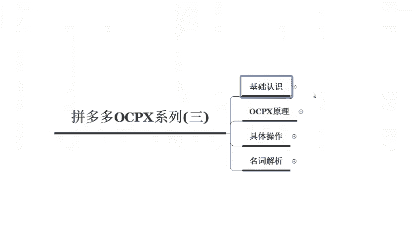

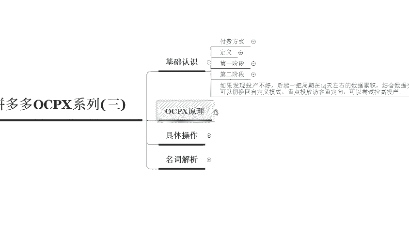

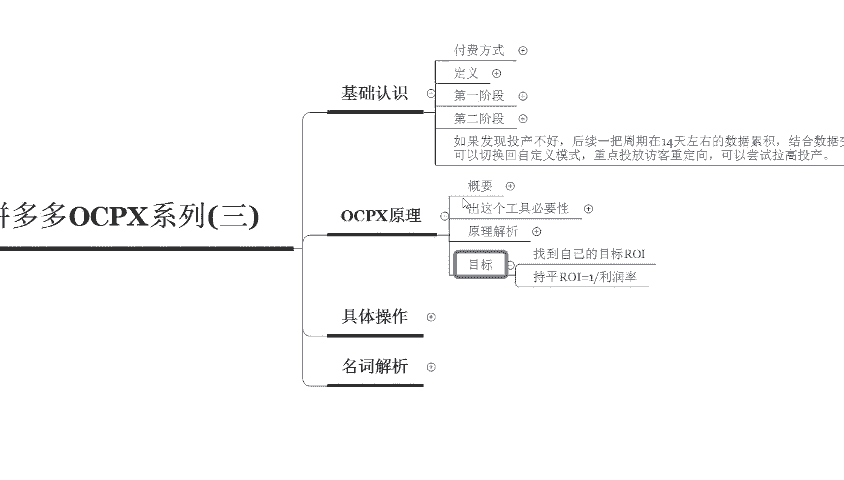

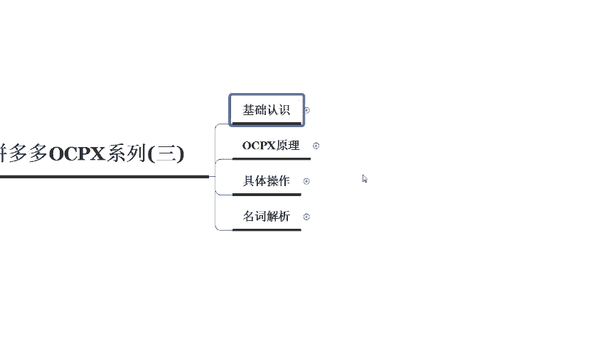

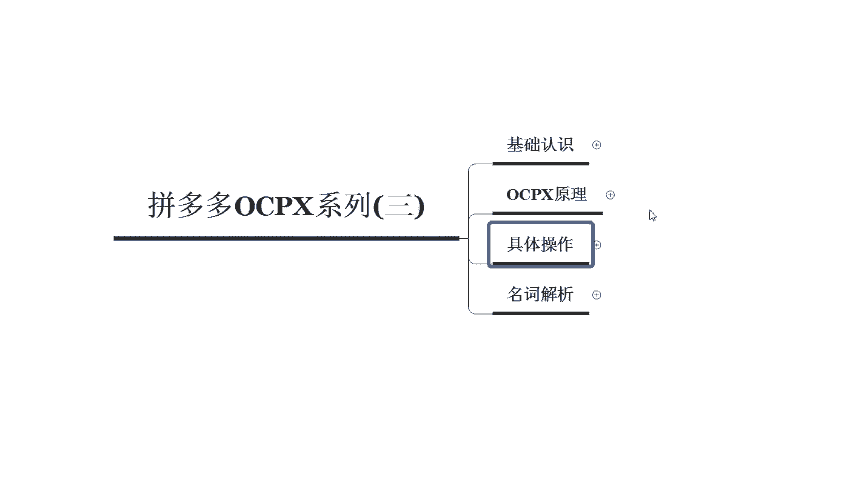

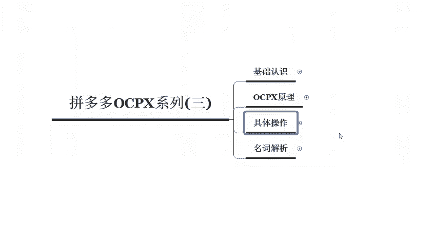

在操作的时候呢，分为两步啊，只要把我们的这个呃只需两步就可以完成这个已有单元快速切换，还有新建单元两种设置方式。我们在开始使用这个OCP叉出价的一个功能呢呃它具体核心的一个目标呢。

就是说要实现订单量的一个增长啊。比如说我们在打开我们店铺的后台之后呃。

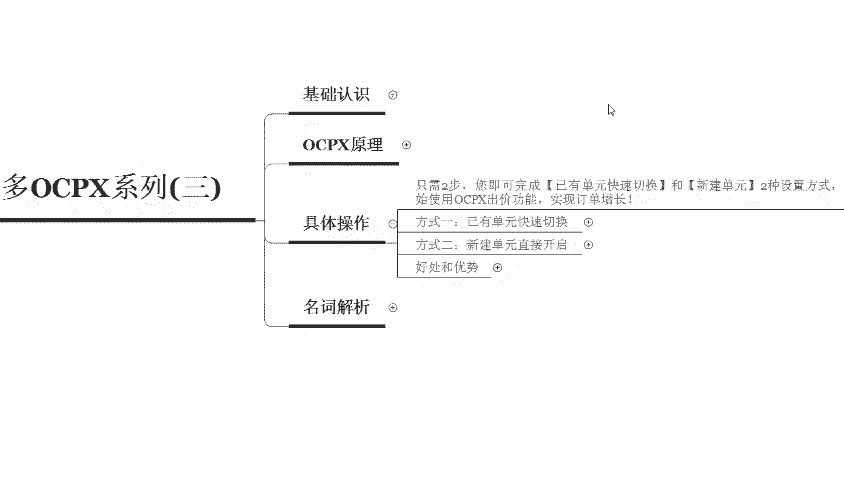

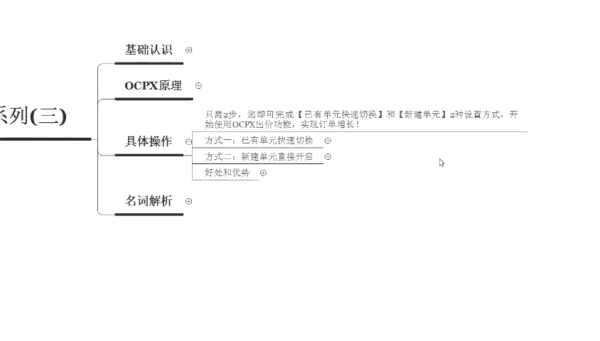

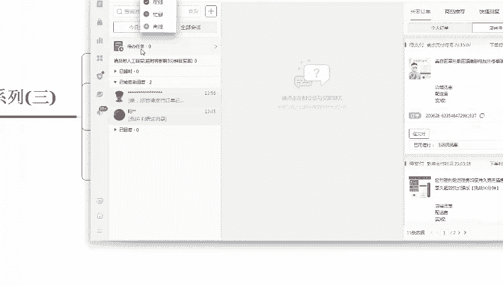

OK啊，比如打开我们店铺的后台之后。然后点击对应的一个推广计划啊，要找到对应的一个推广计划。在推广计划里面呢，你要点击多多场景啊，你要点击多多场景的一个推广。

因为这个OCP叉系列呢是适用于只适用于这个场景推广里面的好，点击多多推广啊，多多场景，点击多多场景之后呢，比如说我们原先的这个计划呢是没有这没有开这个OCP叉的，那么你可以一键把它转化为OCP叉。

或者是在新建单元的时候，你新建一个单元的时候呢，你添加的这个推广方式呢，你就可以添加为OCP插啊，那如果说啊有的呃可人可能会问啊，如果说我不想要这个OCP叉的话怎么办？你点击这个多多场景。然后呢。

点击这个新建计划啊，点击新建计划。然后在这边点击自定义出价，这个就是普通的一个多多场景的推广了。那么我们在操作的时候，一般如果你想要使用的话，就选择OCP叉的一个出价。那这个呢是两种不同的一个方式啊方。

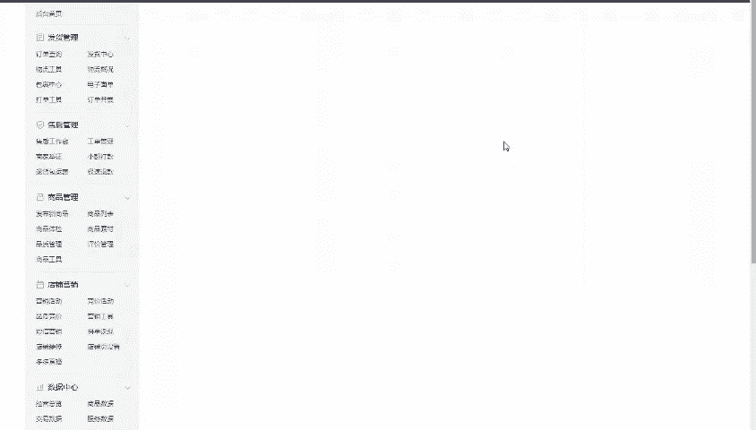

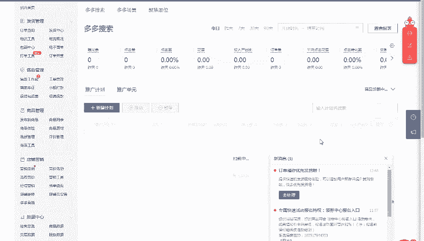

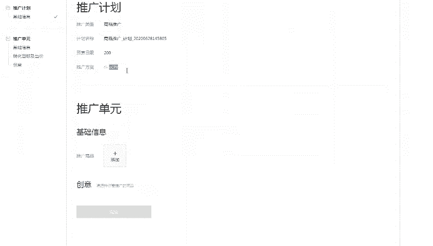

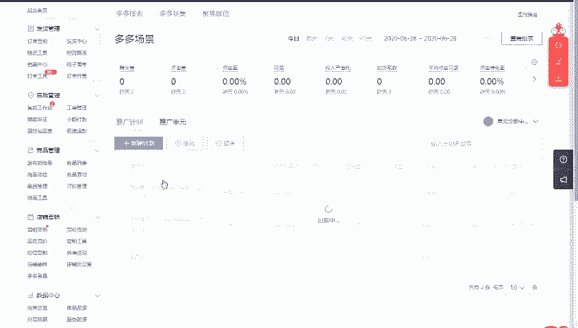

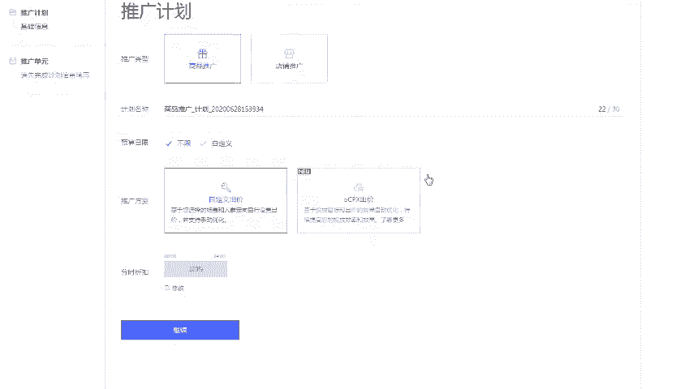

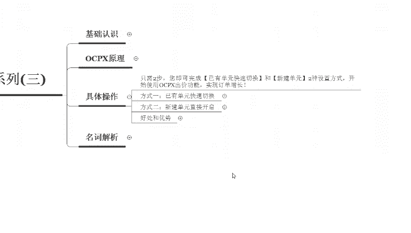

一如果说你已经有了这个单元呢，快速切换，它可以在你的呃单元的这个详情页里面呢有个出价模式，然后修改按钮修改为这个OCP叉就可以了。第二步呢就是说完成两个阶段的出价后啊。

然后点击确定我们两个阶段是指什么呢？就是在讲原理的时候呢，呃在讲这个基础认识的时候呢，我们讲过有呃它是有分为两个阶段的啊，每一个阶段所带来的一个出价和效果都是不一样的那第二个方法呢。

就是我们在新建这个单元里面呢，是直接去进行开启，然后在这个单元信息里面对应的选择出价模式，选择OCP叉的一个出价模式。那在出价完成之后呢，然后设置好对应的一个出价就OK了。

那这两种方式分别有什么样的一个好处或者是优势呢。

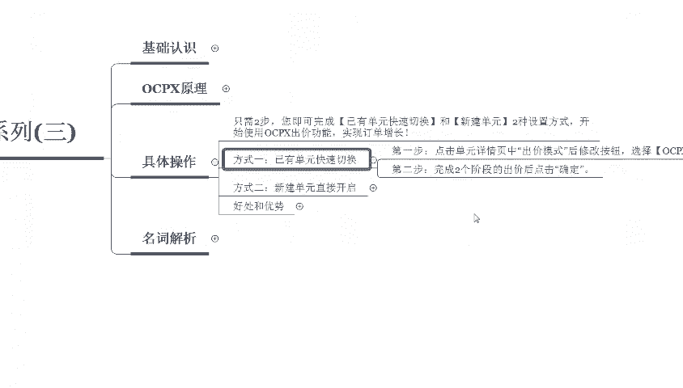

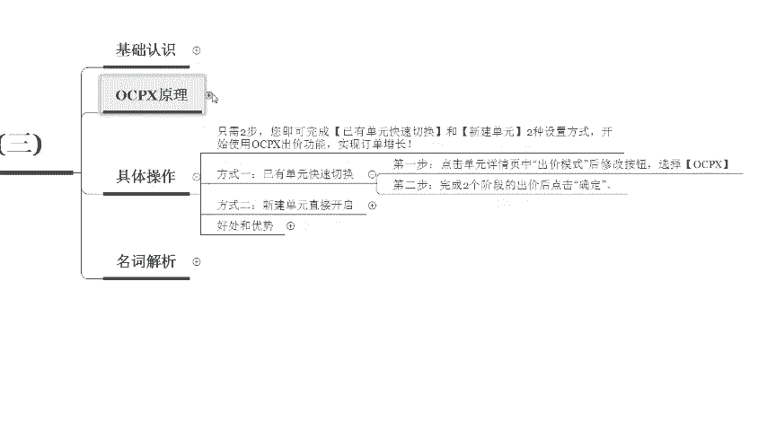

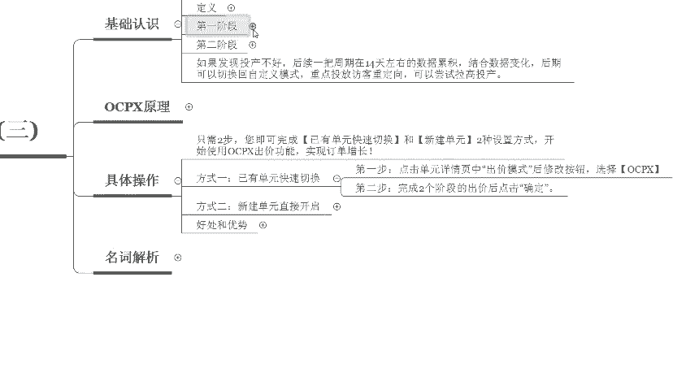

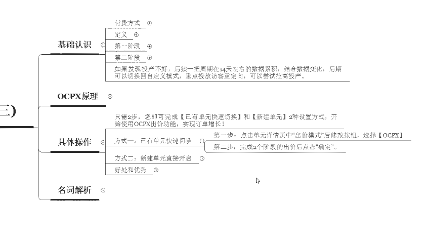

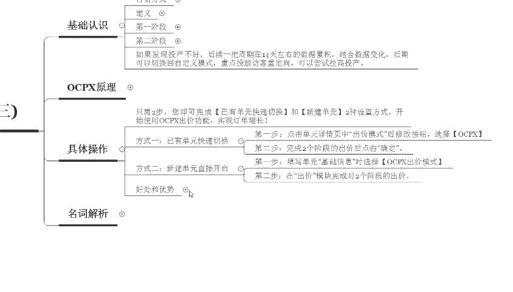

比如说你想你开通了这个OCP叉之后啊，主要有三个这个好处和优势。第一个是操作简单啊，因为你开了之后呢，不需要你在人为的资源位啊，不不用再去为这个人群和资源位去烦恼。因为有很多的小伙伴不知道啊。

实际在开这个场景的时候呢，你不知道应该开什么样的人群啊，不知道应该怎么样去优化投产啊，在开OCP叉的时候，就非常的简单。你只需要进行出价便可以获得稳定的一个投产和订单量的一个增长。那第二个是什么呢？

第二个是效果是非常的稳定的系统呢始终会根据你的预期成交出价。然后呢，为你自动化的调整最大的一个投放策略。然后最大化的保证投入产出比。那这是第二个点。因为它所有的操作全部都是人工智能来进行操作的。

第三个呢是可以实现。订单暴涨。当你的投产效果趋于稳定的情况下，系统会一直在你稳定成本的情况下，获取到更多的一个订单，突破天花板实现订单暴涨。所以说这个呢就是我们在具体操作的时候的一些方式和好处啊。

那么有一些名词，大家不理解的。那么接下来呢就给大家分析讲解一下这个OCPR里面的一些名词。

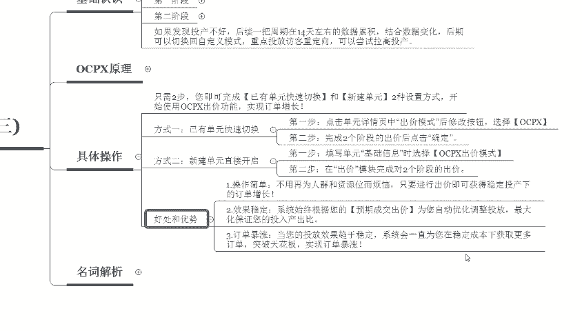

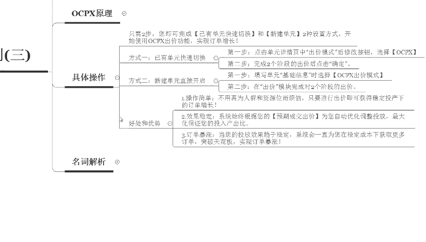

比如说啊我在给大家讲到的时候啊，第一阶段的时候和第二阶段，那很多的小伙伴呢不分不清楚第一阶段和第二阶段具体的一个考核是什么。第一阶段呢它叫做数据累积期啊，这个阶段呢主要是用于积累于你店铺的一个成交数据。

为你之后的一个智能投放来做基础。当你的OCP3真正的进入到第二个阶段时候啊，也就是智能投放期的时候啊，那么这个时候呢，你才算是真正的把这个计划给开起来了啊，当你的订单的单元7天的订单量达到50单以后。

就会直接进入到智能投放期。那这个时候呢系统会根据你的预期成交价格进行自动的优化，精准的触达高转化率的人群，最终以你的出价为目标为你获取到这个流量啊，获取到订单啊所以说这个点呢啊第一周期和第二周期啊。

阶段一和阶段二，大家要分的清楚啊。比如我们在实际操作的过程中啊。

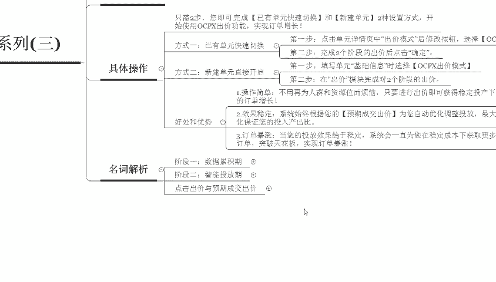

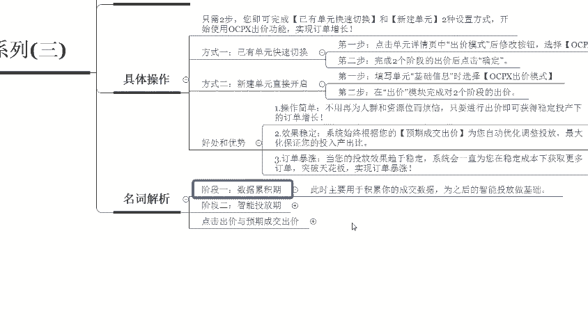

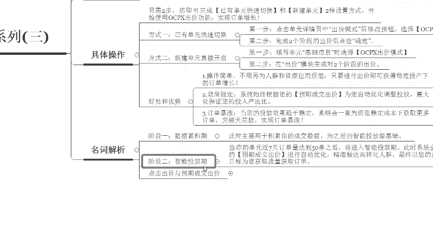

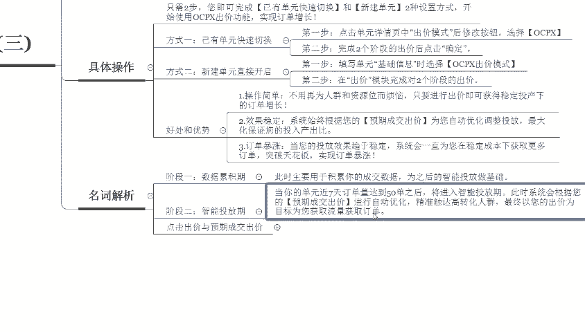

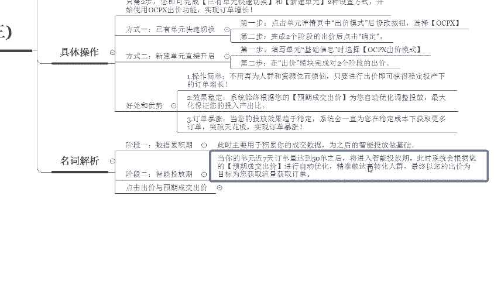

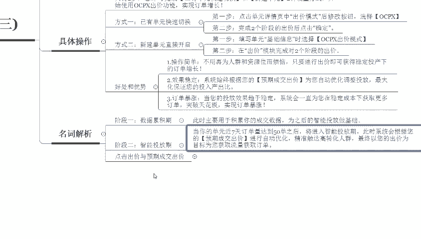

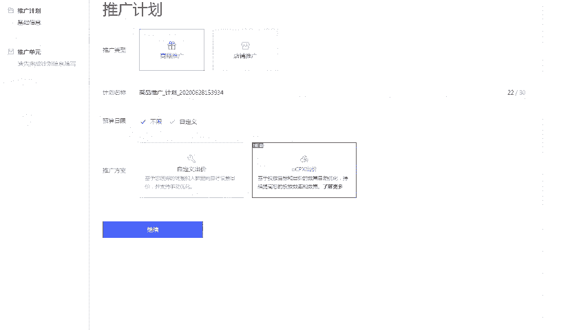

这个后台啊，这边你就可以看到你的单元呢是呃处于哪一个阶段啊。如果你的单元7天内的一个成交量是高于50笔的，就会直接进入到阶段2。好，那这个呢就是我们嗯两个阶段的一个分类啊。

然后最后一个呢是点击出价与预期的一个成交价格。就是说如果说你处于第一个阶段的时候呢，你可能同时需要进行这个点击出价和预期成交的一个出价，就是两个出价呢你都需要调整。

那么第二呃当这个点击出价呢就是指这个呃每一个单次啊，点击的一个最高价格，最终的扣费呢不会高于这个出价，比如说你的一个出价呢是5块钱，那么它点击的一个价格呢，肯定不会超过5元。

预期成交的一个价格呢是指你愿意为获取到一个订单所付出的一个呃成本或者是价格。比如说你的一个商品商品价格呢是5块钱，平均一次呢售卖是10个商品。那么一笔订单这价格呢在50块钱左右啊，因为价格是55块钱。

然后平均一次售出50个，那就是50呃那就是实际的一个成交价格呢是。

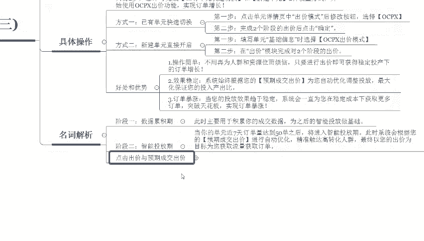

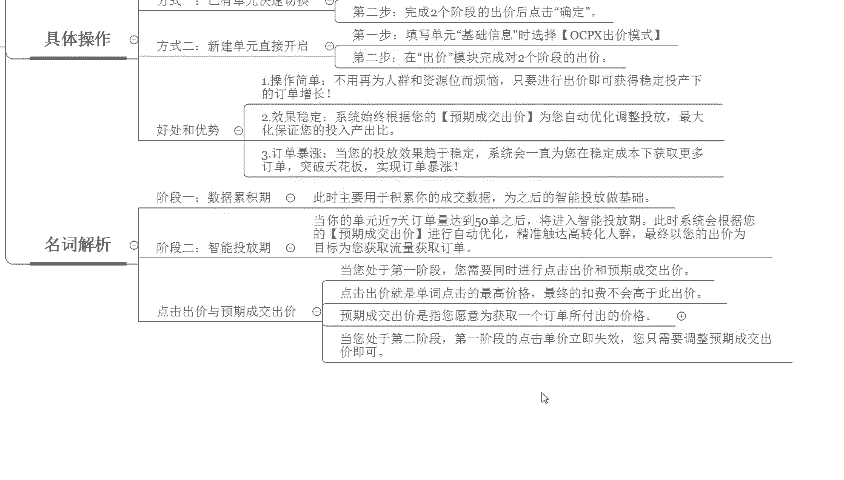

在50元，然后成本呢是20元。所以说你愿意付出10块钱啊，我也愿意付愿意付出这个10块钱推广的一个费用来获取一个订单。那么预期这个成交价格呢就是10块钱。所以说同时卖出去一单。

那么我们就可以赚20块钱的利润。

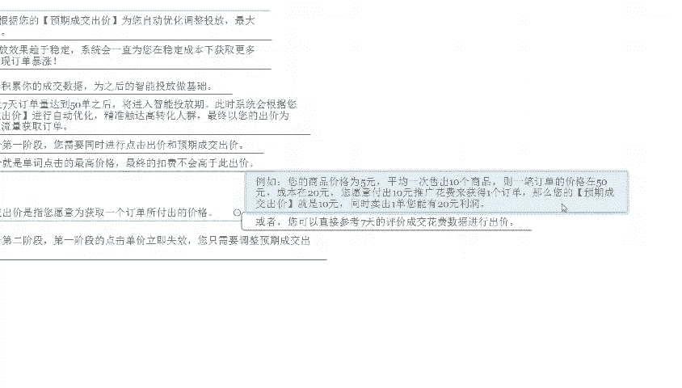

或者你可以直接参考7天的评价成交花费数据来进行出价啊，这是一个不同的一个出价方式。如果说当你的OCP叉处于第二个阶段的时候，那么第一个阶段的单啊单次点击的一个价格呢，就会以立即失效。

只需要调整预期的成交出价就可以了。好，那么这个呢就是关于这个我们的OCP叉系列第三个部分要给大家分析和讲解的一个内容。那包括这个前面有很多的这个基础的认识和原理啊，没有学习到的。

可以直接去翻看我之前的一个呃视频的一个内容啊，我这边呢呃西楼啊，就是为了给你们分享一些更多的拼多多干货的一些内容，让大家可以学到东西啊，也是说想要把这个呃平台呢作为一个呃。

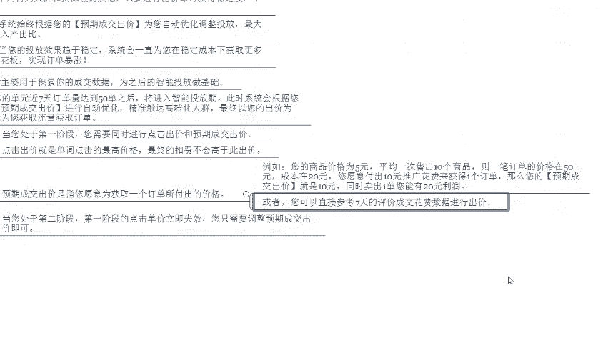

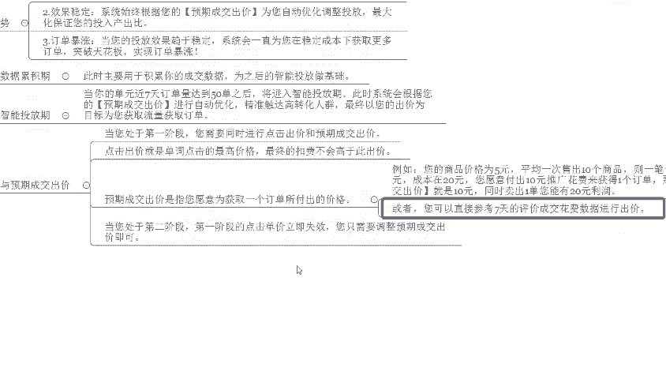

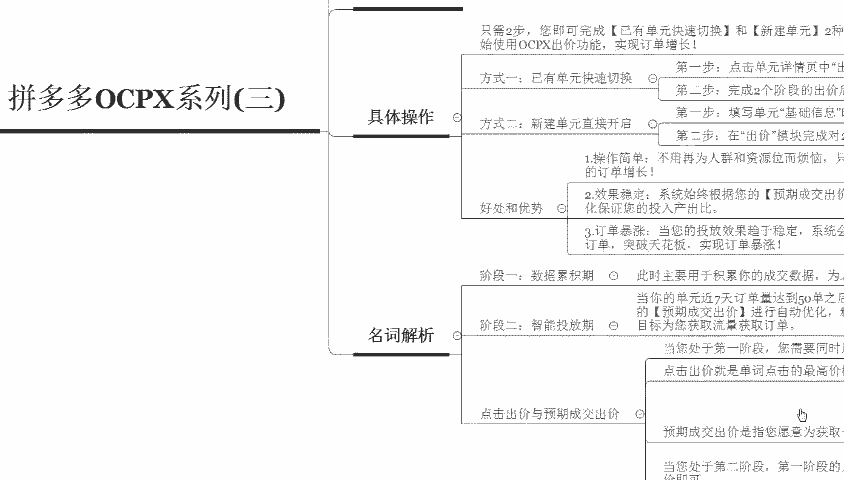

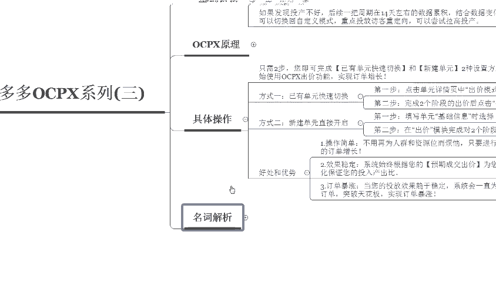

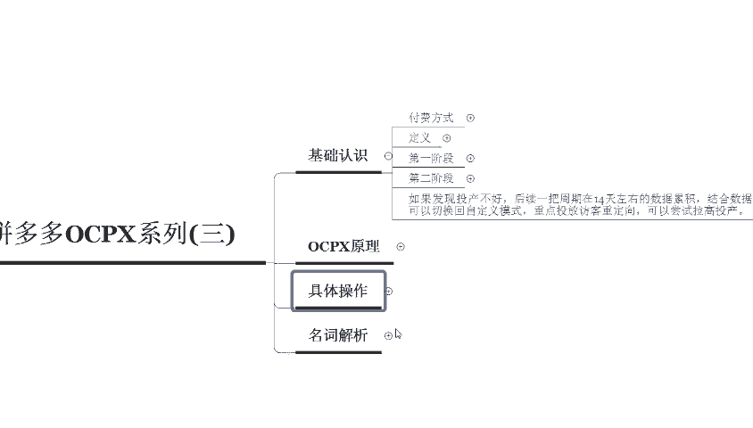

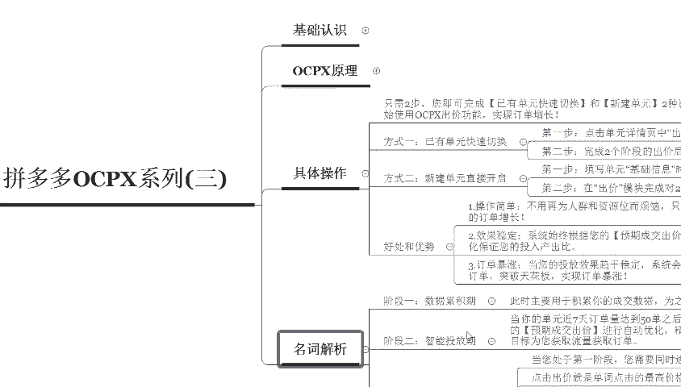

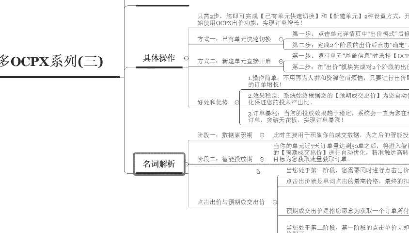

兴趣所在吧啊，因为我这个人就比较喜欢分享。所以说其实在做拼多多的时候，你想要开一家盈利的店铺，其实并不难，难的是什么呢？不会运营。如果说你学会了运营，那么ok啊你做拼多多是非常的简单的啊。

我这边呢刚好专业啊，如果说大家有需要的，想要了解这个拼多多应该怎么样去盈利，应该怎么样去做的那么我可以直接私信我或者是在评论区留言，我看到了之后都会定期的给大家啊分享一些你们所提到的一些问题。

后期呢我也会定期的分享更多的干货内容啊，那大家现在私信我呢，还会有这个福利大礼包可以领取啊。那今天给大家的一个分享呢，到这里就结束了。感谢大家的观看，再见。

