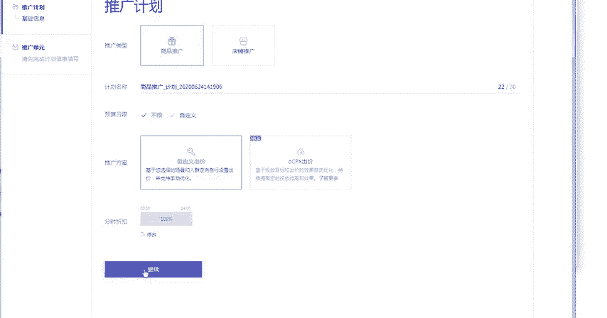
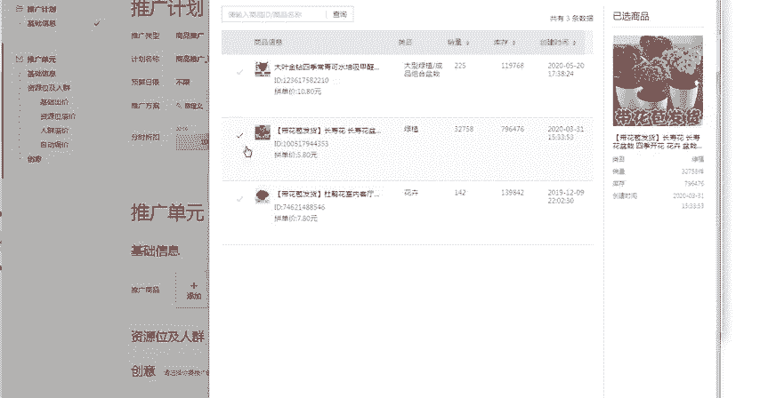
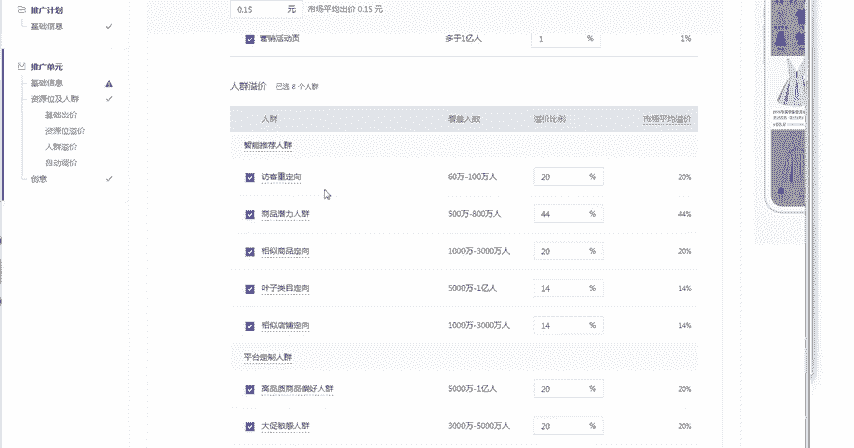
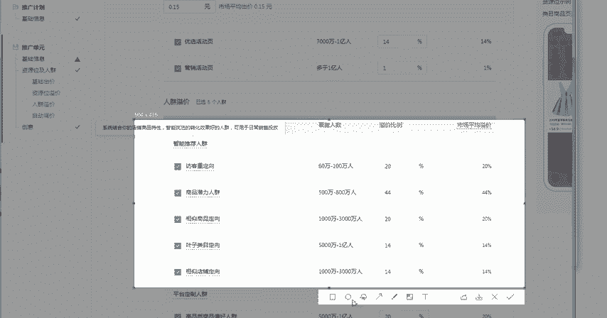
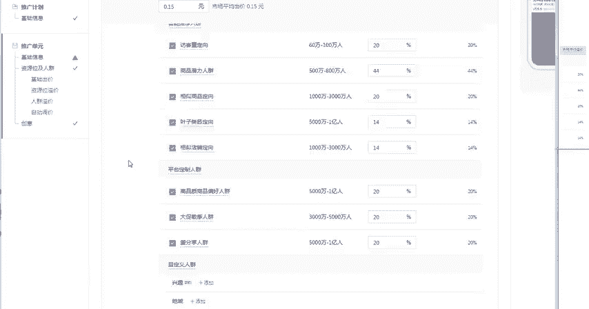
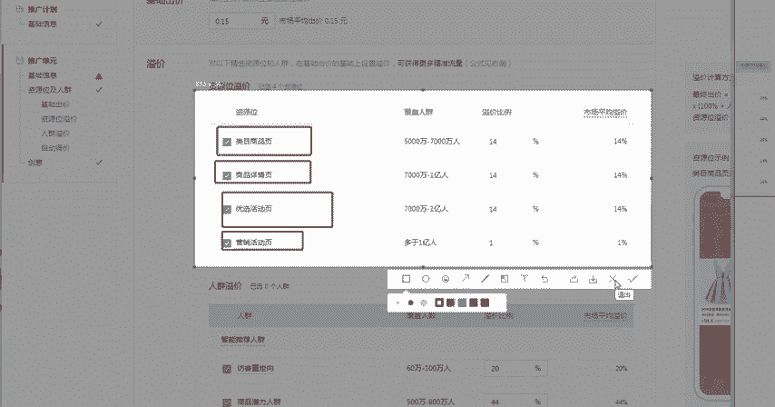
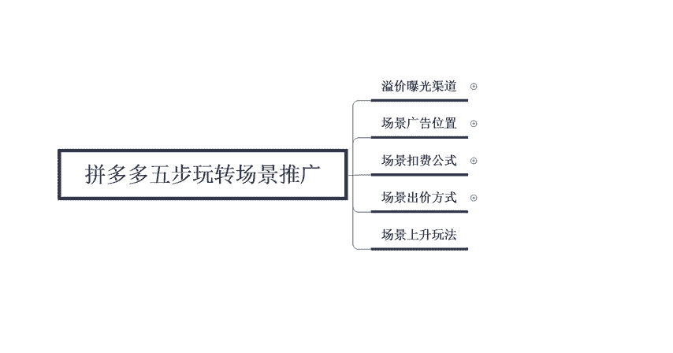

# 【拼多多运营实操教程】最系统的零基础拼多多开店教程全套，电商运营大佬专为学渣研制的新手开店保姆级教程！全程干货，简单粗暴 - P40：40、拼多多开店-五步玩转场景推广(一二） - -拼多多开店 - BV1BH1qYpEqw

电商无止境学海苦舟舟。hello，大家好，我是巨皇教育的西楼啊，那么欢迎大家来到我的拼多多的系列课堂啊，那么今天呢给大家聊一点深入一些的东西啊，因为最近有很多的小伙伴呢基础这方面学的已经差不多了啊。

然后呢我们今天就开始来分享一下拼多多五步玩转场景推广。有很多的人呢都是刚刚开始接触拼多多，所以不太清楚场景推广的一些玩法。那我在这里呢啊总结一下我自己在操作这个拼多多场景的时候所得到的一些经验啊。

首先我们先来认识一下。这个场景推广到底是一个什么样的东西啊？我们呃最先认识的呢是它的一个溢价以及曝光的一个渠道，都是从哪里呃来呃广告的的位置，到底是在哪里的啊，那么第一个呢是呃全体人群上面的一些了解。

呃，就是说从这个基础出价里面呢啊叫做一个通投啊，就是说在呃场景推广里面呢有非常多的一个投入的一个方式。如果说你只仅仅只是普普通通的一个出价，那么这种呢叫做通投。那么人群在进行选择的时候呢。

有5个定向的一个方向啊。那么第一个呢是访客从定向。第二个呢是相似商品的一个定向啊，第三个呢是叶子类目的一个定向啊，那么第四个呢是相似店铺的一个定向。最后一个呢是兴趣点的一个定向。

那么对应到我们的店铺里面呢，就是打开店铺的一个后台在推广工具里面，我们可以找到对应的呃搜索推广的。一个入口。好，我们现在打开一下啊，点击这个推广计划。点击推广计划呢在正上方的位置有一个场景推广。

我们直接点击场景推广。点击多多场景，然后点击新建计划啊，新建计划进入之后呢，它有对应的店铺推广和商品推广。一般情况下我们选择商品推广就可以了啊，选择这个自定义，然后点击继续啊，最后推广的一个商品呢。

我们可以随意的先添加一个。那添加完成之后呢，在对应的啊，大家就可以看到它的一个基础的人群呢，还有这个议价，还有展现的一个位置到底有哪些。那么我们平时在操作的一个过程中呢，所可以定向的人群呢。

就只有呃就是只有这5个这五类的一个人群。

好，那这是这一个点啊，人群上面的一个选择。那么再下面呢就是我们资源位的一个选择。三大议价资源位啊，商品的一个类目页啊，然后呢还有商品的详情页，还有一个营销活动页。同样的在我们店铺后台呢也是可以看到的啊。

在这个资源位里面。好，那大家可以看到。

啊，我们重点去选择的呢就是这个类目商品页，还有商品的一个详情页啊，还有一个活动啊，还有两个活动啊，一个是优选活动，一个是营销活动啊，但都是属于活动类的。

所以说这个呢就是整体的我们在开这个。场景推广的时候啊，所需要了解到的那最后一个呢叫做基础的流量包。那基础的流量包呢是覆盖全网的一个优质流量。它这个东西呢是属于智能的啊，所以说啊我们在开的时候呢。

直接把它开启就可以了啊，直接把它开启就可以了。好，那么这个呢是关于我们场景推广的一些议价，还有曝光渠道啊。然后第二个问题呢是要给大家啊分析一下这个场景的一个广告位置到底是展现在哪一个位置的啊。

它主要有5个方面啊，就是我们刚才在推广的时候呢啊你也可以自己去啊看到啊第一个呢就是商品的一个类目页啊，商品的类目页呢就是广告位置呢是一加6N的一个形式啊。你这样的一个展现位置来进行排名。

那么第二个呢就是营销活动页啊，比如说多多果园，还有边逛边转这样的一个营销活动页啊，那么第三个呢是拼多多的这个微信公众号，还有推文啊，如果说你手机推广，你手机关注了这个拼多多商城之后呢，你就可以了解到。

那呃第四个呢是这个商品详情页的一个推荐，可以为你推荐相似宝贝的一个展现位置，展现在这个排名呢是3加6N的一个形式。还有一些精选推广以及商品详情页里面的一些推荐。那最后一个呢就是现金的这个签到页啊。

前50个广告位基本上都是属于场景推广的。那么这个呢是场景推广里面的5个广告位啊，那么今天呢我们对于这个呃拼多多的场景呢了解呢啊先做一个基础的了解。那么下一节课程呢。

我会给大家带来啊拼呃拼多多的这个场景推广呢，到底应该呃是有有什么样的一个扣费方式啊，以及我们在出价的时候，应该怎么样对出价，包括像一些比较好玩的一些玩法。比如说场景的一些上升法，所带来的一个效果呢。

也是非常的直观的啊，比如这个店铺在实际操作的过程中呢，就是利用。场景推广这个工具来不断的拉升店铺，在短短一个月的时间就可以达到700多单的一个啊每天的一个效果。好。

那么以上呢就是今天要给大家分享的一个内容啊。那么其实想要在拼多多上开一家啊可以盈利的店铺呢，并不难难的是不会运营。所以说啊就需要自我推荐一下啊。我这边呢是刚好专业。如果说你有需要的话，可以直接私信我。

或者是在啊评论区给我留言。后期呢我也会定期的分享一些更多的拼多多干货的一些内容。好，那么今天给大家的分享呢到这里就结束了，感谢大家的观看，再见。

