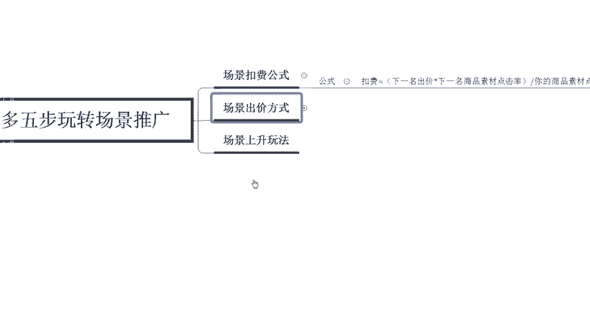
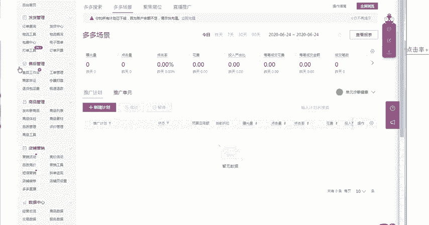

# 【拼多多运营实操教程】最系统的零基础拼多多开店教程全套，电商运营大佬专为学渣研制的新手开店保姆级教程！全程干货，简单粗暴 - P41：41、拼多多开店-五步玩转场景推广（三四） - -拼多多开店 - BV1BH1qYpEqw

电商无止径学海苦就周。hello大家好，我是巨航教育的西楼。那么欢迎大家来到我的拼多多系列课堂。那么今天要给大家分享这个内容呢，是承接于上一节课程，我们拼多多五步推广啊，五步玩转这个场景推广的一个方式。

那么今天我们来讲啊345剩下的三个点啊。那首先我们今天呢需要了解的更加深入一点。上一节课程呢，我们已经了解到在做拼多多场景推广的一个过程中呢，我们需要先了解拼多多场景推广都投放在哪些位置。

以及它的一个展现排名是以什么样的一个方式来进行展现的啊，那么这一节课程呢，我们来了解一下。首先第一个场景的一个扣费公式啊，这个工具它毕竟是花钱的，我们必须要知道我们的钱到底是怎么样花出去的。

然后啊所花出去的钱啊，是应该有多少啊，那么在。

计算这个公式的时候呢，也非常的简单。它的一个扣费呢等于下一名那个出价乘以下一名商品素材的点击率。请注意是点击率啊，然后呢啊除以你商品素材的一个点击率加上0。01。那这个呢就是我们实际的一个扣费公式。

所以说当你的商品素材点击率越高的时候，那么你的场景呢所花费的一个金额也就越少。

所以说啊在开场景的时候，为什么啊总总有些这个小伙伴呢私信我说啊，场景开不好呃，原因就在于这里你的点击率是非常差的。所以说导致你的整体的点击价格上不去。那在这样的情况下。

你就没有办法获取到更多的一个曝光啊，以及更高的一个排名。

好，那么这个是关于扣费公式。那么第四个呢我们要了解的是场景的出价方式啊，我们呃玩转拼多多的这个场景推广呢需要5步。那么第第四步呢就是了要了解它的一个出价方式。那出价方式。如果说你针对的是全体人群的话。

那这个我们上节课也讲过叫做通投。

啊，它叫做通投。在通投的一个情况下呢，就是所有的人群全部都可以看到你的商品，并且看到你商品的一个展现位置呢，全部都是一致的。这样的情况下。会面临的一个问题是什么呢？就是你带来的流量会非常的庞大。

但是说点击率是没有办法精准控制的。因为你投放的是全体人群，所以说在这样的情况下，你的人群就会导致不不不是足够的精准啊。那在这样的情况下，我们就需要有了对应的个议价，以及定向的一个入口。

所以说我们在操作的时候呢，需要开对应的5个定向渠道。那定向渠道呢，就是从这个访客从定向以及呃相似商品定向，还有叶子类目的一个定向，还有相似店铺的定向，以及最后一个兴趣点的定向。

那么今天我们就是分别来啊了解一下这5个定向到底是呃什么样的一个方式。这个访客从定向呢，你可以把它理解为是已经浏览过你的店铺的。

已经浏览过店铺的这些人群，但是没有进行购买的那在这样的情况下，你如果投放了广告，他就会第二次看到你的商品，第三次看到你的商品。如果他第一次点击了你的商品没有进行购买，说明他对于你的产品呢是感兴趣的。

否则的话他不会去进行点击。所以说你开通了这个访客从定向之后呢，你可以不断的让看到第一次看到你商品的这些人不断的进入到你的店铺。所以说这一部分的人相对来说他的一个转化率是最高的。而且呢这个也是针对于老客。

啊，针对于老客的一个。效果要更高一些。那么第二个呢是叫做相似呃，相似商品的一个定向。那相似商品到底是什么呢？就是跟你的产品属性所呃差不多的啊。比如我们在打开这个后台之后呢，你在发布新商品的时候。

啊，我们随意的选择一个类目啊，你在发布商品的时候呢，你是需要填写你商品的一个属性的。在你填写这个商品属性的时候啊，比如这边。

填写对应的商品属性以及商品的个规格的时候呢，这个就叫做你商品的一个商品标签。当跟你的商品标签一致的情况下，那么就同样啊。因为同行有很多的这个商品。那如果有一个消费者看过同行的商品。

说明他是喜欢这一类型的一个产品的。所以说那你开了这个相似商品的一个定向呢，他也有可能会看到你的产品。所以说这个点呢是用来拉新。啊，是用来拉新效果会更好一些。那相对应的访客从定向，因为针对的是老客。

所以说它的流量相对来说比较少。啊，它的曝光肯定是比较少的那相似商品呢相对来说会更多一点，它的流量是要高于访客重定向的那叶子类目的一个定向是什么呢？就是消费者在搜索了这个类目，比如说。大码女装。

消费者搜索了大码女装这个类目之后，然后他就会匹配到这个消费者呢是喜欢这一类型的产品。那么okK你开了叶子类目定向之后呢，它就会对应的给你匹配到喜欢大码女装的客户。那所以说这一部分啊，它是针对于类目的啊。

一个是针对于老客，一个是针对于商品，一个是针对于类目啊，那这样的情况下，这个类目的流量就是最大的啊，曝光是最大的。那最后一个呢就是相似店铺的定向。这个呢一般是适用于一些风格店铺。

如果大家做的不是风格店铺的话，那这个相似店铺大家就可以不开。那最后一个呢就叫做兴趣点。这个兴趣点指的是什么呢？啊，就是指我们在日常操作的一个过程中呢，你需要清楚的知道消费者喜欢搜索哪些关键词。

他喜欢什么样的价位，他喜欢什么样的评价。那这样的情况下，我们就可以判断出消费者的一个兴趣点是在哪里。包括我们消费者的一个具体型的一个定向，它到底是小镇青年啊，还是说喜欢低价啊，还是喜欢优惠。

根据于不同的一个消费者呢，我们可以做不同的一个营销活动。好，那这个呢就是关于五大定向的一些了解和基础啊。那最后一个呢给大家讲解的呢叫做三大议价入口啊，叫做商品的一个类目啊类目商品页，还有商品详情页。

以及营销活动页。类目商品页呢，就是指我们在搜索拼多多最首页的位置，我们没有搜索任何的关键词，直接点击类目进入之后，你可以看到的这个商品叫做类目商品页啊。

那第二个呢商品详情页就是有可能比如说你开通了这个相似商品的一个定向。那么你有可能就在相似的这个商品里面看到啊他们的详情页里面看到你自己家的一个商品。所以说这个相似商品呢是跟这个东西是有关联的啊。

跟商品的详情页是有关联的那最后一个呢叫做营销活动页。那营销活动页展现的一个位置呢，就是啊比如说。

多多的一些场景啊，还有活动啊，比如说多多果园啊，类似于这样的一些营销活动页。好，那么这个呢就是我们场景的一些出价方式。在出价的时候呢，首先我们优先投放的，肯定是老客，然后再去拉新。

然后再去获取到更大的一个流量。针对于不同的目的，我们所出价的一个方式也是不同的。好，那么以上呢就是关于这个多拼多多啊，场景推广的一些基础啊，那么已经给大家介绍完了啊，那像一些深入一点的东西呢。

是比如说场景的啊具体的一些玩法，这些深入的东西呢是呃后期我会给到大家这个福利啊，当然我不会直接在这个公开的这个啊视频里面给大家讲解到。所以说如果说你们有想学的，可以直接私信我，或者是在公屏给我留言啊。

那么后期呢我也会定期的分享一些更多的拼多多干货内容。那么现在私信我，还有这个拼多。

多多的福利大礼包啊，可以给大家看到。

整体的礼包的一个内容呢非常的多啊。如果说想要这个拼多多福利大礼包的，那么也可以直接私信我，我这边会发给你。好，那么今天给大家分享的一个内容呢，到这里就结束了，感谢大家的观看，再见。

