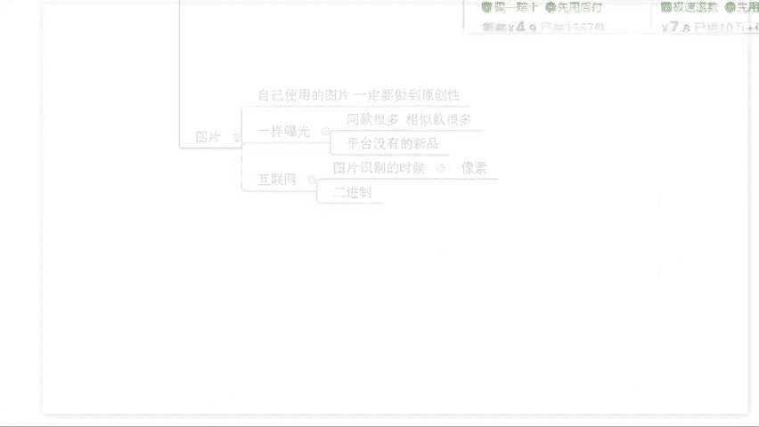

# 【拼多多运营实操教程】最系统的零基础拼多多开店教程全套，电商运营大佬专为学渣研制的新手开店保姆级教程！全程干货，简单粗暴 - P42：42、拼多多开店-推荐截流做爆款 - -拼多多开店 - BV1BH1qYpEqw

helello hello hello。

呃，测下麦啊，这边所有的在直播间的小伙伴们能够清楚的听到我的声音的啊，声音啊没有问题。画面没问题的。公屏扣1好不好？来动么快啊？O啊，阿白来的挺早的。阿白啊，可以的，这个小速度啊有点快速啊。

来说小伙伴一起啊，能够清楚的听到我的声音的，能够看到画面的声音方面没问题呢，公屏扣个一，好不好啊，测试一下OK没问题，对不对？好，那就行啊，呃这个整个的直播呢是在两点钟准时开始啊。

那现在呢还有一点点时间，我们大家呢可以先简单的交流一下，对吧？那目前呢店铺操作方面呢有没有遇到什么问题。如果有的话啊，可以把问题发出来，好不好？那顺便呢我也把我们啊直播间的一些小规矩啊，我先说一下。

好不好？啊，避免说到时候呢在整个直播过程中呢啊产生一些这个不必要的麻烦或者误会啊。首先啊大家注意啊，第一个值得大家注意的点是什么呢？就是在我的直播间的话啊，那么呃我希望呢大家能够去积极互动，好不好？

这是第一个点啊。嗯。啊，积极互动啊，这是第一个点。为什么这样说呢？因为在整个直播过程中的话，我可能会跟大家确认啊。对，又来了啊，我会跟直接在跟大家确认什么呢？就是呃在我分享完某一个知识点之后呢。

我会跟大家确认大家是否能够听明白能够听懂啊，如果说能够听明白，能够听懂的话，大家记得扣一回复我。那如果说听不明白，听不懂的话，也可以直接跟我讲。如果有比较多的小伙伴没有听明白，没有听懂的话。

我也非常乐意啊，为大家再次进行讲解，这个没问题的，好不好？所以大家注意一下啊，另外呢我也会呃通过提问的方式来展开我的分享。因为我知道啊大家的这个思维呢会比较跳脱一点。那跟着问题去思考的话。

那整个的吸收理解呢会更常容易一点，好不好？然后这是第一个点啊，第二个点呢就是说在整个直播过程中的话，啊，那么允许提问，对吧？但是问题。仅限啊当前内容。相关的。这个是非常重要的一个点。

因为我们每个人可能都会遇到自己的问题。那么这个问题呢，在整个的呃实操过程中呢，每个人的问题是不一样的那如果说呃在直播中呢，大家每个人问一个问题的话，那可能整个直播呢是没f，没有办法这个正常进行的。

也有很多小伙伴呢可能是比较基础的对吧？纯新手还没有开店。那这种小伙伴呢，那如果说我们东一个问题，细一个问题的话，可能就会什么呢？导致他们没法吸收理解。所以这是第二个点啊。然后公屏上呢有小伙伴们提问。

对不对？呃，新开这个拼多多有什么不好的。还有小伙伴就说能不能讲一讲单品怎么打话，ok的啊，没关系，一会我说一下啊。那么呃除了跟我们刚刚讲的这两个点之外呢，最最重要的一个点呢，我这里也重点说明一下。

就是在整个直播过程中，如果说你今天听到我分享内容，觉得确实适合自己啊，确实是自己没有做到位的。那一定要去实操去操作，这是第三个点。因为再好的方法你不去用，你不去做，那么它都等于0，好吧？那么这三个点啊。

希望大家在直播过程中呢。注意一下好okK。那说完我们直播间的要求之后呢，我现在开始解答刚公屏上小伙伴提的问题啊，像贺飞呢在说这个新开的拼多多店铺有什么不好的？嗯，这个问题其实有很多人都会纠结这个点啊。

就说哎小楼呃我是一个新店。对吧那我有一个老店，那我到底做新店好还是做老店好，对不对？或者是那我做新店的话，跟老店是不是没有办法竞争呢？其实各位我说一下啊。

没有人会因为是新店还是老店会来判定说你们店铺的差异。这个点大家可以放心的，为什么这样说呢？因为平台针对到店铺的考核啊，它不是说一竿子打死新店、老店、新品老链接，它都是有不同的考核要求的。懂吧？

那如果说我们是一个纯心店，本身我店铺就没有很高的店铺层级，没有很多的店铺数据，没有很好的爆款商品，那是不是意味着我跟我的同行竞争就没有办法来呢？不是的啊，为什么这样说呢？给大家看一个店铺好不好？来。

各位有看到这一个数据的小伙伴呢，公屏上扣一个一，现在动作快，马上啊来这个店铺啊可以看到啊，它是一个从零开始做的一个店铺，对不对？前面前期的数据呢是零的啊，一个纯新店来的，没有任何数据的一个店铺。

那么他正常运营过程中话可以看到整个数据呢也是能够去有到一个比较好的增长过程的，对不对？到呃差不多一个多星期开始数据往上提，到后面呢一个小的爆发之后趋于稳定啊，店铺一天呢也能做到1万多访客。

一天的话1800多单。13。85的转化率。各位。这是新店来的。如果说新店就没有办法做，新店就没有办法去竞争的话，那这样的数据是不可能产生的。各位能够理解吗？所以新店也好，老店也好，新链接也好。

老链接也好，重点还是在于操作方法，而不是说我新店就没法去做，不是这样子的。如果说你不会做，你没有方法，不管是新店还是老店其实都一样，你都做不好。到底就很简单，对不对？那么呃还有讲说哎能不能讲讲单品打爆。

对吧？大家不能这样问的啊，今天我们讲的就是新品去打爆的一个过程啊，所以这点大家可以放心，一会儿呢认真听啊，然后这个呃一生幸运而说呃，那么新人怎么去找货源呢？来，各位有多少小伙伴是自己找货源的。

自己是这个想要去找代发的。有的话供应商。打一个6可以吗？有事想要去找代发的，自己没有货源的，公明，打一个6，我看一下。okK啊，还有不少啊啊，对于店铺运来讲的话。

其实我自己一直以来认为真正意义上去创业的话，前期去找代发是最合理、最科学的。为什么呢？因为本身我们就没有说特别充裕特别庞大的一个资金储备，对吧？如果我自己去生产或者自己去做库存的话，那么资金压力会很大。

再一个呢操作风险会很高，而且甚至在某些时候呢，你会发现你的成本其实并不低。为什么？因为你需要额外的仓储成本，对不对？你还需要啊你还需要这个呃自己的一个人工成本。对吧在运费上面来说。

你可能还需要承担两次运费。所以在很多时候你自己做过存，对于我们来讲的话，尤其创业初期其实是一个特别大的负担。所以我们很多小伙伴都愿意去找代发，对吧？那么代发呢方式有很多很多渠道也都可以找到货源，对吧？

像很多产业带的一些这个货源网站都能直接找到对应的一些生产的厂家，那说一个大家最熟悉最简单的方式，好不好？你们1688都有用过吧。来各位1688有用过的，有听过有见过的供别声打一个一好吗？

这里呢给大家讲一个非常简单的方式去找到一些很优质的商家会源，好不好？那就以1688举例子，好不好？那1688怎么去找货源呢？来看一下啊，动作快，一起我们把这个浏览器打开，我们来操作一遍哈。

这个问题呢也是可能很多小伙伴比较关心的一个点吧。来啊，稍微可能这个网页会有点小卡啊，好不好？稍微这个网页可能有点小卡啊，呃，我直接去搜了1688。好，O。各位。搜索完1688之后呢。

我们可以直接找到这种带有官方标识的啊，都可以的。这两个网址啊都可以没问题的。随便点一个进去就好了。点进去之后呢，这里呢有一个小的动作啊，不是直接去搜索产品或者是去找品类，不是这样子的。

我们首先第一步呢去点一下这个1688的首页啊，这边有看清楚的公屏上打一个6可吗？动作快啊，有看清楚的公屏打一个6啊，在这个位置啊，在我们顶端呢会有到一个首页啊，1688的首页啊。

这个东西找到它找到它之后干嘛呢？来各位看清楚了，点击这一个首页进入这个时候进来之后，我们再去搜索商品，那有小伙伴说，哎，小，你这个操作什么鬼东西，对吧？你不是脱裤子放屁吗？我都进去这个首页了。

我干嘛还要点一次首页啊，好不好？我们要做一个。验啊，兄弟们，你们是做什么产品的，发公屏上来这么快。把你们自己产品的关键词发出来，随便什么产品都可以的。9是吧？OK。来，我来收一个酒，好不好？哎。

我来送一个酒啊，来收完了。说完之后呢，它是这个样子的，好不？说完之后它这个样子的来看清楚这个界面啊，完了之后，我们回到我刚刚去打了一个点了一个首页的这个页面来啊，这个是我刚刚点完首页跳转的页面啊。

我们再来搜索一个9，好不好？各位有发现有差别的小伙伴呢，公屏上打一个一。这两个页面来就是刚刚那个直接在网页上这个百度里面找到这个首页之后，去点击搜索的9。啊，这个是哎在这里啊在这里。

这个就直接去找到啊百度里面的网址进去之后，直接搜酒的一个结果。那么这个是我们点击首页之后搜了酒的结果，有看到区别没有来。有看到没有？这两个页面是不一样的，对不对？哪里不一样呢？嗯，一个呢就多了一些东西。

多了哪些东西啊，在这边顶端会有到一些。筛选项啊在这边会有这个筛选项啊，那么这个筛选项是干嘛的呢？来很简单的一个操作啊，我可以通过这些筛选项呢去筛选我们的供应商的一些这个呃。级别吧可以这样说吧啊。

或者是一些服务的一个状态，对不对？比如说我们拼多多呢大部分商品呢要求48小时内发货，对不对？OK我现在呢可以勾选48小时发货了。在这个界面上是没有的，对不对？在这边是没有的。

那么在这边是有的那有了这个之后呢，我可以很确定的就是这些商家可以保证我的发货时间，这是第一个点。第二个点呢？还有到更多的一些筛选项啊，什么筛选项呢？比如说有一件包邮，对吧？啊，有运费险对吧？

还有实力商家，对不对？这些呢我们都可以去筛选。那么筛选完之后呢，他都会对我们的这些供应商呢进行一个过滤，对吧？他没有一键代发服务的，ok直接被过滤掉了啊，他没有这个呃实力商家认证的，直接被过滤掉了。

那么剩下的这些呢，就是经过资深验场的实力商家，并且呢能够正常保证48小时发货，而且呢是有一件包邮的这种服务的那这些商家，我们再去对应的根据我的需求进行一个确认沟通对吧？

沟通好我们的图片是否可以直接使用啊，是不是原创的图片，那么有没有这个呃申请实拍保护，会不会投诉，对吧？那退换货这些东西怎么去沟通解决处理，对不对？都可以直接去解决，直接去沟通确认，确认好之后没问题。

O那么这些就是我们可以去使用的货源。那这些货源里面呢，我们再去择优选。选择那些相对来说更加适合我店铺定位，更加这个便宜的会员就可以了。各位OK吗？没问题的话，公屏打个6好不好？

当然呢呃还会了别的产品呢会有到更多的服务啊，这里我给大家演示一下，比如说刚才你们的小伙伴说这个零时嘛，对不对？来，我们收一个零食好了，好不好？会了更多的一些选项的啊。

来这边呢呃整个的一个唉这个里面还没有啊，这个里面没有啊啊，有的是会有到一些这个服务时间的一个筛选的啊，有的品类是有这个服务时间筛选的。比如说7乘24小时发货。啊，7乘24小时这个服务是在这个回复啊。

就是他们的客服呢是每天都在的，每天每个时间段都在的。这样呢我们在进行一些售后问题沟通的时候呢，或者是在进行一些这个产品问题沟通的时候呢，就更容易去解决，啊，那么这个就是我们需要去筛选的一些小的东西。

那包括一些其他的啊地方的一些货源产业带的一些门户网站呢一样的啊，我们也可以去筛选去沟通，沟通的这些细节呢，就是我刚提到这些点，对吧？发货时间呢，对吧？我这里写一下宝宝哎。发货时间。对吧然后呢，这个。呃。

是否支持代发？对吧包括说我们的这个呃售后问题。对吧还有我们的这个快递。对啊。等等啊，这些细节我们沟通好，确定好就可以了，好不好？OK啊，呃，时间已经到了啊，这里呢我最后再确认一下。

因为有很多小伙伴是刚进来的啊，这里我最后再确认一次好不好？呃，所有人目前已经在认真听的啊，能够清楚的听到我声音的。看到画面的。公屏上扣1来动得快。确认一下啊，都没问题的话，我们就直接开始了，好不好？

OK啊，都没问题，对不对？那今天分享的内容呢呃，之前是大再说啊，能不能讲一讲这个呃单品操作爆款的一个操作方式呢？今天刚好是讲到一个呃单品操作爆款的一个一个玩法啊。

那这个玩法呢也是我们自然流打法的一个操作方式好不好？那包括像我自己啊，包括像我带实操的很多小伙伴呢，里都用这个方法在做方法呢还是不错的啊，至于他有多不错，对不对？这个东西也不能光靠我嘴巴说，对不对？

一定是啊这个看我们数据来的对吧？一切以数据说话啊，这边可以给大家看几个跟着实尚小伙伴的店铺啊，包括像刚刚给你们看的这个店铺，对不对啊，这个店铺呢做的是牛金啊啊，做鎏津的，对不对？一个新店来的啊。

一个新店来的，对不对？最少是零访客的一个店铺啊，也是用到这个方法呢去做起来的对吧？整个店铺呢一天是做到了1万多访客1800多单啊，13。8的转化率，对不对？所以。呃，在整个店铺操作过程中的话。

像你们说呃这个食品能不能做呀？ok了这个店铺是不是你食品店铺啊，食品店铺能做的好不好？像这个店铺来看到没有？有看到的也可以公屏上扣个一，好不好？这个店铺有看到的也可以公屏扣个一。

这个店铺呢操作的时间呢呃增长的爆发时间呢会更长一点啊，那么他呢从最早起爆呢，其实是在这个呃上个月月初的时候了啊，那么开始做起来的一个店铺，从最早的呃，你们有看到的这个数据的时候吧。

最早是1000多访客起来的，对不对？做到一天也是1万多访客啊，后面是一个小的爆发跟高潮，对不对？一天的话1600多单，12。23的一个转发率。那么这个店铺呢做的是呃这个脱毛膏啊。

脱毛膏很高客单也可以做吗？O这个空白说了一个问题，很高客单也可以做吗？来兄弟们。很高客单，我不知道你说的很高客单是多高啊，这里给来看一个店铺啊来。😡，有看到的话，这一个空白有看到的话。

公屏上打个一好不好？有看到公屏打一啊，这个店铺有看到公屏打一。这个店铺的话，1600的1个客单价。啊，我不知道对你来说算不算很高啊，但这个价格的话，在拼多多其实已经不低了。1600的客单价啊。

当然了它单量不多啊，这个有一说一的啊，高做的单呢你不要想着说一天做个几千单对吧？这个有点不较现实。这个店铺呢从最早起报的时候呢零访而开始做的一个店铺啊，做到一天呢是1000多访客吧啊转化率比较高啊。

转化率是六点几啊，80多单啊，转化率比较高的啊，3000多的是吧？3000多的这边的话，我一时半回来不好去找啊，因为案例比较多啊，跟多实在小伙伴也也挺多的啊，但是有肯定有的啊。

那么既然说你们的品类在拼多多能够经营，它肯定是有市场的，这个点大家可以放心，能够听懂公民扣一啊，你的产品既然说在拼多多能够去经营的话，那一定是它能够去有到一个合理的市场需求的存在即合理嘛，对不对？

所以这点大家可以放心的啊。好了啊，呃多的就不多说啊，即直接开始分享今天的一个操作啊。那么在整个店铺运营过程中呢，我们想要去起爆我们店铺。对我们想要去做爆款，我们想能起爆店铺嘛。

那首先我们要搞清楚一个东西。就是平台针对到我们商品进行一个店铺访客推荐。他是怎么推荐的？啊，今天我们要重点解决就这个问题。搞清楚他好不好？😡，来各位一起思考一下。

或者说把你们自己认为对的答案呢发到公屏上。你觉得拼多多它为什么会推荐某一个产品？把你们认为正确答案呢发出来，好不好？你自己的产品，你们可以设身处地的想一想啊，唉，我的产品上架了。拼多多为什么要推你的？

😡，嗯，这个问题思考一下，ok安说了一个点啊，价格够低。啊，价格够低。市场足够大，需求高。市场大。需求高。然后呢，转化高点击高。还有说搜索的人多。啊，销量高评价哈。还有没有共同答案。

或者还有没有要补充的？来，如果有要补充的小伙伴呢把答案发出来。如果说觉得唉没有什么特别要补充的了，公屏上打一个一，好不好？动动快。我们把这个效率呢稍微的啊加快一点，好不好？傻子够特。我的天。哎呀呃。😊。

不好意思啊，我我确实没忍住啊，像我这种呢都是受过专业训练，对不对？一般不会笑，除非没忍住，是不是？傻傻子够够，这个道理确实是是这个道理啊，这个道理确实是这个道理啊。我我觉得我要给你点个赞啊。

你为拼多多开创了一个新的先河啊。😊，对吧啊，确实很丢啊，这个确实很丢啊。😊，嗯。真理了。😊，单量一样，但是客单价比同行高okK啊，一说单量。一样，客单价比同行高。OK啊，行行行啊，没问题了啊。

这个说加速好没问题啊。啊我就不等了啊。呃，你们的答案呢已经发出来了。大概呢我也知道了，你们说的这些答案呢啊我不能说错啊，但是肯定是不完整的这个一这一点大家可以呃这个放心啊，那我会把它补充完整。

这一点大家也可以放心，对不对？那首先我说一下啊，其实拼多多推荐我们的商品呢，它是有一个考核标准的，对吧？这个考核标准呢官方是有明文规定的，这个不是我单方面去给你们啊说的，或者是我去给你们编的，不是的啊。

官方是有一个标准的，官方的标准是什么呢？官方的标准呢考核的是我们商品呢在。😊，一段时间内。商品的上新时间啊，销量评价啊、商品评分等综合因素啊，这个是有呃有这个官方的说明的，有没有人不知道的。

有不知道的公屏上打个一啊。如果有不知道的公屏打个一，我就给你们找出来给大家看一看，好不好？OK不知道是不是？😡，那这样子啊这样子我我网页上去给大找出来啊，给它打开，把这个东西给它打开，给他看一下啊。

给它找出来啊。因为这个东西呢怎么说呢？呃，虽然说是一个很基础很细节的东西，但是呢也是我们非常非常关键的一个东西啊，对后台看的啊，后台看的啊，路径呢我也给大家讲一下啊，稍等一下，我我先给它打开吧。

我先给他打开啊，打开完我再跟他说路径啊。O。😊，来。这个是这个是我们的。等一下啊。我先把这个关闭掉OK。这个是我们的商家后台啊，唉，滚蛋。这个页余还不太好拖动啊。这个是我们商家后台来有看到的公屏扣1。

这个是左侧的菜单栏，看到没有？这个是我们商家管理后台左侧的菜单栏啊，然后往下拉呢，有一个叫做帮助中心的地方，大家点进去，好不好？你们可以在自己店铺后台里面去看，都可以看到的，点进去之后呢。

在这边呢又会有到一个东西叫做商品管理啊，点开它，那么点开之后呢，会有到一个商品的数据与搜索，点击进入进入之后呢，这边来会有到更多的东西里面会有到一个商品的排名规则，好不好？打开它来。

这里呢就会有到一个非常完整清晰的一个说明啊，怎么说的呢？对吧？商家啊平台的类幕商品排名呢是按照一段时间内注意啊，这里指的是一段时间，这个一段时间是多久呢？各位30天好不好？一段时间是30天啊。

那么商家商品的上新时间、销量、价格、质量、售后商品评分等综合因素排名更新的，这个是官方说明的啊，然后具体呢考核是归纳成四个方面的，哪四个方面呢？哎店铺数据商品质量、商品数据还有处罚类。有看清楚的。

没问题，公屏打6有看到的有看清楚的，没问题，公屏打6啊，我截个图吧，好不好？放到我们的这个呃。文档中来啊。这个是官方的考核规则。好吧，稍微有点小啊，再放大一点点啊。那么有些小伙伴可能会说，哎。

那这个东西对我们来说有什么影响，跟我们去做产品的排名有什么关系？当然有关系了。你连规则都不知道，你连他的算法都不清楚，你说你怎么去做排名呢，对不对？在这里面的话，其实有很多的文字值得我们去推销的，好吧？

这里面是有很多的细节值得我们去推销的啊，来哪哪里有细节可以推销呢？来一起看一下啊，这里啊下面呢会有到一段话啊，如存在描述不符，店铺违规侵权等违规行为，对宝贝的排名是不利的，要杜绝一切不规范交易行为。

这段话听着好像是废话，对吧？我们每个人都知道嘛，你店铺有违规，有侵权肯定是不行的嘛，对不对？肯定会有降权的嘛，对吧？听着好像是废话，对不对？但是我告诉大家，这句废话其实也。潜意识的告诉了我们一个道理。

啊，那么什么道理呢？各位在我们整个店铺考核过程中，我们商品的运营过程中。店铺数据。商品质量。商品数据。处罚类。这里面呢处罚类和我们的店铺数据呢，这两个板块听清楚了，他们两个只管降权。不管加权。

可能有人说哎，这个只管降权，不管加权什么意思？给他说一下啊。那当我们商品上架之后，对不对？如果说我的店铺数据不达标。ok那么这个时候你就会被限制曝光。你如果说达标的话。😡，O。😊，那么你是正常曝光的。

各位。能明白的话，公屏扣1啊。关于这个点，大家能明白，公屏扣1。如果说不清楚的，为什么不清楚的，也可以打一个2啊，我给大家去画个图给大家解释一下，都没关系。啊，因为这个东西的话，虽然说看似基础。

但是对我们后期的运营呢有非常多的影响。OK都都能理解对不对？那就行啊，那我就放心了啊。那么在这里面的话啊，店铺数据呢有包含很多东西，对不对？像我们这边有写的很清楚的，三分钟人工回复率啊，解释一下吧。

不是很理解O啊，没关系啊没关系啊，解释一下解释一下啊，ok的。这里啊三分钟人工回复率是我们的店铺数据，对不对。😊，啊，3分钟。人工回复率对吧？还有这个30天投诉率，对不对？30天投诉率啊。

那么还有更多啊，这里我就不去不去打字了啊，大家知道就可以了。还有更多的一些东西啊在这边。那我现在问大家一个问题，如果说今天我是一个新店。啊，我是一个新店，对吧？我刚开店。我是新店。我店铺连访客都没有。

有人询单吗？觉得有的扣一，觉得没有的扣2好不好？我现在是一个新店啊，我店铺连访客都没有。会有群单吗？嗯。会吗？觉得会的扣一，觉得不会的扣2。没有，对不对？对吧这个肯定没有啊，你连访客都没有。

怎么可能会有人询单啊，对不对？😡，但凡这一个呃就是正常逻辑能够去理解的话，都应该能够理解的对吧？OK那这种情况之下，你说如果说平台考核你的3分钟。人工维复率。他怎么考核？他能考核你吗？你都没有这个数据。

他能考核你吗？他考核不到你对吧？那怎么办？okK了。在这种情况之下，如果说我们是新店，我们没有这个数据，他默认。😡，达标。默认达标呢，你的产品发布之后就可以正常曝光。但是如果说你的这个数据不达标好。

那平台就会觉得好，你这个店铺呢对我们这个买家的一个服务有问题。啊，对我们买家不够尊重，对我们的这一个呃客户呢不够的热情，对不对？会浪费我们的流量。于似乎呢你正常曝光的基础之上呢，他又会去减少你的曝光。

对吧但是如果说你达标的时候呢，你只是正常曝光，他不会说给你额外的更多的访客。所以会有到这么一个结论，就是你不达标限制曝光，达标智能曝光啊，那么这个点呢跟我们处罚类也是一样道理的对吧？我们店铺呢有违规。

存在说售假或者是什么描述不符这种违规的话，okK那么一样的会减少你的曝光。那如果说你是达标的，没有违规，你正常曝光啊，那么这个部分呢？画一个图啊，给他演示一下啊。来各位有看清楚的话，现在认真看啊。

可以重点的留意一下啊。现在呢我画出一个横轴。啊，画出一个横轴，这一个横轴呢是我们店铺达标和不达标的一个状态啊，在中间呢会有到一个点啊，在中间呢会有到一个点啊，这里呢我我用一个圆圈代替吧，好不好？

画一个圆圈啊，这个地方呢是我们的访客曝光的原点啊，我们可以认为这个地方是零访客啊，往这边呢往我们的右边啊是越来越多的，往左边是越来越少的，好不好？那么在我们竖轴这边呢啊又会有到一条轴。

那么这条轴呢往上访客会越来越多，往下访客会越来越少，好不好？当我们产品发布之后呢，正常来说呢，哎我们的商品呢它是处于什么样的阶段呢？它的曝光应该是在这个位置的，对不对？稍微把它放大一点点啊。

它应该在这个位置的对吧？正常的时候它是零的状态嘛，在最小的一个状态。当我们店铺的数据达标的时候，它是从零开始计算的，对不对？哎，我们商品呢会有到一个相对比较好的产品的属性，产品的价格。

产品的这个呃标题产品的图片，那么这个范围会越来越大，对吧？包括说我们还有更好的一个商品的这个呃上架时间跟我们产品的一些达标的话，ok那么这个可能会更大啊，它会覆盖到整个的范围。而我们商品的销量越来越好。

数据越来越庞大的时候呢，它会往上涨，那我覆盖的人群就更大。但是如果说我们店铺有违规啊，那么这边啊我我打个字啊，这边是店铺啊考核。不达标。或者是有违规。啊，那么另外一边呢，就是我们店铺考核是达标的。

对不对？这边是达标的啊。这边是达标的啊，这边是没有违规。OK那么这种情况之下呢，没有违规的话，从零开始，对不对？但是有违规的话，因为有违规，所以整个的走啊起点会往我们左侧移。比如说我们店铺数据不达标。

往这边移一点，我们店铺的什么3分钟人够物利不达标，移到这个位置，我们店铺的30天投诉率不达标，再往后移啊，比较啊是整个往这边移啊，不是不是应该拖动的啊。

然后如果说我们店铺呢还有到这个呃DSR评分不达标再往这边移啊，我们店铺呢还会有到别的这个呃物流物流服务异常率不达标，对不对？再往这边移。那如果我店铺还有违规再往后移。各位。

这个时候呢原本我的曝光范围可能在这个地方，对不对？来，我用蓝色画一下啊，原本我的曝光可能在这个范围的，对不对？在这个范围的啊，这是有数据的部分的。现在呢因为有违规，因为有店铺数据不达标。

那我实际的曝光范围呢就变成这一部分了。来。各位现在完全能够充分理解的话，小E走起来好不好？小E走起来。啊，我觉得这个应该是很形象的，应该很好理解。那如果说还有不理形的一样的，公屏上打一个2啊。

如果说这个部分还是没有理解，公屏打一个2好不好？没关系，一会儿呢可以下播之后单独跟我交流，好不好？我给到你们这样的一个呃机会。OK了啊，应该都好理解的这个点啊。OK好，那我们继续往下那在这个过程之中。

如果说我们是一个新店，现在啊我问大家一个问题。如果说我们现在是一个新店，各位。我们店铺层级重要吗？来。😊，思考一下啊，觉得重要的打一，觉得不重要的打2啊，我们现在是一个新店。店铺层级。重要吗？嗯。😊。

OK目前给到我回复的呢都是说重要。有没有觉得不重要的？啊，有啊有觉得不重要的啊，我刚刚看漏了一个啊啊，还有小伙伴说不知道不知道的打问号啊，不知道的打个问号啊，觉得重要的。扣1。啊，觉得重要的扣1。

觉得不重要的。口味啊不清楚的。打问号。好。应该都没有别的不同答案了吧。目前来讲的话呃，有扣一的，有扣2的啊，也有个别呢是不知道的对吧？OK。那我那我现在说一下啊，新手小白成绩是什么都不知道。好呃。

可以理解啊可以理解，确实这样子的啊啊，有很多的这个小伙伴可能是比较基础的，还没有开店，对吧？可能对于我们店铺后台的某一些数据呢，是什么都不知道啊，这个很正常啊，这个很正常。那么店铺层级呢。

它指的就是我们店铺呢在啊30天。它的一个总体的产出。或者是日均产出。啊，能够去达到的一个数值。那么这个数值呢是。你整个品类进行对比的。每个品类会有到自己的要求。成绩越高呢，就是你这30天的产出。

你的日均产出越高，你的成绩率会越高。我们有一个理论啊叫做漏斗模型啊，我不知道你们有没有听过啊，什么叫漏斗模型呢？来给大家啊简单的演示一下啊，那么呃这个是第五层级吧。啊，我这样子这样子来来来打啊。

可以看到啊呃，这个是第五层级啊，它有这么宽的一个一个一个范围。然后下面呢是第四层级。好，第四层级。然后再下面呢是第三层级。啊，再往下呢是第二层级。那么再往下呢，是我们的第一层级。啊。

它是由上往下越来越小的对吧？那么层级越高呢，我们的店铺的产出，我们的这个金额啊，销售金额要求越高。所以它的一个整体的这个我们讲它的宽度越宽啊，那么商家数量呢。却是相反的。第五层级。可能商家就很少，对吧？

那么再往下呢，第四层级的商家呢可能就比较多了。对不对？那再往下呢，第三层级的时候呢，商家又更多了。对，以此类推啊，再往下是我们第二层级的。最后呢是我们的第一层级。那么层级越高，商家越少。

对我们的金额要求越大。而成绩越高的话，你能够拿到的平台访客实际是越多的。我们就不说成绩越高，访客越多的概念啊，我们就假如说每个层级的访客是一样的。啊，我们现在假设每个层级的访客是一样的啊，听清楚。

那么层级越高呢，你的商家数越少，那你分配到的平均访客是不是越多？来，青光，没问题，公屏扣1。啊。成绩越高啊，我们的商家数越少，哪怕我们的每个层级分配的曝光是一样的话，那么这个时候呢。

我们每个店铺的平均访客也是越多的对吧？所以这个大家注意下，这是成级的问题。而对于我们的新店，刚刚你们讲啊说重要，有说不重要的。这里我说一下，对于新店来说，成级不重要。啊，对于新店来说，成绩不重要。

我为什么要强调这个事情呢？因为之前就有小伙伴。新手开店上来第一件事情呢，冲成级。啊。冲绳级啊。那么这个冲程率怎么冲的呢？就是去做大单，去冲销售额，有没有人干过这个事情的，来做大单。啊，做销售额。

有没有人干过的，有干过的，公屏上打一个6好不好？来动动快啊，有干过的，或者是有听过有见过的，公屏打个6吧。不会都没见过吧。😡，应该不至于吧。嗯，OK大家有见过，有听过或者有做过是吧？其他人呢？

那么这个地方啊，我说一下。之前我是亲眼见过一个哥们儿啊，他后台数据给我看的啊，做了将近有13万12万多吧，12万多啊，这么一个一个金额啊，冲到了第四层级。啊。做了几个大单啊，冲到了第四层级啊。

扣点啊都扣了小1000块钱。啊，快1000了啊，扣点都扣了小1000块钱。但是做完这个东西之后，一点效果都没有的。这也是为什么说我刚刚要给大家重点讲一下这个事情。如果说你们现在去做店铺。

你去做这个事情的话，你做它没有意义。为什么？因为本身新店来说，你店铺数据板块它是不考核的，它默认你是达标的，你是可以正常曝光的，你能够获取到多少曝光，实际上呢是考核的你的店铺的商品质量和商品数据的。

所以你们不要去冲成级，听懂的记住的公屏打个一好不好？动作快啊，来。OK啊有看到很多这个熟悉的面孔哈，来K啊，K本身是自己学生也准备去做这个事情。来，这个点没问题吧。还有我们的这个。宋世杰啊也是很熟悉了。

老面孔了啊，还有桃竹对吧？啊，桃竹今天怎么回事啊？桃竹今天怎么不说话的？桃竹桃竹有在的话，公屏扣1。今天都没见你发言啊，陶主，你这个怎么回事啊？😡，不对劲儿，按照国际观例啊。

平时你的这个话虽然说没有那么密吧，但是也还是很爱发言的啊。今天咋回事啊？okK了啊，那这个点大家记住就可以了。那现在呢我们继续往下啊。😊，呃，这个成交额怎么算？客单价3天3000多。

出了五六单才三成级啊，再再上班就说okK啊，那了解到没问题的呃，空白讲这个事情啊，这个成交额呢是按照我们过去30天的。日均产出来的。你可以到后台去看一下啊呃，点击你的这个店铺后台进入首页这边。

就会有到一个店铺的成绩，可以点进去，它会给你显示出你的成绩的1个呃30天的日均销售额。啊，是这样来的，比如说我的日均销售额呢。现在是1500啊，打个比方啊，我现在日均销售额是1500。

我现在所说层级呢是第三层级。那么你会发现它会有到一个柱状的一个条子啊，它会给你写，你到第四层级啊。是多少钱？对。あ。比如说啊现在呢我现在的这个日均的一个销售额是1500，我到第四层级。

那么它的销售额日均销售额呢是要求2000的话，就相当于呢我现在日均还差500。那么这个500呢要乘以30啊，才是我达成第四层级。现在还少的销售额空白没问题，公民扣1。啊。

500乘以30就是我现在少的啊距离。距离。第。四层级。的销售额。好吧，OK那么继续往下啊，那现在呢回过头来我们再来看一看。现在啊兄弟们，那既然这样说的话，对于我们大部分来说的话，我们可能都是新店。

也可能是准备做新品。我现在想问大家一个问题。那么对于我们店铺来说，平台考核商品权重的话。具体考核的第一个项目是什么嗯。或者第一组数据吧。来。😊，思考一下。思考一下啊。这个谜底就在谜面上啊。

我现在希望大家能够把答案发出来。ok就是说价格啊，按说价格。注意啊，你们要注意审题啊，兄弟们。😡，我问的是第一组啊第一组啊第一组。还有没有不充答案的？或者有没有要补充的呀？啊，随时说商品数据啊。

可以了可以的。啊，睡谁啊，我感觉真的是啊。你每次都会啊完完美的错过正确答案啊。OK啊，我不给你们绕弯子，不等你们了，你们这个效率太低了啊。那第一组数据呢，实际上是我们的商品质量。😊，商品质量是什么呢？

商品质量不是说我这个产品呃能够用多久有多耐用，不是这个意思啊，我用了什么材质，用了什么工艺，不是这个意思。商品质量的意思呢在这边可以看到啊，官方的说明啊，往上看一看啊，这边叫我做什么呢？

标题关键词主图详情图片价格属性啊，这是第一组数据。啊，这是第一组数据，考完是我们的标题。关键词。主图详情图。价格。属性。对吧是这些东西啊来。这边他有说明的啊，我为什么会考到这个东西呢？来。

当我商品上架之后呢，平台会进行这些数据的一个抓取，对不对？抓取完成之后呢，会针对到我们商品进行一个推荐考核或者是基础权重的一个考核。这是第一次的一个考核啊这是第一次的考核。啊，那么这一个考核的话啊。

就要求我们能够让我的产品能够去有到更好的市场的需求和更好的产品的推荐权重。如果说这部分你没有做好的话，那么抱歉了啊，你可能在后期的经营里面就会很麻烦。什么意思呢？给大家举个例子，各位呃，我我问一下啊。

你们的年龄都多大呀，可以把你们年龄龄年龄发在公屏上啊，我看一看啊。啊，我问一下大家年龄啊，你是20岁，你就打个20，你是30，你就打个30啊，你是哎29对吧？okK你打个29来说一下啊，来。24啊。

OK292422啊，24还年轻啊，你像这些29的呀，对不对？24的呀啊，如果说是单身的话，家里面可能就会着急了，对吧？当然你们说西楼，你说这话干啥，对吧？我在家里被吹啊，在在你这个听个直播还要被催。

对吧？不至于啊，那我给大家举个例子，这个例子呢就跟这有关系啊，比如说今天啊我啊西楼，我今天呢啊这个18岁啊，我18岁好不？我18岁啊。😊，假如说今天我西罗，我18岁啊，好吧，那我跟你们一起比的话。

对不对？那如果说啊哎我们去找富婆，对吧？我们来举一个不恰当的例子啊，我去找富婆啊，那可能很多时候呢因为我比较嫩嘛，对吧？我小鲜肉，我18岁啊，我肯定比较受欢迎。各位冷筒扣1啊，冷筒扣1啊。

那这跟我们的产品是一样的道理啊，我们的产品发布出去之后，如果说它更受我们的买家喜爱的话，是不是？😊，那这个时候呢就很简单了喽，上架之后呢，平台就会说哎你这个产品还不错哟，对吧？你的这个图片呢也是原创的。

哎，也是这个新品来的，也没有什么太多的同款跟相似款。你的价格呢也很合理，对吧？哎你这个属性呢也还不错，也是一些热销属性，然后呢，他就会把你的产品呢给到更多推荐的人，对不对？各位能够明白的话，公屏打一啊。

当然这个例子可能刚刚这个说找富婆啊，这个这个例子有点不太恰当，对吧？啊，但是只是打个比方，对吧？大家不用去纠结它好不好？啊，就这个意思啊，那所以这种情况之下呢，我们的产品在发布之后。就会完成第一次考核。

而这个第一次考核呢就非常非常的重要，至于有多重要呢？okK了，直接影响到后续的一个推荐。好不好？那么这个推荐怎么考核呢？好，首先我们讲到的。第一个东西我们刚刚提到的，有很多小伙伴也说过这个事情的啊。

图片对吧？也很能小伙伴说到一个价格啊，对吧？也有很多小伙伴也说到这个呃我们的这个呃产品的这个标题关键词啊，之前有提到过啊，那这里呢我们要重点说明一下啊，你们的第一个错误认知啊，我给它扭转一下错误认知啊。

刚刚呢你们呃有一个东西呢说了好多次。啊，就是关于价格。你们刚刚有很多人说了很多次，就是关于价格啊，有人说价格越低越好，也有人说呢自己产品呢做是高客单的啊，3000多客单价是不是呃，像空白对吧？空白。

我记得是这个做音响的，对不对？没错吧，3000多客单价的一个音响啊，是吧？是到扣1啊，然后呢呃刚刚也有很多小伙伴说，哎，我们的这个产品呢价格越低越好啊，像安哪，像我们的灸啊，对不对等等啊。

都有提到过这个事情。😊，那么价格它到底重不重要？肯定重要。那怎么样的价格才是合理的，是价格越高越好还是越低越好，是什么样的一个情况，更符合平台的推荐？okK的。

现在呢我给大家说一个你们一直以来的一个错误认知啊，就是价格越低越好。来，有多少人是这样想的？有多少人是这样想的，是这样想的，觉得哎确实拼多多就是一个以价格为导向的一个平台。价格越低呢。

平台给我们的曝光越多，推荐越好，产品的流润越大，卖的越好。有这样想的小伙伴呢，公屏上打一个2，好不好？动作快啊，所有人动起来啊，我希望我能够去直接看到你们给到我这样的一个答案。

OK可以说呃我感觉这个价格越低呢，客户的质量越不好ok了啊，其实会有这样的一个一个一个状态吧。好不好？好啊，清光啊安还有胡杰，还有这个ZZ啊，都是觉得价格越低啊，越好的，其他人呢没有这样想法是吧？

不这样考虑的，对不对？O的啊。那刚刚你们是有这种想法的小伙伴呢，现在给我认真听了啊，至一个点呢，相当于是对你们的这个扫盲啊啊，拼多多感觉就是在打价格战，O的啊。如果说你认为拼多多啊。

真的只是打价格战的话，我只能这样理解啊，就是你对于拼多多的这个认知呢还有待提高。如果你只是沉迷于打价格战的话，我跟大家讲一下，你一定。不容易赚到钱。好吧，像我自己啊像我自己各位，我说一下。

包括我带实操的这些小伙伴啊，包括说我自己我都要求我们把毛利做大了。你们可以看到这些产品来，兄弟们脱毛膏啊，来这个店铺有看到吗？脱毛膏。😡，脱毛膏大家有看到吗？30多克单价的脱毛膏，各位。

你们可以自己去拼多多搜一搜这个价格不便宜的啊。这个店铺做脱毛膏的，30多克单价的呃，有没有人懂脱毛膏的，或者是用脱毛膏的，或者是去关注过的嗯，有没有有的话，你们可以把自己知道的这个价格发到公屏上啊。

这个脱毛膏。30多克人价啊30多克人价。主要是现在太多的恶意竞争了。OK恶意竞争啊，这个东西是我从来都不怕的一个事情啊，这个价格确实不低，是不是OK了啊？那我说一下，那为什么我们可以做这么高。

为什么说你们做高了就发现做不了，为什么说这个价格能卖，好不好？来认真看啊，注意了，同弟们。😊，注意了啊，兄弟们，我首先给大家看一看，为什么我讲不是价格越低越好，我就拿脱毛膏举例子，好不好？

我就拿脱毛膏举例子，来，兄弟们。😡，我现在搜索一下脱毛膏啊，一起看一下，这个是拼多多的这个呃APP的界面啊。当然我是用这个小程序打开的哈，我们来搜索一下脱毛膏。😊，来。各位啊，在搜索结果页里面呢。

我们现在可以去做几个事情啊，哪些事情呢？首先第一个事情呢就是干嘛呢？啊，我直接去通过我们的销量排序，好不好？我们来看一看或者我通过我们的这个啊综合排序，好不好？我们来看一看啊。

看一看这些低价产品的价格到底是多少来，兄弟们一起看啊，注意啊，一起看啊，一起看。啊，一起看啊，来这里有一个10块多的，这里有个9。8块的，9。9块的对吧？目前呢这里还有个5块多的啊，还有一个7块多的啊。

还有一个4。79块的对吧？啊，然后往下继续看，还有个3。9块的啊，3。9块的啊啊，应该目前为止最低价的就是3。9块的这个产品啊啊，还有一没有更低的呢，我们继续看一下吧，好不好？好，还有一个1。8块的啊。

还有一个1。8块的啊，这个是综合排序来的啊，这综合排序好不好来。😊，啊，还有个更低的没有了吧，应该1。8块应该是到极限啊，有个1。75块的，有个1。75块的啊。继续往下啊继续往下。好。

来各位就像我们刚刚明天的明天说了啊，这个价格确实挺牛逼的对吧？不低了啊，真的不低了。你们可以看到啊这些产品的价格1块多的都有对吧？1块多的都有啊，O兄弟们，现在呢我们来做另外一个动作啊。

这个价格简直混乱是吧？😊，还好了还好了，来，如果说我们觉得真的价格越低好了，我们现做一个动作，什么动作呢？价格排序。现在我先跟大家确认一下，各位，如果说我现在去做一个价格排序的话，按照理论上来说。

是不是价格越低，排名越靠前。嗯，是不是是的话，公屏扣1。啊，理论上来讲的话，我就通过价格排序的话，是不是价格越低，排名越少钱？嗯，可以说不是啊可以说不是，理论上的话肯定是的。兄弟们啊。

因为它的价格就是最高到最低或者最低到最高两种模式嘛，对吧？理论上肯定是的啊，但是在实际的应用过程中却不是这个样子的，好不好？来，为什么说不是呢？一起看一看嘛。1。19块的。1。19块的对吧？

这里是这里有一个1。19块的啊，这里有一个1。19块的对吧？这个是我们在综合排序里面没有看到的啊，这个是我们在综合排序里面没有看到的，对不对？OK了，我们再来通过箱量排去看一看，好不好，有没有更低的。

😡，啊，销量排序里面目前来看的话，也是没有比这个一。09块更低的啊，好不好？也没有啊，也没有啊。就目前我们这样这样刷下来的话啊，来看一看的话是没有的好，O那我们来做一个另外一个动作啊，还是价格排序。

对不对？OK看到没有？变了。价格排序发生了改变。啊，这是第一点啊，价格排序发生了改变。大家有看到的话，公屏上打一个一。啊，我们刚刚第一次进来的时候，最低价呢是1。19块，对不对？

然后我们再一次进来的时候，价格排序呢变成了2。44块。为什么？因为价格排序虽然是从价格到低到高或者从高到低排序，但是它也是千人千面的。平台希望我们能够去有到一个更好的产品的展示啊。

能够去匹配到更好的人群，这是第一个。第二个呢，在某些时候平台也会去屏蔽一些低价商品啊，我们就我们这边有一个筛选，我们来做一个事情啊，我们把最高价设置成1块钱好不好？我们来搜索一下。啊，没没有啊。

最高讲一块没有啊，这还还挺尴尬的啊啊这还挺尴尬的啊。但是没关系啊，那既然说我们刚刚已经看到了这个。啊，搜索结果这边呢啊okK来又发生改变了，对不对？又发生改变了啊，这里遇到一个1。01分的。

这里优惠了一个1。01分的，之前呢是最低价是1。19块的。啊，之前这里是有一个1。19块的，现在又变成了啊之前呢还变成了2。44块，又变成了1。01分，对不对？那么平台为什么一开始它没有展示这个1。

01分的呢？嗯。因为平台在进行价格推荐的时候，刚刚讲千人千面啊，这是第一第一方面。第二方面呢也会进行价格保护。他不希望平台上呢存在说那些特别多的。我们刚刚一小伙提到的一个词叫恶意竞争。啊，就恶意竞争。

每一个产品呢都会有到自己产品的一个推荐价格。我可以很负责任的告诉大家，我们去看的话，肯定会有到1块钱以下的产品啊，这个是可以肯定的一个事情啊。你们可以自己去找一找试一试，找一找，肯定能找到的。

但是我刚刚去试了一下啊，我收一块收不到的。但是1块钱肯定是有的啊，这个我可以打包票，但是它不展示，为什么？因为平台会把这些产品归纳为是恶意竞争啊，然后呢扰乱市场。那么这种情况下呢。

这些人呢可能存在的行为是什么呢？以次充好。在我们早期拼多多的时候呢，有很多的这些商家，很多这些厂家，他们做低价，就是做以食尊好做出来的。后续的话平台为了规避这种啊行为，为了去更好的规范我们的商家运营。

就把这种产品呢做了屏蔽处理。后续呢一直延续着这种规则。所以如果说你去做那种我们所认为的那种绝对低价的话，我K抱歉，你是不行的。好不好？那除了这个地方之外，我们需要去重点留意好我们的价格之外，对不对？

我们不要去做这种特别超低价的。我们要去选择做那些有到更好市场需求的价格啊，那么除了这个地方之外呢，还有的一个点就是我们的图片。啊，就是我们图片，图片这个东西呢一定是要去做到位的。你们有很多人是做代发的。

有多少是做代发的，需要自己去呃找商家拿图片的，或者是自己通过去用找到同行的图片的。有的话，公屏上打一个6好不好？来动动换啊。OK啊，有很多小伙伴是这样子的，当然呢也有很多小伙伴可能是自己是厂家。

对不对啊？像这个呃我们刚刚提到的空白是吧？啊，自己呢是厂家来的啊，包括还有更多其他小伙伴，也可能自己是厂家来的。那么我不管你们是厂家，还是说去找代发的这种情况的话啊。okK我说一下。

你们都要注意这个问题。我们自己使用的图片啊，注意啊，自己使用的图片，一定要做到原创性。啊，让平台判定我们自己的图片呢是一个啊新品，是一个更具啊原创度的一个产品。这样我们产品才能够得到更多推荐。

为什么这样说呢？因为如果说我们平台进行产品上来之后，他所有的人都给你一样的曝光。不太现实。是吧不太现实啊，那它一定会有所差别的。他会给到一些他认为更优秀的产品更多曝光。

而这里面呢图片的考核就是一个非常重要的点。如果说我们的图片呢都是跟别人一样，图片，我们同款很多。相似款很多。okK那么抱歉这个时候呢就会有到一个问题。

就会觉得哎你这个产品呢呃就是一个新就是一个这个呃铺货的产品，就是一个平台有的产品。你没有办法给我们的用户呢带来更多新的选择。如果同样是新上架的产品的话，我可能优先给到的那些产品呢，是一些平台。

没有的新品会给他更多推荐。因为这些更多推荐呢会给我们用户带来新鲜度，可能带来更好的用户体验。是吧所以在这个时候呢，我们就会有到一个东西就是新品推荐的一个板块。而它重点考这个图片。而这个点的话。

我刚刚讲到的，不管你是新店还是老店啊，都要注意做到位。这个点啊，自己是拍自己拍的啊，找美工做一下图，这个算明人算原创啊，但是有一个点，如果说你自己的图片会给出去给到别人用的话。

那么你尽量的自己这一套图跟别人的这套图要不一样。那怎么个不一样法呢？这里我首先说明一个事情，各位我们的这个互联网。啊，我们的这个互联网啊，它在进行图片识别的时候。识别的是什么呀？各位。

你们有没有人知道的？嗯，有没有人知道？如果有人知道的话，打在公屏上。如果说不清楚不知道的话，打一个问号。当我们产品发布之后，平台啊拼多多也好，或者是我们发布到这个互联网上去也好。

那么他们都会去对我们的图片进行识别，对不对？那么这个时候识别的时候识别是什么东西啊？不知道的答问哈啊，如果是知道的啊，可以直接把答案发到公屏上啊。如果说是有这种啊懂摄影的呀，或者懂设计的。

应该是知道的啊。okK啊啊目前给到我反馈的小伙伴呢都不清楚啊。我问一下啊这个呃。明天的明天这个知道吗？明天的明天这个知道吗？😡，OK坚定不移说了一个词像素啊，你也你也不知道是吧？OK呃，陶出知道吗？啊。

陶主我就不等他了啊，因为陶主在在上班啊，我我刚刚差点忘了啊，免得到时候他说哎，我这个上班啊，这个这个不太方便，对吧？OK啊，那我直接讲吧啊，刚刚呢这个呃坚定不移啊，说了一个词叫像素。

这里呢像素确实是考核的一个重点的内容啊，为什么呢？平台啊或者互联网来说，它是没有图片的一个识别功能的。其实。或者是它不能直接读取图片，我们所有的信息，图片也好，视频也好，音频也好，文字也好。

它都没有办法直接读取。它实际上读取的时候呢，是转化成二进制的一个这一个呃算法来的，对不对？对吧那这个过程中呢，我们整个图片在上传之后，那么平台在进行识别的时候呢。

它实际上是识别的我们这一个图片的像素的总的大小，像素的排列方式以及像素的每个像素点的颜色信息啊，没关系啊，没关系啊，这个陶竹不重要啊，不重要啊，没听到没关系啊。这个小问题来的。

那可能有人会说像素是什么东西啊，没不着急，一起来看一下啊，一起来看一下，我们来给大家展示一下啊，到底什么是像素。这里呢我打开一个一个PS啊，好不好？呃，你们做什么产品的，来可以说一下啊。

你们做什么产品呢？可以说一下，我现在呢去找一个产品，我们现在直接百度一下，找一个产品好不好？找一个产品，我们来举例子，口红O。

口红啊，我现在直接百度一下啊，随便找一个口红的一个图片。来。好，兄弟们啊，兄弟们，这里呢是一张口红图片啊，这里呢是一张口红图片啊，现在呃我们先把它复制下来啊，我先把它复制下来，然后复制下来之后干嘛呢？

我把它放到我们的PS里面去，好不好？来放进去啊。

这一个图片呢是我们自己的图片，或者这个图片呢是我们供应商给我们图片不重要啊都行。重要的是什么呢？我们把这个图片放大来放到最大的时候。各位有没有看到这里面会有到一个一个的小格子？来这里一个格子对吧？哎。

这里一个格子。啊啊，这里有一个格子啊，每一个小格子呢都是一个像素点，各位没问题，公屏扣1。刚刚我提到的我们上传图片之后呢，平台是根据我们这个整个图片的像素的一个排列方式啊。

每一个像素点的颜色的一个分布考核进行识别，就识别这些东西。当然了它还会有到一个图形的识别啊，这个图形识别呢是整体的一个呃样子啊啊整体的一个样子。那在这个过程中，对吧？如果今天我上传了我的图片。

我只用到这个图片。那平台识别的时候呢，我跟我的同行，我跟我的这个所有的这个呃平台的一个这个呃商家来说，用的都是这一样的图片。那么你们就是同款，你们就是相似款，对不对？这个时候考核的时候呢。

可能就会考核到我们所认为的价格呀、标题呀、关键词啊，还有属性等等其他的方面，对不对？但如果说考核的图片板块的话，那我们肯定是没有优势的，因为有的人可能他的链接数据更好，可能他上架之后有的更好的一个表现。

可能他去做了付贵推广，推广的时候数据还不错，但是如果我是一个新店，我是一个新手，我上架的产品呢可能并没有那么好的表现，对不对？所以这种情况之下呢，我就不会占有优势。那怎么办呢？

我要让我的产品跟别人不一样，怎么个不一样呢？来，各位看清楚啊，我现在做一个小的操作啊，注意啊，兄弟们，现在啊所有在直播间的小伙伴公屏上扣个6。因为这个部分的话是实操，这个部分很重要。像我自己做店铺。

包括说像我带实操的这些小伙伴，他们店铺我都会要求去做这个动作。我不管你是自己是厂家也好，还是去找代发也好，对不对？来像这些店铺全部通通的都会去做了这个处理。

因为这个助理可以让我们的产品的图片板块考核会比同行要优秀。怎么操作呢？注意看第一步，把我自己的图片放到PS里面来。注意看啊，第二步找到一张颜色背景复杂的图片啊，比如说这边来我找到这么一个图片。

找到这个图片之后呢，我把这个图片呢拖动一下，把它放大啊，拖动一下，把它放大，把它覆盖掉我整个的产品图片。啊。各位到这一步没有问题，公民勾一。到这一步没有问题，公民合一不用快啊。好，OK搞定之后。

现在我快速的点击下确定。确定完成了之后呢，我把这一个图片看到没有？它在上面嘛，对不对？这边这边是图层嘛，图层一是我们自己产品图片，图层二呢就是我们自己刚刚拖进来这个图片。我把我们拖进来的这个图片。

它的不透明度调低调了多少呢？比如说2%。好，兄弟们，现在你们通过肉眼来看，能看出这一个图片跟刚刚有什么区别吗？嗯。来来，这个是原来的图片啊，然后这个是我们加完这个图层之后的图片。来，我把那边关掉。

打开关掉打开，各位有能够看出去吗？看不出来的话，打个6。能看出来的话扣个一。啊，关掉打开关掉打开啊，OK有小伙伴是能看出区别的对吧？有小伙伴是看不出来的啊，但是基本上呢肉眼如果说你没有去对比的话。

你可能是看不出来的。各位没毛病吧。如果说你不这样对比的话，你可能根本看不出来区别，是不是？那么这个过程中，我们做这个动作有什么用？一起来看一下，我把整个图片放大好不好？来，我们把整个图片放大呃。

我们就拿这一块举例子吧？这一块很清晰很直观。😊，注意看这一块啊注意看这一块啊，来关掉。啊，打开。关掉。打开啊，这里好几条线，对不对？哎，青光说有两条弧线还能看到有这个点，对吧？okK没问题。

那这个时候我想问大家一个问题。我做这个动作之后的话，这一个图片它在识别的时候，跟原来图片还是同一张图片吗？觉得是的扣一，觉得不是的扣2。嗯。😊，这个时候这个图片跟原来还是同一种图片吗？

OK不是了啊不是了啊，这里可以看，其实这里看的很清楚了啊，这一块也看得很清楚，这样子看你看得很清楚啊。来啊这一块啊这很大一片啊都会看到的。对它已经不是同一个图片了。为什么？因为这一个图片的话。

它在像素层面上来讲的话已经变化了啊。W说哎，那这个西楼，我们这么做的目的是干什么呢？来，刚刚我提到过一个事情，如果说我们的图片用的跟同行是一样的那我上架之后呢，那你就会被识级变成是同款，对不对？

你是同款的话，你们之间平台进行推荐的话，一定会推荐那一些数据表现更好的产品。这是第一个点。第二个点，你如果说平台上有很多的同款，很多的这一个一模一样的产品的话，那平台这么多商品为什么推荐你的？

如果说有一个产品是我们平台上没有的产品的话，那平台可能会推荐呃另另外一个产品概率会更大一点。因为你的这个同样的产品太多了。他觉得推出去的话都是这一样的产品，没有意义。

我们需要给到用户的更多的一个新的选择，对不对？所以这是新品推荐的一个逻辑。那么我们做这个目的呢，OK让我整个图片呢在识别的时候呢，让它成为一个新的图片。虽然说在图形的识别上来讲。

我们还是差不多的一个产品。但是在相同的图片来说的话，已经不是了。

我们已经是独立的新的一个产品。那么这个时候呢，我们获取到推荐曝光的概率就更高。好吧，能能能听懂啊？大不了。这个部分呢我给大家举个例子吧啊，我给大家举个例子。😡，啊，我给他举个例子啊呃打个比方啊。

打个比方。呃，今天呢我们在座的各位老板啊。都是18岁。啊，都18岁好吧，每个人都是18岁啊，打个比方。呃。还是我们刚讲复活这个理论啊呃又到了西肉的复活理论了啊。😊，来来来。

又来又来又来叙入这个富婆理论了啊今天你们所有人都是18岁啊啊，唯独西罗呢是一块老腊肉啊，西罗今年30多岁了啊啊，打个广30岁款啊啊，你们都是18岁啊，唯独西楼是一块老腊肉，哎呀，然后富婆呢就一看。

这些都太嫩了，哎，就这个还有点味道，对不对？然后又喜欢我了，各位。😊，能懂什么意思吗？😊，那我们整个图片的话啊，你的产品的话都是一样的产品，识别度就很低啊。那你一个人不一样的话，哎，平台就说哎，好了。

这个不错哟，推荐他，是不是？😡，各位能听懂的话，供应上小六走起来好不好？😊，哎呀，我发现这个富婆理论啊，屡屡试不爽啊，是不是？😊，对，可以的可以的啊。呃，这个这个大家领懂就行了啊。😊，还是好理解的吧。

对吧？我觉得那如果说整个操作，你说哎西楼，哎你刚刚讲的这个动作，这个这个操作呢有点太太繁琐了，我有点搞不懂啊，没关系啊，如果你真的自己不会做不懂操作的啊，确实想要去坐店的对吧？你认真听一下，没听明白。

没听懂，也可以找我啊，我可以跟你讲一讲，没关系，确实说自己操作方面跟不上的，想找人带着实操的ok的啊，也可以找我啊，我有在带实操这一板块的啊，西楼就喜欢复活是吧？你开玩笑，对不对？

我都是被复婆喜欢那种类型的，好不？就是就是那种小到8岁，老到80岁都无法抗拒的那种，对吧？😊，你懂我意思吧？😡，清瓜懂我意思吧啊。😊，可以直接跟你学吗？嗯那我说一下子啊，我这边的话是有带实操的啊。

就是说如果你自己不懂操作呢，确实想有人带啊，可以找我啊啊，都有微信吧啊，都有微信吧。有微信的话，你们可以直接微信找我都可以的啊，有点卡是吧？啊，有点卡没关系啊啊，卡卡跟健康，对不对？😊。

OK啊呃我我我问一下我问一下吧呃，各位。😊，目前来讲的话，有多少小伙伴是有兴趣跟着实操的呀啊，我先问一下吧，好吧啊，除了安的话啊，其他小伙伴如果有兴趣呢，公屏上可以扣个一啊，除了安啊，帮括说安一样的啊。

如果有兴趣可以公屏扣个一吧，好吧？那跟我实操的话，我这里有说一下啊，这个是要收费的啊，这是要要花钱的啊，这个我讲真的啊，那如果说是有兴趣跟着实操的话，O的，你们可以直接微信找我啊，我的天青瓜。

你说这个话说的你你念伤我心啊，青瓜对吧？肯定要收费的呀，对不对？我不可能说白干活吧，对吧？我可开点收多少啊，这样的行行行啊，这样子这样子那那我先介绍一下啊，我先介绍一下。因为后面还有很多内同没讲完啊。

我先介绍一下啊，你们可以先听一下，觉得合适呢，可以微信直接找我就可以了啊，微信大家都有的嘛，对不对？就是。😊，啊，每天的明天，你以为是你以为是直播间卖白菜，对吧？卖这个耳机啊啊，这个原价3988的对吧？

只要99上架对吧？啊，上车对吧？兄弟们冲啊，你以为这样子啊，不是的，99肯定不太可能的啊。那我说一下啊呃我这里的话啊带实操呢，不是说去卖课卖直播啊，卖这个视频这种的啊，我是直接去针对到店铺去啊。

给你们讲你怎么去做做什么啊，我说一下啊，先说下费用吧啊，免得你们说不清楚啊。😊，那跟着我实操的话，费用呢是4288啊，目前的一个限时价格。啊，那这个费用呢是一次性收费的，后续没有其他隐藏收费啊。啊。

没有其他费用啊，那整个的这个4288呢，我说一下呃，是直接带到你们可以自己独立运营的。就是说你自己的一个店铺操作，你可以脱离我的帮助，清楚的知道你店铺需要做什么，然后怎么做啊。

并且呢操作的数据没有问题啊，这个就独立运营。那这个时候呢我可以把名额空出来去带更多其他小伙伴好不好？而整个的过程我也说一下啊，实作方式呢不是说让你们去看视频啊，不是看视频。不是看资料啊。啊。

不用去看直播。啊，也没有直播，没有视频啊，而是干嘛，而是直接针对到店铺呢？你把子账号给我。我针对店铺进行分析。啊，告诉你。店铺的问题是什么？那么针对到这个问题呢，我们需要干嘛呢？做什么。啊，怎么做？

为什么要做？这个你都会很清楚，这样呢能够快速的提升你的一个呃运营水平，能够去更好的操作店铺啊。而整个的这一个呃过程的话啊，每一个操作细节呢都是由我亲人指导的，所以这方面大家可以不用担心啊。

那呃具体的一个方式方面的话，如果说你是这个呃新手小白啊，这里我也说一下啊，如果说你是这种新手小白的，好不好？像这个有很多小伙伴说，哎，奇楼，我自己呢是零基础的，我是小白，能不能行。OK的，小白没关系。

小白一样可以跟着实操。你如果是心手小白的来听清楚了。那首先第一点呢，我先带着你干嘛呢？做市场分析，对吧？那做完市场分析之后呢，OK接着往下呢，我们做竞品分析。然后我们再去做爆款定位。啊。

然后去做产品的一个啊。货源。对接对吧？再往后呢做好我们的店铺布局。在后面我们再去做好我们的视觉策划。然后我们再去做我们产品的新品。操作啊到后面呢可能还会涉及到我们产品的付费推广。啊。

包括我说我们的一些这个。数据分析。啊，活动起报。啊，等等啊，这每一个细节，每一个节点都是我亲自带的，好不好？如果说你想白的话，ok的，可以直接来。如果说你是这个店铺已经有数据的，想要突破了啊。

那么没关系，就像我今天讲到的对不对？OK的，我直接针对店铺分析啊，告诉你问题是什么。啊，然后怎么做好不好？ok的啊，那么这个是实操的一个具体的方式，包括说我们的一个费用啊。那呃如果说没有什么不清楚。

对吧？确实想跟着实操的小伙伴啊，公屏可以扣个一，然后呢直接在微信上找我就可以了啊。那我这边呢刚好也是这个双屏啊，你们在微信上直接找我也可以啊，我也可以看得到啊，或者直接在公屏上跟我说啊。

我这给你们讲也都可以的啊。时间方面的话，我说一下啊啊，因为本身呢我们平台的一些这个规则。它是在不断的更新的，对不对？然后算法呢也是会更新的啊，所以也会到一些新的玩法，所以时间方面呢也是灵活的啊时间。

方面是灵活的。重点是能够让你去完成独立运营的一个操作。当然了有小伙友说，哎，那戏楼呃，那这个东西独立云营之后呢，是不是就不管我了，是不是我这个后面有问题我还得再花钱。不是的，我说一下啊。

如果说你独立运云营之后啊，你额扣出来，我带钱小伙伴，对不对？那么后续呢也不是说我就不管你了，而是干嘛呢？而是你店铺操作方面。有问题或者是平台有更新。啊，你可以随时找我。

相当于呢后期呢我就是你的店铺顾问这个形式，各位能够明白能够理解公民扣一好不好？这个呃清光啊，包括说我们的K，包括说我们的这个太潜啊，扬城对吧？okK的啊，没问题的话，公民可以扣个一。啊，这就是实操方式。

包括的具体的一些要求。而在这个过程中的话，我也顺便说一嘴啊，我不是说什么人都收的啊，我也会有要求的。什么要求呢？就是说你们跟着实操的话。必须干嘛呢？😡，周一到周六白天时间能够去抽出一个小时以上的时间啊。

那么这一个小细槽时间呢？不需要你是完整的一个小时，碎片化了就可以了。那么这一个小时的话啊，我们需要沟通清楚我们店铺操作方面的问题，然后去操作就可以了啊。那么呃安说还有个问题，你带来的话。

这个玩付费还是在留呃，全付费的话玩不动，抖音刚亏了10个跑路，我的天。我说一下啊，你们有很多人选择说呃这些在去做电商呢，会考虑做抖音啊，对吧？做这个快手啊。

包括说这个呃什么这个淘宝啊、京东啊等等这些东西啊。我讲真的啊，还有人做小红书。那目前来讲的话，所有的这些电商平台我都有做，我都有做过。但是在整个这个过程中的话，我告诉大家，对于新手来说。

你一定是选择做拼多多，为什么呢？因为拼多多的优势是什么呢？就是出单快。啊，担任股东。知道吧？而其他的平台的话，要么投入成本极高，要么是整个的一个投入的一个周期会很长啊，这个就不适合我们系统去操作的。

而我带实操坐垫来，兄弟们可以看一下这些店铺。来有看到吧有看到吧啊，有看到吧？包括说扬城，包括说K啊，包括说我们的这个呃太潜啊，有看到吧？这些店铺啊都是做自然流起来的啊，像这个店铺对不对？

来整个的数据可以看到啊啊起来的是算是比较快速的吧，对不对？从最早的1000多访客，两天不到啊，干到了13000对吧？啊，包括像我们这个店铺来从最早的几百个访客啊，干到了将近干嘛？将近13000对吧？啊。

将近13000都是玩的自然流啊，都是玩的自然流。那整个自然流的操作的话，不会说让你们去投入特别多的资金啊这一点的话，大家可以放心的呃，启动资金多少才可以个啊K你可以说一下你目前的一个呃资金预算有多少。

帮你分析一下，没关系的，好不好？那呃资金少与资金少的玩法，资金出。自充明的一个玩法，这个是不一样的啊。那对于我们整个店铺来讲的话，我是以自然流。啊，为主，至少来说我带你的实操都是这样子的，因为什么呢？

因为我们做店铺的话，不是说谁花钱多，谁厉害的啊，不论说谁有钱谁厉害的。如果说是谁花钱多谁厉害的话，在资本市场根本就没有我们这些小咖拉miss的生存空间，你懂吧？啊，是不是O了，可以，我觉得OK啊。

没问题啊，对吧？我觉得O了。像你目前这样的一个一个呃资金方面的话，你自己去做可能会比较麻烦一点。但跟个实操的话，我觉得O了啊。啊那么啊为什么讲这个自然流会有到这么一个一个好处呢？因为我们的自然流。

它是在截取平台给我们的推荐曝光，针对到算法来进行的。它的投入成本会比较少？啊，那整个的一个产品呢，我们能够去撬动自然流的时候呢，带来更好的店铺收益啊，当我们数据滚动起来之后呢。

后期我们的一个资金盘子做大了，对吧？我可能可以有有到更多的一个费用来做更多的操作。那为什么说我不建议大家前期直接去做付费流呢？这里我也说一下啊，好不好？大家可看一下各位来有在直播间的小伙伴啊。

目前有在认真听的小伙伴，公屏上扣个一，好不好？我重点说明一下，前期为什么说我不建议大家去做付费流。啊，给大家去啊进行一个详细的说明啊。这个说明的话，你们可能平时很很少有人跟你们去讲这个事情的啊。

来可以看一下，我给大家画个图啊，来，那这里呢会有到一个呃。框子啊，这里会有到一个框子，对吧？这个框子呢就是我们的产品所能够覆盖到的所有的人群啊，打个比方就这么大对吧？

我们某一个产品它可能会覆盖到男性女性，然后不同年龄段，不同的这个属性的人啊，但是加起来可能就这么大。那在这个过程中的话啊，我们整个的商品呢上架之后呢，它可能这个时候会形成曝光考核，对吧？

这个曝光考核怎么考核的呢？看这边啊认真看啊，看这边那这个时候呢可能呃我们商品的某一些属性会比较好一点啊，然后呢会形成一个比较高的一个一个点啊，然后某一些点呢确实还不错，它就会突出来达到最低曝光的点。

对不对？啊，然后有的点有可能会更高一点，对吧？O最终呢形成这么一个效果啊，最终形成这么一个效果。那这是我们正常产品上架之后的曝光。曝光呢只有哪些呢？只有这一部分还有这。部分这部分是有曝光的。

但大多数的情况，大多数的一个曝光范围我们是没有的。对吧这个是拿不到曝光的。但是如果说今天我去做付费推广，各位看一下，我做付费推广呢，它是直接平台整体拔高我的商品的曝光，它是从最下面直接往上拉，对吧？

原本我在这个位置嘛啊，我现在画一条线啊，原本我在这个位置啊，原本我在这个位置。哎。原来我来这个位置啊。啊，我把这个线稍微画低一点啊，原来我在这个位置，对不对？那我最大的一个曝光范围呢，也就是这一块啊。

我我稍微再在这个用个圆圈吧啊，我再给它标记一下吧。我就这一块啊我就这一块啊，这个是我原本的曝光。但是因为我去做付费推广，这个时候呢，平台会整体的拔高我的产品排名，它是往上拉伸的，看到没有？

它是往上拉的啊，假如说啊拉到了这个位置，好吧，我们现在做一个假设，假如说拉到这个位置，原本呢我们产品曝光呢只有这个部分有曝光啊，我画一下啊，在这个位置有这么一点曝光，对吧？啊，在这个位置有这么一点曝光。

啊，原本就这2块曝光，但是因为我去做了付费推广，所以这个时候呢整个的产品呢，它的付费曝光呢会把我所有的自然曝光压制住，压制住之后会存现一个什么问题呢？OK那么我的所有的产品的曝光啊。

我的所有的产品的访客，我所有产品的成交通通都是通过付费来的。各位能看懂的公屏扣1。啊，能看懂的公屏扣1。啊，能看懂的公屏扣1。所以这种情况之样会造成问题呢？就是我自然流量没有任何数据。于是乎呢。

我的资源流量就没有办法放大，导致我对付费流量呢形成依赖。到后期呢，我可能做了付费推广，我有数据，但是我付费推广一停掉，马上就没有曝光了。各位能听懂公屏扣一。啊。

所以这就是我为什么强调说我们不要直接做付费的原因。啊，做店铺的话，自然牛最香，自然牛最好啊。呃，然后这边SA说啊，我的我的我的我的。我没想到你这么快就加了呃，SA是要跟着实操吗？是要跟着实操吗？😡。

那谁。这个的时候呢？然后这个别人现在就这样，是不是像明人轮间的话，我我讲真的，你们很多人做店铺就是这样子的，给自己刨坑，自己挖坑坑自己啊。那如果说真的呃存在说这种情况的，就是自己做店铺呢没有方法的。

存在说这种浪费的OK的，我就得完全可以结跟着来实操就不用浪费时间，好不好？那对于整个的操作来讲的话啊，呃，方法有很多。条条大路通融马嘛，对不对？那有了更好的方法的话。

那我们肯定是可以更好的去把这个店铺做起来的。如果说你用到一些错误的方法去做的话，可能去走了很多弯路，花了很多钱，但是店铺其实很难啊，那就是嘛把把自己搞死了，对不对？明天明天呃，对于整个店铺来讲的话。

其实自己花钱倒是不可怕的。我我说实话啊，你们有很多人想着自己去试自己去操作试一试嘛，对不对？各位有多少人这样想的，哎，我自己试试。啊，来有多少人这样想的，这样想的小伙伴公屏扣1啊。

来这样想的小伙伴公屏扣1。我讲真的啊，很多人这样想。哎，我自己先试一试，哎，我我看看直播，听听这个呃西路的分享。哎，我觉得做店铺好像也没有那么的难，对吧？啊，整个操作呢我也能听懂啊，我自己去试一试。

我自己操作一下啊，我自己去找找那些所谓的这种干货。我看一看啊，我来搞一搞试一试。但我讲真的大多数人自己试的话，就会出现一个结果，就像明天的明天一样的就是。钱花了。钱花了。啊，然后电死了。

这都不是最可怕的。最可怕的什么呢？你自己操作本身就没有方法嘛，对不对？然后呢，又没有这一个。啊。没有方法，对吧？又这个没有资源。对吧再加上呢没有经验。那整个过程中呢，不光是钱花了，对吧？

这个浪费钱不说啊，浪费钱啊，这个就不说了啊，你更关键的是浪费时间。还有是什么呢？浪费机会。那比如说就我们现在嘛，也有可能小伙伴讲了说，哎，我自己先试一试，但是你要知道一个事情一个点啊。

很重要的一个点什么呢？就我们当前来说的话，呃，在整个的现在这个阶段的话，都已经在为618做冲刺了啊，我不知道你们有多少人去留意过这个事情的。啊，有知道的，有留意过的公屏打个一，没有去了解过的。

没有去做这个事情的，公屏上打个2，好不好？动作话哈，我说一下啊，这个事情很恐怖啊，这个事情很恐怖。那为什么说这个事情很恐怖呢？我们每一年不管是什么大促。啊，不管是什么大促。

但凡只要是大促平台都会有锁流量这个动作的。这个锁流量是什么？锁呢？是把我们更多的自然推荐曝光啊，把这个推荐呢给到一些头部商家，给到一些这个。数据好的产品。啊，为什么？因为平台呢它做大促呢是做日常化的。

啊，他做大促是做日常化的啊，建华说什么是总流量？来听清楚啊，平台做大促是做日常化的，他会把很长一段时间都作为大促来运营。它的核心目的呢是跟其他平台抢流量。啊，那这个时候呢，平台为了保证我们的店铺。

我们的用户进来我店铺之后，有到更好的销售数据。能够去减少流失，于是乎呢就会把这些头部商家转化好产品好的产品呢推出来，让他们来吸引转化，来提高我们平台的整体的产出。把我们其他平台的流量强掉之后呢。

其他平台的业绩下滑，我们的数据的增长，那么一来二去呢，我们就更厉害了。各位能听懂吧？所以他会锁流量。而锁流量的时候呢，整个的普通商家。或者是一些新的商家。OK那么你的产品本身没有权重，你又在做新品。

你很难拿到数据。哪怕你去做付费推宝。😡，你也会发现一个问题，一个刷不动。另外一个。各位能听懂吗？所以说现现在这个阶段，如果说你还没有开始去做618的布局跟冲刺的话，OK平台所流量呢在5月。中下旬。

🤧就样始锁了，那你是没有足够的时间去让你挥霍的，让你去试错的。好不好？如果说今年确实想要去把店铺好好做一做，去冲一冲的ok的那自己呢目前是没有一个好的操作思路的，愿意去提升的ok的。

可以直接来跟着实操好不好啊，那么可以直接跟着干就可以了，好不好？来呃，有多少小伙伴目前是确定想要跟着实操的，公屏上打个一啊。那么可以直接这一个呃微信直接找我就可以了啊，我来确定一下，确定一下名额啊。

锁一下名额。因为我不可能说带很多人的嘛，对吧？这一点大家注意一下。那呃整个的操作方面的话啊，对于实操方式也好，对于我们的一个要求也好，对吧？应该大家都清楚的啊，应该大家都清楚的啊，O安算你一个是吧？

没问题啊啊，那我这个我直接把那个付款方式发你了，好吧？我直接把付款方式发你，然后呢，搞定之后截图给我就可以了，好不？搞定之后截图给可截截图给我就可以了，对不对？啊，我也知道啊，可能有小伙会说哎。

我我也想跟着你实操，对吧？我确实想跟着你实操，但是呢我这个担心啊，担心什么？担心我自己这个掌握不好，我自己怕我自己这个做不好，对不对？我怕我自己这个店铺的操作不到位啊，对不对？有没有这种想法呢。

这里我也顺便问一下，有的话，公屏打个一好？有这种想法的公屏可以打个一。就是自己觉得哎我我感觉吧我这个做店铺呢，我说呃有兴趣去做，但是呢我又怕我做不好啊，有没有这种想法呢？有的话公屏扣个一。okK啊。

利是这样想的是吧？啊，K也这样想的，青蛙也这样想的啊啊，指引也这样想的。ok啊，我说一下。😊，兄弟们有这种想法的话，很正常啊，有这种想法很正常，对不对？那其实有这种想法的话。

无非就是担心嘛啊一个就是呃这个担心这个自己的这个店铺啊。操作方面跟不上，对吧？确实是比较谨慎啊，还有一种情况呢就是确实受过伤，对不对？被割过，有没有有的话公屏扣1，好吧，有的话公屏扣1。啊。

有的话公民扣个一。啊 여러분民可。对不对？那这种情况我说一下，其实。很简单啊，道理很简单，兄弟们，我不管你们是这个担心也好，不担心也好，那你店铺总得做，对吧？像这个立山，像指引，像K，像清光，没错吧。

那这做的过程中呢，你自己运营能力是不是足够，你们自己很清楚的是吧？那我们自己能力不够的话啊。肯定要提升的嘛。如果你不提升，你自己去操作，肯定会走弯路，这个毋庸置疑的对吧？

就好像我们这个小孩子读书一样的啊，我不能说我小孩子读书就要上新北，对吧？上了新北我就归来读书了，这总不可能吧，是不是？那做店铺呢也是一样道理嘛，对不对？我们做店铺的话，就是提升我的专业技能。

让我们用到更好的方法，减少走弯路，减少试作成本，结合成功率，是不是？而这个过程中的话，大家无非就想找到一个更靠谱的人而已，各位没错吧？是这样的话，扣个一好不好？啊，力生啊，还有这个指引啊，还有K青瓜。

没错吧？你们微商哎，我要找了一个靠谱一点。啊，我想找一个靠谱的人，是不是？没错吧？那么这里的话我就不自吹自擂了吧，我就不自吹自擂了。兄弟们呃，有很多人在我直播间里面的话，已经听了不止一次两次直播了。

我现在问大家一个问题，你们觉得西楼有货嘛？有货的话，你打一个有货，好不好？各位，我就我就只你们你们自己来判断啊，你觉得有货确实有东西的话，公屏打一个有货，你觉得不咋地，你就打一个不咋地好不好？

咱们实事求是对吧？拍在胸脯去把这个自己的一个认知，自己的一个感官发出来，我相信啊群众的眼镜是雪亮的对吧？O啊，俺搞定了，是不是？😊，O啊呃看到啊恭喜恭喜啊啊，恭喜啊成功拿下希罗13名额，好不好？啊？啊。

我现在呢把那个信息登记表发给你，然后你填写好之后呢，补充给我然后另外呢就是把你的这个子账号准备好，好不好？下播之后呢，我们直接开启就可以了，好不好啊啊，O了啊啊青光说有货啊，不会吧。

你们这么多人在直播间就只有清光，觉得我有货吗？我问一下啊，我我我这个周我要点名了啊，啊，陶竹，我有货吗？你你可以回复一下好不好？明天的明天你觉得西罗有货吗？你可以说一下好不好？包括像我们的这个张宇哎。

张宇好像也是我不知道是不是同一个人，之前有个张宇啊，是不是同一个人也是很久以前啊认识一个一个小伙伴啊，觉得西楼有货吗？觉得有货的话，可以扣个一，或者是直接讲一下有货好不好？都可以的啊啊可以直接说。😊。

啊，可以结束，对不对？啊，可以直接说咱们实事求是啊咱们实事求是对吧？有货啊，那像陶竹也算是老粉丝了啊，关注我时间蛮长了，对吧？听了我直播也不是一生两次了，包括说明天明天也是的，对不对？那都觉得我有惑的。

所以这方面的话说靠不靠谱，我觉得我因我说你们自己进去很清楚，对吧？那我举个不恰当的例子啊，兄弟们我再举一个不恰当的例子啊，啊，有很多的这种可能呃原生家庭不太不太好的这个呃女孩子啊。

可能然后很早就出来工作，对吧？步入社会之后呢，就是呃城市里面那种灯红酒绿啊，包围着诱惑者对吧？然后还被一些这个田园蜜语给包围着啊，逐渐就迷失了，对吧？最终呢在这个期间呢在懂事之前呢，就被各种扎，对吧？

扎了很多次，伤的呢可能也很深，对不对？最终呢选择了找一个老实人去嫁，对吧？那我可以这样说吧，我就是你们在电商之路上面的老实人，对吧？我就是你的归宿啊，我可以这样说，对吧？

那这个这个例子呢可能你也举得有点有点这个不太和谐啊，这个对我们这个这个社会文明建设不是很好啊，但是没关系啊，打个比方而已，大家听听就行啊，就这个意思，大概啊，好吧，反正你有仔是吧？可以的啊，好吧？

明天明天你懂我啊，😊，还在那保养。啊，可以的可以的可以的。那所以这种情况的话，我觉得O的啊。那本身你们自己的目前的能力呢是有待提高的，而你们也确实觉得其实还不错啊，有点东西。

那自己呢也是想要去好好干这个事情，那我觉得完全可以跟着来嘛，对不对？各位没问题的话，可以公屏扣一，好吧？像这个陶竹啊，你的明天包括说K，对吧？包括像我们的这一个张宇，对吧？也都可以呃实事求是的。

根据你们自己情况上说一下啊，我觉得确实住店部就这样子的，你自己去与其浪费时间，浪费精力去试做，还不如去说有到一个更好的方法去提升自己，是不是？😊，那像我自己做店铺的话，我说实话啊呃做了这么多年电商。

最早的话，08年开始做电商的。13年我自己店铺呢就做的透不及了，对不对？所以呢在这个过程中呢，也接触了非常多的一些类目。对啊，你们自己做店铺的话，就这样子的浪费钱还走弯路，可能做了之后呢，店铺还做不好。

这就是现实，对吧？那如果说ok的这种情况呢，直接跟着来实操，我觉得对你们的提升来说会更好一点，说实话可以像你自己本身呢也不是说呃很多资金嘛，对吧？你资金本来也不多。我说难听一点，你只的去试处走弯路的话。

你可能这个泡都没冒一个。对吧泡个明毛啊，你其实就没了，你懂我意思吧？这个很现实的问题，住电部哪里哪里都要花钱的。这个实话实说，但是如果说你自己不懂，你去乱花钱的话，这个钱肯能就白花的啊，OK了。

所以就这个道理啊，可，那么我觉得完全可以直接来的啊。那本身呢我这边的话也是呃微信里都有的，确定的话可以扣个一啊。我把这个付款方式发给你啊。恭喜一下利生啊，恭喜一下利生啊，成功拿下销4差名额啊。

那么利生这边的话，我把信息登记表啊，发你一下啊，ok了啊，已经发你了啊，已经发你了，你填写一下啊，回头给我，然后呢呃下播之后呢，我们直接开整啊，所以做店铺的话就没那么多废话啊，没那么多事啊。呃。

然后这个明天明天我再做其他项目不然会直接报，明天明天我讲真的啊，你你这个呃做事的话。但凡你对整个的电商行业，你是想要去做，想要去投入的话，我觉得你都可以直接报的。你不用去纠结你还在做其他项目的。

你想一想你为什么做电商，你为什么去做这个事情，对不对？你无非就是想要去把这个店铺呢做的更好啊，是不是？而你现在的投入是收不回来的，你说能听一点啊，你就是在打水漂啊，兄弟。

你就是你就是在这个往水里挣钱打水漂，对吧？那没有意义。那这种情况下的话，你做的越久，对你的提升来说越不好？啊，所以这种情况我觉得可以直接来的啊。O了，现在聊没问题，那就现在聊了啊，反正我的话都无所谓的。

怎么方式都可以的那像这个呃Jck啊，这个在吗？在的话扣1。😊，就这样啊，这我扣以啊。像你的话这边怎么想的呢？本身你自己呢是呃线下呢是有这个工厂优势的那之前呢是想要去呃做这一个板块来的啊。

那呃对于整个的这个线上板块来说的话，也是有到很多的一些这个想法啊，之前也是做亚马逊这一块的。目前呢也想去把这拼多多做起来。我觉得OK的啊，可以直接来。okK啊呃，凡我直接帮你了。😊，我直接帮你啊，烦啊。

😊，我折了一下阿凡。嗯。okK了啊啊，反正搞定之后的话啊，截图给我好不好？然后呢，我把信息登记表发给你啊，然后呢，这个填写好之后，回同给我，我们下播直接开整啊，okK了OK了。😊，那么呃接着往下啊。

像这个K啊K你可以说一下啊，你可以说一下你怎么想的对吧？啊，确定跟着时尚的话，可以扣个一啊，公屏上或者是直接微信上跟我讲都可以的，没问题的，反正我都看得到啊，那你可以先确定一下，反正道理嘛你都懂。

我也不用去说说太多大道理，其实说太多大道理你没有意义的，对不对？我们也不说去呃讲那些虚头巴达的东西啊，那如果说是些讲一些虚说八道的东西，对不对？讲一些这种啊花林品什么的，我觉得没有意义的。

我这个人比较务实一点，对吧？包括像你们看我直播也好，看我分享的视频也好，对不对？那像我这个人的话，就是这样子的，有一说一啊，比较直接啊，做电商玩技术的人嘛，就没有那么多花花肠子的对吧？

不会跟你们讲那么多大道理去给你们洗脑什么的啊，没有意义啊。那场子方面的话，这些东西你都自己很清楚的，你自己目前的一个情况呢，是这样的对不对啊，对于整个的一个。😊。

提升方面的话也确实是啊目前是自己有到一些一些问题啊。那啊如果说是只是担心说自己操作跟不上那么，这一点的话，我觉得O的，不用去担心啊，这个K，为什么这样说呢？就像刚刚讲到的对不对？本身呢各个类目呢。

我都会有到比较丰富的经验啊，而且的话像我带实操的小伙伴你可以看到的，对不对？那这个店铺呢做的是这个通报膏的，刚刚你们有看到过，对吧？啊，这个店铺做牛津的食品嘛，对不对？也有看到过，对吧？啊。

这个店铺呢做的是雨棚的，一天的话也是能够做到个两0多单13万000将近1万0的访客啊，像这个店铺呢一万出头访客，对不对啊，这个店铺做的是四件套来的啊，所以操作方面的话，如果说是呃有不清楚的。

也可以直接讲啊，说哎我不清楚这个实操怎么玩的，或者是对实操的一些方式方法跟细节不理解的，可以直接说啊，都没问题，好吧？那如果说是呃有什么其他的一些疑问，也可以直接讲啊可。呃，我说一下K呃。

其实店铺操作的话，如果说不是因为现在的这个时间这么紧张，这么紧迫的话，我今天我都不会这样问你了。我说实话啊我说实话，因为现在的这个时间的话是比较紧迫的。啊，是比较紧迫的那这个时间节点上。

如果说你错过的话，okK的那可能就会比较麻烦一点，对吧？呃，明天啊你座新闻O啊利生啊，力生开始开始问明天了，是不是呃明天有什么发财项目，对吧？带带你是不是呃？呃，SA还在直播间吗？SA。

唉谁还在直播间吗？还在直播间的话扣个一啊。😡，啊，好像没在啊好像没在。啊。OK啊听啊啊你们在说啥呀？必须听有干货啊，看你视频讲了很多就很干，我实在没忍住，我的天。你们这种啊。

我我这个明显感觉啊你们有拍马屁的嫌疑啊，好不好？😊，这种大家都知道的事情，对吧？就不要说了吧，真的是啊啊当然呢啊我还确实挺挺值这一套的啊，可以的啊。呃，律师啊，行啊，就凭你刚刚说的这些话啊。

OK后期的话，我看我重点照顾你啊。😊，对吧是不是？😊，嗯，可以的可以的可以的，有一手啊有一手，这个不是一手，而是两手啊，是吧？两手都要硬两手都要抓是吧？各位是吧，是不是种套路啊？😊，两手都要去。

两手都要抓。😊，哎，我怎么突然感觉这个这个就有点不太健康这种感觉。我的天啊。😊，😊，啊，行行行行行啊，不扯了不扯了啊，各位呃，继续吧继续吧啊。这个哎四杰啊，四杰哎来来来四杰啊，有在有在听的话，扣个一啊。

我刚看到你啊，扣了个六出来啊。四杰呃，好久没见你啊，对吧？之前找你一直不回复的啊，怎么样？现在操作怎么样了，那本身像你做成人用品的话，也是玩站你为主的啊，现在店铺怎么样，一天多少单啊？😊。

我觉得像你自己操作的话，反正按照你我按照我之前看到你的一个情况的话，应该。应该是这个这个这个有点有点小东西的啊，有点还是差点那么意思的啊。okK啊。😊，呃。师己。你可以说一说你现在情况哈。😡。

OK啊啊对，差点忘了啊，恭喜要烦啊恭喜而烦啊啊恭喜而烦啊，成功来了泄流时差的一个名额，好不好啊，然后烦还是老规矩啊，还是我们讲的老规矩啊，啊，刚刚说过的这个点啊，好不好？呃，安排好之后呢。

截图给我就可以了，好不好？然后下播之后直接开始整啊，啊，单位事情太多了。我我讲真的啊，师姐嗯你你想要去做这个事情，你要想你想要去做电商这个事情的话，其实你要考虑清楚一个事情就是嗯。😊，目的是什么？啊。

你如果只是说去为了呃去充实一下自己，对吧？提升一下自己的一个呃经营水平或者是认知的话，okK的，我觉得无所谓的。如果说你是奔着赚钱去的那你肯定要去调整好你的状态的，对吧？这是必须的。

而且正是因为你单位的事情多，正是因为你自己操作方面上会有到一些短板或者是不足，你才需要有到更加高效的方法，不然的话，你整个操作的话没有办法去做好的话，肯定是没有办法去跟同行竞争的。

你也没有办法去把这个路走很走很好，走很稳，知道吧？呃，虽然说跟着你做能做几个店铺。我说一下崔晨啊，跟我实操号的话，这里我讲一下啊呃一个人呢我可以带三个店铺啊。一个人可以带三个店铺啊，都是没问题的。好吧。

三个啊三个店铺。那一般情况下呢，新手呢我建议呢你先做一个啊，如果精力足够的话，那做更多可以没问题，两个是吧？可以的，没问题啊，两两个可以的。睡神啊，两个可以没问题的啊啊那。要求低了，还好吧还好吧。

是这样子，就是因为前期你可能本身经营能力会比较弱一点。那我们需要有个更加多的精力去做这个事情。如果店铺太多，精力太分散，那你可能整个的一个操作呢会跟不上，这是第一方面。第二方面呢。

你本身前期可能没有特别充越资金情况之下的话，你的盘子铺的大。你的投入成本也会比较高。那这个是不利于我们长期发展的，知道吧？全职的话ok的呀，我觉得可以的，直接来啊，没问题的。啊，没问题的啊没问题的O啊。

那这里啊我顺便我我我把整个的实操方式啊，包括这些细节我再详细的说一遍，好不好？呃，来有多少人对于这个实操呢，还有不清楚的，供应商可以扣个一啊，我详细说一下吧啊，我详细说一下。

刚刚只是简单的把整个过程呢简单的描述了一下啊，可能大家不是很清楚具体的一些细节，对不对？我再详细说一说吧，好不好？来可以看一下啊，整个实操的话，来看清楚啊啊，费用方面的话，我重点说明一下啊。

限时价呢是4288啊，目前来说没有其他的已经收费啊，费用是一次性的，而整个的操作这一板块，我说一下是直接带到你们自己独立运营的这个独立运营不是说我嘴巴说说的，而是什么呢？

而是你去操作店铺能够脱离我的帮助操作店铺能够去做店铺能够在不同的阶段，你知道怎么。去做为什么要这么做？并且你的数据没问题，这个要独立运营好不好？同时呢在你独立运营之后，不是说我就不管你了。

而是在后期呢你有任何的店铺操作方面的问题都可以直接找我，你有这个操作方面的问题，有平台的更新的一些玩法，你不清楚的，直接找我，相当于呢我就是你的店铺顾问。各位能听懂扣一好不好？所以这个情况的。

那另外一点的话，我说一下保障啊，那整个的操作方面的话，我说一下啊，我不是培训，不是在运营，割韭菜，所以这方面你们可以放心啊，有很多人担心说啊我这个确实我也想找人跟着实操，但是我就怕被割韭菜。

有没有也的要公屏打一。😡，有的公民打一啊，有的话股民打一，有没有这么想的？哎，我就担心对割韭菜，其实我别人不担心，对吧？啊，我就怕这个人不负责任，我就怕这个人呢这个这个就是呃敷衍了事这种割韭菜的对吧？

啊，像比的明天你有这种想法，你可以说一下，没关系，有啥说啥就好了啊，有啥说啥就好了对吧？啊，你是最放心的感觉是吧？可啊O的其实像我的话，其实说实话做事是什么样的，你们可以感受到的，像我分享直播也好。

我从来都不会说是给你们说一些这种有的没的，给你们画大饼之类的，不会的，我都是有一说一的，为什么？因为真正意义上做事的人是什么样子，大家可以感受得到对吧？另外有一点的话，像我带实操的话。

你们不用担心说被割韭菜，为什么这样说呢？因为在我这里一个承诺给到大家就是如果说跟我实操坐垫，我是让你去看视频看资料的，对你爱搭不理的，对你敷衍了事的，没有带你实操。退款各位，包括说这一个点的话。

我可以通过聊天记录发给你们的聊天记录也是有法律效力的这一点可以放心的。各位能理解吧？所以说整个操作方面的话啊，如果说是担心什么被割韭菜这种的的在我这里完全不用担心。当然有这种想法也很正常。就像我讲的嘛。

可能里面有人比较谨慎一点，或者是有什么受过伤啊，这都很正常的。但是在我这里O的啊，不用担心。另外有一点的话啊，整个的操作方式来看清楚，整个实操呢是根据你们的个人情况，根据你们的店铺情况进行单独指导的。

不是让你们去自己看视频看资料这种的，也不是说吃大锅饭这种的啊，那所有的实操内容呢是完整的报款操作体系系统可以落地执行的，而且是从入门到进阶的好不？完整的内容可以看到啊，整个的一个过程。如果你是心中小白。

就像我讲的，从最早的零基础开始，对不对？你哪里不清楚，你是不会选品，我带着你去做。分析你是不懂数据分析，我带你做数据分析。整个过程做完之后，我们再计划啊这个规划好产品的运营计划，对吧？

做好我们产品的操作的一个流程，然后一步一步的去做心灵权重去做我们产品的后续的活动提报啊，做我们产品的产排名的一个打造啊，做我们产品的一个什么转化的引导啊，做我们产品的一个后续推广的等等这些过程。

那是我带这玩的好？所以整个过程的话是呃每一个细节点的话都会跟得上的，也不用担心说怕说自己这个操作跟不上，不用的，为什么呢？因为如果说你们是自己去看自己摸索，可能你会说啊自己不懂怎么办或者怎么样的对吧？

但在我这里的话，每一个操作细节，是我进行单独指导的就是你现在店铺的问题是什么？那你现在需要做什么？这个问题我们为什么要去做它？我们怎么去做它？所以这个过程的话，是我直接带着你去完成它的啊，是不用担心的。

好不好？O啊。这是整个实操的一个方式。包括说内容啊。如果说是有这种没有我微信的小伙伴啊，也可以直接加到我这个实操微信啊，KD36880好吧，这个是我的实操微信啊，也可以直接加这个微信。

如果说是有我微信小伙伴呢，也可以直接微信上找我就可以了啊。那么这边呢多的我就不多说了。来啊，还有呃怎么。所说怎么挂啊，OK呃，直接加我微信就可以了，直接加我微信就可以了。好吧？来啊呃多的我就不多说了啊。

实操方式方面呢，刚刚你们问了很多问题都讲的很清楚了。现在呢我再确认一次啊，有多少人还在直播间的啊，来有在直播间的小伙伴呢，现在可以一起公屏上面打一个一啊，有在直播间的小伙伴可以现在一起公屏打一个一。😊。

okK了啊，好像很多小伙伴都已经这个挂机了，对吧？你们在干嘛？当打游戏挂经验啊啊啊，如果说呃只有少部分小伙伴在的话，那我们就留着下一次分享。我本来说再给你们去呃这个继续把刚刚还有一点小干货没讲完啊。

讲一讲的啊，腾飞也在，是不是？OK啊O啊。😊，呃，人不多啊不多啊，我看直播间里面人蛮多的，但大部分的话是这个呃不在啊，现在讲的话可能有点浪费啊啊。没有没有没有啊。

主要是很多小伙伴会比较关心这个实操方面的问题嘛，所以就聊了一下啊O啊，这样吧这样吧，下个时讲吧，下次讲吧，好不好？今天先到这里了，好不好？这个时间也不早了，毕竟的话刚刚像这个力生呢他们还得等我啊。

好不好？啊，下次再分享吧，好不好？O了啊，所有小伙伴啊现在的话一起啊公屏上打个6吧，好不好？我们下次再见喽，好不好？今天先到这里吧。各位啊，然后呢没有我微信的还是那句话啊。

有问题没有微信的小伙伴或者想用的时操小伙伴呢，可以直接在微信上找我啊，KD39880，这个是我的微信啊，也有想用的实操的直接来就可以了啊，然后呢有什么这个问题，包括说没有听明白的地方呢。

直接跟我讲也可以ok了。那么今天到这里结束，我们下次见还没听过吧？咋地我直播你还能上映是吧？可以的啊我觉得你离成功不远啊，情况好吧？下次见啊，拜拜。😊。

