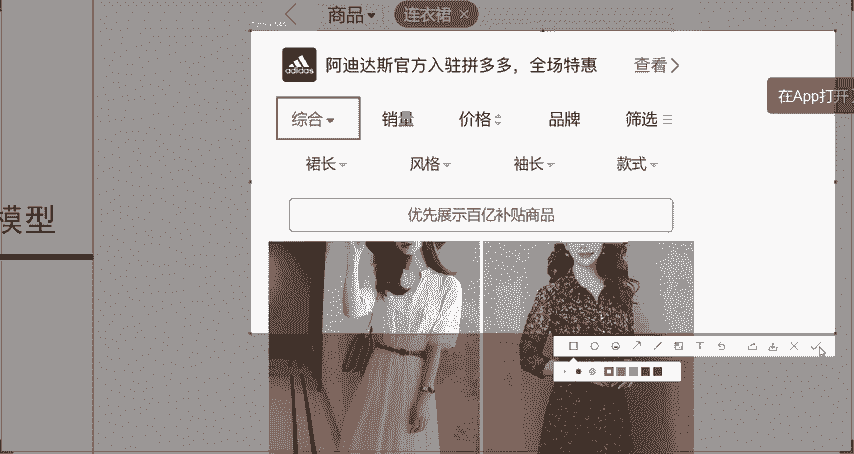
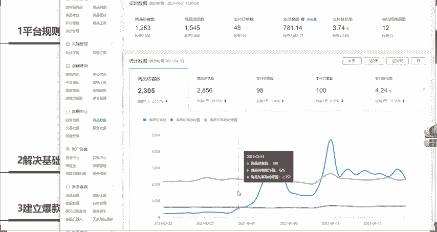
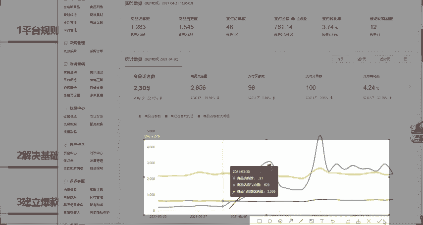
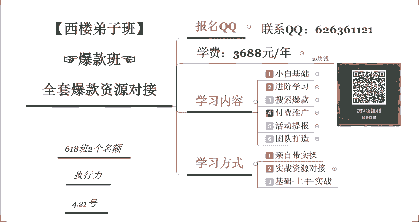

# 【拼多多运营实操教程】最系统的零基础拼多多开店教程全套，电商运营大佬专为学渣研制的新手开店保姆级教程！全程干货，简单粗暴 - P43：43、拼多多开店-最新7天流量打造爆款模型 - -拼多多开店 - BV1BH1qYpEqw

声音和画面都没有问题的小伙伴啊，公屏上扣一，示意老师一下呃，我们今天的这个课程内容呢是给大家讲一下新店到底应该怎么做。那么距离上课时间呢还有1到2分钟的时间啊，那么我们稍微等一下还没有进入课堂的同学。

呃，那么呃已经做好准备的同学呢，我希望大家呢在这一堂课堂里面可以有呃自己的一个收获。好吧啊，那也首先呢欢迎各位来到西罗老师的课堂。

也有很多同学呢是第一次来听我的课啊，先来认识一下我叫西楼啊，然后呢这个坐垫呢已经有8年的时间。今天我们之间的一个认识呢，我相信可以带给大家一些呃新的玩法啊，以及大家可以学到一些新的东西。好吧。呃。

然后呢我们今天课程的呃，还是老规矩啊，还是老规矩啊。第一个环节呢是给大家做答疑。那么大家有关于任何店铺操作上面的问题呢，都可以直接发到公屏上啊，包括说今天呢我会给重点的给大家去讲一下呃。

一个新店到底应该呃怎么样从零一步一步的去进行打造啊，包括呢这一个今天呢给到大家的一个方法呢，也相当于是呃我之前呢在我的VIP地址里面经常会用到的一个最新的一个爆款的一个模型。呃。

近期是有操作了10个店铺啊，那么做起来的有8个啊，做起来的有8个有两个呢是因为呃操作的一个中间呢，这个地址的资金预算不够，所以说呃导致后期的一个流量获取的不是特别多，只拿到了三四百的流量。

那其他的这些其他的这几个店呢。基本上都拿到不错的流量啊，来我们来看一下。呃，首先呢就是这一个啊，这是第一个店啊，这是第一个店。那么操作结束之后呢，整体的一个效果呢是这样的啊。

从3月底的时候开始去进行操作的啊，原先只有这个200多的一个访客。那现在呢是已经冲刺到了1500啊，这是第一个店啊，同样是做这个山药的啊，做这个食品的那第二个呢是做这个海天酱油啊。

做海天酱油同样也是一样的。从这个呃3月底的时候开始去进行操作啊，来刷新一下啊，网络有点慢啊，我们来看一下呃，操作结束之后呢，然后现在每天的一个数据呢，每天可以拿到5000到6000左右的一个营业额。

现在还目前还是在急速的一个增长过程中因为平台给到的流量每天都比较多啊，那么现在也有在同同步的去报活动啊，最早的时候流量都比较少的啊，然后呢还有一些这个新店啊，比如说像这个啊同样也是一样的啊。

同样也是一样的在短。几天的时间里呢，这个店铺就做起来了啊，因为时间关系啊，不能一个一个店铺给大家去看啊，那么今天呢给大家分享的呢就是这样的一个店铺的一个实战的一个案例。好吧啊。

那给到大家30秒左右的时间，那么大家有任何的问题呢，都可以直接发在公屏上，我们先来给大家做答疑，好吧。啊，下午好啊下午好啊，这边课堂的同学都可以听到吧啊，都可以听到吧。啊，像这个阿白啊。

然后还有这个呃房地产代理啊，然后还有这个爱上宝贝对吧？不抛弃不放弃，还有你的笑啊，天马行空，还有时间的过客啊。都可以听到吧。好，大家现在呢在坐店过程中呢，有没有遇到什么问题啊，可以直接发在公屏上。

好吧啊，我等大家一下啊，等大家一下，等大家整理一下各自的一个问题啊。因为大家梳理自己的问题可能需要时间。呃，最近呢我也是发现了一个呃比较好玩的事情啊，就是说呃整个这个市场里面呢有一个比较好的一个产品啊。

叫什么呢？泡泡机啊，泡泡机呃，这个这个其实呢是抖音上火起来的啊。如果说大家可以找到产品的话，你可以考虑去做一下啊，来我们来看一下，比如说像什么加特林泡泡机啊，加特林泡泡机，就是这种小孩子玩的这种玩具呃。

最近呢是也是比较火啊，也是比较火。来，我们来看一下。啊，最近呢也有很多的这个同学呢问我啊，这个产品到底好不好做啊，哪些产品好做啊，哪些产品在拼多多里面比较好卖。这个产品大家可以考虑一下啊。

可以考虑一下加特林泡泡机啊，泡泡机整体的这个点击率和转化率都非常高的啊，都非常高的，而且点击价格非常便宜。新店新品怎么快速拉流量，拉榜拉权重啊，这个呢其实也是我一直在讲的新店新店在进行操作的时候呢。

有几个重要的一个点。第一个你要先看什么呢？店铺的一个层级啊，这是第一个问题。第二个呢，你要先再看一下你店铺的一个基础啊，就是说基础，包括说基础销量啊，基础评价呀。

这些一定要记住在拼多多里面怎么样去考量你的产品到底有没有拿到权重，或者说你做的这些销量到底是不是有效的呢？试看出评的。是看你出了多少评价，而不是说你刷了多少单啊，你刷单的话。

在拼多多里面是没有太大的一个意义的，明白吧？啊，就看你做的这个订单到底是不是被平台收录了。如果说平台没有收入的话，它是不会给你计算入这个GMV的，明白吧？

所以说你的产品呢在做的时候一定要呃一定要去操作这个出屏啊，一定要操作出屏。只有出了评价之后，我们才会计算前重，这是大部分新手在做店的过程中，为什么说呃刷单刷了100单，刷到200单啊，没有任何效果的。

明白吧？这是新店铺所遇到的最大的两个问题啊。那第三个呢就是测图测款。车读这款测读这款呢也是一个非常重要的点啊啊，因为新店在线前期操作的时候，平台会给到对应的基础的流量池啊，给到你流量池之后。

你需要在这个流量池里面表现比较优异。这样的情况下，平台才会继续给到你更多的流量。如果说你这个时候呢是没有去进行操作的那也就意味着平台不会再给到更多的流量，明白吧？

这个就是新店前期拿流量的一个啊大家容易会忽略的一个点啊，那像其他的一些呃基础和操作。比如说主图标题详情页啊，这些呢都是我们一步一步去进行优化的，明白吧？大家这个平时在做这个新店铺的时候呢。

都是怎么样去进行操作的，也可以跟老师讲一下啊，也可以跟老师讲一下。啊，上来就是刷黄，我的天哪呃也。也不能说你们错啊，但是说呢你们对于这个平台呢整个在做新店的时候，整体的这个布局和这个理解。

是相对来说比较差的，明白吧？平台我们在做店的个过程中，不是说你上来刷单就可以了。如果说你觉得刷单真的可以把店铺给做好的话，那我们这个拼多多基本上人人都可以做好，明白吧？所以说还是之前给大家讲的那句话啊。

如果说你想要去创业，想要去做电商，什么东西是核心呢？选品是核心啊，选品是核心。永远要记住这句话，你产品选好了，自然而然就可以做的好啊。比如说我今天给大家推荐的这个啊，我给大家推荐的这个。泡泡机啊。

加特林泡泡机这个卖的好非常火啊，卖的非常火。这最早的时候呢这个产品呢是没有多少的搜索热度的啊，是没有多少搜索热度。就是最近突然间起来的。3月底的时候突然间起来的。现在的话。

每天还有这个1万多的一个搜索量，明白吧？啊，那如果说你可以呃找到这样产品，这个货源的话，或者是你直接去代发啊，代发的话，这种产品也比较便宜的。在拼多多里面来我们来看一下啊啊，比如说加特林泡泡机。啊。

不知道怎么样选产品啊，那其实这个就是给大家讲一下啊。有的时候呢大家也可以去找一些这个比较热门的，或者是抖音里面啊，或者是其他平台里面比较热门的一些产品啊。来搜索养个多点COM。

比如我们直接在这里面搜索搜索加特林泡泡机，大家也可以也都可以看到。像这种产品呢，在拼多多里面呢呃基本上都可以卖到7块钱到8块钱左右啊，也就10块钱左右。你点击进去之后，点击这个购买啊，点击发起拼单。

然后我们就可以看到具体的一个价格啊，比如说像黑色吧啊，然后呢，十包这个浓缩液的，也就是说11块钱左右，但是说实际去代发的话，这种产品需要多少钱呢？我们来1688里面看一下。

一旦说这个产品呢开始火起来之后呢，你去找这种产品啊，比如说加特林合火机。呃，价格都是非常便宜的啊，都是非常便宜的。像这种看到没有？1块钱啊，1块钱。😊，大于两盒以后呢，就可以直接去进行购买啊。

直接去进行购买，明白吧？啊，当然这个需要登录账号啊，需要登录账号。如果说你再跟这个厂家去谈一下的话，你的价格还可以压到更低，明白吧？所以说呢有的时候呢大家这个自己的这个心里啊心里要有数啊，心里要有数。

像这种。呃，抖音的这种儿童玩具啊，这种儿童玩机。当然这个不是加特林泡泡机啊，我们找一个相对来说，比如说像这个你5块钱进货，然后5块钱6块钱进货，然后呢算上你的物流成本，然后你卖个十在拼多里面。

你卖个十多20块钱，对吧？比如说像这种黄金吧啊，买这种220包浓缩液的啊，15块钱16块钱，那完全也是赚的。而且这个产品呢它直接可以卖1。6万件，明白吧？而且也是最近才去进行呃。

这个产品肯定是最近去进行操作的，明白吧？因为这个产品之前是没有的啊，之前是没有的，所以说选产品也是一个技术啊，也是一个技术。包括说还大家还可以去选择什么样的产品呢？比如说电视网络剧。

网络剧里面的同款衣服啊同款衣服。这些都可以选啊都可以选择好吧啊，那关于选选款的这个问题，我们就直接过了啊。好，大家还有没有其他的问题啊？有问题的话，抓紧时间发在公屏上啊，抓点抓紧时间啊。呃。

老师新店新开了之后呢，然后整体的这个去开车了啊，然后呢数据不是特别好。这个是很正常的啊这个很很正常的，新店千万不要直接开车。记住这句话啊，新店千万不要直接开车。因为你的店铺里面呢整体的一个曝光量。

包括说你产品的一个技术权重，或者是你产品的标签都没有稳定的情况下，你去开车的话是拿不到数据的。啊，是拿不到流量的。这个呢我在后面的课程里面呢会给大家详细的去进行分析。啊。

我们平台这个规则现在呢在今年有非常巨大的一个变化，并不在啊并不再像是前面的时候，为什么说大家去年的时候呢，在做店的时候非常容易做，可能刷一点订单或者是开一点直通车，基本上你的产品就可以做到。

那么现在的话为什么做不起来了。原因就在于今年的规则呢有很多的一些改变啊，有很多的一些改变啊。稍后的话我在课程的这个主体里面呢，会给大家详细的讲到都有哪些具体的一个变化，好吧。好，OK啊。

然后呢我看大家这个对于其他的问题呢都比较少，对吧？啊，那这个没有关系啊没有关系。如果说大家现在没有想到的一个问题，或者是现在没有提到的啊，可以直接添加西罗老师的微信啊，这个是西罗老师的微信啊。

那么加到我的微信之后呢，然后呢呃公屏上鲜花走一波。那么我们接下来就正式进入我们今天的一个课程，来给大家讲一讲我们的新店的爆款模型到底是如何来进行呃安排如何来进行配备我们的一个资源。

包括说我们在操作店铺的一个过程中啊，怎么样去安排我们的订单啊，怎么样去获取资源，在获取资源的过程中，我们又会遇到哪些问题啊，详细的来给大家去进行剖析，好不好？好，来啊，已经准备好的同学啊。

公拼鲜花走一波，我们就正式开始了，好不好？😊，好啊，喝口水啊喝口水。OK啊，那今天我给大家分析的这个内容呢，首先第一个我们要解决的东西是什么呢？叫做平台的一个规则。我刚才也讲了啊。

第一个呢我们肯定要先了解平台这个规则。所以说平台的一个规则的一个变化，这是我们第一步要了解的一个事情。在今年的时候不能不能在像之前的时候，我们打造店铺的那样啊盲目的去进行操作了。

要根据平台的一个规则来去进行操作。那么第二个是什么呢？第二个叫做解决基础销量。怎么样去解决我们新品新店新开了之后呢，第一步的一个基础销量。只要你的产品有了基础销量之后，平台才会继续给到我们更多的流量。

那么这个里面呢又有分为很多的一些细节。比如说为什么要做？比如说它的一个意义在什么地方？比如说我们在操作的时候，要用什么样的一个方法去进行操作，包括说我们在做评价的时候，怎么样去做这个工薪评价？

这是我们在解决基础销量的同时啊，要去进行控制的主要的一个内容。那么第三个啊，我要给大家分析的是什么呢？我们的新品在操作的一个过程中，如何来建立报告模型。啊，如何来建立爆款模型？

包括说我们在操作的一个过程中，如何来这个安排计划。也就是说，我们如果说你想要让你的店铺从上而下的有一个完整的体系的话啊，就是说建立模型。建立模型计划。那么第二个呢就是执行计划。啊，执行模型计划。好。

那今天呢主要就给大家讲这三个问题，好吧。好，那呃接下来的时间我们就正式开始啊，我们就正式开始。我们先来讲一下第一个啊，第一个问题，平台规则的一个变化。大家也都知道，如果说我们现在要去做拼多多的话啊。

有一个比较重要的一个点，大家经常可能会听到啊。有没有同学呃在之前的时候是有做过淘宝的。有同学做过淘宝的公屏扣6，我看一下有多少。有没有接触过淘宝的，或者是在淘宝上进行购物的？

那大家在这个操作这个其他平台的时候，有没有听过这样的一个关键词，叫是千人千面。啊，不管说大家听到的是千人千面也好，或者是最新的这个购物模型也好，最新的购物模型是什么？就是货人找货。变成了货找人。啊。

也就是说我们变成了什么呢？消费者升级啊，会有一个这样的专业的名词，叫是消费者升级。但其实就是扯淡。啊，最核心的一个东西呢，其实还是千人千面啊还是千人千面。大家有没有听到过的啊，有没有听到过的。

包括说已经进来课堂，像这个滚烫的人生，还有这个阿白啊。这个在课堂里面呢这个也不讲话，然后呢，也我也不太清楚你们是有没有听到老师讲的这些东西，也不知道你们到底有没有听懂。啊，喝口水啊喝口水喝口水。

我们继续啊我们继续。听到了OKOK啊，我希望在我的课堂里面呢，大家可以积极的互动，把各自的一个问题，不管你听明白了还是没有听明白啊，你要把你的问题讲出来，这样的话我才会知道啊，你现在存在哪些呃问题。

然后呢，针对性的去进行解决。否则的话，这这堂课其实上的也没有什么意义，明白吧？啊，笔记的话不用记的啊，笔记话呢笔记的话不用记的啊，大不了你下课之后，你直接加我微信，我直接把课件发给你就好了，明白吧？

你要重点就要学习的东西是什么呢？就是说思路，你只要你的思路清晰，其实记这个东西记不记，其实都没有太大的所谓。因为我讲完了之后，你们也不一定会学得会啊，我敢保证你们90%的人都是学不会的。明白吧。为什么？

因为这里面差距呢就是。差距在哪里呢？在8年。因为我做了8年的电商，明白吧？啊，大家可能有一些呢是新接触电商的啊，也有可能接触了5年那我们的差距就就只有3年，对吧？阿白啊，基础刷单怎么刷？

那现在的话你是你在操作的时候是怎么样去进行操作的呢？啊，这里面呢是关乎这个基础销量的一个问题啊，就是说在操作的时候啊，方法方法应该怎么样去进行操作。你可以先讲一下你现在是怎么样去进行操作的。阿0。😊。

能不能听到？就是说呃你现在呢比如说你现在已经在做新品了啊，已经在做新品了。那既然说你问出这个问题，那我呃肯定啊你的新品呢也已经自己去进进行操作过了，有可能操作的没有效果。

也有可能呢自己操作的是有一点点效果的，但是并不是特别的满足。那在这样的情况下啊，或者是你学到的你听到的。这个知识或者是内容啊，你是怎么样来进行操作的，或者是你自己的一个想法。我先来看你的想法，明白吧？

有没有想法啊有没有想法，有想法扣一，没有想法扣2。包括说这边的同学啊，这边各堂的同学也是一样的啊，光谷没有想法。哎，没有想法可不行啊啊。😊，不知道去做哪一个流量渠道。那我来给大家讲一下。

今天跟大家问到这个问题啊，我们就先来讲第二个啊。但是基于这个跟这个平台的一个规则上面的一些变化呢，是我们要去呃根据平台这个规则变化来安排我们的基础销量呢。我们先来讲一下这个对应操作的一个渠道。

其实在拼多多里面操作基础销量的一个渠道呢，仅仅只有几个。第一个呢就是分享。就刷了个大单，你刷大单是没有什么问题的啊。新品新店开店了之后，刷大单是没有什么问题的。但是有一个问题是什么呢？

就是说你刷大单的整体的这个金额是怎么样去做的，刷大单做评论啊，做评论。对你方法是没有问题。但是说有一些细节啊，有一些细节呃，在安排这个解决基础销量的时候，我们第一步要考虑的东西是什么呢？

就是说呃操操作的整个渠道。我们可以从哪些渠道去操作我们的基础销量。第一个呢就是分享直接分享链接，打给你店铺的后台啊，比如的打呃都是店铺的后台。打开后台之后呢，点击商品列表。

在右侧的这个位置呢有个分享商品啊，有个分享商品。这里面所分享出去的一个渠道呢，只能分享到你的朋友圈或者是微信里面啊，然后呢也可以去分享到这个QQ群里面都是可以的啊，都是可以的。这个是平台所支持的。

那么这是第一个方法啊，这是第一个方法。那么第二个方法是什么呢？批发单。我们可以使用批发单去做评价。像阿白啊像阿白操作的。做评论做评论怎么样去做怎么样的一个出评率比较高，就是使用批发单。

批发单最主要的一个问题是用来做评论的那分享呢是用来做什么呢？是用来做基础销量的，它就只是说可以给你带来销量。它不会有其他的任何的权重，只会有销量权重，明白吧？因为权重分类分的有很多种啊。

那这是这两种渠道。那么第三个渠道是什么呢？是通过搜索啊，通过搜索关键词，通过搜索关键词，我们才可以拿到排名，我们才可以拿到免费的一个流量。所以说不同的渠道我们所操作的一个目的也是不一样的。

那么第四个渠道是什么呢？是通过直通车。也就是说我们的一个搜索推广啊。通过我们的直通车，通过搜嘴推广，那么直通车能不能给我们带来排名，能不能给我们带来权重？首先第一个排名。

直通哥可不可以提升我们店铺的一个排名？来，大家想一下。批发刷的啊，那OK没有问题啊，没有问题。你前期去做这个评论是没有太大的一个问题的。但是说你要考虑到一个点，就是说我们最初期的时候去去做基础销量。

或者是做评价，那这这是前几天操作的事情呢，是前三天操作的事情。因为我前面的平台规则还没有讲啊，所以说具体的一个时间上的安排啊，我先不给你讲啊，先不给你讲，你要我我要先把这个平台规则给大家讲清楚之后。

我会给你安排对应的一个时间。好吧，我们先来了解渠道啊，我们先来了解渠道。那直通车会不会给我们的商品带来排名了。P发改销量有权重吗？有有个P的权重啊。批发是是哎来，我来给大家讲一下，你们要明白一个点啊。

你们要明白一个点。如果说我作为一个正常的消费者，我想要去购买产品，我是在哪里买的？😡，是不是在这里买的？来。😊，如果说我是一个正常的消费者，我是不是直接在这个位置里面去买的？就是拼多多的APP里面。

对不对？这个是消费者第一个首选的一个购物的一个渠道。那么我想问一下，你在这个位置里面可以找到批发吗？拼多多APP里面能不能找到批发？😡，来，我问一下我我想问一下大家，如果说我作为一个消费者。

我想要去批发里面找你的产品。好，能不能找到，认为能找到的啊，你们可以找到的公屏扣一，找不到的公屏扣2。那这个很显而易见啊很显而易见。你在这里面你可以看到秒杀，也可以看到断码断码金仓这些活动的渠道。

也可以看到类目的推荐，也可以搜索关键词，也可以直接去首页里面去进行查找。包括说你点击个人中心里面，对吧？那这个个人中心需要登录啊，需要登录。😊，在点击个人中心里面，你同样也是找不到什么的。

你同样也是找不到批发的那在找不到批发的情况下，你做批发去改销量，改销量是不是用批发去做的？是用批发单去做的。你搞改销量，那你觉得会有权做吗？会提升你关键词的排名吗？排名指的是什么？

排名指的就是搜索关键词的一个排名，并不是指你在批发商城里面的排名，明白吧？批发在什么地方找批发是对于商家来说的，在采购管里面点击批发采购，它是一个多拼多多批发的这样的一个页面。

跟我们正常买家去进行搜索去进行下单的渠道是不一样的，明白吧？所以说它你可以把它理解为是两个平台，只不过是在操作的一个过程中，批发里面的这些商品的销量是可以累积到这个搜索里面去进行展示的，它只是展示销量。

啊，它只是展示批发的销量。也就是说，实际上我们改销量会不会有权重，是不会有权重的，明白了吧？啊，改销量是不会有搜索权重的，明白吧？它只能是改销量的一个目的是什么？可以提升我们商品的整体的一个销量值。

以及提高消费者的认可度。我们商品整体的这个点击率，包括说转化率会提升。啊，点击率和转化率会进啊会得到这个提升。这个其实它是改销量的一个目的啊，或者是它最重要的一个功能啊，好吧。好。

那我们继下啊那我们继续讲啊我们继续讲呃，我们前面讲到了我们在操作的时候呢，这四种渠道都可以去提升我们商品的一个呃销量。但是说我们实际在做的一个过程中什么时间点应该使用什么样的一个渠道。

这个东西到底应该怎么样来安排呢？那么我们又会回到前面我给大家讲的一个东西，叫什么呢？叫做平台规则的一个变化，首先我们先来看第一个规则，我前面给大家讲了，为什么我们消费者搜索的时候呢，搜索不同的关键词啊。

所看到的商品全部都是不一样的。来，我们来举一个例子啊，我们来举一个例子，比如说我们点击这个女装啊，点击这个女装，点击这个裙装。比如说我点击了这样的一个商品啊，点击了这样的一个商品。

我点击进去浏览了一下啊，我点击进去浏览了一下，对吧？那这个时候呢平台就会给我的这个IP以及我的这个账号呢来进行打标。它会认为我比较喜欢什么样的一个商品呢？我会比较喜欢这个什么啊，就是类似于这种西装套。

群的这种啊连衣裙。那么在这样的情况下，如果说我退出啊，如果说我退出，因为这个时候呢，我是从类目里面去进行搜索的对吧？我直接点击类目进来的那这个时候呢我再去同步去搜索什么呢？我再去搜索连衣裙。好。

我搜索连衣裙，大家会发现，其实我刚才搜索过的这些商品啊啊搜索的这个商品很有可能就会直接卡在比较靠前的一个排名里面。看到没有？就类似于这种款式啊，它会直接卡在对应的一个排名里面。

那如果说比如说我们点击了这个啊什么超仙复古的这个褶皱的这个连衣裙，对吧？点击了之后，然后你浏览一下，浏览一下，然后你可以刷新啊，你可以刷新刷新完成之后呢，你退出。退出拼多多页面。

然后再去再次去搜索连衣裙，你会发现啊你会发现看到没有？刚才我们搜索的看的这个产品呢排名变靠前了。最开始的时候这个链接啊，这个商品呢是排在什么样的一个位置呢？它不是排在第三位的啊，它不是排在第三位的。

而是排在我记得我是在右侧去进行点击的，应该是在这个位置的。明白吧？所以说根据千人千面的一个规则，每一个人在搜索产品的时候呢，所看到的一个商品的一个页面也是不一样的。所以说根据于千人千面的一个规则。

那么我们做排名的时候，排名意味着什么？排名意味着我们的标签必须要进行精准。标签精准了之后，那么我们所获取的流量才会精准。那这个时候标签意味着什么？标签意味着关键词。啊，标签意味着关键词。

也就意味着根据平台的一个规则，我们出我们后期如果说想要使用搜索关键词去进行补单的话，那么我们就要看我们的标签到底有没有定位精准。如果说我们的商品标签没有定位精准的话。

那搜索关键词所操作出来的一个排名也是不精准的拿到的流量也是不精准的。所以说这里面东西有一个关联性啊，有一个关联性。好，那这是其中的一个啊第一条规则啊第一条规则我来给大家标注一下啊，来给大家标注一下。好。

千人见面的规则。那第二个规则是什么呢？是我们平台啊整个平台流量获取的一个准则里面。流量获取准则里面来，我来给大家举一个例子，比如说我一个新店。我一个新店在开店了之后呢，大家也都知道。

在拼多多里面这个综合排名啊，或者是销量排名啊，它的这个综合排名排名的时候都是根据呃根据我们产品的一些销量，包括说产品的这个呃整体的一个增长速度来进行匹配的对吧？那这个综合里面。

我们就来先来看一下这个综合排名，我们到底是可以怎么样去提升它的一个排名啊。

对于一个新店来说，如果说我在一天的时间里面，我刷了10万单啊，或者说我直接刷了1万单。那么大家想象一下啊大家想象一下，我比如说我就是做连衣裙的啊，我就是做连衣裙的。那么我在一个新店的情况下。

第一天我直接做了第一天啊，一天我直接做了一万单。那在这个时候我新店的这个餐啊，这个产品的这个排名能不能卡在前十？能不能卡在这个拼多多整个平台里面排名比较靠前的位置。比如说像这个同行只卖了2000多件。

像这个同行只卖了2000多件，这个同行只卖了3000多件。那么如果说我有一万的销量，我能不能拿到排名第一或者排拿到排名第二的一个位置？来，大家想一下。认为能的公民扣一，认为不能的公民扣2。

来速度快啊速度快。好，有同学说能有同学说不能。那这个位这个东西呢呃其实呢也很简单。根据我前面给大家讲的，千人千面的个规则，每一个人搜索出来的结果是不是都都是不一样的？

对吧那每一个人搜索出来的个结果是不一样的。那么我们的排名能不能卡在前十呢？很明显是不能的。原因是什么？因为它整体呢这个平台里面呢有一个流量获取的一个准则。在在你的店铺是新店的时候。

你是不可能拿到这么多的曝光的。排名意味着什么呢？😡，我们排名，比如说排名第一。排名第一意味着什么？意味着大量的曝光啊意味着大量的曝光。我们刨去呃刨出去这个千人千面的一个影响。

比如说我们刚才搜索的关键词是连衣裙，对吧？那么连衣裙这个关键词每天可以拿到多少的曝光量。来，我们来看一下啊，直接用这个搜索词分析里面直接去进行搜索。比如说这里面我们可以直接搜索连衣裙，对吧？然后呢。

点击查询。那么连衣裙这个关键词每天它有32万的一个曝光量啊，也就是说搜索热度搜索热度有这么多的情况下，如果说刨出群呃，刨去这个千人千变的一个影响。那么平均每天我们所所获取到的曝光最起码也有32万，对吧？

因为我们的商品是排名第一的。那么在这样的情况下啊，那么在这样的情况下，我们每天可以拿到的流量有多少呢？比如说我们有10%的点击率，对吧？那也就是说我们一一天可以拿到3。2万的流量，就是一个关键词啊。

一个关键词，我们拿到3。2万的一个流量。那么在这样的情况下，大家想象一下，新店会不会直接给到我们这么多流量。很显然是不会的，因为平台每一个这个店铺呢，它都会有对应的一个层级啊。

这个大家是对于新店来说一个非常重要的一个点啊，打开你店铺的后台，在这个后台里面呢，我们直接点击这个呃数据中心里面啊，数据中心里面可以直接去进行查看。点击精英总览啊，数据中心点击精英总览。

这里面呢有一个精营层级啊，精英层级这个东西就直接决定了你的流量上限啊，直接决定了你的流量上限。也就是说，即使你的新店直接做了一万单啊，第一天推广的时候推到了一万单。那么平台会不会给到你3。

2万的一个流量呢，不会最多给到你的流量是多少啊，来我们来看一下。打开你的商品数据，然后呢点击同行的均值以及同行的优秀值。也就是说现在这个店铺呢是处于第三层级的时候，在第三层级时候。

平台给到你行业的一个优秀值的一个访客是多少呢？每天最多也就是2到3000左右啊，也就是2000多左右。明白吗？流量限制啊。在第三层级的时候，就是2000多的访客，你再怎么样突破都是上不去的。

你们也可以看一下，当我的流量达到了同行优秀的时候，比如说每天的访客呢拿到了4000多，但是后面的访客一定是会掉下来的，掉下来的整体的一个幅度可以维持在什么样的一个水平呢？也就是行业优秀左右。😡，明白吧？

这就是说为什么大家新店在操作的过程中，你的店铺流量迟迟起不来。你要先去看一下你这里面的这个曲线有没有达到行业均值以上，有没有达到行业优秀值以上。如果说你的商品的数据已经达到了行业优秀值，或者是行业平均。

或者是你这条蓝色的线在处于这个黄色和绿线中间。已经已经有很长时间了，流量没有办法突破的情况。那这个时候呢是你的店铺层级不够，而不是说你。你的这个整体获取流量的能力比较差，明白吧？是你的店铺层级不够。

所以说这里面呢有一个流量获取的准则啊，流量获取的准则，它会对于我们的一个商品流量去进行限制。那么第三个我们要了解的平台规则是什么呢？叫做平台提升权重的一个时间，提全时间。那么大家会发现啊。

根据于我自己实操的一个店铺，我们来看一下我们流量获取的一个增幅。

从原先的291的一个访客，这个是几号30号的时候，那么一一直不断的去保持增长，那么最多可以维持多长的时间。

提前时间，也就是说增长率。大概有多长的一个周期来，我们来看一下，从30号啊开始，从30号一直到31号开始增长，一直增长增长增长增长到4月5号左右的时候啊，增长到4月5号达到了一个顶峰。也就是说。

提升权重的时时间是3月30号，一直到4月5号，总共有多长时间？3月份是有31号的，总共也就是7天的时间，对吧？303130呃3112345，总共是7天左右的时间。也就是说如果说你的平台啊。

你的整个店铺的一个流量想要去保持增长的一个状态的话，最多不会超过7天。也就是说如果说我们前期在进行补单的一个过程中，大家都也都知道，我们在操作的时候啊，操作的时候，渠道我们安排好了。那么操作的这个订单。

以及时间上的一个安排。那么我们都知道要操作递增。那递增的一个最长的一个周期是多长时间，也就是7天左右的时间。因为整个平台我们按照真实真实的访客，以及真实的数据来进行呃查看的话。

基本上也就是7天左右的一个增长率。那如果说你的产品呢已经超过了7天的一个增长啊，那么你的这个产品可能就是不正常的。有很有可能会被平台直接监控到，监控到之后，意味着什么呢？意味着你的店铺被查。

你的店铺一旦被卡，就是降权啊，就是降权，会给你删除销量，包括说会给你对应的一个虚假轨迹，明白吗？所以说我们操作订单的时候啊，我们的时间啊，我们操作订单的一个数量以及时间是跟什么东西关联的。

是跟提全时间有关联的。根据平台这样的一个规则啊，然后来安排我们的一个订单量。好吧，好，这个呢就是我前面要给大家讲的平台规则上面的一些变化。大家都有没有听明白的啊，有没有听明白的。

可以听懂的同学公屏扣601老师一下，我们就接啊，我们就继续往下讲了。如果说没有明白的，直接把大啊大家可以自己把自己的一个问题发出来，我会给大家去进行解决，好吧。好，OK那么这个时候呢。

我们又回过头来来分析一下啊，来分析一下我们在解决第一步基础销量的时候，为什么说在第一周的时候，我们要做这么多的销量？基础销量可以有什么样的一个意义。怎么样？

这些我们做这些基础销量最终的一个目的到底是什么？首先第一个啊大家可能也都清楚的啊也都比较清楚的。第一个啊可以给我们店铺带来的这个好处是什么呢？是提升宝贝转化。提升产品的一个转化率。

并且呢累积销量可以提报活动啊，为了提报活动。因为后期如果说我们想要去进行冲刺的话，想要去进行提升的话，无可厚非的一定是会用到活动推广的，明白吧？所以说这是这个点啊，这是第一个点。

我们解决技术销量可以给我们带来一个好处。第二个是什么呢？是影响消费者的购买欲望。比如说同样的一个商品，我们大家都是卖键盘的。对吧你的键盘是这个型号，我的键盘也是这样的一个型号。

那么我的销量呢是10万加啊，你的销量只有这个1万啊只有1万。那么大家想象一下啊大家想象一下，如果说你作为一个消费者的话，你会买哪一个产品，你会点击哪一个产品。我相信大部分人都会选择10万家销量的。

为什么？因为人云亦云，大部分人说这个产品做的比较好啊，包括这个我们假设的一个情况呢，就是说所有的基础条件啊，商品的基础条件都是属于一个平均水平的啊，都是属于一个平均水平，大家都是一样的。

比如说我有1000的这个评价，你也有1000的评价，但是我的销量是10万家。那消费者肯定是会优先选择10万家的商品去进行购买价格方面啊，或者是售后服务方面啊，这些啊全部都是一模一样的。那在这样的情况下。

消费者肯定就直接选择10万家10万家的商品了，对吧？啊，这是这一个点啊，它可以直接影响到消费者的一个购买欲望。那么第三个是什么呢？第三个可以给我们带来一个实际意义，就是测图测款的准备工作。

在测图测款开始之前，我们的商品必须要有基础销量，没有基础销量会导致你的测图测款出现什么样的一个问题呢？第一，我们测试的数据不精准。可能相对来说就会比较偏差。因为你的产品没有基础销量，没有基础销量。

也就意味着消费者不会点击，不会购买，也不会受藏架购，明白吧？所以说会导致你测试的数据相对来说比较小，那么数据就不精准了。那么第二个是什么呢？在没有基础销量的情况下，你的商品的基础权重。是不是很低？

在商品基础权重很低的情况下。那么我们开直通车的一个原因是什么？目的是什么？是不是为了卡排名，那么排名有一个什么样的一个公式，等于我们那个权重分啊，也就是说关键词的质量分，然后乘以。出价。😡，明白？

当你的商品的基础权重很低的情况下，你的基础权重分啊，你的基础权重分同样也是很低的。那么在这样的情况下，你的质量分变得很低，那么你的出价就会变得更高。那么只有这样的情况下，我们才才可以拿到对应的个排名。

所以说也可以为你减少一大批的支出，明白吧？这个是测图测管的一个准备工作，这就是我们为什么说要在新品前期的时候去解决基础销量。那么我们在进行操作的过程中，前期到底需要做多少的销量。

以及做完之后可以达到什么样的一个效果。来，我们来实际看产品操作的一个案例。在最初去进行操作的时候，我们来先看这个商品啊，这个商品呢最初在进行操作的时候是从什么时间开始去进行操作的呢？呃。

我们呃直接看30天的数据啊，直接看30天的数据。啊，这里面看不到30天的数据啊，来来我们来直接看店铺啊，直接看店铺后台。呃，这个产品是什么时间开始进行操作呢？是从30号的时候啊，也就是说十几号啊。

搜索商品ID啊搜索商品ID具体操作的时间啊，来，我们来看一下商品列表。直接点击查询啊直接点击查询，看到没有？商品创建的时间是什么时间？商品创建的时间是什么时间？3月29号？

也就是说我的产品呢是从3月30号的时候才开始去进行操作。那么这个产品啊那么操作结束之后，那么整体商品的一个数据是怎么样去保持增长的呢？来我们来看一下，从30号开始，店铺里面呢本身是没有任何的啊。

这个商品呢是没有太多的一个访客的，基本上访客都是0。因为商品新上架嘛，对吧？上架的第一天，那么店铺里面是有291的访客，这些都是店铺其他商品的一个基础啊，这些都是其他商品所带来的。

那么在新品上架的第一天我们直接拿到了200多的一个流量，明白吧？就直接拿到了200多的流量。那么我们也可以看一下订单数。在30号的时候，我们支付买家数是20个。那么第一天的时候。

这个商品补了多少的订单呢，直接补了10单啊，直接补了10单。所以说他在第一周期做完之后啊，第一周期做完之后，3月30号。开始操作啊开始操作。第一天。直接做了多少订单？十单。

十单至于具体的这个十单到底是怎么来的啊，下面的话我下面我会具体的给大家去讲这个十单是怎么来的啊。我们先来看一下每天订单的一个安排量。那这是第一天订单的一个安排。那么第二天啊，我来看一下4月1号的时候。

4月1号的时候，我从十单，我从30单变成了40单。也就是说我第二天的时候操作了多少。第二天在操作的时候，直接操作了20单。好，我们继续再来看第三篇。4月1号结束，4月2号直接拿到了53单啊。

直接拿到了53单。也就是说在第三天的时候，我操作了多少单，操作了30单啊，操作了30单，明白吧？每天的一个订单量是保持在增长的一个状态。第一天十单，第二天20单，第三天30单。

以这样的一个比例在进行增长的时候呢，在第三天的时候，我就有了对应的一个真实订单啊，我就有了真实订单三单。明白了？我们就不看之前的一个数据。之前的话我们每天可以卖20单，对吧？那么在这样的一个情况下。

我们就只看我们单品的一个数据啊，只看单品的一个数据。在4月在4月2号的时候，直接拿到了53单。那么在4月3号的时候一定要注意啊，4月10呃，这个4月3号的时候是一个节点啊，是一个节点。

因为我之前的时候最早的时候呢，给大家讲过一个问题，我们平台的收录我们商品的时候，提全的周期是多长的时间。😊，有没有同学还记得的？😡，在整个拼多多平台里面啊，整个拼多多平台里面平台收入的时间是多长的时间？

收入权重时间。那其实这个点也非常的好理解啊也非常好理解。那这里面呢我教大家在店铺后台里面怎么样去看打开你店铺的后台啊，打开店铺后台，然后点击这个推广工具，点击搜索词分析。在这里面呢。

我们可以看到这个搜索词的一个排行榜。那么统计的时间是不是就是平台收录的一个时间。😊，对不对？😡，平台只有收录了数据之后，他才会去进行统计，对吧？那多长时间统计一次，3天7天、15天。

也就是说我们实际在操作的一个过程中呢，我们店铺啊想要去进行提升，所有的操作都是3天一个周期，三天一个短周期，7天一个中周期，15天一个大周期。所以说在第四天的时候，我们的新品上架。

第四天的时候是一个节点。第四天是一个节点，第七天是一个节点。好，那么我们来看一下第四天我安排了多少人。第四天在操作的时候很明显啊，大家也都可以看到第四天是什么时候，30号啊。

31号这是第一天、第二天、第三天、第四天，第四天的时候，我的访客直接从1000直接暴涨到了2000，原因是什么？是不是平台给到我们对应的流量了？在第四天的时候直接报涨到了多少订单。来。

我们来看一下第四天，也就是说4月3号的时候，直接115单。啊，店铺里面的总订单数直接达到了115单，并且平台给到的一个访客数。然后多少？2246啊2246。当然这里面呢其中有200多订单呃。

200多的一个访客呢是属于其他商品的。也就是说访客直接给到了2000。啊，一个单品的访客直接给到了2000。那么在这样的情况下，大家就可以理解我们前期在前三天的时候应该怎么样去进行操作。

现在思路清晰了没有？来，听懂的同学公屏扣6啊，听懂的同学公屏扣6。前三天是不是已经搞定了？😡，好，前三天我们操作的订单量，第一天十单，第二天20单，第三天30单啊，同样啊同步的啊。

我在操作的时候是怎么样去进行操作呢？使用操作计划表啊，使用操作计划表来，大家来看一下。看到没有？新品在操作的时候啊，基础期前三天啊前三天第一天十单，第二天20单，第三天30单。

那么我们从第四天开始的时候，就要根据平台的一个访客来进行操作，比如说我们想要控制到10的一个转化率。当时在进行操作的时候，平台给到了多少访客给到了2000的访客。

也就是说我们的店铺呢可能需要达到这个220%单。那实际在操作的一个过程中，我们有没有做到这么多呢？并没有做到这么多。因为根据于平台整体的一个规则，平台的支付转化率是多少，6%左右，也就是说6%到7%。

明白吧？6%到7%。那么按照这样的一个平均转化率来说，那么这个表格里面，我们这里面的一个转化率就需要填多少呢？填6%。明白吧？这里面就需要填6%，也就是说平台给到我们商品的一个访客啊。

如果说我们做6%的一个转化率，我们店铺里面的订单需要达到多少，需要达到140单。那么大家会发现在第四天的时候，我店铺的一个订单直接做到了110单啊，110单。那么为什么说数据没有达到那么多呢？啊。

没有达到大家所看到的140单呢？原因是因为我的商品其实在当天的时候没有那么多的访客，明白吧？来我们来看一下啊，从啊4月。4月3号之前那个数据看不到了。其实当时最早的时候给到的这个访客数啊。

有没有2000呢？没有2000啊，只有1600左右。啊，只有1600左右，1600到1700左右，其他的都是其他的一个商品。比如说像这个商品每天就可以拿到这个呃，比如说看昨天的数据，对吧？昨天的数据。

我这个商品是多少呢？是1923。那么昨天整体的数据是多少呢？是2306，也就是说有600多的访客都是属于其他的一个商品的，所以说同样的，在4月3号的时候也是一样的啊，4月3号的时候也是一样的。

2200啊2246，然后这样的一个访客减减去店铺其他商品的一个访客啊，其他商品的一个访客也就是1600左右啊，1600左右的一个访客。所以说我们在这一天的一个数据呢，直接需要做到多少呢？

需要做到112单。那么同样的啊同样的。4号啊4号4号的时候呢，我们的访客直接达到了29002900减去600啊，2900减去600。也就是说我们这个商品的数据拿到多少，拿到了2300。

那么我们的一个支付转化率做到多少呢？支付转化率是6%，也就是说我们需要做到多少单，160单来，我们来看一下具体的订单数，看到没有？在4号的时候，我是不是安排了168单啊，是不是安排了168单，明白吧？

所以说那现在呢操作的一个周期呢就已经一目了然了啊，包括说在第四天的时候，我们做了这么多啊。好，我们来记录一下第五天。第五天的操作超作了160单，那么访客达到了多少呢？访客达到了两啊2900减去600啊。

减去600等于2300。那么这个访客是多少呢？2200减去600啊，减去600。因为这600是属于其他商品的，我们不计算在内。也就是说1600的访客啊，1600的访客。那么根据于转化率。

我们控制的6%左右的转化率110多单和160单。那么同步的在第六天的时候。在第六天的时候，如果说平台给到了我们5000访客。来，大家想一下要做多少，我们6%的一个转化率。

那么我们的店铺是不是就需要达到300单？老师不是第四天开始转化率参考行业均值吗？对。第四天的时候，我们就要根据转化率来去参考均值。但是我们实际操作的过程中，是不是每一个商品都是从第四天去进行操作呢？

也并不是因为每一个商品提升权重的时间周期都是不一样的。我的商品呢是在第三天的时候去进行收入的，明白吧？我的商品是在第三天的时候是去进行收入的，大家也可以看到。

我的商品呢在3月29号33月29号上架了之后，从这个3月30号第一天开始去进行操作。那么操作完三天之后，在4月2号的时候，平台是给到我访客的，平台从600多的一个访客直接给到了1000多啊。

也就是说平台给到了我流量，一旦平台开始给流量。那这个时候我们再去操作关键词再去控制转化率，明白吧？如果说在第四天的时候。第四天，如果说平台没有给流量。那么我们能不能按照这样的方法去做，就不能。

那这个时候第四天如果说没有给流量的话，那么第三天做完之后，那么我们后期还需要递增。那那在第四天的时候，我们就去做40单。第五天的时候就做60单或者说60单或者是80单，明白吧？

按照这样的一个比例做这递增，坚持做完第七天。如果说第四天做完之后没有数据，那么在第七天一定也会给数据。如果说在第四天没有给到流量，那么我们就第四呃第七天去看流量数据。那么当平台给到我们流量数据之后。

那么我们就可以开始控制转化率。这个节点非常非常的重要啊，要根据平台看平台有没有给你流量。如果说没有给你流量，你是没有办法继续往下去进行操作的。好吧，走一步看一步，而不是说直接把计划给到你之后。

你可以盲目的去进行操作。并不是。这个点能不能明白？明白的话，公屏扣1啊，明白的话公屏扣1。所以说我们在第一周期结束之后，我们的访客可以做到多少呢？最终达到的一个效果。也就是说我们的单品访客拿到了多少呢？

行业优秀值。啊，我的单品呢拿到了行业优秀值的一个访客。比如说3000左右的一个访客啊，3000左右的访客，3000减去600，也就是2200左右。那平台给到的这个最多最大的一个流量渠道。

优秀值的一个访客访客数是多少呢？是2200多。那么我所拿到的一个行业优秀的一个数据是多少呢？是3000，然后减去600。啊，减去这个其他商品的600等于多少呢？等于2400。也就是说2200左右啊。

2200左右，这个就是我们最终可以达到的一个效果，这是第一周期。好，第一周期大家都搞清楚了没有啊，都搞清楚了没有？搞清楚的公屏扣1啊，公屏扣1示野老师一下，我们就继续往下讲了啊，继续往下讲了。😊，好。

其实这个东西效果指的是什么呢？就是建立我们操作计划的一个模型了，对吧？啊，这里面呢我们把它放在这个模型里面啊，放在模型里面。好，那么接下来我们继续看第二个啊，我们继续看第二个。

第二周期我们在操作的时候应该怎么样去进行操作。首先渠道啊前面的时候呢，我们我们讲清楚了，在从这个3月30号之后呃，开始操作之后，第一天以及以及一直到第七天。一直到第七天，这是我们第一周期的操作。

第一周期的操作。好，订单量我们知道了。那么下一步我们来讲一讲在同步控制订单量的时候，我们应该怎么样来安排对应的渠道。前面的时候我也讲过，我们的一个操作订单那个渠道分为几个渠道呢？分为4个。第一个分享。

第二个批发，第三个搜索关键词，第四个直通车。来，大家来想一下，这7天。这7天的时间里面，我分别是怎么样按照这个渠道来进行划分的。单量集中一个时间点做完，还是分布到每天不同的时间段去做两个小时看一次。

两个小时看一次。明白吗？每两个小时里面都要有必须呃都必须要有对应的订单量，不是说把所有的订单量全部集中在一个小时里面去进行操作的。好吧。😊，好，那我们来讲一下啊，我们来讲一下渠道。

那在对应的讲这个渠道的一个内容里面呢，我们又要讲到一个东西叫什么呢？叫做平台规则里面的东西。平台在收入我们权重的个时间是3天。7天和15天对吧？也就是说，平台第一次收录我们的商品。

我们的商品呢是3月30号。3月29号的时候上架的啊，29号晚上上架。我们的商品上架了之后。那么他收录我们商品的时间啊，需要3天的时间。也就是说它需要到什么样的一个时间点可以收录完毕呢？

就是从这个29号啊到30号晚上，31号晚上，以及到1号晚上，也就是说4月1号晚上。10点。啊，4月1号晚上10点的时候，他才会收录完成。因为我们上架的时间是什么时间？也是晚上10点啊，也是晚上10点。

啊，晚上10点多确定行上架的。也就是说那这个时候呢，我们需要在4月1号晚上结束之后，也就是4月2号的时候来看平台给到我们多少的一个访客来决定我们最终的一个操作量。那首先我来问大家一个问题。

平台在进行收录我们商品的时候，前三天是没有收录我们的商品的。在平台没有收入的情况下。我们应该用什么样的一个方式去进行操作？应该用什么样的方式去操作这几十单。第一天我们要做十单，第二天要操作20单。

第三天要操作30单。那在平台没有收入我们商品的情况下，我们应该从什么渠道去进行操作？一分享二、批发。3、搜索关键池。4、直通车应该从哪一个？1234，大家把自己的答案发在公屏上。😡，来，大家想一下。

当我的新品上架了之后，平台还没有在还没有收录我们商品的情况下，那么前三天啊前三天我们应该用哪些渠道来去做？用第几个，第一个还是第二个。😡，第一个第二个都可以啊第一个第二个都可以。

所以说因为为什么说这个时间点我们要去用分享。😡，因为平台没有给到我们对应的一个。使用分享的一个原因是什么？因为分享它是属于什么呢？属于私域流量，它是属于发到朋友圈里面的。

它是我们自己身边的人去发动来去进行购买的那在这样的一个情况下，我们去进行操作的话，平台是没有给到我们推荐流量的。平台没有给到我们推荐流量。那这个时候我们从自己的私域流量里面成交了，是不是非常的合理啊？

😡，对吧。啊，是不是非常的合理啊？那如果说前三天的时候，你使用关键词去进行操作的话，我会我你可能找不到你的产品。也有可能你操作完之后，直接就会被判虚假轨迹。因为这个前三天的时候。

平台还没有去收录你的产品，还没有给到你关键词的一个推荐。那这个时候你就直接用分享去做了，你觉得现实吗？你觉得可能吗？是完全不可能的对吧？所以说前三天我们要用分享或者是批发。PY是用来做什么呢？

是用来做评价的。那分享是用来做什么呢？是用来做基础销量的对吧？那么当我们分享批发做完之后，在第四天。也就是说4月1号4月2号的时候呢，我们直接查看在第四天的时候，这个平台给有没有给到我们流量。

如果说平台给到我们流量了，那么在第四天以及第七天的时候，我们应该用什么样的个方式去进行操作？来想一下1234啊，分享批发搜索关键词和直通车应该用哪一个渠道？啊，这四个渠道应该用哪一个渠道？😡。

来给大家标注一下啊。第一，分享。第二批发。第三，搜索第四直通车。好，非常好啊非常好。大部分同学都知道，当平台开始给我们流量的时候，我们要使用搜索去进行操作。也就是说这个时间节点啊，从第四天一直到第七天。

我们都是使用什么来进行成交，使用关键词来进行成交。那么在使用关键词去进行成交的时候，那么这个比例到底应该怎么样去进行安排？我们的模型到底应该怎么样去建立？怎么样去建立模型？😡，建立模型的时候。

大家要考虑到一个点啊，要考虑到一个点，你在前三天的时候全部都是使用的这个搜索，都是使用的分享来去进行操作的。但是在第四天的时候，你的流量突然间暴增了，你的流量突然间暴增了，对吧？

那么你的订单量对应的也暴增了。那这个时候我们能不能在115单全部都使用关键词。😡，这个现实不现实？😡，很明显是不现实的对吧？平台给到你几千的访客，然后呢，你要用这个关键词，所有的。

而且是第一天给你关键词，你的关键词就一定会有这么多的成交量，那是不现实的，明白吧？所以说在建立模型的时候，重点的这个核心在第四天操作的时候，我们的这个关键词渠道。渠道安排是不是仅仅只有关键词。

并不是关键词占绝大多数。那么同步我们也要安排分享和。和批发。分享和批发做多少？😡，可以保持原味不动。也就是说在第四天的时候，我们可以做30单批发。因为前面的时候我们的订单，我们的批发是不是30单，对吧？

那这个时候呢我们安排30单批发。也就是说我们现在在自己的私域流量里面，我们还在正常的去进行推广。我们每天可以保持稳定的一个出单，我的私域流量做的是非常不错的那在这个时候平台给到我们的流量。

我们再去做关键词成交。那么也就是说我们第一天在操作的时候，关键词成交成交了多少单。😡，75单对吧？好，关键词成交了75单，总共加起来是115单。那么同步的在第五天操作的时候。

这115单到底应该怎么样去安排？分享安排多少单？😡，分享要不要继续增加吧？😡，来，大家想一下啊想一下分享还要不要继续增加了。😊，在第四天的时候，我们分享已经做到了7呃，已经做到了这个啊30单。

那么在这个时候我们的关键词要保持增长啊，我们的关键词要保持增长，剩下的全部都是批发。所以说我们要以关键词为核心。关键词在进行增长的时候，以一个什么样的一个增长比例呢，来大家来看一下啊。

大家来看一下我在实际操作的时候，我们直接来查看数据，在4月2号的时候，我的我的这个订单啊，我的整体的这个订单量上升幅度有多少。从52啊从53单啊啊，不对啊，从4月3号的时候开始算啊。

4月3号115单直接增长到了168单，这增长了多少的比例。115单直接增长到了160单增长了多少比例。这个会不会算？😡，这个都会算吧，50%，对吧？160减去115，再除以115。

大概就是40%到50%左右。所以说那么我们的关键词的订单需要安排增长多少的比例，按照增长比例来进行控制。同行啊，我们的一个整体数据增增长了这么多。那么我们的批发需不需要增长，关键词需不需要增长。

同步也是需要去进行增长的，明白吧？我们关键词的一个比例75单乘以50%，也就是说加50%的个订单啊，75除除以2啊，75除以2的话是呃35单，37%单啊，也就是说75加37。75加37。

那么这些所有的订单全部都通过搜索关键词去进行成交，也就是有也就是多少？110122单，对吧？啊，12022单，那剩下的全部都是批发，那批发是多少？38单。有没有问题？

这就是第五天的一个数据增长的一个安排。同步第六天的时候，我们还需不需要保持增长，同样也需要保持增长，保持50%啊，30%到50%的一个增长量。啊，30%到50%的一个增长量。也就是说在第六天的时候。

我们那个渠道安排啊，第六天的时候。第六天的时候，我们的一个渠道安排，分享和批发到底应该怎么样来进行安排。好，那这个时候呢我们就需要122乘以1。5。这个是搜索单啊这个是搜索单。

那剩下的啊剩下的比如说在这个4月4号的啊，4月44月5号的时候，平台给到我们的访客同样啊同样是3000啊，同样是3000。也就是说在3000访客的时候啊，30千0访客的时候。三年的访客6%的转化率3。

368180单。那么这180单里面，我们分享和批发到底要做到做多少。那这个时候呢，我们就同步拿这个计算机来进行计算一下，122乘以除以2122除以2是总共是6061单，对吧？

那也就是说搜索单我们需要做多少，122加上61啊，最终呢等于183单啊，183单。也就是说，我们的搜索订单需要达到183，那搜分享和批发需要达到多少？0。😡，就不需要做这么多了啊，就不需要做这么多了。

因为我们搜索的订单已经直接拿到了最终所有的一个数据。所以说大家会发现分分享和批发的这个订单只是用来维持我们店铺的一个转化率的，并不是我们店铺里面必须要拿到这个啊分享和批发，并且我们在操作的时候。

关键词要不要进行安排，关键词也是需要同步的比例去进行安排好的，明白吧？所以说第六天第七天同样也都是这样的一个操作。那么最终我们的模型就出来了。啊，我们最终的模型就出来了，前三天应该怎么做？

前三天全部是分享以及批发啊以及批发。那么最终的核心啊，在模型建立模型的时候，那么核心是什么？核心是第四天啊提全周期。看一下是第四天还是第七天。如果在第四天可以给到我们的流量。

那么我们第四天就开始进入关键词。如果第七天给到我们流量啊，那么我们第七天进入关键词，那关键词操作。的时间节点。根据平台的流量来进行匹配。啊，根据平台的流量来进行匹配。

那么在如果说我们第四天的时候有了流量啊，有了流量，那么关键词保持递增。开始操作数据啊开始操作数据之后，关键词。此数据保持增长，增长比例30%到50%，操作一个周期。操作一个周期结束，然后看效果啊。

然后看效果。那其他的如果数据不够啊，如果数据不够，使用分享和批发。保持好坑产。和订单量。以及转化率。所以说前三天我们在操作的时候呢，核心是什么呢？分享和批发来进行操作。那么后期我们在操作的时候呢。

分享和批发就仅仅只是用来维护转化率了。关于这个整体的一个模型以及我们模型的计划的一个执行以及安排，大家都还有没有问题啊，有没有问题。每一天的一个操作呢都给大家讲的非常的清楚，非常的明白了。

以及我们在建立模型的时候，这个模型到底是怎么样去建立起来的，以及最终的一个操作的时候啊，核心的一个注意点。啊，通过这样的一个方法，那么我们最终在操作这个模型结束之后，我们的单品访客突破。突破了多少？

2600个。每天的访客可以达到2600，每天可以卖多少单，那卖100多单啊，卖100多单。那在这这个时候呢是每天100100多单，明白吧？现在的话平均每天也是100单，就仅仅只是这一个商品。

那么这一个商品做起来了，我想问一下大家，第二个商品你能不能做得起来？第三个商品你能不能做做得起来？第二个店铺你能不能做得好？所以说在最终爆款模型啊，建立起来执行计划的一个过程中，那，最终就是爆款复制。

来，大家觉得通过这样的一个整体的一个思路下来，大家觉得坐垫难不难？做点难不难？其实最终的啊核心还是根据平台规则的一个变化，解决。包括说我们前期在解决这个基础销量的时候，都有哪些渠道。

所以说有很多的一些细节大家所需要注意到位。没有了。所以说操作店铺真的不难，但是说你想要真正的做好，最好是什么呢？找一个有经验的人来带你。如果说啊包括说今天给大家分享的这样的一个案例。

以及我们实战的一个模型呢，我也在这个近期呢也是自己有实操过的，并且呢在最后的这几天里面啊，因为大家都知道我最近呢在做什么呢？在做618爆款班。我的爆款班呢，这几个都是我爆款班的例子啊。

包括说第这是第一个啊做这个食品的啊，从这个2289的访客直接突破到了1800多，也就是仅仅是半个月到一个月左右的时间，这是第一个例址。第二个例子原先呢只有1000多这个访客。

现在呢直接冲刺到了每天可以有4000多的一个访客，每天500多单啊，每天500多单，每天都在不断的去进行递增。包括说像这个例子同样也是一样的。最开始的时候呢。

店铺的一个流量呢也都是300多2300左右的访客，现在每天有2000多啊，最起码在这一个月的时间里面，我的爆款班的地子呢，流量都翻了10倍。所以说如果说有想要加入爆款班的啊，最后呢我还有3个名额啊。

三个名额。啊，最后还有三个名额，如果说有想要来的，公屏扣6啊，公屏扣6，我们就直接开始。好吧，可以直接加我的Q好吧。啊，618的名额呢，今天我也给到大家啊，包括说我其他的地址呢。

我也都会匹配到对应的一个资源。为什么说他们可以执行力啊，执行到位。因为我们的店铺在操作的过程中，我需要你们带上什么呢？带上带上你们的执行力，并不是说我教了你们方法之后，你们就一定可以做好。

所以说你要有执行力。那执行力这个东西，或者说我们对应匹配的一个资源，到底在哪里找呢？这些东西呢，你都不需要担心，也是我今天给到大家最最大的一个福利啊，最大的一个福利。因为这是我618爆款班。

最后的三个名额了啊，搜完了之后，我618就不带了啊就不带了，因为没有时间了啊，没有时间了，这一个月的时间，你从5月份从现在开始学习5月份开始去进行操作。那整个一个月的时间基本上都在打到爆款，明白吧？😊。

所以说如果说有想要学的，直接加我的扣626361121学费3688啊，学费3688。然后我来给你讲一下我的爆款班的一个地址啊。今天呢给到大家的一个最大的一个福利就是实战资源的一个对接啊。

实战资源的一个对接。我给大家准备了很多的一些资源。包括说大家在前期聚基金操作的时候，我的这些地址呢同样也都在用的啊，同样也都在用的。首先第一个。😊。

数据分析的工具啊数据分析的工具大家有都知道店吧啊店报查看同行的数据。如果说你要自己去进行购买的话啊，那这个呃工具如果说你自己要去进行购买的话，需要花多少钱呢？需要花15999，也就是1000。

然后呢去买一个终身的一个会员啊，这个东西我会直接分享给你啊，直接共享给你好吧？第二个啊评价单，也就是说前期我们在执行的过程中，怎么样把我们的商品可以做出高出评啊，高出评的一个资源。

出评率可以达到80%以上啊，可以达到80%以上。如果说不出评价，这个资源是不收钱的，明白吧？所以说我这是独处于我西楼老师的一个独有的资源，明白吧？我不会在公开课上把把这个资源直接给到大家。

我只给到我的这个爆款班的地址。如果说你想要来的啊，我这个优质的资资源直接对接给你，包括说补完单之后，然后呢，我们去发货发货的一个物流1。2啊，1。2，不需要你。自己去发红包，你发红包的话。

可能你需要3块钱，4块钱左右，明白吧？所以说可以极大的降低了你的成本。因为前期我们要操作的一个订单量可能会比较多。第一天十单第二天20单，第三天30单。这样的个比例去保持增长的话，很很多人吃不消。

那为了保证你们的执行率可以跟得上。为了保证你们你们的资金链条可以跟着上。所以说我给大家找最便宜的资源。并且今天如果说报名的话啊，人气收藏，我直接送你们500个啊。

送你们500个店铺粉丝送你们1万个改销量的资源直接改10万家销量的一个资源啊，大家也可以看一下这个商品，我实际在操作的过程中都是改过销量的。如果不改销量的话，我是不会去进行操作的，明白吗？看到没有？

全部都是10万家的一个销量，明白吧？所以说改销量的技术我会直接给到你啊，包括说DSR的资源和活动资源，全部都会给到我的报款班的地址，好吧。啊这个方法需要配合直通车测图嘛，前期肯定是需要进行测试的。

明白吧？测图测款是第一步。所以说为什么说我618的地址呃，这个搜完了之后就不搜了。616118的这个爆款吗？为什么说收完这三个就不收了？你你们看一下现在今天几号了，来，大家。😡，打在公屏上，今天几号了？

😡，大哥们啊，今天已经21号了，4月21号，4月21号的一个时间，我要确保的东西是什么呢？是可以把你们带起来，我用足够的时间把你们带起来，你们要去进行学习。首先你你们先要把这个方法给学会，学会了之后呢。

你前面要去进行测图测款，那最起码也需要一周左右的时间，对吧？那这一周左右的时间结束了之后，那从什么时间开始操作呢？从这个呃4月的底啊，4月底从这个4月的30号或者是5月1号开始去进行操作。

那操作起来需要多长的时间。你第一遍操作，你敢保证你百分之百就可以执行到位嘛，也不一定，对吧？所以说要留出对应操作的一个时间。所以说我618的一个时间呢已经不多了，仅仅也就是半个月左右的时间，明白吧？

所以说最后的三个名额啊啊包括像这个不包弃也不放弃啊。如果说你想要来的啊，直接这个公屏上啊，直接公屏上加我的QQ啊，直接来就可以了。学费啊也刚才也给大家讲过了啊，3688独属于这个618的一个爆款班。

好吧。啊，然后的话这个像课堂里面的其他的同学啊，如果说有什么样的一个想法，或者是对于学习上面的一个规划或者安排，或者说对于我今天给大家讲的这些内容有任何的疑问，可以直接发给公屏上，直接跟老师讲就可以了。

好吧。啊，然后呢，我看到有同学加我了啊，加我了。然后呢，我这边通过一下啊，这边通过一下，你确定好了之后呢，你直接加加到我之后，你在这个给我发消息，说老师，我要跟着你学齐老老师。

我要跟你学学这样的一个方法，我要加入你的618报款班，直接来就可以了。626361621，好吧。包括说前期的时候我是怎么带啊？首先第一个我会教你使用这样的一个工具啊。

使用这样的一个工具去查看同行的一个数据。看一下同行每天需要做多少的订单。包括说在后期的时候啊，包括说在后期的时候怎么样去进行安排，对吧？每天的一个订单量，订单的一个单数。使用什么样的一个渠道去进行操作。

看到没有啊？分享单造就20单，然后呢，其他的一些搜索关键词啊需不需要开车。如果说你搜索不到，你找不到你的产品的话，就需要开车，对吧？整体的一个订单，每天的个订单量安排全部都会妥妥当当的安排好执行力。

只要你执行力跟得上啊，只要你执行力跟得上，都没有问题的，好吧。然后呢，像这个阿赫啊，还有像这个不抛弃，不放弃，还有像这个滚烫的人生啊，听课呢或者是跟我沟通呢也已经很长的时间。今天确实是一个非常好的机会。

今天结束之后，我就不再搜618爆款班的地址了，好吧。啊，如果说你想要来的啊，直接抓紧时间来就可以了啊，好不好？能不能听到听到的话公屏扣1啊。听到的话公屏扣1啊。如果说你真真的真正的想要学。

所以说那么你就要抓住机会啊，抓住机会明白吧？因为因为什么？因为坐垫啊，它是一个长期的一个过程，不是说你今天报名学习了之后，你明天就可以做起来，那不现实也不可能啊，也不可能。有我亲自带啊，有我亲自带。

那么你一个月的时间你才可以做到这样的一个数据啊，你才可以做到这样的数据。那如果说你自己不去不去去呃认真的去进行学习，或者是你不想系统的去进行学学习，然后想要自己去进行摸索的话。

你多长的时间可以做到这样的效果呢。对吧你多多长的时间可以把你的店铺打造到每天500单600单呢？所以说你会走很多的弯路，明白吗？千万不要用时间去买经验。因为拼多红利就这么几就这么几个月的时间，明白吧？

一直到下半年下半年的时候，大家也都知道阿里现在呢市值正在上升，对吧？这呃，这个淘宝的特价版呢也在挤兑拼多多，所以说你现在不抓紧这个不抓住这个机会。那在过段时间，那么大家也都知道。

阿里呢现在生意参谋马上也也要去免费了。所以说对于整个拼多多来说，冲击还是比较大的。你现在不把你的店铺做起来，后期你根本就没有竞争力，明白吧？所以说时间这个东西是不能拖的啊，像做电商啊。

做电商都是一样的啊，做电商都是一样的。你机会没有抓住，那基本上也就是良掉啊，基本上也就是良掉。他自己学不会，这个你不用担心的啊。我这边呢有很多这个资质还不如你的啊，像有一些这个。年纪比较大的啊。

四五十岁的都可以学会好吧，然后恭喜一下时间威士啊，成为我的这个618的一个爆款班的弟子，最后还剩下两个名额啊。然后呃十万威士，你这边呢把这个啊店铺的子账号拍给我一个，然后呢让这个无极啊。

帮你办理一下入学，好吧，你把报名表填写一下，回转给我好吧，我发给你了啊，然后像这个安东尼你也是一样的啊，也是一样的。所以说如果说要学习的话，你就抓住机会啊，抓住机会，明白吧？你要想你要想象一下啊。

你要想一下，你在自己坐店的时候，你自己赔了多少，明白吧？没有人一开始就可以直接把拼多多给做好的。现在拼多多这么好的一个趋势，这么流量这么好获取，对吧？淘宝现在一个流量都要4到5块钱。那拼多多只要几毛钱。

这么好的红利，你错过这个时间也就等于错过了机会，明白吧？啊，你自己想想象一下，你自己开车的时候浪费了多少钱，对吧？😡，你自己在抽烟的时候，你每天抽烟要花多少钱？你每天少抽一包烟，学费就学费就出来了。

一年368811平均每天的话也没有多少钱，也就十来块钱嘛，对吧？😡，每天10块钱啊每天10块钱对吧？每天10块钱你少抽一包烟，你就就出来，明白吧？😡，呃，然后的话这个。滚大的人生啊。

你现在的话是什么样的一个学习的一个规划呢？有没有自己的规划呢？啊，课件的话，我下课发给你啊，但是这个不急，其实这个东西课件这个东西呢是课程，包括说视频课件这些东西都是次要的。

关键在于因为给到你这些东西之后，你不一定也会去做，明白吧？因为有很多的一些细节所需要注意的，你要想一下，我们最初在开始坐店的时候啊，坐店的时候，对吧？你坐店亏了多少钱，你自己抽烟花了多少钱。

每天少抽一包烟学费出来了，对吧？并且呢学习是给你带来长期的一个收益，就像是给孩子上学一样，对吧？为什么说宁愿花几万块钱，也要给孩子上个比较好的学校，也要去上一个培训班，也要学一下这个钢琴怎么弹。

因为良好的教育资源和环境会影响孩子的一生，同样对于自己也是一样的呀。现在没有让你花几万块钱，只需要这个3688啊，你就自己就可以直接来学投资自己，明白吧？如果说连这样，你都不愿意投资。

给自己去进行投资的话，那任何人都帮不了你，明白吧？啊，可以给你发个课件，可以啊啊可以啊，但是课件这个东西真的没有什么用，对吧？我发给你这些东西。好，你来看一下这些东西你能看明白你能看明白什么东西啊。

是吧你能看明白吗？对吧这么多的一个东西，其实我整体的讲下来，你思路如果说没有理清楚的话，这些东西都解决不了你实最实际的一个问题。比如说在实际操作的过程中啊，如果说你的店铺被抓了，出现了一个问题。

或者说如果说在第四天的时候没有给你流量，第七天的时候没有给你流量，那你应该怎么办？你操作的时候没有资源又应该怎么办？你要考虑的是这些问题，你在坐店的一个过程中，好。

客服万一来了一个投诉影响到了你又应该怎么办？😡，明白吧？所以说很多很多的一些细节不是说一个课件，然后或者或者说一节课你就可以学会的，明白吧？别人学了这个别人学习了半年。

学习了一年这么长的一个时间把店铺给做起来，你想一天就学会，你觉得可能吗？明白吧？然后像这个。像这个同等级果啊，你可以加一下我的QQ或者是直接加我的微信，明白吧？啊，像你这样的一个情况的话。

你现在呢是属于啊刚刚开始接触拼多多，对吧？啊，那在这样的情况下，你最好呢就是直接跟着我来学，明白吧？就是给你一个很中肯的建议。因为我之前在做店的时候呢，我也走了很多的弯弯路。

最早的时候我做这个天猫做淘宝，那那个时候呢没有人交啊，就是自己一步一步摸索啊，第一年的时候我亏了30多万。虽然说那个时候啊，因为那个时候呢是是属于这个一几年啊，一几年08年08年10年的时候。

那个时候亏个30万，真的亏的我肉疼啊，亏得我肉疼，明白吧？但是说慢慢的慢慢的我的我的这些经验全部都是花钱砸出来的。我不希望大家也是这样，明白吧？包括说我有一个例子啊，我有一个例子啊。

最早的时候呢他是做这个食品啊，来给你们看一下，这些其实都是我带的例子啊，这是最早的时候啊，最早的时候这个这也是4月份的一个爆款班啊，4月份的这个爆款班来做的来看吧。😡，100多单。

然后像这个3月份的时候跟着我来的，3月份的时候也在进行冲刺了。虽然说数据量不多，所以说我没有把它当做是一个呃是一个标杆的一个店铺来讲啊，因为它的一个客单价相对来说比较少，对吧？像这个啊这个也是4月份。

3月份4月份的时候，一个月可以做到100万啊，100万。他我的这个地址最早的时候是怎么样去进行这个操作呢？来给你看一下啊，也是非常啊，他最开始的时候呢也是合伙啊也是合伙。但是说呢他自己不会做。

然后呢就疯狂亏钱啊，一年做做这个拼多多差不多亏了有200多万。但是跟到我之后呢呃一个月的他就可以做到100万100多万的一个营收啊，来看一下。这是他跟我的这个沟通的一个记录啊。看到没有哈？

猫店直接亏损亏损了100多万啊，他现在就是靠他的拼多多来撑着的，明白吧？去年的时候啊是去年的时候跟跟我讲的，然后呢，去年的这个9月份的时候跟着我来开始学的啊，9月份的时候加到我好友的，看到没有？

8月25号的时候，新开的一个新店啊，9月4号的时候加到我好友啊，我来开始带他。然后从9月4号之后，你可以看一下他店铺的一个数据啊，可以看一下他店铺的数据。

店铺的成交额啊店铺的成交额在整个啊整个这个10月份的时候呢，7天左右的时间直接卖了36万。从9月的4号的时候开始代发，从9月12号数据开流量开始增长，每天的一个数据啊。

每天的一个营业额可以达到7万到8万。所以说这个东西你不用担心的啊，我不希望大家自己花钱花个几百万砸把你的店铺砸出来，没有意没有任何的意义，好吧。😡，OK了啊，如果说这边这个确认好了。

那这边我就安排你入学。然后我们下课之后直接就开始学起来，好不好？重重结果能不能明白，没有问题的话，公屏扣6啊，我们就直接开始。呃，稍等一下啊稍等一下，有同学在问啊，有同学在问我我们先来定名额啊。

先来定名额，最后只有两个名额了啊，只有两个名额了。然后像这边的这个光谱，你这边怎么说啊，你这边怎么说，你是先问的啊，然后后面呢啊，包括像这个重整呃重整机构，你这边是是呃，你这边确认一下啊，没有问题。

公屏扣6，我们就直接开始，好吧。自己研究，我跟你说啊，我跟你说自己研究可不可以呢？可以啊，可以是可以。但是我不希望啊我不希望说你像我这位弟子一样啊，直接亏了每一年亏了100多万之后。

这个时候呢你想起来来学习了，你想起来去做这个拼多多了，我不希望大家亏钱之后。你要你要记住一个一个东西啊，现实就是现实。别人做了这个78年左右的一个经验，不是说你一两天就可以学会的，明白吧？

也不是说你一连天就可以摸索出来的。因为平台的规则永远都是随时在随时随地在进行变化的，明白吧？多听课，自己多琢磨，没有什么坏处。但是你要记住一个点，时间是最珍贵的东西，用钱解决的问题，千万不要用时间。

并且你觉得3688算钱嘛，你出去请别人吃个饭啊，你自己是工厂，对吧？工厂你去请别人吃个饭，应酬一下，都不止这个钱吧。😡，对吧你硬酬一下，发个3万都是小钱啊，都是小钱。这个我也很理解的啊，我也很理解的。

明白吧？自己摸索头破血流。对啊，很正常啊很正常。我见过太多的我呃我的地址呢其中也有很多很多这种的，自己摸索做了一年都没有任何效果的。现在主要的职业是呃是副业，对吧？这个你不用担心啊这个你不用担心。

其实呃其实有一个有一个点啊有一个点。你这边的话，这个每天得个学习时间，一个小时，有没有啊一个小时有没有同等题构。每天每天的话一个小时有没有时间？因为你这边考虑的最大的问题，可能就是自己没有时间啊。

没有时间来这边去进行学习，对吧？整挤出来半个小时就不错了。那如果说你的店铺一个月可以可以达到100万的一个营业额，你觉得你现在是做什么工作的？主要是。其实我说多了也没有用啊，每个人有每个人的情况啊。

每个人有每个人的情况。啊，做投资的那可以啊，你做投资的话，呃，你现在的话这个店铺里面有自己的团队嘛，就是说做这个拼多多店。是自己的团队来做，还是说自己来做？因为我之前啊我之前有一个例子。

他也是没有时间啊，他是做这个呃香肠的，他自己也是工厂。忙于工厂的事情啊，每天呢现在每天基本上也就是晚上的时候来找我一下，然后看一下店铺的数据做调整就可以了。因为你一旦店铺稳定了之后。

其实店铺不需要管太多的啊，做房地产投资的那可以啊，那可以。房地产大佬啊，我一听这个你们做房子，做呃做这个房地产的啊，天然的就有一种就是一种。什么感觉呢？高大上啊。但是近两年这个房地产其实行情也不太好啊。

我自己呢也有房子啊，虽然说炒的不多啊，只有个七八套，但是说呢呃也是稍微的小赚了一笔哈。但是说呢跟你们这种专门做投资的，可能还对于这个行业的了解呢还是有那么一点点啊，术业有专攻嘛，对吧？啊。

今天跟永恒老师聊过啊，永恒永恒之前呢也是跟着我做起来的。啊，永恒做的做的相做的时间相对来说比较短啊。他之前也是跟我学的啊之前也是跟我学的。😡，OK了OK了啊，那这样吧，那我们这个完后了之后呃。

直接微信沟通吧，好吧啊，然后的话我把这个这个保存一下啊，之后下课之后，我直接发给你。然后像这个光谱，你这边终于下定决心了哈，下定决心了。然后你这边安排好了之后呢，你就记得截图给我啊，你记得截图给我。

你这边这个不是要跟老婆去商量嘛。然后呢，那你就先跟这个你老婆把这个资金给拨一拨啊，资金给拨一拨。然后呢，最后还剩下两个名额了啊。如果说有想要来的啊，直接加我的Q或者是加我的微信就可以了。好吧。呃。

然后的话那我们今天的课程呢，到这里就结束啊，到这里就结束，那么大家下课啊，好，拜拜。😊，好吧啊，然后这个重整奇果啊，重整奇果，我这边微信上联系你，把课件发给你，好吧。好，拜拜。

