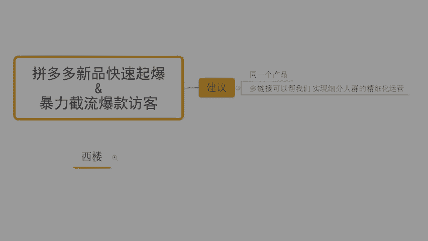

# 【拼多多运营实操教程】最系统的零基础拼多多开店教程全套，电商运营大佬专为学渣研制的新手开店保姆级教程！全程干货，简单粗暴 - P44：44、拼多多开店-暴力截流爆款访客 - -拼多多开店 - BV1BH1qYpEqw

啊，在的啊这个本告运说。呃，人家的声音嘛。啊，因为时间还早啊，所以说先去放一会儿音乐，一边呢等一等那些还在路上小伙伴们啊。OK的啊呃这样子啊，先测下麦吧。

所有的目前在直播间的小伙伴们能够清楚听到我声音的，能够看到我这边电脑画面的啊，都没问题的话，一起公屏扣个一，好吧。OK可以的对吧？好，那就行啊，那我就放心了啊。呃，这样子啊，时间还早啊啊。

确实没想到你们今天这么快进来啊。呃，你们可以把目前呢自己店铺操作方面的问题呢先发到公屏上，好不好？我们可以简单做一个交流，先帮你们解决一部分问题这样子啊，然后等到一会儿直播的时候呢。

就直接讲内容就好了啊。那么呃在正式的分享之前，在解答你们的问题之前呢，我也顺便呢先把直播间的一些小要求，小规矩说一下啊，因为有小伙伴是第一次来，对不对？那么呃什么小要求小规矩呢？

这边呢其实也没有说特别多的一个限制给到大家，对不对？其实更多是为了让你们更好的吸收理解啊，那首先第一个点呢，就是在整个的直播过程中呢，我希望大家能够什么呢？积极互动。好吧，那这是一个最起码的要求。

为什么这样说呢？呃，在我分享完某一个知识点之后，对不对？我也会跟大家确认你们是否能够听明白，能够听懂。如果说是能够听明白，能够听懂的地方的话啊，记得第一时间扣一回复我，如果说听不明白，你直接跟我讲。

对吧？我也非常乐意啊，再一次给大家进行说明，好吧，O婷呢现在是提了一个问题，说这个同一个产品上一个链接好呢，还是多个链接好啊，那这里呢我也顺便先把这个问题解决掉吧，好不好？那对于我们店铺操作来说的话。

同一个产品上几个链接，这个是根据我们实际情况来的我自己一般建议大家啊。那么我们的链接呢一定是做到细分的。什么叫细分呢？比如说我虽然说是同一个产品。对吧但是啊我们这个产品呢它可以通过不同的关键词来引流。

通过不同的卖点来打动我们的消费者的话，okK那我一定是做到不同的链接，所以多链接的操作。可以帮我们。实现啊细分人群的。精细化移民。啊，这样呢我们可以知道在我们这个产品操作过程中，具体哪一部分的人群。

他的数据反馈更好啊，有利于我们后期的推广。来停能够明白的话，扣个一好不好？啊，当然呢，这个不是说我只是单纯的去上架多个链接就可以了啊，而是要去做好细分人群的运营的啊。就是说呃举个例子吧。

比如说今天我们卖的是一个这个水杯好了，对吧？那这个水杯呢呃如果说是呃这个有人是泡茶的对吧？有人是这个运动的，有人是这个呃就是为了单纯的去装水的那不同的使用习惯的人呢，他对于这个茶杯。

这个水杯的一个这个需求其实不一样的对吧？停能够明白能够理解扣一好不好？这个部分的话，那我们在针对到我们的标题上，针对到我们的图片策划上，它其实都是有不同的一个点的。我们需要单独去做。虽然说是同一个产品。

但是他也是在呈现上是出现出一个不同的状态的啊，那么这样呢在整个操作过程中呢，后期我们也可以知道哎，到底是哪一部分的人群对我们这个产品呢，它的反馈更。好，是那些拿来泡茶的人呢。

还是那些呃这个运动的这个人呢，对吧？还是说就是单纯的为了装水的这么一个人呢啊，是这样子的那呃除了我刚刚讲到的这个第一个注意事项之外啊，这里呢我继续往下说啊，那么在整个的分享过程中的话。

还有到一个要求怎么呢？就是说大家呢在正式分享过程中啊。那么可以提问，但是呢这个问题啊，这里我说一下。仅限啊当前内容。相关的。好不好？为什么这样子呢？因为你们的思维呢，我知道可能会比较活跃。

那也有很多小伙伴呢可能有会有到一些自己目前的一些疑问啊。但是如果说跟我们当前分享的内容不相关的问题，我们一直在提问的话啊，每个人一个问题的话，那我们可能整个内容呢是没办法去正常进行分享的。

那包括说还有很多的小伙伴可能会比较基础一点，对不对？那啊他们呢这个问题东一个西一个也没法吸收啊，所以大家理解一下，那尽可能呢问题围绕着我们正式的内容去展开啊。

那么这样子呢也有利于大家自己的一个吸收跟理解啊，可以有利于你们的一个提高啊，这是第二个点，然后呢还有到一个最最最最重要的点啊，就是说那我分享的这些内容呢，我可以这样说吧。呃毫不夸张的说啊。

可能我哪怕是做直播分享，哪怕是一个免费的形式分享出来的东西。但是很多时候呢可能比你们呃在那些所谓的培训机构啊，或者其他一些渠道去花钱买的那些课程还要干。这个我毫不夸张可以啊这可以这样说啊。

所以说如果今天我分享这个内容是你自己没有做的啊没有做的啊。是适合你的。一定要去实操。啊，因为再好的方法，你不去做都等于0，好不好？兄弟们记住了啊，三个要求啊三个要求大家都能够去配合的，都能够去遵守的。

那么一起呢公屏上扣个一啊，那我觉得这几个要求呢应该也不算是过分，对不对？啊，其实说实话啊，与其说是限制你们我觉得更多是为了帮助你们更好提高啊，所以呢在整个分享过程中的话，大家有问题呢。

也可以呃及时沟通多交流好不好？O的啊，这个DQ啊打了个6啊，不错啊，深得我心啊啊，好不好？深得我心。然后呃继续吧啊还有这个几分钟时间啊，我们一起呢可以顺便呢先等一等那些还在路上的小伙伴啊。

我先把这个删掉去啊，顺便呢先等一等那些在路上的小伙伴们同时呢先把你们的问题呢也解决一下好不好？然后这个骄阳说哎，这个我能问一个问题吗？可以没问题啊，可以问啊，可以问啊，现在这个是。

这样的话还有几分钟时间，大家呢可以把自己目前操作店铺的问题呢都发在公屏上，对吧？咱们可以做一个啊简单的交流啊，那么如果说是这个特别这个复杂的问题，如果一时半会儿讲不完的话。

ok我也尽可能的简单化的给大家去分享，确实比较复杂的部分呢，也可以单独直播结束之后呢，跟我进行沟通都没问题的，好不好？可以直接说啊，有问题可以直接说。然后呢呃整个的直播过程中的话啊啊注意了啊。

这里我也顺便提一件事情啊，就是啊有很多人的话，他习惯于做一个事情，就是做笔记。我不知道你们今天有多少人是已经拿上笔跟本子准备记笔记的。如果有的话，公屏上打一个6可以吗？我来看一看哈啊，有没有这种小伙伴。

就是哎我觉得好像这个还不错的样子啊，我赶紧拿个笔，拿个本子记上来啊，做个笔记先啊。有没有有的话可以打个6啊。嗯，然后这个假如说店铺转发，一直上一直提不上提不上去啊。做了20千0单啊，平价也做了。

开车开不动，转化只有2点几okK啊，来，我把这一个问题呢，我把它复制过来啊。这个问题是很多的新手小伙伴啊容易犯的一个非常严重的错误。

呃，这里呢我先问一句啊，有多少人是有在做付费推广呢？来，如果说你现在是有在做付费推广的，或者说你认为拼多多没有免费流量都是在做付费流量的。那么公屏上可以打一个一啊，我来看一看好不好？OK啊。啊，还好啊。

今天不是特别多这种小伙伴，对不对？还好还好还好啊，哎呦，我刚前嘴说完啊，后嘴就出来这么多啊。呃，那这里我说一下啊，兄弟们，首先第一件事情啊，听清楚了，我们做店铺的话，一定不要上来就去做付费推广。

听清楚啊，那为什么呢？我给大家画一个图好不好？来注意兄弟们看一下啊，看一下啊，我给大画一个图啊，现在认真看啊。那今天呢我们在整个的平台呢，它给我们推荐曝光嘛，对不对？其实会有一个考核的标准嘛，对吧？

那么这一条横线呢，我们就把它当做是平台给我们自然曝光的一个考核标准，当我上架产品之后，我的产品呢会进入到这个考核范围内，对不对？那么我产品呢它可能会有到一些呃商品的属性啊，或者是具体的某些数据对不对？

那它呈现出啊哪些部分高哪些部分低啊，然后又有部分高出来，对不对啊，大概是这个样子吧，我们随便画一下啊啊，那有一部分呢它比如说在这个属性上面啊，它是爆款属性来的，它在这个SQ方面啊。

是有具备这个竞争力的好，那么整个产品。上架之后，在达成了系统推荐的或者是平台自然曝光考核要求的情况之下呢，会有一部分的产品曝光啊。那么这个曝光呢，我们把它讲就这一部分啊，来就这一部分，好吧？

黄色圈子这一部分啊，这个是我们正常上架之后，或者是我在做自然流向的一个状态啊，一开始上架之后的一个操作。但是如果今天我去做了付费推广听清楚了，那么这个时候呢，因为我花了钱，所以整个的产品的曝光呢。

会直接拔高啊，它是整体拔高的啊，我再画一个这个线啊，怎么拔高呢，来看清楚啊，在这边比如说原本呢它的起点在这个点上嘛，对吧？从这个这条线这个点上嘛啊，那这个时候因为它拔高之后呢。

O它就直接啊我直接把这个事拖上去好不好，这样子方便一点啊，它就直接往上走了，对不对？哎，可能我。做了付费推广是吧？原来就这个位置嘛，做了付费推广之后，它就往上走了啊，整个产品呢就能够拿到非常大量的曝光。

原本呢我产品的曝光呢，它本来只有这一部分嘛，对不对？只在这个部分嘛啊在这一个小的三角范围里面啊，还有这个部分啊，那因为我去做了付费推广，所以整体拔高之后呢。

我们整个的付费曝光呢是可以把我原本的自然推荐曝光吃掉去的。各位。那么这个时候就会产生一个非常非常严重的问题。什么问题呢？OK我正常的。自然曝光被付费曝光吃掉去了，对不对？

那么自然流量呢就没有了我们的这个呃产品曝光产品的点击、产品的转化等等各项数据。理解吧？各位这个点能够看懂的公民扣1。啊，这个点能够看懂的公屏扣1。那么当我没有自然曝光的数据之后，就会导致一个问题。

我没有自然数据。然后呢，我整个商品就不会得到自然数据的放大。对不对？而做付费推广的话，本身是基于我们商品的曝光人群，或者是我的精准标签人群来展开的那我本身是没有很好的商品权重的情况之下。

平台给我推的这个标签，它是有限的。当我去做了付费推广之后，你又没有好的点击，又没有好的转化。那么你一直在消耗你自己的这个标签人群。那么就会导致你的付费推不动，而且一旦关掉付费推广，你发现没有访客了。对。

骄阳，就是你说的这个情况啊，一旦关掉之后，你会发现没有访客。为什么？因为本身你就没有访客，知道吧？你所有的曝光都是你自己通过付费强付费拉出来的。😡，那么这种方式本身就不对，理解吧？

而这种情况操作呢就会导致我们的推广成本越来越高。如果说你商品有好的转化，你能够在富余推广里面能够收支持平，那还好。如果收支不能持平的话，ok完蛋。你就没法正常进行了。

所以现在的话你原有的推荐这个这个付费推广啊，我跟你说一下，我建议啊，你可以适当的去啊收缩运营成本，然后去做新链接。好吧，然后去做新链接呃，娇娇我这边的话是有带实操的啊。娇阳。

如果说是你是确实有兴趣想看的实操，可以找我微信上直接找我就可以了。好不好啊？这里呢我们就呃先不去多说那么多废话了啊，因为时间差不多到了啊，已经两点了，对不对？我们说好两点钟开始嘛，对吧？

我们就直接开整了，然后刚刚那个是也有小伙伴在公屏上发了一个问题的啊，我那个天津菜啊，说早上推广下午产品呃。下午这呃什么什么来着？下午上产品的时候提示店铺异常是什么问题？呃，如果说你是有涉及到店铺啊。

比如说有违规操作，比如说有这个改销量啊啊有去做刷单这种情况啊，又或者是你产品本身是有那种擦边球的呀，对吧？尤其像黑5类呀，你上车之后呢，它都会进历二次排查。那你在过了一段时间之后。

你去发现你上架产品或者是你干什么事情，跟你上上架产品其实没有关系啊。你做任何事情的时候，你进入后台，它可能都会提示到你这种情况，店铺异常好吧？这个我不清楚你具体原因。因为我不清楚你的一个实际情况啊。

但是我可以跟你说一下，大致的一个情况，就是你店铺肯定是有违规的，这是这是必然的一个结果啊，也以去好好自意质检一下啊，然后这个呃有很多小伙伴呢，其实我我说实话啊，就像这个骄阳一样的，对不对？

本身呢自己可能是想去做店铺，但是呢又没有一个好的方法，那一直呢在以自己认为对的方式去做，对吧？这里我顺便先给大提个醒，很多时候啊，你们认为正确的方式可能并不能帮到你。就像刚刚骄阳这个情况一样的。

对吧自己想当然的去做了一些事情，觉得哎我店铺没有访客，我去坐车子吧，我就开推广吧，我就把访客拉一拉，对吧？然后呢，这种动作看似在帮你提升访客，但实际上是害你。为什么说是害你呢？因为你有访客。不转化的话。

那么平台会判定说你自己的产品呢是没有任何的产品竞争力的，你没有办法承接流量，于是乎它不仅不能让你的产品提升权重，反而会让系统判定你的商品是一个垃圾。减少对你的推荐。各位能懂吗？能明白的话。

现在公屏扣个一。啊，能明白的话，谢在公屏一扣个一啊。那么呃对于我们店铺操作来讲的话，其实就是这样子的。如果说你们自己真的是想要好好长期坐店啊，是有这种想法的那么今天可以认真听一下啊。

给你们分享一些关于店铺操作的方式，那确实觉得自己操作店铺啊，容易走弯路，容易去试做踩坑的O了。那我也建议呢可以直接跟着实操的。其实说难听一点，你们自己没有一个好的运营能力的话，没有一个好的方法的话。

你踩坑是必然的。这个过程无疑会浪费很多前坑时间，对不对？坐店的话，效率至上好吧？好了啊，废话不多说啊，直接开始了。那么上次呢是因为时间关系啊，没有把这个爆款节流的玩法呢给大家讲完啊。

那今天我们就直接开始啊。呃，因为有很多的系售小伙伴啊，这里呢我也还是从基础开始吧啊，因为上次其实基础部分的话，还有一个小小的细节，关于我们产品发布过程中的一些细节啊。没有讲完的啊。

那我现在呢先问大家一个问题，什么问题呢？你会。上架产品吗？嗯。各位觉得自己会的，公屏上打一个一，觉得不会的打2。好吧，呃我们实事求是啊，你现在已经会发布商品了，你就打一，你觉得不会的打二就好了啊。

那么呃根据实际情况来，对吧？因为有小伙伴可能是比较基础的，可能店铺都还没开，可能只是想了解一下，对吧？这个很正常，对不对？OK的啊，呃，有扣一的，也有扣2的啊，然后这个还有扣6的啊，这个六是什么鬼东西。

😊，我的天，你们这家伙真的是啊我服你们了啊。😊，呃，有小伙伴是扣一扣2啊，都有的那有的小伙伴觉得是自己会的。有小伙伴觉得哎好像不太会啊。那这里的话啊呃今天我先给大家说一个呃小的操作细节。

关于我们店铺运营过程中的一些细节啊，也是我们发布商品中必须去做的一个事情。那么这个事情很重要。有多重要呢？我跟大家讲一下，有可能你们店铺操作，发布商品之后进行运营，有访客不转化。

可能根本原因就是这个地方好不好？像这个骄阳，那么这个部分你可以认真听一下。那如果说你这个之前没有做到位的那今天你去尝试着重新操作啊。当然如果说你觉得哎确实好像说自己去操作还是跟不上的话，ok的。

到时候直接来就好了。好吧？那么来啊给大家看一下啊，这个操作方式呢给我们店铺带来的争议是什么样子的，好不好？来，兄弟们呃，有可以看看这店可以看看这个店铺啊。

可以看看这个店铺有看到这一组数据的小伙伴们公屏打一啊。有看到这一组数据的小伙伴们公屏打印好不好？这个店铺呢做的是一个打火机啊，做的是打火机啊，打火机那么这个店铺最早呢访客只有几百个两三0百个的样子。啊。

两三百万变两三百的样子啊，那它是上个月的下旬啊，跟着实操的过来之后呢，当时就直接做了一个小的调整。做完这个小的调整之后，你们会发现一个问题，就是他整个店铺的数据呢就开始增长了。我告诉大家啊。

它增长的这个访客往上提，不是说去做了付费推广，也不是说自己通过其他方式去做的流量。不是的，完全没有其他的任何多余的操作，只是因为什么呢？当时他做完这个动作之后，转化率上升了啊，可以看到啊。

后期他转化率呢将近20%。各位看到没有？转化率的话，这边是19。47。有看到没有？等一下啊，稍微挡住一点啊，19。47%的转化率一天的话将近2000单，对不对？1万的一个访客啊。

是这么个一个一个一个情况的啊。那这个动作呢就是我们发布商品的时候需要去注意的一个小的细节点。什么细节点呢？各位，我现在直接跟你们讲啊，那么也不绕道弯子。那呃首先呢在讲我的方式，讲我带实操的方式之前呢。

我要跟大家确认一个事情，就是你们在正常进行商品发布的时候，你们的商品的SKU啊，你们商品的价格是怎么设置的。呃，这样子。呃，骄阳，你你是做这个体育用品的，对不对？做应该是有做这个我我上次我记得我看过啊。

有做那个羽毛球，对吧？跟这个乒乓球拍子，还有篮球，是不是没错吧。那，我我我们就拿你的产品举一个例子，好不好？啊？当然了，其他小伙伴这个没关系啊，不管你们是做什么产品的都无所谓。重要的是什么呢？

重要的是把这个方式方法掌握好，好不好？来啊，现在啊认真听了啊，这一趴的话啊，兄弟们我只讲一遍。大家认真听听清楚了啊，不要去做什么笔记，认真听。如果说哪里不清楚，不懂的，马上问我啊，我只讲一遍好不好？

那重要的是你能够吸收理解，这个很关键。因为如果说你去做那些额外的动作，记什么笔记的话，你可能我讲到下面部分的时候，你上面没有记完，导致你整个内容是脱节的，你跟不上，你也没法吸收理解好不好？

所以这个点大家注意一下啊。那呃现在呢我们假设我们是做难球的，好不好？兄弟们，那么这一款篮球呢，正常来讲，我希望我的售价呢是58块钱，好不好？唉，等一下啊，完蛋啊，把这个篮球给搞下去了啊，58块钱啊。

好不好？假如说今天我希望我的这款篮球卖581个啊，好不好？现在我们先做这么一个假设啊，这是我的目标售价。那么我现在问大家一个问题，就是说你如果说是有这么一个产品，你上架之后。

你的SQU你的产品价格是怎么设置的？第一种情况啊。哎，我直接去设置一个拼单价。58。啊，这是第一种。第二种情况呢，哎。我去做高架，对吧？啊，我的拼单价做高价啊。然后上架之后呢，我再用到活动的方式。

做到58的一个价格。来。😊，各位第一种和第二种，你们是哪一种？啊，可以把你们自己目前的一个操作方式呢发在公屏上。okK啊，非常不错啊非常不错啊，今天没有人选啊，我刚准备说今天没有人选第一种啊啊。

居然就就冒出来一个了。😊，啊，行行行啊啊，基本上都是第二种啊。那这里呢我顺便呢跟这个苗主任说一下啊，苗主任选第一种的话肯定是不对的。如果说你目前这种方式去做的话，千万千万记住这种方式不对。为什么不对呢？

那我说一下。那我们的产品如果说你正常去发布啊，这跟你什么类目没有关系。啊，这跟你什么内目没有关系啊，那么听清楚，那这样的操作呢是有一个问题的，就是说我自己在上架产品之后。

我们的商品售价实际的展示价格是一样的话啊。哪怕我们的产品权重也是一样的。那么这个时候呢，你有活动的和没有活动的，肯定平台会优先展示有活动的。那么这个道理呢也非常简单，我举个例子吧，好不好？

今天假如说我们就说这个篮球吧，对不对？哎，一个是拼单价58，一个是活动价58。各位啊，你们可以自己想一下，对吧？你会选择买拼单价58的呢，还是选择买活动价58的呢？嗯。选择拼单价购买的扣1。

选择买活动价58的扣2好不好？那我们目标，我们我们现在自己是买家的心态啊，我自己是买家的心态，好不好？我现在我要去买一个篮球。那么这个篮球展示在我面前的时候呢，一个是拼单价58，一个是活动价58。

他们两个到底有什么区别。其实我也看不懂，我也不懂球，对吧？啊，但是呢我们在买的时候，对大多数人我们肯定都会选择买第二个活动价的，为什么原因很简单，拼单价的这个产品呢？我觉得它可能不止58。

因为他要赚我的钱嘛，对吧？因为商家要赚钱嘛，就那么简单。但是第二个商品呢，虽然说我可能也会觉得商家要赚钱，但是我会有这种心态，就是哎我可能用一个比较低的价格。啊，买到了。一个价值。更高的产品。

虽然说都是花了58，但是这一个产品我觉得它本来可能卖个8898，对不对？现在它只要58，那我觉得呃我我有便宜可以占。就这种心态啊，所以在这种情况之下，平台它就会优先展示这种活动商品。

让这些产品呢能够在同等权重情况之下呢拿到更多的曝光。好吧？当然有小伙们可能说，哎，那西楼，这跟你要分享的你自己做的这个产品的方式有什么关系啊？有什么这个。呃，这个联系对吧？可能会这样想告诉大家啊。

这个是一个基础操作啊，只是为了扫个忙，这个不是我的方式。那我的方式到底是什么呢？各位听清楚了，我的方式不是第一种，也不是第二种，我的方式是第三种啊第三种。那么这个第三种的方式做出来之后的效果呢。

就是我们的转化率会大大提升。那当我的转化率提升之后，同等的访客。啊，我的转化率提升对不对？那么我的单量更多。那同样的产品的话，okK的，我的产出更高，我的这个GMV更高，对吧？

那我的GMV更高的情况之下呢，我的UV价值也会更高。OK那么这样的一套动作下来，我整体产品的权重就会比较高。它可以帮我们去直接拉伸商品权重，提升访客。提高排名。啊，所以做自然流的话。

那么这一个方法我们一定要掌握。就像这些小伙伴一样，对不对？跟着我做的话都是这样玩的那也都是去能够把转化率拉上去，能够去得到一个更好的结果。访客之所以会上升，也就是因为有了这些操作。

有了这些细节才能够做到位的对吧？比如说这店步一个纯心店，各位有看到吧？这是一个纯心店啊，从最早零访客更的实操的啊，这里来。对吧从临访客开始来的啊，这里啊临访客来的啊，好不好？临访客。

然后呢也是数据快速提升。因为什么转化率高啊，兄弟们看到没有？这么来的啊，那怎么玩？注意啊，第三种的操作方式呢。有点小骚气啊，好吧，兄弟们，这个地方大家要认真了啊。那首先呢一开始的时候呢。

我也是按照第二种的方式去做了1个SKU的啊，以高价的形式呢去做了1个SKU，然后以活动的价格呢做到58。这是第一步。啊，这是第一步。那么这个动作呢是干嘛呢？

听清楚这一个动作呢是为了让我们的产品去么做上我的价格标签。啊，去锁定我们的价格人群。各位，这是第1个SQ啊。第一个。我会做这么个动作啊，这是我们做的第一个动作。接着往下我们会做第二个动作。

这一个动作干嘛呢？这一个动作呢是。直接把我们现有的这个第1个SQ按照我们正常的发布方式去复制出来一份，对吧？但是呢我要在这1个SKU的名字前面做上一些营销词，让它变得更加显眼。啊。

那么这个时候做出来之后呢，这一个的价格呢它不是58。它会加价加多少呢？在58的2倍到3倍的样子啊，就是我的目标售价的2到3倍。好吧，我目标售价了2到3倍啊，这点大家注意一下啊，呃这一部分到目前为止的话。

就是这个第二个SQ怎么设置，大家能能听懂吗？有没有问题？如果说能够听懂的话，公屏扣个一。如果说听不懂，我给大家举个例子。好吧，如果说听不懂呢，我给大家我给大家举个例子。啊，举例子是吧，这样设置有人买吗？

这个这个设置跟有没有人买没关系啊，好不好，这个设置跟有有没有人买没关系啊，一会儿你就知道了，这样做是干嘛的啊情况。呃，这样子啊，我举个例子吧，来所有人。公民课一。啊，所有人公民扣个一。

有在认人厅的所有人动起来。OK啊，我举例子啊，好不好？也不儿的话不要给我再给我开小差了啊。这个部分的话你要是没听懂，没听明白的话，后面你肯定不会操作的。那么呃现在呢我们来做这个事情啊。

假如说第1个SKU好吧好？假如说第1个SKU我们是呃。某某。篮球对吧？我某我篮球啊，这么1个SQ名字啊，假如说是这样子啊，那么它只是一个产品的展示嘛，对不对？那接着呢我们第二个SQV的名字呢，看清楚。

我要在这个某某篮球前面呢加上营销词啊，加上营销词好不好？这个营销词呢我们可以去写到一些比如说呃新品特惠呀，对吧？这个呃之类的这样的一些营销活动的一个一个说明，对不对？

那么这个时候当这2个SQU都摆在用户面前的时候，那么它会比较显眼。各位能听懂吧？它的核心目的就只是为了让我们的这个呃SQU更加突出而已啊，这个名字编辑是这样子的，它的主要目的这个啊，那么编辑之后呢。

它的价格呢，比如说我们原本呢做的是58的一个目标是价嘛，对不对？我现在呢我把它做到两倍的话，那么它就是116，各位没问题吧。啊，那么它的价格就是116啊，好不好？那这个时候呢做完这个动作。

我们去操作的时候听清楚了。刚刚也有小伙伴在问，哎，那这个东西它有人买吗？没有人买。首先第一点，这个SQ呢是我前期发布商品的时候做的一个事情，对不对？这个是我产品是新上架的。

本身我的产品可能没有太多的SQ啊，这个这个这个销量啊，SQ去了啊，没有太多的销量，没有太多的这个评价啊，也没有太多的访客。所以它也本身就不太可能有成交的，对不对？但是我们去做的这个动作，第一个SQ呢。

它只是为了让我们去打上价格标签啊，去获取了对应的价格人群，而第二个SQ呢O这个时候听清楚，它的价格之所以会做到我们目标售价的2到3倍，是因为前期我们。在做基础数据的时候。通过这1个SKU来成交。

听到没有？我们前期做基础数据的时候，自己做的时候啊。通过这个成交。那么通过这个成交干嘛呢？OK听清楚了。那我们的产品的目标价格是58，各位还记得吗？我们产品的目标价格是58。所以我们的竞争对手是谁？

我们的竞争对手也是跟我们同样价格标签的产品。各位没毛病的话啊，这个部分觉得没毛病的话，公屏扣1。我们产品标签是58的嘛，对不对？我们做的是这个价格段嘛。😡。

那所以这个时候我们的产品呢竞争对手也是这个阶段段，这肯定是没毛病的对吧？但是如果说我们店铺的商品现在通过用户进店成交是成交的116的这个价格的话，那么我的客单价会更高，对吧？当我的客单价更高的时候。

我自己呢维护好转化率啊，转化率维护好。那么我同等的访客情况之下啊，我们的产品的整体的什么。GMV更高。同样的，我们的UV价值也会更高。那么在这样的价格段的商品里面去完成商品的权重考核的话。

我们的商品就会占优势。可以快速的得到同类商品的。推荐群众。各位。没问题，听懂扣一。啊，没问题题，你可以。当然啊兄弟们，你们以为到这里就结束了吗？没有啊，没有，这只是开始啊，这只是开始。这样的操作。

不是说只是为了达成这个目的，这个目的只是一个小小的插曲而已。好吧，那么它的目的还有什么呢？听清楚，兄弟们认真听了啊，当我们的商品能够在前期全部成交的SKU的话，集中在这一个部分的时候。

那么这1个SKU呢会被系统判定是我自己商品的。畅销SQU。没错吧。各位，这个没毛病吧。那么这个东西搞定它之后有什么好处？听清楚了。在我们平台上呢有一个东西啊叫做榜单。各位。有听说过有见过榜单的。

有知道榜单的公屏打一个6。工作快。如果说不知道的打问号。OK停知道，对不对？好，那么我问一下啊那我问一下啊，这个我点个名吧，我点个名，我问一下啊。😊，嗯，哎，我有看到一个这个有看到一个这个老熟人啊。😊。

呃，王香。王潇在不在？在的话扣个一好不好？在不在在的话扣个一。不在吗？我的天，在在在直播间里面挂机啊。啊，这就有点尴尬啊，王下好像不在啊，呃我换一个人啊换一个人呃，拼听菜。😊。

天津菜来来来来来来来天津菜。😊，在不在？在是吧？okK榜单知道吗？刚刚这个这个庭已经说了一个了啊啊，有个降价榜单，对不对？那么。榜单你知道吧？听下。榜单呢分为好几种啊，如果说你们知道的小伙伴呢。

可以把榜单的这个呃信息有哪些分类呢发出来啊啊在拼多多买东西有看榜单是吧？OK啊，那你是知道的对吧？OK那行吧，那我也不去浪费时间，对不对？榜单的话是有4种，对吧？各位没错吧，榜单的话是有4种啊。

有这个畅销榜。对吧有好评嘛。啊，有降价吧。还有新平版。各位没错吧，这是我们的榜单。那么榜单里面的话啊，畅销榜跟好评榜呢，他们都会考核我们的单量跟评价，对不对？分别会考核单量跟评价嘛啊。

而且呢它的一个数据量呢会相对比较大，但是呢一些细分的榜单呢，它的要求可能没有那么高，对吧？但是呢它都会有到一定要求，但是对于我们一个新品来说，我们去做这样的榜单来讲，它可能会相对比较麻烦，啊。

操作难度呢会比较大啊，那么新品榜呢就更不用说了。如果说我们的产品是没有新品标的一个类目的话，你是没有这个榜单的，对不对？而且呢它的整体的一个呃考核要求的话，也会比较高一点啊。

那么其中其实最好操作的榜单是什么呢？是我们的降价榜，对吧？因为降价榜呢考核的是我们当前啊top200的三级类目，对吧？能够去呃有到降价幅度。靠前的。啊，前几个商品对吧？没错吧。

那么这个降价幅度这里我说一下啊，这个降价幅度呢其实主要指的就是我们的畅销SKU。这个是有官方明文规定的。所以在这个时候各位听清楚了。那我前面几天时间，比如说一个星期7天时间，对不对？我的整体的操作呢。

通过这1个SQU来完成。完成之后，接着第一个星期结束，我们就可以针对到这个这个SQU啊。7天啊结束。针对这个。这个啊SPU。进行活动设置。啊，活动设置的时候呢，我们可以打5折，对不对？

因为我这里呢我价格是大的两倍嘛啊，我可以打5折，降价降了一半。各位降价幅度大不大？还是比较大的吧，对不对？那你如果说觉得哎5折好像不保险啊，那你就去一开始做到一个三倍的价格。那么你打的时候呢。

打折就打一个什么打一个三折四折这样子，对不对？哎，折扣力度会更大。当然呢你也可以把这个折扣力度再放大一点都没问题啊，看你自己的操作都ok的。那么这个时候呢，我们的商品就可以得到进入榜单的机会。

各位能够听懂，能够听明白扣一。所有的在直播间的小伙伴们啊，有在认真听的啊，动起来啊。这跟运气没关系。这跟运气没关系啊这跟运气没关系。啊，这跟运气没关系的啊，因为它是必然的结果。

因为这个折扣力度是我自己控制的，知道吧？Yes。呃，听听菜说本来就是高客单的玩法的话，会不会这样太夸张。我说一下啊，听菜呃，我记得你啊，然后你是本身是这个做茶具的嘛，对不对？然后呢。

之前呢也是用到的一些这个唱这个这个工具在搬家啊，我说实话，本身你这种搬家的方式呢就有问题，这种方式不对的啊，不要去用搬家工具搬家了啊，那么一定使用发布，而这一个操作的话，你说我是高客单的，哎。

我这个客单就大几千，对不对？这种方式行不行？一样可以做，只不过你可能上来的时候，你不可能说真的是做一个两倍到3倍的价格，我们也要结合到实际情况去做嘛，对不对？那我上架的时候。

我把它价格加个800500的，行不行？我就加金额行不行，也可以呀。是不是也可以呀？能够理解吧？我就直接加金额嘛，对不对？我不一定定要去把它加了好几倍，因为你看价高，你这个几倍，你根本就上不去价，对不对？

你发布不了产品的哈。然后这个呃听说降价这么多，客户会不会觉得不太好？我说一下啊，兄弟。😊，你在这个期间基本上是没有太多的真实用户的这是第一点啊这是第一点。第二点，本身我们的价格呢。

它是我们啊一开始设置了一个目标的售价的一个价格的。其实这个价格是我最后降价的价格，对不对？我原来就卖58。我现在把这个SQ调整到58，有什么问题，没有问题啊，没有问题，好不好？那后期再进来的用户。

他只会看到我是58的一个活动价，他也看不到我之前卖的多少钱。所以这不影响的。啊，所以这不影响的啊。呃，然后这个小小说2到3倍的时候先去做。对，没错啊，先去做这个销量啊，然后呃否则没有任何数据的话。

7天直接打针。这个跟你后面有没有数据没关系。你前面这个几天时间，7天时间你就全部去做基础数据，通过这个SQ去完成就可以了，好不好？然后做完7天okK我们直接去做活动。好不好？来，小小没问题扣1。😊。

这跟你后期有没有数据没有关系，不管你有数据还是没数据，都可以这样做。这样做的目的是干嘛？第一个刚刚讲的榜单啊，听清楚。第一个是刚刚说的这个榜单，然后还有第二个事情。各位，还有第二个好处什么呢？

你们有没有见过一个东西啊，就是在你们平时看在拼多多里面有没有看到过这种你浏览过的某某产品降价了？有没有看到过的，或者是你关注的某某产品降价了。😡，这个在你的首页，在你的搜索页。

在你的这个个人中心都会有展示。有吧，okK我告诉大家啊，兄弟们，这个是平台针对到我们商家做活动打折时候的用户激活。如果说你在这个期间本来你是有反客的，对不对？但是呢可能没有太好的转化。没有关系。

后期你去做活动打折的时候，只要你的降价幅度。超过10%。那么你的商品都会推送给这些人。各位理解吗？所以这个动作的话，第一个获取榜单收益，得到更多曝光。第二个激活我们的用户。那么这个时候我的用户会发现哇。

搞活动啊，活动力度这么大买能听懂吗？他们可能很多时候都已经忘记了，一开始看到我们产品什么样的一个情况了，知道吧？他只会记得现在进来的时候有提示这个产品降价了，而降的这个价格呢。

刚好是他自己这个人群需要的价格，因为一开始我们有定位这个价格标签。各位能听懂吗？一开始我们是有定位这个价格标签的，所以我们的目标人群进店的话，他是对这个价格是认可的。

而我们这一次通过降价活动去把他们激活回来之后，他有看到有降价，他有看到有活动，那么他也可以去吸收消化我们的。标签人群。各位。来。觉得有提高的啊，觉得有点东西的，公屏上六走一波好不好？我来看一下啊。

有听懂的，有吸收有帮助的6走一波吧。当然呢可能也有小伙伴说，哎，好像我还有点迷糊，有点懵，对吧？没关系啊，没关系，有问题可以直接说啊，都是可以的。好不好？但是各位兄弟们，你们以为到这里就结束了吗？啊。

并没有哈并没有啊。你说一说如果真的只是这么简单的话，那像我带实操这些小伙伴，他们店铺为什么转化率这么高啊。不太可能吧，对吧？就这么个破操作，转化率能这么高吗？当然不可能，当然不可能，还有一个套路。

还往后面会有到更多套路。什么套路呢？各位现在所有人小手扣一动起来啊，我确认一下是不是在认真听。啊，那么这一个套路呢是我们现在刚刚讲的这个呃操作方式啊，它一起的同步的一个操作方法啊。

能够去帮我们把转化率拉高啊，像这个转化19。47这么变态，对吧？你以为白给的呀，平常又不傻，对不对？用户又不傻，对吧？来怎么玩，看清楚啦，刚刚我们不是讲到了吗？第七天结束的时候去做活动嘛，对不对？

OK做活动没保利了啊，在这个过程中，我们去把原本的第1个SKU下架掉。啊，注意不是删除啊，是下降。那么有小伙伴可能会有疑惑了。西喽，这个编辑SKU不是会降权吗？我这样去做会不会影响访客呀？

那我这个店铺是不是就又会麻烦一点啊，有没有这种想法的？来，有的话，公屏打个一，我看一下。好，小小还有K都有这个担心，对不对啊？天天猜有这个想法，我说一下啊，你们的这些担心呢完全都是多余的。为什么这样说？

兄弟们还记得吗？这1个SQ的目的是什么？😡，价格标签对不对？没错吧，价格标签我们前期所有的数据是通过DLSQ来完成的。所以第1个SQU呢它是没有销量权重的对吧？那么在我们第2个SQU进行活动打折的时候。

这个时候第1个SQU它的作用。还有吗？他还有存在的意义吗？😡，没有异议了。它唯一的作用是价格标签。而我们做活动的时候，我们这1个SQ也是58块钱。那么标签人群是不会受到影响的。各位听懂了吗？

那么这一个操作的话，把原本没有任何数据的SQ去下架，而且我们不是删除啊，只是下架。所以它也不会说导致我被降权或者怎样的，不会的，不会有权重流失。即使有也微乎其微。

因为本身我们前期所有的数据都集中在第二个SQ我们也没有太多的特别大量的访客数据。标签价格给谁看，第没有明白第一个作用。我们第一个SQ上架的时候，发布的价格是活动价58，对不对？停，没错吧。

那么当有人去搜索某一个产品的时候。平台进行商品推荐的时候，它是根据我们的露出价格来进行推荐的。啊，那么这个露出价格呢，就是我当前产品的最低SQ的价格，对不对？

我们随便去找到某一个产品去做这个事情都可以的对吧？我们随便去搜一个产品都可以这样子看得到的啊。比如说我去搜一个这个呃刚刚讲的水杯吧，好不好？我们来收入水杯对吧？那么这个时候平台进行推荐的话啊。

你可以看一下啊，你可以看一下，那它的这个推荐呢是直接针对到露出价格来推荐的。最低的这个SKU来推荐的。比如说这个啊我们来看一下，对吧？比如这个我们来看一下啊，来它的露出价格刚刚是是多少钱？6块多，对吧？

就这个对吧？是这个看到没有？那他的推荐是按这个来推的。我们如果说你如果说不理解这个价格推荐怎么推荐什么意思，我们可以去做另外一个动作，什么动作呢？我现在去做筛选，做价格的筛选，对吧？

我用价格卡位去卡位去搜索的话，OK他。在符合我们卡位条件的话，这个就是露出价格，就是系统的推荐价格。因为你不符合这个价格段的话，它是不会给你推荐的。来停，能懂吗？我卡到9到17的话。

okK它也是露出价格，9到17的。那么平台匹配价格的话，就是以这个价格来推荐，懂了是吧？OK那就行了。所以一开始我们发布的时候呢，第1个SQ呢活动价58是为了去满足这一个卡位的一个条件。

那么平台推荐人群的时候呢，是以这个价格来进行匹配，匹配之后给我们曝光，对不对？而我们刚刚讲到的我的所有的数据成交成交高客单的。那么为什么成交高客单呢？就是为了跟同样这个价格段的商品产生区别。

我们能够达成更高的产出，得到更多的权重。啊，而在这过程中7天结束，我把原本的这1个SQ下架掉，把我们这个SQU呢做上活动打折，打到58价格标签是不变的而且这1个SQU呢是有大量的成交数据的。

它是有权重的。商品本来的权重呢也都集中在它。那么这个时候呢，我们整个商品呢曝光也不会受到特别大的影响。而且前期本身我们就没有太多的真实用户。对，他们就是同一个链接里面的2个SKU啊，停。

他们是一起发布的呀。听懂吗？然后接着注意听了啊，兄弟们刚刚解释了一下啊，浪费了点时间，那是没关系，我觉得跟你们梳理一下是比较好的。那么现在到了重点了，刚刚我们讲到的第1个SKU呢。

在第七天我们去做第2个SKU打折的时候，我们要把它下架掉，对不对？那么与此同时呢，我们要去发布第3个SKU。啊，我们要发布第3个SKU第三个SKU呢，它的名字可以是跟我们第1个SQU呢非常接近的。

只不过我可能做了一些其他的东西，比如说多了一个空格呀或者其他东西啊，让它能够正常发布就可以了。发布的时候呢，这1个SKU最终的露出价格啊，最终的展示价格。露出价格。啊，露出价格哎。

是我们58要更高的价格。比如说我把它做到88。听懂没有？比如说我把它做到88啊，那做到88干嘛呢？来，兄弟们，我们思考一下，今天你去买篮球。啊，你去买篮球，你去买篮球的时候，你发现一个问题。

就是有一个篮球，你进去之后发现哎。有一个规格是这样描述的，新品特惠某某某某篮球啊，然后另外一个规格呢呃也是一模一样的某某某某篮球，只不过他没有写新品特惠几个字。那第1个SQ呢，它是卖价58。

第二个SQ呢卖价88。各位。这个时候我想问大家一个问题，你会买哪个？你会买88的呢，还是买58的呢？你们自己选。58对吧？有没有人选88的？😡，没有人选88的吗？😡，OK啊目前是是没有人选这个88啊。

都是选58的对吧？好，O我告诉大家一个事情啊。我告诉他一个事情。在正常的真实运营中。有很多的用户，他会有这种疑问。什么疑问呢？哎，这两个产品是一样的吗？唉，它两个产品是一样的，为什么一个卖58。

一个卖88？😡，然后就会有人觉得58这个可能就是质量有问题，我就要买88的。这个是真有，兄弟们不夸张。真有。啊，去年呃有有两个，一个是做那个蚊香液的，还有一个是做冰秀的啊，也是跟着我实操的两个小伙伴。

他们当时做的这个SKU啊，价格差距有一倍。这个差距有一倍啊，然后呢。基本上呢有呃两成的人吧会买高价的。其实他卖低价就是在赚钱的，他卖高价的话，我的天，那利润疯了啊。他就这样子的，有人就这么想的。

但是这个时候我说一下啊，不管用户买低价还是买高价，那么兄弟们。我们都有的赚，而且他买高价，我的毛利更多，我赚的更多，对不对？那在这个过程中，可能有小伙伴说，哎，那你这样做好像也没有什么太大的意义啊。

okK听清楚了，我会在这1个SKU发布的时候听清楚啊，这个我刻意没有在之前给大家讲。这一部分我刻意没有在一开始给大家讲，是因为。我知道有一很多的这个小伙伴是不会认真听的。

包括像现在可能有的人已经开要差去了啊，所以我留在这个地方给大家讲。那么这个部分是一个核心点啊，有在认真经的小六走起来啊，给他说一下这个操作是干嘛的。那么这个地方呢。

一开始我在发布这一个新品特惠SKU的时候呢，我的SKU图片我们就把它写上去啊，做出一个。活动说明。听到没有？我告诉我的消费者，哎，这两个产品是一样的。这两个产品是一样的。我告诉我。

是不是这两个产品是一样的，因为我是新店，因为厂家在做这个市场拓展，所以呢给我拿了一部分库存，给我了一部分这个产品拿来做活动，不赚钱亏本卖，知道吧？那卖价是多少呢？58卖完之后就是88了，各位。

那么这一个小套路小操作听懂了吗？当我们的用户进来之后，有看到这样的活动。哪怕啊他可能一开始会觉得我要多看几家的时候，他也会记得很清楚。有一个产品，哎，他现在是在做活动，因为活动力度很大，不赚钱。

原本卖88。听懂了吗？然后这一个仓这这一个产品的话就会。呃，加油一下轻松热水卖的话？没错啊，可以这么理解吧。😊，呃，这个你自己想办法啊，想想你不能什么都要我帮你做吧，对不对？我都跟你说的很清楚了啊。

好不好？那当然呢，如果说你们确实自己操作不会，对吧？说哎想要跟实操没关系啊，这方面我都可以帮到你的啊，这都可以的，好不好？啊，这个操操作啊做好。那么这个时候呢整个商品的转化。😊，可以直接拉伸。

转化拉升了，你还怕你产品起不来吗？对吧OK这个是转化部分啊。各位啊，如果说还是那句话，如果说你们自己确实是这个操作上有问题，跟不上的，okK没问题的。可以跟着实操啊。

那如果说你自己目前说哎没有做到位这个东西的，你确实觉得有道理的，你店铺没有做的，可以自己去做做起来，动起来不动的话，你再好的方法都没用啊。呃，实操是你啊，骄阳，实操不是我帮你做啊。实操不是我帮你做啊。

好不好？啊？视频面听过这个实代，不知道什么意思是吧？ok我说一下吧，这样子啊这样子啊，我说一下啊，我说一下实操的话，先我说先我说一下啊，就是呃跟着我坐店，我带着你去做，但这个是要收钱的。

这要这个要花钱的，理解吧？那么如果说。有这个兴趣的啊，想要说是跟着实操的小伙伴们。啊，可以公屏扣个一啊，我也先顺便说一嘴啊啊可以直接微信找我就可以了。好不好啊，我微信大都有嘛，对不对？

可以直接微信找我啊，那么这个呢是要收费的啊，但是呢也不是说所有人我都要啊，我也是有要求的，满足我要求，满足我条件我才收啊。那么呃有兴趣呢，你们可以直接微信找我就可以了。我刚好现在也是双屏的啊。

你们可以直接微信找我，好不好？像停，还有这个骄阳啊，那我们可以直接微信说就好了啊，然后呢顺便呢我们也呃把这个整个的一些呃细节啊，操作方面的一些细节我也给大家先说一下啊，好不好？呃，这个骄阳还有停啊。

那么费用方面的话，我先说清楚，目前呢这个呃限时价呢是4288啊，目前这一个跟着实操。实招费用啊呃限时价。4288啊，那么这个费用呢是一次性收费的啊。没有其他二次收费啊。好吧。

没有其他营收费了那整个的过程的话，不用你们去看视频，看资料，是直接加到我的私人号啊。然后呢，我进行单独的店铺指导。好吧，那么整个过程的话啊，那你自己目前的短板是什么？

那我直接针对去教这个这个跟你讲什么去做就可以了哈。OK呃，多的我就不多说，然后你们有兴趣可以直接直接直接找我就行了。那么我们直接开始啊往下走，那整个的过程的话，刚刚我们提到的是这个转化部分的拉伸嘛。

对不对？😊，啊，刚刚我们调到这个过程呢，转化不的拉伸。那么呃更加核心，更加重要的呢，可能更多小伙伴呢会关心的是什么呢？是我们整个商品的访客提升，对不对？哎，西楼，你说的这个好像也是很不错。

但是如果说我店铺连访客都没有的话，我可能去做这个东西好像意义不大。有没有这种想法，有的话公屏扣一。有多少公民扣1。有对吧？OK这也就是说有很多人自己摸索自己坐垫的一个问题。有很多人做店铺啊。

就是说今天在这里听到一个方法去做一下，明天在那里听到一个方法去做一下，做完之后发现好像没有用。为什么？因为你们所听到的这些方法呢，它都是一些碎片化的操作方式而已。啊，它不是成体系的。所以这种情况下。

你去操作店铺的话，肯定会说花了冤枉钱，走了冤枉路，做完这种没效果是必然的啊。所以像我刚刚提到这个方式的话，那么整个过程中其实有很多细节，对不对？那我们来说一下。

那前期我们刚刚讲到的这个这个除了转化之外啊，我们要提升我们的访客怎么提升的。啊，各位来有一个小的套路，小的方式，我不知道你们有没有经历过啊，或者你们有没有见过。呃，有的这个拼多多店铺啊。

他们跟我们店铺卖的产品呢是一模一样的，有没有见过啊？嗯。😊，有的店铺。产品和我们一模一样。但是呢它的售价。比我的拿货价。啊，比我的拿货价。还要低。有没有见过有见过的公屏上打个一。好吧好，有见过的。

有看到过的，有经历过的公民打一。有对吧？很多okK。那我想问大家一个问题。你们觉得。他们为什么可以这样做啊？嗯，你们觉得他们为什么可以这样做？有渠道。除了有渠道呢。除了有渠道的。我告诉大家一个事情啊。

有的事情呢有的东西呢你们把它想的太复杂了。你们真的把它想的太复杂了。好吧。那，我说一下啊。那么之所以会有形成这样的操作方式呢，是因为平台呢它确实对这个呃低价有扶持啊，确实会有对吧？

只要这个价格是合理范围内的，它没有说是那种真的特别特别低，都扰乱市场那种低的话，那么平台它是有帮扶的，有扶持的，有推荐曝光的对不对？那么这些店铺它之所以能够去有到这样的一个呃售价。

很大程度上就像你们讲的，可能是有渠道，对吧？它有更低的进货渠道。很大程度上可能呢它不是说进货渠道价格更低，它就是。质量不同。啊，有个词叫做呢同款不同字。对不对？我们看到的这个产品呢造型一样啊。

这个感觉外观也都一样，但是呢就是质量不一样。对，残次品啊早期的时候很多这种的，尤其是早期拼多多就这样子的对吧？很多厂家就这样打低价打出来的。那么呃这些东西我们在做的时候，你说那去了我去做，对吧？

我也想去做低价，我也想去拿到这个这个这个推荐，拿到这个帮帮扶的一个流量啊，我也想去做的这个曝光，那我做不了了，我没有这个渠道啊，我也没有这个差的一个质量的一个产品啊，对吧？O兄弟们。来啊。

现在这个时候所有人动起来。扣个一。好吧，所有人动起来，现来扣个一。就这个店铺啊就这个店铺。各位有有看到这个在这个节点上啊，4月这个5号6号的时候嘛啊后面是有到一个小的爆发嘛，对吧？有个小的爆发。

然后往上突了一下嘛，对不对？各位有看到这个数据吧，来，我给大家画一下啊，我给大家画一下。在前面这个阶段呢在这个阶段啊，等一下啊，我把这个线画粗一点啊，这样大家好看看的更清楚。在前面这个阶段啊。

在前面这个阶段，基本持平这个这个阶段啊，是他刚开始跟实操的时候做了一些调整，对不对？当转化调整拉升之后，数据开始增长。啊，数据开始增长啊，在这个阶段的时候啊，在这个阶段的时候。在这个阶段的时候。

产品数据开始去增长，对不对？然后后面呢会有到一个爆发，对吧？这个爆发呢在呃3号之后，4号、5号对吧？再到后面的呃7878号开始往上增长啊，有有突破。那么这一部分的突破呢，我说一下。啊，是我们的。

新链接操作的结果啊，这部分啊这部分新链接操作的结果啊，那么这个新链接操作怎么操作呢？听清楚了。各位。当时呢平台上呢是有爆款的。当时呢平台上是有爆款的，这个爆款呢每天销量都很大，数据都很好。

那当时我们自己的产品呢虽然说有在做突破吧，但是也想要去拿到更大的数据，对不对？于是乎呢就做了一个小的操作。这个小的操作是什么呢？来，我去做爆款截流啊。对吧我去做报款截流啊，那么这个截流怎么截的呢？

你不是卖的好吗？对吧？你不是这个销量好吗？okK我去跟你做竞价。啊，我去给你做竞价，这个都知道了，竞价知不知道各位，兄弟们。进价知不知道？知道的话，公屏打个6好不好？进价大家知道的公屏打个6。😡。

进价呢它的一个这个不知道。竞价活动哪不知道吗？😡，你们可以在商家后台啊，你们现在可以可以去看一看啊，我等你们。没关系，你们现在呃是在呃呃是在电脑前面吗？各位。你们现在是有多少人在电脑前面的？😡。

是这样的行为是吧？OK那你现在呢做一个事情，把你的电脑商家管理以后再打开，好不好？把你的电脑上的商家管理后台打开。啊，正在上班摸一算，没关系啊，那我先说一下操作方式啊，打开之后呢，你往左侧去看啊。

你往左侧去看，在左侧呢会有到这个店铺营销，对吧？有这么一个板块，店铺营销里面呢有一个活动叫做爆款竞价。那么这个进价就指的是这个部分了。各位有看到吗？有看到的打个6。啊，商家我我写一下吧，商家管理后台。

然后。左侧菜单栏。有一个爆款进价。OK有看到对不对？那么这里面呢进去之后呢，你会发现有很多的爆款，对吧？你可以根据你自己产品呢去找到一些很多爆款啊，那你可以看一看，跟你的产品接近的这种产品，听清楚没有？

跟我们自己产品接近的产产品。那么它的这个价格如果说是我去做有利润的情况之下啊，就是我一模一样的这个SQ去布局，我能够有利润的情况之下，那我们就可以去完成竞价比它低都没关系。听到没有？比他低都没关系。

什么意思呢？来，假如说今天我的这个竞品啊，它的产品呢和我的款式。接近。啊，注意它的款式接近啊，不要求是同款，对吧？不要求同款啊，款式接近就可以了。然后呢，我就去发布新链接，听到没有？我去发布新链接。

发布新链接的时候呢，我干嘛呢？OK我去把这个竞争对手呢，他的图片SKU啊规格1比1复制下来。来到这里没问题，公屏扣一。到这一步，目前没问题，公平扣一懂不快。到这一步没问题，公民扣一。好。

一比1复制下来之后干嘛呢？接着下一步。😡，对吧我在这一个图这个产品呢详情页里面。去加上一个产品说明。产品说明什么呢？okK我现在的这个产品呢有新款，有旧款。啊。那么旧款呢是我们复制的这个产品的这个造型。

听懂没有？新款升级款是我们自己的产品。各位能听懂吗？😡，能听懂吗？我的SKU用户去拍的时候，我的图片展示用户去拍的时候都是我们竞争对手的。但是我发货的时候，我发的是新款，新款是谁？新款是我自己的。

各位能听懂吗？能明白，能听懂公民歌音。好，OK那么到这里呢，有小伙伴可能会说，哎，闹细了啊。呃这样去做的话会不会有问题啊？那呃我还是我还是想去这个好好去操作它，对不对？

我还是想去跟我的这个同样的货源去竞争，我去做低价，可不可以也可以。也可以。那像我们刚刚举的那个比较这个大家见过的一个例子，对不对？跟我们店铺商品的一模一样的产品，他们可能也卖的还不错啊。

是这个爆款来的对吧？那我去卖它的价格呢，我可能会亏，对不对？各位，没没错吧，我的进价比他们的售价还要高一点嘛，我去直接卖这个价格可能会亏。没有关系。那如果说我们要去做常规的操作的话。

我也可以去做这个价格。注意我们去找供应商谈判的时候，我们去拿货的时候，供应商给我们的价格其实是零售价，兄弟们知道吧？你自己囤货呀什么的，它的价格是不一样的。你单量大，它的价格又不一样，知道吧？😡。

这就相菜了。是的，这是商寨啊。商场如战场啊，对吧？来，各位刚刚讲这个们懂吗？就是我们自己去拿货的时候，我们找人代发的时候，对不对？他其实给我们的是零售价。各位能听懂吗？你去做代发。他就是零售价。

你如果说去做批发。或者是你单量大。那么okK它可以给到你更低的。价格。是不是他会给到你更低的价格？那么这个时候如果啊我们要老老实实去操作的话，我们的竞争对手，我的产品进货啊，打比方，我产品进货12块钱。

我的竞争对手卖10块钱，今天我就可以去卖9。9块。听懂了没有？我哪怕一单亏个2。1块，只要我能卖出去，我也觉得好的。各位能听懂吗？为什么呢？因为卖10块钱这个竞争对手呢，是我们的一些爆款商品嘛，对不对？

我通过9。9块的价格跟他竞争，然后呢，平台识别出我们是同款，我有价格优势的话，会给到我推荐曝光。这个推荐包光是谁的呢？是10块钱这个商品的。那么相当于呢我们通过9。9块的价格呢，去把他的访客抢了。

去把他的订单抢了，对不对？那么这个时候抢完他的税据之后呢，它的整体数据会下降，而我的税在上升。就会让我们的权重越来越高。但是有小伙伴说，我不想亏钱了，我做生意是为了赚钱的。没关系，各位。

我们提前去跟供应商谈好。那呃这个老板，我现在呢找你代发，对吧？你给我一个一个呢是12块钱。我想问一句，我如果说一天卖50单，你一单可不可以给我便宜点。我一天卖100单的话，那可不可以给我便宜一点。

各位能听懂吗？能听懂的公屏打个一。如果说你是批发商，你是供应商。我问你我一天卖100单，你要不要给我便宜？你肯定给我便宜啊。😡，是不是？能能懂吧？能懂吧。那么这种情况之下的话，okK的。

我们整个的成本就会下降，是不是？成本下降之后，我可能前面卖的这个时候呢，哎我一单要亏个几块钱。但是当我单量上来之后，我这钱不亏的。😡，是不是？那我可以一开始就跟上这个供应商谈好，哎，我一天卖卖。

我一天能够卖20个的话，OK你给我一个多少价格，我就按照20克的价格去做我的售价。😡，你有曝光，有访客，你有能够拿拿到转化的方式方法，你ip怕卖不出去吗？是不是你哪怕没有没有卖出去，你也可以提前去问他。

跟他沟通。哎，我一天卖多少单之后可以得到一个什么样的一个呃折扣啊，对吧？可以得到一个什么样的价格。这个问一问没有毛病的，懂吗？能够理解吧？问清楚之后，比如说他说哎兄弟，你卖你现在是12块钱一单，对吧？

那你只要一天卖到20单，我一单就可以给到你10块钱。😡，好，那没问题啊，我直接就卖10块钱。😡，我就或者或者我直接卖11块钱呢，我就把这个把这个成本这个呃20块啊，把把这个20单的单量对不对？

分到我的日常销售里面去。我11块，如果说我10块钱或者或者说我11块钱，我能够去抢到推荐曝光，我能够去把这20单卖出去，那也很轻松啊。😡，是不是？而且更关键的一点是什么呢？我们在操作之前。

我把转化板块是做到做到位的那我可以很好的转化我整个商品呢不愁转化问题，我只愁访客问题。那么现在我们就解决访客问题，把访客拉进来，怎么拉进来，我去达到推荐曝光嘛，去做节流嘛，对不对？

OK这个时候截完流之后，我能够去拉曝光，我能够去做好我们产品的转化，好。你还有什么好担心的呢？各位。来，今天到目前为止啊，思路有理顺的，现在有打开思路的啊，公屏上打包6好不好？然后这个亲说哎。

带人的话周期大概多久啊？你可以看一下好不好？你可以看一下，像这些店铺啊，像这些店铺来，你可以看一下啊，基本上的话跟着跟着实操啊，我说一下呃，两个月左右吧，店铺呢都是能够步入正轨的。基本上这样子的。

当然呢，如果说你的吸收效率高，操作到位的话，这个时间会更短一点，好吧。呃，然后亲，你这边想想跟着实操的话，可以接来好不好？啊？这里我也问你问一下吧不，我问一下吧。呃，有多少小伙伴是想跟着实操的？

来公屏上小一扣一波吧，好不好？如果说是有这种想法呢，就确实哎小了，我自己做店铺呢会有到一些问题，我我我不知道怎么去做，对吧？我比较迷茫，哎，我想要去好好做店铺，对吧？但是呢我自己不太会。

我想要找一个人好好去给我指点音儿，对不对？带着我去做做这个事情的，公屏上可以扣个一，好吧。OK啊呃，金光这边是想跟你实招，是不是那行啊啊，这样子啊，金光呃，本身的话我的微信是有的。

那么你可以直接微信上跟我讲啊，然后呢，我顺便先把这个呃实操方式讲清楚好吧，我先把这个实操方式讲清楚啊，给你们讲明白啊，确定这个方法啊，这个这个方式适合你。然后呢，确定这个时间方面啊，要求都没问题的话。

可以直接来啊，那我自己带实操的话，刚刚除了我讲的这个是需要费用之外啊，这里我也顺便说一句，就是说不是说所有人我都收啊，有一部分人我是不收的。哪一部分人不收呢？就是那种呃有侥幸心理的。

对吧想着什么一夜暴富的。这种人不要来。坐店的话其实就是一个脚踏实地做生意的过程，对不对？你想着说是这个捞偏门走走歪路，对吧？一夜暴富，那算了，不要来。好吧，然后还有就什么呢？

还有就是那种想着说什么都不干。哎，我今天这个跟西罗实操，对不对？我花了钱了，哎，我店铺就能起来了，想躺着赚钱的。😊，啊，想躺钻躺钻的啊，这种啊不要来。好吧，然后还有呢就是什么呢？

就是那种自己的想法特别特别多，对吧？一天天的这个就。这里想摸一摸试一师，那你想搞一搞试一师的这种证容不要来，对吧？不听话的不要来。你要是跟着来实操的话啊。😡，一定是干嘛呢？

一定是呃能够去严格执行我的操作的。如果说你自己想法特别多，对吧？我跟你讲什么，不用去做，那算了，这种不要来，好不好？那同时呢还有一点就是什么呢？跟我实操的话，我是有要求的，要求什么呢？你周一到周六。啊。

白天时间啊能够抽出一个小时以上跟着时操的。这总可以来。那么这一个小时呢不需要是完整的一个小时，顺便化的时间就可以了。那么这一个小时呢，我们能够去充分的沟通，去了解清楚店铺的操作，然后去安排落地执行啊。

那么这样的话，okK没问题，可以来啊。然后如果说你们是这种吸入小白的，对不对？是纯新手的。那么可以干嘛呢？呃，直接跟着来的话，就是我直接这个呃针对到你们店铺进行这个指导。就是你一开始啊跟着来。

我先带着你去做市场分析。然后做完上分析之后呢，再做好我们的竞品分析。做完精品分析之后呢，OK我们再去做我们的爆款选品。到后面呢做完报款新品之后，怎么去对接货源？是不是一步一步的到后期我们整个的店铺搭建。

啊，产品布局。视觉策换。啊，包括说我们后期的这个商品发布。再到后面的新品操作。啊，甚至后期我们所有的这个什么店铺营销啊。啊，包括说我们的活动策划呀。再到我们的付位推广啊，对不对等等啊。都是跟着实操的啊。

一步步来。那整个过程的话，根据我们个人的实际情况和店铺情况来展开。如果说你是零基础，OK就按这个顺序来好吧？那零基础的话，从零开始啊，零基础。从新开始。那如果说你是有经验，有基础的，ok你只账号开给我。

我针对店铺分析告诉你。店铺的问题。提升的方式。好吧，O啊，那么这就是整个的一个呃实操的一些细节跟问题了啊。如果说还有哪里不清楚的小伙伴们可以直接问我啊，也可以直接微信找我，也可以公屏上跟我说，好不好啊。

那么这边呢我就呃不去多纠结那么多了啊。然后这边的话清光啊呃，实操方式跟这个要求都清楚了吧。如果说okK没问题，想的时候可以起来啊。还有包括像我们之前的这个呃这个这个这个这个这个。骄阳对吧？

还有像我们的这个呃K啊、婷啊、天津菜呀，对吧？一样的啊。如果说有兴趣想跟他实说的话，你可以直接来啊，别的我就不去多提了啊，方式的话就这边然后如果说还有什么不清楚的呢，也可以直接说，对不对？

当然了啊有有小伙伴哎像这个亲说哎我这个有点怕啊啊，之前被勾过对吧？O我说一下啊，兄弟们啊，有多少人是这个有这种担心的，有的话公屏扣个一，就说哎西楼，我我确实吧这个这个也是想要去这个找个人带的对吧？

也想去这个觉得好像也也还不错，但是我怕啊，我怕被扣，有多少人有的话所有人公屏扣个一好吧？O婷也这样想的对吧？好，这里我说一下啊，确实。有这种担心很正常，为什么？因为互联网的水真的太深了啊。

确实是这样子的啊，黑虎的一代嘛带的啊带的。然后我说一下，那。如果说互联网的水这么深。那你为什么说你要选择跟着西楼来做实操呢，对不对？我告诉大家，原因很简单，因为西楼不是代运营，不是培训机构。

我自己本身就是商家。那么我自己店铺呢是目前交由我自己孵化团队去打你，所以能够空出来做点别的拓展。所以才有这么一个de词的项目啊。那么整个过程中的话，我希望的是能够去更加有效的做到你们的店铺提升。

帮你们去什么有到一个能力的提升。少走弯路。啊，所以在这个过程中的话啊，那么我带实操的话，不是让你们去看视频看资料。听清楚没有？也不会说是说那种对你爱搭不理非言了事的。那如果说在整个过程中。

我是有那种不代理实操的对吧？有敷衍聊事，有外搭不理的对吧？只是让你去看视频看证照这种的全额退款，知道吧？包括说费用方面的话啊，直接是安排到我的对公银行账户的。所以它是有支付保上的。

受到国家这个机关的一个监管的，听清楚没有？包括说我刚刚讲到这个承诺的话，那也支持合同签订，也支也可以直接从通过这个文字形式发到你们的微信聊天记录也都是有这个法律效力的这一点大家也以放心。各位能听懂吗？

能听懂明白扣1。啊。okK的啊，清况可以的可以的，没问题啊，可以的。😊，其实说实话啊，做店铺的话，其实早就该呃去有这种拼搏的一个精神了，对吧？你一直拖一等是没有意义的。行况。

那我直接把那个呃付款方式发给你啊，包括说你需要的这个合同啊，一起发给你，然后你可以看一下。然后如果说ok没问题，你直接把这个费用安排好，截图给我，那么我们下播之后直接开开就可以了，好吧？做店铺呢。

很多时候就这样子的，没有那么多弯弯柔绕的，对不对？包括像我自己我分享的话，各位呃，我我我说一个其他话好不好？那么今天的直播间呢也有很多小伙伴呢是老熟人，也有很多小伙伴是呃新认识的朋友，对吧？

我想问大家一个问题，啊？我想问大家一个问题，什么问题呢？你们有很多人啊听过我直播，也有大部分人是看过我视频的，对不对？各位，我想问大家一个问题，你们觉得我有货吗？嗯，你们觉得西楼有货吗？嗯。

觉得有货的啊，可以打一个一，好不好？觉得西楼这个人呢确实有点东西的对吧？公屏上可以打个一，好吧。OK了啊，感谢各位的认可啊感谢各位的认可。其实道理很简单，那为什么你们会觉得我有货？

因为不管是我在做视频分享也好，还是我在做直播分享也好，我讲的东西确实是干货。😊，对吧我不会像其他的那些所谓的培训机构老师一样，给你们讲一半留一半。对吧为什么？因为我希望你们能有所提高。

那我也知道你们很多人吃货亏常的大，对吧？当你们能够真切累在我这里有提高的时候，那自己确实有需要提升。那我也相信你们愿意跟着去做，对不对？至少来说在这一点上，你们可以非常清楚的判断到西楼是不是做事的人。

是不是有能力的人是不是做第的话，像你们自己目前呢大多数人呢也是说确实知道自己的能力不足，也想要说是找找一个人哈，大着去好好做这个事情。但是呢可能就是很多时候呢没有办法去啊很好的找到一些啊合适的人啊。

但在我这里的话，我觉得OK的。对不对？本身像这些小伙伴呢也都是跟我实操的嘛，对不对？数据在这里摆着的，对吧？像这个店铺呢，最早的访客就有几百个，跟着实操之后呢，访客干到了一天1万多，对不对？

一天的话1900多单，将近2000单，兄弟们对吧？19。47的转化率啊，还像这个店铺，最早的话，你访客的新店，对不对？跟着实操之后呢，整个店铺访客可以看到啊，非常快速的增长啊。

做到了一天访客呢是6000多，一天1000多单，18。13的转化率，对不对？还有像这个店铺这个店铺做脱毛高的来。最早呢1000多的访客啊，10六七的样子，对不对？跟着实操之路呢，访客干到了13000。

一天的话也是1600多单，对吧？单量都比原来的访客多，是不是？所以说有没有东西啊，大家很清楚，无非就是说嘛你们觉得呃这个能不能去有到一个更好的保障，对吧？其实说白了保障很简单，那这里我也给大家说一下啊。

我呢。不是培训机构，不是代运营，不可韭菜啊，费用方面直接安排对公，对吧？支持这个开发票，支持合同签订，对不对？安全有保障好吧，OK啊，那整个的一个实操方式也好，或者是这个呃具体的其他一些内容也好。

大家都清楚了。都清楚的话，没问题呢，OK的那直接就想用食头可以直接来啊。如果说有什么其他疑问呢，可以直接说啊，都可以的。OK啊呃，先恭喜一下啊，恭喜一下清光啊，恭喜一下清光啊。

成功拿下一个吸头石头名额好不好？啊，清光，我这边呢把那个呃。😊，这个信息利息表发你啊，填写一下填写好之后的回送给我好不好？然后呢，另外呢可以安排一个职能号，下播之后我们直接开干好吧？恭喜星光啊啊。

然后其他小伙伴还有什么其他疑问的，有这种店铺操作方面有疑问的，有不清楚怎么去做的，或者是有这个其他的一些这个呃问题的也都可以直接说好吧？那么费用方面的话，我也说的很清楚的对吧？

那包括说我们的一个操作方面啊，那直接带到是你们自己可以独立运营的，对不对？而且这个独立名之后，不是说我就不管你们的，有任何店铺操作方面的问题，或者是有需要这个呃新的更新的内容的一些玩法的，O随时找我。

相当于后期呢你独立名之后呢，就是我就是你店铺顾问这种形式的好吧？那整个的一个操作的话啊，也是我刚刚讲到的对不对？是根据个人情况和店铺情况单独指导的啊，那么整个内容呢也是完整的包款操作体系。

从入门到进些都有的，可以看到这。😊，内容对不对？你如果说是纯基础的纯零基础的小白，那我就从零基础开始代理实操，对吧？怎么去做市场分析，怎么去做产品对接，怎么去做产品的一个呃布局，怎么去做数据分析。

怎么去做商品的定位，包括到后期我们产品上架的一个操作方式，怎么去玩我们产品的排名，怎么去做我们产品的销量，怎么去做我们产品的这个活动等等啊，一系列的东西都是一步步来的啊，那整个的过程的话。

其实呃说的难听一点啊，就是针对到店铺的情况，针对这种情况呢呃，直接进行单独指导，对吧？那么呃不用你去做一个这个额外的一些其他的多余的操作，对吧？不用你单独自己去摸索去研究，去浪费时间，对不对？

那呃如果说是没有我微信的小伙伴呢也可以直接加我微信啊，KD6880好，这是我的微信。那整个的呃内容呢就先分享到这里吧，好不好？各位呃还有没有什么其他小伙伴有什么其他疑问的。

就包括像我今天分享的这些内容没。么不清楚的地方有的话可以扣个一。好，有们可以扣一。包括说这个实操啊，包括说今天分享的这些店铺操作的内容，有没有什么不清楚的，抓紧时间提问啊，好吧？因为如果说没问题。

我就下播了啊，下播之后呢，后面的话这个呃这边开始带实操的话，后面的话我可能会稍微忙一点啊，稍微忙一点，好不好？okK了啊呃，刘说okK了，没问题啊，我发你啊，翻你。😊，好了啊，已经发你了已经发你了。

你可以先看一下啊。然后多余的我就不多说了吧，这边应该没有什么其他疑问吧。对吧？因为刚刚我这边喝水呢也等了很久啊，都没有什么其他的问题啊，有在问，那我就先下播吧，好不好？兄弟们，没问题吧。现下播喽。

然后你们有其他店铺收到的问题，或者是有这个想要跟实操号的小伙伴呢，可以直接微信找我就可以了，好吧？O啊，兄弟们啊，今天的直播就先到这里了。我们下次见，各位拜拜。😊。

