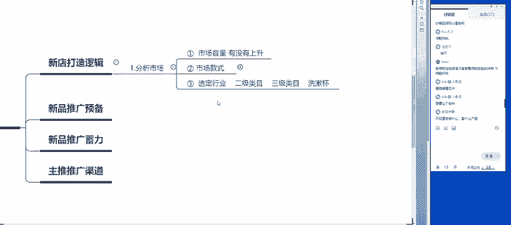
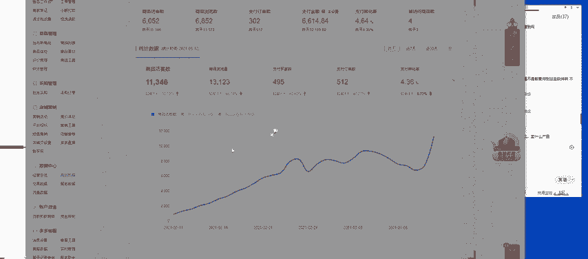
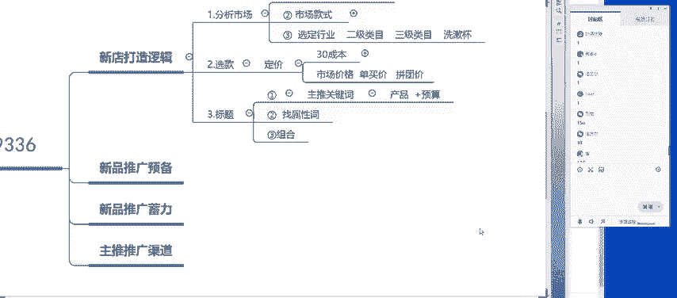
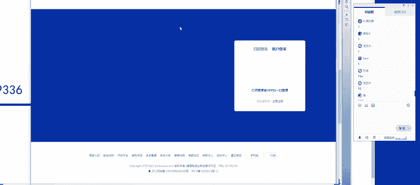
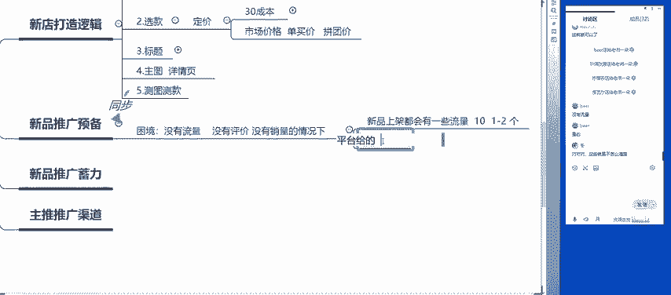
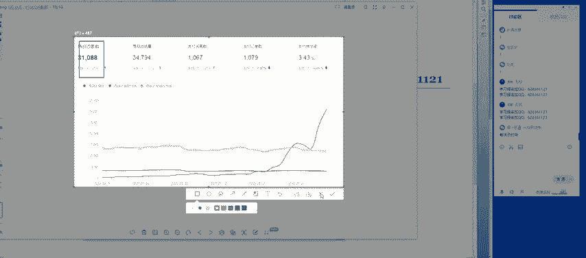
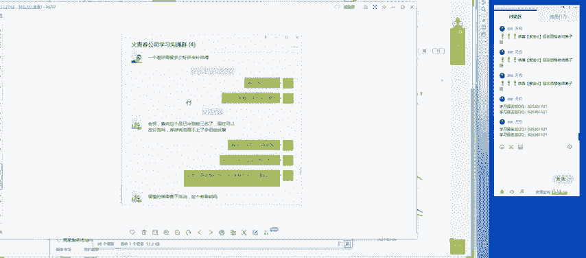
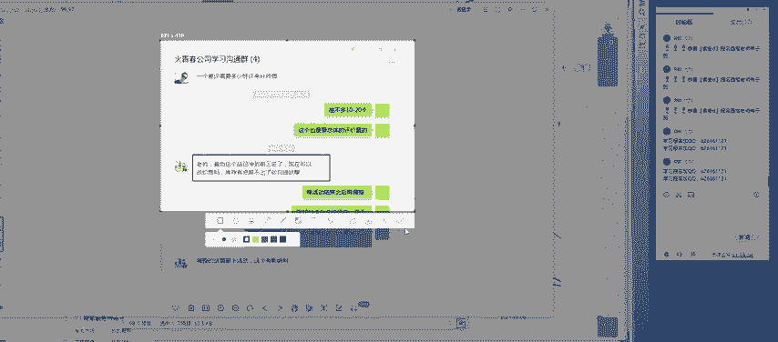
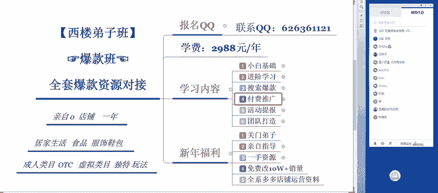

# 【拼多多运营实操教程】最系统的零基础拼多多开店教程全套，电商运营大佬专为学渣研制的新手开店保姆级教程！全程干货，简单粗暴 - P45：45、拼多多开店-新店七天爆款打造法则 - -拼多多开店 - BV1BH1qYpEqw

先签个到呃，我们的课程呢在14点35分正式开始啊，还有2到3分钟的时间，等一下还没有进入课堂的同学呃，OO啊，都可以听到，对吧？啊，OK的。

呃，然后呢今天给大家主要带来的一个课程内容呢啊先给大家介绍一下啊呃叫做流量起爆前的一个准备。也就是说我们的新店新开了之后，前7天到底应该怎么样去打造一个爆款，在做爆款之前，我们需要做哪些准备。

我会从几个方面呢一一给大家去进行剖析啊，下午好啊，这个达啊达同学还有刘冰啊，还有这个柠檬茶啊，下午好啊，然后呢因为最近呢也是呃有自己的一个店啊，在做的过程中呢，可能在呃遇到的一些问题呢。

我也带了一些例子啊，他们在最初去进行操作的时候呢，就会遇到各式各样的一个问题啊，其中问的问题最多的呢，就是新店到底应该怎么样去做。那么最近呢我也一直在不断的给大家分享这个新店如何去进行操作的一个内容啊。

那今天呢同样啊还是会以这样的一个主题啊，来给大家去呃进行详细的一个剖析。好吧啊，三大的啊。娜你好你好啊，下午好下午好啊，因为我看到有很多的小伙伴是第一次听我的课，对吧？啊，那有多少同学是第一次听我课的。

公屏扣1，我看一下啊，先来认识一下啊，我叫西楼啊，我叫西楼，做电商已经有8年的时间了。那现在主要是在做拼多多啊，当然我也有自己的拼多多店铺，也有自己的天猫店铺啊，那现在主要是在做这个拼多多了啊。

所以说呢呃。😊，因为今天是第一次认识啊，不过没有关系啊，既然说今天我们认识了，我相信以后呢我们会成为呃很好的朋友啊，也可以成为良师益友。好吧啊，然后呢我也希望各位在我的课堂里面呢可以学到东西。

可以真正的解决自己的一个问题。好吧，然后我们课程的这个第一个环节呢还是老规矩啊。第一个环节是给大家做答疑。那么有关于坐垫上面任何的一个问题呢，都可以直接发在公屏上，我会给大家去进行解决。好吧啊。

什么问题都可以问啊，都可以问。呃，最近呢这个拼多多呢可能是在憋大招啊，因为最近被这个政府这边是呃本来他是想要去做这个社区啊社区的这个团购。但是说呢像美团啊，然后加上这个拼多多全部都被政府给整改了。

所以说呃这一个项目呢没有办法持续下去，那最近呢可能也是在憋大招啊，有可能绝对是在618之前是要走一波大的啊，相信我一定会有的。

所以说呢最近也有会也有人会发现这个拼多多整体这个流量呢开始有一些些的下滑了啊，到底是什么样的一个原因。大家也会发现，其实呃尤其是在过年那段时间，是不是朋友圈里面非常多的人发给你，让你砍一刀，对吧？

但是现在呢慢慢的变少了啊，慢慢的变少了，原因就是在于这里。平融单他呃最近这一两个月呢。整体的这个活动的频率稍微降低了一点点啊，就是在憋大招啊。然后这个BR啊现在坐垫有什么绝招，没有啊，坐垫没有绝招啊。

坐垫没有绝招，永远记住这句话，不管你去做什么店也是一样的，包括你自己做事情也是一样的，没有什么绝招不绝招。啊，所谓的绝招是什么？你把一个普通的很简单的一个东西练到极致，这就是绝招，明白吧？

熟能生巧啊熟能生巧，没有什么所谓的绝招。绝招，那都是人家做了10年、20年人家的一个经验啊，然后。人家告诉你经验，但是你不一定可以做的好，明白吧？就像是就像是这个我们自己去开车一样，有的人能成为赛车手。

有的人呢就就只能开个普通的车。有的人甚至考驾照还要考好几次。明白吧？所以说这个绝招这个东西呢只是说适适用于你自己啊，你觉得哪一个东西比较适合你，那么你不断的去使用，不断的反复的去进行使用，熟能生巧。

自然而然就成为了绝招，好吧。啊，刘斌现在也是准备去做拼多多，那现在的话呃，你可以跟我具体的说一下。因为我在这个微信上其实我们也聊过啊，我们也聊过。我也了解你的情况。那现在你最大的一个困惑是什么呢？

你可以你可以跟我讲一下啊，包括像这个答想做晚店，但是不知道从哪里去进行下手，很多都不懂，这个是很正常的啊。因为新店我们在接触一个新事物的时候呢，可能都会遇到这样的一个问题，但是没有关系啊，但是没有关系。

呃，只要你朝着一个努方向去进行努力。那整体这个框架呢，老师都可以交给你啊，都可以交给你有经验的人都可以直接带着你，给你找到一个方向。你没有方向，我这边有啊，你直接跟着老师来，对吧？啊。

老师告诉你要朝哪一个方向去走啊。明白吧？所以说这个其实不是最大的一个问题。最大的问题是什么呢？你到底是是不是不是确认想要去做拼多多。明白吧？我之前呢也有很多的徒弟啊，不太清楚自己怎么样去做，也是很迷茫。

但是你做一段时间发现啊，做一段时间之后会发现其实拼多多很好玩啊，很好玩。呃，因为现在整个拼多多里面呢，对于消费者来说，它类似于什么呢？类似于这种网游了能不能明白？在这个游在这个玩这个拼多多的时候呢。

我们要去呃种一下果树。然后果树成熟了之后呢，免费给你发几斤的这个水果。所以说呃其实也是挺好玩的啊，只要你认真的去钻研这个东西都没有问题的。😊，啊，我昨天刚刚注册了拼多多啊，听课听的很懵逼啊。

这个没有关系啊，今天呢你这节课绝对是可以学到东西的。算当的明不明白？我今天主要就是针对于新店，我们前期到底应该怎么样去做准备啊，开店之后，那么下一步我们要去做的一个事情到底是什么，明白吧？

拼多多和淘宝有什么不一样嘛？拼多多淘宝呃不一样的东西非常非常的多，明白吧？首先第一个流量渠道就不一样。那拼多多整体的流量呢呃来源于微信，而且呢大部分都是三四线城市会比较多一点。现在二线城市也是有的。

但是一线城市非常少，一线城市整体的一个人群占10%啊，10%以内吧啊，7%到8%，二线城市有11%，大部分三四线城市占在50%到60%，明白吧？所以说如果说要去做拼多多的话。

比较适用于这种呃低客单价的啊，而且稍微有一点点品质的这种商品，50块钱到150块钱之间，那淘宝适用于做。😊，是什么呢？就是100块钱以上的，100块钱到300块钱之间，明白吧？所以说。

单从这个价格上面来说，拼多多和淘宝就完全不一样。那另外一个，如果说你要去做淘宝的话，你会发现淘宝的流量非常的贵啊。淘宝如果说呃刘斌这边是做这个女包的对吧？如果说你要去淘宝去做呃，做这个女包的话。

你会发现你开直通车点击一下，可能都呃至少都需要3块钱啊，至少都需要3块钱。但是在拼多多不一样，有可能你五毛钱三毛钱就可以拿到一个点击，明白吧？它流量比较便宜，这就是最大的一个区别，对于我们中享卖家来说。

这就是最大的一个区别了。只要我流量拿的便宜啊，我可以花很很少的钱买到流量那O啊我的产品可就可以卖出去啊，不用担心我亏钱，为什么现在很多人说淘宝比较难做啊，因为竞争越来越大啊，你流量不好拿好吧。

199会不会会不会不好做啊，199的话啊做是可以做的啊，做是可以做的。😊，完全是可以做的啊。这个价格上面呢就是像服饰鞋包类啊，服饰鞋包类啊，这里面有个重点啊，大家可以拿出笔记本啊，自己记一下啊。

如果说大家考虑要去做服饰鞋包。啊，服饰鞋包类的话，你可以不考虑价格啊，但是说这个价格呢，你一定要在300以内。300以内的一个价格。因为服饰鞋包主要是看款式啊，主要是看款式，明白吧？刘斌明白的话。

公屏扣1。然后三大呢说基础操作都不怎么会，这个没关系啊，今天你一定会学到怎么样去基础操作，好吧？啊，然后呢这个大家还有没有其他的问题啊，有问题的话直接发出来啊，直接发出来我都会给大家去进行解决啊。

都会给大家去进行解决，明白吧？呃，然后呢这个如果说大家没有问题的话，那公屏鲜花来一波我们就啊正式开始我们今天课程的一个内容，好不好？啊，已经做好准备的啊，因为我在课程课程中间呢是有这样的一个习惯啊。

大家有任何的问题都可以直接在公屏上发。那么第二个呢是大家一定要做好自己的笔记。因为我呃讲的东西呢啊有很多的一些重点需要大家自己记下来。如果说呃你有可能下一次还会听我的课啊，也有可能呢下次不听我的课。

但是说坐垫的过程中会遇到一些问题，那么你慢慢的自然就明白啊，我在讲这个重点的时候啊。😊，你突然间回想起来，哎，哎当时西罗老师讲了这样的一个重点啊，正好是我现在遇到的一个问题，那么可以帮助到你。

那么我就非常的开心，好吧。😊，好，那么已经准备好的同学啊，公屏鲜花走一波啊。如果说今天呢因为时间关系啊，不可能说呃一个一个给大家去解决这个问题啊。如果说大家问题没有解决到的啊。

或者是还有任何的这个呃时间关系，没有把你们的呃问题发出来的，可以直接加一下我的QQ啊，可以直接加我的加一下我的QQ啊，这个是我的呃诊断店铺的这个QQ啊。然后呢，如果大家有任何的问题啊。啊，打一Q啊。

也是这个福利Q啊。当然大家如果说有想要什么福利的话啊，可以直接加我的Q好吧。😊，好，OK啊，那么时间差不多了，我们就正式开始啊，我们就正式开始。那么今天所给主讲的一个内容呢，是流量起爆前的一个准备啊。

包括说我最近在做的两个店啊，刚才啊在开课之前呢，大家可能看到了我店铺啊一直在谈消息啊。原因呢就是啊我今天要主讲的一个内容呢，就是通过这个两个店铺啊，两个店铺的一个案例呢，实际的来给大家讲一下啊。

来给大家剖析一下我们的店铺在初期啊，是怎么样一步一步的走起来的。包括我们的单品啊，这个流量到底是怎么样一步一步的去做，并不是说我们来了之后呢，就有流量了。我的店，包括我的店铺也是一样的。

不可能说来了之后，我直接就有这个成千上万的上万的一个流量，全部都是从零开始做起的啊，全部都是从零开始做起的。好吧。😊，好，这是这一个店啊。另外一个呢就是老师是主做食品的啊，主做食品的这是这一个店铺啊。

目前呢是呃500多单啊，目前是500多单。好吧。好，okK呃，那么今天课程的一个内容呢，主要分为四个部分啊，主要分为四个呃四个维度，从四个维度呢给大家剖析清楚。那么第一个叫做什么呢？

叫做新店打造的一个逻辑啊。新店打造逻辑，尤其适用于这个桑拿大和刘冰啊，基本上都是前期呃这个新开店，但是说还没有去呃不知道从哪里去进行下手的。首先我们要把这个坐店的整体的思维啊给了解清楚。

那么第二个是什么呢？我们的新店在进行操作之后呢，新店怎么样去进行预备，就是新店新品啊，推广预备啊，推广预备期。那么第二个啊呃也是我们在推广过程中的第二步啊，要做的是什么呢？是推广的蓄力器啊。

新品推广蓄力。啊，那最后一个是什么呢？是主流的推广渠道。啊，主流的几个推广渠道的一个认识。我们必须要知道我们的流量从哪里来啊，流量知道流量从哪里来，我们才可以去合适的渠道去导流量。好吧，好。

那么我们直接进入第一个啊，新店的一个整体的一个打造逻辑啊。那么我想问一下在座的各位啊，凡是有在做店的啊，现在店铺呢也是有一点点基础的。各位是怎么样去进行操作的。啊，大家是怎么样去进行操作的？

或者说啊大家现在对于新店啊自己的一个店铺在操作过程中有没有这个完整的思路啊？如果说大家有思路的话，公屏扣1。如果没有思路的话，公屏扣2，我看一下各占比有多少。如果说大家这个思路都比较清楚的话。

那么我们这个部分呢就快速的啊讲过，那么我们直接讲重点。如果说大家对于这个基础来说啊，比较呃模糊，那么ok我们就详细的去讲一下。好，速度快啊，老师喝口水啊，等你们这个5秒钟。好，okK啊。

只有刘斌一个人啊啊两个。😊，其他的同学呢进来之后都不讲话的，像这个陆先生啊，陆先生啊，雅文还有这个刘军辉亮晶晶。啊，有很多的同学呢都是刚刚啊进来的啊，迟到了啊迟到了。下午好啊下午好啊，能听到声音的啊。

确保都可以听得清楚的啊。公屏鲜花走一波，我们就正式开始，好吧。好啊，那么产品打造逻辑。第一个呢就是我们的新店在操作初期到底应该怎么样去进行操作呢？第一步要做的叫做什么呢？分析市场。

也就是说我们的产品到底能做还是不能做啊，各位都是做什么产品的，你们可以发在公屏上，我帮你们看一下啊，那这个里面呢又又需要用到一个工具，叫做什么呢？叫做呃三方的一个工具。

或者是大家用这个多多参谋也是可以的啊，用多多参谋也是可以的。好，我们来具体的看一下啊，老师先登录一下账号啊。所有的店铺我们在操作的过程中都必须要先经历这一步。

否则的话你根本不知道你的店到底是能做还是不能做，每一个产品呢也都是不一样的啊，也都是不一样的，明白吧？好啊。呃，有做女包的，有做女鞋的，有做童装的啊，还有做这个玩具的啊，还有做玩具的。呃。

那我们在操作的过程中啊，需要用到这样的一个工具啊，需要用到这样的一个工具。这个工具有什么好处呢？就是它可以直接看到我们每一个类目啊，我们可以直接看到每一个类目。比如说我们做的是呃米包，对吧？

像这个我刚才大家呢发了很多的类目。首先我可以确定的告诉大家，有哪几个类目是可以去做的。像小幸运的这个植物啊，是绝对可以做的。这个你看都不用看，直接就可以来。然后呢，陆先生这个食品啊。

食品类目在拼多多里面也是绝对可以做的啊。这种呢是是属于消耗品绝对是可以做的啊，然后呢，像这个儿童益智玩具，儿童益智玩具如果说不是品牌的话啊，我建议你就啊不要来了，明白吧？啊。

儿童益智玩具如果说不是品牌的话是呃不是特别好做的，除非你非常做那种非常非常低价的。然后呢，还有一个是童装童装也是可以呃，也是可以去做的。然后女鞋女包啊，女鞋和女包服饰鞋包类啊。

服饰鞋包类也都完全是可以做的。我们先来看第一个啊，我们先来看第一个这个溜冰的这个女包。那么我们选择服饰箱包，然后选择女包。😊，呃，女包，然后直接搜索呢，我们就可以直接看到同行的一个什么样的一个数据呢。

大家也可以看到整体的行业的这个销售额是不是在发呃处于一个增长的一个状态。那整体的曲线是不是都在增长，说明这个类目呢，它整体的一个需求量是有在不断去进行上升的。那么整体这个类目分布里面。

如果说我们要去做女包的话呢，首选的产品到底是什么呢？就是斜挎包和单肩包，这两个呢是我们可以去首选的。那么次呃副推款可以选择可以选择这个手提包。如果说你的客单价稍微高一点点的，那么就选择这种小类目的啊。

这种小产品，比如说手拿包化妆包胸包或者是腰包啊，类似于这几个。所以说根据于这个子行业整体的啊产品的一个分布，我们大致的就可以算出来我们是需要去选择什么样的一个款式。能不能明白？刘斌啊，这是这一个点啊。

这是第一个点，我们首先在确定这个是。市场的时候分析市场。第一个要看的是什么呢？好，一我们要看的是市场的容量。有没有上升啊有没有上升？如果说这个数据啊，同行的数据呢基本上市场呢是在上升的一个状态。

那么我们完全就是可以去做的。那么第二个我们要看的是什么呢？第二个我们要看的呢是整体的这个市场里面的款式。啊，市场里面的款式哪些产品是我们可以去做的？比如说女包，那么我们呢就可以去做呃斜挎，还有单肩啊。

呃，还有一个是什么来着啊，突然间忘掉了啊，来我们来看一下啊手提包啊，手提。就是这三种规格啊，这三种规格是我们最应该去做的啊。那么只要确定这两个啊没有问题，那么我们的产品基本上都是可以做的啊。

那么我们来看下一个啊，来看下一个呃，女包看完了之后呢，我们来看一下这个女鞋啊。刚才有同学呢也提到了女鞋。既然说是同一个类目的。女鞋的话，这个鞋子的话是属于哪一个鞋，低帮鞋还是帆布鞋还是高帮鞋。啊。

这个不是免费的啊，这个不是免费的，这个是我自己的一个工具啊。如果说你写呃有想要了解的话，也可以直接加我的Q，好吧啊，加我的Q。😊，啊，柠檬糖直接就暴露了啊，直接就套露了啊，虽然你是我的弟子啊。

但是我这个呢是只给到我的弟子的啊，我的弟子来了之后都是免费的。好吧，比如说我们这啊回到课堂啊，回到课堂。比如说女鞋里面我们要去做这个低帮鞋啊，我是我们去做这个低帮鞋。那么在做低帮鞋的时候。

整体的这个销售额也是在上升的一个状态。那么我们在操作的过程中啊，像单鞋，还有板鞋，还有豆豆鞋这一类的呢，相对来说占比就比较低啊。那么呃相对这种类目来说呢。

它整体的一个呃产品的一个分布呢啊是单鞋会比较居多啊，然后呢就是低帮鞋运动休闲鞋。所以说我们在做的时候也是做单鞋啊，也是做单鞋，明白了吧？关于这个点的一个具体的一个操作，大家都还能不能明白啊，能不能明白。

明白的话，公屏扣一啊，包括像这个三大的啊，三大的是做这个女鞋的。然后这个加意尔是做童装的。我们最后再看一个童装的。因为时间关系啊呃母。😊，音？然后呢，选择童装啊童装。童装具体是什么样的一个产品呢？

比如说我们就选随随意选一个吧，基本上童装都是一样的啊。我们整体看这个大类目啊，整体看大类目。童装整体的一个销售趋势呢也是在保持上升的一个状态的。但是说它相对其呃另外两个类目来说，它比较平稳啊。

它比较平稳。那么我们主要去进行操作的呢是其他的子行业肯定是比较多的。那占比最大的是什么呢？是套装，套装完了之后呢，是什么呢？是裤子啊，套装裤子，还有这个裙子。然后呢，就是T恤。

儿童内衣裤、帽帽子围巾演出服，这些都是比较平均的。所以说我们选择的一个最大的一个市场呢，应该选择去做套装，能不能明白啊，是做裤子了OK那么我们具体来看一下这个裤子啊是一个什么样的一个数据啊。

我们点击裤子。啊，裤子呢上升的一个幅度更大啊，上升的幅度更大。那么现在呢你的店铺的流量应该是整体在上升的那裤子呢就是一个比较精准的一个产品了啊，直接就是全部啊这个子类目里面全部都是裤子。

那类似于这样的一个呃，如果说在在这里我们看到的整个类目里面所有的产品全部都是裤子。那这种情况下，我们要去操作的一个类目流量是什么呢？叫做类目流量啊，叫做类目流量就不再是去做搜索了，明白吧。像童装。

如果说大家做的是裤子的话，直接去做类目流量啊，不要去做这个搜索流量啊，搜索流量相对来说就比较精准啊，就比较精准。好吧，想要这个软件啊没呃，直接加我的Q啊，先加我的Q啊，因为这个我不是免费给到的。

因为这个我也是自己花钱的，明白吧？如果说你有想要自己买的话，也可以啊，我也可以把链接分享给你好吧，不知道该做什么产品，卖什么产品啊，其实这个我也我也讲过了啊，我也讲过了。

因为这个里面呢有我们大部分的一个类目啊，大部分的一个类目。比如说这里面所有的类目全部都是有的。比如说啊家居生活，你首先你要先确定的是什么呢？你行业也要先先选定对吧？那家居生活用品里面比较好做的。

像书籍图书啊，报纸这一类的是最好做的。那么下一步是什么呢？就是这个洗护用品对吧？居家日用的里面啊，居家日用啊，日用品也是好做的。比如说什么啊拖鞋啊这一类的也是比较好做的那下一个呢就是饰品。

所以说你要先确定你做什么行业啊，明白吧？不是说。😊，那你你想要去做一个什么东西呢？比如说分析市场里面第三个啊也给大家写一下吧啊，避免大家这个混淆。那么我们在操作的过程中，你首先你要选定行业啊，选定行业。

如果说你连行业都没有选定的话，谁也帮不了你我也不知道你做什么产品。每一个行业里面其实都是有产品可以去做的，明白吧？啊，什么价格，这个软件如果说你自己要去买的话，一年是1888啊，小幸运。😊，明白吧？

然后像这个微笑项目的啊，首先第一个啊，你要你要认真听啊。第一个是先选定行业，选定行业了之后呢，你选择二级类目啊，二级类目。你选定行业里面同样也可以使用这个软件来做啊，选定这个行业。比如说家居生活。

然后呢，一级类目里面我们选择流行饰品啊，或者是你选择家居生活里面，我们大致的就可以看到哪一个子类目是比较好做的啊。我们比如比如说我们选择了这个洗护清洁类的。那么我们就在这里选择洗护清洁类的啊。

加个人呃个人清洁工具，然后继续进进行搜索。然后再具体的去下面啊去进行筛选。比如说我们又选择了卫浴和置物用置物用具。那么我们就在三级类目里面选择卫浴啊，置物用品，然后呢去继续去进行搜索啊。

那么大家就可以直接找到了。比如说浴室的脚架，置物架和洗漱杯，这一类的产品呢，整体的占比来说是比较高的。那么O我们就做一个洗漱杯。明不明白这样的思路，明白了没有？先选定行业再选定二级类目。

再选择三级类目啊，三级类目选择三级三级类目最终我们可以做什么呢？洗漱杯啊。当然这是其中我给大家举一个例子。并不是说大家一定要去做这个洗漱杯啊，就是说如果啊你没有办法选定的话。

你可以以这样的一个方式去进行选定，然后去找的呃寻找产品好吧，那关于这个点，大家都能不能明白。明白的话，公屏扣一，这是我们坐店之前第一步要去做的啊，第一步要去做的也是非常非常重要的一个点啊。

OK啊O那我们就继续啊，我们就继续啊，因为这个有有很多的同学这个提到了很多的一些这个呃产品啊，像三大的提到凉鞋，凉鞋完全是可以做的啊，服饰鞋包类啊，食品，还有这个花卉这一类这一类的类目都可以做。

包括我这个店铺就是做花卉的啊，就是做鲜花的来看一下。

啊，不信邪啊，你们就不信邪啊，认为鲜花不好做啊。😡，好做的啊好做的这种产品啊，来我们来看一下啊，商品明细。看到没有？就是卖花的。😡，简单粗暴啊简单粗暴，有很多人买这种东西的啊，你比如说什么多肉啊。

发财竹啊，这种长寿花，好吧。😡，可以看到价格区间嘛，那么不要着急。接下来呢就是我们讲第二个点的时候啊，会给大家去讲到啊。刘斌啊，不要着急。第二个呢就是我们在选啊选定了这个产品之后呢。

那么下一步我们就是要去进行选款。那么在选款的过程中呢，我们有几个问题呢啊，有一个非常重要的一个问题要去进行确定，就是定价。其实定价呢我会单独的分开来去讲啊，单独的分开来讲。

因为这个定价呢对于拼多多来说是非常非常重要的啊，是非常非常重要的。那么首先啊我们继续来看，同样还是使用到这样的一个工具啊，同样还是使用到这个工具。

比如说那么我们想要确定我们的某一个款到底应该定在什么样的一个价格，我们就可以在这个商品分析啊，商品分析里面点击商品总览啊，然后去进行选择。比如说我们也可以选择对应的类目。好，我们选择这个呃福饰箱包啊。

😊，同样啊还是做这个包对吧？然后女包直接去进行搜索。直接搜索在下面的位置呢，我们可以看到整体的大致的所有类目里面的整体的价格区间啊，整体的价格区间看到了没有？这个价格区间呢。

也就是说200块钱以下的一个产品呢，整体占比是最多的，大概占在80%以上。如果说你要做一些客单价比较高的啊，像这种啊，像这种这一个199%到299%啊，也就是说200块钱到300块钱之间的。

那么整体所获取到的流量呢相对来说呃比较小，只有2。65%，明白吧？能不能明白？也就是说整整体的在整个平台里面，它的一个流量占比区间啊，价格区间最多的肯定是低价的啊，肯定是低价的。

但是低价不能低到没有没有下限啊。如果说大家做的是9。9块以内的这个女包，那就不太好做。如果说做的是这个9块钱到这个50块钱啊，10块钱到50块钱之间的，那么完全是可以做的。

那么像这一类的比较高个的那样的一个产品适合做什么呢？适合做利润款。能不能明白刘斌，那你的产品呢有没有这个相对来说价格稍微低一点的，100块钱以下的，完全就可以做的。明白吧？

前期因为我们的店铺不是说只只去销售一个款啊，同样其他的类目也是同样可以去进行看到的。所以说我们下一步要做的就是定价。那其实在定价的时候呢，比如说我们的商品啊，30块钱的一个成本。啊，30块钱的一个成本。

那么30块钱的成本在拼多多里面呢有不同的一个呃活动。那么在做活动的时候呢，我们就需要用到一个东西叫什么呢？叫做智能定价工具啊，就是智能定价工具啊，这个呢也是我自己经常在做的。我们在做店的时候。

不可能说好我们的商商品上架了之后，然后最低的一个价格7块钱啊，比如说我们产品成本呢是4。2啊，4。2块，那么我们7块钱就去卖啊，那肯定也是不行的，只卖这个7块钱产品，我们根本不赚钱，明白吧？

所以说我们最终可以把我们的产品，比如说我们的产品呢是45块钱啊，45块钱的产品成本加上5块钱的运费成本或者4。3块的运费成本。当然如果说你订单量起来了，像我的这个食品的店呢，基本上发一单快递2块钱以下。

明白吧？所以说运单成本呢啊，运费成本呢可以降的更低。比如说我们只有2。1，那么整体的利润空间啊，也可以自己去进行计算。比如说有20%或者是有10%。那么整体的我们这里面是。😊，有公式的啊是有公式的。

我们就不需要去进行调整。比如说我们产品成本是45块钱，然后运费成本是2。1块，那么最终我们的定价呢就是61。2块啊，就是61。2块。那么在搜索专区里面，我们的一口价啊，我们在发布宝贝的时候。

是不是需要选择价格来，我直接店铺后台来进行操作。好吧啊，店铺后台来进行操作，大家也可以这个跟上啊，也可以跟上。比如说我们选择发布一个新商品啊，在选择发布新商品的时候呢，呃比如说服饰鞋包。

我们随意选择一个啊随意选择一个比如说女鞋啊，帆布鞋。然后选择发布这个类目之后呢，然后在下面的位置呢，我们可以选择对应的一个市场价。那这个市场价呢，我们可以45乘以2。5，明白吧？45乘以2。5。

大概是在百分之啊大概是在80块钱到90块钱，我们定1个85，市场价呢是85块钱。然后呢，我们拼单价啊，拼单价呢是最终售卖的一个价格。那么下一步的一个单买价，我们设置多少呢？按照这个表格里面来进行计算啊。

常规的一个价格呢就是62块钱。所以说我们单买价设置62块钱。那搜索专区里面啊，这个搜索专区，也就是我们实际在搜索专区里面需要卖多少钱，也就是55块钱。所以说我们这边拼单价设置55块钱，明白吗？

就是按照这样的一个表格来进行计算。那会场价格呢就是我们上上活动，比如说上了秒杀或者是上了一些这个呃双十一大促的一个会场。那么最后一个呢就是9。9块。今日的一个推荐价。9。9块上这个活动基本上都是亏钱的。

能不明白？😡，所以说9。9块的这个活动呢，基本是要求7折以下。所以说9。9块我们只能42块钱卖。那最终得出，如果说我们前期上9。9块活动去进行推的话，每一单大概要亏多少钱？我们需要做多少订单。

其实都是可以计算出来的。能不能明白这个点明白的话，公屏扣1啊。这个话呃这个点能明白的话，公屏扣一啊，我们要去定价啊，我们要去定价。根据我们的成本来定价。那么后期我们怎么样去做利润呢？在每一个规格里面啊。

每一个产品里面都有不同的规格，不同的规格就会有不同的利润，明白吧？所以说使用这个定价表啊，使用这个定价表。嗯。呃，邮政纸箱怎么做？纸箱的话做批发啊，做批发。明白吧？这个陈呃陈景芬啊，抱歉。

刚才没有看到你这个消息啊，如果说你要去做这个纸箱的话，那么你就做的这个呃格调稍微高一点定制啊。你来我的店铺里面，我可以最低价定给你，我，直接一批一批的定给你。明白吧？就不要单件去卖了，单件卖的话嗯。

基本上看不到什么东西的啊，看不到什么利润的好吧。啊，要这个表格呀啊，如果说要表格的话，直接加我的Q，好吧啊，加我这个Q就可以了。😡，啊，到时候呢我直接发给大家啊，我直接发给大家，好吧。😊。

表格其实不是什么东西啊，啊，重点是这个思路啊，重点是这个思路。好吧，然后呢我们就继续进行下一步。那么我们的产品呢款式已经选好了，然后价格呢也已经定好了。比如说我们要去做一个洗漱杯，或者是去做一个啊女鞋。

那么整体的定价啊，包括我们的单买价格。啊，市场价啊市场价单买价。包括我们的拼团。啊，包括我们的拼团价全部都有了。有了之后呢，那么直接就会进入到第三步。第三步是什么呢？也是一个非常重要的一个核心叫做标题。

有多少个同学现在不会写标题的，公屏扣1，我看一下有多少。啊，有多少同学现在不会写标题的啊，答一个啊，其他同学都会不会？😡，这个标题呃，如果说大家会的话，我就不讲了，不会的话，那么我就稍微讲一下。

知道关键词怎么选啊。看来刘斌呢也是有了解过一些这个坐垫的一个呃基础的一些知识啊，对吧？知道去选关键词啊，知道去选关键词。那么我们实际操作的过程中呢，标题主要分为几个步骤来进行啊来进行操作。

首先第一个步骤是什么呢？啊，我们还是啊123给大家标注清楚。第一个我们要去确定的是什么呢？叫做主推关键词。这个主推关键词永远是最为核心的一个点啊，最为核心的一个点。那么我想问一下在座的各位。

如果说啊呃大家去做一个女鞋也好，女包也好，童装也好，去或者说去做什么样的一个产品也好，大家要有多少的预算。😊，啊，问一下大家，各位可以把你们的预算发在公屏上啊，发在公屏上。

你们可以就是大致的一个预算就可以了啊，不要非常的清楚啊不要非常的清楚。😊，有多少的预算可以直接发在公屏上啊，怎么样发呢？发你的产品。加预算。产品加预算有了这个东西呢。

我会教大家怎么样去定我们标题里面的主推关键词啊，我先来把步骤给大家讲完啊。第一个呢是做这个呃主推关键词啊，那么第二步是做什么呢？是找属性词啊找属性词。找到属性词之后呢。

那么第三步啊就是直接去进行组合了啊，直接去进行组合了，明白吧？然后呢啊2000块钱可以吗？2000块钱你开个店交个榜子已行就没了。能不能明白啊，okK我看一下啊，15啊112啊，然后呢还有这个15啊。

然后呢童装是1啊。好，那么具体的来给大家看一下。首先我们先来看第一个第一个发的是谁来的啊，刘冰啊，刘冰是做这个女包的对吧？那首先我们第一步要确定的同步使用的一个工具是什么呢？叫做我们搜索推广工具里面啊。

搜索推广工具里面，这个工具是免费的啊，所有人店铺后台里面都是有的啊，点击推广中心啊，找到推广工具啊，找到推广工具。😊。

找到推广工具之后呢，进入这里面有个搜索词分析。首先第一步我们要去搜索我们的一个产品。比如说我们刚才是不是选定了我们的产品。看到没有？第一步在分析市场的时候，是不是选定了产品。比如说我们做女包的时候，好。

我们啊刚才看过了是单肩包比较好做。那么我们就搜索产品名称，搜索这个点击这个查询，搜索这个单肩包。然后呢直接在这下面呢会有对应的推荐词，它会给到100个推荐词。那么这100个推荐词。

我们需要直接把它下载出来。啊，直接左呃鼠标的左键按住按住之后呢，然后直接往下拉，然后全部复制出来。复制出来之后新建一个表格啊，新建一个excel表格。明白吧？新建一个表格，然后呢打开这个表格之后。

把这个关键词全部都复制进去。这一步能不能啊能不能理解啊，能不能理解？好，大家呢都各自记好自己的这个记好自己的预算啊，记好自己的预算这个方式方法呢我只演示一遍啊，我只演示一遍，大家认真听，好吧。😊，好。

这个这一步的一个操作，大家都能不能明白？明白的话，公屏扣1啊，因为这个是需要实操的啊，我稍微慢一点给大家讲，给大家讲清楚了，好不好？😡，好，OK把所有的关键词加到这个表格里面。

下一步我们要去做的是什么呢？选择从这些关键词里面去选出我们最适合去进行操作的关键词。这个不是电吧啊，这个不是电吧，电吧是后面才用的啊，这个是直接使用后台的工具啊，免费的工具就可以了。

免费工具推广工具里面的搜索词分析啊，我直接给大家这个截图发公屏上吧，好吧。在你店铺的后台啊，店铺的后台找到推广中心里面有个推广工具啊，然后点击进去之后呢，就可以找见了啊，就可以找到了。好吧，好okK啊。

那么下一步我们要去做的是什么呢？是计算每一个关键词的竞争力。竞争率等于什么呢？等于搜索热度乘以转化率，然后再除以竞争强度。那么这个公式到底是怎么来的呢？啊，这个公式到到底是怎么来的呢？对。

就跟生意参谋一样啊，看来你是做过了解过淘宝的啊。好，那第一个呢搜索热度是指有多少个人去进行搜索了你的产品。就是说搜索了这个关键词。比如说像这个学生单肩包，那么每天会有多少人搜索呢？

是有1200啊1258个人去进行搜索。当然我这看的是一天的数据。如果说大家在做的时候呢，需要把这个数据调整为7天，能不能明白，也就是说在店铺的后台啊，选出来的这些关键词不是不是只看一天的数据啊。

在右上角的这呃这个位置呢，大家要选择7天的数据。这里面呢你要选选择7天或者是选择15天，可以拉的时间更长，也可以拉的时间稍微短一点，明白吧？把所有的关键词全部下载出来之后呢。

下一步我们计算出对应的呃竞争力，然后呢把所有的竞争力全部都筛选出来，直接点击筛选，然后按照降序排列。那么竞争力最强的关键词就是初中生跨包。如果说大家要去做单肩包的话，那就去做初中生挎包这个关键词。

这个这个关键词基本上没有多少同行在做，只有43个竞争啊，只有43个人在跟你竞争。所以说前期的时候我们可以使可不可以使用这样的关键词去进行补单呢？明白吗？所以说我们最终就可以选择出这一个关键词啊。

这个关键词呢是最容易去找到我们的产品的。最容易去找到产品的。那么这个词呢也可以叫做蓝海词。啊，也可以叫做蓝海词。这就是所谓大家所听的啊所听到最多的啊，什么叫做蓝海词。那么搜索完之后呢那这一步啊结束之后。

那么下一步我们要去同步使用到一个工具啊，就是同样还是店霸。在这里面呢我们需要搜索到关键词，同行的一个排名搜索初中生挎包，因为我们已经确定了我们的主推关键词是这一个。

那么我们要确定这在这个关键词下面我们每天需要做多少的订单，看到没有？同行卖的比较好的，每天可以卖500单，卖的相对来说比较呃比较差一点的，每天可以卖十几个订单。

也就是说如果说按照这样的一个比例看到同行近一周的销量，它一周可以卖多少呢？卖1000左右的一个订单，也就是说我们只要把我们的商品在一周内可以推到1000笔啊，把我们的订单可以推到1000笔。

那么自然而然我们的排名就上去了。当然是不是每一个价格段都需要这么样这么样去推呢？也并不是。我们要看商品的最低团购价，像这个商品，它最低团购价是26，但它整体的一个客单价呢可能在40块钱到50块钱。

明白吧？所以说我们以这个产品选择。以这个排名第五的这个产品呢作为我们的竞争对手。所以说选择选出这个蓝海池之后呢，我们需要选择一个竞争对手。选择竞争对手。那么啊前面我给大家啊，我让大家发的这个预算。

那么这里面就来了。怎么样提呃，根据于我们自己坐垫的一个预算。比如说我们做女包这个产品呢，可有这个15万啊，有15万的一个预算。那15万的这个预算，你要分出多少来去做搜索。

这是7天7天的时间我们需要做到1000单才可以拿到排名。明白吧？所以说这个呢就是标题的一个重要性。找对主推关键词，就可以确定你在这个市场里面你可以走多远，你可以做多大。如果说像这样啊。

每7天1000单的一个数据，你告诉我你只有2000块钱的一个预算。我告诉你，你是不太适合去做这个市场的。能不能明白？😡，这个点能明白的话，公屏扣1啊，这个点能明白的话。

公屏扣一怎么怎么感觉暗示刷单不需要刷单啊，不需要刷单。如果说你有渠道，如果说你有资源上单了，明白吧？啊，你是呃可以直接啊，可以直接走多多进宝，明白吧？小CK啊，小CKO啊，OK帮你看一下。关键词查询啊。

直接搜索查询啊，选择一个竞争强度比较比较低的啊比较低的。呃，小C根是一个品牌词，对吧？品牌词你直接做品牌词就可以了。这个这个产品呢基本上没有太多的人在做啊，没有太多的人在做，你也是比较好去竞争的。

你直接要去竞争的，可能就是旗舰店啊，可能就是旗舰店，明白吧？看同行只有这个只有一家店铺卖的比较好啊，近一周的销量呢是达到了1万多，可能有在走活动啊，可能有在走活动。那么它整体的一个价格呢大概在128单。

也就是说整体一周的销量呢是200单。😊，一周200单的销量，你不需要做太多的一个数据，直接就可以卡上去了，明白吧？😡，7天200单多好做啊，7天200单很好做的啊，随随便便就上了。😡，明白吧？😡。

然后呢，童装啊童装你不是做裤子嘛啊，其实这个大家下去之后自己搜索一下就可以了啊，搜索一下就可以了。😡，你是做什么裤子的啊？童装裤子。童装裤子这个词呢相对来说比较大，可能同行的销量就会比较高一点。

看到没有？只有有这个200多，也有1000多的啊，也有1000多的那整体的我们要看一周的数据啊，一周同行呢大概做800多、900多啊，都是上百的啊，都是上百的，1000以下的，我们都可以去做啊。

1000以下的我们都可以去进行接受的，明白吧？比如说童装裤子领洋气，我们要去做这个关键词。如果说大家选择的关键词呃，市场是比较不好的，那么我们就换一个关键词去进行操作。看到没有？

同行呢这个童装裤子洋气这啊童装裤子女洋气这个关键词。好，那整体呃看下来同行的一个销量呢，每7天的销量大概也就是五六百700多嘛啊五六百700多啊，500到700左右。那么我们在操作的时候呢。

就可以根据这样的比例去制定我们店铺的计划。所以说这个标题会直接决定你后期你要去选择哪一个竞争对手去进行PK。你要去抢掉它的排名啊，我们要做的是什么？不就是抢排名吗？好，我们一个一个来看啊，邮政纸箱啊。

邮政纸箱呃，再给大家看看完这两个啊，看完这两个。😊，我们就继续往下讲了，好吧，邮政纸箱邮政纸箱的话，同行你看同行走的呃走的量就比较多啊，走的量就比较多，一周走的量基本上都是在几千以上的啊。

相对来说这个类目呢可能就没有啊，我们要选择产品的时候呢，就不要选择这样的关键词去进行操作。我们可以选择什么呢？比如说纸箱壳打包。😊，啊，纸壳箱打包啊，纸壳箱打包这样的关键词去搜一下。

所以说选词是一个非常重要的一个点啊，非常重要的点。因为我这个是没有没有做这个第一步的啊，你第一步一定要先去这里面去进行搜索，明白吧？邮政纸箱啊，先面在这个邮政纸箱里面去找啊。

哪一个关键词竞争强度是比较低的。比如说啊纸箱包装快递，那这样的一个关键词相对来说竞争强度比较低。那么我们搜这个关键词，同行的销量肯定是比较低的，明白吗？这个思路要明白啊，思路要明白。😡，看到没有？

同行呢就是四五千四五千啊，那这个也也是相对来说比较高的。这个点能不能明白？陈景峰啊，思路明白就okK。然后呢，小幸运的这个汕尾葵啊，汕尾葵是做什么产品的啊？OK我来看一下啊，我来看一下。

选词是一个非常耗费精力的一个工作啊，大家一定要把词给选好啊，词给选好。呃，那就选这个嘛，大行散啊大型散尾葵。这个词应该是比较好做的啊，这个词比呃应该是比较好做的。我们去直接就去做大型的啊。啊。

那这个呢同行的销量呢也比较高啊也比较高。你要如果说想要排名做上去的话，也需要啊100多啊，100多200多这样的一个销量啊，那客厅。好，看到没有？同行的销量呢基本上都是在300多到700多之间啊。

300多到700多之间。当然也有一些卖的好的，一周可以出1万单啊，一周可以出一万单。所以说不同的类目，不同的产品，你选择不同的关键词去进行操作也都是不一样的，能不明白？小幸运。

那这一步大家还有没有理解的啊，有没有不理解的？😡，呃，电呃这个软件叫什么名字叫电霸啊。好，OK啊OK确认明白，那么我们就继续往下啊，我们就继续往下啊。包括像这个新进来的同学啊。

新进来的同学有问题要直接提出来，好吧啊，像这个红枫叶啊，红枫叶。😊，OK啊OK那我们就直接来啊直接来下一步。那寻找属性词。比如说啊我们最初选择的关键词呢是初中生挎包。

那么初中生挎包我们再次使用这样的一个软件啊，使用这样的一个工具，搜索初中生挎包这个关键词。那么接下来我们要看的找的东西是什么呢？就是产品的属性词。比如说日系。比如说腋下的一个挎包或者是斜挎包。

学生挎包好，大容量也是属于产品的属性，对吧？啊，还有什么属性呢？这个韩版百搭也是属于产品的一个属性。啊，比如说帆布的啊帆布的这个产品也是属于产品的一个属性啊。对吧像大号大容量斜挎。对吧2元或者是透明。

这种呢都是属于产品的属性。包括如果说你的产品比较有特性的话，也可以把属性词给添加进去，明白吧？找属性词是非常的简单的，根据你产品的属性来进行添加就可以了。如果你的产品是属于日系，那么就选择日系。

你选择了日系就没有办法再去选择韩版，明白吧？韩版和日系都是属于风格词只能选择一个啊，这个里面呢一定要把词系搞清楚。仔续搞清楚就可以了。什么叫做磁器呢？啊什么叫做磁器呢？就是风格。😡，啊。

分格词只能用一个。然后呢，规格词啊规格词，比如说我的产品呢是一克的那一克你就一克，对吧？然后你的产品呢是50厘米，那50厘米就是50厘米啊，千万不要再多写啊，不要再多写1米5米的就是1。5，1。

8米的就是1。8米，明白吧？这个叫做规格词。那其他的像这个帆布是吧，材质。对吧等等不同的属性词会有不同的一个词器。那么每一个词器，比如说材质里面我不可能又是帆布，又是塑料，不可能啊，又是帆布，又是纤维。

也不可能啊，也不可能明白吧？所以说词器搞清楚，那么属性词就比较简单了。那么接下来最重要的一个部分呢就是组合，那组合其实也简单，前两步你做好了呢，那组合是很简单的。前面写主推词主推的关键词中间写属性词啊。

属性词。最后呢再加一个主推词啊，再加一个主推词，然后最后再加促销。这样的组合方式能不能明白？明白的话，公屏扣1啊。明白的话，公屏扣1。这个公式需要大家记下来啊，就是标题组合这个公式大家要记下来。

做好笔记啊做好笔记。好，OK啊，那么我们就继续往下了啊，我们就继续往下了。那么当我们的啊新新品新店在打造的过程中，好，我们的产品选好了，市场选好了，价格也定好了，标题也做好了。那么下一步我们要去做的啊。

像主图和详情页。😊，主投详情页自己去做好不好啊，就不需要我再去进行选选择了，好吧。😡，三娜大发了一个标题啊，比如这样的2020秋冬秋冬季新款单鞋啊，新款单鞋。那你这个产品你前面就没有你的主推词呀。

你主推词是什么呀？是这个吗？😡，啊，你主推值是这个吗？一定要记住什么叫主推关键词。比如说我们选出来的一个主推关键词啊，你这个主推关键词选择就就是有问题的，明白吧？比如说主推关键词，初中生挎包。

那么如果说你你写的时候呢，你做这个鞋子。😡，比如说初中生单鞋啊，你前面就可以这样骑。啊，你前面直接写初中生单鞋就可以了，不要加什么2020秋冬新款。

那这样的话你中间一定要记住平台在收录你店铺的一个标题的时候啊，平台在收录你店铺的标题的时候，是从两边往中间去进行收入的，它会先认识最前面的主推词和认识最后面的主推词，才会认识中间的属性词。

如果说你把你的核心词，你的产品不是单鞋吗？你的单鞋写在了中间啊，你写在了最中间，那么它收入的一个权重最高的关键词是什么呢？是2020秋冬新季啊，秋冬季新款，明白吧？你的单鞋啊。

你单鞋这个最为核心的关键词，整体的权重就下降了。所以说你可能搜索这个标题的时候找不见你自己的产品。能不能明白品牌名品牌名可以加在主推关键词前面。品牌有品牌。如果说你的品牌词是有搜索量的，你就加品牌。

没有搜索量的品牌词就不加。这个点能不能理解啊能不能理解？理解的话，公屏扣1啊，我们就直接过了啊，我们就直接过了，好吧。😊，好，分析市场选款标题主图详情页主图详情页我就不讲了啊，这个大家自己找美工去做。

或者是找一个专业的这个资源去拍。如果说大家这个没有资源的啊，没有资源的，没有美工的，可以直接找我啊，可以直接找我。我这边有合作的工作室，可以推荐给你们。好吧，这个直接加我的QQ就可以了。好。

那么新店前期打造的一个逻辑呢，主要就是这四步，这四步做好之后，那么第五步还有一个同步的一个过程，叫什么呢？叫做测图测款。这个测图测款呢是跟我们前期的这个新品推广预备期是同步来进行啊是同步来进行的。啊。

是同步的。所以说这个点呢我把它归纳到这个单品打造新店打造逻辑里面的第五步里面。但同时呢也是我们新品在推广预备的时候的一个前期的一个准备。好吧。好，OK啊，那么已经准备好的同学啊。

准备好的同学确认可以听清楚的。那么直接进入到我们今天课程的一个重点。鲜花走一波，我们就正式开始。我们的新品在推广的时候，到底应该怎么样去推啊，到底应该怎么样去推。嗯。ok的O的啊。😊，好啊。

那么我们继续啊我们继续。好，新店我们所面临的最大的一个困境是什么？新店我们面临最大的一个困境，也是大家第一步要去解决的一个问题，就是新店没有流量。

所以说呢我们下一步要做的呢就是怎么样可以让我们的店铺获取流量。在没有流量，没有评价，没有销量的情况下。怎么样才可以让我们的店铺引来第一部分的流量。大家想一想。啊，大家想一下。根据平台的一个规则啊。

我可以给大家透露一下这个平台的一个规则啊。因为我也做店了之后，大家有没有发现自己的新品上架了之后都会有一些些流量。可能不多，可能只有10个啊，甚至有的同学呢可能会有一两个啊，可能会有一两个。

大家有没有发现发现过这个问题，新品上架了之后，你什么东西都不做，就会有十几个20个流量。😊，对吧。😡，但是说呢就是不清楚这些流量是怎么来的啊，这个呢是平台给的啊，是平台给的。

因为每一个店铺呢在对应的层级里面呢，都会有一个流量池啊，举一个比较简单的例子。每一个店铺呢都会有对应的一个流量池。我们的新品上架的最下呃新品上架之后呢，处于最底层这个最底层的这个位置呢就叫做什么呢？

叫做新品流量池。也就是说我们的所有上架的新品，包括整个拼多多平台里面，所有上架的新品呢就会有这么多。但是呢大家要注意，在整个平台里面新品是不是最多的？😡，因为每天都有人在不断的去上架宝贝。

可能这个新品呢，比如说有2000万个。啊，比如说它有2000万个，但是拼多多整体给到新体的流量池只有这么多，他就给了你一亿的曝光，他就给了你2000万的一个曝光。

所以说每一个产品呢它可以给你平均分配100个曝光，那这100个曝光里面你可以具体的获取到多少的流量，那就看你自己的本事了，明白吧？平台给的是曝光啊，平台给的是曝光。那这这里面呢我给大家写一下啊。

我给大家写一下平台呢会给曝光。也就是说他会给你一些机会让消费者看到你的商品。至于消费者点击不点击你的商品呢怎么样从这个新品流量池获取到最大的这个流量池里面，就看你自己个人的呃商品的一个能力了。

因为整个拼多多平台它的一个日活的一个流量啊，日活。日活流量有2。3亿啊，有2。3亿，这2。3亿的流量，它不可能一下子全部都给到新品，对吧？那所以说它整个流量池里面在新品流量池里面最多也就给到这么一丢丢。

明白吧？那平台给到你这么多的一个流量，给到你这么多流量，那么你怎么样去抢呢？所以说啊就到了下一步，我们要去做的新店新品在操作的核心啊，新店新品操作的一个核心是什么呢？点击率。😡。

消费者看到你的商品到底会不会去进行点击，会不会吸引到他，他就会考核你的产品在新品流量池里面整体的点击率好不好，以及你商品的一个还有一个东西叫什么呢？叫做人气。你的收藏加购啊，你的收藏到底好不好啊。

你收藏好点击率好，那也就意味着消费者更加喜欢你的这个商品。那么后期他就会直接给到你更大的流量池里面，给到你更多的流量。这个逻辑能不能明白。啊，对，就是平台可怜的啊。这个逻辑能不能明白？明白的话。

公屏扣1啊。那这个其实很简单啊很简单。你如果说你想要卖钱，我会给到你一定的一个扶持，对吧？那给到你扶持之后，你要有对应的一个表现啊，那表现具体考核哪些东西呢？就是点击率和人气，明白吧？

所以说前期新品我们在推广推广的时候呢，同步在进行测试的第五步测图测款。那测图测款的一个原因是什么？是不是我们需要测试。😊，主图的点击率。对吧我们就可以直接测试出我们组图的一个点击率。

所以说在确认点击率的时候呢，我们需要随时进行更换图片。那那个图片是不是第一天测出来，第二天就可以换呢？也并不是我们需要测试的一个时间啊，时间周期呢是3到7天。也就是说在这7天结束之后。

我们才可以去更换图片。明白吧？所以说啊所以说这里面有一个细节啊，这里面也有一个细节，大家所需要注意的。测图结束之后，那么我们再去进行更换图片。所以说啊那根据于平台的一个规则啊，根据于平台的一个规则。

那么前期新品我们上架了之后，第一步要做的是什么？现在有没有思路了啊，新品上架了之后，第一步要做的是什么？除了这个测图测款，我们需要同步去进行操作以外。那么下一步我们是不是要去做点击？是不是要去做人气。

我们自己人为的去点一下刷单。我的天，为什么还是刷单呀？😡，不再犹豫。是不是没有认真听啊，是不是没有认真听新品考核的一个核心是点击率和人气。我们首要去进行考虑的不是刷单。虽然说我们的新品在第一周的时候。

我们会去做一些订单，做一些评价。那这些基础的评价和这个基础的销量呢是为了第二周期它的一个考核来进行考核的。每一个新品在打造的时候是有4个周期的。啊，是有4个周期的啊，那这个要给大家讲一下。

每每分为这个不同的一个周期呢，考核的一个点也是不一样的啊。第一周期考核的主要就是点击率和人气。那么第二周期考核的是什么呢？叫做转化率。那么第三周期考核的是什么呢？是稳定率啊，是稳定率，看一下你的回购啊。

看一下你商品的层留能力。明白吧？第四步呢基本上也就稳定了啊，基本上也就稳定了。所以说这四个周期啊，大家也可以啊，这这就是稳定期啊，稳定期之后呢，我们就开始上活动。对吧那第一步啊考虑的就是点击率和人气。

明白吧？对呀，就是抢别人的啊，因为新品前期在给到我们的曝光是比较有限的。那么在操作的过程中，我们怎么样可以提高我们的点击，怎么样可以提高我们的人气。大家有没有办法？可以可以自己想一下啊可以自己想一下。

如果说我的新品呢给到了我100个或者是1000个曝光，我想要让我的这1000个曝光达到一个利益最大化。也就是说平台啊，比如说它有一个阈值，你的点击率达到10%啊，你的点击率达到10%。

然后才会给你提升流量。啊，才会给你提升流量。那么我们在操作的过程中，你敢不敢保证你的点击率就一定可以达到10%。啊，刘斌讲的也没有问题，直通车对，确实直通车是可以给你带来曝光。

也可以给你带来一部分的数据。但是他考考核的东西不是说你拿到多少曝光，也不是说你拿到多少的收藏，也不是说你拿到多少的一个订单。他考虑的这是什么，是这个绿。明白吧？是考核的这个率。

因为每一个单品呢所获取流量的能力是不一样的那比如说我给到你1001000个曝光，那我给了同行5000个曝光。啊，我给了同行，有一个商品呢，他同样也是新品，我给到了他5000个曝光。

因为它店铺整体权度比我高。那么在后期去获取到下一个流量池的时候，比如说你的点击率是50%，那你的同行呢只有30%，那同样它的一个数据也是比你高的呀。那你说拼多多到底把流量给谁？😡。

他是给我会给你还是会给同行？😡，所以说它最终考核的不是数据量，而是这个率点击率啊50%。那你的产品表现就更好。因为你在有限的曝光里面呢，获取了会获取到了更多的一个流量啊，同比来说获取到了更多的流量。

明白吧？所以说我们在前期的时候呢，你可以开直通车，除非是你直通车开的很好。啊，开的很好，包括我自己啊，包括我自己，我在做新品的时候，我都不敢保证我的这个直通车点击率一定可以做到10%。当然。

大部分做到7%到8%是没有问题的，做到10%是很难的，明白吗？所以说呢这个时候呢我们就需要用到工具啊，我们就需要用到工具。😡，可以使用工具啊，直接去。简单来说，直接去刷，找人去点。😡。

或者是你找你身边的朋友也可以。😡，啊，导人直接去进行点击去收藏。这步能不能明白啊，这一步能不能明白找人点。对啊，就是这样去进行操作。😡，那怎么把握这个把握很简单呀，对吧？前期你给到你多少流量？

比如说平台给了你100个流量，你点到它点击给他点到10%嘛，怕啥呀？新品在前三天它又不收入，你点到它100，怕啥？😡，对吧你做到他100%的收藏又又怎么样啊又怎么样，反正平台现在还没有给你推流量。

没有给你推流量，他就不会查你明白吧？啊，什么工具啊，这个工具呢是我自己用的啊，有多少同学这个没有自己的这个工具的啊，没有自己的工具的，公屏扣1啊，我看下要多少。😡，那我这边这个直接把这个工具给到大家。

好不好？啊，这个呢也是这个是直接找资源就可以了啊，因为我也是用的资源啊，这个呢就是呃我自己在用的啊，我自己在在用的。我把这个呢呃直接发到公屏上，大家加一下就可以了啊，大家直接加就可以了。然后呢。

加好了之后公屏扣1啊，加好了之后公屏扣一示意我一下。然后呢，我们就继续啊，我们就继续。😊，如果说你们有需要啊有需要，因为前期店铺的一个新店的一个新品的这个人气是一定要去做的啊，是一定要去做的。

如果说你没有去做的话，你呃大家可以看一下我的这店在操作的过程中，人气都是同步在进行上升的。如果说你人气没有跟上，也就意味着你单单是去刷单是不够的啊，单单去刷单是不够的。来，我们看一下商品的一个数据。

只要你人气在不断的往上升，它就会继续给到你更多的一个流量。看到没有？这个大部分同学呢都是会忽略掉这个问题。看到没有？这个呢是人气上升的一个数据。最初的时候呢只有30多个啊，一天呢只有30多个收藏。

那到后期慢慢的慢慢的直接涨到每天这个300多啊，每天300多。当然也有真实的，也有我自己做的。如果说这个整体的数据是没有达到的啊，你可以看一下我整体有多少的访客数呢有1万多的一个访客数。

但是说我的这个商品的收藏数呢就有300多啊，就有300多，整体的一个比例占比是非常高的啊，整体的比例占比是非常高的。大家最好是可以做到5%到10%啊，这是对于新品来说啊，甚至高一点呢。

你也可以做到15%明白吧？15%的收藏。😊，平台给你100个流量，你就做15个收藏，好吧。😡，okK啊，那我们继续啊，那我们继续。好，新品的点击率和人气我们也已经解决了啊，也已经解决了。

那么我们在前期在进行操作的一个过程中呢，就非常的明显了啊，前期第一周我们做好了。😊，主要的核心呢就是这啊就是这样去进行操作。那做完了呃点击率和人气，那么同步我们需不需要做一点订单呢？啊。

这个是一个非常核心的一个问题。大家上新品上架了之后呢啊只想着会刷单。那大家呢也是非常的清楚，也非常的了解新品上架了之后呢，我们必须要去做一点订单，去做一点评价。那为什么要去做这个订单？

为什么要去做这个评价，原因是什么？是为了我们第二周期来考虑的，明白吧？是为了我们第二周期的这个转化率来进行考虑的？😊，并不是说你第一周必须要去做一点梯单。我告诉你，如果说你按照我这样方法。

点击六有个人气，你做起来了之后，自然而然平台也是会给给到你流量的，明白吧？但是说后期的转化率会比较差。😡，啊，后期的转化率会比较差。那么怎么样提高我们的转化率？那么这里面又牵扯到一个问题。

这个转化率影响我们单品转化率的因素都有哪些？有没有同学知道的？😡，啊，或者说大家可以想一下，如果说我们自己在拼多多里面去买产品的话，我们每看到一个呃看到这样的一个商品。

我们怎么样去考量这个商品我们到底是买还是不买？这里面都是有很多的细节啊有很多的细节。😡，没有一个知道的啊没有一个知道的，还说懒得打字啊，懒得打字。哎呦我的天。😊，啊，这个李小将啊知道不知道？

还有这个铁棍三啊，铁棍3呃，铁棍铁棍3。呃，之前是有听过我的课啊，好像是在去年的时候，对不对？😊，能不能听到啊能不能听到？😊，OK我看一下啊，主图加价格好，非常好啊，非常好。这个加ER主图加上价格啊。

然后呢，这个刘冰也非常好，价格加款式啊。当然，对于这个服装类目呢，肯定是要看款式的啊，肯定是要看款式的，还有哪些，还有哪些，大家想一下自己没有注意到的啊，除了主图价格款式，主图价格款式是不是固定的东西。

我们自己能不能操去进行操作呢？😊，对吧这些东西呢都是我们在第一步店铺新店打造的时候，我们都已经确定好的。啊，再听哦，okK的OK的啊，确认你可以听到。😊。

所以说主图价格加款式这些东西呢都是我们在第一周期新品打造逻基础逻辑的时候，我给大家讲过的。明白吧？这些都会影响到我们的转化率。那么其中有几个东西是大家没有注意到的。第一个叫什么呢？展开打标。这个打标啊。

也就是说我们商品的标签，比如说7天。这个呃。退运费。退货包运费。对吧包括做这个鲜花的啊破损补剂。破损补剂。啊，破损补寄像这样类似的标签啊，这样类似的标签也会直接影响到我们的一个点击率。

很多的新店这个这个东西都是没有开的啊，都是没有开的。哦。我跟你们说，你们大部分人都是没有开的啊，有多少人是现在已经开通了，退货我包运费的，公屏扣一，我看一下有多少，没有开通的，公屏扣2，我看一下。

绝大部分人肯定都是没有开的。😡，明白吧？这个是大家容易忽略的一个点啊，消费者会看这个东西的，他一定会去看。因为这个东西是直接展现在首页的啊，包括像这个刘云讲的品牌啊，对品牌呢这个东西其实也是固定的。

我们的产品呢就已经已经固定了啊，已经固定了是这上品牌是这上款式是这上价格是这样的组图。那么我们自己能去进行操作，或者是容易忽略掉的哈。第一个就是展开的这个打标。那么第二个是什么呢？开团人数。😊。

开团人还没还没有交保证金啊，那没关系，你在呃这个三大板，你在操作的过程中，店铺如果说你的新品上架了，一定要先根据啊这些我讲的这些东西呢，先把这些基础给做好，先去打开退货包运费，然后呢再去做一点开团人数。

这个开团人数也是也也是非常重要的。如果说你的产品有10万加的销量。😊，明白吧？如果说你的商品呢有10万家的销量，但是没有人开团。啊，没人开团就意味着什么呢？因为拼多多它整体在成交的时候跟淘宝不一样啊。

淘宝你打开这个产品之后呢，然后直接就进行买了啊，直接就可以买。😡，拼多多是什么呢？拼多多是必须要拼团的，明白吧？是必须要拼团的，它只能参团或者是自己开团。所以说我们在操作的时候呢。

你想要让你的达成一个比较高的转化率，你需要找人去做一点假的。😡，明白吧。拍单的时候啊，让这些呃你的这个比如说你找了资源去进行操作，或者让你的朋友去进行操作，不要让他们单买，也不要让他们去参团。

直接开团啊，直接开团。都在拼多多上买过东西吧啊，没有买过东西的，现在打开你的APP，你可以找一个宝贝，你直接直接点拼团点拼团。如果说大家呃打开这个拼多多后台之后呢，呃正常在买的时候呢。

我们都是直接点右下角的这个拼单价拼团，对吧？那如果说你要参团的话是在哪里呢？是在是在主图下面。在主图以及标题价格的下面，然后这个SKU下面会显示有多少人正在买。啊，有多少人正在买这个东西就叫做开团。

开团的人越多，那消费者都会有一个从众心理。开团的人多，那okK他就会去进行购买，明白吧？感觉拼多多有点烂啊。拼多多懒那是赚钱就可以啊，只要赚钱对于我们来说就是香的啊就是香的，明白吧？

没有忠诚度是很正常的啊很正常的。😡，不过有太多的人对于这个低价买的产品呢有多少的一个幸福度啊啊资源的话直接加我的Q吧啊，直接加我的Q吧。这个其实都是我在这个我的VIP地址在用的啊，在用的啊。

公开课上我不会直接这个把这个最核心的资源给到的啊，可以先加一下我的Q啊，先加一下我的Q几个人的话还是可以接受的啊，可以接受。如果说大家都去用这个资源的话，就不太安全好不好？这个刘斌。😊。

对呀啊能赚钱就是香的啊就是香的。你管他做的烂还是不烂，对吧？先把钱拿到手啊，虽然说比较低俗，但道理就是这么个道理啊，老师是非常现实的人啊，我就是这么现实的人啊。😡，以前的时候我也是做天猫的啊。

那天猫你你你做天猫，你5块钱一个流量，我。😡，我闲着撑的啊闲着撑的对吧？😊，好，OK啊，那我们继续啊我们继续啊，那这个呢开团人数也是会影响到我们的转化率的。那么还有一个东西是什么呢？是评价。😊。

以及我们的动态分。评价以及动态分。还有一个东西呢叫做详情。你要述。😡，啊，大家刚才提到了这个主图啊，也提到了这个价格，也提到款式，但是说没有说明详情详情就指的是对于你商品具体的一个介绍。

那这个东西也会影响到商品的一个转化率。尤其是像一些高客专家的商品，怎么样把你的商品表现的有逼格。啊，你的商品呢，你不要说你的商品质量很好，这种东西是没有任何意义的。你200块钱的产品。

你给我挂1个50块钱的图啊，你给我挂一张50块钱的这个产品的图。我告诉你，消费者买的时候50块钱他也不想买。😡，明白吧？所以说不是看不是看你的产品到底有多好，而是看你的产品展现在消费者面前。

让消费者感觉你的产品有多好。😡，明白吧？所以说这几个点啊这几个点大家要记住，永远啊永远每一个店铺在操作的过程中，不管你的店铺现在有多少的流量，没有流量，还是说你的流量已经上万了。

这些因素都会影响到消费者的一个转化，明白吗？😡，现在淘宝的流量是真贵，很正常啊。我之前做家具的时候啊，我做家具的时候啊，一个点击啊，7块钱，怎么说？😊，好，我们继续啊，就不就不提这个话题了啊。

提起来都是泪。😊，好，我们继续啊我们继续。然后呢，这个这是第二周期我们所需要去进行操作的。那么在第二周期的时候，又有一个点啊，又跟我们前面所操作的一个点关联起来了啊，我们在操作的过程中，这个转化率啊。

这个转化率到底是哪些词的转化率？😊，因为第二周期他考量的不是你的单品，也不是你的店铺，而是单品关键词的转化率。考核的是你单品的关键词的转化率。那这个里面呢又会用到一个东西叫做什么呢？

叫做在我们标题里面所寻找的主推关键词，以及我们的属性词。比如说我们前面在测试的时候啊，我们是不是要进行测图测款。那在测图测款的时候呢？这个关主推关键词初中生挎包。那么我们中间需要加一些属性。

比如说呃初中生挎包，然后潮流啊，或者是什么样的韩版啊，类似于这样的关键词，加入到测图测款里面。那么哪一个关键词物是我们需要去进行操作的呢？比如说这个关键词在测试的结果中，我们拿到了200个流量。

这200个流量呢只有0。1%的转化率？啊，或者是我们只转化了一单啊，只转化了一单是0点。0。05对吧啊。我应该没有算错吧啊，是只有0。05%的转化率。那么在这样的情况下啊，在这样的情况下。

这个关键词你说我们要不要用它就补单了。😡，肯定是不用的对吧？所以说在第二周期，我们重点控制的是什么？每一个关键词所对应的转化率。😡，明白吗？这就是整体的一个思路啊，这就是整体的一个思路。

当我们把第一周期和第二周期做完了之后，那么我们的单品数据就起来了啊，就像这样。😊，就像这个店一样，单品的第一周啊，我们把数据的基础做好了之后呢，然后开始慢慢的去起一点流量。因为呃任何的单品。

只要大家做的单品呢不是特别冷门的一些商品呢，基本上在做完第一周期之后，每天都可以拿到100个到200个左右的访客，这是最少了，明白吧？如果说你做完第一周期，也就是7天做完之后呢。

你的数据还没有达到100到200，那说明你前面操作的是有问题的。当你的数据达到了这样的一个标准的时候，那么下一步我们就要去控制每一个精准的关键词，明白吧？那控制精准的关键词选词的时候。

就是根据我们第一周期去进行测试的。比如说我们测试出来初中生挎包潮流这个关键词。好，我们拿到了100个流量。然后呢，转化了十单，也就是说这个这个产品呢转化了有10%。那这个关键词我们要不要去做。

肯定是需要去做的，明白吗？不单不用控制关键词的转化率啊。补单用不用控制关键词的转化率需要控制的啊，需要控制。就像我另外啊我在做这个食品店铺的时候，来给大家看一下我的这个单品是怎么样去进行测试的。

数据一看大家就非常的明白啊，非常的清楚明白了。那现在这个单品呢每天呢大概是走2000单左右啊，大概走2000单左右速肉的一个啊这一个款啊，速肉自定义。那么最终选出来的产品的一个款式。

因为我的预算成本比较多，10万块钱的一个预算，所以说我选择的主推关键词是什么呢？直接选择大词，明白吧？啊，直接就选择大词来去进行测试。那么我们在测试的过程中呢，直接就可以看到这一个关键词。

如果说我的排名做到7到10的排名，那么我每天可以拿到这么多的一个点击率。如果说我一旦有了曝光，每天这一一个单个关键词给我带来的一个数据最多有就有这么多，明白吧？那每天拿到的数据是这么多。

那么也就意味着有了流量，我就一定会有转化。有了转化，那自然而然就会有订单，这就是一个呃不断的不断的去。递增的一个过程啊，不断去递增的一个过程。只有当你第一步你标题写好了，标题写好了之后呢。

你测图测款的时候，你的测图的这个关键词你才不会选错。你关键词的数据测试出来了，你才可以把第二周期的数据给做好，能不明白，现在能不能明白大家为什么你在操作店铺的时候做不好。😡，现在有没有思路了啊。

有没有思路了？各位同学。😡，现在思路有没有清晰一点啊，思路清晰的，公屏扣1啊，公屏扣1。我看一下有多少同学真正的把这一节课啊听明白的啊，真正的把这一节课听明白的。所以说前面的东西非常非常的重要啊。

尤其是在打基础的时候，有很多很多的细节需要去进行操作的。😊，明白吗？那么我们在实际操作的过程中可以达到什么样的一个效果？当我们得到了这样的一个数据。

我们就已经确定首撕数这个关键词可以有10%的一个转化率。当我们做起来之后啊，我们来看一下。当我们数据做起来之后呢，可以达到10%的一个转化率。也就是说我们店铺整体的转化率基本上没有问题了，看到没有？

整体的转化率就是10%，近30天的转化率也是10%，30天可以卖3万单。对吧这就是整体做好的一个效果。第一个单品做起来，你还怕第二个单品单品不会做吗？😡，明白了吗？没有操作。

我不确定O那你可以使用这样的思路去进行操作。当然，如果说有了这样的思路啊，有了这样的思路，你真正的能不能做好店呢？有一些啊天赋比较好的，是可以去做好的，同样也可以做到这样的一个效果啊。

同样也可以做到这样效果。每天呢可以拿到几万的一个订单，对吧？一个月呢也能卖个几万单啊，当然这是投入预算比较多的情况下，但是有一个点啊，有一点就像我经常啊今天这一节课里面给大家主要讲的主推关键词的这个点。

怎么样可以确定你的关键词是可以做起来的，那么大家才可以去放心的去进行投入。不然的话你永远大家永远都是好，我投入这个1万块钱，2万块钱，但是我不知道会不会有回报，但是你你有了老师的思路，思路清晰了之后。

你大概的就知道我做到什么样的一个程度，会给我带来对应的什么样的一个回报。所以说这中间呢其实还有很多的细节所需要去进行操。😊，做啊，并不是说好，你了解清楚了这个呃第一步的选款啊，标题主图测图啊。

然后全部都做好了啊，全部都去做了。但是说你没有做好，依旧也是不行的，明白吧？所以说真正可以做好店的啊，怎么样才可以做好店。你想要做好这个店铺啊，做好店铺。😡，第一步呢是要有清晰的思路啊是要有清晰的思路。

思路要明确好，思路我可以给到你。那么第二个是什么呢？是实际的一个操作啊，实际的一个操作。因为这里面有很多的细节啊有很多的细节。包括我今天在课程里面所讲到的一个内容。那么我们在操作的过程中。

我们的流量的一个层级到底应该怎么样去进行突破？这个就叫做实际的一个操作。或者说你有坐垫的经验啊，或者说你有坐垫的经验。那么如果说大家这些东西都没有的话。你也可以做，但是说你付出的代价是非常大的。😡。

你会付出什么样的一个代价呢？就像我这位弟子，他最初在跟我做这个食品店铺的时候呢，最早的开始的时候呢，他是做这个天猫店的，一年亏了300多万。明白吧？所以说啊你大家要求呃所需要的这些东西呢，老师都有啊。

老师都有。那今天呢也是有这样的一个机会，给到大家这个啊分享这堂课程，我相信大家在这堂课里面呢也学到了很多那如果说大家想要真正的去做好一个店啊，你缺思路。好，给到你你缺实际操作，老师可以直接教你啊。

我这些经验呢也会直接教给你。这样的话，大家可以少走很多的一个弯路。如果说有想来的话啊，公屏扣一啊，公屏扣一，直接跟着老师来学就可以了。明白吧？啊因为今天呢这个因为我也有自己的一个店铺。

那今天呢也是呃本周的最后一天了啊，那给到大家一个福利啊，给到大家一个福利。我今天会亲自带三个店铺来进行操作啊，我亲自会带三个店铺。😊，啊，不管你是新店还是说有基础的啊，都是我亲自带啊，都是我亲自带。😡。

如果说一本呃正常情况下，我是不会去新时代的啊。那今天呢这个大家来的人呢也比较多。如果说有想要学的公屏扣1，直接加我的QQ626361121啊，直接来找我就可以了，好吧。好，OK啊，那这个啊加义尔刘冰啊。

然后你这边呢可以直接在这个QQ上找我啊。包括像这个陆先生这边呢，也是有在联系我的啊，有有是有在联系我的，你要想来的话，直接就来就可以了啊，直接来就可以了。然后呢，这个做这个养生酒啊，你不用担心啊。

来实际的数据给你看一下。😊，因为我有弟址也有在做这种产品的，像这种类型的一个产品，绝对在拼多多里面是没有问题的，明白吧？你要打的话，就整个就直接是冲冲着这个类目top去做的。看到没有？

同行的销量呢参差不齐啊参差不齐。我们在实际操作的过程中呢，你一周左右这个销量做到一一两百啊，做到一两百，每一个单品呢所获取到的流量就足够了。那么我们在操作的过程中呢，需要多做几个店，看到没有？

像这家店铺不不倒翁酒水沙漠就是两个两个产品直接全部都卡上去。那么我们在操作的时候超越它没有什么问题的。能不能明白？陆先生。😡，啊，有袜子的吗？袜子也是可以做的呀啊。😡，这个李小将能不能明白？

这种产品像呃生活居家用品啊，生活居家用品。居家生活、食品、服饰鞋包这一类的产品啊，你们都不需要考虑，直接来就好了啊，直接来就好。来给你看一下，我之前带的最早的一家店呢，也是有做过这样的一个呃产品的。

就是做袜子的啊，服装类目的啊，服装类目的。😊，也是在去年的时候啊，包括我去年的一个例子啊，是这个呢是做夏季T恤的啊，去年做夏季T恤的一天的流量呢可以做到3万啊，一天的流量可以做到3万，明白吧？😊。

所以说服饰鞋包都是同一类的一个打造的一个方法啊，开车的也非常便宜啊，开车也非常的便宜，平均一个点击呢也就两毛两三毛钱啊，两三毛钱点击率可以做到8%，看到没有？这是开车的一个数据。

所以说啊李小将啊直接跟着来就好了啊，直接跟着来就好了。袜子类目也好也好做的啊，也好做的啊。包括像这个刘冰啊，刘冰，我这边呢也是在这个QQ上找你了啊，QQ找你了，你这边看一下你是什么方式比较方便。

因为今天我只带三个店铺啊，是我亲自带啊，我不会把你们交给其他的人带。那么今天呢也会也给大家准备了很多的一个福利啊，很多的一个福利。第一个呢就是可以成为我的官门弟子啊，我是亲自带着来进行指导的。

指导的时间呢是一年的时间。😊，这一年内我会带你的啊，直接把你的店铺给做起来啊，把你的店铺给做起来给做棒。你想要在2021年跟着希罗老师啊去好好做一波啊，好好去干，好好把这个拼多多店给做好的。

直接来就好了啊，太多的废话其实也没有太大的一个意义，包括说啊有很多同学担心啊，自己小白话学不会，我告诉你不去不用担心，我所在的地址基本上一个月都可以独立操作店铺了。明白吧？

因为拼多多里面整体操作呢比较简单，包括呢我在教的时候呢，我也会从小白的基础去开始教的。今天给大家主要分享的像这些开店选品里面的市场分析数据分析，店铺应该怎么样去布局啊。

包括我们在操作的时候怎么样去定这个款式。明白吧。😡，啊，老师用的电坝是什么等级的啊？😡，等级是最顶级的啊最顶级的，明白吧？包括说既然说大家今天问到了这个啊，如果说大家今天这三个地址啊。

如果说大家跟着我来的话，电霸直接用我的，不需要自己去买，好吧。😡，啊，你可以看一下嘛？最顶级的啊最顶级的所有类目里面都可以看的啊，都可以看的，不需要你们自己去买。如果说你自己去买的话。

你还要花1000多啊，还要差不多花2000块钱，而且还是一年还是个人版的，明白吧？😡，学习时间需要多久？你独立操作店铺1到2个月绝对就足够了。但是说你要你要跟我学习，因为我带弟子不是说随便带带就可以了。

你看我这些例子，我所带过的，去年的带过的这些地址呢，基本上都是要把它给带好的，明白吧？你一定要做起来才可以，你才可以出师啊，做起来之后才可以出师。你等你什么时间，你的店铺里面啊，有这个几万的访客了。

我才会让你出师。那么实限最长呢是一年的时间，明白吧？你一两个月基本上都可以学会怎么样去进行操作啊，但是我带弟子呢，是要把你的店铺。😡，每天你要最起码你给我出个500单吧。😡，明白吧？小海有家居类吗？

家居类，这个你之前问过我呀啊，之前问过我呀，家居类我也有带的啊，我也有带的，明白吧？家居类没有问题的。像高客单价，我们在实际操作的过程中，那前几天的时候呢就有一个弟子，他是做这个床垫的。

也是刚跟着我来开始进行学习，他是一个新店啊，一周一周之前刚跟着我来进行学习啊，直接这个现在呢啊一天有个100多到200多的访客啊，偶尔呢一两天可以出一单，他是700多块钱的客单价，明白吧？😊。

所以说啊所以说如果说想学的直接加我的Q，直接跟着来就好了，好不好？😡，那这个东西很简单啊很简单啊很简单啊，电霸是干干嘛用，电霸啊所有的数据都可以看，你可以看同行的数据，你已经知道同行可以卖200单了。

明白吧？同行一周可以卖200单。那么你卖你把你的数据做到跟他一样，或者是超过它，你自然而然就会有排名，有排名就有流量，有流量就有订单。😡，能不明白李小将。😡。

这些东西我在我在后面都会一步一步的教给大家怎么样去做的，包括数据分析里面的啊，怎么样去使用这个啊数据分析，然后去做这个爆款啊，去做爆款。

包括说像这个呃最开始的时候有位例子是做这个有位同学呢是做这个鲜花类目的对吧？那鲜花类目呢就可以使用断点黑手法。我最早的时候在操作这个这一家店铺的时候呢，就是使用这个断点黑手法来做的啊。

就是使用断点黑手法来做的。哪个哪个最好用，肯定我这个最好用啊啊，6000块钱这个最好用，好吧。😡，然后像这个陈景芳啊，纸箱类的纸箱类的就是属于这个呃收纳产品啊，家居生活用品收收纳产品啊。

之前我这个弟址呢是卖收纳箱的啊，是卖收纳箱的。后来我就直接让他把这个收纳箱里面呢放上这个卫生巾，然后去卖卫生巾了，明白吧？他最早的开始啊，就像我这位弟子。😊，最早的开始他什么东西都不会啊。

什么东西都不会，连主图标题都不会做。哎，连上交宝贝都不会SKU还得我来我来给他选啊，我来给他选。就是家居生活用品的这个产品啊。但是说他在一个月以后，他每天可以出100单。虽然说他现在还没有出师啊。

他现在还没有出师，看到没有？就是1212月的时候直接来找我的啊，一天这个100多单，12月1号的时候加到我的好友，直接跟着我来学的啊，12月26号的时候呢，😡，就开始了啊就开始卖单了啊，自己来卖单了。

😊，明白吧。😡，这个地址呢是这个河南那边的啊，是河南那边的，包括他这个产品呢，也是他自己导的，就是把这把自己的产品里面呢加了一个收纳箱啊，加了一个收纳箱，其实都一样的啊，家居生活用品做的方式都是一样的。

明白吧？😊，呃，小海成人用品成人用品的话前期不太适用于这样的一个方法，但是有独立的一个操作呃操作呃，独立的这个操作方法，明白吧？成人类目。成人类目还有这个什么类目呢？这个ODC啊ODC啊药品的一个类目。

还有一个呃是这个虚拟类目啊，虚拟类目它有独特的玩法啊，它有独特的玩法。啊，潮人类目和这个普通的类目玩法不一样啊，玩法不一样。但是我也是呃我也是有带的。我之前有个弟子呢啊他叫做蔡霸啊，叫做菜霸。然后呢。

他跟着我现在是有两家旗舰店啊，两家这个成人用品的旗舰店，一家成人用品的天猫店啊，目前的话一天大概在6000多单，明白吧？啊，然后这个恭喜一下这个。OK啊，那个确认好了之后啊，截图发给我之后。

然后把这个报名表填写一下啊，把报名表填写一下。最后还有两个名额啊，最后还有两个名额，电话和多多参谋一样的嘛，啊功能不一样啊，功能不一样。很多很多数据多多参谋看到的都不全啊，都不全，好吧。

所以说这些东西呢呃你来了之后全部都有，明白吧？小幸运。😊，你这你这边什么样的一个想法可以直接跟着来啊，包括像这个陈景峰，还有小海。你们两个呢也是这个跟我聊了有比较长的一个时间了。

你们想来直接就来就可以了。😊，啊，刚刚什么店铺报名了啊，然后这个我的这个地址，然后你把这个数据啊，你把你的个人的一个情况啊，包括你店铺的一个数据，开一个店铺的一个子账号给到我啊，给到我好不好？好不好？

你安排好了之后啊，公屏扣1示意我一下啊，公屏扣1示友一下。然后这个这是刘斌同学，对吧？啊，这是刘斌同学对吧？啊，做女包的啊，刚才这个是做女包的啊，公司还没注册下来，没关系啊，没关系。

前面的话我们先选市场啊，下课之后呢，我直接用这个呃。用这个电话啊，然后先帮你分析一下市场，好吧，还有3天没关系啊没关系，这三天呢我们先把前期的一些准备给做好好吧，然后课下我直接找你明白的话，公屏扣1啊。

明白的话公屏扣1。😊，我想着快速去做，因为我是做淘宝号的呃，小海啊。😡，这样跟你说。😡，只要你想好的东西啊，只要你想好的东西立马就去动啊，立马就去动，否则的话机会会越拖越少，机会永远是越拖越少的。

明白吧？每一个成功者的成功者的开始呢都是。勇于开始才能找到成功的路，明白吧？只要你开始想要去做，那么你直接来就好了。小海。明白吗？你这边直接跟着来就好啊，这直接跟着来就可以了啊，直接跟着来就可以了。😡。

包括像这个其他同学啊，有想要学的，加到我的加到我的这个QQ的啊，加到我QQ的啊。然后你们这边呢可以把你们的想法啊，或者说呃安排好啊，或者说把这个费用安排好。我们下课之后直接就可以开始学起来，明白吧？😊。

啊，然后这个小海啊小海能不能听到啊，听到的话，公屏扣一，我这边在微信上找你了啊，我这边在微信上找你了，你看你现在是直接安排学起来啊，还是说。😊，你有什么想法也可以直接跟我说啊。

包括像今天课堂上这个回答问题比较多，也比较活跃的啊，像三大大，还有这个加伊尔做童装的，你们两个是什么样的想法吗？😡，啊，有没有加到我QQ呢啊？有没有加到我QQ那，你们这个加到我QQ之后。

要把你们的昵称给我跟我讲一下。因为我这个QQ昵称跟大家登录的这个微信名称不太一样啊，我可能分不大呃，分不清楚大家是谁。😊，有很多老师吗？呃，你想要多少老师呢？我亲自带啊，我亲自带啊。

当然我们学院呢是有很多位老师的啊，52位老师都可以带啊都可以带。但是呢呃如果说你要跟着我的话，我是亲自带着你去做，明白吗？单独带着你去做，不是把你们混在一起的。😊。

能不能明白这个图标是这个两个小眼睛的啊，眼睛的。叫一呃眼同学啊演同学。怎么不问问你啥想法，一直在问你啊啊一直在问你啊，李小将。😡，有想法可以说嘛啊可以说嘛。学习这个事情啊学习这个事情嗯，怎么说呢？

有很多的人呢比较担心啊，也有也有很多的忧虑，这个都很正常。但是说有一句话送给大家啊，用心的人呢在每一次忧患之中呢都会看到一个机会，明白吧？就像我有一位弟子，他是怎么做的呢？最好最最开始的时候。

他是做什么产品做服装的那在今年4月份的时候呢，我强行逼着他让他去做口罩。😊，听明白了吧？强行逼着他让他去做口罩，成都的啊，成都的叫吴月勇啊，吴月勇明白吧？去做口罩，这就是店铺的数据啊。

所以说很多的时候啊很多的时候呢，你们嗯对于这个行业了解越少，所以说担心就越多啊。那当你真正开始做的时候呢，你就会发现哎真香。拼多多真香，好多人都感觉拼多多卖假货啊。对吧那拼多真的是卖假货吗？啊。

你赚钱就行了嘛。包括像啊我也认识很多福建的啊，福建的做这个鞋子的啊，假鞋空军一号AZ对吧？依旧也可以赚钱啊，也可以赚钱，这些都不是问题，明白吧？后期怎么知道是不是亲自带的啊。

后期你只要成为我的弟址之后啊，我的电话微信，包括我的QQ全部都会给到你。明白吧？你有任何的问题。😡，有任何紧急的问题或者是解决不了的问题，随时可以给我打电话。能不明白？李小将。😡，啊。

全网只有我西楼敢这么干，明白吧？因为我带地址确确实实就是想要把你们带起来。因为当你们做起来了之后呢，电商我的电商圈子会越来越大啊，享受的就是这样的一个过程。因为我自己也有做店啊，说实话收在2988啊。

收在2988呃，我自己做店啊，我我店铺呢一天的一个营业额呢。😡，都有这么多啊都有这么多，对吧？😡，所以说意义其实也不大啊其实也不大，但是永远要记住，免费的永远都是最贵的啊，我也不想去骗你们。

这些没有意义。如果说你想要跟着来，带上你的执行力，学费2988直接来就好。😡，好吧，李小亮。😡，明白吧？到时候你会我会直接把我的电下啊电话给你。包括说到后期呢，我也会有自己的这个线下的一个交流会啊。

如果说其他的啊没有报名的人来呢，是不是我的弟址的啊，不是我的弟址呢，来是18800啊，18800的一个门票。啊，我的地址都是直接来啊都是直接来。对的，有的啊有的。呃，因为在去年的时候呢是没有开啊。

因为去年这个疫情影响比较大。那在前年的时候呢，在这个杭州啊，包括这个广东深圳都是有的啊，都是有的。一般多久开一次啊，只要疫情啊稍微的。宽松一点了就会开，明白吧？上半年下半年都有的啊，上半年下半年都有的。

然后这个李小将，你这边的话是呃要不要学习啊，要不要学习？因为有很多的弟子在问啊，如果说你要学习，你要呃直接跟着徐老老师来做，那么ok我就把名额留给你了。包括像这个子安，他也是在问啊，他也是在问。

因为最后只有两个名额了啊，最后只有两个名额了，我要挑一下啊，我要挑一下。如果说产品比较好做的话，我就带着啊，我就带着。如果说这个产品不是特别好做的话，那就下一期啊，那就下一期明白吧？线下没有课啊。

只是交流会啊，只是交流会。因为线下这个不是特别方便啊，明白吧？小海。线下其实也学不到太多的一个东西啊。OK的OOK的啊。然后的话最后还有两个名额啊，最后还有两个名额。然后这个呃小海和李小将。

你们两个是呃什么样的想法，可以跟我讲一下啊，直接跟着来吧啊，直接跟着来吧，好吧。😊，然后我这边联系你，你看一下你什么样的一个方式比较方便，我直接就安排你入学。没有啊，先学起来啊先学起来。

因为现在确实啊第一个是我今天会给到大家很多的一个福利。第二个呢是现在如果不再去做的话，真的这上半年就过去了。4月份5月份基本上是没有什么机会的，明白吧？现在如果说你要去做下款。

或者是去做一些这个其他的一些产品呢，同行现在还都没有反过劲来。如果说到45月份的时候，基本上所有的店铺在春节结束之后呢，都有很大幅度的一个下滑，所以说现在正好是我们超车的一个机会，到了45月份。

他等他们稳定，他们每天的一个数据基本上都是上万，我们就没有办法再去超车了，明白吧？😊，啊，还有像这个陆先生啊，陆先生，你这边呢也是在这个我在QQ上也有找你，你这边是什么样的一个想法，可以直接跟我说。

明白吧？你的店铺呢比较乱啊，这个没有关系的啊，这个是都是没有关系的。因为我在地址的时候，我是所有的这些数据啊，从小白基础到团队打造我都会教啊，我都会教，明白吧？你店铺如果说。现在有任何的问题。

我下课之后都会给你做一个全面的一个诊断。所有的问题全部都会基础的这些设置呢，都会教你应该怎么样去进行设置，明白吗？陆先生能不能明白？明白的话，公屏扣1。啊，正在考虑是淘宝天猫的，有拼多多几年没有做啊。

所以说想好了直接就来啊，我我真的跟你说。😡，淘宝是真的流量太贵了啊，拼多多很好做啊，拼多多很好做的。对的啊，就像枸杞子世家说的说的非常的对啊。😊，天猫现在没有实力的话，你碰都不要碰啊，碰都不要碰。啊。

我的天猫店里呢也是做了很长的时间啊，做了两年的时间啊，我抓住的这个时机比较好啊，抓住的这个时机比较好，所以说才可以做的很好啊。如果说你现在想要去入手天猫的话，真的没有拼多多好做啊，真的没有拼多多好做。

不是说你做不起来。但是说你所花费的一个代价，可能是拼多多的5倍甚至10倍。服饰能做吗？服饰当然能做的啊，服饰当然能做的啊，像刚才给你看到的这一个我的弟址啊，这个就是做服装的啊。

这是我最初的时候接手的第一个女装啊，我的第一个女装的弟子啊，第一个女装的弟子，一个月的时间啊，一个月的时间，那7天左右呢，他可以拿到33万啊，34万，明白吧？7天他可以卖34万。

这个客单价相对来说也是比较高的啊，还是比较高的对吧？7天卖5000多件啊，5000多件客单价相对来说比较高。包括有很多的女装像这个做他是做针织衫的啊，针织衫的，这个也是做针织衫的。

双十一之前去进行操作的啊，我我很多的弟子都都是有去做女装的，看到没有？这是双十一之前的一个数据啊，当然这是在去年的时候了啊，在双十一一天直接卖了42万，明白吧？所以说服装类目很好做啊。

这是当时在双十一的时候，他给我发的视频啊，发的视频，这全全都是他的啊，发货都发不完。明白吧。这个眼睛啊能不能明白？明白的话，公屏扣一，没有问题直接就来就好了啊。没有问题，公屏扣一直接跟着来就好了。呃。

大店卡C位中店啊中店拼推广直播，小店活活饿死。哎呦，我的天。没有你想的那么恐怖啊，所以说啊做店呢需要一定的方式和方法。为什么说我的弟子从新店也可以开始做呢？像我的这位弟子啊，最开始的时候就是做新店的啊。

包括像我做的这个店。来啊，就拿我自己的店来说吧啊，交易数据我们来看一下这个店在最初做的时候，也就是从去年开始做的呀啊。😡，也就是去年开始做的，去年在7月份的时候看到没有？任何的数据都没有的。

在8月25号的时候才开店的。能不能明白？来给你看给你们看一下，他跟着我在做了多长的一个时间呢啊，做了一个月左右的一个时间啊，一个月左右的时间看到没有？9月4号的时候啊，这就是我刚才所讲的我的这位弟子啊。

周能9月4号的时候才加到我的。😊，好友啊，才加到我的好友，开始跟着我去进行学习。店铺呢是在8月25号的时候开的啊，然后呢，前期直接就去做多多进宝，然后去做评价啊，去做评价。这就是说在整个8月份啊。

在整个8月份他做的一个订单做了多少呢？做了5000多。然后多多进宝走的一个客单价呢是2。45块啊，2。45块，客单价非常的低。那在整个9月份9月4号的时候跟着我来了之后。

这就是他9月4号学了一个月之后啊，整个9月份学了一个月之后所给他带来的一个效果。客单价9。2块啊，然后呢，支付买家呢是30呃3200啊，32000。然后呢，10月份的时候达到了顶峰啊。

10月份的时候达到了顶峰。看到没有？😊，一个月卖92万啊，这就是我的弟址呀啊，这就是我的弟子呀。当然说你有实力做top啊，我就可以带你做top。这就很简单啊。

9月4号的时候跟着我来的那后面呢他组建了自己的团队，看到没有？组建了自己的团队在这个10月份啊10月11号的时候呢，这个塑弱这个类目已经冲到类目前三了。单品已经冲到类目前三了。当然全店不是啊。

只有一个单品，所以说慢慢的我会带着他的店啊，一步一步好起来啊，一步一步好起来，能不明白？所以说同样我的弟址也是一样的啊，然后呢，最后恭喜一下这个子安啊成为我的VIP最后还有一个名额了啊。

最后还有一个名额了。😊。

啊，抓住这波机会，我们快速的把名额定掉啊，把名额定掉。然后这个眼睛啊能不能明白你这边这个还有没有其他的问题，没有问题，公屏扣1，我们就直接开始学起来，好不好？包括像这个有在联系我的这个陆先生，在不在啊？

在的话公屏扣1啊，在的话公屏扣1。😊，啊，看到你是在的啊你是在的，像还有像这个李小将啊，刚才你讲的这些问题，你所考虑的一些问题呢啊其实都不是问题啊。因为我也有很多的弟子呢遇到跟你一样的一个问题。

但是都可以圆满的去进行解决。同样的啊，同样的，我希望大家呢可以啊抓住这波机会啊，可以抓住这波机会。明白吧？呃，然后呢这个。OK啊，链接的话，你直接发给我就可以啊，直接发给我就可以。我课一下之后呢。

会给你看啊，会给你看。然后还有这个李小将在不在啊，在的话，公屏扣1啊，在的话公屏扣1。因为现在最后一个名额了啊，最后一个名额了，你们几个我看一下这个商品哪一个好做啊，哪一个好做。😊，哪一个好做。

我就带哪一个啊。然后呢，这个李小将啊，李小将能不能听到，听到的话，公屏扣1啊，听到的话公屏扣1啊，包括像这个眼睛啊，我也在微信上找你了，能不能听到啊，能不能听到，听到的话，公屏扣1。没有问题。

直接来就好了啊，直接来就好了。😡，啊，眼睛啊这个永恒之前是跟着我做的，明白吧？ok ok啊，我看一下啊我看一下呃。这个。有一些产品是真的没有办法上套的啊。🤧嗯。在听啊，ok的O的啊，你这边没有问题。

直接跟着来就好了啊，直接跟着来就好了，好吧。😊，明白吧？因为现在最后一个名额了啊，现在最后一个名额，你是最早在跟着我去听课啊，也是最早来问我的啊，也是最早来问我的。所以说这个名额先给你保留啊。

先给你保留。如果说你确定好啊，然后你这边费用安排好，我就直接帮你办理入学，好吧。😊，我这边也有也有在联系你啊，也有在联系你。呃，然后呢我这边看一下呃，你们有有有要看店铺的，先把链接发给我啊。

看店铺先把链接发给我。呃。你这个你这个产品产品有点太呆了啊，产品有点太呆了，你换一点这个稍微正常一点的产品不行吗？你你这个产品这是五六十岁呃五六十岁的人去进行。呃，购买的啊购买的人会比较多。

但是大部分中国的五六十岁的人是不不会去进行网购的。所以说正常的购买年龄呢是年轻人买给母亲的啊，买给母亲的，明白吧？妈妈装如果说你要去做的话，我建议你去做做这个妈妈装。还有像这个这位同学发的这个链接啊。

这个。😊，你的产品太中性了，明白吧？😡，你不要搞的这种年轻人也可以装。我问你的这个店铺的一个人群定位，你在哪一个哪一个定位阶段上，你跟我说，你18岁到50岁都能穿。我的天哪，你是18岁到50岁。

你也太广泛了。😡，这个换一下啊这个换一下，这样吧，你下了之后呢，你如果说你要跟着我学的话，我直接教你怎么样去定啊，怎么样去定款式，好吧，然后呢，还有这个呃。李小将，你这边安排好了之后呢。

记得截图给我一下啊，记得截图给我一下。我是按照这个截图来定名额的，快速的我们把名额定掉，下课之后，我们就直接开干了，好不好？我这边等你啊我这边等你呃。😊，没有。看一下五金啊。5斤啊。啊，然后这个。

还有这个眼睛啊，你不用担心的啊不用担心的。明白吧。😡，因为我这个大活人实实在在这在这里啊，包括说像我前面也跟你讲过啊，也跟你讲过，我带地子呢都是亲自带着来交，包括我自己的电话微信全部都会直接给到你的。

明白吧？啊，就是我亲自带着你来交的。😡，能不明白啊，这个眼睛能明白的话，公屏扣1啊。能明白的话，公屏扣1。其实你有担心很正常啊，我也很理解啊我也很理解啊，毕竟是在这个线上。但是说我有这么多这个弟子。

等你把自己把店铺做起来了，你自然而然啊，你会我就像我我这位弟子啊一样，他是这个湖北的啊，他把他自己的食品店铺做起来之后，然后在去年年底的时候还专门从湖北啊，专层从湖北跑过来请我吃饭。😊，没有吧。

所以说啊这个呢其实很简单啊其实很简单。等你把店铺做好了啊，真正做起来了，那就没有问题啊。我们最终的一个目的还是想要把店铺给做好。五金这个产品的话，如果说你比较泛的话，你这个产品种类不是特别多的话。

我建议你换一个，反正你也不是自己的货源，有没明白啊，你如果说不是自己的货源的话，你就换一个产品去做嘛。好吧。老师付费推广都啊做哪些东西？付费推广其实呃就是搜索场景，加上直播。能没明白？

然后的话这个眼睛啊眼睛还有这个李小将，你们这边安排好了之后呢，记得截图给我一下啊，我这边等你们啊，等你们。因为最后最后只有一个名额了啊，只有一个名额了，我们快速的把名额定掉，然后下课之后直接就开干了。

好不好？抓紧时间啊，抓紧时间呃，然后的话嗯。😊，我看一下，其实这种产品啊，我前面给你们讲过了啊，像这种服饰鞋包类的产品真的不不需要考虑啊，真的不需要考虑，直接来就可以了。像这个比如说男装。

男装虽然说刷的比较严重一点啊。没有名额了，你安排好了吗？啊，安排好了，你记得截图给我一下啊，你截图给我一下，截图给我一下。然后呢我们就直接安排学起来，明白吧？我还有最后一个啊，最后一个呃，O我看一下啊。

我看一下。呃，小CK啊小CKOK先帮你看一下啊，先帮你看一下。😊，啊。小CK斜挎包啊斜挎包。呃，近一个月销量比较好的是这一家啊卡。卡帝乐啊卡卡帝乐啊鳄鱼，然后这家店铺卖的比较okK啊。

这一家店铺卖的还可以的。黑科技啊黑科技。OK的OK的，我看一下啊。😊，呃，等一下啊等一下。网络有点慢啊网络有点慢。但是他卖的产品是小CK啊，呃下课之后，我直接把这个电话发给你啊，然后我们一起来看好不好？

刘斌。😡，然后这个眼睛啊眼睛啊，这个是助教老师没有发出来啊，没有发出来。最后还有一个名额的啊，最后还有一个名额的，明白吧？嗯，等一下，我看一下。有一些是没有发的啊有一些是没有发的，你们要这个找到我之后。

一定要把截图给我啊，一定要把截图给我。😡，嗯，等一下啊等一下。啊，没有啊，忘记发了啊，忘记发了啊，那最后最后就没有名额了啊，没有名额了，今天的名额就满了啊。😊，没有名额了啊。

你这个发发这个截图的速度有点慢呀啊，这个无极，你这发速度的截图有点慢呀啊。😡，🤧嗯。没有名额了啊没有名额了啊，今天就满了啊，今天就满了。然后恭喜一下这个李小将啊，恭喜一下李小将成为我的这个VIP啊。😊。

恭喜下李小将啊，最后的一个名额了啊，最后一个名额没有了。如果说大家有想要学的啊，可以加我的Q，明天啊下周啊下周好吧啊，我这一批地址呢今天就招满了啊，今天就招满了，好吧。呃，然后呢我看一下啊我看一下呃。

你你不用等我啊不用等我啊，我实在是没有那么多的一个精历。我先把这一批带好了，带好了之后，你依旧还是有机会的，好吧。的天，然后还有像这个李小佳，你这边也是一样啊，先把店铺的子账号开给我，然后呢。

你可以文字的形式呢，把你自己店铺的一个情况讲一下啊，讲一下，直接发给我。然后呢，我们下课之后直接就开干，好吧。ok啊O呃，看店铺的话，那很简单啊那很简单。😊，你来看一下。O嗯。金毛兔啊，我来看一下。

然后的话还有这个眼睛啊，眼睛你这边呢也是刚才在问我啊，也是刚才在问我的啊，然后你这边的话是什么样的一个情况，你可以具体跟我讲一下。因为现在呢确实是啊确实是我这边呢实在带不了这么多。

如果说你要确定真的想要跟着我学的话啊，我可以。破例帮你安排啊，但是你要记住啊，你要记住，你一定要带上你的执行力。可不可以啊？如果说你确定没有问题，那么这边就给你一分钟的时间。如果说你要确定。

那你公屏扣1啊。如果说呃。确定好啊公民扣一就可以了啊就可以了，好吧。然后看一下啊，我看一下。嗯。嗯。你实在想学啊实在想学，我也没有办法说拒绝对吧？看一下啊看一下这家店铺的话。总收入数是8个啊，商品列表。

这个店铺基本上都是卖小CK包的啊，但是也就只有一个款啊，也就只有一个款。好吧。然后的话呃那我在课上呢就不看店了啊，不看店了。下课之后呢，我们直接呃开始学啊，直接开始学好吧。

然后的话那呃我看一下啊我看一下呃为什么你们有这么多的一个链接啊。😊，你们链接怎么这么多呀？你等一下啊，等一下啊，我先把我的这个地址安排好了，稍等一下，我回复一下啊。😡，嗯。我的天。

这个产品真真做不了真做不了。大哥，我叫你大哥了，能不能行？🤧嗯。你工厂你这种产品只适合线下啊只适合线下。拼多多真没法做啊，我叫你大哥行不行？你不用叫我大哥，我叫你大哥。😡，哎呀，总是有一些这个。

难以启齿的那个。好啊，那最后呢最后的时间里啊，我们等一下啊，我们等一下这个大家想听歌吗？哈，想不想听这个西罗老师来一曲啊，来一曲。😊，然后呢给大家唱个歌啊，唱个歌，然后我们就下课好不好？

想不想听想听的话公屏扣1啊，想听的话公屏扣1。好久没有在公开课里面给大家这个一展歌喉了。啊，没有啊，没有想听的没有想没有想听的，我可就下课了啊，我可就下课了，以后可就没机会了。😊，稍等一下，哎呦。

O啊O ok嗯。😊。

