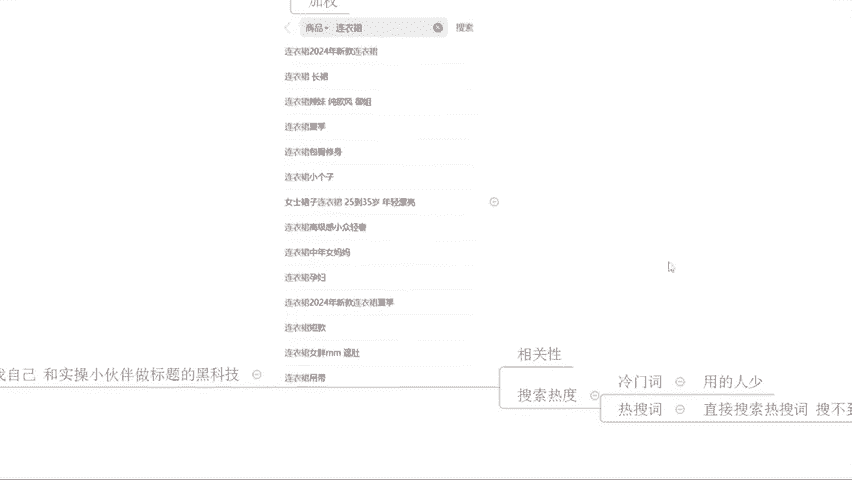
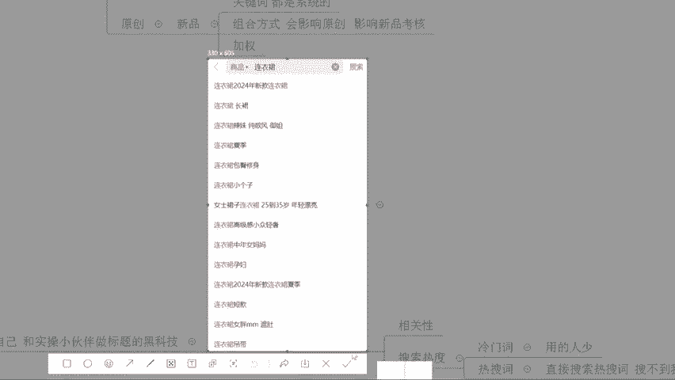
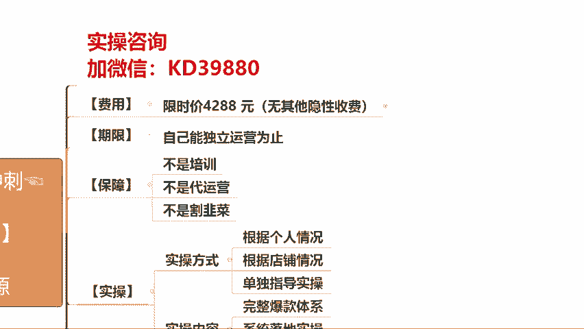

# 【拼多多运营实操教程】最系统的零基础拼多多开店教程全套，电商运营大佬专为学渣研制的新手开店保姆级教程！全程干货，简单粗暴 - P46：46、拼多多开店-整体运营思维爆款逻辑 - -拼多多开店 - BV1BH1qYpEqw

Hello hello hello。呃，撤下麦啊，这边所有的在直播间的小伙伴们能够清楚的听到我的声音的话啊，能够看到我这边电脑桌面的话啊，声音各方面如果都没问题，公屏上呢来扣一个小一，好不好？动作快啊。

确认一下啊，都没问题吧。能够听到声音的啊，能够看到桌面的，没问题的话扣1。OK啊。没问题就行啊。呃，老规矩啊，正式的直播分享呢在两点钟开始啊，现在呢还有一点时间，大家可以抓紧时间准备一下啊，对吧？

这个该上厕所的呢，抓紧时间去上厕所，对不对？然后呢，把你们自己的这个什么花生瓜子培训饮料什么的啊，准备好，好不好？为什么呢？因为今天这一个内容的话，全程是干货啊。

我不希望说等一会儿你们讲说哎有什么标准要处理，对吧？导致错过一些细节。那后期的话可能整个的内容呢就很难去很好的去执行，或者是很好的去吸收，好不好？OK那么在正式的开播之前呢，还是老规矩啊。

按照国际惯例呢，先把直播间的一些小规矩呢，我先说一说，对吧？免得我们直播的时候呢出现一些股票的麻烦啊。那么呃首先呢第一个要求好不好？兄弟们。那在整个直播过程中的话，我希望大家能够积极互动。

那在我分享到某一个知识点的时候，对不对？如果说你能够听明白，能够听懂的话啊，记得。扣一回复好不好？如果说听不明白，听不懂没关系，你也可以直接跟我讲。那确实很多小伙伴听不明白的话，没关系啊。

我也会呃再一次跟大家进行讲解分享，那么尽量的让每个人呢都能够去有所吸收，好不好？因为很多的地方呢有很多的小伙伴呢会觉得好像听懂了，但是呢又没有明白，对吧？又不好意思问啊，到最后呢发现一个点就是。

今天整个的直播呢，我感觉我好像什么都听到了，但是又好像能什么都没听到，对吧？就种感觉。然后呢，整个的时间就浪费掉了啊，这种情况我是觉得很浪费的啊啊，很没有意义的对吧？所以呢大家一定要积极互动啊。

再一个呢就是我在直播过程中呢呃习惯的是提问的方式来展开啊，那为什么这样说呢？因为很多时候啊你们的思维方式呢可能会比较跳脱一点，对吧？会比较活跃一点。那么带着问题。然后跟着我的思路去思考的话。

那么这样呢对你们的这个帮助或者对你们的吸收跟理解呢也会更好一点。所以那么当我提问的时候呢，大家可以认真的去思考一下这个问题，然后结合自己的实际情况，积极的回复，好不好？这是第一个要求啊。然后呢。

还有第二个要求。那么第二个要求呢，其实跟我们第一个要求呢是相关的啊。那如果说你在整个直播过程中有什么地方不明白不清楚的，欢迎大家提问啊，是允许提问的。但是啊这个提问呢仅限。当前内容。相关的问题。

如果说是跟我们当前分享的内容不相关的问题呢，你们可以等到我正式内容讲完之后单独提问啊。如果说是时间不允许的情况之下呢，也可以等我下播之后单独提问。那为什么呢？因为有很多的小伙伴呢可能本身会比较基础一点。

好吧？呃，我我先问一下吧啊，今天目前在直播间的小伙伴们有没有就是零基础的，还没有开店的，对于店铺操作没有完全没有任何概念的，有没有？有的话，公屏上打一个0，好不好？啊，如果说你是这种情况的。

就是对整个的直播啊，对这个这个拼多多啊，那完全没有任何概念的对吧？纯新手的公屏可以打个0。OK啊，有的对吧？那像这些小伙伴，如果说是我们在直播中对吧？呃，每个人去提一个问题，呃，我来回答问题的话。

那么对他们来说可能吸收起来会比较困难。所以我希望的是我们所有的内容呢能够去有到一个非常好的连贯性，那么能够让大家更好的吸收理解好不好？所以会有到这么低铺要求，然后大学生在线求带，对吧？可以的啊。

这个开水养鱼啊，就就你就凭你这个名字啊，我就觉得你是一个人才啊。😊，对吧。😊，可以了啊。然后第三个要求啊，我说一下啊，这是最重要的要求。如果说大家在整个的直播过程中，对吧？今天听到了西楼分享的内容，唉。

感觉好像还不错，对吧？那么刚好呢也是自己没有做到位的。那一定要去实操。好吧好，一定要去实抄，为什么这样说呢？因为再好的方法你不去做，它肯定是没有用的。等于0是不是？所以你想要你店铺提升。

你想要让你的运营能力提升，那么。去实操是必不可少的，好不好？三个要求，各位呃，能够配合的，没问题的对吧？都觉得没毛病的，供屏上呢可以扣个一吧，好不好啊？我来确认一次。

那呃整个的直播内容呢是今天围绕着我们整体运营思维，然后快速掌握我们这个爆款操作的一个逻辑来展开的啊，整个的方法呢呃没有说特别的这个复杂吧啊，我尽量的由浅入深的去分享啊，能够让大家更好吸收。

那呃整个的这个方式呢，大家如果能够去掌握的话，那你的运营思维，你的这个店铺的操作的一个呃整体的思维一定会有到一个很大提升的其实在座的有很多的小伙伴，哪怕是已经开店的啊。可能在店铺运营思维方面呢。

是没有一个完整的一个操作逻辑的，只是在凭感觉或者是主观意识去操作。啊，那这种情况肯定是不对的，理解吧？因为做电商的话，它毕竟是一门生意啊，那我们如果说没有一个整体的这个思维框架的话。

你去操作走一步看一步。那么很多时候呢你会进速被动，对不对？啊还有5分钟时间啊，开始正式的分享。那么呃有多少小伙伴是已经开店的。目前呢店铺啊，一天的订单呢是有50单以上的啊，公屏上可以打一个6，好吧？

50单以下的这种的可以打一个一啊，我来确认一下大家的一个情况。来动作快啊。那根据你们的一个情况呢，等一会儿呢也会呃涉及到我们分享内容的一个深浅啊。那我希望的是真正意义上能够去有到更好的内容给到大家。

能够让大家更好的去吸收，而且能够帮助大家店铺提升啊OK。目前给到我这边反馈的呢都是50单以下的，对不对啊？可以的那大概情况我了解到的。那么对于店铺操作来讲的话，其实单量的提升呢并不是那么难啊。

很多时候可能你们店铺操作上面会有一些短板。那么今天的话我希望能够去帮大家把它梳理清楚，还没有开店，是不是？没关系啊，没有开店小伙伴也不用担心啊，那么没有开店的话，今天这个内容呢也是非常适合大家的啊。

那不管你是已经开店的，还是没有开店的那同样的这个方法呢都是试用的对吧？毕竟它是一个整体的操作方法啊，跟这个思维的一个提升。那么可以看到像这边很多小伙伴跟着为急实操的店铺，对不对？像这种啊。

那么访客呢已经差不多1万左右的一个店铺，也跟着实操在做的对吧？做到了访客将近4万了，上万00，对不对？那像这种呢也有这种纯新手店铺的啊，看到没有？那，从纯新店开始跟着实操也有的。

所以说不管你是有基础还是没有基础，你是这个没有开店，还是已经开店的那今天这一个内容呢也都能够帮助大家更好的去梳理你的这个运营。视维提升你的一个运营操的水平，好不好？OK呃，还有这个2分多钟时间啊。

那么应该差不多都来了吧，今天应该差不多来了吧。来啊我这边再确认一次吧，所有的小伙伴已经准备好的供应商呢六走一波，好不好？动么快啊，我来确认一次啊，已经准备好的小伙伴啊，供应商六走一波啊，那如果都准备好。

ok那我们就直接开始啊，就不去再浪费时间了。因为我这个人呢比较追求效率啊，效率至上啊，做事情嘛，我们做这个电商也好，做别的事情也好，都是要有效率的，对不对？OK啊，那行啊，直接开始了，好不好？

那在整个店铺操作过程中，我刚刚也提到过，反复提到过，对吧？我们的这个整体运营思维呢是非常非常重要。啊，这个K啊刚刚问了一个问题，那这样子吧，刚好时间还没到啊，刚好时间还没到啊啊。

我我先把这个问题解决掉吧，好不好？这个RK说这个层级啊，有用吗？😊，有朋友说让他去操作成绩，对吧？好，兄弟们，各位来有没有人能够去回答这个答案的，觉得有用的扣一好不好？觉得没用的扣2。动作快。

成绩这个东西大家觉得有用吗？觉得有用的啊，扣一，觉得没有用的扣2。okK啊，目前来说的话，有扣一的，有扣2的啊，但是为数过多，但是呃几个小伙伴是扣一的比较多一点啊，那我这边来点个名吧。

我来确认一下好不好？哎，这个志伟。志伟。你觉得是有用还是没用啊？志。觉得有用的话，你扣个一，觉得没用的话，扣个2好不好？店铺神级这个东西。然后这个BRG啊B唧嘴的BRG对吧？来，你觉得有用吗？不懂啊。

OK啊，这里说不懂啊，没关系啊，我不清呃，不清楚的小伙伴不懂的小伙伴没关系，可以打一个问号啊，让我也知道你们的一个状态。如果说确实很多小伙伴不清楚什么是成级的话，那我也给大家解释一下层级是什么，好不好？

😊，OK啦，目前已经有好几个小伙伴说不懂了。那这样子啊，我直接说吧，好不好？呃，刚刚我们问到这个问题呢，叫做成级有用吗？对吧？兄弟们，这里我呢顺便说一嘴啊，成级这个东西听清楚了，有没有用是看情况的。

而什么东西是层级呢？来给大家解释一下啊。那平台。他对我们的这个店铺啊。是有考核的，这个大家都知道，对不对？那你店铺的交易额。会决定你店铺的层级。店铺的层级呢其实就是我们店铺营业额的一个考核标准。

你达到一定的交易额就可以上上升一个层级。那么我们可以理解为什么呢？呃，我们在读书的时候，对不对？会有到这个考试，考试呢会有这个分数，对吧？啊，或者说像现在呢考试也会给你打ABCD嘛，对不对？

那你的分数越高，你的成绩就越高，你的这个交易额越高，你的成绩就越高。成级越高的店铺就是越优秀的店铺。各位，这个没问题，能够听懂的话，扣一好不好？刚刚说不知道成绩是什么的，扣个一啊。那么这个交易额呢。

它考核的是过去30天的日均。交易额。他考了这么东西。比如说我举个例子，我现在是一个纯新店啊，我的交易额是0，对吧？我现在还没有店铺层级。那我想要有层级的话，OK我第一层级是吧？第一层级。

它的交易额呢就是0啊到1000。日均。好不好？假如说啊是0到1000日均，我现在是一个新店，我是一个零反块的电镀，我是一个新店。那么okK我现在就处于。第一层级。那如果说我想要去成为第二层级的话。

我就需要我30天的日均交易额。达到1000以上。啊，那么1000以上的话，就相当于我这30天的交易额的话，okK就要3万。啊，然后这个时候呢我就可以乘到啊上升到第二层级。好吧，是这么个东西。

那我刚刚讲到说成级呢，它有没有用是看情况啊，那到底看什么情况呢？其实道理很简单，兄弟们，我来说一下啊。那如果说现在我店铺是一个新店，我店铺是一个零访客的店铺。你竞争对手同样的跟你一样。

是一些零访客的店铺，是一些新店，对不对？那么平台呢它的考核，它的一个竞争的环境。那么对我们来说，它是一个相对公平的环境，各位能听懂吗？能听懂这个点打一个一啊，如果说现在我是一个新店，对不对？

那我的考核的竞争对手跟我都是一样的一个店铺。那这个时候呢我去做层级，我把我的层级做高了。就比如说我把成绩做到个第三层级或者第四层级，对不对？哎，我的竞争对手呢变成了日均销交易额35000的这样一个店铺。

那我的竞争对手也发生改变了。虽然说我的层绩上升了，但是我的竞争环境实际上是更恶劣了。那有人可能会说，哎，不对呀，我好像听说过成级越高，访客越多。有没有人在听说过这个这个这个这个说法的。

有没有有的话打一个2好不好？成绩越高，访客越多。啊，有没有听过这个说法？来这要说的是吧？OK的啊。那么这个说法兄弟们，你们是听到了没有错，但是这个说法是分情况的。什么情况呢？

如果说今天我们平台假如说啊有1000个访客啊，假如说啊兄弟们有100个访客，那么第五层级的店铺，假如说是最高层级啊，我们随便写一下啊，第四层级。第三层级。第二层级。第一层级啊，它分为5个层级啊。

假如说分为5个层级，那么第五层级的店铺呢，因为它的交易额多，所以它整个店铺呢肯定会有到这种爆款商品，它的排名会很靠前。是不是因为他交易额多呀。所以这个时候呢排名靠前。那么这1000个访客呢。

他进来平台之后呢，可能都能看到这个店铺，对不对？因为它靠前嘛，而这个时候呢，第五层绩的店铺数量呢又是最少的。所以这个时候呢同样是店铺，人家第五层级的店铺呢，店铺少曝光多，所以能够拿到的访客也多。是不是？

那越往下呢，店铺数量越多。啊，越往下越多，对吧？然后呢，同样的，因为他们店铺的单品啊，营业额少啊，排名也会更更靠后。所以呢访客也就越少。他这么来的啊他这么来的。但是有一个bug。啊，有一个bug。

它能够去拿到很高的销售额，能够拿到很好的排名，是因为商品数据好，是因为商品的权重高。能听懂吗？那并不代表说我能够去做到一个很高的交易额的销量上去就可以了。因为权重考核排名考核，它不仅仅只是考核交易额。

如果说只是考核交易额的话，那么有钱就是老大。那在资本市场上，我们这些小咖拉咪，对吧？啊。诶。哎呀，不管了啊，随便打一个打一个吧啊啊，小皮拉蜜去了啊，小卡拉密啊。😊，小卡拉利啊，那我们就根本就没法玩儿。

是不是？各位能懂吗？所以在这个时候呢，不是交易额越高，我们的访客就越多，不是说我的成绩越高，访客就越多。分情况，他是综合考量的。那么前呃是我记得我记得没错的话，应该就是上个月有个哥们儿啊。

他也是去做成绩，充了12万多的，将近13万的一个交易额。啊，将近13万的一个交易额啊，扣点都扣了有个八九百块钱。啊，扣点。啊。做完之后呢，店铺访客三5个。哭都没往哭去。所以如果说你是新店，不要去冲成级。

对你来说没有意义。那什么时候说成绩有用有意义呢？OK当我现在的店铺正常经营。啊，正常经营能够具有到一个不错的访客。但是我发现我的访客已经达到瓶颈了。对吧我的访客一直处于一个比如说2000的状态。

它已经不动了啊，上不去了。好，这个时候呢我试着去做大单。去突破层绩。啊，突破成级。那么这个时候呢。可能会有意想不到的好处，就是我的整个流量池子变大了。各位，目前okK没问题，能够清楚的知道成绩是否有用。

成绩在什么时候有用，公屏扣1。啊。这两天平台流量咋那么少，新链接刷不动，这跟平台流量少不少没关系啊。物牛呃跟我们当前内容不相关的问题。还是那句话啊，等到下播之后单独问我好不好？在我分享过程中的话。

只回答跟我们当前内容相关的问题。好，O继续啊，那呃这是我们刚刚开播的时候呢，小伙伴提了一个问题，我们也解释完了也讲清楚了啊，那么。那这个时候呢我们就开始正式分享了，好不好？okK的啊。😊。

那针对到我们整个店铺招来讲的话，我一直强调说整体运营思维。那么整体运营思维是什么呢？其实就是我们能够去真正意义上了解清楚平台的一些这个底层逻辑，能够去搞清楚我们应该去做什么。啊。

哪些是我们需要去做的一个问题，对不对？对于很多的这种小白，对吧？新手，可能你知道你不会做店铺，可能你也知道你店铺存在问题，但是哪里有问题，你不知道，应该做什么，你也不知道，甚至我现在跟你讲。

你店铺有什么问题，你直接问我，我帮你去解答，你可能连问题都不知道怎么问。各位有这种感觉的公屏上打一个一，好不好？动作快。怎样，你们都知道你店铺的问题是什么吗？都清楚吗？😡，哎呦那还不错，哎呦。

我我这个画放早了啊，前嘴刚放完话，说你们还不错啊，后一嘴就开始了啊，没错，是我。行行行行行。😊，啊，那么继续啊那么继续。然后呢，还有一个很多小伙伴啊本身呢自己可能也不怎么会操作，然后呢，就喜欢瞎操作。

对不对？做到最后呢，发现钱花了，变黄了，对吧？是不是就有这个人对吧？我相信你们这个人大把的是吧？😡，很多这种小伙伴就这样子的啊，然后呢自己想让的去做一些事情。那我们真正意义上去做店铺的话。

这里呢我要搞清楚一个事情就是我们店铺运营的核心啊要素是什么？嗯。这个问题啊，上午问你，上午你问我都不知道怎么讲算。对的啊，对了，我记得了我记得了来啊。兄弟们。这个问题大家思考一下。

我们店铺运营的核心要素是什么？来，这是一个常识题啊这是一个常识题。如果说不知道的打问号，如果说知道的，把你认为正确的答案呢发到公屏上好不好？呃，我来点个名吧，看你们这个回答问题。

一天天的可能不不怎么积极啊，哎，这个瑞香啊，瑞香来，你回答一下，好不好？我看看还有没有谁比较熟悉的啊。哎，看到这个郭小姐了啊，来，郭小姐，你也回答一下吧啊，瑞香不知道啊，然后阿K说流量。

然后开水养鱼说这个补单开车啊，OK。😊，还没有别的。其他人呢其他人呢？这个。嘚儿嘚嘚儿来，你回答一下，知道吗？😡，我的天哪，都都都不清楚啊啊，应该都是新手吧，是不是？okK啊，那没关系啊没关系啊啊。

新手没关系，不可怕啊。😊，他回答就是这。😊，行吧行吧行吧啊啊，噔就回答的说哎，销售啊ok ok ok啊，O大家呢可能心里面还是有一些自己的想法的啊。可能说对于整个的一个操作方面呢。

确实还是呃整体的一些思维方式啊，或者说是整体的一些这个知识储备呢还是有所欠缺啊，没关系啊。那今天我们一起来聊一聊这个事情啊。其实运营板块的话，核心要素就三个啊，就三个兄弟们，哪三个呢？

我这边你们打出来好不好？第一个。😊，流量。啊，第一个流量，第二个转化率。啊，第三个就是我们的客单价。那我们做店铺是为什么？我们做店铺呢就是为了赚钱嘛，对不对？我们就是为了卖货嘛，是不是各位没毛病吧。😡。

是不是明白病吧？那在这个过程中，我要实现我们的这个目的，我要实现我赚钱的目的，我要实现我卖货的目的。那么我店铺呢就必须有流量。没有流量，你一切都是空谈。各位没错吧。那有了流量之后。

如果说你的流量进电不转化。没有办法去进行一个订单的获取，是不是也等于0，所以就有转化率的一个啊重要的考核标准。那么同样情况之下的话，okK我们店铺呢有流量有转化之后，对不对？那我的客单价也会有一个要求。

就是说我们能够去有到更高的客单价，带来更高的交易额。电商就是流量变现啊，抖音淘宝都是一样。哎，RK说的有道理啊。其实我跟你讲，你的这个说法呀还是稍微的收敛了一点啊。我告诉你啊。

其实我以前经常问大家一个问题，我说电商的本质是什么？甚至互联网的本质是什么？其实就这四个字，流量变现好吧？那我们想要去做这个事情的话，其实我们就要解决这些问题，哪些问题呢？我的流量怎么来的？对吧哎。

我的流量怎么来？啊，那我怎么去转化？啊，怎么转换？然后如何提高客单价？对吧这些问题搞定了啊，那我们内幕不就好了吗？是不是？那现在呢继续往后拓展啊，那么这个过程兄弟们注意了，这个一步一步去拓展问题的过程。

就是让大家建立一个运营思维，运营模型，能够让你去很好的知道我们店铺的问题根结在哪里。啊，好不好？来这个点的话，大家注意啊，既然说我们刚刚提到了我们的要素呢有三个流量转化跟客单价。

那么现在我问大家流量是怎么计算的？来。😊，这个问题有已经开店的小伙伴的话，回答一下，如果说是没有开店的小伙伴可能不清楚。没关系，不知道的还是老规矩啊，打问号好不好？已经开店的小伙伴们。

如果说知道的把答案发在公屏上。如果都不清楚，没关系，还是一样的，通通问号走起来，让我看到你们的情况，让我清楚知道你们的一个状态，好不好？那么也方便呢我开始分享啊，可以的啊，动动快。怎样都愣住了。😡。

你们什么情况呢？我的天，不至于吧。😡，都不知道吗？😡，是我是我卡了吗？😡，哦，我好像刚卡了一下啊，这个这个网络提实有点问题啊，刚卡了一下。呃，哎，听说到了一个答案，哎，曝光率乘以点击率啊，OK。

来来来来来来来，我说一下啊，婷说的这个答案呢啊算对啊算对。但是我们讲这个地方呢叫曝光量啊，不叫曝光率。啊，曝光量乘以点击率好不好？这个是我们流量计算的方式。那么各位现在问题是不是简单很多了？

那我要去提高我的流量，我应该做什么？各位看到这边有没有答案，有答案了吧。那既然说我们的流量是通过曝光乘以点击率来进行计算的，我想要去提高我的流量，无非就是两个点，对吧？啊，提高点击，提高点击啥。

提高点击率对吧？提高曝光量，对不对？两个点嘛啊展开就是两个点曝光量的提升。然后呢，点击率的提升。好，O。😊，各位开始了啊，现在呢就开始到重点了，这个是你们很多小伙伴比较关心的话题。哎呀，细楼。

我店铺这个一天天的没什什么访客，对吧？今天就5个访客，今天就10个访客，今天就这个80个访客，10个访客，那访客好少怎么办？对吧？OK那就是你没有流量嘛？那流量怎么提升，曝光量和点击率。

那曝光量从哪些方面提升呢？嗯。😊，一步一步的去推，往后推，细分我们的问题，对吧？来包括你发方式，哪些渠道啊，这里我文章写吧，哪些渠道吧哈，我这样写的很写写的更具体一点吧，哪些渠道。啊，提高。

可以提高曝放可以提高曝光。来这个问题。思考一下，然后呢我来点一个名吧啊，看一看你们这个情况怎么样啊。呃，瑞香，要不你来回答吧，对吧？本身的话你也。😊，在操作店铺了对吧？

也是有算是有一点点的小经验小基础了，对吧？来这个问题你回答一下。推广除了推广呢。所有结果呢。如果说没有其他的答案的对吧？不知道的话，没关系，打问号好不好？然后呢，我们让其他的小伙伴呢帮你补充一下。

问好啊，不知道了啊。OK来啊。😊，一说还有我们的标题。关键词其实这个就是搜索端口嘛，对不对？然后这个呃伪军说还有各种的平台活动。啊。排名价格啊，男胖子说排名价格，你这个排名价格说的有点太玄乎了啊。

我只能理解为是我们的收入排名，对不对？把它当这边来了啊，好不好？除了这些还有吗？还有哪些入口可以帮我们提高反客呀？主图主图跟这个提高提高曝光没关系啊，不行，主图跟提高提高曝光没关系啊。

主图跟我们点击率有关系啊，是这样的啊，它的一个体系不一样啊。那我直接说吧，就不等了啊。那其实呢曝光入口曝光渠道有很多，除了你们刚刚讲到的推广啊、搜索呀、平台活动啊，对不对？还有个像我们的内部啊。对不对？

还有我们的内部嘛啊还有我们的这一个这个这个这个叫什么的啊，相似商品吧。对吧还有一些我们的榜单嘛啊这都是曝光入口，是不是？这都是曝光入口。那有了这些渠道，有了这些入口。

我们如果说能够去把自己没有打开的入口打开它是不是也多了一个渠道。那如果说我现在还没有任何访客，那我就针对到对应的这些渠道去不断的开拓嘛，对吧？但是这里我要提醒大家推广啊，做广告推广，做付费推广。

一定是最后的一个步骤？不要上来就去做付费。那为什么呢？这个东西我之前讲了很多次，对吧？这里呢我就不去再重复了，大家记住就可以了，不要直接上来就去做付费推广。大家能够记住的话，公屏扣1。好不好？

这个原因我就不再去多解释了，之前解释过很多次，但是呢你们要记住这一个是就是不要上来就直接做付位推广，好不好？那这个很关键啊，因为它会影响到后续的一个访客提升跟我们的全员获取问题。那在整个的操作过程中。

各位我们回过头来看一看啊，搜索也好，活动也好，内部也好，相似商品也好，榜单也好，对吧？那么归根结底。在这个各个入口里面，其实都会涉及到一个东西。啊，什么东西呢？我们产品的。排名。或者是我们产品的抓取。

对吧你关键词排名没有你没有关键词抓取的一个数据。OK你不可能得到搜索曝光。在活动渠道里面，哪怕你去报名的活动，你没有活动的坑产，你没有活动的抓取效果，你也拿不到很好的活动排名，没有办法得到很好的曝光。

是不是？包括我们的内目也一样的。哎，你在这个类目里面没有很好的产出，你没有活动的没有这个类目的排名，你也得不到曝光，销售商品也一样的对吧？也需要抓取条件，榜单也是一样的，通通都跟排名有关系。

通通都跟抓取条件有关系。那么在这里面呢，我们先说一个最基础的最核心的啊，也是我们很多小伙伴最最最最容易犯错的地方。什么地方呢？搜索端口的。标题。各位。标题这个东西大家都有在写，对吧？

你们很多人都在写标题，基本上呢每个人只要是有发布商品的话，你都知道有标题这么个东西。但是标题你们真的会写吗？这个问题很严重，如果说你不会写标题。

那么可能会导致你后期很难获取到一个好的产品排名和很好的曝光。那各位你们可以说一说你们的标题怎么写的。嗯。有没有这种就是直接复制同行的？有的话，公屏扣一。如果说你是直接使用供应商的。口味。啊。

okK还有一些小伙伴说哎，系统推荐的好吧。扣个3吧，好吧。还有小伙伴呢说，哎，我发布商品呢是在这一个哎。这个这个机会商品里面啊，机会商品直接复制的啊，直接扎不同款的。啊，它就有标题。

那我们把它归纳成我们第一种复制通行，好不好？OK还有呢就是像这个一说的，哎，我复制过来稍微改一改，对吧？可能说哎我稍微的什么呃这一个复制一点。啊，另外一个。复制一点啊，我来拼凑一个标题，对吧？

那么这种呢我们通通归纳为复制同行。好吧，OK各位，那么这里就到一个问题。如果说我们是这样去写标题，如果说我们这样去操作的话，会面临一个非常非常严重的问题。有多严重呢？你可能很难拿到曝光。

你们这样做的小伙伴们有没有发现，就是你商品上架之后，产品的访客几乎没有。有没有？😡，有这种情况的话，公屏扣1。哪怕你去操作了销量，操作了评价，你的访客也很难提升。是不是？OK没错啊。

已经有这样的情况发现了啊，还不错啊，早发现早治疗，早好，对吧？就跟我们生病看看医生一样的，对不对？那在这个过程中，为什么说它会有这样的一个问题呢？其实道理很简单，对吧？来，兄弟们。

我给你们举个很简单的例子，来。😊，这个店铺做女装的这个店铺做女装的啊，这个店铺做女装的。这个店铺呢这个呃哥们儿啊这哥们儿呢叫取决啊，这个哥们儿叫取决啊，他的这个名字叫取决啊。

那他店铺呢最早的访客是做到了将近1万，对吧？后面跟着实操之后呢，是做到了3万多，对不对？我们先不管他后面做了多少访客吧，前面做了差不多快1万访客也还不错了，对吧？那么这个至少比你们大多数小伙伴要强。

那今天你说哎。这个哥们叫取决啊，那我的名字叫伟军啊，我的名字叫蓝胖子，我的名字叫莎莎，对吧？我的名字叫这个一。那不行啊，叫取决的话，我店铺做的好啊，我去把我的昵称改掉去，我改成取决。

那是不是等于说我店铺能做好了呢？各位当然不是啦，对吧？就跟我们商品也是一个道理的，别人的商品能够卖的好，别人的产品有销量，你去复制它的标题复制过来，你去用到它的标题复制，使用起来没有意义的。

你跟他一样的名字，你跟他或者是差不多的名字都会导致一个问题，就是你们之间的竞争。永远是你在烈势。各位能懂吗？因为关键词考核它是根据我们产品产出啊，根据我们产品的这个销量，根据我们产品的这个客单价啊。

根据我们产品的转化率，根据我们产品的UV价值啊等等啊，这些数据来的。各位能理解吧？你在这些数据上没有达到一定的考核标准，哪怕你跟他的名字一样，那么它永远在你的前面展示，甚至你可能连展示的机会都没有。

因为平台上的商品太多了。各位这个逻辑能够明白的现在公屏上打一个6。OK能够明白就行。所以这个时候呢，我们在写标题在养权众的时候，一定是要有技巧的啊。我们在写标题养权重的时候，一定要有技巧。呃。

那自己写的话，不是更没有竞争力了吗？OK。自己写。首先有一个东西叫做原创。啊，就是原创。在平台上呢，对于我们商品呢有一个考核叫做新品考核。各位有知道吧？有很多类目都有新品标，这个大家知道吧？

我们可以在这样子啊，我随便去打开一个呃搜索女装吧，我搜索女装吧不，因为女装呢是呃这个肯定很好去看到的，大家也能也能够比较熟悉的一个产品吧。我们搜索一个连衣裙吧，好不好？来，我们搜是一个连衣裙啊。

给大家举个例子啊，举例说明一下。哎呀，这个小程序里面小程序里面好像还没有啊，没有这个筛选项啊，没有这个新品选项的筛选项啊，有点麻烦啊，有点麻烦。呃，我电脑上没有装这个没有装这个模拟器啊，啊。

你们你们可以自己这样子啊，如果说现在是方便的小伙伴呢，你们可以自己呢手机打开啊，自己手机打开，随便去搜一搜像什么连衣裙呢，对吧？或者是像这个呃这种呃男装女装这种产品啊，这种内部呢他们都是有新品标的。

这个大家可以自己搜索看一看啊，这里我就不去展示了啊，我就不去给大家展示了。因为我电脑上没有装模拟器啊，所以呃通过这个小程序呢，它是找不到它的，对不对？那么就只能辛苦一下你们自己了。那么这里我说一下。

这一个考核呢，会考核到我们产品标题。从生意参谋上取的关键词，也是不是也是性统OK。关键词注意啊。关键词都是系统的。这个没有毛病啊这个是没有毛病的，但是组合方式会影响原创啊，会影响。新品考核。能懂吗？

有新品考核，它是会有加权的这是第一个啊这是第一个。第二个也是最重要的一个点。各位呃，我我就不跟你们绕弯子了吧。我说一说我自己，包括说我带时尚的小伙伴，我们做标题的时候玩的一个黑科技吧，好不好？行不行？

我给你们说一个我自己啊，我自己和实操小伙伴。做标题的。黑科技玩法。好吧，那么这个黑科技玩法到底什么样，我也不给你们去说啊，你们自己看数据就好了。好吧？像这些店铺，刚刚你们有看到这些店铺，对不对？

这个店铺很明显的啊很明显的，最早的访客是多少？将近1万，后期的话是有做了这个操作，并且做了一些新的链接去做。后期的整个增长数据啊，听清楚没有做一毛的付位推广，全是自然曝光做出来的。

当然呢他的数据提升这么快啊，也不是说完全是因为这个方法啊，这个我实话实说，我也不会给你们去吹牛逼，对吧？他呢之所以访客后期提升这么快速呢，跟季节也有关系，啊，这个实话实讲啊，我不会去跟你们说，哎。

这个方围做好多好，不至于啊，对吧？实事求是嘛，对吧？咱们也没必要这样子去是吹牛，对吧？没必要啊，那整个方法的话，起到了一个非常关键的作用。但是啊好吧那这个方法怎么玩的呢？听清楚各位。

现在呢我们去到我们的拼多多，对吧？那我要去写标题的时候呢，我肯定会去借助到我们刚刚有看到搜索解果页里面有的一些关键词，什么关键词啊？下拉通关键词对不对？各位，没错吧，你们在写标求的时候。

会不会用到这些关键词？嗯。会的公屏扣1。哪怕你是复制的标题，那么大多数也是覆盖了这一词的。有没有？有没有有吧，O。那么这里的话我直接跟大家讲一个小操作，好不好？那么这个操作的话。我可以这么说啊。

有可能会颠覆你们的认知。啊，有可能会颠覆你们的认知啊。来这里面呢呃好巧不巧啊好巧不巧，刚好有用到刚好有出现啊，刚好有出现啊啊，我们用到的这个标这个这个关键词啊，刚好有出现啊来。

这些关键词它首先是平台上的热搜词，这个大家认可吗？这些关键词是平台上的热搜词，认可的小伙伴打个6。认可的小伙伴打个6。啊，这一次。那么这些词之所以会出现在我们的下拉框，两个原因，一个是相关性。

另外一个呢就是搜索热度。对吧它和我们上面输入的关键词相关性高，会出现在这这下边。同时呢它的搜索热度过高，也会出现在这下边。那么这个地方的话，像我们自己在写标题的时候。

我自己带实操的小伙伴一起写标题的时候，我们就会利用到这个点。那我在做标题的时候呢，大多数词呢我也会选择使用到这个下拉放的词，这个没有毛病。但是我会空出一部分的位置流出来做一些冷门词。啊。

我会自己去做一些的文辞。那那我们支是什么呢？我给大家解释一下，就是在这个平台上对应的这个商品用的人少，收的人少的词。最起码一点啊，说的人少不少，我们不管最起码用的人少。😡，那你说哎西了。

我怎么判断用的人少不少呢？你去搜这个词你去搜。比如说哎我搜了一个这个呃连体连衣裙啊，打个比方啊，我我们就这么说吧啊，我打个比方而啊，肯定是没有这么个东西的啊，那我就搜了这个词，搜完之后。

在我们整个排序里面去看，没有一个产品有到这个这个关键词OK那这个词就是冷门词。有的时候还会确认提示对吧？有的时候还会出现这个提示，哎，你收不是这个这个产品啊啊这个这个东西收不到。O。不慌嘛啊不慌啊。

你我发现你们真的太着急了啊，那现在就开始到我们的高潮部分了啊，啊，没人收怎么办？不是完蛋了吗？啊，来放心吧，完蛋不了，为什么呢？因为我的标题里面除了有这个冷门值之外，还有其他的热搜词啊，嗯。

还有其他的热搜词。😊，那前期如果说我们的平台上直接去搜热搜持，能收到我吗？能收到我吗？收不到，对不对？因为我没有权重，直接收。热手持。搜不到我。因为我。没有权重。但是各位注意了。

我如果加入了这个冷门池的话，我用冷门池搭配热搜词来搜索的话，那我只要能够被系统收录，一定是可以收到的。各位能听懂吗？能听懂扣一。只要我的产品是被系统收录的那我一定是可以收到的。其实收入条件很简单。

破零好吧，收入的条件很简单，破零就好了。破零操作大家都会吧，应该没有谁不会的，对不对？那这个你可以通过分享啊通过其他方式什么方式都行，对吧？找你的朋友什么的做一做用，O搞定啊，搞定，那搞定之后完成收录。

这个时候冷门池加热收持呢，基本上是能够找到我的产品的。那这个时候呢就小猫说找到我产品有什么用也没有意义啊，我还是没有人收啊，对吧？OK听清楚了，很简单，来，各位刚才我提到过。

我说哎刚好有出现一个关键词是我们在用的一个词。

来。

各位有看到这个词吗？有看到这个词吗？有看到这个词吗？女士裙子连衣裙25到35，年轻漂亮。各位有看到的公屏打个6。好吧，有看到的公屏打个6。这个词。在之前几乎是没有什么搜索数据的。

这个词债之前几乎是没有什么售入数据的。我直接告诉大家，那他为什么会在这个地方？啊，那它为什么又会成为热收侈？因为后期慢慢慢慢发现有很多人收它。啊，有很多人收他。那为什么会有人收它？会有会有人去点击它。

对吧？当他出现这下调空制，又会有人有人去点击它，对吧？怎么来的？嗯，他不可能天生就有吧，因为这个词一开始就没有人收啊，如果只是因为相关性的话，也不可能实接相关的这么的一个关键词，对吧？本来现实。好。

我告诉大家，当没有人收的时候。这个词是冷门词，对吧？但是如果说出现大量搜索的时候。啊，当它的搜索量。到一定数据的时候。这个词就会变成热搜词，然后就会出现在下拉框，就会出现在各种的推荐搜索选项里面去。

对不对？那么前期没有任何人使用的时候，没有任何人搜索的时候，像类似这种词，我们可以做一个小操作，对吧？那搜索。搜索注意搜索就可以了。搜索这个词的目的是干嘛呢？😡，提升关键词的搜索热度。

对吧而这个词刚好又是我自己在使用的，我自己在使用的啊，所以这个时候搜索这个词的过程，可以提升关键词搜索热度之外，也可以提升我产品的搜索热度。各位这两个热度能够明白的话，打个一。所有人动起来啊，好不好？

这个东西很关键啊。😡，这个东西很关键啊。来好，okK那这个东西到底有多关键呢？各位。搜索热度增加关键词的搜热度增加，它可以成为热搜词，对吧？我的产品搜索热度增加，可以告诉销呃，告诉平台。

我们的产品有大量的用户需求，于是乎也会增加产品的推荐权重。它是相辅相成的。好不好？它是相不相称的。而在这个时候各位一开始没有人收的时候，这个词可能就没有什么感觉。但是如果说它热度够高。

比如说出现在下拉框好。兄弟们，O了，搞定了，这个时候就会有到很多人会选择去点击它完成搜索，那么它的热度也会越来越高。当这个词的热度越来越高的时候，哎，我们会发现一个问题。

可能就会有到很多的同行来用这个词了，对不对？但是在同行用这个词之前，我。已经完成这个词的覆盖。为什么？因为我。啊，我有很多产品已经在这个词有产出了。而且我的产品做好了人群细分。市场细分。各位。

到这里能够听懂的话，能够明白的话，公屏打一。啊，你们是在早词用词，按照平台给你的给你的路走，我是在自己蹚一条路出来。所以这就是区别，好不好？😡，你可以看到像这些店铺对吧？刚刚给你们看这个店铺做女装的嗯。

本来可能他整个房子其实很难了，对吧？但是用到这种玩法去做。马上把所有后期覆盖的这些产品呢铺开，把持热度做上去，然后整体数据快速拉升。怎么样各位啊，六是吧，干不干各位觉得干不干，觉得干的啊，公屏打个60。

好不好？就是干的后面打不了啊。O啊呃。😊，还可以说唉那多少的量才能出现下来光呢？这个没有没有固定的啊，这个确实没有固定的。因为不同的产品啊，这里我说一下啊，不同产品，不同的内部啊不一样的。啊。

这个我没有办法告诉你具体的数据啊，这个东西是这样子的。那么呃我们在做的时候呢。如果说你去直接做这种大词啊，我说一下，比如说连衣裙嘛，对不对？它直接是一个大词嘛，那它的难度也会比较大一点。

如果说我们做的是比如说连衣裙长裙做这个长尾词，本身它是二级词嘛，对吧？做它下面的细分关键词的话，又会容易一点啊，所以你操作不同的关键词。难度也不一样。啊，是这样的那对于整个操作来说，可能说哎西楼。

那你说了这个东西我怎么去做呀？那没办法啊，你只能自己去尝试着去啊设计一个关键词出来之后去做热度，做多少，这个东西我没法给你判断。因为需要涉及到具体产品分析。如果说你说确实谢楼我自己去做，我怕我做不好。

我不知道做多少ok没关系啊，那么也可以跟着起实操好不好？到时候呢具体的一个规划方面的东西我也会带着你去做，都是ok没问题的啊，如果说有兴趣想要做实操的，觉得哎西楼，我自己做店铺确实呃容易走弯路。

确实做不好的，对吧？我想要给你实操的，可以直接微信找我啊，我微信都有吧啊，有没有说谁没有我微信的呀。嗯，如果没有我威信的小伙伴，公屏打个一好，我看一下。应该都有吧，对吧？

毕竟你们都是这个啊看过分享视频过来找我的对吧？然后也应该都是有我这个微信的啊呃，实操多少钱啊可说实操多少钱啊，这样子这样子这样子啊，我我先给K说一下吧，然后其伙伴如果说是这个有兴趣的呢可以听一下啊。

如果没兴趣呢可以稍微等一等啊，一会儿呢我把这个呃实操方面的东西呢稍微稍微简单介绍一下啊？啊，介绍完之后，我们继续往下分享好吧？各位稍安勿躁啊，稍安勿躁那呃跟着实操的话啊，我说一下实操费用啊。

这个肯定是要收费的，对不对？如果说你说哎这个免费带啊，那不太现实，对吧？我可能带不过来那这毕竟呢不是像望我做直播分享，对吧？我说免费分享分享吧？抽时间来都O的。因为实操的话，确实经力要的比较多。

所以他要收费啊。那么实操费用的话，目前呢是限时价。😊，啊，现实价啊。4288好不好？现在叫4288，然后呢是直接带到什么呢？带到可以独立运营的啊，你能够脱离我的帮助。

清楚的知道店铺操作每一个阶段不同的情况，需要去做什么？怎么去做，为什么做啊，这个要独立运营啊，当然了，独立运营之后不是说我就不管你了啊。后期呢有这种店铺操作方面的问题呀，或者是平台有什么更新的玩法呀。

都可以随时找我。相当于呢我就是你的店铺顾问啊。而且后期是没有费用的。各位明白吧？这是费用。然后另外我也说一下啊呃具体的一个操作方式。那跟我实操的话啊，不需要你去什么看直播看视频的啊，不需要看视频。

看直播。啊，是我直接干嘛呢？加我私份号。啊，加我私成号，然后单独指导的啊，我直接根据你的店铺情况和你的个人情况跟你讲，当前你的店铺需要去做什么。那为什么要做这个怎么去做？快速提升你的运营能力好不好？

但是啊这里我也说一下啊，不是说愿意花钱就可以了。那我也有一些小小的要求，那满足我要求的呢，你可以来啊。如果说不满足不要来，一对一去买？我的天O啊，说什么一对一，这种都是都是割韭菜的啊，不要信这种东西。

好不好？不要信这种东西啊，我是当众指导啊当众指导。那跟着13人要求是什么呢？听清楚了，如果说你是有那种侥幸心理的。对吧想着什么一夜暴富的。😡，不要来做电商，就是做生意，需要的是脚踏实地一步一个脚印。

如果说你想的是哎，今天我这个呃花了钱了，对吧？哎，我跟西楼花钱了啊，我什么都不干。啊，我就真能够躺着赚钱。啊，那算了啊，不要来，来了也做不好的，好不好？然后另外还一是什么呢？那种自己的想法特别多。

对吧然后呢特别有主见。啊，然后别人说什么不愿听的。这种的啊。不要来。啊，来了的话是吧，我每天讲什么你也不去听，也不听了也不做，做呢也不去好好做对吧？那这种就浪费大家时间没有意义，对吧？

我希望的是我们相互之间呢能够具有到一个很好的衔接，把店铺快速做起来，好不好？这是我的要求。而呃这个操作方式的话啊，这里我也说一下，如果说你是新人小白，对吧？有可能小伙伴是小白嘛，对不对？像这个。呃。

橘子啊，我记得你就是一个新手来的，对不对？那呃如果说是小白的话，okK听清楚了。那整个的过程呢首先第一步对吧？我先带你做市场分析，好不好？然后接着往下呢，我们再去做竞品分析。做好竞品分析之后。

okK我们再去做我们产品的爆款定位啊，爆款选品是吧？然后再往后呢做好我们的这个产品货源对接。啊，最后呢我们接着再我做我们的店铺搭建。啊。产品布局。啊，视觉策划。再到我们产品的一个啊商品运营。

到后期我们还会可能涉及到更多的一些呃活动的一些设置啊，对不对？啊，包括说我们的复位推广啊。啊，等等啊，这所有的实操方面的内容呢，都是我亲自指导啊，带着去实操的那你是零基础呢，就从零开始，好不好？

如果说你是有经验有基础的，ok子账号开给我。啊，我针对店铺分析啊，然后。指出。问题啊。找到解决方案。好吧，这就是时操的一个方式方面的一个东西啊，简单介绍一下。那如果说是有兴趣小伙伴呢，像这个2K。

对不对？可以直接在这个呃微信找我，好不好？微信都有的喽，对吧？有没有说是没有微信的，都有吧啊，有微信的话，直接微信找我就可以了啊。那么这里呢我们就继续了，好不好？这里我们继续啊。

然后呃整个的一个操作的话啊很细。😊，我的天阿K啊，你这个话说的很细啊，能有多细，对吧？让我让我这个有点。😊，唉，怎么说呢？看到这个这个这个这个描述啊啊我让朋友也来看你直播。ok的。

没问题啊没问题啊没问题啊。😊，呃，那我们继续喽，好不好？来，兄弟们啊呃所有小伙伴一起啊公屏扣个一好不好？所有小伙伴一起公屏扣个一啊啊，那么刚刚介绍一下实销方式。那继续呢我们上面啊没有完成的一个内容分享。

好不好？😊，不要开车啊。我我从来不开车的啊，我从来不开车的对吧？像我说的啊，对吧？做店铺的话，我们先做自然流，对吧？最后才去这个做推做推广，对吧？😊，哎。OK了，行了啊呃，既然说都准备好的话。

那我们继续啊。那刚刚呢我们也提到过了关于我们这个关键词的部分，对不对？怎么去呃突破做好我们产品的呃这个搜索的一个覆盖啊，跟我们关键词的一个权重排名。那这些东西做好之后。

当我们产品能够去有到一个不错的曝光，有到一个相对比较好的产品的访客之后，如果我的转化再没问题，那是不是等于说我的店铺，我的商品就盘活了，各位。觉得是这样的，没问题的。这个逻辑通的供应商打个6可以吗？

好吧，动度快啊，那访客方面呢，我们通过这种方式呢可以去解决它，对不对？啊，能够去吸引到一定的访客数据。当然了，前提条件是我的图片没问题，对不对？图片上你确实也ok的话。

那么我们能够去有到一个比较不错的曝光，能够得到一个比较不错的产品排名，那这个时候呢自而然我有访客了。那访客进来之后呢，关键点呢就要到后期呢，我们能够去如何去获取到我们一个很好的转化，对吧？

那么转化方面呢，又受什么影响呢？嗯。哎，在哪里啊？转化来点击啊，这里点击啊转化啊。嗯，转化方面我们又去怎么操作呢？来可以说一下啊可以说一下。哪些因素应响转化率啊？老规矩啊，不知道的话，打问号好不好？

不知道打问号啊。如果说知道的话，把你们自己认为对的答案发出来。我点个名吧好吗？😡，来莎莎，还有君君美男子。对不对？来可以把你们认为对的答案发出来。啊，还有这个阿波罗对吧？还有CN啊，很多人都在。

都是一些老面孔啊。对不对？都是些老面孔啊。okK这边讲到说哎有到这个价格客服啊，价格价格是你们都有提到过的啊。然后还有说客服的啊，还有说这个主图的。还有吗？第三。优惠。的评价。还有吗？啊，销量和评价。

来继续啊继续继续，我觉得还不错啊还不错啊。今天你们都应该是在动脑筋的啊，我觉得挺好的，可以的可以的可以的。有没有其他要补充的？有没有其他要补充的啊，详情啊详情。好，继续。如果说没有要补充的话呃。

公屏打一个一吧，好不好？如果说没有什么要补充的了，觉得已经差不多，就这样了啊，可以公屏打个一。OK啊，没有补充的了。行行行行行行。好。我发现一个问题啊，兄弟们，其实你们很多人呢在谦虚啊，很多人在谦虚。

经常有人说哎西楼，我感觉我这个做电商的话，感觉我这个什么都不会啊。我感觉我自己这个完全是一个一脸懵逼的状态，对吧？我说一下，其实还好啊，你看啊，当我把问题拆分完之后，对不对？我我一个问题。

一个问题往前去拆分推推导啊去拆解这个问题的时候呢，大家其实这个思路还是能跟上的嘛，对吧？那从这点可以证明，其实你们现在呢是已经具备了一定的这个运营思维，只不过呢可能还是比较碎片化，对不对？

没有一个呃相对来说可能完整一点的这个运营体系的一个思维，对吧？导致呢你们在解决问题的时候，只能够去解决一些简单的基础的某一个点的这种小问题，大一点的方向的问题呢，你可能就会比较懵了，对吧？

是这样的一个情况的。但是我觉得还好啊，那今天的这样的一个呃思维的一个这个呃推导的一个过程的话，我觉得大家应该是有到一定帮助的，对不对？那在整个过程中的话，像我们很多小伙伴呢做店铺就这样子的啊。

缺乏这种思维。那今天的话我觉得应该还好一点啊，可以帮你们去把这个呃思维模型给建立起来啊。那整个操作过程中，我们提到说转化率，转化率怎么提高，或者哪些因素影响，你们回答了很多很多很多，对吧？

那么在这里面呢，有价格，有客服，有主图，有DSR有优惠，有评价，有销量有详情。其实它每一个项目都是跟我们转化有关系的？那像价格呢可能是我们相对来说可能会比较直观的一个东西，对不对？没错吧。

这个是我们可能最多的回答最多的一个问题，就是说价格。那用户呢进来我店铺之后会看我的价格，他觉得价格合适就会买，觉得价格不合适，他就走掉了啊，或者是我们去能够有到一个啊不错的优惠，对吧？

让他能够去在我店铺里面下单。但是这里有到一个很严重的问题，各位。价格多少？多跟少或者贵和便宜。啊，贵和便宜。啊。贵和便宜啊。它是相对的对吧？它相对的啊，那我举个例子，今天我说我有一个东西啊。

这个东西是什么？我们先不管它啊，这个东西呢啊它。一个啊一个要1000块钱，对吧？这个东西是什么？我们现在先不管了啊，我们觉得他要1000块钱，你会觉得哇也不便宜啊，这1000块钱啊，对吧？

但是我要告诉你啊，它是一枚火箭，对吧？1000块钱，你会觉得哇，好划算，是不是啊，这什么火箭这么便宜，是不是所以它相对的一个概念的啊，那我们每个人的心里面呢都会有到一个价格的什么自我的一个认知？😊，啊。

或者是价格感知吧，这样子可能可能可能会这个呃。可能会更好一点啊，我们每个人心里面都会有自己的一个价格感知的一个能力，对不对？我会觉得从主观意识来判断贵和便宜。没错吧。那在这个过程中贵和便宜。

我们要去引导消费者产生一些观点啊，改变它的价格感知，然后来体现出我自己的价格优势。当然这个解释可能这样听起来大家会觉得很玄乎，对吧？那我再一次呢举个例子给大家看一下。你们都用了什么手机啊，我先问一下吧。

好不好？你们都用了什么手机啊？😡，是用的iphone呢，还是华为呢，还是其他品牌的手机呢？嗯。你们买手机的时候是去官网买呢，还是去这个呃，比如说淘宝啊，和大哥。开始啊。呃。这个我强都不服就服你啊。

你调皮啊调皮啊OK啊，有些伙伴说，哎，那这个我用的是苹果对吧？好，那假如说啊假如说啊有用小米的对吧？用华为的啊，假如说我们随便拿个拿个这个手机举例子吧，好不好？我们我们就说大哥大佬吧。😊。

我们就是大哥大郎了。哎，今天呢有一款大哥大。😊，对吧哎，这个大哥瘩呢我觉得是一个非常不错的产品啊，所以呢我想去买啊我想去买。然后呢，进到这个店铺之后，我发现啊这个大哥瘩的功能很好，对不对？哎。

又能是这个呃这个拍照功能也很强大，对吧？呃，这个图片处理的功能也很强大啊，还有美颜啊，像素呢又很高，可以拍月亮，对不对？啊，同时呢啊它还有很好的智能系统，对吧？非常棒啊。

而且呢手机的一个这个品质啊也很好，质然也不错啊，质能很好。😊，各种的这个配置呢也很高，对吧？这个CPU啊，对不对？这个显卡呀啊显示屏啊啊对吧？都是很棒的啊，我觉得还不错。但是呢它就有到这么一个情况。

就是我在前端，我在啊这个广告页或者是我在浏览页看到的时候呢，这个大哥大呢，它的价格呢是999块。好吧，这个大哥大，我一开始在外面看到的价格呢是999块啊。当时我觉得还不错，对吧？我觉得是我所能承担的。

是我所呃能接受的一个价格，对不对？各位能听懂吗？这个价格一开始我在外面看到了，我在外面的广告看到了啊，看到之后呢，我觉得这个价格是我能够接受的啊，我也对这个产品好像感兴趣，对不对？

于是乎呢我就点击进去了，我就去看了哈，我进去看了之候呢，我发现哎它有不同的规格啊，它有不同的规格那最便宜的999块的这个规格。啊啊，这里我就我就我就把它放这下面来，把，这放这儿吧啊。

999块的这个规格呢，唉它的这个呃。手机的这个运行内存呢，打个比方啊，6个G。啊，6个G，然后呢，它的这个呃手机内存呢128G。好不好？118G。来，各位没问题吧没问题吧。😊，没问题吧。

这是我进去之后看到的这样的一个一个规格。那么这个规格呢，确实999块钱，我觉得挺好的划算啊，我也能接受。但是啊往后呢这个时候呢就会有到另外的规格，对不对？第二个规格啊，它可能就卖的是1299啊。

打个比方啊，1299啊，12991299呢它的手机配置呢，别的东西都一样，就最大的问题是什么呢？内存不一样，对吧？内存不一样啊，内存多少呢？这个地方呢它是8个G对吧？啊，手机内存呢是512个G。好。

再往上呢，它还有一个规格，对吧？价格呢是1599。啊，1599它是8个G加1个T。啊，加ETB啊ETB。对吧啊这里我也我把这个B打上去吧啊。这个B啊这个B打上去好，来O。好。

现在我们再回个的来看一看刚刚我提到的这个价格感知问题。999的外入价就是我自己对这个产品的一个呃自我的认知。我一开始已经接受了这个价格，对不对？各位觉得没毛病的，公屏扣1。好吧。

这个时候大家动作快一点啊，动作快一点啊，因为时间确实比较紧张，后面还有很多内容啊，如果分享不完的话，等一会儿可能会拖到下一次的一个一个直播去了啊。好，那么这个就是我对于这个产品的一个认知啊。

我觉得这个价格很好啊，很划算。我已经认可了这个价格了。当我进来这个店铺之后，我看到这个规格之后，okK我看啊6个G128G啊，我就会回忆起来以前内存不足的痛苦。然后再往下一看，哎呀。

这个就贵了300块钱，内存大这么多呀。对吧就贵个300块钱，内存大这么多，而且运行内存还大两个G完美呀，而且可以完美解决我以前的一些痛苦，对吧？我的内存不足。对不对？喂，我想想。大腿一拍，哎呀，就他。

是不是？那有人可能会说，哎喜楼，那为什么他不去拍大底买这个1001599的呢？因为这个价格呢超预算了啊，这个价格超预算了，对吧？跟原来的999呢差的太多了。而这一个规格其实在正常的设计逻辑里面的话。

就是为了做对比啊，最低的这一个去设置一个价格锚点。然后进店之后呢，去通过对比营销，体现出第二档的价格优势，让用户成交第二档。然后通过第三档来进行对比啊。知道吧？当然有人买第三档更好喽，无所谓，对吧？

但是大多数人会选择购买第二档。各位这个能听懂的，没问题的，公屏扣1。那么这个就是我们的价格模型啊，我们在设置价格的时候，在进行价格设计的时候呢，就要注意这些东西。而整个的操作可能小伙们会说了，哎。

西楼我也不是卖手机的呀，你说这个东西跟我有什么关系，对吧？对我来说没有任何意义啊？是不是OK的。啊，OK的。我们可以结合产品的实际情况来去做这个动作啊，去设置到不同的SQ的一个规格。啊。

呃阿K说引流款利润款啊，可以这么理解吧，可以这么理解啊可以这么理解啊，然后整个的操作呢。还有到更多的一些细节啊，需要求我们需要我们去注意的啊啊需要我们注意的。包括说我们刚刚提到的这些这个客服板块呀。

对不对？那用户进来我店铺之后，他会进行咨询嘛。那这个咨询的时候，我们如何去快速响应它，对吧？怎么去做好引导，怎么去做好我们产品的推销也是一个非常重要的部分。而还有到一个非常重要的点是什么呢？图片。啊。

图片我们做店铺的话，其实卖的不仅仅只是产品，卖的是图片。因为用户一开始的时候他是看不到产品的，他能看到的，唯一能看到的就是图片，是不是？所以我们要想让转化好，我的图片一定要好。

我的图片一定要能够去刺激或者吸引消费者，对吧？然让他能够认可我的产品，是不是？各位，你们图片怎么做的？来问一下。嗯，你们图片怎么做的？来，阿波罗，你的图片怎么做的呀？😡，问一下你啊，看看你怎么做的。

然后还有像这个瑞香，还有这个商博是吧，你们怎么做的呀？自己做的O。自己做。啊，自己做啊，然后阿K说不知道这个朋友在搞好，我说一下啊，兄弟们。我们对于产品的图片来说。不是说想当然的去做。啊。

不是说想当然的去做，也是要有一个操作逻辑的。啊，也是要有操作逻辑的。我在做图片之前，就要去分析清楚我们用户的需求。我们用户的痛点。啊。啊，这小号就是你朋友是吧？OK啊，可以的可以的可以的呃，小号啊。

欢迎小号来到西乐的直播间，对不对？小号啊呃可以听一听啊，那么到时候有问题呢，也可以多交流啊，也可以加到我的微信，到时候我可以多聊一聊，好不好？那么呃对于整个的店铺操作来说的话啊。

有很多的小伙伴呢也都会想着说，哎我图片呢自己去做。😊，对吧。但是兄弟们，视觉板块啊，除了要要求我们自己做做到原创之外，还有一个非常非常重要的点就是能够去促进转化。设计思维和运营思维是有本质区别的。

兄弟们听清楚没有嗯。设计思维可能是更好的去展现我的产品，对吧？让它更好看啊，整个的一个视觉感官更舒服。但是运营思维的话是要去通过刻画，强调卖点来突出我们产品的优势，所以它是不一样的。那我举个例子吧。

好不好？呃，你们做什么产品的呀？来瑞香。😡，呃，瑞香我现在是做家具的，对不对？是吧，没没记错吧。😡，我没记错吧，微香。对啊，那本身呢你像啊瑞香呢呃也做了一段时间了。

图片里自己做的那这里呢我可能以他的产品来举例子，大家可能会更加好理解一点。包括说瑞香可能也更加好理解一点啊，大家可以把思路跟上，对吧？那今天啊今天啊听清楚了啊，没关系啊，小浩啊产品不一样，没关系。

我们把这个思维逻辑给他搞清楚就好了。今天啊假如说我们要去买一款家具啊，兄弟们假如说我要去买一款家具。啊呃就就不说别的吧啊，我就说买一买一张床吧，好吧，我买一张床。啊，我要买一张床，兄弟们。

我想问大家一个问题，那我们的需求是什么？我的痛点是什么？各位，你们能分得清需求和痛点吧？😡，你们能不能分那些需求跟痛点啊？😡，如果说能分得清的话，可以把我们的需求跟痛点说出来。如果说分不清的话，没关系。

把你自己的这个想法也说出来都可以的。如果分得清的话，OK的那你认为你的需求是什么？你的痛点是什么啊？我们作为消费者啊，注意这个是作为消费者啊来的啊，我现在要去买一个家具，对不对？作为消费者。

那我要买一张床，我的需求是什么？我的痛点是什么。嗯。可以把你们认为的对的答案发出来来，瑞香，你说可以的那可以的话，把答案发出来吧。其实我说实话啊，大多数人可能需求是什么？痛点是什么是分不清的。

痛点和需求很多时候很很咬得很紧密。啊，有的很紧密，真的这样子的，有很多人可能说分不清的，包括说有很多所谓的一些很牛逼的这个商家，很牛逼的这种运营，可能做了很多年都很难去区分清楚啊，都有的啊，这很正常。

所以大家也不用说哎，觉得自己搞不清楚这个东西，觉得很丢脸或者怎么样的，不至于啊，不至于。好吧，OK然后OK说需求就是睡觉舒适，痛点就是床不够舒适。Yeah。嗯。嗯。你这个解释啊。呃。

我愿我愿封礼为全场最佳啊。Iて。啊，吴月风你为全场最佳啊。😊，好吧，这个这个真真厉害了啊真厉害了真厉害了啊，很6啊很6啊呃。😊，O。啊，然后瑞香说，痛点是之前的床不好的地方，需求是满足自己哪些需要OK。

床的需求是什么？睡觉嘛对吧？睡觉嘛，但是细分到睡觉的话会涉及到很多点。啊，会涉及到很多点，对不对？哪些点呢？嗯。刚刚这个RK说到一个舒适啊这个词我先把它写进来吧啊，我先把它写进来，我不能说他这个错啊。

我不能说他这个错啊，对吧？确实这个东西你你不能说他错啊，但是呢确实这个这个这个答案呢不是很不是很好啊，那呃除了这个睡觉之外，我们讲到功能，哎，没错啊，开水提到一个点，一个人睡，两个人睡，更多人睡，对吧？

😊，对吧这个是一个一个一个很很细节的点啊，这个是一个很细细节的一点啊，开水啊不错啊，有点用性啊。那除了睡觉之外，我们还有就是更多的功能需求。哎，我几个人睡，对吧？如果说是我对这个残这个床有储存的需求。

对吧。没错吧。我们我们我们有很多时候啊，我们需要有这个床有储存空间，对吧？那么这个也是需求，是不是？没错吧。O的。啊，那痛点是什么呢？比如说。有的时候这个床呢它可能会嘎吱作响，对吧？这个大家懂的啊。

他有的时候会有异响啊。😊，对吧会有印象啊，然后有的时候呢，这个船可能说呃这个。呃，怎么怎么怎么讲呢？它用到的一些材质啊，容易老化，对吧？容易老化啊。比如说有的这个床头它的这个靠背对吧？

是这种啊PU材质或者是皮材质的，哎，它都容易去老化啊，会容易氧化，对吧？那今天呢我们用到的这个全精科全新的一个科技面料，对不对？哎，它可以避免老化这个功能啊，避免老化这种现象。

OK那么这也就是我们的一个呃一个一个一个痛点展开的一些东西，对吧？那我们要去让我们的消费者买我们的产品，就要对应的找到需求，同时呢要去强调我们的用户痛点，以痛点来刻画我们的卖点，各位？能听懂的功鸣打一。

啊。那这些东西呢也都是我们需要去做的对吧？那图片上面我们能够做到位的话，okK的，后期我们才能够去有到更好的产品转化啊，这些东西都是影响转化的啊，还有很多很多东西，对不对？而这一点的话，我我讲真的啊。

很多时候呢有很多的新手小伙伴是没有办法去驾驭它的。啊。那么我们在做的时候啊，我们在做的时候，对于店铺操作，对于我们产品的图片的设计的话啊，记住啊，我给大家我给大家讲一个一个一个一个概念啊。

我要讲一个概念啊。叫做QFABE啊。啊，这QFABE啊，什么意思呢？就是你在做这个事情的时候，你在做这个策划的时候呢，你就一定要去思考这些东西。Q是什么呢？是问题，谁的问题，用户的问题，用户的痛点。

对吧然后F是什么呢？F是我们产品的特征。或者是我们产品的特点。然后A是什么呢？A是我们产品的优点啊，优点是根据特征产生的啊。优点啊。哎，我的产品有什么特征？那么这个特征有什么优点，懂吧？那么再往后呢。

是我们的啊产品的利益啊。B啊，你就是我给用户，因为我用的什么样的一个，我因为我的产品有什么特征，它有什么优点？这个优点给我的客户，给我的消费者带来了什么样的一个利益点。啊，最后呢一个一呢就是证据啊证据。

做一些。科普啊或者做一些调研方面的东西啊，做一些背书。那么用这些东西来证明我们产品的优势提升转化，好不好？这个逻辑在主图设计、详情设计都能用上。啊，而视觉策划呢是我们运营要去做的事情。

当我们做好策划之后，我才能够去让我的美工按照我的要求去拍摄图片，去制作详情。制作。截图。好吧，而不是说想大家随便去做。如果想大家随便去做的话，说难听一点就凭运气了，是吧？你凭什么能够运气比别人好呢？

这个很现实的问题，好不好？那这些东西呢都是需要有非常好的这个呃。运营思维跟这个逻辑分析能力才行的啊。那同样的也需要一定的经验。如果说你们大家自己操作的时候呢，有不清楚的，也可以跟着一起去呃实操。

或者是跟我多交流都可以的，好不好？那么来啊呃整个的一个呃内容呢，到目前为止觉得O的，没问题。还是能够跟得上的，公应上打个一，好不好？觉得确实有点呃吸收不过来的，可以打个2，好吧，我可以看一下。

我先看一下啊，大家的情况，因为确实呢呃有的小伙伴可能基础会比较薄弱一点。有的时候来说的一些东西呢可能会呃涉及到一些大家知识盲区啊，可能会接触起来啊，吸收起来会比较麻烦一点啊，这都没问题的。

大家可以根据自己实际况说吧。这样。呃，是都能够跟得上呢，还是说都跟不上啊？你们你们什么情况？😡，嗯。😊，这个庭你你能你能跟认吗？你能跟上吗？ok小二说，你带人带多久啊呃，小二是刚来直播间的。

没有听到的啊，这样子吧这样子。啊，我问一下吧我问一下啊，有多少小伙伴是目前啊就自己做店铺呢，确实没有一个操作思路啊，自己目前。自己。目前自己坐垫没有操作思路啊。

然后呢呃想要去找一个人带了这样的小伙伴公屏可以打个一，好不好？我我确认一下吧啊，我确认一下。如果有比较多小伙伴的话，我再介绍一次吧，好吧，我再讲一下吧。OK的啊，像盐局呀、小小啊，对不对？

小号啊啊都是有这种想法的，对不对？OK那没问题啊，那没问题啊，那我我我直接讲了，我直接讲了，好吧，是这样子的啊，那跟我11号坐垫的话啊，目前呢费用啊，我说一下4288好不好？后期呢是没有其他营经收费的。

如果说你们今天说想要去找一个人带，我觉得okK的，我这里完全是没问题的。为什么呢？因为我不是割韭菜，不是培训机构，不是代运营，好不好？你们可以跟着我去1操坐店。而跟我1操坐店的话，听清楚。

我是直接带到你们可以独立运营为止的。啊。啊，现在就在找就是问了个域名感觉不靠谱，是不是O可以的啊？其实很多时候就这样子的。有的人呢他就是嘴巴缺的凶，对吧？没有点东西的。像我的话，其实你们听我的直播也好。

看我的视频也好，对不对？有没有货大家感受到的啊，真的啊有货的人讲的东西讲的话就不一样了，对吧？那在我这里的话啊，所有的实操听清楚了，这边小号包括说小小，包括说颜局对吧？那么可以看一下啊，所有的实操的话。

听清楚，根据你们的个人情况，根据你们的店铺情况进行单独指导啊，没有任何其他的什么，让你去自己去看视频，看资料这种东西的没有的啊，针对店铺直接来的啊。针对店铺直接来的啊，那这个是我们需要去注意的一个点啊。

然后呢整个的内容好吧，看一下啊是完整的爆款操作体系，系统可落地的啊，从入门到进阶的完整的操作方法啊，都会在我的市场里面展开，对吧？如果说你是系统小白，可以看一下啊，那我会根据你们的个人情况。你是小白。

我就从您开始，我直接带着你去做市场分析，产品定位啊经品分析。然后去做好货源对接产品的布局，商品的上架啊，再到后面呢我们做好我们产品的啊这个呃上架之后的新品操作产品权重获取关键词产品打造。

包括我们后期可能还涉及到活动提报付费推广等等。所有的内容，每一个操作步骤都是我直接带着你去实操的。所以这个是我们整个的呃实操的一个一个方式啊。那么大家如果觉得O这个方式可以的，没问题的，可以直接来啊。

这边呢也有到我的这个实操微信，大家可以加一下啊，没有我微信的可以加一加像小号啊，小号，你可以加一下，你没有我微信，对不对？可以加一下啊，KD36880，我发公屏上啊，我发公屏上。

如果说是有我微信小伙伴呢，也可以直接微信找我就可以了。好不？这个地方我就不去多提了啊，那么对于整个的操作来说，像小小对吧？之前呢讲的说哎，小小说哎，小，我觉得还可以的，对吧？我觉得这个呃店铺操作呢。

像谢露你分享的这个直播呢，包括说你分享这些东西呢挺干的。我觉得不是那么的难啊，我可以自己先尝试操作，对吧？好，没错吧？是不是？那么像目前呢也是说确实有这个想法，想要去找一个人跟着实操。

那我觉得可以直接来的。😊，为什么呢？因为说实话啊说实话，因为本身店铺操作有很多人跟小小一样，想着是自己去操作，自己去试。但是自己试的话会有到很多很多的问题。什么问题呢？首先第一个你没有方法。

对吧首先第一个你没有方法，然后除此之外呢，你还没有经验。对吧另外的话，你还没有资源。那么这个过程呢就会导致你整个的操作呢会非常非常的浪费资金。啊，会非常非常的浪费时间，会浪费机会。啊。

然后小二说这个费用费用的话，可以直接安排到我的对公银行账户的啊，支持开发票，支持合同签订啊，所以安全性有保障的。如果说你说哎这个呃费用方面的话，是直接这个转给私人或者怎么样其他的方式，对不对？

或者是通过什么淘宝啊，通过这个拼多多店铺去拍下单呢，说难听一点，说跑路就跑路的对吧？但是在对公账户操作的话，安全性有保障。因为它受到国家机关监管的，对不对？呃跑掉了合算还跑不了妙嘛，对不对？

而且的话整个的这个实操的一些细节，包括说呃安全方面的话，可以不用担心。那么合同里面会明文规定写的很清楚的，就是什么呢？如果说跟着我实操坐垫是让你去看视频看资料，对你爱搭不你对你非衍了事的。没有代理实操。

全额退款好吧，小号，包括说像我们的小小啊，是？包括说我们的这个盐局小星球啊等等啊，那么你们都可听一下，对吧？所以说安全方面是有保障的，大家不用担心，然后阿K说从来没有带过吗？当然带过对吧？来。

我给你看一下，我带过店铺很多啊，像这个店铺刚刚你们看过的，对不对？做女装的啊，做女装的，有看到吧？最早呢是差不多啊八九千访客啊，跟了实操之后呢，一天的访客呢干到了3万多4万将近啊。

那么一天订单是2700单，对不对？7。24的一个转化率对吧？这个数据大家看得很清楚啊，这里我就不去多解释了啊，那么应该能看懂吧，这些数据对吧？那这是女装的啊，包括像这一个做打火机的。😊，对吧？

做打火机的各个类目呢都有带啊，像这个店铺来19。47的转化率，1900多单一天，对不对？像这个2K，你做这个纯用品嘛，对不对？我给你看一个重用品的店铺啊，那刚好前期是也有小伙伴是做纯用品的对吧？来。

我给你找一找啊。周期要多久？这样子啊，我说一下啊，我说一下啊呃宠物用品卖什么的，宠物用品卖东西多了啊，像什么猫爬架呀、狗窝呀，好好多店铺都是做宠物用品的。因为这里面宠物用品真的做的很多的啊。

这里面宠物用品真的呃因为市场的增数很猛嘛，对不对？来这个店铺这个店铺做的是这个这个店铺做的是那个呃小猫的这种玩具的啊，做玩具的啊，做玩具的好吧？然后这个呃。啊，这这个这个整个操作的话，我说一下啊。

我说一下啊，像这个店铺啊，做这个玩具的啊，可以看到啊，临访客起来的一个店铺啊，临访客起来的店铺，对不对？那么呃。整个的操作的话非常快速起来，对不对？从最早你访客呢是做到一天访客呢4000多11。

73转化率的，一天500多单，对不对？也就一个月不到啊，一个月不到。那整个店铺的一个操作的话，我也说一下啊，操作的周期，对于店铺来讲的话，正常跟着实操的话，两个月左右完全可以步入正轨没问题的对吧？

当然呢，如果说你吸收效率高，操作到位的话，时间会更短，好不好？小浩那现在这个节点上的话，像你们很多小伙伴也在说，哎想要去做618，对这个618有兴趣，那么就是一个非常非常关键的点了。

有很多人现在店铺呢可能还是处于一个这个数据啊比较少的一个状态。对吧啊，没有什么太大提升，对不对？像很多小伙伴都这样子的嘛。那如果说你是这样的一个情况，或者是你还没有开店，正想开店的话。

okK抓紧时间去操作。为什么呢？原因很简单，就像刚刚这个小号说的618。那拼多多平台呢有一个特点啊，就是他每一次在大促前。啊，会。提前锁流量。啊，为什么呢？

因为他会把更多的这个活动流量呢匹配给到一些头部商家，让他们能够去更好的消化，吸收我们的流量和其他平台做竞争。那么这个时候呢对于一些数据不好的或者一些纯新品的这种产品呢，你获取曝光会比较难。

甚至你花钱去做推广，你都很难拿到曝光。所以我们一定要提前去做。那么这个时间节点的话，在5月的中下旬啊，按照前几天这边小二透露的消息呢，是5月23号做流量啊。到时候大家可以看一下。

到时候访客肯定会大面积下降的。尤其像你们中小卖家啊，肯定会这样子的啊。那么大家可以到时关注一下啊，这个你们来对比一下，看我说的是不是真的啊。那在这个过程中，换句话说。

留给我们现在去起店的时间也就只有短短的一个月了。如果说你想去做店的话，那么现在这个时间节点上必须去加速加速，再加速，快速冲刺。不然你这个618就错过了，而且在618结束之后，还会因为节后综合症，对不对？

平台流量会处于一个有将近半个月的低迷的状态啊，这是一个很重要事情，好不好？所以这个是我们需要注意的事情啊，然后像这个小小。还在吗？小小还在吗？还有我们的这个盐焗小。啊，叫盐具小什么来着？盐锯小星球是吧？

😡，还在吗？啊。在是吧？OK啊，在的话我觉得O的。像小小本身你的话自己也是想要去呃找人找人实操的嘛，对不对？我觉得可以直接来了，就不用耽搁时间了，对吧？还有一些人小星球，对吧？觉得O的话，可以直接来啊。

然后像这个呃这个小小，我在微信上也给你发消息啊，对不对？可以确认一下啊，是不是要跟着实操。然后还有像这个500啊，我又看到一个这个呃熟悉的面孔了，500也拖了很久的500在吗？在的话扣个一啊。

5000在的话扣个一。😊，这到扣个2，500这到扣个一。那本身像我们店铺操作来讲的话，有的时候就这样子的呀，一步快步步快，对不对？如果说一直在拖，一直在拖的话，其实对店铺操作是没有帮助的。

我们店铺想要去提升的话，不是说拖出来的，对不对？经常我说实话像以前的话都会遇到这种情况，就是有人说哎这个楼现在做店铺还能做吗？我说能现在可以抓紧时间去做好的。

我再看一看隔了半个月之后哎楼店铺现在还能做吗？我能你还没做，赶紧做啊，我再看看过了半个月之后又来问，店铺还能做吗？我说可以还能做，赶紧做啊，然后再看一下啊，再看一下到最后说哎呀。

之前跟着这个一起做店的小伙伴，他们提前做了啊，店铺都做ok了啊，都已经很好了啊，我早知道之前去做了对吧？就这种话就来了啊，千金难买早知道对吧？如果说真的想去做店铺的话，抓紧时间早点操作啊。😊。

那么呃这个呃小小啊小小我我讲真的啊，本身像你现在的一个情况的话啊，你也一直在尝试对吧？一直在操作，那么尝试这么久了，其实店铺操作你自己目前来说能力是否足够你自己很清楚的对吧？然后呢。

你自己确实说想要去找到一个合适的人跟着实操，那我觉得可以直接下决定的，可以直接跟着来，不用一直拖的，你知道吧？你一直这样去想东想西的没有什么没有什么对你没什么帮助的啊，或者说你有什么具体的一些想法。

对吧？有什么样的一个这个呃疑虑，你可以直接讲啊，你可以直接讲我们快速的把这些疑虑呢先解决掉，那么早点做决定，早点操作，店铺早点提升。你说呢？那么这样的话，我们整个店铺操作呢才能跟得上节奏不然的话。

像你现在对吧？也不是一天两天了，对吧？也不是一天两天了，那这样的话是不是浪费时间没有意义的啊，O了O了啊，你可以。😊，你可以说一下啊，你可以说一下啊，你可以在微信跟我讲过的，直接公屏上跟我说都可以的啊。

那我们反正是抓紧时间把店铺早点做起来，这个是我们最重要的事情，对不对？不要去耽搁啊。然后颜局小星球，你这边呢是怎么想的，也可以说一下，好吧？你这边怎么想的，也可以说一下啊。

包括像我们刚刚讲到这500对不对？啊，一直也没说话啊，我看你在直播间的啊，咋地，不好意思吗？啊，500是也是啊一直在纠结，一直在这个徘徊啊，我也不知道纠结什么东西啊，好吧？然后这个呃小浩怎么样。

看完了没有啊，😊，看完了没有？啊，应该不用看太久吧，对不对？应该不用看太久啊，ok的话啊，可以直接跟着来。哎。是。嗯。然后这一个。岩局小星球啊，盐局小星球你这边怎么想的，可以说一下。

包括说微信这边对不对？我也给你发消息的啊，看到可以回复一下啊。O了啊O了啊啊，小浩啊，但是我这里不是这种教学培训啊，你是跟我实操坐垫，这个是有本质区别的啊，也是直接实操啊，不是说教学啊。

这个东西不一样的啊，O了。那我把付种方式发给你好不？搞定之后呢，截图给我，然后我把信息日记表发给你，然后安排好之后呢，我们走下播直接开干啊，反正坐垫操作方面的话，我觉得是这样子的，对不对？

很多时候啊我们该果决要果决一点，对吧？坐垫做事情都一样的啊，还是需要一些这个呃勇气，需要一些这个呃果断的一些态度的啊。😊，呃。言局小星球啊，我说一下啊我说一下啊，呃，目前来说的话啊。

你现在是还没有开始操作的话，我觉得是最好的时间跟着实操。为什么呢？因为店铺操作不是说你要去把店铺开起来才跟着实操来能听到的话，公屏上打一个一。啊，能听到的公屏打个一。啊，店铺操作的话。

不是说你要去做好这些什么这准备那准备再开始的。不是的啊，我们店铺操作的话有很多很多东西是需要我们在开店之前去做的。嗯。这个是我们需要去在开箱前做的啊。那哪些东西呢？像我们市场的分析。

产品的定位、竞品的分析，视觉策划等等很多很多东西，包括我们的价格定位啊，那这些东西如果说你一开始没有做好你上架产品去操作，很有可能你会走弯路。比如说你选的这个产品，它没有市场竞争力。它市场体量并不大。

你以为销量很好，你去做你的投入成本可能是收都收不回来的。来盐局小星球能够明白公屏扣1。所以这些东西的话啊，不是说等我们开验之后再去做，而是一开始就要去操作的。所以现在你还没有准备好。

你这些所有的准备工作都是由我带着实操去完成的，能够听懂的话，OK的，可以直接来，好不好？就不用耽误时间。这些东西是你自己可能现在来说没有办法，或者是能力还不够的，去做好这些判断跟分析，你是不够的。

比如说数据分析吧，你本身就是小白，你没有办法去做好一个完整的数据分析。你所以为的分析结果往往可能是错误的那你按照你错误的一个分析结果去操作店铺，你能做的怎么样呢？你能做很好吗？明显不太现实。

你觉得是不是这样的道理？你觉得是这个道理的话，公屏扣个一啊，你觉得是这个道理的，公屏扣个一而像整个的跟着实操的话，这些所有的细节啊都是我亲自把关的。你们是把纸账给到我这边，我会针对店铺分析的。

所以这样的话啊，你的提升会非常快速。OK啊，我看一下小浩啊。好嘞好嘞好的啊，小号啊，有收到啊有收到啊，有收到，恭喜小号啊成功拿下吸柚市场名额啊。啊后小二这边我把信息表发给你一下啊，然后填写好之后呢。

回传给我，然后下播之后我们直接开干，好不？就直接开始啊啊，恭喜小号啊，恭喜小号，然后颜区小星球啊，你刚刚也讲到说确实是这个道理，对不对？你也确实是属于这个情况的那我觉得如果你真的是要去做店铺的话。

那么可以直接来啊，那么可以直接来啊，就不用耽搁了啊，O了，没问题。O啊啊，你跟你小号一起嘛，反正咱们多沟通嘛，对不对？我觉得没问题的啊，好好干啊，反正产品方面你们我刚也看过的，对不对？也都是O的啊。

可以直接搞啊，都可以的啊。然后这个呃盐区小星球对吧？啊，你可以说说你的想法啊，可以直接讲，对不对？那如果说你你确定啊，是要好好坐店，是要长期坐店的话，可以扣个一。😊，啊，你确定你是要好好坐店。

长期坐店的话，可以扣个一。然后像这个呃唉我有看到这个呃若雨啊。😊，若雨啊，我就看到你啊啊，若雨今天也来了啊，可以的可以的可以的。😊，啊，若雨也是想跟个实操的。若雨啊，其实你你的话啊多的我就不多说了。

对不对？咱们已经说的很清楚了，包括说给到你的一些这个帮助，我觉得应该是已经呃非常非常的这个。有诚意了啊，对吧？可以直接开始了啊，可以直接开始了，好吧，想想办法直接开始了。

然后盐焗小金情呢本身说哎也是想要去长期做店，好好坐店。那其实这个情况就很清楚了，你目前你的能力呢是不足以去运营的，这个很现实的一个问题，我们从客观角度来说，就这样的，你能力不足就要提高。

是不是是不是这道理？那既然这个道理的话，你一定会去找到一个啊你认为靠谱的人，或者你认为合适的人去代理对吧？那么可能你会说哎，那是道理是施道理，那为什么我要找你啊？西楼，原因很简单？第一个点，兄弟。

我有没有货，在座的各位老板，很多人对我已经算是很了解了。大家都很清楚的。我们我问一下好不好？兄弟们，目前在直播间的小伙伴们啊，有看过我视频，有看过我直播，确实能够有提高，觉得西楼有点多。对吧？

希说这个人啊运营水平还可以的，公屏上打个6可以吧？这个我就我就不靠我自己说了啊，大家可以把你们自己的职控感受说出来，对吧？如果说觉得哎其楼你不行，也可以直接说没关系啊，没关系啊，咱们有什么说什么对吧？

也不用去说什么客套话，对不对？觉得西酬还可以的啊，运营能力还不错的啊，有点东西的，对不对？公屏上又走一波，好吧。😊，OK的啊O的啊还行还行还行还行啊还行啊，大家还是还我还是感谢大家认可的啊。

还不错还不错啊。所以这方面的话啊，我觉得不用我去多说什么啊，像我分享的很多东西，有一点啊，我可以大言不惭的说，我分享的很多的这个啊视频也好，或者是直播也好，你们的内容你们在别的其他地方你去买VIP课。

你都听不到的这一点我敢说啊，这点我敢说为什么因为我有货啊，因为什么？因为我做实操，对吧？我不怕你们在我这里听到什么东西啊，听到这些东西之后，你自己去做，我不怕，为什么？

因为其实很多时候你们自己去做的时候，你们都是加入了自己的想法，自己的思维。啊后你自己做的话都会有到一些偏差，可能我讲的东西是啊这个一你听成了二或你理解为2。😊，然后你去做的时候呢。

都会有偏差的这也是为什么说有很多小伙伴选择跟我实操的原因，好不好？然后这个呃颜局小金球啊，能明白公屏扣1。所以很多时候呢也有很多小伙伴说，哎，系罗确实啊你真的很有货啊，我听你的直播也好，看你的视频也好。

我都学到很多东西啊啊，我自己去试一试看，对吧？为什么说很多人试试不好，需要这个地方啊，因为你们听到的这些东西只是你以为的，只是你以为的很多店铺运营呢要结合店铺实际情况来分析来进行细分的优化啊。

然后呢再加上呢要适合自己店铺这个才是好的操作方式，对不对？所以这个很重要啊，严局那么呃除了这个地方之外，另外一点对吧？像跟我实操的话，刚刚我也提到过了严局啊，安全一方面不用担心。

因为本身的话费用方面可以直接安排到我的对付银行账户，对吧？那么这个呢支持开发票，支持合同签订的合同里面明文规定的是什么呢？如果说跟着我实操做店，我是让你看视频啊，看资料，对你爱答不理分了事的。

没有代理实操全额退款。所以这方面你也不用担心。😊，跟我实操的话，对吧？能不能学到的东西能不能有提升，这些店铺都能看得到的对吧？这些小伙伴都跟我实操的啊，数据摆在这里，对不对？多的我也不多提了，好不好？

严局你觉得合适，公屏上扣个一，咱们直接来，你要觉得不合适，没关系，也可以直接讲好吧，那么那你可以自己先去再琢磨琢磨在操作操作都可以的啊，那但是呢啊我实话实说自己去琢磨自己去操作的话。

大多数时候呢会浪费掉很大的一个投入成本啊，那么这些成本的话可能会比跟着实操的费用要多得多好吧，那对于整个操作来讲的话啊，别的我就不去多说什么了啊，那有什么其他操作方面的问题啊。

或者是有这个呃想要跟这实操小伙伴呢，可以直接呃微信找我吧啊，好不好？😊，来呃其他小伙伴还有没有谁对这个店铺销售方面问题有疑问的，可以提问啊。现在是提问时间，有想看的实操的也可以直接说啊，给你们机会啊。

给你们个机会。如果说ok没问题呢，那我就准备下播了，好不好？😊，如果说没问题那，我就准备下播了。😡，okKOK那行啊，那今天的直播呢就先到这里，好不好？我们下次直播间，各位拜拜。😊。

