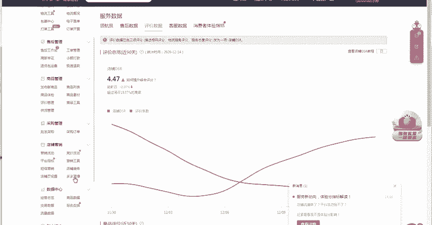
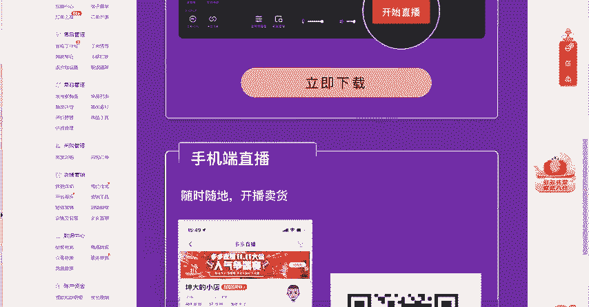
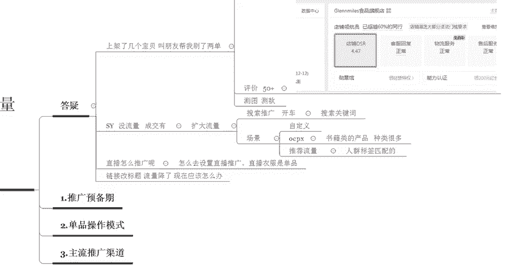
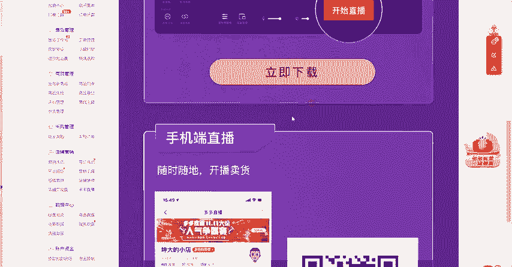
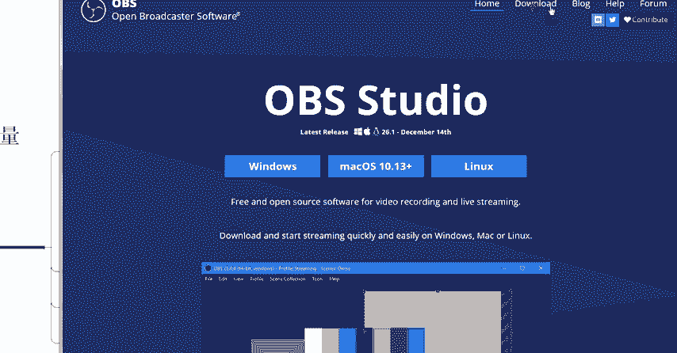
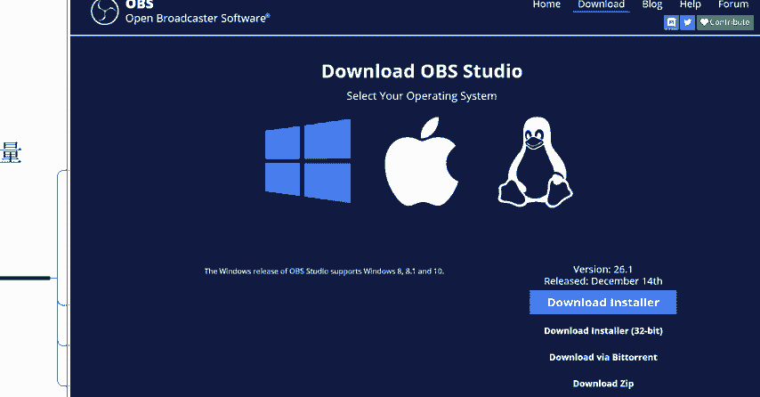
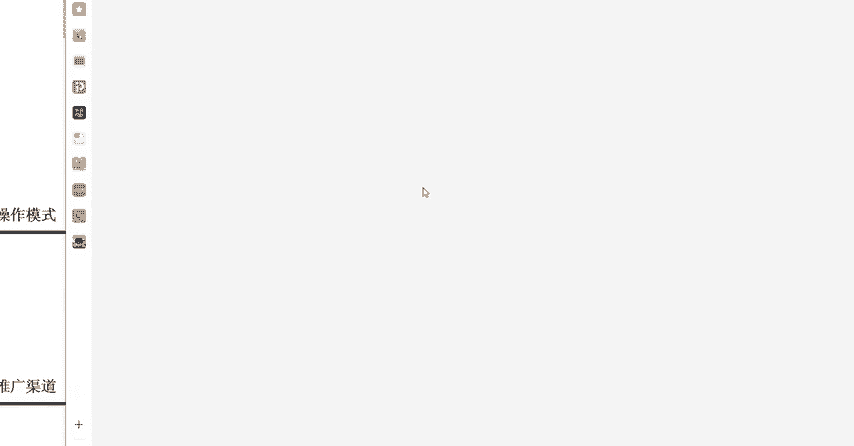
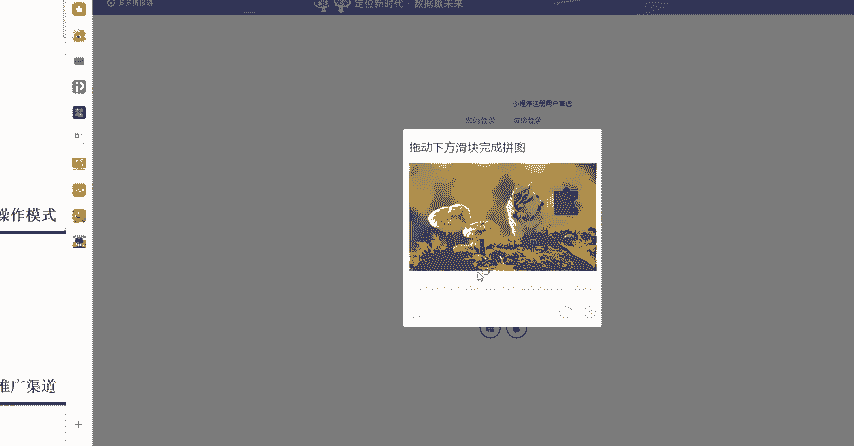
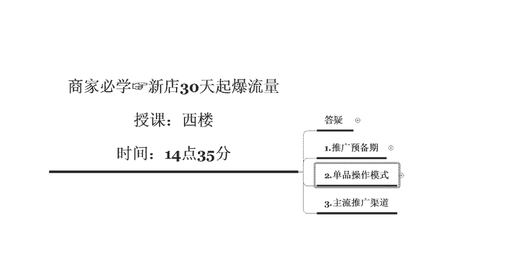

# 【拼多多运营实操教程】最系统的零基础拼多多开店教程全套，电商运营大佬专为学渣研制的新手开店保姆级教程！全程干货，简单粗暴 - P47：47、拼多多开店-新手新店30天起爆流量 - -拼多多开店 - BV1BH1qYpEqw

新店的打开你们后台之后呢，然后你们点到这个位置啊，你们后台的这个首页里面呢有一个店铺DSR这个店铺DSR呢就是说你店铺整体的一个流量获取的一些呃最基础的一个数据的一些累积啊。

包括你店铺后期的一些售后的一些运营，全部都是在这里面去进行展现的。那么这个有的有很多的同学呢？可能你的店铺的这个DSR呢，还是处于一个呃什么数据都没有的，暂为呃暂无数据的。

那么凡是像这种店铺都是拼多多还没有还没有去收录的啊，怎么样才可以收录你的这个店铺去计算你店铺整体的权重呢，就是需要你的评价达到50条以上，你全店的评价达到50条以上。

你就可以收录对应的一个DSR明白了吧？DSR就是指你店铺的一个成交之后的一个呃好评啊，还有你的售后以及你的客服的一些回复率那这个呢都是啊具体的1个DSR的一个考核的一个数。

啊，你可以看一下近30天的一个评价数，看到没有？近30天的评价数呢就决定了你店铺的DSR的一个评分啊。DSR的一个评分啊，可以看到这个店铺呢，虽然说前段时间是因为这个双十一双十二。

然后呢这个评分拉低了一些。那现在呢慢慢开始往上走了啊，你只需要把这个好评给做好了，做好就可以，你可以做一些好评返现的活动，好评返返红包啊，类似于这样的活动都可以提高。😊，明白了没有啊，这个年少追梦。

首先第一个你要去做的呢，就是先把你的基础销量给做起来200单，然后呢评价50条，把这些东西做好了之后呢，然后你才进入到我们单品的一个操作模式里面。你现在还处于是推广预备期啊。

先把这些基础的东西做好了之后呢，然后再去考虑下一步的问题。好吧，基础销量怎么做？你可以多多定宝，也可以自己刷，也可以像这个海宝刚才提到的一个问题，可以用直播啊，那海宝呢刚才提到了这个直播怎么样去推广啊。

😊，呃，不要着急，我一个一个来啊，我一个一个来。😊，词要测嘛？词肯定要测的，推广预备期的时候，你必须要进行测款。测图撤款。把图片和款式全部都测试出来之后，你才知道你应该去刷哪个关键词。

你应该去找做哪一个市场。所以说前期的测图测款是必须要做的啊，是必须要做的。如果说有同学没有去做过的话啊，除非你的你对于你的款呢非常的认可啊。😡，否则的话，你一定要去测图测款啊，一定要去开一下这个车啊。

开个一两百块钱，差不多这个几百个点击量就有了。好，我们看第二个问题啊，SY还在不在啊？SY还在不在？😊，SY在的话，公屏扣1啊，公屏扣1示由我一下。然后呢，你把你店铺的一个情况跟我讲一下。

你刚才呢只说你的店铺呢没有流量，但是说有一些成交啊，那么你有去做过其他的一些推广没有？啊，你有没有去做过其他的一些推广？那这个呢其实你要了解的就是主流的一些推广渠道啊，都有哪些？呃，搜索推网有没有做过？

😡，搜索推广啊，简单来说就是搜索推广呢，就是我们开车啊，开车有没有开过车？😡，然后呢，这个啊好没有啊，那这个方面呢你可以去进行提升啊，可以去进行提升。那么第二个呢是这个场景啊，是场景。

场景呢又分为自定义和这个OC叉啊和智能。自定义和这个OCP叉啊OCP叉。分为这两种啊，那么如何来选择自定义或者OCP呢？要看你自己的产品。那这个SY同学，你是做什么产品的？你可以跟我讲一下。😡，啊。

因为不同的这个产品我们在操作的时候啊，做的一个呃做的一个东西呢是不一样的啊，做的一个操作是不一样的啊。然后这个沉默中爆发又提出了一个问题啊，产品链接改了这个标题，但是说流量突然间降低了啊，应该怎么办啊。

这个不要着急，这个是一个呃大家非常容易犯的一个错误啊，之后我会具体的跟你讲到啊，卖书的好，那卖书的话，我建议你啊，你在操作的过程中呢，你就去开这个OCP仓。因为你的书籍类的一个产品啊，书籍类的产品。😊。

种类很多啊种类很多。你卖书的话，不可能是只卖一种书，一种书籍的。所以说你如果说你的店铺里面只上架了一种啊或者两种这样的书。然后呢，你要去呃运营它的话，你要多上架多上架一些产品链接。

然后去开OCP3OCP3的效果会比较好一点。呃，开场景有一个什么样的一个呃好处呢？就是说你在推广的时候呢，我建议你搜索推广可以先不开啊，然后主要开这个场景，为什么呢？

因为你的产品呢有很多消费者在进行购买的过程中呢，它不知道应该怎么样去进行搜索。比如说你卖这个呃青年文栽啊，或者是一些呃新华字典啊，类似于这样的书啊，我不不太清楚你具体卖的是什么，我们就举个例子。

比如说新华字典。那新华字典它是比较出名的。那消费者买的时候呢，可能会直接搜索新华字典这个关键词，所以说它的转化率会非常高。但是说如果说你卖的那种书籍呢是呃并没有特别大的一个名气的话。

那么你开场景是最好的。因为场。它是属于什么呢？推荐式的流量。它是属于推荐式的流量，它是直接把你的产品展现在有需要的消费者面前。它是根据于人群标签啊人群标签。匹配的啊，它是根据人群标签匹配的。

它跟搜索不一样。那搜索呢它就是搜索关键词。比如说我想要买一个新华字典，我肯定就直接搜新华字典这个关键词，我去找了。那这种消费者呢它是有特定需求的。我们书籍这种产品呢，它不是属于一个特定需求的一个产品。

明白了吧？所以说呢你可以去尝试开一下这个OCP仓啊，然后呢书籍一类的一个产品呢啊你要形成联动啊，你要形成联动，明白了没有？这个就是你后期整体操作的一个方向。然后呢。

这个海宝啊刚才又又这个提出了一个问题啊，怎么样去设置直播推广啊，直播的衣服是单品啊，我想先问一下啊，这个SY同学啊，前面跟你讲的这些东西，你明白了没有？O ok啊，了解了之后呢，我们就继续下一个问题啊。

然后呢是海宝的这个问题啊，直播推广应该怎么样去推啊，你的直播的产品呢是单品。我建议你可以先开一个无人直播嘛，就是说你疯狂的去介绍你的自己的一个产品，你直接去录一个啊短视频啊，录一个短视频。

然后呢去开一个无人直播啊，直接去店铺后台设置好就可以了。在我们每一个人的店铺的一个后台呢，会有一个直播推广啊，有个多多直播啊，你点击这个多多直播点击进去之后呢。

然后它会让你下载一个这个推流的一个软件OBS啊OBS如果说你是要这个电脑直播的话，你就下载个OB。如果说你手机直播的话，那你就开个手机。然后呢你要如果。😊。

说使用了这个OBS之后呢，然后在这个后台的一个位置呢，你是可以自己自由的去添加对应的一个呃视频的一个呃播放的啊。就是说你可以先提前把这个视频给录制好。你这只需要有一场优质的直播，然后呢。

把这个视频录制好之后呢，你就可以随时放在那里无人去进行直播啊，就相当于是放录播一样啊，放录播一样，然后呢使用OBS推流。每天电脑挂在那里就可以了。

OBS下载不了，你直接百度搜索就可以了啊，百度搜索就可以了，或者是你使用官方的这个官方的这个渠道啊，你直接往下拉啊，你直接往下拉，然后呢呃。😊。

我来教你们一下。😡，还有官方的一个渠道的啊，有官方的渠道的。你百度里面搜索OBS。然后呢，这个就是官方的一个推流的一个一个网址啊，官方的网址是英文的啊是英文的。那么大家打开这个后台之后呢。

然后在右上角的位置啊，在右上角的位置有1个DOWNDOWN呢就是下载的意思啊，这个呢就是下载的意思啊，然后呢大家点击这个下载啊，右上角点击这个下载。

好，点击这个下载之后呢，然后会让你选择系统啊，会让会让你选择系统。然后呢，这个你选择这个如果说你是windows系统，就选第一个苹果系统就选第二个，然后其他的系统就选第三个啊。

我们一般情况下都是windows系统啊，选择windows系统，然后在这里下载就可以了啊，在这里下载就可以了。然后呢，你点击之后呢，会给你弹出一个对应的一个下载框啊，会给你弹出一个对应的下载框。

下载好之后安装啊，就OK了。明白没有？L。😊。

然后呢，你课下之后呢，你可以去呃实际去操作一下，好吧。然后呢，昨天你也跟我聊了很多啊，昨天你也跟我聊了很多啊，然后呢，就想就说是想要跟着老师学的啊，但是说呢啊还没有这个还没有办理入学，对吧？😡。

直播间卖衣服有几种推广法，直播间卖衣服的话，一种就是真人直播，一种就是无人直播。然后呢，你还可以呃找这个网红啊，找网红给你带货啊，找网红给你带货都可以的啊都可以的。元宝多福啊，现在不用这个OBS了。

直接下一个多多直播就可以了。OBS它是一个推流软件啊，不是直播的软件。你直播的时候需要下载一个多多直播啊，你直播的时候需要下载一个多多直播，同时还需要1个OBS啊。

同时还需要1个OBSOBS是给你的这个直播间来推流的啊，给你的直播间来推流的。它就相当于是你开车的时候，你开店啊，你开了这个拼多多店了，然后你也可以开一个淘宝店啊，都是可以的啊，都是可以的。

所以说它是并不并不影响的啊。OBS是推流的。😊，以前的时候大家觉得没有OV颜色就没有办法开直播啊，但其实不是这样的啊，其实不是这样的，明白了没有？元宝多福。😡，好。

这个呢就是这个直播啊直播方面的一个问题啊，直播方面的一个问题。呃，然后这个元宝多福，还有这个海宝都能不能理解？理解的话，公屏扣1啊，理解的话公屏扣1啊。然后那个大家还有其他的问题吗？

有问题的话要抓紧时间啊，我们最后一个问题啊呃链接改了标题之后呢，然后流量下降了，现在现在到底应该怎么办啊，这个问题呢其实非常的简单，你修改标题。😊，宝贝的权重就没了。😡，啊，宝贝全都没了，只能重新做。

呃，你标题你改了标题，然后呢，流量下降了，你千万不要直接想着这个我重新把标题改回来，然后流量就有了啊，不是这样的，你改了标题之后呢，它会影响到你宝贝的权重。😡，你宝贝整体的排名就会下滑。

如果说你再把这个标题给改回来了的时候呢，然后你会发现你的标题呢你的流量呢还会再度下滑。所以说你改了标题之后呢，千万不要再去第二次去动它了，明白没有？😡，嗯。OK啊。

联系啊联啊西林啊西林啊一直要念一直念成这个联系啊，西林同学讲这个新品上架编辑，还有权重。😊，新品上架之后呢，然。肯定是有权重的呀。😡，新品上架了之后呢，拼多多平台会有这个会有推荐啊，会有推荐流量啊。

会有推荐流量的。虽然说这个流量不是很多啊，只要你标题写好了，慢慢的你的自然流量呢就会多多少少给到一些。可能每天呢只有二三十个。凡是那些店铺里面店铺的这个流量啊，上架了宝贝之后呢，流量只有二三十个的。

也就是说你的这个产品呢，可能你标题写的OK，那么这种产品你可以直接推了。如果说你上架了宝贝之后呢，你发现你的宝贝一个流量都没有啊，上架了一两天一个流量都没有。那这个宝贝我建议你下架了之后重新上。😊，啊。

明白没有？可是编辑了还有权重啊，编辑了肯定就没有权重了呀。😡，我前面不是跟你讲了吗？你链接修改了标题，你的宝贝权重呢肯定就下滑了啊。但是说呢如果说你宝贝权重非常高的情况下，它可能会给你降一点点权重。

不会说全部给你屏蔽掉。但是说你的流量还是多多少少会留存一些的啊，会留存一些的。所以说呢这种权重呢只能说重新把这个权重给拉回来啊，千万不要做二次修改。😡。

然后蜗牛散不讲拼多多怎么样去看这个热搜关键词有工具吗？这个有免费的工具啊，你拼多多后台可以就直接直接去看的啊，可以直接去看的。在拼多多的后台，然后有一个推广工具啊，推广工具里面呢有一个搜索词分析啊。

有个搜索词分析。啊，给你看一下啊，给你看一下啊，在推广中心这边有个推广工具啊，推广工具，然后点推广工具就会进入到推广的一个页面里面啊，推广的页面里面。啊，我长时间不登录掉线了啊，掉线了。你进去之后呢。

在这个位置啊，大概就在你页面里面的这个位置啊，这个位置会有一个呃搜索推广搜索词分析啊，然后呢直接点进去之后就可以在里面查词了。明白没有？蜗牛散步。然后呢，这个我看一下大家的问题啊，看一下大家的问题啊。

元宝杜腐讲测关键词中可能觉得图不好换主图会有影响吗？肯定会有影响啊。你主图的点击率不好的话，你就换一个比较高的一个点击率的图。只要你的点击率变高了，就没有太大的一个问题。但是如果说你换了图片之后。

你点击率变低了，那可能会影响到你整个计划，你的计划的一个点击价格可能会变高啊。然后呢这个SY讲上产品和别人的一样。但是你的就会提示低价引流，这个怎么办啊。

涉及到套装之类的那这个呢可能就是你上架宝贝的时候啊，什么叫低价引流。因为最近好多同学都出现了这个低价引流啊，低价引流。😊，嗯。然后呢，这个呃低价引流主要是从哪几个方面来讲呢？

第一个就是你的一个产品的SKUSKU的一个基础的描述。简单的指说关键字。😡，你在选择这个SKU的一个关键字的时候呢，你不能说单屏啊，比如说你的产品呢是单瓶的单瓶的呢，然后你做成套装的啊。

你做成套装的那这种呢单瓶和套装就不能放在一起，它必须分开两个链接来进行上架。这个呢就是我们在这个低价引流的时候呢，可能会犯的一个错误。比如说你的产品呢是这个组合套装的。那么你在上架宝贝的时候呢。

你写了这个是体验装。好，体验装这几个字往上面100。那基本上也就低离离这个低价引流不远了。然后第二个问题是什么呢？就是我们的一个价格上面的一个问题。我们在设置这个对应的SKU的时候呢，我们的价格区间。

😊，啊，价格区间不能超过3倍啊不能超过3倍。比如说举个简单的例子啊，我的产品呢原先是这个两瓶的啊，原先是两瓶的那两瓶的我的价格呢是10块钱啊，是10块钱。但是说呢我在店铺我的这个SKU里面呢。

我又添加了一个10瓶的啊，我又添加了一个10瓶的。然后呢，食品组合的里面呢，你设置了多少元50元。好，那这个呢就属于低价引流啊，就属于低价引流，它会直接判你低价引流。

然后第三个我们要注意的一个点是什么呢？SKU的选项啊，选项大家都知道我们在发布宝贝的时候啊，发布宝贝的时候，是不是会让你选择SKU的一个规格。SKU的规格里面有单品啊，还有这个呃比如说款式啊。

规格还有重量，不让你选择这些东西。那有的人呢你在发布这个产品的时候呢，你选择了这个规格啊，你选择了规格或者选择了款式。但是你的SKU里面写了两瓶10瓶，两瓶的套装，10瓶的套装呢。

这种也是属于低价引流SKU作弊。关于这个能不能明白，主要就是这三个点，你把这三个点做好了，你的产品呢基本上不会太再有太大的问题了。😡，明白没有？SKU啊，这个SY。然后呢。

这个元宝多测关键词的时候需要全天开流量嘛，设置100多111上午就刷完了。呃，不需要啊不需要你全天开啊，不需要你全天开。只要你拿到对应的点击量，就OK了啊。😡，SKU设置多少有影响吗？

2SKU的多少肯定会有影响。你设置的SKU多了，那么你的价格，你SKU的一个区间价格是不是就变大了？你不可能所有的SKU全部都是同一个价格。如果说你SKU全部都是同一个价格，那影响不大。

那如果说你的SKU区间价格非常大的话，你可能就会犯这一票啊，SKU的一个区间价格不能超过3倍。😡，几只装不是规格。😡，几支装你要上组合或者套装。能不能明白规格指的是什么？规格是你的你的这个。

比如说你卖这个产品的，你一瓶里面有多少粒啊，60颗。😡，这个叫规格啊这个叫规格。😡，西林能不能明白？😡，你产品单瓶的一个东西，比如说你卖这个呃卖这个呃举个简单的例子啊，卖药啊，卖药一样。然后呢。

你一瓶两瓶一个疗程，两个疗程，三个疗程啊，一瓶两瓶。这种呢叫做呃组合或者是套餐，它不是规格啊，产品的规格呢是你一瓶里面有多少颗，有多少粒。明白没有？😡，一只8只也是属于组合啊，也是属于组合。

比如说啊有一些比较有歧义的一些产品啊，比如说呃像一些这个呃口服液啊，那口服液呢可能它里面有8个呃就是。😊，一板里面啊会有8瓶啊会有8瓶，或者说我们喝的这个养乐多呀啊这一类的啊，它有8瓶。那8瓶呢。

我们在上我们在上架的时候呢，我们就不能选择规格啊，我们就不能选择规格，要选择组合，明白没有？一只、二只、三只、8只啊，这种都是属于组合。😊，规格指的是你一瓶有多少的容量啊，这个东西叫规格。好吧。😡，好。

那大家还有没有问题啊，还有没有问题？然后呢，这个如果说大家没有问题的话，我们就开始我们今天正式的一个课程内容了，好吧。对，是组合啊是组合。然后呢，海宝直播推广有好几种，我才是我怎么才能知道哪种最有效果。

哪哪种最适合自自己呃，服装类目的话直播就用最普通的啊，然后你真人直播就可以了。真人直播或者是无人直播都是可以的这两种推荐你去做。那如果说你想要去尝试其他的方式的话，那啊你可以去尝试啊，可以去尝试。

当然我推荐你的啊，就是说你自己本人，然后真人去直播啊就可以了。因为你服装类目的话，你可能会有试穿呀，或者是一些其他方面的一些操作。比如说讲解一下产品的材质呀，这些会比较方便一点。单人直播这几天没有进人。

你可以看一下推广啊，你可以看一下推广。😡，看一下直播推广，花点钱，然后拿一点流量，然后看一下你直播的效果啊，看一下你直播的效果。😡，好，我们快速的看一下大家的一个问题啊。元宝多福呢又提了一个问题啊。

当然我看今天这个大家的问题都特别的多啊啊，那就多花一点时间给大家解决一下大家的问题啊。找朋找朋友刷好评，但是说都是聊过之后下单的，但是好评大部分都快被系统屏蔽了。元宝多福啊。

一会儿的话我会具体的跟你讲一下，我们在做评价的时候，到底应该怎么样去做啊，我在第二个点里面会给大家会给你讲到啊，做评价不是你那样去做的啊，不是你那样去做的。你以为你找一个比较好的一个账号就可以了。

但是说其实有一些浏览轨迹啊，都是不一样的啊，都是不一样的。所以说他也会把你的评价给屏蔽掉。明白了吧？包括你的支付方式啊，你的啊下单的一些渠道啊，你分享的一些渠道都是从哪里来啊进入你的店铺的。😊。

都会影响到评价的一个展现。😡，现在直播限流了，天天都在开啊，前几天流量特别多。因为你刚开的时候呢都会有对应的一个推荐啊，都会有对应的推荐。如果说你觉得这几天流量比较少的话，你去开一下这个推广。好吧啊。

我告诉你在哪里开。嗯，你打开你店铺的个后台啊，打开之后呢，然后找到这个推广计划啊，点这个推广计划里面有一个直播推广啊，里面有个直播推广，你可以通过这个直播推广，然后呢去推一下啊，去推一下。😊，看到没有？

这个直播推广直播推广它整体的一个数据效果呢其实也还可以啊，其实也还可以。主要是给你带来的一个曝光量是非常大的啊，它类似于这种场景了啊，类似于场景了，啊，你做直播的时候呢，千万不要说关注你的直播呢。

这个给你带来了多少一个投入产出比，你要重点看这个曝光曝光了多少。然后呢，点击点击了多少，然后呢，你400块钱可以拿到3500个流量。你先你说你的这个拿的值不值啊，你就说拿的值不值吧，那肯定是非常划算的。

400块钱3000多个流量啊，对吧？然后呢还有70多个关注啊，70多个店铺的一个关注对吧？所以说呢你要看整体的这些数据啊，看整体的这些数据不要去强行的去看我们的一个呃投入产出比啊，这些没有意义。

所以说直播推广呢，现在开的人比较少，所以说还是比较便宜的啊，你可以去尝试开一下。😊，推广了，推了600块钱进来2000人之后，然后然后又全走，那就是你直播的内容不够给力啊，肯定是你的直播内容不够吸引人。

嗯。西林讲到适用人群是什么意思？适用人群在哪里看到的呢？😡，呃，棒新店刷单号最近没有流量，是不是店铺就死了？最近是双十二刚结束啊，双十二刚结束，你的流量都会下滑的，明白了吧？

如何来看你的店铺流量下滑到底是行业的影响，还是你自己店自己店铺的一个影响。你要去商家后台自己去看啊，自己去看。然后在搜索推广里面，你搜索你对应的一个关键词，然后自己去看一下。有一些就是双十二啊。

整体的就是双十二的一个影响啊，并不是你自己产品或者是你的店铺操作上面的问题。😡，大盘的问题啊大盘的问题。😡，呃，新啊现在新店开始操作应该从哪里走啊？这个不要急啊不要急。

我今天呢主要给你们讲的就是新店在操作的时候，我们推广预备期以及新品的一个呃单品操作的模式，以及我们主流的一些推广的一些渠道啊。既然说大家问到这里了，那么呃。我想问一下在座的各位啊。

你们的新品开始操作的时候呢，都是怎么样去做的？你们可以跟我讲一下。是直接上架了之后呢，就开始刷，还是说有做了一些其他的操作？😡，啊，有没有？其实上节课的时候我有给大家讲过，我们在推广的时候呢。

前期应该准备哪些工作啊？啊，直接上来就是刷，然后下次先刷单做好评。🤧啊，上架之后就开始就开始刷。哎呀，我的天厉害了。好了啊，因为这个时间差不多了啊，时间差不多了。然后呢这个还如果说还有其他问题的。

没有得到解决的，可以课下找我一下啊。因为我们这个听课的人比较多，那照顾到大部分的同学啊，那如果说这个大家有一些问题呢，还没有问到的，可以直接先加一下我的微信。

然后这个助教老师把我的这个微信二维码发一下啊，你可你们可以先加一下我的微信，然后有任何的问题呢，先给我留言，我下课之后给你们解决好不好啊？然后的话这这个我们呃时间关系。

我们就正式开始我们今天的一个干货的一个分享了。那么已经准备好的同学啊，准备好的同学，把你们的这个想你们自己店铺的一个问题呢啊搜一搜啊，搜一搜，然后呢跟着老师的思路一起往下走一下。然后看一下这一节课程呢。

对于你现在的一个店铺操作呢，到底有多大的一个帮助，好不好？那么已经准备好的同学啊，公屏上这个鲜花来一波啊，鲜花来一波，我们先签个到啊，可能有有些同学呢。😊，这个没有不不习惯去问问问题啊。

像这个啊进来的啊，比如说简单明了啊，还有这个云曼啊，开心啊，进来之后都不怎么讲话的。还有这个10月家居啊，12月家居啊，取舍小芳啊，对吧？这些都是进来之后不怎么讲话，可能比较害羞啊。

但是说呢可能有一些问题呢没有得到啊，你们有一些问题呢，不知道应该怎么样去问，或者不好意思问，那么可以直接加我的微信啊，课下之后直接找我。那么现在呢我们就直接进入到我们这个干货分享，大家先签个到，好吧。

😊，没有声音的吗？啊，没有声音的刷新一下啊，刷新一下啊，刷新一下，退可以或者是这个退出课堂重新进一下啊，都可以的，好吧。😊，啊，在的。你这边这个没有没有什么问题吗啊没有什么问题吗？

有问题的话可以直接问啊。没有问题的话，我们就正式开始了，好吧。😊，啊，还没有拼多多店铺，没关系啊没关系。😊，运营这个东西呢思路都是一样的啊，思路都是一样的。做成人有什么注意点吗？成人的话。

我今天给你讲过啊给你讲过成人的话，首先第一个你要注意的就就是你可能会违规啊，你的一些有一些关键词你是没有办法去进行使用的。然后呢，成人这个类目的玩法呀玩法呢也非常的简单啊。😡，玩法呢也非常的简单。

直接这个走量就可以了。量走起来。啊。成人类目呢其实我建议你呢可以去做一下这个改销量啊，直接把销量做到10万笔之后，然后再去做好评啊，然后再去做销做好评。这是成人类目的惯用的操作手法啊，因为成人类目。

如果说你想要去累积销量的话，太难了啊，太费劲了。同行呢销量都非常高，所以说你可以直接做一个比较高的一个销量。像我之前带过的一个弟址呢，他就是做这个成人类目的，他的一个店店铺呢叫做孟凡啊，叫做孟凡。

你们可以去搜一下啊。孟凡成人啊，孟凡成人。😊，他现在呢做的也非常的不错的，一天能有个几千单啊，一天能有个几千单，做的还是比较O的。😡，还有保健类目，保健类目要比成人类目好做一点啊，它的违规的一个。

违规哪个限制呢？没有那么多啊没有那么多保剑的相对来说比这个用具啊要好做一点啊要好做一点。光三尺的销量是怎么做的？光三尺直接刷就可以了。简单粗暴啊简单粗暴，不管你是决定做淘宝，还是说做这个拼多多啊。

那同行的销量都不是特别的高，你直接把你的销量怼到这个同行排名靠前的位置。你比如说搜索官方尺这个关键词看到的前5家店铺都是你自己的啊，都是你的，你就可以直接把这个类整个类目吃下来，你这个类目比较好玩的啊。

小类目。😡，直接直接做就可以了。😡，啊呃。西林不会改销量啊，改销量是我交给我的VIP地址的啊，我交给我的VIP地址。既然说你提到了这个啊，如果说你今天啊你想要跟着西罗老师学的话，想要学习这个方法的啊。

可以直接加入我的VIP地子班啊，我会教你们怎么样去改销量，好吧？我免费教你们怎么样去改销量，明白吧？就是说如果说你们每做一个款。你们的销量呢直接就是10万加啊，直接就是10万家开始起步。😡，明白吧？

这个东西比较简单，当然这个是属于内部的黑操作啊，我不会说在公开课里面给你们讲的。如果说有想要学的啊，直接微信上找我啊，直接微信上找我，好吧。😡，像这个元宝多福，还有这个。还有这个西林啊。

可以直接先微信找我啊，先微信找我。😊，好了啊，然后呢给大家讲的这个东西呢有点多啊，所以说有点拖节奏了啊。😊，不用花钱干嘛？为什么要花钱啊，就是自己做啊，就是自己做啊，美妆怎么做起来啊。

不要着急啊不要着急，你们准备好的公屏上鲜花来一波。我今天跟你们讲的这个方法呢是适用于你们基本上所有的类目啊，基本上所有的类目，除非那种客单价非常高的啊。

超过300块钱以上的这种客单价在这个拼多多里面不是特别呃好用这样的一个方法的啊。那300块钱以下以上的这种产品呢就需要剑走偏锋啊，就需要剑走偏锋。那如果说你的产品呢是300块钱客单价以下的。

认真跟着我的思路啊，认真跟着我的思路，我们直接进入我们今天的一个呃主题内容啊，主题内容教你们怎么样把你们的店铺一步一步的运营起来，好吧。😡，好啊，那么我们先来说第一个问题。其实这这个问题呢。

我上一节课给大家讲过推广之前的预备期，我们到底要做哪些工作。首先呢我们要了解到的就是我们在推广整个店铺单品的过程中呢，我们要呃根据我们店铺的一个商品来给自己的商品呢去进行分类。

首先我们第一步要面临的就是推广的预备期。那预备期，我们要准备的个工作呢。因为上节课我讲过了，我直接就给大家讲了，好吧，第一个呢要主要优化的东西呢，就叫做主图。因为主图它是直接跟你的店铺的一个点击率。😡。

挂钩非常大的一个原因啊，挂钩非常大的一个原因。当你把你的主图。做做到一个比较高的点击率的时候，那么你的新品呢上架之后呢，就会有非常高的流量。因为前面我给大家讲过啊，新品。😡，上架之后啊会有销量啊。

会有啊不是有销量，会有推荐流量。它给到你推荐流量，不是直接给到你访客的，而是说给到你曝光，给到你曝光之后，你必须要有比较高的点击率。然后呢。

消费者的这些访客这些曝光的这些人看到你产呃产品的这些人他才可以变成访客。所以说呢新品在前期最主要的一个东西就是点击率，我基本上每操作一个单品，我的主图点击率呢都都会达到6%到9%左右。

或者是到甚至有一些款呢，我会达到10%，我才会去推啊，我才会去推。明白没有？所以说第一个我们要做的就是点击率把点击率给做高。那么点击率跟哪些因素相关的，最相关的就是主图。当然说还有一些其他的一些因素。

比如说我们的价格或者是我们产品的一个标签。😡，或者是我们产品的标题啊，以及我们的销量。然后第二个我们要解决的东西是什么呢？是转化率啊是转化率。😡，因为这个之前我讲过啊，我就快速的给大家过一遍。

如果说大家发现我在给你们列出这些东西，这过程中你们有哪一个点没有做的啊，你及时提啊，一定要跟老师啊把你们的问题提出来。比如说老师我不知道标签是什么，或者我不知道怎么样去定价啊，你要直接跟老师提好吧。

如果说大家都明白的话，我就不讲了啊，我就不讲了，就把这个东西给你们列出来，让你们知道推广预备期做好哪些东西就可以了啊。如果说你们不有不会做的，一定要跟老师讲好吧。第二个跟我们转化率相关的一个问题呢。

就是第一个是展开的这个打标。因为我们前期呢可能要刷单，可能要补单。那补单的过程中呢，我们操作的一个内容呢，就需要去打标，怎么样去打标签啊，怎么样去打标签。那么第二个我们呃影响到我们转化率的一个问题呢。

是什么呢？叫做开团人数。😡，开团人数啊。😡，然后第三个呢是我们的一个评价啊，评价也会影响到转化率。第四个呢是动态评分。啊，最后一个呢是详情页啊，最后一个是详情页。好，我来看一下大家的问题啊。

看一下大家的问题，半梦半醒。然后刚才讲到这个标签是指人群嘛？对啊，这个标签就是人群。这个人群背后指的是什么呢？是购物意图啊，是购物意图。也就是说消费者会搜索哪些关键词去找到你的宝贝。😡。

所以标签最后最根本的问题还是关键词。因为只有消费者搜索了这个关键词，它才是有需求的，明白吧？比如说我想要要一个键盘，我就直接去搜索键盘，然后呢，我去找到对应的个商品来去进行购买。

所以说这个东西就叫做标签。那么如果说啊我平时呢可能会喜欢比较吃呃，比较喜欢吃零食。那可能我在搜索的时候，我的账号的这个标签呢就是属于零食爱好者啊，就是属于零食呃零食的这个爱好者。

所以说呢这个东西就叫就叫做标签，明白了吗？半梦半醒，还有开心啊。😊，然后购物意图是习惯嘛啊习对啊，购物意图就是人的一个购物习惯啊，人的一个购物习惯。🤧只有你很长时间去搜索这某一个关键词的时候呢。

它才会判定你的你这个账号或者说这个人是属于喜欢这类产品的，他才会给你推荐。😡，好，关于这个点击率和转化率这几个影响的因素，大家还有没有问题？没有的话啊，没有问题的话，公屏扣1示意老师一下啊。

像这个12月家居取舍啊，小风L还有这个刚才这个新手啊，新手想元宝多福啊，西林都是刚开始做店没多长时间的啊，不知道店铺应该怎么样去做的。明白的话，公屏扣一，示意老师一下，我要继续往下讲了啊。

一定要跟上节奏。😊，好啊，这个这位同学呢提到了一个标题和标签的区别是什么啊？标题和标签的有个区别。😡，标签里面的这些关键词呢是包含在标题里面的啊，是包含在标题里面的。标题是由。很多个。标签词组成的。

并且呢标题是有固定的组合方式啊，标题是有固定的组合方式，就是你一个一个的标签，然后组合成我们的标题，然后呢让系统去认识你的产品，才会给你匹配对应的流量。系统在抓取你宝贝的时候，他会先认识你宝贝的标题。

进而根据你的标题来给你匹配对应的标签。所以说是先有了标题，然后才会给到你对应的标签流量，你才会有点击才会有访客，才会有转化，明白了吗？😡，好，OK啊，那这个推广预备期我们就直接过了啊，我们就直接过了。

因为这个呢是之前呃讲过很多次的啊，讲过很多次的。好，那么接下来我们今今天这节课程的这个重中之重来了啊，单品到底是怎么样来进行操作的啊？单品到底是怎么样来进行操作的？这个呢我首先要给你们。😊，说清楚啊。

这个非常非常的重要啊，非常非常非常重要。重要的事情说三遍，你们准备好的，一定要拿出你们的笔记本，好好的记，好好的听。好吧，已经准备好的同学啊，公屏上鲜花走一波啊，要有想要上厕所的啊，抓紧时间啊。

抓紧时间给到你们30秒的时间，然后呢老师这边呢也喝口水啊，你们准备好了，公屏上鲜花来一波。然后呢啊今天这个干货的一个内容啊，对于你们的帮助有多大，就看你们鲜花的一个热烈程度了啊。

我看一下你们对于这个店铺整体的一个操作啊，这。😊，怎么样做起来的啊，到底有多多强烈的一个求知欲啊。😡，这个课件会发送吗啊，课件的话。课下找我好吧，课下微信找我。😡，好啊，那非常感谢大家的鲜花。

那么我们呃正式开始啊正式开始。首先我们单品的操作模式第一个啊第一个环节要给大家讲的是什么呢？在单品操作的周期。😊，我们单品操作的周期是分为四个周期来进行操作。啊，分为四个周期来进行操作的。

所以你们的单品在上架了之后呢，你们要给你自己的单品呢去做一个分类啊，去做一个分类。你的产品处于第几个周期啊，然后呢去呃。是哪一个周期应该去做哪一呃什么样的一个事情啊，我来给大家列一下第一周期。😡。

第二周。第三周。第四周。🤧嗯。第一周呢我们把它叫做基础累积啊，基础累积期。第一周叫做基础累积期。好，我想问一下，在座的各位，你们的新品上架了之后，第一个星期都做了哪些准备工作？😡，可以给我讲一下啊。

你们是自你们是怎么做的啊，先来听你们是怎么做的。😡，好，这个很多同学呢这个第一周期来了之后呢，直接就是。😊，啊，直接就是骚操作就来了啊，骚操作就来了。😡，那这个呢你让我怎么说呢啊，你让我怎么说呢？

还有其他同学啊，其他同学你们都是怎么做的，你们都是怎么做的？像这个西林，还有元宝多福，简单明了，阿瑞开心。你们可以讲一下你们是怎么做的。我先看一下你们做的时候都有哪些问题啊，都有哪些问题。😊，啊。

既然都说大家对于这个对于这个刷单都非常感兴趣啊。😊，你们是除了刷单，不会去做其他的事情吗？啊，除了这个洗刷刷之后呢啊不知道去怎么样去做其他的事情吗？😡，是的话，公屏扣1啊是的话，公屏扣1。

我看一下有多少人是除了这个洗刷刷之外，不会做其他的事情，只会洗刷刷的。😡，有多少人啊有多少人公屏扣1，我看一下有多少。😡，还是说你们本来呢就会。😡，去操作其他的东西。但是呢啊就享受这种洗刷刷的快感。😊。

喂喂喂啊，刚才掉了一下线啊，掉了一下线啊，现在都能不能听到啊，能不能听到？😊，优化关键词，优化主图啊。然后呢，这个有很多的同学呢都是前期呢除了这个刷单，然后其他什么的东西都不会做啊，我的老天爷呀。

你们也是厉害了啊，你们也是厉害了。😡，前面我跟你们讲过了，在第一周的一个操作过程中，你们要做的东西是什么呢？先去做好这个推广的预备期啊，先去做好推广的预备期。预备期我们要解决的问题啊，点击率和转化率。

这两个问题你还没有解决呀。这两个问题你还没有解决的时候，你就直接就开干了啊，你直接就开干了，那你这是怕后怕是后期怎么死的都不知道啊。首先第一个我们是不是要解决点击率。😡，对吧我前面讲过的啊。

第一个我们要解决的一个问题呢是点击率。你新品上架了，第一周肯定是要要先解决点击率的对吧？那点击率应该怎么样去解决？😡，嗯，问一下你们点击率你们都想想办法嘛哈，想办法嘛，开动你们的脑筋怎么解决。

怎么样才可以让你的保位点击率变得更高。😡，有有没有想法都没有想法啊。😡，导人群增加曝光。这个沉默中爆发哎，这个。讲的呢有点意思啊有点有点那个意思了啊。对，第一步要做的是增加曝光，那怎么增加曝光呢？😡。

最快速的一个方法，怎么样才可以给我们的店铺增加曝光？😡，对吗？L啊讲对了啊讲对了。推广测图第一部门要做的永远都是推广测图啊，永远都是推广测图。我拿实际的案例来跟你们讲啊，实际的案例来给你们讲。

我这个单品啊，我这个店铺呢在操作的时候呢，是从这个8月底的时候开始去进行操作的啊，开始进行操作的。你们可以先看一下我的产品上架了之后，我第一步做的啊。我第一步做的，也就是我们的推广。

在推广的过程中到底是怎么推的啊，到底是怎么推的，看90天的数据啊，满打满分也就3个月的时间啊，满打满算也就3个月的时间。😡，好，速热啊，我当时做的这个产主推的这个产品呢就是速热的这个产品。第一步。

我们要解决我们的图片的点击率，那么图片的点击率就需要不断的去进行优化。最开始的时候呢，我的图片点击率呢大概是2%到3%左右，远远远没有这么高，但是经过优化，除了这个流量扩展包。

流量扩展包拉的一个数据会比较低啊，拉的数据会比较低，因为这个是全部都是智能啊，系统推荐的垃圾流量啊，虽然说投入产出比比较高，因为它的价格点击价格比较便宜嘛。😡，但是我其他的，比如说我的。😡。

主推的这些关键词，素牛肉、手撕牛肉，还有素素肉零食啊，这三个主推的关键词，我的点击率都是在5%以上的。所以第一步我们要做的就是推广测图，你的新品的点击率必须要达到3%到5%，这是最最最基础的。

最基础的点击率必须要达到3%到5%，然后你再给我去进行推广。同时在推广测图的时候，我们的关键词是不是也测出来了？😡，关键词是什么？素牛肉、手撕牛肉和素肉零食，对吧？那这三个关键词呢，它的表现是最好的啊。

它的表现是最好的。所以说呢当时我在进行实际操作的过程中呢，我就确定了下一步我们在比如说你们刚才所讲到的啊，新品上架了之后呢，然后就开始洗刷刷。那怎么样去做这个销量，怎么样去补这个销量。

补哪些关键词全部都是。😡，点击率先行点击率先行，明白没有？我在测试完之后呢，我就可以确定这三个关键词。😡，对，任何的产品都是这样啊任何的产品都是这样。😡，这三个关键词一定是可以做起来的。能不能明白。

我就可以直接确定这三个关键词呢，一定是可以做起来。为什么我可以这么确定。因为我花钱买的流量，它可以有比较高的一个点击率，也可以有比较高的一个点击转化率，那么虽然说我现在的开车的时候呢。

我的投入产出比并不是特别高啊，只有一点底到2%左右，但是我的目的并不是做投入产出比，对吧？我的点击转化率啊，可以达到9%啊，可以达到7%9%，那整体算起来平均也有8%左右嘛。

所以说我的单品当我的免费流量或者是我的免费权重做起来之后，我的单品自然而然就会有8%的转化率。😡，为什么我可以这么笃定？我可以直接把这个关键词我直接可以去做几千单几万单，甚至是这个推广更多的啊。

我去花更多的钱去推，为什么呢？因为我确定这个词一定是可以做的。😡，至于做多少个数据，那这个东西呢是要根据市场来进行判定的啊。所以说你第一步要确定的就是你的产品到底能不能做你做的这个关键词能不能做。

能不能明白，能不能明白。🤧嗯。好，那现在呢就给到你们一个这个。看你们店铺的一个机会，你们把你产品主推的关键词发出来。😡，你们把你店铺里面主推的产品词发出来啊，你跟我说你主推的是哪个词？😡。

或者说你们没有做过的啊没有做过的。然后呢，你就抓紧时间去做啊，你就抓紧时间去去做。如果说已经有测试过的啊，已经有测试过的，我来教你们下一步应该怎么办啊，应该怎么办啊，下一步的一个操作呢。

需要用到一个工具啊，需要用到一个工具，叫做多多参谋啊，就多多参谋，或者说你们可以使用其他的软件也是个一样的。

需要看的一个东西呢，就是同行的一个数据啊，需要看整体市场的一个数据。好，我们来看一下啊。😊，西林同学呢发了一个口红啊，那这个里面这个工具呢，我们首先要看的东西是什么呢？就做实时排名啊，就是实时排名。

首先你要搜索口红这个关键词，很明显，我就不用我就不用去看口红这个关键词一定不是你这种我们这种这个可以直接去做的啊，一定不是我们可以直接去做的。因为这个词太大了啊，因为这个词太大了。我们如果说去做的话。

你需要前期做的销量会非常非常的高。😊，好，看到了没有？看到没有？同行排第一的，虽然说是直通车的流量，他一个月的坑产有53万，你一个月能补53万的订单吗？你能补53万的一个坑坑坑产品吗？对吧？

他每天的一个销量呢，一天有400多单，你一天可以做400单销量吗？我问一下你们这个西林同学，你能不能做到这样的数据。😡，如果你做不到这样的数据啊，如果你做不到这样的数据。

那OK这一个关键词就不太适合你去推。明白了没有？看近一天的销量，大部分的产品的这个链接呢，近一天的消呃销量呢都在几百单啊都在几百单。也就是说，因为我们的单品必须要有更高的排名之后，它才会有具体的流量啊。

所以说推广测图出来之后呢，我们也会知道我们这个产品。😊，需要做。多少的数据啊才能达到效果才能有效果。很明显，口红这个关键词你需要一天做几百单，然后连续操作多长时间，对吧？110天半个月啊。

你也超不了你的同行，所以说这个关键词肯定是没有办法去进行使用的啊，像这个刚才这个。我们再搜一个啊光三尺啊，光三。好，搜一下。😡，好，不能。那你下一步要考虑的就是重新去开车测一下你的关键词了。

测一下你的关键词了，看一下你的关键词啊，到底应该怎么样去选啊，到底应该怎么样去选。那像刚才这这位同学啊，这位同学讲的这个光三尺啊，光三尺卖这个尺子的。然后呢，同行的一个产值呢并不是特别高啊。

并不是特别高啊，排名第一的直通车的一个展位呢，然后整体的一个坑产呢是6000多，1个月6000的一个坑产，每天的销量呢只有七单。也就是说在拼多多里面这个产品呢主要就是用来引流了啊，主要就是用来引流了。

它不会有特别高的一个销量，明白了没有？因为同行就这么多销量啊同行就这么多销量。所以说这个产品呢你想要做到更高的一个位置，或者是多多么好的一个呃数据啊，并不太现实。它一个月也就是卖这个200多单啊。

一个月也就是卖200多单，可能这个产品价格比较高吧。😡，对吧这个产品的价格应该会应该是比较高的啊。所以说这种产品在拼多多里面你上架了就可以了啊。上架了，如果说你每天想要开一点车，那你就开一点车。😊，好。

再给大家看两个啊，然后呢，年少追梦是做这个铁观音的啊，安溪铁观音啊，安溪铁观音茶铁观音茶这个关键词呢，应该你也是没有办法直接去把它给做上去的。让你给我发主推词，你直接给我发了一个全标题，我的天哪。

厉害了。😡，好，看一下同行的数据啊，看一下同行的数据，排第一的是1万的一个坑产。然后呢，下面的位置呢是10万多的一个坑场，然后呢，也有1万多的一个坑场。也就是说你一个月每天的一个销量呢。

大概需要100单左右。每天需要大概100单左右。如果说你觉得你可以做到这样的一个数据。那么O这一个产品呢，你就可以直接推动啊，直接可以推得动。😊。

然后像开心开心发的这个婴儿宝宝湿疹止痒膏这个关键词我觉得没有多少人去搜索的。因为你这个关键词太长了啊太长了。😊，你们不要每一个每一不要每一个宝贝都发啊，每不要每一个宝贝都发，老是看不过来的啊。

时间有限啊时间有限。😡，好，喝口水啊喝口水，我们来说一下。😊，啊，那这个关键词呢如果说你要去做的话，每天可能需要个十几单左右吧，十单左右，十几单到50单啊，十几单到50单看到了没有？

同行呢也就是40多单啊，然后呢大部分都是几单啊，几单几十单。所以说呢这个产品呢，你每天只需要做到这样的一个量。然后呢，等它慢慢起流量就可以了啊，明白没有？😡，坑产是什么意思？坑产就是成交额啊。

康产就是成交额。好，会查了对吧啊会查了对吧？😊，好，我就不一一给大家看了啊，不一一给大家看了。你们每一个人这个让你们发一个主推词，然后呢，你们这个55个主推词就全给我怼过来了。我的老天爷都会看了没有啊。

会看了没有？😡，就直接去看你的同行卖多少量啊，你要学会去看同行卖多少量。同行卖多少量，你就做到多少量啊。所以说同时我这个店铺在在当时操作的时候是怎么样去进行操作的？我做素牛肉或者手撕素肉这个关键词。

同行整体的一个销量呢，每天大概就是300单左右。😡，一个月啊一个月。2000单啊2000单。这个呢就是我这个店铺当时在操作的时候呢，所得出来的一个数据啊，所得出来的一个数据啊，之后呢。

我也会具体给大家讲一下这个推广推的时候是怎么推的啊，推的时候是怎么推的啊，我们先来标注一下啊，标注一下。好，OK啊，这个呢就是我们第一周期。首先第一个要确定的点击论。

然后第二步我们确定了我们这个关键词要做哪些关键词，是不是我们可以开始做做销量了，对吧？那么我们在做销量的时候，做多少的数据啊，做多少的数据。首先第一个你的主推宝贝。😊。

基础销量啊基础销量200个是要有的啊，200个是要有的。当你做到200个销量之后呢，然后你就可以直接进入到第二周期来进行冲刺了。所以说我现在给你们讲的啊，我现在给你们讲的。

因为我们测出来的关键词不是在第一周期用的啊，这个关键词不是第一周期用的。一定要记住啊。😡，这个不是第一周期用的啊，因为第一周期我们的新品上架了之后呢，关键词是搜索不到的。

所以说第一周期先做基础销量200个啊，200个。这个基础销量怎么做呢？😡，课程开始的时候，我记得有位同学呢问到一个问题啊，问到一个问题。老师，我的产品呢我找朋友去操作了，但是说没有办法出评价。

你们有没有遇到这样的问题？😡，有没有遇到这样的问题，找你的朋友去进行操作了，或者是找了很多的人去操作，但是出屏率非常的差。😡，有吧。😡，只有两个只有两个同学有这样的情况的，其他同学呢？😡。

是还没有开始操作，还是怎么说啊，还是怎么说？😡，好，那这个东西怎么样可以让它。这个出屏率更高一点呢啊，怎么样才可以让它出屏率更高一点呢？我们就来具体的讲一下啊，我们就来具体的讲一下。出屏。

基础销量大家肯定都是没有问题的啊，最关键的就是出屏，怎么样可以把这个出屏率做的更高啊，怎么样可以把出屏率做的更高。首先第一步呢，你要了解的东西是什么呢？就是搜索的关键词。啊，让朋友做了两单。

有一单没有啊，那你这个情况其实还还好，因为你做的数据比较小啊，数据比较小。那么出行的时候呢，我们主要关注的啊是第一个点呢就就叫做搜索的关键词啊，搜索的关键词。因为我们自己在洗洗刷刷的时候。

我们可以操作的渠道啊，我们自己可以操作的渠道。第一个首要的是不是就是搜关键词找到你的产品。😊，这是第一个。操作的渠道。那么第二个操作的渠道呢是分享啊，是分享链接或者是分享二维码。

对吧那这个呢是第二个操作的习道。那么第三个操作的渠道是什么呢？场景展示啊场景展示。比如说我们的类目业啊类目业，然后呢还有一些推荐专区。啊，当然这个呢针对的是一些比较大一点的店铺，店铺已经有基础了之后。

你新品上架之后呢，就可能会推荐到类目页里面。那还有第四个我们操作的一个渠道啊，那这个给大家写一下啊，第三个。操作渠道。第四个操作渠道啊是活动啊，活动千人千面来影响的。然后呢，这个是非常非常难做的啊。

非常难做的，非常难补的啊。所以说呢这个呢是第四个操作渠道。包括像有一些同学店铺还没有开始操作的，一定要记住这四个渠道。不管你以后什么时间开始操作，你肯定是可以用得上的。因为你在开始做基础销量的时候。

只能从这四个渠道去进行控制，去进行操作啊，去进行操作。好，我们先来讲第一个啊先来讲第一个利用关键词来进行操作的话啊，来做进行操作的话，我们要注意哪些点？首先第一个我们要明白的一个点呢。

是消费者为什么去搜索关键词。你要了解哪一些人群会搜索什么样的关键词，去看你的宝贝。所以说啊我们要控制的一个东西呢，就是在搜索关键词的时候呢，一定要有核心词。这个核心词指的是什么？

我们初期在前期准备的时候啊，点击率啊，点击率这里看到了没有？推广预备期，我们又回到推广预备期了啊。如果说你这个点没有做好的话，你后期可能会影响到非常多的因素。比如说我们的标题。

那么标题以及标签就直接去直接决定了我们后期在第一周期操作的时候，用哪一个关键词去进行操作。如果说你操作的时候，你关键词用错了，也就会导致本身比如说我是一个男性人群。😡，我是一个男性人群，我去。买女士。

买女士的这个服装。你觉得占比会有多大？你觉得占比会有多大？😡，很小对吧？😡，那么这个东西呢也就直接决定了啊也就直接直接决定了。我男性人群呢，如果说你呃你是卖这个女士服装的。

你用男性的这个账号去进行补单的话，直接就会导致。不出屏。这很简单嘛啊这很简单嘛，本来男性人群就不应该啊很很多的这个男性人群去这个你的店铺里面去拍你的女士的产品啊。

所以说呢直接就会导致这样的一个情况存啊存在。😊，第二个呢是大家要注意的一个点呢，是更愿意。就是说销量问题啊销量问题，消费者在买你产品的时候呢，是更愿意去呃买这个排名前几的呢？还是说我要去找个好几页啊。

我要去找个好几页去买东西。问一下你们。😡，就是消费者更愿意。买哪个位置上面的产品？😡，前两页前两页你都是高估了啊，你都是高估了。😡，一般情况下，消费者只会在前十的宝贝里面去进行挑选。

否则的话它就会换一个关键词啊，它就会换一个关键词。所以我们前期在操作的时候，比如说我前期测图的时候，我测出来我手撕速弱这个关键词，我一定是可以用的，我一定是可以做上去排名啊，可以有转化的。

但是你在第一周期的时候能不能用这个关键词。😡，你在第一周期用搜索关键词去进行操作的时候，能不能使用这个手势输入的关键词，认为能的公屏扣一，认为不能的，公屏扣2，我看一下大家的意见。😡，来速度快啊速度快。

😊，抓紧时间啊抓紧时间。😡，好，那这个呢就非常简单了啊，就非常简单了。大家也都理解啊，不能直接使用这个关键词。所以你出屏出不了的一个最核心的一个问题在哪里呢？你选的关键词不对。😊。

你选择的关键词应该是长尾词和二级词为主。在操作的过程中，千万不要想着我其他的关键词，我的呃长尾词呢没有流量啊，同行呢是没有搜索量的那这个呢其实你不需要考虑这些东西。

你只需要考虑的是你选择的这个关键词有没有包含首次输入这个主推词。只要有包含它就一定是可以有转化，可以有权重的。明白了吧？所以说操作这个搜索关键词成交的时候呢，注意这两个点就可以了啊。

注意这两个点就可以了。同时我们到底在操作的时候应该怎么样操作呢？前面给大家讲的这些东西呢都是比较偏理论的对吧？好，那么我们就接下来来讲一下，我们使用关键词来补单的时候，到底应该怎么样去进行操作。

首先第一步呢，你要要求你的这个账号搜索一个半标题。😊，这是你产品的半个标题，然后呢去这个货比。货比你的产品旁边的。几个竞品啊几个竞品，然后呢去看，尤其最重要的看的看没有销量。看几个没有销量的一个产品啊。

然后呢进店。进店啊去双收藏。收藏店铺收藏商品，然后呢下单付款。但是下单付款的时候呢，不要。支付啊不要支付，你要把订单创建了就可以了，不要支付啊，不要支付。然后呢，第二步我们要做的是什么呢？就是等时机了。

😊，等时机等什么样的一个时机呢？😡，找到一个关键词啊，在6个字。左右的热门搜索词。找一个关键词在6个字左右的热门搜索词，然后呢通过。销量排序。渠道。找到你的产品下单，一定要记住啊一定要记住。

必须是通过销量渠道啊，必须是通过销量渠道下下单的。中途货比的啊，当然这一步在操作的时候呢，中途也是需要货比的货比的。是高销量的宝贝。啊，货比的是高销量的宝贝。这波操作能不能理解？😡。

这是我们在做关键词全做的时候尤为重要的一点。这一步操作能不能理解啊，能不能理解理解的同学公屏扣1啊，理解的同学公屏扣1。你们想一下你们自己是不是这样去进行操作的啊。

你们想一下是你们自己是不是这样去进行操作的。😡，不理解好，我来给你们讲一下啊，我来给你们讲一下有多少同学是可以理解的，公屏扣1，不理解的扣2，我看一下有多少不理解的。😡，都不理解为什么要这样去进行操作。

😡，好，首先第一个。😡，第一步，我们搜索一个半标题，我们搜索半标题的原因是什么？😡，你们想一下。😡，单标题属不属于关键词？😡，半标题是属于关键词，对吧？那半标题呢是属于一个非常常尾的关键词。对，没错。

第一步呢我们要做的就是更加容易去找到我们的一个产品啊。😡，半个正方形讲的非常的对啊。第一步呢半标题啊找到我们的产品之后呢，然后是不去点击我们的产品的，明白没有？不点击我们的产品，然后呢去货比几家。😡。

没有销量的竞品货比几家，没有销量的竞品。那这个时候呢，系统就会判定你这个账号呢是需要这样的一个商品的。但是呢你在购买这个商品的时候呢，你挑选的呢都是非常具性价比的。因为没有销量的。

基本上在拼多多里面都是低价去进行注销。那么它就会去进行考量啊，你因为你的产品是不是没有销量。你同行的产品也是没有销量的。那么消费者在购买或者是看到这样的一个商品去进行货比的时候。

那系统是不是会匹配到把你的这个账号认为啊你是更加喜欢这种没有销量的这个产品，想要尝心啊，想要去试一下这个新产品的啊，猎奇心比较重的那这个时候呢你的产品的一个标签的一个竞品啊，你的产品的这个标签。

就跟你竞品的产品的标签呢形成了统一，全部都会匹配到你的这个账号里面。你的账号标签呢就会直接打上啊，这个账号呢喜欢这一类的一个商品，而且是销量都比较差的。那么这个时候呢。

你进去双击收藏了同行的一个店铺下单。下单啊，在他的店铺里面下单了，但是没有付钱。也就是说你肯定是有顾虑的啊，肯定是有顾虑的。这一步的一个操作呢，主要就是为了给你的产品达标。让你的账号。😡，有精准的标签。

啊，让你的账号有精准的标签。那么第二步等时机啊，怎么样去等时机呢？找一个长尾关键词，不是半标题了啊，找一个长尾关键词。也就是说你要主推的这个关键词。比如说啊像我这个产品，我在实际操作的过程中呢。

我就使用的是手撕速肉，然后后面加一个啊加两个字啊，加两个字。然后呢这个呢是一个6个字左右的一个热门搜索词，然后通过销量排序，通过销量排序呢，首先可以确保它一定是可以找到你的产品的。

那么找到你的产品之后呢，然后货比的时候呢，同时你还要跟你同行销量高的产品去进行竞争。那最终达成下单，原因是什么呢？因为你这个账号呢看了高销量的产品，你觉得这个高销量的产品并不是特别好。

反而在你的店铺里面成交了，系统会不会认为你的产品比这个高销量的。😊，更受欢迎。这个点能不能明白？😡，现在明白了没有？明白的公屏扣1啊，明白的公屏扣1。😡，好，那这一步做完了之后呢，我们的一个账号呢。

标签打标已经基本上做完了，我们的权重呢也已经拿到了啊，而且呢我还我们还可以去分割对手的流量啊，抢到他们的销量。因为我们的产品比他卖的更好。😊，所以说补单里面啊补单里面有很多的一些讲究啊。

有很多的一些讲究，明白没有？好，第二步我们来说一下这个分享在做这个链接啊，分享链接二维码去做的时候，这个呢是新品首选的一个补单方式啊，新品首选的一个补单方式。但是呢刚才有同学是做这个女装的对吧？

尤其是针对于女装啊，女装这一类产品分享是。没问题的啊，分享是没问题的，但是你要记住是谁分享。一定要看看是哪一个账号分享出去的那问题就非常大了。如果说你直接把链接给到了刷单的主持。让主持去进行分享。

那你这个主持特别的牛逼啊，分享出去的链接都是100%多软话。明白没有？分享也会有对应的分享链接。这个分享呢你也是需要稀释转化率的。如果说你分享出去的这一条链接。

一直是100%的转化率或者是百分之几十%的转化率非常的高，那也就意味着你的这条分享呢，是个人都能看出来你是在刷单。所以说我们在操作的时候啊我们在操作的时候。😡，怎么样去进行进行操作呢？自己分享产品。😡。

然后呢，生成啊生成二维码。让主持去做啊，让你操作的人啊，让操作的人去做。这个自己的一个状态呢，比如说我们呃在操作的过程中呢，你要从不同的渠道去进行分享新品啊做10个，然后呢拼团10个。然后呢。

这个多多定宝啊，加上这个多单啊，多多定宝呢可以走多单佣金比例。比如说这个呢可以做10个啊，然后呢评价之后的分享。10个。剩余的全部都走关键词。明白没有？这一步能不能明白？

就是比如说你的店铺里面呢总共所操作的订单呢是百分之百来进行计算新品的一个呃分享啊，就是你直接分享链接啊，直接分享链接，然后呢做这个呃10%，然后拼团做10%，多多进往做10%。

然后呢评价之后的分享做10%，剩下的全部走搜索。😊，明白了吧？这个呢就是在分享的时候，我们具体的一个操作。然后关于下面的这个场景展示以及活动推广啊，千人千面，这个呢都比较难做啊。

我们人为是没有办法去进行干预的。所以说呢我们在操作的一个过程中呢，重点所要控制的就是第一个和第二个。关于这个点，能不能明白，明白的同学公屏扣一啊，明白的同学公屏扣1来给你们看一下。

我这个店铺在操作的时候，到底是使用这样的一个方法啊，可以做到什么样的一个效果啊，可以做到什么样的一个效果。所以说啊其实做店呢没有你们想象中的那么难啊，没有你们想象中的那么难。😊。

来给你们看一下我的实战案例啊，给你们看一下我的实战案例。其实我有很多的店铺都是按照这样四个周期的一个操作来进行做的。比如说啊前期的时候呢，我的一些花卉的这个类目啊。😊，前期第一周啊基础销量啊。

基础销量直接200单，第一天就全部做完了。基础销量。那后期整体的一个运营呢，就是根据于同行平均啊，我测出来我的关键词需要做多少订单，我就做多少订单。那么到后期最终做完了之后呢，整体的一个数据呢。

就是这样，你们可以看一下，在第一周的时候呢，基本上数据是不是特别的稳定。这个产品呢是4月9号的时候上架的啊，4月9号的时候上架的。4月9号之后呢，数据基本上是特别平稳的，基本上没有什么上升。

所以说你们千万不要想着我一呃一个星期就可以把我的店铺做报，这是不现实的。你要一步一步的来啊，一步一步的来。前期我们先把基础给累积好，基础累积好了之后到达第二个周期，我们才要继续的怎么样去进行冲刺。

怎么样去开车，怎么样去做活动，然后我们的店铺呢才会有对应的一个冲刺期。如果说你前期这些东西是没有做的。我告诉你啊，你店铺再怎么样做，你也做不好。😡，有可能你这个运气好，然后把店铺给做起来了啊。

那绝大部分的概率呢都是运气不好。😡，因为运气啊不一定会站在你这边啊，包括像这个食品类目的。像我这个店铺呢，我在操作的时候呢，就是直接使用多多进宝来推的啊，直接使用多多进宝来推的。

当时我前面的时候呢给大家讲过，每天的一个操作量呢大概是300单左右啊，首次输入这个关键词，一天是300单。那一个月呢，我就需要推200单。那么我在当时操作的过程中啊，我直接在店铺后台给你们看。😊，好。

多多进宝啊多多进宝点这个推广效果。实际使用这个多多进往推也是可以的。然后用关键词推也是可以的。然后呢，用其他的一些渠道也都是可以的。所以说就看你这个玩法怎么样去玩啊，怎么样去玩，看到没有？

从9月的时候呢开始推啊，开始推9月23号，然后呢直接是200单啊，200单，第一天呢是两三00单。然后呢，之后呢一直不断的往上增啊，一直不断的往上增。每天的一个订单量呢就非常的多啊，就非常的多。

短短一个星期的时间呢，我就做到了高于同行好几倍的一个数据。高于同行好几倍的一个成交量啊，成交量。但是我实际的一个花费也并没有特别多，看到没有？就花了这么多钱。😊，我直接把我的店铺做到top啊。

做到top。😡，所以说啊短短一个一个月的时间啊一个月的时间，从这个新开店的一个。什么东西都没有的啊什么东西都没有的。😡，前期你怎么样去刷，包括这个第二周，因为时间关系啊时间关系，第二周和第三周的数据啊。

第二周、第三周第四周怎么做啊，怎么做？如果说你们有想学的啊，可以直接跟着西罗老师来学。你们想要把你自己的一个店铺呢做到这样的一个效果的啊。😡，可以直接跟跟着来啊，因为其实有很多的东西啊。

我在课上给你们讲，很多东西都是讲不完的。你看像今天今天呢大家提到了很多的一些问题，你店铺里面操作的各式各样的一个问题，你没有办法去回答完的啊，没有办法回答完的。😊，对吧光给大家解决店铺操作的一个问题呢。

就解决了非常长的一个时间啊，看到没有？在8月份的时候呢，我这个店铺数据呢是没有任何数据的啊，是只有1万多啊，只有1万多客单价呢是2点几，我的产品呢相当于就是免费直接送的啊，免费直接送的。

但是说我在9月份以及以及这个10月份的时候啊，10月份的时候达到了顶峰，直接做到92万，明白没有？😊，あ。现在换产品还可以吗？可以啊，来得及的啊，来得及的。只要你认真学啊。

什么产品现在开始做都是来得及的啊。你可以看一下，我在店铺做了没多长时间，也就3个月左右的一个时间。7月份的时候是没有任何数据的啊，没有任何数据的。8月25号的时候，店铺才开啊，店铺才开。

你们可以看一下我的这个啊直接给你们看商品嘛啊，直接给你们看商品。我宝贝上架的时间是8月30号。😊，8月30号到12月啊到12月啊到12月，你们可以看一下。😡，30天销量最高的累计销量12万啊。

累计销量12万。然后呢，创建时间是8月30号。所以说呢这个就是具体的一个效果，看到了没有？所以有很多的细节性的东西啊，细节东性的东西一定要。有一个这个人带着你啊，有一个人带着你。

你才更好的可以去运营好你的店铺啊。如果说有想要学的，可以直接加我的微信，直接在微信上找我就可以了。好吧，然后包括这个年少追梦啊，年少追梦，你这边呢也是在微信上跟我这个聊过的啊，跟我聊过的。

你这边是什么样的想法嘛？你可以跟我讲一下。😊，包括像这个刚才加到我微信的这个LL有12月家居啊，孙杨半梦半醒啊，你们都是在课堂里面，我看你们还是非常非常活跃的啊，非常非常活跃的。你们是什么想法？

可以直接跟我讲一下，现在就是想换产品，你现在想换一个什么样的一个产品。😊，找不到货源，货源没有必要担心我这边货源多的是。做包包或者做食品都可以。食品是你需要做一个这个食品的这个经营许可证。

所以比较麻烦啊，或者说你可以直接跟着我来做这个嘛，你可以直接跟着我来做这个包包，或者是做服装也都可以的啊。我这边有很多的地址都是自己是工厂的。😡，想学运营，那现在教你的就是运营啊一步一步的。

因为我今天讲的比较细，你们也可以真正的感受到希罗老师在教你们的时候，都是认认真真的教你们怎么样去做的，一步一步的非常细节性的再给你们讲啊，再给你们讲。😡，所以说啊所以说直接跟着玩就好了啊。

实操实战的经验，这就是实战的经验呀。如果说你自己没有去做过电的，你你怎么会知道我们搜索关键词的时候，要有呃拥有这样的一个呃操作，必须要有这样的一个过程，对吧？这是就是实实在在的一个实战的一个经验。

明白没有？帮门帮起。😡，所以说没有问题，就直接跟着来就好了啊，直接跟着来就好了。😡，12月家居是做男鞋的，男鞋没有问题啊。你是做什么样的一个产品啊？你把你的产品链接发到我的微信上，我帮你看一下。😡。

然后呢，刚才有位同学呢在这个微信上问我是怎么教啊？首先第一个呢讲课的时候呢，你们也感受到了希罗老师呢教的会比较的细致。第二个呢是啊该给到你们的一个东西呢，也一定要给到你们啊。当然是仅限今天的。

因为今天呢是这个因为我每个月带的1个VIP的一个地址，我的清团弟址呢不会超过15个。前段时间呢我已经有了一些啊，所以说呢今天只给到大家三个名额啊，三个名额。😊。

所以说呢如果说你有想要成为我的青纯弟子的话，可以直接啊跟着我来啊，加我的微信就可以了。现在的学费是2988，但是平台呢有300元的补助啊，你可以2688，直接跟着我学一年。然后你可以成成为我的弟址之后。

到底有什么样的一个好处呢？首先第一个啊是由我亲自带啊，是由我亲自带啊，是我自己来带的，我带的时候呢，就跟你看到的这样是一样的，讲的会比较细致。包括你在运营过程中所有遇到的一些问题啊，所有遇到的一些问题。

我都会给你讲清楚。然后第二个呢是你成为我的VIP地址之后呢，然后我的这个明年会有一些优质的一些项目，然后对接给你们啊，对接给你们。包括像今年啊今年我的一个呃地址呢有一个比较好的一个项目呢，就是做口罩啊。

就是做口罩。😊，来给你们看一下啊，做口罩。😊，这是疫情过后直接做口罩的一个数据，一天的一个访客呢4万多啊，一天的访客4万多，8块钱的客单价。所以说有比较好的项目呢，我也会直接给你们对接。

包括像这个呃刚才的这个年少追梦也是一样的，有好的项目我会直接啊直接带着你做的啊，直接带着你做的。😊，明白吧。然后孙杨说那个店铺现在没有流量，还能用吗？可以呀啊可以呀。😡，然后呢。

我来帮你看一下这个我先看一下这个店啊，先看一下这个店男鞋。😊，AZ是不是做高仿的啊，是不是做高仿的？拼拼多多里面做这个高仿的非常多啊非常多。😊，400多件啊400多件啊，然后呢。这个店铺没什么问题的呀。

没什么问题的呀。😡，这店铺完全可以做的，12月家居能不能明白这店铺完全可以做的。我看你的图片呀，这些风格都是比较O的啊，都是比较O的，也不需要去过多的去进行调整，直接推就可以了。

但是有一个点啊有一个点我现在如果说要让你推的话，可能就不会再让你推冬季的鞋子了。我可能会让你去测试一下这个春季的款式。春秋款啊，然后呢，因为从过年来了之后呢，我们就要换一下我们店铺运营的一个策略了。

所以说你可以先跟着我学这个店铺到底整体上怎么样去进行操作。那目前为止呢，你的这个店铺呢已经有一点有一点点这个基础销量了，那这个冬季的产品呢还可以带着你在这个老链接上面去正式去做一些优化啊，做一些优化。

然后说啊正式冲刺的一个时间呢，要放在明年春季的一个产品。因为冬季的产品马上就过了，能不能明白？😊，这个12月家居。😡，这样的店铺还是比较好做的啊，这样的店铺还是比较好做的。😡，刚刚卡了一下。😡。

OK我重新跟你讲一下啊，就是你这个店铺呢现在整体的基础还是可以的。冬季的产品呢还可以呃正常的去卖啊，但是说呢不会有太长的一个时间了。因为基本上过了1月10号之后之后。

然后我们整体整个平台的流量就要开始下滑了。因为物流啊这方面的一些问题。所以说呢你正式冲刺的一个时间呢，是在明年能不能明白，就是春季的产品，现在呢我会教你怎么样去测试春季的产品。

春季的产品我们应该做哪些关键词，先把这些东西给做好，同时优化一下你店铺现在现有的这些产品，啊，现有的这些产品先卖，然后呢去测试春季款，然后春呃春季的时候呢，我们来一波爆发，能不能明白？😊。

明白的话打一啊明白的话打一12月家具。😡，知情合一啊。😡，所以说直接跟着来就好了啊，直接跟着来就好了。然后呢，因为今天确实也给到大家非常多的一个福利啊。如果说今天跟着我学习的话。

是直接成为我的青团弟子啊，青团弟子2688啊，2688。因为平台有300元的补助。然后这个12月家具，你这边的话啊，什么方式比较方便啊，我下课之后呢，直接就可以安排你入学。😊，对的对的。

直接2688就可以了。可以跟着我学一年的时间啊，全部都是由我实操带领的。😡，明白没有？我亲自带着啊带领你们怎么样去进行操作。没白没有？因为今天呢这个双十二啊也马上结束。

平台呢给到的助学金呢就是双十二的一个福利啊。如果说错过了，今天可能就没有这个机会了啊，后期呢就是原价了，2988了，后期我可能还会要涨价啊，还会要涨价。😊，因为我的地址比较多，有很多人想要跟着我学。

但是我如果说带不回来了的时候呢，我可能就要涨价。🤧啊。明白没有？😡，12月家军，你这边这个什么想法啊，什么想法，可以跟我讲一下啊，可以跟我讲一下。😡，包括像那个呃。前面的这个孙杨啊，还有你的你刚才说呢。

你的这个店铺呢是没有流量啊，没有流量。你这边有我的微信吗？你你先把你的店铺发过来，我帮你看一下啊，我帮你看一下。😡，加我微信了。ok ok我看一下啊，我看一下，我先通过一下。😡，这个孙杨还在不在啊。

孙阳还在不在？在的话扣一，还有这个半梦啊，半梦半醒。😊，啊，我这么跟你说嘛，其实有很多的东西呢，就是嗯你要养成一个什么样的一个一个思维呢？就是说免费的东西其实都是最贵的啊。

系路老师不像那个其他老师会那么样去套路你啊，就算是你免费去啊学到了一些知识，或者是怎么样啊，对吧？那这些东西呢，其实都是要有这个成本的啊，其实都是要有成本的，你不如直接跟着来啊，你不如直接跟着来。

真正的把店铺做好了才是首要的。如果说你觉得你在你在这个其他的地方呢学一些免费的东西，没有系统化的一个学习。比如说我教地址的时候呢，我肯定都是从整个系统来进行教的，对吧？全店打造的整体的这个系列。

你要完整的有一套整体的一个思路，你才可以把真正的把店铺给做好。如果说你是东学一下，西学一下啊，那可能你做的这个效果会非常的差。😊，嗯。呃。凉拖鞋2块钱左右，布拖鞋3块能不能搞啊？可以啊。😡，可以。

你这么低的价格，你你根本都不用说你这么低的一个成本价格绝对是可以做的啊，绝对是可以做的。😡，还有这个刚才呢这个呃元宝多福还在不在啊？元宝多福还在不在？你这边呢是之前在微信上已经跟我聊了很长时间。

你这边是什么想法嘛？你可以跟我讲一下，在的话公屏扣1啊，在的话公屏扣1。😊，你这边是什么想法呢？😡，包括像今天这个课上非常活跃的小伙伴啊，这个西林，还有这个云曼。😊，担心你主要是担心什么呢？😡。

担心学习的效果，还是说担心自己没有时间，还是说啊什么呀？你可以具体的跟我讲一下，像效果这方面你完全不需要担心的啊，明白吧？因为我实操的一个店铺比较多，你可以看一下我的地址呢做做了非常多的一个店铺。

包括像这个花卉啊，还有这个服装服装类目的啊，这是接手的第一个这个女装店铺啊，当然这个时间会比较早了啊，时间比较早了啊，像今年的啊夏装夏季的一个T恤啊，夏季的一个T恤基本上都是一样的一个模式。

所以说效果呃不用担心的啊，不用担心的。😊，学习效果啊，这个你不用担心啊，成为我的清传弟址之后呢，都是由我亲自来带啊，都是由我亲自来带。然后呢，我来跟你讲一下，我是怎么样来带的啊。

我是怎么样来带的那你就清楚了。首先第一个呢我是单独来进行指导的。你会把你店铺的后台子账号给到我，我随时可以看你店铺后台的一个数据，我会教你怎么样去进行操作啊，教你怎么样去进行操作。

然后呢啊学习呢整体的一个安排呢是下课之后直接就可以开始学。然后周一到周六啊，周一到周六我全部都是带的电话微信远程都是可以给你解决问题的，明白吧？像我的这个地址啊。

很多的都是啊刚才呢还有这个地址给我打电话啊，给我打电话很正常的啊，很正常。所以说这方面你完全不需要担心的。效果这个东西呢，你是要真正学了之后，你才能明白啊，你才能明白。😊，有很多我之前也也有一个弟子啊。

跟着我呢是这个是个宝妈啊，是个宝妈叫做宝儿姐啊，叫做宝儿姐。她呢就是比较担心啊，她呢就是比较担心。然后呢呃自从学了之后啊，自从学了之后啊，两个两个星期左右的时间啊，现在呢每天也能出个十几单啊。

也能出个十几单，虽然不多啊，虽然不多，大家看到效果之后呢，你自然而然就明白了。😊，对的对的，一对一的。明白吧，我不是把你们这个放在这个所有的大群里面，然后然然后然后去教你们的，明白吧？我是亲自带啊。

我是亲自带，因为每一个店铺都有每一个店铺不同的一个操作方法。😡，哎。好的，OK啊，姓何啊，何同学这边这个你这边安排好了，对吧？然后呢，这个你先把店铺后台的子账号给到我，然后呢。

恭喜一下这个何同学成为我的清团弟址啊。然后呢，我现在还有两个清团弟址的名额啊，恭喜一下这个呃何老板啊。😊，然后呢，你这边呢还是这个下课之后呢，然后你这边先把你店铺的后台子账号开给我一个啊合同群，然后呢。

开开好了之后呢，然后把这个呃店铺具体最近操作的一个情况，你要跟我讲一下啊，我会带我会带你去诊断店铺啊，然后教你一下下一步应该怎么样去安排，好吧。😡，好，来看一下啊。😊，是不是就是这种产品啊。

就是这种产品。😡，棉拖鞋，你这个产品成本2块钱吗？你券后才33。8块，你成本2块钱，券后3。8块，加上你的物流啊，加上你的物流，那你这个就不赚钱呀啊，你这个就不赚钱呀。😡，嗯。对的。

这才是我喜欢的这个风格啊。😡，想好了就直接干就完了啊，直接干就完了啊，想那么多其实没有用的，你拖拖拖拖拖啊，第一天拖啊，今年拖明天拖。😡，到了明年，你可能店铺还是没有做起来，明白吧？所以说就很直接啊。

因为这个希罗老师是北方人啊，说话就是这么直接，干脆啊，跟着来干就好了。😡，嗯。像这个啊这个店铺啊。😡，完全没问题的，这么低的客单价随随便便打包啊，随随便便打包走多多进宝2块钱的成本看到没有？

就跟我自己的这个店铺一样的啊，就跟我自己的这个店铺一样的，2块钱的成本直接多多进宝一波推啊，一波推几千单销量走上去。😡，对吧因为你自己的成本价出啊，你只需要出一点货啊，出一点货。

对于你来说其实没有什么损失，所以说很快可以推起来了。😡，明白了吧，知行合一，不用担心啊不用担心。啊，直接来就好了。然后这个元宝啊元宝你这边是呃想好了没有啊，想好了没有？😊，店铺违规了是吗？😡，呃。

这个12月家居，你这边的话，你可以直接扫码啊，你可以直接扫码。我这边看一下你店铺的一个后台啊，我看一下你店铺的后台。OK的OK的啊，元宝，你这边的话，这个微信上直接找我，好吧。😡。

其实真的啊真的这个东西呢就是你越早做啊，然后呢，你越早可以看到效果。因为拼多多现在还是红利期。那如果说你一直想去拖的话，可能明年拼多多就不再是这样的一个行情了。

大家都知道拼多多崛起的一个时间呢非常的迅猛啊，非常的迅猛。所以说很多平台大佬呢也在也在这个互相的去竞争啊，互相的去竞争。那现在趁着拼多多还好做，你们快速的把这一波钱给赚了啊，快速的把这一波钱给挣了啊。

以后呢你想怎么做，你怎么做，对吧？哪怕你炒房呢炒车呢，对吧？😊，你自己也有一点本钱，明白了吧？😡，还有这个云曼啊云曼这边我看到还在的啊，还在的。你这边这个课堂上也比较活跃的，你这边是呃什么样想法呢？

还在不在啊，还在不在？在的话公屏扣一啊，事业老师一下，你这边是什么想法呢？还有这个啊12月家居，你这边要不要看店呢？你可以直接这个扫码啊，你可以直接扫码，我帮你看一下你店铺的后台。😊，还有个问题。

直通车到时候要开吗？直通车，你这么低的客单价，你怎么开车呀？😡，不开车开场景，明白了没有？😡，啊，不开车要开场景的啊，开场景。😡，在内性。呃，美人邦女鞋店呃，那个12月呃12月家具，你这边的话。

这个方不方便，直接给我扫码呢。因为我需要看到你店铺后台的数据啊。你直接给我看你店铺的流量，我也看不清楚你的店铺到底出啊，问题出现在了哪里。😡，明白没有？确实你现在店铺的这个流量还是比较少的啊。

流量还是比较少的。😡，对的，2688啊2688今天跟着我学2688就可以成为我的青团弟子啊。其实这个学费不是很多啊，一顿饭的钱啊，一顿饭的钱。所以说呢如果说你想要这个多认识几个人啊。

然后呢想要把这个拼多多呢给做好，当成一份事业来做的话，那你就直接跟着来啊，就这么简单。😊，🤧。还有这个元宝你也想要看产品啊，你你直接发到我的微信就可以了啊，直接发到我的我的微信就可以了啊。

其实有很多的时候啊，我我的这店呢其实也有很多的违规。我之前的时候呢，我的店曾经也封过啊，曾经也封过啊，所以说呢其实这个店铺的这个东西呢啊违规看到看到没有？😊，商2月家居。😡，看到没有？

看到我的店铺有多少了违有多少个违规，整整三页的违规啊，整整三页的违规我都没有去申诉过的啊，各种各种违规都有啊，各种违规都有。所以说你不用担心这些东西的啊。你看商品降权，我的商品降权降权了多少次。

但是我依旧可以一个月做90万，明白没有？所以说只要你不是关店，你跟着我来绝对没有问题的，直接搞起就可以了，直接来干就可以了。😡，这实实在在的东西啊，对吧？我店铺这么多的违规，我依旧照样做的风生水起啊。

这还是10月份左右的一个违规啊，这是店铺整体的一个违规，包括我商品的一个违规，那么虚假交易啊，不发货呀，各种乱七八糟的违规都有。所以说拼多多这个东西呢，你你。😡，没有必要说把它看的非常的重啊。

只要你店铺不关店，你可以开店。你这店铺还在，我就可以把你带着做起来，能不能明白？😡，啊，要求不多，赚钱就好。那你的这个要看你赚多少钱啊，跟着西罗老师啊，明年吃肉啊，明年吃肉啊，绝对是让你顿顿有余有肉啊。

😊，然后这个呃12月家军啊，12月家居还在不在在不在课堂？😊，知金合一你这边是要付了，对吧？那然后呢，你付完付好了之后呢，把这个截图给我一下好，吧，截图给我一下。因为这个是财务的这个账号啊。

然后呢你截图给我一下，然后呢呃就可以直接跟他来了啊，我让这个老师安排你入学，好吧。😡，OK啊，恭喜我们的知星合一成为我的青团弟子啊，我最后还有一个名额啊，最后还有一个名额了啊，最后还有一个名额了。

然后那个知星合一啊，你这边也是一样的啊，然后呢，先加我的微信啊，先加我的微信，然后在微信上呢把子账号开好给我啊，把子账号开好给我，开好给我了之后呢，然后你说一下你店铺的一个情况啊。😊。

把这师弟都叫上了啊。😡，は。同一天报名的这个你们按照这个备份来。😡，🤧排这个大小了吧，好吧，可以带几个店，你有4个店铺，你有40个店铺我也可以带。😡，明白吧？😡。

不用担心你有多少个店铺啊不用担心你有多少个店铺，40个店铺我也可以带。😡，拼多多这么简单的东西，真的那不是随随便便做吗？😡，你把四个店铺的这个账号都都开给我啊，都开给我。😡，我帮你看一下哪个店铺好做。

先主做哪一个好吧。😡，然后呢，我这边呢，最后还有一个名额了啊，最后还有一个名额了啊，从这个呃今天结束之后呢，就没有这个平台的一个助学金了啊，没有300元的一个助学金了。所以说这个12月家居。

还有这个元宝多福，你们两个呢看一下最后一个名额，你们啊谁要啊，谁要。😊，🤧嗯。啊，抓紧时间啊抓紧时间啊，确实过了今天错过这个村儿啊，你要你要多搞个多花个300块钱，用这300块钱来开车，它不香吗，对吧？

😡，还有像这个云曼啊，云曼还在不在啊，云曼还在不在？像这个谭梦的眼泪。😊，还要开心啊，在不在？在的话，公屏扣一示意老师一下嘛。😊，你们既然在课堂不讲话啊，那是什么情况呢？😡，🤧嗯。啊，半梦半醒。

你就你就想你就想学一点免费的啊，就写想学一点免费的啊，那你听公开课就好了，好吧。😊，说实话啊说实话，如果说你只是听只是听这个免费的课的话啊，可能做不太好啊，做不太好。实话实说啊。

你也不想不要嫌这个石老师说话怎么样啊，北方人说话就是这么直啊，就是这么直。虽然我也知道我说话不好听啊。😊，但是说呢事实就是这么个事实啊。然后这个开心同学，你这边是什么样的想法啊。

什么样的想法是想要直接跟着新老老师来学呢，还是说呃有自己的想法呢？可以跟我讲一下。😊，对的呀，免费的你把所有的东西都学会了，那付费有什么用呢啊，有什么用呢？现在我跟我很直白的就直接跟你说。

天下没有免费的午餐。😡，天下是永远永远没有免费的午餐的。如果说你想要说嗯呃学一点这个免费的东西哈，你可以把店铺给做好啊，那所有的人都可以做好，明白吧？越门槛越低，也就意味着这个钱越好挣，越好。

挣的钱做的人也就越多，除非是你站在了风口上，然后你可以飞起来，但是你飞得越高，你摔得越惨，明白吧？😊，然后这个开心啊，你这边是什么想法啊，什么想法可以跟我讲一下。😊，啊，之前就交呃交给过代运营，我的天。

你还要你还要去找代运营啊。我跟我这么跟你说嘛，市面上的代运营石有九坑啊，石有九坑呃，并不能说是每一每一个都是都是坑啊，但是说绝大部分都是坑的。😡，哎。呃，桂圆红枣啊桂圆红枣枸杞茶。

这个产品啊这个产品还不好做吗？我的天哪，这个产品随随便便推的呀。😡，你记住一句话，在拼多多里面，只要是食品，你的产品呢是有有自己的一个稳定的货源的。只要你的货源是稳定的。

像食品呀或者是茶一类的这些东西啊，跟食品相关的直接来就好了，都不用考虑。😡，老师做食品，你去你去这个拼多多上搜一下啊，搜这个速溶咖啡啊，那速溶咖啡排名前十的都是老师的店，包括你现在看到的小鱼干啊。

同样也是top级啊，同样也是top级，也是老师的店。😡，对吧食品类目完全不要太好做，好不好？😡，这种这种产品都不需要考虑的，直接来就好了啊，直接来就好了。😡，能不能明白啊能不能明白？😡。

这种产品非常好做的啊非常好做的。😡，你在拼多多里面像这个宜昌老街啊，宜昌老街。😡，对吧这是卖咖啡的啊，然后呢，像这个这个店铺啊，这个店铺卖这个小鱼干的。😊，对吧老师呢还有一家做海底捞的。😡，啊。

有一个地址啊有一个弟址啊，叫这个啊也是成都的啊，是成都的，他是做海底捞的，自己是这个也是一手的货源啊，就是海底捞的这个。😊，料啊，海底捞捞的呃海底捞的一个底料啊，所以说各种食品类目的老师接触的太多了啊。

太多太多了，你直接跟着来就好了啊，没有必要担心的，白没们，请明白没有？😊，okK啊，来看一下啊来看一下。😊，然后这个倔同学，然后你这边发这个验证码发给我一下啊，验证码发给我一下，我帮你看一下。啊。

你在的话，公屏打一啊，公屏打一，然后把这个验证码发给我一下。😡，倔啊，能不能听到这个老师的声音？啊，等你啊等你啊，你这边这个收到验证码之后，然后直接把验证码发给我就可以了。😡，所以说啊其实有很多的东西。

都是你没有真正去做啊没有真正去做，你根本就不会了解，你可以做到多好。以前的时候呢，我非常看不起拼多多啊，我觉得拼多多很low。但是说自从我第一个店铺在拼多多里面赚到了200万啊。😊。

我就觉得拼多多很香啊。😡，は。因为拼多多这个东西啊，它。怎么说呢？不需要你花钱去买流量啊，它流量很便宜啊，流量很便宜。如果说你要去做其他的平台。😡，你所花费的一个代价啊，那是非常大的啊那是非常大的。😡。

okK啊，来看一下啊，同样也是一个卖食品的嘛，赢达食品部。哎。好，ok啊，看一下这个店。😊，王中煌火腿呀。😡，okK啊，看一下。😊，首先先看一下你的商品啊，先看一下你的商品啊。火腿肠泡面，然后呢呃。

早上的时候是不是找我看过了哈，是不是找我看过了，这个店非常好做啊，食品类的非常好做的。你先找一个这个低客单价的，你前面这个价格先不要定这么高啊，券明白明白不明白，你的价格定的稍微有这么一点点高。

然后呢你把价格再往下压一点，然后呢做一个单链接啊，做一个这个呃价格非常低的1个SKU啊，然后然后下一步去做什么呢？你的店铺如果说可以有更多的产品的话，你可以去上架一些更多的产品。如果没有的话。

你就找一个产品，然后做一个低价的SKU，然后先跑多多进宝，或者是先跑量，你把量跑起来。比如说像你做的这个火腿肠。😊，前面我跟你讲过了，应该怎么样去做呢？你直接搜索火腿肠这个关键词，你看一下走多少的量啊。

我我这么跟你说，如果说你的资金实力够支撑的话，这个店我带你做top。😡，啊，不要求你做到top一top2啊，最起码top前100没有问题的。😡，直接跟着来就好了啊，这种食品店铺我看都不用看。😡，啊。

就看你的产品的货源是不是稳定。只要只要你的产品货源是稳定的。😡，做起来根本没有太大的一个问题。食品类目在拼多多里面太好卖了。而且像你这个啊库存啊，你这个库存到底是真实的库存呢，还是说你随便填的？

如果说你只有这个这么这么几件库存的，还话是不够老师卖的啊，是不够老师卖的这几件库存可能一个星期就卖完了。😡，明不明白去。😡，所以说你这店铺没有问题的啊，直接跟着来就好了啊，直接跟着来就好了。😡。

多简单的这个多简单的这店铺。啊，有过一条虚假发货啊，问题影响不大啊，影响不大。然后这个俊你这边什么什么样的想法，你可以跟这个西罗老师讲一下。啊，有什么都可以直接跟我说的啊，有什么都可以直接跟我说的。😡。

我来详细帮你看一下啊。😡，而且呢你的标题里面写的6块更划算，你的产品呢又没有6块。😡，🤧嗯。俊啊，刚才我讲的有没有听到呢啊，有没有听到呢？能不能明白？明白的话，这个给老师扣个666啊，示意老师一下。😊。

okK明白了，对吧？😡，那就简单了啊那就简单了，直接跟着来就好了。你看一下你这边是呃什么方式比较方便啊，什么方式比较方便。而且这个类目比较好做啊。你看同行最多的一个坑产呢也才这个7万多啊，也才7万多。

一天的销量呢也就是100多单，像食品类目，我跟你说，这食品类目一天100多单呢。😊，简直不要太好做了，太少了啊，100多单都是太少了。😡，所以说这种产品很好推的啊很好推的。

而且这种产品你不用担心转化率的问题啊，因为我们做的是这个类似于有一点点小牌子的啊，非常好做啊，非常好做。😊，🤧嗯。看到没有？同行的一个量呢，每个月的坑产呢有两三万的啊，有两三万的啊。

一天呢也就100来单啊，也就100来来单。😊，然后呢，这个你这个产品啊，你这个产品前期不需要开太多车，能不能明白？因为你之前有找我啊，你你之前有找过啊，有找过老师啊，你的这个产品呢前期不需要开太多车。

就跟我这个店铺打造的模式是一模一样的啊，跟我做食品的这个模式打造的是一模一样的。前期只需要花个2300块钱，然后把款给测出来，测出款测出图之后确定我们要去做哪一个关键词，然后直接开始推就可以了。

不需要你开这个呃直通车。因为直通车非常的花钱啊，非常的花钱。😡，能不能明白去啊，明白的话，公屏扣一啊，直接跟着来就好了。然后的话你这边你看一下这个现在可以方便办理入学吗？啊。

我这边让这个老师直接安排你入学。😊，然后的话你这边这个我这边在微信上，然后把这个财务的二维码发给你啊，然后你安排好之后，我直接就呃安排你入学。好吧，下课之后呢，直接就带着你开始做了。然后呢。

你先把这个店铺的这个呃子账号啊，之后开给我一个啊，之后开给我一个OOK你在微信上找我就可以了。我把这个二维码发给你。嗯。ok啊O我等你啊，我等你。😡，包括说这个有其他同学啊，如果说有想要看店铺的。

也可以直接加我的微信啊，也可以直接加我的微信的啊。啊，因为今天呢确实是给到大家这个最后一天的这个双十二的一个福利了啊。那如果说呃错过今天呢，可能就啊没有这么多的一个福利了啊。

包括说我今天有给大家讲到的一些很多的一些玩法呀，这个黑科技啊，也都会也都是直接交给我的VIP地址的。好吧。😊，okK你直接直接发我的微信就可以了哈，链接直接发我的微信就可以了，我都会给你看的啊。😊。

你发到我微信啊，这个不要吹啊不要吹。😡，催是没有任何意义的啊。😡，OK啊，然后这个倔，我这边把这个财务的这个微信二维码发给你了，然后你这边安排好的话，截图给我一下啊，截图给我一下。然后我这边呃直接就。

啊，帮你办理啊。然后另外一个要跟你说一下啊，大额支付呢可能会有风险提醒啊，是可是正常的一个情况啊，你正常支付就可以了，好吧。啊，现在还在课堂吗？去，然后我这个微信上找你了啊，微信上找你了。😡。

然后这个你担心的这个时间啊，我给你讲一下啊，我给你讲一下，学习这个时间呢是我周一到周六我都有时间的啊，我都有时间的啊。早上10点之后你随时可以找我啊。当然后期呢我也会直接给到你我的VIP教学的私人微信。

还有我的电话，你有急事的话，也可以随时找我啊，也可以随时找我学习的时间是根据你这边的时间来定的啊，根据你这边的时间来定的啊，不是说固定的时间学习，你什么时间有时间啊，你什么时间有空。

然后直接找我就可以了。😡，明白吧。我的这个工作时间啊，周一到周六。早上10点。到晚上7点。当然说如果说你稍微晚一点啊，找我也OK的啊，也OK的，只不过是我回复可能会稍微慢一点。

然后到时候如果说你有任何急事的话，你可以直接跟我电话啊，你可以直接电话找我，我会把我的电话直接给到你。😡，然后那个啊因为我工作时间是到这个晚上7点，那如果说你有什么啊想要去学习的啊。

想要去学习的最长啊给你到9点半。因为我9点半要回家啊，我要开车回家啊，我要开车回家。所以说如果说我没有电脑的时候呢呃可能就没有办法教你了啊，所以说。😊，早上9点半啊，到这个晚上啊到晚上。

如果说你有这个晚上有事情的话，也可以直接找我啊，也可以直接找我，明白吧？okK啊，你这边这个安排好了没有？安排好了之后要呃尽快的跟我说一下啊，尽快的跟我说一下。😡，俊还在不在课堂啊？😡，还有什么问题啊。

也都可以直接问啊，都可以直接问的。😡，因为这最后一个名额啊，我们快速的定掉了之后呢，就直接带着你操作起来啊，带着你操作起来啊，直接干啊，直接干。然后呢，后期呢你要学习的一个内容呢。

就啊整体的都会有很多啊，都会有很多。从我们的这个新店开店了之后的这个小白，然后到开店的一些选品以及注意的一些事项。包括你店铺里面啊，你店铺里面有一些产品呢需要进行调整呢，我也会教你怎么样去进行调整啊。

有一些注意事项，我们所需要去控制的啊，也都是需要去控制的。😊，明白吧？啊，包括你的你像你店铺里面的这个有一些这个图片啊，像这个图片，那肯定我们是要加一些促销水印的。

到时候我会教你怎么样去进行优化我们的主图啊，在进阶学习里面的主图啊，主图的优化详情页的优化，包括我们的标题进行优化，明白了没？这个卷。然后你这边的话，这个我微信上找你啊，你看一下微信啊，你看一下微信。

对的，一次性交清的啊，一次性交清的。可以跟我学一年的时间啊可以跟我学一年的时间的。😊，后续没有其他的费用啊，就是一次性啊2688。然后呢呃。因为这个呢是直接给到你300块钱的一个优惠。然后呢呃。

后期呢包括这个一年以后，如果说有任何的这个关于电商方面的一个问题啊，也都可以随时找我啊，也都可以随时找我。就是说你成为了我的弟址之后呢，不是说啊不是说到这一年之后我就不理你了啊，我就不理你了。

你有问题还是说可以继续找我的。好的，没有问题的话，你这边的话这个安排好，尽快这个截图给我一下啊，尽快截图给我一下。然后我这边呢这个要呃。课下啊直接带着你开始做了啊，直接带着你开始做了。

因为今天确实是啊最后一个名额了啊，最后一个名额了。那先暂定的就把这个名额呢先给你保留啊，先给你保留，你安排好费用，直接办理入学啊，开通权限我们直接。😊，开始做。😡，🤧嗯。ok okK啊。

然后有想要看店铺的啊，看店铺的先不用着急啊，先不要着急，你不用在这个微信上一直一直给我弹啊，一直给我弹，你发这多消息我都看到啊，我都看到了。😊，然后这个券你这边安排好了没有安排好了没有？安排好了之后。

你要记得要把截图发给我一下。😡，う。你你卖这个产品，哎，我的天哪，你卖的这个什么呃机械类的啊，我我这么跟你讲吧，你在拼多多里面机械类的产品不太好做啊，不太好做。这个我在这个课堂里面就一直讲啊。

就一直讲啊，像这个拼多多里面啊，虚拟类目，还有这个啊医药的啊，虚拟类目和OTC啊，还有这个啊机械类的啊，你卖这个非常大件机械的这种的我不带的啊，我带的。😊，🤧。这个产品在拼多多里面没有什么市场的。

包括你在这个淘宝里面也同样也是没有什么市场。它做主要做的是线下，明白吧？😡，所以说你也不用等我啊你也不用等我。如果说你想要跟着我来啊，然后你直接换产品啊，你直接换产品。没有会源的话，我可以帮你找啊。

我可以帮你找。😡，这是比较简单的一个问题啊。你如果说这个产品你实在做不起来的话，为什么要强行去做呢？你花那么多钱啊，是我知道你那个产品是你自己生产的啊。😡，但是你这个你这个东西啊怎么讲呢？他没法讲。😡。

ok啊，然后的话。呃。如果说还有想要看店铺的啊，还有想要看店铺的，直接加我的微信就可以了啊，直接加我的微信就可以了。然后呃。😊，OK的OK的啊。😊，呃，然后我们今天的这个课程内容呢到这里就结束啊。

到这里就结束。然后如果说有想要看店铺的，也可以直接加我的微信，在微信上直接找我就可以了。好吧，呃，那么我们下一节课的一个时间呢是在周四的下午的同一时间啊，2点35分正式开始啊，2点30分开始。啊。

2点35分呢，我们开始答疑，好吧，然后呢我们呃。😊，有任何的问题都可以直接在我的微信上找我。好啊，那么呃。😊，啊，包括我的这个地址啊，已经报名了的地址，然后呢把这个子账号的权限给我开一下啊，开一下。

开好了之后呢，然后直接啊下课之后我会找你们。好吧。好的好的，老师呃，这个同学们再见啊，同学们再见。😊，好，大家下课啊大家下课。😊。

