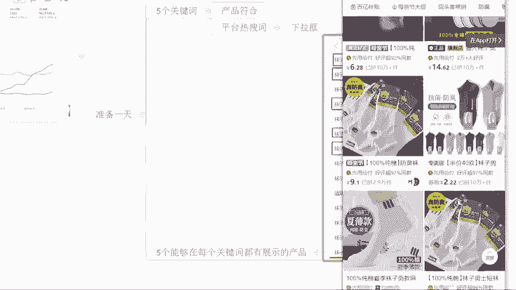
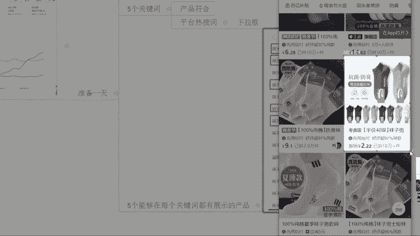
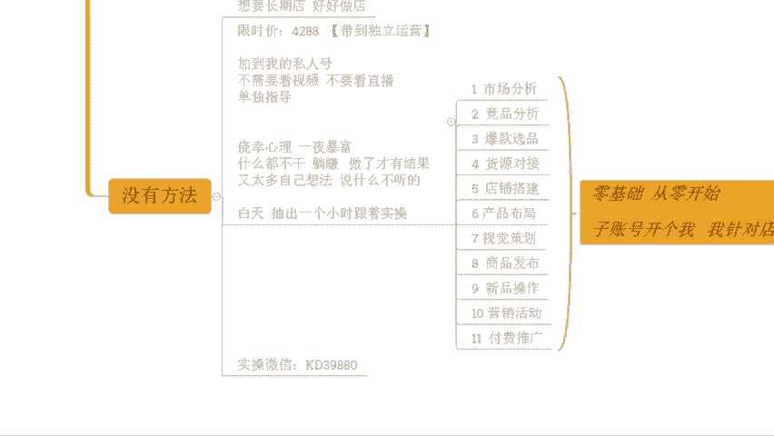

# 【拼多多运营实操教程】最系统的零基础拼多多开店教程全套，电商运营大佬专为学渣研制的新手开店保姆级教程！全程干货，简单粗暴 - P48：48、拼多多开店-新品快速拉升曝光 - -拼多多开店 - BV1BH1qYpEqw

hello hello hello嗯。😊，呃，再下麦啊。😊，然后这边接打了一个一OK的啊，能听到声音吗？姐能听到的话啊，公屏上再给我打一个一，好吧，撤下麦啊。

包括我们其他的在直播间的小伙伴们能够清楚的听到我的声音，能够看到我这边电脑桌面啊。声音各方面如果说都没问题的话，小易走起来。😊，啊，哎，还不错啊还不错啊，都能听到是吧？好，那就行啊。😊，呃。

今天的话还是老规矩啊，正式的分享呢在两点钟开始啊，还有10分钟时间。那我们先一起来等一等那些还在路上的小伙伴们啊。那么另外呢呃先给大家说一下啊，今天要分享的内容呢其实是延续着上一场直播啊。

我们没有讲完的部分继续讲的。那么很多的这个细节的话，其实上一次呢是没有去那么多的时间去分享。所以今天我们把它进尽可能的去再讲一讲啊，能够让他更好的去了解店铺操作啊。

同样的啊这套方法呢还是做自然流的玩法啊，当然呢上一次分享完之后呢，也有很多的这个小伙伴呢跑过来跟我讲，哎，说这个不对劲啊，为什么说我店铺就做不出来自然牛呢？对吧甚至说我店铺呢我去做了这个付费推广啊。

他都拿不到曝光啊啊，都有这种情况的，对不对呃？你们今天在直播间的小伙伴们有没有这种情况呢？就是你有在做推广，但是呢你的推广的你个发现拿不到曝光有没有？如果有的话啊，公屏上打一个有字，好不好？我看一下啊。

那其实店铺操作呢有很多的这种小伙伴呢会陷入到一些这个错误的认知里面去啊。那也有可能小伙伴会说，哎，我自己有在做这个呃店铺啊，但是呢我店铺呢操作的时候呢，我发现一个问题就是我没有自然流。那我去做自然流呢。

我做不出来。而且我去呃操作的时候呢，我哪怕去做付费，我可能都烧不出去曝光啊，就是这种情况。其实这个呢也是一个呃很多小伙伴呢在做店铺的时候呢的一个通病啊。

因为你可能根本就没有去很好的了解平台的一些推荐机制跟这个算法啊，所以呢今天我们还是会针对到这些细节部分呢，先帮大家梳理清楚，然后再去讲具体的一个操作哈，对不对这个你大家不用担心的。而自然流的话。

其实在拼多多一直存在。只不过呢拼多多它没有单独的这样的一个数据展示。他不会告诉你对吧？你具体有多少的搜索数据，有多少的首页数据啊，然后呢，你只能看到的是付费投放的一个数据，对不对？

那我们可以去把整个除了付费之外的数据呢全部归纳为自然流，但是自然流具体哪个端口我们不知道啊，但是没关系，那我们把所有的端口都归纳为自然流就可以了。那怎么去把他们放大，这个才是关键，对不对？

那到底怎么放大呢？O的，今天我会详细分享啊，在分享之前呢还是老规矩啊，先给大家看一看，近期跟着一起实操小伙伴，他们的店铺数据好吧？免得你们说哎这个自然流真的有吗？对吧？不确定啊，不现实，好像啊，来。

各位有看到这个店铺的话，公屏上打个一好不好？来好吧？目前有在直播间的小伙伴有看到这个店铺的话，公屏打个一啊，这个店铺呢自然流操作的啊，自然流操作的，最早的话只有几百个访客100不到的访客啊，对不对？

可以看到啊，其实整个成长的话是非常快速的啊，直接就上来的那。操作自然流的核心，我告诉大家是什么。然后你们后期的话可以对症下药啊，什么地方是核心呢？重点就在于说我们怎么样去把我们的流量啊能够更好的去转化。

看到没有？这个店铺呢转化率呢14。63，对不对？有到更好的转化之后呢，我们整个的呃这个产出会更高一点。我们的客单价稳定的情况之下呢，我们整个的产出。会更多。那么在同类型商品里面来进行对比的话。

我们的UV价值也好，我们整个商品的呃点击反馈也好，都会更好。所以它就可以帮助我们去放大我们的数据啊。而除了有基础店铺之外，其实临访客店铺一样的，看到没有？临访客店铺也是通过这样的方式去做着留起来的啊。

不管是什么样的一个产品，其实自然流一直存在的，重点就看我们怎么去操作好吧，OK啊呃具体的玩法的话，一会儿会跟大家详细分享。那么现在呢还是老规矩啊，先给大家啊这个讲一讲直播间的一些这个要求啊。

那么什么要求呢？首先第一个啊，针对到整个直播的话，我希望呢大家能够做到一个事情，就是积极互动，好不好？为什么这样说呢？因为我在整个分享过程中的话，我不确定你们具体的一个情况，对不对？

我不知道你们是不是能够听明白听懂我讲的东西，那如果说对吧？你不告诉我，哎，你们不吭声的，不跟我讲，哎，我是不知道的对吧？那我只能以为你懂了，但是我以为你懂了的情况之下呢，你根本就没有懂。

那么这个时候呢就会导致后期整个店铺操作呢，我分享这些内容呢，你可能是没法法吸收的啊，所以这个点的话，大家注意一下，如果说ok没问题啊，能够明白的话啊，愿意去配合着积极互动的话，可以扣个一，好不好？

同时呢还有一点呢就是我在整个分享过程中呢，也会经常性的。给大家提问对吧？那么这些问题呢也是针对到我们店铺操作的问题。你们很多小伙伴可能说对于店铺操作呢是没有思路的对吧？比较迷茫的哎，没关系。

那跟着我提出的问题去思考，这样的话你整个的吸收理解呢也会更加的容易一点，好吧？OK这是第一个点啊。然后还有第二个点呢，就是在整个直播过程中呢，是允许大家提问的。如果说你有那。哪里不清楚，你可以直接说。

但是这些问题的话仅限啊当前内容相关的问题。好不好？这个点大家注意一下啊，因为你们很多小伙伴可能都会有到各种各样的问题，这个我清楚的，毕竟嘛对吧？你们每个人的情况不一样，每个人的基础不一样。

每个人当前的店铺情况也不一样。所以你们肯定会有自己的问题，这个我可以理解啊，但是呢在直播中的话啊，大家尽可能的呢提问的话，就围绕着分享的内容相关的问题来提问。如果是跟当前分享内容不相关的问题呢。

大家可以等到我下播之后单独问我，或者是等我正式内容分享完之后再问我啊，因为这样的话可以保证我们整个内容呢，它的一个连贯性，有很多的小伙伴呢可能是比较基础的，就像我们今天直播间里面肯定也有这种小伙伴啊。

就是完全零基础的，还没有做店的，对吧？都没操作过的零基础的这种小伙伴啊。来如果说啊有这种的小伙伴啊，你是零基础的，公屏打一个零好不好？来我看一下好吧。那么呃像这种啊完全零基础小伙伴的话。

如果说我们在直播过程中对不对？东一个问题，西一个问题，东一榔头西一棒槌的对吧？OK他们肯定是没办法吸收理解的，好不好？所以呢为了大家能够更好的吸收OK了那问题呢我们呃尽量的集中在我们的分享的内容里面来。

同时呢整个的呃过程的话，跟着我的问题去思考，好不好？OK这是两个点啊，然后还有到最最重要的一个点。这个点我单独说了啊，什么东西呢？其实店铺操作呢在我这里啊，我说实话方法不少的。有听过我视频。

有看过我直播的小伙伴们，对吧？真真切切觉得西楼有点东西的对吧？西楼这个人有货的对吧？哎，还不错。有这种感受的小伙伴呢，公屏上可以打一个6好不好？啊？我来我来看一看啊，大家的一个状态。

那么针对到我分享的东西，我可以很负责任的告诉大家，很多时候你们在别的地方你去花钱，你都听不到的。这个我可以这样说，啊？很负责任的告诉大家，对吧？毕竟真正在做店的，有本事的人对吧？这个东西就是不一样的。

是不是那。即使是这样，很多小伙伴呢也只是在听，在看，在观望，对吧？但是我告诉大家，再好的店铺数据你不去做。是不行的。对吧数据是做出来的。所以说如果今天我分享的内容确实是你店铺目前所欠缺的。

是你自己目前所欠缺的OK的，一定要去实操。要去落地，不然的话再好的方式你听完就忘没有意义的。好吧？像我给大家看到这些店铺啊一样的。他不是说看我视频，听我直播就行了，而是干嘛呢？

而是真真切切的按照我讲的方式一步一步去落地执行去操作的对吧？人家可以从最少几百个房客干到几千个访客。对不对？一天一起200多单怎么来的？听直播看视频看出来的，不是的，是做出来的，好不好？OK啊呃。

多的废话我就不多说了，时间已经到了啊。来这边最后我再确认一次啊，所有的小伙伴们目前有在认真听我分享，听我直播的。那么。😊，能够准备好的啊，公屏上扣个一，我们开始今天的分享了啊，时间已经到了啊。

来来来来来，工作快啊。好，OK啊，还不错还不错啊还不错。好，那呃我直接开始喽。上一次呢呃如果说有在直播间听我直播分享的呢，应该还记得，对不对？我们讲了新品操作啊这个。😊，啊，新品操作对不对？

我们说新品操作呢不是说只是去做做销量，做做评价就可以的。甚至说我们前期的重点呢并不是做销量做评价，而是干嘛呢？而是做我们的产品人气。对吧那这两天就有很多人问我了，哎，就是这个戏楼到底什么是人气啊？哎。

这个做店铺的话。😡，我要不要去冲成绩啊，对吧？我要不要改销量啊，那我这个评价跟销量到底应该怎么去做呀，对吧？问了很多这样的问题，各位对类似这种问题啊，有兴趣的，或者是有疑惑的，公屏上打个一。

今天我们就来把这些问题先重点梳理一下，梳理清楚之后呢，我们来讲一讲如何快速拉伸我们新品曝光。好吧？来动么快。OK的啊OK的啊。那么呃这两天的话就很多很多人这样问我的。

真的这个问题其实我上一次分享的时候应该还算是分享的比较比较这个详细的啊。但是可能嗯怎么说呢？呃，有部分小伙伴确实基础会比较薄弱一点，对吧？会存在说呃没有吸收到，没有理解透彻啊，这种情况啊。

确实存在啊这个不排除啊，那今天我们重点呢首先说一说这个事情，首先到底什么是人气啊，这个我们先搞清楚，那对于我们店铺操作来说，我想要去做爆款，对吧？我想要去做款，我想要去做我的这个销量，我想要去卖货啊。

我想要去什么赚钱。是不是这是我们的根本目的，对吧？OK重点不着急啊，那么在整个的操作过程中就会涉及到一个问题，我想要卖货，我想要赚钱，我就必须前提条件是能够获取到访客，对吧？各位。来这个逻辑没问题的话。

思路能跟上的话，公屏扣个一。啊，动动作快啊，那这个访客这个部分呢，却并不是说我去想当然的去把它做出来了，对不对？我想要去有访客呢，我就必须有排名啊，对吧？我们做店铺就这样子的呀。

我要根本性的去解决问题的话，就要找到这所有的核心点的问题的关键。那么我要去卖货，我就要有访客，我想要有访客，我必须有排名，排名怎么来的？排名不是说我上架一个产品就有的，对吧？哎，排名是平台。

根据我们商品的权重对吧？进行计算的，然后进行推荐的，对不对？那么这里呢可能有小伙朋友说了，哎。西罗，你说这个真的是哎呦，跟听天数一样的，到底什么是权重啊，对吧？这个排名怎么算的呀，搞不懂对吧？没关系。

那我们现在来掰开来揉碎了，来说一说这个事情，好吧，对于平台来说，他想要进行产品的推荐，想要进行产品的排序，他一定是有自己的算法的。不可能说是看看这个心情吧，对吧？呃我今天心情好，把你放前面去看一下。

对吧？我今天心情不好，把你撸下来对吧？不会的啊，一定是有自己的算法的那怎么去计算？😡，这个是关键。各位。如果说对于产品排名的算法不清楚的小伙伴，想要了解的小伙伴，公屏上现在打一个问号，好不好？

我来看一看。因为这个问题是一个相对来说比较基础的点啊，这个问题比较基础啊，如果说都清楚啊，那么这个地方我就直接跳过的。如果说确实有很多小伙伴不知道想了解的话，okK的，那我就讲一讲好不好。嗯，啊。

坚定不移打那个一是是什什么什么情况，是是想了解吗？是吧？想知道的啊不清楚，想要知道的打问号啊，打问号好吧。嗯。你们你们这个打一打习惯了，是不是？😡，顺手了是吧？OK了OK了啊，呃，行行行啊。

看到了啊看到了啊。呃，虽然说不是特别的多，但是也不少了啊，但是也不少了。那我把这个问题呢先快速的给大家过一遍啊，让你们能够去对这个概念呢，先能够去有到一个完整的这个。😊，这个认知吧，对不对？

OK首先呢针对到我们商品的排名算法，它不是说呃刚刚讲了看申情，对不对？而是有明确的规定的，有具体的计算方式的那计算方式怎么计算的呢？OK的，整个的排名呢，它的考核啊，实际上是分为4个大类的啊。

目前来讲的话，官方给到我们的明文规定里面啊，它是有到这样的考核规则的。而考核规则里面呢，我们整个商品进行排序的话，分为4个考核项目啊，哪四个呢？第一个是我们的店铺数据，第二个是我们的商品质量。

第三个是我们的商品数据，然后最后是我们的处罚类啊，这4个。那么这四个里面各位听清楚了，店铺数据呢就是我们所谓的这个3分钟人工回复率呀，对不对？我们的30天投诉率呀，我们的物流服务异常率呀等等这些东西啊。

好不好？这个地方字比较多，我就懒得打了，不去写不去打了，大家能够知道就可以了。那这个部分我之所以不去打它，不是说真的就是因为字多我懒啊，而是因为这一个部分对于我们大多数小伙伴来讲，它不重要。

它为什么不重要呢？因为我们如果说是新店好，我们没有这些数据，它默认是考核达标的啊，它默认是考核达标的。那么而我们的处罚类也是一样的，你店铺如果说没有违规，没有这个被降权okK那么你的产品是正常曝光的啊。

店铺数据跟处罚类呢，这两个板块呢，你如果说达标啊。他是正常曝光。如果说你不达标。他是什么呢？会限制曝光。各位这句话记一下啊这句话记一下，能够记住的小伙伴啊，现在能够记住能够知道的这个这句话的小伙伴呢。

公屏上扣个一好？动作快。那这一个板块具体它为什么说能够达标是正常曝光，不达标是限制曝光，这个没关系，我给来讲一下啊，画一个图给大家展示一下啊，把这个逻辑给它理清楚。各位现在的话注意练集中啊，看公屏。

这个时候就没有打字了啊，我直接给你们画图，这个图呢我画一遍啊，因为比较繁琐啊，不要浪费时间啊，现在呢我们画一个这个横轴啊，现在我们画一个横轴。那么这个横轴呢，我们把它理解为是我们这一个。😊。

商品的这个呃质量啊商品的质量。基础权重啊基础权重、商品质量啊，在商品质量这个板块里面呢，okK的，我们还会有到往上走的一条轴啊，这一条轴呢我们称之为它是我们的商品数据，好吧，这一条轴是我们的商品数据。

各位没毛病吧啊。横轴竖轴横轴是我们的这个。商品质量啊，这里我打个字吧，免得你们到时候不知道是什么东西啊，这样子啊，然后数轴呢，这边是我们的呃商品数据啊商品数据。OK我放这里吧。好。

那在整个的产品运营过程中，我们产品上架之后啊，我们会有到一个考核点啊，这个考核点呢我们把它放随便放到一个位置好了。比如说呃。我换一个绿色吧啊，我换一个绿色。比如说在这个位置啊。这个原点单能看到吧。

绿色的小圆点的能看到吧？产品发布之后呢，正常来讲，我们产品的曝光是从这个地方开始计算的。这一个小圆点呢往右。啊，往右。是我们正常曝光的一个状态，是我们哎完蛋。哎呦，我还我要重新画一下。

不然你点了一下双击啊。え？操作失误啊操作失误啊，这个没办法啊，对吧？这个没办法来重新来一次啊，横轴啊是什么我就不去解释了，我直接画出来先啊，横轴。然后竖着。呃。

这一趴的话相对来说可能对于新手来讲会比较重要一点。对于一些老运营来说可能会相对来说比较基础。但是没关系啊，也可以帮大家梳理一下啊，这个是我们的商品。质量啊这个是我们的商品数据。然后呢。

这里是我们的原点啊，这里是我们的原点。好，O。那么在我们的这个右侧这边呢，是数据增长的一个状态啊，是我们的这个呃店铺数据达标啊，然后呢左侧这边呢是我们的不达标。啊，不达标。然后整个的操作的话啊。

往右数据是正数啊，往左是负数，各位没问题吧，来，这个地方没问题呢，公屏上打个一啊，动作快，这个地方我确认一下。这里呢是数字相当于零啊，曝光是零的状态啊，这个原点，然后往往右侧呢数据达标它是会一个正数啊。

往左呢是一个负数，是会减的，是不这个呃扣我们曝光数据的啊，那整个的店铺推广呢，在我们上架产品之后呢，在这个过程中，对不对？在类似这样的一个情况之下的话，我们的商品呢如果说能够拿到最大的曝光数据呢。

其实就是这个样子的啊，来给它画一下一个框子啊，一个框子。这个框子呢，我们用一个黄色吧，好不好？来用一个黄色来画一下啊来。它最多的曝光范围呢就是这个样子的对吧？😡，从原点开始往右。

然后呢从原点开始往上最大的一个范围。那么网上的东西呢是我们的商品数据，对不对？我们如果是新品好，我们是没有商品数据的，那么我们是不可能往上走的，对不对？而往右的话是我们的商品质量。

商品质量呢是我们产品的这个标题，产品的这个价格，产品的属性，产品的图片等等这些东西。这些上架之后呢，产这个系统呢就会进行考核。如果考核我们产品呢是有新品标的，是一个潜力曝款商品价格呢也非常合理。

OK那么这个东西呢它就会往右啊，很大的一个部分，对不对啊，它就会往右走。如果说你这些东西都不达标，它就可能就会很小的一部分，对不对？这就是为什么说我们产品上架之后会有到曝光的差异的原因。

但是今天如果说我的所有的这个商品的质量都是达标的那我是能够拿到最宽的一个状态啊，我的流量宽度是最大的那在后期运营的时候呢，我商品的点击转化，我的收藏。啊，客单价、优惠价值、坑产啊等等啊。

都能够做的很优秀的话，那么它就会往上走，一步步往上走，对不对？到最后呢是这么一个状态。但是。这个是我们店铺数据达标的状态。如果说店铺数据不达标呢，okK那么这里的这个起点啊，这个原点。这个左下角这个点。

它就不是在我们绿色小圆点的部分开始的，它是从左侧开始的，它们往左侧移动。各位能懂吧？比如说我店铺呢我的这个3分钟人工回回复回复率啊不达标好，我往左侧一亿节，对不对？然后再下一次呢。

哎我的这个呃店铺的物流服务啊不达标，它会再往左侧一亿节。我店铺还有30天的投诉率比较差劲，对不对？还它又会往左侧一亿截。那么这个左侧部分啊，注意左侧部分这里啊，我给大呃再画一下左侧的这个部分啊。

这个部分实际上就是被我们正常曝光的时候呢，扣除掉的部分，我实际曝光呢只会剩下蓝色这呃等一下，我把它点变成红色啊，然后我的实际曝光数据呢只会剩下蓝色这一部分，所以我从最早的黄色这个框子啊。

在这个位置的时候的这样的一个状态，对不对？变成了蓝色部分这个样子状态就损失掉了很大一部分。各位整个的逻辑现在能够看懂的公屏打一。😊，这是我们产品的曝光啊，算法啊算法。那么在整个这个过程中，兄弟们。

既然说这个部分大家能看懂的话，我觉得OK的啊。那就后面操作就很容易了啊。那这个时候呢我们整个商品店铺数据处罚类，它能够正常的去保证不被降权，不被扣分，不被屏蔽曝光就可以了。我们只需要维持正常数据就行。

那么新店我们是默认达标的，所以所以不用管它。如果是老店铺的话，我们正常日常维护好就可以了，对不对？而重点能够影响到我们产品曝光的是什么？是我们的商品质量，还有我们的商品数据。

各位来这一点大家认可的都没有任何疑问的啊，都能够听明白，听懂的，公屏上把我们的商品质量和商品数据打出来，好不好啊，把商品质量和商品数据打出来。啊把这两个词打在公屏上啊，大家记一下啊，这两个是重点啊。

兄弟们啊这两个是重点啊，不要懒啊不要偷懒啊，把字给我打出来啊，好不好？不要给我偷懒啊啊，这个诸法无常啊，还有这一个奋斗啊，扣了个一啊，对，不要偷懒啊，把这两个字给我啊，这两个词啊，不是这两个字啊。

把这两个词给我打出来啊，好不好，把这个词给我打出来，哎，不错啊，守证啊还可以的啊，还可以的啊。😡，记一下，认真的去记一下啊，认真的去记一下这个东西真的很重要啊，这个东西真的很重要啊。那么商品质量部分呢。

它刚刚我也提到过，对不对？产品上架之后呢，是能够去进行系统考核，给到我们正常进行的一个流量宽度的拓展，对吧？这个是我们流量宽度的拓展啊，那么流量宽度拓展呢进行考核之后，我们产品进行正常的系统推荐曝光啊。

这个时候会进行推荐啊，这是第一波推荐。在这个推荐曝光的时候呢，平台会进行商品考核。而这个时候考核部分的话，不是说上来直接考核我们产品的数据。各位，那么这个数据是什么呢？官方告诉我们的这个商品数据啊。

它是我们产品的销量，是我们产品的收藏，是我们产品的这个。呃，转化率对吧？是我们产品的上架时间啊，这是平台给到我们的答案啊。但是真正意义上我们产品在进行考核过程中，商品质量进行第一波考核。考核完成之后。

不是直接考核商品数据的。而是考核我们的商品人气。刚刚你们不是在问吗，哎，人气是什么东西，对吧？来，注意坑注意看啊，人气是什么呢？人气实际上就是我们产品啊，它的一个搜索热度。他的一个点击率。点击量。

各位啊，那什么意思呢？我给大家举个例子啊，大家可能就很明白了，对不对？😡，就好比说我们平时啊呃会去看微博或者是刷抖音。各位，你们都有看微博，都有刷抖音吧。如果有的话，公屏上打一个一好不好？啊。

微博也没刷过，抖音也没刷过的，打一个2啊，我看一看有没有这种人啊，就像我们现在这个这个情况的话，基本上应该每个人微博呀或者是抖音呢应该都有去玩过，都有刷过吧。😡，OK啊，你啊你你居然是。😡。

抖音微博都没用过是吧？OK那这个可能解释起来可能还会比较麻烦一点啊。呃，那我就不用这个微博和抖音来就给大家举例子了啊，我就用这个呃我们讲新闻啊，大家新闻有看过，对吧？新闻有看过吧，肯定有看过，对不对？

那有的新闻呢啊这个就会呃一直以来热度就会很高，对吧？他就会呃特别多人去关注它对吧？这个大家应该知道的那为什么会关注它呢？首先第一个点，这个新闻呢可能和我们的生活息息相关，😊，对吧这个是一方面。

另外一方面呢，这个新闻可能确实它有吸引人眼球的部分。是不是啊他吸引眼球啊，那呃当一则新闻出来之后，或者当一条微博出来之后，或者当一条抖音出来之后，那么这个时候呢都会有它一定的传播范围，对吧？

它的传播范围是有限的嘛。那在这个有限的传播范围里面，如果说有特别多的人会觉得这个东西很重要啊，然后呢对他的关注度。很高，对吧？比如说这个抖音或者微博啊，或者是一个新闻出来之后，哎。

人们都会愿意认真仔细的去观看，看完之后觉得哎这个东西真的很重要。我要分享给我的家人，我要我要分享给我的我的朋友，让他们也知道对不对？这个时候呢他就会出现一个行为，就是浏览啊，然后呢分享啊，形成一个传播。

对吧？各位没毛病吧，这个这个没毛病吧。😡，那么在这个过程中，我们的产品上架之后，其实我们也可以把它理解为一样的一个道理，对不对？当我们产品上架之后呢，我们产品发布之后。

平台针对到我们的商品进行一个商品质量的考核，完成产品的推荐曝光。而这个推荐曝光呢，也是在有限的范围里面。那么在这个范围里面呢，如果说有很多的人愿意去点击这个产品。对吧然后呢愿意去啊观看它，浏览它。

对不对，甚至购买它。对吧那这个产品呢，平台也会认为它是一个优秀的产品。是不是？但是啊因为这个产品呢是一个新品，是刚上架的一个产品，所以购买的一个比例一定会很少。因为它本身没有销量，没有评价。

所以说平台在进行这一部分商品的考核的时候呢，会重点考核它的人气。也是我们讲它的搜索热度，它的点击率，它的点击量，也就跟我们这个新闻一样的，出来之后呢，有多少人愿意去认真的去阅读它，观看它。

并且愿意分享它，知道吧？于是乎呢这种啊能够有到更高点击更高的搜索热度的产品呢，平台就会判定他的用户。喜爱度。更高。啊。重点啊终点，现在谁还刷单呢？我的天刷单违法，兄弟啊，对吧？

我们可以针对数据分析去做一些基础销量和评价的维护，做一些补单，但是不要去刷单啊，这个我只能这样点到为止啊，懂的都懂啊，我就不去再深究了啊，那整个的过程的话啊，那销量和评价的考核有没有有啊，有啊。

它不是不考核，但是考核占比会很少啊，尤其是什么，尤其是在我们前期的时候，考核占比会很少，考核占比大概多少呢？啊。又上升了吗？现在都违法大哥电商法了解一下啊，电商法了解一下啊，我只能这样说了啊。

来考核占比多少呢？首先人气的权重啊。😊，60%占比。啊，其次才是我们的销量群重啊。40%。啊，其次才是我们消售群种40%。而人气里面呢重点的数据刚刚提到过的三个，对不对？搜索热度。啊，点击量。点击率。

好吧，三个，而我们的销量里面有多少的东西呢？来给大家看一下啊，首先成交额。😡，啊，再就是转化率。啊啊转化率啊。但是我们的这个UV价值。啊，客单价。对不对？啊，包括我们的这个呃同比增长率。啊，等等，对吧？

它其实非常非常多的内容。那如果我们去做销量，做评价，对吧？我们去做这个销这个销售额，它其实只是40%占比里面的某一个很小的部分。它针对到整个产品的权重影响的话，微乎其微。你哪怕把所有的这些东西都做完了。

你只能拿到40%的权重考核。而人气呢。60%。所以前期哪怕一个产品只做了人气和一个产品只做销量的话，一定是做人气这个产品，它的产品权重更高。各位能够明白，能够理解的话，公屏打一。OK啊，能理解就行啊。

O那人气我们刚刚讲到了说谁做的。😡，做考核的是候我们的点击率跟点击量嘛，还有我们收入热度嘛，对不对？那这个东西怎么去做操作其实不难啊，还是比较简单的啊。我给大家说一下啊，给大家说一下。

那么我们的产品正常去发布的话，一定会有到点击量和点击率，甚至会有到呃这个转化，对不对？但是前期我们产品在上传之后呢，平台针对到我们商品进行曝光的时候，他给到我们的是什么不是访客而是曝光，对吧？

那么这个曝光给我们之后呢，如果说有人觉得我的产品还不错，他看到我产品之后，对我产品感兴趣，他会点击。对吧会进行点击这个动作。那么。😡，这个点击量这个曝光量，包括说我们的点击率对吧？点击之后呢。

它这里会形成曝这个点击率嘛，对不对啊，曝光产生点击，然后形成点击率对吧？那么这些数据呢，其实我最终只能看到访客。对吧我只能看到访客，而实际上我的曝光多少，我的点击率多少，我是不知道的。各位理解吧？

那这个部分如果说我看不到，那怎么办？我怎么去优化提高它？OK首先在我们产品上架的时候呢，前期一定是要做好我们图片的策划的，对不对？图片策划呢能够保证我们的产品呢在正常曝光之后。

相对来说可以有到更加好或者更加稳定的点击。但是这个也是不确定的。那么我们通过什么方式去确定一下呢？好。找人搜索点击。哦。啊，早就收点击啊，这样子吧啊，懒得就打了。那在这个过程中。

比如说一开始呢我产品呢只有。10个访客啊，一开始我产品只有10个访客，我的曝光多少，我不知道我的点击率多少，我不知道啊。我们现在做一个假设，假设我的点击率呢是10%，好不好？假设我的点击率是10%啊。

听清楚没有？现在呢假设我的曝光。多少100个，对不对？😡，没毛病吧？各位这这个能看懂吧？点击量啊，访客10个，点击率10%，所以我的曝光是100个，这个有没有谁不清楚的？😡，有不清楚的打问号啊。

都能够明白都没问题，打一个6。😡，好啊，那看来还不是说真的是那种纯小白，兄弟们啊，还是呃稍微有有那么一丢丢基础啊。好O啊，那就行啊。那在这个过程中，我想要让我的权重更高，怎么办呢？好。

今天我还是原本的这个数据，对不对？我找人去做了一个搜索，做了一个浏览，做了一个点击。好，那这个时候呢我原本的百11个访客呢变成了啊原本的10个访客呢就变成了11个，对不对？

我找了一个人去搜索了我的产品去浏览了我的产品，对吧？原本呢我的访客是10个，现在变成了11个，对不对？那原本呢我产品的这个曝光呢是100个。所以现在会变成多少个，是不是101个呀。😊，是不是101个呀？

那么101个的情况之下呢，我的点击率呢变成了多少嗯。约成多少？各位，有没有谁可以帮我算一下的？😡，原本我的点击率是10%，现在我的点击率变成多少了？😡，反正增加了对吧？反正很干脆，反正增加了啊。

OK应该是百分之呃。😊，10。10。10。9啊10。910。8的样子吧。10。1不会吧，这肯定不会，不会是10。1啊。😡，对，这里肯定不会10。1啊，10点80。9的样子差不多。😡。

9%不可能不可能变少啊，李家啊这里我的点击率不可能变少了，11除以1001以除以100101啊。我我自己算一下吧，真的是啊指望你们感觉到靠不住，一个个的真的是啊。😡，呃，OK。嗯。OK啊，我算算啊。

10。89%啊，10。89%差不多9%了啊啊差不多10。9%了，10。89。😡，看到没有？40。89%啊，兄弟们，这个时候我点击率增加了。😡，没错吧。那么这种情况之下，兄弟们，我想问大家一个问题啊。

我想问大家一个问题，收产品啊，收产品。我想问大家一个问题，那我现在的权重是否增加？和原本来对比的话。Oh。嗯，增加了吗？增加了啊，增加了啊，应该会的吧，把应该去的啊肯定增加了啊。

那么这个时候我的点击率比原本要高啊，我的点击率比原来要多。那我的系统考核过程中，一定在平台方面会觉得我。整体的数据会更好，好不？而这个数据我说一下重点优先考核的。点击率啊点击率。啊，点击率啊相同。

点击量。越大分重越高啊，反过来也一样的啊，点击量相同。点击率越高，权重越高。好吧，我俩一样的那操作的时候呢，我们去做的时候，至于做多少，这个没有固定的啊，这个没有固定的。不同产品不同品类都不一样的啊。

反正你尽可能做的多一点啊，你们可以看到像我这个呃戴时超的这个店铺来。啊，来来来来来，你们可以看到啊，你们可以看到啊，哇，你们这个你们你们这个操作方式我告诉你啊，肯定不行的啊，肯定不行的。

因为还有考虑到人群这些板块啊，来来来来来，有看到这组数据的小伙伴公屏扣1。😡，有看到这组数据的小伙伴公屏扣一，这是一个从零起来的一个纯新店啊。你们做店铺，有的时候为什么说做不起来？

为什么说店铺操作一直以来没有反客，没有曝光？其实很多时候呢，就是因为你们自己不会操作，你知道吧？你们上架之后呢，就想着去哎，赶紧把评价做出来，对不对？赶紧把销量做出来，哎，我去改个销量吧。哎。

我去这个啊头两个这个车子对吧？做个付费吧，你们可以看到这个店铺占留。😡，啊，这个店铺自然留啊，感觉你这访客不要钱，自然留店铺啊，看到没有？这里啊上来之后这一天啊这一天是上架第一天。

这一天是没有其他多的多余的动作，多余的操作的啊，上架第二天直接就把访客拉起来。😡，各位看到没有？这个访客数据，我也跟大家实话实说，不是付费推广的，也不是店铺系统给我们的真实数据。啊。

也不是店铺给到我们的真实数据啊，而是什么呢？而是我们整个商品。自己操作的访客啊。店铺不是实时数据吗？啊，刚刚这个刚刚这个不是啊刚刚这个不是刚刚这个是啊这个操作这个玩法的案例截图啊，好吧，因为店铺的话。

这边我一般是不会在呃这个公屏上去给大家展示啊这个实时的一些操作东西的。为什么这样说呢？呃，之前就遇到过啊，就是店铺的名字露出来了啊，然后有人呢就去到店铺里面恶搞啊，所以我现在比较谨慎一点啊。

一般的话像你们呃看我店铺的话，我都是给你们看具体数据就好了啊啊这样子的那整个的操作的话，我们自己操作操作的时候呢，起码前三天我要做好这个事情的。😊，啊，起码前三天我知道做的事情，而整个这个数据呢。

我做一个降蓄的操作啊，降蓄。操作啊。对于操作好吧，那么这个是我们在前期做的一个事情，做了干他做这个目的干嘛呢？来拉伸我们产品的人体权重，好不好？呃，有这份呃有啊有啊，这个是真有的。但是呢呃这些东西的话。

一般是不外传的啊，一般不外传的啊，你们你如果说有兴趣小伙伴的话，也可以到时候直接微信找我啊，好吧？呃，反正这个东西怎么说呢？自己去用就可以了，你们也不要外存就好了，好不好？😡。

okK啊呃直接接着往下啊接着往下。那整个这个过程呢，我刚也提到过，对不对？我说你们很多小伙伴呢自己做店铺的时候呢会容易。😡，出现一个问题，就是乱操作啊，你在没有搞懂这些算法的时候乱操作，对吧？

哪怕你们今天我讲真的啊，我把这个操作方式给你们讲了，可能你们大多数小伙伴自己去做的时候也做不好，为什么呢？就像我刚刚说的这些数据的话，实际上是要结合到我们产品的实际情况，我们不同的品类。

我们不同的一个产品关键词，我们不同的一个价格去做的啊，它是不一样的。所以这个时候呢我们在做的时候呢，如果说你只是盲目操作的话，也有可能多半是一个无用功啊，所以我这里给你打个微方针啊。

我这个人呢就比较实在，我也不会跟你们说，一定用这个方法用这个方法会怎么怎么好，对吧？你要是不懂操作。说实话，你天听就过去，你认真的思考一下，把逻辑搞懂之后，你再去做，不要乱操作，好不好？

兄弟们乱操作的话，你店铺肯定起不来的，对不对？我见过很多人自己是吧？今天听到这个方法，哎，好像还不错。😡，啊，然后明天听到另外一个梦，哎，这个也好。😡，然后今天这个事一是明天那个玩一玩。

到最后呢钱钱花掉去了，店铺店铺死掉了啊，所以这点的话大家注意一下啊。而整个的操作在我们刚刚讲这部分的话，人力群众的梳理的话，我相际上大家应该能很清楚，对不对？那我们做的时候，刚刚也提到过。

我做人力群重是一个核心点，但是也不代表说我就不去做销量，不去做评价，对吧？那么他也是要做的，但是在做的时候要讲究方式方法啊，要解决方式方法啊，那整个的方法，整个的操作逻辑。

现在的话我会认真的给大家详细去分享，如果说你哪里没有听清楚，没有听明白的地方，记得第一时间跟我讲啊，因为这个部分的话，非常非常重要。就像我给你们看到这些店铺的话，O的，他们也都有用到这个方式在做啊。

那么这个方法我可以毫无保留的跟你们讲，但是一定要去听明白。清楚听懂你再去做，不要乱操作，好不好？来啊，开始了啊，注意力注意力集中啊，兄弟们公屏上扣个一吧，好不好？注意力集中，公屏上扣个一。

我们现在直接开始啊我们现在直接开始啊。😡，OK那整个的操作呢，前期我们要去打造我们产品的新品的推荐曝光，要去拉伸我们产品权重啊，整个的操作呢听清楚。4天啊4天。啊，4天。那么这4天呢。

其实在我们这一个店铺里面呢，是完全的是体现的淋漓尽致的啊。它前期的这个操作这个阶段的话，完整的是用到了这个方法在做啊，整个操作的话，第一天也就是我们刚刚提到的它的上架商品的这个第一天啊。

这一天我们没有做多余的动作。但是我没有在做准备工作啊，那么这个准备工作是什么呢？来听清楚。准备。一天啊这一天的话啊，各位你们可以去找到自己的老顾客。或者是符合产品购物人群的朋友。亲人。

只要跟你的店铺没有直接资金往来的一些交集的，没有在同一个网络IP下登录过的都可以。能够找到的话，公民扣1。啊，10个人。啊，能够找到的话，公民扣1啊。如果实在找不了，就爱惜喽。哎呀。

我这个人呢就是确实啊这个混的也比较差，对吧？我也不太善于长交际啊，我也没有那么多的亲戚朋友啊，去好麻烦人家啊5个人你得找到去啊，5个人也找到去的，这是这是最极限了啊，这个是最极限了啊啊，10个人啊。

是一个相对比较好的一个状态啊，最极限的一个最低的一个状态，5个人啊，要有的有的啊O那这10个人我们找到之后干嘛呢？听清楚了啊，一说多多都不理我了啊，其实说实话很正常。不管你是做多多也好，还是做别的也好。

我我我知道的其实呃，我们有一句话嘛，对不对？我们我们我们有一句话嘛叫做这个。呃，穷在闹市无人知，对吧？富在富在这个深山有远亲，是不是没没错吧，其实一个道理的，你你真正意义上，你能够把这个东西做起来。

你自己能够去有一个本事了，对吧？你能够在亲戚朋友面前把腰杆挺直了，你不要说说多多不理你，对吧？你说啥他都理你，对不对？你说狗屎是香的，他都要舔一口，是不是？😡，是不是啊？😊，呃，脸皮够厚也可以啊。

没事啊。OK行行行啊，脸皮够厚也可以的啊。行行行，OK那我们整个砍一刀很真实啊。其实其实说实话就这样子的，其实有的时候呃还好了还好了啊，呃，来啊注意力集中啊，现在开始了啊。

这个10个人我们找到之后干嘛呢？听清楚了，这10个人找到之后呢，我们不是说找到完的啊，我们找到之后呢，我们要去确认好我们的5个关键词。😊，啊，五个关键词。那么这五个关键词是什么呢？

这5个关键词是我们一开始去写标题的时候。好嘞。😊，一开始写标题的时候呢，我们标题包含的啊标题包含啊，并且我们整个这5个关键词呢是跟我们的这个产品。啊，要符合的对不对？如果说你标题跟产品不符合。

那肯定也不行的对吧？同时我们这五个关键词呢一定是平台的什么热搜词。啊，一定是平台的热搜词啊，各位来这个词。刚刚讲的这几个条件，几个要求能够明白的话，公屏打一。如果说不清楚哪里不清楚，也可以直接说啊。

这这个5个关键词的一个条件要求都没问题的话，打一。如果说不清楚，直接讲啊。如果说不清楚，直接讲。OK都清楚是不是好，那就行啊那就行。那么。😊，这几个词我们确定下来之后，我们干嘛呢？

就是搜索自己链接关键词嘞呃，搜索自己链接关键词呃，下拉框是可以的啊，下拉框是可以的。但是下拉框词的话，一定是我们的标题包含的啊，一开始你在做啊，一开始你在做这个标题的时候。

你就用到下拉框池去做平台热搜词你就可以把它直接理解为是下拉框池。啊，我们在整个拼多多里面啊，各位我我我打开这一个拼多多的界面吧，好不好？我打开拼多多界面啊，在拼多多里面我们不是搜索关键词嘛，对不对？哎。

我现在去搜索关键词。对吧嗯，袜子吧啊袜子。在这里面不是有下拉框吗？这个下拉框的关键词啊，一定是当前跟我这个产品关键词紧密性比较好的，相关性比较高的。并且市场热搜的。

所以京春客我们直接在这里面去找就可以的啊，然后坚定不移说为啥我送都送不出去，那就只能说是你自己产品有问题喽，或者是你整个的运营模式有问题了。而且还有一个关键点是你能不能把曝光做出来。如果说你曝光都没有。

你说我去送，你送的出去才有鬼，是不是？所以这个点很关键啊，那么坚定不移。如果说你现在是没有曝光的话，现在马上公屏上打一个一，好不好？😡，如果说你是店铺没有访客，没有数据，公民打一啊。😡，鉴定没疑。呃。

明白了，让这个通过10个okK啊，不着急，小明啊，你明明你明白的有点太早了啊，你明白有点太早了啊，这个找到有点什么呢？有点过分了。而你的所以你的所谓的这个理解呢还是比较主观的啊。

还是你自己去臆断的一个比较主观的一个状态啊，这是不对的啊，这是不对的。那我们会用到这些词去搜我们的产品，确实是我们的店铺没问题，但是不是现在啊，但是不是现在什么时候呢？来认真看啊。

现在我们首先准备着这一天呢，我让这10个人干嘛呢？去搜索这5个关键词，搜索这5个关键词的时候呢，我要去找到5个听清楚找到5个啊，能够在。😊，每个关键词都有展现的产品。对，这句话能懂吗？😡，这句话能懂吗？

😡，我现在啊比如说我回到这个拼多里面来啊，我去搜索了袜子男款夏季对不对啊，我是我我我我我我随便标注几个词吧，我随便标注几个词，我给大家举个例子。现在呢我搜索了袜子男款夏季啊，我也搜索了袜子，男。

纯棉100全棉防臭纯棉对吧？我搜索了袜子男防臭袜，袜子男中筒袜子男夏款啊袜袜子男款夏季啊，然后薄款透气。假如说我现在啊去用到了这5个关键词。我用到这5个关键词的时候呢，我去搜索的时候，哎。

来我们来搜一下试试看啊。各位这个过程的话可能会比较麻烦一点啊。然后呢整个的操作呢一定要跟上哦，注意力要集中啊。现在我去搜索了这个袜子男啊，袜子男款夏季，对不对？好，OK来比如说啊打个比方啊。

现在假如这个产品啊，这个产品唉我觉得还不错啊，这个产品呢就是我们的一个呃跟我们款式差不多，价格差不多或者怎么样的一个产品啊。我看一下，这里有了这个产品了。😊，然后呢，下一步呢，我就说了另外一个词。

对不对？哪个词呢？袜子男，纯棉100，全棉防臭。纯棉。好，我们往下去找。哎，刚好呢我又找到它了，看到没有？来这个产品就很很很很很很巧啊，很巧妙啊，刚好又找到它了，对不对？各位没问题吧。

我刚刚搜了两个不同的关键词。哎，我刚刚搜了两个不同的关键词。😊。

来，我把这个词呢我也顺便截图截出来啊，放到这边来啊，这是我刚刚截图的啊，这是第一个词啊，这是第二个词啊。然后我把那个另外一个词找到去啊，我我们再来操作一下啊，我们再来操作一下啊。

袜子男纯棉呃袜子男夏款啊呃。对哎，在这里啊在这里啊，他跑换位置了，还，在这里来，我截个图啊，我截个图。😊，啊，放这后面吧。来，各位这个产品啊，这里啊这两这两个都是同一个产品嘛，对不对？各位能看清楚。

能看明白的公屏扣1。😡，我搜了两个不同的关键词，袜子，男款夏季袜子，男，纯棉100全棉防臭纯棉。然后呢出现了一个产品，这个产品呢是这一个啊半价40双这一个啊，然后呢它两个关键词都能收到。啊。

两个关键词都能收到啊。现在我假如说我去通过这5个关键词都去搜了一遍，然后呢，搜完之后呢，我在整个的浏览的这个界面里面，我能够看到每个词都能够去有到一个展示啊，卡了吗？现在怎么样恢复了吧。

还有完蛋啊完蛋啊，好像信号有点差啊。😊，啊，信号原差。呃，完蛋啊怎么样，现在怎么样？现在怎么样？刚刚这个信号直接就给给给给卡断了啊，给卡断了啊，每次啊到的高潮部分啊，这个东西就会卡一卡的啊，好不好？啊。

这个东西怎么说呢？可能是这个网络啊知道我要报爆大招了，对不对？然后呢，他就要卡一卡啊，折磨一下你们，对吧？搞一搞心态啊，对吧？好事多磨啊，来激动了是吧啊，这个网络它也激动了啊，来，兄弟们刚刚我讲到的。

我通过这两个关键词呢，分别去搜索，然后都找到了一个产品，他们都在这边能展示的啊，那么这个时候我刚刚讲的这个五个关键词，5个都能够找到的产品，就这个逻辑，各位能够明白的话，现在公屏上又走一波动动快。😊。

啊，动作快，六走起来好不好？所有人动起来啊，不要给我偷懒啊，你要是给我偷懒，不打一个六出来的话，等一会儿你说哎，西楼，我刚刚这个没有听懂，你再跟我讲一讲。😡，抱歉啊，你没有在公屏上让我看到你的话。

你单独找我，我也不鸟你的是吧？就这么任性啊，就这么这个呃高冷啊啊，刚刚有个小伙伴就说，哎，起了，那找不到自己的产品呢？😡，哥们儿，这里还不到找我们自己产品呢，我们在看同行看竞品啊。

那这些产品5个产品是谁呢？这5个产品听清楚了，它能够被。😡，不同的词收到。一定是啊一定是高权重的。啊，这一点毋庸置疑。另外一点，这个产这些产品啊这些产品能被。这。5个关键词搜索，那么一定和我们的。

产品啊。属于是相这个相似的吧啊，我们也不是说同款的嘛，相似度很高的。对吧因为这关键词跟我的产品是高度符合的嘛。😡，那能够被这些词收到的产品呢，一定都是我的同类型的竞品来的了。尤其这5个词都能收得到。

那就更说明问题了，是不是？所以这一步先给大家确认一下啊，那这些产品找到之后干嘛呢？好，我们去分配到这10个人，让这10个人呢，干嘛呢？来点击浏览这5个产品。😡，这个过程呢是来做标签。啊。

这个过程是来做标签，那么怎么分配的，好不好？看清楚啊，我们举个例子吧，10个人呢呃假如说我们是这个。啊，我来我来编几个名字吧，好不好？小明啊啊啊大名啊大明。大明啊。20啊哦20啊。好吧。

大米二民啊三名啊。3名啊一直到4名、5名、6名、7名、8名、9名、1名好不好？啊？小明啊一直到小名好不好啊，4名啊。视频啊，然后呢，5名啊。我把这个打出来啊，一会儿要用到了，一会儿要用到啊OK呃。

小明就在就在公屏上啊，哈哈哈笑起来了啊。小明啊，你的这些兄弟们也不容易啊，我跟你说。😊，为了理他友们，他们也是这个费尽心思啊，新民啊齐民。还有8名啊。你这师兄弟啊做电商都是一把好手，对不对？

天天干干这些苦逼的差事啊啊，九明九打错事啊，九明。啊，九瓶大家打人救命啊。救明，还有小明啊。好，小明啊，10个人啊，兄弟们，这10个人都是我找的这个朋友啊，我的这个亲戚啊，我的伙伴对吧？

那这10个人找外来干嘛呢？好，看清楚了，5个关键词呢，我们还还是卡吗？还是卡吗？😡，各位呃，不卡的打一个不卡啊，不卡的打一个不卡，好不好？😡，不卡的话，打一个不卡啊，如果卡的小伙伴的话，公屏上呃。

也跟我说一下啊，好不好？偶尔会卡是吧？呃，还好，你如果说还是能够比较流畅的话，我们就正常进行。如果说是确实已经没有办法接受了，没有办法去正常进行的话，你们也跟我讲啊，我可以暂停一下。

或者是你们哪里没听清楚呢，跟我说，我再单独给你们讲解都没问题的好不好啊，因为确实这个内容比较重要。我希望今天能够把它讲完啊，O啊，能听清楚就行啊，好不好？然后呢，偶尔如果说有卡到没有听到的部分呢。

你们直接跟我说啊，我可以给你们讲一下都没关系的啊，O现在呢我们回过头来，我们这10个人呢，我们知道是谁了，对不对？大名到小名啊，然后呢5个关键词分别是谁呢？哎，哇子。😊，男款。啊，袜子男款夏季对吧？

这是我们的关键词。第一个关键词。然后呢，还有我们的袜子。男啊纯棉。100。全棉啊，我这里把这个字打出来，免得你们到时候搞不懂啊，防臭。纯棉。还有袜子，男。黄臭化。还有我们的袜子男。呃，还有啥呢？啊。

袜子啊男款啊。男款中筒。啊，还有我们的这个袜子。男款夏季薄款。后继啊OK。这是5个关键词啊，好吧，这是5个关键词。那现在呢我们整个的这些小伙伴的话啊，我们找过来之后呢。

我们让这些人呢分别去浏览啊搜索某一个关键词，然后浏览某一个产品，对不对？这些产品的话啊，我们就呃随便随便举例子，随便写一下啊，产品啊竞品吧，我们写个竞品吧，竞品。啊，几点不确定啊，看你们的一个效率啊。

竞品2。好不，竞品3。精品4。近清福。OK来各位。😊，这些竞品代表什么含义？不用我解释的话，公屏声打一个一。啊，至些竞品一精品2、精品3精品四精品5都能够理解的话，不用我解释的话，打一个一。😡。

都能够理解这个是什么东西，代表什么行业的话，打个一都能快。😡，是我卡了吗？你们这个呃OK啊，现在出来了，你们这个回复速度有点慢啊，我还以为我又卡了啊，给我吓一跳啊。呃，有没有谁不理解的。

不理解的也可以说啊，有不理解的直接说我解释一下就可以的，没问题，好不？都理解没问题，我们就直接往下一步了。😡，对啊，类似的产品啊，就我们刚刚找的这些产品嘛，对不对？比如说我刚不是搜了一个呃关键词嘛？

这两个关键词我们看唉这里那这个产品呢我就记录一下呃，我把它截个图啊，我把它截一个图放到一边去，哎，我知道它是竞品，它是我的竞品啊，它是竞品一啊，比如说这一个产品呢，我也能够通过5个词都能看得到。哎。

我把它记录一下，把它截个图放一边上，哎，它是竞品2好不好？我把它记录一下就好了啊，把它记录一下。那么做完这个动作之后呢？好，我接着往下干嘛呢？我去用到这个呃不同的人去搜索不同的关键词去浏览不同的产品啊。

比如说呃10个人过来准备这一天呢，我让小明啊，我我让这个大名和二名呢，我们去搜索了关键词，唉，袜子男款夏季啊，我让这个大名搜了这个词啊，我让二明呢去搜了。另外一个关键词啊呃袜子男纯棉100。

或者是我用这个呃。这个这个这个啊用就用这个吧，用这个啊，这样子啊好一点。好，然后这个时候呢大名呢搜索这个袜子男啊，袜子男款夏季的时候呢，他去浏览的呢是这一个产品啊，精品一好不好？精品一啊。

他浏览的这个产品好不好？来，然后呢，二名呢搜索了袜子男纯棉100全棉啊，打错字啊，不好意思啊，全棉啊。防臭纯棉，他去浏奶呢是我们的精品2。啊，安装量精品2啊，以此类推啊以此类推，好不？一审哎。

等一下等一下，这两个人啊浏览都是我们这同一个词啊，搞错搞错啊。😡，等一下，我把这个先复制过来。他们每两个人浏览的关系是一样的啊，然后这里啊这里。他们两浏的是一个词才对啊来。没问题吧。

大名22年浏览相同的关键词，搜索相同的关键词，分别浏览的呢是竞品一和竞品2。来整个这个动作没问题能够看懂的小六走起来啊，公屏上打一个6。好吧，这一步到目前为止啊这一步到目前为止都没问题的。

一人浏览一个一人浏览一个啊，一人浏览一个啊。好，okK那大名呢浏览的是竞品一二名呢浏览竞品2啊。然后接着呢三名呢和4名，他们搜索的呢是袜子男纯棉100全棉防臭纯棉，他们浏览的呢。分别是竞品二和竞品3。

啊，分别浏览是竞品二和竞品三啊，再往下以此类推啊，以此类推。然后呢，再是我们的这个呃袜子男防臭袜，对不对？哎，他们这两个关键词呢，这个关键词就是5跟六去浏览的了啊，然后呢。

这里浏览的是竞品三以及竞品四啊，以此类推，我们把它给排列下来，做好记录啊，然后安排好就可以了啊，再往下这边是我们的什么中筒。啊一下我把这这两个直接复制过来吧啊，省事一点啊。

竞品指的是关键只能收到的这个产品吗？是的是的是的啊，来，我把它放这里先啊。这两个是我们的。来。7和7名跟8名啊分别浏览的是我们的搜索的啊，搜索的是我们的袜子男款中筒，对不对？然后呢。

7名浏览的是精品48名浏览的精品5。啊。呃，所有关联字都能说出来。这些产品啊这些产品我们一开始就去确定过是能搜出来的了。刚刚我不是给你演示过吗，怎么去确定怎么去找嘛，对不对？来回过头来看这边啊。

回过头来看这边对吧？呃，林辉对不对？这边没问题吧。刚刚我们不是去这里搜索一个关键词，哎，我看一看有哪个产品，搜索另外一个关键词，我看看有没有哪个产品也能出现。我们把五个词都去做这样动作啊。

能够去找到是最好的这种找不到，实在找不到，我们就去找权重高的就可以了。啊，OK啊，接着往下啊，这里呢我们的9名精品5小明啊精品一。这一天我们做完这个动作就可以了啊，这一天我们做完这个动作就可以了。

可能有很多小伙伴还不清楚这一部分在干嘛，对不对？有没有人有疑惑的，哎，西佬这个在干嘛，有没有人不清楚的，有不清楚的打问号啊，有不清楚的打问号，动作快，节奏快一点，好不好？兄弟们，不然今天我们讲不完的啊。

我实话实说，就按照你们目前这个节奏的话，这个今天我们讲不完啊。你们的这个速度效率要高一点了啊。😡，OK不清楚是吧？好，我直接说了啊，刚刚我讲过的这个操作部分呢其实比较简单的。

首先第一个好处呢就是给我们这些人打上标签，让这些人呢形成一个需求标签啊。Yeah。这是第一步。第二步呢，其实我们整个的操作的话，通过这一个动作的话。

也可以让这些人和这些词以及这些产品都发生直接或者间接的关系，让他们产生关联。所有的。所有的人持产品产生关联。啊，你们可以看一下啊，那呃我们把这个这个图啊稍微放小一点，这个地方啊放小一点来。

我们来看一看啊。😊，呃，产品一和产品二对不对？他们都是被关键词同样的关键词搜入到的。没错吧，他们是被同样的关键是涉到的。首先这一点来说，这两个产品呢，它们之间是存在竞争关系的。

它们之间是存在着搜索推荐啊重叠的关系的这是第一个点。第二个点，我们的商品二啊竞品2，对不对？通过两个词啊，不同的词去完成的搜索。那么这种情况之下。

实际上我们产品一也会和关键词袜子男纯棉100全棉防臭纯棉产生一个间接的联系。而且这个词实际上也是能够收到我们这个竞品一的。他本身是可以搜得到的啊，但是呢他目前来讲，我们没有去做这个搜索点击论。

它的动作仅此而已。但是他一定是有权用在的。😡，啊，那这些人与人之间根据产品不同，根据词不同，他们也相互发生了关联，对不对啊？一和二啊产品一和产品2，根据关键词一关键词发生关系，对不对？

关键呃这个用户这个我们的大名和二名呢也是和我们的关键词袜子男啊，袜子男款夏季发生了关系的。对吧。😡，这个解释起来可能稍微有点有点绕啊，我给他举个例子，打个比方吧，啊呃，假如说今天。😡，你的孩子。😡。

和你小姨子的孩子对吧？他们两个之间其实也是有血缘关系在的。😡，各位能听懂吗？能听懂吗？虽然说你们之间呢呃产生的这个血缘关系呢，其实是稍微有点远的啊，这个这个儿你的儿子和你的这个小姨子的孩子之间。

血缘关系其实有点远啊，但是他们也有血缘关系啊。那这里呢比如说这个大名和二名呢，他们俩就是我们讲的这个呃这个小姨子的孩子啊呃有可能不远，我的天。😊，喂啊，你这个话说的有点有点东西啊，好不好？有点东西对吧？

呃，让我想起了一部电影，对吧？年轻的小姨子。😊，是不是？😊，是不是？😊，哎呦，我天。😊，哎，没想到啊，这个这个YL啊同道终人啊。😊，是不是。😊，啊，我的天啊，好了好了啊，不开玩笑啊不开玩笑啊，呃。

这个思路收回来啊收路收回来好吧，来，不到这里看啊不到这里看啊，假如说这个大明啊是我们这个自己的儿子啊，对吧？然后呢，二名呢是小姨子家的孩子，对不对？那中间这层血缘关系呢，就是他母亲啊，他们的母亲啊。

之间的这个血缘关系，对不对？可能这里呢是呃我们这一边血缘关系，对吧？看到没有？能能能看懂吧？各位这样解释能懂吧？😊，这样解释能懂吧？来，兄弟们能懂的话，公屏上打个一好不？这样解释能懂的，公屏打个一啊。

它是能够去增加产品与产品之间的相互关联。用户与用户之间的相互关联以及关键词关键词的相互关联的啊，那么他们会存在一个权重叠加的过程，好不好？O啊，能够理解就行啊啊，可能这个稍微解释起来会比较费劲一点。

但是没关系啊，我相信大家能够理解的那做完这个动作之后呢，ok接着进入到我们正式操作第一天。😡，啊，这个正式操作呢指的是在我们自己店铺去操作啊，好不好？这个支式操作呢指的是在我们自己店铺操作里面去啊。

那怎么操作呢？好，接着回过头来，还是这10个人啊，还是这10个人看清楚了呃，大名二名三名到我们的小名的10个人，他们在我们的早上啊第一步。😡，啊，第一步，在我们的早上的时候呢。

这些人呢还是去浏览这些关键词，搜索这些关键词。但是呢这个时候搜索的时候呢，不是去搜索我们的竞争对手了，而是搜索我们自己的产品。好吧，这个时候这些人呢第一步，第二天早上呢先去搜索我们的产品。

那么在这个部分呢，有小伙伴可能就会说了，哎，谢佬，哎呀，这个这个过程中有点问题啊，那万一收不到我的产品呢怎么办？是不是有没有会有这样担心的小伙伴，有的话公屏上打个6好不好？😡，有러公民打个。来。😊。

给他讲一下啊给他讲一下，如果这一部分有这个担心的小伙伴打个6啊。😡，OK啊O啊有啊有。那其实之前呢如果说是你们有听过我分享的关于我们店铺前期上架的一些细节的话，你们都会发现的我自己的产品的话。

在上架的时候呢，实际上我是有去做一些冷门词的对吧？就像这个店铺来就像这个店铺你们觉得它前面去做，我们直接搜大师收热词，能搜到产品吗？也搜不到的，正常来说都收不到的，对不对？那怎么办呢？

我前期去设置好一些冷门词。这个冷门词的话，是我提前去做好的产品关键词，那是我自己在在用的关键词。这个关键词呢，本身几乎没有别人在用，它呢能够去满足系统的抓取。我们产品呢能够有更好的城次排名啊。

那这个时候呢用到这个冷门词呢。可以帮助我们更好的得到展现。但是如果实在是冷门词业无法奏效的话，okK前面呢我们可以先去通过分享的方式进行这个产品的浏览，然后再去通过搜索来做这个事情，好不好？

这点大家记一下啊，那这个操作目的呢，就是为了去给我们的产品。打标签啊打标签啊。那前面这整个这个动作，刚刚我们说到这个准备时间的话啊，我们的用户呢已经有到了需求标签，对不对？

平台会判定呢这些人对于这样的产品有需求，对吧？那么第二天这一个动作的话啊，那我们让这些人来浏览我们产品的话，就是要告诉消费者，有告诉这个平台啊，告诉我们的拼多多有这样需求的人啊。

大明到小明啊10个人有这样的商品的需求的人，对吧？这样的需求的人啊，这10个人啊，他也能够去对我的产品感兴趣，他也会去么对我的产品有需求，于是乎让我的产品也打上一样的需求标签，各位能明白的话，公屏打一。

能民白的话，公民大一。啊，这个应该好理解的啊这个应该好理解的。那么做完这个动作之后，这是我们第一步要做的事情，对不对？接着再往下啊，接着再往下第二步开始了，认真听啊，这一步很关键啊，很细是吧？

很细不重要，重要的是好操作有效果，对吧？来这个心静对不对？存新电哦，纯心电哦，前期用到这个方式去做了，看到没有？其实访客整个提升的话，从第四天开始就开始往上涨的啊，第四天开始就往上涨的。

对不对一直往上爬升啊，但是这个爬升过程中我也讲一下啊，不是说我们只做这个东西就可以了。还有很多的细节其实要去做的啊，那我只能说今天把这个这个操作方式呢，先给你们讲清楚啊，因为时间有限嘛，对不对？

所以大家理解一下啊，接着第一步之后呢是我们的第二步啊，第二步是干嘛的呢？来认真听啊。第二。这10个人通过这10个词再一次去搜索，再一次去搜索啊，搜索的时候呢去浏览对应的同行。等一下啊。

这里我把它啊我我我把这个重新删了吧，重新重重新删了，重新上面复制吧啊。我们找到这些10个人之后呢，哎我们去浏览对应的同行啊，我把这个上面的这个呃后面这个图片删了啊，免得影响我们这个编辑啊。

我把这些删掉去啊来。这是我们浏览完我自己产品之后做的第二步动作啊。第二步。来，各位浏览我们同行啊，浏览同行的时候安排两个人。去做一个操作。怎么操作呢？下单不付款或者下单啊，然后申请退款。没问题吧。

哪两个人呢？来我们直接找到这个呃，我们直接找到这个一啊，我们直接找到一和三喽，好不好？啊，也就是我们的这个呃大名和三名喽，对不对？😊，来。大名跟三名。

我们现在做这个动作去到同行对应的这个同行去做一个浏览完成之后呢，下单不付款或者是下单之后申请退款来。没问题，公民党一。啊，没问题的话，公屏打一。OK记住了啊，这个动作一定要去做做完之后，接着再往下啊。

接着再往下第三步。啊，接着再往下第三步。那么第三步呢，这10个人还是这对应的5个词，就不去浏览我们的同行了啊，而是干嘛呢？而是去浏览我们自己的产品。听清楚了，每间隔一个小时浏览一次。那么整个的操作的话。

我们可以拆分。啊，我们可以把这些人拆分为两组。基数一组。是吧基数一组。然后偶数一组。嗯。啊，什么叫基数一组瑞组呢？我们把这些人呢都作为一个编号，对吧？比如说这个大名呢是一。啊，然后呢二名呢是2好不好？

以此类推嘛，最后呢是十嘛，对吧？1234567八90嘛，对不对？是这样子的啊，好不好？各位能理解的话，公屏打一。那分成两组之后呢，这两组人呢每个小时就这现在比如说是3点钟我找13579去做这个事情。

然后呢呃4点钟的时候，我找24680去做这个事情，做哪个事情呢去浏览我们的产品啊，去浏览我们的产品。各位这个动作是在干嘛？还记得吗？有没有人知道的这个动作我们要干嘛？😡，这个动作我们为什么这么做？

有没有人知道我看看你们的悟型怎么样啊，看看你们有没有在认真听我分享啊。其实这个答案我之前已经告诉过你们的。😡，啊，这个答案我之前告诉过你们的，我为什么要做这个事情？😡，各位做这个事情有什么好处？😡。

对我们有什么帮助？😡，哎呦喂，我的天哪，跟这个关联标签跟这个打标称流量没有一毛钱关系。兄弟们，这个动作是在增加我们产品的搜索热度，还记得搜热度干嘛的吗？嗯，搜索热度干嘛的，还记得吗？嗯。

这边往上翻啊往上翻啊，往上翻在这里啊，搜索热度是干嘛的？搜索又是干嘛的？嗯。😊，搜索热度是增加我们产品的人体权重的，对不对？没错吧，那做这个动作的话，就是为了去做我们的搜索热度啊。

然后正常的去随便的简单浏览就可以了。随便去承担责任就可以了。每个小时一次到了我们这个呃下午晚上的这个6到8点啊，6到8点。啊，6到8点。啊有了80之前在同行下单的没付款的，或者下单退款的两个人。

这两个人呢干嘛呢？到我店铺成交下单。好，各位这个动作是干嘛？😡，来这个动作是干嘛？这动作干嘛？知不知道这个东西干嘛？😡，如果知道的话，把答案发出来啊，不知道的打问号。😡，嗯。这个操作动作啊其实。

逻辑很简单，各位，如果说今天我们的产品一开始去打上了对应商品的需求标签，对不对？平台会对我们的商品呢进行推流，推流的这个流量呢，是和我们目标的这个商品啊，我们的这个竞争对手一样的人群，对不对？

而在这个过程中，如果说在这些店铺下单不付款或者下单退款的人在我们的店铺成交了。那么平台就会判定说哎好像喜欢这些爆款商品的人，更喜欢这一个新品哦。本身新品是有推荐权重加权的，再加上你的转化端口。

又能够去跟我们的这个爆款来做对标。OK的。那么你的推荐权重会更多。而且针对到这些商品进行推荐的时候，那么你的产品也会被优先推荐，能懂吗？你可以去蹭权重啊，你可以称权重。所以整个这个操作的话，各位。

他是严丝合缝的，我能够去把我所需要的前期考核的这些细节点，推荐群众的一个考核项目通通的给我做好。能懂吧？能懂吧？各位我就问你们吧，这个操作到目前为止觉得怎么样啊？这个操作到目前为止觉得怎么样，干不干啊。

干不干？😡，啊，应该很详细了吧。今天这个应该很详细啊讲的很详细啊。那如果说你今天没有认真听的。你说哎楼我没听懂，你再再再过来找我，抱歉，我只能说你自己自己问题了啊，好不好？

那如果说你确实在直播过程中没有听懂的，你直接讲那没关系我以你直接跟你解释的啊，确实很细是不是O的啊可以的那整个的操作的话啊，那在整个这个操作过程中的话，也有很多小伙伴可能说哎楼我听你这么一说。

好像这个东西也很简单啊，对吧？我觉得这个东西很也不是很难，做店铺是不是就这样子，确实做店铺呢，你懂方法，你有操作的话，不难的。但是如果说你不懂方法，没有操作方式的话，O这个就很麻烦好？

你们有很多小伙伴呢自己去做店铺自己去摸索店铺的话，的就像你们刚有多小伙伴？这个怎么合作的呀，或者是这个已经在做店铺能不能去用这个方法啊，O的啊多小伙伴也会想着去做啊，可以做。😊。

做你如果说已经在做了可以做。但是我说一下，你得先把这个方法吃透它。😡，啊，很多时候你们自己做店铺啊，全靠什么呢？自己在那里瞎琢磨。😡，是吧然后呢，每天呢就在你这里东打一耙西打一耙。😡，啊。

是吧你们很多消伙伴就呢。哎。这还这还这还打不出来啊。😡，是吧很多时候你们就这样东打一把西打一把。今天我听到这个方式好像还不错哟。哎，我去我去玩一下啊，明天我听到另外一个方式好像还不错哟，我又去玩一下啊。

哎，不对啊，这个字怎么打不出来呀？在哪里啊，是不是我翻过了？😡，啊，这是你啊好吧，然后呢，整个操作呢就会很混乱，对不对？本身因为什么呢？因为你自己呢没有方法，对吧？同时呢你还没有经验。😡。

然后你自己操作的时程可能也没有资源，对不对？就像刚刚这个接在问啊，哎，这个人找不到怎么办呢？哎，我没有这个人怎么办呢？OK的那这种时候你做内部呢，就这样子的，你就会浪费时间。😡，是吧浪费时间啊，然后呢。

浪费资金。包括说你们可能也会浪费机会。就这样子的，所以你们很多时候做店铺呢成本很高，哪个成本很高，试错成本很高。😡，啊，刚刚那位小伙伴说哎你这边怎么合作的，我说一下，我这边不是代运营，好不好？新进啊。

我这边是有带实操的。如果说你们后期确实自己做店铺呢，处于这种比较迷漫的状态，没有方法的话，O的，可以跟着去实操的啊，这都可以的好不？那对于整个的操作方式的话，如果说跟实操的话。

你就可以么直接有方法有经验呢，对不对？有资源呢？而且呢你整个过程中呢可以减少浪费，减少你的时间的浪费，减省你资源的浪费增加成功率好吧？那整个的方式呢，刚刚讲的是第一天啊。

可能小伙伴说那你后面呢怎么做是不是不讲了没关系，我讲一下啊，第二天其实跟我们第一天方式呢差不多，唯一的区别呢？就是说我们把这一个第二步的时候呢操作的成交的人呢换一下换成我们的比如说这个579啊。

换成这三个人啊，然后呢成交到我们店铺直销的时候呢，也是把这几个人安排成交就可以了。然后呢。😊，再到第三天的时候呢，就是24680这5个人了啊，一共10个人都去做这个事情。然后新欣这边说哎，怎么收费的呃。

这样子这样子我问一下啊，我问一下啊，有多少人目前做店铺呢，自己是就真的是自己没有方法的。😡，然后呢啊想要去找一个人带的来，如果是这种情况的话，公屏打个一好吧，想要找人去带的，公屏打个一，我看一看啊。

我看一看啊，如果说确实这样子的话，ok那我简单说一说啊，给大家讲一讲我这边具体怎么的一个实操的方法啊，大家可以先先了解一下啊，那有兴趣呢可以直接来都没问题的。O了O的啊，啊像这个零度碳酸啊。

还有这个新进啊青灯客终点啊，包括说我们的这个呃CN啊，还有我们的GYL啊，维伟啊，O的啊收图吗？老粉的O可以的可以的啊，还有这个小肖啊，好，认真一下啊，我是有带实操的啊，那么这个实操呢是要收费的。

我这个先性讲清楚啊，我先讲清楚如果说你对于店铺操作方面啊，确实是想要长期坐店的，好好坐店的啊，想要长期坐垫啊。😊，好好做炼的。啊，那么这一点的话可以认真听一下啊，那跟我坐店的话，跟我去实操的话。

这个要收费啊，费用呢不多啊，费用不多。目前呢跟着我实操的话啊，限时价。啊，根据我实操限时价呢是这1个4288啊，这是限时价啊。那整个这个费用呢是带到你们独立运营的。什么叫独立运营呢？

就是说你自己可以非常清楚的知道在店铺的不同阶段，那么我们需要去做什么。我们为什么要做这个我们怎么去做？你也能够很轻易的去判断出自己店铺操作方面的问题啊，这个是一个呃非常重要的点。而且另外一点的话。

我说一下独立运营之后，不是说我就不管你了。你如果说是有什么啊操作方面的问题呀，或者是有平台的一个什么更新的一些玩法呀，都可以随时问我相当于后期呢我就是你的店铺顾问，只不过没有额外的收费，好不好？

这个是呃费用啊，包括说我带持操的一个一个状态啊。而整个的方式，我这边说一下啊，直接加到啊啊直接加到。我的私人号啊，然后呢不需要你去看视频。啊，不需要看视频。不需要看直播。啊，那。我直接干嘛呢？

进行单独指导。我会针对到你的店铺跟你讲，哎，现在呢你店铺有什么问题。那针对到这些问题呢，我们需要去做什么，我们怎么去做？然后你按照我的方式方法去落地执行，好不好？来整个的实操方式。

现在能够明白的公屏上打一个6可以吗？啊，实操方式现在都清楚了，公屏打个6啊，不需要你看视频，不需要你看直播啊，是直接我针对到你进行单独指导的那但是呢我这里也要说清楚啊，不是说你们愿意花钱就可以了。

这里我也有要求的啊，针对到跟着我实操的话，首先呢不是说所有人我都收啊，有些人我是不收的，哪些人不收呢？就是说你啊如果是有那种侥幸心理的啊，想着什么一夜暴富的。😡，这种不要来做店铺的话。

它本身就是做生意嘛，就是一个呃脚踏实地的一步一步向前的过程，对不对？如果说你说你做这个事情讲的是一些暴付，对不对？这种有这种天真想法的话，那么不要来做店铺其实你们看到的这些小伙伴，对不对？

来就你们看到这些小伙伴，你们说哎楼我看到你带时销的这些店铺呢数据都很好啊，一天做个几千单的都有，对不对？感觉他们店铺这个流量都不要钱一样的对吧？啊，随随便便都起来的一样的，其实你们看到的这个数据。

他们在背后付出了很多努力的。😡，知道吧？不是说哎我今天花了这个几千块钱，我这个呃跟着实操了，我进不去插起来了。不是我们还要去做店铺的。😡，如果说你想的是花了这个钱，你店铺就能卡起来，对不对？啊？

想的是花了4000多块钱，我能跟着呃帮你去赚钱，赚个几千万几十万，对吧？不现实，这种不要来，好不好？所以这样的一个情况的那整个的过程的话，除了这种情况不要来之外，想着什么都不干的啊，什么都不干啊。

然后啊想着躺着赚钱的。😊，这种不要来，为什么呢？因为店铺操作呢一定是要去做的啊，做了才有结果。😡，啊，同时呢有太多自己想法的。说什么不听的。😡，这种不要来啊，同时愿意对店铺操作花时间OK的啊。

可以来时间多久呢？像我们白天时间啊，你能够抽出。一个小时啊，跟着实操的。啊，可以来。那么这一个小时的话，不要求说是完成的一个小时，你必须钉在电脑前面蹲在那里，对不对？碎片化的时间就可以的啊。

碎便化的时间就可以了，好不好？那么这个是O的啊，我们要沟通基楚店铺的操作，店铺的一些这个问题，然后去落地来整个的这个实操的方式啊，包括说具体的要求都能够清楚的话，公屏上打一个一，好不好？像这个。😊，呃。

零度碳酸啊，零度碳酸没问题吧，方式都没问题吧，都清楚了吧。零度碳酸啊，包括像我们的这个呃小肖，对吧？包括像我们的终点啊，伟薇啊，对不对啊，J呀，对吧？还有心晋啊，对吧？😊，来方式都没问题吧。

嗯方式没问题吧。如果方式都没问题。OK那我们继续往下啊，我们继续往下具体的实操方式，我再说一下啊。那如果说你是新手小白，对不对？肯定有这种小伙伴呢，包括像我们的J对吧？字母接啊。

他说哎呃我的技术比较薄弱，对吧？像之前也讲的说吧？那这种情况的话，听清楚了。如果说你是小白，如果说你是新手，那跟着我实操的话，O你可能说哎我店铺都还没开，我产品都没有，是不是就不能跟着你实操了，不是的。

也可以对吧？如果说你是这种纯新手的，你店铺都没开的，产品都没有的。好，首先第一步我带着你去做市场分析。😊，然后做完市场分析之后呢，我们去做我们的这个竞品分析啊，我们要搞清楚我们这个市场体量到底怎么样。

我要搞清楚我的竞争对手到底是谁，然后才去做什么呢？做我们的爆款选品。啊，到后面呢我们再去做我们的会员对接。啊，包括说我们后期呢我们还要做我们的店铺搭建。再到后面呢，我们要去做我们的产品布局。啊。

自觉策划。到后面呢，我们要去做我们产品的发布。啊，到我们的新品操作。啊，再到我们后期可能还会有到营销活动。甚至我们还未到付费推广。啊，这每一个操作环节听清楚了，都是跟着我实操的，我会带你去做。

让你去了解清楚到底是为什么做怎么做啊，这是新手情况的啊。如果说你是零基础。啊，零基术。从零开始的。如果说你是有基础的那哎，西楼我已经开店了。好，那么子账号开给我。啊，我针对店铺分析。

单独指导告诉你你店铺的问题是什么，需要去做什么，怎么去做啊，OK吧？OK啊，那如果说这方面都没问题的，对吧？确实哎小楼啊，我觉得这个方式都okK的，没问题。那我也想去跟着实操的。好。

那可以直接加到我的实操微信啊。😡，KD39880啊，这是我的的微信好不好？呃，有需要的小伙伴可以直接加。当然了，如果说你们本身是有我的这个呃微信的小伙伴呢，可以直接微信找我就可以了啊。

没有我微信的小伙伴啊，没有微信小伙伴直接加我的这个的微信就可以了。好吧，那么像这个。😊，J啊像这个J啊字母J。呃，字么街本身的话，你自己呢是呃想要去做店铺的。呃，新静说你今天讲的是很早看过。

但是你讲的很细啊，我跟你讲新建，你之前看到过的话，肯定也是我讲的啊，别人不会给你们讲这些的，我跟你说，我跟你说实话吧啊，好不好，我跟你说实话吧，你在别的地方看到过，我都打死都不信的。好吧。

你在别的地方要是能看到这个，要是听到这个，我打死都不信啊，因为这本是我自己能创的方式啊，好不好？啊，那如果新进你这边没问题的话，你觉得OK的话啊，可以直接来跟实操的，对不对？本身你自己也想提高嘛。

那是不是像我们的这个呃很多小伙伴呢也都是小白嘛，像这个字母街啊，对不对？包括像我们其他的小伙伴呢，可能对于店铺操作来讲的话，也都会有到一些想法啊，可以直接讲的啊，可以直接讲的。然后像这个呃好啊。

我这边直接把那个付款方式发给你了啊，好，我把付款方式发给你。然后呢呃搞定之后截图给我啊，搞定之后截截图给。😊，然后我把这个信息登记表啊啊这个发给你200秒钟呢截图给我就可以了。我们直接开看啊。

然后像这个呃很多学伙们在微信上找我啊，包括像这个刘微对吧？刘微在直播间的在的话扣个一。😊，刘威在直播间的话，在的话扣个一啊。😡，OK了啊，刚刚这个微信上回复了一下消息啊。

然后这个呃CEN你这边的话是是是是什么什么情况呢？嗯，可以直接说一下啊，可以直接说一下。本身你讲说呃想要自己去在尝试操作之，说实话啊，有很多很多的小伙伴其实跟你一样想法的。这个我说实话。

包括像我们今天直播间呢，也有很多小伙伴肯定是跟你一样想的，对不对？哎，细楼，我今天听你讲的这个确实很详细啊，我也觉得这个我能听懂，我也觉得我可以去操作。那我想自己试一试。

有没有这种小伙伴有没有这种想法的小伙伴可以直接说来，不能打个一啊，我来确认一下好不好？😊，我说实话啊，这种小伙伴肯定不傻的，肯定很多。但是有一个问题啊，但是有一个问题，对于我们店铺操作来讲的话。

其实方式方法很多，对吧？包括像我今天你们讲的这个方式方法，也只是其中之一而整个的操作肯定会有到很多的一些细节，是你们自己没有办法控的。包括像我今天给你们讲的这些东西，对不对？那也只是方式方法之一而已。

它会需要我们要很多的前期的准备工作跟铺垫，如果说这些东西你没有做到位的话，实际上你可能自己去做的话，啊，也大概率可能会造成很大的浪费啊，不是说我尝了一首，我不会尝一手，对不对？我讲东西也好。

我分享东西也好，一定都是这个呃去完整的分享出来的啊，好吧？一定是完整的分享出来的啊。然后这个好好。然后这个呃搞定的话啊，记得截图给我好不好？没问题的话，扣个一啊，没问题扣个一。公屏或者是微信上啊。

扣一都可以的啊，可以直接跟我确认一下啊。来，然后这个O啊O啊搞定之后呢，记得图快一点啊我们效对要高。然后这个叫做新进的啊，我说一下这个费用的话啊，那么是跟我实操啊，整个这个实操，因为怎么说呢？

我们每个人的吸收情况不一样。我们每个人的这个理解能力也不一样啊，包括说平台呢也是会有到不停的更新的啊，所以说会有到一个问题，就是我们实际意义上去完全掌握独立运营的一个节点它是不一样的。

所以实间是灵活的来新进能够理解公屏扣一啊，新进能够理解公屏扣一这个时间的话是根据我们个人实际情况来的啊，我是带到你自己独立运营的啊。那整个的操作的话，就看我们自己的吸收情况。😊，我们正常来讲的话。

你如果说是能够去有到一个相对来说比较不错的。其实其实那个能力的话，能够能够去做到落地执行的话啊。😡，正常来讲的话，店铺操作的一个这个吸收理解的话不会太久的。因为我们整个店铺运营单品运营的话。

它的操作周期不会太长，知道吧？所以我们需要的是什么呢？需要的是更加好的去落地，更加好的去吸收，然后呢去掌握它，而实操的话是一个真真切切，像对于你们这些新的小伙伴来说，最直接最有效的方式啊，那么呃新进呃。

这边的话，如果说还有什么其他疑问可以直接讲，如果说没问题的话，OK的，也可以直接来，对不对？像你本身的话，也呃对我分享内容呢也很认可，对吧？其实我有没有货你们自己很清楚的。😊，啊，我有没有用过。

你们你们很清楚的，对不对？那所以说整个的操作的话呃，想要提高的话，直接跟着干，我觉得是最好的对吧？还有这个章啊，还有一个章啊，红色小狐狸头像的这个章啊，啊，在吧在的话扣个一啊，在的话扣个一对不对？

像你之前的话也是说呃想跟着实操的，对不对？然后呢，一直也在这个纠结吧，算是对吧？那么对于整个的店铺操作来讲的话，其实我说实话啊，呃，店铺你如果说考虑要去做的话，O的，抓紧时间去做。

你现在其实自己去纠结那么多，没有任何意义，你知道吧？为什么呢？因为你自己不懂，你自己不会，你纠结来纠结去，无非是你做还是不做，而不是怎么去做的问题，你思考不明白怎么去做。因为你自己不会嘛，对不对？

所以你想要去做的话，一定要去提高，不然的话，你整个操作的话，你是跟不上的。而整个操作，你在自己盲目做的过程中的话，就像我讲的你。😊，无非就是什么呢？浪费时间，浪费时间，浪费机会。😡，对不对？

而跟着实操是什么呀？跟着实操是能够有到更加高效的方法，能够去有到更好的方式去落地执行，能够去提高我们成功率。OK啊，然后这个心进啊，我已经把那个付款方式发你了啊，我已经把付款方式发你了啊，OK搞定的话。

截图给我。然后呢，我把信金登记表发给你啊。安排好之后截图给我就可以了啊。😊，ok ok ok啊O啊O。😊，啊，你这个可以的啊可以的是吧？我还说这个刚好跟你确认一下，问一下呢。

啊呃这个好啊啊下一波直接开大，不要着急啊，不要着急。现在的话看情况喽，看情况啊，看情况啊我我先帮他们这个要跟着来的这个名额先确定下来了，好不好？好啊，很正常啊，很正常。因为毕竟的话呃，他们想跟的时操。

我肯定要先把他们把这些问题解决掉了，对不对？然后这个新进啊，恭喜一下新进啊，恭喜新进成功拿下一个名额好不好？恭喜新进，成功拿下一个名额啊。😊，然后这个。然后这个好啊啊啊，这边我就回回回复消息。好啊好。

你这边这个怎么样？安排好了没有？安排好之后截图给我啊，我把信息表发给你啊，信行都已经搞定了啊，对不对？然后下步我们就直接开干了好啊，可以抓紧时间安排一下啊，本身你已经确定个时操了，对不对？就直接开干啊。

就不用去拖，不用去等了，对不对？等来等去也没有意义的。然后这个CEN啊CEN你这边的话是什么样的一个情况，也可以直接说一下的，对不对？那店步操作来讲的话，其实就像我讲的你们对于操作方面呢，想要去操作。

想要去提高，但是呢自己又没有方式方法，那么自然而然整个的操作呢就会脱节，对不对？而整个的时间节点就会浪费掉的。那现在我刚才也讲到过的，我618马上倒掉了。那这个618到了这个时间节点的话。

会有到一个非常重要的点是什么呢？就是我们整个的这个平台说明量。😊，导致我们新品新店去操作的话，就会很难去获取到曝光，对不对？那如果说你自己去做的话，这个节点上你拿不上来，OK整个时间就浪费掉的，好不好？

然后这个呃好呃，这边OK吧。😊，啊，搞定了，赶紧截图给我啊，抓紧时间。然后呢呃这个呃如果说还有什么其他疑问啊，也可以直接说，好不好啊，我们可以直接一点，对吧？😡。

