# 【拼多多运营实操教程】最系统的零基础拼多多开店教程全套，电商运营大佬专为学渣研制的新手开店保姆级教程！全程干货，简单粗暴 - P49：49、拼多多开店-运营最新四维黑搜技术 - -拼多多开店 - BV1BH1qYpEqw

公屏扣一示谢老师一下，我们先签个到声音和画面都有没有问题？各位小伙伴啊，大家下午好啊，下午好啊，然后呢我们今天下午主要分享的一个内容呢，是我们拼多多最新的一个四维黑搜的一个具体的操作。啊。

那我最近呢也是在操作一个新店的时候呢，使用了这样的一个方法去进行测试过的。

那么可以在很短的时间内呢，就可以把我们的一个单品的流量数据给做起来。那么具体是怎么操作的。那么今天呢我就会具体的详细的给大家去呃给大家从几个方面啊去进行剖析。

然后呢呃把这个方法分享给大家声音和画面都有没有呃，都有没有问题，没有问题的同学公屏扣一，我们先签个到。啊，都没有问题吧。😡，好，OK啊好OK啊，那么接下来呢还是我们课程里面的这个老规矩啊，老规矩。

第一个部分呢先给大家做答疑。大家有关于这个店铺方面啊，店铺操作方面任何的问题都可以直接发在公屏上。喂喂喂啊喂啊，现在可以发言了啊，可以发言了啊，大家都能不能听到声音啊，声音和画面都有没有问题，没问题吧。

😊，好啊，然后呢我们今天的一个主体呢主要是会从几个方面啊，以及我们在做店的过程中呢，呃所有的店铺呢都是从零基础开始去进行打造的。所以说我会从几个不同种类的店铺啊，包括说我们店铺店铺的一个阶段。

在从零啊怎么样把店铺的数据做到这个0到500左右，也就是说我们第一个周期。那么第二个周期呢，是我们怎么样可以把我们的店铺呢从500的访客一直做到1万左右的一个访客。那么这是第二个周期啊。

以及做到这样的访客之后，我们应该怎么样去进行维护。当然我今天呢也给大家带来了非常多的一个呃店铺实际的一个案例啊，最早在进行操作的时候呢，就是我们的一个新店啊，到底应该怎么样去突破流量。

也是我最近在使用这个方法实战的一个案例去进行操作的啊。那么大家可以看一下具体的一个数据啊，在最早的时候呢，3月中旬一直到3月底的时候呢，基本上每个月啊每天的流。也就是200到300左右。

然后在最近的一个时间，4月份的时候呢，就已经做到了3000多啊。那当然因为这个店铺层级的一个问题啊，所以说店铺的流量呢需要往下去进行压制。那每天呢可以做到这个70单到80单。那第一部分我们要做的啊。

就是先把店铺做到这样的一个数据以及层级。当我们的店铺数据达到这样的层级之后呢，就会进入到哪一个阶段呢进入到这样的一个阶段。怎么样让我们的店铺呢从这个两三啊从这个七八十订单，然后做到两三百啊。

每天可以卖出去两三百0。那么这里面呢又会有一个突破层级的一个非常重要的一个核心点。😊，啊，每天怎么样可以从呃七八十单做到两三百单。那当我们做到两三百单，每天的一个访客数呢可以达到1万左右的时候。

又应该怎么样去维护数据。它的数以至于这个数据不去进行下滑啊，那么才可以去呃实现更高的一个突破。那这个呢就是更高层面的。

所以说我今天呢会主要的从这三个店铺我们在实际操作的一个过程中到底是怎么样一步一步去进行突破，一步一步怎么样去维护这个店铺的数据的啊，看啊在3月初期的时候呢，是1万多的一个访客。那么到目前为止啊。

4月啊一直到今天啊一直到今天4月这个7号的时候呢，已经达到了47000的左右的一个访客。那么今天可能还会更高可能会达到5万0到6万啊，所以说我们在整体操作的过程中啊，店铺整体的一个分类。

包括说我们店铺所处的一个阶段。我们需要清晰的一个认知。呃，老师现在有什么产品比较好做呃，产品比较好做，在拼多多里面呢其实也很好找啊也很好找，告诉告诉大家一个呃比较好的一个方法。也就是我经常在进行使用的。

如果说大家没有货源的情况下，到底应该怎么样去选择产品啊，大家想不想知道啊，来想知道的同学公屏扣1，我看一下有多少，就是说大家现在还有多少同学是不会去选自选择这个产品的。😊，或者是大家新开了店铺啊。

新开了店铺呢，然后呢呃不知道怎么样去呃选择类目的啊，选择类目呢这个东西呢是需要你自己去进行判断的那选择产品呢其实很简单，打开店铺的一个后台，然后在这个商品列表里面啊。

在这个商品列表里面有一个发布新商品或和这个发布机会商品这两个东西看到了没有？发布新商品和发布机会商品，发布新商品就是建立在你自己有产品的情况下。如果说大家没有产品的情况下。

你要想要去找一个比较好的一个款，我们可以选择发布机会商品来去进行操作。所谓的机会商品是什么呢？就是整个平台里面，它会根据于你的类目，然后去给你匹配对应的，在当季时下比较流行的这个款式到底有哪些。

我们就可以从这些大趋势上面去找我们的个产品。比如说我我做鲜花的那做鲜花的时候呢，我们就可以选择这种流量精选或者当季新款。当然说如果说前期要做的第一个是。店铺新开了之后，我们呃想要先做流量，对吧？

所以说我们就可以选择流量精选。那流量精选的这些产品，我们点击进去之后，可以看一下同行卖多少钱。对吧它会直接给你匹配到你店铺里面。你一一旦你进行点击了之后，然后这里面呢就会自动给你匹配对应的一个数据。

包括图片，这些全部都会对应过来。那么我们所需要做的是什么呢？是找一个同行啊，找一个同行，然后找到这个同行之后呢，然后我们需要去他的店铺里面去进行下单。那这个时候呢大家可以做一部什么样的一个操作呢？

在店铺后台服务市场里面买一个这样的软件啊，买一个这样的软件去采集同行的软件，跟做店群是差不多类似的一个方式和方法，能不能明白。这个能不能听得懂啊能不能听得懂？听懂的同学公屏扣6啊，听懂的同学公屏扣6。

这个操作其实对于新手来说很简单啊很简单。😊，好，OK啊，那大家还有没有这个其他的问题啊？有问题的话可以抓紧时间直接发在公屏上。好吧啊，现在呢是属于我们的一个答疑时间。😊，有任何的问题都可以直接提。

包括说大家现在在坐垫过程中所遇到的一些难以解决的问题，或者是呃自己所遇到的一些困惑啊，都可以直接发出来啊，都可以直接发出来。呃，因为最近呢在操作这个店铺过程中呢，呃遇到了一些呃比较难以。

解除的一些呃事情啊，就比如说整个拼多多平台的一个影响。那平台呢最近拼多多呢也是被搞事情啊，有人投诉这个拼多多啊，所以拼多多呢使用了这个虚假数据啊，然后呢大家也都知道，在拼多多里面呢。

我们习惯性的在这个朋友圈里面经常会遇到什么呢？砍一刀。就是砍价免费拿这样的一个活动啊，类似于这样的一个活动呢，比如说我们邀请了这个好几个是呃好几十个朋友来给我们啊来给我们呃这个砍价。

那最终呢也没有砍价啊。但是说呢这个时候呢就有一个律师啊，上海的一个律师就把拼多多给起诉了啊。😊，所以说呢造成这个拼多多的一些这个平台的一个流量呢波动也会比较大啊。大家也会发现啊。

其实我们在做做店的一个过程中呢，偶尔有的时候呢我们的店铺是不太并不太清楚怎么样的时候呢，这个流量突然间就下滑了。并且我们在看这个整体的这个市场的时候啊，比如说像这个鲜花类的市场。那最开始的时候。

行业优秀的一个数据呢是12000啊，但是说最近呢整个行业也都在慢慢的下滑。慢慢的从12000的这个优秀访客值呢慢慢的变到了多少呢？目前为止只有这个9000了。😊。

所以说整个行业呢下滑了大概3分之1左右啊，大概下下滑了3分之1左右。所以说那么这个原因到底是什么原因导致的啊，并不是说我们自己店铺坐店的一个问题啊，它其实是属于行业的一个问题。你行业波动比较大的话。

那么呃整个趋势呢就会变得不一样，好吧。好，那么既然说大家现在呢没有太多的一个问题。那么我们接下来的一个时间呢，就直接进入到我们今天课程的一个正题。啊，如果说大家有任何的呃有这个问题没有提到的。

或者是啊现在没有想到的，那么没有关系，可以直接先加我的微信啊，这个是西罗老师的微信，可以直接扫码添加就可以了啊。加到微信之后呢，公屏扣1，然后准备好的同学啊，鲜花走一波。

我们就正式开始我们今天这个课程啊，我们在操作这个拼多多最新的这个思维黑搜的时候，到底是使用一个什么样的一个技术以及什么样的一个思路和方法来把它操作起来了好不？😊，好啊，公民鲜花来一波，我们就正式开始啊。

我们就正式开始。😊，今天呢我会主要的从四个方面去给大家去进行剖析。呃，第一个方面呢就是我们刚才所给大家讲到的，既然说我们想要去做店，那么第一个我们要了解的东西是什么呢？是平台这个规则。啊。

本定是平台的规则。那么第二个是什么呢？第二个是我们的一个新店啊，新店。新店打造啊，新店打造。好，我刚才看到了这个很多的同学啊提出了问题啊，你不知道这呃视啊视频好做吗？

在拼多多里面视频是相对来说比较好做的啊，是非常好做的。好吧？啊，然后呢，昨天联系了一个补单的博莱50单评价，还不知道怎么样啊，千万不要去随意的去找资源啊，随意的去找那种乱七八糟的资源，明白吧？

一定要找一些这个相对靠谱的啊，资源的话，对于你店铺的一个初屏影响会非常的大。如果说你没有资源的话，找我微信啊，找我微信，我这边自己呢用的资源可以分享给你。但是说不要用的太多啊，不要太多，太多了之后呢。

资源用的人多了之后呢，然后可能就用烂了，好吧。😊，好，那么第三个问题我给大家解析的是什么呢？店铺如何实现提全。权重的一个提升啊权重的一个提升。也就是说，当我们的个数据做到了。

每天可以拿到2三0百单的之后，那么我们的店铺到底应该怎么样去进行突破？那最后一个呢就是店铺实现流量爆发。当我们的店铺可以做到流量爆发这一步的时候，基本上我们整个店铺就已经完全成型了。

就像是啊就像是我这个店一样啊，我这个做这个呃食品店铺的这个操作是一样的。店铺在实际操作的一个过程中呢，我们可以整体的把我们的店铺所有的产品全部去进行划分。

每一个产品呢比如说利润款到底应该怎么样去进行操作啊，活动款到底应该怎么样去进行操作，并不是说整个店铺里面只有一一款产品在卖。其他的产品每一个产品呢每天都可以出个一两百单啊，都可以出个一两百单。

这样的情况下，我们的店铺才是属于一个良性发展的一个情况。并且每一个单品呢都是处于啊都是处于上升的一个状态。包括说像这两款产品啊，这个夹心饼干和这个小香肠都是属于30天以内的一个新品，明白吧？

所以说我们在操作的时候啊，店铺千万不要想着拼多多里面我一个宝贝就可以做好。我告诉你大家一个宝贝是做不好的，好吧。好，那么我们接下来就正式进入正题。第一个啊第一个第一个问题，平台的一个规则啊。

平台这个规则。也就是说为什么要讲这个平台规则呢？因为在做店的过程中，我们需要知道啊平台是什么样的一个逻辑啊，提升权重的逻辑。当然第一个平台规则，这里面那个内容呢相对来说会比较偏理论一点啊。

我希望大家在学习的过程中呢，拿好自己的笔记本做好笔记。因为这里面呢有非常多的一个重点需要大家记下来啊，需要大家记下来。那么okK啊，我们先来看一下啊，先来看一下，在理解这个平台规则的时候。

平台是怎么样去给你提升权重的？首先第一个呃，我想先问一下大家，你们在做店的一个过程中有没有发现一个问题，就是我们店铺里面的这个数据呢，其实相关性都会比较大啊。比如说我们店铺的一个访客，看到没有？

我的访客是不是在不断的去进行增长的。那么我店铺里面所对应的订单数是不是也在不断的去进行增长的？并且有一个点是什么呢？平台在进行考核的时候，它是根据什么数据去进行考核呢？是根据你的交易额。也就是说。

当你的交易额越多的时候，你每天的一个整体的一个成交数据啊，成交数据是是上升的一个状态。很多同学不太不太知道啊，我的店铺里面啊，我的店铺里面在操作的一个过程中。怎么样可以获取到流量？

第一个你要解决的问题就是交易额。当你的交易额是不断的在进行上升的，那么ok你的流量啊，你的流量就会不断的去进行提升。这是其中的一个非常重要的非也是非常核心的点。因为平台想要去进行盈利。

就呃他就会鼓励更多的可以在这个平台上卖钱的这些商家，然后鼓励大家去达到更高的一个营业额啊，你的营业额达到。达到的一个数据越高。那么他所给到你的流量数值也就越高。大家会发现。

比如说像我这个店铺整体的交易额最初的时候是不是在同行平均的，而且现在高于啊现在高出去的这个数据呢也不会高于同行优秀值太多。但是为什么我的访客会有这么多。我的访客是远远高于同行优秀值等。

大家有没有发现这个从最一开始的时候，我的我的这个成交数据啊，我的这个成交额的这个数据呢就开始在上升了啊，就开始上在上升了。比如说在3月17号的时候做了一个大金额的一个订单。

那么大家就会发现我的店铺整体的一个数据，从3月17号之后啊，从3月17号之后，我的所有的访客基本上都是在行业优秀值了，都是在行业优秀值以上，看到没有？就这条黄色的线啊。

这个黄色的线是商品访客数的一个优秀值。也就是说那这个时候呢，我的店铺呢就已经远远超于它超过同行了。那么在最初的时候呢，都是在同行优秀之下的，原因是什么？就是因为我的成交额达到了一波非常卓越的一个提升。

那这样的情况下，我们才可以获取到更多的流量，明白吗？权重是什么？权重意味着就是排名啊，就是排名排名越高，就意味着流量越多。那访客流量一直是店铺的一个问题起不来。原因其。😊，就是在于这里。

如果说你觉得啊你觉得你姓老师姓息楼老师的话，你我建议你啊在操作的过程中，你的成交金额可低可以保持递增的一个状态。那这里面呢啊。我先把这个给大家记录一下啊，成交额。😡，保持递增。

那么成交额在保持递增的一个状态下，那有的同学会问了，哎，老师我的这个成交额呢确确实实是保持递增了，但是说我的流量还是没有起来，原因是什么？那这里面呢我们又要考虑到一个其他的一个问题啊，其他的一个问题。

问题是什么呢？就是当我们的店铺。操作的过程中。它整体的一个提升流量的一个逻辑是什么？就是怎么样啊，其实流量不是第一步啊，流量不是第一步，流量其实是第几步呢？是第三步。你要记住。

整个平台在提升你的权重的时候，它提升的是什么？😡，是排名。能不能明白？所以说提全的时候，它提升的是排名，你有了排名才会有什么呢？有曝光。也就是说为什么我们在搜索这个拼多多的过程中。

比如说我们搜索了一个关键词，搜索了连衣裙。连衣裙这个关键词为什么我们看到的是同行家的产品，而不是你们家的产品，原因就是因为人家的权重比你高。所以说排名就会排在比你更靠前的位置。所以说我们第一步要做的啊。

在店铺操作的过程中，流量并不是第一步。第一步是什么？😡，第一步是先做排名啊先做排名。因为你当你有了排名之后，消费者才可以看到你的产品。啊。有排名之后，消费者才可以看到你的产品。

并不是说我们商品上架了之后，直接就会给到流量。因为大家往往会忽略到一个呃最为核心的一个因素啊，最为核心的一个因素没有排名啊，没有排名，这是说啊像这个这一串数字啊，664这位同学啊所遇到的一个问题。

访客流量一直是店铺的问题起不来，原因是什么？就是因为排名没有做够。那什么怎么样才可以决定我们的排名。前面我们有也讲过了，想要提升比较高的一个排名。第一个就是我们的成交额需要保持增长的一个状态。

只有在这样的情况下，你的排名才可以更高。你不卖钱平台为什么会给你排名呢？对吧？那么第二步。有的同学会说，唉，我的这个就刚才啊提到了我刚才给大家讲到的这个问题。😡，老师。

我的这个成交额呢也是保持在递增的一个状态，但是说依旧还是没有流量，原因是什么？有了排名之后，是不是直接意味着就有了流量来，各位同学。

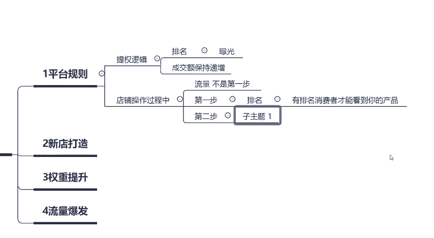

你们来想一下，我的产品呢就已经排在这个位置了。比如说啊这是拼多多里面的这个后台啊，然后呢，这这个里面呢有包含每一页我们看可以看到几个产品呢，可以看到四个产品，对吧？啊，1234这四个产品。好。

这是第二个产品。然后呢，这是第三个产品啊，这是第四个产品。比如说我们现在我们的产品呢是排在第一位的啊，排在第一位的啊，这个呢是我们的产品啊，这个是我们的产品。然后我们在操作的过程中，能不能确保？

既然说我们的排名已经拿到第一位了，能不能确保它一定可以拿到流量？

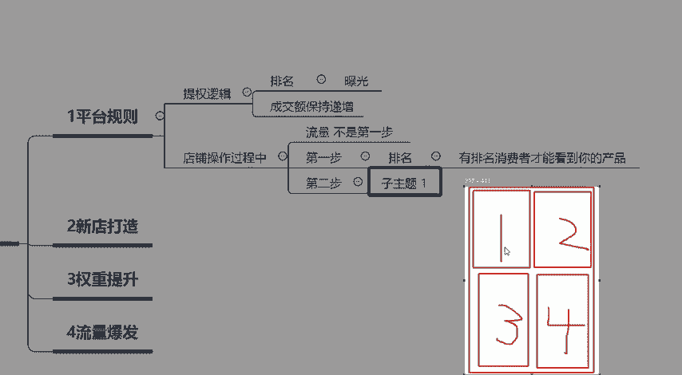

能不能确保它一定可以拿到流量？😡，这个是并不一定的啊这个是并不一定的。啊，这个是不一定。不一定是绝对可以拿到流量。因为中间还有一个东西是什么呢？那消费者打开这个关键词，比如说搜索了连衣裙。

这四个宝贝里面，它消费者看到的是4个产品，明白吧？四个产品，也就是说点击你产品的一个概率，或者是形成访客的一个概率只有多少呢？只有4分之1。😡，只有4分之1，能不能明白？😡。

所以说啊所以说那有的时候头呃这个里面呢就考虑到另外一个问题了，叫什么呢？就是点击率啊，叫做点击率。为什么说我的产品的点击率我可以做到非常高的一个情况啊，来给大家看一下。如果说你用直通车去进行测试的话。

你会发现直通车用这些精准的关键词测试出来的这个呃产品啊，测试出来的产品点击率都会非常非常的高啊，点击率都会非常非常高。看。我的这一个产品呢，它点击率可以达到8%。原因是什么啊？原因是什么？

就是因为你的排名比较高，所以说。😡，所以说这里面能不能一定可以拿到流量，并不一定啊，它跟你的点击率有关系。那么点击率这个东西到底又跟哪些因素有关呢？首先第一个就是你的排名。

所以说很多的东西全部都是息息相关的。如果说大家的排名不不是在这个前四位的，而是在前十。那么我们消费者看到我们的产品点击的概率是多少，也就是10分之1。啊，它就是10分之1，而不是4分之1了。

对吧那么如果说我们的产品呢是排名在30名之后的，那么消费者点击我们商品的一个概率是30分之1。也就是说他需要浏览30个产品才可以看到我们的宝贝，对吧？那我们的曝光量就降低了。那看到我们的宝贝的时候呢。

在这个一个页面里面，总共有4个产品。那你要确保消费者他在购买的一个过程中呢，它肯定是优先优先去进行购买的。我第一家来了之后，我看到第一家的这个产品好，他的产品比较符合我的口味，我点击进去进行购买了。

你说第二家第三家第四家他还会去进进行点击吗？还会去进行购买吗？很显然不会所以说排名越高，意味着我们的点击率越高，同时也意味着我们的商品的转化率越高。能不明白，这个就相当于是垄断的一个地位。

那么我们最终在操作店铺的一个过程中，就是要把我们的排名一步一步的做上去，怎么样可以把我们的排名直接做到第一位或者是第二位。因为这里面呢我又会给大家植入到一个概念，叫什么呢？在第三步的时候。

我会给大家分析什么呢？😊，操作店铺的过程中啊，我们是不是说比如说我们要做连衣裙，是不是必须要把连衣裙这个关键词做到排名第一。并不是我们在操作的时候要选择精准市场。😡，点击率要达到多少？呃。

普通的商品呢点击率需要达到3%到5%。如果说你想要把它做的更好一点的话，最起码你要达到5%以上啊，最起码你要达到5%以上。明白吗？😡，好啊，那这个问题我们就过了啊，我们就过了。我们来讲一下第三步啊。

第三步在店铺操作的过程中，好，我们可以拿到排名，也可以拿到点击。拿到排名和拿到点击之后，我们就要考虑怎么拿到排名。😊，怎么去拿这个海银啊，我们必我们刚才讲过了，必须我们的产品呢要做到多少呢？

要做到百分之前十%啊，要做到百分之。前十的位置。坐到前十的位置，那么我们的点击率是不是就更高，获取到的排名是不是呃获取到的流量是不是就越多？那这个时候啊拿排名的时候一定要选择精准的关键词的一个市场。

这个东西怎么来理解呢？打开店铺的后台，那现在要开始实操了啊，现在要开始操作了，大家可以打开店铺自己店铺的后台，那么我们所需要用到一个工具是什么呢？点击推广中心，有个推广工具。

这个里面呢适用于我们在挑选商品的时候去挑选精准的市场。😊，好啊，等他更新一下啊，等他更新一下。😊，打开这个后台之后呢，我们所需要用到的工具叫做搜索词分析啊，叫做搜索词分析。搜索词分析里面。

我们可以选择自己所对应的类目，或者是直接在这里面去进行搜索。比如说我们要做的产品是什么呢？是连衣裙，那么我们就直接搜索连衣裙这个大关键词，大家会发现连衣裙这个关键词它整体的搜索量啊。

它整体的搜索量是非常非常高的，而且竞争强度是一直在不断的上升的，看到了没有？搜索热度在下降啊，并且呢竞争强度是不断在上升的。也就是说做连衣裙的同行越来越多了。明白吧？跟你抢流量的同行越来越多了。

所以说呢这个时候呢我们就需要选择一个没有那么多人抢市场的那这个时候呢我们就需要在下面直接去查看这个竞争强度去找竞争强度相对来说比较弱的啊，比较弱一点的弱一点点的。比如说像这个牛仔连衣裙啊，牛仔连衣裙。

我们就可以作为我们的精准。主推的一个市场。所以说这一步啊在做第三步的时候，这个东西跟什么东西相关的？跟你的产品标题就有了息息相关的一个。一个东西，大家的标题写的好不好。

就取决于你的市场关键词选择的精准还是不精准。能不能明白？😡，如果说我们再去操作连衣裙这个关键词的时候。那连衣裙这个关键词，我们可能每天需要做多少单呢？可能需要每天做1000单，可能每天需要做5000单。

我们才可以拿到排名前十的位置。但是如果说我们去做牛仔连衣裙，这样的一个关键词，可能我们每天呢只需要做到50单，只可可能只需要做到20单，我们就可以拿到排名前十的位置。

所以说前期先先不要想着我直接做连衣裙，我可以拿到所有所有的流量，这个是不现实的，先做精准市场，精准细分的市场做好了之后，然后呢再去去做其他的一些东西。那么根据我前面所给大家啊，剖析的这些内容。

从第三步我们选择精准市场开始，一直关联到我们最开始的时候想要去做曝光，想要去做排名。那成交额应该怎么样去进行递增。那递增的时候，我们无可厚非需要使用到补单的一个操作，对吧？

那大家都知道人为去要去进行干预，或者是开车要去进行干预。那开车的时候开哪些关键词。就是牛仔连衣裙这个关键词，不管我们刷单也好，不管我们去做这个呃直通车也好，都是通过这个关键词来去进行操作的。

关于这个点啊这个点，平台规则上面的这个理解，大家都能不能明白理解的同学公屏扣6啊，理解的同学公屏扣6，复制同行的标题改了一点点。我告诉你，复制同行的标题是很容易吃亏的。为什么？

因为同行都已经选择了这个市场，比如说牛仔连衣裙。😡，同行已经很多的是呃很多的同行呢都已经选择了这个商品，选择了这个市场。那么他在进行操作的时候，你就跟我前面给大家讲到的一样。

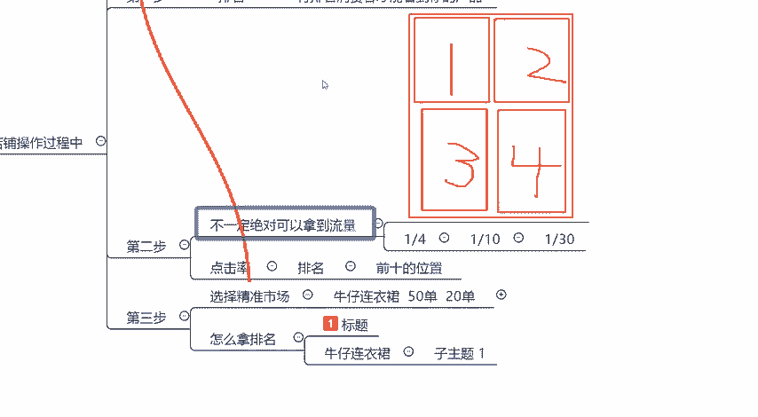

我们可以拿到排名。比如说我们已经拿到了排名第一的位置。那么如果说你的排名第一的位置呢是你的这个产品啊，你刷单也好，你开车也好，好，排名卡上去了。然后呢，你只有300个销量啊，这个宝贝呢只有300个销量。

然后呢，你的投行跟你做的一模一样的关键词，而且跟你是一模一样的款。人家呢都已经做了很长的时间了，人家有一00的销量。😡，你觉得消费者会点击哪一个？所以说你在第二步的时候你就出错了啊。

你在第二步的时候就出错了，明白吗？第二步点击率的时候你就出错。😡。

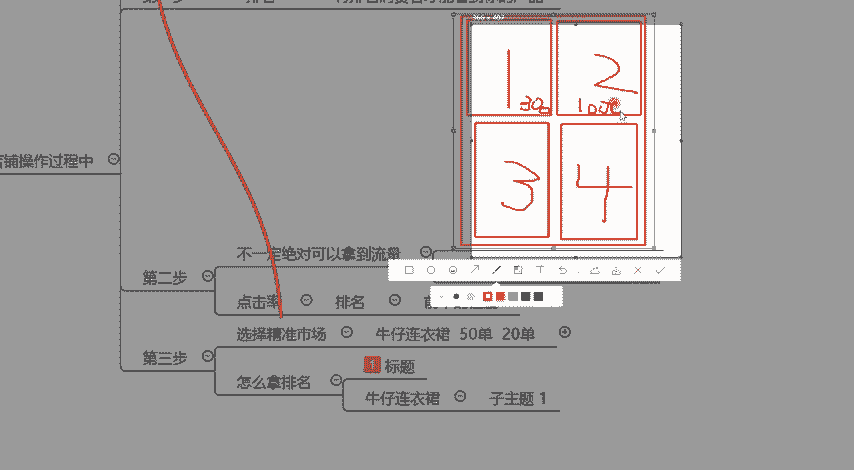

因为消费者他肯定会选择一个销量相对来说比较高的一个商品。虽然你排名坐上去了，但是你依旧拿不到流量。这就是说为什么超同行的标题不太好。不懂就要认真学好吧。😡，那这个课堂里面啊。

我看到新进来有很多的这个小伙伴啊，首先欢迎一下各位啊。那么前面的这些内容啊，关于这个平台的规则，大家还有没有不理解的，有不理解的同学呢，给大家这个30秒的时间，大家可以直接发在公屏上，有任何的问题啊。

也给大家30秒的一个时间，可以直接发在公屏上。如果呢大家可以确认理解公屏上扣6啊，公屏扣6，然后示意老师一下就可以了。好吧。那接下来呢我们就继续往下讲了。😊，所以说在学习的过程中。

首先第一个要确保大家可以听听明白啊可以听明白。如果说你这节课就是听我讲了啊，但是没有听懂，那没有任何的意义啊。你听课就是浪费时间啊，我讲课就是浪费口水。好吗？😡，好。

那么我们继续第二个啊第二个新店在进行打造的时候，到底应该如何来进行打造。那么前期呢我们也已经确定了。根据平台这个规则，我们第一步先要拿排名。好，第一步先要拿排名。啊。

有没有同学愿意把自己的这个产品的标题奉献出来的啊，可以直接发在公屏上。我给大家以你的店铺的一个案例教你应该怎么样去进行操作。因为这个里面啊，我只需要知道你的标题，我就清楚你的产品到底是什么。

我们在做的时候到底应该怎么做，好不好？好，给到给到大家这个30秒的时间啊，如果说有想要看的啊，可以直接发在公屏上好不好？啊，现在开车啊比较烧钱，没有用啊，肯定的。因为你前提基础没有做好。

你肯定是没有用的。然后命途呃命运多舛啊，做这个狗粮的那首先第一个你的这个标题我看了一下，你标题肯定就是有问题的啊，先做一个小诊断啊，标题肯定就是有问题的。因为你的标题的最开始的这个主推词。

你最开始的组推词选择的是什么狗粮？😡，狗粮这个关键词是非常大的啊，你压力会非常大的啊，来给大家看一下啊，给大家看一下。因为这个里面呢我们需要用到一个工具啊，叫什么工具呢？我们可以使用电棒啊。

来查看一下同行啊，来查看一下同行。😊，来，我们来看一下。实际操作的过程中啊，一定要根据啊一定要根据这样的一个呃功能啊，或者是善于去使用啊善于去使用。善于使用工具啊善于使用工具。好，来，我们来登录一下啊。

我们来登录一下。呃，其实这个关键词，比如说我们如果说直接去做狗粮这个大市场啊，你会压力非常大啊，你会压力非常大，明白吧？所以说标题第一步要做的就是修改标题。西楼。然后呢，这个全。全路路边路酒啊。

那这个呢其实也是一样的。大家的标题里面呢，我发现大家普普遍的这个标题都会出现一个什么样的问题呢？就是会直接把自己的产品核心词写在最开头的位置啊，我不太清楚大家是这个是什么样的一个操作啊。

什么样的一个操作啊，我给你们看一下就可以了啊，我给你们看一下，你们就清楚自己的问题出在哪里了。比如说我们在操作的时候，好，主推关键词，你选择的是什么狗粮。因为你标题的开头啊。

你标题的开头是什么样的关键词。然后呢，你匹配到的就是什么样的关键词。就算是啊比如说你的这个里面写的什么狗粮真爱款啊，狗粮真爱款。那这个关键词有搜索量吗？肯定是没有搜索量的那泰迪呢也是没有搜索量的。

明白吧？所以说我们在做的时候呢，可以，你看一下同行是怎么写标题的，看到没有？狗粮通用型泰迪狗粮通用型，哪有哪有同哪有这个你在写标题的时候是写的是什么呢？狗粮真爱款啊，这个肯定是不行的，明白吧？

你要把真爱款啊，真爱款啊，这种呢？你可以放在后面啊，没有人会知道你真爱款是什么东西，包括说像这个标题啊，路边。😡，也是一样的啊也是一样的，来搜一下。😡，路鞭酒对吧？😡，好，路边酒。啊。

鹿鞭酒我们应该选择的是什么？鹿鞭酒同仁堂，鹿鞭酒32度，鹿鞭酒多少度？鹿鞭酒什么呃鹿血呃，鹿鞭酒鹿血酒啊，男性对吧？这样的关键词会比较啊会比较。好用一点啊，会比较好用一点，或者是这个鹿鞭酒五金。

你要直接把你的产品的规格去写出来啊，去写出来。虽然说这个类目相对来说比较小，但是说你鹿鞭酒，然后呢，中间这个呃鹿雪鹿心鹿金，然后呢，这些其实都是属于核心词。都是属于核心词。

它搜索出来的一个结果都是不一样的，明白吧？所以说这种核心词呢，你尽量的减少啊尽量的减少，你就直接写这个鹿鞭酒。然后哪怕是你这样写路鞭酒，你后面写养生都要比你现在写要好很多，明白吧？还有像这个狗粮啊。

这个狗粮真爱款直接就删除，直接写狗粮啊，这个泰迪专用。😡，对吧泰迪专用先把养泰迪的这些人所有的流量全部都拿下来，千万不要想着我直接就可以做大词，这不现实的啊，这不现实的，好吧。😡，包括这个人参如烟。

我来看一下啊，中小童透气皮肤衣透气皮肤衣皮肤衣。那么你的这个产品呢主推主推关键词在哪里呢？在这里啊，皮肤一上面，那么你主推的关键词是什么呢？就是中小童透气皮肤衣啊，明白吧？你核心词在什么位置？然后呢。

你主推的关键词就在什么位置啊，来，我们来看一下。好，那么也可以看到对应的下拉光词推荐的是什么？中小童透气全部都是网鞋。所以说透气这个关键词适不适用于用在这个皮肤衣上面呢，是不太适用的。能不能明白？

你哪怕你皮肤衣，你给我改成这个防晒衣了，你透气透气搜索出来全部都是网鞋。

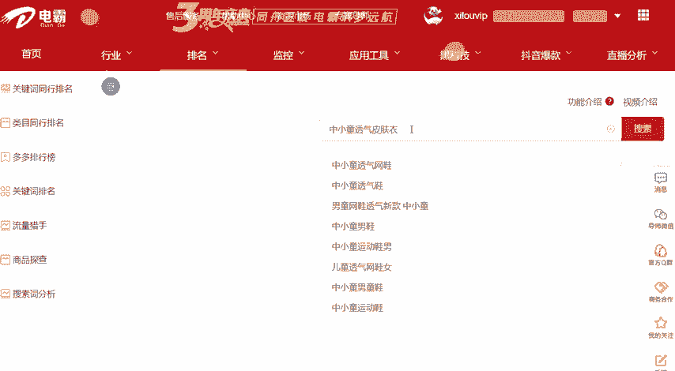

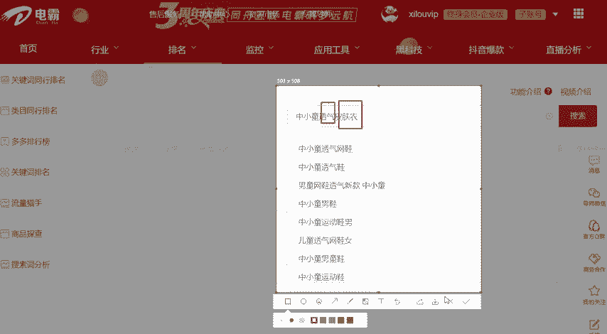

明白吗？😡，而且这个皮肤一啊平台里面是没有这个类目的啊，是没有这个类目的。那个类目选择的也有点尴尬啊有点尴尬。所以说关键词要换啊，关键词要换，看到没有？皮肤一每天每天的搜索量呢有1300多。

但是说呢你搜索出来这个结果，平台跟你匹配到的这些推荐词，全部都是防晒衣，什么风衣、冲锋衣，明白吧？也就是说整个平台里面它给你匹配到的一个搜索流量啊，它给你匹配到的一个搜索流量是相对来说比较差的。

每天有这么多的一个搜索量。😊，所以说关键词主推词要换啊要换，哪怕是你在。你在操作的时候，你你把外套写在前面都要更好一点，明白吧？😡，千万不要在别标题开头的时候，主推词有几个忌讳的点。

第一个不要直接核心词开头。不要直接核心词开头，这是第一个点。第二个点是什么呢？😡，主推词。不要有奇。😡，什么叫奇义呢？比如说这个透气皮肤衣，我根本不知道皮肤衣是什么东西，对吧？像这个鹿鞭酒。好。

我知道是鹿鞭酒。那你后面那你后面写的是什么啊，什么鹿茸养生鹿金，对吧？这种这种词也是属于核心词，它就属于关键词堆砌了，明白吧？这两个点一定要注意，能不能能不能理解啊，这个点能不能理解，像这个清风小醉。

还有这个人生如烟啊，包括像这个啊命运多舛，你们的标题都有问题啊，下去修改一下啊，下去修改一下，好不好？😡，明白的话，公屏扣6啊明白的话，公屏扣6。那么接下来我们继续啊我们继续。

那么刚才我们讲到呢这个主推关键词我们需要去进行更换。如果是我在做这个狗粮这个产品的时候，我会怎么样去进行操作呢？首先我会先打开这个搜索呃，先打开这个搜索工具，然后直接查查找这个。狗粮。明白吧？搜索狗粮。

然后呢看一下整体的趋势没有什么问题。那么我们在操作的时候，可以就直接写这个金毛犬狗粮。我们要我们刚才呢给大家剖析的时候呢，给大家讲到一个问题，就是我们要尽量的选择竞争强度比较低的对吧？

那么我们就可以写狗粮批发1斤。那狗粮批发1斤这个关键词虽然乍一看它的竞争强度会比较小。但是这个关键词一般情况下都是放在最后面的。因为批发十0斤，这些是属于什么？属于促销词。所以说在写标题里面呢啊。

这这个是属于属于促销值。那么我们能不能写在标题的开头呢？尽量不要写，因为它不是我们的最优选择，明白吧？我们的最优选择是什么？比如说像这种。我们来找一下啊，我们来找一下金毛犬狗粮，就是非常精准的关键词。

这种词叫做精准词。😡，也不要写什么2021新款啊也不要写什么2021新款，这种词也都是属都是属于模糊词啊，都是属于模糊词。所以说对于关键词的一个判断啊，对于关键词的一个判断，大家要要自己心里要有数啊。

自己心里要有数。我们这个产品就只是卖给金毛犬的。明白吧？那这个时候呢我就可以根据金毛犬狗粮这个关键词来写作我的标题，以及选择我的主推市场。那么选择主推市场的时候，我在做新店的时候。

需要找到一个对标的竞品啊，需要找到一个对标的竞品。比如说我要做这个关键词，做这个市场。那么我所选择的标题里面，我们可以写什么样的属性词呢？比如说幼崽通用型啊，还有这个。啊，成券啊，还有这个天然啊天然。

呃，然后呢还有40斤啊，然后。像这些属性词我都可以加到我的标题里面啊，都可以加到我的标题里面。那这个呢属性词我们也已经确定了这个意味着什么呢？我们后期在进行补单或者是刷单的一个过程中呢。

我们都可以使用这样的关键词去进行补单，或者是使用这样的关键词去进行开车，明白吧？那么当我们确定可以去裂变的时候，那么我们直接点击搜索看一下同行每天可以卖多少订单。我们根据同行来进行对标啊，来进行对标。

来，我们来看一下啊，我们来看一下搜索金毛犬狗粮。我们看一下同行每天可以卖多少单，知己知彼方能百战百胜，对吧？前面呢我也我也给大家分析过，我们在做店的时候啊，第第一位的这个基础做的是什么呢？

想要拿到排名就必须要有曝光，对吧？那怎么样可以有曝光呃，可以有这个曝光呢？就是因为我们必须要把这个成交额就给做上来。所以说根据于平台这个规则，我们需要知道我们需做。我们拿到排名。就是实操啊。

在实操的一个过程中，我们第一步要确定的是什么呢？拿到排名。需要多少的成交额？需要多少的成交额数据，我们才可以拿到对应的排名，明白吧？所以说我们就可以使用这样的一个工具。

那么根据于平台的一个呃同行的一个数据啊，每天呢他们可以卖这个800多单。比如说我们就选择一个相对来说比较弱的啊，相对来说比较弱的好，选择这个排名前十的啊，排名第十0的，他每天可以卖多少单呢？

可以卖43单。那么每天可以卖多少钱呢，我们在后面可以直接看到啊，我们后面可以直接看到它整体的啊最低团购价是多少，我们点击进去查看一下这个商品，他每天整体的一个销售额是多少？

也就是说每天他差不多卖多少钱呢？1400块钱，也就是说7天卖多少钱呢？7000也就是7000到1万块钱，我算它1万。同行数据。7天1万。😡，7天是1万块钱。那么确定了我们可以拿到拿想要拿到排名。

需要7天做到1万块钱的一个产值。那这个时候呢我们应该怎么样去进行安排呢？第二步，我们要做的是匹配自己的商品。啊，匹配自己的产品。呃，比如说像这个做狗粮啊，做狗粮。这个命运多舛啊，命运多舛。

你的产品是什么样的一个客单价，你跟我讲一下。😡，产品客单量是多少钱？😡，大部分的商品啊大部分的这个商品消费者在进行购买的时候，习惯花多少钱去进行购买。来讲一下，包括说像这个清风小醉啊。

还有这个呃其他的同学啊，像这个人生如烟哈，你们你们也可以把你们的课程量发出来。啊，都是一样的操作啊都是一样的操作，明白吗？好，18元。😡，好，既然是18元，我们产品的一个客单价。

那么我们7天如果说需要做一万单的话，大概需要多少订单？我们算到20块钱好不好？也就是说7天我们需要做多少单，是不是500单？我们7天做500单，就可以把18块钱的这样的一个客单价做到1万的一个成交额。

这个没有问题吧。那么我们也就可以直接确定我们7天所需要做的订单是多少。7间所匹配到的订单是多少？500单。那么这500单根据我们刚才所讲的，我们在操作的一个过程中，成交额保持递增的一个状态。

所获取到的权重是最高的。那么我们怎么样去进行递增？这500单到底应该怎么样去进行安排？如果是我的话啊，如果是我的话，我会每天保持30%的比例去进行递增。啊。

每天保持30%或者是50%的一个比例去进行递增。来，我们来看一下数据。我们来看一下具体的一个实操的一个内容，大家就清楚了啊，大家就清楚了。好，第一天的时候是13000。

那么在第二天的时候达到了1000100到15000是2000多的一个成交金额，大家算一下是多少的比例啊，是多少的比例。当然我这个比例整体算下来是相对来说比较低的，为什么呢？

因为我的整体的成交额已经非常高了啊，已经非常高了。但整体算下来，百30到50是这样的一个比例，明白吧？好，从35000啊，从35000的一个成交金额，看到没有？4月2号的时候，3000的一个成交金额。

然后在4月3号的啊，4月3号的时候直接达到了4000啊，直接达到了4000，中间差了七000左右的一个营业额三七二十一啊，三七二十1四七二十8也就是三000多左右啊，3000多左右把它给增长上来。

也就是说我们在前7天操作的时候，第一天。😊。

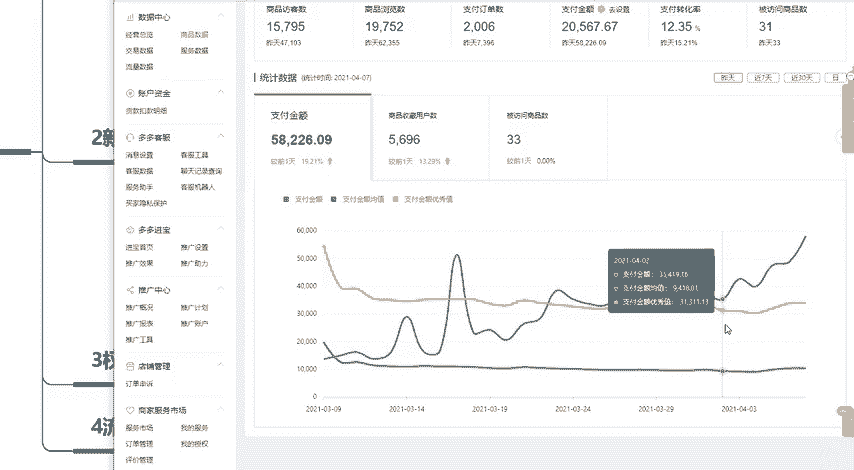

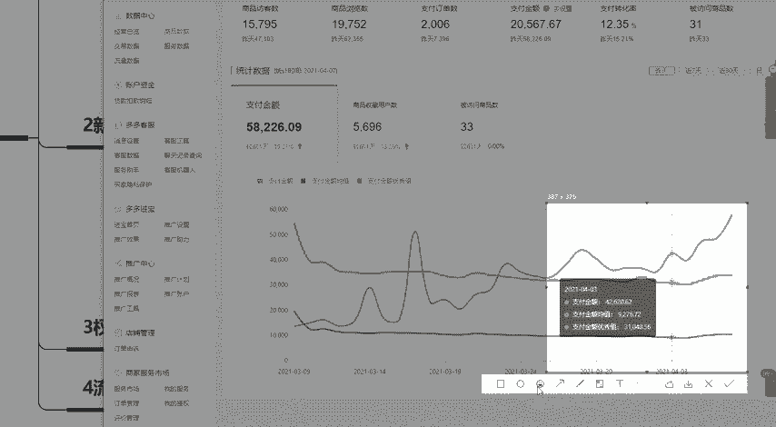

啊，需要做多少订单？总共我们全全部的所有的7天全部按照这个整体啊补够500单就可以了啊，补够500单就可以了，明白吧？那这个时候应该怎么样去进行计算呢？我们需要用到一个呃表格啊。

我们可以直接使用表格来进行计算啊。来，我教大家一下怎么算啊。首先我们大家要使用这个excel表格啊，excel表格，我们先创建一个空白的文档啊，空白的文档。好，放大一点。这是天数啊这是天数。

第一天第二天一直到第七天啊，一直到第七天或者是第14天。一般情况下，我在做计划的时候都是14天啊，我们按照7天来给大家算。比如说那7天前7天的时候呢，我们控制的比例就可以稍微的增长的高一点。

比如说每天增长50%。那就是说第一天如果说我们补一单的话，那么第二天补多少，是不是第一天的数据乘以1。5%。这个有没有问题啊，这个有没有问题？😡，那么这是第一天啊和第二天的一个操作。

那第三天和第四天第三天是不是需要比第三呃，第二天增加1。5%，也就是说第二天的数据乘以1。5。啊，这就是增长了50%的一个状态。那么最终7天所有的数据，如果说我们第一天补一单的话。

那么在第七天的时候就需要补11单。那么最终我们需要求和啊我们需要求和。在第二，我们需要计算出来。如果说我们第一天啊，如果说我们第一天。第一天补一单，然后呢，总共7天我们需要补补多少的比例。

那么就是32啊，整体的比例是32。那么我们要操作的数据是多少呢？是500啊，是500单。好，那我们就可以直接500除以32，最终计算出我们在第一天的时候操作多少单，15单。15。6单明白吗？

这个就是我们所得出的一个数据啊，那么第二天等于多少？15。6啊，15。6，然后乘以1。5。明白吧？也就是说第一天的时候，我在补单的时候呢，我需要补15单。第二天的时候我需要补23单。然后呢。

最终啊最终我们所得出的一个数据，最终补了多少单呢？501单啊，501单。当然这些在实际操作的过程中，我们是不是说这个数据啊，这7天的数据啊，我们如果说要保持递增的话，是不是所有的全部都是自己补。

并不是只是说我们的店铺拿到这样的数据就可以了。如果说你的真实订单有数据。😡，那么就不需要去进行操作啊。如果说你的真实订单没有达到15单，第一天没有达到15单，那O你就去补差多少补多少啊，差多少补多少。

这就是我们第一天实际的一个操作。当我们第一天做完之后会进入到一个平稳的稳定期。那么会达到什么样的一个效果呢？基本上在第一周操作操作结束之后，大家的店铺都可以拿到200到500左右的访客。

这个是第一周期做完了之后啊，第一周期做完了之后，所可以达到的一个效果。来，我们来看一下具体的数据。当时在操作的时候呢，每天也就是十几单，十几单的再进行安排啊，十几单十几单再进行安排来看一下。

第一周期的一个新店啊，每天200多的一个访客啊，每天两两三00左右的一个访客。然后订单数是多少呢？订单数有的时候高，有的时候低20单26单，然后呢，40单，然后增长出去增长一个周期之后，看到没有？

最初的时候第一天22单。然后呢23单，然后呢慢慢的去进行增长，增长到40单之后，你看到这个订单数快超过同行优秀值了。那这个时候呢就可以稍微放缓一点，然后把订单降下来，保持平稳的一个状态。

等平台给提全就可以了。😊。

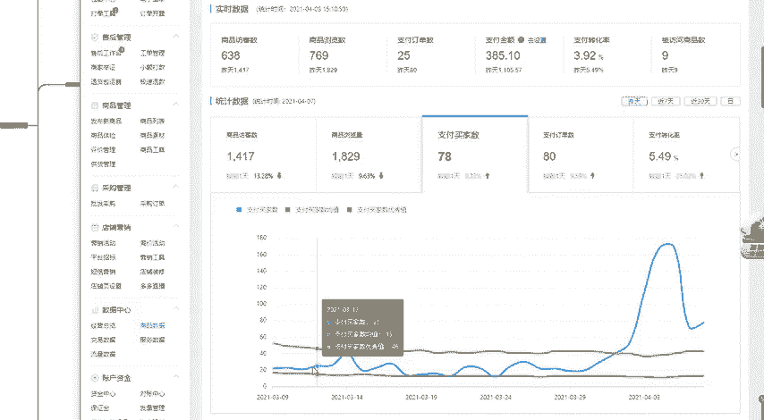

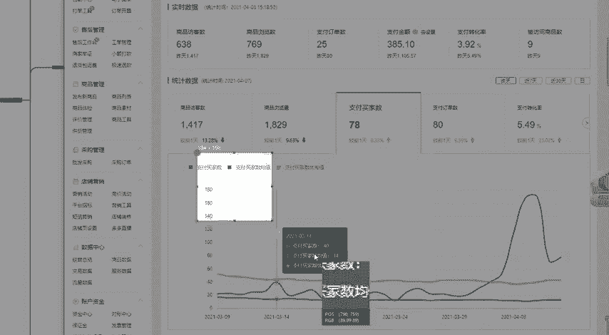

平台给提全了之后，你每天拿到啊平台。等平台提选。平台提全了之后呢，那么我们就直接可以拿到这样的一个数据量啊，拿到这样的数据量。这就是我们新店在进行打造的时候，怎么样可以获取到第一部分的流量。

实际的一个操作以及排名的一个规则。都能不能理解，理解的同学公屏扣6啊，理解的同学公屏扣6。😡，啊，速多块啊，来我们我喝口水啊，喝口水。😊，好，OK既然说大家这一步理解清楚了啊，这一步理解清楚了。

那么下一步我们要做的是什么呢？是权重提升以及流量爆发。当我们的店铺已经做到了200多的访客，为什么我的店铺直接可以实现流量的一个爆发？我想问一下在座的各位，你们在新店上架了之后，新店新品啊新店。😡。

开店之后。第一个。上架的产品是什么产品？是不是自己的主推款？来，有多少同学新建开店之后，第一个上架的商品是自己的主推款的，公屏扣1，我看一下有多少。😡，同同时我还想问一下各位。我们店铺新店开店了之后。

第一个商家的商品要不要是我们的主推款呢？要不要设我们的组推款？😡，很明确的告诉大家。😡，如果说新店开店之后，第一个上架的商品最好不要啊最好不要。尤其是大家在没有什么任何基础的情况下啊。

你的你的技术不过关的情况下，你第一个上架你的主推款，那么可不可以呢？当然也是可以的。但是这个对于运营的技术要求比较高。如果大家是一个新手在做拼多多的时候，第一个上架的商品千万不要是自己的主推品。为什么？

因为这里面呢有很多的有很多的说法。😡，首先是什么呢？第一个你的店铺没有权重，你店铺没有权重，你新上架的第一个商品呢，它就不会给你推流量，或者是只给基础流量。

你想你的主推产品只只可以获取到一一部分的基础流量吗？肯定不想的对吧？那这是第一个点，店铺没有权重的时候，平台只会给基础基础流量，这是第一个。第二个是什么呢？在你的运营技术。不成熟的情况下啊。

因为技术不成熟的情况下，很容易违规。😡，一旦你的商品违规了，那么也就意味着你可能会凉啊可能会凉这个商品你就没有办法去做了。比如说他给你来了个二级限制，或者来了个三级限制，那你怎么搞，对吧？

所以说啊基于以上哪个原因，我建议大家啊我建议大家。第一个商家的产品，千万不要是自己的主推品，就像我这个店在操作的时候是一样的，前期两三门访客基本上没有我的主推款。主推款在做的时候是什么时间开始做的？

来看一下数据，就是这个款，一吃即白胶原蛋白粉啊，胶原蛋白粉看一下详情。什么时间才开始操作的？3月28号的时候才开始操作的。那么我店铺的整体的这个流量呢，同样也是从3月28号的时候开始去进行增长的。

明白吧？所以说这个时候才开始去上我们的主推馆。主所以说主推广。主推款上架需要时机啊需要时机。什么样的一个时间才可以说是我们的产品的实机成熟呢？店铺里面有200到300访客。这个时候你推宝贝是最好推的。

你刷一点单，然后自然而然就走起来了。因为你的店铺里面有已经有了人群覆盖数。我们来啊同同样我给大家实际展示一个啊展示一个店铺这个店铺呢是没有任何数据的新开的一个新店啊，新开的一个新店。

我来给大家看一下新开的新店，我们怎么样看我们店铺里面到底有没有客户存在呢？打开你店铺的后台啊，然后找到这个店铺营销工具啊，店铺营销里面，然后找到短信营销。看到没有？😡，店铺里面的潜在客户有几个？😡。

是不是几个人？😡，对吧助力店铺关注的只有4个人啊只有4个人。也就是说你这个店铺你再怎么样做，你的访客，也就是那么几个人，三四个人啊，三四个访客。也就是说为什么这个产品啊。

为什么这个店铺每天拿不到拿不到访客来看一下。😡，为什么说每天的访客都是零0散散的，从来没有超过4个以上，是不是你店铺里面整体的所获取到的最大流量值就是4个。😡，那么当你的店铺每天有了两三百访客之后。

那么可以达到什么样的效果呢？来，我们来看一下啊，我们来看一下，同样还是这个店啊还是这个店打开店铺的后台，同样找到这个营销啊，找到这个短信营销进入之后，我们可以看到这个店铺里面我们整体人群覆盖数有多少。

😊，最起码有几千号人了吧，最起码有3000号人了吧。也就是说你的新品上架了之后，你的主推宝贝上架了之后，最起码有3000个人有概率看到你的商品。😡，所以说这个东西叫什么？店铺的人群覆盖数。😡，啊。

这个叫做店铺的人群覆盖数，覆盖数越高越好。就像我这第五层级的店。第五层级的店，如果说大家要去看的话，可能我的这里面的人群可能有几千万啊，可能有几百万几百万上千万。访客有，但是转转化率很差很正常啊很正常。

前期在做的时候啊，千万不要想着你直接就可以形成转化，这个是不现实的，尤其是新手啊，看到没有？😡，潜在扩展人群1200万啊，1200万200万。也就是说我这个店铺上新品自然自然就会有流量。

我都不需要我的产品去怎么样去进行推广，上架了就会有流量，上架了就可以卖。😡，这就是店铺做起来的一个好处。明白白？这是主推上架的一个时机。那么主推当我们的店铺里面有了两三百访客之后，那么主推上架之后。

主推的宝贝应该怎么样去做呢？根据新店打造，我们做排名那个原理，做排名这个规则同样再去使用同样的方法，把我们的新品去重新操作一遍啊，去重新操作一遍。根据卡位的一个原则。因为你店铺的基础不一样。

我们所获取到的流量上限也是不一样的。新品在最新店新品在最开始操作的时候，好，我拿到两三百的访客就可以了。那这个时候我们再上架一个产品。

当我们的产品所获取到的流量最大值已经从这个两三百可以突破到四五百的时候，那么我们新品再进行推广的时候，是不是就可以直接拿到2000多的访客了。我们把其他的东西全部都取消掉啊，全部都取消掉。

我们就只看访客数啊，只看访客数，看到没有？新店在短短几天的时间里啊，也就是一周左右的时间啊，一周左右的时间来，我们继续再看一下支付买家数，你们大家也可以看到支付买家数，我第一天在进行补单的时候是几单。

第一天我只补了一单啊，第一天我只补了一单。😡，这就是说为什么我的店铺呢在补这个一单两单、七单、十单、十5单、二0单、二十几单这这样的一个数据呢都可以达到。大家补100单的一个效果，明白吗？

我补一单的一个效果可以达到你10倍以上的一个效果。😡，所以说当我们做完这些数据之后，自然而然，访客就来了。访客来了，订单量自然就会增长。我们只需要维持好支付转化率就可以了。能没明白？

所以说啊所以说店铺的操作难不难？大家觉得难不难？思路清晰了没有？思路清晰的同学公屏扣6啊，公屏扣6。😡，坐店就是这样去做啊，坐店就是这样去做，先把你的店铺权重给做起来，做起来之后，然后再去上架主推广。

主推广上架了之后啊，人群覆盖数有了之后啊，那么我的人群覆盖数达到了多少呢？达到了3000啊，达到了3000。😡，对吧人群覆盖数达到了3000。那么我的主推宝贝。主推的产品重新复制操作啊，重新复制操作。

复制前面爆款打造的一个过程。那么我的流量自然而然就增长了。一溜的就增长了，明白吗？包括像。😡，大店也是一样的啊，像大店也是一样的。来，我们来看一下数据。当你的店铺层级越来越高的时候。

那么你的数据就会越来越好啊，你的数据就会越来越好。好，来看一下。为什么这个这个商品啊为什么这个商品整体的流量一直在上升？😡，原理是一样的呀哈原理是一样的呀。只不过说到了后期之后呢。

我们店铺所需要控制的数据维度会越来越多。为什么今天给大家分享的叫做四维啊，叫做四维到底是哪四维啊，到底是哪四维，就是主推。

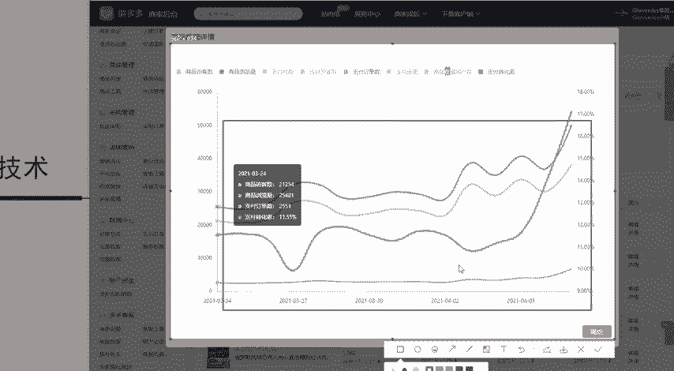

操作的时候。组推抓入第一个成交额。四维法啊思维法。😡，第一个我们要控制的是什么？成交额，成交额需要保持不断的增长。那这里面呢又有一个公式，需要大家记住啊，就是每一个数据之间都是有关联的。

我们需要根据数据来进行判断。稍后我会以给大家具体的剖析一下。如果说我们的客单价跟不上了，我们应该怎么办？好，成交额啊成交额没有问题了之后，第二个是转化率，第三个是人气啊，第三个是人气。

那么第四个是什么呢？是我们的访客数值。也就是说人群覆盖数。人群覆盖数啊人群覆盖数。好，成交额我们需要保持增长。那么成交额是指什么东西呢？成交额是怎么来的？😡，成交额的公式等于订单数。乘以客单价。

这家感觉好难，其实一点都不难啊，其实一点都不难。你觉得你难是因为你没有接触过这个。行业啊，你没有接触过这个行业，当你真正的把这些思维逻辑搞清楚了之后啊，那么自然而然你就可以做的好。如果说像拼多多里面啊。

我上架产品就可以卖啊，我问一下大家，像那种门槛非常低的。啊，门槛很低。然后呢，上架就可以卖。这种叫什么？这种叫做风口啊，这种叫做风口。😡，能明白啊，门槛非常低，上家就可以卖这种叫做风口。

那风口一旦过去了之后，那叫做什么呢？😡，风口过去才叫机遇啊才叫机遇。明白吗？所以说啊所以说那么大家认为如果说这个做拼多多啊，门槛很低，上架就可以卖。如果说真的是这样的话啊，真的是这样的话。

那么大家觉得你们能不能赚到钱，你们可以分到多少汤？所以说啊机遇和风险是并存的。如果说你想要去赚钱，想要在拼多里面去闯事业，那O你就需要掌握一些别人不懂的东西。别人做不了的东西，这个东西才是你的卖点。

明白吧？就像门口这个摆地摊摆地摊谁不会啊？那摆地摊也有摆的好的，对吧？人家口才比较好的，这就是人家的优势。为什么人家摆地摊可以卖出去。为什么你卖不出去，原因就在于这里，所以说有很多东西都是需要学。

看起来很难，只是因为我今天给大家讲讲述的这些内容稍微的会深入一点啊，因为因为有很多同学啊说哎希罗老师天天讲一些基础的哎，听的没什么意思啊，那今天呢就给你讲一点难的，讲一点难的嘛，你们又听不懂啊。

听的无聊。唉，肤浅了肤浅了啊。😊，老师，那我这一爆发一波，然后起不来了，搜索风口过去了吗？搜索风口过去之后，我们就要去找精细化的这个细分市场。为什么前面的时候我会给大家讲讲到什么东西呢？这是标题啊。

为什么要做做狗粮的时候，我要去做金毛犬狗粮。😡，原因是什么？因为它的市场相对来说我是可以去进行切入的，明白吗？很多的人呢你不需要去啊研究风口的这些人是什么呢？是有手里有钞票的。你没有个几亿几十亿。

你跟我说风口扯淡的风口。😡，对吧封口是对于有钱人来说的，但是说对于资本家来说的，你没有资本的情况下，那你就老老实实的行360行行行出状啊，出这个状元。然后呢，说我们的操作的一个过程中呢啊。

在坐垫的一个过程中呢，不需要说做到。多么牛逼啊，你一天卖个一万单，我告诉你，你一天卖个一万单，你发货发的过来吗？你做到内部top一，你一个人可以发货发的过来吗？你客服可以接得过来吗？你能承接的下来吗？

你也承接不下来，所以说你店铺里面每天哎能有个三四千块钱，五六千块钱，哎，我觉得不错了啊，我觉得不错了。一个月呢我能能挣个三五万啊，很多人大部分都是这样的想法，明白吧？这就这才叫做中小卖家。

什么大商家上去之后，好，直接给你开车怼，你根本怼不过人家的，明白吧？😡，啊，那这个稍微有点跑题啊啊，那我们继续回到我们这个课程。那主推主推款啊，我们刚才讲到主推款操作的时候呢。

这个四维操作法重点控制的几个数据，第一个是成交额，第二个是转化率。那转化率到底应该怎么样去进行控制呢？我们在控制成交额的时候，怎么样又去呃分析这个转化率呢，比如说我们店铺里面的订单，成交额。

我们成交额跟不上了啊，成交额跟不上了。那这个时候我们是不是要是不是要多补单呢？😡，大家大家所想到的第一个反应是不是就是多多刷几单？😡，大家想到的啊，大部分人想到的啊都是多刷几单哈，多刷几单。

我告诉你这样行不通啊，这样行不通。因为这个里面呢我们要考虑到一个东西叫什么呢？叫做转化率啊，叫做转化率。你店铺里面只有500个访客。你店铺里面只有500个访客，你告诉我，你要刷50单，你这不是开玩笑吗？

😡，或者说你告诉我你要刷100单啊，你要刷100单，那这是多少的转化率？20%的转化率，对吧？啊，你要刷100单的话，那就是20%的转化率了。那这个转化率非常恐怖的呀啊非常恐怖的呀，很容易就会被查。😡。

那我们在访客只有500啊只有500访客，那么我们就直接决定了。访客上线啊访客上线决定了。我们可以做多少单？这也是我们在店铺实际操作的一个过程中会容易忽略到的一个点。

就是说比如说我们的店铺需要维护到转呃需要维护到5%的一个转化率。那么我们的店铺里面有5000的访客或者是500的访客。那么你我们在做订单的时候呢，就只能是300单。或者是啊250单对吧？

5%的转化率5000的一个访客是不是5525就是250单到300单左右。那么我们的订单是没有办法超过这个限值的，超过这个限值，那也就意味着我们的店铺呢可能会出现风险。平台给到你这么多的流量。

那所有的同行全部都是10%的转化率，就你一家是20%的转化率。你说平台不抓你抓谁？😡，转化率过高。平台就抓你。啊，平台就抓你会判定你虚假轨迹。那么在这样的情况下，比如说我们只有500多访客。

那么我们在操作的时候呢，只能做10%的转化率。因为同行优秀就是10%的转化率，那么也就意味着我们最多只能补5单。那么在这样的情况下，比如说我们前面所讲的啊前面所讲的狗粮。18块钱的一个客单价，对吧？

我们还是以这个来呃作为实战的一个案例来进行分析。18块钱的一个客单价。然后呢，我们总共有50单，那么所获取到的一个成交金额是多少，不到1000，对吧？是不是1000元左右啊，1000元左右，50多单。

然后18块钱。然后呢，也就是说我们每天的营业额可以达到1000左右。那么1000左右我们在操作的过程中，怎么样可以让它保持增长？比如说我们打开这个店铺啊，打开这个店铺，我们还是直接看后台的一个数据啊。

直接看后台的数据。好，我们的支付金额需要保持增长啊，支付金额需要保持增长。那么我们又只能补50单。那这个时候啊这个时候。就有一个东西就出来了啊，就是什么呢？这个成交额里面啊，这个公式就可以用得到了。

在订单数量不变的情况下，我们就可以增高客单价来提升我们的成交额。现在能不能明白我为什么要给大家讲这个公式了？😡，当我们在想要控制转化率稳定的情况下，我们的订单量是没有办法增加变化的。

这个时候我们就只能提升我们产品的客单量。来看一下我在这个我的大店具体在操作的时候是怎么样去进行操作的啊，怎么样进行操作的，来看一下交易数据，最早去进行开始操作的时候呢，是在去年的8月份啊。

在是在去年的8月份好，8月份的时候看到没有？客户单价是多少。客单价2。45块啊，2。45块。在整个9月份的时候，我的客单价提升到了多少？9。2块啊，提升到了9。6块9。2块。然后在10月份的时候。

我的客单价提升到了11块钱。然后在1211月的时候，我的客单价提升到了13块钱。也就是说我会不断的提升我商品的客单价，以及我店铺里面的不同的一个款式进行搭配来提升我的客单价，以保证我的转化率的一个稳定。

我的转化率基本上每基本上每一个月都是维持比较平稳的一个状态。看到没有？10%的转化率，在9月份的时候呢，同样也是一样的啊，同样也是一样的。在11月份包括12月份都是5%到10%左右的一个转化率。

不会偏差太大，明白吗？当我们的数据控制好之后，自然而然你的流量就可以起得来。😡，这个点能不能明白？明白的话，公屏扣6啊，明白的话公屏扣6。你这样人群不会浪漫，人群有单独去操作人群的一个方法。

我们可以开车，我们也可以去呃开这个场景来扩展我们的人群，明白吧？所以说这就是第二个维度啊，这里面的呢控制转化率。同时。要让客单价提升。😡，才能提升成交额。😡，好，那有了成交额，我们前面讲过。

根据平台这个规则，有了成交额，我们是不是又是不是慢慢的开始人群覆盖数就增长了？店铺里面流量多了啊，流量多了，我们的人均覆盖数是不是就增长了，人群覆盖数增长了，我们的人气也就意味着提升。😡，啊。

如果说当你的人气达不到的情况下，那么我们可以自己去做啊，我们可以自己去做，明白吧？所以说这个就是主推款啊，在实际操作的过程中，整体的这个思维操作法。那么在思维操作的时候呢，这里面又有一个因素啊。

有一个因素，成交额和转化率我们在进行控制的时候呢。叫做UA驾驶。这个是额外附加给大家啊，给大家拿出来的一个东西需要去理解啊，需要去剖析的。什么东西叫做UA价值，平台还会去进行考核。

比如说举一个简单的例子，平台给了你曝光。首先给到你排名，你是不是就有了曝光？那么有曝光的情况下，如果没有人点击。啊，如果没有人点击，它就会限制曝光。

所以说产品的点击率啊给大家回顾一下我们在操作的时候是怎么样去进行操作的。啊，如果没有人啊有给了你曝光，没有人点击，那么就会限制你的曝光。所以说直接决定你的新品能不能做的第一个点啊，第一个点。

第一个维度叫做点击率啊，叫做点击率。第二个是什么呢？平台。给了曝光。😡，就让我们有曝光了。😡，有曝光的，同时呢又有点击啊，同时呢又有有点击。那么有点击之后呢，消费者不愿意收藏，不愿意看你的产品。

不愿意去进行购买。那这个时候呢叫做什么呢？叫做人气啊，叫做人气，人气不足，意味着平台的人不喜欢你的产品。在不喜欢你的产品的时候呢，那这个里面啊。😡，就有个东西叫什么呢？叫做引导啊。

叫做引导转换啊引导转换。明白吧？那么有了点击，同样啊有了曝光，有了点击，但是消费者不购买。就是没有转化率啊没有转化率。😡，也会降权。也会限制曝光啊，同样也会限制曝光。因为我凭你。😡，我平台给了你流量。

你没有人点击，或者是有人点击了之后，他不去进行购买，那也就意味着我给你的流量是不是废流量，我就白给你了。我们也知道在整个平台里面啊，在整个平台里面。😡，给到的曝光数量啊，曝光数量是有限的。

所以说我们就要不惜一切代价的去抢排名，不惜一切代价的去拿数据，不惜一切代价的去做这个思维法。当思维法做起来之后，好，那么下一步要我们要去做的就是流量爆发，我们的流量怎么样可以得到提升啊。

怎么样可以得到得到提升，就是这样去进行操作。整体的思路清晰了没有啊，整体的思路清晰了没有？😡，现在的如果说让你去分析一个店铺，我们在做的时候，你你会不会判断自己的产品处于哪一个周期了？

所以说啊所以说今天呢也是给大家分享这个我最新在研究的啊一个思维的黑搜的一个方法。当然说我们在实际操作的过程中，其实这里面呢有很多的细节。

比如说标题应该怎么样去做排名应该怎么样去卡关键词应该怎么样去进行选择。所以说这里面呢有很多的一些细节啊，有很多的细节，在座的各位有没有同学想要跟着老师一起来实操去实操去做这个方法的。😊，来。

有没有同学啊有没有同学想做的，想做的同学公屏扣6啊，想做的同学公屏扣6。我看一下有多少同学是想要实际来操作这个方法的。😡，自己摸索了一个月啊，做的非常不好啊，还有没有机会，一个月完全有机会啊。

完全有机会，明白吧？那这个很简单，如果说有想要来的啊，我最近呢是有我的爆款班啊，是为了冲刺618啊，冲刺618。😡，我会我今天呢会给到大家两个店铺的一个名额啊，两个店铺啊我会亲自带着两个店铺去。

执行啊去执行。因为这个。😡，整体在操作的时候呢，我是经经过测试的，测试了十几家店铺啊，基本上都可以做的很好啊，都可以做的很好。有想要来的直接加我的QQ就可以了啊。😊，你不知道是还有这个命运多舛啊。

还有这个命运多舛啊，直接加我的QQ啊，直接加我的QQ，还有像这个不懂。我今天最多给大家呃两个名额啊，两个名额。如果说有想要学这个方法的，直接啊加我的QQ抓紧时间来就可以了啊，抓紧时间来就可以了。好吧。

这个命运多产啊，你这边的话啊你加到我了之后呢，这个公屏扣1啊，公屏扣1，那么我们就呃你既然说你想要学啊，那学费呢，大家也都知道2988啊，那么你直接跟着来就可以了。好吧，包括像这个8664。

还有这个你不知道是因为今天啊有很多的同学说想要学这个方法。但是呢我时间精力有限，我也有自己的店铺要做，所以说我亲自带着这个店铺呢只有两个名额啊，只有两个名额先到先得啊先到先得。😊。

因为这个是要冲刺618的啊，要冲值618的。因为你你要把店铺做起来的话，需要一段时间的一个积累。我需要教会根据你你的基础来教会你店铺应该怎么样去进行操作，好不好？😡，呃，然后的话这个呃命运蹲团啊。

命运蹲团能不能听到啊，能不能听到？😊，你这边的话，这个没有问题的话，我这边就直接安排学起了。下课之后我们就直接可以开干好吧啊，然后怎么学啊，怎么学，我来给你讲一下，学习呢是我亲自带着实操啊，我亲自带。

这个只是只针对于618的一个名额啊，是我亲自带的啊，其他的这个地址呢我我不会亲自带啊，不会亲自带，明白吧？亲自带着你。然后呢，根据于你店铺的一个数据，你店铺现在是什么样的一个情况。

你自己学习到了一个什么样的一个阶段，我会根据于你的情况给你制定计划。所以说你来了之后先开子账号给我，我会具体的教你怎么样一步一步去进行操作，包括说我自己现在在使用。😡，这些资源，一手的资源。

包括运营的一些啊方法技巧全部都会交给你啊，全部都会交给你。根据你的实际情况，我们来挑选哪些方案是比较适用于我们的店铺的，我们就直接开始，好吧。😡，呃，OK的啊，我看到有很多的小伙伴在问啊，然后呢。

我这边呢这个稍微回复一下啊，稍微回复一下啊。然后像这个命运多舛，你这边确定要跟着来的话，然后还有像这个呃你不知道的是啊，加到我了之后呢，我这边微信找你了啊，我这边微信找你了。

然后你这边确定好了之后直接来就可以了啊，直接来就可以了。好吧啊，可以回复我一下啊，回复我一下。😊，啊，直接是在线上学习的啊，线上学习的，明白吧？学习一年的时间啊，大概的一个时间，你自己独立操作店铺呢。

可能呃只需要一个月的时间，明白吧？只需要一个月的时间，你就可以独立上手操作店铺了。因为我带了很多的地址啊，我之前呢带地址的时候，基本上也都是一个月啊，一个月左右的个时间。来，我们来看一下。😊，明白吧？

像这个食品类目的啊，食品类目的。😡，同样也是一个月啊1个1个月一个月的时间就带他做到了每天59000的1个访客，每天可以出7000单。😡，明白吧？啊，这是其中做这个食品的。

包括说我之前做咖啡的这些地址啊，我带的徒弟很多啊，我带的徒弟很多，这是他的一个发货视频。这个是18呃18年的时候跟着我来的一个徒弟啊，看到没有？18年的4月份的时候跟着我来的。😊，啊。

现在发货呢都是几大车几大车的发。啊，现在在这个。上海那边开了自己的分公司啊，上海那边开了自己的分公司，所以说有很多的类目啊也都是可以做的。包括说有不同的一些玩法。比如说像我这个做皮带的这个地址。

它就是使用暴力蒸馏法来做的啊，暴力蒸馏法来做的那今天呢呃给大家分享的这个方法呢，是我最新研究的一个黑收的一个方法。当然实际在操作的过程中，好，大家看到了没有？😊，同样都是一样的一个操作，明白吧？

这是去年在操作的时候这样的一个方法。😡，前期这个流量相对来说都是比较平稳的，只需要一波流量的一个爆发。第一周期呢我们就先把这个基础的基础的数据做好，明白吗？所以说真正的实战是经得住考验的啊。

是经得住考验的啊，真正的把这个流量给做起来啊，5700的流量。虽然说不是特别多。因为它不是我带的地址里面最优秀的一个啊。所以说我这期的这个618呢是要带标杆店铺的，好吧，啊，不知道多久有效果。

你可以看一下嘛，这就是多这这有多长的时间。😡，从最最初的没有流量啊，从最初的没有流量一直做到啊一直做到每天可以拿到7000多流量，这需要多长时间？看你自己的悟性啊，看你自己的悟性，我不说。

你直接看就可以了啊，直接看就可以了。😡，包括说有很大很多的一些产品啊，比如说呃从零开始的啊从零开始的。啊，印章类目的啊印章类目的小类目同样也是小类目。从零开始，然后怎么样可以做到300访客啊。

怎么样可以做到300访客。大家也可以看到，每天补的订单多不多，看到没有？支付件数啊，支付件数这个属于蓝色的线条，对吧？蓝色的线条每天多不多都是比较平稳的，每天也就是十几二十单啊，十几二十单。

然后整体的这个流量数据啊，流量数据看到没有？支付金额是不是保持增长的。😊，啊，支付金额是不是保持增长的？这条曲线，红色的曲线啊，红色的曲线。😡，所以说当你要去做这个访客的话啊，去做这个访客的话。

没有大家想象中的那么难啊，真正的实战啊，真正的实战是经得住考验的，明白吧？直接开车啊，或者是你直接去做搜索都是可以做起来的。包括说像我这位弟子。😡，也是一样的啊，这个是反向超车啊，超车法一波起来了之后。

达到行业优秀值之后会被压下来。压下来之后我们再做啊，我们再做，明白吧？😊，然后像这个命运多舛，能不能听到？听到的话，公屏扣一，你这边是安排好了没有啊，安排好了没有？我这边找你了啊，我这这边找你了。

然后你这边这个什么样的一个想法，可以直接跟我讲一下，对于学习是怎么样安排的。😡，听懂了，那你这边还有没有这个其他的问题？没有问题的话，公屏扣6，我们就直接开干啊，下课之后就可以直接开始学。

因为你这边的一个产品呢，我也给你看过了啊啊，然后呢，第一个要优化的是产品的一个标题啊，第二个呢是你的产品的这些啊基础啊，从你发的这个标题来看，你产品的基础可能是没有做好的。

所以说我这边呢直接先带你把这个基础给做好，好吧，下一步呢就带着你啊直接冲刺618。😊，OK的啊，那我这边这个微信找你啊，微信找你好不好啊，你这边是加到我的QQ了，还是加到我的微信了啊，这个是我的微信。

这个是我的QQ。然后你加到了之后呢，然后你跟我讲一下啊，你跟我讲一下好不好？嗯，O的OK的啊那这个是我的二维码，你你我这边这个微信上直接找你，好吧。😊，呃。包括说有其他很多同学在问啊很多同学在问啊。

像这个人生如烟。那么你现在的话是什么样的一个想法啊，也可以直接跟我讲人生如烟能不能听到啊，能不能听到？听到的话公屏扣1啊听到的话公屏扣1啊，现在还有没有什么问题，有问题可以直接说啊，可以直接说。呃。哎。

这个产品我跟你说啊，产品在做的时候呢，你不用担心产品的一个问题，明白吧？在拼多多里面，你完全不需要担心产品。产品是很好找的啊很好找的。能不能？所以说啊你只需要说你把技术给学到了，你知道怎么样去进行操作。

为什么说我在操作的时候，我就可以找到这样的产品啊，我做的是啥？我做的是鲜花，这种产品根本都不需要什么，根本都不需要什么这个成本的啊，对吧？我只需要发快递就可以了。那路边随便挖挖一点花，我都可以卖啊。

都可以卖，明白吧？所以说。😡，你不要去呃把这些东西呢呃你就是拖的时间太久了，明白吗？给到你的选择太多了，给到你的选择太多了，你就会犹豫，明白吧？所以说这个世界上呢也并没有说什么所谓的最正确的选择？

只要你坚持走下去了，最就像是你最早在开始的时候，为什么你要去做这个服装。那你做服装没有做好的时候，你又换了类目。你换来换去，你会发现你其实最好做的还是这个类目。😡。

对吧所以说这个东这个问题呢你要认真的想一下，只要你解决了这个问题，每一个成功者呢都会有一个良好的一个开始啊，勇于开始才能找到找到这个成功的路。好吧啊，然后像这个呃命运多舛。

我这边呢这个把这个官方的这个支付链接发给你了啊，发给你了。然后呢，你这边安排好了之后，记得截图给我一下，好不好啊，能不能听到，听到的话，公屏扣一啊，听到的话，公屏扣一。😊，呃。

这个官方的这个链接发给你了啊，发给你了呃。😊，因为这我今天只带两个名额啊，你们不需要问太多啊，学费就是这么多啊，就是这么多。如果说你觉得啊你觉得老师不值啊，你跟着跟着来，对吧？

你一天做到个五六万的一个营营业额，对吧？你一天卖个58000，你还你还会在乎这2988吗。你自己你自己想一下，你开车的时候，你花了多少钱。😡，你好好想一想，你开车的时候，你浪费了多少钱？😡。

我1000块钱的车子啊，我1000块钱的车子，我可以拿到5000块钱的一个投入含珠比。那么你1000块钱就相当于是打水漂。你花了5000块钱，你直接扔扔进去了，你把这个钱给到了平台了啊，砸出去了之后。

连个水泡都没有冒出来，对吧？但是亏钱明白吧？看到没有？昨天我发个投产300多块钱，我可以直接拿到200多的成交比数。😡，所以说拼多多没有大家想象多的那么难，明白吧？然后像这个命途多惨啊，命运命运多惨。

然后这边这个现在是在忙嘛，我这边这个微信找你了啊，但是你没有回复，能不能听到啊，能不能听到你这边安排好了之后呢，我们就直接开始啊，我们就直接开始下课之后直接就开干了，好不？能不能听到，听到的话。

公屏扣6啊，听到的话，公屏扣6。😊，呃，还有像这个人生如烟，你这边呢也是说想要学啊，你看一下呃，能不能听到啊，听到的话先公屏扣1啊，先公屏扣1，好吧。既然说确定要来学啊确定要来学。

那就朝着这条路大胆的走下去。有我在有我做你的后盾没有问题的，明白吧？每一个人都是先做了几百件事，达才可以达到某种结果的。不是说你做一两次，你听一两次课，你就可以学会，明白吧？这个世界上没有说。😡。

没有说什么你自己想做的事做不成的。😡，千万不要给自己树理框架啊，千万不要给自己树理框架。如果说你的店铺想要做到这样的效果，对吧？我带的地址也有很多啊，有很多，包括说像我这个做食品的。😡。

一个月的时间啊一个月的时间来看一下。你干嘛？😡，8月25号的时候开的店啊，8月25号的时候开的店啊，这个地子呢叫都能啊，叫都能。😊，对吧。😡，然后呢，直接带着他啊创立团队啊。

创立团队在整个10月份的时候，9月4号的时候跟着我来啊，9月4号的时候跟着我来，10月份的时候就已经卖空了啊，就已经卖空了。

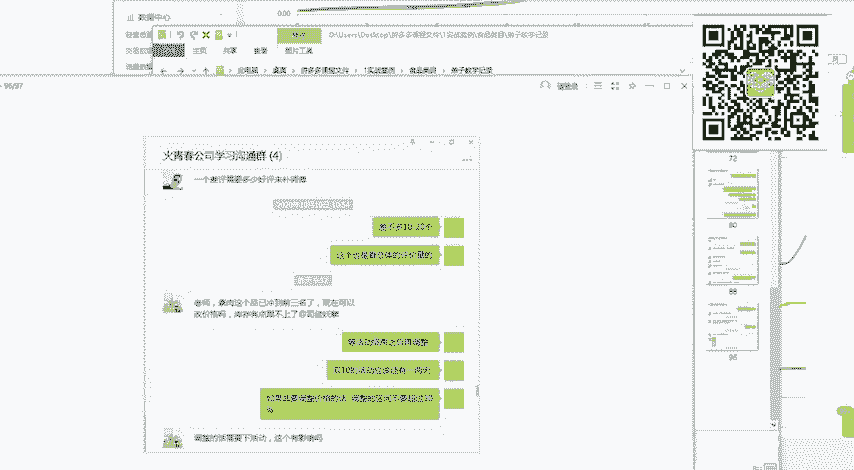

能明白速热这个产品就已经冲到类目前三了。类目前三的店铺2988都可以搞得好，为什么你做不好，明白吧？😡。

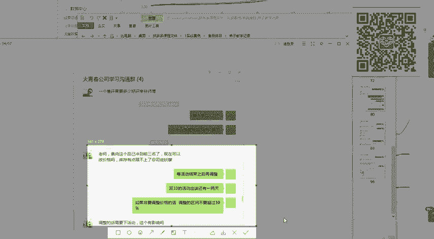

后期没有啊后期没有任何费用的啊，来了之后呢，所有的啊所有的资源我都是免费对接给你。然后呢，你需要用什么样的一个东西，你直接跟资源去谈就可以了啊，直接跟资源去谈就可以了，明白吗？后续没有任何费用啊。

一次性交费。😡，好吧好？呃，然后的话这个啊人生如烟，还有这个命运啊，命运多舛，能不能听到？听到的话公屏扣1啊，听到的话公屏扣1，我这边等你一下啊，这边等你一下。因为我现在啊确确实实就只有两个名额啊。

如果说你们两个啊先把名额给你们定下啊，给你们定下。😊，因为有很多同学在问你们两个是最先啊最先问的啊，最先问的，所以说先给你们留啊，先给你们留，你们确定一下，确定好安排好了之后直接截图给我，没有问题。

我们就直接开始了，好吧。😡，okK的O的，我看一下你如果说看链接的话，把这个呃链接直接发给我就可以了。链接发给我啊。😡，呃，多多进宝怎么做？多多进宝很好做呀啊很好做呀。我之前的最早开始跑的时候。

就是直接使用多多进宝来跑的。你找一个比较优秀的团长就可以了啊，找一个比较优秀的团长，这是我在当时操作的时候，多多进宝的一个呃数据啊，多多进宝的一个数据，最开始的时候可能给到的一个订单量会比较少。

但是说如果说你长时间坚持下去，或者是你给到的优惠是足够多的。那么一天跑个几千单，是没有什么问题的。看到没有？我一天可以跑1000单到2000单左右，所以说多多进宝走量还是非常给力的。😊。

前期像一些快消品啊、食品啊，或者是家居生活用品这种的啊这种的去做这个多多多多客啊，去做多多定宝是非常划算的，好吧。好，OK的OK的，那我们微信联系啊，那我们微信联系啊。

然后的话这个如果说有其他同学想要去进行学习的，可以直接加我的报名哥，或者是直接扫码添加我的微信。好吧，那今天给大家分享的内容呢啊到这里就结束了啊。如果说有想学的，抓紧时间啊，现在是这个618冲刺啊。

618冲刺啊，错过这个村可就没有这个店啊，因为学习是自己的事情啊，然后呢，你自己心里怎么想，店铺想要做成什么样子，对吧？想要给自己怎么样去进行提升这些东西呢。如果说你想要提升，我可以帮助你。

如果说你不想要提升，你就想这样浑浑噩噩的过下去，那也没有关系啊。因为你的人生不是我的人生啊，反正现在跟着我做的这些地址，他们都可以做的很好。好吧。好，那么我们今天的课程到这里就结束了啊。

大家这个下课啊下课。

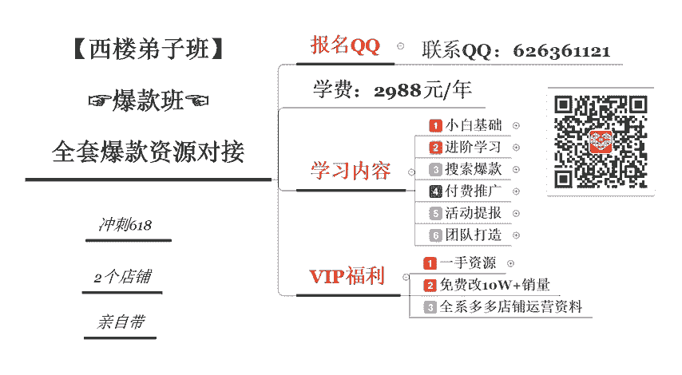