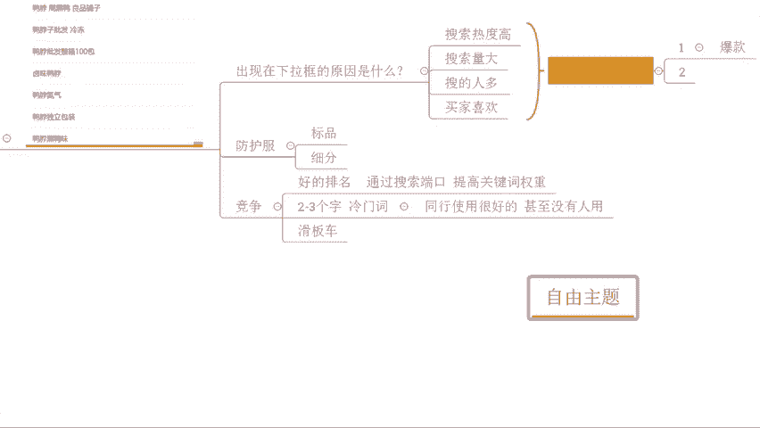
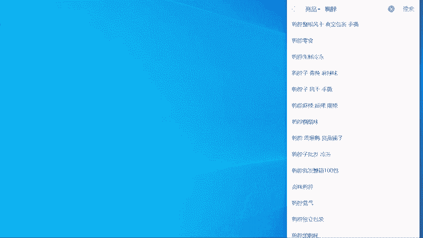
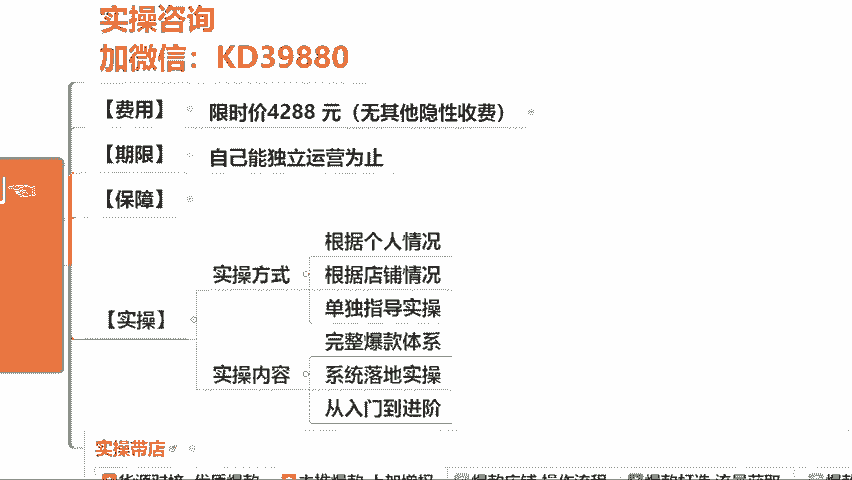

# 【拼多多运营实操教程】最系统的零基础拼多多开店教程全套，电商运营大佬专为学渣研制的新手开店保姆级教程！全程干货，简单粗暴 - P50：50、拼多多开店-搜索卡位实操技巧 - -拼多多开店 - BV1BH1qYpEqw

🎼看的理。🎼哪りがら。🎼他的呀。🎼当たリア。🎼なんだ那个。🎼个啷个个啷个一个啷。🎼阴天在不开灯的房间，当所有思绪都1。1点沉淀。爱情究竟是今生鸦痛，还是世寂寞？🎼无聊小。🎼养眼映成一滩光圈。

🎼我的照片就摆在手边，傻傻两个人。🎼笑得多甜。🎼开始总是分分钟。🎼都妙不可怜，谁都。🎼热情，他永不推荐，主的激情退役后。But do I fuck？🎼我跟你描述一个灵魂。😊，🎼他拥有不限的青春。

🎼每当夜色降临。🎼就会轻情歌唱。🎼调唱着一个新鲜的故事，里面的人们相互微笑。😊，🎼是不是每个夜晚都要这样为了爱？😊，🎼却用清心交换。🎼改变。🎼美丽世界的孤儿和我的心。😊，🎼我的家。🎼在哪里在哪里呢？

我的朋友。😊，🎼静静的听。😊，🎼个声音在说爱。😊，🎼闭上眼。🎼跟随他。🎼跟随他就像跟着希望，那些城市上空飘着一颗颗不安的心，他一定也曾在受跳和欢快的舞蹈。随风吹来，让我感到一阵闭嘴那破娑的身影。

太阳反光线，那些男孩一次次的将着清风。😊，🎼是否能抚平他们内心的内心的伤痕，孤独的热闹？😊，🎼我在山里走bo。😊，🎼bo雷声，拜拜拜。😊，🎼拜拜 one每。😊，🎼连心 no为懂等等。

🎼F game boy boy boys雷神拜拜拜拜拜晚。😊，🎼别。🎼你懂得。🎼热亮的道。🎼The。🎼我跟你描述一个灵魂。😊，🎼他拥有不限的青春。🎼每当夜色降临。🎼就会轻轻歌唱。🎼他唱着一个新鲜的故事。

对面的人们相互微笑。😊，🎼是不是每个夜晚都要这样为了爱？🎼去用情心交。🎼美丽世界的孤。🎼和我的心。🎼我的家。🎼在哪里？🎼在那里的我的朋友。🎼静静的听有个声音在说爱你。😊，🎼闭上眼。🎼知道。

🎼跟随他就像跟着西望，那着阵阵上风飘着一颗颗不安的心，他一定也曾在这跳拨欢快的舞蹈。😊，🎼风吹来让我感到一阵闭嘴，那破松的声音，太阳被关。😊，🎼那些男孩一次次的讲着寂寞妈妈爱。

是否能抚平他们内心的内心的伤痕。😊，🎼的热闹。🎼我带上你走bo boy boys，ulation拜拜拜拜 by晚 night。😊，🎼别心动为动荡。🎼No等 be飞 game boy。🎼波s连声。

拜拜拜拜拜 one奶天。😊，🎼bas no way龙等当等。🎼热亮的道。🎼这是一个放肆狂妄的。西风月声啊，这么快啊。可以的，你这小速度啊。蛮快的啊，呃，OK啊，那我们还是先测一下麦吧，好不好？

已经在直播间的小伙伴们啊，能够清楚的听到我的声音的，能够看到我这边电脑桌面的啊。声音跟画面如果没问题呢，公屏上呢来一起扣一个一，好不好？动作快啊，OK ok okK啊，来动作快啊呃。

声音各画面都没问题吧。所有人动起来啊，OK没问题，对不对？呃，如果说是有这种听不到声音的啊，听不到声音的，或者是看不到画面的。退出重庆。好吧啊，可以抓紧时间操作一下。OK没问题就行啊。呃。

那么正式的分享呢在我们两点钟开始啊，好不好？那一起呢可以先等一等那些还在路上的小伙伴们啊，大家也不着急啊，那么几分钟时间等一等啊。那么在开始正式的直播分享之前呢，老规矩对吧？按照国际惯例呢。

我们先把直播间的一些小规矩呢先说一说好不好？那呃搞清楚这些东西之后呢，也方便我们后面的一个分享啊，虽然说这些小规矩呢，但是我相信啊这些规矩呢不是来限制大家的，而是帮助大家更好的去吸收理解，提高自己的啊。

那么什么规矩呢？首先第一个点啊，如果说大家在直播过程中听到我跟大家确认。那么当前的这个问题呢，是不是能够听懂，能够听明白的话，如果能够听明白，能够听懂的话，记得第一时间回复我。

所以说第一个要求呢就是积极互动啊。不要说是我分享完某一个知识点之后，对不对？你懂不懂也不告诉我，对吧？让我在这里一个人唱独角戏，对不对？这样的话啊，那可能整个的内容后续的你们没有听明白的话。

那后期所有的东西呢可能你没办法去连贯起来。到你操作的时候呢，你根本就没法去操作啊，所以这个问题很重要啊，一定要积极互动，有不明白的地方直接告诉我，听明白的话，也跟我讲一下，对吧？方面呢我进行分享啊。

这是第一个点。okK除此之外呢，还有第二个点呢，什么东西呢？就是说ok啊，我来了啊，可以的。😊，第二个点呢就是说在整个分享过程中的话，我知道啊大家可能会有很多的疑问。但是呢如果说是你自己个人的问题。

对吧？是你自己店铺操作方面的一些其他问题。那么这个问题呢，等到正式内容分享完，单独提问，或者等到我下播之后单独问我都没问题的。那么在直播过程中可以提问。但是呢这个问题啊仅限当前内容相关的问题。好不好？

那么这个呢也是基于我们有很多很多小伙伴呢，可能是相对来说比较基础一点，对不对？可能说哎刚开始接触拼多多，或者是对于整个电商的理解呢会比较。这个浅吧啊，那如果说问题东一个西一个，对吧？他们可能就很难理解。

很难吸收。那包括说像我们在分享过程中呢，如果说这个问题呢东一个西一个的话，我现在大家也会觉得很麻烦，好吧？OK这个。因为你说哎这个第二阶段现第二阶段现在断流了怎么办？来啊，我问一下啊，各位呃。

你们有多少人是跟他一样的，有有这样的疑问的。说这个推广的店铺操作的时候呢，发现我在做这个付费推广啊，那第二阶段呢会断流啊，可以可以直接公屏上扣个一啊，我看一下好不好。有多少人是跟他一样的。

可以直接说一下。😡，OK啊，这个密啊，等我把这个几个点啊讲完啊，讲完我们就来讲这个问题啊，包括像我们的这个调野太郎啊，对吧？这个放大呃这个这个这个什么棒棒糖啊，对不对？还有我们的这个空白呀。

还有这个呃调，对不对啊，轻轻理啊拆清啊等等的吧。那我把几个点讲完，我们就把这个问题先梳理一下啊，趁我们现在还有一点时间啊，那最重要的刚刚讲两个点嘛，对不对？最重要的一个点呢，就是说在整个分享过程中的话。

你们可能会有到很多很多的疑问，对吧？那么这些问题呢，我会尽可能帮大家去解决掉啊，那如果说我分享的内容，确实是你自己没有做到位的地方，确实是你店铺需要操作部分，那么一定自己得去实操。😊，啊。

一定记得去实操啊。因为如果说你不去做你的店铺是不可能有结果的。再好的店铺数据，也不是说我去看视频看出来的，或者听直播听出来的，而是做出来的，好不好？包括像跟我实操的小伙伴们，他们的店铺数据能够做得起来。

也不是说看直播看出来的，或者是听视频听出来的，而是去做去实操的，好不好？OK啊，那我们现在呢先来把这个刚刚你们提到这个问题，第二阶段断流怎么办啊，来进行一个解答啊，刚好这个还有点时间啊。

那对于我们店铺操作来说的话，各位我们要去解决第二阶段。啊，我们要解决第二阶段断流。啊，这个属据牛逼是吧，还行吧。我们要解决第二阶段断流的话啊，其实我们要先搞清楚它断流的原因是什么。

我们把这个搞清楚之后呢，其实我们就好解决了，对不对？各位，如果说你现在是第二阶段断流，你仔细回忆一下，你现在推广的这个商品是不是新品。啊，是不是新品，大概率都是新品吧，对吧？

其实新品存在第二阶段断流的话，这个不是我们的原因，知道吧？这个是平台的原因。为什么这样说呢？各位，我们在进营推广的时候呢，分为第一阶段、第二阶段，对吧？第一阶段呢是一个数据累积的一个过程。

对吧那么这个个这个过程的话，平台为了去测试出更加好的产品数据，能够去挑选出一些所谓的爆款商品啊，它会在第一阶段的时候呢，给予相对应的推荐曝光。也就是我们俗称的啊扶持。这是第一个啊这是第一个。第二个呢。

产品本身的曝光呢是基于我们的标签人群的。对吧那我们产品如果说是新品，本身你是没有标签人群的。你的所谓的这个标签人群呢，只是我们产品的属性，对吧？产品的价格。啊，上面的价格等等啊。

这些数据给我们的基础推荐，起配到的这个所谓的人群，这个数据其实很小。对吧这个数据其实很小。那么经过第一阶段的推广，那么我们把这一部分数据已经消耗掉了。如果说你没有一个很好的放量。

如果说你没有很好的点击转化，那么这个过程它是不会去给你带来很大的人群沉淀的。它只是在消耗你的人群，各位这个逻辑能够听懂的话啊，能够理解的话，公屏上打一个一，好不好？这个逻辑如果说能够听明白的话。

okK动起来啊。好啊，如果说是有听不明白的，也可以直接说，没关系。啊，咱们反正这个分享嘛就是以能够去了解掌握为核心的，好不好？大家不用去说是有这个担心说是哎别人都听明白，我听不懂啊。

是不是显得我这个很很没面子，是吧？不好意思说，不至于谁都不认识谁，对吧？大家实事求是就好了。OK那么刚刚这个逻辑呢，大家能够理解就好了啊。那在这个过程中。稍微等一下啊，不要急啊不要急，逻辑跟上一步步来。

在这个过程中，因为本身我们标签人群小，再加上呢第一阶段是有到系统的推荐曝光。所以这个时候我们可以拿到数据，可以拿到曝光，对不对？但是进入第二阶段之后呢，这个曝光扶持会被回收，你就没有这个曝光了。啊。

当你没有这个曝光之后呢，你依赖的就是你所谓的刚刚讲到的这个标签人群。而标签人群呢，你没有积累。啊，你没有积累，就会导致你第二阶段烧不动。那如果这个时候我们去操作，我想提高曝光，我想提高我的数据。

大概率呢会有人想着说哎去加价。那是不是大概率呢会有人选选择去加价，有没有这样想的？来有这样想的小伙伴公屏上打一个2，好不好？有这样想的小伙伴，公屏打一个2。😡，出度外啊。OK啊个别啊个别会这样考虑。

确实加价是我们可以去获取曝光的非常有效的途径。但是兄弟们听清楚了，加价一定是最后的手段，你不要上来就加价，上来就去这毫无意义。那么这个是我们应该怎么办呢？听清楚，首先第一个操作，如果说你没有报活动。啊。

如果说你没有报活动，好，现在呢请去提报活动。啊，我们的平台的大促也好，我们的这个呃领券中心也好，我们的这个优惠券也好，所有的能去做的活动全部通通上啊，全部通通上好不好？

同时呢如果说你是已经报了活动的OK那么在这个过程中呢，去做一个重新提报活动的动作。而活动的价格。要比原来低。有一个降价的这个动作一个行为。那么提报活动呢是为了去扩大我们产品的推荐权重。

同时呢扩大我们的受众群体，我们的人群会变多，对吧？那么在做到一个活动低价的状态的话，那么这个低价行为呢也是会给到平台一个信号。我有在做优惠，那么也可以给到我更多的什么推荐啊，它是一环扣一环的。

那么刚刚也有同学说，哎，这个是不是要去做点这个数据是不是更好？OK听清楚了，没问题，确实是这个样子的。如果说这些东西你都去做了。好，听清楚连续三天。啊，连续三天可以去做一做单子啊，可以做做单子。

这个做单子呢重点维护两个数据。第一个数据呢坑产。第二个数据呢是我们的UV价值。好吧，第一个数据是坑产，第二个数据是UV价值。那么比如说现在呢我店铺的商品呢，正常的价格呢是呃客单价啊20的。

差不多这样子的OK那你每天去做够2000啊，每天去做够2000的坑场，听懂没有？能够听清楚，能够听明白，能够记住的公屏打一。换句话说，这个单量呢在100单左右啊，一个单呢这样去做啊，一个单这样去做。

那UV价值呢做到10以上。UV价值做到10以上，听到没有啊，坑产低客单的。两单啊2000啊啊或者是呃约等于。100单的量啊，连续3天去做，然后UV价值呢做到10以上。啊，这是低一客单的。

如果说你是高客单的好，不用去管总的成交的坑产啊，不要去管总的成交坑产，重点去做另外两组数据啊。等看啊，低一客单这个我分开写吧哈，这样子可能大家更好看一点，O放这边啊，然后高客单。

第一个单跟高个当中它考核数据其实不一样的啊，所以这里大家注意一下，那么重点做哪个数据呢？转化率。然后呢，另外一个呢，优惠价值。啊，有为价值。重点就这两个数据啊，转化率呢这边呢比如说我们是高客单的话啊。

做到10到20。啊，10%到20%。那UV价值呢好。50。啊，优惠效做到50，连续三天去做啊，连续3天。那么做完这个东西之后呢，产品的权重会被直接拉高。同时呢整个产品的。喷场提升呢。

我们的系统推运速度也会增加啊，这个是我们做了一个操作啊，另外还有一个东西啊，另外还有一个东西，如果说我今天去做了这些所有东西都做了，对不对？你去看一看你是不是产品的这个。呃，DSR评分还没有出。

或者是你去看一看你店铺的这个体验分是不是比较低。如果说这些东西比较低的话，那么你做这些可能做完这也没用的。所以日常的维护很重要。各位能听住能记住的啊，能听清楚能记住的小伙伴公屏上溜走一波啊，六走一波啊。

那么这里呢三个操作方式啊，三个操作方式可以同步去做，也可以分开去做都没问题。那最后的一个手段呢，如果说这些我都做了，都做到位了。好，那么考虑一下，是不是说我们现在的时间节点同行都在加大推广力度。

比如说马上不是到618嘛，都在可能大力推了，对不对？整体的推广的出价增加了啊，那么这种情况之下，哎，我再去考虑说我去做一个加价的操作。好吧，这个时候咱去做这个事情啊，没问题好吧？O那么时间也到了。

我们这个直播时间啊，呃这里呢就不去废话了啊，直接开始我们的分享吧。好吧好？今天分享的操作呢，也是我们这个自然流操作的一个方法啊，叫做搜索卡位啊，那么今天是一个实操部分的一个分享啊，O记下来是吧？

ok可以的，没问题，去试试啊，那呃整个操作过程中呢，这里我要提醒一下啊，是没问题啊，包括像我分享的这个直播内容也一样的啊，很多人都说哎楼哎，你分享这个内容呢真的很干了，对吧？真的很详细啊。

我觉得我听懂了，我觉得我这个店铺操作我都没问题了，我想自己试一试，对吧？这里我我我讲清楚啊，是没问题，但是你要搞清楚你到底是不是真的掌握了。如果说你真的掌握了，确实这个方法是对应到你店铺合适的。

你去试没毛病。但是如果说你没有完全掌握，你真的是那种似懂对懂的状态的话。😊，不要乱试。不管你做任何操作，肯定都会有投入的。我不希望你们的投入呢，是属于那种打水漂。各位没问题吧，能记住吧。

能记住公屏扣一好不好？所以这个很重要啊，包括像很多小伙伴说我觉得店铺操作吧，对不对？我这个确实我觉得一开始呢我想找一个人去带带的对吧？但是听完你的分享之后，我发现啊确实这个思路很清晰啊，我虽然就掌握了。

对不对？我自己试一试对吧？很多人这么想的，确实有这种人啊，然后试呢就乱试是吧？瞎试啊，搞了最后呢自己这个钱花掉了，对吧？店铺也没搞起来，对吧？就很浪费啊，好不？好不好？

那今天呢讲的这个东西呢是我们整个的搜索卡位的一个实操技巧，对不对？😊，分享呢还是老样子啊，我还是以提问的形式来啊。不过呢这里我要提醒大家，对吧？前几次呢有很多小伙伴在我直播间里面呢去做笔记。😡，啊。

做笔记。这里的话我重点说明一下，在我的直播间，你们不需要做笔记。啊，在我的直播间你们不需要做笔记，你们唯一要做的就是能够去跟上我的思路啊，认真思考。好不好，然后呢积极互动。把我分享的每一个点。

你真正意义上记住了，消化掉了，这个才重要。因为很多人做笔记呢，本身我这个语速呢可能有的时候也会比较快，对吧？我讲了这些东西，可能第一个点已经讲完了，你不可能马上记录下来。然后呢。

到后面我讲第二个点的时候呢，你还在记第一个点，最后呢发现一堆问题没听到一堆问题没记住，一堆问题没有记掉，对不对？就会脱解掉啊，就很没有意思了啊，O那么同样的啊，我在做直播分享的时候呢。

还有到一个习惯呢就是提问对不对？这个大家都知道的对吧？所以今天呢我们还是以提问的形式开始啊，那么跟上我的思路，那思考这些问题，对你们的店铺操作的对我们的这个吸收理想呢也会有很有帮助的。这里我说一下啊。

O那么就开始了第一个问题啊，第一个问题各位那么店铺操作啊，你们认为店铺运营它的核心数据。😊，啊，是什么？各位来这个问题啊发在公屏上了之后呢，大家把你们的答案可以发出来，好不好？来各位思考一下啊。

思考一下，把你们认为正确的答案，把你们自己想要的答案发出来啊，发出来，认真思考一下啊，结合到你们自己的一个理解或者是你有之前听到我分享过的都没问题，把，你认为对的答案发出来好不好？

这个问题大家一定要去想啊，一定要去想啊，很重要啊，很重要好不好？那么如果说哎你说哎哎呦，这个不好意思啊，我这个是纯心手，我我小白来的，我我对这些东西不了解没关系，你可以打一个问号好不好？

你直接在公屏上打一个问号都没问题的啊，都可以的。😡，大家可以认真的去思考一下，把你认为正确的，把你认为对的答案发出来。OK然后这个我和说哎是这个销量啊，还有转化率。然后这个呃WIN啊。

说哎有这个点击率啊啊，除以支付量啊，是或者是支付量是吧？支付量啊，OK然后呢，这个西西啊还是倩倩啊，这多音字啊，说访客对吧？啊，或者是吧okK啊或者啊是点击率或者是这个支付量啊。okK还有别的吗？

各位有没有要补充的，其他人呢？啊，我点个名吧，我我发现你们这些人都不爱不太爱去思考，或者不爱去说话啊呃，西风先西风越深啊。😡，你今天是第一个进直播间的，对不对？没错吧，来来来来来，你你你认为是什么？

说一下啊，你认为说一下，你认为什么说一下啊，然后这个将近就是说点击还有转化啊，点击要转化啊，西风月西风月声，来，你说一下还有我们的这个直子啊，漠世对吧？啊，都可以说一下啊，都是些老熟人了，还有维尼啊。

维尼也可以说一下啊，对吧？还有敏啊，很多都是老熟人了，对吧？也不是说啊第一天认识了，对吧？大家可以畅所欲言没关系的啊，好不好？大胆的说出来，不知道的话，打个问号啊，兄弟们好不好？这个效率要跟上啊。

有没有在永远认真思考，你们我有的是候在怀疑啊，我有的是在怀疑你们你们在我直播间里面过来是干嘛的，对吧？是在这个挂经验吗？😊，是不是？😊，OK啊，然后西风月声说搜索率啊搜索率。啊。

还还创造出这么一个词来啊，可以的啊。还有没有？😡，还有没有啊，其他人呢？😡，我们直播间这么多人，其他人呢都要干嘛？😡，是呃没有思考这个问题，没有想过这个问题，还是说你你这个就完全没有这个概念啊啊。

可能他自己了解到的一个东西吧，或者是他自己命名的吧。他对于某些东西呃。😡，我我我猜啊，我盲猜一下啊，这个应该就是搜索量啊，或者是搜索热度啊我盲猜一下啊。嗯。😊，对吧我说这个搜索率是什么，对吧？

其实我也很好奇啊。😡，很多时候呢我们作为这个呃新手，可能有的时候对于某些东西呢理解的不是很透彻，就会按照自己的理解去做一个定义，对吧？啊，作为一个定义啊，这样子有的有的有的会有这样子的啊。啊，对啊。

搜索搜索率对吧？搜索率就是搜索热度跟搜索量是不是OK只是说这个访客UV啊，访客。因为。呃，是不是关键词的搜索量啊，应该是这个意思了，对吧？这个这个这个其实是搜索热度跟搜索量啊。

应该是这样他想表达是这个意思啊，他想表达应该是这个意思啊，问题不大，反正我们知道就可以了啊。好，OK行了行了行了行了啊，好，我就不去等了啊，我发现很多人真的是啊在直播间里面不吭声啊，呃，这里啊。😊。

我是谁，我就不去说了啊，你们自己心里很清楚，谁在直播间里面自己。😡，就是一声不吭的这种啊，你们这很清楚。呃，这么说吧，你如果说只是来直播间里面听一听，其实意义不大的。我们相互交流，相互去分享。

我觉得这个对我们提高会更有帮助，对不对？同样的，如果说在直播间里面，你自己都闷不吭声的对吧？我不记住你的状态，说实话，我想帮你，我都帮不上，各位？是不是这意思？包括说后面你说哎其实我有问题我要问你对吧？

当你有问题问我的时候，你想一想你在直播间里面的表现，你想一想你在对待提升方面的这个这个态度啊，你再来考虑一下要不要问我，如果说你觉得O你的态度没问题，啊，你只是在忙别的那我觉得可以理解啊。

但如果说态度有问题，这种情况的话，后面你来找我，对不对？可能很多时候我可能也不会去搭理你的啊，这个我实话实说对吧？毕竟我也没那么闲，对不对？我大多数时候其实都在做这个带实操。

像我直播都是很少挤出时间来的，所以大家应该。更加的去珍惜这个时间吧，好不好？O啊呃不废话啊。那我们回过头来看一看到底什么数据是我们真正意义上核心的数据啊。其实这个东西呢嗯大家说的都有道理啊，这么说吧。

大家说的都有道理啊，但是这些数据在我们整个店铺运营过程中，它虽然说有趣考核，但实际上在算法上啊有有时当然了当然了我有带实操啊，有待实操啊，那在我们整个的店铺运营过程中，这对我说一下啊。

那么它是有到侧重点的考核的。我们可以模拟一下啊。😊，啊，我们可以模拟一下这个店铺数据产生的过程啊。好吧，我们模拟一下啊。首先今天假如说我们自己作为一个买家，对不对？我要去买一个东西。对吧。😡。

这个时候呢，我肯定是会有到一个非常清晰的目标的对吧？我会我会有到一个非常清晰的目标，我的目标明确。啊，我想要去买一个衣服，我想买一双鞋子，我想要买一双这个袜子啊，我想买一个杯子，我想买一部手机。

或者我想要买一个篮球，我想买一个什么电脑，对不对？我会有个非常清晰非常明确的一个目标。各位没错吧。那在这个时候我作为一个消费者，我想去购买这个东西。那我可能会去打开我们的APP对不对？打开APP之后呢。

我要去找到我所需要的产品，我通过什么方式去找。我不会说我在首页里面慢慢去翻吧，对吧？我会去这个在各种的这个活动页里面慢慢去找吧。这种概率其实不大的，最直接最高效的方式肯定是通过搜索词去完成这个动作。

是不是？没错吧，我们可以思考一下，对不对？这个我们日常购物的时候就是这个流程的呀，我要去搜索产品的呀。当我搜索的时候呢，这个时候okK平台就发挥了作用了。平台呢会根据我们的关键词来进行商品抓取，对吧？

这个是我们搜索的关键词啊，我们搜索这个关键词之后呢，平台会根据这个关键词进行商品抓取。那么抓取这个过程中呢，首先我们所看到的这些产品一定是在对应的这个关键词下面，我们所谓的有权重的对吧？

那么产品曝光呢一定是什么？第一个点呢是啊标题啊有包含是吧，有包含。同时呢对应到这一个产品呢，在对应的规键之间面呢，有权重啊，我们说的有权重啊，这个时候呢它才会进行抓取，对吧？才会得到抓取。

那么抓取的时候呢，谁排名靠前，谁排名靠后，okK的这个呢就是我们平台的考核对吧？通过权重来进行计算，那综合排序里边的话，考核的时候呢，会考核我们的销量评价啊，包括说我们的这个呃其他的这些综合数据。

对不对啊，我们的这个收购啊等等这些问题都会考量啊，那么这个东西呢，具离怎么去考核，我们现在先不管它，那逻辑我们先理顺啊，那这个时候呢，当用户。能够去看到我们产品的时候，我们商品能够完成这个抓取的时候。

我们得到了所谓的曝光，对不对？用户看到我们产品。那我们产品进行展示，能够去有到一个很好的呃吸引用户的点啊，能够去让我们用户产生兴趣，能够吸引消费者。那同时呢能够去呃得到一个点击对吧？得到点击。

形成一个访客。是不是？再样往后呢，用户进来我们店铺之后呢，通过对我们商品的浏览，对吧？了解到我们产品了，觉得我们产品还不错，对吧？我们的产品呢对它有吸引力啊，能够去满足他的这个购物需求。好。

这个时候呢确实也不错的话，它可能会形成什么呢？形成一个转换，对吧？得到一个订单。得到一个订单啊，那么这个时候呢，我们整个的交易就可以完成了。是不是这个过程没毛病吧，各位没毛病的话，公屏扣1啊。

这个过程没毛病，公民扣1。😡，啊，动度快。好，那这个过程大家都很熟悉，我我相信我们每个人都有去有过这样的一个这个使用过程跟体验，对不对？那这个过程中实际上就涉及到了我们刚刚讲到的店铺运营的核心数据。

哪些数据呢？听清楚三个重要的核心数据。第一个数据。流量。啊，当然这个流量呢，我们也可以把它化等于说什么访客。好吧，这是第一个数据。那么再一个呢就是我们的转化率。啊，再一个就是我们转化率啊。

再往后呢就是我们的客单价。这三个数据是我们的核心数据。那为什么说这三个数据是核心数据呢？各位，你想要去卖货，你就必须有访客，有流量，对不对？你没有访客，没有流量，你的店铺是不可能有订单的。没错吧。😡。

当然呢，如果说你有访客不转化，你转化率很低，平台也会判定说啊，你这一个产品呢这个对我们的买家吸引力不够，你接不住。流量啊，你的流量承接能力不行。那么后面呢可能你整个店铺的访客呢也会下降。

你们有没有这种情况，就是说哎，今天我去上传了一个产品，我产品呢已经发布了，发布之后呢，确实我的产品呢能够去获取曝光，它虽然说是一个新品啊，但是它能够获取曝光啊，能够得到访客，访客呢也不多。

可能有几十个百来个对吧？几十。啊，几十个百来个。啊，多了可能有个一两百个啊，多了可能有个200左右，对不对？那这个时候如果说给到你这样的数据，差不多维持3到4天，你要是不转化。

或者你的转化率一直上不去很低。那么后面呢你的访客会直接断崖式的下降，甚至是贴到谷底变成零。然后呢，在那里死气生生的死活上不来，有没有遇到过这种情况的，有遇有遇到过的公屏上打一个打个6好不好？

有遇到过的这种情况的，公屏打个6，有是吧？OK这就是问题啊。那你想一想嘛，一开始你的产品上架之后，哪怕是一个新品平台，觉得哎你的产品还不错呀。那然后呢，他给你推荐曝光了，让你去获取到了访客数据，对不对？

你接不住，你没访客，给了你机会，你不中用，他还会给你机会吗？😡，对不对？就跟这个这个两两个小情侣是吧，出去约会一样的，对不对？女孩子说啊。😡，我今天这个出回出门没带钥匙，回家太晚了，这个进不去房门。

你说啊没关系，我给你开个宾馆，对吧？😡，是不是那不是扯淡嘛，对吧？给你机会你不中用啊，是吧？你你能怎么样，对不对？你还有结果吗？你没有结果了呀，就对吧？所以这种情况啊，他说哎我没有带钥匙。

我回家好呢进不去门，哎，你说哎没关系，可以去我家，对吧？哎，水到渠成，对吧？那我们平台给了你访客对吧？哎，你说有访客，那我要成交，你不成交了行吗？那是不行的，是不是？就这个意思啊。

那然后呢在整个过程中呢，我们店铺呢，他除了考核流量考核转化率之外，还会考核我们的客单价。😡，各位相同的商品，同类型的商品啊，那么它的价格啊，它的价格在相同的价格定位里面是会进行考核的。

对吧是不已经考核的，在相同的价格定位里面，你的客单价越高。你的群众也大。对不对？同样都是卖袜子的，同样的这个目标人群都是这个10块钱以下的人。别人在你店铺里面买一次买一双，2块钱。

在别人店铺买一次买1双对吧？20块钱，你说那平台给谁流量呢，那肯定是给那个客单价高的人了，对不对？客单价更高的话，它的整体的啊流量的啊产出，它的UV价值就更高啊，那么这个时候呢。

我们整个商品的权重也会更高。这也是为什么说之前你们说哎西，我第二阶段我没有办法去拿到曝光。我说UV价值很重要。而且不管是低客单高客单都会有到UV价值的原因，能理解吧？所以这几个数据是很关键的一个点啊。

那对于我们很多小伙伴，我我说实话啊，这个东西有的时候我都很害怕。😡，就因为你们目前这个状态呢，做店铺肯定是会亏的，你知道吧？😡，对不对？你想想嘛，你本身你自己没有方法，没有经验，没有思路。

你操作店铺呢都是说去试对吧？今天这里试一下，明天让你试一下，你这个店铺操作能做起来吗？很明显不太现实，是不是？像跟着我实在这小伙伴你们可以看到的对吧？啊整个店铺提升其实很快速。😡，那为什么说是很快速呢？

因为他们是会有到一个完整的爆款制作体系的做店铺呢也会有到一个非常清晰的思路。那这样子我们去操作的时候呢，才会有到一个很好提升，对吧？那这个说哎亏了大几千了，对不对？你这个还算好的啊。

我见过那种亏几万几十万的都见过的啊，好不好？你看像这些店铺来这个店铺做墙纸的强强贴的啊，看到没有？对不对？这个店铺做馒头的，你临反馈的新店起来的，对吧？

那么到底说这些小伙伴他们是的怎么样的一个这个思路去做的店铺呢？有什么样的一个思维模式呢？那我们这里重点来说一说好不好？也是你们目前所欠缺的一个东西，很多时候我们做店铺啊，兄弟们，就是思路问题。😊，啊。

就是思路问题。如果说我们现在做店铺，你说你每天做什么你都不知道啊，你这个每天要干嘛，你也不清楚，每天只是在那里发呆，你说你店铺能做起来，那也是么？也说这个真的是祖上烧高香了，对吧？这个冒祖坟上冒气烟了。

这种状态，对不对？但是很很明显这种情况不太现实，对吧？所以说如果你们真的是有一天说哎我自己确实是没思路啊，我自己确实想要把这个店铺好好做好的话，O的啊，可以跟着实操是吧？我帮你去建立这个思路。

我帮你去找到这个操作方法啊，我给到你一个清晰的运营，对吧？这个方式对吧？让你去提高没问题的啊，那这里我们所说的这个思路到底是什么好。目标分解啊，这个这个词大家记一下啊，目标分解。如果说你是做运营的。

公屏上扣个一来，兄兄弟们动得快啊，如果说你是做运营的，公屏上扣个一。如果说你自己是老板，自己是这个创业者的一个身份的话，O公屏上扣一个6，好不好？我来看一看大家的一个情况啊，自己是运营的啊，喂。

我就是一个普普通通的店铺运营，我就是一个这个员工扣个一啊，我自己在创业，我在开店，我想要去做自己的老板的，OK扣个6。😡，好，okK啊啊大部分呢是扣6的，也有个别小伙伴呢是扣一的啊。好。

大概我知道了情况了啊那。作为运营，我相信你们一定有经历过这样的一个事情。老板说哎，你出一个运营计划吧。对吧你出一个运营计划啊，我们看一看对吧？那如果说你自己老板，自己是创业者的话，okK的那你一样的啊。

你也需要去给自己制定一个运营计划，是不是？如果说你没有这样的一个东西的话，你去做店铺的话，你就没有章法。😡，那这个运营计划到底怎么做呢？OK的，我们一向有一个词叫做以结果为导向，以数据为依托，对吧？

这是我们做运营经常听到的一句话，以经人说的一句话。那么以结果为导向呢是我们最终店铺操作的一个结果。我们最终的一个数据。啊，那对于这样的一个操作情况来说的话，OK的。😡。

我们可以以我们想要达成的这个最终结果呢，作为我们的目标来分析我需要做什么。好不好？像这一个点的话，很多小伙伴是不具备的啊，包括说之前有一次是哪哪天我忘了啊，我直播时我也问了大家这样一个问题。

很多人是不清楚的，而且是没有这个概念的，对不对？那这种情况呢，我们可以去完成这个事情对吧？啊，那么这个动作啊，来可以看一下，假如说今天哎那我就以这个店铺来举例子吧啊，因为这个店铺是一个新建起来的嘛。

我们就来这个店铺举例子，假如今天啊我说呃我是卖馒头的啊，我希望呢我一天能够去呃做到5万的营业额啊，打个比方啊，因为他现在只有3万0嘛，对吧？假如说我现在是做馒头的啊，我希望我的营业额一天能做到5万啊。

我能够有到一个这个呃五六千的一个存利啊，打个比方，我这样去做O。好，那这个时候呢，我们就可以把我们的结果先抛出来。我们的结果是什么呢？我们的结果是我希望达成1个5万的营业额。对吧我希望呢我的毛利呢。

我的这个利润呢可以做到10%，对不对？可以做到10%啊，可以做到5000。好，那这种情况之下，如果说我们是有这样的一个目标。那么我就可以去反推啊，我就可以去反推。我要达成5万营业额的话。

那我自己商品的客单价是多少？我要卖多少的单。各位没问题吧。比如说我现在我的客单价这边是多少来的，我们来看一看啊。😡，呃，17块对吧？我就当我的客单价15块好了，好不好？我就当我的客单价15块好了。

okK15块是我的客单价。那我要卖5万一天的营业额，我一天需要多少单？各位。😡，来一起把你们的答案发出来，好不好？你们算一算啊，好不好？这一个我希望大家能你们能够自己动手算一算啊，然后把答案发到公屏上。

没问题吧。😡，可以吧。😡，来来来来算一下啊算一下，让我亲亲你来，你算一下对吧？让我亲亲你你算一下啊，像你自己的话，说实话，对于这方面你是很欠缺的啊。你一直以来的话。

像之前做这个搓衣板呢也是迷迷糊糊的懵懵懂懂的对吧？起来了啊，还不错。那到后面呢你做这个防护服之所以啊没有办法得到一个很好提高。其实很多时候呢，就是因为这方面的问题，你没有去思考透彻，好吧？

所以这是很关键的一个点啊，3333然后有说3300单好吧？啊，到底多少单？有没有一个标准答案呢。😡，有没有个标准的，到底多少的？你们你们这两个人怎么说出来，但的还不一样啊。😡，我盲猜一下啊。

应该是这个3333单，对不对？没错吧？啊，我希望我达成到5万的营业额对吧？除不进是吧？O除不进的话，那就是3334啊，好不好？要多一单啊，多个0。7单啊，多个0。7单啊，那这个是我们最终的结果。

我想要达成这样的一个交易额，我要的单量是3334单，那么3334单的单量，我们要去做到的话，那我应该去得到多少的访客，这个是我们要做的事情，对不对？来，我们一起反对一下啊，那转化率的话，像我自己啊。

我我不知道你们的品类是什么。我也不知道你们的一个这个操作的一个一个效果到底怎么样啊，反正我自己目前来说，像做食品类转化率能够做到个15%，应该是问题不大的啊，像他这个店铺转化率我我们没看啊，O到15。

31%啊，它的转化率对于我来说是达标的啊。😊，对于我来说达标的啊，食品店的话做到15%。31%，我就达标的啊，十5就可以了。😡，那么这个是我自己的一个操作店铺的一个一个一个一个状态啊。

那么呃十5的转化率的话，okK我们可以再反推我需要多少的访客。对吧我需要多少访客来继续继续算啊，继续算。既然说你们刚刚都算过了这个单量啊啊，3334单，对不对？那我现在呢我来问大家啊。

你们如果说要做到这个单量的话，需要多少访客啊，按照15%转化率来算啊，15%总化率来算啊，好不好？那么快啊，帮我算一算啊，然后这个让我亲听你没有有在认真听吗？有在的话啊，来算一下啊。

刚刚这个单量你都没算的啊，刚刚这个单量你都没算的，可以算一下啊。😡，5万。不会吧。😡，不会吧，这这这怎么可能是5万访客呢？这个用脚趾头想的不是5万访客啊。😡，是不是你你不要逗我啊不要逗我啊。😡。

这个多反看呃，有如果说有不会算的啊，没关系啊，我先说一下，如果说有不会算的小伙伴直接说我不会就好了。😡，好吧，直接说我不会就好了啊，25000左右吧啊，你们这个太不严谨了啊，莫是说2万多啊。

2万多OK的啊，我自己算一下啊，指望你们真的指望不上了啊。呃，26000啊，我的天。我我算一下我算一下啊，你们这个这个让我有点有点着急啊，OK啊。😡，好O好算不帅啊。😊，我我就奇怪你们这怎么算的啊？

对啊，是22000。😡，226个啊，这是我们的访客量啊，这是我们访客量啊。好，各位我想。😡，我想问大家啊我想问大家，那这样的访客量你们觉得难吗？😊，这样的反跟你们觉得难吗？😡，嗯，这样的反间呢。

你们觉得难吗？😡，哎，我作为一个店铺，我想去做这样的反客量，你们觉得难吗？😡，各位觉得难的啊打一个难字啊，觉得难的打一个难字啊，觉得不难的啊，有机会的没关系，打一个6好不好？速度快啊，我看一看啊。😊。

我现在每天差不多26个。😊，难。我跟你们讲啊，之所以你们会觉得难，还是因为你们方法没有掌握到，知道吧？你可以看到像这个店铺对吧？这个也是新店啊，做自然流的啊，这个店铺做自然流新店来的，对不对？

虽然说他的访客没有做到我刚刚讲的这个2万多对吧？啊1万他只做到14000，但是后面机会很大的啊，后机会其实很大的。现在他的一个访客数据其实都已经啊不少了啊不少了啊，从你访客啊，从你访开始的一个一个新店。

对不对啊？这个数字我看到就是我行吧行行啊你看到啊这个单量2100单15。3亿的转化率说实话，那如果说我们去做店铺的话，你真的意义上能够去把这个转化做好，能够去把这个流量消化好的话。

自然流的推荐其实不少的。😊，我们拼多多平台是有自然流的。之所以很多时候你们听到说拼多多平台没有自然流要做付费推广，很多时候是因为你们不会去做。那这样的访客税你们觉得难。

但是呢刚刚我们回过头来在网上看一看啊，导一波来这边的话，我问到我大家一个问题。我说你们有没有这种情况，就是说一个店铺，一个产品上架之后，你什么都还没干一个新品，对不对？啊，平台给了你几十个几百个啊。

这样的一个访客。你们说有对吧？是是哪些人刚刚之前那会说有的，有遇到过的，有遇到过的，来再一次打个一好不好？来再一次打一个一好不好？啊？你店铺是一个新链接，新品的状态，你什么都没干啊，你上来之后呢。

他能够给到你个几十个啊，或者是1百来个或者200个访客对不对？多的话，一般200到400最高是400了，差不多这样子的如平台就这个调性的啊，最多也就400左右的访客啊，就是这样的一个一个情况啊。

有遇有遇到过的啊，有遇到过的公民打一啊，这么多的遇到过拿来啊回过头来看一看。那如果说当你们遇到过这种情况的时候呢，你能够去承接这个流量，你能够去把转化做的很好的话，我相信你们这个访客肯定可以提升的。

对不对？我们也不说你这一个链接就干到2万访客吧，你干个几千个访客问题不大的，对不对？你能够有到很好转化的话，你的访客会不断放大，对吧？你说我一个链接没什么都没干的情况下。😊，客做到200做到300。

对不对？啊，我把它做好了，转化能够做好的话，okK他做了个5001000，这是2000，应该是很轻松的。这个大家承认吗？如果大家承认的话啊，公屏上打一个6好不好？啊，当我们能够去做这个承接的时候。

它的访客会放大呀，对不对？这个我觉得是合理的吧，是吧？应该应该好理解啊，应该好理解。所以这种情况之下，但凡是你把这个流量接住了，你能够去很好的转化的话，OK的那你的访客应该是不用愁的。😊，对不对？

那如果一个链接我们可以做到这样的数据的话，多几个呢？我能够去不断的把这个税放大呢，我能够去把它从200放放大到400，放到到800放大到1000，放到2000，不断的去把它扩大呢？可不可以？当然可以。

如果说你能够去把它的转化跟我一样，做的一个比较高的一个水平。那么你的反客一定可以提高。好不好？来给你们看这个店铺啊，这个店铺是做这个呃玩具的啊，做积木的啊，做积木的啊，来给大家看一下。😡。

这个店铺的订单量不多啊，来各位这个店铺订单量不多的。其实啊对吧？最早的访客只有多少个啊几百个啊，最早访客只有几百个啊，一直维持在这个样子，不上不下啊，不上不下。后面呢就做了这样的一个调整之后。

可以看到啊，它转化率呢后面做了13。27，不算特别高啊，这个转化其实不算特别高的。但是呢这个转化在同类型商品里面已经算不错了，对吧？已经算不错了。来可以看到这个数据啊。😡，转化率对不对？

最早的话只有多少？4点几对吧？四点几我不到嘛，4点几啊。那么4点几的时候呢，整个店铺的访客几多少个来几百个，对不对？几百个。当访客没有得到很好提高的时候呢，我们把转化拉伸上去。看到没有？我们的优化转化。

通过我们的啊这个操作啊，优化我们的转化率，转化率在拔高的这个过程中来整个转化率拔高的这个过程中，哪些东西会提高。我们产品的坑产，我们产品的UV价值，我们产品的客单价等等，这些数据会提高。

当它这一提东西提高之后，来再回过头来看一看。看到没有？整个的店铺数据访客从这边转化上来之后逐步的在提升，而且是非常稳定，持续的增长。到后面呢，整个转化稳定之后，访客拉伸速度非常快。看到没有？

这一趴从从从这儿开始，看到没有？从这儿开始啊，这个是十几号12号左右啊，12号左右开始，访客非常快啊，为什么？因为在10号左右的样子，转化达到顶峰，而且是属于一个相对稳定的状态。各位有没有问题？

所以说当你能够去获取访客的时候，转化要做好，要能够去把我们店铺的流量消化掉。各位这个逻辑没问题的话，公屏上八扣一个好不好？啊，这个问题没问题的话，能够理解公屏上8扣起来。😡，啊，巴扣起来啊。

我希望你们每个人做店铺都能够把店铺做的风云水起，都能发财啊，好不好？给你们说个情醒话好吧。😊，ok了O了啊，行行行行啊，那这个时候问题来了呀。😊，很多时候我们自己做店铺的时候是没有一个清晰的思路的。

对不对？我可能没有去拆分过我们的这个目标，我也没有去思考过我的订单怎么获取，我也没有去想过我的访客怎么来，我是没有思路的。我每天做店铺呢，整个操作什么呢？啊，没有没有方法。😡，啊，也没有经验。

对吧也啊没有资源啊，每天做店铺呢就是在浑浑噩浪费时间，是吧？整个过程的话，时间浪费掉了。😡，啊，然后呢操作的这个资金浪费掉了。而且还会把机会浪费掉。对吧哎我们平台给了你访客，你不转化。

这不就机会浪费掉了吗？包括说像我们现在对不对？618都已经开始了啊，你说你还在那里磨阳工，对吧？不知道是干嘛？那你这个不就是在浪费浪费浪费你的机会吗？对不对？这个过程你的这个成本啊。😡，很高的。

尤其是时间成本，这个追不回来的啊，包括说我们的这个操作成本啊也都很高的。所以这种情况之下，如果说你们真的后期啊是想要好好做点诚绩做店的话啊，这个地方后面的话可以跟着一起实操的，对不对？

这个我我是我是认真的啊，我是认真的。而且说实话我以前我经常说这个这个这句话啊，可能你不会觉得。😊，不爱情很刺耳啊，什么什么什么话呢？就是说你们很多人做店铺呢，真的跟开玩笑一样的，知道吧？😡。

真的是这样子的。啊，做这个店铺跟开玩笑一样的，搞好玩一样的，对不对？哪有什么好玩的，对吧？这个是一个很严肃的事情，对吧？😡，那么我可能说话啊就比较刺耳啊，但是这个实话实说的啊。

很多时候呢我们这个呃费用的话啊啊这个4288啊4288啊，有兴趣可以直接微信找我啊，这里我就不去多提了啊啊啊说句实话是，这个这真是这样子的这这这样，我我不会去说什么漂亮的话对吧？

那哄着大家说漂亮的话没有用，把事情做漂亮才行。各位大家同意吗？同意的话，扣个一好不好？如果大家同意的话，扣个一。那我去给你们说漂亮话，哄着你们坐垫说，哎，这个坐垫多好做啊，多好赚钱。😊，有什么用？

有什么意义没有意义啊，没有意义，对不对？我们能够去好好的把店做起来，少去亏点钱，多赚点钱，这个真是实在的啊，对吧？呃，一个月都不是不是啊，一次性收费的啊，没有说一个月啊，带到独立运营的啊。

带到独立运营的啊，好不好？呃，这样吧这样吧，我我先简单的说一下这个实操的这个方式吧。好吧。既然说你这边想了解的话啊我先简单说一下这个实操方式，跟我实操的话，是针对到店铺进行单独指导啊，听到没有？😡，啊。

不用你去看什么视频，听什么直播啊，是这样子的那我直接真正定不进指导。那么这个价格呢，我刚刚也说到过的，对不对啊，这个价格。😡，现实价啊。见识一下啊。4288好不好？那么针对店铺来进行单独指导。

不用你去什么，不用你看视频。看直播啊，那么直接把指照开给我之后呢，我针对店目去分析，告诉你怎么去做就可以了啊。那对于整个的实操内容的话啊，是针对店铺进行的。针对。你打开了。好吧。

那你自己店铺目前的问题是什么？我会告诉你，然后呢，针对性的给到你解决方案，你可以清楚的知道怎么去做啊。这个东西呢我简单说一下就可以了。因为我们这个内容呢还没有分享完啊，大家可以认真听一听啊，有兴趣的呢。

可以直接微信找我就可以了，好吧，我这里呢就不去多提啊，大概的这么一个情况，当然如果说还有什么其他地方不清楚的，可以直接问啊，那对于整个的操作，刚刚我也讲到过，对不对？

我说你们很多小伙伴做天铺跟开玩笑一样的，你们可能有很多小伙伴不服的，我知道的啊，今天在我直播间肯定有这种人哎说这个，你这个说话多少有点狂，对吧？谁谁做天跟开玩笑一样的，对吧？我我明明是很认真在做。

对不对？上一次呢我给你们打了个赌，对吧？我说我赌你们发布商品都不会。😊，还记得吗？最后我赌赢了啊，最后我赌赢了，对不对？今天我想给你们再打一个赌。😡，来，有多少人在直播间的？来。

目前有在这人听直播的公屏上小姨走起来，好不好？我再给你们打一个赌，赌什么呢？就读你们连标题都不会写。😡，好吧，我就读你们连标题都不会写，有没有人不服的不服的小一口起好不好？OK啊啊，还不少人啊还不少人。

😡，啊，上一次呢我赌的是你们不会发布商品，对不对？今天我赌你们不会写标题。😡，啊，今天我嘱你们不会写标题。😡，你们不要不服，服不服，我们等一下见真章，对吧？现在不服没用的啊，现在不服没用的。

上一次也很多人说，哎，西楼这个发布个商品嘛，这有什么不会的，对不对？我都发布了很多了啊，最后发现确实不会，对吧？那今天我来说说这个标题的问题。😡，标题也是跟我们这个产品相关联的啊。

也是我们今天要这个要展开的啊，我们讲的这个搜索卡位也是围绕着标题来进行卡位的。啊，包括说我们刚刚前面讲了这么多，那其实这所有的核心数据里面，第一个让我们头疼的东西就是访客就是流量，而流量怎么来的？

标题很重要，标题能够帮我们解决很大一部分的流量问题。好吧，那一会儿的话老规矩啊，如果说我赌赢了，各位公屏上六走起来好不好？如果说我赌输了，老规矩，我现场给自己两个耳巴子，好不好？那种啪啪作响的那种。

好不好？没问题吧。OK那么现在的话认真听了啊。😡，我先问大家啊，你们目前的这个标题是怎么写的？😡，来。可以说一说好吧，你们可以说一下你们的标例怎么写的啊，有没有是抄袭同行的，有的话，公屏上扣个一。

好不好？😡，然后呢，有的是供应商的。供应商给的这个产品的数据是吧？里面有标题，这种情况扣2好不好？然后还有呢，哎找到这一个各种的爆款，对吧？摘取。😡，啊，包款摘取到拼接的。这种扣3好不好？这种科3啊。

然后自己编的啊自己编的。啊，自己编的啊。这边的扣4啊自己扣4，然后呢，是用到。下拉框。组合写作的。扣5好吧啊，基本上就是五种情况吧啊，你们也你们也没有什么特特别特别多的花样了啊，大概啊OK。😡，好，呃。

有有自己编的啊，有供应商的，有这个找top榜的，有自己抄的啊，然后也有自己这种用下拉框去编写的啊，然后有这个呃用各种摘取来拼接的啊，都有的。好OK好。兄弟们。😡，首先呢恭喜一下第五种的小伙伴啊。

稍微还是有点有点脑子的啊，稍微有点脑子啊。直稍微啊直稍微。只是稍微啊只是稍微啊只是稍微有点脑子啊。那我说一下，这里呢最大的bug呢就是第一种，第二种和第三种。😡，啊，这三种的话就是无脑操作嘛，对不对？

😡，如果说你们是这三种情况的，兄弟，听我一句劝，好不好？好好的去把你的标题认真的思考一下，重新写一写。这种方式没有意义，为什么说没有意义呢？各位来呃，在我们直播间里面。

很多小伙伴可能说这个东西我觉得还好吧，也没说什么特别特别差劲的，别人都卖的很好啊，我去用这个标题有什么问题呢？问题很大啊，问题很大。我举个例子吧，好吧，我举个例子。😡，呃。

这几天啊这几天有一个这个名人单车了，对不对？各位都知道吧。是吧这个给孩子上户口那个名人大家知道吧？大家知道吧。啊，假如说啊假如说哎。你。跟他同姓啊，你跟他同姓对吧？你说哎他这么成功，对吧？

他这么日子过得这么舒服。虽然说这个翻车了，对吧？这个日子也过得挺潇洒的，对不对？哎，我也想跟他一样，我去把我的名字改成跟他一样。😊，你们觉得可以吗？可以啊，你可以把它名字改成一样，对不对？

但是改成一样之后呢，你能够拥有它一样的这个呃社会背景，你能拥有他一样的这个财力吗？是吧？😡，社会地位你有它高吗？你没有对吧？你没有，那我们产品也是一样道理啊，你用到这个抄息同样的方式。

你用到这个拼接的方式去做。那你超了在向，你能够超了它背后商品的权重吗？你超不到。那这种情况之下呢，你超不到它的权重的话，关键词。😡，啊，关键词。进行排名的时候，你能靠前吗？不行。啊，不行，对不对？

你还是拿不到曝光，你该拿不到光还是拿不到曝光。😡，最终还是要用我们产品的数据来做一个这个这个排名，对吧？那么呃自己编的这种呢，虽然说有点稍微的这个这个这个过于的主观，但是还好的。因为在动脑子。

我觉得这个是可以认可的啊，这个是值得认可的一个事情，它在动脑筋啊。哎动脑筋啊，这个我觉得是值得认可的。但是呢这个动脑筋的方式呢呃稍微的缺乏一点数据支撑啊，那最后的这种找到下拉框池去做去组合的呢。

稍微有点脑子。稍微一点老实啊，算是入门了吧啊，算是入门了啊。但是呢呃有点东西但是不多，但是不多，什么意思呢？各位。来，我们现在打开拼多多好不好？我们现在打开拼多多。我现在问大家一个问题。😊。

那么在拼多多里面的话，比如说今天我是做这个呃鸭脖的啊。比如我做鸭脖的，我想问大家一个问题，我做鸭脖的啊，那今天呢我用到鸭脖这个关键词，我去找到下拉框的这些词。这些词出现在下拉框的原因是什么？嗯。

来各位一起给到我一个答案，好不好？这些词出现在下拉框的原因。Yeah。原因是什么？来。工作快啊，这些只出现之间的工的原因是什么？😡，搜索热度高，搜索量多，买家喜欢对吧？搜索量大对不对？哎，收的人多。

买家喜欢。好，OK这是我们。判断的一个事情，对不对？那确实是这个样子，没错，确实是这样没错啊。来。😡，让我提醒你啊，这个点的话你要注意了啊，这个点的话你要注意了。其实你自己店铺呢。

本身你自己做的这个防护服嘛，对不对？反正你做防护服，防护服这个东西的话，标品来的。然后你做的又是细分啊这个养殖场的一个细分的一个品类。那这个时候我们去做的话，搜索词卡位就尤其重要。

我们怎么能让我的产品关键词呢能够去能够更靠前，能够让搜的人更多，这个就很关键。包括说我们小小伙伴一样道理啊，那这个东西既然说这些词啊，这些词啊，它是能够去体现出搜索热度的那我想问大家。

搜的人很多的情况之下，用的人多不多。嗯，用的人多不多。Yeah。用了人多吗？😡，各位，如果你们觉得多的话，打一，觉得不多的话打2。😡，这个词收的人很多啊，那用的人多吗？😡，那用的人也很多，对不对？

同时用的人多不多，我们不管那些所谓的爆款。😡，肯定在用，这个是毋庸置疑的。啊，那如果说这种情况的话，我们的产品上架的时候，我去写标题，我用到这下拉框池直接去做的话，对吗？

我用这些关键词来组合我的标题本身没问题。但是如果我只是用这些关键词来做，而且我只是用这些词来打我的排名绝对有问题。绝对不对，为什么？就跟我们刚刚讲的一样的那这些所谓的爆款。

这些所谓的用的很多这些产品的话，他们有商品数据啊，我们是一个新品，我怎么能靠前呢？😡，是不是那可能就会导致我没有展现，没有曝光。也就是我们很多人目前做店铺的一个通定，拿不到数据。那么怎么办呢？

各位想不想知道我是怎么写标题的？😡，想不想知道我带实尚的这些小伙伴，像他们啊一天干个1000多单，对吧？转化率8。77，这个店铺做这个防防晒衣的啊，这个店铺做电线的来一天8000多访客700多单，对吧？

200多客人价啊，200多块人价9。17转化率对吧？这个店铺做强强贴的啊，15。31转化率，1700多单一天。想让知道想想知道我们怎么做标题的。嗯，来做馒头的，一天2700单。😡，想知道是吧。

想知道你们是不是应该干点啥，应该表现一下，对吧？让我感受感受到你们的热情啊啊，是不是应该给我点反馈呀，是吧？应该应该怎么说不用我提醒大家吧，是不是嗯？😡，OK啊，想知道的话动起来啊动起来啊，莫世不错啊。

莫世不错啊，还是你懂我啊，莫世啊，可以的啊，对吧？想知道六组起来啊，兄弟们啊，真的是啊，还要我说的这么明白吗？对吧？给你个大嘴帕子。😊，相伴啊，你这家伙真的是啊可以的可以的，调皮啊。

我就认是啊调皮啊啊啊啊，既然说你们想知道是吧？那现在我就开始说了，对吧？但是我先讲清楚啊，但是我就我先讲清楚，我说没问题，你要真的去了解去吃透它，你不要听个一半听个半桶水没有意义的，好不好？啊。

你这个你看啊，让我想起来那个那个动图啊，你这个哈哈哈的一笑啊。😊，你就哈哈一笑，你是不有个动图啊，就是有一个这个有一个笑脸在那里笑，然后别人拿了一个勺子给他喂了一坨墙。我我我跟你说。

要不是这个直播间不能发表情，把我发个表情包塞到你嘴里去啊，真的是啊，哈哈哈，喜欢这口，我才不喜欢这口呢，对不对？😊，啊，真的是调皮啊。好，开始了啊开始了。😊，有有点这个有点稍微有点兴奋啊。

笑的有点臭臭了啊。大家稍微让我平复下心情，喝口水先啊好喝口水先呃。😊，老头想。😊，嗯。骆驼祥子啊，行吧行吧行吧，好好，开始啊开始啊。那可以看到啊这些店铺呢，他们的整体数据都很好，对不对？

访客提升也非常快速。那为什么可以提这么快速？其实道理很简单，各位，你们在做标题的时候，你们再去使用标题的时候呢，确实用到下拉框的词是一个非常正确的选择。这个毋庸置疑是正确的啊，我不能说它错误。

但是如果你用的标题，你做的这个标题只是用到这个下拉框的词去做的话，那么就大错特错了。😊，原因很简单，就像我刚才说的，这些词是好词，是大词是热词，是系统给到我们的一些优质关键词，没有毛病。

但是我们去运用的话，就会面临着一个竞争的问题。对吧我们就运运用的话就会面临一个竞争的问题。我没有办法去拿到一个曝光啊，那怎么办嗯。😡，各位，这个是我想要让我的产品能够去有到好的展示排名。

有到好的售入权重怎么办？收不到我产品。收到我产品之后呢，我产品排名特别靠谱，怎么办？那我就要通过搜索端口来提升我产品的关键词权重。各位没错吧，我想要去有到一个好的排名。我需要什么呢？通过。搜索端口。

提高关键词权重。对吧好，那这个就是我在进行店铺操作的一个核心。怎么做的呢？来听清楚了啊，这里我直接说了啊，我在做标题的时候呢，我不会把30个字做满，我会留出2到3个字的位置。

我会留出两到3个这位置去做一个冷门池。啊，我会留出2到3个字的位置去做一个冷门词。那什么叫冷门池呢？我知道这个地方大家肯定会问，对吧？我直接说冷门池呢，就是说我们这一个关键词呢同行啊同行。使用。很少的。

甚至是没有人用的。啊，然后有少量用户在收或者是没有用户收的都可以。那么这样讲，我知道大家可能还是不理解啊，没关系，你们可以说一个产品吧，我来我来举举例子啊，我来给大家举举例子，好不好？

你们可以随便说一个产品，我们来一起思考一下啊，我们来一起思考一下，来举一个例子，让大家去了解了解这个你门知到底是什么，好不好？😡，啊，把你们产品呢给以发出来，可以说一说啊是什么产品。

我们来我们来举这么一个例子啊，一起来思考一下嗯。来动度快啊速度快啊，你们做什么的？OK啊，风度说哎，我坐滑板车的啊，我坐滑板车的，然后我和说女装，然后乡村土鳖说是成人用品啊？哎，乡村土鳖。

你这个名字叫乡村土鳖相亲群啊，然后你做的是成人用品，你是在做这个私域流量吗？嗯，在群里面推销成人用品，是不是你这套路玩的很深啊啊，兄弟。😊，你这套路玩的很深啊，这个让我心你说木板存钱罐。OK啊。好。

行行行行行，因为你们做的这个产品呢确实差别有点大啊，确实差别有点大啊。呃，我说找一个可能大家做的这个重复率比较高的产品来举例子啊，这样子可能会好一点啊，但是你们这个差别稍微有点大啊，没关系。

那我们就拿一个产品举例子吧，好吧？呃，就就说一说这个啊滑板车吧，因为滑板车是第一个发出来的啊，好吧，滑板车是第一个发出来的啊。😊，啊诶。女鞋啊这个舞蹈女鞋，然后这个说旗袍啊，先生说食用品可以试用吗？啊。

可以试用可以试用啊。你问你问他啊，可以试用的啊，现在有很多这种成人用品体验馆，你们可以了解一下啊，呃，菜类产品啊，OK呃这个东西还好啦还好了，呃，这一类的话其实。适合型能还可以的啊。

目前的话利润也挺高的，可以做啊可以做。然后呃我们现在说说我们的这个方法啊，先不着急说其他的东西啊，各位注意力集中啊，滑板车。😡，滑板车啊好来呃首先啊首先我现在问一下啊风度滑板车的话，它的特性是什么？

它的特性是什么？嗯，你你如果说作为一个消费者，你最关心的，或者你认为最大的需求最大的痛点是什么？对于滑板车来说。来风度。我们以这样的东西来作为我们冷门池的开发的思路。啊，带座椅啊带座椅。

带座椅是你的这个属性啊，是你的功能啊啊这个东西。它不能构成我们这个后续延伸的一个方向啊，呃，滑板车。在。嗯，产品的。这个往往往大的说啊，往大的说你的产品的用户痛点是什么？啊，用户动点是什么？

看什么滑板车，一他说带座椅的那肯定是那个小孩子那种的啊，有一个小小的凳子可以折叠的那种收起来，对吧？然后可以踩在上面去滑的，也可以坐上面去滑的啊。OK儿童滑板车3到6岁啊啊。

你可能还是没理解我的意思啊啊，这样子这样子啊这样子。😊，呃，我我举个例子吧啊我举个例子吧。呃，今天呢我们我我们的我们的滑板车啊。我们给他取一个名字。啊，我们给他取一个名字。

是吧啊以前以前有一个一个玩具车啊，叫这个扭扭车。我不知道我不知道大家知不知道啊，应该都知道吧，是吧？应该像今天直播间的小伙伴应该都知道这个产品了吧。对吧应该都知道了吧。😡。

各位有知道的这个产品的公屏扣1。啊，刚刚我说的这个扭扭车，大家有知道的，公屏扣1。不知道吗？😡，不至于吧，我的天。😡，嗯。没听过都不知道啊。😡，风度你知道吗？😡，公众你知道吗？😡，啊。

我我我来说给你们看啊，我来说给你们看。

啊，抱歉啊，我的普通话不是很标准啊，我的我的普通话不是很标准。

啊，我说给你们看啊。😊，嗯。然后验证一下啊。啊，还好了还好了，这个这个也不至于啊呃，这个这个这个。😊，嗯。😊，对啊，还是这个相伴啊，懂我啊，相伴，不愧是我住在我肚子里的蛔虫啊，对吧？

虽然说我这个普通话很不标准，但是你还是能听懂的，对不对啊，扭扭着。😊，溜溜车。😊，来来来啊，这个东西都知道吧，都见过吧。😡，都见过吧。你这个不可能不知道吧，是吧，应该都见过吧，都知道吧。😡。

各位现在知道了，公屏扣1啊现在知道公屏扣1啊，来来来，动作快啊，动作快啊，动作快，现在知道了，公屏扣1OK啊，那那我想问大家一个问题。😊，这个产品这个产品一开始就有吗？😡，这个产品一开始就有吗？嗯。

各位。😡，啊，小时候我的撩妹神器啊，可以的啊可以的啊，居然还有这个东西，我小时候就没有的，我小时候就只有自己用那个呃那个那那个轴承啊，用几个木头拼起来一个架子，让轴承拼上去啊做一个小车车啊。

这个是我小时候的玩具啊，对吧？我不知道有没有同龄人啊有这种玩具的。😊，瞬间这个梦回80年代，对吧？来，现在这个东西大家都知道了啊，那我现在问大家，这个东西最早他就在这个东西吗？最早他就有这个东西吗？

这个词一开始就有吗？没有的。😡，没错吧。那什么时候活起来的，怎么活起来的？可能我们很多小伙呢不不清楚。😡，是不是？那所以这个就这个就是一个定义啊，一开始没有这个东西的啊，一开始没有这个东西的对吧？

后面的话啊突然就有了这个东西了，并且呢它能够去成为一个很好的爆款啊。😡，呃，记型真好，什么机型真好？你说那个80年代的记忆是不是突然记忆击中了我是吧？OK那滑板车也也是一个道理的。😡。

我可以给我的滑板车啊下一个定义。😡，我可以给我的滑板子下一个定义啊，注意啊这个定义呢我们可以打一个引号啊。😡，嗯。这个定义我们给打个引号啊。没有。O。那给他命名一个名字啊，叫某某某某滑板车对吧？好吧？

叫某某滑板车啊，我们给他下个定义。😡，啊，这个下定义的话，我们可以结合我们产品的特性，或者是我们的使用人群，或者是我们的购买人群都行。我们给他下一个定义，下完这个定义之后呢。

把它作为一个我们后期营销的主要方向。啊，可能这样解释起来，大家可能会比较难以难以理解啊。我还是用一个大家熟悉的产品来给家举例子。呃，之前有有很长一段时间，我们在女装市场上面有一个颜色，很受欢迎。啊。

有一个颜色很受欢迎，什么什么颜色呢？啊，牛油果绿来这个大家知道的公屏上打个一好不好？有没有今天直播间里面有多少女孩子啊，有没有知道的，有没有知道这个牛油果绿的？😡，OK啊哇，青岛小恩哥来了啊。

欢迎欢迎欢迎来牛油果绿知道的小伙伴公屏上一走起来啊，公屏上一走起来，动的快。😊，你说绿色就绿色吧，对吧？你还搞个牛油果绿啊，搞什么搞对吧？搞什么搞有毛病吗？这不是OK但是这个词在很长一段时间以来。

它成为了一个热搜词，成为了一个潮流的象征。😡，那我们今天滑板车我也可以给他下这么一个定义。😡，能懂吧？比如说我们还板车呢，它是。呃，这个。四个轮子啊，好吧？假如它四个轮子啊或者三个轮子啊。

那我们可以把轮子数量放进去啊。当然这个只是我举个例子，打个比方而已，好不好？这是我举个例子打个比方而已啊，我们也可以以这个呃其他的东西，比如说它的一些特性。

对不对啊呃这个静音啊或者是其他东西啊啊给它包装一个形容词包装一个修饰词出来这个修饰词是个形容词，没有人在用？啊，这个修饰词这个形容词没有人在用，但是它跟我们产品的调性又非常高度符合，让人看到这个词。

或者听到这个词的时候，可以产生联想，这就可以了。就像我们刚刚讲的这个牛油果绿一个意思。好不好，就这个意思啊，把它做这么一个定义放出来。😡，放出来之后呢，好，我在进行写标题的时候呢。

我一样的用到滑板车这个词去做。那我找到我们的下拉框池，对不对？滑板车啊，我找到我们的下拉框池，滑板车。好，我把这个下拉框词啊拿过来之后呢，我去找符合我产品的词都是哪些找出来啊。

哪些是呃跟我产品是高度符合的。我把它找出来，找出来正常进行组合，组合的时候留出位置来写上我们刚刚定义的这个关键词。啊，把它把它写上去，写上去之后呢，这个时候我们定义了这个词呢，就是我们的冷门词。

因为很少有人用，对吧？可可以说几乎没有人用。几乎没有人用。😡，那这个词可以跟我们其他所有的相拉矿词进行组合。懂吗？比如说呃这个假假如说啊假如说我们我们随便随便写一个字母A吧哈。

假如说这个字母A就是我们定义的这个关键词，我们的冷门词。那么这个A呢可以是滑板车儿童A或者A滑板车儿童。😊，它可以是呃A滑板车大同10到18岁监过来用，也可以是A滑板车013岁，或者是滑板车两轮。

A滑板车这个呃儿童4到8岁等等啊，等等。把它跟其他所有词进行组合都没有问题，都可以进行组合，对不对？这是我们要做的事情，做这个事情是干嘛呢？兄弟们一开始我直接去做这个大池子是做下拉筐池。

我们产品是不是没权重。是不是？但是如果说我们有了这个冷门词去搭配去做的话，因为用的人。几乎没有。对吧只有我在用。所以这个时候这个词抓取我们的商品。很容易，但凡我的商品是已经入池的是吧？我就破了零的O了。

基本上入池都没问题了啊。报名活动之后呢，我们整个商品呢能够去被抓取到都是可以的。这个时候抓取到之后呢，我们产品是可以得到搜索权重的，我们的搜索热度可以增加。包括说这个词也可以增加，对不对？好。

可能小伙伴说哎，那你还没说呢？这个标题到底怎么写呢？好，我们标题刚刚怎么写，其实已经说完了，对不对？那我用到这个词之后，各位我想要去提高我产品的权重，我想要去让我的产品有到很好的流量承接，没问题。

我现在干嘛呢？我现在可以用这个关键词A组合任意的关键词去做产品的搜索热度，做关键词的热度。😊，什么意思呢？来回到我们下拉框里面来，各位。这里面有很多的关键词的，比如说啊这个滑板车儿童3到6岁。😡，啊。

比如说滑板车，儿童306岁。各位，我问大家一个问题。😡，如果说你去搜滑板车，你去搜滑板车，你是买给小孩子的，你可能搜滑板车儿童，你可能说收儿童滑板车，对不对？你会搜儿童滑板车3到6岁吗？

就你自己输入关键词的时候，会吗？会还是不会会的话，扣一不会的扣2。😡，好，目前给到我反馈的人都是说不会的，对不对？那么问题来了，这样的词怎么会出现在这个位置呢？它怎么会成为一个热搜的关键词呢？

OK其实很简单，那么对于儿童滑板车，滑板车儿童这个词可能有很多适用的对象是3到6岁的人群啊，使用人均是这样子的，所以搜索需求上可能没有体现。但是在购物属性上面体现了。

于是乎呢后期系统为了给到这部分关键词，更多的更加精准的搜索数据，所以说给到了这么一个匹配的关键词，后期呢我们的商家也会去用这个关键词，对不对？有人呢也会去点击这个关键词。好。

那么现在呢我现在做了一个定义，这个定义是A。😊，这个定义是AA是我们自己做了的门池。现在我去做了这个定义之后，我们就去搜滑板车儿童A。滑板车儿童院没有人说。不会有人收，但是我去搜了。

然后我去找了很多人搜，这个搜索的量比较大。啊，自容量大，频次很高。这个时候我想问大家一个问题，当这个搜索词量大到了已经超过了这个滑板车儿童3到6岁。当它的搜索频次又很高的时候啊，而且是维持了很长时间。

比如3到5天。那么这个词有没有机会出现在我们下拉方，大家觉得有机会的话，公屏扣一，觉得没机会的公民扣2。好。对，找人收找人收。O目前的话，你们给到我反馈的说是可以的，对不对？那就行啊。

只要是这个收入能跟上的话就可以的那这样的话我想问大家，当这个词出现在这个下拉框的时候，只有我在用。只有我在用，那是不是意味着我可以对这个关键词形成垄断呢？😡，当你在跟别人抢词的时候。我和我的小伙伴们。

我们自己在作词。这就是差别。当你在遵循平台的规则去跟别人抢流量的时候，我在一个人嘛喝一锅粥，你再跟别人抢一口汤。😡，这就是区别。各位能懂吧？这就是为什么说你们很多小伙伴坐店做不起来的原因。😡。

有的时候不是你们不努力啊，是你们方法不对啊，是你们没有一个更加高效更加好的方法。各位，大家觉得这个套路okK没问题的，觉得这个东西还不错的，确实是干货的。供应上六走起来好不好？我看一下啊，我看一下。😡。

啊。所以说这就是问题啊，问题就在这个地方啊，差距在这个地方产生的呀。我跟你们讲很多东西啊，不管是我在直播里面也好，包括说我分享的视频也好，你们可能在别的地方真的花钱是听不到的。😡，这就是差距。

真正意义上去做店的，做时差的有货的人是什么样子的这就是差距。那这个就是你的问题了呀啊，这就是你你的问题了，是吧？人难里找啊，人哪里找，这个你自己的问题了，对吧？像我自己的话。

我肯定是有自己的方式去找到这些人去做这个事情的，对不对啊？😡，对，需要渠道的。这就是还有就是什么你们的一个一个一个点啊，就是很多时候你们做店呢，要么就是没有方法，要么就是没有资源，要么就是没有渠道。

像这些东西，如果说我说一下啊，你们真的是想去做好店铺的话啊，听清楚，你们如果真的想做好店铺啊，你是没有方法的。😡，啊，你是没有资源的。对吧啊，你是这个没有经验的啊，不管是哪一种。

你真的想要长期做内好好做店的话，真的可以直接跟着实操啊，可以直接跟着实操资源我今天就不分享了啊，资源我今天不分享了啊，这个东西其实呃我说实话给到你们的话，你们很多人也不去用啊，这个我这个我清楚的啊。

这个我清楚给到你们可多很多人也不会去用，为什么这样说不会去用呢？因为你们根本就不知道我到底要做多少量。😊，每个产品各位产品不同，内目不同，我们做的词不同。那么它的数据量也是不一样的。

单纯你拿个资源其实没有意义。所以这也是为什么说很多小伙伴说这个听我视频，看我直播，真的提高了很多学到了很多东西，但是还选择跟着我实操的原因，对吧？因为跟着我实操的话，是直接针对店铺来的。

如果说你真的是想要去好好把店铺做好，你是属于这种情况，没有方法，没有资源，没有经验的，可以跟着实操，好不好？你跟着实操的话啊。😡，那么有方法。啊，有资源。啊，包括说有经验。对吧在这里都不缺。

那么这个时候呢，你整个店铺操作来讲的话，就可以减少什么呀？资金的浪费。同时，减少时间的浪费。啊，能够去大大的增加你们的成功率。啊，同时呢能够去更好的把握平台给我们的机会。就这么简单，好吧。

说了我也不去多解释。如果说你真的是想跟到实操的小伙伴，公屏上可以打个一好吧，公屏上可以打个一啊，那这就是呃非常现实的问题。如果说你自己去做，肯定是做不好的。有的时候就这样子呃，实操是就还是。😊。

我你我呃这个呃秘米啊，我说一下啊我说一下啊，这样子我直接讲吧，我直接讲吧啊啊还是还是老规矩，我直接讲吧。我把这个实操方式我再再说一遍嘛。就实可能刚刚那会儿跟你们讲过啊。

可能你们呃没有没有去完全理解吸收啊。我说一下啊，跟着我实操的话来看清楚这边啊，跟着我实操的话，首先第一点，那我是干嘛呢？根据你的个人情况，根据你的店铺情况进行单独指导的。😊，这个过程不需要你去看视频。

看资料，听直播不需要的啊，不需要的所有的内容是我直接针对到店铺进行单独指导，对吧？你如果说是新手，你是纯小白，没关系啊，我直接告诉你你的店铺的问题是什么啊，我直接告诉你的，你的店铺问题是什么。啊。

那么针对到你的店铺进行分析，我告诉你这个时候你应该去做什么怎么做为什么做。然后你这样你可以快速提高。包括说整个的操作内容的话，是完整的爆款操作体系是系统可落地的一个实操方式，就从入门到今些都有的。

如果说你是心手小白看清楚这边对吧？那从最基础最开始的部分开始，你是小白，我直接跟你讲店铺最起码的产品分析数据分析竞争分析。到后面我们确认爆款之后怎么进行选品啊，怎么进行选品一步步来好不好？

然后这个SHR1啊，再说哎这个怎么时候，这边可以听一听啊，那这个过程中的话啊，每一个操作环节都是我亲自去指导的。你可以非常清楚知道在店铺的运营不同阶段，我们应该做什么好不好？来整个的实操方式没问题的。

能听懂的，公屏扣一啊，方式没问题。公民扣一好不好？方式没问题，公屏扣1啊来来来来来动作快啊啊，整个的实操方式都理解的话，没问题，公屏扣1。如果说有不清楚的可以直接说啊。如果说有不清楚的可以直接说啊。

都可以，没问题的啊，都可以没问题的。那么整个的实操方式的话，这边我讲到了，对不对？以我进行店铺的单独指导啊，这样的方式进行。但是我会有到一个要求。这个这个点的话，我也说的很清楚啊。

不是说所有人我都能去带的这个这个肯定的，对不对？哪些人我不带呢啊，听清楚，如果说你是那种特别懒的。😊，啊，我跟你讲什么，你不愿意做的。😡，啊，你都懒道已经已经就是无法生活无法自明那种的，你就不要来了。

对吧？来了也浪费时间的。😡，啊。好不好。😡，这种情况就没有异议的啊。😡，啊，这种情况就没有意义了。然后呢，还有就什么呢？你自己想法特别多的，跟你说什么，你不愿意听的也不要来。😡，啊，也不要来好吧。

一定是能够去有到充分的时间坐店的。你像你周一到周六白天时间能够抽出一个小时以上时间，跟着实操的，能够去操作落地执行的这种可以来啊，能够去想把店铺做好的把店铺坐店当中一份事去做的这样可以来好不好？啊？

如果说这些都没问题，时间方面能够安排的方式方面没问题的话，O可以扣个一好不？这个啊，还有5还有我们的这个啊可以这个可以如果说ok方式方法啊方式方面啊，时间方面没问题的话，可以扣个一啊。

包含我们这个WIN对不对？这些都没问题话还是我们刚刚讲到的啊，那么可以直接干嘛呢？直接微信找我就可以了直接微信找我就可以了。我把这个付款方式给到你安排好之后呢截图给我领取信息定义表下我们就直干好？

那如果说是没有我微信的啊，如果说是。😊，有我微信的也可以直接加我的微信啊，KDC1880啊，这个是没有我微信的才加啊，有我微信的可以不用加，直接在微信里聊就可以了啊，找我就可以的啊，都有的。😡，啊。

都可以答啊OK然后这个。WAN啊，你这边的话是是怎么想的呢？确定的是3吗？如果确定的话，可以扣个一啊，还有我们的姜啊，还有香伴，还有五啊，还有我们的这个sike啊。😡，可以可以确认一下啊，可以确认一下。

那对于整个的费用啊，刚刚我也说过，我再说一遍啊，费用方面的话，限时价呢4288。😊，没有其他隐经收费啊，那么是直接带到独立运营为止的。什么叫独立运营呢？来，我说一下，就是说你能够脱离我的帮助。

你能够非常清楚的知道现在你店铺有什么问题，针对到这样的问题，我们应该去做什么？我们为什么要做它，我们怎么去做，能够自己去完成整套的分析跟操作，这个叫独立运营啊。那当然呢当你独立运营之后。

不是说我就不管你了，后期如果说你有店铺操作后面的问题，或者是有这个平台更新，你想了解一下，ok没问题，随时找我，相当于呢我就是你店铺的一个顾问这个形式啊，而且是没有后续任何费用的啊。

然后这个将说自己做两个月没有做起来，还还有什么？我说一下啊，你自己做几个月都无所谓。你没做起来，其实原因很简单嘛，就像我今天给你们分析的，对不对？你不懂运营操作，你没有一个操作思路，你没有一个好的方法。

那没有方法的话，O跟着来我这里有了很多高效的玩法去做，啊，包括说你在操作过程中对？我跟你说今天你要做什么为什么做这个事情怎么去做然后呢，这个过程中呢，我也会看到你的店铺的一个数据，对不对？

如果操作有问题呢，我也会及时指出，那我们要调整，对吧？所以这种情况之下，店铺提升一定会比你自己做做的好的。所以这点不用不用担心，只要店铺没有什么重大违规都没问题的，好不？这个就是说我就这样想呢。

大着做自己不掌握还是没用。我说一下啊，跟着我实操的话，肯定是能够去非常快速的掌握运营的一个方式，能够提高这个运营水平的这也是为什么说很多小伙伴选择跟我实操的原因好？然后这个这个在务经理啊搞定。😊。

给我啊啊记得赶联系录给我啊。啊，像这些店铺可以看到啊，对不对？也都是跟着实操的啊，也都是跟着实操的对吧？可以直接这个看一下啊，像这个店铺呢做的是墙贴，大家也看到的，对不对？

最早呢访客只有1000多2000不到，对吧？那用到我的方式去操作，对不对？整个店铺的访客也是快速提升，从最早的1000多访客干到了1万多的访客，1天1700多单，对吧？转化率15。31。

刚刚也跟你们讲过这个店铺。😊，Yeah。O了啊呃这边的话是刚这个微信上的小伙伴问我啊，这个实操的问题啊呃回复过了。然后这边的话是怎么想的？OK没问题，对不对？好好，可以来啊，可以来。然后这个啊。

我直接把这个付款方式啊发给你，如果ok没问题，确定的话，公屏扣个一啊，我把付款方式发给你搞定截图给我就可以了好吧？搞定截图给我就可以了啊，然后呢我们下播直接开干啊，就这么简单，对不对？我们做事情嘛啊。

我们做事情吧，就这么干脆对吧？然后这个ok了，这小哥了解了是吧？呃，说实话啊，对于整个操作而言的话，现在有很多小伙伴呢也会有很多的疑问，对不对？呃，这个O没问题啊，小王哥，我这个微信上发你啊。😊，呃。

我把微我我在微信上把这个整个的一个费用，包括说整个的这个呃实上的内容我直接发给你了，好吧。然后这个6米OK啊，行好，我发你了啊，我发你了啊啊，付款方式我发你了，然后呢，安排好之后啊，截图给我啊。

安排好之后截图给我啊。😊，OK ok ok ok然后继续啊继续。然后对于整个的操作而言的话啊，对于整个的操作而言的话，呃，像你们自己的话，如果说是有什么样的一个疑问，对吧？

你说哎西楼哎我这个店铺呢是做这个食品的，我不知道能不能跟你，或者西楼我这个店铺做女装的，我不知道能不能跟你折啊，对于这方面不确定的，也可以直接说好不好？那我也可以帮你们去分析，其实对于产品而言的话啊。

很多时候呢不重要。😊，重要的还是这一个方式方法啊，像这个店铺大家看到对不对？做防晒衣的啊，做防晒衣的这个店铺做的是电线的对吧？这个店铺做墙贴的，这个店铺做馒头的，这个店铺是做积木的各种类目都有的。

像我自己做店做这么多年，我说实话基本上没有我没有接触过的内目吧，对不对？我自己的话也这样子的啊，然后这个接着小哥啊，我重新发你了啊，我重新发你了啊，包括像这个实操的内容，包括说像我们的这个实操方式啊。

啊，都发你了啊，你可以看一下啊，然后里边啊确定好啊，确定好O就没问题的话，到时接来就好了啊。反正我这个人呢就是很直接很难去的，对不对？对于我的人品对于我的这个为人，我相信我们接触下来你也了解到的。

对不对？是不是做事情的人说难听一点，你听到张敏说话，你都知得到的，对？是不是那种蛮嘴跑火车的，你感受感受得到的，像我的话其实对白业就不要来啊，如果说是相信我直接来就好了啊，反正就这么简单啊。😊。

那做事情嘛就这样子的啊，如果但凡是你自己有这个疑惑，有疑问，有疑虑，你直接问啊，搞清楚，确定好没问题直接来啊。但凡是你有这个想法，有什么其他的疑问啊，问清楚，搞清楚，搞明白O了啊啊，我看一下啊。

O有知道知道啊，你知道啊，你知道啊，然后这一个啊，恭喜一下啊，啊，成功拿下一个名额啊，然后呢，这边呃加入西路石操。然后这边的话我把那个信息登记表啊发给你啊，我把信息登记表发给你啊，然后你填写一下啊。

填写好之后呢，回传给我好不好？填写好之后回传给我啊，然后呢，我们下播之后就直接开店了啊，啊，直接开干了，是开店了啊，下播之后我们就直接开干了啊，O ok ok啊啊，都给干瓢了啊。可以的可以的可以的啊O。

😊，O，喂喂。🤧嗯。好哦啊好，继续啊继续。呃，像有可能小伙伴可能会说I7头，哎，我这个听你直播呢，我也听了，对吧？我觉得确实有点东西，对吧？呃，但是呢你讲的这些内容呢，我觉得嗯。

我理解起来就是比较比较麻烦啊，我是小白，我是新手，这个我跟着你实操，我背我我会不会跟不上了，对吧？我会为这个这个掌握不了啊，我说一下这一点的话，大家可以不用担心的，为什么这样说呢？因为跟着我实操的话。

其实我反而更喜欢那些。😊，就是小白一点的小伙伴。啊，没有太多的这种想法的，没有太多花里胡哨的一些自己的认为的一些见解的这种我更喜欢。这样的话，我跟你讲什么，你你居然像白纸一样，对不对？我我给你讲什么。

我跟你说什么，你可以很好的接受它。😡，啊，对，那种那种觉得自己很懂的啊，觉得自己很厉害的那种的，你听不进别人说什么的，你不听话，对吧？我反而很讨厌的，对不对？跟你说点什么，你哎那这个是不是这样理解。

这是那样理解啊，这个是不是这样的我以为是这个样子的，就很麻烦，我解释起来反正反而会很费劲，你知道吧？所以凡是那些真的一点都不同的，我其实更喜欢的。因为我讲什么更容易接受，然后更容易去理解它。

反而体升可能会更快一点，对不对？像这边的话，很多小伙伴也是这样子的啊，那种纯小白我觉得更喜欢的，而且更重要的一点是什么呢？😡，什么鬼东西啊，将。😡，瞎说什么大实话。😡，瞎还说什么大实话啊，这啊。

你你你这个啊拉出去把你砍了啊，真的是啊什么叫嘴巴上骚一点而已。我这个人这么纯洁善良是吧？单纯，我哪里骚啊，真的是啊讨厌啊讨厌啊，这个家你看着啊，你看着啊，记着等会下下直播收拾你啊。😡，嗯。

我的小皮鞭都准备好了啊，你看我怎么收拾你啊。😊，ok啊呃刚刚刚刚说到哪去了啊，被你们一下给我给我节奏带偏了啊。😊，给你们一下一下这个结奏开变了啊。😡，好。实话实说噻okK没问题没问题，你实话实说吧。

行吧行吧行吧，然后这个呃小杨哥小杨哥。完全可以这个直接来对吧？啊，完全可以直接来，对吧？既然是这样子的话，我觉得OK了，直接干就完事了，对不对？我觉得电铺操作呢就很简单的啊，对于我们整个操作而言的话。

不懂方法你就要提升。你想要提升的话，其实更多的就是在于说找到一个适合你的，能够给到你更多帮助的人。😡，是不是没错吧。😡，是这样子吧。😡，那既然这样子的，你觉得哎其实还不错，确实啊有点东西。然后呢。

也对你的口味的话，直接干就完了。你说是不是你觉得是的话，你觉得没错的，公屏扣个一。好吧，我觉得就这样简单的，我们做事情的话，有的时候就这样子的呃跟对人做对事对吧？跟对人做对事啊，确实两个人合拍呢。

确实这个人有点东西的话，那么对你的帮助，我觉得是比较大的那么对于你的一个提高来说，对于你的这个呃这个系数来说也会给你帮助一点。你说是不是确实有货是吧？O啊，你们这些家伙一个现在彩虹屁都学起来了啊。

可以的啊，这个虽然说这个说的是实话吧，啊，但是看看多少让我觉得这有点飘起来啊，这种感觉啊，可以的可以的可以的啊嗯。😊，来来来来来啊呃接着往下啊，刚刚说的那个新手这个这个板块的对不对？对于新手坐店的话。

其实呃我带的话就是每一个环节一步步来的对吧？机位商品发布真的有帮助啊，肯定是的啊，肯定是的啊，没有帮到的啊，这个是不用说啊，这是这是一个一个非常重要的一个一个一个技巧而已啊，所以说很多人忽略他。

但是很多时候就这样子的好吧？然后这个呃像如果说你是纯新手啊，像这个其实小韩哥啊，包括说我们小小伙伴一样的，对不对？那么我们针对到店铺操作的时候呢，首先大家去做这个数据分析啊，带着去做这个产品分析。

一步步去落地对吧？到我们产品的上架到我们这个产品的视觉策划，到我们整个商品的后续的啊一个单品群众的一个获取，每一个操作环节都是在实操的。所以说这个过程的话，对我们来说的话其实会更加帮助于啊。

会更加有效一点啊，O那么这是一方面，另外一方面呢这个。😊，像有也有很多小伙伴啊啊是说哎我想自己试一试，对吧？我觉得听你说完这个东西之后，我的思路很清晰，我想自己试一试，还是那句话自己试没问题。

但是有一点前提件是你会不会你如果说不会，你去试浪费时间浪么钱没有意义。如果说你真的会真的懂你自己试没关系啊。那如果说后期确实你自己试完之后走了歪路对吧？没关系，我随时都在的啊，可以直接来好吧？好了啊。

呃多的我就不多说了啊，时间也不早了，就先到这里啊，就先到这里好吧？然后整个的呃实操内容的话，大家如果说还有什么其他不清楚的地方，微信找我啊。今天的直播呢就先到这里结束，我们下次再见好吧？

这个是实操微信啊，有想要看实操的小伙伴啊，可以直接加啊，我发公屏上啊，D8好吧各位拜拜。😊。

