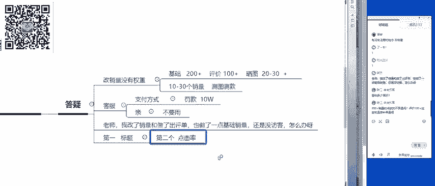

# 【拼多多运营实操教程】最系统的零基础拼多多开店教程全套，电商运营大佬专为学渣研制的新手开店保姆级教程！全程干货，简单粗暴 - P51：51、拼多多开店-最新流量破局翻番思路 - -拼多多开店 - BV1BH1qYpEqw

去做什么呢？呃，我是去做什么了呢？啊，然后呢来给大家看一下呃，我最近呢做了几个店啊，然后测试了几个新的比较不错的一个方法啊。首先呢就是我自己的店，我自己的店呢在这个活动在三8活动结束之后呢。

因为想要去进行突破啊，那么到底应该怎么样去进行突破呢，所以说呢就测试了一系列的一个操作方法啊，因为你当你的店铺达到了一定的一个瓶颈。比如说每天可以拿到1万多或者2万多的一个访客没有办法突破了啊。

那怎么样可以让你的流量呢直接从1万多的一个访客做到4万多的一个访客啊，每天呢现在是4500多单那最早的时候开始呢在3月初的时候呢，整体的一个订单量呢，每天是1000多单啊，1500单左右。

那现在呢整体的一个流量呢翻了大概2到3倍左右啊，那这是第一个啊，我自己的大店去进行测试的一个方法啊，那么第二个呢是小店啊，是一个小店。😊。

这个小店呢测试的时间并不是特别长啊，最多也就是短短一个星期左右的一个时间啊。但是说呢在昨天的时候呢，这个呃数据呢有了比较可观的一个增长啊。

所以说呢今天呢也是迫不及待的想要把这个大家啊把这个呃操作的一个方法呢分享给大家啊，大家可以看一下啊，最早在开始操作的时候呢，这个店铺呢每天每天的一个访客数呢只有200多啊，只有200多。

也就是说我们刚做好店铺的一个基础，基础销量做好了之后呢，基本上也就200多的一个访客。那么在呃昨天的时候呢，流量呢已经突破到了3000啊，所以说呢这个是这个操作方法。

那另外一个呢就是我们店铺数据的维护啊，包括像这个店啊，这个店是做这个鲜花的在维护数据的时候，怎么样可以让我们的订单保持平稳啊，从三个不同的一个方向来给大家去进行分析。那最小的一个店铺呢，大家也可以发现。

就是我最早的时候给大家看到的这个啊两天。两三天左右的时间做到了3000多访客。那么我们的店铺达到了3000多访客之后，如何让我们的订单每天维持在啊维持比比较平稳的一个状态，维持在2三0百单左右。

那么达到了2三0百单左右，那么我们的店铺到底应该如何去进行突破。所以说我今天会从三个店铺来给大家剖析一下我们的实战的一个案例到底是怎么来来啊怎么样来进行操作的啊，那么同时呢呃还是老规矩啊，还是老规矩。

那么今天啊给大家分享的课程呢，已经给大家呃讲清楚了啊。那么大家呃如果说有所期待的话啊，那么接下来呢我们就正式开始。那么在开课程开始之前呢，老规矩啊，第一个环节呢，还是给大家做答疑。

那么大家有任何关于拼多多坐店上面的一个问题，包括说我刚才给大家分享的一个案例啊，大家如果说有什么想问的啊，可以直接发在公屏上，我会给给大家去进行解决。好吧，啊，兰兰老师我的店铺没有流量是怎么回事啊。

没有流量。首先第一个要问你的问题。😊，那是你的店铺呢呃有没有去做基础啊有没有去做基础。因为正常情况下啊，一个店铺我们如果说你把基础给做好了之后呢，基本上可以拿到200到300左右的访客的，明白吧？啊。

就像是这个店啊，居然是这个店。这个店呢是做这个药品的啊，是做这个药品的啊。来我们来看一下呃，当你的商品呢基础的销量，包括说啊包括说比如说像这个商品，对吧？啊，你基础销量以及基础评价啊。

然后啊还有评价晒图，这些东西做好了之后呢，你的商品呢基本上会有个两三0百左右的访客，看到没有？在第一周期去进行操作的时候啊，每天的一个访客数呢，其实原最开始的时候呢，访客数是非常少的，只有两两三个啊。

只有两三个，然后呢，你需要去做订单啊，第一天呢直接做个20单。然后呢，20单，然后再往后14单啊，19单，你这样的一个比例去操作这样的一个单品，你操作大概个3到7天左右。

你也可以看到新品上架第一天是从28号开始去进行操作的。那么一直在一直到了4月1号，也就是正好7天左右的一个时间。那么商品的访客数呢已经突破到了400多。也就是说你店铺基础做好了之后。

你自然而然就会有订单。

那么在一个周期结束，7天结束之后呢，流量直接就爆发了啊，直接就爆到了这个2000多3000多。所以说这是一个新店啊，在没有流量的情况下，我们应该怎么样去做啊？你可以去想一下。

你现在有没有遇到这样的一个问题啊，基础有没有做好呃，可以直接改销量嘛，可以直接改销量啊，新品可以直接改销量的啊，改销量是呃很常用的一个方法。但是有一个点啊，要给要给大家讲清楚，改销量是没有权重的。

改销量啊没有权重。他只是说那可以提高你商品的点击率，以及你商品的转化率，消费者认可度会高一点，明白吧？然后呢，这个基础是什么意思？基础就是销量评价啊，然后呢，阳光正好，老师呃和客户聊天发了二维码。

拼多多说可能违规了，怎么处理呢？呃，你首先你要先确定一下这个二维码是不是支付宝或者是微信，如果说不是支付宝或者是微信的二维码的话，影响并不是特别大，你还是可以申度回来。那如果说你在跟客服发客服。

客服在这个拼多多里面，客服有几个注意点，大家要注意啊。第一个呢就是支付方式。😊，在拼多多里面，支付方式只能使用拼多多的官方的这个支付方式。如果说你发了这个呃支付宝或者是微信的收款码啊，可能会导致你罚款。

罚款多少呢？10万啊罚款多少呢？10万。所以说这个点啊一定要注意。那么第二个呢就是大家可能做淘宝做的时间比较长，可能在坐店的一个过程中呢，你会经常发这个字啊，叫轻怎么怎么怎么样轻怎么怎么怎么样。

我告诉你，轻这个字也不要用啊，这个字也不要用。明白吧？啊，这个字也有可能违规啊，所以说客服呢注意这几个点就可以了。如果说你发的是支付方式的二维码，那后期你可能就要补交保证金了。那不明白，阳光真好。

明白的话，公屏扣一啊，明白的话，公屏扣1。好，我看一下啊我看一下呃。😊，发送的信息啊可能。啊，那这个不重要啊，这个影响不大的啊，这个影响不大的。这个是你的呃，我看到你给我发的这个消息了啊。杨哥正好。

你你发的这个问题不大，就是说以后尽量就不要再发了。如果说你还是按照这样的一个方式去发的话，可能会出问题。那你现在发的这个其实它不是支付的方式啊，不是支付方式，明白吧？啊，所以说影响还呃影响还不大啊。

它只是说系统会。😊，判定啊这是一个二维码，但是具体是什么二维码，客服啊是需要人工来进行判定的，好吧。然后呢，这个NIK啊催的例3啊，基础销基础是做评价嘛，大概多少条啊，做完之后要不要开车啊，然后呢。

基础我来给大家讲一下，大家对于这个基础呢是呃比较关心啊，基础。首先第一个基础的销量你要做到200家，评价要做到100家啊，销量200家评价。评价要100加，然后呢晒图最起码你要20到30啊。

最起码你要20到30，明白吧？这个就是基础。你做完了之后要去做什么呢？就是说当你的基础做到10个到30个的时候，10个到30个销量的时候呢，你需要去测图测款啊，你需要去测图测款，明白吧？

所以说是需要开车的啊，是需要开车的。😡，好，这个能不能理解啊？这个NIK能理解的话，公屏扣1啊。然后呢我看一下这个呃阿丽啊，老师我改了销量和做了初屏呢，也做了一点基础销量，还是没有访没有访客，怎么办？

啊，这个阿丽，你这边呢这个有没有加我的微信，你可以先加一下我的微信，把你的链接发给我啊，然后我跟你讲一下啊，你如果说出现了这样的一个问题啊，出现了这个问题啊，那么可能是哪些东西没有做到位呢？

我来给你讲一下。第一个你的标题写的可能有问题，导致你获取不到免费的流量，明白吧？标题，这是第一个。第二个是什么呢。😊，你的图片的点击率有没有去进行测试啊？呃，我们大家去做这个拼多多的时候。

有一个什么样的一个逻辑呢？来，我给大家讲一下。

逻辑是什么呢？就是第一步我们先要获取到的东西是什么呢？叫做曝光啊，叫做曝光消费者在进行购买的时候啊，第一步是曝光。就是先让消费者看到你的产品啊，先让消费者看到你的产品，来，我给大家画一下。😡。

第一步叫做曝光。😡，好，有了曝光之后呢，那么消费者啊看到你的商品了之后，他怎么样可以决定他到底买还是不买呢？你的第一张主图要吸引到他。那这个里面呢有一个东西叫是什么呢？就是点击啊，就是点击。

那这个曝光啊，有了曝光，有了点击了消费者才会进入你的店铺里面去看一下你的商品到底是一个什么样的一个状态啊，他会看你的评价晒图。所以说这个里面呢就会考虑到一个东西叫什么呢？叫转换。

所以说你要考虑到当我们的一任何一个新品在做的时候，你先要让消费者看到那曝光指的是什么啊，曝光指的是什么？就是标题。你的标题写的。如果说啊如果说我们举一个比较简单的例子，连衣裙。

好，连衣裙。那如果说消费者搜索连衣裙这个关键词和搜索吊带连衣裙。吊带。😡，连衣裙啊，吊带连衣裙。那么这两个关键词大家觉得哪一个关键词的转化率会更高？哪一个关键词，哪一个关键词消费者搜索出来会点击的概率。

或者是可以看到你商品的概率会更大。第一个还是第二个。😡，一还是2啊一还是2阿里啊，那公屏上这个就是我的微信啊，你可以直接加我啊，可以直接加我。对啊，没错。

那很多同学呢都对于这个是有一些了解的那肯定是吊带连衣裙，消费者会点击会呃更高一点。为什么呢？因为吊带连衣裙这个关键词相对来说它是比较精准的那搜索出来所有的产品全部都是属于吊带的那连衣裙这个词词就非常的大。

所以说你要先确定你标题里面的主推关键词有没有写对。如果说你主推关键词写的直接就是大词开头的那可能你就拿不到流量。因为搜索连衣裙看到的同行的商品基本上都是10万加。所以说你是没有办法排排名排上去的。

明白吧？那第二个，当你拿到排名之后呢，消费者到底会不会点击你的产品，就看你主图是不是足够吸引人，明白吧？所以说这个是你拿不到流量的最核心的两个因素。😊，这个点能不能明白？各位同学能明白的同学公屏扣1啊。

能明白的同学公屏扣1。😡，好，然后这个成功啊，刚才发的这个消息，我看一下啊，基础多少算好啊，这个不同的类目是不一样的啊，那成功这个问题啊，基础多少算好，要看你的类目。比如说大家是做食品。

像我娅是做食品的，或者是去做这个家居生活用品的那这种类型的产品，它基础销量需要的就比较高。可能在前期的时候，我会要求大家做到5000到1万左右的基础销量。啊，可以跑多多克啊可以跑多多运猛。

对吧你想要去获取到一个非常高的排名，想要做到我这样啊，我这个店铺呢就是做食品的啊，就是做食品的。大家也也都知道啊，老师是这个做食品起家的。那么每天3万多的一个访客。那么那你最初的一个基础。

那你就要做高啊，5000到1万，这是基础啊，这是基础。那么当有一些类目呢有一些类目呢就不需要这么多的一个量啊，那多少的量啊，对于大部分类目来说是足够的呢？200个啊200家的基础销量。😡，就足够了。

比如说像童装啊或者是服装啊。😡，这些类型的一个产品啊，这些类型的一个产品基本上200基础销量就足够。因为什么呢？因为我们后期是需要去上活动的那活动呢是要求有100个评价啊，100个评价。

所以说我们需要根据这个评价来为大家看一下，你们可以打开自己的店铺啊，打开自己的店铺，在店铺的后台，有一个东西叫什么呢？叫营销活动啊，营销活动里面呢，我们经常去报名活动，比如说9。9块啊，或者是秒杀呀。

这种类型的活动大家都会啊都会经常的听到，对吧？比如说限时秒杀的一个报名新入口，那么你的类目里面需要做到多少的一个呃基础销量呢，大家在这里看就可以了啊。

在这个活动要求里面看活动要求里面这边会有一个商品历史评价的一个数量，看到没有啊，这里面我直接给大家发在公屏上啊，直接给大家发在公屏上，这个呢是对整个这个平台对于我们的一个要求啊。

当然如果说我们的一个呃商品啊，如果说你的评价没有达到这样的基础评价的话啊。😊，可能你在上活动的时候就上不了，但大部分的类目呢啊大部分类目都是需要达到100条以上的，好吧。😡，好，那这个问题啊。

基础销量的个问题就解决了啊。那这个成功能不能明白，明白的话，公屏扣一。呃，阿力OK的OK的啊。然后呢，你这边加到我微信之后呢，然后呃下课之后我帮你看好吧。好，OK啊好O那大家还有没有其他的问题啊。

有没有其他的问题。那么我们还有几分钟的时间啊，有问题可以抓紧时间提出来。包括说啊因为今天呢给大家诊断的这个内容呢，我看大家还是说属于一个比较基础的一个阶段。比如说基础销量做多少，大家还都还不太清楚啊。

评价怎么做还都是呃不太清楚。所以说呢呃那这个也没有关系啊，也没有关系。因为时间问题啊，如果说大家现在没有提到的一个问题，或者是啊课上呢没有给大家去这个很详细。

或者说大家没有呢啊没有听的非常的清晰的那这个没有关系，大家可以直接先加我的微信啊，这个就是我的微信啊，包括说大家现在没有想到的一个问题，什么时间想到了，可以直接发在啊可以直接加我的微信啊。

然后呢啊欢迎大家课下呢，随时来找我解决问题，好吧。😊，好，OK啊好OK啊，那接下来的时间啊接下来的时间。那么加到的同学呢公屏扣1示意老师一下啊。

接下来呢我就要给大家去正式的去啊剖析我今天给大家准备的三个案例到底是怎么样一步一步去进行实战的，好吧啊，准备好的同学呢，公屏鲜花来一波，我们就正式开始，好吧。😊，风中追风啊，活动总是上不去。

活动在报名的时候啊要多报几次啊，要多报几次，明白吧？风中追风啊，那我来给你看一个案例啊，我来给你看一个案例。你可以看一下我这个店铺，如果说我我现在的营业数据应该比你高很多吧，对吧？

我每天呢可以卖这个几千单啊，四五千单。那么我在上活动的时候，也不是一次性一次性活动就过的，明白吧？😡，来，我们来看一下啊，比如说像这个限时秒杀，虽然说平台都邀请了。

但是说我实际在上活动的啊上活动的时候也是有很多次啊，也是有很多次上不去的，明白吧？所以说你要多报几次，而且报名的时候有一个有一个核心的一个点是什么呢？就是说有一个要求。

你店铺里面的这个整体的这个营业额一定要达到，看到没有？我报了很多啊，我报了很多。因为有的时候呢啊有的时候呢这个平台呢会给你驳回啊，那驳回了之后呢，你就要不断的上啊，看到没有？我总共报了3页。

总共有27次去上活动，但是说我上活动啊，可以上去的这个时间还是说有点有一点点少的，明白吧？😊，所以说并不是你一次性就可以上去的。😡，能不能明白分动对方明白的话，公屏扣1啊。明白的话，公屏扣1。好啊。

那么我们就继续啊正式回到我们的一个课程。那么今天给大家分享这个案例呢，我们先来看第一个点啊，我们先来看第一个点。今天呢给大家分享的这个案例呢是从三个方面。第一个啊就是说从零起步。第一。😊，从零起步。

从零起步的一个店铺到底是怎么样去做的啊，我们的流量到底应该怎么样去破局啊，拼多多流量布局啊，我们在实际操作的时候呢，我们的大家呢都是从新店开始去做的。那么在新店操作的一个过程中。

我们到底应该去做好哪些数据，以及我们在操作之前要去做哪些准备，这是第一个维度去给大家剖析的。那么第二个。第二就是说当我们可以获取到一部分的一个基础之后，那么我们怎么样可以累积我们的一个权重。

可以累积我们店铺的一个数据。就是我在初期最开始操作的时候，就像这一个店为什么说我在原先2000多访客的时候啊，200多访客的时候呢，我的店铺都是处于一个比较稳定的一个状态啊。来我们来看一下数据啊。

在最初操作的时候，当我们基础做好之后呢，每天你店铺的一个访客呢可以达到两三百左右。那这个数据呢就是比较O的一个状态了啊，就是O比较O的一个状态了。那么当我们在。😊，实现啊去冲刺去爆发的时候呢。

我们怎么样可以实现爆发。在短短的几天的时间里面呢，就可以做到3000多的一个访客啊，那这是第二个啊，怎么样去累积权重以及爆发啊，然后呢这个分中追风啊啊总说我在同行的价格过高了，风中追风，你是做什么产品。

然后把你的价格跟我讲一下，或者是你可以先加一下我的微信啊，先加一下我的微信，可以先听课啊。因为今天的这个课程内容呢，会给你带来非常大的一个帮助。如果说我在课程中间呢讲到了啊。

可能我会剖析到你所现在遇到的一个问题啊。如果说没有讲到的，没有关系，你可以先加我的微信啊，课下，我详细给你看，好吧。好，OK啊好OK那么这是第二个啊，在累积权重的一个阶段。那么第三个是什么呢？

累积权重之后呢，我们想要去实现突破啊，突破流量瓶颈。啊，突破流量瓶颈。怎么样去突破流量啊，怎么样去突破流量。那么第四。稳定流量。啊，第四个呢就是稳定流量。其实第三个和第四个呢它是互相来进行呃交替的。

有的时候呢，比如说我们在第二周期累积权重之后，一旦我们的店铺做到3000多到呃3000多到4000多的一个访客的时候，那这个时候我们就需要先稳定流量，然后再去进行突破，明白吧？

所以说那整体的就从这四个方面啊来给大家去进行剖析。那么准备好的同学公屏鲜花走一波，我们就直接开始。第一个从零起步啊，从零起步。那么我在这边呢先需要问大家一个问题。如果大家在自己做店的时候。

你的店铺是怎么样从零起步的。或者说大家开了新店之后，第一步要做的东西都有哪些啊都有哪些？我想先问一下大家。自己都是怎么做的啊，看一下大家在操作的过程中都有没有问题啊，都有没有问题。😡，嗯。呃。

NIK啊上几个链接都做评价，然后开车啊，然后呢，风中追风也是啊先刷评价和补单啊，但其实不对啊，但其实不对，大家忽略了一个非常重要的一个问题啊，大家忽略了一个非常重要的一个问题，明白吧？叫什么呢？

叫做测图测款。呃，可能现在大家对于这个测款的一个要求并不是特别高了。因为大家会发现我们自己卖的一个产品呢，跟同行的一个产品基本上同质化会非常的严重。所以说我们在操作的时候只需要去进行测图就可以了啊。

但是在讲的时候呢，要把这个测款给大家加上去。其实我们实际在操作的时候，最为核心的一个点就是测图啊，就是测图，明白吧？赤到啊布局选款啊，上款破零分享单改销量啊，并不是先做分享单啊，先要改销量啊。

先要改销量，然后再做分享单，然后再去做评价，然后测图测款啊，测图测款一定要一定要安排在你做评价之前，能不能明白，赤到测图测款啊，步骤要给大家分析清楚啊，你这个过程我不知道你是按照这个时间顺序来排的。

还是说怎么样啊。但是测图测款一定是放在做评价之前的好吧？然后呢NIK图是拿别人的爆款照抄便宜啊，价格便宜啊，1到2块钱。我告诉你啊。😊，在测图的时候，你可不可以去拿同行的图片呢？同行的图片。是可以拿的。

那是可以拿的，你可以去参考同行爆款的一个图片来去做。但是你也一定要去进行测试。因为每个店铺啊每个店铺。数据表现都不一样。😡，不相信的话，你可以开两个店铺，一个新店，一个老店。

当你老店的爆款产品点击率可以达到10%。那你拿这个同样的一张图片去你的新店里面去进行测试，可能它的点击率不到1%明白吧？所以说测图是必要的。图片呢可以去同行拿，你可以拿个10张20张啊。

50张都没有关系，但是说测图这个步骤千万不要省啊，千万不要省，明白明白？然后呢，成功就是改一下销量，然后刷一下评价，图都是盗图，盗图之后啊，我不反对大家盗图啊，只要你不被抓都可以啊，不被抓都可以啊。

因为我知道大家的一个成本预算，可能啊都不是特别高，没有办法自己去拍图。那在这样的情况下，我们就只能去选择盗图，但是盗图之后一定要去进行测试那没明白？我的这个所有的店铺我在操作的时候呢。

都是去进行过测试的啊，就比如说像我的这个食品的这个店啊，我在操作的时候不可能不去进行测试来看一下推广计划啊，最早去进行推广的一个过程中呢就。必须要去经过测试。那么你的店铺的一个点击率啊，包括你的转化率。

点击率都必须要达到3%到5%。那么这种这样的情况下，你才可以去正常的去进行推广。如果说你没有达到这个数据，也就是说平台给你1万的一个曝光，你连这个100个点击量你都拿不到，明白吗？

你连100个点击量你都拿不到，那你就意味着直接就是量啊，直接就是量，那平台给你的数据，你没有反馈啊，那这个是后话，我会具体的给大家去进行剖析。那么从零起步的时候，我们第一步要做的是什么呢？

当然啊第一步要做的啊，我按照这个顺序来给大家排列啊，第一步肯定是选款对吧？那在选款的时候呢，很多同学呢都是自属于自己的产品啊，在座的各位有多少的同学是做自己的产品的，公民扣1。

我看一下就是说自己有工厂或者是一手货源的啊，我看一下有多少。😡，很多的时候呢大家有自己的产品呢，这个选款这一个步骤呢就可以直接略过啊，就可以直接略过，明白吧？啊，没有产品，那没关系啊。

如果说你想要呃不知道去做什么产品的话啊。早加我微信好吧啊，好，那如果说大家有自己的产品的话啊，有自己的产品。那么这个时候呢你要做的就不是选款了，而是做什么呢？产品定位啊，产品定位所以说在选款的时候呢。

我们的产品定位是同步去进行操作的啊，你要分析出你现在自自有的这个产品跟同行对比起来到底有什么样的优势。比如说像我自己的这个店铺啊，我在实际操作的过程中呢，我的商品呢，就是比别人便宜。😡，啊。

我的商品呢就是比别人便宜。所以说我在操作的时候呢，我就可以直接把我的商品呢去做一个什么样的啊，做一个这个更加便宜的一个包装。所以说你会发现我的主图啊，我的主图为什么说在使用的时候呢啊使用了这个主图。

我的我店铺现在还是在榜单上啊，在榜单上啊，这是呃。😡，类目top啊，目前是类目top，看到没有？每包低至0。24元，这个就是我产品的一个卖点。所以说第一步要做的产品定位选好管产品定位。

那么第二步要做的就是测图测款啊，测图测款。那么测图测款完成之后呢，第三步那么大家可以看啊，可以根据自己的商品来去进行啊操作。比如说我举几个比较简单的一个例子啊，不同类目的产品啊，做的时候也是不一样的。

比如说。我们要先判定自己产品的一个类型，比如说非标。比如说我们是做服饰鞋包，在做服饰鞋包的时候，当我们的产品测图测款完成之后，产品需要。下架。重新操作。你需要把这个产品下架掉之后。

让平台认为你这个商品呢是属于一个新品。因为对于这种类型的产品来说，新品更加容易操作。课档里的同学有没有同学是做服饰鞋包的，公屏扣6，我看一下有多少，有没有去做服饰鞋包的，就是这种非标品啊。

就是这种非标品，有没有同学应该有吧。😡，男装的对，像NIK如果说你在操作的时候啊，你在测图测款结束之后，你要先把你的商品下架，这个新品下架掉，下架掉之后重新上架，让平台认为你的商品是属于一个新品。

为什么要这样操作。我在第二步去累积权重的时候呢，会给大家讲到啊，这里面呢先给大家留一个小悬念啊，为什么说我们要呃下架，重新操作啊，原因啊，给大家留一个小悬念啊，我们插一个小旗子啊，插一个小旗子。好。

那如果说大家是标品啊，大家是标品。标品指的是什么呢？比如就比如说我现在做的食品或者是我现在做的这个皮带啊，食品皮带类似于这种产品，那它就属于标品或者是半标品。这样的产品在测图测款完成之后。

可以直接去进行操作。😡，啊，可以直接去进行操作。所以说。😡，我们在第一步从零起步的时候啊，产品的类型啊，产品的类型选款测图啊，选款测图，分辨产品的类型。然后。

第4个啊第4个做完这一切之后啊做完这一切之后检查。😡，商品基础。检查商品的基础。比如说我们的标题。主图啊，也就是说我们的轮播图。😡，还有什么呢？详情页。😡，这些呢比较基础的东西我就不一一给大家讲了啊。

我就不一一给大家详细的去讲了。标题不会写的啊，直接找我轮播图不会做的啊，也可以找我，好吧。😡，好，关于这个第一步从零起步啊，从零起步这四步啊，这四步走的一个操作啊，大家都能不能明白明白的同学公屏扣1啊。

明白的同学公屏扣1下多久，下架之后第二天就可以直接上架，明白吗？下架之后啊，第二天就可以直接去进行操作。来，各位能不能明白？明白的话，公屏扣1啊，速度快啊，速度快。😡，啊，测图测管是在OCB叉里面吗？

并不是啊要使用搜索测款啊，测图测款的时候要使用搜索测款。因为OCP仓啊OCP仓它是属于这个推荐的啊，是要使用搜索的，它是使用。OCP3。他使用智能啊智能。我们不能把自己的一个命运交配呃交到这个电脑上啊。

交到电脑上，明白吧？智能就属于电脑了，电脑随机给你去进行匹配的。所以说我们要选择关键词啊，选择精准的关键词来去进行测试啊，来去进行测试，好吧。刚进来没关系的啊，多同学啊，新进来的小伙伴啊。

新进来的小伙伴，如果说前面没有听到的啊，前面没有听到的没有关系啊。如果有任何的问题呢，可以直接发在公屏上，或者是直接加我的微信啊。😊，可以在微信上随时问我啊，随时问我。啊，那我们前面所讲的一个内容呢。

就是我们的新店在从零起步的时候啊，这四步到底是怎么样去进行操作的。那么在操作的一个过程中啊，那么可以达到什么样的一个效果呢？也就是说当我们把这些基础的东西做完之后。

我们的新品呢基本上可以达到200到300左右的访客啊，200到300左右的访客。这就是我们可以做到的一个基础的一个数据。当我们拿到这样的一个数据之后呢，我们就会进入到第二个周期，怎么样去累积权重啊。

怎么样去累积权重。😊，效果。😡，这个是效果图啊这个是效果图。好，OK啊，那我们继续啊我们继续。那这个呢就是第一步从零起步，我们四步走。那么当我们在第一步做完之后呢，中间会有一个承接叫什么呢？

叫做基础销量的一个承接。也就是说从我们第二个周期在权重累积的时候啊，在权重累积的时候，它有一个基础操作。比如说我们需要去做什么呢？需要去做补单，对吧？我们需要去做销量啊，我们需要去做销量，然后呢。

可以使用补单的一个方式。那么另外一个呢就是什么呢？我们测图测款做完了之后，我们店铺里面同时还需要有什么呢？还需要有人气，对吧？那这个呢就是我们在累积权重过程中啊，怎么样可以把我们的访客。😊，丛林。

做到200啊做到200啊，这个是我们第一步要去做的。如果说你店铺里面两两两三百的访客都没有的话啊，那基本上也就没有做的必要了，对吧？啊，耶绿浩男啊，叶绿浩男买家不会用多多钱包啊。

说我们没有补偿给他怎么办？你后台截图给他就可以了啊。后台截图给他就可以了。或者是你告诉他啊在哪里看，因为啊就是说对于这个消费者来说啊，大家可以耐心一点。

因为在拼多多里面购物的这些这些人呢年纪相对来说比较大，也可能是第一波去接触网购的啊，因为在微信里面裂变出来的，所以说呢大家要多一点耐心。如果说经常会有人问到这样的问题的话。

大家建议我建议大家去做一个固定的话术啊，可以去做一个固定的话术，然后让客服固定的去发，或者是大家可以直接发商品卡片啊，可以直接发商品卡片可以自己做一张图告诉他流程在哪里看好吧，叶绿浩男能不能明白。

明白的话，公屏勾一，这个就是看你的。😊，呃，这个这这个东西呢就是看什么呢？啊，看你的这个客服啊，到底是怎么样去进行安排的，明白吧？点击率第是标题的问题吗？点击率低不是标题的问题啊，是你主图的问题。

以及你的呃以及你的这个商品的价格以及销量啊，这是最主要的问题。现在都是改了多多改成了多多钱包了，不是啊并不是啊并不是有一些呢是直接跟微信绑定的，要看你自己是什么样去怎么样去进行登录的，好吧啊。

要看你自己是怎么登录的。好，如果说这个问题呢，你现在呢这个没有办法去很清楚的呃，解析清楚的话，你可以先加我的微信，好吧，一律号谈好不好啊，可以先加我的微信，我下课之后呢。教你怎么样去看啊。

怎么样去看怎么样去进行解决。好吧，这个是一两句话是讲不清楚的啊，需要你有一个比较完整的一个布局。好，O啊好O那么接下来我们就来讲一讲如何把我们的访客从零做到200啊，从零做到200。

首先第一个我们要确定的是什么呢？就是我们大家都知道啊，既然说我们想要去做电商。首先我们需要先有一定的基础销量，对吧？那销量从哪里来，我们大家也都知道啊，找朋友去买一买两单，或者是呃我自己去推一下啊啊。

或者是找一些资源，然后去刷刷几单，对吧？这个大家都清楚，但是说有一个问题大家容易忽略的地方是什么呢？是做多少。😊，你的这你的这个类目里面，你做多少的销量，你才可以达到对应的数据。

那这个呢是大家所需要去考量的一个东西。明白吧？那这个里面呢需要所需要用到一个什么样的一个工具呢？啊，可以使用电霸或者是呃其他的这个三方的一个工具。那么我们使用这个工具是要做什么呢？

需要去看同行有多少销量。怎么样去看同行有多少销量的呢？这里面又牵扯到了另外一个问题啊，另外一个问题。那么大家也会知道，很多时候呢，我们的同行卖的销量都非常的多啊，都非常的多。比如说他一天可能走一万单。

那这种竞争对手，我们直接是搞不过的。那么在搞不过它的一个情况下，我们应该怎么样去切入比较细分的一个市场啊，我们应该怎么样去切入一个细分的市场。😊，那这里面呢在这个讲这个细分市场里面。所以说大家会发现啊。

其实我们在操作的时候，很多的东西如果说你不懂的话啊，你根本都不知道这个东这个数字是怎么来的啊，这个数字是怎么来的。好，我问一下大家，大家知不知道我们的新品在前期去进行操作的时候。

首先要去做的流量入口是哪一个？😡，啊，对，像这个NIK同学啊提到了啊电棒啊，电棒是电子的电啊，可以使用这个工具啊，可以使用这个工具，明白吧？第一步要做的就是首页流量。我的天哪。

你第一步你前期连任何的基础都没有，你觉得平台会给你展现在首页吗？这不是开玩笑呢脑瓜头。😡，啊，虽然说想法很好啊想法很好，但是说不太现实啊，但是说不太现实，明白吧？平台最先给到你的一个流量呢是推荐啊。

是推荐推荐你的什么流量呢？叫做搜索流量啊，叫做搜索流量。好，那这个赤道同学啊讲的很对啊，讲的很对，可能是有一些基础的啊，有一些基础的。所以说我们第一步要做的是搜索流量。那么在做搜索流量的时候呢。

这个细分市场到底应该怎么细分呢？其实前面的时候答疑的时候给大家讲过，举个比较简单的例子，连衣裙。如果说大家在操作的时候，你的标题开头写的是连衣裙，那么也就意味着大家在推广的过程中。

我们的主推市场就是连衣裙，明白吧？所以说我们在做细分市场的时候啊，千万不要说啊直接盲目的去去做了。那么我们所需要做的一个工作是什么呢？打开你店铺的后台啊，我直接教到大家怎么样去进行操作啊。😊。

打开店铺后台，然后在后台这个位置啊，找到推广推广中心点击推广工具。进入之后呢，有个搜索词分析。这个搜索词分析里面呢，我们需要在这里面去进行搜索搜索我们要去操作的一个关键词。

比如说连衣裙是我们产品的核心词，那同样它也是一个大词，如果说在这样的市场竞争环境下，我们可以直接看它的竞争强度，看到没有？有6万多商家同时在做这个商品。那么消费者基本上在做的过程中啊。

消费者在去进行购买的过程中。消费者购买商品的时候呢，它基本上会在10到。前20名里面去挑选商品。前20名。挑选商品，包括我们自己也是一样的。如果说我搜索了一个连衣裙。

我在前20名的这个商品里面是没有看到我所喜欢哪个商品的，我可能就会搜，我可能就会更换关键词去进行搜索，明白吧？所以说我们在操作的时候，你想要说在短短的时间里面。

你从一个新店直接做把把这个连衣裙这个关键词做到前20名，现实不现实。😡，🎼来来，各位同学，你们觉得如果说给你一个比较大的一个呃，不管说你投入资金有多少啊，不管说你投入资金有多少。如果说我告诉你啊。

我想要让让你在这个呃14天左右的时间或者是30天左右这个时间做到连衣裙。😡，连衣裙这个关键词做到前20，你觉得现实吗？前十或者是前20。对标这个是可以的。赤道，我告诉你，对标你也做不到，能不能明白。

对标你也是做不到的。😡，明白吧？因为基本上连衣裙这个关键词啊，千万不要相信所谓的对标，那个这个对标是需要更加精准的关键词才可以对标的。像这种大词是没有办法对标的，能不能明白？大慈是不可能去进行对标的啊。

我做了这么长的这个时间了啊，你相信你信我啊，你信我。😡，为什么呢？因为这里面有一个东西叫什么呢？叫做店铺层级，你的店铺是没有达到跟同行一样的竞争水平的，他是不会给你推荐的。

就算是你把这个关键词排名给做上去了，它也会限制你的曝光量，能不明白？来给大家看一下，点击你店铺后台点击这个经英总览，先看一下你是属于哪一个层级，我告诉你，如果说你的店铺是没有达到第五层级、第六层级的。

像这样的大词，你基本上拿不到流量。就算是你把排名做上去了，你看到的也是假排名有排名，但是平台不会给你曝光。😡，他会限制曝光。所以说这个点啊很重要，尤其是对于一些坐垫比较时间长的啊这种老司机。

我告诉你们啊，你们你们如果说再去这样做的话，可能就凉了啊，可能就凉了。😡，所以说什么样的层级做什么样的关键词啊，这个是需要去进行挑的。那么我当我们的一个新店访客从零开始去做的时候啊。

访客从零开始去做的时候啊，那有的同学会说了啊，老师我可以直接做到第六层级，我告诉你，你如果说有这样的一个投入哦，你第六第六层级所需要多少钱？30天的时间，你需要做到70万啊，你需要做到72万。

你有这样的投入资金，那可以啊，那可以。😡，你你刷单，你要刷个70多万啊，那你厉害那你厉害，你是土豪，你很强啊，我佩服你。😡，所以说啊所以说啊这个点大家要注意啊大家要注意好吧。😊，好，OK啊。

那么接下来我们就来讲一下，如果说我们新店在做的时候，到底应该用什么样的细分市场。比如说我们那个新店从零做到200多的一个访客，那么我们到底能不能使用连衣裙，这个关键词呢是没有办法去进行使用的。

刚才给大家讲过了，那么我们应该使用什么样的关键词，打开店铺的后台同样还是使用我们刚才所使用到的一个工具，搜索连衣裙先去对标我们的关键词啊，对标我们的关键词去找一个竞争强度相对来说比较弱的。

比如说软妹连衣裙。它的竞争强度只有1700，你看到没有啊？这个都可以看清楚吧？软妹连衣裙啊只有1700的一个是呃竞争强度。那么同时它的竞争搜索热度呢又非常的高啊，又非常的高。

只有这个啊有这个呃每天呢有这个15000左右的搜索热度。那也就是说如果说我们要去做这个关键词的话，很容易就可以做上去啊，很容易就可以做上去。那么这个就是叫做我们所选择的细分市场。😡。

当然这个里面的一个细分市场，我们还要去进行细分。比如说我们根据于这个关键词的一个搜索热度，比如说它有1万多啊，它有1万多。那么根据于同行的一个根据转化率来说，那么同行这个关键词每天可以成交多少单呢？

15000乘以个0。58%的一个转化率啊，0。58%的一个转化率，大家算一下有多少，我们就算它1%嘛啊算它1%的一个转化率，那也就是说每天会有1500单。😡，啊，不是1500单是150单啊，是150单。

对吧？这个没有问题吧，就算拿1%的转化率，但实际没有这么多啊，因为0。5整体算下来的话，可能就100单左右啊，行业里面整个行业是100单左右也就是说如果说我们的店铺每天可以达到想要达到100多单的话啊。

那基本上呢呃你要考虑到另外一个问题啊，就是说搜索热度有这么多，它的转化率也有这么多。但那你要同时考虑它有多少的点击率，就算你的点击率有10%啊，就算你的点击率非常高，有10%。

那整体所获取到的流量就是1000啊，就是1500。那1500算你的转化率啊，你自己产品本身的一个转化率有10%，那也就是150单。所以说整体算下来100单左右是相差不多的啊。但是说这个行业这个类目。

那它只有1%的转化率。所以说你可能拿到的就只有15单。那我想问一下，这一个关键词行业既然说每天的一个订单量只有15单左右，我们就可以拿到比较靠前这个排名。😊，这个关键词你在补单的过程中。

你去刷单的时候啊。😡，你刷单的时候。😡，好，你一天做15单有没有有没有压力啊，一天做15单有没有压力？😡，对，肯定要看点击率啊。那这里面我点击率给你算了，给你算10%，已经算很高了。

基本上你都不会达到10，可能只有5%。那整体算下来，我们每天所需要的一个订单就是5到15单。😡，啊，5到15单的一个压力，大家觉得有没有压力啊，有没有压力？压力大的同学公屏扣1啊，感觉这个没有问题的。

公屏666啊，公屏666。那这个简单吧，也就是说做这个市场，我们实际每天只需要做个十几单20单就可以了。也就是说我这个店铺在操作的时候，看到没有？200多的一个访客怎么做起来的？每天的一个订单量啊，来。

我们来看一下订单量啊，支付买家数看到没有？每天的订单数是多少。😡，十6单。每天也就十几二十单就可以了啊，十几二十单我相信对于大家来说并没有太大的一个吃力。所以说这个就叫做细分市场。什么叫做选择？

当你选择对了，自然而然，你的店铺就可以搞得定啊就可以搞得定。看到没有？3月20号之前，我店铺里面每天都是十几单20单。当我数据累积到一定程度之后，自然而然，我流量就爆了。所以说有的时候大家所看到的啊。

店铺里面7天的访客爆发个1万啊，爆发个2万是不是真的呢？是完全有可能的啊，是完全有可能，但是前期要需要经过大量的积累，以及数据计算啊，你要懂得这个方法，懂得这个技巧。

当然这里面也有很多的细节是需要大家注意的。比如说我们在补单的时候，应该怎么样去补，应该找什么样的账号，应该选择什么样的关键词，这些都是满满的细节。因为时间关系我不可能说给大家一步一步的去进行剖析啊啊。

这个也不太现实。那如果说这样非常详细的讲，我讲个三天三夜啊，也讲不完。所以说想要了解细节的啊，想要去实操的啊，也可以直接加我的微信好吧，课下呢大家可以直接问我。😊，好，okK啊。

那其他的同学呢其他的同学都能不能听得明白？😡，能听明白的同学啊能听明白的同学公屏扣1啊，公屏扣1示意老师一下，我们就直接开始下一步了。好吧，当我们选择这个细分市场得到的一个数据。

那么最终我们可以达到什么样的一个效果？😊，刚才也给大家看了啊也给大家看了，我们最终得出的一个效果呢，就是每天可以获取到多少的访客呢？200到300左右。好，那有多少的同学。

在座的各位有多少同学店铺现在目前是处于店铺里面的流量处于这个200到300左右的，公平呃，公屏鲜花走一波。我看一下有有几个。😊，就是说大家现在整体的这个访客呢是200到300左右的。

有没有有没有同学在啊，有没有同学在？😡，吃到就是属于这样的一个状态。那其他的呢啊包括这个新进来的同学啊，新进来的同学，如果说前面的东西没有听到的，没有关系啊，没有关系，可以先加我的微信。

有任何的问题都可以直接提出啊，都可以直接提出。好吧，新店啊，那没有关系啊，没有关系，大家一定会啊，不管你是新店也好，或者是老店也好，都会经历过这样的过程。你第一个店铺做起来呢。

那么第二个店铺依旧是可以去做的啊，依旧是可以去做的。那么另外一个我们在实际操作的一个过程中，想要让你的商品整体的实现爆发，就是累积权重了之后，怎么样去爆发流量。😊。

爆发流量的在操作的一个过程中有一个非常细节的一个点。并不是说第一个呢我们要做的是什么呢？是转化率啊，转化率这个我不用讲啊，我跟你讲大家也都也都清楚啊，也都清楚的知道，你可以看一下。

我整体每天的一个转化率基本上都是在同行平均以上，稍微有一点点波动是属于正常的一个状态。但是说大部分的转化率都是处于5%以上的。因为同行就是5%，所以说第一个是转化率，根据同行来进行控制。😊。

根据同行啊进行控制啊进行控制。好，我来看看一下大家的一个问题啊。然后呢这个NIK啊新店开车100块钱呃，前期你如果说处于测犊特款这个状态，开100块钱还可以啊，还可以。这个没关系啊这个没关系。

所以说当你了解清楚这样的思路，这样的操作方法之后，你把你的访客呢从零做到200到300是没有任何的问题的，明白吧？啊，所以说当我们的流量啊流量获取到200多的一个访客之后。

那么怎么样才可以让我们的流量开始实现爆发。那这里面第一个点是转化率，第二个点是什么呢？叫做人气。商品的收藏所。当然因该因为跟同行对比的话，大家可能看的并不是特别的清晰。来，我们来看一下自己的。

比如说我的店铺呢在3月12号之后啊，在3月12号之后啊，3月20号之后呢，我整体的一个流量都比较平稳了。那么在平稳的时候呢，我们怎么样实现流量的一个爆发。

就是根据商品的人气来去进行操作的平台给到我多少流量，我就去做多少的商品收藏。这个点能不能明白啊，能不能明白？😡，这个就叫做人气啊就叫做人气。当你的商品人气起来了之后，就算是你的转化率跟不上啊。

就算是你的转化率跟不上。那么平台也会认为平台它会考核你店铺里面的一个东西叫什么呢？叫做层流能力。叫做层流能力。那么你我给到你2000的一个访客，那么你你的转化率呢没有下滑。😡。

而且给到你的这些流量呢全部还都有转化，就算是没有转化，消费者也收藏了，说明他喜欢你的商品。那这个时候平台会不会给你更多的流量？😡，因为你卖的订单越多，平台也就会赚的钱越多，明白吗？

所以说啊所以说在流量爆发的时候，最主要操作的一个核心就叫做人气。人气，你只要把这个人气数据补上去啊，数据补上去。好，我补600个访客，那给我带来2000个流量，你觉得划不划算？明白吧？啊。

有很多同学不知道怎么样做人气啊，有多少同学不知道怎么样去去做人气的啊，公屏扣1，我看一下有多少老师有点击有收藏，就是没有转化，是什么情况？可能跟你的商品本身就是有关系的。😡，啊，你可能是你的商品。

比如说你的流量不是特别的精准，比如说你的行业有波动，这些转化率影响的因素会有非常的多。但是我告诉你。如果说在第二周期你流量爆发的时候，你转化率跟不上，你可以适当的去进行补单，但是人气是一定要去做的。

明白吧？你们想不想知道我在做这个人气的时候，包括说像这个风中对方啊，都不知道怎么样去做人气。想不想知道老师在做人气的时候是怎么样去进行操作的？😡，这个东西其实很简单啊其实很简单，没有大家想的那么难。😡。

咱没有知道想知道的公屏鲜花走一波啊，我看一下有多少同学是想知道这个人气到底是怎么做的。😡，哎，okK啊，那我们就开始啊我们就开始。😊，我这边在操作的过程中呢，我是直接使用工具来做的啊。

所以说啊大家要使用要学会呃使用工具啊，包括说我们看同行的数据，使用电棒，那么在做这个人气的时候呢，我们同样也有对应的一个工具，我是直接用资源的那如果说啊大家有没有想要这个资源的，想要资源的，公屏扣6啊。

公屏扣6，我把这个资源就直接分享给大家，大家可以直接联系资源去啊，大家可以直接联系资源去。好吧。

好，这个呢就是资源的这个微信啊，大家这个可以自己添加一下啊，可以自己添加一下。然后呢，我把这个资源的微信呢发到公屏啊，发到公屏啊，然后呢大家可以自己添加啊。😊。

好，加好的同学呢公屏扣1啊，加好的同学公屏扣1，速度快啊。加好了之后呢，给大家30秒的时间啊，加好了之后呢，我们还要继续下一步的一个剖析，好不好？😊，好，O啊好OK啊。如果说大家这个加好了之后呢。

在公屏上扣一确认一下啊，确认一下，然后呢，我们就继续进入下一步。当我们的流量起来了之后，如何去把我们的店铺的流量稳定住，再次去进行突破啊，再次去进行突破。😊，好，O啊好O。😊，好，第三步啊第三步。

我们在实际操作的一个过程中啊，当我们的店铺有了数据啊，有了数据，比如说我们店铺里面有了这样的访客了。对吧。😡，3000多4000多的一个访客啊，前面呢也给大家看到啊。

这个店铺呢把它做到3000多的一个访客难不难呢？不难啊。但是说里面有很多的细节。那么我们在做的过程中呢，一旦我们的访客突破到了3000到4000，怎么样可以稳定住。

每个月都可以拿到每天在一整个月的时间里，每天都可以拿到这么多的一个流量。那这个里面呢又需要一些技巧。那么这个东西呢就需要完善自己的店铺体系了。😊，啊，加了还没有通过啊，这个是资源的微信啊。

资源看到了之后会通过的啊，会通过的。🤧嗯。好，那在突破流量的时候啊，突破流量的时候呢，我们就需要完善店铺的一个体系。那其实完善店铺体系是稳定流量里面的。那么在这里面呢。

我突破流量的一个前提是我们先要把我们所获取到的访客全部都稳定住。稳定住之后，我们才可以去进行突破，对吧？所以说我们先来讲一下，怎么样去完善我们店铺的体系。那这里面呢，我刚才讲到一个概念叫什么呢？

叫做层流能力。店铺的层留能力。😡，店铺的承折能力平台是怎么样去进行考核呢？第一个就是你店铺的一个售后问题。有没有同学在这个呃稍微有一点基础的，在做坐店的一个过程中呢，做了一段时间。

发现自己的店铺DSR评分，或者是因为某一些原因自己的店铺被屏蔽了。有没有同学出现过这样的问题的？😡，店铺的DS呃DSR的评分非常的差啊，达到了已经低于了4。34。2，对吧？最起码大家也要保持了4。

5左右啊啊，我最近的这个DSR呢也是不断的在去进行维护啊，也是不断的再去进行维护。看到没有啊，前一段时间呢就是3月13月22号之后呢，整体的这个呃DSR评分呢已经维护到了4。5啊，4。

5之前的时候都已经掉掉的很惨了啊，掉的很惨了。所以说大家会发现我的DS2评分呢一直在上升。那最近呢可能去上了一下活动啊，活动的这些质量并不是特别好，所以说又有一部分的一个下滑。

那么这个DS评分到底怎么样去进行维护啊，怎么样去进行维护呢？首先第一个大家要考虑的是什么呢？好评。😊，售后的一个问题啊，最重要的考核这个DSR的一个问题啊，这个因素就是DS啊就是好评啊，就是好评。

消费者给到你多少的一个评价啊，给到你多少的一个好评。那么就直接决定了你的商品的DSR的一个评分。比如说像这种低于4。4低于4。5的那这种属于啊平台呢就会告诉你这个商品呢。

它的DSR评分是属于比较低的一个状态。那这样的商品呢。😡，其实就拉低了你店铺平均的一个水平。明白没有？所以说我们要适时的去把你店铺里面的这些商品去进行清理，或者是让客服去维护。不管是打电话也好。

发好评卡也好，或者是去做好评返现的活动也好。那这个就叫做售后问题的第一步，我们要去解决的啊，我们要去解决的。DS24。2啊，成功呢是DS2评分过低，低于3。9就可以屏蔽。对啊。对，确实是这样的。

所以说DSR对于店铺来说是一个非常重要的一个点。你有了流量，有了订单，总不能说做了一段时间之后，好，你的店铺被屏蔽了。😡，那这样肯定是不行的。所以说在突破流量之前，完善我们店铺的一个体系。

完善你的层流能力啊，NIK新款开车直通车访客78，现在后后台才71啊，还欠平台7个访客啊，这个可能是显示的问题。因为平台在考核这个啊收录你收录你的直通车的时候呢，只有这个一个小时收录一次，好吧。😊，呃。

请问一下消费者体验分降低影响比较呃会比较大吗？肯定会影响大。这就是我第二个要讲的消费者体验分。如果说你的消费者体验分低于2点分啊，低于2点9分。也是会有屏蔽的啊，这个过低。也会被屏蔽。

屏蔽可不是大家以为的什么啊，直接就是把你的店铺降权啊，直接就是把你的店铺降权，明白吗？你店铺里面你的商品啊，或者是你的店铺名称基本上都搜索不到了。所以说消费者体验指标啊，消费者体验指标看到没有？😡，啊。

最近上了活动之后呢，比较尴尬啊，直接就降低了啊，直接就降低了。但是说我整体的基础体验分还是比较高的啊，只是说最近商品的退款率比较比较多，因为订单多了啊，订单多了，你要去进行维护。比如说你的消费者质量啊。

消费者体验分是低于三分的，可能你的店铺就没有办法报活动。明白，这就是对于你的店铺带来的一个影响啊带来的一个影响。这个点能明白的同学公屏扣一啊能明白的同学公屏扣1后果都给大家讲清楚了啊，讲清楚了。

所以说售后的问题大家千万不要出错。因为我如果说在交这我的地址的时候，我是主要带大家怎么样去引流量的。其实像售后的问题呢，我基本上很少去给大家讲，明白吧？因为售后这个问题，如果说你连这个都做不好的话。

这个是很简单的一个问题啊，所一点氪金的话啊，送几个奖金，对吧？送一点这个比如说像我啊像我这个店铺做的时候不需要你做太多呀，你直接开一波好评返现啊，评价有礼就可以了。看到没有。😡，嗯。

看我的评价有评价有理的数据啊，评价有理的数据。对吧。😡，所以说你活动做起来就可以了。那这个其实就很简单的啊，这个是第一个层流能力，能不能明白？明白的话，公屏扣1啊，明白的话公屏扣1。😊。

对DS2评分影响会比较严重。那这个DS2是15天考核一次，每个月的1号和15号。每个月的一号和15号考核。啊，他会考核你上一个月的数据。如果说你数据不达标。就直接屏蔽啊就直接屏蔽。被屏蔽了很多天了啊。

😊，没关系啊没关系。既然说我今天讲到这里了，大家就一定要把这个问题给解决掉啊，给解决掉。好，当我们完善了我们商品店铺的一个体系。好，我们的层留能力没有问题了。平台比如说平台给我一万的访客。😊。

然后我这些访客我全部都能吃下来。😡，平台给我这么多的访客，我有10%的一个转化率。好，那平台就会认为我的商品是我的店铺整体在运营的过程中呢，是属于比较优质的，是团队比较给力的那这种情况下。

平台就会继续给我扩大流量。那这个时候啊那这个时候我们怎么样去突破啊？比如说当我们的店铺啊，当我们的店铺达到了三四千左右的一个访客，或者是达到了1万的一个访客，怎么样去进行突破。来。

我们来看一下具体的一个数据。在3月份的时候呢，我们的店铺的一个访客呢仅仅只有1万左右的一个访客，看到没有啊，仅仅只有1万的访客。那这个时候在店铺去进行突破的时候。😊，突破流量啊，在进行突破流量的时候。

我们应该怎么样去做呢？首先我们第一步要去做的啊，肯定是前面先稳定住。那么第二步要做的是活动。利用活动的一个营销啊利用活动的一个营销可以很快速的让你的商品起量。因为为什么呢？

我给大家讲一个非常重要的一个核心的一个问题。前面我们在讲的时候啊，在从零起步的时候，我给大家讲过，我们在做这个商品的时候啊，在做商品的时候，我们想要去起权重起流量的时候，我们第一步要做的。

我们第一步要做的这个内容啊，我们第一步要做的这个流量渠道到底是哪里呢？第一步要做的流量渠道。还有没有同学记得的啊，前面我讲过啊，我讲过我们的新品在上架了之后，第一步要做的流量渠道是搜索，没有问题吧。😡。

呃，评价有理，没有办法确定是好评吧。啊，只有好评才会返。啊，只有好评才违法。好吧。好，那么我们第一步在做这个流量渠道的时候是做的搜索。那么在做搜索的时候呢，我也给大家讲过，在做搜索的过程中啊。

我们这里面呢有一个关联的一个东西。在流量做爆发的时候啊，流量做爆发的时候，我们选择了对应的一个细分市场，对吧？所以说啊这里面就关联起来了。在做细分市场的时候，比如说我们选择了软妹连衣裙这个关键词。

那软妹连衣裙这个关键词，我们最终确定它只有15000的一个搜索人气，对吧？好，它只有这么多的一个搜索人气，也就是说这个关键词就算是我们做到排名第一。😡，每天我们可以拿到访客有多少1500对吧？

我算他10%的转化率啊，10%的点击率。那么我们可以拿到的一个访客数就是1500，就是撑死了啊，就是撑死了。那么同时呢这个关键词下面还会给大家裂变出一些其他的关键词。

那可能我们店铺的一个访客呢就做到了3000多或者是1万。那么在这样的一个情况下，比如说软妹连衣裙这个关键词啊，我们排名排到第一的时候，每天可以拿到啊每天比如说有100单。好。

我们店铺的呃那整体30天的一个数据就是3000单，对吧？那么在3000单啊，我们一个月去做3000单这样的一个水平下怎么样去进行突破？因为我们想要去突破搜索流量。

那再去使用软面领取这个关键词是不是不太现实了？😡，好，那这里面呢又会牵连到一个东西啊又会牵连到一个东西。比如说我们的店铺，我前面给大家讲过，我们在做店的时候，我们需要看什么呢？需要看我们店铺的一个层级。

对吧？当我们的店铺需要达到第五层级，第六层级的时候，我们的店铺才可以去做大词才可以去做更高级别的词，对吧？那在这样的情况下，如果说我们的店铺啊，在完善我们的流量体系的时候。

我们每天啊我们每天可以啊每个月呢可以走3000单，那么按照我们的商品的客单价50块钱来进行计算。😊，那是多少钱？😡，是不是15万？好，那么我们可以做到。15万的一个营业额啊，可以做到15万的一个营业额。

这是一个月的一个数据。那15万的一个营业额我们是第几层级？最起码也是第四层级了吧。那在做第四层级的时候，我们就可以去拼一拼去做大词了啊，去做大词了。那这个关键词我们是不是要放弃掉？

我们就要开始去去做连衣裙这个关键词了。所以说这个时候啊，包括说像这个赤到啊，最最开始的时候提到的一个问题，什么时间应该做大词，那这个时候就应该做大词，明白了吗？当你的店铺有了基础的数据。

好每天我可以每个月我可以走3000多单了，我达到第四层级第五层级了？那这个时候我就要去抢更多的流量。那连衣裙这个关键词是不是意味着它可以给我带来更多的访客，为什么可以给我带来更多的访客。

因为在这个平台里面，连衣裙这个关键词每天的搜索量有6万。😡，从1万到6万啊，从1万到6万。那么在操作的过程中，怎么样可以提升我们连衣裙这个关键词的一个排名，同样还是可需要做销量，对吧？

那最为核心的一个东西，它依旧是没有变的。因为平台就是考核你的销量。那么在我们想要获取到这么多的一个销量的同时，我们就需要上活动了，对吧？所以说啊为什么我们要上活动啊，原因就在于这里啊，原因就在于这里。

明白吧？我们要想要想要去突破这么多的流量，我们就必须要上活动，那么我来给大家看一下，实际我在操作的时候，整体的操作案例是怎么样去进行操作的。😡，好，打开店铺的后台啊，在店铺后台里面呢。

我们想要去看我们店铺搜索的一个访客和活动的一个访客，就是打开店铺后台，点开这个流量数据啊，点开流量数据，点击搜索流量啊，点击搜索流量。那么我先给大家看一下，我在3月份的时候啊，3月份的时候。

3月8号3月9号的时候啊，在3月初七的时候，我店铺的访客整体的搜索流量有多少。😊，看到没有？😡，这是3月8号的数据，搜索搜索流量只有5000多啊，只有5000多，这个都能看得明白吧。

所以说那这个时候呢也就意味着软妹连衣裙啊，比如说我是做这个商品的那这个商品我就达到瓶颈了啊，达到瓶颈了。那这个时候我想要去进行突破，想要从5000多的访客啊，我想要直接把连衣裙这个关键词的排名做上来。

我想要拿到这6万的一个访客。😡，想要拿到的6万的个曝光，那么我们的订单量就必须要上来，订单量怎么上啊，订单量怎么上来看营销活动的数据。那么我在操作的过程中呢，我在整个3月份我是持续不断的在做活动。

3月8号活动大促结束之后，我首先上的是什么呢？个性化首页的活动，看到没有？在3月12号的时候，我直接上了首页的活动。😡，好，首页的活动给我带来的访客是多少呢？是这么多。

然后整体给我带来的一个订单数是多少呢？是这么多，以及我的收藏是这么多。好，只有两个商品，每天我可以走出的量呢达到了800单。也就是说这是我额外突破的这只是说我的活动流量给我带来的一个数据。😊。

活动突破啊活动突破。活动。不。在活动突破的第一个活动啊，第一个活动直接上首页的一个活动。好，每天给我带来了800个订单的增量。啊，每天800订单的增量。那么在3月份啊3月这个首页活动结束之后呢。

我同时啊我们来看一下20号左右的啊，23号的时候，我同时又上了首页化的个呃首页的一个活动。那么这个时候给我带来的一个增相是多少呢？因为我的转化率控制的比较好，所以说我的活动是不断的在上上升的。

所以说当我在第二次去上活动的时候啊，也就是3月23号的时候呢，给我带来的一个增量是2700单，每天。😊，好，2700单每天。那么。我们再来看啊，4月份啊4月份。达到到这个4月1号的时候，好。

个性化首页的活动每天给我带来的增量是多少？3000单。😡，这就是第三个阶梯啊第三个阶梯300单。好，同时我是不是只做这一个活动呢？这一个活动已经满足不了我了，我还是卡不到排名。那这个时候我要上9。

9块精选的活动，看到没有？9。9块精选的活动同样也给我带来了2000多2万多的一个网客数。那么给我带来的增相是多少？😡，2900单也是3000单，所以说是3000单，加上3000单。明白没有？

所以说当我们的活动结束之后，我们同时再来看一下时间节点。同从这个3月8号的时候，我们的访啊搜索流量的一个访客呢是5000多。大家刚才也都看到，那么在3月16号和17号的时候。

我们的搜索商品搜索的一个热度达到了多少？2万多，是不是说可以使用活动，我们的店铺流量。整体的一个增长来带动我们搜索流量的一个爆发。明白明白？这个时候我们的流量就已经上升到了4倍左右啊。

就已经上升到了4倍左右。😡，明白吧？所以说你把店铺啊达到这样的一个数据之后，那么你的店铺还愁作不起来呢？😡，好，关于这个思路，大家明能不能明白明白了没有？这是从最要早3月7号的时候开始操作的时候啊。

大家也可以看到啊，整体的搜索量呢是这个呃1万多啊，1万多，这就是第一个周期。那么在第二个周期啊，第二个周期也就是说这波活动结束之后，3月17号活动结束之后，我又上了一波活动。那这个时候呢。

我的一个访客数呢，就已经达到了2万到3万左右，看到没有？达到了28000。那么2000在3月27号结束之后，在4月1号的时候，我又上了一波活动。😊，看到没有？直接我的访客就达到了4万。

那么也就是说每天我现在所获取到的一个流量数据啊，所获取到的一个流量数据爆发以及超车就是这样去做的。现在都能不能明白啊能不能明白。好，那既然说大家都已经清楚了啊，都已经清楚了。

那么大家觉得做店的在操作的过程中，你想要把店铺做到这样的数据，是不是需要一步一步的来？😡，对吧当你有了这样的一个方法，你把店铺做起来还难吗？😡，其实大家会发现，其实做店呢整体的思路是不难的啊是不难的。

难的在于什么地方呢？就是很多的一些细节上面的操作。如果说我不跟你讲，在从零起步的时候，我们到底应该怎么样去选款，怎么样去策款，从最最最最基础的啊，这些满满的全部都是细节，明白吗？

一步一步的把我们的店铺给做好。😡，能不能理解？😡，所以说啊那今天呢啊也是说因为前段时间呢我没有给大家去啊来开这个课啊，来开课。因为我一直在研究啊，我一直在研究啊，给大家去做这个这样一的一个实战的案例啊。

在最初的时候，我们怎么样啊从零啊做到一，然后做到200多的一个访客，有了200多访客之后呢，我们怎么样突破突破到3000多个访客。3000多的访客之后呢。

我们怎么样可以做到4000多甚至1万多的一个访客。当我们的访客达到了1万多之后，我们的店铺呢又怎么样可以直接去进行超车啊，然后从1万多做到4万多的一个访客，一步一步的啊，一步一步的完整的一个体系。

明白吧？所以说做好拼多多店铺其实并不难，难的是执行啊，难的是操作。所以说今天呢也我也给大家带来了很多的一个福利。那今天呢我会啊针对于这个618啊，针对于618创建一个这样的一个爆款班。

我会给到大家三个名额啊，三个做。😊，个名额。如果说大家有想要来的，可以直接跟着我来啊，直接加我的报名QQ就可以了。学费呢大家也都知道啊，学费大家也都知道啊，298最多只有三个店铺啊。

三个店铺我要带着大家直接从这个从你的店铺从零啊，然后呢一步一步的啊，就像这样啊，从零做到200，然后再做到两三千0，然后呢一步一步的做到这个4000多5000一直到访客到1万。再最后啊到618之前。

我们要做到啊我们最为核心的一个目标啊，是6今年上半年啊要达到这样的一个效果啊，达到这样的一个效果。所以说如果说有想要来的啊，直接加我的报名QQ就可以了。626361121。啊。我想问一下在座的各位啊。

今天的课程里面，大家有没有学到的东西。有没有说想要实际的去操作啊，是实际的去操作这个店铺的来有的同学公屏扣1啊，有要想要去使用这个方法去做的，公屏扣1，我看一下有多少同学是想学的。😊，然后呢。

这个像刚才呢有很多同学呢也是有加到我的微信啊，也是有加到我的微信。包括说今天非常啊有一些基础的像这个赤道啊，刚才有讲到啊呃季节还没到啊，季节还没到，这个没关系啊，这个没关系。

前期你的思路要清晰思路要明确，所以说我想问一下这个像赤道这边是什么样的一个想法啊，对于学习有有没有自己的规划。包括说这个其他同学啊，有什么样的一个想法都可以直接提啊，都可以直接提。

因为今天呢是带这个618的一个冲刺班啊，今年也就是这一两个月了啊，今年上半年也就是这一一两个月了。如果说错过了这一波机会啊，可能大家在618之后呢呃很难做啊，很难做。因为通行销量都会卡的非常的高。

明白吧？😊，对的对的啊，直接加我的QQ就可以了啊，直接加我的QQ就可以了。😡，好，在课堂的同学啊在课堂的同学有没有同学想要啊使用这个方法去做的，公屏扣1。包括说像这个风中追风啊，还有这个吃到啊。

还有这个云淡风轻啊，都是什么样的想法，可以可以直接跟这个新老师讲一下。包括像这个成功啊成功。大家现在呢我也都知道啊，坐垫呢是做的一个新店啊，有可能是是刚刚接触拼多多啊，刚刚接触拼多多。

不过这个东西都没有关系啊，都没有关系，有什么想法都可以直接说啊，都可以直接说。因为其实啊我在坐垫的时候呢呃我最早开始坐垫的时候，也是跟大家一样的啊，可能呢会面临着一些迷茫。我最开始的时候呢。

我坐这的时候呢去。呃，去杭州啊去杭州啊，也是生活比较的。比较的困啊比较的这个窘迫啊窘迫啊，多啊想，但不会，正因为不会才要学，能不能明白多同学。正因为啊正因为这个不会，所以说才要学啊。

因为我在交地址的时候啊，不管说啊。😡，因为可能呢呃没有接触过这个行业，你可能会比较感觉上啊，怕自己学不会啊，这个都不没有必要担心。因为我带地址的时候，我是从小白基础直接开始带的，能不明白？多同学。

你这边这个有加到我的这个QQ吗？啊？有加到我QQ吗？啊，或者是你直接在微信上联系我啊，微信上联系我，只要你想啊啊，我想问一下，你现在的话，如果说学习的话，呃，时间安排都没有问题，对吧？😡，OK的啊。

那你直接来就可以了啊，直接在微信上啊，我微信上找你啊，我微信上找你啊。😡，直接来就可以了。只要你想啊热所有的东西呢，其实都是从我们想要去进行改变开始的，并不是说啊。我们为什么说要这么样努力的去做店呢啊？

我的店铺都已经做的这么好了？为什么说我还要出来给大家代课？努力的最大的动力就是说我们可以去选择自己想要的一个生活，对吧？而不是说被生活选择，所以说只要你想去改变了啊，直接来就可以了。好吧。

然后这个多同学，你这边的话，你这边确定一下，确定好了之后呢，我这边就微信上直接联系你，我就帮你办理入学。下课之后直接就可以开始学，好吧啊，没有问题吗？没有问题的话，公屏扣6啊，公屏扣6。😊，🤧呃。

看链接的啊，直接发给我啊，直接发给我。😡，呃。其实啊其实这个很简单啊很简单。你在问我的时候呢，你首先你要考虑考虑一下你现在到底是在等什么啊，你现在到底是在等什么？啊，对的，是我的啊是我的。😊。

因为我就是西楼啊，所以说我叫独上西楼啊，无言独上西楼。😊，好，我这边这个直接啊直接找你啊直接找你啊，还有像这个光谱啊，我跟你说，你现在呢不管说你等待也好，或者是迷茫也罢啊，你不要把自己留在原地啊。

你已经很长时间了，我跟你我跟你讲的很清楚啊像。😊，ok的啊OK的啊，多同学，我们微信上聊啊，我们微信上聊啊。然后呢，我这边这个微信上找你。😊，呃，包括说你有什么问题可以直接提出来啊，可以直接提出来。呃。

还有像这个光谱啊，呃因为今天名额啊就这么多啊，就这么多。你想要去冲刺618，那你就直接来啊，那你就直接来我我别的这个多的话跟你说的也太多了啊，没有任何的意义啊，没有任何的意义，说多了没有用啊。

说到那也没有用。所以说不管你等待也好，或者是迷茫也罢，你你自己你自己把自己留在原地，困在原地。你相当于就是你给自己添加了太多的一个呃限制，明白吧？谁在坐店的时候，不是从小白开始做的呢。😊。

对吧所有成功的事情呢都是来源于很多众多的小改善，你要一步一步的来啊，你要一步一步的来。老师做起来要多久啊，做起来要多久啊？😡，那这个呢我也不跟你说啊，不我也不跟你说啊，你直接看啊。

直接看这个呢是我我所带过的这个我的地址啊，包括说像这个食品类目啊，像食品类目。你说一下做起来需要多久嘛？9月的时候才开始做，然后10月份的时候呢，一天6800单啊，当然这是其中的一个弟子啊。

其中的一个弟子，他还算是不是做的特别好的啊，不是做的特别好的，做的比较好的，像之前做这个服装的啊，做这个服装的来给你看一下啊。这最早的时候做的这个服装店啊，7天的时间啊，7天的时间看到没有？

7天的时间直接3啊34万。😊，7天3日4完啊。5000多单啊5000多单对吧看单量相对来说比较高。😡，啊，你可以你可以看一下嘛啊，包括说像像去年夏季的T恤，在5月份的时候。

是不是跟我现在这个操作的方法是一模一样的。大家有没有发现？😡，啊，有没有发现曲线都是一模一样的，这个是直接做到了3万多的一个访客啊，直接是做到了3万多的一个访客。

那这个店呢是直接做到了3000多的一个访客。所以说不管你从什么样的一个基础开始做，那小店我们就以小店的一个操作水平啊，操作的一个方式方法，然后把它先把它做到3000多的一个访客，四五千的一个访客，对吧？

我们每天可以出个一两百单，两三百单，OK了，我们可以稳定住了，稳定住之后，我们再去实现流量的一个爆发，明白吧？四00的一个访客。😊，所以说啊坐垫你不需要问我啊，问我坐多久可以做起来这个。😡。

不一定啊不一定，明白吧？😡，我自己坐垫，我就做的很快啊，我觉得做的很快。😊，前提要看你的执行力，能不明白？脑瓜疼，执行力带上执行力没有问题，直接来就好了啊，直接来就好了。😡，嗯，ok的O的啊。

你把链接发给我啊，链接发给我呃。😊，你朋友啊，我跟你说啊，你朋友呢我告诉你，你朋友你感觉你自己的朋友做的好啊。😡，你朋友做的好呢，然后我告诉你，即便是成功者，真的有本事。

他也他在总结的时候往往也就是三两件三五百件事里面的三两件告诉你，所以说你就当成了这个真命的这个话语，然后呢去做啊，老狗看一下这个花卉的类目啊，老狗同学是做这个你也是做花卉的吗？呃。

这个店铺呢在今年的这个3月份、4月份的时候呢，是先做了一波预售啊，是先做了一波预售。其实在整个3月份4月份啊，3月份的时候呢，数据还是非常不错的啊，整个3月份的时候数据是非常不错的。

因为那个时候在做预售啊，然后呢预售结束之后呢，因为这个鲜花马上就要上了啊，马上就要上了，45月份的时候就要上了。😊，3月份的时候呢，整体的营业额是24万啊是24万。然后呢，2月份的时候呢。

数据也是比较ok的啊。3月份爆发的会比较高。然后在4月份的时候正式开卖的时候呢，因为有一些调整啊，所以说目前的话啊目前的话因为今天才4月几号嘛啊，4月几号嘛，6号整共6天的时间啊，是3万多的一个营业额。

那在去年的时候啊，它是去年4月份的时候开始爆发的。4月份的时候开始做啊，5月份的时候开始爆发啊，5月份直接做到38万，明白吧？老总能不能明白？😡，所以说这个东西是要看季节的啊是要看季节的。你季节到了。

然后呢，自然而然就可以卖起来了。所以说目前这个店铺呢也是在准备去进行冲刺了啊，在6月份的时候维护到这个两呃26万啊，维护到26万。那后期像这个8月份9月份可能就会稍微比较差一点了。

因为这个产品就没有了啊，没有办法发货了，只能预售啊，只能预售。那9月份的时候呢，我又上架了这个啊秋季款啊，秋季款。😊，能明白？老总啊，能不能明白明白的话，公屏扣一啊，明白的话，公屏扣一。

直接加我的QQ就可以了啊。想要学习的直接加我的Q就可以了。然后呢，现在只有三个名额啊，只有三个名额。呃，那这边呢有位同学预定了一个啊，多同学呢是想要跟着学的啊，想要跟着学的，最后还有两个。😊。

因为我们的学费马上就要涨价了啊，那在4月份结束之后，我的学费要涨价到3288。所以说今天如果说大家来的话，首先第一个大家可以啊加入到我的618的一个冲刺班里面，我会亲自带着大家来去进行操作。

那么第二个呢是一手的资源啊，我其他的资源的，我其他的这个地址都是没有的啊啊，只有在冲刺班的时候，我才会有啊给到大家最最新的一手的资源啊，包括说像这个多多参谋啊，或者是电霸呀。

还有70%以上的高流瓶的一些资源，还有这个礼品发货，包括这个优质的货源啊，我这边都会直接给到大家，包括说免费改10万家销量的一个运营的一个技术啊，运营的一个技术，明白吧？😊，呃，老狗这边发的这个消息。

我这边看不到啊，你这边可以先加一下我的QQ啊，老狗好不好啊，因为你这边发的这个消息，我看到的是空白的啊，我看到的是空白的。😊。

好吧。你看啊我都看不到啊，你可以先加一下我的QQ啊，加了加到我QQ之后呢，然后呢呃你这边可以直接跟我讲一下你对于学习是怎么样来进行安排的。只要你带上你的执行力。

每天你有1到2个小时的时间跟着我来进行实操。因为我从早上的9点半到下午的7点啊，到下午的6点到7点，我全部都是在的。但是这期间你要找我啊，期间你要找我啊，带你进行一个小时的一个实操。

我很多的地址都是这样啊，我带地址的时候来给你们给你们看一下。包括说我这个做食品的这个地址也是一样的啊。我这个做食品的地址也是一样的。最开始的时候他什么都不会啊，他什么都不会来，我们来看一下。😊。

你要你会加到我的私人微信啊，你加到我的私人微信。然后这个店铺呢是8月25号的时候开的啊，8月25号的时候开的。然后呢会了解你具体的一个情况。那具体教怎么样去教你实操呢？就是我会教给你。

你店铺里面的这些数据啊，美工到底应该怎么样去修改文案，看到没有？包括现在这个店铺也在沿用我现在所使用的一个文案啊，可以写一包只需要多少多少元，大家也可以看到啊，像现在的这个例子啊，像现在这个店铺。

因为呢后来啊后来店铺做好了之后呢，我们就达成了合作啊，所以说呢创建了这个呃。😊。

来看一下当我们开始合作之后啊，合作之后呢，就是我亲自上手去做了啊，亲自上手去做了啊，直接把他店铺里面总共他店铺里面是3个人，包括他自己他自己做运营。然后呢，有一个美工有一个客服啊，有一个美工。

有一个客服，明白吧？所以说我会教你测图测款啊，包括这些很细节的一些操作，全部都会教啊，那在9月4号的时候开始跟着我去进行合作做这个店铺的。那么在10月份的时候啊，在10月10号的时候呢。

就已经达到了类目前三。

而且他自己还是工厂啊，他自己还是工厂，看到没有啊？速弱这个产品呢库存压力都已经比较大了啊，都已经比较大了，他都已经卖断货了啊，卖断货了。然后呢，速弱这个产品呢也已经做到了类目前三啊，也已经做到类目前三。

包括现在也是属于在排行榜上的啊，包括现在也是在排行榜上的，来来看一下。😊，对的，你直接加我微信就可以了啊，直接加我微信就可以了。logo。😡，能不能听到啊能不能听到？听到的话，公屏扣1啊。

你加到了我了之后呢，你公屏扣1啊，公屏扣一试我一下，看到没有？平台现在同类目的排名呢，现在是在榜单上面的啊，是排名前100以上啊，排名前100以上。好吧，所以说啊所以说店铺呢要一步一步来啊。

要一步一步来。😡，加了我了，对吧？我这边没有收到你的申请啊，你重新加一下啊，重新加一下。😡，你这边这个有没有其他的问题啊，有没有其他的问题，没有问题的话，我觉得你可以直接来啊，可以直接来。😡。

因为有很多同学在问啊，因为有很多同学在问啊，我一个一个来啊，一个一个来，大家的问题都比较多嗯。😊，黄土，我跟你说，你这种产品啊，你这种产品不需要说考虑太多啊，不需要说考虑太多。

你问的这些问题呢都是比较基础的，基础销量做到多少，应该去哪里找人，这些东西我都会直接给到你，明白吧？我这边有我自己坐店的时候的一手资源。所以说这些东西你都不需要担心啊，你都不需要担心，直接来就可以了啊。

直接来就可以了，我会都给你安排的妥妥当当。😡，因为我自己带带地址的时候，不可能说因为我自己的资源都会直接给到你们啊，都会直接给到你们。像我这个地子，他也是小白呀，他连他连SKU怎么做都不不会啊。

图片怎么拍也不会，看到没有啊，首次输入啊产品他都不知道应该怎么样去介绍啊，不知道应该怎么样去介绍，明白吧？😡，同样是一个小白，别人可以做好，你也可以的啊，你也可以的。😡，呃，稍等一下，我看一下啊。

我看一下，把链接发给我啊，链接发给我。😡，啊，老狗，我这边还没有收到你的这个申请啊，你这边这个有加到有加我吗？你重新加一下啊，重新加一下。包括像这个赤到啊，包括说像这个呃多同学啊，多同学有什么问题啊。

都可以直接这个都可以直接提啊，都可以直接提。然后像这个风中追风啊，你也是听课的一个时间呢也不短啊，也不短，是从头听到尾的啊。这节课呢有没有学到东西啊，有没有学到东西，或者说有有没有遇到什么问题。

可以跟跟老师讲一下，包括说大家如果说有想要看店的啊，有想要看店的，可以直接跟我讲啊，可以直接跟我讲，我可以直接在课上给大家整断店铺，好吧好。😊，呃，然后的话我看一下啊，我看一下啊，O的啊，OK的啊。

你安安排好了之后呢，直接这个付款截图发给我一下啊，付款截图发给我一下。😊，啊，老狗啊，然后呢，你这边是QQ加到我了吧，是对吧？啊，我这边这个QQQQ找你了啊，QQ找你了。😊，店铺呢刚才给你看了啊。

店铺刚才给你看了啊，没有问题，你直接就直接来就可以了啊，直接来就可以了，好不好？😡，好，OK的啊，那我这边的话，这个我把这个官方的这个支付方式发给你啊，你安排好了之后，记得截图给我一下啊。

然后这个吴洁老师帮我发一下啊，吴静老师帮我发一下。其实其实坐店没有大家想的那么难，拼多多很好做啊，拼多多很好做。有很多同学啊可能在问啊，到底是淘宝好做，还是说拼多多好做，我告诉你，拼多多更加好做。😊。

流量是比较流量是比较好做的啊，流量是比较好做的啊，在拼多多做流量价格比较便宜。那这个花卉的店啊，比如说我做这个花卉的店。是没有开车的啊，你要记住，就只是说我在去年的时候，那去年做的时候呢。

我直接开车测了一是撤了一下这个图片啊，测了一下图片，其他的时间都是没有开车的，没有花任何的推广，就直接就是平销，看到没有？90天都是没有任何的推广数据的啊，都是没有任何的推广数据的。

所以说呢有的时候呢不是说让大家盲目的去花钱。你几块钱的一个产品，你再去开车的话啊，在你再去开车的话那是不是压力就很大，明白吧？但是说每天最近啊最近每天呢也可以拿到这个两三00单，看到没有？

昨昨天全天呢可以拿到300单。😡。

对，就是看啊拼多多没有大家想象的那么复杂，它也没有那么多的一个规则。你跟着我这嗯跟着我这样的一个操作。第一步，你先把你的流量做到200到300对吧？200到300，然后我教你怎么样去突破，做到4呃。

做到这个3000到4000，对吧？做到300到4000呢就可以达到这个店铺这样的一个效果嘛，对吧？每天可以拿个五六千的一个营业额，拿到五六千的营业额之后，那应该怎么样去突破呢？OK就是这个店嘛。😡，啊。

我们在实际操作的过程中，店铺是阶梯性的来进行增长的啊，阶梯性的来进行增长的。从1万的访客，然后我做到4万的访客，仅仅只用了30天。所以说直接开干啊直接看啊直接开干就可以了。然后像这个啊尼桑雨衣啊。

尼桑雨衣，你这边呢也是这个有加到我的Q哥，你这边是什么样的一个想法，可以直接跟我讲一下，没有问题的话，直接来就可以了啊，直接来就可以了。😊，啊，刚才有事才回来啊，微信联系吗？可以的可以的啊啊。

付款的话是直接使用官方的链接啊，你这边这个呃言辞合风啊，言词合风，你这边直接加到我的QQ啊，然后呢，我会把官方的这个链接发给你啊，好吧。😊，好不好。😡，啊，用官方的链接呃付款的好吧。😡。

做到一半也够了啊，我的我的目标不是带大家做到一半啊，我的目标不是带大家做到一半啊，你做到一半，可能需要很短，这个时间可能就达到你所想要的一个目标了。明白吧？

我今天带着三个店铺是直接要冲刺618的618这一波大促的一个活动呢，我们是需要有非常大的一个前期的一些积累。为什么说我要从4月份就要开始去做618的一个爆款呢？啊，前期我需要做很多的一个积累。

以至于我在618的时候要实现爆发啊，要实现爆发，我肯定是。😊，打算打造几个标杆店铺，比这个店铺做的更好的。他其实在我地址里面做的不算是特别好的啊，不算特别好的，只能算一般。😡，明白吗？😡，言字扣分。

能不能明白？明白的话，公屏扣1啊。明白的话公屏扣1。😡，啊，包括这个老狗啊，老狗，你这边能不能听到？听到的话公屏扣1啊。嗯。稍等一下，我看一下啊，我看一下嗯。首先这个啊这个孙多多在不在？在的话。

公屏扣一，我给你讲一下啊多。多位同学能不能能不能听到？听到的话，公屏扣1啊，公屏扣1。我跟你讲一下，如果说你这样的一个情况要去做的话，你要怎么样去学啊怎么样去学。首先第一个啊。

你现在店铺里面的这些呃一这种呢就是属于类似什么呢？类似于店群模式来去进行打造的这种方法在现在并不太适用啊，并不太适用，明白吧？所以说第一个你要去做的话，首先你的店铺里面呢是有专营店的啊。

是有专营店专营店在做的时候，那还不好做吗？那权重是非常高的。所以说在操作的时候要精细化的去进行操作。先把你的商品去进行布局，布局好了之后呢，你按照我教给你的这样的一个方法，前期先把流量啊。

先把流量稍微的做一点啊，做一点做到200到300，然后呢去进行突破，明白吧？店铺是一步一步来的，并不是说我们上架宝贝就可以了。只是说上架你上架了4000多款宝贝，然后呢整体卖不出去。

那其实这样没有任何的意义。所以说第一步先把店铺的一个商品去做进一步的一个清理，清理完成之后呢，然后呢再去做其他的一些。啊，精细化的一些运营，能不能明白？肯定是要精细化的去进行运营的啊。

那运营的时候怎么样去做呢？比如说像我们的主图标题详情页都是需要重新去进行制作。包括我们在做搜索爆款的时候啊，有很多种打造的一个方法。比如说我们可以使用这个曝光集全或者是半点黑搜不同的产品啊。

使用不同的一个方法。好，OK啊，那老狗这边的话，这个呃我这边这个先把官方的这个付款二维码发给你啊，你安排好了之后，直接截图给我就可以了。好吧啊，你扣一就是没有问题啊，没有问题，那就直接来啊，那就直接来。

好吧。😡，呃。刚才啊刚才我给大家我给这个多同学啊，我给你讲的能不能明白啊，能不能明白？😡，能不能理解哇，如果说我带你去做做的话，就是这样去做。没有问题的话，公屏扣6，我们就直接开始啊。

我们就直接开始好不好？还有像这个老葛同学，还有这个言辞和风，还有迟到。啊，其实有很多时候啊有很多时候大家所提到的这些问题呢，都是我发现呢都是比较简。对于我来说是很简单的。可能对于大家来说啊。

需要花很长的一个时间啊，你才可以去啊了解清楚啊，这这个店铺到底应该怎么做。但是说如果说有一个经验的人来代理的话，可能一句话就可以解决你的问题，明白吧？😊，所以说啊赚钱之道呢也有很多啊有很多。

但是说你找不到赚钱的种子啊，变成不了事业。这个很简单啊这个很简单，当你找到了赚钱的种子啊，然后呢你自然而然就可以把店铺给做好，自然而然就可以把自己的事业给做好，好吧。😡，然后呢，之后呢。

是先给你去做这个数据分析，然后呢再跟你说怎么样去学。能位明白这个多同学。能不能听到听到的话，公屏扣1啊，听到的话公屏扣1。啊，现在是在忙吗？还是说什么样啊，还是说怎么样的？如果说你你现在在忙的话。

你给我讲一下就好了啊，你跟我讲一下就好了。😡，啊，这个九朵梅庄啊，九朵梅庄在不在课堂啊，在不在课堂？在的话公屏个一啊。在的话公屏个一。呃，加我的这个微信了之后呢，你记得把这个昵称给我发一下啊。

把你的课堂昵称给我发一下。啊，因为我有的时候呢大家的这个昵称不太一样啊，昵称不太一样，可能就搞不清楚谁是谁。所以说直接给我发一下大家的昵称啊。人人到中年啊人到中年，所以说压力比较大。

我告诉你人到中年的时候，你想一下啊，你老婆老婆还子跟你伸手要钱，父母伸手跟你要钱，对吧？360，只要你只要你不懒都是可以赚到钱的但是说呢你不愿意不愿意去做，没有执行力啊，可怜之人必有可恨之处，对吧？

那我说话也也很直白，你羡慕人家有用吗？没有用啊，钱是人家的，不是你的明白吧？所以说啊钱不是想出来的，是干出来的，所以说直接来干就可以了，用最最短的时间让自己变得更加的值钱。

当你自己学会了这个东西到底应该怎么样去运作，那O那你自己就值钱了啊，不管你去创业也好啊，不管你自己去你创业，那你肯定也需要有技术，对吧？那你去打工也好去打工，我们总不能去找那种三五千的个工作，对吧？啊。

那你肯定想要去月入过万啊，2万3万对吧？甚至10万八万啊这都是很正常的但。😊，前提你要有可以扛得住这个薪资的这个能力，明白吧？好，恭喜一下这个颜值和分啊，恭喜一下颜值和分啊，这个安排好了是吧？然后呢。

这个呃你先把店铺的子号开给我啊，开给我，然后呢，课下课之后我们就直接开始。最后还有两个名额啊，最后还有两个名额。😊，哎。好，抓紧时间啊抓紧时间啊，我们先把名额定掉啊，名额定掉，我们就下课啊。

我们就下课啊。😊，包括说像这个老狗啊，包括像像这个老狗，还有像这个在课堂的这个陈功啊，也今天呢也是啊非常活跃的。还有这个霓桑语音啊，也是跟我联系过的。你们都是什么样的一个学习规划，可以跟我讲一下啊。

可以跟我讲一下，这个都没关系啊，你想学还是不想学，你跟我讲就可以了啊，讲跟我讲就可以了。这个都没关系。😊，因为学习是你自己的事情，店铺能不能做好，也是你自己的事情啊，我店铺都已经做的好这么好了啊。

我也不是我感搞得我想我像个讨债的一样啊，一直问你们啊，没意义啊没意义，你想学就直接来啊，想学就直接来，好吧。😡，呃，OK啊O啊，看链接，看店铺的啊，然后呢下课之后我们就我帮你看一下啊，帮你看一下。

好吧啊，但是有一个点啊有一个点啊，一定要记住，多听课没有什么坏处，但是呢时间是最贵的东西，明白吧？能用钱解决的，千万没用时间啊。😊，啊，尼桑语啊，尼桑语，你这边能不能听到啊，能不能听到？

听到的话公屏扣1啊，听到的话公屏扣1。你这边还有什么问题啊，我这边也在跟你聊了，你这边还有什么问题可以直接跟我说啊，可以直接跟我说在不在？能不能听到啊，现在是不是在忙呢？😊，啊。

有事情你可以直接跟我说啊，可以直接跟我说啊，你给我讲一下就好了啊，讲一下就好了。😊，你桑语音能不能听到啊能不能听到？😡，嗯，ok的OK的啊，那我们直接微信联系啊，直接微信联系，好吧。😊。

稍等一下啊稍等一下，我看一下啊，因为有有同学在问啊，稍微回复一下消息啊，包括像这个云淡风轻啊，这边也是啊跟我聊了两句之后呢，然后人就。突然间不回话了，也是在忙吗？云淡风轻，能不能听到啊，能不能听到？😡。

听到的话公屏扣1啊。听到的话公屏扣1。不懂不懂没关系啊，不懂就千万不要胡思乱想。因为你不懂呢，你就是胡思乱想，明白吧？因为你想的东西呢完全没有任何的根据，明白吧？对于你来说很困难，对于别人来说。

可能只是一句话的事情，对于我来说，一句话就可以解决你的问题，对吧？当我们一个店铺做好了之后，你可以做第二个点，你可以雇人再去做第三个点，再去做去做第四个点，所以说千万不要自己瞎琢磨，明白吧？

自己瞎琢磨是没用的啊？然后这个云淡风轻还在不在啊，能不能听到啊，能不能听到。😡，啊，然后这边的话这个有问题的话，可以直接这个微信上找我，好吧啊，好吧。😡，好，然后呢。

我们今天呢最后还剩下两个店铺的一个名额。然后呢，有想要学习的，可以直接加我的这个报名QQ就可以了，好吧。好，OK啊，那么我们今天的课程内容呢到这里就结束了啊。那么呃想要学习的啊，想要看店铺的啊。

学习的可以直接加我的报名扣啊，想要看店铺的可以直接扫我的微信，好吧。😊。

好，大家要下课，拜拜。😊。