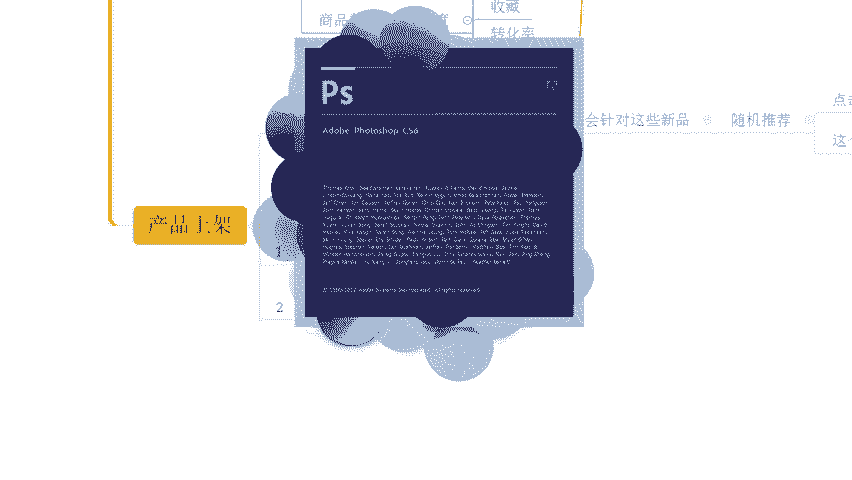
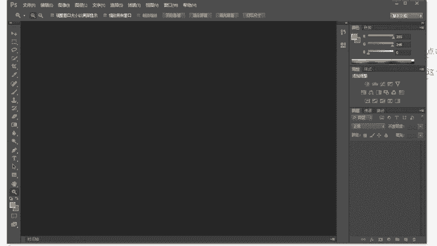
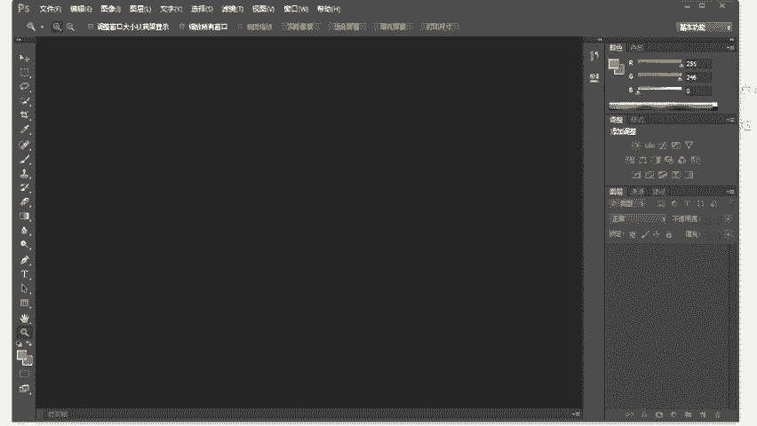
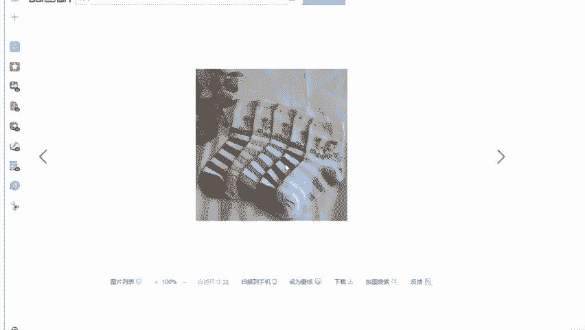
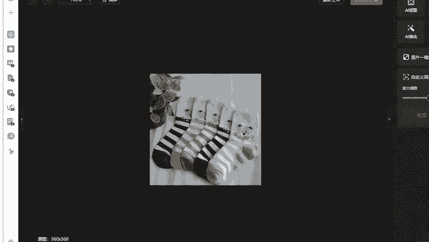
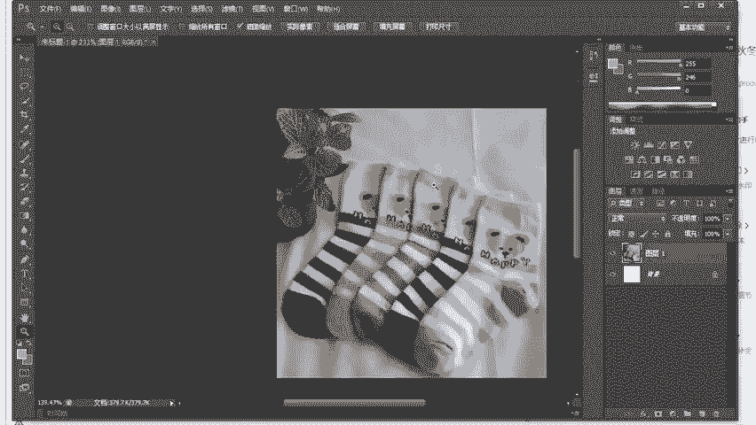
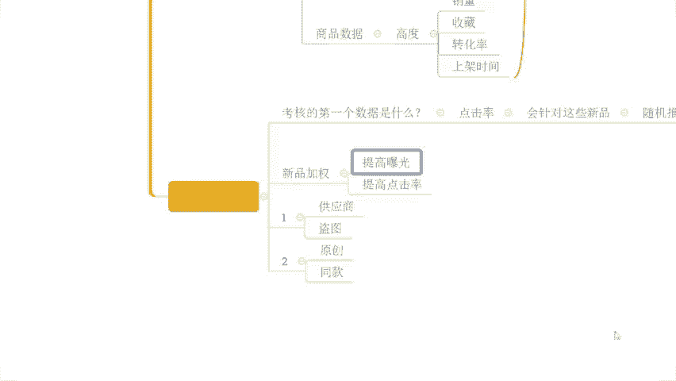
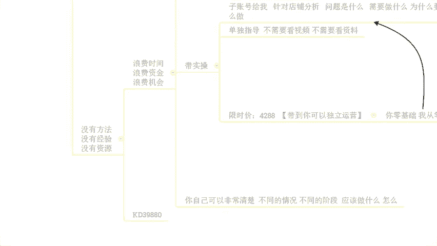

# 【拼多多运营实操教程】最系统的零基础拼多多开店教程全套，电商运营大佬专为学渣研制的新手开店保姆级教程！全程干货，简单粗暴 - P52：52、拼多多开店-获取平台推荐权重技巧 - -拼多多开店 - BV1BH1qYpEqw

OK啊，我后来了啊。😊。

呃，能听到声音吧，这边测下麦啊，所有的小伙伴在直播间的能够清楚的听到我声音的，能够看到我这边电脑桌面的声音后面如果没有问题的话，小一走起来，好吧。OK嘤嘤嘤你来了啊，可以的可以可以的啊啊。

大家今天来的速度挺快的啊。说实话啊，这个效率还还可以啊，可以啊OK呃，那么行啊，既然说大家声音各方面都没问题的话啊，还是按照国际惯例，对不对？我们先呢把这个直播间的一些小规矩啊，先说一下好不好？

那避免呢等一会我们可能在直播过程中，如果出现一些其他问题呢，导致啊这个发生一些不愉快啊。😊，那么呃几个点啊，首先第一个对不对？在整个的直播过程中啊，我希望呢大家能够啊做到。第一个就是积极回复，好不好。

积极互动啊，那当我在分享完某一个知识点的时候呢，我会跟大家进行确认，对不对？你是不是能够听明白是不是能够听懂。如果说你真的能够听明白，真的能够听懂的话，记得扣一回复我。那当然啊如果说你没有听明白。

没有听懂OK也要第一时间跟我讲啊。因为如果说你不跟我说，我是不知道的。我以为你懂这个很可怕的一个事情，对不对？那我就会往后面继续分享。到后面呢你可能更多的东西你是没有办法吸收理解的。

就会导致我们整个这个时间浪费掉啊，那就没有意义了。各位能理解吧？所以这个点的话希望大家能够去注意一下啊，还有一点就是什么呢？那我分享的时候呢，我喜欢提问。那我提的这些问题呢，肯定不是说随随便便提的。

对不对？一定是跟大家去掌握运营，去提升运营能力相关的那所以说大家可以把这个思路呢集中在我提的问题上，跟着我的思路去走，对吧？不要说自己去这个天马行空的想一些有的没的啊，那如果说我提到这些问题呢。

大家如果能够去有到一个自己的答案呢，也记得发在公屏上。如果说不清楚的呢，没关系，也可以直接公屏上跟我说啊，让我知道你们的状态。这样呢啊才能够更好的去这个提高，好吧。OK那我们继续往下啊。

第一个点是这样子的啊，然后第二个点呢，就是说在整个的直播过程中呢。我知道啊大家可能会有一些问题想要去了解，对不对？但是这里我说明一下啊，在直播过程中的话可以提问，但是呢问题仅限啊当前内容相关的。好吧。

如果说你有店铺操作方面的问题，你可以现在提，也可以等到我直播结束，正式内容分享完，你单独问都没问题。但是在直播过程中的话，问题仅限当前内容相关的。那么这样的话啊才能够保证大家能够去有到更好的吸收。

尤其是对于一些新手小伙伴来说，像我们今天直播间有没有这种纯新手的？哎，记住我想做。拼多多我想做电商是吧？但是呢我完全没有技础零基础的，有没有？有的话，公屏打一个0，好不好？我确认一下。来动作快啊。

OK有的啊有的DJ是这样子的啊啊，包括说还有很多其他小伙伴，我相信也是这样子。okK诺败也这样子的。那么像类似像这种小伙伴的话，如果说我们在直播过程中啊，问题东一个西一个，那么可能他们真的很难理解的。

😊，是不是？那另外还有一点呢，就是说呃本身呢我们这个直播时间确实有限啊，因为我平时可能更多时间我需要去代实操嘛，对吧？所以呢我本身做直播分享也是挤出时间来的。所以说如果大家你一个问题，我一个问题来问啊。

我们解答问题的话，可能要分享的内容是讲不完的。啊，所以时间方面呢这样子安排的。所以大家理解一下啊，那么这是第二个点。然后呢，还有到最最重要的第三个点啊，第三个点是什么呢？如果确实今天我分享的内容，对吧？

是适合你的，是你没有做的啊，没有做到位的，那么一定要什么去实操，好吧，一定要去做去落地执行，你不去做你听再多的直播看再多的视频都没用，店铺的数据呢，不是说你去听直播，你去看视频看出来的，好不好？

包括像我这里很多跟我实操的小伙伴一样的，他们店铺呢也都不是说看视频看出来的。是不是而是去做出来的，好不好？所以这个点大家注意一下，okK啊，那么呃有没有是第一次来直播间的，我看一下。

OK有啊有后有d士来的啊，有d时来的呃，一个游客登录的这个是灰灰，是你吗？来。啊，灰灰是你的话，你公屏上打个一啊。我确认一下啊，应该是你啊应该是你。嗯，落败怎么扣了个一？老拜。

不要冒充灰灰啊不要冒充灰灰啊。啊，这个这个游客不是不是回灰是吧？啊，我又看到很多这个熟悉的面孔啊，A百分号也来了啊，还有我也来了，对吧？O啊很多这个熟悉的面孔啊好O啊，那么行啊，既然说都是老熟人。

那么这里呢我们就不去做过多的自我介绍这些东西了，对不对？像很多小伙伴呢也会别在纠结啊啊，你是第次来是吧？啊行行行啊，有可能小伙伴呢会纠结说哎，现在这个电商啊这个拼多多还能不能做还好不好做，对不对？

我应该怎么去做啊，有的小伙伴呢可能对于店铺操作呢会比较迷茫？有的小伙伴呢可能也去做了很多的攻略啊，像今天在直播间里面的小伙伴呢就像这个呃A百分号对吧？来有在有在听吧，百分号，有的听的话，公屏扣个一好吧？

有在认真听的话，公屏扣个一啊，像他我就觉得不错的啊，我说实话在众多的跟我沟通这个做店过程中的小伙伴里面，我觉得他是有在认真做攻略的，知道吧？他有去认真。😊，分析过他自己去也要去做什么产品。

那么这个产品到底的一个这个静营的一个环境到底是什么样子的？他有去思考过这些东西，我觉得这是很好的一个事情。啊。这个是很好的一个东西啊。所以说这种情况的话。

我们操作店铺呢往往来说会比一些小伙伴什么都不清楚，什么都没适考过的话，去做成功率要高的多的。所以是这么一个情况啊，我希望大家能够去到一个正确的认知啊呃时间呢也差不多啊，还有几分钟时间。

大家有没有什么其他方面的问题。如果说没有什么其他方面的问题的话，我觉得我们要不然就可以直接开始了。各位，你们觉得呢？嗯，你们觉得呢？要不要再等一等啊，正常来说是两点钟开始的对吧？

我感觉今天今天人呢差不多了啊。😊，哦。可以开始是吧？O ok ok啊哎呦落败啊，你还挺着急的啊啊，在众多第一次来直播间的小伙伴啊，你是一个比较着急的一个小伙伴啊。O的啊。行行行，没关系啊。呃。

那么时间不等人啊，我也不想浪费时间，就像我讲的可能大多数时候呢，我也有在至场比较忙一点嘛。所以我我不想把这个有限的时间浪费掉啊呃，今天的话应该差不多都来了啊，已经呃时间的话还有两分钟2分多钟啊。

我觉得可以不用等这开始啊。那么呃今天要分享内容呢是我们拼多多心平奇款的一个技巧，对吧？包括像我前几次直播分享的也讲了很多很多东西，大家也都呃听到了很多，也都会觉得哎确实还不错啊。

确实这个戏落还有点东西啊，那么呃当然呢整个的一个分享过程中呢，也有很多小伙伴啊产生了很多很多的一些疑问，对吧？我们也进行交流。那么今天呢分享这个内容呢，仍然是我们这个自然流。😊，操作的玩法。那。

对于我们这个。对于我们这个自然流的操作呢，其实很多时候啊各位它就是对于我们这一个。规则的解读啊。对于我们这个算法的一个利用。啊，或者是运用吧，不能说利用啊。只能说运用啊，那所以是这么个情况的，对不对？

像你们有很多小伙伴呢会喜欢去追求一些所谓的黑科技，所谓的一些暴力玩法，对吧？这里我跟大家讲一下，你真正意义上想要去做好店铺，想要去做好运营的话，所有的这些所谓的黑科技，所谓的黑玩法都是不靠谱的。啊。

它只是一时的，它只是在当下某一个阶段啊，可能在平台的一个算法里面啊产生的一些所谓的bug啊，能够去利用到这个bug。但是真正意义上想要去好好坐店，诚新坐店的话，一定是要去懂得理解规则，运用规则。

运用算法的啊，那么呃今天呢分享的这个东西呢，也是我们去了解算法的一个开始啊。那么首先呢我先确认一下，各位，你们有很多小伙伴呢也是刚开始坐垫嘛，甚至有些小伙伴可能还没有开始坐店，对不对？

那么大家对于我们这个拼多多平台啊，它的这个呃排名考核机制大家都理都都都知道嘛啊，排名的一个考核机制。都清楚吗？如果说清楚的话啊，把你们认为的排名的规则发在公屏上啊。如果说不知道的，可以打问号啊。

有需要我讲一讲的打问号好不好？那我们把这个东西先搞清楚，搞清楚完了之后，我们再从规则出发，一步一步的反推，如何去把我们产品的权重，把我们产品的排名拉上去，好不好？来动作快啊。

可以一起呢把你们自己的这个答案发出来啊，那对于我们整个的拼多多平台来说，产品的排名啊，是通过什么样的方式进行计算的，或者是通过哪些因素进行计算的，好不好？大家可以说一说啊，如果说对于这个问题。

我刚刚讲到的，你是不清楚的，你是没有答案的，你是完全不知道的，没关系，打一个问号好不好？O落败不清楚啊，落败是第一次来直播间啊，然后呢，整个的店铺情况呢也是。啊，刚开始接触这一块吧，还没还还没算入门。

对不对？可能会有到很多的一些疑问啊，这个我觉得很正常，对吧？那么其他小伙伴呢嗯其他小伙伴呢都清楚吗？都清楚吗？来，我我看一下啊，这个呃李家啊风度啊都是些老熟人了，你们说一说好不好？还有这个书啊。

书也是老熟人了，对不对啊？书也是老熟人了。书有在认真厅吧，有在认真厅的话，来，如果说知道答案的话，发出来啊。然后还有这个呃字母R我好像也记得好好像看不到你很多很多次了呀。啊。不清楚是吧。

我好像看了你很多很多次了呀，这个这个2。ok耦和啊耦合来了啊，耦和说销量啊销量啊okK其他人呢？😊，其他人呢？我们直播间人不少啊，其他人呢？😡，这这里我先我先问一下啊，我先问一下各位。

你你们其实我有的时候就很不明白你们来直播间的目的是什么呢？😡，你们来直播间的目的是什么呢？嗯，是为了提升吗？还是为了就是打发一下时间呢？如果说只是为了打发时间，我我讲真的啊，有这个时间。

你还不如去打两把游戏，刷两局刷两局聚，对吧？更好一点啊。如果说是为了提升的话，OK的那我觉得我们还是需要去多沟通的啊，把你们自己呃所理解的东西讲出来，把你自己所知道的东西讲出来，相互提升之后呢。

才能够有到更多帮助。不然的话，你来这里没有意义的，对不对？O。OK我看我看看啊，这个欧若拉说是不知道，对吧？然后呢，之前呢你也打了一个问号的啊，包括像我们的二说不清楚。然后呢。

这个呃你佳说是这个商品数据，对吧？我会说销量啊，然后意音是权重啊，然后输说是ROI好，okK行啊，那么大概我知道了RI是什么。RI呢叫做投入产出比啊。

这个也是我们呃产品在进行付费推广的时候的一个数据指标。那么当然了，这个在我们企业经营管理中啊，也会去去权衡到这个RI的一个一个一个产出的一个具体数据，对不对？哎我做了这个公司或者我做了一个这个店铺。

我对这个店铺投入的资金成本是多少？我做了哪些的一个呃这个投入产出的一个结果是怎么样的，达到了什么样一个产值。那么这个也是可以称为ROI啊，那我们在做店的时候呢，其实ROI呢嗯在某种意义上来说。

确实可以去影响到我们的排名啊。但是呢在我们具体的平台的排名算法里面啊，它是没有这么一个数据指标的啊，这边我是说清楚啊，那其实呢对于我们产品的排名呢，平台是有到相关的规定的啊，这个是有到一个规定的。

这个不是说呃完全没有。有一个这个概念或者是没有这么一个呃所所有的一个标准的啊，是有标准的啊。那拼多多平台呢，它的一个产品排名，这里我跟大家说一下啊，是考核什么呢？考核的是一段时间啊。一段时间啊。

产品的这个上新时间。造新时间啊。然后呢，产品的销量。产品的价格，产品的质量，产品的售后啊，产品的评分啊等等啊等等啊这些东西。当然呢可能这样去写呢，大家可能记不住，对吧？没关系啊呃，你们有谁？

你们有谁目前是已经开店的？啊，你们目前是有谁已经开店的？来有开店的公屏扣个一啊，有开店的公屏扣个一好，OK啊，不错啊，呃，茵开店了对吧？至尊有开店啊，欧若拉有开店啊，然后呢，这个你家有开店，我会有开店。

好，各位已经开店的小伙伴呢，如果说你现在在电脑前面的话，你可以在电脑端打开你们的店铺后台。好吧，你可以在电脑端去打开你们的店铺后台，然后在你们的后台进入之后，左侧。😊，啊，菜单男。啊，你们可以找一下啊。

有一个帮助中心。啊，有一个帮助中心啊，可以去找一找啊。然后呢，你们打开帮助中心之后呢，进入到这个帮助中心的界面之后，可以找到在我们的商品管理啊，这个界面里面呢有到一个商品数据与搜索。啊。

可以找到这么个东西，在这里面呢就可以进去之后看到我们平台商品的排名规则，这个是有明文规定的啊。啊，里面呢就是写到我刚刚说的这个东西，对不对？考核我们产品呢在一段时间的商品的上新啊。

包括说我们的销量、价格、质量、售后、商品评分等等这些东西进行综合排序啊，进行排名更新啊，他有这么说的啊，具体的原话啊，我就不去给大家读了，我也我也没有那个闲工夫去记这种东西，对吧？

但是呢大家要清楚知道它的考核内容是什么内容就是这些。而具体的划分标准的话啊，在整个排名考核中呢，店铺考核的啊，这个商品的考核排名呢，它是分为四个类型的数据指标啊，哪四个类型呢，第一个是我们的店铺数据。

好吧？第二个呢是我们的商品质量啊，第三个呢是我们的商品数据对吧？最后呢是我们的处罚类啊，你们可以继己看一看啊，这个地方呢我就不去读啊，我先我先不用去读，你们可以先看一看。

那么这里我给大家看这个东西干嘛呢？我是要重。重点呢告诉大家，其实很多时候啊我们店铺运营的时候呢，在解决店铺操作这个东西上啊，我们缺乏的是一些真正意义上对于平台的了解，对于我们产品的了解。对不对？

你们可能有很多小伙伴每天会花费掉很多很多的时间去看视频，去逛所谓的这个干货的论坛，包括说看直播分享，对吧？没错吧，但是你们可能很多人并没有真正意义上的去了解过拼多多平台。

去认真的思考过你的产品的竞争环境，去了解过你的竞争对手是谁，这个是一个很危险的事情。各位听明白了吗？如果说你这些都不清楚的情况下，你去做店铺。说白了。你无疑是去干嘛呢？嗯。😊，是去撞南墙，知道吧？

虽然说我们讲不撞南墙这个新不事对吧？但是你这个东西明知是南墙，你还去撞，对吧？那就有点太可惜了，对不对？那我们整个店铺操作里面呢，我们刚刚讲到的这些数据，它的考核也是有主次之分的。啊。

所以这个是我们首先要搞清楚的事情。那么现在啊你们有谁已经看过我刚刚说的这个位置的，有看过的公屏扣个一啊，有看过的公屏扣个一。刚刚已经去看了的，公屏扣个一。好，OK好，不错啊，执行力还是可以的啊。

执行力可以的。我觉得说实话，但凡是你们后期呃，如果说跟着实操有这样的执行力，我觉得店铺操作应该不难的啊？我说实话啊，像我这里的数跟我做实操的小伙伴们，真的但凡是执行力跟得上的小伙伴。

我觉得店铺操作能够去有到一个好的提升及早晚的事情啊，那对于我们刚刚讲到了这些东西，它我刚刚也提到过有主次，那哪个是主，哪个是次，我们一起要先把这个东西搞清楚，理顺它，我们知道了平台的规则，懂得的算法。

我们才能够去加以利用，对不对？好，那么现来看一看啊，首先店铺数据是什么呢？店铺数据，我们刚刚应该有小伙伴已经看过的对3分钟人工回复率。😊，啊，包括说我们的这个呃物流服务异常率。

对吧包括说我们的这个30天流诉率。包括我们的这个啊品质退款率。包括我们的这个纠纷退款率。啊，等等啊等等啊这么些东西。这里啊我说一下啊，在我们后台，在我们刚刚看到的这个后台里面。

他写到的内容在我们店铺数据里面只有这些，但实际上不止这些啊，这里我先说一下啊，实际上不止这些。啊，新店前期做综合数据，店铺DSR评分是吗？啊这些东西啊是在我们操作新品时候自己会产生的，不需要刻意去做啊。

为什么呢？来，现在我们一起来看一看，刚刚书有说到的店铺DSR评分，我想问大家，这一个考核内容，大家认为是在店铺数据里面呢，还是在商品质量里面，又或者在商品数据里面还是在我们的处罚类里面，在哪个里面。

各位，你们说一下啊，如果觉得在店铺数据里面的，扣个一啊。如果觉得在商品质量里面的，扣个2。如果觉得在商品数据里面的扣一个3。如果觉得在处罚类里面的扣一个4。各位动作快啊。

刚刚这个书提到的店铺DSR评分是在哪个里面？店铺的DSR评分啊。平台介入上上嗯都上到15去了啊，那是你自己这个。怎么说呢？要么是你产品本身有问题，要么是你自己这个沟通技巧有问题啊。OK啊。

有人说在第三个里面，有人说在第一个里面啊啊有个别的啊少部分的啊，目前来讲哎啊差不多一半一半啊，目前给了我反馈的是差不多一半一半，其他人呢？喂，你们这么多人在直播间就就这么几个人回答我问题。

才能是不清楚吗？不知道吗？如果说不知道啊，你打工号，兄弟们啊，动作快一点啊，你们不要不不要不沟通啊，对不对？一定要说啊，一定要说。😡，在考核排名机制里，我的天说你这个话说的没毛病啊。

确实在排名考核机制里面啊，那在这里面的话，在哪个里面啊，在哪个里面这四个类型里面啊，在四个考核项目里面，它在哪个里面。😡，啊，因英说是物流服务商品这个质量描述啊。OK好，行吧行吧行吧行吧好。啊。

那我告诉大家吧，好不好？我告诉大家吧，下三个啊，我告诉大家吧，你们说的都不对啊，刚刚这一个呃讲这个1234啊，讲这个什么呃这个下面三个这个都都都肯定不对的，讲第三个的肯定也更不对的啊。

店铺的DSR大哥明明都写了很大的两个字店铺了对吧？你怎么会到这下面去找问题呢？店铺DSR评分肯定在店铺数据里面考核呀。各位这个逻辑能懂吗？那商品数据的话，你说有商品DSR数据，那这个我承认对吧？

商品DSR数据汇总可以得到店铺DSR评分，这个我也承认，但是你说店铺DSR评分考核在这是个项目里面的话，哪个里面一定是第一个各位这个逻辑能懂吗？😊，这个逻辑能懂吗？能懂的话，现在能理解。

能明白我表达的意思的话，公屏上打一个一好不好？😡，店铺DSR所谓的店铺DSR，你说你在下面去找，你下面哪里找啊？考核项目考核项目它不是指我们数据来源，懂吗？😡，好。

那这个问题为什么说我刚刚要去回答他要去解答它呢？兄弟们，我讲真的啊，这个就是你们很多人做店铺的一个弊端啊，完全没有搞懂平台的一些东西跟算法的时候呢，自己会有一些自己认为对的一些想法，然后去操作。

或者道听途说的一些想法去操作啊，那这里呢我们继续往下来看啊，刚刚呢我们说的呃这个店铺数据里面，除了我们平台给到我们明确规定的或者明确表达的这些考核内容之外，还有其他的东西啊。

其他东西里面这边我是使名号有打到的，对不对？那么这个其他东西里面到底有什么呢？刚刚这个店铺DSR在里面的啊，包括说我们的店铺层级。啊，店铺层级也都在这里面的啊，还有更多东西其实都在这里面的。

那么这里我为什么要讲这个？啊，就是因为我们很多人做店铺，有的时候本末倒置，完全没有搞懂算法的时候呢，瞎操作，什么意思呢？各位这里我要重点说明一下啊。有很多人开店之后，第一件事情先去啊搞DSR。

先去搞店铺成级。有没有？今天在直播间的小小伙伴们，如果说你有这种情况的，公屏上现在给我打一个2，好不好？我先确认一下。啊，来动作快。今天我们直播间里面有没有种人？😡。

上面之后先去这个呃通过各种渠道去做DSR评分，通过各种渠道去干成绩对吧？做大单呢是吧？从直播间做呀，从这个呃果园去做呀，通过其他的途径各种去做做大单做成级有吧？有没有OK有啊，OK啊，行。

那么这里我要重点说明什么呢？店铺数据啊，它在我们整个的。新品啊，包括说新建前期考核的时候呢，其实对于我们来说根本就不重要。这个这个说法我知道可能会颠覆你们的认知，对吧？你们可能很多小伙伴并不是这么想的。

包括说你们一直以来接触到的，了解到的这些信息也不是这么跟你们说的，可能一直以来你们接触到的信息去告诉你啊，店铺的DSR评分很重要。你上架商品之后，先去把这个50个评价干出来，先去把DSR干出来。

不然的话你的商品不可以入持，不然的话你的商品不能搞活动，不然的话你的权重就会很低。没错吧。😡，但实际上真的这样子吗？不是的。不是的啊，为什么说不是的呢？各位，我们一直以来都听说过一个事情叫做新店啊。

叫做新店有扶持，对吧？各位这个词大家有听过吧，这个词大家有听过吧，来有听过新店扶持这个词的，公屏上打个一好不好？😡，你们可能现在还觉得哎，这个徐荣，你你现在表达的这个意思是什么？不用着急啊，不用着急。

😡，认真听，你们会知道你们会了解到你们所以前没有认知道的，没有了解到的东西啊，对你们来说应该是一个啊非常大的一个提升哈。那新店福利是什么呢？各位很简单，那么对于我们店铺来讲，我们是一个新店。

我们是一个呃刚刚入驻的一个店铺。那我们在平台上去发布了商品。这个时候我想问大家一个问题。你有所谓的3分钟人工回复率吗？你有所谓的物流服务异常率吗？你有所谓的这个30天投诉率、品质退款率、纠纷退款。

你店铺跌12平分，还有店铺层级吗？这些你通通都没有，对不对？😡，那么这些你通通都没有的情况之下，平台为什么说还会给你曝光呢？这个曝光其实就是新电负责。啊，这个曝光其实就是新年负责。他扶持是什么扶持啊？

它扶持是你在这些数据都没有的情况之下，让你存让你存在着一个状态，就是默认达标的状态，各位能懂吗？这些东西你前期是一个新店的时候，你是没有的，没有怎么办？默认你是达标的。默认你是达标的话。

ok那么你的产品，你的店铺是可以正常曝光的。什么意思？各位我画一个图，大家认真的看一看好？来，现在有在直播间的，有在认真听我分享的公屏上打一个6，好不好？动作快啊，有在认真听的，现在公屏打个6啊。

我现在画一个图，这个画图的过程的话，我可能不会去打字，所以希望大家能够把注意力集中啊，能够去认真的看懂这个图，好不好？来，现在呢我们一起看一看啊，这里呢是我们的拼多多平台啊，这里是我们的拼多多平台。

那现在呢我们画了一条横线啊啊，我们用这个画一条横线吧，红色的横线啊来。😡，现在我们画了一条横线啊，这一条横线。😊，在最中间的位置呢，就是我们产品的曝光的一个原点啊，我用一个别的颜色啊，用一个黄色吧哈。

我来画一个黄色的圆点啊出来。好，那么这个黄色我相信大家应该能看得很清楚，对吧？在这个位置啊，在这个位置，这个是我们曝光的原点。正常来讲，我的产品上架之后呢，它就从这个位置啊。

它就从这个位置开始去获取曝光的。从这个位置往上。啊，往上数据会变大对吧？往右数据也会变大。那往右是什么呢？往右是我们产品的基础权重考核，哎，我我现在来画一个框子啊，这个这个这个框子啊。

我用一个蓝色来来来表达吧啊，用一个蓝色来表达来，这一个蓝色的框子呢，如果说一开始我是新品的时候，对吧？我没有商品的销量，没有商品的这个转化率，各种数据指标都很少，它可能就很矮啊，它可能很矮，然后呢。

我产品上架的时候呢，我产品的标题呀，图片呢，价格呀属性呢，这些各种东西都不是最优质，对吧？这个时候呢它就会很窄，又矮又窄，对吧？但是如果说今天我的产品有到一个很好的产品的这个价格有到很好的产品标题。

有到很好的商品的属性，有到很好的商品的图片。好，那么它的宽度是可以被扩大的，价格是一个超级适合我们拼多多平台的一个价格，具备非常好的价格竞争力的话，那么它的流量宽度会被扩大。它的图片是一个优秀的图片。

是一个原创图片，是一个新品，它的宽度再次被扩大。当它所有的东西都是最优的时候，它就变得最宽最宽。它能够覆盖到所有的这个产品应该能够覆盖到的最大的流量范围。然后呢，商品的销量板块啊。

它能够具有到一个好的销量数据，它的高度会增加，它的转化率很不错，高度再增加，它的客单价也很好，高度再增加。它整体的坑产不错。GMMV做的很好，它高度再增加，再到后面呢它的这个整体的啊UV价值啊。

同比增长率啊等等。这些东西做的都很好，它的高度再增加。直到最后能够覆盖到最大的范围。这个就是我们刚刚讲到这个商品能够拿到的最大曝光。啊，但是。但是听清楚有但是啊，但是如果说我们的店铺的数据不达标。啊。

哪些店铺数据呢？3分钟人工回复率，30天物流投诉率对吧？啊？30天这个呃投诉率，30天这个物流服务异传率，对不对？还有我们的品质退款纠纷退款率等等这些东西，我们的DSI我们的店铺层级不达标。

那么这个时候它是不会从原点来的，这个黄色的原点还记得吧？这个黄色原点，我把这个绿色删掉去啊，黄色是我们的曝光原点，我的产品从这个地方开始曝光的，对不对？那如果说我的店铺数据不达标的话，那么抱歉。

这个时候呢，你的起点就不是这个位置，你的起点会往左边移动。啊，那么相当于左侧部分呢，它是一个降权的状态，知道吧？各位啊，左侧部分是一个降权状态啊，我把它画成这个青色啊，那么这条这个框子啊。

如果说我的这个店铺的30天啊这个呃3分钟人工分率不达标，它往左侧移啊，它的这个呃30天这个投诉率不达标，往左侧移啊，所有的数据考核完之后，哎，那么它的这个时候才是它的起点。那这个时候才是它的起点啊。

等哎等下我要画一个这个。我要换一个别的颜色啊。呃，换一个紫色啊，来这个紫色才是它的起点，对不对？而正常来说，我如果说店铺权重达标的话，那我的起点在这个位置啊，我起点在这个位置来，我换一个颜色啊来表达。

好吧，换一个这个刚刚蓝色好，各位。起点就不一样了，对不对？但是听清楚了，产品在进行发布之后呢，第一时间优先考核的是什么？优先考核的是我们产品的这个呃商品的数据，商品的权重。商品数据权重考核完之后。

进行产品排名才会去考核我们的店铺数据。各位来整个的逻辑，现在能够明白，能够搞清楚的公屏上打一。啊，能够明白能够理解公民打一。好，当我们把这个搞清楚之后，我们再回过头来问一问啊。我们现在作为一个新店。

作为一个新这个新操作的一个店铺，新操牌的一个店铺，我需要上去去做我们的店铺DR，上去去做我们店铺层级吗？各位需要吗？觉得需要的打一，觉得不需要的打个2。啊，现在这个逻辑应该很清楚了吧，对不对？还需要啊。

我的天怎么可能还需要，我们不需要，为什么？因为这个时候我们是达标的，我们做来干嘛？😡，对不对？这个时候我们是达标的，我们不需要做它，对吧？只有当我们不达标的时候，我才会影响到我们排名。而店铺的这个数据。

包括说我们的处罚类啊，这两个板块啊，他们两个。😡，指降权。啊，他们两个只降权不加权啊，那我们真的想要去做好店铺这两个数据，我们在日常运营的时候去维护好就可以了。而我们要获取产品排名的话。

实际上真正意义上要做的是吗？是做我们产品的质量是做我们产品的什么数据是这样子的。好不，这个逻辑才通的。那么这个时候呢，我们就往下继续看了，好吧？我们就往下继续看。那么商品质量各位是什么都清楚吧。

如果说不知道的打问号，我讲一下啊。呃，我说我找了个代运营，先说单做成绩，昨天补了300人啊，这个我不做评论啊，这个我不做评论，我给你这么解释吧。呃，这个是是是上个月还是哪个月，我忘了啊。

应该是上个月的事情啊，有一个哥们儿啊，有一个哥们儿，他去。开了个店铺啊。然后呢，他也是听到一些人跟他说，你这个店铺啊，你现在这个新店里没有成级，你是没有流量的，对不对？你先得去做到第三层级。

第四层级才行啊，打底三层级对吧？要做到这个数据才行。好，他去做了，他去做了大单去做了啊，啊，一共的营业额呢是做到了12万多，将近13万啊，做到了第三层级还是第四层级，反正做到这个样子吧啊。

当时觉得哎我感觉要起飞了，对不对？然后呢，扣点呢扣了有个反正差不多快快1000块钱了吧啊，八九百块钱，差不多小1000了啊，扣点扣了这么多，做完之后。店铺反正一直以来都没有什么太多的访客。

所以说你说他这个靠不靠谱，我不知道，因为我不知道他后续的操作啊。😡，我的天5啊，我跟你讲啊，我跟你讲，我你说这种我见过啊，你说这种我见过，我不知道他是不是我跟你讲一个案例吧。

我跟你讲一个案例吧啊呃有一个这个。😡，有个哥们儿啊也是也是这个在看我视频加到我这边的，他跟我讲，他说呃，谢老。这个我我这个确实认识你比较晚啊，这个有点后悔，我应该早点认识你的，我说怎么了？他会被骗了。

我怎么被骗的？他说找了一个代运营，这个代运营呢不是说收服务费这种的免费代运营跟你一样的啊，说纯纯这个提点，而且还签合同的对吧？呃一个月销售额，如果说没有做到10万，分文不取，做到10万之后啊，提多少呢？

提五个点啊，5%啊，他一听哎也感觉合理啊，对吧？一个这个钱也不多嘛，对吧？这个钱也不多啊，他真的是能做到10万的话也很合理的对吧？各位，你们觉得这样的方式合理吗？你们觉得合理的话，公民扣个一。

你们觉得这样的方式合理吗？😡，对吧如果说是你你愿意去做吗？这个事情。😡，各位可以实事求是啊，我相信啊现在在直播间很多小伙伴都已经听哇还有这种好事，对吧？找我呀，我我我愿意啊，对吧？😡，OK了。

我说一下啊这种东西啊。你们如果觉得真的好的话，那你离你你你这个嘴都瓢了啊，你离被骗啊就不远了。😡，知道吧？你离被骗就不远了啊，这后面怎么被骗的？我告诉大家。😡，然后呢，这个所谓的代运营呢，怎么做的店铺。

咱也不知道，我只知道一个事情，就是他店铺的这些订单确实出现了，确实经营的效果很好，确实有很好的转化，确实有很好的这个销售额。啊，确实很销售额，一个月下来干了有个二十几万啊，销售额干了二十几万。😡。

然后呢，这个这个待玉理呢就找找他呀。哎呃，这个兄弟，我我这个业绩都做出来了，对不对？这个你现在看你什么时候把这个提点截给我。好。😮，这个哥们儿就上头了哇，这个不错牛逼，对吧？我我我要跟你长期合作，姐。

马上跟你结咔前脚把钱打过去，后脚店铺里面咔咔咔订订单全退货了。😡，哼。😊，厉害吧。厉害吧，我就说厉害吧。😡，那这个是最恐怖的啊，这个是我见过最狠的一个一个操一个操作啊，对吧？

这个是我见过最狠的一个操作啊，像这种东西对不对？就像这个我和说的一样，对不是天上掉馅饼，哪里轮得到你的呀，是不是？😊，没错吧，他有这功夫去帮你把烟猫做起来，赚你的那种提点，他自己做店做个店铺不香吗？

对吧？😡，神经病啊是吧？跑过来帮你帮你打工，白打工还是啊好了啊，所以这个东西大家有正确认知啊，对不对？OK啊，这个刚刚这个一个这个别的话题扯远了啊，我们我们收回来啊我们收回来啊，我们收回来。😊。

那么我们刚刚讲到的呢，是我们整个店铺的一个排名考核机制，对不对？但是在里面呢，我们刚刚提到的真正意义上对我们商品有帮助的啊。5、你不会是已经合作了吧。😡，啊，对对对，你你已经开始做这个成级了，是吧？😡。

O啊呃J哀啊J哀。😊，愿天堂没有灯你。😊，😀あ。😊，我的天啊，开玩笑开玩笑啊，是吧？这个东西怎么说呢？吃业性转移只吧，我觉得还好啊，你目前的损失还不大对吧？

及时止损吧啊及时止损啊O啊呃继续我们刚刚的话题啊，刚刚讲到的是我们这个店铺群考核啊，大家兄弟们啊，注意力集中吧啊，来有在认真听的公屏扣个一好不好？稍微的这个这个注意力啊，转移一下啊，跟上了啊，跟上了啊。

要开始分享了啊，好不好？来所有人动起来啊，有在认真听的啊，小一走起来，我看一看。😊，OK啊OOOK啊，可以的。啊，那么对于我们整个店铺来说，刚刚讲到的真正意义上影响我们的产品排名的。

能够帮我们去增加权重的。其实是我们的商品质量和我们的商品数据，是这两个板块啊，这两个板块是增加权重，增加排名的。知道吧？那首先第一个商品质量啊，商品质量是什么呢？

商品质量不是说我们产品的这个呃材质怎么样耐不耐用，对吧？哎，不是这个东西啊，它指的是我们商品的这个标题。我们商品的关键词，我们商品的主图，我们商品的详情，我们商品的价格，我们商品的属性啊，还记得吗？

我们刚刚画的这个图。它影响的决定的是我们流量的宽度啊，这个东西它决定我们流量的宽度啊。好吧，这个东西决定我们流量的宽度啊，在这个地方。那么这些东西的话，当我们上架商品的时候呢，就直接出现了。

在我们平台上就直接有了，对不对？平台呢会针对到这些数据来进行考核，然后给到我们产品一个基础曝光。那么这个基础曝光给到我们之后呢，对于我们产品来说的话，我们可以获取到一定的曝光量之后呢。

通过后续的点击反馈来进行平台推荐去中的获取哪些后续的数据反馈呢？我们的点击情况，我们的点击量情况，我们的搜索热度等等啊，然后整个商品在进行运行过程中，产品有了曝光，有了反客之后。

再会进行我们商品数据的考核，对不对？那么这个商品数据呢，它决定了我们流量的高度啊，我们能够拿到多少的量啊，高度在哪里？这个他决定的。那么这里面呢就包含了我们刚刚有很多小伙伴们提到过的销量啊，对吧？

包括说我们的这个啊收藏，对吧？你们没有提到过的收藏啊，还有到我们的转化率对吧？还有我们的上架时间。啊，这些东西考核在里面的。那么现在啊我有一个非常非常重要的问题要问大家啊。

我有一个非常非常重要的问题要问大家。那么对于我们店铺来讲的话，现在我们产品上架了。那平台针对到我们商品考核的第一个数据是什么？刚刚我其实有讲到的啊，我不确定大家有没有认真听啊。如果有认真听的话。

现在应该能够给我答案的。如果说不知道的不清楚的打问号，没有听清楚的，不确定的打问号，有知道答案的发到公屏上来。欧若拉，你知道吗？😡，然后李佳你知道吗？战争与和平啊，包括英英，还有阿比啊。

还有这个微薇养生啊。是吧来如果说清楚的话，知道答案的话，可以发到公屏上啊。如果不知道的话，没关系啊，没关系，打个问号好不好？呃，阿比你是知道是不是宽度啊？战争和平说宽度啊，然后按说商品的质量啊。

然后英英说评价，我的天哪。还记得还记得我刚刚讲到，我说我们产品呢。平台给到哎，有人说到了一个点子上啊，稍稍微有点接近了，稍微有点接近了啊。我们产品上架之后呢，平台会根据我们的商品质量，对不对？

来进行产品的基础权重考核。各位还记得吧？而针对到这个基术权重考核的时候呢，平台给到我们曝光之后，后续会根据我们的数据反馈来进行推荐权重考核。那么其中呢就会考核到我们的点击情况，对吧？我们的点击率啊。

刚刚我有提到过的，我有说过的啊，可能大家这个语速比较快的情况之下，大家没有听清楚啊，这个没关系，但现在的话，我希望大家能够记住它啊。所以在这个时候我们产品上架了啊。

那么平台会进行考核考核的第一个数据去点击率。各位记住了啊，点击率为什么说考核点击率呢？道理很简单，各位，你们想象一下啊，今天如果说有很多产品发布到平台上来，对不对？都是新品都是跟你差不多的一样。

产品都没有销量，平台呢会针对干嘛呢？会针对这些新品进行推荐啊，进行推荐，进行一个随机的推荐啊，给到一定的曝光，那么这个曝光呢，他们的数据量呢，按照我们商品质量不同，可能也会有多有少，对吧？

但是都会有到一定的曝光。那么有人给到了曝光啊，可能和你差不多，或者比你多或者比你少，这个东西都不重要。重要的是什么呢？有人他的点击率很高，那么平台就会认为这个产品。啊，这个产品啊，用户的喜爱度高。

举个例子啊，打个比方举个例子啊，今天像这个敏啊敏啊有发布一个产品啊，这个产品呢发布出去之后呢啊平台给了他1000个曝光，对吧？那么这个产品呢哎图片呢做的还可以，对不对？啊，做的还可以。

点击率呢做到了10%，对吧？点击率到了10%，他能够去拿到100个访客啊，打个比方啊，另外一个哥们呢哎也能够拿到1000个曝光。这个哥们就是安啊，安也拿到1000曝光。然后呢，安的这个图片呢比较差劲啊。

只有1%的点击率。啊，1%的点击率，他的访客只有10个。那么各位我现在想问大家是第一个权种高呢，还是第二个权种高呢？对不对？来，大家可以把蛋发供应商啊，你们把这个东西搞懂。

你们就应该能够理解到为什么说是顶击率的考核了。😡，啊。OK啊呃，其他人呢？😊，来我点个名吧，点个名。欧若拉欧若拉啊，这个是谁权重更高？答案发出来好不好？战争与和平阿比啊，还有这个言有物行有格。

还有走下去，巍巍养生，不知青在的小河，还有新旺达啊，还有这个勤奋妞不再载啊，还有炸涨对吧？来把答案发出来啊，把答案发出来好不好？是谁？是谁主能搞？OK啊OOOK啊，还不错啊还不错啊，对不认认能听啊。

至少对不对？所以这种情况之下，那既然说第一个优先考核的数据是点击率的话，那我们在做店铺的时候应该去做什么？应该去呃就是最早的时候我们应该注意什么？大家说一下。😊，嗯，那我们现在去操作一个店铺。

我们去经营一个店铺，我们去做了一个新品。那我们在最开始产品进行呃这个上架操作的时候呢，我们应该注意什么，应该做什么？怎么样去保证我们能够有到更高的群众，能够拿到更好的排名。各位一起说一说好不好？

一起说一说。其实刚刚呢在在这个之前啊，我问大家考核的这个数据是什么的时候呢？啊有人提到过这个东西的啊，就是敏有提到过的对吧？他提到过一个词叫主图啊，他提到过一个词叫主图。其实对于我们店铺来讲的话啊。

我们在前期经营店铺的时候呢，我们要核心操作的部分呢就两个点。提高曝光不是提高浏览量啊，是提高曝光啊。另外一点呢就是提高点击。有点率。好吧，比个点击率啊，是这两个部分是最重要的。你把这两个部分搞定之后呢。

你的产品在初期考核中才能够脱颖而出。而产品的曝光怎么提高的？刚刚我们提到过，对不对？流量的宽度啊，商品质量考核的呀，对吧？那在这里面的话，我们进行商品的上架的时候呢。

我们能够具有到一个啊很好的爆款潜力属性的产品，我们去发布它，同时呢我们的标题，我们的图片都是原创的，能够去有到一个更好的系统推荐权重。同时我们的价格呢也是一个合理的价格段，能够具有到更大的人群覆盖范围。

对不对？那自而然我们整个商品的曝光呢也会更多啊，自而然，我们产品的曝光也会更多。而提高点击的板块的话，OK的，那么就重点在于主图了。而主图它也是考核到我们提高曝光的一个重要途径。

如果你能够去有到一个新品标，你能够拿到新品的加权啊，你能够拿到新品的加权。那么这个时候。啊，这个时候你的产品呢在初期运营的时候就会很顺。知道吧？那这个板块你们可能很多人都不会去做，甚至都不懂怎么去做。

这个没关系。今天我来重点说一说这个事情好不好？各位有多少人你们是自己拿货的啊，图片呢也是呃这个盗图或者是拿供应商图片的啊，或者是东拼西售去自己拼的这种情况扣个一啊，这种情况扣个一。

如果说你自己是拍摄的啊，自己去设计的，自己拍摄的这种情况扣个2，好不好？来动的快。OK啊OK啊，有有小伙伴呢是这个哎，小韩哥来了啊，青岛小恩哥来了啊啊，有有小伙伴呢是第一种情况。

也有小伙伴是第二种情况对吧？也有小伙伴是第二种情况。那那么不管你是第一种情况还是第二种情况都给我听清楚了，今天这个操作非常非常重要。😊，一定要记住。好吧，有多重要呢？给大家讲一下。

那么那么对于整个的操作来说的话啊，我们的店铺我们的商品它在进行权重考核的时候呢，是会去考核我们的相似商品，会考核我们的同款商品的。如果说你的图片是供应商的。如果说你的图片是盗图的。啊。

那么这种情况你很难去保证你的原创性。各位没错吧。那么这个时候呢，你想去拿到新品加权也会很难。啊，也会很难啊。而你如果说是自己拍摄的这种原创性，你是可以保证的。但是如果你自己是厂家。

你会拿图片给别人分销的话，这个时候也会有到一个问题，你的同款，你的相似款很多，会导致产品的新品权重也会受到影响。所以说我不管你们是第一种还是第二种今天分享的这个方法，一定要掌握它，一定要去用它好不好？

来什么方法呢？这个方法叫做颜色叠加法啊，也是我自己原创的方法啊，包括像我自己做这些店铺，我自己带实操的这些店铺，我们都会在用到这个方法，对不对？用到这个方法的话，很简单一个点。

我们的产品跟同行可以进行一个区分。哪怕你是同款，哪怕你是用到相同图片在权重考核上也是有区分的。那我们是可以有到一个更高的加权的。所以这个点很重要啊，那么。可能你们说哎这个东西到底是什么？

它有它到底是怎么做的啊，我们首先搞清楚一个东西。各位呃，今天你们在直播间有小伙伴是自己拍摄，自己做图的，对不对？那么呃应该是有接触过摄影或者设计的那。问大家一个东西啊，在计算机里面图片啊在计算机里面啊。

图片或者在互联网里面吧，我们也不是计算机吧啊，我们就说在互联网里面啊，在互联网里面图片的表达形式，它是通过什么表达出来的？嗯，这个这个一个非常非常这个常识的一个问题啊。😡，非常常识的一个问题。

我我觉得应该应该是能够去给到我答案的。如果不知道没关系，可以打问号啊。对啊，你家说的不错代码啊。我们的互联网也好，我们的计算机也好，对不对？它是没有图片这么一个表达或者是一个一个呈像的方式的。

它只是代码各种各样的信息。包括我今天打的这些文字一样的。拼多多平台也好，呃，各种平台也好，各种这个系统也好，没有哪个系统是可以直接读取到文字的，尤其是汉字，汉字最复杂的计算机就是个傻逼。

它根本就不认识汉字，这些汉字在计算机里面就是二二进制的一串代码，对不对？那图片也是一个道理的，它不认识图片，它只认识代码。那么这个图片在代码的世界里面去表达的话。

它其实以不同的一个阵列的像素的一个排序来进行展示的。比如说代码里面会呈现出这一个图片它的呃这个高和宽分别是有多少个像素组成的。然后每一个像素的分列形式是怎么样的。每个这个代每个这个像素它。

颜色是什么样子的啊？然后呢，它们组合起来拼接起来，就跟堆积木一样的，堆出来一个形状。这个东西堆出来之后，最终就是我们的产品图片。啊，但这样的一个一个这个说法，可能有很多的一些完全没有接触过。

不懂这个东西的人呢不理解啊。没关系，我们去打开一个图片，好吧，我们先去打开一个图片，这样子呢大家可能会更加直观一点啊，我先打开一个图片。

那好。呃，你们你们做什么产品的呀？来这样子，我问一下吧，你们做什么产品的呀，可以把你们做的产品发在公屏上啊，我们去随便找一个啊，找一个产品呢，我们来举个例子啊，O袜子是吧？😡。

啊，这个英英说袜子啊，okK啊，我们来哎等一下，我我这样子吧，我去。

我用这个我用这个呃。我用这个浏览器啊，把这个拼多多打开啊，把拼多多打开，我们来找一找袜子啊啊，欧了拉说这个做家纺的欧若拉，你是南通那边的吗？Yeah。是南通的还是这个天津那边的？南通是吧。

我就知道啊我就知道。啊，哎，完蛋啊，这个还这个这个网页还打不开，那我直接百度一下吧，直接随便搜一个图片了，好不好呃，袜子啊袜子。OK啊，我们随便去找一个袜子的图片吧，这样子大家可能会呃更加直观一点啊来。

呃，来找一个啊来找一个。五金好像图片没有什么好做的吧啊，这个我跟他家说一下啊，这个不管你是什么品类都一样。都要去做都要做出区别，都要做出差异化啊都要去做啊，具体怎么做，大家不用着急，认真看着啊。

认真看着呃，找一个这个有模特的吧，对不对？我觉得找一个有模特的会会会好看一点啊，对吧？不然这个平拍图挂拍图这种的太死板了啊，这个看着没没没劲啊。哎，怎么怎么全是这种啊？啊，算了算了算了算了。

随便找一个吧是吧啊，就就就就就这个吧，就这个吧啊，就这个吧啊，就这个吧来啊，我先把这个图片啊啊给它放大一下啊。

哎有，放大于这个样子，太坑了啊，那直接复制吧啊，直接复制OK啊，复制一下好，这个图片我已经复制了啊，兄弟们，这个图片我已经复制了啊。好，我不管你们做什么产品的，现在认真看啊，我不管你们。😊。

什么鬼东西啊，我说你你你又你又败坏我名声啊，真的是啊是，我是那么的。😡，绿色健康对吧？你跟我来这一出。来啊，这个是袜子啊这是袜子啊，这里没有妹子，看到没有？这都是袜子啊，不要败费我名声啊，真的是啊来。

各位刚刚我讲的，我说在计算机里面在互联网里面我们的图片呢，平台是没有办法去直接识别的，它识别出来呢是以一个一个像素的组合排列来进行识别，对不对？还记得吧？那么它怎么组合的呢？来它放大一下，看一看啊。

这里面呢会有到一个一个的格子，各位看清楚没有？现在能够看的很清楚的话，公屏字打个一，对不对？这么一个一个的小格子，这个就是像素。😊，这就是像素，有看清楚没有？有看清楚的扣1。所有人动起来啊。😡。

这一趴很重要，这一趴我不会去给你们记笔记的。😡，这一趴我就全部用嘴讲，我不会去打字。😡，如果说你没有人听。然后你又没跟我互动，下播之后，你问我说，哎，这个东西怎么做的？抱歉啊，一边凉快去知道吧？

我懒奶鸟你知道吧？😡，对不对？讲的时候不认真啊，又不问又不互动的啊，下播之后来问问题，这种情况你你一不两过去啊，对不对？😡，这个是像素啊这是像素。那么在像素里面的话啊，刚刚讲到的在互联网里面。

它是每一个像素进行一个排列组合，然后汇总，最终呢形成这么一个图片，对不对？好，那么在这个过程之中。

各位，我想问大家一个一个一个问题，如果说这些像素的排列颜色信息、排列情况发生了改变的话，它是不是一张新的图片？嗯，这些这些像素啊，在整个的排列分布过程中，在颜色信息的体现上面发生改变的话。

它是不是一张新的图片，觉得是的打一个是，觉得不是的，打一个不是。OK啊，按说是。没毛病啊，老铁啊没毛病，绝对是啊绝对是啊。那么现在我们再回过头来看一看啊，如果说我想要去改善改变这一个图片的像素信息的话。

改变它的颜色信息。可以做到吗？完全没问题，改变它的排列信息，排列的状态可以做到吗？也可以做到，对吧？排列方式很简单呢，我们可以做一个镜像的就可以了。对吧我们可以做一个镜像就可以了。对吧哎。

原本呢他是这样子的，我把它调转一下。😡，他的排列方式是不是发生改变了？他的排列方式是不是发生改变了，没错吧。😡，那么这个时候有交通跟人说，哎，但这样子感觉好别扭，这个图片感觉就很奇怪，很丑，对不对？

OK没关系，那我们现在先不改变它的排列方式，我们来改变另外一个东西，另外一个完全没有办法被人模仿的一个东西，什么东西呢？来。😡，今天呢我们去找一张图片啊，今天我们找一张图片。

这个图片呢颜色背景特别的复杂，好吧好，去找这么一张图片，你自己找随便找一张啊，自己找随便找啊，看清楚。找到之后呢，把这张图片拖到我们的这个PSPS里面来啊。然后呢这个图片呢，我们可以把它稍微拖动一下。

😡，变形一下对吧？让它能够覆盖到整个的画部啊，看到没有？正常花布是中间这一块正方形的嘛，对不对？但是我把它拉大拉宽拉长了啊，把它覆盖到我整个的产品的上面去了。😡，各位这一步能够看懂的，没问题的话，打一。

它在PS里面的话啊，在我们自己图片的上面这一层，我拖进来的啊，然后我点击回车确定啊，把这一个图片不透明度调低。现在呢我把它调低一点啊，调到2%。啊，现在把它调到2%啊，无透明度调到2%。

现在我想问大家一个问题，你们看到这一个袜子清晰吗？是不是刚刚的袜子，就你们自己肉眼观看他有没有说影响到你的视觉感官，是不是你原本看到的这个袜子，是的话啊，打一个式字。😡。

如果说这个袜子你还是觉得它是刚刚的那个袜子的话，打一个4啊，我们自己从主观意识去判断就可以了，看到的是不是。😡，是吧是吧没毛病吧。OK但是我告诉大家，这个时候这一个图片在整个的互联网。

在整个的计算机的识别里面，它其实不是同一张图片的。Yeah。虽然说他们的产品是一样的啊，他们可能会识别成是同款或者是相似款，但是它的图片是已经具备了原创性的。这个时候当图片具备原创性的时候呢。

你是可以拿到新品加权的，你的曝光是可以到提高的这是第一个事情，对不对？那你们可能会说哎它哪里不一样，怎么会不一样呢？来，我们仔细的把这个图片放大看一看啊。

呃，我先先不用放了啊，不用放了都能看到啊，不用放了都能看到这个位置。😊，这个位置啊不用放它都能看到来注意观察这一块啊，注意观察这一块来。😡，有没有多出来几个条文，有没有多出来几个条文？😡。

来有看到的打一。没有看清楚，没有看到的打个2好吧。😡，Yeah。Yeah。有但不明显OK明不明显。没关系，在我们肉眼观看的时候不明显很正常。因为我们需要保证我们产品能够正常的展示。Yeah。啊。

能够理解吧。😡，能不能理解？😡，这个部分能不能理解我们肉眼看不明显很正常，但是它系统识别的时候，实际上这个图片是完全不一样的。在我们整个图片里面啊，在我们这个产品里面其实都有很多的差别。来。

这里也有一挂啊，这里也有一个啊，这里也有一个非常清晰的一个一个一个斜杠啊，从这儿到这儿啊，从这儿到这儿来。😡，그야。好，各位。当系统识别出来，我们产品跟我们的图片是原创的。刚刚我讲的对不对？

它跟我们别人是不一样的时候呢，我们拿到新品群众。这个时候可能小伙会说，哎，那西楼，你为什么说让让我们都要去做这个东西，为什么说让我是原创的，我还要去做这个东西呢？来，如果说你是原创的，你给别人的图片啊。

和你的自己的图片稍微做的不一样。所有图片都做啊，所有图片都做啊，最好这样子。那你如你你就懒你就想只做个主图，那也行啊，我无所谓的对吧？但是我一般要求是所有人所有图片都做啊，那做这个动作干嘛呢？

我让我的图片变得不一样。😡，如果说你是盗图的，你是供应商给你图片的。好，我把这个动作做完之后，我的图片跟我的同行跟我的这些同款图片不一样的那我的姓名权重不一样，对不对？如果说我是厂家的，我是供应商的。

我的图片会给别人去用好，我自己的图片，我单独去做这么一套。😡，好，这个时候呢我的图片跟那些同款也不一样。当然也有可能说有人会盗我们的图，对不对？但是盗我们的图没关系，我们永远是第一个使用这个图片的。

那我的权重也仍然是不一样的这是第一个啊。第二个什么呢？这个这个操作方式的好处有很多啊。😡，这个操作方式的好处有很多。其实早期的时候，我不知道你们有多少人接触过这个电商，做过电商的。

早期的时候呢我们要去做新品权重新品标有很多种方法啊，什么抠图换背景啊，什么这一个就像我之前给大家展示的这个镜像一下呀，对不对？这个处理方式镜像一下呀啊这种方式都有在用那为什么说这些方式我不用。

而我去开发出了这么一套做这个颜色一个操作的一个方法呢？我告诉大家，其实很简单，像我们做这个抠图换背景的话，没有任何意义。为什么呢？因为产品识别的时候呢，系统会识别我们产品主体部分的颜色信息跟图形信息。

我们在进行产品的这个呃以图收款的时候，大家看的很清楚，对不对？平台呢会进行一个这个摄像头的一个抓取，对不对？会给到我们一个这个框子啊，比如说我们拿这个图片去做的话，可能以图收款的时候呢。

平台就会有到这么一个框子啊，它会把这一。

这个部分框出来供呃给到我们，让我们去确定，让我们去确认。没错吧，哎，他会跟你确认是不是他是的话搜索没错吧，这个收的是我们产品主体部分。那你去刻度换倍镜，你怎么扣怎么换，你的产品主体没有变，都等于0。

所以刻图换卖镜的东西，这个方法行不通。😡，各位能理解的明白，公屏扣1。然后啊这个东西搞清楚之后，我再来说说为什么说我们去做镜像没有用啊，为什么说我们做镜像没有用？首先第一个做镜像这个动作的话很简单。

对不对？😡，但凡四个人都能做，没错吧，这个镜项的操作是不是我刚才说的，只要4个人都能做。😡，只要是个人都能做，随便什么人做过，跟你一样去做一个镜像，那么你的突又一样的，没有任何意义。😡，各位能理解吗？

😡，随便什么人去做这个动作，你的图片都是一样的。😡，你在做这个之前，可能很多人已经做过了。😡，所以他仍然没有办法去拿到一个很好的产品权重。但是今天我给大家分享的这个方法呢，却完全不一样。

他可以充分的保证原创性，为什么呢？因为这一个颜色特别复杂，图片啊。是我自己随便去找的。😡，是我自己找的，你能找到跟我一样的图片吗？😡，你可能找不到，对吧？那这个时候呢，我们的颜色信息发生改变的时候呢。

是我自己是独一无二的对吧？退一万步说你真的找到了一张跟我一模一样的图片。😡，那兄弟，我告诉你，我自己都没办法一比一复制出来我的图片，为什么呢？因为我每次把这个图形拖动放大的时候呢，我自己随机拖动的。

知道吧？我每一次拖动的图形可能最终结果都是不一样的。😡，所以说它可以做到几乎啊杜绝或者是导证一个原创性啊，杜绝跟别人产生雷同的一个情况啊，导致我们这个图片操作方式结果是一样的，对不对？

我们是我们还被识别成同款啊，还会识别成这一个图片没有原创性。各位能理解的话，公屏上六走起来，觉得这个方法OK的，学到了啊，很6的话，公屏上六走起来，好吧？这个东西呢。怎么说呢？你们如果说掌握的话。

我相信对你们自己店铺的操作应该是有很大帮助的。😡，啊，但是严禁于此啊，这个部分我刚才讲了，我不去做笔记的，我也不给你们去呃写他的文字的，我就讲一遍就完事啊。你们能够听明白，能够听懂的话。

你们的造化你要是没听懂，没听明白的话，我只能说你不认真，因为每一个环节，每一趴我都有跟你们确认，是不是能听懂，能不能理解，对吧？如果说你没有表达，你没有跟我说，那抱歉啊，你自己的锅我不背啊，O啊。

我有收过是吧？但是啊我说一下店铺操作的话，却并不仅止这个东西哦，对不对？老伴，像我们店铺操作的话，刚刚这个只是为了去获取到我们产品的曝光，包括说我们还要去做什么呢？还要去做很多的产品图片的策划，对不对？

我们如何去提高我们的点击率对吧？我们如何去体现出我们产品的竞争优势，我们如何去做好我们产品的差异化。😊，对吧我们如何去做好我们产品的这一个卖点体验，这些东西也是很重要的。当这些东西你做好。

你产品的曝光很好，你有到一个很好的差异化，有到很好的竞争力的时候，这个时候你才能保证你的点击率。那么有了这些东西，我们才是坐店，我们才是以最基本的东西出发去真实意义上坐店。

而不是说凭运气或者是用一些什么所谓的黑科技。😊，知道吧？这才是踏踏实实的做店的一些操作方式啊，很多小伙伴做店铺的话，就是说白了就是就平运气啊，真的就平运气。那如果说做店铺只是平运气的话。

说实话你买彩票好了，是不是你还做什么店，买彩票的话，那个投入成本还少，对不对？😡，啊，坐店的话，这投资成本说实话太多了，时间精力各种东西都有啊，包括资金。那你很多时候呢，像我们又不懂招售店铺的话。

对不对？你没有方法啊，你没有方法啊啊。你没有方法啊啊，然后呢，你又没有这个没有这个经验啊，你没有没有经验。😡，对不对？同时呢你还没有这个什么没有资源。然后你整个店铺操作的话，OK那你完全就是浪费呀。

对吧？对吧？你在浪费什么浪费时间啊，浪费资金。😡，对不对？浪费机会。浪费机会啊，那么这些浪费呢，很多时候啊成本是很高的啊，别人先出玩不贵。我说一下啊，我说你要真的这样想的话，okK的，我这里放了大把的。

对不对？可以直跟着实操嘛，对吧？很多东西你可能听都没听过，在我这里都是小怎么说呢？小儿科的玩意儿吧，算是吧？包括像你们在我直播间也好，听我视频也好，很多东西你们在别的地方花钱都听不到的。😡。

这个大家承认吧。来，承认的话，公应胜打个一。😡，我分享了很多东西，真的，你们在别的地方，我相信你们肯定不止在我这里听过直播，看过视频吧。😡，甚至有的人在别的地方还买过什么VIP，有没有？😡，有吧。

绝对有啊绝对有，对不对？我这里啊，包括我分享的直播也好，分享的这个视频也好，很多东西你们在地方买课你都听不到，花钱你都听不到，为什么？😡，真正做店的，真正有货的人不一样的。知道吧？差别就在这里。

如果说你真的是这种自己不会操作的对吧？想要提升的好吧，真的是想去好好坐店。😡，长期坐垫的。啊，那么OK可以跟着实超。啊，可以跟着实操有没有这种小伙伴，有的话公屏打个一好不？我我我也确认一下啊。

我也确认一下有没有这种小伙伴，就是自己确实说哎我想要去好好坐店长期做垫。但是呢我自己没有一个好的方法啊，我也不懂操作，我想要提升的啊，如果有的话，公屏可以打个一新手完全我跟你讲啊，漏败我其实带实操。

我最喜欢的就是新手就是完全没基础的。你知道为什么吗？因为你不会有太多自己所谓的一些乱七八糟想法，你能够去更好的吸收我讲的东西，能够更好去接受它，然后整个提升的话也会更加的好更加的快速，明白吧？

包括像这个欧尔拉啊漏败啊，那么如果说这样子的话，我说一下啊，那么有兴趣呢可以直接来跟着实操啊，可以再跟实操。那么但是我说清楚啊，跟我实操做垫的话，这个是要收费的。另外一点的话。

不是说什么人都都都能跟着实操的啊，这个点我想讲清楚啊啊，那么哪些人可以哪些人不可以呢？认真听一下啊。😊，如果说你做店啊，你是能够去真正意义上把坐垫当做一份事业去做的，能够去认认真真的去操作店铺啊。

愿意花精力去做的啊，同时呢你是那种能够脚踏实地的，不是那种三天打印两内上网的，OK可以来啊，可以来跟着实操啊，但是有一个非常重要点就是什么呢？周一到周六啊，白天你能够抽出一个小时时间。啊，跟着实操。

我们需要沟通清楚店铺的操作，包括店铺操的一些细节要去落地执行的这些要没问题。如果没问题，公屏上打个一好不好？欧罗拉啊，包括说落半，包括说我们的这个啊西江河对不对啊？如果说ok这些都没问题的话。

公屏打个一啊，我说一说具体的这个费用，包括说方式啊，那么呃如果这些都做不到，那就不用说了，对吧？那就没有没有任何意义了。O没问题能做到，对不对啊，O啊，那么诺伴啊欧罗拉还有这个欧啊，那我可以听一下啊。

那跟着我实操坐垫的话，首先听清楚了。那么这个这个费用的话，我相信你们了解过很多吧，不止我这里一个对吧？包括百分A百分号啊，那呃有的可能很便宜，有的可能很贵，在我这里啊啊，我的价格不算便宜啊。

我先说清楚啊，不算便宜啊，但是呢跟你们了解到的其他的地方的这些实操方式啊，这个这个这个提升的方式肯定不一样的啊。啊，举证的方式肯定不一样的。啊，那么什么不一样呢？别的地方可能是这个培训教学，对吧？

但在我这里的话啊是代实操啊，在在我这里是代实操。什么叫做带实操呢？OK可以认真听一下，就是说你把你的子证号给到我这边。😡，我针对到店铺去分析。然后我会告诉你好，店铺目前的问题是什么？😡。

然后我们需要去做什么？😡，为什么要做？怎么做？能理解吧。这个是实操方式，而不是说让你去看视频看资料啊，跟着我实操的话，是针对到你个人，针对到你店铺进行单独指导。😡，啊，不需要看视视频。不需要看资料。啊。

直接进行店铺操作。好，实操方式没问题，能够理解公民打一好不好？这个诺败、欧尔拉、欧和还有A分2啊。如果OK没问题的话，好，那么认真听一下啊，费用方面的问题。那跟着我实操的话。

我说一下整个的费用呢啊这个原价是比较高的啊，现在呢是限时价啊，现在是限时价，目前的限时价呢。是。4288啊4288，那整个这个费用的话啊，听清楚。带到你可以独立运营啊。OK诺贝说，哎我可以理解。

但是我还没开店，听清楚了啊，没有开店没有关系，怎么没关系呢？为什么说这样说这样说呢？如果说你是纯新手的，你是没有开店的，你是跟诺贝一样的啊，兄弟们认真听一下啊。那么这样的话，okK来，那首先你是纯新手。

那我是从零开始戴的，你零基础，我从零开始。😡，啊，对吧怎么从零开始呢？首先我带着你去做市场分析。😡，然后针对到时场分析之后呢，我们去做我们的一些精明分析。完了之后，我们再去做我们的爆款选品。啊。

接着往下呢，我们再去做我们产品的货源对接。啊，到后面呢我们再去做我们的店铺搭建。啊，然后再去做好我们产品的布局。再往后呢，我们做好我们的这个视觉策划。啊，在后面呢我们去做好我们产品的新品的操作。啊。

再到后期呢，我们可能还是做到更多的是吧？包括像我们的营销活动啊。啊，包括像我们的一些其他的一些付费推广啊。等等啊，这每一个流程所有的细节，包括后期我们的数据维护，对吧？这些都是我带着你去实操的。

你需要去做的，就是能够跟上节奏去落地执行，能够去认真的操作，去执行去落地。不清楚的地方呢不要乱操作，跟我讲，跟我确认没问题的话，公屏打一落啊，没问题的话，公屏打一啊，所以这么个情况的啊。

那这个是我们的一个具体实操方式。那如果说你是有基础有店铺的，你哎我已经开验了，对不对啊，那么没关系啊，那就像我之前讲到的，我直接针对到店铺去分析，对不对？我会直接针对店铺分析之后，直接跟你讲，哎。

你店铺目前的问题是什么，那针对到这些问题呢，我们需要去做什么，我们怎么去做。啊，怎么去做啊，是这样的一个情况的，好不好？像这个诺败啊，包括说像这个欧若拉，包括像我们的百分号A百分号啊，还有这个欧吼。

那如果说实在方式啊，包括说我们的这个费用方面，包括说这个要求这个时间要求方面都没问题的话，公屏上可以打个一啊，这些问题都没有，这些都没问题，公屏打个一啊。呃，时间方面方式方面。

包括说我们的这个费用方面啊，都没有都没有问题，都清楚的话，公屏打个一。然后若白说呃那跟你学的话，这个店铺都能提着啊，我说一下，跟我是实操做店啊，不是学习培训啊，这点要搞清楚，区别是很大的啊。

那么像我这边带实操小伙伴你们可以看到啊，这些店铺啊，正常来说的话，像这些店铺可以看到啊，这个店铺呢一个月这个店铺起来就一个月对吧？像这个店铺呢啊这个一个队两个月的样子啊，两个队的样子，对不对？

那像这个店铺呢也是新店来的，也是从零开始的正常来讲的话啊，啊，店铺成型的话啊，能够去步入正轨的话，两个月左右啊，两个月左右。那如果说你的这个吸收效率高，操作到位，执行到位的话，时间会更短啊啊。

这个初夏微光说家里的干辣椒可以吗？没问题啊，没问题啊，我就有带过这种做辣椒的，还有做大蒜的啊啊，之前都有这种带过的啊，这种产品的O的啊其实这种产品的话。😊，怎么说呢？他的需求来说，转化来说都是OK的。

市场体量也都在的啊，更多的其实还是方式方法跟运营手段的问题，对吧？包括像我们刚刚今天这一个呃欧若拉对吧？做的是这个家纺欧若拉。来呃，有在认真听的话，公屏扣个一。南通那边的家纺啊，我真的再熟悉不过了。

我跟你讲啊。😡，南通那边的家纺真的再熟悉不过了。对吧？所以你刚刚一说哎，做家纺呢，我就问你是不是南通的，还是说天津那边的啊，基本上啊百分之不是说90%吧，80%以上的做家纺的都是南通啊。

因为那边产业带啊，然后还有一部分呢在天津那边啊，基本上就把这个所有的这个做家纺的这个这个干干完了啊，所以说呃这一块的话，我特别熟悉，而且自己也有带过啊，那如果确定说是想要好好去做店的话。

确实自己是有需要这个提升，对吧？缺乏方法的话，我觉得O的对吧？像我这里的话方法从来都不缺的，更多的呢还是说你是否能够去认真的去跟着去执行去落地去操作啊，好不好？这样的啊，然后像这个呃A啊百分号啊。

今天我也提到说他很认真啊，也做了很多的一些分析，我相信啊，那么今天A百分号呢应该是能够去听进去，我说的这些东西呢，能够去听懂的对吧？那么呃。😊，相信你今天也有所提高吧，或者有所吸收吧。怎么样啊。

今天的这个分享呢，你你感觉怎么样？A0分号。😡，今天的这个分享你觉得O吗？呃，有没有什么不理解的地方，或者是呃吸收情况怎么样？如果还可以的话，公屏上可以打个6好吧？如果还可以的话，公屏上可以打个6啊。

那呃O了，理解是吧？那我觉得挺好的啊，觉得挺好的。那如果这样子的话，其实像你自己目前来说的话，店铺操作方面也是已经在进行这个操作布局了，对吧？我觉得完全可以直接跟着实操的就不用耽搁了。

本身你也想说找一个这个对吧？这个比较靠谱的人吧？值得现在的人一起去玩这个事情，其实我觉得了像现在人可以直接来，你说呢本来像你自己去操作的话，其实很多的细节可能你自己很难把控到啊。

但是呢跟着实操不一样的话，跟着实操的话是每一个操作环节，每一个细节点我都会带着你去做这些事情，理解吧？那么这样呢其实很多时候呢就可以避免掉你走弯路啊，很多小伙伴为什么说自己做店铺的时候对吧？

可能听的时候听的津津有味的，觉得你自己很懂。😊，但做的时候发现做出来这些东西就不对劲，为什么？因为很多时候你理解的东西，你所认为对的东西这是你以为的。很多像我讲的也好，别人讲的也好，可能你们听到的东西。

理解到的东西呢还是会有到很多的偏差，对吧？就会有到这么一些一些问题。啊。所以这种情况的话啊呃至己做了，就难免会说有走弯路啊，这个这个碰壁的一些情况，对不对？那尤其像我们初去创业的时候呢。

本来资金可能就不是很充裕。在走几波弯路的话，我的天对吧？啊血上加霜了，对不对？有的时候能减少走弯路的过程，也是我们对于成功来说可能至关重要的一个环节吧。因为有的时你走了弯路之后，你碰壁之后。

你的信心会很受影响。那么你可能整个店铺操入呢也会受到一个呃这个后期发展也会受到一些瓶颈吧，或者是你后期在做一些决定的时候也会很难去，很很难果敢的去做一些决定吧。好吧，那么A0分号啊。

如果说ok没问题的话，我觉得可以直接来啊对于这个十操方面确定了实操的话可以扣个一好不？像这个我和我也说了啊，贵倒是不贵说实话啊，肯定不贵的。你想想嘛，就像我刚刚讲的这种方式，对不对？

如果说呃这种方式你们可以自己想象的到这个工作量有多大，这个投入的时间成本有多大。😊，所以这样的一个费用其实真的不贵的啊，而且我带实尚的话，是直接带到你可以独立运营的啊。什么叫独立运营呢？

就是说你自己可以非常清楚。不同的情况，不同的阶段啊应该做什么，怎么做？理解吧？而且当你自己独立运营之后，后期呢你说平台有更新呢，或者是你有什么不利的地方呢，也都可以随时找我的。

相当于后期呢我就是你的店铺顾问，而且是没有收费的。😡，好吧，所以这方面来讲的话，okK没问题的啊。然后这个呃诺败。😊，呃，确定够的时间吗？确定的话扣个一，然后呢，我把这个呃付款方式发给你啊。

确定不的时的话，我把这个付款方式发给你，没问题的话，扣个一啊，老板。😡，啊，你刚刚这边这个微信上也找我了啊，也说了这个事情啊，确定吗？确定扣个一啊，确定扣个一，我把这个付款方式发给你。

O ok ok ok啊我发给你啊曝款完之后发给你然后搞定之后的话，截图给我好吧？搞定之后截图给我。然后呢呃我把信息登记表发给你之后填写好，我们下播直接开干啊，就这么简单。

其实有的时候就这样子啊做事情嘛真的是有的时候认准就干就完了？哪有那么多花花肠子哪那么多花里胡哨的，对不对啊你发你了啊，搞定一下搞定后给我。然像这个A分号，还有我啊你们这边是怎么想的。

可以说一下啊如果说是对于这个实在方式方面呢，或者是对其他方面有什么疑问，都可以直接讲啊，这个没关系，很正常呃，不限制时间时间是灵活的啊，时间是灵活。因为我们每个人的一个吸收情况不一样，对不？

包括说平台的这个玩法也是在不断更新的，所以说这个时间灵活的，没有限制的啊，没有特别限制时间的啊，是以你们的一个具体的吸收为标准的那么也有可能小伙伴可能会说我确实呢也想。😊，去这个说找人去带的啊。

但是呢我自己呢还是有点不太甘心，我想自己先试一试，我想自己先摸索一下是吧？有没有这种想法的小伙伴，我相信有吧，今天直播间里面肯定有的啊，我说实话这种想法有这种想法的人很多不在少数。

但是呢大多数这种情况啊。大多数这种情况啊啊这种想法的小伙伴呢自己做店铺呢都是在浪费时间，为什么呢？因为你自己本身就不懂方法，没有经验啊，那自己整个操作呢，你就会浪费时间，你就会有大量的思索成本。

那么整个店铺操作呢说白了啊就是皮频题。对吧凭运气什么什么为什么轮到轮到你啊，对不对？是不是这个道理？就很简单啊。😡，当然呢，一个小伙伴可能说哎，西楼，我确实呢也想要说跟着实销，但是呢我有点担心啊。

我我有点害怕啊，我害怕这一个这个是割韭菜的对吧？啊，肯定有吧，有没有这种小伙伴，你不是这样想的来。😊，这个偶尔啦对吧？包括说我们的走下去啊，包括说我们的这个奋斗牛啊啊，青岛小哥呀，对不对啊？

如果有这种想法的小伙伴都可以喝个一啊，没关系啊啊，这个东西很正常啊，很正常。其实说实话啊，有这种想法才正常。毕竟的话谁的钱也不是大风刮来的，对不对？但是的话，我讲真的，在我这里的话，不用担心的。

为什么这样说呢？给大家一个承诺啊，在我这里，如果说跟到我实操，我是让你去看视频看资料的。如果说对你挨答不理飞衍了事的。如果说没有代理实操全额退款。😊，好吧，所以这方面大家不用担心，大家要知道啊。

首先我能够去分享出这么多的干货，能够去在我的视频里面，在我的直播里面讲一些别人花钱你们听不到的东西。为什么？因为我有货。知道吧？因为我有货，那我为什么不怕你们把这个东西学会自己去做？😡，因为说实话。

你只是去听你听到的东西去做做好了，那是你的本事。但是。为什么有很多人选择跟我实操呢？因为你只是听听就像我刚讲的很多东西，你没有办法去理解透彻。因为你的理解你的认知是有限的。啊。

这也是为什么说很多小伙伴跟着我实操的原因，再加上呢跟着我实操，你们的每一个操作环节对吧？你们做了什么？我通过纸张号，通过后台可以看得到啊，有操作不到位的地方呢，我也可以直接及时指出。

那么可以你们走弯路可以更好提升。像这些小伙伴为什么店铺数据可以做到这么快速的一个提升？就这个原因的啊，就这个原因的啊，那么这边这个呃恭喜一下落半啊，我先恭喜下落啊，那么已经搞定啊。

成功拿下一个名额加入收实操O落瓣，我把信息登记表已经发你了啊，填写之后回答给我好吧。那么这个呃其他小伙伴如果说还有什么其他疑问啊，这边我就不去多纠结了。你们有问题呢，可以直接找我啊。

想看实操的小伙伴呢啊如果说没有我微信的可以加我微信啊DD39880好吧，那么今天的直播呢就先到这里，我们下次见各位。😊。

