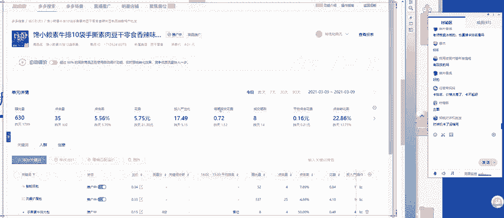

# 【拼多多运营实操教程】最系统的零基础拼多多开店教程全套，电商运营大佬专为学渣研制的新手开店保姆级教程！全程干货，简单粗暴 - P53：53、拼多多开店-最新14天拖价法流量破万 - -拼多多开店 - BV1BH1qYpEqw

这个画面都没有问题的啊，公屏扣一试一下。

好声音画面都没有问题，对吧？OK啊，大家下午好啊下午好。呃，今天呢是西楼来给你们分享呃，今天的这个拼多多的一个内容。呃，首先呢我看到呢有很多的小伙伴呢都是第一次来我的课堂啊，那么先来认识一下啊。

我叫西楼，那么现在做电商呢已经8年的时间了。呃，因为最近呢呃也有很多的朋友呢遇到了一些问题啊，可能跟拼多多规则改版啊，是有非常大的一个关系的。啊，因为今天呢大家是第一次认识我啊，所以说呢呃不过没有关系。

我相信今天的认识呢可以成为我们未来呃在电商道路上的一个良师益友啊，那也希望呢大家可以在这一堂课里面去学到东西。那么我们的课程呢是在14点35分正式开始。那么现在还有2到3分钟时间。

我们等一下还没有进入课堂的同学啊，然后呢在座的各位呢呃希望大家做好笔记，然后做一下课堂准备。我们35正式开始，好不好？好，OK啊，因为我们课程的这个第一个环节呢是什么呢？还是老规矩啊。

第一个环节呢是答疑啊，第一个环节是答疑。所以说如果有大家有任何的问题呢，都可以直接发在公屏上。我先给大家解决问题啊，任何的问题都可以啊都可以直接提出啊。那么在35分之后呢，我们正式开始好吧。😊。

像这个呃为什么课堂里面有2个1111同学啊？还有这个德玛西亚同学清运啊，还有这个啊jack刘啊，亚文啊，大家下午好啊下午好。还有乙楼啊，下午好。啊，柠檬茶又来了啊。

柠檬茶其实这个你已经成为我的VIP弟子了啊，之后呢，这个学习的时候直接微信上找我就可以了。😊，好吧，然后这个廖杰老师标题怎么写？呃，标题呢其实在拼多多里面相对来说是比较简单的啊，是比较简单的。呃。

标题你只需要记住这个格式就可以了啊，标题的一个格式就可以了。首先最开头的呢是黄金词啊，是黄金词。黄金啊黄金词加上中间的属性词，最后再加一个黄金词啊，也可以叫做促销词啊，也可以叫做促销词。呃，什么意思呢？

就是我们在推广的一个过程中呢，呃我把这个字体给大家放大一啊放大一下。就是我们在推广的过程中呢，我们实际在操作的时候呢，需要去导词。第一步呢标题写作的时候呢就是导词，你要先把词给找对。那找对关键词之后呢。

然后按照对应的格式去进行组合就可以了。当然有一些类目是不一样的。比如说像食品类目，那食品类目的开头是什么呢？啊，开头呢肯定还是这个黄金词啊，黄金词这个永远都是不变的。开头黄金词。然后加上中间的是什么呢？

就是规格词了啊，就不再是属性了，它是规格。比如说我们的产品呢是多少克，以及多少毫升，或者是一呃一袋里面有多少包啊，就会以这样的一个规格词或者是重量词来进行呃这个呃代替。那最后呢依旧还是促销词。

一般情况下大家会都会加一个包邮啊，或者是呃买呃拍一发二啊，类似于这样的一个关键词。因为在拼多多里面价格是非常呃关键的一个点啊，价格是非常关键的一个点，明白吧？所以说呃很多时候呢我们标题后呃结尾的时候呢。

都要加一些这个促销词。那标题呢其实写作起来呢就是这么简单啊就是这么简单。你只需要记住这个格式就OK了。然后具体具体的找词呢，大家可以使用一些工具啊，比如说推广工具。啊。

在搜索词推广工具里面可以去找一些黄金词啊，我来给大家看一下啊，打开你店铺的一个后台啊，在后台的位置呢，这边有一个推广中心，推广中心点击推广工具，直接进入到搜索词分析里面，我们就可以看到啊。

有很多的关键词呢，是我们可以去进行挑选的。当然如果说比如说我们做的是什么呢？连衣裙。那么就可以直接搜索连衣裙，搜索连衣裙在下方呢就会给你推荐出很多的一些呃类目词。那这些类目词里面。

这些产品词哪一些是可以去进行使用的。比如说像啊吊带连衣裙，还有这个初恋连衣裙，性感连衣裙，哪一个比较使用的比较好呢？首先我们第一个要看点击率，点击率肯定是越高越好。第二个呢，我们要看转化率啊。

因为初期在给到你的这个关键词的时候呢，搜索热度一般情况下都是比较高的。所以我们主要看这三个啊，看这三个维度。如果说啊当然呢有一些同学呢可能有一些经验啊，你们也会关注到有一个数据叫什么呢？就是。

增强度竞争强度肯定是越低越好。那么最终呢我们可以根据公式来计算出一个呃竞争力最强的一个关键词，把它作为我们的黄金促销词啊，所以说整体的一个操作呢就是这样，明白了吧？啊，觉得直播干货比较多啊。

那你可以多来听一下啊，多来听一下。好，那这个呢就是我们的这个廖杰同学的一个问题啊。廖杰同学这个标题啊还有没有问题，没有问题的话，公屏扣1啊，包括有其他的问题啊，任何的问题都可以直接提啊，都可以直接提。

包括大家在坐垫过程中呃，所遇到的呃一些疑难的问题，或者是目前为止呢解决不了的问题啊，都可以直接在公屏上发出来啊。因为我坐店的时间比较长，我希望用我的经验啊，以及我坐垫的思路呢，可以帮助到大家。

如果说大家这个呃不提出你的问题的话，呃，说实话确实因为大家都是第一次跟西罗老师见面啊，第第一次听西罗老师的课啊，那很多的小伙伴呢啊可能对于西罗老师比较陌生啊，但这个没有关系。只要大家能学到东西啊。

那说明你们来这一堂课呢就没有白来。😊，呃，可以看到的啊可以看到的原意啊园意随风飘啊，有什么问题你直接提就可以了啊，直接提就可以了。啊，老师啊能讲一下标品吗？呃标品其实在拼多多里面打造非常的简单。😊，呃。

比如说有大家呃这个有道同学是做什么产品的啊，你可以跟我具体讲一下你是做什么产品的。标品呢其实在做的过程中，它主要的一个推广渠道呢就是活动的流量和类目的流量。如果说你要去做搜索流量的话是不太好做的。啊。

搜索流量是去呃不太好做啊，就相对来说不太好做。但是整体的拼多多是属于一个红利啊，所以说标品呢呃我建议你如果要去做的话，第一个是做类目流量。第二个呢是做活动流量啊，活动流量。比如说我就经常去呃搞一些标品。

比如说像我啊来直接看这个店吧啊，这个店呢就是属于一个标品的一个产品，它具体是卖什么的呢？是卖鲜花的，来给你看一下。啊，我们在做这个标品的时候呢，首先第一个你要考虑的东西是什么呢？就是价格。

这个价格竞争力呢影响非常非常的大。因为大家的产品基本都是一样的，消费者不会去看到你的产你的产品的这个呃款式呀，它考虑的东西不是这些。只要你的价格足够的低，销量足够的高。那么我们在操作的过程中呢。

就会呃有很大的一个提升的一个空间啊，因为我这个产品现在还没有开始去进行销售啊，是在5月份的时候才开始进行销售。所以说现在是预售的一个环节啊，每天呢也能出个五六百单啊，五六百单。

所以说这个就是标品最主要的一个玩法。那么如果说你想要做标品的话，你可以去选一点小类目去做啊，小一点的产品啊，代餐食品啊，这个园艺呃园艺随风标是，做代餐食品的那食品类目更好做食品类目是随便做的啊。

这个呢就是我做的一个食品店啊，做的一个食品店呃，当然跟你的代餐食品呢是稍微的。😊，有一点点不一样啊，但整体的都是食品类目啊，都是食品类目。这个呢是卖小鱼干啊，包括这个零食啊、辣条。

对吧这种产品呢你前期只需要呃看一下你的成本啊，比如说像食品类目，它也是属于一个标品，明白吧？因为大家卖的都是一样的一个产品，只要你不是特别突出的一个品牌。那首先操作的一个点是什么呢？

就是价格价格首先你要压到最低。那么前期要走量。啊，前期先把量走起来。明白吧？前期呃我在这个店铺最最初开始操作的时候是怎么操作的？来给你看一下。其实有很多的类目都是都可以使用一样的玩法的啊。

我们来看这个交易的数据，在今年啊去年的8月份的时候开始去进行操作的，来看一下。8月份的时候看到客单价了没有啊，2。45块的客单价直接用一个低价的SKU来进行引流一个月啊，这是短短5天的时间。

这个店是8月25号的时候开店的啊，5天的时间直接走5000单。然后在9月份的时候呢，9块多的一个客单价直接走3万单，明白吧？销量走起来之后，那食品类目随便玩。

随随便便上套上这个top能不能明白这个原意随风挑。明白的话，公屏扣1啊，然后50%的灰也是标品啊，标品刚才这个老师讲过了啊，是没有听到吗啊，食品食品也是属于标品里面的啊，都是一样的一个玩法，明白吗？啊。

原艺随风标刷单还管用吗？刷单，你要刷多少单，你刷单，你能刷5万单吗？你能刷10万单吗？你刷不了那么多单的。前期啊如果说要做这个订单的话，只能前期稍微的做一点点。那后期总体的一个呃。

如果说你要去做类目流量的话，我个人建议你还是去走多多进宝会更好一点。前期你只需要把基础的评价做好了就O了，基础的评价啊，然后大概做个两三百单啊，两三百单，那后期一定是走多多进宝。因为它走量比较快啊。

销量已经销量改了是没有些呃，是没有这个权重的，能不能明白啊，可能大家都会使用这个改销量啊，你要记住改销量只是说可以提升你的什么呢？改销量。可以提升你的转化率，就是消费者看到你这个产品是10万家啊。

可以提高你的转化率。但是说他没有说直接给你带来权重的提升。啊，权重的提升是没有的。明白吧啊，明白吧？神探狄仁杰还能改销量，当然可以改啊，当然可以改。如果说你想学的话，可以直接找我好吧。😊，好。

OK啊好OK啊，然后包括这个像亚文啊，也是呃跟我在这个最近聊的也是比较多的。还有这个像jack刘也是聊的比较多的啊。这两位同学有没有问题啊，有没有问题，有问题可以直接啊随时提出来啊。

包括像这个今天刚来找我的这个吴杰啊，也是有问题一定要及时问啊，一定要及时问啊，我们还有这个大概三五分钟的时间啊，给大家做一个简短的呃问题的一个解决，明白吧？啊，任何问题都可以问啊。😊，呃。

ja流新开的店没有流量怎么办？新开的店啊，新开的店呃在操作的过程中啊，新店新店操作的过程中，首先第一个你要意你要去做的就是选品啊，产品选好了。如果你不会的话啊，你也有我的微信啊，我可以直接教你明白吧？

啊，第一个呢要做的就是选品。那选品选好了之后呢，一个好的产品呢，它可以给你带来很多的一些好处。那前期呢可能你所获取到的流量就会更多。能不明白啊，这是第一个啊我们要去做的。

第二个呢就是SU也就是说主图标题详情页，这些基础的优化，把这些东西做好了之后，然后就开始做基础销量。也就是说基础的评价。啊，在我们的店铺里面呢，任何一个店铺都有一个基础的权重考核。

那它具体考核哪些数据呢，你打开店铺其实也都是可以看到的啊，其实都是可以看到看这个位置，这里面呢有一个店铺的DSR，也就是说你的店铺新开了之后呢，平台是会去搜。😊。

入你的店铺，那他什么样的状态下会去收录你的店铺呢？你需要打开这个啊，你看一下这个平台具体的一个要求，它是需要你达到50个评价以上，50条以上的一个评价啊，有效评价。

它才会去收录你的新店一旦开始收录了你的新店啊，基本上你就会有流量了。能不能明白这个流啊，这个这个逻辑啊这个呃思维逻辑能不能理解？理解的话，公屏扣1ok啊O。啊，性格还有这种操作啊。

改销量你只需要花本金就可以了啊，不需要你付出什么成本啊，不需要你付出什么什么成本啊。如果说你们有非常想学这个改销量的话，也可以直接这个啊你们直接加我微信嘛啊，直接加我微信嘛。这个是呃西罗老师的微信啊。

你们可以直接加我的微信。😊，然后呢，我把这个微信给大家呃放在这里啊，给大家放在这里啊。如果说有想要学的啊，或者是现在这个有很多的问题没有得到解决，或者是大家一时间啊没有想到这个问题的啊。

也可以直接加我的微信，好吧啊，直接加我的微信就可以了。😊，呃，然后这个啊又有同学提出了新的问题啊，我们来看一下啊，正瑞对讲机啊，改销量有用吗？啊，我前面讲过了啊，改销量可以提升啊产品的转化率啊。

可以提升产品的转化率。但是说对于产品实际的一个权重提升呢，是没有太大的一个帮助的，明白吧？就是说针对于新品啊，我们可以啊相当于是一个锦上添花的一个作用啊，它不是雪中送炭，是锦上添花。明白吧？啊。

你的新品可以改一下销量，然后呢我们就可以获取到比较高的一个转化率。因为转化率也会直接影响到我们可以卖多少单。明白吧？okK啊，像橙子多多哪些类目适合个人买家啊？哪些类目个人买家做的难度大啊。

哪些相对比较好一点。呃，目前为止呢，如果说大家呃个人店铺想要去做的话，我推荐大家几个类目啊，推荐大家几个类目。第一个是什么呢？就是化妆品。呃，化妆品呢尤其是廉价的口红啊，尤其是廉价的口红。还有什么呢？

祛痘产品啊，还有什么呢？祛痘。呃，就是功效性比较强的啊功效性比较强的。啊，功效性比较强的。另外一个呢就是大家自己手下有货源的啊，自己你手里有货源的，或者是就像我这为弟子一样，他是做鲜花。

那么他在做鲜花的时候啊，做鲜花的时候呢，这个鲜花的这个成本就非常的低啊，鲜花成本非常低。可以说基本上就没有成本啊没有成本。像有一些地区像云南那边啊，花花草草非常多啊，包括也有一些很多的一些基地啊。

它就是云南的啊，它就是云南那边的。那么在操作的过程中，它只需要付出的是什是什么呢？就是物流费啊，就是物流费啊，然后另外一个比较好做的一个类目是什么呢？就是活体啊，活体啊。

但不止的呃不是指的这个猫猫狗狗啊，这种呢比较比较难啊，比较难，你们可以做什么呢？可以做鱼。😊，就比如说小乌龟啊，这个龟粮啊，还有这个鱼。啊，卖这个小鱼儿啊，也是可以的啊，也是可以的。

这些类目呢都相对来说是比较偏门的一些类目，但是非常的好做啊，非常的好做，明白吧？嗯。呃，然后清运啊和这个刘基础销量怎么做呢？啊，刘呃这个jack流基础销量，你前期可以自己去进行啊补单的一个操作。

或者是用我的资源啊，或者是用我的资源。因为你今天也跟我也跟我聊了很多，你确实是想要跟着我来进行学的那你直接在微信上找我就可以了啊，直接在微信上找我就可以了啊。包括因为到后期我在地址的时候呢。

因为我做店的时间比较长，我所有的资源全部都是有的。你来了之后呢，我直接啊就会把我的资源给到你明白吗？基础销量如果说你想做的话，这方面你不用担心啊。

不用担心我所有的资源直接给到你能不能明白刘jack刘明白的话，公屏扣一啊，然后这个清运改销量多久记入历史最低啊，所有的活动都是30天啊，都是30天啊，有部分的活动是90天啊。

大部分类目都是30天清运明白吧？啊，老师你微信多少啊，微信是这个啊，微信是这个直接扫码就可以了啊，直接扫码就可以了。好，OK啊，那么现在这个时间差不多了啊，时间差不多了。呃。

我看大家提出的一些问题呢呃有很多的都是一些比较基础的问题。然后呢呃但是呢对于很多呃我们新手的一些呃刚刚开始接触拼多多的呢，可能呃没有办法说。很快速的去解决到位啊，不过这个没有关系啊。

那如果说大家现在有没有想到的问题，可以直接加我的微信，好吧啊，直接加我的微信就可以了。好啊，那么接下来呢我们就正式进入我们今天的课题啊，今天给大家主要所讲的一个方法呢。

是拼多多最新的托价法如何在14天内流量破万啊。然后这个句号同学啊，新提出来有个问题啊，我们花几秒钟时间解决高客单价的标品怎么做啊，高客单价的标品其实非常的简单啊，因为今天呢这个时间关系没有解决到啊。

因为这个如果说要一一去讲这个思路的话，可能花的时间会比较长。然后这个句号同学，你先加一下我的微信吧，好吧啊，你先加一下我的微信啊，然后呢，你加好我的微信之后呢，在公屏扣一，我课下教你怎么样去进行解决。

好吧，好不好？好，那我们就正式开始。那么呃为了确保大家都可以听得清楚，听得明白，我们先签个到，可以听到老师的声音，并且已经准备好的同学公屏鲜花走一波，我们就正式正式开始，好吧。好，呃。

我今天要给大家分享的这个操作呢是很多个店铺我都去实际去运用过的一个操作的一个方法。包括我像这家店啊，我在实际操作的过程中呢，也是自己去进行开车啊，20多块钱的客单价啊。但是呢每天的这个投入产出比呢。

我可以做到5以上啊，可以做到4到5以上啊，当然这个是多多搜索，我们就今天主讲这个多多搜索，想不想知道老师这个店铺到底是怎么做的啊，为什么在开车的时候，每笔成交的花费可以压缩到2块钱，对吧？

准备好的同学啊，工兵鲜花走一波，我们就正式开始啊。好，OK啊，那么今天呢我会从四个方面啊，四个维度来给大家剖析清楚这个托架法到底应该怎么样去进行运营。啊，拼多多最新的脱价法。好。

首先第一个呢其实也是我们在操作这个多多搜索的时候，在操作这个搜索推广的时候呢，我们整体的一个操作的一个步骤啊第一步。我们在坐垫的过程中啊，既然说要开车第一步永远经过的是测试的一个阶段啊。

那么测试的阶段到底应该怎么样去进行后台的一个操作啊，包括我们应该用什么样的一个想法去进行测试。我会从这个维度给大家啊剖析清楚。那么第二步，在我们开车的时候，第二步要做的是什么呢？叫做上分啊叫做上分。

那么第三步。第三步呢就是我们的一个核心的一个重点叫做托架。啊，怎么样去进行托架？然后呢，最后一个就是我们的第四步如何来增馏。好，蒸馏啊蒸馏。

我主要会从这四个方面来给大家剖析清楚我们这个店铺到底是怎么样去进行操作的。啊。首先我想问一下在座的各位有多少的同学啊，有多少的同学是呃目前为止有在开车的啊，目前为止有在开车的，公屏扣1，我看一下。啊。

对不起，看不见啊。现在这个可以看见吗？OK吧。啊，有多少的有多少的同学是目前为止在开车的啊，目前为止在开车的，搞不懂，不敢开啊，其实在坐店的过程中，千万不要觉得自己不懂，你就不去做。

你要勇敢的去迈出这一步。就像有很多的我身边也有很多的人啊说想要跟着我学习，但是呢就是迟迟迈不出这一步啊，担心自己做不好。但其实我告诉你我告诉大家啊，你越担心。这个你没有办法迈出去这一步。

你永远是做不好的，明白吧？你要先先去做做了之后，你才会知道你自己有多大的潜力，明白吧？然后这个我看到有几个同学是有在开的。其他同学都是没有在开的啊，不过没有关系啊，不过没有关系，包括这些不讲话的啊。

有可能在开，但就是不讲讲话啊，没关系，今天你们学到的一个内容呢，绝对可以帮助你们在操作店铺的过程中呢，可以省掉更多的钱。包括你们的呃推广的过程中可以利益最大化。然后这个ILS客单价500元，全是直通车。

投入产出比1比4。哎，我的天哪，你这么高的客单价，投入产出比才1比4呀。你这个。呃，做什么类目的这个IL你是做什么类目的，可以跟我讲一下。我20多块钱的客单价都呃投入产出比都可以做到4啊。电气电气的话。

你这个确实是有点有点厉害了啊，有点厉害了。你这个很多可能你在操作的过程中呢，浪费了很多的钱，明白吧？柠檬茶我还没有开啊，什么时候开车呢？啊，不着急啊，在课程中间呢，我会一步一步的给大家剖析清楚。好吧啊。

我刚才呢也大致的了解了一下大家的情况。那么我们就正式开始。我们先来讲第一个测试啊，像这个ILS你在学习的过程中呢，你也可以听啊西罗老师在坐店的过程中是怎么样去进行开车的啊。

那么一呃也可以根据课程的内容呢去检查一下，看一下自己到底有哪里没有做到位啊，一听你这个投入产出比是绝对有问题的。好吧，那我们正式开始啊，正式开始那首先我们来讲这个第一步测试。那测试的阶段。

我们是为什么要去进行测试呢？是因为我们的店铺在操作的过程中，因为这个东西我们是需要付费的。那在付费操作之前呢，是为什么要啊必须要花钱去进行测试。因为我们后面需要上分，需要拖价。

所以说我们需要先把钱花出去，先知道我们单品的数据表现是什么样的。所以说我们第一步要做的就是测试啊就是测试。那测试的时候呢，需要一些准备工作啊，需要一些准备工作。那这个准备工作是什么呢？

就像是这个柠檬茶提到的一个问题啊，提到的一个问题，什么时间去进行开车。那准备工作也就是说开车的一个前提到底是什么呢？首先10到30个基础销量。能不能明白？每一个单品如果说大家要去进行测试的话。

你必须要去做10到30个基础销量。如果说你的产品是没有基础销量的情况下，很有可能你开车了之后根本拿不到数据啊，千万不要觉得拼多多流量比较大。你开车了之后就一定会有流量啊，这个是不现实的。

你一定要有基础销量之后，它才会慢慢的给到流量，确保你的单品进入新品流量池。这个基础相应的做的原因是什么？就是新品流量池。前期我们在测试的时候呢呃大家也都会发现，在店铺的后台。

比如说我们开这个OCP叉的时候，他会告诉你第一阶段还是第二阶段。这个大大家都有印象吧。来来给你们看一下，我们在开车的时候呢，他会告诉你到底是处于第一阶段还是第二阶段啊，像这个多多场景里面啊。

OCP3他就会告诉你你的单品呢是处于第几个阶段。看到没有？第一阶段第二阶段，那同样的在这个搜索里面也是有的啊，也是有的。所以说我们必须要先进入流量池，进入流量池之后呢，我们才可以去进行测试。

那么在测试的时候啊，那么下一步呢就是要根据这个店铺的一个后台来实际的去进行操作了啊。首先我先把这个我们操作的一个内容啊，一步一步的啊，一步一步的来。😊。

好，打开一个多多搜索啊，直接创建一个新计划啊，直接新建一个计划。我们在操作的过程中，首先。

这里面呢会有两个推广方案啊，OCP3我们是不选的，我们直接选择自定义啊，我们直接选择自定义推广。然后计划的名称随意啊。第一个我们要修改的东西是什么呢？就叫做这个啊时间折扣啊，时间折扣时间折扣啊。

这个位置千万不要选择不投放，能不能明白，就是0点啊一点到这个早上8点或者早上7点的时候，大部分的人呢可能会操作的时候呢，会陷入一个误区啊，觉得这个时间段没有人买啊，没有人买呢，就选择不投放。

但是我告诉你们啊，这个拼多多后台的这个系统。在评判我们的。推广啊，评判我们的搜索推广的时候啊，它会它会有一个叫什么东西呢？叫做连续性。你投放的一个连续性呢是非常非常重要的。

所以说大家只需要选择一个最低的啊时间折扣就OK了。选择好最低的时间折扣之后，然后点击应用啊，点击应用，然后呃日限额可以先选择最低的100元啊，那这个呢就是我们第一步要去做的，我直接给大家列一下。

第一步要做的日限额。前期可以先设置100元啊，后期这个东西我们还是需要进行修改的。那么第二个呢是时间啊，时间时间我建议大家选择到早上的8点到24点，设置为百分之百的去进行投放。

那么其他的时间比如说0点到早上的8点啊，0点到早上的8点选择50%。这里面有一个注意点。前面我也给大家讲过了，千万不要直接设置不投放。如果说设置不投放的话，会影响到我们投呃，我们计划投放的一个连续性。

可能会掉分啊，可能会掉分啊，那么第三个啊，那么接下来我们要做的呢就是选词的一个操作啊，还是打开我们店铺对购台。好，打开店铺后台之后，选择我们对应要推广的商品。比如说我们要推广这个速弱的商品啊。

速弱的商品。那么下一步啊，像这个单元名称，大家都不需要动默认的就可以了。那么在这里面有一个东西需要调整的是什么呢？叫做关键词的啊出价。那么在这里的位置，如果说大家开的是自定义。

那像智能池包和这个流量拓展包全部。都是不开的啊都是不开的。😡，好，我问一下在座的各位，有多少人在开车的过程中，是这两个东西是随意的啊，是随意打开的。有多少同学是这样开着的去开车的啊，公屏扣1。

我看一下有多少然，我开着的很正常啊很正常，我们在操作的过程中呢，就会陷入这样的一个误区。如果说你把这个东西打开，会面临着一个什么样尴尬的境地呢？因为这个里面啊看智能持包和这个流量拓展包呢？

它是根据于什么什么数据来跟你匹配的呢？看。😊，首页的频道页和商品页的详情图，它其实给到你的流量是不是关键词的呃搜索量呢？声音比较低啊，我开一个这个我把声音放大一点啊，现在声音够不够洪亮啊。

现在声音够不够洪亮。啊，我把声音放大一点啊。😊，好，OK啊OK那其他的同学都没有问题啊，只有这个呃任哲西妈妈啊，然后可能会有一点问题那可以调试一下自己的电脑，好吧，或者下载1个APP好。

我们继续啊我们继续，那这个里面呢我刚才也讲到会影响到我们是呃我们推广的一个数据，具体怎么会影响呢？因为这个里面所获取到的流量跟我们关键词的流量是完全不匹配的。所以说很多的很多时候呢。

大家的这个预算呢会直接花费到这个上面。如果说你的预算花费到这上面，那也就相当于是浪费钱了啊，包括像之前的这个呃IL啊，你开车的时候，你开直通车的时候，是不是把这个东西打开了。😊。

有没有打开了，你扣个一，没有打开扣2。😡，我感觉你应该是打开了，因为这个里面所获取到的流量曝光是非常非常大的，明白吧？那现在啊。😡，下课之后呢，你就可以把这个东西给关闭啊，因为它。

获取到的流量相对来说不是特别的精准，能不能明白？所以说啊那第三个啊。时间结束之后，那么下一步我们要做的就是选词啊，在选词的时候，这个东西需要关闭啊，需要关闭智能。和这个流量拓展啊拓展包。

都需要关闭啊都需要关闭。那关闭啊之后，那么下一步呢就是我们自己要挑选自己所需要的这个关键词了。好，我们先把它关闭。😊，好，那在这里呢系统会推荐给大家50个关键词。那这50个关键词呢。

我们并不是所有的全部都要，而大部分关啊系统推荐的关键词都是跟我们的商品不匹配的。所以说我们在操作的过程中呢，就不需要啊把这个所有的关键词全部都点掉。然后哪一个场呃哪一个关键词是跟我们的产品高度相关的。

我们去就去进行选择。像手撕素牛排啊，素牛排，包括这个豆腐干或者小零食啊，或者手撕素肉。那类似于这样的关键词才是我们产品最精准的关键词，像其他的啊这些什么零食小吃，乍一看它的搜索热度非常的高啊。

平均点击价格也非常的低。但是实际操作的过程中，你会发现这些关键词会花掉你大部分的预算。😊，所以说我们在操作的过程中呢，只需要添加啊跟我们商品高度相关的关键词就OK了。添加好之后。

然后在右侧的这个位置点击市场平均出价啊，市场平均出价出到多少呢？120%或者是130就OK了啊，就OK了。这一步啊大家能不能理解都可以听明白的，公屏扣1。

因为我考虑到大家这个有很多的小伙伴呢可能没有开过车。所以说呢对于后台来说呃。不是特别的熟悉啊，所以说我这边呢就直接截图给大家，大家可以保留一下，好吧。😡，好，那么在这里呢这个精确匹配议价要不要开呢？

这个东西不开啊，暂时先不开，后面我们调整的时候才需要去进行调整。那这个自动调价可以打开啊，自动调价可以改可以打开市场平均出价1。5到3块钱啊，很正常啊。

你这个大件产品的这个呃均价都会相对来说会比较贵一点，很正常的。每一个类目都是不一样的啊，每一个类目都是不一样的。好，那么我们选择好关键词之后，那么下一步要做的就是这个人群啊就是人群。

选择类目相关的关键词以及。出价出到市场均价的120%啊，市场均价的120%。好，选词结束之后，那么我们下一步要做的啊就是人群。人群在操作的过程中呢，这个里面呢有非常多的人群呢可以供大家去进行选择。

那么我前面有也讲过了，那么我们第一步在操作的过程中，到底是应该怎么样去操作？好，我们的目的是什么？是不是测试？啊，刚才没看到啊，所以说讲课我讲课的时候千万不要走神啊，精确匹配溢价啊。

精确的这个溢价比例是不开的啊，精准匹配不开的，明白吗？这个AN同学啊AN同学。好啊，那么下一步呢就是人群。因为我们在操作的过程中呢，是需要去进行测试。那在测试的过程中，这个人群啊就可以所有的人群全开啊。

所有的人群全开，溢价比例10%就OK了。因为这个都比较简单啊，所以说我就快速的带过啊快速的带过啊，照顾一下这个呃还没有开车的同学，了解一下这个后台以及我们基础的设置啊。因为测试呢其实对于这个店铺来说。

你说它很重要呢，它也很重要啊。简单来说呢就是花钱啊，就是花钱。所以说有几个注意点，大家注意到位就可以了啊。那人群溢价全开。😊，不开地域啊不开地域啊，除了地域以外，其他的全开。

然后整体的溢价比例呢是10%啊，10%的一个溢价啊。好，因为我们要测试，我们不太清楚哪些人群是我们呃转化率比较高的或者点击率比较高的，明白吧？所以说人群结束之后，那么下一步啊。

下一步我们的计划就基本上创建完成了。最后还有一个东西叫做创意。好，我问一下在座的各位。如果说你们开车的过程中，有多少的同学是把智能创意打开的，有多少同学是开智能创意的，公屏扣1，我看一下多少。呃。

我刚才讲过一个非常非常重要的一句话啊，我刚才讲过非常重要的一句话，我不太清楚大家还有没有记得啊。你们认为这个智能创意到底是应该开还是不应该开呢？呃。

有很多有很多的这个小伙伴呢可能就会以为我们在做这个智能智能创意的时候呢，会发现这个智能创意整体的点击率是不是要高一点？像神探狄仁杰可能就是就是这样感觉的。是不是？开智能创意感觉点击率会比较高啊。

但是啊有一个点，因为我们现在在开车的时候，我们的目的是什么？我们的目的是测试测试里面包含什么？包含主图包含人群包含关键词。我们哪一些关键词是可以给我们带来流量的，我们需要测试出来。

哪些人群是可以给我们带来转化的，我们需要测试出来，哪一张图片的点击率是最高的，我们也需要测试出来。所以说智能创意开不开呢？是不开的，为什么不开呢？因为智能创意里面看到没有？

它这里面的这些创意图是根据于什么样的一个属性来给你去进行匹配呢？是根据于你上传的10张轮播图来给你去进行轮播的，能不能明白，也就是说你根本不知道哪一张图片到底它的点击率是怎么样的。

所以说我们也没有办法去进行判断，并且这个智能创意是系统根据对应的人群，你上面所写的文案以及你的图片的上面的一个。😡，色差啊，然后呢他给你匹配到的一些智能的流量。那这些智能的流量是系统根据这个系统的。

看到了没有？你的标题，你的图片来给你匹配的个性化的展现啊，乍一看是非常有用的。但是对于老司机来说，你开车这个东西是不开的，明白吧？所以说我们只需要开静态创意。那静态创意需要开多少张呢？开4张啊。

四张静态创意图。那么我们也可以选择不同的文案以及不同的操作，看到没有啊，一包不到两。4元或者半斤啊，3。3。86元，还有这个8。68元30包啊，类似于这样不同的一个文案啊来测试我们到底哪一张图片啊。

哪一张图片它的点击率更高啊，所以说选择4张不一样的图片，我们啊还可以选择一张什么呢？这个白底图啊，或者是。😊，比较近一点的这个静态图啊，比如说像这种啊像这种。😡，像这种图片。近距离拍照的细节图。

然后我们点击完成，我们的计划就创建完成了。明白吧？好，关于这一步啊关于这一步啊，我们就结束了啊，我们就结束了。这个呢就是测试里面我们所需要操作的啊，大家都能不能明白。😡。

都可以理解的同学公屏扣1啊都可以理解的同学，公屏扣1，我们就正式开始我们测试阶段，到底应该怎么样去进行操作了。测试测试的计划创建完成之后，那么我们同步在第二步操作的时候，也是我们今天课程的一个重点。

如何来进行上分。只有上分了之后，我们才可以去进行脱价。明白吧？😡，OK啊OK如果说大家都没有问题，并且已经准备好啊。现在呢大家都可以呃马上拿出你们的笔记本啊，这个时候呢就是应该做笔记的时候了。

因为到了我们课程的一个重点，如何来进行上分。我们在如何在这个短短的7天到1010天左右的一个时间，把我们的质量分做到10分以上。已经准备好的同学啊，准备好你们笔记本的啊，公屏鲜花走一波，我们正式开始啊。

我们正式开始。😡，好，荣老师喝口水啊，荣老师喝口水。好，那么我们来具体来讲一下上分。那么上分的一个操作呢，是具体怎么样去进行操作呢？前提是我们在进行测试的过程中，测试的一个目标是什么？

所以说这里面呢还需要给大家啊去讲解清楚测试的一个目标是什么。我们的主图点击率没有问题，或者是关键词啊也全部都测试出来，并且我们的人群也测试出来。大概需要多长时间呢？3到7天的时间啊，3到7天的时间。

那么同时在操作的过程中呢，也会利用到上分的一个技巧。也会利用到上分的一个技巧，叫做什么呢？保持。排名。😡，既然说我们要开车，那开车最为核心的一个目的是什么？是不是打广告？😡，这个都没有问题吧。好。

那既然说我们要打广告，我们想要去保持排名，那么我们就需要知道系统到底是根据什么样的一个规则啊，根据什么样的一个规则来给我们制定排名的那系统给他的规则呢就是综合排名。综合的这个排名呢是等于什么呢？

关键词的出价乘以我们的质量分。所以说当你了解清楚这个规则之后，你就会明白啊，希罗老师今天为什么第二步要讲上分。我们上分最最主要上的是什么呢？就是关键词的质量分。打开我们刚刚创建好的这个计划。

打开计划之后呢，你会发现每一个我们添加的关键词呢都会有对应的一个质量分的一个选项。一旦你开车开到3到7天之后呢啊我们找一个有数据的计划啊，我们找一个有数据的计划，大家就可以很清楚的看到这些关键词呢。

到底是怎么样来进行呃。他们到底是怎么样来评判啊关键词的一个质量分的，看到没有？某一些关键词呢都会有对应的一个质量分。看到没有？如果说大家是刚开车的话，可能没有质量分的一个显示。但是你开3到7天。

如果说把测数据测试出来之后，就会看到每一个关键词都会有对应的质量分。有了质量分之后，我们就可以对应的去进行调价啊，对应的去进行调价。所以说那么下一步我们要了解的就是上分的逻辑。

到底怎么样开才可以提升这个质量分？一旦我们的质量分越高，那么我们是不是就可以用最低的出价可以提高我们最高的一个综合排名。所以说我们在操作的时候。要了解上分的一个逻辑。

刚才目的呢我已经给大家讲的非常的清楚了，也就是广告位啊，我们既然说要花钱去买广告，那广告位呢就意味着排名。所以说我们要确保我们关键词的一个排名。那么如何来保持排名啊，如何来保持排名？在开车初期的时候啊。

在开车初期。这个出价我们应该出多少的价格。前面呢也给大家这个提到了啊也给大家提到了。我们在测试的时候，我们原先的出价是不是1。2啊？😡，1。2倍的市场均价。我们最初在测试的时候呢。

是以这样的一个出价来进行调整的。那么在第二步，我们已经确定我们要去上分的时候，这个出价是不是还是以这个出价来进行调整呢？来，大家想一下啊来大家想一下。😊，也就是说，在上分的这个初期啊，上分的初期。

我们的出价到底应该出多少？提高啊，那是提高还是降低？😡，或者说我换一个方法问啊，我换一个方法问前面我们已经把这个关键词测试出来了，我们这里面的出价是不是需要进行去调整啊？有同学说提高，有同学说是降低。

但其实都不是啊，有的关键词确实确确实实是需要去进行提高的。因为我们在第一步3到7天左右的一个时间已经把我们的关键词测试出来了，我们已经很清楚的知道我们的这个产品啊。

我们的这个关键词可以以什么样的一个价格保持在什么样的一个排名。能不能明白，所以说大家在操作的过程中有很多的细节都需要到位。开车的时候，大家有没有注意过你的质量分的变化。你质量分变化了之后，你的曝光量啊。

每天的一个曝光量有没有去进行控制啊，或者是有没有去进行记录，这个小细节，大家也一定要去做啊，也一定要去做。我给大家标注一下。所以说因为我们在会影响到我们后期的一个出价。😊，如果说我们在测试期间。

我们的3到7天左右的一个时间，我们的关键词从原先的8分变到了10分。但是说我们获取到的曝光量变多了。那在这样的情况下，我们原先出价是1块钱。那在正式上分的一个阶段，我们的出价就不再是一块了，可能只有0。

8。所以说开车出气，我们出价到底应该怎么样出呢？是根据测试阶段。关键词的数据以及关键词的一个出价来进行控制。你测试期间你的关键词，比如说啊8到10啊8到10的这个质量分是来回不断的在进行波动的。

如果说你开了一个新开的一个计划啊，在上分阶段我们是需要新开一个计划的，不再是用原先的这个测试的计划了，明白吧？因为测试的计划，我们已经测试出了所有的数据啊，这个稍后会给大家讲到。

所以说我们在操作的过程中呢，开车出击关键词的一个出价，就根据我们测试出来的关键词来进行操作。那么下一步。😊，就是质量分如何来提升质量分。因为在提升质量分的时候呢，质量分有几个相关的维度啊。

也是这个廖杰同学所提到的一个问题。如何来提高质量分？那这个质量分首先第一个关心的关注的一个问题是关键词的一个相关性。大家会发现，如果说你的这个关键词在标题里面啊。

你的所添加的这些关键词在标题里面是包含的。比如说啊我现在呢要加一个关键词叫什么呢？叫做零时。你会发现这个关键词呢好，我来给大家添加一下。比如说零食这个关键词，零食这个关键词。

如果说你啊已经已经有添加了啊，已经有添加了。比如说啊像连衣裙。对吧跟我的产品完全不相关啊，那这样的一个关键词啊，我要去进行添加的话啊，我要去进行添加的话，你就会发现这些关键词添加进去。

它的相关性根本就没有满格。在相关性没有满格的情况下，你会你就会发现它的关键词的一个质量分就会非常非常的低。这个也是官方啊系统来评判我们的质量分高低的一个非常重要的一个点。

它会根据于你关键词的相关性来评判啊，来评判。所以说第一个啊大家一定也一定要记住。所以说我们在操作的过程中，添加关键词又应该怎么样去优化，怎么去添加。😡。

是不是一目了然了，你标题里面的关键词可以任意添加。😡，啊，标题里面所包含的关键词就可以任意添加。如果说跟你标题完全不相关的这种关键词啊，就不要加啊就不要加。因为你加进去它的质量分就会非常的低。

那么第二个是什么呢？就是类目相关性。啊，类目相关性。这个其实都是属于相关性里面的，你的质量分类呃。😡，想要变得更高，那么你的类目啊就需要相关。我是做食品的，那么我添加的关键词也一定是食品。

那最后一个也是非常重要的一个点，叫做什么呢？推广商品的质量。它的推广商品的质量啊，如何让你的关键词质量分可以在7天啊直接做到比较高的一个位置，就看你的商品基础权重高不高啊。

拼多多的这个关键词质量分呢是一天更新一次啊，是一天更新一次。好，一天一次啊一天一次。好，当我们了解清楚了上分的一个基础的逻辑之后，那么下一步是不是就需要去重点的去进行操作了？那商品推广的质量。

这里面呢啊推广商品的质量呢，这里面呢有几个点也要给大家讲解清楚啊。第一个呢是点击率啊，第一个是点击率。我们既然说你的商品，你想要提升质量分，你的点击率就一定要高。那么第二个是什么呢？

基础的销量也一定要高。那第三个是什么呢？销售额。好，当我们的推广的商品的这个点击率啊，销量以及销售额都可以达到一个比较高的水平的话，那么自然而然我们的质量分就可以上升。为什么？

因为我们的关键词的相关性和类目相关性，是不是我们可以直接去进行优化的。在开车之前我们就可以修改关键词，我们也可以调整我们开车的关键词的一个数据啊，包括我们的数量啊，包括我们关键词的一个相关啊。

到底跟我们的产品是否符合，所以说我们前面这两步都是可以直接直接去进行优化的，那么我们在开车过程中啊。直接优化啊直接优化。那么我们在开车的过程中，那么我们重点去进行操作的啊，就是我们。

单品的点击率啊就是我们单品的点击率。所以说上分其实是一个呃内容会非常的庞涨啊，内容会非常的膨涨。很有可能呢大家听的这节课呢可能会比较无聊，但是一定会对于你的店铺有非常大的一个帮助。😊，好。

那么关于质量分这一块，大家都能不能理解啊，都能不能理解。😡，理解的话，公屏扣1啊，对，一天一次非常勤快啊。拼多多它整体的一个提升权重的一个时间呢就是3天、7天、一天啊。

一天、3天、7天、15天以及一个月啊，这几个时间节点它都会去刷新权重。那么质量分呢就是一天一次。所以说我们每天都要看一次数据。开车不是说开了车之后呢，你们的数据呢就直接放在那里，然后你就不管了。

这样肯定是不行的。每一天都要有对应的一个调整，明白吧？所以说那么下一步我就会具体的给大家讲一下，我们在操作的时候到底应该如何来去进行操作，以及我们对于这些关键词到底应该怎么样来进行判断。

那这里面呢就会讲到如何来进行执行操作。也是一个啊也是我们这一节课呢最大的一个难点啊，因为有很多的关键词呢，大家没有办法人为的去进行判断，或者说自己判断出来呢，你没有办法拿捏的很准啊，没有办法拿捏的很准。

首先第一个啊，我们在测试阶段呢，测试的一个时间呢是3到7天。同时在上分的一个时间也是3到7天。第一个啊要给大家把周期。😡，周期划分好3到7天的一个时间。那么我们操作的一个核心。

其实前面也已经给大家讲过啊。首先第一个是排名啊，排名展现位置啊，展现位置是非常重要的一个点。那么我们的一个关键词的一个排名需要排在什么样的一个位置呢？来，大家想一下。如果说大家自己去进行购物啊。

就是说你们自己去进行购物的过程中，大家都会看多少页的产品。啊，你们作为消费者去进行购物的时候，你们会看。多少的产品。买前面的对，肯定是买前面的。但是我需要是具体的数字，你会看10个，还是说会看20个？

😡，会看多少个产品。😡，这个非常的重要啊，直接决定了大家在操作的过程中，我们的关键词到底应该卡在什么样的一个排名啊，两页以内，那两页以内啊，那这一个问题呢非常好啊非常好。😊，两页以内的一个商品。

那么在一页啊整个拼多多平台里面，它一页的一个商品呢是多少，是不是4个？4到6个商品对吧？一页里面呢也就是4到6个商品。那4到6个商品如果说大家只看两页啊，只看两页。啊，3到15个。对，那整体算出来呢。

大概也就是10个到10个到15个左右的商品就已经是非常非常多了。所以说如果说你想要把你的数据给拉升起来的话，你要测试出你的商品在这个类目里面到底可不可以卖的好的话。

那么我们的排名至少要在什么样的一个位置呢？排名前十。😡，一定要排一定要排在排名前十的一个位置。因为整个拼多多有没有同学知道这个拼多多里面的哪些展位是属于直通车的？啊，哪些展位是直通车的？

比如说我们打开一个页面啊，在这个在这个页面里面，我们直接去进行搜索这个拼多多啊。比如说搜索了一个连衣裙，或者搜索了一个食品，搜索了一个女装啊，那看到的哪些哪几个位置是属于直通车的啊？不知道啊。

那大家啊现在拿出你们的笔记本记一下，有一个公式啊，有一个公式叫什么呢？6N减5。6N减5的一个公式啊，6N减5的一个公式。这个公式到底应该怎么样来进行计算呢？也就是说，如果说你直通车排名第一。

直通车排名第一，那么这个一就指的是这个N这个数字。那也就是说在整体的综合排名。也就是说综合的这个APP里面展现出来，那排名就是第一位啊，排名就是第一位。那如果说你直通车排名第二啊，你直通车出价呢是第二。

那么在这个时候呢，它就不会给你展现在第一名啊，它会直接给你展现在多少第7名第13名。然后根据这个数据，大家一直无限制的往后推就可以了。也就是说其实我们在测试的时候，如果说你没有办法拿到排名前十的位置。

消费者基本上看不到你的商品，因为只给到我们的一个机会啊，给到我们的一个机会，只有几个呢只有3到4个展现位置，明白吧？我们的展现位只有第一位，第七位和第第13位可以测试出我们的产品数据表现到底好还是不好。

所以说我们在操作的过程中，那么下一步啊，我们理。的一个核心就是就是在这里30天的平均排名以及我们当天的数据排名一定要达到4到6或者是前三，或者是排名前十的位置。

这里面每一个对应的关键词都会有对应的一个排名。看到没有啊，我这因因为看的是30天的数据。如果说大家看昨天的数据的话，你就会发现在昨天整体平均排名啊，排名在什么位置，4到6呃，7到10或者16到20。

对吧？像这样的一个。😡，好，我们直接点击这个点击量啊，降序来进行排列啊，降序来进行排列。你会发现很多的关键词呢都是卡在比较靠前的一个位置的。有一些关键词甚至还卡卡在首位的位首条的位置上。

为什么要去这样去进行操作？原因就是只有你拿到这样的排名，消费者才会看到你的产品。这个点你能不能明白啊，能不能明白？😡，这个也是我们在操作直通车，不管你是操作这个托架法也好，或者是操作其他的方法也好。

这个永远都是核心啊，能不能理解理解的同学公屏扣1啊，理解的同学公屏扣1。1加6是车位啊1加6是车位，1加6这个公式其实是不对的啊，官方给出的公式其实是不对的。好，那么我们继续往下啊我们继续往下。

当我们知道了我们的关键词到底排在什么位置，我们的呃商品才可以有展现的时候，那么下一步要做的啊，操作的核心我们也知道了。那么下一步就是判断。排名的判断啊排名的判断。我们最开始的一个初始出价。啊。

这里面呢就是我们只开车的时候啊，最开始开车的时候，我们初始的一个出价，出的是不是市场均价？最开始出市场均价，那么下一步啊下一步我们调整的一个核心啊，调价第一核心。卡牌名啊卡牌名。根据排名的个公式。

那么我们每天都需要去，因为它的质量分是一天刷新一次，所以说我们每天都需要去卡对应的一个排名。那么在卡排名的时候呢，每次调价。弧度。控制在10%到百分呃5%到10%之间。能不能明白？

如果说大家看到的关键词是处于20名之后的。那么我们在调价的时候，这个时候呢，根据于我们前面所讲的保持排名的一个呃公式啊，综合排名等于出价乘以质量分。当我们的质量分在稳定的情况下，这一天整个时间。

比如说我们的质量分只有8分。那么如何来提高它的综合排名，就是提高我们的出价提高出价自然排名就上去了。所以说我们下一步要去卡排名。当我们的排名处于20名之后的时候，这个时候呢，大家可以调整上升？

提高10%的一个出价，以提升我们的一个排名。如果说大家的排名啊，某一个关键词是接近。前十也就是11到15啊，11到15。因为整个平台里面它会给到你对应的一个排名展现的一个位置啊，接近这个位置的话。

你可以调8%或者是7%啊，都是可以的啊，都是可以的。以这样的一个幅度来进行调整，直到啊直到。我们的每一个啊每个关键词都卡在。4到6或者是7到10。也就是前十之前啊，只要在实名之前就全部都okK了啊。

就全部都okK了。这也是我们操作的一个核心啊操作的一个核心。并且直通车的排名啊，直通车的排名是一个小时刷新一次。好，我们看今天的数据啊，我们看今天的数据，你就会发现关键词的排名是多长时间刷新一次呢？

是一个小时刷新一次。所以说我们需要利用啊在操作的过程中，第一天我们就需要把所有的关键词全部都卡好排名啊，把所有的关键词全部都卡好排名。卡好排名之后，那么下一步我们就可以直接执行上分的一个计划啊。

上分的一个计划。那么在上分的过程中。😊，啊，上分这个里面呢有非常多的内容啊，有非常多的内容啊。指标啊指标解析上分的时候呢，有很多的可以影响到我们上分的一些因素呃。各位在开车的过程中。

有没有遇到问题说点击率上不去？啊，同步开的计划直开了之后就直接直接卖了一单，那可以的啊那可以的。所以说这个AN同学的这个动手能力还是非常非常强的啊，还是非常非常强的。

我希望其他的各位呢也是因为我在教你们的时候呢，都是店铺后台直接操作啊，来教你们怎么样去进行操作的啊，但是呢也千万要记住啊，先把课程学会了，然后再去进行操作，千万不要走神，好吧。老师我卖冰袖的啊。

也直接卡牌名是吗？对的啊，对的，所有的不管你哪一个类目啊，不管你哪一个类目，然后在卡牌名的时候，我有有一个注意点，我给大家讲一下，就是说非标啊，非标品，就是说服饰鞋包啊，服饰鞋包类的一个产品呢啊。

我建议大家卡在7到10的位置啊，卡在7到10，也就是前十的个位置就可以了啊，就可以了。如果说大家做的是标品啊，像这个AN同学啊做的是标品或者是卖这个食品啊，卖这个食品就是标品。😊。

标品类目一定要卡在前三。一定要卡在前三之前啊，标品的类目竞争非常的激烈。如果说你稍微往后靠一点点，消费者基本上都不买了，大家都是一样的产品，我们没有什么可挑的啊，没有什么可挑剔的，就是看销量高的。

就是看价格。所以说在测试的时候，一定要卡在前三的位置啊，这是一个大家所需要注意的点啊，我用微笑代替所有情绪啊，没有回放啊，这个是直播啊，直播没有回放的好吧，好，那么我们接下来呢来讲一讲。

我们在上分的时候，有哪些指标是我们具体的去所需要去进行控制控制的。前面我也讲过这个质量分呢非常非常的重要。那么怎么样来提升这个质量分呢？这里面呢有几个指标需要大家注意。第一个呢叫要CTR。

也就是说我们的一个什么东西呢？叫是点击率。😊，怎么样可以确保我们的点击率是比较稳定的？😡，来啊各位怎么样可以确定我们的点击率是比较稳定的？😊，然后这个点击率计算啊，就是说点击量。

除以这个展现量啊除以展现量就等于点击率啊就等于点击率。那么想要提升你的点击率啊，对，主图。那前面我们在测试的时候，第一步测试的时候，是不是测过图了，已经可以确保我们的点击率了，明白吧？

然后任泽西的呃任泽熙妈妈卡排名价格太高了，卡不起卡不起。那也没办法，类目就是这样啊类目就是这样。如果说你在前期你不把这个钱花出去的话，我在前面讲过啊，如何来保持排名呢？我们排名这个公式是什么？

你想要有更高的一个排名，你就必须要有更高的一个质量分。接下来再讲这个托架的时候，我会具体的给你讲如何利用啊，我们自己去人为操作，可以强行提升我们的质量分，也相当于是开黑车的一个方法啊。

有很多同学呢可能会啊了解过有一些小类目在开车的时候呢？比如说像我这个类目在开车的时候呢，花费会非常的低。看到了没有？平均点击花费0。16啊，0。2行业的整体点击点击花费呢，大概在4毛钱到5毛钱。

为什么我可以做到0。16啊，也就是我一毛钱一个点击，为什么可以做到这样原因就是使用这样的一个方法啊，这个不着急，我下面会具体的给大家讲到，好吧。😡。

然后对讲机卡了啊。对讲机卡了没啥用啊，啥意思啊，啥意思？这个郑瑞啊郑瑞对讲机，你可以具体的讲一下你的问题啊，没有太听清楚啊，没有太听清楚产出跟不上怎么办啊？这个呃周同学是做什么产品的，你可以。😊。

你看你这边有没有加到我的微信呢啊，你这边有没有加到我的微信呢？我看大家对于这个开车的时候呢，这个没有开出自己的感觉，对吧？😊，中老年女装中老年女装转化率应该挺高的呀。来啊。

如果说这个有开车上面的一个问题呢，大家也可以先加一下我的微信啊，可以直接把你的链接发给我，我来帮你看一下。啊，中老年女装我来帮你搜一下啊，我来帮你搜一下。有很多的问题啊。

其实大家呃没有办法察觉到很多的细节啊，开车注重的就是细节啊。😊，啊，中老年女装哦来搜一下。呃，整体的转化率我看一下转化率大概在2%到百分啊1%到2%2。5%啊，2。5%左右。然后呢。

市场均价市场均价也不贵呀啊，周同学，我觉得你这个车应该非常好开才对啊，你这个车应该非常好开才对。那你这个行业呢整体的比较。差的东西比较多的东西是什么呢？是点击率。😡，啊，周同学，你在开车的时候啊。

我想问一下，你开车的时候，这个点击率你可以做到多少啊？你的产品的点击率是多少？😡，沙发台排名价格太高，产出跟不上啊，沙发沙发很适合开车的呀。😡，搜一下就知道了啊。

搜一下就知道了沙发的沙发其实它的一个点击价格不贵的呀。看到没有？沙发小户型，旧沙发市场平均出价也才0。0点几嘛啊，也才0点几嘛，跟我这个类目差不多呀。你要开好的话。

你你最起码你的平均点击价格可以降低到呃，大概3毛钱4毛钱是没有什么问题的。能不能明白？6到7的点击率，6到7的点击率不应该会有这么差的一个数据的。😡，啊，都可能是你哪里没有去设置好啊，没哪里没有设置好。

明白吧？😡，啊，然后这个AFE发的消息是空白的啊，我这边看不到啊，我这边看不到，你可以重新发一下。

是不是你这边啊网络啊网络有问题非常不稳定，拼多多的很正常啊。因为拼多多中老年女装整体的转化率是比较不稳定的，看到没有？它转化率波动会比较大啊，波动会比较大。所以说其实呀啊大家所遇到的一个问题啊。

包括像我刚才给大家讲到的如何来提升我们的这些数据如何来进行上分。其实最终解决。😊，最终的啊说明大家还是不会开，还是说对于店铺整体上面的一个运营不够清晰。床垫啊密死流。

那个ja克刘啊ja克刘啊来给你看一下床垫。有很多的类目不太适合开车的啊，那么大家就要去做什么呢？床垫的整体的转化率是非常高的啊，转化率大概在4呃4%，市场均价呢也不是很高啊，也不是很高。看到没有？

三毛钱四毛钱啊，三毛钱4到呃4毛钱。然后像这个AFE啊，你这边发的消息，我我真的是看不到是什么。你先加一下我的微信吧，你直接微信发给我好不好？😡，啊，直接扫码啊直接扫码加我的微信嘛啊，加我的微信啊。

你直接在微信上发给我啊，包括有其他的同学啊，有想要这个看的啊，有想要这个了解。😡，okK啊，我把这个二维码啊直接这个发在这个课件里面啊，可以直接扫码啊可以直接扫码。好像比淘宝便宜比淘宝便宜太多了。

淘宝的，我跟你说，像沙发这种类目，像床垫这种类目，你要去做淘宝的话，一个点击最起码4块钱。😡，好，最起码4块钱。😡，对，跟直通跟淘宝直通车原理差不多。但是有很多细节是没有啊。

是淘宝是没有办法跟这个拼多多去相比的，明白吧？我之前最早在开车的时候来给大家看一个啊，我在开车的时候呢，这个整体的一个数据可以做到多少的一个数据呢呃一毛钱啊，一毛钱甚至几分钱。

这个就是托价带来的一个效果啊，托价带来的效果。看到没有？整体的这个订单数虽然不多，但是点击次数非常的恐怖啊，每天呃每天的一个点击量呢可以拿到一两千的一个点击量。但是整体的一个消耗金额看到没有？😊。

几10块钱啊几10块钱不到100块钱啊，稍微多一点的这个直接拿了2000流量的是1000多啊，呃拿到这个1900多这个点点击量的啊，只花了172块钱啊，只花了172块钱。😊，明白吧？

所以拼多多的流量非常的便宜啊非常的便宜。😡，不是像大家想的。好，你跟这个原理差不多。其实我们在操作的时候有很多的细节啊有很多的细节。比如说拼多多里面初期的点击类，我们可以人为的去进行点击。

也是托价法里面一个非常重要的点，可以人为去进行点击。😊，人为在进行点击的时候，像老款啊像老款，它就可以做到30%以上。

也就是说前三天我每天的点击率都是做在30%以上的这就是说为什么我前三天直接就可以到10分，为什么我在开车的时候就可以拿到这么低的一个价格，可以拿到这么多的流量，有了流量，我随便怎么玩，明白吗？😡。

休闲女裤李先生休闲女女裤没有问题的啊，没有问题的。来给你看一个这个女装的数据啊，女装的数据服装类目啊，这是这个最最早的时候我做的这个服装的店铺啊，服装的店铺是18年的时候。

我接的第一个女装的店铺开车的时候整体的数据呢也是比较便宜的啊，也是比较便宜的。

三毛钱啊三毛钱一天的点击量啊，这是7天的数据啊，7天的数据。😡，18000啊18000整体的投入产出比呢是这么多。你可以看一下啊，可以看一下。所以说现在啊拼多多你真正想要开好车难吗？真的不难。

思路非常的简单，重点就是看看你怎么去进行操作。😡。

操作是非常的思路是非常的简单的，但是重点就在于怎么样去进行操作，明白吧？上分也很简单啊，分上去之后，那么拖价的时候到底应该怎么拖啊，什么时间应该拖，什么时间不应该拖啊。😡。

这个里面呢有非常多的一个讲究啊，我们先把这个删除啊，先把这个删除来具体的给大家讲一下这个思路啊，讲一下思路。装饰画属于什么属性，怎么老是填不对呃，装饰画你类目填对了，自然就填对了。

你是哪一个哪一个属性没有填对呢？这个装饰画图库，你可以具体的跟我讲一下。好啊，那么现在呢我们正式的来给大家这个分析一下这个托架是怎么拖。其实上分的一个逻辑大家都了解清楚了，对吧？都有没有问题。

没有问题的话，公屏扣1啊，没有问题的话，公屏扣1。这也是我们在托架的时候最重要的一个点啊。我们最后把这一小节给大家讲完，好不好？上分啊，一旦我们的质量分达到10分之后，那么下一步呢就面临的是一个托架。

那么托架这个里面呢，在拼多多里面有一个东西叫什么呢？叫做权重叠加。这里面呢一定要去把这个权重整体的去叠加起来。权重叠加呢有两个方向。第一个方向呢就是点击率。第二个呢是点击量。只有朝朝这两个方向。

我们才可以把真正的托架给做好啊，把真正的把托架给做好。那们质量分得呃得到提高之后啊，也是我们的一个前提。第二步做好上分上到10分之后，下一步啊，不一定所有的全部都要10分啊，9分或者十0分都可以。

那么第二步啊，第呃第三步我们要做的就是托架。第一个啊就是点击率啊，点击率。首先。在做这个点击率叠加的时候啊，点击率叠加叠加的时候呢。选好关键词。啊，选好链接创建计划，这个是测试测试数据里面的啊。

这个我就不多写了啊，最重要的一步就是选好关键词。呃，分类我选的是装饰装修显示不对，装饰画不是装饰装修里面的啊，装饰画不是呃，不是这个类目的。明白吗？你发布类目里面，你直接搜索装饰画啊，你直接搜索装饰画。

应该是家居家居生活用品啊，家具或者家纺这个类目里面的怎么提高人为啊，人为点击，找人去点就可以了啊，找人去点就可以了。来认真听我讲啊，认真听我讲，接下来我就会讲到了。好，那么第二个呢是选好关键词之后。

然后配合工具。当然如果说大家有一些这个老客户啊，老客户也是可以的啊也是可以的。使用什么样的一个工具呢？打开这个里面啊打开这个里面有一些关键词啊，同样还是使用到搜索词工具里面。比如说我们要做一个连衣裙。

那么我们就直接搜索连衣裙这个关键词，把这些关键词吊带连衣裙初恋连衣裙，性感连衣裙加到我们的直通车里面，然后找人去进行点击，一定要卡在个比较靠前的位置。在操作的过程中呢。

我们优先考虑的是市场平均出价最低的啊，市场平均出价最低的关键词来去进行操作。因为我们如果说你要人为的去点击的话，这个里面呢会有一个计划权重。所以说如果说你要去做点击啊，人为的去做点击。

那你肯定是也是需要花钱的。明白吧？所以说就找一些比较偏门一点的关键词啊，比较偏门一点的关键词，然后配合工具啊，找你的老客户。直接去卡啊直接去卡。好，那么第三个啊执行任务。结束之后。啊。

第三步呢就是执行任务，然后呢结束之后。暂停计划。也就是说比如说啊大家在开始的时候呢，比如说花了100块钱啊，100块钱100元的这个日限额。那么我们最初在设置的时候，是不是100元的日限额。

100元的日限额花完了之后直接下线就可以了。然后呢，这里面有一个注意点，点击率不需要刻意控制。啊，只要是30%以上，哪怕是80%，90%也都是可以的。不需要控刻意控制说必须要到这个30%或者40%。

只要高于30%就是O的啊，就是OK的，明白吧？😡，卡前面了控制不好曝光啊，这个曝光你不需要去进行操作啊，不需要去进行操作。如果说大家选啊像我刚才给你们讲的啊，选词的时候也是要有想法的，明白吗？

像开春连衣裙这样的关键词，看到没有？这样的关键词大家就可以去进行选择，为什么呢？因为这个关键词竞争强度非常的低。也就是说消费者呃同行基本上都是没有在开车的，这个关键词没有基本上没有再去做这个关键词的。

在这样的情况下，我们可以选择这个关键词来去做点击，做好点击之后，你再把你正常的关键词加入进去，能不能明白？因为这个关键词只有多少搜索呢？每一天的搜索热度只有3000多，也就是说你的曝光最多也就这么多。

😡，因为整个平台它只有只只搜索这么几个人，对吧？3000多人，所以说你没有办法啊，没有必要去担心说这个控制不好曝光啊，没有没有必要担心控制不好曝光，明白吧？因为现在拼多多系统是稽查不到这些东西的啊。

他也不会去查啊，他也不会去查。所以说任务结束之后暂停计划啊，那么这个点击率就做够了啊，就做够了。那么第四步是什么呢？两天之后。😡，两天的时间啊两天的时间。

然后把这整个啊因为平台如果说想要获取到你整体的一个排名，整体的权重信息的话，大概统计多长时间呢？统计3天时间啊提全。还要抓取你的宝贝的话，需要3天的一个时间。

所以说前两天的一个时间快速的把点击率给做起来，从而增加质量分。那么我们第一层的啊这一步结束之后，第一层。点击率权重叠加就完成了。跟这个淘宝的黑车啊不太一样啊不太一样，有很大的差别啊。

如果说淘宝的你点击率做到这么高，很有可能会把你的直通车给封掉，它的规则稍微会严格一点。像拼多多啊会稍微的弱一点啊，而且它的千人千面话，没有淘宝那么严重，明白吧？千万不要以淘宝的方法去做这个拼多多。

因会死的很惨。明白吧？此小了会不会拉动计划的点击，不需要啊，不需要拉动太多的点击。你前三天啊前三天操作的时候，就是把这个点击率给做好啊，这是需要3天的时间。😡，啊，3天的时间去进行叠加。

那么点击量怎么样去进行叠加叠加呢？每天的点击量呢达到80个以上，这是第五步啊，第五步点击率啊，点击率的点击量的叠加。每天的点击量需要达到80个以上啊，这样的话它才会去控制啊。

它才会去给你进行权重的提升啊。我一般情况下在操作的时候呢，是控制5个关键词啊，5个关键词。我选5个关键词，每天我就找这几个关键词去点啊去点。😡，每个关键词呢我大概操作30个左右的点击就OK了啊。

如果点击一个词的话，如果说你这个计划里面只有一个关键词，那你这一个关键词就需要点击80次。能不明白，这个意思是计划权重不是词权。对啊，对我们现在要提升的就是整个计划的权重啊，整个计划的权重。

计划权重起来之后，你再去添加我们正常要去开车推广的关键词，你就会发现这个关键词加进去直接就是1分。有没有明白？所以说第五步做完之后，那么第六步啊，第六步在出价的时候啊，在出价的时候。

如果说你做完了第一天和第二天整体这个关键词的出价可能只需要0。1到0。3之间，这是大部分类目我测试出来的一个数据啊。当然说不符合所有的类目。有一些类目可能会稍微高一点，但一般情况下不会超过5毛钱。

也就是说也就是说5毛钱，你可以拿到一个点击啊，你可以拿到一个点击，只要能点到。只要能。点到你的产品就可以了，只要能找见你的产品就可以了。那这个呢是第六，那第七步啊第七步。第七步是什么呢？点击率。😡。

不要一下子点到百分之百。啊，不要一下子点到百分之百，所以说需要实时的去观测数据。如果说某一个关键词的点击率已经达到了很高的一个位置，那么在这个时候呢，你就不需要安排人去进行点击了啊。

点击的一个时间每天早上10点啊，这是第八个。每天早上10点去进行点击，最终测试出来的一个数据啊，就是这样的一个效果啊，就是这样的一个效果。看到没有？第一天在操作的时候直接110啊直接110。

但是在第二天的时候出现了，我直接就加了关键词啊，直接就加了关键词。

曝光的次数不多，只有1000多，但是我的点击量啊，我的点击量呢是这么多啊，点击率呢是10%啊，点击率是10%。因为我有加正常的关键词，正常的这些我们要去推广的关键词呢，也是有一些数据的。

那么最终得出的啊最终得出的整体的平均点击价格呢不会超过两毛钱。这个就是我们在权重叠加的时候，如何来进行全新的一个拖价法啊，它不跟常规的托价是一样的。常规的托价，我们在操作的时候呢。

可能需要先慢慢的去养到这个十分池。然后呢，从原先的一个价格呢慢慢的去降价，或者是说拖时间折扣。

这个逻辑大家都能不能明白啊，能不能明白？😡，理解的同学公屏扣一啊。理解的同学公屏扣1。😡，那么当这一步做完之后，那么下一步我们要去做的就是增馏了啊，就是增馏了。

可以去不断的去扩大去添加我们对应的一个关键词。那么整体测试出来的一个效果啊，我们所获取到的每天所获取到的一个商品的一个访客呢，就是不断的再去进行增加的。你们可以看到啊，其实在最开始的时候呢。

直接这个流量啊，在最初的时候呢，看到流量多少？一天的流量可以报到6万多啊。像现在呢我这这个方法已经。操作结束了，每天可以稳定到1万多的一个访客，每天1700多单。所以说大家觉得啊通过这样的一个方法啊。

通过这样的一个方法，你们觉得做开好这个拼多多直通车真的难吗？😡，难不难？😡，其实不难很简单啊很简单，重点在于怎么样去做啊，怎么样去做。所以说呢其实在坐店的时候，第一个你执行力一定要到位。啊。

执行力要到位。那么第二个是什么呢？你要学会这个思路啊和方法。其实大家会发现我在讲课的时候呢，会给大家讲很多的一些东西是什么呢？就是基于平台的规则以及平台的原理，这句话也是我讲的最多的。

所以说啊思路和方法非常的重要。当你有了这两步之后带上你的执行力完完全全可以把这个拼多多给做好，明白吧？所以说如果说啊今天呢也是有机会给大家去分享这一节这个课程啊，讲这个最新的托价法。

当然有很多我知道有很多的同学呢可能刚刚开始接触拼多多啊，但是我告诉你们，拼多多现在流量非常的便宜，两毛钱的流量，你们想不想要对吧？想不想要把这个店铺做到这样的一个效果啊，就是开车拉起来的。

包括我之前呢也带过很多的一些类目，像皮带呀，像鲜花呀，这几个店铺都是我带起来的啊，都是使用一样的一个方法，所以说坐垫其实很简单啊，其实很简单。今天呢也有机会给大家分享这堂课。😊。

如果说有想要跟着西罗老师来学的啊，来学的系统的把这个拼多多给做好的啊，想要把握住自己机会的，可以直接来啊加我的报名QQ啊，626361121啊，这个是我的报名QQ学费呢是2988。但是有一个点啊。

有一个点我不是所有的人全带。今天最多给到大家4个名额啊，最多最多给到大家4个名额，我只带4个店啊，4个店铺。😊，想要抓住这波机会的，想要把你的店铺给做好的啊，学费2688加我的QQ。😡，明白吗？啊。

想要学习的公屏扣1啊，想要学习的公屏扣1，说想要跟着希罗老师一起来，那ok直接来就好了啊，直接来就好了。😊，好，像这个AN啊，还有这个无所畏惧，还有陌陌啊，然后这个神探狄仁杰啊，直接加到我的QQ之后。

你要跟我讲一下啊，你要跟我讲一下。明白吧？啊，不是专门教直通车的啊，我所有的东西全部都教的啊，全部都教的学习的内容呢是从基础啊，从小白基础一直到进阶学习，包括了搜索爆款付费推广。

今天只是给大家啊应大家的一个要求啊，很多的同学呢可能对于这个直通车比较陌生。所以说我今天呢就给大家分享这个直通车的一个课程，包括我还有很多的一些，比如说搜索爆款，有很多你像我这个店铺啊，看到没有？

我的这些地址啊，这个店铺就是完全没有开车的，完完全全就是免费流量来做的，一天依旧可以卖到500单700单，对吧？看到没有。😡，90天的数据啊全部都是零啊全部都是零，多多少少都是没有去做的啊。

都是没有去做的。看到没有？一天依旧可以卖这么多单啊，一天依旧可以卖这么多单。所以我不是主要去教这个的，我所有的东西全部都会交。因为你只有真正的把整个平台啊，这个整个拼多多啊，整体的逻辑全部都学会了之后。

我们才可以做好啊，我们才可以做好，明白吧？😡，然后这个AN同学啊AN同学，你这边这个呃确定好了没有？确定好了之后呢，我这边这个啊直接帮你办理入学啊，然后。你这边看一下你是这个微信。

还是说支付宝比较方便啊。我这边这个直接把财务的这个微信或支付宝啊发给你啊，然后呢，我们直接就下课之后直接干起来微信OK了OK了，我把这个二维码发给你好吧啊，我把二维码发给你。包括像这个呃句号同学。

还有这个IN呃ILS啊，你们都是什么样的一个想法，都可以直接跟我讲啊。然后这个AN同学啊，我这边等你一下啊，等你一下。因为今天只给到大家四个名额啊，我我带地址呢，就是代金不带多啊，不带多。

其实如果说啊如果说呃。😊，我想要去带很多的地子的话，其实有很多人啊，很多人，但是一定要你也你要想去做好，想要去学好的话，就需要去亲自带着你们去进行操作。因为我在带地址的时候是怎么带呢？

我会直接把我的微信QQ，包括我的电话全部都会给到我的地址，你有什么问题随时都可以找到我啊，包括像我我有一些地址，半夜两点的时候给我打电话，有急事啊，我同样也会接，明白吧？

然后这个AN我这边这个发给你了啊，然后你安排好之后，你截图记得给我一下。然后因为这个大额转账会有风险提示啊，然后你这边这个安排好了之后啊，我直接就帮你办理入学，好吧，等你一下啊，等你一下。啊。

然后这个陌陌啊陌陌啊，然后你这边也是啊，你这边也是，你直接找我就可以了啊。柠檬茶啊，下课之后我会找你啊。现在这个柠檬茶你数据怎么样了啊？我今天你的数据我还没有看啊。

昨天是你的访客已经达到了这个1200啊，今天的这个转化率怎么样，出了多少单了，你可以给我讲一下。😊，下课之后我直接找你啊。😡，比昨天好了很多ok的OK的啊，我那我下课之后直接找你，包括这个句号同学。

还有这个LILS啊，还有像这个呃。😊，ok的OK的啊，我看一下啊我看一下，我都会这个你加到我了之后呢，我都会同我都会同意的啊，明白吧？啊，加到我之后，我都会同意的。😊，呃，链接直接发给我啊。

链接直接发给我。😡，嗯，还有像这个jack刘啊，jack刘这边呢你也是这个在微信上找过我的，你这边是什么想法吗啊，是今天直接跟着来学，还是说呃我觉得像你现在的这个情况呢，你的产品呢是没有什么问题的。

我也看过你的店啊，然后呢，你直接跟着来就好了啊，直接跟着来就好了。因为我今天确实啊带着这个地址不多啊，最多就给到就带四个店铺啊，就带四个店铺。😊，嗯，先考虑一下嗯，具体考虑什么呢？其实这个坐垫很简单啊。

坐垫很简单，但是呢呃很多的机会呢全部都是在考虑中度过的，想法非常的多。就跟这个我们的首富马云说的一句话一样啊，晚上想想千条路，早上起来走原路。所以说考虑这个东西其实没有必要啊没有必要。

也不能说是没有必要啊，你有考虑是很正常的。但是你该下手的时候就要果断的去下手。明白吧？因为老师实力也在这里，像你这种高客单价的一个产品呢，我也有带过。像我之前带的这个很多的啊。

很多的像做这个砂锅的来给你看一下。😡，这个呢就是做砂锅的，去年的10月份的时候啊，这个是汽啊，这个是汽车脚垫，它那个客单价也非常的高啊。😡。

汽车脚垫啊整体的客单价也是比较高的那双十一的时候呢啊双十一的时候呢。😊，对吧已经做到这个比较好的一个位置了啊，直接报了500单啊，直接报了500单。😊，所以说这个不用担心的啊，你考虑什么。

你也可以直接跟我讲啊，直接来就好了啊。😡，老师刷单怎么刷啊，刷单怎么刷，你直接这个微信找我啊，微信找我。😡，明白吧。这个新店大概多久才可以做起来啊？来，我给你看一下我的地址是都是多长时间做起来的。😡。

我很多的地址基本上都是一个月，只要你认真跟着我学，基本上一个月你都你都可以独立去操作店铺了。看到没有？这个地址呢是一呃12月1号的时候跟着我来的，他是做这个卫生棉的。最初的时候呢。

他连上架宝贝都不会都不会做，看到没有？😡。

但是有一个点啊，你只要啊你只要跟着我啊你只要跟着我，我把我教啊我我的经验啊告诉你怎么去做之后，你带上你的执行力啊，像他在12月1号的时候啊，12月1号的时候加到我在这个12月呃12月底的时候啊。

12月底的时候就已经一天100多单了啊，一天100多单了，看到没有？12月26号的时候跟我讲的，都已经一天100多单了。我很多的例子都是一个月啊，都是一个月就可以独立去操作店铺，能没明白？

只要你带上你的执行力，我教你的东西，你一定要去做。只要你认真去做了，都没有问题的，能不能明白刘。😡，ok那你这边没有问题的话啊，扣一，我就我这边呢直接在微信上找你啊，我直接在微信上找你。

我们就直接学起来，好不好？😡，其实有很多的店铺在操操作的过程中，你前面只要有积累啊，只要有积累。像这个这个呢客单价相对来说也是比较多的，转化率非常的高啊，转化率非常的高，看到没有？😊。

7000多的访客就可以只走2000多单啊，当然这个呢也是有在推广的一个成分。因为这一天的转化率会相对来说会比较高一点啊，但正常情况下呢，都可以有20%的一个转化率，明白吧？

然后这个AI啊这边这个安排好了之后，记得截图给我啊，记得截图给我啊。新店汽车用品好做吗？好做呀，我这个我刚才给你看过呀，这个类目啊，这个我这个地址就是做汽车脚垫的啊，就是做汽车脚垫的。

也是做这个车品的啊，也是做车品的。看到没有？在双十一的时候啊，双十一的时候直接就报到了14000多的一个访客成交了500多单，这是我作为地址，这是他给我拍的他这个发货的一个视频。

车品类目在拼多多里面也是比较好做的。😊，明白吧？像车品、食品，还有服装这种类目完全没有问题，直接来就好了。我怕的是什么？你们做的那种稀奇古怪的类目，像我之前也有一个弟子做这个面包机的啊，做这个面包机的。

也是跟着我客单价也是非常高的，直接跟着我啊。😡，大概一个半月左右的一个时间啊，是去年11月15号的时候啊，我记得很清楚啊，直接跟跟着我来的。还有像这个呃我用微笑代替所有的微笑在不在啊？

在在的话公屏扣1啊，在的话公屏扣1啊，有没有家具的地址，家具的地址也有的啊，只不过是我这边这个啊没有做记录啊，没有做记录，我带的类幕很多的啊，带的类幕很多的。😊，家具也是有做过的。

我之前有带一个是做这个电视柜的啊，是做电视柜的，在这个苏州那边啊，在苏州那边。做这个电视柜，每天也可以出个呃十几单啊，因为它客单价比较高。一件这个家具差不多大概有1500多啊，就是这个电视柜啊。

橡胶木的啊，橡胶木的留能不能明白？呃，汽车用品还有这个L呃LIN啊，你这边的话汽车用品没有问题的。你这边有加到我的这个报名扣吗？你直接加到我的报名Q啊，直接跟他来就好了。

很多类目啊很多类目这个类目其实不重要啊，类目其实不重要。只要这个类目它存在的，有同行可以在拼多多上卖的好，我就一定可以带带着你们把你们的店铺给做好，能不能明白？😡，新来的加我微信了。

可以的可以的那你这边在微信上这个确定好啊，确定好，然后呢带上你的执行力，直接来就好了啊，直接来就好了。😊，啊，现在学费298，包括呢今天这个我交地址呢也是从这个呃小白啊全部一系列的来的啊，一系列的来的。

你处于哪一个阶段，我都会直接带着你去进行操作，能不能明白？然后像这个借克刘啊，这边有没有问题了？没有问题啊，我们直接就学起来啊，直接就学起来，我这边微信上找你，好吧。okO我看一下啊，我看一下呃。

有链接，你发你看店铺的话，直接发我链接就可以了，明白吧？🤧嗯。运营技巧啊运营技巧会教吗？当然会教啊当然会教。像运营技巧里面，包括像搜索爆款的一些打造单品，怎么样去进行打造啊，包括像这个曝光提全。

还有一些我的我独创的一些玩法，也全部都会教给你的啊，全部都会教给你的，明白吧？我教弟子的时候都是实战啊，都是实战来教的啊，看教学的一个里面啊，爆款的一个干货，这么多啊，全部都是会直接给到我的弟子的。

明白吧？所有的干货啊都是会直接交的啊，都是会直接交的。像这个搜索的推广规则啊，还有养殖的怎么样去进行操作。因为今天给大家讲的就是搜索推广啊，包括像后期的啊。

像后期的怎么样去进行啊有一些这个比较好玩的一些套路，1元包邮的这些套路啊，你朋友说做不起来，你朋友你朋友做过吗？你朋友做过店吗？😊，对吧你要你要先搞清楚这个问题，他没有做过，他就没有资格说做不起来。😡。

做过店还说做不起来啊，还说做不起，那一定是没有做好，对吧？你你如果说像我的这些弟址一样啊，像我的这些地址一样，对吧？一天卖个1000单，2000单，对吧？店铺往这往这一放啊，老师的实力是在这里的啊。

你跟我说做不起来，那不是开玩笑吗？😡，然后像这个这克流啊，你想学直接来啊，想学直接来，能不能明白啊，能不能明白？😡，还有这个嗯LIN啊没问题的啊，没有没有问题的。你想学直接来就好了。

这是很简单的一个问题，千万不要让你的想法全部都。😡，保留在这个想法上，一定要行动起来啊一定要行动起来。😡，okO我看一下啊我看一下。嗯。这个类目我的天哪，呃像有一些有一些类目不太不太好带的啊。

有一些类目不太好带的啊，比较偏的这个类目就比较尴尬了。这种产品基本上在拼风上没人买的啊，没人买的做这个轴承啊。😊，你要是普通的五金啊，正常一点的五金，那完全没有问题啊，完全没有问题。

你你这个有没有其他产品吗？你有其他产品就可以直接来。😡，明白吧。啊，LIN是开过淘宝店做不起来，所以想咨询拼多多呃。淘宝店淘宝和拼多多，你要有很明显的一个区分啊很明显的一个区分。

拼多多跟淘宝完全是不一样的啊，完全是不一样的。为什么拼多多好做？因为现在拼多多是属于一个红利啊，是属于一个红利。它现在整体的流量，现在拼多多的流量都已经超过淘宝了。明白吧？并且现在这个淘宝呢。

获取流量的一个价格非常的贵啊，明白吧？恭喜一下这个AN同学成为我的VIP啊，恭喜一下呃AN啊AN能不能听到啊，能不能听到听到的话公屏扣1啊，听到的话公屏扣1。

然后的话你这边的话先把你店铺的子账号开一个给我，然后下课之后，我直接找你，我们直接干起来，好不好？😊，我希望在未来的一个月时间内啊，一个月时间里，你的店铺也可以出现在我的课堂上，好不好？好。

那OK然后这个LR呃，你这边确定好了吧啊，确定好了，我这边直接微信上找你啊，我这边呃直接微信上找你直接学起来就好了，好吧，因为我带的这个徒弟也很多啊，也很多。包括你你所说的啊，你做淘宝。

那淘宝如果说你要去获取一部分的一个流量呢，可能你需要花5块钱。但是在拼多里拼多多里面可能只需要五毛，明白吧。😊，有没有问题？这个LIN啊，没有问题，公屏扣1啊，没有问题，公屏扣1，我们就直接开干。😊。

啊，因为我代你是运营技巧这些啊，包括你所讲的这些啊，完全。整体的全部都会交给你啊，全部都会交给你。😡，还有像这个呃。mike同学是哪一位同学呢？这个QQ上加我的这个昵称叫呃SIM的啊。

SIM的是哪一位同学能不能听到？听到的话公屏扣1啊，听到的话公屏扣1。呃，来了之后一定要先把这个你的这个昵称给我讲一下啊，我不太分分不太清楚你们是谁是谁。😊，🤧嗯。在不在啊？

在的话公屏扣1啊在的话公屏扣1。因为今天确实啊只给到大家这个四个名额啊，四个名额，最后现在还有三个名额了啊。等一下啊等一下，我帮你看一下啊，我帮你看一下，还有像这个jack刘，你这边这个安排好了没有啊。

安排好了没有？😡，我这边等你一下啊，等你一下啊，有想要看店，也可以直接来啊，也可以直接来。😊，🤧嗯。LIN啊，我这么跟你讲，其实考虑再多啊，不如你自己迈出去去走一步啊，去走一步。

你主要考虑哪些方面也可以直接跟我讲，这个都没有关系的。因为学习这个事情呢，是你自己的事情。如果这就像是我们这个。学习啊就跟正常的这个义务教育是一样的啊，我们学多长的一个时间。

都是为了给我们自己去博一个良好的人生。我们为什么要去花这个10年的时间，甚至是20年的时间，然后去学习这些东西。原因就是啊可以给我们生活带来更好的一个发展，明白吧？所以说考虑是没有用的，要去做啊。

要去做？只要你只要你动手做了，一定是没有问题的啊，只要你动手做了，一定是没有问题的，能不明白。LIN嗯LIN。😊，所以说啊所以说没有问题的话，直接来就好了啊，直接来就好了。其实这个就很简单啊。

你带上你的执行令啊，带上你的执行力，我教弟子的时候呢，也都是一样的啊，也都是一样的。看我有一些例子，比如说做这个做食品的这个地址，他来了之后也是什么都不会啊，什么都不会。

因为我教徒弟跟这个其他的老师不太一样啊，你有可能跟你的朋友呢了解过一些好，你朋友告诉你永远要记住你一句话，无所事事的人，他注定会说你注定一事无成。但是说你就要狠狠的打他的脸，能不能明白？看到没有？

我的弟子周能啊，他有周能啊，店铺是8月25号的时候开的，来的时候也是什么都不会啊，我还在教他怎么样去啊，怎么样去这个做这个基础啊，做基础的这个图片，看到没有？😊，啊，图片这些都还没有做啊。

这是9月4号的时候啊，注意时间啊，看到没有？9月4号的时候，他才加到我的好友，直接跟着我来学啊。但是呢我就直接啊问他你有没有团队。😡，对吧我就教他怎么样去建立自己的团队，把他老婆拉进来，对吧？

一起一起全部都搞，9月4号的时候才开始。😡，那在10月份的时候啊，10月一波双十大促类幕都已经吹冲到类幕前三了，看到没有？😡，这就是实力啊这就是实力。所以说我不担心我的例子做不好，就怕你们没有执行力。

如果你有执行力啊，确定没有问题，直接公屏扣一，直接来就好了。😡，这就很简单啊这很简单，对吧？我这我的例子可以做起来，你也依旧可以做起来的。😡，明白吧？啊，可以做几个啊可以做几个产品。ok哦O我看一下啊。

这个LIN啊。😊，刚才也跟你讲了很多啊，其实这个大道理啊大家都会啊大家都大家都知道啊，大家都知道，就是跟我们古典的这个名著是一样的啊，梦母三千，就是让孩子远离呃这个负面消极的人。

你身边的朋友告诉你做不起来，那你就一定做不起来吗？我最初开始做电商的时候，同样也是一样的。别人都告诉我做不绝。但是我坚持下来了，我做了8年的电商。😊，虽然不敢说我自己有多成功啊。

但最起码我现在属于一个小康的人吧，所以说真正可以改变你的只有你自己啊只有你自己。😡，明白吧。😡，犹豫是解决不了问题的，我给你下决定，直接来就OK了，明白吧？😡，然后像这个还有这个jack刘啊。

jack刘啊，家居呢，我刚才也跟你讲过了啊，家居我刚才跟你讲过了，我也有做这个家居的啊，也有带做家居的这个地址。如果说你想要看的话啊，之后我把这个店铺发给你。这个很简单啊这个很简单，我有带过很多的地址。

都是可以直接做到这个类目top的家居类目呢，它相当于是客单价稍微高一点，但它的一个本质呢还是属于标品，能不能明白标品其实都是一样的打造方法，包括跟这个做食品也是一样的啊。先把量走起来。

只不过是它的转化率稍微低一点点。如果说你的产品的价格可以非常非常低，一毛钱可以引来一个流量，那基本上你这个产品转化。就算是转化只有0。5%，那完完全全也是可以走起来的，能不能明白？😡，ja刘。

你这边还有有没有这个其他的问题还在不在啊？在的话公屏扣一啊，在的话公屏扣一，我跟你讲一下啊，我给你讲一下你这个产品啊，其实呃我看过你的产品啊，我看过你的产品。因为你在微信上其实跟我聊了很多的啊。

聊了很多的。😊，包括像我的这这些例子啊，也都是一样的。做起来了之后呢，我不要求你们给老师什么回报，你们给我拍个视频，以证明老师的实力就可以了。😡，明白吧？这个很简单啊这个很简单。😡。

ok我看一下啊我看一下呃，看店铺链接发给我啊，链接发给我。😊，有一些产品啊有一些产品是真的很好做啊，真的很好做。因为现在拼多多也是属于一个呃什么呢？😊，一个很大的一个红利。

对于啊很多的这个低单价的产品来说。低单价产品来说呃，很多的厂家呢全部都已经占据了这个市场啊都已经占据了市场。很多的大牌的一些呃工厂啊或者厂家或者品牌。所以说如果说你要去考虑去做低客单价的产品的话。

其实我现在啊做这个拼多多啊，很多的产品呢，我都已经开始在拉客单价了。就像我这个最初在做这个店铺的时候一样啊，做这个食品的店铺一样来给你看一下。最终在做的时候呢，我的客单价也是目前为止呢。

我的客单价也是不断的在拉升的。不可能说你全面整个店铺你一直是在做这个低客单价的产品的啊。最早开始的时候呢，我的客单价只有2块多啊，只有2块多，看到没有？2块多，你先低价吧，量走起来啊，走起来之后呢。

你自然而然慢慢的这个客单价就上来了。😡，明白吧？包括高客单价的产品也是一样的，高客单价的产品适合用什么样的方法呢？就是做一个UV价值啊，做UA价值UA价值，你客单价高，那么你的UV价值就可以更高。

虽然说你看似这个支付金额下滑了很多，但整体的利润是有待上升的啊，是有待上升的，明白吧？😊，一样的打造方法啊一样的打造方法。啊，包括像这个我记得这个任泽西妈妈也是做这个高可能价的产品，对吧？在不在啊。

是做沙发的对吧？在的话公屏扣一啊，你这边这个什么样的想法嘛？可以也可以跟老师讲一下。包括像这个谢荣芳，谢荣芳这上一节课的时候呢，也已经啊也已经听过我的课，对吧？你这边什么想法都可以跟着老师讲一下。

因为学习这个东西啊，我们要的是什么呢？就是并不是说啊很在意这个2988的这个学费，或者是跟着老师来啊，必须要跟着老师来，如果说你觉得你自己可以做好，那么你也可以自己去做。但是大部分的人呢。

因为你不了解平台的一个规则的情况下啊，真正的听一节课就可以把店铺给做好的人，其实也有啊，其实也有不是没有。但这种人呢凤毛麟角。我身边也有这样的人，我我讲一下，他就懂讲一下，他就明白。

但是包括我自己在内啊，包括在座的各位，我相信各位都不是属于这样的人啊，这种人呢就是属于人家的生活条件和这个思维方式呢。😊，就可能跟我们常人不太一样啊，我也是坐店时间比较长了，我才会有这么多的一个经验。

对吧？有8年经验的老师傅带着你啊坐店，那么你可以少走很多的弯路，默陌花呗可以吗？可以的啊，可以的，你这边这个要花呗支付，对吧？我把这个财务的支付宝发给你好吧，你安排好了之后截图给我就可以了。

然后像这个任泽西妈妈啊，任泽西妈妈进来之后呢，然后呃也不讲话了啊也不讲话了。包括像在现在还在课堂的其他同学。😊，还有没有问题啊？没有问题的话啊，我们就。😡，有问题的话啊，可以直接提啊可以直接提。

包括有想要看店的啊，也有想要看店的也可以直接发出来。明白吧？或者是直接扫码都可以的啊，都可以的，都可以帮你们看。😊，う。OK啊，我喝口水啊。😊，第一个单件的产品怎么提高利润啊，提高利润很简单。

往上拉价格就可以了。或者是你用一个不同的一个方法是什么呢？做关联营销啊，做关联营销。我们店铺里面呢都可以啊，我这店铺不可能是只做一个产品的。看到没有？你店铺里面要不同价格段的产品全部都去做啊啊。

这是鲜花这个类目啊，像食品。这种这种产品呢就非常的典型啊就非常的典型。😡，来给你看一下呃，点击这个。商品列表啊商品列表。当你们啊当把第一个商品给做起来之后啊，第一个商品做起来之后呢，那下一步呢。

你就要去不断的去裂变其他的产品来给你的这一个主推的这个宝贝呢去形成一个流量的一个裂变。看到没有？啊，最开始最开始的这个活动价格啊，产品的价格呢是3块多啊，3块多2块多。

但后面呢慢慢的就会上架20多的一个产品，上架30多的一个产品。为什么？虽然说这些产品啊销量不高，只有2万多8000多，但它整体的一个盈利空间是非常大的，是远远要高于这个产品的。

所以说我们在操作的过程中是要整个全店去进行动销的。每一个产品都是需要去做的，看到没有？为什么你呃你跟top在操作的过程中呢，top店铺呢其实都是这样去玩的。如果说你只做一个链接。

你想把一个产品给打好的话，你只能说做到第三层级，第四层级甚至啊有有一些客单价比较高的，你可以做到第五层级。😊，但是说你想要上第七层级是非常非常难的，明白吧？所以说全店啊全店。明白没有？全店整体系列的。

你要明白这个店铺到底是怎么打造。包括你后期起来了之后，你的团队怎么样去运营。明白吗？好，多的我也不说了啊多的我也不多说了啊。然后这个陌陌啊，你这边这个确认好了之后呢，可以花呗分期啊。

我这边把财务的二维码发给你了，你安排好之后，记得截图给我啊，记得截图给我。课程吸收了很多，又感觉没有听懂。没关系，有一些东西呢没有听懂的。没关系，做好笔记，课下可以随时找我，好吧。啊。

课下可以随时找我啊，然后像这个呃jack刘啊，jack刘，还有这个LIN呃LIN在不在？在的话公屏扣1啊，在的话公屏扣1。我这边这个啊。😊，多的话啊不多说了啊，不多说了，学习是自己的事情啊，你们自己。

😊，想好啊，自己想好，因为这个确实是一波非常好的一个机会啊，非常好的一个机会。如果说错错过这一波机会，那么比如说你现在不学，那你4月份、5月份这两个月啊基本上属于荒废。因为你学习需要时间啊，需要时间啊。

可能半个月可能一个月，那你可以独立操作店铺之后呢，那你后期你怎么样去度过618，你618没有做好，你前半年就没了，前半年没了，你还要想着去下半年，那下半年这个时机也非常的不对啊，也非常的不对。😊。

你就需要重新去换产品啊，重新去换产品。有一些产品呢。在下半年啊，整体的销售都不是特别好，明白吧？LIN你呃主要是考虑什么嘛啊。你可以跟我讲的啊可以跟我讲的。😡，啊。

奔跑啊、叉子直通车撤图主图需要加到创意图里面，这个肯定呀。肯定需要加的啊肯定需要加的。然后这个LIN主要是怕学不会，还是说时间上面安排不过来，你可以跟我讲一下嘛。可以直接啊可以直接说的啊。

我们开诚布公的谈一下。因为学习这个东西，我确实是觉得啊如果说错过这一波机会会很可惜啊会很可惜。不用担心学不会，因为我交地址的时候，我刚才也给你看了啊，也给你看了。😡。

我交地址的时候是怎么交手把手的带的啊，手把手的带的。😡，来给你看一下。对吧来了之后呢，直接就会教你啊，直接就会教你。包括说我如果说这样这样教你，你还是说这个学不会的话，那我真的不知道该怎么说了。

你看交题址的时候，我都是这样的，只要你带上执行力，对吧？我说文案没有产品说明说明产品的特性，我会教你文案怎么写，看到没有？直接写一包需要0。33元。你看我这个例子它最初操作的时候，它的标题是这样的。

30包9。9元。那么现在店铺的一个情况呢，你也可以发现啊，我在课堂的上也展示过，它现在的标题呃，这个图片里面的属性就是这样写的，一包只需要0。25元啊，一包只需要多少元，就是跟着我的思路来的呀。

我都已经教给你上面怎么样去写了，包括文案我都已经给你想好了，你只需要去执行去操作就可以了。😡。

明白吗？😡，所以说别人可以学会，你带上你的执行力，也一定可以做好的啊，也一定可以做好的。他可以做到这样，你也可以的啊，你也可以的。这个都不用担心啊不用担心，因为我带着你是根据于你的基础来的啊。

是根据于你的基础来的。不是说你来了之后好啊，我给你一个方法啊，然后或者说把你们混在一起，让你去听课，不会的，我是直接带着你啊，带着你亲自来进行指导电话微信或者是远程都可以帮你解决问题。你不会操作的。

我会远程教你一遍啊。包括说如果说你想要录视频的话，我直接远程给你录好啊，你可以不断的去进行打磨自己的一个技巧，能不能明白？LIN。😡，🤧嗯。这个都有没有问题？只要你带上执行力，直接来就好了啊。

没有问题的话，公屏扣1啊，公屏扣一示应我一下，我们就直接开始。啊。我看一下啊我看一下啊，发的这链接。嗯，场景啊场景这个场景操作的时候其实也简单啊也简单，比直通车要更简单一点。

场景直接开OCP3就可以了啊。像我的我的这地址也是直接开这个OCP3投投入产图比也是非常高的啊，也是非常高的。只不过是场景是适用于什么呢？你在上活动的时候去推场景，看到没有？它整体的一个曝光量会比较多。

好吧，然后呢这个有其他的问题的啊，有其他问题的也可以直接加我的微信啊，直接加我的微信。好吧。如果说有想要学习的，直接加我的这个QQ626361121啊，然后呢呃我们今天的课程呢就到这里啊。

就到这里把握住这次机会啊，因为有QQ上有几个一直在问的啊，今天最多给到大家这个三个名额，最后还有三个名额了。好吧啊，然后呢，有想要学习的，直接加我的QQ学费是2988。然后呢。

我们今天的课程到这里就结束，我们下课。😊。

好，各位拜拜好，拜拜。😊。