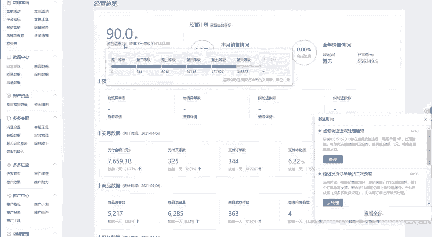

# 【拼多多运营实操教程】最系统的零基础拼多多开店教程全套，电商运营大佬专为学渣研制的新手开店保姆级教程！全程干货，简单粗暴 - P57：57、拼多多开店-新店如何从0到1打造爆款 - -拼多多开店 - BV1BH1qYpEqw

好了，已经到了上课时间啊，可以听到老师的声音，并且可以清楚的看到桌面的小伙伴公屏扣1示意，老师一下已经进入到课堂的同学啊，公屏扣1，我们先签个到声音和画面都没有问题吧。OK的O的啊。

然后我们今天分享的一个课题的一个内容呢，是拼多多新店如何从零做到一的实战的14天的一个实呃实战的一个过程。呃，那么上一节课呢我其实给大家分享的内容呢呃我不太清楚有多少同学是上节课来过的啊。

有多少同学是上节课有在听过的，公屏扣6，我看一下。上节课呢我给大家分享的是整个我们在做店的时候呢，每一个阶段到底应该怎么样去做啊。同时呢分享了三个呃实战的一个案例来给大家去进行剖析啊。

比如说最最初的时候，我们的店铺呢怎么样从零做到200多的一个访客。那么达到200访客啊，之后，那么我们的商我们的店铺呢又会进入到下一个阶段啊，那么整个三个周期到底是怎么样来进行划分的。

第一个阶段我们先做到200多到300多左右的一个访客。然后呢，在第二个周期的时候呢，我们直接把这实现一个流量爆发，做到2000多到3000多啊，这是第一个店铺，然后做到的一个实战的一个案例。

那么第二个呢就是当我们的流量达到了34000之后，我们的访客呢怎么样可以维持得住啊，那这个是昨天的时候呢，给大家呃剖析的第二个案例啊，我们的访客呢如何每天维持到34000啊。

3000到5000左右的一个流量保持不下滑。那这个呢是我们第二步要去做的一个事情。那么第三。

步要去做的一个事情呢，自然就是我们的店铺如何来去进行突破了。就是当我们看到一个店铺啊，我们看一下店铺的一个数据。当我们的店铺呢已经达到了1万左右访客的时候，在3月9号的时候啊，1万多左右的一个访客。

怎么样去进行突破。那么在一个月左右的一个时间呢，直接突破到了每天大概4万多4万访客左右的样子。所以说呢昨天的时候呢给大家分享的这个实战的一个案例。那么我们今天呢啊详细的来进行下一步的一个剖析。

就是说我们新店啊，到底怎么样从零，然后先做到200多的一个访客。具体的一个实操的一个过程到底是什么样的。好吧。然后呢，我在今天的个课题里面呢，也会给大家分享到很多的一些干货的一个内容。

那么已经进入到课堂的同学呢，我希望大家自己拿好笔记本，然后做好笔记。因为我在我的课程里面呢呃会有一些呃我讲出来，但是可能我没有在这个公屏上啊，或者是在笔记里面给大家讲出来的。

那么大家可以自己在笔记上面去呃写出来，好吧。好，那么还是老规矩啊，课程时间已经到了。那么我们课程的第一个环节呢还是答疑啊，先给大家解决问题。大家有任何的疑问，或者是在坐垫方面遇到任何的困惑。

都可以直接发在公屏上，我会给大家去进行解决好吧？呃，什么问题都可以问啊，包括说呃最近呢也有一些地址呢在问我老师什么类目比较好做。然后现在到这个夏季了，我夏季的产品是不是应该撤款。嗯，其实这个怎么说呢？

呃，如果说你现在要去决定去做夏季的产品的话，那么你就要抓紧时间了啊。因为呃没准备一个店铺想要去进行操作的话，需要前期大量的准备。就比如说这个店铺啊，我这个店铺在最初操作的时候。

为什么说200230百左右的访客维持了这么长的一个时间啊，大概维持了有14天到一个月左右的一个时间，为什么维持了这么久才可以实现流量爆发。它并不是说我们啊这个流量呢一下子就可以直接获取到啊。

并不是这样的，你店铺里面呢我们的店铺里面分为很多个商品，也并不是说你做的第一个宝贝就一定可以爆起来。所以说如果说你想要去做夏季的产品，或者是我们不管是做现做不做夏季的产品。只要说我们想要去进行做店。

那么我们都要去呃给自己的产品呢有个规划啊，我们可以看一下，其实真正起流量的一个时间呢并没有太长，仅仅就只是做一个宝贝。但是前期呢我的这些产品呢上架了之后。比如说。像这些啊什么呃蜂凰胎啊，然后包括这个。

瘦身的啊，减脂的这种产品呢，它其实就是给我们的店铺来拉人气的。当我们的店铺有了一些人气之后呢，我们可以直接上架新品。这些新品啊上面的显示具体的一个显示呢，上架的时间还不到30天。

也就是说这个产品是什么时间开始上架的呢？是在今年的3月份的这个3月28号，也就是说3月月底的时候才开始去进行操作啊。那么我们在操作的一个过程中呢，为什么说短短几天的时间就可以做到两三天的一个访客啊。

原因就是因为前面我们做了积累，明白吗？所以说如果说大家想要去做新产品的话，先去给你的店铺做一个呃做一个详细的分析到底适不适合这个时间段去进行主推，那主推之前又需要达到什么样的条件。好吧。

然后我看一下大家的问题啊，啊，兰兰没有转化是怎么回事啊，转化率这个问题呢，前面我讲过很多次啊，我讲过很多次啊，然后呢呃转化率。首先第一个看你的产品的价格。第二个看你产品的销量。

第三个看你的详情页以及评价。好吧，这些东西看一下跟同行对比一下有没有出现问题。然后这个优优兔啊，优优兔是不是昨天就问过这个问题，客户不知道多多钱包，多多钱包，你让客户啊，你让客户打开拼多多啊。

打开拼多多在拼多多的这个APP里面，然后直接点击啊，就跟这个微信钱包是一样的啊，点击这个个人中心啊，点击个人中。呢然后在这个里面呢呃它就可以看到我的订单呀，包括说我的呃商品啊啊我购买的商品呀。

这些很多的一些数据，明白吧？这个多多钱包就在这里面明白吧？你点击呃点击你的这个个人的一个头像啊，点击个人的一个头像，然后进入之后呢，你就可以找到多多钱包，明白吧？而且说如果他。找不到这个多多钱包。

但是你钱返给他了啊，然后你找到对应的位置，让他截图给你，或者说你直接让他加你的微信，明白吗？你要你怎么样让这些有疑虑的客户，其实你遇到的一个问题啊，最主要的问题是什么呢？怎么样让。😡，有疑虑的客户。

转化为你的粉丝。其实这个你才是才是你应该去进行考虑的。比如说我最早的时候呢，我做这一个食品。那大家也都知道食品这个产品呢很有可能在邮寄的过程中呢，会出现这个产品包装有问题啊。

或者是呃或者是这个食品呢啊漏掉啊啊，类似于这样的一些情况。那这种情况呢，消费者如果说来找到客服说，哎我的这个产品呢出现了很大的一个问题，我要给你差评或者是怎么样啊，你要要求你给我退钱啊，给我退货。

那在这个时候你应该怎么解决呢？你要用合适的话术，比如说你可以引导客户啊，你在客呃你可以先加我的微信。啊，先加微，当然说千万不要说直接在这个聊天里面打微信啊，你可以先加微。先加我的微，然后呢。

我在微信微信上呢，然后退钱给你啊，这个钱你也不要出现。你就是说我会给你补偿啊，你就说补偿就可以了。然后他加到你的微信之后呢，然后你把他拉到一个群里面，或者是不拉群也可以啊，不拉群，你做什么呢？

你就说你把钱退给他。钱退给他，然后呢，你问他对于你的商品呢有没有兴趣。那么这个时候呢，你要做一个什么呢？做一张海报，这个海报里面有什么内容呢？有1到20个啊，1到20个。1到20个商品这个商品是什么呢？

叫做赠品。比如说我有的时候呢呃我就会在上面放一些呃成人用品，包括说我们平时使用的这些小台灯啊，还有什么袜子啊，还有内衣啊，内衣啊，当然这个内衣内裤可能啊整体测试下来效果不是特别好啊。

但是说像台灯啊、袜子呀啊，包括说我们使用的什么钢笔啊，类似于这种很小的这种小物件。千万不要说大家在这就跟我们自己连续补单的是一样的。你让你朋友圈里面的人帮你去进行刷单。那么操作的时候千万不要直接给钱。

因为拼多多里面的佣金可能也就是3块钱5块钱啊，5块钱左右，那5块钱左右能做什么呢？什么也做不了。所以说你可以直接送一个赠品给他，明白吧？就是我发货的时候，我直接发台灯。

他在需要他在我的店铺里面去进行拍单钱你可以先退给他，然后呢，让他拍单啊，然后让他拍单拍单之后呢，然后你给他送一个小礼品啊，你给他送一个小礼品。这样对于消费者的一个意义来说是完全不同的，明白吧？

你给个5块钱，3块钱，对于消费者来说并没有什么实际的意义，他也不会感觉到什么东西。这个点能不能理解？优优兔理解的话，公屏扣1啊。然后呢，我看一下这个大月儿，多多买菜已经开通，后面应该怎么操作。啊。

大月儿现在是做这个线下店吗？啊，你主要的一个商品都有哪些，可以给我们讲一下。多多买菜这个东西啊，其实我不太愿意愿意说这个啊。多端买菜就跟就跟什么呢？就跟这个你入驻的美团一样啊，你就跟你入驻美团一样。

就你入驻美团是一个意思，明白吗？就是线下配送，它只是说多了一个平台，消费者可以在多多买菜上。比如说打开拼多多找到这个多多买菜，他可以在多多买菜里面去找到你的商品，找到你的商品可以怎么办呢？它可以下单。

那么下单了之后呢，然后你就可以去给它进行配送。但当然这种多多买菜，一般情况下都是适用于本地的啊，都是本地化生活的一个服务。当然你打开这个微信公众号啊，微信公众号叫做多多买菜。商家端。啊，多多买菜商家端。

然后呢关注这个公众号或者小程序进去之后呢，它会给到你一定的任务，就是推广任务。然后你按照任务去做就可以了。拼多多里面所有的操作都是非常的简单的啊，都是非常简单明了。

而且不会说给那些呃给到你非常多花里胡哨的东西，你就按照正常的完成推广任务就可以了。包括如果说啊如果说大家在操作的一个过程中呢，会遇到一个什么样的一个东西呢？就是说你入住了多多买菜。

他会呃这个小二这边呢会给你呃会给你对接啊，会给你对接，明白吧？啊，比如说我这边之前对接的一个小二看。😊。

他就会给你发这个东西啊，比如说在多多买菜里面，他会呃他会给你直接加到你的微信啊。只要你填写了信息之后，他就会加到你的微信，明白吧？然后呢，门店入驻了之后呢，他会给到你对应的入驻流程。

然后需要什么样的资料，以及在推广的时候呢，到底应该怎么样去做啊，这个就是小二，明白吧？😊。

8月2。啊，现在这个多多买菜这边的官方人员有没有加你呢？有加到你吗？😡，啊，我这边之之前在测试的时候是有过这个加的啊，是有过添加的。当然最最起码在推广的时候呢，有有一个这个东西看到没有？

这个推广码不同的店铺推广码都是不一样的啊，点到你的这个推广码，然后之后呢，他会拉你进一个群啊，他会拉你进一个群。然后呢，在这个群里面呢，你可以自由的去进行推广，好吧。啊，有一个负责啤酒采购的架构。

那应该就是啊那应该就是好吧。好，还有没有其他的问题啊，还有没有其他的问题？😊，啊，有问题的同学可以直接发在公屏上啊。呃包括说大家现在所遇到的在操作店铺过程中所遇到的这个难以解决的问题。

或者是遇到一些呃自己可能啊我知道呢大部分的同学呢可能来听课，就是因为感觉自己比较迷茫，对吧？有什么问题都可以直接提啊都可以直接提。啊，okK我看一下嗯。😊，商品没有流量怎么办啊？其实这个流量问题啊？

流量问题其实很简单。那我今天主要给大家分享的内容呢，也是我们拼多多新店到底应该怎么样去做流量。怎么样一个从一个新店啊，我们的一个新店啊，来，我们来看一下具体的啊实际的一个数据啊，实际的一个数据以及案例。

那么我们的新店在最初操作的时候，怎么样可以把我们的新店做到200多的一个访客啊，200多到300多左右的访客。那么第一步我们要做的就是这个点啊，就是这个店有没有同学这个店铺的访客是已经超过500以上的。

公屏扣1，我看一下有几个。如果说大家店铺的这个访客呢是没有达到这个500以上的。那么公屏扣2，我看一下有多少。我先看一下大家各自店铺的一个基础啊，是怎么样的啊。然后呢。

我再给大家去做针对性的去进行分析啊，针对性的去进行分析。啊，我看到很多同学都是没有达到的对吧？好，OK啊，那接下来的时间啊，那么我们就正式开始来给大家剖析一下我们的一个新店到底应该怎么样去做。

当然这个里面呢我会讲到非常多关于拼多多提升权重规则上面的一些东西。所以说如果说啊一定要让大家这个做好准备啊，打开自己的笔记本啊，该写该记笔记的啊，或者是啊自己手机里面啊，该记笔记的，然后呢，做好笔记。

我在课程的中间的一个环节呢，会给大家啊留出一些时间来进行提问。好吧啊，那么已经做好准备的同学，公屏鲜花来一博，我们就正式开始，好不好。好，我喝口水啊喝口水。😊，好，那我们继续啊那我们继续。

今天所主讲的一个内容呢是拼多多新店如何从0到1的一个实在啊，我们操作整个周期呢是14天。那么在实际操作的一个过程中呢，我会重点的从三个方面啊来给大家去进行剖析清楚。第一个是什么呢？

第一个是如何来看判断我们的产品状态。如何来判断我们的产品状态。那么我在这个里面呢，我会重点来给大家讲到我们的拼多多到底有什么样的一个规则。我们在提升权重的时候。

到底以应该以一个什么样的方式去进行思考去进行布局。那么第二个方面呢是主流的一些推广渠道。主流推广的一些渠道。那么我们在推广的一个过程中，我们的新品啊产品状态判定清楚。

那么第二步我们要做的就是产品的一个推广。怎么样可以让我们的流量实现爆发，应该从哪些渠道去进行操作。那么第三个是什么呢？是如何突破瓶颈？啊，如何突破？好，第一个啊我们先来看一下啊这个第一个问题啊。

这个产品状态啊，我看到有很多有有几个同学呢还是在说在问问题啊，这个没关系。如果说大家现在的啊前面的这个答疑环节呢，没有给大家解决到的问题，或者是啊大家没有提出的一个问题，可以直接先加我的微信，好吧啊。

直接加我的微信，把问题发到我的微信上就可以了啊，这个是我的微信二维码，好吧啊，然后呢，我们就继续啊，我们继续。第一个呢我要给大家分析的叫什么呢？叫是产品状态。那么产品状态里面呢，有几个点啊。

有几个点要给大家啊讲清楚啊。我想先问一下大家，大家知不知道，或者说有之前有听过我课的同学，我在操作店铺的时候呢，习惯性的把店铺把我们的单品呢分为几个周期来做。有没有同学记得的分为几个周期。😊。

单品周期划分。我们在做任何的事情的时候呢，都是要根据我们店铺不同的一个时间阶段，以及我们店铺所需求的一些内容，然后来进行操作的。所以说呢我在操作单品的时候呢，我会把我的单品去进行划分啊去进行划分。

有的话同学还记得的。都忘了啊都忘了。😊，好，那这个点呢就需要大家把这个呃笔记本拿出来啊，把笔记本拿出来，这是第一个大家所需要做的一个笔记。单品的一个周期划分为四个周期啊，划分为4个周期。明白吗？

单品啊从我们第一个周期叫做什么呢？叫做基础啊叫做基础期。第二个呢叫做孵化。第三个才是我们的权重爆发期。第四个周期呢叫做权重的稳定期啊，权重的稳定期。包括说我们在实际操作的过程中。

我有很多的店铺都是以这样的一个方式去做的。比如说在第一周期的时候，我们所需要做的是东西是什么呢？就是说基础期的时候，我们需要先把访客做到200到300。那么这个访客怎么做。我们在补单的时候，这么怎么补。

大家都知道我们的新品开店了之后呢，需要先去先去进行补单。那补单的时候应该怎么补，应该选择什么样的数据量，应该选择什么样的人以及选择什么样的一个渠道，这就是我们第一步要做的。所以说在第一周期啊。

第一周期的时候，我们要做的就是把我们的店铺做到200多到300多的一个访客。所以说第一周期的一个基础期啊，基础期，我对于大家的一个要求，就是你的店铺需要达到3200到300左右的访客啊。

200以上的访客。那么这里面有有很多具体化细节化的一些操作。举一个比较简单的例子呃，我想先问一下在在座的各位，你们的店铺新开了之后，第一步做的操作都有哪些呢？第一步的操作都有哪些啊，大家可以讲一下啊。

刷除了刷还有呢啊不要啊这种刷单。好，是大家都能耳熟能详的啊。好，我店铺里面需要刷单，这个大家也都也都清楚。那除了刷还有做了哪些除了刷就是继续刷。😊，那你厉害了啊那你厉害了。

就是说如果说我我们的单品呢想要把它做到200以上的访客，大家都做了哪些工作啊，有有没有做成功的啊，有没有做成功的？😡，这个是非常最基础的一步啊，从0到啊从0到1的一个过程，从无到有的一个过程。

怎么样把我们的店铺访客做到200以上。第一步的操作。好，那刚才有同学说了啊，第一步我会我会刷单。那么第二步呢，同学还呃还有哪些这个想法，或者是自己已经有去操作的啊，学习就为了赚钱过来听课。

听多少操作多少，那这样可不行的啊，你要有自己完整的一个体系，完整的思路，明白吧？所以说思路对了啊，思路决定出路，明白吧？😊，啊，然后呢这个移动部门啊测款没有曝光，价格调的很高了。

前期你的产品有没有基础啊，有没有基础？测款是你的店铺在有一定基础之上，你才可以去进行测款。否则的话我在这里面给大家讲一个东西啊，给大家讲一个东西。呃。

大家可以根据于自己的一个店铺的一个后台来进行实操一下啊，来进行实操的实操一下。来，我们来看一下。打开店铺后台之后呢，我们打开店铺后台，然后找到一个工具叫什么呢？

在这个店铺营销里面找到一个工具叫做短信营销的工具。看到没有？这个短信营销的工具开了之后，开通了之后呢，然后大家看一下这个位置。你店铺里面的场景营销，比如说我们活动预热，还有店铺助力以及新客转化。

潜在客户是多少？这个东西大家有没有关注的啊，有没有关注的？😡，试了没用，运气很也很重要啊，运气不是最重要的，明白吧？只要你技术到位了，你就可以去找运气啊，运气是我们需要我们自己去找的，明白吧？

你自己主动出击跟被动的去接受是完全不一样的。拼多多做翡翠能弄啊，完全可以做呀。翡翠为什么不能做翡翠可以做直播啊。😡，拼多多上的直播还是非常好做的啊。😊，啊，这些这个年轻一些的这个。叫什么贵妇啊。

30多岁40多岁的这个贵妇，然后还是很喜欢翡翠的啊，不要问我怎么知道的啊，我就是知道。😊，哎。啊。然后呢呃我看一下大家的同呃各位同学所提到的一个啊，然后这个移动木门啊，诺威斯呃诺斯威啊诺斯威移动木门。

然后呢就是呃去进行测款了啊，然后呢，测款遇到了问题，就是没有曝光啊，曝光遇到了一个问题。那这个问题给你解决了，你店铺里面先要确定你有多少的潜在客户明白吧？没有潜在客户，那你就需要先去做流量，明白吧？

然后呢，站在街角啊，站在青春拐角处限时折扣，限时免单，那这个属于活动，对吧？先给自己的店铺做了一些活动，然后呢，这个不懂呢啊其他的我没没有了啊，没有了。然后呢，厂区人士就是靠运气啊，就是靠运气，然后等。

这就是大家在操作店铺的时候啊，我感觉大家为什么这么佛系呢？😊，🤧嗯。听说被都拼多多被告了，拼多多被不被告跟我们没有太大的关系，明白吧？拼多多这么大个盘子啊，几千亿的一个盘子，几百亿几千亿的一个盘子。

对吧？他就再说在被告嘛，他一下子也不会倒台，明白吧？就跟阿里一样，阿里当时当初还被这个呃还被这个国家国家这个反垄断了呢啊，反垄断也无非也就是雷声大有点小，然后交了50块钱，50万的罚款没了。

50万对于这个阿里来说值得伤筋动骨嘛？也没有任何意义，明白吧？当你行业做大了之后，平台做大了之后啊，国家也不会说啊，当然在这里面我们讨论这个政治有点不太好啊啊，大家心里清楚就可以啊，心里清楚就可以了。

你盘子做大了，国家也不可能说盲目的去动你的，好吧。😊，呃，当年诺基亚也是这么想的，好像是前年100块钱优惠券火的。😊，没你这么想没你想的那么恐怖啊，诺基亚它是整体的一个什么呢？决策上面的一个失误。

明白吧？并不是说跟拼多多其实还是有很大的一个差别的。拼多多呢它主要做的是一个服务。那诺基亚它是基于产品的产品是不一样的。你要理解清楚，不管是哪一个平台。如果说你的产品是基于技术的。😡。

对吧就像我啊希罗老师是靠技术吃饭的。那么当有一天我的这些技术，拼多多的这个规则改革了，那么我就需要去进行学习，我需要学习更先进的技术，我才可以把拼多多店铺给做起来，但是拼多多是做什么呢？

拼多多是做平台的，它是给消费者去进行服务的，凡是跟消费者沾边啊，比如说我们在使用这个诺基亚得喜欢用这个来来做来做对比啊，那我们就来对比一下。那诺基亚是什么？

它是靠这个技术去吃饭的那消费者不用这个诺基亚也可以我可以用苹果，我也可以用其他的这个手机，像什么当时比较火的啊中心啊，华为啊，对吧？我都可以用这些手机啊，我对吧？但是说平台没有了啊，平台没有了。

那你这个东西怎么搞？消费者已经是很习惯于使用这个东西了。比如说现在突然间告诉你支付宝没有了，然后微信没有了，你没有办法使用微信和支付宝去进行付款了，消费者怎么办？这就是说为什么支付宝一步一步做大的原因。

😊，嗯。🤢，🤧。明白吧。对啊，所有的事情啊所有的事情全部都是只要你去做了，肯定360行行行出钻元啊，千万不要想着这。好，那别人把这个东西做的都已经很大了，你没有机会了，这不可能你想要做多大啊。

你想要做到跟黄征马云一样的一个水平嘛，那不现实啊，因为市场就这么大。但是说对于我们中小卖家来说，哎，每天每个月啊赚个三五块三五万块钱啊，我知道有很多的同学都是这样想的。我每个月呢赚个三五万块钱好。

我就知足了，我可以养家糊口，不至于我到这个人到中年的时候啊，老婆还是伸手朝我要钱，父母朝伸手朝我要钱，我拿不出来。那么这个时候呢，我们想所想的就是解决我现在所遇到的问题就O了啊。

其实很多人都没有那么大的志向的好吧，楼歪了。😊，没关系啊没关系啊，只是说有一些感慨啊有一些感慨，好吧。😊，好，那么我们继续啊我们继续。那么我们在初期在运营的一个过程中啊。

我们前面讲到在第一步操作的时候呢，大家往往选择的是刷单测款，然后活动或者是靠运气拿流量。但其实在我们操作的个过程中，首先我们要了解的东西是什么呢？就是第一步我们的店铺怎么样可以做到200多的一个访客。

它最基础的一个原理是什么？首先。我们的产品属于基础期，在基础期的时候，我们产品有什么样的一个特性呢？就是产品的曝光量很低。啊，我们产品的曝光量很低啊，包括我们的啊曝光量啊，曝光量。

包括我们的点击量啊等等。它平台都不会给到我们太多的一个扶持。虽然啊虽然千万不要想的是啊，我好我们新品上架了之后呢，都会有一定数量的一个扶持。对，确确实实有扶持。但是给到你的扶持是非常非常少的。

每天给到你的流量不可能超过20个或者30个，明白吧？所以说在第一步基础期的时候，我们要先解决的就是产品曝光量低的一个问题，那么第二个是什么呢？在基础期的时候，我们要还要还要考量到平台的一个规则。

平台规则里面呢，就我跟我跟大我跟大家之前讲的东西是一样的啊，原理。因为我们的产品展现很少。我在我们产品展现很少的时候，但是呢大家会发现我的产品呢还是会有成交。只有当你的产品有成交了之后。

平台是不是才会给你推荐更多的流量？那这个时候如果说平台给到我们的曝光量，比如说每天给我们1000的曝光量。每天给到我们1000的一个曝光量。那么我们在有限的曝光里面，怎么样可以确保我们的产品有成交？来。

大家想一下。我们的产品如果说每天给到我们1000的一个曝光量或者1万的一个曝光量，在这有限的曝光量的基础上，我们怎么样才可以获取到成交开车啊，在免费的情况下。不要想着直接上来就开车。

直接上来开车就是错的。😡，没有吗。😡，对啊，第四块提到一个非常。核心的一个问题，免费送当然可以啊当然可以免费送当然是可以的。还有呢。那免费送有一个前提啊有个前提。比如说平台没有给到没有给到你返现。

你再去免费送消费者也不会看到你的商品。看到你的商品之后呢，他也不会去进行点击。你觉得消费者还会有成交吗？就算是你免费送，大家有没有遇到这种问题，就是说你免费送都送不出去。😡，千万不要觉得我在我在夸大啊。

有些产品你就是真的就是免费送都分送不出去。明白了吧？所以说啊根据于平台的一个基础的规则以及原理啊，根据于平台的规则以及原理，我们在操作的时候展现很少，但是怎么样可以获取到成交。第一步要做的。

首先要解决点击率的问题。比如说我们做了一个免费送的活动，那么免费送的活动你要怎么送？😡，对啊，学习是为了赚钱。呃，这个提到的这个问题非常的核心啊，也非常的正确啊，值得鼓励一下，关键在于什么呢？送什么。

明白吧？你知道之前我在做店的时候，大家猜猜想一下我是送什么的。😡，我之前的时候做豆浆机啊，豆浆机在拼多里面，豆浆机是属于这个客单价相对来说比较高的了啊，2200块钱到400块钱之间的。😡。

200块钱到400块钱之间，那么这个时候呢我就需要跟公司去谈合作。那么我送的是什么呢？😡，价值3999的啊价值3999的旅游券。啊，旅游门票我包车，然后呢跟团明白吗？你要去跟旅游公司去谈合作。

当然啊这是我在做的时候，我是直接跟公司谈合作的。那么如果说大家去进行操作的时候呢，你就需要去找一些什么呢？高溢价的赠品。啊，高溢价的赠品？什么叫做高溢价的赠品？比如说蓝牙音响。

我们在比如说我们做的产品呢就20块钱。那么有一些蓝牙音响，你实际的进货价有多少进货价成本价啊，5块钱的一个成本。😡，但是在淘宝上面卖多少钱呢？卖59。9块。😡，明白吗？包括在拼多多里面也是卖59。9块。

那类似于这样的一个产品，我们就可以拿来送。😡，能不明白？当然找产品的时候啊，找赠品的时候，一定要跟你的产品相关，并不是随便送的啊。如果说你卖食品，你20块钱的食品，你送个蓝牙音响。

很明显是很明显是没有什么没有什么影响的啊，消费者根本。😡，根本就没有吸引到他，所以说也没有用啊也没有用。所以说我们在实际操作的一个过程中，你要根据自己的一个情况。为什么说我在讲课的时候。

我一直强调我们在坐店的时候一定要实操。因为只有当你实操的时候，你才知道你的商你的商品跟哪些产品是相关联的。我们可以送哪些东西，明白吧？你买我1个200块钱的豆浆机，我送你一个价值4000块钱的旅游门票。

你觉得划不划算嘛？😡，你觉得划算，那你就那你就来。当然我门票不是每一个都送啊，我只限10个，我只限10张，越是溢价，越是溢价空间高的这种商啊这种商品。那么我们送的数量也就越少。那消很多的消费者。

你要记住，消费者在拼多多上买东西，它都是贪图什么来的，贪图便宜来的。因为拼多多上的产品呢就是便宜。贪图便宜，你要给到他一个更具备吸引力的。为什么说啊在天猫做活动的时候啊，双十一双十二的时候啊。

大家送这个苹果苹果十一那个时候送的非常的火，为什么要送苹果啊，而且呢几千个人去进行购买了之后，我才送一台，你要想象一下，这里面的到底在哪里啊，在哪里？好吧？这就是第一个点啊，第一个点。

根据于平台这个规则，我们首先要选择的是什么呢？解决点击率的一个问题。那消费者怎么样才可以进行点击，你要送的这些赠品呢？你要吸引到消费者好吧，这个点能不明白，明白的话，公平扣一啊，明白的话，公平扣一。😡。

学习是为了赚钱，之前我们做连衣裙，直接送连衣裙，无条件的就50件，没有任何意义啊，没有任何意义。因为你自己做的是什么呢？你自己做的是连衣裙，对吧？那消费者在有多少人在买连衣裙的时候。

他会买两件一样的连衣裙。😡，你想一下有多少人在买连衣裙的时候会买两件一样的连衣裙。😡，有是有，我告诉你这样做的效果肯定没有你送其他的赠品送的好。😡，明白吗？你卖连衣裙。

那么你可以送这个内搭的里面内搭的这种这种产品，明白吧？千万不要送。如果说大家是做食品啊，或者是做家居生活用品，类似于这样的。比如说我买一包辣条，然后呢，你送我两包辣条。那这样的话，大家还是可以接受的。

效果是比较好的。😡，你见过同行有多少家有多少家商品啊，在买这个产品的时候，哪怕你送裤子，大家穿裤子会比较实在，对吧？59块92件裤子，那这种呢可能做的会比较好，但是连衣裙这种东西啊。建议你还是换一下。

好吧。😡，大件怎么弄啊？那这个刘洋啊，刘洋同学，你是做什么产品的啊，你是做什么产品的？你跟我说一下你的大件是什么东西啊，我来给你想一下。😡，不是买一送一啊，QQ不用买，直接送，那你那你厉害吧。

你成本你成本呃，这个你可以支撑，那你就可以直接送，明白吧？我在做的时候是需要消费者先在我的店铺里面买了东西的，你直接送直接送，那怎么可以啊？😡，啊，你要直接送的话，我我课堂里面有这么多同学啊。

这么多同学一人送一下，对吧？还可以帮你在店铺里面拍一单，对吧？你返款就行了啊，多划算啊多划算。😊，啊，开玩笑啊开玩笑啊，那么我们在做活动的时候怎么做呢？你打开店铺营销工具啊。

在营销工具里面可以直接送这个啊，直接做这个限时免单啊，直接做这个限时免单，直接创建就可以了啊。当然这个里面需要有，比如说随机抽取十单啊，随机抽取1单，然后呢抽呃抽奖的这个预算是多少。

然后你自己这个充值就可以了啊，充值就可以了。这个也比要简单，好吧。😊，买短袖送什么送跳蛋，可以呀。啊，这个完全可以的。明白吗？😡，因为我之前就送过啊，我确实实实是是这个送过的，但是在送的时候。

我不是在店铺里面送的啊，我是在微信朋友圈里面送的。然后那个刘洋同学在不在啊？刘洋同学在不在？在的话，公屏扣一，你做的大件是什么什么产品？然后酒过三巡是买短袖，呃，买短袖的话，买短袖可以送短袖啊。😡。

短袖可以送短袖啊，但是连衣裙你不要送连衣裙，明白吗？😡，短袖是可以去大部分的商啊，大部分的消费者还是很愿意去购买两件一样的，或者是两件图案一样的，两件款式一样的对吧？这种是可以的啊。

买短袖还是送短袖也是可以的，明白吧？但是连衣裙就不要了。比如说你买西装，再送一件西装，那就没有任何意义，明白吧？😡，餐车啊餐车好。餐车。😡，餐车在做的什么行。

你要想象你要想象先想象一下消费者买餐车是用来做什么的。😡，消费者买餐车是不是用来做生意的？😡，对不对？我需要在外面去摆摊，所以说我需要买一个餐车。那么既然说他做生意。

那这个时候我们要考虑消费者在买了餐车之后，它是不是一次性购物，我不会说每每一个月我都买一次啊，一次性购物，对吧？消费者他不会说一次性啊，他不会说一个月买一次餐车，这个也不现实，对吧？

所以说大件商品都是一次性购物。那这个时候你就要根据你产品去找对应的消耗品。😡，你要给到消费者一个一站式购物的一个体验。所以说你送他的东西是什么呢？餐车里面的消耗比，比如说呃像烤肠。😡，烤肠。

能不明白面粉。类似于这样的啊类似于这样的什么鸡蛋灌饼。刘洋能不能明白？明白的话，公屏扣1。当然我们在赠送的时候，比如说赠送的时候呢，这个优质的面粉呢我们只送一袋啊，我们只送一袋。

一袋面粉呢其实也花不了多少钱。对比于餐车来说，那你买一个餐车最起码需要几百块钱甚至上千吧，对吧？几千块钱的一个餐车，然后呢，你送他一袋面粉，那才多少钱？五六十块钱或者是100块钱啊，100来块钱。

100来块钱的东西好，可以促成你这次购促成这次成交。那么促成成交了之后呢，消费者还有一个什么样的一个心理呢？他就是说怕麻烦。😡，如果说他觉得在你的店铺里面，所有的消耗品我都是可以买到的。

并且你还可以做一个什么样的活动呢？凡是在你的店铺里面购买过这个餐车的，你所有的全部都是可以查到订单的，它可以成为你的VIP然后在你的店铺里面去进行购买你商品的消耗品。

比如说购买这个烤肠啊、面粉啊或者是灌饼的时候，你可以给他8折，明白吗？不管你这个产品贵还是不贵，就算是比市面上稍微还是贵一点点的也没有关系。因为它感觉到便宜了，你打了8折，明白吗？并且它是怕麻烦的。

所以说在购买你餐车之后，它还会在你的店铺里面形成二次消费。😡，大件产品就这样搞，明白能不能明白，所以说思路很重要啊。😡，好，那这个我们就过了啊我们就过了。😡，这个呢就是第一个我们要原呃我们要了解的啊。

这个规则和原理展现很少的时候，怎么样可以确保成交。那么第二个是什么呢？就是在我们补单的时候啊，有有很多同学呢可能刚才提到了一个很重要的一个点是什么呢？我们习惯性的去进行刷单。那么在第一步操作的时候。

刷单大了，大家是怎么刷的？我我想问一下大家是从哪些渠道去进行操作的。😡，是从哪些渠道去进行操作的？这个点对于我们的店铺非常的重要啊，因为它会直接决定啊一个什么样的一个点呢？

比如说我们在实际操作的过程中啊，我们在实际操作的过程中，比如说。像有一些大件的家具，比如说浏洋的这个产品啊，餐车。餐车能不能直接补单？😡，啊，贪车能不能直接刷单？直接刷单就有点恐怖了。

并且改销量也没有办法做，明白吧？所以说餐车要先做的是什么呢？先做的是人气，并且我们在操作补单的时候，比如说大家要做连衣裙或者是做这个短袖这种非标品的一个产品，我们在做的时候应该先考虑到什么点。😡。

平台在最开始的时候给到你的展现是被动的展现。就是这里啊平台第一步给到我们的展现呢是被动的展现，它不会给到关键词，它不会给到你给到你对应的搜索展现，明白吧？它给到的是对应的是什么呢？推荐式的展现。😡。

网上找的啊，这种肯定不行啊肯定不行。初期平台给到的啊。初期平台给到的是推荐式的展现。所以说我们不管在做什么产品的时候，选择渠道。第一步，先要选择的渠道是什么呢？叫做分享。拼多多平台它是怎么样去起家的呢？

它是根据分享来进行起家的，明白吧？它本身就是一个社交的一个平台。所以说我们在操作的时候，千万。不要。😡，直接用搜索。来，有多少同学在操作的时候是直接使用半标题或者全标题来进行补补单过的。公屏扣1。

我看一下，就是你的新品在第一周期啊，我们的新品第一周期要做到什么样的一个数据呢？刚才给大家看到了，如果说你的店铺是处于一个什么样的一个状态呢？200访客还没有的情况下。这种情况下应该怎么样去补单呢？

你可以使用批发，也可以使用这个分享单，做一些基础的权重就可以了。千万不要直接开始使用关键词，明白吧？你使用关键词平台都还没有给到你搜索的展现，没有给到你搜索的曝关，你就用关键词去进行成交了。

那明摆着告诉平台，你再刷单。所以说这个东这个规则是从去年的时候开始的啊，因为平台全部加入了一个东西叫什么呢？就是虚假轨迹。我不希望大家在操作的过程中，因为这个原因导致你的店铺被罚款啊。😡。

被查到一单罚款就是5块啊，罚款就是5元，明白吗？😡，好，关于这个点，大家都能不能理解理解的同学公屏扣一啊，理解的同学公屏扣一。😊，好，那么我们继续啊我们继续。那这个就是我们第一步要了解到的一个规则啊。

了解到的第一步操作的时候，大家所讲的呢对不对呢？其实都没有太大的问题，只是说这些细节要注意到位，肯定是要进行刷单。那么刷单之前，我们需要进行测款，确保我们的点击率是没有问题的。然后呢再去做活动。

那做活动的时候应该怎么样去做呢？比如说营销工具啊，营销工具刚才跟大家讲过啊，营销工具里面找到这个限时免单。😊，啊，找到限时免单的一个活动。那至于运气这个东西啊，我不太信运气啊，我不太幸运啊。

我这人不信命啊，直接干就完了。千万不要想着啊，别人做起来我就做不起来啊，这是啊不现实的啊，不现实的。好吧，那今天呢啊刚才呢给大家分析的是我们在基础期的时候具体的一个操作。那么在基础期做完之后啊。

基础期做完之后，那么这里面我还要给大家剖剖析一个点是什么呢？叫做提全的模式。😊，如果说我们的基础销量，包括我们的评价，以及我们前期的一些设置全部都设置好了，那么怎么样可以从基础期进入到孵化期。

在基础期做完之后，我们的基础销量做到了200啊，基础销量做到200呃这个访客呢已经做到了200到300左右。那么当我们第一周期做完之后，如何来进入到孵化期。那这里面呢有一个考核点叫做提全的一个模式。

大家想不想知道在拼多多里面为什么说我在做这个店的时候呢，我的流量就可以实现爆发。原因就是因为我卡准了平台的一个规则。我知道平台在我提升这个排名的时候，它重点考核的数据都有哪些？就像是什么呢？

我们比如说我们在上学，那上学的时候呢，我们会有一个门槛啊，我们会有一个门槛。比如说我们想要扫上这个清华北大。那么我们在考试的时候呢，就可以直接去啊考一个比较高的一个分数呢，就可以直接上，明白吧？

所以说这里面呢在提前模式的，这里面呢有一个门槛啊，一个门槛。😡，然后呢，我看一下大家的问题啊，诺斯威啊诺呃诺斯威分享几天用关键词，分享最起码3天，最起码3天啊，建议大家在第五天的时候开始用关键词。啊。

3天到4天，第四天你可以尝试使用关键词去进行搜索，但大不大概率第四天的时候也是搜索不到的啊，并且像这个呃。这位同学提到的啊，这个叫你。😡，这什么几个横杠啊，五个横杠是吧啊，四个横杠啊。😡，访客可以刷了。

访客尽量不要刷，因为你刷到的访客基本都是基本都是假的，明白吧？访客不需要刷，可以刷是可以刷，但是我们不需要啊，我们不需要。如果你按照我这样的方法来做的话，第一周期我可以我可以90%以上的概率告诉你。

你都可以做到啊，你都可以做。只要你执行力没有问题。😡，你在做完一周期之后，都可以拿到200多到300多的一个访客。好吧，关键词找不到怎么办？关键词找不到，说明你第一周期还没有做好，明白吧？😡。

或者说如果说大家在这里面啊第一步操作里面，如果说我们使用了在补单的时候，使用了你想要去使用搜索，那关键词找不到。关键词找不到，你会开车吗？😡，开车有没有问题？😡，比如说我们要做的一个单啊。

发的一个单叫连衣裙。找不到你开车嘛，通过直通车进入之后，它同样也是关键词进行成交的呀，明白吗？开一个自定义车，虽然说它获取到的权重相对来说少一点，那也是一一个不断累积的一个过程，明白吧？😡，好。

那这个点我们就过了啊，我们就过了。😊，肯定走弯路啊，有很多的同学呢都是前期没有布局好，所以说导致你后期越做越差啊。好，我们继续讲一下啊，这个第二个点提全的一个模式。那么在每一个单品实际操作的过程中呢。

它都有对应的个门槛。那门槛到底是什么呢？也就是说拼多多里面，如果说我们的商品想要提升权重主要分为几个模块呢，主要分为三个模块。😡，三种提全方式啊三种。三种提全的方式。第一种是什么呢？叫做产值提权。

就是说你店铺里面你卖多少钱，然后呢，平台就会给你多少的流量。这个提权的一个速度呢是最快的。😡，如果说你不相信的话，好，你今天呢就去把你的店铺里面直接给我做一个大金额的订单。

或者是直接这个多刷个多刷个几单。比如说你今天的这个这个成交额呢只有100元啊，只有100元。那么你在今天晚上的时候呢，你给我做到2000啊。😡，比如说你昨天只有100块钱的一个成交额。

今天你给我做到200，你看一下你明天流量会不会增长。我告诉你这种是最快的，快到什么样的一个程度呢？一天的时间啊，最快的是最快的啊，一天的时间就可以直接拿到流量。😡，一天他会考核一次，明白吗？

这个叫做产值提全。那这个我们在实际操作的一个过程中，到底应该使用什么样的渠道去进行操作呢？搜所位。我们需要手使用搜索位，那提升的流量就是免费流量啊，就是免费流量。举个比较简单的例子。

打开我们的店铺店铺这个后台。当我们的一个店铺整体的成交额开始上升了。来，大家来看一下。我们不看同行的啊我们不看同行的。那么大家会发现，其实在最初的时候啊，每天的一个成交额也就是四五百四五百。

那么在最终啊去进行权重拉升的时候，第一天的时候我的订单，我的成交金额是不是达到了680680？😡。

对吧那么在第二天的时候达到了多少？第二天的时候直接达到了800。第三天的时候直接达到了1900，直接翻了两倍，明白吧？所以说那么对应的访客就开始增长了。大家可以发现，其实在30号之后呢。

我的店铺的访客基本上是没有变的，也是200多。然后呢，在3月31号的时候，哎，突然间有了500多的访客，为什么？因为补单了，你前你第一天在白天的时候，你补的订单多，那么你获取到流量就多。

那么在第二天的时候，哎，发现我的流量又变成了700。那么第三天的时候，哎，我的流量变成了1000，第四天的时候，哎，我的流量直接报涨到了2000，原因是什么？就是因为你的产值拿到了啊。

你的产值拿到了这个点能不能明白？明白的话，公屏扣6啊，公屏扣6。😡。

但是这个里面有一个点啊，一个有一个点要记住，千万不要无限制上升。😡，就是说成交金额我们可以可以不断的去进行递增，但在递增的时候，无限制上升不可取啊不可取。大家会发现我的店铺为什么？如果说按照这样的规则。

我我的成交金额再次去进行。😡，增长的话对吧我的成交金额已经达到了这个3000多啊，已经达到了3000多。好，达到了3000多。我为什么没有再继续往上增长了呢？😡。

大家会发现我的支付金额已经高于同行优秀值了，看到没有？这一个点这个点也是非常重要的啊，这个点也是非常重要的。现在都开始开车了，没什么用，就是不懂啊。因为你前期没有做好，所以说你开车效果不好，明白吗？

不要盲目去开车。😡，当我们的支付金额达到了同行优秀值以上的时候，那么这个阶段千万就不要再去无限制的上升了。原因是什么？就算是你无限制的上升了，那么你店铺里面面临的风险会比较大，明白吧？

来我们来看一个数据叫什么呢？这个里面要给大家引入一个新的概念啊，有很多的新呃新来的朋友啊，同学呢可能没有听到啊，可能不太了解这个东西，这个东西叫什么呢？这是店铺层级，看到没有？

店铺里面有很多的数据都是跟我们的支付金额相关的。当我们的店铺层级已经达到了第三层级之后。😡，大家会发现在这一个月时间里面，我去进行补单，我每天补的一个订单量是多少呢？支付金额是多少呢？500啊。

500左右，然后连续做了30天啊，乘以30，对吧？那总共的一个金额呢是15000左右，对吧？那么在4月2号4月3号这几天的一个时间里面，我突然间金额上升了。

每天可以达到2000甚至3000的一个支付金额，那么这个时候我发现我的层级还是没有变化。为什么？因为已经达到了第三层级？如果说我们想要进入到第四层级，我们的支付金额需要达到多少呢？需要达到7万。

也就是说我们没有办法进入到下一个竞争环境里面。也就是说我们没有办法获取到第四层级。😡，流量池。我们现在最大获取的流量池就是第三层级的。这个点能不能明白啊这个点能不能明白？

所以说当我们的流量数据增长了之后，那么这里面呢又会用到另外一个店铺来给大家去看这个数据。当我们的数据如果说达到一定数量之后，你发现你的店铺上不去了，这个时候你需要保持平稳，看到这个点了没有啊。

看到这里了没有？😡，当我们的数据啊已经达到啊成交金额已经达到了行业均值以上，或者是突然间有有了一部分的一个增长之后，我们的流量是肯定必须要进行下滑的啊，必须要下滑一段时间来保持我们店铺数据的稳定。

如果说你无限制的去进行增长，那会面临着一个什么问题呢？平台就会对于你来说会给到你一个监控。如果说我第三层级啊，第三层级来我们来看一下。我直接店铺后台给大家看啊。第三层级的时候。

我们的店铺的一个访客同行优秀值是多少？😡，看到了没有？同行优秀纸的的一个访客，也就是800多。也就是说同行做的最好的，在第三层级里面最多拿到的访客数也就是800多，800多1000左右。

那么这个时候我强行去刷单了，我强行去做操作了，我的访客已经达到了3000。😡，好，我在第三层级里面已经拿到了3000的访客。😡，并且我的支付金额是远远高于第三层级所有店铺的。那么。长此以往。

平台会认为什么？你在第三层级里面表现的就非常好啊非常好表现非常好。有一句话叫怎么说的说的来着？枪打出头鸟，对吧？😡，你就是这个出头鸟啊，你露头了啊，你露头了，你在第三层级里面做的非常的好。

那也就意味着平台会直接击查你。😡，他会监控你的店铺。能不明白能不能明白？如果说你再做这么长的一个时间，就会导致你店铺的流量啊，可能就会出现违规虚假发货啊，虚假交易，反正迟早平台会搞你一下啊，会搞你一下。

明白吧？所以说在近两天的时间我就开始慢慢的局限我的流量了，明白没有？这个时间我也没有开车，看到没有？我的流量是是在下滑的，为什么要保持下滑，因为我还没有办法达到这样的一个层级。

我30天这个成交额是没有达到7万的，看白没有？30天30天的成交额只有2万多。也就是在这个店铺你的短期内也最多也就做到这样这个样子啊，你爆发一两次可以的啊，可以的，明白吧？然后你这一次爆发起来。

然后你在下一次你你的成级呢已经达到了这样的一个数据，你的流量呢已经达到了每天这个1000多啊，每天1000多，那么成交金额呢也已经达到了11700多。那这个时候我们后期再去进行维护的话。

成交金额就需要做到多少，是不是在。

50600了。那这个时候就成交金额就不是说500600这样的来去进行操作了。我要做的成交金额就要达到支付啊，同行优秀以及支付之间啊，同行的这个均值以及优秀之间，我需要每天维持到多少呢？1000左右。

1000左右的维持，明白吧？做30天。好，30天1000左右的一个维持。好，每天我可以获取到的一个访客，获取到的一个订单量，包括我们的成交金额，是不是就可以达到3万到4万。

那这个时候我们就可以顺理成章的进入到第四层级。我也开车了，没有曝光很正常啊很正常。我这个店铺再去开车也是没有太大的一个曝光的，明白吧？为什么？我前面给大家讲过，你店铺里面没有潜在客户。

因为你前期是没有获取到很多的一个客户量的，没有潜在客户啊，没有活动预热的潜在客户，也就意味着你开车也不会给到你流量。😡，能不能明白？因为你的店铺就是处于第三层级啊，第三层级平台就给到你这么多的曝光啊。

他不会给你更多的曝光，他会去进行分配的，好不好？明白了没有？明白的话，公屏扣一啊。然后这个诺思威啊补单一天几单，然后啊思路啊，服饰类目的补单的话啊，补单的话要看你店铺的一个行业均值，明白吗？😡。

看到我这个店铺了没有？在初七的时候啊，在初七的时候每天补多少单，也就十几单吧。😡，因为在第二层级的时候，你没有太多的一个订单量啊，你不会有太多的一个订单量的，看到没有？每天十3单14单。然后呢。

你要开始爆发的时候，好开始增加增加30%。哎，爆达了20单，再增加30%，哎，到达了这个呃30单，然后呢再增加30%到50%，到达了40单，看到没有？每天你的店铺的订单可能为可能是全部都是整数嘛？

一看就是刷的，对不对？😊，那这个就很简单嘛啊这个就很简单嘛。😡，好，okK那我们继续这是第一个产值提权啊产值提权。好，那么第二种提全模式叫是什么呢？叫做人气提全。😡，嗯。第二个东西呢叫做人气提全。

人气指的是什么呢？就是收藏啊，就是收藏。我们的新店新品啊，新品上架。新品上架之后呢，它考核你的转化率呢，其实第三种啊第三种提全模式呢叫是什么呢？叫做转化率。转化率呢也是可以提升权重的，但是它是最慢的啊。

它是最慢的。明白吧？你的转化率需要维持长很长时间、5%或者10%，我们才可以获取到。比如说像这样的一个店铺，你的转化率需要长时间稳定在同行均值以上查它才可以缓慢的去进行提权。

所以说那么第二个我们可以重点去进行人为操作的东西叫什么呢？叫做人气体全集，就是收藏啊，也就是收藏。好，来具体看一下实战的一个操作啊，实战的一个操作。当流量起来了之后，对应的商品的收藏数也要去进行操作啊。

也要去进行操作。在第一天的时候呢，给到了我这个300多的一个访客，那么我就做10%的一个收藏做到30。那么给到我500访客的时候呢，我就做5我就去做这个500啊，我就去做500，明白吗？看。

收藏数30一直到82啊，一直到84，然后呢再去进行增长170啊，然后440，然后一直到达一直到达这个700。明白没有？商品的收藏数也是根据店铺的访客一直在不断的上升的啊。

也是根据于店铺的访客不值不断的在上升的。那么为什么说我们这个时候我们不去刷单，然后去维护，把这个转化率给做高呢？大家会发现我的转化率都是做到同行的均值。为什么我没有做到同行的优秀？

因为它提全的速度非常的慢啊非常的慢。所以说那我这个时候还我还不如不如去做人气权重啊，把收藏给做起来，收藏也是可以提升。他是可以提升。😡，权重提升的速度。加速提全速度。在做坑产的同时。

我把收藏的数据给做高，我把人气的数据给做高。那么自然而然的我我刷的这个坑产呢就越来越有用。那么自然我的流量就爆了，这个点能不能明白明白的同学公屏个6啊，明白的同学公屏个6。这个操作其实很简单啊。

这个操作其实很简单。收藏在做的时候，直接找你的亲戚朋友就可以了啊，找你的朋友啊，或者是。😊，送一些有价值的赠品。比如说我在做的时候呢，我就是送什么呢？影视VIP啊，影视VIP要做多少啊，人气可以刷啊。

人气可以刷，明白吗？人气用工具就可以了。刷怎么刷呢？然后根据于你店铺访客的数据来来看一下。看到没有？在这个4月1号的时候，访客是多少？4月1号的时候，访客是689，那么收藏做了多少？来看一下4月1号。

看到没有？收藏是多少？84。也就是说你最起码要做到15%左右的收藏啊，15%左右的收藏。

根据你的产品的流量。做到15%的收藏。这个收藏就相当于是在淘宝里面的加购啊，加购物车。因为平台我们的新品上架了之后，很难很难说可以达到稳定的一个转化。因为我们又有补单。那么如果说你再去补转化的话。

可能可能我们补的订单量就比较多了。而且呢我们的产值又没有办法无限制的上升，所以说我们不能根据转化率来提升我们呃提升我们店铺的一个权重，只能说通过人气，人气提升了之后呢，我们产值所获取到的权重也就会更高。

明白了吗？可以找你的朋友也可以使用什么呢？也可以使用工具。啊，也可以使用工具。我在使用的这个工具呢是直接找资源去做的啊，找直接找资源去做的。了解啊。有想要这个资源啊。

那有多少的同学是没有这个做人气的资源的，公民扣一，我看一下有多少。想要。来啊，我看一下大家有多想要想要的同学公屏鲜花来一波啊，我就直接分享给大家。我看一下大家有多想要这个东西。😊，我也喝口水啊喝口水。

好，O啊。😊。

直接加资源，好吧，这个东西也不是我的啊，这个东西也不是我的啊，直接找资源就好了。我给大家发到这个公屏上啊，加好的同学呢公屏扣一示意我一下，我们就继续啊我们就继续我们今天的一个内容了。好吧。

可以使用这样的一个工具。😊。

加好了之后啊，公屏扣1啊，加好了之后公屏扣1。那。趁着30秒的时间啊，荣老师多喝口多喝两口水啊。好了，都加好了吧。好okK那我们继续啊那我们继续。😊，那么前面我们讲到了啊，在提权的时候，我们有三种模式。

通过产值提全，通过人气提全，通过转化率去进行提权。那么我们在实际操作的时候，怎么样可以让我们的排名不断的上升。那基础期我们都解决了，对吧？当我们的基础全部都解决了之后，那么前期。7天是如何来进行安排的？

前面的这7天怎么样安排，大家都清楚了吧？第一个，你保持产值增长。产值递增。人气递增。然后呢，转化率稳定啊转化率只需要稳定就可以了。因为它提升权都会比较慢。

所以说这就是第一周期我们在基础期的时候重点的操作啊，重点的操作。那么接下来我们来讲一下怎么样让我们的产品实现孵化以及实现爆发。好，第二个啊第二个我们来讲一下孵化器啊，我们来讲一下孵化器。

孵化期里面平台重点考核的东西是什么呢？叫做呃当我们的基础权重也有了基础流量之后，平台给了基础的流量，也就意味着搜索关键词。是不是可以找到我们的产品了？啊，还没有加呢，前在公屏上有二维码啊。

直接扫码添加就可以了。或者是不懂，你可以先把这个二维码保存下来，好不？保存下来。课下之后呢，你什么时间加都可以，好吧。好，当我们在有了基础流量之后呢，这个时候呢，我们已经有访客可以入店了。

也就是说平台给到了我们的推荐，给到了我们推荐流量，也就意味着我们搜索关键词可以找到我们的产品了。所以说在第二个周期，我们在孵化的时候呢，重点操作。关键词流量，也就是说什么呢？排名。

这个时候呢我们要开始去做排名了。那这个时候我们所操作的一个模式。根据提前的个规则啊，根据提前的规则，提前的规则，最初期的时候我们是不是使用什么呢？使用这个呃分享来去做订单的，对吧？

前期我们是使用分享来去做订单。那么在第二周期的时候，我们要去做排名。那么所重点操作的就是关键词，所以说我们要控制的是什么呢。控制的数据啊，这个也是我们最为核心的一个点啊，给大家插一个小旗子。

控制数据的时候控制的是单品的产值以及单品的。不是单品啊，是单个关键词的产值，单个关键词的人气和单个关键词的转化率。这个有没有问题啊，这个点有没有问题？😡，我们前面已经讲过了，我们在操作的时候啊。

我们在操作的时候提升权重很核心的三个关键。产值人气和转化率。那么我们在第二周期想要获取到免费的流量，想要获取到搜索的流量。那么我们是不是要控制每一个关键词对应的数据？当我们某一个关键词可以获取到排名。

可以获取到流量了，自然而然我们就可以拿到免费的流量。来，我们来看一下具体的数据。当我们打开我们的店铺，点击这个流量数据，点击这个搜索流量。大家会会看到我的搜索流量是不是一直在缓慢上升的。原因是什么？

就是因为我实际在操作这个过程中，我并没有说很完整的一直长期去使用这个分享分享给你获取的流量，只是基础的流量。它给到了你推荐，给到了你基础的排名，明白吗？所以说在第二周期的时候。

我们需要控制单个关键词具体的一个数据。那这里面呢又有一个点啊又有一个点，我们重点操作的一个点啊。在孵化期啊在孵化期我们操作的一个细节，这里面有个点，大家要注意的是什么呢？是关键词的精准度。

哪些关键词是我们可以去进行使用的，哪些关键词是没有办法去进行使用的。这里面有非常多的讲究啊，这里面有非常多的讲究来。比如说大家要做到排名要做到多少？排名要做到100以上啊。

你的你的关键词排名必须要做到100以上。😡，能不能理解？就是说我们在挑选关键词的时候，并不是盲目的去进行挑选的。比如说大家会发现，如果说我们去做一个产品呢是连衣裙。

那连衣裙这个关键词能不能给我们带来流量呢？自然而然是可以给我们带来一部分的一个流量的。但是你要注意连衣裙这个关键词我们会不会有排名。😡，当你的新品上架了第二周期的时候。

你的连衣裙能不能获取到很好很好的一个排名？能还是不能？认为能的公民扣一，认为不能的公屏扣2。😡，来问一下各位啊，问一下各位连衣裙很明显，这是个大词，对吧？你搜索出来，你去平台里面搜索一下。

你就会发现连衣裙这个关键词搜索出来，看到同行的商品销量全部都是10万加。😡，明白吗？在这样的情况下，那么我们的竞争对手就非常的牛逼。那这个时候啊怎么办呢？你排名上不去。

那这时候我们就需要选择精准的关键词，我们就不需要选择这连衣裙，我们可以选择吊带。吊带连衣裙或者是吊带黑色连衣裙。或者黑色吊带连衣裙，类似于这样的这种叫做精准词啊，这种叫做精准词。那有的同学会问。

如果说我搜索了一个词，就是2021新款韩版连衣裙。这个是不是金构词？😡，所以说大家要学会分辨啊，虽然说这个关键词比这个吊带黑色啊，吊带黑色连衣裙要更长一点，但是它不仅准。啊，这个词是不精准的，为什么？

因为这个关键词它本身给我们的一个带的所附带的这个产品的属性都是不精准的。2021是不精准的，新款也是不精准的，韩版也是不精准的，明白吗？所以说我们要找的就是产品精准的属性啊，我的产品是什么样子的。

带吊带的，我的产品是什么颜色的，黑色的这种才叫精准词。所以说在第二周期的时候，我们就需要根据于这些关键词去进行操作，选择出我们最需要去进行控制的精准关键词，打开店铺的后台啊，点击这个推广工具啊。

点击推广工具，在搜索词分析里面，包括我们最初去写标题里面标题里面所选择的主推关键词。在这里面我们可以找到哪些关键词竞争强度是最弱的。比如说像这个关键词，牛仔连衣裙相对这个白色连衣裙来说。

它就是竞争强度会更加弱一点。明白吧？所以说这个词比较好竞争，那么我们就可以去操作这个关键词去进行补单，可以选择软妹连衣裙去进去进行补单。因为它的竞争强度比较弱，明白吧？

这个就是我们在第二周期的时候塞词如何来进行孵化，比如说什么可爱连衣裙，对吧？3000多的一个竞争竞争路。然后像这个冰丝连衣裙啊，竞争强度2500多，搜索量有5000多。所以说我们要先去做这种关键词。

当我们把这种关键词整体的排名做上来了。排名起来了，也就意味着这个关键词可以给我们带来流量。😡，带来流量之后，我们自然而然就会有成交啊，自然而然就会有成交。有了成交。

我们的店铺就可以稳定在一个比较正常的一个水平啊，就可以稳定在一个比较正常的一个水平。举个比较简单的例子，什么呢？看这个店铺啊这个店铺当我们的数据啊当我们的数据达到一定的这个访客啊。

搜索访客一直在不断的上升。在不断的上升的一个过程中，我们怎么样去稳定它，怎么样可以让他的访客每天都可以达到4000到5000，对吧？流量起来了之后，每天都可以达到这样的一个数据，原因是什么？

就是因为我们的转化率包括我们每个关键词的一个控制都非常的精准。这样的情况下，你的转你的整体的访客就可以保持稳定。那稳定一段时间之后，那么比如说我们过了30天。我们做到这样的数据。

每天5000多这个访客做30天。那么我们的成交金额呢每天是7000啊，每天是7000。好，7000乘以30天。那么我们所获取到的一个营业额是多少？21万，对吧？是不是21万？好，21万的一个营业额。

我们还在不在第三层级？😡，来，我们来看一下，前面又给大家又给大家，我们又返回到了一个层级上面的一个问题。明白吧？那这个时候21万的一个营业额，我们的店铺可能就不在第三层级了。

我们可以达到第四层级甚至第五层级，一旦我的店铺到达了第四层级，第五层级，那么我们所获取到的访客就已经不再是这么多了啊。我们的货所获可以获取到的访客，行业均值是9800，也就是1万左右这个访客，明白吧？

那么也就意味着我们店铺的瓶颈已经突破了。😊，只要你稳定好，你店铺的瓶颈就已经突破了。😡，这个点能不能明白？😡，那么获取到的流量最大量。流量最大量就变成了1万。那么我们在第三层级的时候啊。

我们在第三层级的时候获取到的流量最大量是多少？来，我们来看一下啊，继续给大家截图。在第三层级的时候，我们需要做到多少营业额呢？需要做到7万以下的一个营业额。那么我们所获取到的访客是多少呢？

每天所获取到最多的访客就是800到900，最多不会超过1000。明白吧？当我们的数据稳定好了之后啊，数据稳定好了之后，我们的流量流量上线突破到了1万啊，突破到了1万。

也就是说我们这个时候在第二周期孵化期结束之后，我们的流量可以怎么样呢？可以从200到300左右的一个访客。😊，做到多少呢？5000到1万。啊，做到5000到1万的一个访客，能们明白，这就是第二个周期。

当我们做完了第二个周期啊，第二个周期我们要实现爆发。那第二个周期做好了啊，一旦做好了之后，我们的店铺是不是就达到了1万的访客？就进入到了这个阶段，看到没有？就是第三周期，我们流量的一个爆发的一个阶段。

第三周期当我们的店铺访客每天都是1万多啊，每天都是1万多。那么店铺最初的时候成交金额是多少呢？看到了没有？也就是1万0左右，13000左右，明白吧？那么这个时候我们能不能再去补单。

也就是说流量爆发期的时候，我们需不需要去做补单了？😊，在流量爆发期的时候，我们要不要去做补单？来问一下大家，认为需要去进行补单的，公屏扣一，认为不需要的公屏扣2。来看一下大家的这个反应力怎么样。😡，好。

我的数据每天都已经做到1万了。那这个时候啊这个时候。😡，啊，那大家呢基本上都是没有太大的问题的啊。在第三周期流量爆发了之后，就不需要去进行补单了。为什么？因为你的访客很多。啊，你的访客非常的多。

1万多的访客，你要去补1%的转化率。我告诉你要补多少单，1百单。😡，对吧1万多的访客你没有办法去补的啊，1万以上的访客。那么这个时候我们要去做什么呢？就要就要去上活动，怎么样去布局我们的活动。

然后呢实现短暂的一个冲刺，再再次去进行突破啊，再次去进行突破，利用一些我们可以使用到的资源，以及我们可以使用到的一些手段，保持成交金额的增长，保持我们人气的增长，看到没有？保持我们人气的增长。

大家会发现我成交金额的增长的幅度是远远没有人气的幅度高的，明白没有？看到没有？原先从这个4100到达了6000，是增加了50%左右。那么我们的成交金额其实没有上升的那么快，只是从3800啊。

只是从38000增长到了43000，并没有那么高。所以说后期依旧是人气为主啊，依旧是人气为主。当我们的坑场和人气全部都上升了，转化率保持比较稳定的一个状态，转化率全部都是高于均值以上。

那这个时候我们的访客一直是在不断的去进行突破。那么。就直接达到了4万的一个访客。现在思路清晰了没有啊？😡，来，各位同学啊，你们现在坐店整体的思路清晰了没有？清晰的同学公屏扣6啊，公屏扣6。

我看一下有多少的同学是完完整整的听明白了我这节课所讲的内容的。所以说坐店的时候，你要把你的产品分为每一个不断的一个呃每一个阶段啊，都要把它分为一个周期。那么当我们的店铺啊，比如说像这个店铺啊。

做到了最初的时候给大家看了啊，做到第五层级了。那么第五层级时的时候，大家会发现这个成交金额到第六层级去进行突破的时候，需要翻多少倍。

2到3倍对吧？1万的成交额需要达到3万的一个营业额。那么同样就使用活动或者是其他更多的一些推广方式，开直通车，开这个场景或者是上活动，或者是走多多客，强行的把我们的量给推起来。

那么自然而然我们店铺的一个层级就上去了。来看一下。第六层级。看到没有？70万。30天的一个交易额达到啊达到71万啊，达到71万。好，进入到了第六层级。

那么你的店铺做到第六层级，你还想要去进行突破的话，那可能所所需要沉淀的一个时间就会更长了，明白没有？所以说思路清晰了之后，大家会发现，其实坐垫很简单，难难在难难在什么地方呢？思路清晰了之后。

你要去进行执行啊，你要去进行执行，对吧？那么这里面呢像。😡，因为时间关系没有给大家讲到啊，像这个主流推广的一些渠道，比如说车子怎么开。比如说场景应该怎么开。比如说我们在突破的时候。

有哪些注意点是我们需要去进行注意的。这些呢因为时间关系没有办法讲到了。那么我想问一下在座各位，既然说大家对于坐垫的一个思路都非常的清晰了。有没有同学想要实际的去操作一遍的。有没有同学想要去进行实操的？

实在啊方法已经给到了大家有没有想去实战的，有没有想要跟跟着老师一起来实战的？😡，因为这个店铺啊，大家会发现我我最最早操作的这两个店铺啊，都是最近在去进行测试的。这个方法测试出来原因是什么呢？

就是因为我这边呢开创了开立了啊设立了1个618的爆款班。如果说大家有想要跟着来实操的啊，直接加我的报名QQ直接来就可以了啊，直接来就可以了。我今天最多给到大家两个店铺的一个名额啊。

今天最多给到大家两个店铺的名额，加入我的618冲刺班。好吧。如果说有想要来的啊，公屏啊这个加我的QQ啊，包括像这个直接加我就可以了啊，直接加我就可以了。😊，然后这个四个横杠啊，你加我的QQ啊。

加我的QQ学费呢，大家也都知道2988你想要来直接就开干啊，直接就开干。其实大家会听感觉听完这节课之后呢，会发现老师其实在讲的时候呢，不会给大家讲太多理论的东西，就是告诉你怎么做啊，就是告诉你怎么做。

至于你在做的过程中有哪些细节需要注意到位的。到时候你开一个店铺的子账号，我会亲自带着你去做，好不好。😊，然后这个横杠同学加到加到我了没有啊？加到我了之后呢，你公屏扣1啊，公屏扣1。然后呢。

你看一下我这边呢直接这个啊想要来，那我们就直接开看下课之后呢，直接就可以开始学，好不？包括像这个刘洋同学是做这个呃。产品的这个。比较大件啊，没有关系啊没有关系，大件有大件的一个玩法啊。

包括说我很我之前呢也有很多的这个高客单价啊去做的啊去做的，明白吗？像移动餐车，不需要说你一天可以卖多少单，你一天啊，比如说我们一个月啊，你卖个十单20单，这种产品的利润空间会比较高的，明白吧？

刘洋能不能明白？😡，能不能听到听到的话公屏扣1啊。听到的话公屏扣1。😊，包括像这个。横大同学能不能听到啊？听到的话公屏扣1啊，听到的话公屏扣1。我这边这个没有看到你加我啊，你可以加我一下。

或者是你直接这个微信上找我也可以啊，或者是你直接微信上找我也可以。😡，其实有像很多的一些产品啊有像很多的一些产品。比如说呃我们直接搜像有一些，比如说像这个移动餐车，不是说大家感觉的那样。

如果说你把这个东西做好了啊，像同行，他们一天也一个月呢也可以卖出去几十单，明白吧？一个月也可以卖出去几十单，就看你怎么做，不是说。😊，没有办法做拼多多里面什么产品都没有，都是可以去做的。

如果说真的这个类目没有办法做的话，那拼多多为什么要开设这个类目呢？你要想一下这个问题，它为什么会存在呢？这个类目。😡，对吧。😡，嗯。刘洋同学能不能能不能明白？明白的话，公屏扣1啊？还有像这个横杠同学。

你这边呃加到我了之后呢，你记得跟我讲一下啊，记得跟我讲一下，我这边通过一下啊，包括说像这个学习是为了赚钱啊，还有这个其他高编级啊，高编级也是啊进来了之后呢，没有讲话，我看到你进来了啊。

你这边呃大家对于这个学习上面的一个规划是怎么规划的，都可以直接跟我讲一下啊，都可以直接跟我讲一下。😊，呃，稍等一下，我跟你说啊，我跟你说呃，老师教学是要学习一年吗？不是要学习一年，是整个这一年的时间。

我都在带着你在进行实战。像我这个地子啊，像我这个地子，他就已经跟我学了很长的时间了，明白吧？并不是说因为拼多多的平台的规则是随时在变的。如果说你想要独立去操作店铺，可能你一个月一个月到两个月的时间。

我绝对可以带会你把这个店铺到底应该怎么样去进行操作，明白吧？但是你后期你想要赚到更多的钱，因为在实际操作店铺过程中，比如说你一个月可以做到什么样子呢？比如说像我这个地子啊，像我这个地子啊。

第一家做的这个店铺，你一个月可能会做到这样对吧？每天300多的一个呃3000多的一个访客，每天能有个100100来单，好，那这样的情况下，我们需要沉淀，那怎么样可以做到访客突破啊，访客突破3000。

对吧？那你做每做每一步操作的时候呢，我们都需要时间去进行沉淀，明白吧？我。😊，不是说教你一个月或者交你两个月就不交了。而是说我要真正的想把这这些店铺当做是我的一个标杆店铺来进行打造，明白吗？

只有两个名额。啊，不需要学习那么久的，学习的话大概1到2个月，你基本上就可以独立操作店铺了，能不能明白？明白的话，公屏扣1啊，你这边还有没有其他的问题？没有问题的话，直接来就好了啊，直接来就好了。

包括就像我这位弟子啊也是一样的。最早的时候呢，他也是说跟着我开始去基行操作，是在去年的9月份啊，来给你看一下。去年9月份的时候他是什么都不懂的啊，什么都不懂的，店铺也是新开的啊，店铺也是新开的。😊。

看8月25号的时候开的啊，就是这个食品店啊，来给你看一下。😊，去年7月份是没有任何的数据的啊，没有任何的数据的。同样他现在还在跟着我学啊同样他现在还在跟着我学。7月份的时候还是没有任何的数据的。

8月份的时候呢，是直接开始去做这个基础销量啊，然后做了5000多单。然后在9月份，他独立开始操作店铺了，已经做到了每个月30万。然后呢，在10月份的时候已经做到了每个月90万。对我亲自交啊，我亲自交的。

到时候你会直接加到我的VIP的这个微信啊，包括我的电话，我的QQ全部都会给到你。如果说你有不会操作的，我会我会这个远程教你怎么样去做啊，我亲自教啊，我亲自教。因为这两个店铺我是要打造标杆的啊。

我是要打造标杆的。😡，啊，标杆店铺啊标杆店铺啊，其实最早的时候啊最早的时候这家食品店其实也是以标杆店铺的一个方式来进行打造的。它是9月份的时候跟着我来的，我一般情况下。

标杆店铺都是需要在大促之前去进行谋划的，明白吧？老铁明白？明白的话，公屏扣一啊。明白的话公屏扣一啊，我亲自教啊，我亲自教。😊，对的，没有其他的费用了啊，没有其他费用了啊，一次性交费。好吧啊。

学费是2988。那你这边的话这个呃你直接联系我啊，直接联系我。这个是我的报名Q啊，你直接加我就可以了。626361121加到了我之后，我直接把官方的这个付款链接发给你。

然后我们呃我们下课之后直接就开始学习，好不好？😊，然后像这个第4块，你这边也要定名额吗？啊，然后你这边先加一下我的QQ啊，在QQ上。因为有很多同学在问啊，我这边稍微回复一下啊，名额只有两个啊。

名额只有两个啊。😊，我安排好了之后呢，你记得截图给我啊，记得截图给我。😡，啊，稍等一下啊稍等一下。😊，嗯，然后你加到我了之后，你公屏上这个扣一回复我一下啊。然后呢，我这边这个我看一下啊，我看一下。啊。

然后这个第4块你这边也是啊，你这边也是在QQ上联联系我，我把这个链接发给你了，你安排好之后，记得截图给我啊，你记得截图给我。😡，OK的啊OK的啊，然后你安排好了之后，记得截图给我一下啊。😡，🤧嗯。嗯。

稍等啊稍等。对的对的啊，我亲自带啊我亲自带。然后你把这个记得先开一个呃这个安排好入学之后呢，然后你把这个店铺的子账号开一个给我，我需要根据你店铺的后台数据，然后教你如何来进行操作，好不好？啊。

包括像这个诺思威啊，诺思威在不在？在的话，公屏扣1啊，在的话公屏扣1。你这边是什么样的一个想法，也可以跟老师讲一下啊，对于学习有什么规划吗？😊。

因为你这边我看到这个在店铺里面呢啊在今天这个课堂里面呢也是比较活跃的啊。你这边对于学习有没有想法啊，有没有想法？学习是自己的事情啊学习是自己的事情啊，所以说这个东西呢呃你想学就跟老师讲一下。

不想学也可以跟老师讲一下。你或者说你现在遇到的遇到了什么样的一个问题，解决不了的，也可以跟老师讲。😊，能不能听到啊能不能听到，听到的话公屏扣1啊，听到的话公屏扣1。🤧嗯。OK的啊。

那你这边的话是什么样的想法吗？要不要直接一起跟着来啊，要不要一起跟着来？因为现在像这个。😊，第四怪啊第四怪还有这个横杠同学啊，是说想要跟着学的啊，那你这边是什么样的想法？诺水。呃，你是做这个T恤的对吧？

你可以跟我讲一下啊可以跟我讲一下。😡，う。啊，然后恭喜一下啊，恭喜一下这个冯亮同学成为我的这个618冲刺班的弟子啊。然后呢呃你先把店铺的子账号开给我，开给我之后呢，然后下课之后我们直接开看好不好？

有没有听到听到的话，没有问题，公屏扣一啊，公屏扣一啊，最后还剩下一个名额啊，最后还剩下一个名额啊。然后呢呃抓紧时间啊，抓紧时间安排好了之后记得付款截图发给我啊。😊，还有像这个诺思威。

你这边什么样的想法吗？最后还有剩下一个名额了，我今天只带两个店铺啊，只带两个店铺。😊，呃，稍等一下啊稍等一下呃。😊，高客单价不用担心啊高客单价不用担心，有很多的这个产品呢，高客单价也是可以玩的啊。

也是可以玩的。因为在拼多多里面啊，既然说这个类目存在，那它一定就是可以做的啊。因为我之前呢也带过很多的这个高客单价地子。比如说最早的时候呢，在去年前年的时候呢，带过一个做这个砂锅的啊，做这个砂锅的。

来给你看一下这个客单价相对来说就比较高啊，就比较高。😊，双十一的时候直接卖了8万多，明白吧？所以说等这一波大促啊，大促是对于我们来说是一个非常好的一个爆发的一个机会，明白吧？诺斯威啊。

能不能明白啊能不能明白你这边是什么样的想法吗？可以讲一下啊可以讲一下。😊，呃。你又来了啊你又来了啊，像这个光谱啊。这个我跟你说过的说的时间已经很长了啊，说的时间已经很长了啊，你要来，那你就换类目啊。

那你就换类目。有一些产品可以做，有一些连拼多多里面你都找不到的类目，那你怎么搞啊啊，那你怎么搞啊？😊，但你这个很尴尬呀。😡，所以说啊先换一个啊先换一个。😊，呃，今天可以交吗？可以的可以的啊。

下课之后直接就可以开始了，好吧。😊，啊，下课之后直接就可以开始了啊，然后的话像这个诺思威，你这边是什么样的一个想法，可以先把这个电话号发给我啊，发给我，我们可以语音沟通一下啊，我们可以语音沟通一下。

好不？能不能听到听到的话，公屏扣一，你可以先把你的手机号发给我啊，然后呢，你有什么样的一个问题，或者是有什么样的一个想法，都可以下课之后呢，我们直接语音沟通，好不好？😊，哎，其实我跟你说啊。

这个你千万不要觉得是你不管你做拼多多也好，或者说你想要去打工也好，去做运营也好，360行行行出钻元。那没明白？赚钱知道很多，但是说你找不到赚钱的一个种子便成不了事业。能不明白？所以说你要走你要走一条路。

那你就把这条路走到底。认真的去钻研进去啊，我在最初的时候做电商，也不是说电商行业有这么好啊，我做电商已经8年时间了。那那个时候电商才刚刚起步，那我也没有想到电商发展势头会这么好啊，明白吗？

只要你坚持做下去都是没有问题的，好吧。好，okK啊好O啊，然后呢，最后还剩下一个名额，有如果说有想要来的啊，直接加我的微信就好了啊，直接直接加我的这个官名QQ就好了，好吧。😊，啊，其他的我也不多说。

学习是你们自己的事情啊，学习是你们自己的事情。成功不是将来才有的，而是说我们现在去决定去做的那一刻啊，持续积累而成的。好吧。然后呢，今天的课程的内容分享呢到这里就结束了啊，到这里就结束了。然后呢。

这个诺思威如果说你这边听到的话，你把你的电话号码呢发到我的微信上。然后下课之后呢，我们语音沟通一下。好吧，有什么问题也可以随时找我去解决。好吧，那今天的课程内容到这里就到这里就结束了。那么我们先下课啊。

我们先下课。😊，好，拜拜啊，拜拜。😊。

