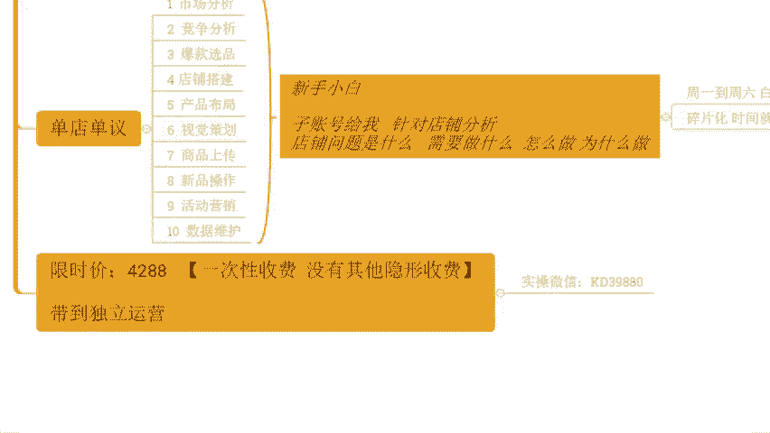

# 【拼多多运营实操教程】最系统的零基础拼多多开店教程全套，电商运营大佬专为学渣研制的新手开店保姆级教程！全程干货，简单粗暴 - P58：58、拼多多开店-新手商家突围实操 - -拼多多开店 - BV1BH1qYpEqw

Hello， hello hello。😊。

呃，这下面啊，这边所有的在直播间小伙伴们能够清楚的听到我的声音，能够看到我这边电脑桌面的话啊，声音后面如果说都没问题呢，公屏上来扣一个小一，好吧。来动作快啊。声音光盘都没问题吧。啊，如果说是有这种。

听不到声音的。或者是看不到画面的。退出重进啊。抓紧时间啊，正式分享呢在两点钟开始啊，还有几分钟时间啊。那么顺便呢我们可以一起等一等那些还在路上的小伙伴们，好吧。嗯。都没问题吧。😡，okK啊。

没问题就行啊没问题就行。😊，OK啊呃，今天的话啊分享的内容呢是我们整体运营的一个思维啊。那么也希望大家能够去有所提高吧，好不好？呃，但是呢在开播之前，在正式分享之前呢，还是老规矩啊，先讲一讲啊。

那么我们直播间的一些小规矩，对不对？那对于我们整个的店铺操作来讲的话，其实大家问题很多，这个我知道啊啊中午好中午好中午好。那么呃但是针对到这些问题呢，我们一定要有到一个正确的态度去对待啊。

包括说像你们来到直播间听我分享一样的对不对我们也需要有到一个正确的态度啊。所以说有一点呢，希望大家能够配合我一下啊，那么首先这一点呢就是说大家能够在直播间里面呢做到一个点，就是积极互动。

那当我在跟大家确认对不对？能不能听明白，能不能听懂的时候，当我分享完一个知识点之后，跟大家确认是否能够理解的时候，大家记得第一时间告诉我，对吧？如果说你能够听明白，记得扣一回复我好不好？

因为如果说你不讲的话，我是不清楚你的状态的。那你可能没有听明白。但是我以为你懂了，那么这个就很恐怖，对不对？那后期更多的内容，那你就完全没有办法去吸收理解，这样子的话啊，整个的逻辑不连贯的话。

你就没法去操作，那换句话说呢，你整个听我直播分享这个时间呢就浪费掉了，就完全没有意义，好不好？所以说希望大家能够去做积极互动，那么给我讲清楚你们的一个状态，对吧？

包括说啊在我问大家一些这个呃店铺运营方面的问题的时候呢，也能够去积极的响应，能够去跟上操作思路去思考，好不好？那么呃带上问题去。思考呢也够让让大家能够有到更好的吸收，更好的理解啊。所以这点的话很重要啊。

那么除了这个点之外呢，另外还有一点啊，就是在我们整个的直播过程中呢，我也知道啊，大家可能会有到各种各样的一些问题，对吧？那么如果说当前你有疑问，想要去了解，想要去跟我们咨询沟通的话，没关系，可以提问。

但是各位注意了啊，在直播间里面问题仅限当前内容。相关的啊，这一点的话，希望大家能够注意到啊，如果说你是一些其他不相关的内容呢，我们啊尽可能的把它给先记录下来啊。等到我正式的容分享完之后。

或者是等我下播之后，你单独问我都是可以的。因为在直播间里面的话，其实说白了人说多不说说少不少，对不对？如果说每一个人问一个问题，我花个一分时间去解答的话，那可能我们整个这个直播时间是不够用的。

本身平时我带时操嘛也都比较忙一点啊，大家都知道的，直播呢也都是抽时间挤出来的，对不对？所以我希望的是我们这个时间呢能够有到更加高效的一个这个节奏啊，能够去帮大家去了解到更多东西啊，那么这是第二个点啊。

那还有到第三个点也是最重要的一个点啊。如果说在我整个分享之后，确实你听明白，听懂我讲的内容了。然后整个这个内容呢，也确实。适合你店铺，并且是你店铺没有做到位的地方，一定要去实操。啊，一定要去实操啊。

你不去做再好的方法都等于0。这个东西其实道理很简单，应该也不用我去多解释对吧？大家都很清楚的。所以说店铺操作呢，我一直强调一个事情就是什么呢？是我们自己做出来的，而不是说听出来的。

或者是呃这个看视频看出来的，好吧，所以这点很关键啊，ok了啊，呃，几个注意事项，如果说。都没问题。现在呢可以公屏上扣个小一好不好？我们来确认一下啊，三个点啊三个点啊呃应该也都很好理解的。

那么包括像我们今天呢有看到很多的这个这个熟悉的面孔啊，也有看到一些这个呃新进来的一些小伙伴们啊。那没关系啊，今天的分享的话，我也希望是能够去有到呃更加多的分享的内容能够帮到大家啊，我先做一个调研吧。

好不好？我先做一个调研吧。呃，那目前啊在直播间的小伙伴是还没有开店的啊，只是准备开店，还没有开店的，或者是刚开始开店，对做店铺一点都不了解的，完全没有思路的，这种可以扣一个零好不好？那同样的已经开店的。

开了一段时间，自己对店铺操作呢有一定的了解的啊，或者自己的还是懂一部分内容的，可以打一个6啊，我看看你们的情况里面的基础啊，那了解清楚这个东西呢也方便我们后面进行一个分享。😊，啊，好不好？OK啊。

有小伙伴呢是还没有开店啊，准备开店或者是刚开始接触的啊。那么有一部分小伙伴呢是已经开始坐店了，也有到一定的呃认知跟经验了啊，没问题啊，没问题。那大概我知道了呃，不管你们是已经开店的。还是没有开店的啊。

都没关系。那今天这个内容呢，我相信啊对你们所有人都是有帮助的啊，好不好？所以等一会儿的话，如果说哪里不清楚的地方呢，一定要记得多沟通，好不好？保持这个呃积极的一个互动状态。

能够有到一个更加好的一个一个状态来沟通的话，我觉得呃那么对于你来说对于我来说，我们都能够啊非常舒服的完成这一场直播，好吧？O呃，时间呢还有这个一分多钟啊，开始到我们这个两点钟正式开始的时间了啊。

那在整个店铺操作过程中的话，大家可能会有很多很多的问题，这个我建议提到过，对吧？但是呢在操作的时候呢，很多小伙伴啊，其实整个的店铺运营呢是处于一个。怎么说呢？完全是躺平的一个状态。

甚至是一个比较迷茫的状态，对不对？那么今天的话，所以说第一个话题呢也是由一个问题展开的啊，包括像你们可多小伙伴是已经开店的，也有小伙伴是可能还没开店的，对不对？那么这个时候呢。

我希望大家认真思考一个问题啊，认真思考啊，这个问题我希望大家能够认真对待啊呃，有的小伙伴可能是关注的时间比较长，可能也有呃了解过这么一个问题，或者是有听我问过这么个问题，没关系啊。

那么今天的话一起把这个问题再过一遍，什么问题呢？就是。你们做拼多多是为了什么？好。这个问题我希望你们认真思考啊，因为这个问题很关键。😡，如果说你没有一个正确的认知。

如果说你对于做拼多多店铺没有一个明确的目标的话，其实很多时候你在后期很难去有到一个呃很好的或者是呃长时间的一坚持的。OK啊，然后这边我也要说赚钱，然后这个一韩文说是这个多一份收入，亚森说赚钱啊。

张峰说赚钱啊，然后这个他说打工人哭的想啊，穷的想哭啊，然后杰着说是这个啊想要去多一个扩展渠道啊OK。大概我这里到的哈。好，那么我不管你们是想要扩展渠道也好，还是说想挣钱也好，现在呢问题来了。各位。

那么既然说我们的目的很明确，我们想要通过做拼多多能够去赚到钱，能够去卖货，对吧？能够具有到一个更好的销售渠道啊，那么以你当前啊以你当前的能力，你认为。你能实现这个目标吗？你目前。能力足够吗？

OK这个问题思考一下，好不好？我相信应该都不能的对吧？但凡是能的话，应该也不会说来到我的直播间听我分享了，是不是？但是有一个问题很关键啊，有一个问题很关键啊，实体现在都干不下去了。其实怎么说呢？😊，嗯。

线下和线上呢目前的一个趋势肯定是要以这个线下和线场结合的形式来走的啊，那么这是未来的一个大趋势来的，而且线上经济呢是不可忽略的一个部分了，而且甚至占到了很大一部分的一个主体主要地位了啊。

所以这个是辩论结果拥抱变化嘛，才能够去得到未来，是不是这个1998啊，你这个1984年的这个出生年出生这个年份吗？啊，那应该是还比较年轻的啊，对吧？啊，看到你这个这个名地称啊，应该是出生年份吧。

如果是的话，应该是比较年轻的，应该还是能够去更好的接受的对吧？OK韩文说是的。哎，你这个家伙真的是啊谁的你这人大一岁啊，可以的可以的啊。好，那么刚刚我说到，那做拼多多，我们的目的是赚钱是卖货。

那你们的能力呢目前是不够的，对不对？但是呢很多时候我们在操作店铺的时候。😊，却会有一个非常大的bug。什么样的bug呢？OK今天我想做拼多多。这个就是你们目前的状态啊，我想做拼多多，然后呢，我自己。😡。

去找了所谓的干货，对吧？哎，我自己去看了视频啊，我自己去看了直播，对吧？然后自己在自己的认知里面也对拼多多进行了一定的了解，于是乎呢就去开了一个店铺。对吧。开完店之后呢，哎就想着说，那店铺开起来了。

我要去上传产品，我要去发布商品啊，就发布商品了。发布完商品之后呢，哎，我没有销量，没有排名，没有权重，那怎么办呢？我去做销量。我去做评价。啊，我去正式做推广。是不是到最后呢就会发现一个问题，哎。

我做了这个店铺呢，我一直在花钱。啊，我一直在花钱，但是呢店铺的数据。并没有。啊，并没有明显提升。哎，怎么老打错字啊？对吧并没有明显提升啊，不管是我们赚钱的目标也好，还是我们卖货的目标也好。

感觉都没有实现。Yeah。是不是来已经开店的小伙伴，你们目前是不是于这种状态啊？😡，已经开始操作店铺下伙班，是不是这种状态？应该大多数都是吧，可能有几个别目前来说是有一定的这个呃店铺数据，对不对？

然后呢，是有在实现盈利啊，有这种情况啊，但是应该大多数情况呢都是属于啊在处于亏损的状态。那么这里有什么样的一个bug呢？各位，如果说我今天想要去赚钱，如果说我今天想要去卖货。

那么有到一个前提条件是我能够让我的用户进来我的店铺，对不对？那想让我的店铺有访客，就需要我的店铺数据是处于一个比较优秀的状态，能够得到平台推荐。啊，用用软件计算RY这样会不会亏，这样子不会亏。

谁跟你讲的呀啊，谁跟你讲的呀，tm啊是这个呃是是是哎，另外一个叫什么来着？另外一个叫什么来着？你的你的好基友叫什么来着？哎，那个那个叫叫啥来着？😡，啊，那个那个动动漫的那个名字我一下忘了啊。

不重要不重要啊不重要。重要的是你这个说辞啊就有bug，你知道吧？首先一件事情啊呃这里我给你们提个醒啊，兄弟们有很多人做店铺都会选择去做这个付费推广，对不对？也都会想当然的去说，哎，我做好。😡。

我LOA的计算。我就能够去保证盈利，或者是我能够去做好啊不亏损的一个一个起码要求，是吧？啊，是不是？是不是？但是这里有一个bug啊。😡，我们做好的这所谓的RY的计算，只是我自己计算的结果。

你实际推广的数据能不能达到这个目标还是一个未知数。大多数人做付费推广，你的LI的差距是很大的。然后这里呢我也顺便问一嘴，有没有人是不知道RY是什么东西的。因为有很多小伙伴刚刚讲到说是还没有开店，对不对？

处于一个刚开始了解或者是正准备开店，或者是没有思路的一个状态。所以我先确认一下啊，RY是什么，大家知不知道？嗯，RY是什么，知不知道？呃，然后就说定价低了，亏钱卖的客户不会取消订单，现在违规呃。

赔付现在给了还要继续发货吗？不取消订单，现在违规，就超时发货呗，是这意思吧？😡，超时发货嘛是吧？超时发货的话，这个东西你还是要发货的，你要履行发货义务的。然后如果说你在超时发货之后三天不发货的话。

就会呈现出缺货。那么缺货呢还会再一次处罚你。那么呃延迟发货的这个赔款比例呢是最低，我记得不错的话，是3块钱。然后呃最高呢是这个呃是是是这个是多少钱呢？是呃反正是百分之。5%吧啊按照5%的标准。

然后最低3块钱啊，最高多少钱，我忘了啊，这个规则我忘了不重要啊不重要，重要的是什么呢？重要的是你很你会继续亏损啊。😡，啊。然后这个特们说哎是什么什么东么啊，这个东西啊LI啊。

这里我跟大家解释一下什么东西啊，是我们的投入产出品啊。好吧，是我们投入产出比啊。本来就没赚钱啊，还要赔钱啊，那真没办法，因为是你自己定价失误造导致的一个结果呀，是不是？😡，那如果说你没有定价师傅呢。

有人买了之后，你发不发货呢，你会发货，对吧？那如果说有人在你没有定价师傅的情况下，买了之后，你是不是能赚钱呢？是能赚钱的，对不对？所以说这个归根结底是你自己的问题，那么我们在做店铺之前。

我们在经营之前一定要去做好这种各种各样的一个计划，并且说有到一个明确的结果，我们要算出来的。包括说刚刚我们提到这个RI好吧？现在所有人思路跟上啊，包括说秋啊，思路跟上，你现在这个问题你就认罚就行了。

你不要想那么多，知道吧？这个钱赔的不多的，买个教训也好啊，买个教训也好啊，那么ROI是我们的投入产出比它是怎么计算的。这里我跟说一下，是由我们的啊这个成交额。去除以我们的花费啊。是这么来的。

是这么来的啊，那么这个地方呢我们在呃这个计算投产比的时候，怎么样去不怎么样去让我们这个计算结果，怎么样去让我们这RY不亏钱，是有公式的啊，在不考虑售后情况的这个这个这个时候啊，我们的RI的计算呢，是用。

一。啊，一啊注意是用一去除以毛利率。好吧，用一除以毛利率。比如说今天我的产品的毛利率是10%，那么用一除以10%，也就除以0。1。好吧。那最终呢我的RY就要做到10，我才不亏。

如果说我今天我的毛利率是百50%，用一除以0。5。那么我的LI呢做到二就不亏。各位能理解吧？但是我刚刚讲到一句话啊，它是这个计算方式呢，是在不考虑售后的情况之下。理解吗？什么叫不考虑收购呢？

如果说有人退换货，对吧？那么我们的成本是会增加的。如果说有人退货，那我们不仅会增加售后成本，还会去减少我的营业额。所以这个时候这一个计算方式，它只是在前期我们不计算售后的情况之下可以估算。

如果要计算售后的话，我们还得把售后的一个这个比例导出来进行计算。然后这一个嗯。那么啊，你的这个。你的这个呃RI，你目前的一个计算结果是多少呢？你可以说一下。你可以说一下啊，顺便帮你们把这一块普及一下吧。

因为你们很多人喜欢去做这个事情，对不对？上来去干推广啊，顺便帮你们普及一下啊，这个东西也是一个非常非常重要的点啊，大家可以认真听一下来。😊，你是直接用软件算的是吧？OK那你在软件算的时候。

你去你去计算了哪些东西呢？你可以说一下。😡，你计算的哪些东西呢？有有计算售后吗？😡，有计算售后吗？如果没有的话，都扯淡的啊，有计算售后是吧？OK啊，那还行啊，那还行啊。但是有一点就像我刚刚讲的。

即使说你计算了售后，你设置成了我们的考虑售后的1个ROI。那么你在实际推广过程中，还是以实际数据为准的。啊，还是以实际数据为准啊，但是有一个问题，各位我们在做这个整个的运营的时候。

有一个非常非常重要的一个点。如果说你前期直接去做了付费推广，会导致我们店铺在自然流的获取受到影响。好吧，给大家画一个图啊，这个东西的话呃我需要画个图给大家去展示一下啊，那你们理理解一下这个概念啊。

比如说现在啊各位看一下啊，我们的平台呢在产品进行运营的时候呢，有一条线啊，这一条线呢是我们产品获取到曝光的一个一个线啊，当我的产品能够啊把数据拉到这一条线之上的时候，我是能够能够去拿到曝光的啊。

那么前期我在发布商品的时候是什么样状态呢？比如说各位可以看一下，现在我画了一条绿色的线啊，画出一点吧啊，假如说一开始我发布商品的时候，平台针对到我的商品进行考核，对吧？抓取到我的商品数据。

其中呢我又去写标题啊，那么这一趴。是标题部分的数据啊，这一趴是标题部分的数据啊，等一下我还是整个一条画过来吧啊，我画完之后，我再给你们解释吧，这样子可能好理解一点啊，那可能是这样子的啊。好，O啊。

差不多这样子啊差不多这样子啊，我随便画了一下啊。那比如说这里这个部分呢，这个这个一个峰值的部分呢是我标题的权重，它还没有达到曝光的一个抓取条件，没有达到一个推荐的条件，对不对？

后面呢还会有到一些比如图片部分的啊，包括我们商品属性部分的，对不对？啊？产品的一个什么这个规格啊，包括我们商品的一个这个呃价格，对不对啊，各种各样东西啊，都会在这里面考核，那么这一趴呢。

比如说是我们产品的哎等一下我用这个箭头嘛，这一趴呢是我们产品的属性，这一趴是我们产品的价格啊，这两个板块我在一开始上架的时候呢，它是能够去拿到一定的推荐曝光啊。假如说这个样子啊，好不好？

现在我们只是假如当然也有可能你这个商品发布之后呢，是属于这么一个状态啊，就所有部分都能够达到一个考核标准，能够拿到曝光啊，这是最理想的状态。但是大部分时候呢，你只是某一些权重能够去。😊。

达到曝光是属于这种情况的啊。各位那么在这种情况的话啊，就会有到一个非常现实的问题。如果说今天我们的产品它的曝光就是属于这种情况。啊，如果说今天我们产品曝光就属于这种情况。

那么这里就有到一个非常大的一个问题。今天我去针对到这个商品做了付费推广。那么付费推广呢，它的曝光呢是针对到我们所有的维度来增加加权重的。换句话说呢，我们最终的结果是什么样子的？来，我再次给他画一下啊。

还是这一张图啊，还是这一张图，我们再给它画一下啊。那么这个时候我针对到这个产品呢，所有的维度都会往上拔高，对吧？哎，你样把它换的粗一点啊。哎，我会把这整体的数据呢拔高，对吧？拔高之后这个样子的。好。

OK蓝色这条线和绿色这条线呢，它们其实是一样的，对不对？只不过起点不同，各位没没问题吧，这个能看懂吧。这个蓝色的这条线和绿色的这条线其实都是我们商品。只不过呢一个是我一开始发布商品时有的一个状态。

一个是我去做付费推广之后的一个状态。😊，各位没问题，能看懂的话，公屏打个一好不好？动作快啊，确认因此啊确认因此。那么在这种情况之下，各位既然说这样的话就会存在一个非常大的问题。

就是我原本可以拿到自然推荐的一个曝光的位置呢，被我们的付费推广给覆盖掉了。前期本来我的数据就很少，对吧？前期呢数据少，那么曝光呢也很少，对不对？那这个时候被覆盖部分呢，这个就会导致一个问题，我们原本。

可以有自然曝光的，现在没有了。啊，现在没有了。原本我有自然暴光带来的自然访客。也没有了。原本带来资然访客之后产生的点击啊产生的点击率。产生的收藏产生的转化等等，这些数据也都被被付费给覆盖掉。

那么换句话说呢，所有数据都会成为付费的数据。这个时候就有一个问题，你的自然访客没有你的自然访客产生的数据没有。那么自然权重考核的时候。你就不达标。各位，这个逻辑现在通了，没问题的话，公屏上打一个6好吧。

这个逻辑现在是能够通了的话，公屏打个6。所以说这种情况之下，我们去做的话，如果你上来去做付费推广的话，肯定会导致一个问题。就是首先付费会强调你的自然流量。其实还有一个很严重的问题，就是什么呢？

就是平台会给我们店铺打上一个付费的标签。那么他在进行产品推荐的时候，在针对到有付费标签的店铺的时候，那么他就会减少推广，减少这个推荐。因为他知道你会花钱，你有钱花，你有是吧？你有钱花啊能够。做广告，哎。

他能够在你这里赚到钱，好吧，那开了一段时间可以停吗？开了一段时间，如果说这里啊我也说一下，不要盲目的去停啊，我们很多时候要具体情况具体分析。呃，比如说上午开始呃有这种玩法啊有这种玩法啊，有这种玩法呃。

就是我们烧的时候呢啊烧一个精准的这个人群，对吧？那么能够去拉高我们的转化，拉高我们的投产，那么只烧早上烧凌晨或者是烧我们这个呃某一个时间段啊。

那另外时间段呢通过付费的方式烧出来的这个人群呢来引流到我们店铺，但是前提条件是什么呢？你这种烧法，你必须。计划权重高。能够有很好的点击率转化率，不然的话啊你烧再多都等于你。包括像我们正常来说。

哪怕你不去说烧一段时间再停掉去，你正常去烧，你连着去烧。这里不是说你烧了付费推广，你的权重就高的。有的时候你烧的越多，付费推广，你的权重越低。什么时候呢？就是数据差的时候。😡，如果说你在做付费推广。

对不对？你的点击率很差。你的转化率很差？😡，啊，我们别的题就不说了，我们就是这两个数据好了，对不对？那么不管你是做的自然流也好，不管你做的是付费也好，对吧？无所谓，但凡是你这两个数据差，平台都会认为你。

😡，流量承接能力弱。用户不喜欢刘三品。那么就会导致什么呢？你后期第一个没有推荐群重。第二个，你的推广越来越难烧，你的出价越来越高，你的客费越来越高，你的曝光越来越少。各位有没有遇到这种情况的？

我一开始的时候，比如说我这个投产啊，我一开始投产我就设到这个十啊，设到设到这个十，哎，我还有数据。但是烧了一段时间之后，我头产受到5。哎，我发现我都没曝光啊。😡，有没有这种情况？啊，各位。

你们有没有这种情况的啊，就类似前期你可能烧的很高的一个投产都能够拿到数据的。但是后期呢你发现投产射的很低，你的时你都烧不动。😡，你的出价啊，你的这个呃点击单价对吧？原本可能只有1块钱。

后期你可能点一次要5块钱，你都烧不出去。😡，对吧应该有吧，如果说你们是有做付妇的，应该有的啊。然后就就说哎转化确实很差，1。24okK那你这种数据的话其实很难搞的。我给你看一下啊，我自己带实超的店铺。

他们的转化率好吧好。😡，来。😊，有看到吗？来。17。21啊17。21自然流啊自然流啊自然流对不对？来这一个。这个啊21。19啊占流啊占流。所以说你想要去做店铺的话，那么你一定要把这些数据给它做出来。

这些数据做出来，不是我们靠嘴说的，也不是说我们去靠推广靠活动或者怎么样的，而是需要一个完整的运营体系的，对不对？那么刚刚我之所以会跟你们讲这么多扯这么多闲篇，对吧？说了这么多。

这个你们可能觉得没有用的东西，但是实际上呢是为了帮你们去梳理思路，对不对？那我们在运营的时候，如果说我们有到一个明确的目标，我们就需要去拆解这个目标，去为了这个实现这个目标去努力，对不对？

你们想要通过做拼多多赚钱。你们想要通过拼多多去卖货，那我们就要有到一个清晰的目标，我要赚多少钱，我要卖多少货。啊。呃，客单价基本1000以上120啊，1000以上是不是？

虽然说1000以上的这种客单价我没有那么高的转化率，对吧？带实操的小伙伴，但是转化率绝对比你高，我给你找一个啊，我给你找一个也是跟着实操的小伙伴扣个三档啊，好不好？我给你找一个啊，让你看一看，好吧。😡。

来。😊，呃，3400的客单价。3400的客单价6。67的等化率。啊，340的客单价6。67总合率一天的话是200多单啊，一天200多单。😡，来，高客单嘛，对不对？你说哎你这个低客单转化率高正常。

那高客单呢高客单一样转化率高可以高啊，只不过可能说没有低客单那么变态啊，但是这个客单价这个转化率其实已经很变态了，是不是？各位嗯这个没有意义吧，这这点认可吧？这个客单价真的这个转化率已经很很很不错了啊。

😊，对吧。所以说整个操作店铺的话，其实方式方法很重要啊方式方法很重要啊。那我们刚刚讲到的是什么呢？你要去赚钱，你要去卖货，你要有到一个清晰的目标，你要去拆解你的目标，对不对？

那么如果说今天就像这个店铺一样吧啊，打个比方，我想要去一天卖个30千单啊，我想要去一天营业额做到个8万啊，能够赚个一两万块钱，对吧？打个比方，那我们怎么去实现它。😡，啊。这个是很关键的一个点。

哎呦喂Y2高客单低客单只要是有市场，只要是有需求，那么你都能去做啊。这个东西其实有的时候你们就认知发生了一些偏差。你们就很多人觉得哎拼多多就只能是低价产品。对吧注意啊，低价低这个低和高二啊，低和高2。

😡，他是相对的。对不对？我这个产品别人在其他平台上卖5000块钱，我在拼多多卖3000，他难道不是低价吗？能懂吗？啊，当然我只是打个比方，肯定没这么变态啊，有差个几千块钱，这个有点有点过分了啊，对不对？

但是这个是这么个逻辑啊，那么这个产品在别的平台上都有市场，在拼多多，如果说是有人去看呢？那么它就是有市场的，那么有人看有人卖，那么它就是一个很好的生意，是不是？能理解吧？所以这么个逻辑啊。

你不要去纠结说，哎，为什么说你们这么高的可能价在玩拼多多。😡，这个不是一个好问题啊这个不是一个好问题。那么呃继续啊继续。那我们针对到整个店铺操作来讲的话，对不对？刚刚我提到的说是我们要拆解目标。

就像这个店铺一样啊，那我们要去做好一个销售数据，我们要怎么拆解它呢？嗯，今天你们做的产品是什么？你们有没有想过你的经营的目标是什么？来公屏上发一下好不好？来各位动作快啊，你自己经营的产品是什么？😊。

Okay。对啊比如说我卖呃这个女装的，我卖连衣裙的，okK我就把连衣裙打出来啊。连衣裙我希望我一天卖10千0单啊，或者呃我一天这个营业额能够做到这个呃100万，对吧？😊，是不是哎，我这个产品呢。

我希望能够达到这么一个销售数据。好，那么你们可以发出来，好吧，可以发出来啊，我们一起来把这个目标拆解拆解，给大家分享一下啊。😊，OK跟是说是做这个冰柜的，然后你家是做中性笔的，也有家用的是吧？OK啊。

不管你是家用还是商用的，其实我觉得好的啊啊，冰柜这个东西刚好我之前是有有带过的一个哥们啊，就是说冰柜的来，我给你找一下啊，但是没那么高抗单价啊。这个我实话实说啊呃，冰柜这个产品。呃。

没有你你没有你说的这个没有刚刚这个300多那么高啊，没有刚刚你说的300多那么高啊啊，这个店铺的话，均价也差不多也是1400多啊。这个店铺做冰柜的这个店铺做冰柜的啊，均价的话1400多啊。

均价1400多但是它普遍的一些产品的话，就是一些低配的产品的话，价格其实低一点的啊，这个可能是因为有一些高客单的产品拉上去的啊，这个我也实话实讲啊，这个我也实话实讲，所以O的啊，O的啊。

就冰柜这个东西也没问题的呀，对吧？一天600多，但也可以的，然后这个就说做工具的电锯啊，然后这个张东说哎我做这个延迟啊，对吧？啊，100单能够赚能够去做4000块的营业额啊O啊。😊，呃。

那么大概我知道了是吧？但是呢你们很多小伙伴是没有把你们具体的数据说出来，只是说了一个产品啊。那我们就说这个这个延迟吧啊，我们就说张峰的这个延迟吧，好不好？那么他呢呃希望的是一天能够去做到100单啊。

这个营业额呢4000块钱。呃，东风，我想我想问你一句啊，我想问一句，你的客单价40，对吧？那你的毛利率有多少？这个问题很重要啊这个问题很重要啊，你的毛利率多少？30%啊30%呃，那呃换句话说。

我来算一下吧哈，我来我来我来算一下，我们严谨一点啊，我们严谨一点。这是我们严谨一点，我就不指望你们算了啊，你们算的时候有的时候真的是很很很坑啊。那么呃30%的话，那么相当于一单呢就是12块钱，对吧？😊。

一单就12块钱的一个一个毛利啊，12块钱一个毛利啊。OK好，各位现在啊现在啊大家认真听啊，注意了啊，注意了，这个问题很关键啊，我们现在店铺呢希望一天能够出100单能够做到4000的营业额。

那同时呢我们一单的毛利呢有12块钱，对不对？30%啊。😊，好。各位。那么我想问大家。这个店铺如果真的做到一天卖100单，一单有12的毛利的话，那么张峰一天真正的盈利有多少？或者是怎么去计算他的盈利。😡。

这个问题很重要，这也是你们大多数人做电商最后亏本的根本。你们就说怎么计算吧啊，你们就说怎么计算吧。😡，金额你们肯定是算不出来的，这个这个肯定算不出来，对吧？但凡有人能算出金额，绝对是扯淡的啊。

张峰说1200扯淡啊。😡，不知道吗？😡，不知道吗？啊，金额你们就不用算了，你们就说算法就可以了啊，你们就说算法就可以了啊。😡，然后这个Y要说不超过300啊。

然后这个呃这个S啊美元符号说是这个TB120啊，肯定是TB120的啊，这个肯定的啊这肯定的。啊，感觉你们你们这个这个。😊，思路还是没打开呀啊，亚神说600啊600。😡，ok啊。😊，我直接接介绍答案吧。

不不等你们了啊，不等你们了。那如果说我今天我希望我能够一天卖100单啊，卖100单，对不对？做到4000的营业额，我的一单的毛利是12块钱的话，兄弟们记住了，毛利不等于盈利的部分。😡，一定记住了。

毛利不等于盈利的部分。我们哪怕不考虑售后问题，听清楚没有？我们哪怕不考虑售后问题，它也不等于我们店铺的盈利。可能这个逻辑大家觉得会会会比较绕，对不对？我就说我就举一个最简单的例子，好不好？来，张峰。

假如说你现在。😡，去找一份工作。你觉得一个月能拿到多少的工资？6000啊，那么6000呢一天的平均来算的话，就是200喽，对吧？一天平均来算就200喽。没错吧。那么。😡，这个部分就是你的人工成本。

所以这一部分其实是你要去计算的成本部分的。如果说你今天还找了你的家人帮忙，找了你的朋友帮忙，okK那么这里还会有额外的支出。哪怕你没有给钱，但是我们计算需要这样去计算，理解吧？😡。

不然你的人工成本你是没有计算的。所以很多人做店铺的话，就想着说哎，我一天店铺能够赚个三五百块钱，我觉得挺好的，就跟我打工一样，就跟我上班一样了，我觉得挺舒服的。实际上并不是。对，人工成本啊，这个很关键。

那么okK这一趴我们就先不用去纠结它啊，你们知道怎么去算就可以了，你们知道需要计算就可以了啊。那重点来了，如果说今天我希望我能够去做到一天100单，那么这100单。😊，怎么实现？

这个是我们每个人必须去学会思考的问题。如果说你不做呃不去思考这个问题的话，你坐垫一定是迷茫的。你们很多人坐店子话就是处于一个状态，什么呢？每天得过且过，不知道干什么，无所事事。😡，感觉自己很努力。

感觉自己很用心，但是每天真的不知道做什么，不知道去怎么办，没有发力点，有没有这种情况，有的话公屏打一。😡，每天很早就起来了，打开电脑之后一看，哎呦。😡，我今天要干什么？这个东西怎么办？

这个东西那个东西怎么办？我今天是不是要上传的产品，我是不是要去做点评价，做点销量。我要不要去上点新的链接，我要不要去什么报报活动？😡，每天都在纠结犹豫你们去徘徊等待。😡，大部分新手都这样子的。

如果说你是属于这种情况的话，ok那我告诉你，你就是在这个问题上没有去理清楚，没有去搞顺他，对不对？既然说我已经清楚知道了，我一天希望我达成的订单是100单，那么这100单，我需要通过什么样的产品。

来实现它。那么我能够经营的产品有哪些？那么这些产品里面哪一个产品是有到更好的市场体量？是吧有到更好的市场体量。有着更好的竞争力。这些东西我们得搞清楚。

然后我们才需要针对性的着重的去针对到它这部分产品重点运营。并且我们要去计算出来，那我实现这100单的时候，我这每个链接要分摊的单量比例是什么样子的？至少我要有一个我要有个计划，对吧？

比如说今天我上传了5个链接。那么这5个链接里面其中有两个啊。8。和B这两个链接呢是市场体量很大的。而且呢整个经营状态的话，我跟同行对比来讲，我是有足够优势的。那么他们就要作为我的主推款，对不对？然后呢。

还有C。第一这三个链接呢，可能跟同行对比来说，我没有什么太大的明显优势，对不对？只不过它可能整个市场体量也是不错的。那么他们就是作为我的辅推款，而这两个产品一定要去承担80%的销售任务。

那么在80%的呢，换句话说，每个产品起码要43。😡，那么这40单的单量对吧？那我再往外反推，它需要多少的反客？啊，那么这个访客量是否合理？这个单量要求是否合理，那我的转化率多少。

我们去把它做一个估算之后，反推出来。反推出来之后，我通过什么样的方式来获取到这些访客。对吧如果说今天我的转化率有10%。😡，那么我的访客就需要400个。

是不是啊目前你们很多人做店铺觉得哎呦这个真的很麻烦很难呢。😡，这些东西你想过没有？来，兄弟们，这些东西你们想过吗？你们有去做过这样的一个规划，或者是一个思维的梳理吗？有的话公屏上打个6好不好？

没有的打一个零啊，没有的打一个0。😡，来动作快啊，所有人动起来啊，所有人动起来好吧，如果你没有做过这种东西，公屏打一个0。如果说你有做过打一个6。😡，OK啊，目前给到我反馈的都没有做。啊。

目前给了我反馈的都没有做。那么问题来了，兄弟们，凭什么你赚钱呢？凭什么你能把货卖出去呢？啊，凭什么？比运气。嗯。😊，有运气吗？做电商是做做什么？做生意，做生意，你说你凭运气，那我觉得就多少有点不靠谱了。

各位。😡，是不是这个意思啊，能认能理解吧，能认能能认可这个逻辑吧。😡，所以说这个东西就是一个非常现实的问题。我们很多人做电商做生意，你连做生意的逻辑都没搞清楚，你只是在一厢情愿去做这个事情而已。

想当然的在做，那你怎么能做好？😡，所以我希望今天在我直播间的小伙伴们，以后你再去做店铺的时候，包括说现在你下直播之后，你先去认真思考一下你的销售任务，你应该怎么去实现它，你怎么去拆分你的目标？

怎么去做你的规划？那我们的整个的访客来源对不对？怎么去得到它啊。是不是这堆你搞清楚，当然你说哎楼，那你说了这么多也没用啊，我是我可以去梳理我也去想，我想到了，哎，你按照你这个算法去算。

我也能算出来我每个产品我需要多少访客，但是我怎么去做，这个我不知道，对吧？我怎么去实现这个反客目标，我不知道，没关系啊，如果说你真的是想要好好长期做店的，你确实自己不清楚，不懂的，有条件的话。

可以跟着实操，我带着你去做，对吧？怎么去做市场分析，怎么去做产品分析，怎么去做精品分析，怎么去做我们产品的定位，这通通的我带着你去实操，让你去少走弯路。😡，对吧就可以，好吧。当然呢这个东西呢。

今天我也会给你们讲到一些操作玩法，好不好？那么呃这一趴的话啊，重点来了啊，兄弟们这一趴的话重点来了啊，所有人注意力集中。如果说你今天真的是很想去了解到店铺操作的方法的话，那么这一趴一定要注意。

因为这个东西你们在别的地方一定是听不到的。😊，啊，目前我现在准备给大家分享这一部分，你们在外面其他地方一定是听不到的。哪怕你去花钱，你去你去你去这一个呃买什么所谓的那些呃这个培训班的课程你都听不到啊。

带理人什么模式？呃，就是啊代理人是实操啊，是实操模式啊，是你把指照给到我这边，我针对到你的店铺，带着你去分析，告诉你店铺的问题是什么怎么做，为什么做理解吧？这么情况的啊，当然这个不着急，可以先认真听啊。

可以先认真听啊，先认真听，那么我们把整个的内容，你先听完，那么你觉得确实啊你对这个实操感兴趣。好吧好？一会儿呢我会给大家详细讲解关于实操各方面的一些内容啊啊，方式方法方面的东西，对吧？

都会给你们讲清楚的，有兴趣呢，到时候可以直接找我啊，都没问题的，好不好？那么来啊，现在所有人有在认真听的公屏上溜走一波啊，现在所有人有在认真听的公屏上溜走一波。OK啊。😊，那么这一趴一定给我认真听。

如果说我现在讲的时候你没有听明白，你没有听懂，马上提出来，我马上解释。你不要说憋憋在心里面啊，但凡是你说你现在不提问，你下播之后再问我这个问题，抱歉，我一概不认识，我一概不回答。😡，知道吧？

因为这一趴我反复强调了，它很重要。你如果说该有的态度你都没拿出来的话，对不对？那抱歉了啊。对吧那只能说声抱歉，我没办法了啊。OK那么这个东西是什么呢？各位我们在做店铺的时候。

刚刚不是已经学会了去如何梳理拆分我们的目标吗？当我拆封完目标之后，我要去实现我们的访客获取啊，对不对？那访客怎么获取的？这个是核心，这个也是你们很多人现在纠结的一个点。哎，西楼，我的店铺没有访客。

怎么办呢，是吧？😊，是不是你们很多人喜欢问我这个问题，对不对？那么现在注意了啊，访客没有的话，那我们就要去梳理访客的来源，去把整个流量来源打开。那么流量来源是哪些呢？在我们产品的这个搜索对吧？

在我们的商品的这个活动页。啊。像我们的这个推荐页。像我们的这个啊付费推广。对不对？这些都是我们的流量人员。那么我们在做的时候，刚刚我们提到了，对不对？付费这一趴我们直接不考虑的，对吧？

付费这一趴我们直接不考虑的，而活动页推荐页这个其实都要考量到我们的商品数据的。😡，是不是在前期我们产品上架之后去进行运营的话，你不可能有太好的商品数据。你说西楼怎么不有呢？我上来我去做销量书评价呀。

抱歉啊，你做的数据。😡，Okay。大部分。过滤的。没错吧，拼多多为什么说没有像淘宝那样子呃，打击？😡，人工操作打击刷单，对吧？就是因为它的过滤机制把这所有无效数据都过滤掉了，他不怕你去做。

而且他把你养肥了之后，直接给你来个冻结保证金，冻结货款，冻结了99年，知道吧？猪嘛养肥了再杀，就这意思。所以说你们如果说去想着前期上来就去大量的通过一些所谓的刷单，所谓的补单去操作店铺的话。

那一定是不对的。啊，我们一定要控制好这个数据，尽可能的小能最小再做到更小，让这个数据呢存存在着一个比较安全的状态，保证我们的一个数据的有效性的同时能够去快速提高权重，这个很关键。那么怎么做呢？

搜索端口这里就出来了，对不对？活动端口跟这个推荐跟我们讲嘛，要数据嘛啊，因为9999年还还算是还算是正常的啦。我之前见过。我之前是最早的时候啊，118年的时候吧，18年的时候，我见过一个哥们啊。

那个那个那个东西我我都不知道是怎么回事啊，我不知道是他给我那个图片是有有什么截图出现出现错误，还是怎么回事啊，那个不是99年啊，那个是到2999年啊。😡，差不多一个状态吧啊啊OK啊，那我们继续往下啊。

注意力集中了啊。各位我现在问大家一个问题，那既然说我们想要去做搜索的话，什么样的东西最重要？搜索里面什么东西最重要。😊，啊，在搜索什么最重要。或者搜索是以什么为核心的这个问题，大家把答案发公屏上啊。😡。

搜索。一。什么为核心？OK就是说标题，然后你加说关键词啊，后面都说关键词OK啊，不错啊不错啊。所以说嘛其实你们很多时候呢，你们没有你们想象的那么弱，对吧？你们还是有自己的一些想法的。

只要稍微有人点播一下，还是能够快速的上报的，对不对？你看啊之前你们很多人都说像张峰，我记得的啊，你说你是没基础的，打了个零的，对不对？你还没有开店，你说你是零基础。😊，但是当我一点播的时候。

你也可以快速的给到我一个答案呢。关键词我觉得这个就不错的啊，我觉得这个就不错的，对不对？所以你们很多时候没有你们想象的那么弱，只不过你们缺乏一个完整的操作思路。你们所了解到的东西呢都是一些碎片化的东西。

😡，那他不成体系。所以你们在操作店铺的时候呢，才会说啊感觉不知道怎么做。啊，不知道啊怎么做。还会什么迷茫，对不对？😡，那么但凡是有人能够点播你，我觉得也能快速上当的嘛，对不对？

这也是为什么很多小伙伴选择跟我实操的原因嘛，对吧？那既然说关键词是核心。😡，那么我们现在就来模拟一下整个关键词对我们产品排名对搜索排名的影响，好不好？OK现在呢有人来进行了关键词的搜索。啊。

搜索的关键词呢。比如是关键词A好不好？那这个时候呢是我们的买家啊，我们的买家啊，他来到拼多多平台，他搜索了关键词A搜索关键词A的时候，这个时候我们的平台就会根据这个关键词啊，根据这个关键词来进行。

进行商品的抓取。没错吧，抓取到跟这个关键词所有匹配的产品。是不是这个逻辑应该很好理解的。那么在这个基础之上呢，匹配完成之后会进行我们商品的一个排序，对吧？是不是会进行商品的排序。那么这个排序各位。

根据什么来的？大家把思路再一次往后延展啊，再一次跟着这个节奏来啊。那现在呢平台抓取了这个关键词了，要针对到我们的商品进行排序，它根据什么样东西来排序？如果说不知道答案的打问号。如果说是有自己有想法的。

有知道一些答案的啊，可以发在公屏上动作快。OK销量评价数据啊，这是你们说的答案啊，销量。😊，评价。数据。OK还有这个访客量啊访客量，然后呃人气。成交额。嗯，还有吗？还有吗？还有没要补充的？😡。

还有不要补充的？没有了是吧？OK啊，你们说的答案呢，我不能说你们说的答案错的，但是不够完整。这也是为什么我讲你们的所谓的知识是有的，但是是碎片化的原因。

你们所有的逻辑呢其实都是建立在你自己所了解到的一个比较片面的状态。😡，所以这也是为什么你们做店铺做不起来的原因，知道吧？你们缺少一个整体的一个认知。那对于我们店铺的商品进行排序的话。

它其实是分为两个考核板块的，一个是商品。😡，一个是我们的店铺。也就是我们平时讲到的商品权重，店铺权重知道吧？那么商品权重呢，就包含你们刚刚讲到的那些什么呃销量啊，对吧？评价呀。啊。

包括说我们所谓的这个销售额呀，对吧？也是我们成交额呀，对不对啊，包括还有我们的转化率呀。包括我们的UV价值啊。对吧。😡，收藏率呀。等等啊，这些乱七八糟的东西啊。

那么店铺群众呢就包含了我们店铺的这个层级啊啊层级啊层级。我们店铺的这个DSR。啊，我们店铺的这个30天的投诉率。我们30天的这个呃物流服务异常率。啊，等等啊，各种各样的数据啊，都在这里面啊。

这里我就不去写完了啊，写完也没有没没什么太大意义。但是有一个点啊，注意了，它是优先考核商品权重，商品权重高的，优先展示。如果商品权重相同，才会去考核店铺权重。各位能明白吧？比如说现在呢我们有两个商品啊。

一个商品呢，它商品权重分100分啊，打个比方啊，另外一个商品呢商品权重分也是100分。这个时候他们俩相同的情况之下，才会去考核店铺权重。其中呢一个店铺的店铺权重呢只有10分。

另外一个店铺权重呢有100分啊，那么这个时候呢，这一个啊100分的商品权重加100分的店铺权重会优先展示。但是如果说今天有一个产品，它的商品权重100分，另外一个店铺商品权重呢只有80分。

哪怕他们两个在一起进行比较，另外一个它只要是有店铺权重，它只要没有被屏蔽，它仍然是优先展示的啊，那么这个100分加10分，虽然说总分只有110分，它也会比这个180分要权重更高，排名更少前。

各位这个逻辑能够明白的话，现在公屏打一。😊，这个100分和80分，他们进行对标，考核完之后，优先展示的结果排名出来才会去考核下一步。OK啊，那么现在问题来了啊，现在问题来了。那我们进行产品排名的时候。

除了会进行这些数据的计算之外，是不是又没有办法得到一个更多数据了呀？是不是就没有办法得到一个更好的展示机会呢？并不是在我们商品的展示页面上呢，除了这些东西之外，进行这个算这个计算的这个排名之外呢。

还会有到推荐位。啊，这个推荐位呢是新品推荐位。啊，这个推荐位是新品推荐位啊呃，打开拼多多给大家看一下吧不，我打开拼多多给大家看一下你们在拼多多里面有没有看到过那种就是啊没有销量，没有评价的。

但是排名很高前的产品有没有？😡，有没有？😡，呃，我们来说一个关键词吧，比如说凉席好吧，最近这个天气已经热了啊，我们来说说凉席吧啊，你们有没有看到关键种产品，就是呃这个排名很靠前，但是又没有什么销量。

又没有评价，又不是广告位的，有的话打个有字啊，没有的话打个没有，好不好？😊，那反正这个呃小程序里面是看不到这种产品的，基本上啊就是通过微信小程序进来是看不到的。基本上啊。

但是你们在别的渠道APP端口应该是能看到的啊。OK秋是有看到过，对吧？好，来，这个是我们的商品的搜索结果页啊，这个是商品的搜索结果页啊。😊，等一下，我把这个搞我把这个放小一点啊，我把这个唉说不小了吗？

😊，哎，我我还说把它缩小一点，这个展示的位置稍微多一点点的啊，缩不小了啊这个。对，有很少很少肯定的肯定很少的啊啊来。😊，啊，我我就这么这么截个图吧啊我就这么截个图吧啊，这个是我们产品的搜索结果页啊。

大家能应该能看到的啊来。那么在这个搜索结果页里面呢，它实际上是有新品推荐位的。比如说它会随机的针对到一部分人进行一个商品推荐。那么这个商品推荐呢，比如说第一个位置呢是我们的这个热销商品，畅销榜的商品。

对不对？这个位置呢可能是我们的广告位啊，这边是有个广告字样的啊。第三个商品呢可能是我们的这个历史记录的一个展示位置，后面呢可能会有到一些高这个呃权重的啊高评分的啊啊。

然后呢会有到一个高转化的商品等等这种方式排序下来进行这个刚刚讲的这些数据的计算啊，对不对？然后呢，它在隔了一定的数量的位置之后呢，会有到一个位置空出来。它不会进行这个权重计算的一个考核。

这个位置空出来干嘛呢？给到新品进推荐的。因为平台希望呢我们的新商品呢能够有到更多的曝光机会，能够筛选出一些优质的新商品来给到我们用户更好的购物体验，而不至于被那些所谓的高效的商品把市场垄断掉，知道吧？

所以这种时候我们上传商品之后呢，新商品前期的曝光，就是从这种位置产产生的。那么当它在这个位置产生之后呢，我们能够去有到好的。好的，点击率。啊，好的，点击率好的，转化率的话，OK那么你的权重就不会太低。

所以说我们在一开始做产品上传的时候，一定要做好图片策划。当然图片策化这个东西我讲真的，我专门去讲的话，我讲一天都讲不完。😡，所以这个点的话，你们自己心里面有个数就可以了。

我没有办法通过很短的时间给大家讲清楚。因为这个涉及到很多东西啊，包括我们自己产品的这个呃卖点的体验，包括说我们用户的需求的一个呃获取，包括我们用户的一些痛点的一个这个一个一个分析是吧？等等。

还有竞争对手的分析啊，包括说我们的文案策划视觉策划，它都是属于这一个板块的。所以这个东西很多，你们只要只要自己知道就可以了啊。这个东西没办法去跟他么快速的讲解清楚。但是有一个点是我们可以去做到位的。

各位什么一个点呢？来刚刚我不是说了一个词吗？我说了一个词凉席各位。😊，来，如果说今天我要去买凉席，我会不会收凉席啊？😡，各位，或者是你们自己你要想去买凉席，你会不会收凉席呢？会的话，公屏打个一好不好？

动动快。如果说今天你要去收凉席，你会不会你要去买凉席，你会不会去收凉席？😡，如果会的话，公屏打个一。好，现在问题来了啊，注意看啊注意看。那么当我们输入凉席的时候，实际上是会有到很多的下拉框的关键词的。

对不对？各位没毛病吧，下来框里面有很多关键词。啊，下拉框里面是有很多关键词的。那么这些关键词的话是为什么会出现这个地方？各位，他出现在这里的原因是什么？😡。

你们有没有人可以告诉我一下这些词出现在这里的位置，出现这个位置是什么原因？😡。

啊。嗯。嗯。😊，为什么会出现？😡，OK快速分类检索OK啊，这个也是一方面吧。另外一方面的话，是为了去更好的精准我们的用户需求，来帮助我们产品获取到更加精准的流量，对不对？再一个呢，之所以会有这些词呢。

是因为这些关键词是对应的这一个凉席这个关键词呢，它的相关关键词。他们的关联性很高，而且有大量的用户对这些词有需求。他们的热度够高，他们的需求够大，于是乎会出现在这个地方，方便用户得到更好的购物体验。

对不对？那么现在问题来了啊，我们现在说做上面这个图片部分呢，是为了让我们用户搜索关键词之后，能够有到更好的点击反馈。那有没有一种方法可以让这些人在搜索之前就能够锁定我的店铺呢？有。啊，我告诉大家有。😡。

这些店铺啊这些店铺都有用到我讲的这个套路这个方法。他们店铺大家可以看到这个数据喽，对不对？这个店铺最少原本原本只有几百个访客。😡，对吧后期的时候一天13000的访客，一天2800多单。

对吧像这个店铺零访客的新店到后面的话，1万访客一天一天1800单，17。88转化率。😡，都有用到这个方法，什么方法呢？注意听了啊。OK我刚刚讲，我们要在用户搜索之前。锁定它。那怎么锁定？我举个例子。

假如说今天有一个关键词。这个关键词呢有很多人搜索。但是。只有。我自己在用。那么各位我想问一下，如果是存在这种状态的话，那是不是等于说用户在搜索之前，我就把它锁定掉了。觉得4个公民扣1。啊，觉得是的。

公民扣1。那么问题来了。怎么去做呢？嗯，怎么去做呢？这个是关键，对不对？OK不着急，现在注意听啊，那在我进行产品的上架之前呢，我就要去做好策划，怎么策划呢？标题策划。

那么我要在我的标题里面加上一些冷门词，这个冷门词一个就够。那mon驰呢是没有别人在使用的，就只有我自己在用的。那么这个冷门词呢，如果说单独拿出来。没有任何异议。对不对？没有任何意义。

但是如果说这个冷门池组合到我们的其他的一些产品组词或者热词。这个时候那么用户在搜索这样的关键词的时候。那么产品的搜索权重是会计算到各个池根的。用户点击我们商品之后，带来的后续用户数据也会记录到各个词根。

前期我们产品呢没有太多人搜索，也没有产品没有办法获取到很好的曝光。那我们就用这种词来做。这种词呢我们自己去做啊我们自己去做，我们自己做的时候干嘛呢？让这些人通过冷门词组合热搜词来进行搜索。

进行点击进行浏览，甚至进行转化，让这个词的热度变高。就是呃大慈。加冷门词。这个组合啊它的热度变高。比如说今天我们做的这个大池做的这个大池是凉席，做的这个冷门池是藤席啊。打个比方啊，我们只打个比方啊。

那原本这里是没有这个关键词的。然后有到很多人去搜索凉席藤席。然后这个词的用户浏览量很大，搜索量很大。这个词呢达到一定的量级之后呢，就会被我们系统收入进入到这个下拉框。那么这个时候有人来到拼多多平台上。

打开拼多多进行搜索的时候，当他看到这个折所，哎，刚好这个词呢你这个产品呢也是他所需要的，它就会点击进入。而这个时候点击进入的话，就完成了我们自身。对流量的垄断。好。各位能理解吧？如果说没有问题。

明白的话，公屏打个6。😡，那么我知道啊可能到这里呢，有小伙伴可能会说哎，那细楼那你这个。😡，对吧逻辑我是能听明白的那你这个到底怎么做做多少，做做什么做什么样的数据啊，没有固定标准的。😡，那我举个例子。

为什么这样说啊，我刚刚说的是凉席，对吧？那凉席是我们最大的关键词，如果说我以他来作为我的目标，我肯定操作难度很高。数据量要求也很高，对不对？但是如果说我前期去做这个东西。

我很难去有到这么大的体量去做它成本太大了，对不对？那怎么办呢？我可以前期去做一些。小池从小吃往上养啊，比如说我先用凉席单人去做，对吧？打个比方啊，我用凉席单人去做，在凉席单人的情况之下呢，往下去延伸。

做出一些其他的冷门池，然后把凉席单人把它养起来，把这个词养起来之后呢，用户收凉席的时候，他就可以直接看到我的产品直接可以去什么通过凉席单人能够去进入到我店铺，把我店铺的场客拉起来。

那么一步一步的去把我们逐渐数据量扩大。产品的数据增加之后呢，也能够不断的去累积商品数据，自然而然权重会呈现出一个叠加的状态。各位能理解吧？能能够理解，没有问题，公平打赢。当然有小伙伴可能就已经懵了。

爱闹西楼，哎呀，那这个方式我是听懂了呃，我也觉得可以去做，但是你这个又没有具体的数据，那你让我怎么做呢？好，OK那么这里我就要说到一个词了，对不对？那我们做店铺的话啊，一定是干嘛呢？一定是单店单一的。

啊，一定是单练单译的啊。所以这个东西很关键啊。那如果说你自己目前是不清楚怎么去做的，你对这个东西确实没有一个概念的。OK那么可以直接跟着实操，好不好，我带着你去做。怎么去算怎么去规划。

怎么去落地执行每一个操作细节我都会告诉你好不好？来，有兴趣的，确实自己目前的做店铺是没有思路的，想要跟着实操的供屏上打个一啊那我来确认一下啊，然后呢我讲一讲这个实操的方式，包括说具体的一些这个要求啊。

那么合适啊，那么可以直接来，对不对？其实有的时候就这样子的，我们操作店铺嘛，就没有什么太多的花里胡哨的东西啊，还是要整个的一个思路理顺之后呢去脚踏实地去操作啊，O的啊夏天小雨之后还有这个S。

还有这个层还有秋O那么我说一下啊，具的实操方式啊，那首先呢跟着我实操。如果说你是没有基础的，你是零基础的小伙伴们O听清楚了，第一步我首先干嘛呢？带你做什么市场分析啊，我先带你做市场分析好不好？然后。

做完市场分析之后呢，我们再去做竞争分析。啊，那么做完竞争分析之后呢，我们再去做我们的报告选品。那么这些是必须要做的事情。如果说你连你的市场体料是什么样，你都不清楚。如果说你连你的竞争对手是谁都不清楚。

你去做店铺一定是亏的。😡，你们大多数人做店铺之所以会做不起来，就是因为你缺少了数据分析的部分。你们上传产品只是想当呢觉得哎，好像这个产品不错，哎，感觉这个价格还可以，然后去上传。上传之后呢。

发现没有反客没流量。😡，是不是啊？但是跟着实操不一样，跟着实操的话，那么我们一开始呢会针对到市场分析，针对到竞争分析，完成这一个数据分析的一个操作。那么有到一个数据的支撑。

能够让我们去找到真正意义上能够更加容易打爆的产品。这个时候我们再往下去做什么呢？做我们店铺的搭建。对吧再到后面呢，我们做我们产品的布局。到后面呢我们做好我们商品的视觉策划。啊，再到我们后期产品上传。啊。

再到后面呢，我们做我们新品操作。到我们后期的活动营销。啊，再到后期我们还会有到数据维护。那么这些每一个操作细节，每一个环节都是我带着你去实操去完成的。所以这样子的话，你就可以有到一个非常清晰的思路。

能够去有到一个呃很好的操作方法。那么操作店铺呢自然然就更高效。各位，没问题，能够理解公民打一啊，这个是针对到新手小白的。那如果说你是这个有基术有经验的，你已经开店了。好，OK子账号给我啊。

我会针对到店铺分析。这个飞议带着你去完成的。同时呢，你就可以非常清楚知道店铺的问题是什么。需要做什么？怎么做？为什么做啊，让你能够快速提升你的运营能力啊，那么整个的周期啊，我也说一下啊。😡。

那么因为我们每个人的吸收情况，每个人的这个接受能力不一样啊，包括说平台也是在不断变化更新的。所以说这个时间的话是灵活的。而跟我实操呢，基本上大家可以看到这些数据了，对不对啊。

你能够去有到一个好的操作方法的话，其实店铺操作不难啊，提升其实非常快速的。像这些小伙伴的话，店铺步入正轨的话，一般也就在两个月左右时间，对吧？如果说你的吸收效率高，其实时间会更短的啊，就是你能够明白吧？

能够明白吧？所以是这样一个情况的。而整个的过程，你需要严格按照我给到你的方式方法去落地执行去操作，不要自己乱乱来，不懂的地方直接问。啊，这个很关键。另外一点的话，因为是实操嘛。

所以说这个呃要求也会多一点啊，还会有到一个要求，就是什么呢？就是你能够在周一到周六白天时间啊。能够抽出一个小时时间。就的实操好吧，这是最起码的要求。那么我们需要沟通清楚店铺的问题。

然后去找到解决方案去落地执行这个时间你要抽出来的。我们要沟通。如果说不沟通，你说你去自己做怎么做，对不对？所以这个点很关键。当然了，这个一个小时呢不需要完整的一个小时碎片化的时间就可以了。好吧。

顺便花的时间就可以的啊。那么呃方式方面，时间方面，如果说没有问题，小伙伴，公屏上呢可以打一个6啊，方式方面时间方面都没问题，公屏可以打个6啊，那么这里呢我要提醒一下啊。

店铺操作呢是一个非常非常注重实践的一个过程，对不对？如果说你想的是一步登天那种的，今天你这个跟着实操，明天你店铺做到的这种的不要来好吧，是需要过程的啊是需要过程的。那么呃对于整个操作店铺的话。

你一定是要去脚踏实地的去做啊，这个很关键啊，你不要想的说今天我花了这个呃实操的费用，这个息楼，你帮我店铺做起来，对不对？扯淡啊，店铺是你自己做，不是我帮你做，我会带着你去操作实操，但是不是我帮你做啊？

如果说你指望我帮你去做的话，那么想多了啊，这一点很关键啊，然后多少钱是吧？O啊，我说一下啊呃实操的费用的话啊。😊，目前来的话啊就是限时价啊。目前的话现实价呢是4288啊，那么整个的费用的话啊。

一次性收费。啊。后期没有其他营运收费。啊，同时有一点呢，这个费用呢是直接带到你们独立运营的啊。😡，什么叫独立运营呢？就是你可以非常清楚的知道你自己目前店铺的问题是什么，你可以去做什么。

你怎么去做这个你能搞得很清楚，并且能够操作出爆款来。这叫独立运营。另外一点，独立运营之后，比如说我就不管你了。有平台有任何的更新，或者你有任何不清楚的地方呢一样的，可以随时找我好不好？

那么呃想跟着实操的时间方面方式方面啊，包括费用方面没问题的话，可以直接微信联系我。如果是没有我微信的，可以加我的这个实操微信啊。😡，KD39880。啊，可以加老师的微信。

然后像这个就是说我害怕承受不起穷，我的天来，你说说你有多穷，你说一下吧，好不好？我看看你有多穷，对不对？😡，啊，应该也不至于说是这个呃几千块钱的一个投入成本都没有吧，对不对？如果说这个费用你都没有的话。

那我觉得其实做店铺来讲的话，暂时来说也不太适合你去操作。因为店铺投入的话，其实说白了你自己做也好，你跟着实操也好，都是需要这个投入成本的对吧？那几千块钱的一个成本，你自己做，可能泡的都会冒一个。😡。

但是你跟的实在的话，说白了有的更高效的操作方法，有的更好的操作思路。那么给你节省下来走弯路这样的一个费用的话啊，都不值这个钱，是不是啊？😡，啊，这个费用能接受是吧O啊那既然说费用没方面没问题。

包括说方式方面时间方面都没问题话，可以直接来阿秋对吧？当然如果说你们不清楚你自己的这个产品，你自己的店铺是不适合跟着实操的，也可以直接问啊，都是可以的啊，都是可以的好吧？

像我这边呢本身带实操的也很多年了啊这个模式也很成熟，各种产品各种类目呢其实也都接触过啊，所以说这方面的话，其实大家不用担心的，大家可以看一下，像这个店铺对不对？做咸鸭蛋的啊，做咸鸭蛋的啊。

而且他的客单价不低在咸鸭蛋里面，他的这个客单价已经算高的了啊，27块多啊，别人都是卖10枚五枚20枚，他都卖30枚打底的啊，他都卖30枚打底的，所以客单价比较高一点啊，O的啊。

那么还像这个店铺做手机钢化膜的标品来的啊，标品来的对不对？10块多的客单价啊，一天的话2800多单对不对？像这个店铺做纱窗的啊，做纱窗的可以看到。😊，啊，做纱窗的啊呃100多克的价。100多克人讲啊。

那么也是也是跟着实操的，对不对？12。呃37的转化率啊呃，然后这边的话这个碳水高碳水饱和战士加了我的微信呃，是在公屏上吗？在的话公屏扣个一啊，在直播间吗？在的话公屏扣个一。我在直播间没有看到你啊。

哪个是你啊？😡，哪个是你啊？😡，然后有很多小伙伴也在微信上问我啊，说这个实招方式的问题啊，这边我我统一回复一下啊，好不好？很多小伙伴在微信在问我啊，这个具体实招方式方面的一些问题，我直接讲一下啊。

我再讲一下。其实呃说白了啊，你们有很多小伙伴呢其实也想的很简单，对不对？哎，你想要去跟着实招，但是又很纠结，对吧？你说哎楼我又担心这个这个操作之后呢，呃达不到一个好的一个成绩，对不对？哎。

我又担心说是被割韭赛之类的，其实很正常。😊，其实很正常啊。那么对于我们整个的操作而言啊。你们首先搞清楚一件事情啊，你们首先搞清楚一件事情，对不对？有很多小伙伴会觉得哎这个多久时间能回本啊，对吧？

我这店铺我怕没有效果啊，其实说实话担心是很正常的啊，担心很正常的。有时种担心呢其实不两种情况嘛。一种呢就是确实比较谨慎一点啊，另外一种呢就是受过伤？被割过是不是？那我举个不恰当的例子好不好？

像我们做电商这个板块的话，有很多人在外面啊，被什么这种培训教学各有菜是吧？甚至被代运营各韭菜对吧？那么对于我来讲的话，首先第一点大家明清楚的是我不是代运营，我不是培训机构，我是代实操，这个是本质区别的。

另外一点跟着我实操做店的话，如果说我是让你看视频干资料，对你爱答不理的对你非言聊事的没有代理实操全额退款理解吧？然后就是说最后一个问题，后期想做淘宝。因为我刚开始就讲过的，跟你说微信聊过的啊。

很简单拓展渠道了。我说一下就啊我。😊，自己本身早期就是淘宝起家的，理解吧？😡，我本身就是淘宝起家的。😡，那如果说你说今天哎西罗，我想跟你这个实操做拼多多，我后期想拓展淘宝淘宝能不能能不能做能做。

你能把拼多多掌握好之后，淘宝你不会太差。包括说后期你收到淘宝的时候，有店铺操作方面的问题一样，你可以找我啊，给你做一些指导，没问题的小问题啊，小问题啊，这个东西很好解决，对不对？本身我淘宝起家的。

我08年开始接触电商了，13年就是已经开始自己独立运营淘宝店铺了。😡，14年的时候，我自己淘宝店铺的话，淘宝女装啊托盆强。😡，这一年呢也受邀去了淘大做了一些分享啊，好吧，所以对于我来讲的话。

淘宝就是我的老本行。所以你说淘宝能不能带一下没问题啊，没问题啊，没问题O的啊。那这样的话，我觉得直接来就好了啊。然后这个秋啊，对对对对对对呃，秋我直接把那个付款方式发你了，没问题，扣1啊，好不好？秋。

😡，如果说没问题，我直接把付款方式发给你啊，可以扣个一，好吧，确定没问题，跟他说的话，扣个一，我把付款方式发给你就。😡，然后这一个啊啊，我我一样的啊，付款方式发给你吧。如果说O这个点没问题的话。

公屏扣个一啊。其实我这个人呢就是比较简单的，也不会说是那么啰里吧嗦的，对不对？讲那么多有的没的没有意义啊，O啊付款方式我已经发你了啊你安排一下啊，付款方式我发你了安排一下啊，搞定之后截图给我。

然后我们直接开干吧？搞定之后截图给我，我直接开干啊。O其实我也发你了啊，其实我也发你了啊，搞定之后截图给我就可以了啊。然后我们直接开干就好了，对不对？然后另外有一点的话，就是说你们后面跟着实操的话。

还是那句话啊，你不要说自己有不清楚的地方自己乱操作。但凡有不明白的地方呢，一定要跟我沟通确认好好不？不要自己乱操作啊，然后对于整个的店铺操作来讲的话，就实我刚讲到过有很多小伙伴呢是有各种各样想法，对吧？

说这个割韭菜之类的，其实我也讲了那我有没有货，首先大家很清楚的对不对？如果说但凡我是割韭菜的，我不需要去给你们分享这么多。😊，对吧？那么今天在直播间的小伙伴们呢呃有听过西楼直播不止一次的。

然后确实西楼直播的分享内容很干的，公屏上可以打个6，好不好？没问题吧。来所有的目前在直播间的小伙伴们啊，确实啊对西楼的直播觉得确实有货的啊，可以打个6好不好？O okK没问题啊，没问题啊，我等你啊。

我等你O啊，感谢各位的认可啊，那至少来说这一点来讲的话，我觉得OK的啊，既然说大家能够呃在直播间里面啊感受到干货的话，应该是有提高的，我觉得这一点就不错的啊。那像西楼呢做直播。

其实跟别的别的那些所谓的什么老师不一样是吧？因为本身我是代实操嘛，所以说你们可能在别的地方那些什么老师啊，什么这个讲师啊，对吧？😊，给你们讲东西的时候呢，会讲一半留一半。但在我这里的话。

我基本上是正无不言的。我能讲的东西通通都可以讲给你们大家听。但是有一点啊，有很多小伙伴会觉得哎既然这样的话，你讲这么多干货，那我自己去试了，我自己做了对吧？我相信有这种想法的一些小伙伴不少不在少数。

这里我也顺便说一嘴啊，虽然说我给你们分享的东西呢很干。虽然说我也没有去尝一手，我我也是没有再给你们给你们这个呃耍一些小心眼，但是有一个问题，店铺操作呢，就像我讲的很多东西啊。

我们需要结合了自己的实际产品来分析，包括说方法给到你之后呢，数据的差异是因产品不同而不同的。因品类不同而不同的，包括说同一个品类可能同不同客单价操作方法也不一样。所以这个东西是你们目前来讲。

可能很多时候缺乏的一些东西，这也是为什么说有很多小伙伴哪怕听了我直播，哪怕觉得很有干货，哪怕自己做的时候觉得有效果，但是仍然还会选择。😊，さ原に。对不对？就像这小伙伴一样。

他们一开始也是用到我分享的方法去做呀，也觉得哎不错呀，你觉得系统有货呀。那为什么选择更多实操呢？自己做不好吗？因为确实自己的提升还是有限的，还需要有到更多的一些这个呃提高才行啊。在操作方面。

在操作方法方面啊，还有所短缺啊。然后像这个。😊，呃，电脑维修啊A装机电脑维修啊。呃，像你自己本身目前的话，订货操作呢确实又又比较这个缺乏思路，对吧？而且自己操作这么久了。呃。

我觉得你完全可以说是跟着实操的嘛，对吧？不然的话，你现在怎么搞呢？你自己方法也没有，对不对？运营思路也是比较混乱的。而且甚至甚至有一点，你在长期的这种比较差劲的运营状态下面，你都是怀疑你自己产品。

怀疑你自己的这个生意能不能做了啊，我觉得你现在应该去做出一些改变的，不然的话，你这个东西我觉得你做不做不下去了，已经快。😡，是不是啊？没错吧。所以这一点的话，我觉得OK了啊。呃。

你如果说是真的是想要去把这个电商做好，你想把拼多多做好，对不对？那你一定是要有所突破的。而你目前来讲的话，处于一个完全没有方法，没有思路的状态。那这种情况去做店铺能行吗？肯定不行的。

而且你这个时间不短了。😡，知道吧？我都替你爹碗汗对吧？你这个都半年了吧。😡，没错吧，是不是知道话扣个一啊，知道话，扣个一。😡，包括我们之前也有沟通过实操的问题，是吧？其实你也是很想说是跟着去实操的。

是吧？你可以说说你的具体想法啊。😡，唉，装机电脑维修在吗？啊，在直播间吗？在的话扣个一。😡，不知道怎么去下手，确实很难。其实呃外啊，之所以你不知道怎么下手。就像我讲的，你们很多时候呢。

你们所认为的这个运营知识呢过于的碎片化，你知道吧？你没有一个完整的操作思路。你没有一个成体现售的方法，你去做的时候，你就会发现你完全不知道从哪里下手，甚至说你去做的时候。

你做的这个东西对你店铺根本就没有好处，只有伤害。😡，我就举个最简单的例子。😡，对吧我们讲做付费推广可以提升访客。😡，他对我们店铺来讲是有帮助的，有好处的对吧？哎，你的你就只记住这一句话了。

但是你没有记住后面他是什么样的情况下去做非用管。你不知道怎么样的数据对我们店铺是有帮助的，你就去做了。做完之后呢，投放数据特别差，拉低店铺权重，拉低商品权重，导致我们店铺整个店铺呢没有推荐访客，对不对？

😡，这就是很现实的问题。啊，OK啊呃，看一下啊，秋搞定了是吧？OK啊，有看到有看到啊呃恭喜秋啊恭喜秋成功拿下一个名额好不好？加入西楼实操。然后呢，这个杰啊也可以抓紧时间安排一下啊，搞定你截图给我啊。

然后这个秋，我把付款方式啊，我才这个信登记表已经发你了啊，我信息登记表已经发你了，你填写一下啊，填写好之后呢，回传给我啊，填写好之后转给我啊，O了，不客气啊，不客气啊，那么下播之后我们就直接开看啊。

那对于整个的呃店铺板块的话，我还是那句话啊，你现在呢可以先把整账号开好给到一会给到我这边。另外有一点就是什么呢？后期在所有的操作过程中，但凡是有不确定的地方，但凡是有自己吃不准的地方啊，一定要跟我讲。

跟我确认啊，不要自己乱操作，有没有问题，没问题的话，公屏打个一啊，能够记住了，公屏打个一啊，这个很关键啊，因为有很多人呢自己觉得自己很懂，自己自认为自己会。😊，然后去乱操作啊，整个过程呢就是走弯路。

浪费时间，浪费钱啊，我不希望后面你存在这种这种状态啊，好吧。😡，OK ok okK啊，行行行行行啊，那么安排好安排好啊，安排好啊。然后这个呃还有谁啊，还有谁目前是在直播间里面的，有店铺操售方面问题的。

有的话可以发公屏上啊。有的话可以发公屏上啊。对于实三或者对于这个店铺操作有什么其他疑问的，可以直接讲。😊，OK啊，那如果说没有什么其他疑问的话，我们今天去新加坡了。然后有店铺招作方面的问题。

或者是有想要跟时在的小伙伴啊，有我微信的直接微信找我，没有我微信的可以加一下我微信啊。KD36880好不？啊，我在是吧？O那我们直接这个下面去这个微信聊吧，好不？就不在这里浪费时间了。毕竟的话啊。

他们还要等我啊，好不好？O兄弟们，我们今天的直播到这里结束，下一次再见，各位拜拜。😊。

