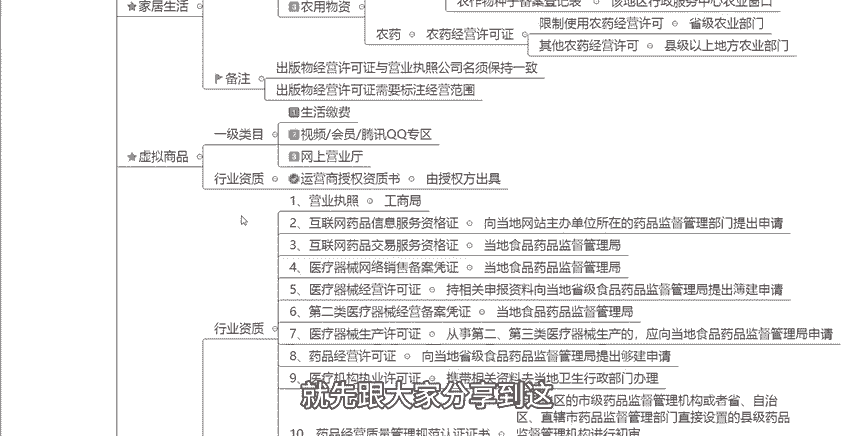

# 【拼多多运营实操教程】最系统的零基础拼多多开店教程全套，电商运营大佬专为学渣研制的新手开店保姆级教程！全程干货，简单粗暴 - P5：5、拼多多开店-不同类目资质要求 - -拼多多开店 - BV1BH1qYpEqw

hello，大家好，这一期视频呢接着跟大家去分享关于我们拼多多新手开店实操运营白皮书系列课程当中的第四章内容啊，就是关于我们不同类目的一个资质要求。针对于不同的一些类目啊，尤其是一些特殊的类目。

它会有一些特殊的这个资质要求的。来，我们可以看一下啊。呃，比如说食品保健、水果、生鲜类目啊，如果说我们要去操作这个类目店铺的时候呢，我们就需要有一个行业的一个资质要求啊。它具体的。

比如说要有一个我们的这个呃营业执照啊，还要有一个食品流通经营许可证啊，还需要有一个比如说你是卖酒水的那你还需要有一个这个酒类流通备案登记表啊。然后第四个，比如说你是卖一些就是有很多卖大闸蟹的，对不对？

卖大大闸蟹的一个商家，那你就还需要额外得到一个大闸蟹券的一个经营许可。那么这些证件，这些资质都是哪些地方可以去申请呢？我们可以看一下。首先营业执照，这个大家应该很熟悉，对吧？

我们直接去当地你当地的一个工商局就可以去办理。那食品流通许可证这个东西呢，你可以去就是在你取得了这个卫生许可证之后啊，你像你当地的这个工商行政管理部门去申请这个食品经营的一个许可证就可以了。好吧。

那么第三个啊酒类流通备案登记表，这个呢，你就直接到到什么到你那个就是你们当地当当地城市的这个商务部政府的一个网站啊，去下载去填写就可以了。那还有你可以去到当地的你的这个商务的一个主管部门啊去领取填写。

申请就可以了。好吧，那么再来看一下，比如说这个大闸蟹券的一个经营许可啊，嗯，它是需要两个东西，一个是你们的这个进货的一个凭证啊，这个可以去找什么？找你们的进货方去索要就可以了。

那第二个呢就是一个这个提货的一个系统啊，这边字打错了，应该是提货啊，提货系统啊，需要有这样的一个东西。那这个呢你可以去什么去自行的去这个提货软件定制啊，去购买去购买就可以了。好吧。

那这里值得注意的一个点呢就是。食品流通许可证和这个食品经营许可证在这个2015年10月1日之后呢，就是已经他们这两个东西就是已经合并了，合并成一个叫做食品经营许可证的。所以说这个呢它大家可以去注意一下。

好吧，然后还有呢就是我们的一个数码电器啊，数码电器。数码电器如果说你是以下的一些一级类目啊，比如说3C3C数码配件、电脑硬件，然后啊这个地方应该是。显示器啊，还有电脑周边。

然后大家电啊、厨房电器啊、行业资质啊、这个呃手机啊、平板、电脑啊、生活电器啊等等这些东西啊。如果说你是以下的一些这些类目的话，那还需要一些其他的一个行业资质。嗯，第一个是我们的这个还是一样的营业执照啊。

营业执照的一个副本，这个去找你们当地的这个工商局就可以了。然后第二个呢是商标注册证啊，商标注册证，以及这个或者是商标注册申请受理通知书的一个原件或者扫描件啊。

这个呢就需要你们去你们当地的这个商标这个商标局啊去申请啊去办理。那再一个呢就是你产品的这个质检报告啊，因为这个数码产品呢都是需要有质检报告的呃，如果说你经营的是这种比如说煤气灶啊或者说热水器啊。

这些你们就必须要提供3C的一个证书了。那其他的。这种东西呢你们提供这个质检报告就可以了啊，质检报告就可以了。那3C证书呢，你你们可以去向中国质量认证中心去提出申请。质检报告呢就呃需要去找到你你们当地的。

比如说一些第三方那些质检机构啊去做检测，然后出具报告就可以了。那么还有呢就是我们的这个。品牌授权证明啊，以及或者说这个商标持有人的一个授权证明啊。

然后以及商标持有人发起到平台的一个完整的这样的一个授权店啊授权链。这个呢你们可以去找到这个品牌方，或者说被代理方，让他们帮你们出具一下这个证明就可以了啊，就可以了。

那还有一个最后一个就是这个全国工业产品生产许可证啊，这个东西，这个东西呢，你们需要去当地找这个质量的技术监督局啊去办理去申请。那么再来啊我们看到还有一个类目呢，就是家居生活啊，家居生活。

比如说像我们的这个呃书籍杂志报纸啊，或者说一些这个畜牧啊，养殖的一些物资啊，药物啊，还有一些农用的这种物资啊，这些呢这些类目它是会有一定的一个要求的啊。如果说你们是要卖这种书籍杂志报纸的话，除了要。

这个经营许可证之外，还要有这个出版物出版物的一个经营许可证啊，要这两个东西。那么出版物经营许可证呢，它分为两种情况，一种是不符合出版物总发行这个总发行单位条件的。

一个是符合出版物总发行单位条件设立的一个条件的。那么不符合的呢，你可以在你们当地啊，就是你们所在地的这个当地的这个新闻出版行政主管部门去这个申请啊去申请。然后第二个。符合出版物总发行单位设立一个条件。

就是可以到这个新闻出版广电总局啊去申请的这两个东西，其实这种东西做的这个商家还是相对的比较少一点的。但是如果说你们刚好是要做这样的一个类目，你们就需要知道这些东西，知道吧？那么第二个。

像我们的这个畜牧养殖物资里面的一些兽药啊啊，这个是需要一个叫做兽药的生产许可证的啊，还有要一个兽药的经营许可证的。那么这些呢第一个兽产生个生产许可证，需要去你们当地这个去省级的兽医行政啊。

行政主管部门去申请的，知道吧？行政。么行政行政啊，然后第二个兽药。经营许可证这个东西呢是你们需要去你们所在的这个县啊或者市啊畜牧受这个兽兽医兽医行政管理部门去申请的。啊。

大家可以注意一下这两个点啊这两个。然后第三个农用物资啊，农用物资里面呢，如果说你们是这个种子啊、种苗啊，对吧？那么你们就需要有一个这个林木种子生产经营许可证啊，或者是农作物种子生产经营许可证。

然后农作物种子备案登记表，需要这两这三个东西。那么他们也是需要去这个对应的一些机关部门啊，去一些对应的这个行政部门去申请的。大家可以看一下，可以记一下这些东西。那么农药啊。

就是农药的话也是需要一个叫做农药的经营许可证的啊，在农药的经营许可证当中呢，会涉及到一个多种的形态。比如说限制使用农药经营许可啊，你们去省级的农业部门去申请就可以了。还有一种叫做其他农药经营许可。

那县级以上地方的农药部门去申请就可以了，他们的等级是不同的啊，所以说对应的这个去申请了一个单位申请的一个地方也是不同的，大家可以看一下，那么这里值得注意的一个点是什么呢？

就是如果说你们是做这个出版物经营许可证的时候啊，对不对？这个点啊就是出版物经营许可证必须要跟你这个营业执照，公司它的名字是必须保持一致的。如果说是不一致的话是不行的。然后第二个出版物经营许可证。

需要标注经营范围，知道吧？需要标注经营范围的。如果说这两个点没弄好的话，是不行的啊。然后我们再来看一下虚拟商品。虚拟商品呢，比如说像我们的一些生活缴费服务啊，还有比如说一些视频会员啊、腾讯QQ专区啊。

还有比如说一些网上的营业厅啊，这些也是需要一些对应的行业资质的那首先比如说像我们的一些运营商的一个授权资质书啊，那么这些你们去找到对应的一个授权方去出具就可以了。好吧，这边就不过多的去讲啊。

大家可以看一下。然后最后一个就是我们的医药健康，医药健康的一个行业知识呢比较多。大家可以看一下，分为11个点啊，11个点。首先呢是营业执照，然后是互联网药品信息服务资格证。

然后互联网药品交易服务资格证等等等等。这11个点就不一一的跟大家讲了。大家如果说刚好是要做这个类目的话啊，然后又不知道需要哪些东西的话呢，大家可以去截个图去看一下这几个点。

我给大家啊都把就是对应的申请部门啊，给大家都标注清楚了。那有对应的要求呢，大家可以去记一下啊，去记一下。你们也能够更加清晰知道啊，每一个资质，每一个东西要对应的要去哪里去办理啊。

那么医药健康当中呢一级类目又比主要分为比如说一些中药材，然后比如说隐形眼镜啊、护理液啊，然后以及一些OTC的药品，然后医疗器械，一些计生用品。如果说啊这边大家注意一下。如果说你是做这个中药材的话。

OK那么你需要上面这几11个点当中的第二个点，第三个点第八个点啊，这是如果说你做中药材需要的这三个资质。如果说你是做隐形眼镜，做护理液的，那么你需要第五个第7个第四个啊，需要这几个东西。

如果说你是做这个什么OTC药品啊，一些计生用品的话，那么你需要23458啊，需要这些东西，好吧，不同的类目，它所对应的需要的一些资质啊，都是不一样的。所以说大家要根据比如说还有我们的这种二级类目啊。

比如说医疗健康服务，那，你需要行需要第9个这样的一个资质。医疗器械需要567OTC需要238，然后国际医药的话啊，你需要这个238。然后你还要加一个什么进口药品的话，你还需要提供11啊。

就是近两年海关进口货物报关单，好吧。就是有非常非常多不同的类目，不同的类目它所对应所需要的一些知识条件呢都是不一样的。大家可以参考这以上的这些东西啊，去找到你们做的这个对应的类目。

然后你就知道需要哪些资质，哪些这种证明了。好吧，如果说还有不清楚的呢，大家可以在评论区找到我来问我啊，我我也非常乐意非常欢迎大家来找我进行一个这种交流沟通。好吧。那么这一期的视频就先跟大家分享到这。

感谢大家的一个观看。

Oh。

