# 【拼多多运营实操教程】最系统的零基础拼多多开店教程全套，电商运营大佬专为学渣研制的新手开店保姆级教程！全程干货，简单粗暴 - P9：9、拼多多开店-数据分析潜力爆款 - -拼多多开店 - BV1BH1qYpEqw

hello，大家好，欢迎大家观看拼多多新手开店实操运营白皮书。那么我们继续跟大家去做分享啊。呃上一期的视频呢跟大家分享了关于我们这个拼多多商家管理后台的一些这种端口跟路径啊。

那今天呢这期视频来跟大家聊一聊关于我们数据选品方面的一些内容啊。其实讲到选品呢，对于我们很多新手小伙伴来讲是一个比较困难的一个问题。然后经常会困扰大家的一个问题啊。但是呢也有很多小伙伴开店的时候。

容易去忽略掉它啊，因为什么呢？

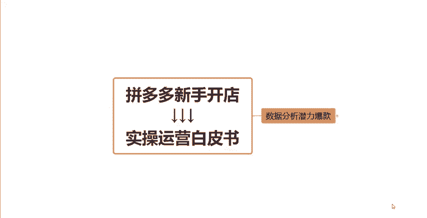

就是我希望跟大家讲清楚的就是选品的重要性它到底是什么。其实店铺选品的话是一个非常非常核心的一个关键点。如果说我现在去这个运营一个店铺的话啊，我不清楚我的产品。

哪一个是市场上卖的比较好的这种产品更容易被消费者接受的这种产品，我不清楚的情况下，我直接去运营店铺直接去操作，可能就会导致说什么呢？我的这个整个的这个投产品是非常非常低的啊。

我可能花时间花机花资金去投入了，但是没有任何的效果，或者说效果很差。那么呃，到时候钱你钱也投入了时间也投入了，到头来一场空。这个肯定是非常非常不好的，对不对？那举个简单的例子啊，比如说有某某一种产品。

对吧？在拼多多的这种平台当中，呃，排名很靠前。

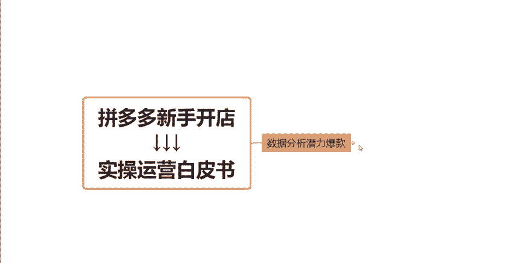

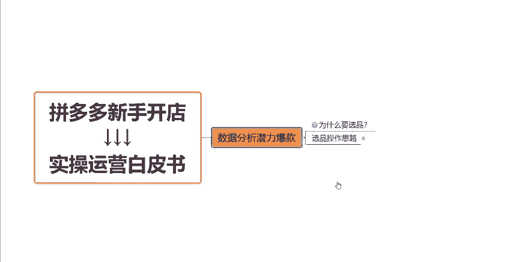

那店铺我们把来叫做为头部商家，对吧？那头部商家可能一天他就卖个100单200单的样子。那在这种情况下，你觉得如果说我们再去操作这样的一个产品，再去操作这样的一个类目，如即使我有一天啊我把我的这个排名。

对吧？我把我的权重做上去了。我我也成为了一个头部，对不对？那我一天也只能卖个什么买个卖个百8的那个百80单的一个样子，对不对？而且如果说你的这个产品在利润不高的一个情况下。

那你这个店铺其实盈利的一个状态就非常非常的一个差了，没有任何的意义的，对不对？这种产品呢就其实是不适合我们去操作的那到底应该怎么去选品呢？其实选品的方式非常非常多。

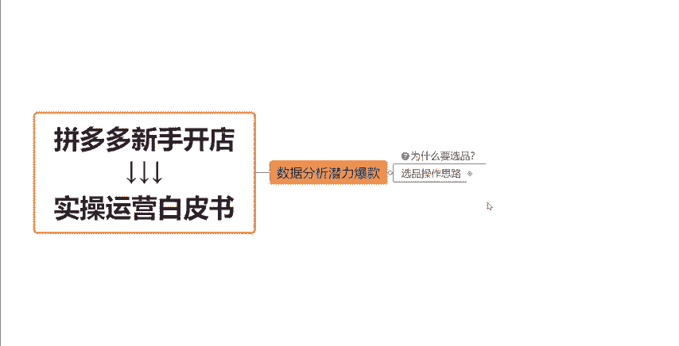

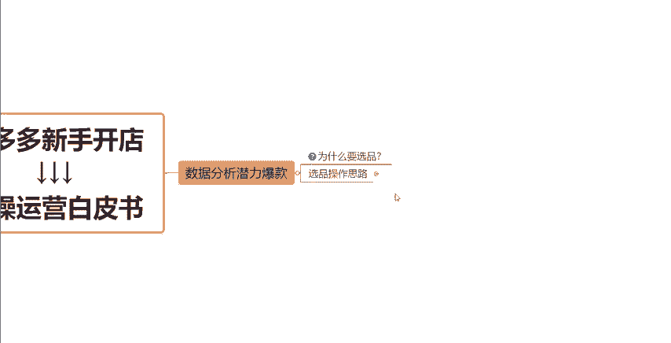

比如说我们可以那个关键词选品也可以，对不对？也可以通过一些热销的商品排行榜去选品，也可以，那也可以通过什么呢？通过这个季节性去选品，也可以啊等等很多很多这种方式啊。

那么选品的策略其实是非常多的那重点大家要清楚是什么啊，重点就是我们选品是选什么呀？选品是选产品，选品是选需求，是选竞争，知不知道？所以说我们选产品的话。

一定要去选择那些就是这种市场的需求度比较大的比较多的，能够能够给我们带来更多的这种销量的，而且相对于我来说呃，能够体现我产品经历的这种一这种类型的产品啊。因为只有这种的产品，我们在什么。

我们在呃这个后续的一个运营过程当中呢，我们才好更好的去做排名，知不知道？那么选品的话，这边给大家提一些这种我个人的一些建议啊，就是第一个。

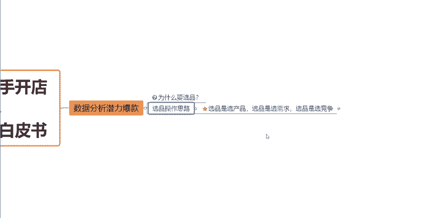

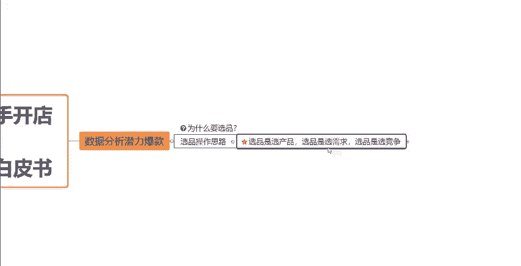

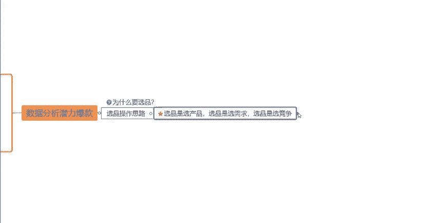

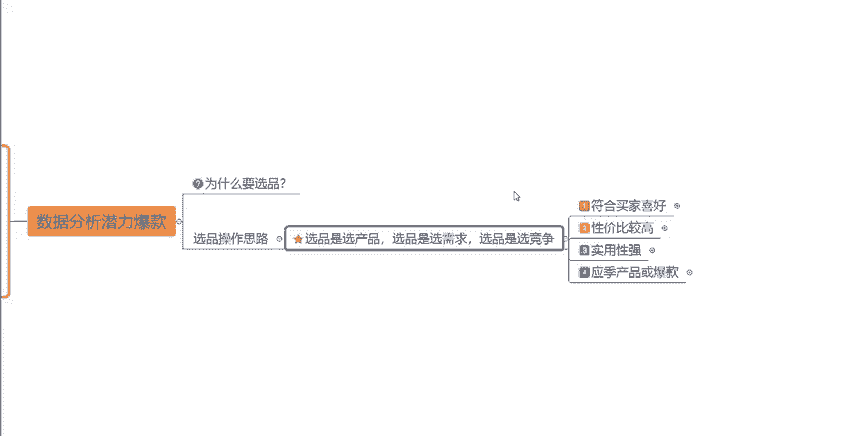

我们选产品要选择符合买家喜好的这种产品啊，符合买家喜好，就是符合买家需求的这种产品。那是什么呢？具体体现在哪一个哪一些方面呢，对不对？那比如说呃举个例子啊，非常简单的一个T恤啊，我想买一个T恤。

那T恤当中呢，它可能说有这种印花的啊，有纯色的，对不对？那可能有这种圆领的，有V领的，对不对？有高领的，有低领的各种各样的呃，那么在我们进行选品进行推广的时候，那如果说我们没有一个明确的方向的话。

我们不清楚就是在这一个节点当中呢？哪一种类型的产品，哪一种特征的产品是更加受到消费者喜爱的，更加能被消费者给接受的。如果说我们不知道这个的话，那肯定是很容易去走弯路的，对不对？

那么我们通过市场上的一些分析啊，那么我们就可以。

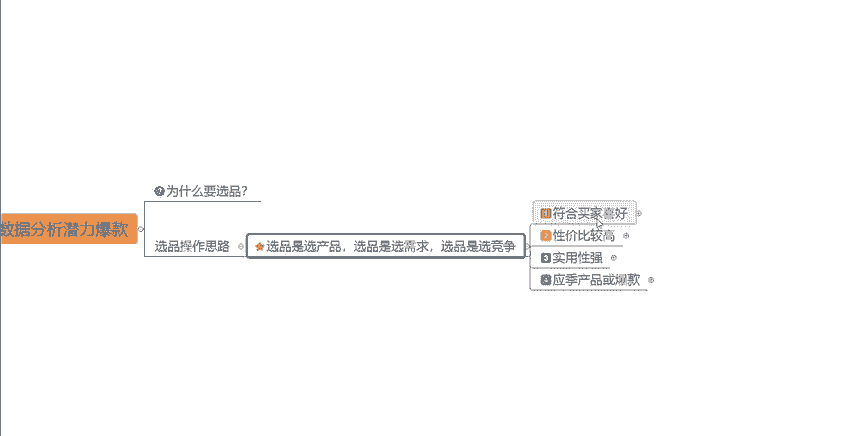

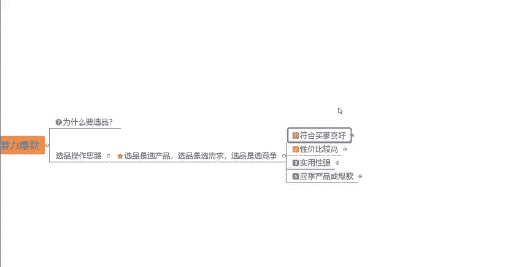

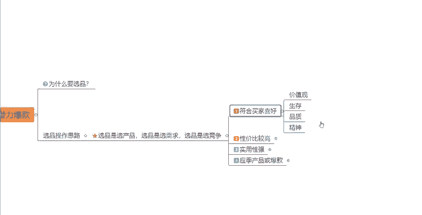

判断出来就不是我选择的这个产品，它具不具备这样的一个就是符合消费者认可的这种一个价值观啊，呃，能不能满足嗯这个消费者的一个需求啊，不管是这种精神上的一个需求，还是这个生活方面的一些需求。

然后能不能够体现出这个产品它的一个品质到底怎么样啊，等等等等。这些方面，我们都要去考量的啊，我们都要去考虑的。然后考虑之后呢。

我们再结合市场的一个数据去判断能哪一种产品可能够更好的给我们带来这种更多的这种销售额，对不对？那这种产品呢，我们就可以去呃把它作为主推款给定下来。那同样的我们还需要去选择什么。

还需要去选择性价比非常非常高的这种产品，就是更具有性价比的这种产品啊。

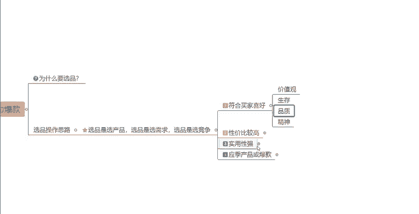

呃，本身我们平台来讲啊。

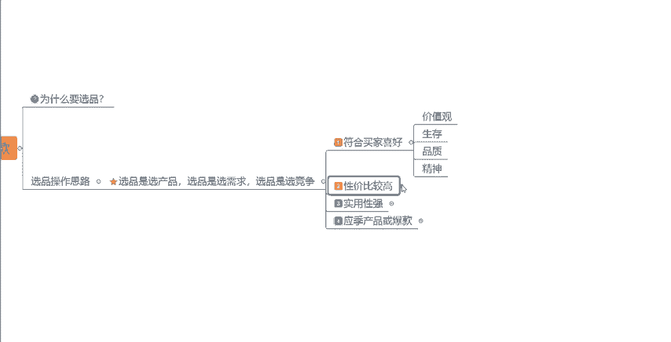

就是。拼多多这个平台大家都知道啊，是通过什么样的一种形象被大家所熟知呢？对不对？就是通过这种价格低啊，也可能叫做年价啊，被广大的消费者所熟知的，对不对？跟其他的比如说淘宝啊，京东啊一些相比。

可能大家潜意识当中都会认为拼多多上的东西卖的会比较便宜一点。所以说呃在拼多多这个平台上呢，用户的消费能力来讲，可能也会相对的弱一点点啊，或者说这些消费者都是比较喜欢贪便宜。

比较喜欢呃买便宜的这种产品的这种消费者。所以呢我们就更要去提高我们的这个产品的性价比去提高我们的这种产品的竞争力啊，这是非常非常非常关键的一个点啊，关键的一个点。然后第三个点呢就是实用性强这个方面啊。

实用性这个方面其实不需要过多的去介绍了啊。呃给大家举个非常简单的一个例子啊，比如说家用对不对？家用家用当中是什么呢？刚需，什么是刚需呢？比如说啊我们日常需要用到的一些呃洗衣液啊，对不对？

洗洁精啊或者纸巾啊等等等等。这种产品。

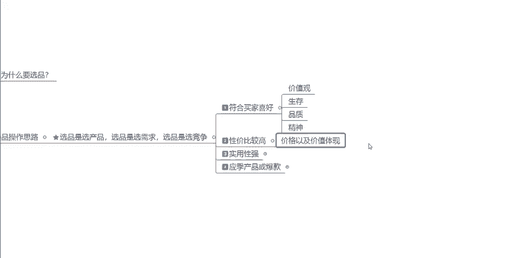

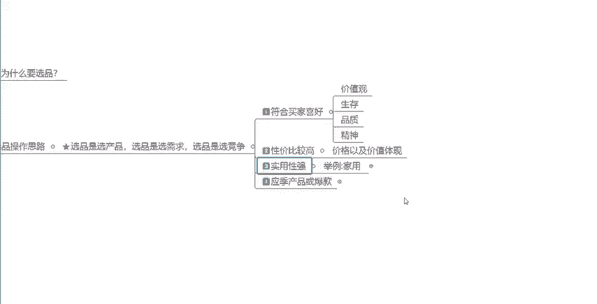

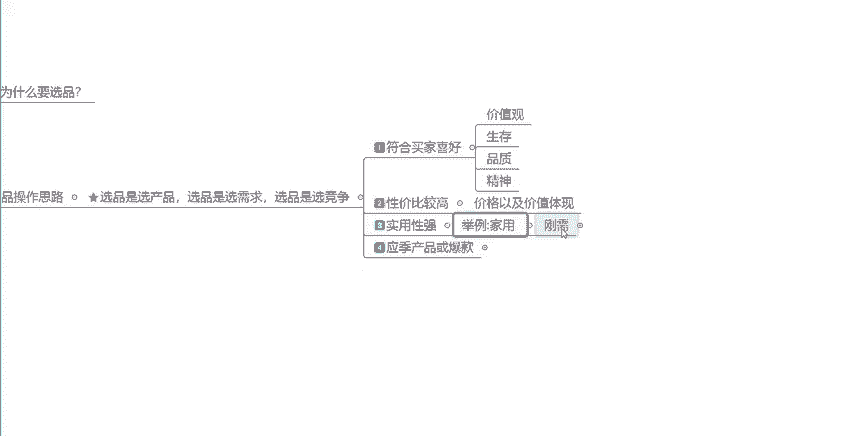

不管说在任何的时间，在任何的地方，是不是呃我们都需要用到它，对不对？所以说这种东西啊它是不会过时的，它是刚需。只不过如果说你想要做这种类型的产品啊，再去就是做这样的一个类目啊，那你先要去分析。

就是你的这个产品在这个行业当中，在这个类目当中。有没有足够的竞争优势，对不对？性价比够不够高，这是非常非常重要的一个点。如果说呃因为洗洁精啊、洗衣液啊、纸巾啊这种作为我们呃消费者正常的一个购买需求来看。

一般大家都会买品牌，对不对啊，买品牌，所以说品牌的这种呃意识度是比较强的那如果说你有品牌，那还好说，那如果说你没有品牌，你是个白牌，对不对？那你就需要一定要需要去考虑到你的性价比了。

如果说啊你又没有品牌，你的性价比又不高，那你怎么跟别人去竞争，怎么去跟别人玩，对不对？肯定是做不起来的所以说大家要先去分析一下，这些点啊分析一下你有没有你既然想做这样的一些行业想做这样的一个类目。

你有没有竞争的优势，有你就可以做，没有碰都不要碰，好不好？那我们继续往下来看啊，就是你还可以去选择什么呢？去选。

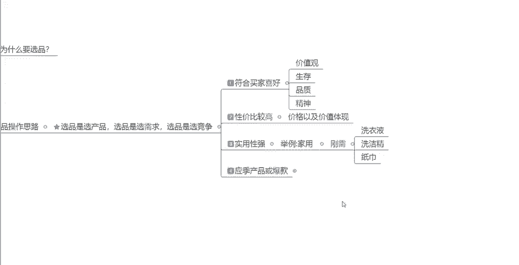

选择一些应季产品或者是一些爆款的产品，对不对？应季产品，我给大家举个例子啊，比如说马上之再过几个月啊，我们到了这个夏天，对不对？夏天的话，它是一个什么非常炎热的一个季节，夏天的一个特点，就是天气很热。

然后紫外线比较强，然后蚊子又比较多。那么针对于这样的一个气候的一个情况下呢，就会产生一些呃非常非常多适配的一些产品啊，有硬性要求的一些产品。比如说很热的话就会有什么比呃一些小风扇啊，扇子啊。

或者说冰敷贴啊，或者说加湿器啊，或者说一些补水仪啊等等等等。这些东西呢都是我们在夏天可能会需要用到的一些产品。因为这些产品，你比如说你秋天冬天你肯定是用不上的，对不对？只有在夏天才用得上。

这个就叫做季节的应季产品。好吧，那第二个，比如说紫外线墙。

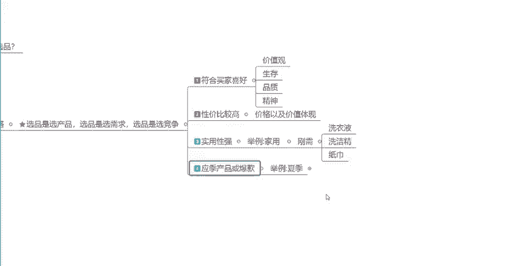

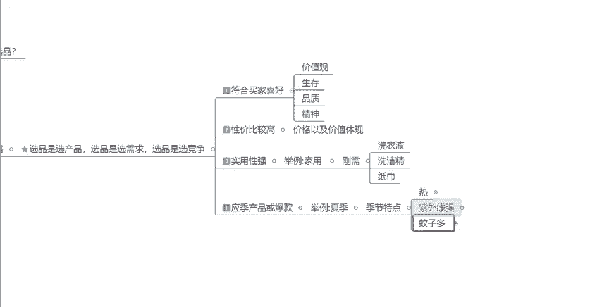

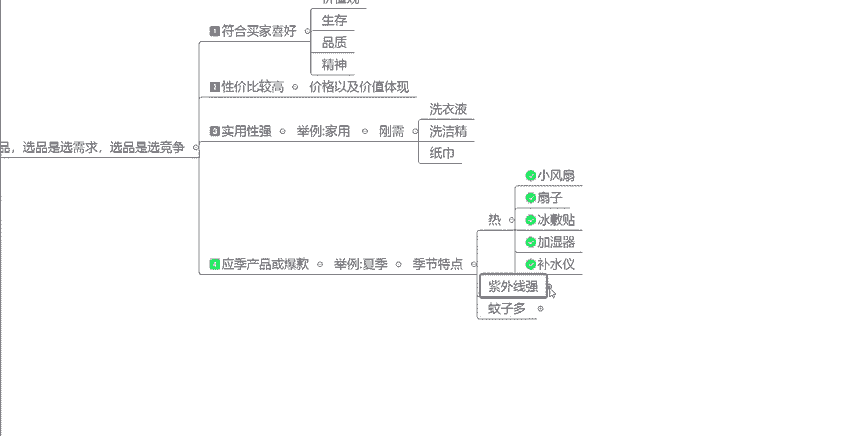

现场可能需要用到什么防晒衣、防晒帽、冰袖、冰丝衣物这些东西，这些服装类的是不是就来了？所以说啊你要。对吧根据这些季节性的一些特点去考虑到产品的一个布局。还还有比如说你有这种好一点的货源。

好一点的供应链的话，你甚至还可以做这个防晒霜、防晒喷雾啊，这些都是可以的啊。那还有第三个点呢，比如说蚊虫多。那你肯定要去备一些防蚊虫的这种产品，对不对？

比如说防蚊喷雾啊、防蚊贴啊、电蚊香啊、蚊香啊等等这些产品都是啊这个季节需求量非常非常大的一些产品啊。

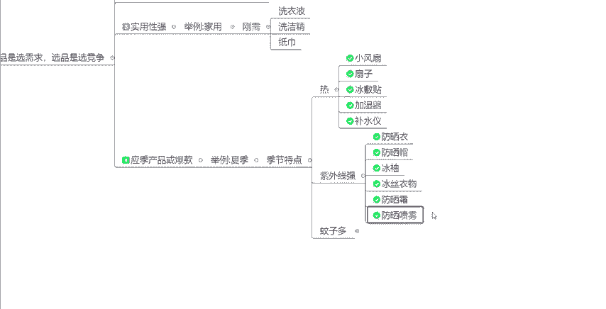

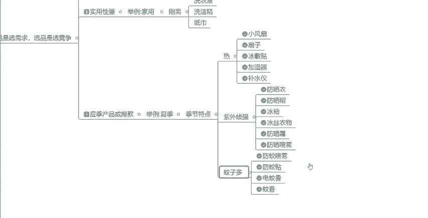

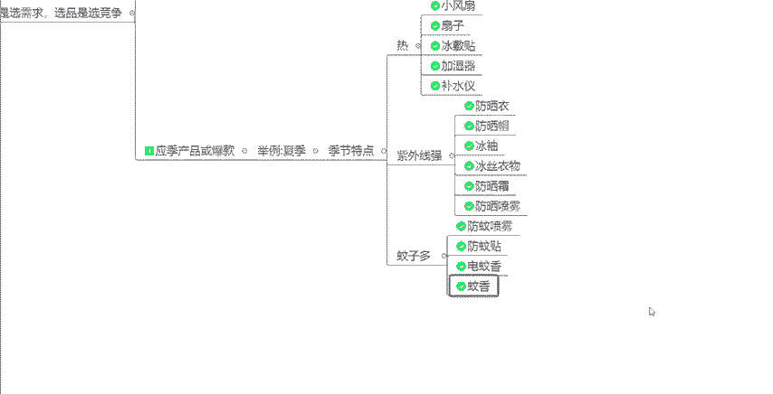

所以你在做店之前啊，你一定要先把这些东西搞清楚啊，在什么样的一些时间节点，我可以去选择一些什么样的产品来进行操作。那我把产品定出来之后，我怎么样去操作，对吧？这些都是大家去学习的一个地方，好吧。

所以说呃如果说你们在这个选品方面还有任何不懂的不理解的地方呢，大家可以在评论区找到我啊，然后我可以给大家再去做分享，在解决一下大家的一个问题。好吧，那今天这一个呢就是我们关于选品思路方面的一个分享。

视频就到这，感谢大家的一个观看。

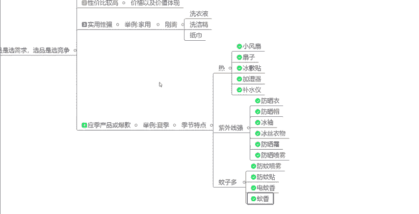

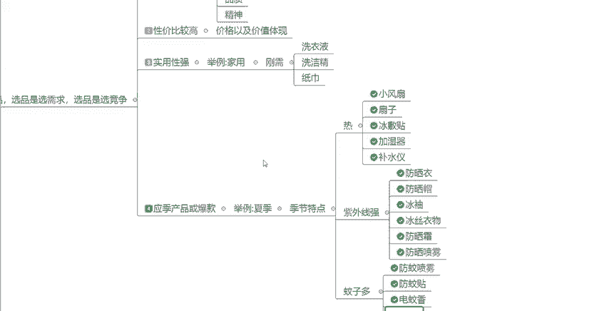

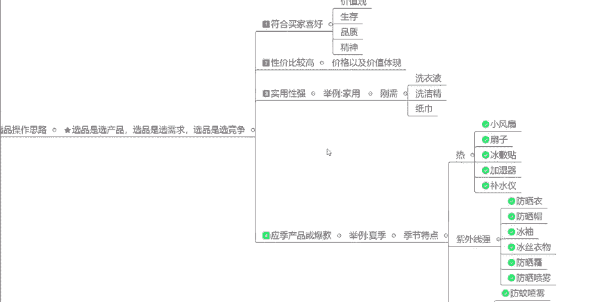

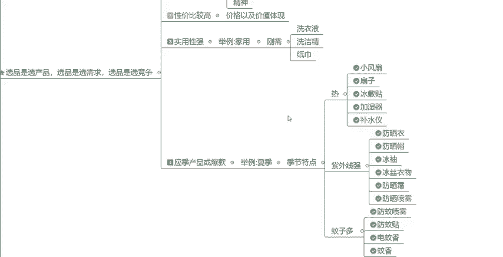