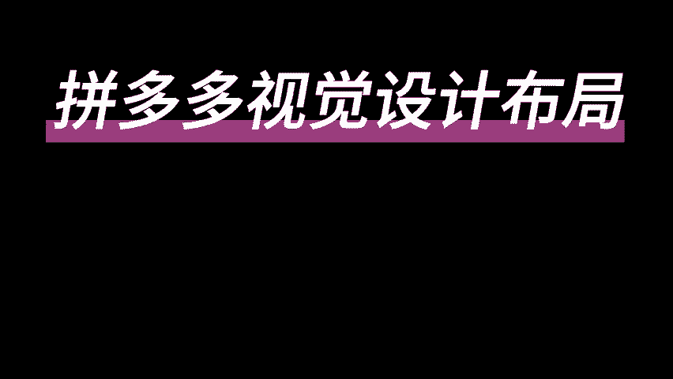
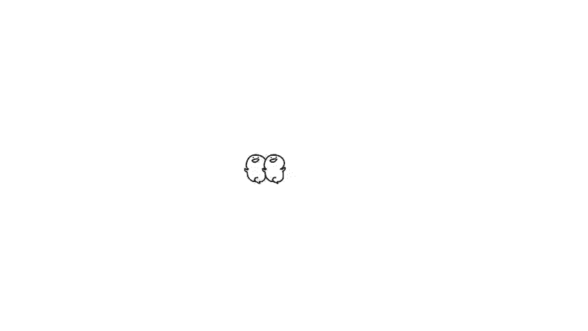

# 【拼多多运营教程】中小卖家拼多多开店实操教学视觉设计篇，卖产品不如卖图片！电商运营老手教你轻松get高点击高转化主图+详情页！ - P1 - 拼多多-运营 - BV1QY2uYNETr

🎼。

🎼，🎼The。🎼我们如何去做出高点击率的主图啊？第一个点，我们电商卖的是什么？第二个点，如何做好竞品分析。第三个点，主图的设计思路啊，先跟大家讲第一个点。电商我们卖的是什么。

大家不妨好好的想想这个问题啊，我们电商卖的真的是图片吗？卖的是标题吗？卖的是其他什么东西吗？其实都不是卖的是什么？卖的就是图片，为什么呢？因为你比如说我们在拼多多平台，这个平台上，不管是在任何的场景下。

在任何的界面下，我们第一眼看到的永远是什么？永远是产品的图片，对不对？所以说你的图片做的好坏，就直接决定了你的这个产品，它的点击率好不好？知道吧？图片影响了点击率，点击率呢。

它又是影响流量的一个最重要的指标，变值。所以说点击率的权重是非常高的。我给大家举个例子。比如说啊这个时候同样的你的商品哎，我这边比如说你的是商品A，你的同行呢，它是商品B好吧。

这个时候啊假设你们的这个商品的排名都是一样的那这个时候呢，你获得了1万个曝光。那你的同行的商品它一样的获得了1万个曝光，那么在同样1万个曝光的情况下呢。哎，你的这个产品这个时候你的点击率是多少是2%。

对不对？那1万个曝光2%的点击率，大家去算一下，算一下这个数学题。1万个曝光，2%的点击率是多少个点击量，是不是200个点击量，对不对？200个点击量。那同样的，那如果说同行他的图片做的比你的好。

他的点击率比你的高，那这个时候他获得了5%的点击率，他能获得多少个点击量，获得多少个流量，是不是500个，对不对？你想想在同样的曝光情况下，它的点击率比你高，它能获得500个流量。

你只能获得200个流量。那我们假设你们的转化率都是一样的，转化率我给你们都算10%，好不好？够高了吧，10%的转化率，那这个时候你200个流量，你能卖多少单，你能卖20单。那同行它能卖多少单呢？

它能卖50单，你想想你们之间的差距有多大。所以说给大家讲这个点的原因是什么呢？我就是想让大家知道你的这个图片它是非常重要的。因为它会影响到你的点击率，而点击率它直接影响到了你的这个产品。

它后续获得流量的一个指标，你获得的流量多还是少，流量多，你卖的就多。流量少，你卖的就少啊，这是先跟大家讲的我们主图的一个重要性啊。然后给大家讲第二个点。我们如何去做好竞品分析啊，如何去做好竞品分析。

哎啊第一个点，我们在拼多多上可以去什么呢？可以去核心的关键词啊，搜索核心的关键词。因为你要做竞品分析的话，你肯定要跟你的同行去对比嘛，对不对？那这个时候你就要想好啊你是卖什么产品的那我打个比方啊。

你比如说你是卖这个连衣裙的，而连衣裙当中呢又分为很多个类型，对不对？比如说我们吊带连衣裙跟这个呃公主裙肯定是不一样的嘛。他们的受众人群也是不一样的嘛，所以说这个时候你要先确定出来你的核心关键词是什么？

那比如说我们核心关键词，我们确定出来了，比如说我们是加绒加厚连衣裙。OK那这个时候我们直接去搜索我们的这个核心关键词。先去看这个排名啊，先看排名。我们点击什么呢？点击销量啊，按照销量排序。

我们去看排名靠前的这些产品，他们的这些主图，他们的图片都是怎么做的。或者说都是什么样的一些风格，你把它全部的记录下来啊，知不知道全部的记录下来啊，那怎么这个怎么看呢啊？我教下大家，比如说我们是做衣服的。

对不对？你可以看一下排名靠前的那比如说我们做女装的，它分为几个类型啊，你看我们有在室外拍的，对不对？有在室内拍的啊，室外拍的，我们一般叫做什么叫街拍，室内拍的呢，一般就是室内拍摄了嘛，对不对？还有什么？

还有是模特全身拍的还是半身拍的那像这种像这种就是半身啊，这种就是半身，那像这种基本上就是全身看到没？全身啊，这种半身，你需要去还有这种没有模特的产品的平平铺图，你需要去分析一下哪一种类型它比较多。

哪一种类型它卖的比较好，这些都是你要分析的东西，知不知道。这是第一个点啊，我们可以通过核心关键词来确定我们的竞品去分析一下竞品。第二个途径，在拼多多上去查找类目，看三级类目下的同类型产品还是一样的。

看排名，看销量，看评价一样的。我教一下大家这个途径怎么去找啊。什么叫类幕呢？大家可以看到我们在拼多多这个平台上，大家可以看到下面它有一个分类，对不对？

分类旁边它有一个大类食品女装、男装、百货洗护、生鲜、运动手机、鞋包、电器等等。你是什么产品？你在哪个分类里面，你就点哪个？比如说我们是做女装的？女装当中又分为什么呢？

连衣裙、大码女装、套装、婚纱、半身裙、旗袍、连衣裙、妈妈装、洛丽塔、汉服又分为非常多的。你就要继续的去分类，对道吧？继续的去分类。那这个时候我们就分为连衣裙。那，比如说那这个时候我们就点击连衣裙了。

对不对？点击连衣裙进来之后呢，你看到没有？你这个时候呢就按照看排名，看销量，看评价，按照刚才一样的方法去找什么去找你的这一个啊同类型的竞品，好不好？这就是按照类目去找竞品的一个方法。

我们通过以上两种方法，我们找到竞品呢。我刚刚跟大家讲的去分析竞品的图片去借鉴他们的卖点。因为什么？因为当一个产品它卖的好的时候，它的图片一定不会差的，你们记好这个点就好了。一个产品它卖的好。

它的图片肯定啊就不会差。所以说你们不要盲目的去找美工做图啊，不要说我身边又没有美工，我自己又不会做图。那这个时候我可能在某宝上面，对不对？我或者说在其他的一些渠道，我去找美工去做图。

我直接跟说我要卖连衣裙，我要卖这个产品，你去帮我做个图。这样的美工他是不知道怎么去做的。因为美工它不一定有电商的这个经验，知不知道他没有电商的这个思维，又或者说他做出来的图，可能是那种你看着觉得很好看。

但是在电商这个平台上，他不一定点击率是很好的。所以说你要先通过我上面教你的这些点去把你的这个产品的卖点去构图，把这几个点整理出来了之后。

你再去对接你的美工去告诉他我要去做我要在这个图片上做出哪呈现出哪几个卖点，我要什么样的一个感觉，什么样的一个风格，你把这个参考的类型。参考的图片发给他，让他按照你的这个思路去做，理解吧？

OK这就是第二个点，我们怎么去做竞品分析。三个点啊，最后一个点，主图设计思路，主图设计思路基本上就分为这几个这样的一个路径啊这样的一个路径。第一个先确定你的精准受众人群，然后了解你的这个真实的受众人群。

他们的一个真实需求，然后根据真实的需求去做好差异化。最后去在文案上把你的卖点突出出来，好吧，就这这样的一个路径啊，这四个步骤来我拆解开，一个一个跟大家讲。首先第一个精准受众人群，什么意思呢？

就是你在做图之前，要先把你的这个产品的一个精准人群，他的精准受众人群是什么样的一个画像，你要先分析出来，知不知道？也就是说说直白一点，就是你的产品，你想卖给谁，谁是你这个产品的真正的买家。

你在做图片的时候首要考虑的是这个东西，你要去了解你的这个人群，他们的偏好，他们的兴趣爱好，他们的消费能力，他们的消费水平，知道针对这几个点去针对性的去做这个人群，他们的风格图片，理解吧？

不要想着说一张图片，把所有的人群都覆盖了。这样很容易就变成四。像的啊，到最后点距率可常差，因为谁都不看好，谁都看不上，好吧，这是第一个点啊，精准的受众人群。第二个。我们定位好这个人群风格之后啊。

我们还需要去了解消费者他真实的一个需求。因为什么？因为消费者的真正的需求往往是隐藏在关键词当中的。因为很很多我发现很多你们商家朋友们在做图的时候啊，总是会无意的忽略掉消费者他的一些需求。

你们只想着哎我自己要表达什么东西。我觉得我的产品卖点是什么？我觉得我想要表达是什么？你们却往往忽略了消费者他在搜索关键词的时候，真正想要看到的东西是什么？那最终啊导致你的这个主图做出来之后，点击率不高。

那比如说我给大家举个例子。比如说这个时候我作为一个消费者，我搜索的是加绒牛仔裤，对不对？对不对？那这个时候你想一想，我作为消费者，我在拼多多上我搜索加绒牛仔裤。我最想要看到的是什么样的一个信息。

那这个时候有这几张图片，来，我给大家看一下，有这样几张图片。来，比如说我给大家啊有两张图片来。比如说一个图片是这样的啊，一个图片是这样的，这个图片你们把它记一下啊，这个图片一个图片是这样的。

你作为消费者，你更看重哪一张图片？对不对？这一张图片呢，它只展示了什么？只展示了这个牛仔裤，它上身的效果是什么样的。而这张图片呢，它把看到没有？他把这个扣子解开，把内里展示出来给消费者看。

我们就很可以很清晰的看到它这里面是加了绒的。并且在这个图片的左下角还放了一个图片，它更加体现了这个里面加绒的质感。那你想想这两个产品，你看这个产品它的标题当中也有加绒。这个产品它的标题当中也有加绒。

而并且这个产品标标题当中的加绒，它是把它放在标题的更前面的。你想想你作为消费者，你作为这样的一个需求，你更喜欢哪张图片，我觉得大部分消费者应该会更喜欢这张图片。对。

因为这个图片它能把我们作为消费者真实的需求，直接的展示出来。所以说我更我会更喜欢这张图片一点。所以说讲这个点呢，你要去了解消费者需求到底是什么。他们第一眼真正想看到的是什么？也是。

他到底是想要买一个什么样的一个产品，这个你们要需要去分析好，知不知道？好吧，这是第二个点。三个点，做好差异化。差异化主要分为这四个点啊。第一个背景颜色差异化。比如说当你发现大部分都是深色背景的情况下呢。

你这个时候我去用浅色的背景，是不是我在这一些产品当中，我就脱颖而出了，是不是一下子就抓住了消费者，它的一个视视觉上的冲击，对不对？但是要记住一个点啊，比背景颜色做差异化，你也要保证你的图片是美观的啊。

不要做的丑丑拉吧唧的，好不？要先做到美观，再去做差异化，并且你要跟你的这个产品跟你的店铺风格，它是不要有太大的一个冲突的，好吧？不能盲目的为了差异化，去胡乱的用颜色啊，这是第一个点。第二个点。

角度视觉差异化什么意思呢？比如说我们同样卖衣服的，同样卖裤子的，这个是正面，这个呢是侧面跟背面，这个也是正面。这个呢是右这个什么左边正面跟屁股，对不对？不同的这个产品啊，不同的角度啊。

它所给人呈现的感觉也是不一样的。所以说你要去分析一下你的这个产品，作为消费者来讲啊，以及作为平台上卖的好的这些商家来讲，他们展示的角度是什么样的？他们展示的这些效果是什么样的，好吧？

你要跟他们做出一定的差异化。比如说大部分人都是做正面的。那这个时候我做一个侧面的，我做一个背面的，是不是差异化一下就出来了，对不对？所以说你要通过角度通过视觉上去做差异化。第三个细节大小差异化。

什么意思呢？比如说啊我的这两款啊，比如说这个图片跟这个图片都是什么？想表达的都是加绒，但是这个图片上呢，我把这个加绒放在左下角啊，就放在这样的一张图片在这，而这张图片呢，我同样的我把它放在右下角。

但是这个图片上，它的我明显感觉稍的更旺一点，有没有烧的更旺一点，并且它在这上面写了什么？加绒不臃肿，是不是他把这个卖点就放大化了，对不对？这就叫细节的大小差异化。所以说你想同样的大家。

都做出了这种细节上的差异。而你要想的就是在这个细节上的一个细节的差异上去再把它放大，再做出跟别人不一样的这种感觉来。好吧，这就是我们需要去深深去抠的一些东西啊。第四个点，场景差异，这个就很好理解了。

不同的场景嘛，包括我上面给大家讲的，同样是做女装的，有的是在室外拍的，有的是在室内拍的，有的是甚至模特都没有的平铺的，对不对？不同的场景啊，你去做一些差异化就可以了。好吧，这是第三个点，我们去做差异化。

但是你们在做差异化的同，它是有一个前提的，就是保证你图片的美观性，好不好，不要为了差异化而差异化啊，到时候做出来图片不好看，什么都没有了，好吧？最后一个点，文案具有诱惑力，突出卖点啊。因为什么呢？😡。

文案它是我们直接表达卖点的一个方式啊。所以说我们的卖点要简单明了，用最少的字去表达我们产品最重要的信息，一针见血，找到消费者最关心的地方。消费者最关心的是什么？是打折优惠还是产品功能还是快递优势等等。

我们找到了这些卖点之后啊，去挑选最重要的放在主图上去消吸引消费者，能不能够理解？比如第一个点，价格优惠卖点。怎么样的这个产品呢，他会更看重价格优惠一点呢？比如说我们一些大促活动啊，什么618呀。

双十一呀，双十二之类的，那在这样的一个期间，消费者他是不是会更关注价格一点。因为这个时候他通常会在多个平台去比价，或者多个店铺去比价，哪一个店铺卖的便宜，对不对？那这个时候价格优惠。

这个卖点是不是就是你最需要去突出的一个点。还有什么？在我们日常销售的一个场景下，哪些产品呢？比如说我们卖这种生活用品的，就是一些快消品，或者说我们卖一些零食，卖一些吃的。

薯片啊之类的这种本身客单价就比较低的产品，那它的价格就是比较重要的一个卖点。因为消费者他一定会去多对比的。同样的，我们在家里买一个卫生纸，我都要去这一家同样的一个品牌，同样的一个类型。

我都要去比一下这个多少钱，那个多少钱，我要去算一下每一包换算下来多少钱，知不知道？所以说你们要根据你们做什么样的一个产品来去分析一下它就是消费者最看重的卖点是什么？这是第一个价格优惠卖点。

第二个正品卖点。举个例子啊，我们平时在去超市买东西的时候，是不是会经常碰到啊，比如说这个时候有两个产品，一个是A。一个是一个是什么？一个是D。A产品跟B产品价格差不多的时候，他们的规格又差不多的时候。

质量又差不多的时候。但是B你发现它有赠品，是不是B有赠品，但是A没有。那这个时候你会选择什么？😡，你是不是一定会去选择B，对不对？在两个产品都差不多的情况下，有赠品的那个产品，它一定是有更多的优势的。

所以说你们想想你们在卖你一个东西的时候，那这个时候你的产品如果说有赠品的话，你把它表达出来。一定要把它体现出来，把它放在你的图片上，好不好？这是第二个点啊，赠品卖点的展示。第三个点功能对比卖点。

这个呢主要就是针对于你的产品上的啊，比如说我们卖一些儿童手表，对不对？妈妈可能会担心我们小朋友在洗手啊，在玩水的时候啊，这个手表它容不容易进水会不会进水，对不对？那这个时候如果说你的手表能深度的防水。

防水性特别好。那你这个时候是可以作为你的卖点去进行描述啊，你是不是就可以把它放在你的主图上的，去做一些一点的描述去吸引一下这这一部分人啊，对不对？我刚刚跟大家说的，比如说我们做儿童手表的来。

我给大家看一下，来，大家可以看一下，我们按销量排序啊。看到没有？这个产品它主要展示的是什么？这才叫定位准。也就是它这个手表想表达的是什么呢？这个手表它的定位功能非常的强大，GP是实时定位。

这他反映出来一个什么信息啊？我们作为家长来讲，给小朋友去买这个手表，去买佩戴的表。一方除了一方面是为了方便。另一个方面是什么？也是很重要的一个点，是不是为了安全，怕我们的小孩子走丢，对不对？

那这是我们家长非常担心的一个点，而这个产品他直接的把你担心的这个点，他做到这个主图上，这才叫定定位准，就意味着你这个手表定位是非常准的。你的小朋友不管走到哪里，你都能直接的看到它在哪里，是不是？

这直接的就解决了我们作为家长心里面的一个顾虑。那你想想你把这样的一个卖点做到你的图片上，你的销量还会差吗？你的点击率还会差吗？对不对？所以说我们不管说做任何的产品啊，你一定要去挖掘你产品的卖点，对不对？

结合你商品本身去挖掘，去多分析一下，好不好？我们一个好的主图呢，它可以影响到我们的一个点击率。详情页呢，它就直接影响到了我们的一个转化率。详情页啊直接影响的是我们消费。

在你的这个产品页面停留浏览的一个时间，一个好的详情页，它可以提高我们客户的一个购买率，也就是转化率。所以说我们一定要想办法去设计出一个好的商品详情页啊。那么这一期视频呢重点要跟大家讲的，就是这个内容。

我会分为这几个点来跟大家一一的去讲啊。首先我们来看到第一个点，产品分析与规划。我们要做商品的详情页啊，肯定是要对我们自己的一个产品有一个深入的了解啊，我们需要去分析产品的一个特点，设计出产品的卖点。

我们把它详细的列出来。我们详情页具体要做的一些内容。最后呢我们可以按照买家的浏览习惯来去制作一个规划。那边我这边给大家整理出了一个关于一个详情页的沙漏型的浏览习惯。

这也是符合我们大部分消费者的一个浏览习惯。首先我们详情页的首评啊，也就是第一个第一个画面，我们要出现产品的整体。第二个第三个第四个呢，也或者说我们经常把它叫做二三屏啊，这个地方我们要出现产品的点。

接着我们往下四五瓶呢，我们要放上产品的细节。六七瓶，我们放上产品的详细信息。最后我们可以放一些其他的一个其他的一些讲解啊，其他的一些图片。OK来，我们先讲到这个首屏啊，首屏呢就是我们的一个商品海报啊。

商品海报。我们的首屏一定要去呈现出可以凸显我们产品特色的一个正面图片啊。我们按照我们上面的一个规划来做详情页嘛。这边详情页的前三瓶是非常重要的。所以我们第一屏默认啊是去做海报，海报图肯定要是最好看的。

对不对？也能够最能够凸显出我们产品特色的一个正面图片。同时呢我们还可以加上一些文字来进行描述啊，这边分为两个点，第一个点，你可以放你的使用场景。因为首屏的设计呢，可能会跟使用场景有关系。

比如说我们做的是一些快消品居家生活的这种产品。那么我们可能放的是这个产品摆在我们家里，或者说放在哪里，它的试用场景在哪里？我们会放这样的一个图片，那还有呢也可能跟我们的产品的特性有关系。

比如说我们做一些护肤品，对不对？那可能是跟我们的就女孩子去护肤，会有一个女孩子的这样的一个海报啊，或者说我们的护肤品想要打造什么样的一个特性，什么样的一个效果，对不对？

比如说你的护肤品想凸现出这种水润的感觉，你可能这种图片上要凸显出非常多的水，对不对？把你的护肤品放在水里等之类的。这样的一个感觉。那如果说你卖的是这种吃的啊零食之类的这种产品的话。

你肯定要把它放在什么你的客厅啊，或者凸显出。如果说你的产品主打的是这种啊健康，那你肯定要配上一些这种绿色啊健康的元素在里面。这种就叫做产品的特性，知不知道？所以说手屏的设计啊，基本上是跟这两个有关系的。

一个是使用的场景，一个是产品的特性。那我随便打开一个产品来跟大家具体的讲解分析一下，大家应该会更好的理解啊，来，我们这边随便打开了一个这个是什么这个凳子啊，一个凳子的产品，来。

我们看一下它手屏的一个海报，看到没有？这是第一张图啊，就叫它的手屏海报啊，大家可以看到这样的一个凳子，它是什么样的一个图片设计风格呢？首先我们映入我们脸眼帘的，肯定是它的这个产品的主体，就是这个凳子。

对不对？把它摞起来，摆在这边。那么它的整体的一个场景是什么呢？是放在我们的这个客厅里面的某一个角落，对不对？因为客这个凳子本身就是放在我们家。用的放在客厅用的。所以说这个就叫做使用场景，看到没有？

他把使用场景带入进去了，还配上了一些什么，配上了一些文字啊，对不对？坐享舒适，享受生活啊，这就是它的一个文案。那这个首屏，我们通过这样的一个分析呢，可以了解，要么你配上你的使用场景。你是一个用型的产品。

你就配上你的使用场景。要么你是什么功能性的产品，那你就配上你的产品特性就可以了。找出凸显产品特色的一个正面正面图片，可以搭配上你的这个文案。好吧，这就是商品海报首屏我们图片的一个设计的一个要点啊。

那么接着往下看。产品的详情页的一个啊23瓶我们主要放的是什么呢？放的是主要的产品卖点啊，我们可以在产品的卖点当中去找到2到2到3个主要的特色的卖点来进行宣传，看到没有？

在众多卖点中找到两三个主要的特色的卖点。2三瓶只展示什么最大的卖点就可以了。因为你的一个产品可能卖点它有非常多，你可能罗列出个六七个，但是你不一定在你的详情页当中全部能把它放下，知不知道？

所以说让大家重点的去找两三个出来就可以了，并没有说什么特殊的要求啊，但是你一定要把你产品就是呃最大的卖点呈现出来。比如说你的产品非常好啊，或者说耐用等等之类的。来，我们还是看一下这个凳子它放的是什么。

看到没有？这个凳子按照这个卖点是什么？多种场景也试用，是凳子也是艺术品小户型神器，空间小，不再是约束。看到没有？它通过这样一两个文案，它把它的这个卖点就展示出来了，展示了什么卖点呢？多个。场景都适用。

因为这个凳子可能说它非常的有这种设计感，非常的有造型，对不对？另外一个卖点是什么呢？你的空间小，也可以随便的去放，不再是约束，对不对？这就是卖点，把它放出来，搭配上你的文案，搭配上你的图片，好不好？

看到没有？家中常备来客天凳啊，给生活加点创意，可叠落收纳，看到没有？收纳非常方便啊。你来客人的时候就把它展开去给客人使用，没有来客人的时候呢，你就把它叠起来，收纳起来，减少占地面积。

这个就叫做你产品主要的最有特色的卖点，知不知道？OK那我们就从这个角度出发去设计我们的这个二三屏就可以了。接着往下呢，你要去呈现一些你产品的细节啊，细节图片要清晰富有质感，知不知道？清晰富有质感。

并且你要去附带上一些文案的介绍。那么主要以什么为主呢？那比如说我们还是一样的来看这个图片，家中的颜值担当，它还展示了什么？来我们继续往下科学登高一物多用，看到没有？这都是细节啊，看到没有？

它展示说这个凳子有多高，这凳子放在桌子下面是验是什么样的一个这种场景，什么样一个感觉，都是放在家里面不同的这种图片啊，凳子的这个长啊高啊宽等等啊，这些好吧？V凹V凹的坐面坐感舒适，贴合臀部线条。

这些都是你产品的细节啊。所以说你要把你产品的这种细节把它挖出来，这个细节呢它也可以是一些卖点，知不知道也可以是一些卖点，好吧，你接下来就把这些产品的细节图放。上去就可以了。

让买家对于你这个产品的信任感进一步的提升。它的版画的概率就会更大。好吧，接下来第五点呢，我们要去放品的详细信息，参考产品的属性，产品的详细信息是什么呢？比如说这个是凳子，对不对？看到没有？

就是这样的一张图片啊，产品参数了解更多，当一个买家想要去买凳子，他关心的是什么？他关心的肯定是你这个凳子大概有多大，对不对？他才有心里有个概念，我放在家里合不合适，对不对？那这个时候过说是凳子的话。

你就要体现出你的凳子的长宽标这个面大概是多少，高度大概是多少，占地大概是多少，你要给客户清楚的标出来，知不知道给客户清晰的标出来。那如果说你卖的是衣服呢，那你就要把你的这个产品，比如说你的面料是什么。

你要详细的标出来，你的衣服比如说这个尺码大概是什么样的，多少斤穿多少码，你要给客户标注出来，客户选择起来才会更加的清晰，知不知道？这就是这个产品的一些想。详细的一些信息啊，这个点放完呢，你还可以放什么？

比如说你是一些功能性一些质量型的产品，你还可以去放一些什么同行商品优劣的对比啊，通过对比来强化商品的卖点，像这个产品它它也有放出来，只不过他把这个放在上面一点的部分啊。因为他可能说觉得这个点是比较重要。

买家比较关心的一个点，看到没有？这样的一张图片，他说他的这个产品它用的是什么呃，这样的一个材质，对不对？那么这样的一个材质它跟普通的一些材质呢，它它的对比它有哪些优势呢？比如说它把它通过这张图片呢。

它就把它放出来了。使用的寿命更长，安全稳固阻燃性更好，对不对？如果说用一些比较普通比较垃圾的这种材料呢，他可能会有一些什么样的一种这种缺点，对不对？使用寿命短，承重性也差，也容易变形，耐热性也差。

那么你就通过这样的一张图片把它表达出来了。那买家看到你这样的一个图片，他知道你的这个质量啊，你的这个材质。用的确实是比较好的。那么它的转化率是不是会更高呢？对不对？所以说这个就是同行商品优劣的一个对比。

或者说同行材质的一个优劣对比，知道吧？这就是这个点啊，最后一个点，售后的保障主要是哪些东西呢？你的产品是不是支持在无理由退货，对不对？售后呢其实就是解决买家在下单之前最后一步的一个顾虑。

知不知道打消买家最后的一个顾虑。比如说是不是支持7天无理由啊，或者说你发什么快递啊，产品有质量问题，怎么解决啊，怎么给给这个买家去保障啊等等等等一系列的，把你能提供的这些售后服务。

把它做成一个图片放在你的详情页的最后一张，知不知道这一块，如果说你做的好的话，其实是可以给你减轻不少的客服的工作压力的，同时呢还可以给你增强转化率的，还可以给你增加转化的，知不知道好不好？

这就是最后一张图啊。我们总结一下呢，其实大家去做详情页的话，就按照这几点，按照这几个元素去做就可以了。第一个商品海报手首屏第二3第二张图、第三张图或者第四张图去放你产品的主要卖点。

接下来呢去放产品的细节图。接着去把这个产品的详细信息的图片放上去，然后去放同行的一些对比图，最后去放售后质量的保障图片，好不好？这就是一个高转化率详情页的一个设计的思路，大家可以参考一下。好吧。

这一期视频就跟大家先分享到这。如果说大大家在自己做店的过程当中，还有什么呃一些问题啊，或者说还没有开店的小伙伴想要来做拼多多店铺的，也可以在评论区都可以找到我好不好？

我有时间呢也可以去带大家做一下店铺都是没有问题的，给大家诊断一下店铺。这期的视频就先分享到这，感谢大家的一个观看。

。