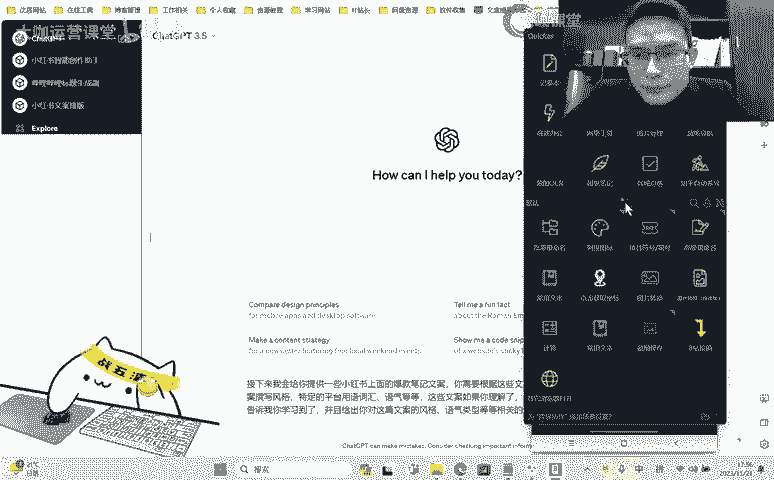
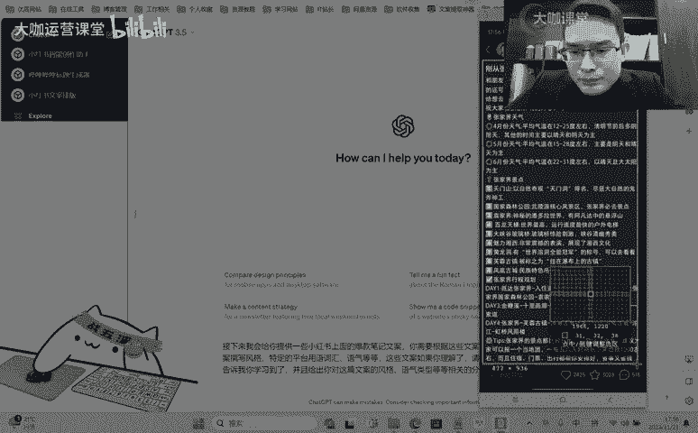
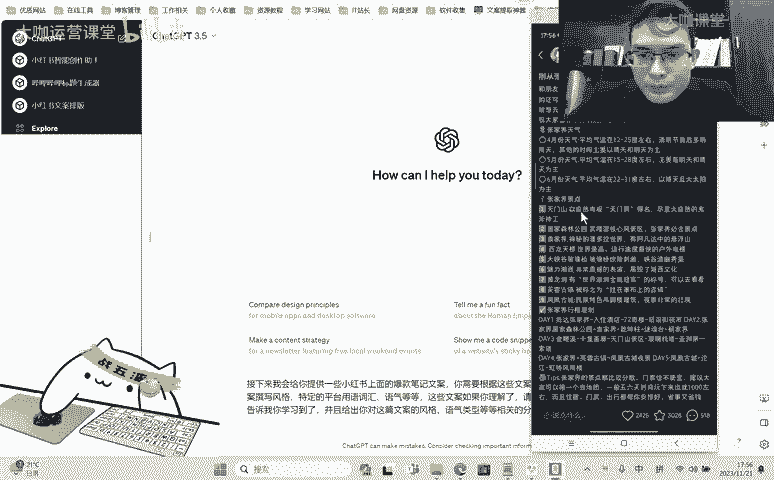
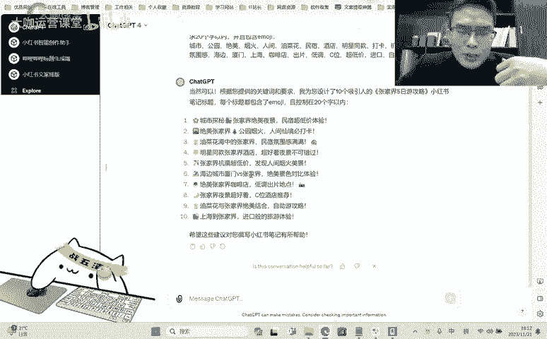

# 【新媒体运营300集全流程精讲教学！】史上最全小红书运营讲解+实操 起号／涨粉／引流／变现 能出爆款都靠这套公式！ - P14：01.10.2：Ai：训练Ai 写出符合小红书风格的文案 - 大咖运营课堂 - BV1PXWGe8EKK

OK大家好啊，欢迎大家来到我们这一节内容。那么上一节呢我们通过一些方法啊，通过一些这些内容去教大家怎么让掐GPT或者说一些其他的AI能够写出符合我们心意的这种小红书的爆款标题。那么这个方法呢。

其实不光是应用在小红书上面。那么如果说你做的是抖音的短视频，你做的是哔哩哔哩的视频。那么每一个平台。这个平台呢它都有它自己独特的一些关键词。

或者说这个平台上面的一些啊文化呀标题上面的就是大众比较认可的这种形式。那么如果说你能用这种方式把这些重点的关键词给它拎出来，然后整理成你自己的一个标题的这样的一个库。每一次呢你需要去写标题的时候。

你把这些东西带上，你让它根据这些内容，再结合你的一个主题去给你写出来，就符合这个平台风格的标题。那么其实都是可以的啊，都是可以的。那么关于AI这一块写标题。那么就主要就是这些内容。

那么剩下的呢我们需要去重点研究的一个东西，就是什么呢？就是内。😊，对吧就是我们这一节要跟大家讲的，怎么用AI去写出符合我们就是爆款结构，或者说符合我们平台风格的这种内容体系。

OK那么其实写内容啊大部分的内容呢，chaGPT它是能够给你写出来的。但是你怎么才能写出符合平台风风格的这种内容。这里的呢我们就要需要讲究几个点啊几个点。第一个呢就是文案的风格。

我要让他了解我要的是什么样的风格，那么你就必须得给他案例，你得告诉他对吧？我写的是这些内容啊，我给你提供的这些内容，我要写的也是类似于这种风格的内容。那么这个时候你就得给AI去喂材料。

给他提供一定量的其他人的这种爆款的文章。哎，这些文章里边呢分析出比如说一些专用的女性风格的一些用语啊，有一些这个少女般的活泼的这种气息的这种词语呀，或者说一些平台的专用语。哎。

像小红书上面大家都相互称呼，哎，宝子等等等等啊。那这些内容呢就是我们要告诉SGPT要让他通过我们提供的这个材料去分析出来，自己分析出来，并且记忆在自己的一个资料库中。

方便我们后面呢去啊根据这个东西来创作，对吧？那么我们来进行一个这样的一个简单的实操。比如说呢我们现在打开这样的一个chaGPP，对吧？他现在呢呃我们需要告诉他我们接下来做什么事情，对吧呃。😊。

接下来我会给你。提供。一些。小红书上面的。爆款。笔记。文案。你需要根据这些文案。分析小红分析小红书上面的这个什么文案撰写风格。呃，特定的平台呃爆款啊，或者说平台用于词汇。呃，语气。等等啊等等。然后呢。

呃，每一次。提供。呃。这些文案。如果你理解了，请在。每一次接收。本案。之后。告诉我，你理解。你学习你学习到了。OK那么这个呢就是告诉他他要做的哪些哪些东西啊，哪些东西。然后呢呃。😊，我看啊学习到了。

并且给出。你对。这篇文案的。呃，风德。语气。嗯。类型。等等相关的。分析好吧，呃，让他学习我们给的这个资料库，并且呢让他给出相应的这个什么呀，相应的这个回应啊，就说我们要让他告诉我们，对吧？你学到了。

那如果说我发给你了之后呢，呃你没有给我提示，那我哪知道你学没学到，是不是？当然他这个呢东西呢就相当于给我们一个正向的反馈嘛？OK那么我们打开这个啊。😊，还是一样，我们就以张家界的旅游攻略。

我们来看一下文案这一块它是怎么给的。

啊，嗯嗯。

我把这些退出字符都去掉啊。省事又省钱。哎，刚刚好。嗯 응 응 응。标题哎，我们给它注明一下，这个是标题，哎，这个是文案O。嗯发给他。最好是空一行啊，在。以个人游玩经历为主线，增加了真实感和亲近感。

以血泪教训和不踩坑建议为标题，强调了作者的经验教训，给读者传达了一种亲切的分享心态。哎，语其类型、担忧和焦虑。同时表达祝愿就是这个这个就写的啊这个语气类型呢，其实这个东西呢呃我给的并不是特别好啊。

但是我有一个作用就是能够让他去透彻的分析这篇文章啊，分析这篇文章。😊，小说上常见的标志性词汇，如爆款笔记文案等。显示出这篇文案是为了在红色。呃，我看一下啊，这里边有这个文案吗？爆款什么来着？

我感觉应该是没有的啊，正常的这里边怎么会有爆款这个词儿呢？OK应该是没有的啊。那么就是说它这里出现了一点呃。出现了一点智障类型的东西啊，那么这个我们暂时不管，我们接着再去找啊，我们继续给它喂。啊。

继续给他喂资料。呃，我们这个工作呢不是一次性的啊不是一次性的。就是说如果你有chGPT这样的一个账号，你在他的这个里边呢去呃对话当中，你去持续给他提供一个资料。那么后续你在跟他对话的时候呢。

他前面的内容呢都会有一定数量的去读取，也就是说相当于是记忆这样的一个东西啊。这个旅游攻略我看一下啊，这个旅游攻略呢其实讲的呃这个文案呢大部分的都是这种类型的。那我们找一个看有没有特色一点的。

有没有这种吐槽类型的呀？但是如果他的景点。多且散啊，这玩意儿再找找看还有没有呃这种内容上面的。分析比较比较比较比较强烈的啊，就是我们要提要要要通过他这种文案去找。嗯，姐妹们OK好。

那我们把这个玩意儿来提一下啊。凤凰古城。这是广告呢，这是。어 어 어。OK这个这个其实也比较一般啊，我看一下。诶。我先把这个发给他。这个时候就不用带指令了，他应该会懂的OK。好，我们再接着找啊再接着找。

😊，呃，那我们换一个题材，对吧？我们不搜了，我们去首页去找一找，看一下有没有别的。😀嗯。种草相关的看一下大老哥这个麦。视频相关的啊。哎，这个文案可以哦，避空的。发给他嗯。啊。

游客在文字中表现出了对自己的愚蠢和被骗的不满啊，这篇文案我没细看啊我没细看嗯。好，然后的话呢提供了几篇啊，就正常来讲呢，我们需要找几篇比较有特色的。就我跟大家讲几个注意注意点。

如果说你们在自己在做这个呃给他喂文案的时候，你一定要注意啊，就是喂资料的时候，你要注意你喂的这个资料里边呢？我们现在解决的一点就是让他了解这个别人在小红书平台上面发这种种草类的或者分享类的这种内容。

他们是用什么样的语气用什么样的方式去表述的，是以第一人称的方式去表述的，还是以啊这种第二人称第三人称的这种方式去把这个内容写出来。就是我们要分析的是这一点啊。

包括他的一些平台上面的用语啊子啊等等这些一定要让下把这个学会，而不是说我们去找一些你像我刚才找的几个点，就是很多他都是分享这种旅游路线的对不对？那这种路线呢其实都是通用的内容。这种内容的话，你发出去。

基本上他理解不了，对吧？比如说第一天第二天第三天啊去哪从哪什么路线这些东西呢都是通用的我们要去找的就是具有不同风格的这种小红书上面的一些类型的文案O。😊，好吧，我们这个呢我们就先演示到这里。

然后接下来我就需要去让他给我写一篇稿子了。好吧，我让他写一篇稿子，呃，请结合你的学习。😊，帮我写一篇。具有。爆款浅置的。嗯。诶。张家界。5日游。5日游攻略啊5日游攻略的。小红书笔记。呃。

具有爆款潜质的张家界5日游攻略小红书笔记嗯。要涵盖丰富的。小红书风格的。你冒着表情呃。同时配上10个。爆款标题。我们来看一下啊。呃，这个标题呢我还没有我还没有去培养啊，同时配上10个呃，符合小红书。呃。

旅游赛道相关的。爆款。符合小红书旅游赛道。爆款标题，我们看一下他能给我们写成什么样，好吧。呃，天门山景区啊。大峡谷惊险体验亚洲第一索道之旅，舌尖上的先进之位，自由探索先境啊。

不管你是先进探索者还是美食爱好者等等等等啊。我们看一下他的内容啊。诶。本皮记。精心准备的张家界5日游攻略啊，让我们一起探索这个先进般的地方吧。呃，国家森林公园来到神奇的张家界。嗯，天门山景区乘坐缆车。

调战玻璃占道。嗯，这个笔记综合来讲啊，写的不如人意啊，就是不尽不尽人意。就是怎么说呢？我们做旅游攻略的这个东西呢，一定要去把这个内容的一些呃特点给它表现出来。比如说张家界的国家森林公园，哎。

哪里是可以去的，哪里是可以不用去的，就是从什么路线去走，把这个玩意给它写清楚，然后呢，天佛山景区对吧？乘坐缆车什么什么挑战玻璃栈道，然后有哪些可以看的这种景点是可以需要注意的，就是这个过程当中。

我们能够看到哪些东西啊，袁家界的一个景区什么悬浮山呃，这些呢都还比较梦幻，或者说比较空，对吧？假如说我作为一个我想去看旅游笔记攻略的这样的一个人啊，比如说我来到了张家界我要去看，对吧？

你推荐这个东西呢一定要有一个景一定要有一个理由，对吧？这个理由当中有一些不好的，也要有一些好的，你让我自己去斟酌。如果说你只告诉我这个这个这个东西啊，你把它写的跟一首诗一样。

那我怎么能知道这个我怎么去判别这些这些景点哪一些值得我去。啊，去探索对不对？那这些景点列在我的眼前，那肯定有一些东西呃，它不是我特别感兴趣的，是不是？那么你要把这些东西写出来。呃。

所以说呢他写的这篇笔记呢还并不是让我很满意啊，但是呢。😊，我们要考虑到一点，因为旅游攻略这个东西呢，你给他喂的这些，我们现在给他提供的这些内容啊真的还比较的一般是吧？比较一般。那我们正常的来讲。

我应该去告诉他对吧？呃，张家界有哪些旅游景点，我把这些景点给他列出来，要么让他给我列出来，对吧？让给我列出来之后呢，我们再让他对每一个景点去做规划去做分析。比如说第一天去哪。

然后根据什么路线来走这个景点里边有哪些呃网上别人讨论比较多的这种特色，还有哪些可以不不能去采的这种坑让它给列出来。那么这一片比较比较完美。呃，这个也局限于我们提供的材料，而且这个旅游攻略这样的一个题材。

呃，我们确实提供的东西太少了啊，提供的东西太少了。因为我们看啊前面的呢基本上都是提供一些路线啊什么的啊，去哪去哪去哪啊，真正分析的啊，就是讲也只有这个啊这个被骗的呢，就是怎么说呢？呃就只有这么一条啊。

一条他给的就自然不是会很多啊，当然还有一个因素啊，还有一个因素就是我们没有付费嘛，对吧？我们用的。😊，PD的1个3。5。如果说用4。0的话呢，它应该会比3。5会聪明很多。O那么我们这个章节当中呢。

就是告诉大家啊，就我用的这些指令啊，我用的这些标题的指令，就是怎么样去让他T能更加符合我们运用的这个呃要求和目标。然后另外呢就是我们给他提供资料的这样一个关键性。

那我们这一节课用的是旅游攻略这边不是特别好弄的这个东西。那如果说你是做一些知识类型的内容，对吧？考研考公啊，或者说一些健康分析啊，健康达人呢，或者说一些科技博主啊啊这个一些其他的这种分享类的东西。

那这个时候呢你能提供的东西就很多了，对吧？你可以去百度上去搜啊，你也可以去其他的地方去找这种现有的文案，你拿过来喂给他啊，喂的足够了之后呢。

他就可以给你提供一些你想要的内容然后这个标题呢其实写的也不太对啊，我感觉了一下这个标题啊，就是跟我们上一节提供的还是有点区别的。所以说真正让他写标题的时候，你还是得运用相应的。指令对不对？

就是我们呃之前写的对吧？我们把这玩意儿啊这个是知识赛道的啊，我们把这个标题的指令提供给他，然后呢，我们再拿到我们这个什么呀，就是我们探店的这些赛道啊，一些爆款的关键词。让他来给我们写。张家界。5日游。

攻略啊攻略小红书笔记啊。包含。好，我们发给他这个时候创作的标题呢应该都还。嗯嗯嗯。呃，明星同款民宿C位夜景啊，上海的张家界超低价机票，厦门出篇旅游攻略，张家界超好看的自助旅行啊等等等等啊。

天门山绝美夜景打卡。这个玩意儿呢，就是怎么说呢？呃跟我们前面上一节跟大家写的那个文案还是有点区别的对吧？如果说你看了上一节课程的话，这个呢呃我可以跟大家解释一下什么问题啊。

就是你在当前这个就是你给他为了这些资料之后啊，你给他为了这些资料之后，你基于这些这些这些资料的情况下，去让他写一个啊你限定的这种内容的标题呢，他会有点问题啊，他就会有点问题。那么就是说你需要怎么做呢？

你需要创建一个新的这样的一个对话，让他去结合你固定的这些指令再来写。把热搜给它改成爆款。我们来看一下。明星同款打卡地点，张家界夜景超好看的CV啊。

油菜花海边野餐日记自助出片指南、咖啡店探店指南啊相应的就是还是可以的啊，还是相应的可以的，我们需要去做一些完善啊，做一些完善。那么这一节课呢就是告诉大家，我们去训练我们的AI的时候呢。

你首先啊你要把这个AI做的就是能够让他理解你这个专业的内容。就我们现在很多AI它确实知识体系比较丰富。但是你觉得他是不是你这个领域里边的一个专家呢？啊，他可以试。但是他并不能理解你的要求。

那么我们要做的就是通过各种形式去让他理解我们真正的一个要求。O那这个时候呢我看一下GPT4能给我们写成什么样啊。公园烟火人间仙境必打卡，油菜花中的张家界民宿氛围感满满。

明星同款张家界酒店超好看夜景不可错过，机票超低价，发现人间烟火美景。呃，写的倒也还行啊倒也还行。相对来讲，它比3。5聪明的可不止几十倍呀。这玩上用着还挺舒服的。呃，那么这一节课呢。

我们的一个重点就给大家讲到这里。那么下一节课呢，我们再继续深入去了解AI这个东西怎么去帮助我们完成一些我们做不了的这种小红书运营方面的一些事情。OK。

