# 【新媒体运营】小红书爆款笔记选题策略 - P1：1.【新媒体运营】小红书爆款笔记选题策略 - 大咖教运营 - BV1oy411v7fo

那么这些选题需求呢。

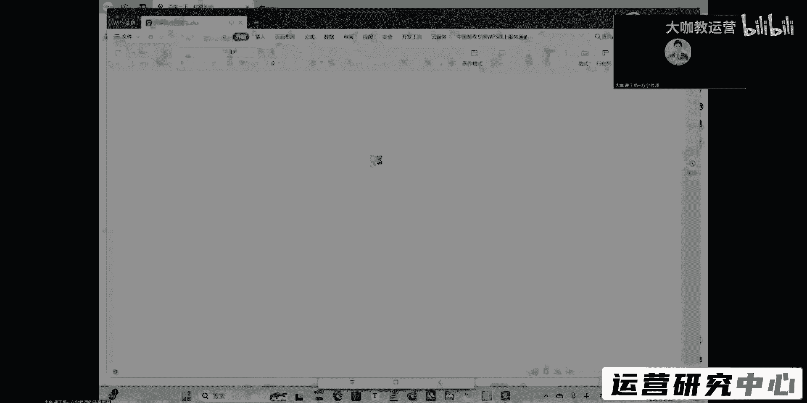

我给大家总结好了，这些是所有的我们这个行业里边，就是关于呃美妆这个行业，护肤这个行业，你们所有的就是大部分这个用户，他们在搜索这一块存在的问题需求，也就是说皮肤护肤相关的一些问题需求。

我们所有的东西我们做的内容选题，基本上是可以参照这个内容来的，虽然说它不能包含所有，但是已经包含了大部分的需求点，那比如说我们现在呃我们刚才搜的是什么来着。

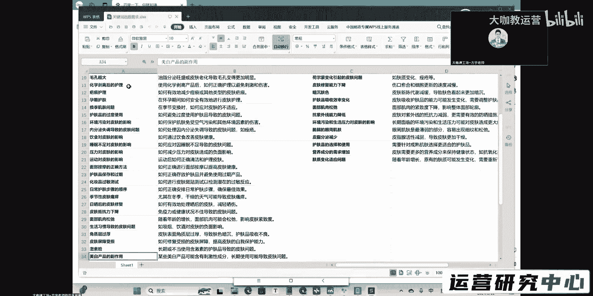

我们刚才搜的是油性肌肤对吧，那么我们来看一下，我们现在把油性肌肤拿过来对吧，我们把，我们把油性肌肤拿过来，然后的话我们再来看一下刚才的这个搜索词，我们回退一下对吧，它有精华面霜，是不是。

呃它有呃这个油性肌肤的一个面霜，精华洗面奶推荐，然后的话还有什么呀，呃还有我们的怎么改善对吧，这个呢是我们的一级搜索词，我就不列多了，那么我们现在来基于这个呃面霜，我们来做一下这个内容好吧。

那么这个呢我换一个地方去展现啊，好吧，我们现在是基于一级搜索词，油性肌肤，然后的话呢我们来看一下面霜，接下来呢我们基于面霜，我们来看一下它的搜索词，好诶面霜的这个词它又有别的需求了，比如说油性肌肤面霜。

男生对吧，然后适合油性肌肤的面霜，油性肌肤用什么面霜对吧，那么这个所有的这些词都是基于油性肌肤，面霜所得来的二级搜索词，那么正常的如果说你的词汇量更大，你的这个词汇的一个需求，更还有可以再细分。

那么其实还可以有三级搜索词，对不对，比如说我们在这里试一下油性肌肤面霜，男生啊，这个是没有的，那说明已经到底了对吧嗯保湿啊，这个已经到底了，没用了对吧，那这个我们正常的，如果说你的词汇对量。

在这个下面还有细分的需求点，还有其他的可以搜索的点，它就还有三级搜索值，那么我们再来看一下关于精华对吧，这里有这个油油性肌肤，精华油是吧，油性肌肤精华水，还有这个适合油性肌肤的精华。

然后呢混合油性肌肤用什么精华液，OK那么这些内容啊它都是基于这个词儿得来的，它的一个二级搜索值，那么我们做内容的时候，我们可以做，我比如说我们现在我们做一篇笔记，叫做油性肌肤面霜。

这个是我们所选择的一级啊，一级词啊，E级词，然后呢，这个抑剂丝具体里边我到底要做什么分类对吧，我可以去写适合油性肌肤的面霜有哪些，给大家盘点盘点就最好用的便宜好用的，给大家呃做一个合集。

然后呢呃油性肌肤面霜啊，男生最适合男生用的这种油性肌肤，最合最适合油性肌肤的男性啊，这种面霜给大家推荐一个，那么这是一个选题，也就是说我们拿一级搜索词下面得到的，二级搜索词，我们可以去做细分的一个查。

我们到底做什么样的一个内容需求，那么就是根据这个方向来的对吧，还有这个洗面奶推荐，然后皮肤怎么改善，这个就是我们的一级搜索词得来的二级搜索词，相应的这种我们内容的一个展现。

这个大家一定要理解搜索词这一块，它的一个精华就是它真正的这个价值点，还有非常非常多啊，非常非常多，那么这是我们跟着大家主讲的，关于搜索词这一块，你们自己去试一下这个东西。

就平时呢你们有时候比如说搜到一个东西，可能说诶这个精华油或者精华水，正好你想搜的，你那么剩下的一个字你就不会去打，你会直接点击，那么得到的就是你想要的一个搜索结果，好吧。

这个就是我们给大家讲的关于搜索啊搜索。

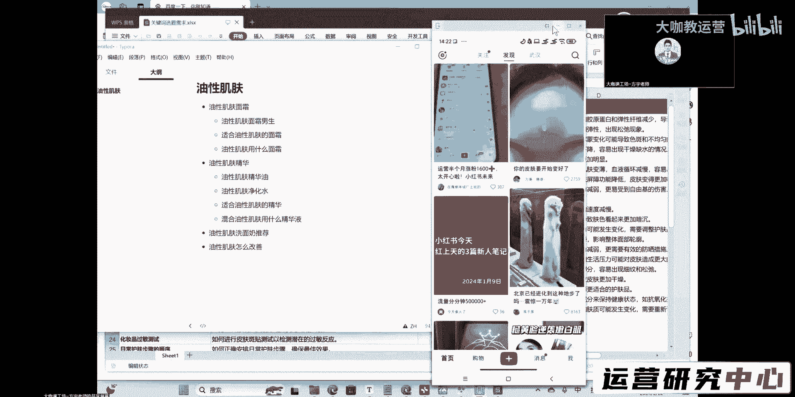

然后这个需求呢，这个需求库是我跟大家去搭建的，就是我之前呢有学员有有过这样的一个问题啊，他们是做什么的呢，他们是做皮肤管理的，然后呢这个同学呢之前听了我的课，他就呢去搜这个皮肤管理相关的，他发现诶。

为什么我去搜皮肤管理没有什么词儿啊，就是搜出来的跟我的业务啊，就是感觉没有多少是呃，跟我的这个用户相匹配的，那么你们现在做的是护肤对吧，为什么我没有让你们去直接在这里搜索，护肤，就是皮肤管理这个东西。

和我们具体的护肤遇到的问题需求点，用户他不会去搜索呃，皮肤管理对吧，用户呢他很少啊，或者说很少，他会去搜索皮肤管理，它更多的是依据于自己当下的一些，确切的需求点，比如说呃孕期护肤对不对。

他当下是一个呃几个月的这种呃，准宝妈对不对，然后几个月的，然后呢她可能说目前护肤有一些问题，她想搜一下适合孕妇用的护肤品，或者说精华，就是对这个孕妇是孕妇身体不会造成影响的，这样的一个确切的需求。

他会搜这些，他不会去搜呃，孕妇皮肤管理对不对，这个东西就太系统化，太怎么说呢，太宽泛了。

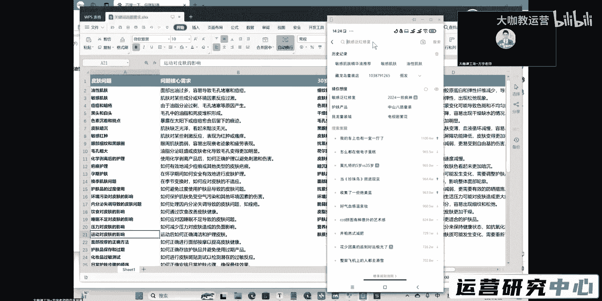

所以说我们皮肤这一块有一些东西啊，我们呃做护肤或者做一些其他的产品，你们再去研究用户的搜索词的时候，你们你要根据用户的一个确切需求点来搜，你不能说我自己做的产品，就是这个呃关于护肤的。

那么你就所有的你都得去搜什么护肤，然后根据护肤再来做二级次，三级次，那么这个有可能你做的这个方向就错了，所以说我们做运营所有的方向点，要结合用户真正的一个他的想法，和他的这个角色和他的这个角度出发啊。

这是非常关键的重要的一点，那么你们平时发朋友圈，你们是不是就是你们去做一些视频解说的时候，你们是不是也会针对什么换季呀。

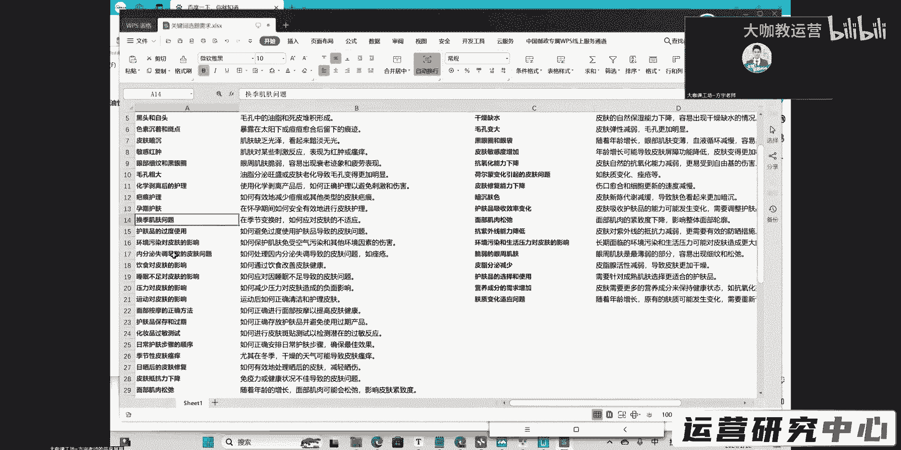

然后什么呃这个干燥缺水毛孔变大，然后敏感什么敏感度等等，那这些东西呢，其实就是你们去发现了用户的需求点，那么但是这些东西你们要把它整合起来对吧，在这里拿这些问题，从用户的角度去看，它会搜索什么。

你才能找到准确的方向啊，就是当前平台上用户比较关心的点。

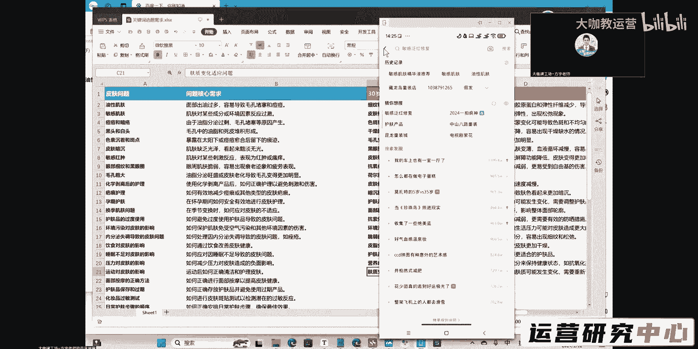

这个就是我们讲的搜索词这一块非常重要啊，利用搜索框，那么，那么图文和视频几个的优缺点，我都跟大家总结了一下，首先呢关于图文这一块，也就是说呃，这个笔记是由一张图片和几张图片啊，一个封面和内那几张内容图。

再加上一个标题和文案组成的，这么一个一个笔记，他的缺点呢比较明显好吧，缺缺点比较明显，就是这类笔记呢它展现形式呢就是比较单一哈，比较单一，然后呢呃它比较考验什么呢，考验你后期你做这一类内容的时候呢。

它考验你的一个封面的策划能力，那么我们上一节课讲的整个流量构成的，第一步的这个不知道大家还记不记得，最关键的点在于你的封面，你的封面做得好，才能吸引起别人的一个点击对吧，封面嗯，标题这两个东西呢。

封面是大于标题的，那么封面是决定了你这个笔记有没有人点击，然后点击了之后呢，呃进去了之后，你的内容做的怎么样才能去呃，决定你的用户能，能否给你的这篇笔记形成一定量的数据，这个是非常关键的。

也就是说做封面这个东西呢，你要有那么1。1。11点什么呢，一点策划的思维或者说呃理解的能力，当然这个呢我们后面我们后面要带大家去实操，但是呢老师会给你们把方向讲好，那么具体的轮到你自己要去想一个呃。

就比较好，比较优秀的这样的一个封面出来，我们还是要有一定的这个策划能力的，这个东西呢封面的策划基本上是一次性完成，那么一次性完成是什么意思呢，就是你这个封面做好了之后。

你后面整个账号围绕着这个封面来做改善，来做改造都可以的，那我记得上一次呢我们有一个呃学员，他是做什么的来着呃，呃就我们群里边有一个学员是做这个这个这个，这个叫什么来着呃，就是他想做护肤。

但是他的账号呢是做的别的方向啊，是做的别的方向的内容，他这个封面呢做的还挺还可以，就是挺统一的呃，但是呢他这个跟护肤没有关系，就是说他想把这个内容跟护肤相结合，然后我不是跟他说了吗。

就是他可能必须要重新起号的，就你这一类的内容呢，你去哦好像做摄影的，对不对啊，对做摄影做这个拍摄的，就是教别人怎么拍拍照啊，或者类似的那这样的一个账号，它的封面做得还可以，那这个内容呢。

呃就是他规划的这个封面方向是对的，那么我们后期呢你们做护肤，大部分的把这个封面规划完整了之后，你借用你之前的一个封面的结构，再去改善内容，那么就挺好的，那这个呢呃封面这个东西呢我先给大家看一下。

我们举个例子好吧。

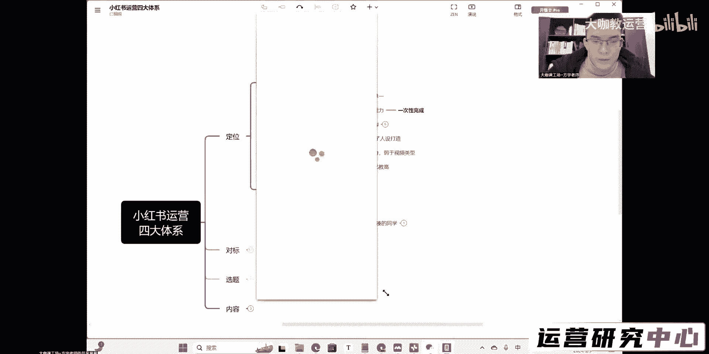

我们看一下找一个这种做的比较好的，我们来。

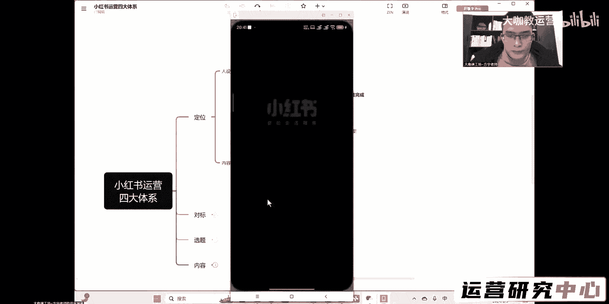

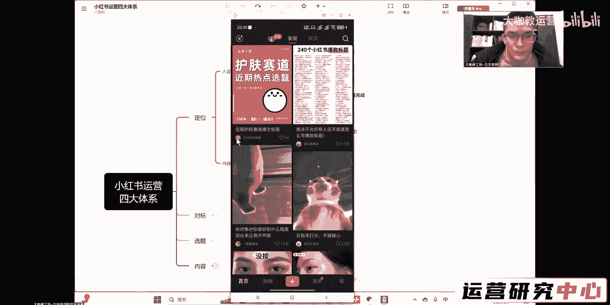

嗯那类似于这样啊，类似于这样啊，比较带有经营性的，这是一个旗号。

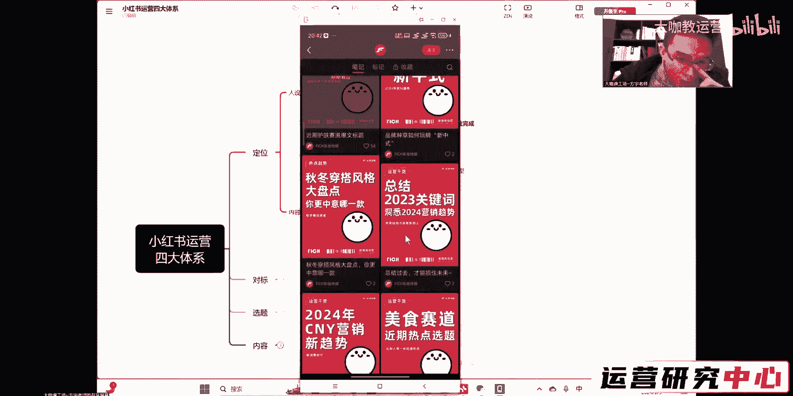

就是你们正常的封面呢，就是我们一般会把它的整体的一个风格，整体的一个风格版式做的差不多了。

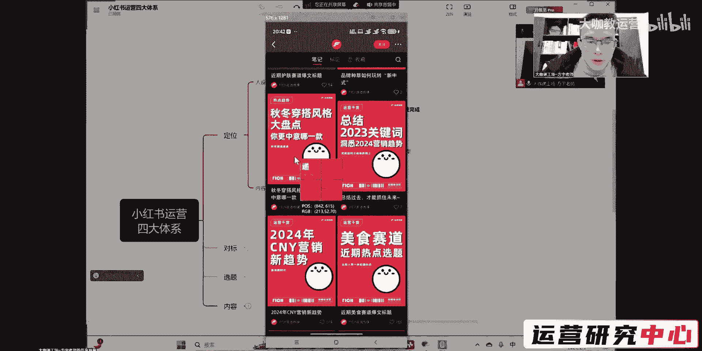

然后呢，我们后期呢就只需要改里边最关键的东西，就可以了，你看他这些封面它比较固定的点，有几个它比较固定的点，那像这个地方啊，这个地方这大，这这基本上都是不用变的嘛，就是说白了版式设计好了之后。

那么后期要调的就这里边的文字，是不是就这里边的文字内容，你把这些东西给它调一调，那么你的新的内容出来了就没有问题好吧。

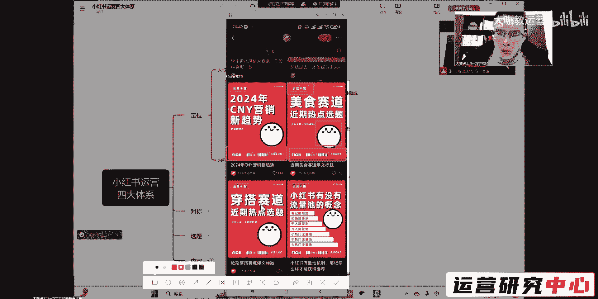

那么我们封面的一个设计呢，可以遵循类似这样的一个原则。

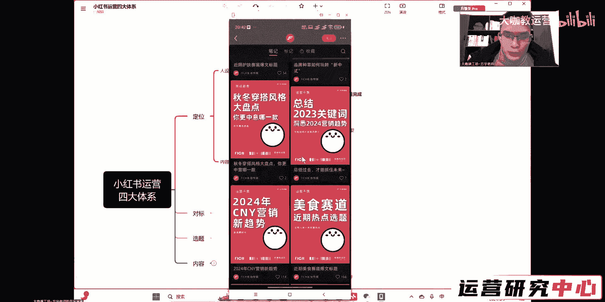

就是有设计好了之后，后面去改主体的内容就可就OK了，那么这个比较简单啊。

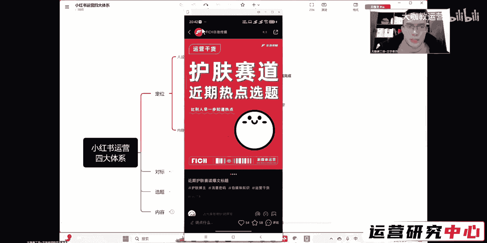

我就不多讲了，然后的话呢就是优化文案的一个结构啊，优化文案的一个结构，那么图文笔记跟视频笔记呢，有一个非常明显的点，就是视频笔记，它如果说写的就你这个文案稍微那么一点点啊。

但是视频就是他通过这个因为有人物的表现，有人物的表情，然后呢有人物的这个整个阅读的过程，他可能体现的不是那么明显，但是图文笔记就不一样了。

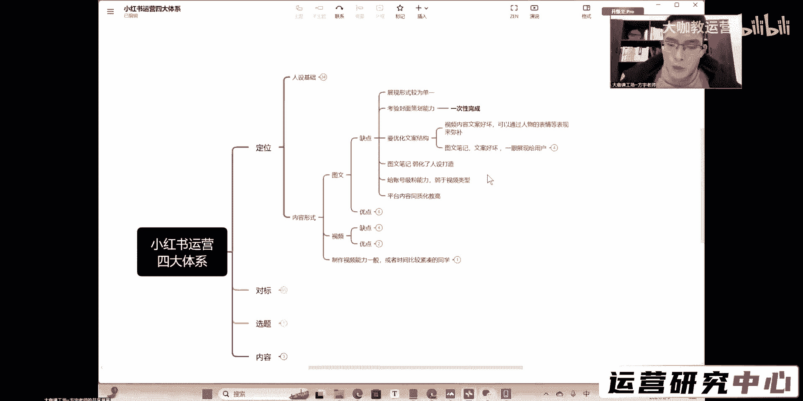

你打开一篇笔记，他写的好不好，那基本上就在这一眼。

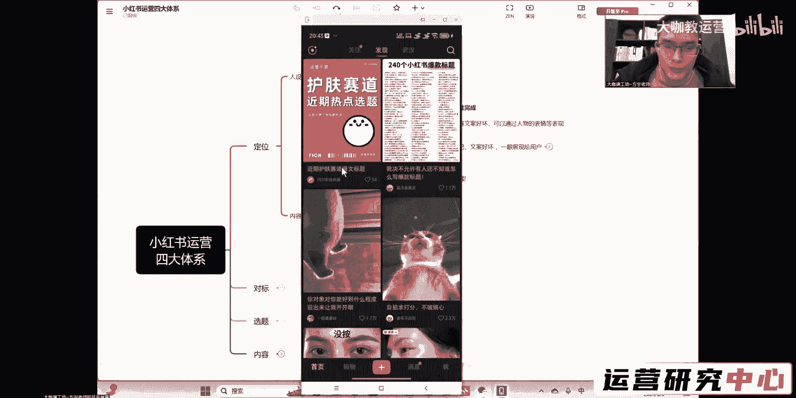

就为什么一眼就看出来了对吧，你的文案大概这有哪些，然后你封面上的文字等等这些内容，那基本上用户一眼就能瞟到，你这个东西写的好不好，尤其是文案，如果说写的太长，或者说没有结构性的。

那这种文案那看一眼就走了。

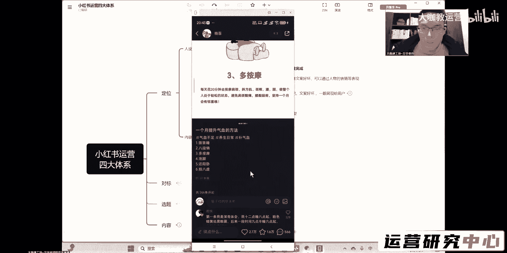

我们整个笔记的内容能否对用户形成一个停留，就决定了就取取决于什么呢，取决于你这个文案到底写的怎么样，好吧，这个文案我们也一样会教给大家来写，这是它的一个缺点，就是你们要考虑一下我们做图文的话。

这个文案呃，这是它的一个呃，就是比较你们很多人比较头疼的点好吧，然后呢还有一个图文笔记呢，它弱化了一个人设的一个打造，因为图文笔记呃，用户他关注的是你单篇的图文，给他提供的一个价值，但是如果是视频笔记。

他更关注的就是你这个视频里边，人物给你讲述的这个方式，就比如说我们我现在在给大家上课，你们可能更关注我现在跟你们讲的是什么东西，你们不会去更关注我，这上面你不会说只为了阅读这些内容。

你假设没有这些东西呢，你也会听我去讲，因为因为就是说呢，我有一个人物在这里给你们生动的去体现对吧，我去告诉你们，但是图文这个东西它是静态的，图文静态的，就是它只会关注你这个内容啊，就很很关键很关键好吧。

然后呢图文也有一个点，就是他吸粉能力呢会比视频类型的弱，就是我们所有美妆这一块，相对来讲粉丝数量比较高的，都是呃视频类型的啊，我这么跟你讲啊，就是粉丝比较高的这种头部主播，一两百万粉丝的这种主播。

这种博主，我啊他们的这个账号都是以视频主打视频为主，因为他们的人设在上面打造的特别强啊，特别强大，你们应该也关注过一些吧，你们应该也有关注一些，那么呃图文能力的呢，图文这一块。

他的一个优点就是他能够带来大量的给粉丝呃，也不是粉丝啊，他能够带给通过单篇笔记，给你带来大量的流量和数据，也就是说引导到私域，他的能力会比你的视频这一块要强啊，视频的话就是你账号起粉丝的这样的一个能力。

要很要强很多，但是图文的话涨粉会慢一些，但是图文单篇笔记爆了之后，能给你带来的这个客户就会远多于视频类型的，那视频类型的，当然你你你到了这个几10万粉丝的程度以后，那可能也差不多对吧。

然后呢图文类型的还有一个点，就是平台上面的一个内容同质化较高，那么这个时候就考验你做你做图文类型的笔记，你能不能把这个内容呢，呃给他想的就是把他的关键点给它描述出来，就比如说我们举个例子，有同学。

呃我这个有同学的作业对吧，作业里边明确了一个需求点，像这个痘痘肌，或者说呃呃冬天皮肤比较干，脱皮这样的一个需求点，你能不能针对这样的一个需求，把他的这个文案罗列好，那么这就是呃我考验。

比较考验我们的一个文案架构能力了，那么这个文案怎么写，我也会去教大家的好吧，你们也暂时不用着急，然后我们学完了之后，你们再来看这个东西，然后关于图文的一个优点哈，优点我给你讲一下。

就是很多人现在拍视频可能拍的不太好，但是你用图文来产出笔记，如果说你掌握了技巧的时候，一到两个小时，你可以产出非常高质量的一篇笔记，就是我们通过一些AI的工具，去写这样的一个文案。

然后把这个文案呢细节再给它梳理一下，那么这一个高品质的文案就出来了，然后呢因为他这个速度快嘛，所以呢它可以保证什么呢，它可以保证量化，那么量化了之后，你的账号就更容易出效果啊，更容易出效果。

你一定要记得就是小红书呃，前期起号的时候，你的量决定了你后期的一个质，什么时候出来好吧，有量才能有质，你不要说我拍视频拍的特别精致，然后呢呃呃我我一天两天三天一条，那么这样的一个量更新下去。

一个月十来条的一个笔记，你的账号前期就很难很难出效果，好吧，很难出效果，星号现在都是这样啊，然后的话图文呐，霸占这个关键词的一个搜索概率。

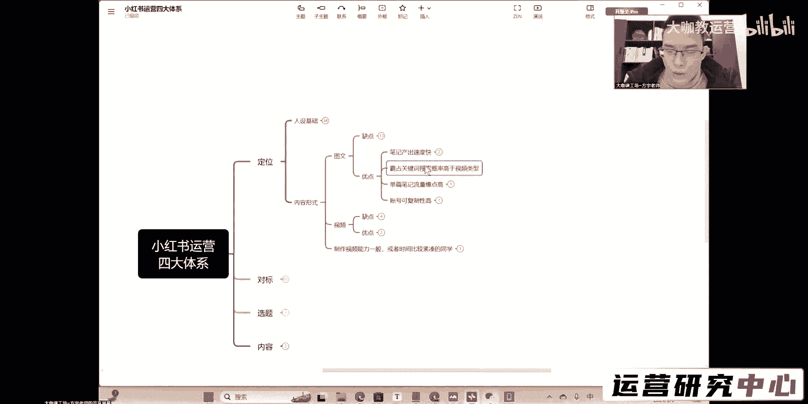

它也远比这个视频类型高，就是你现在你去小红书上去搜索，然后我们举个例子。

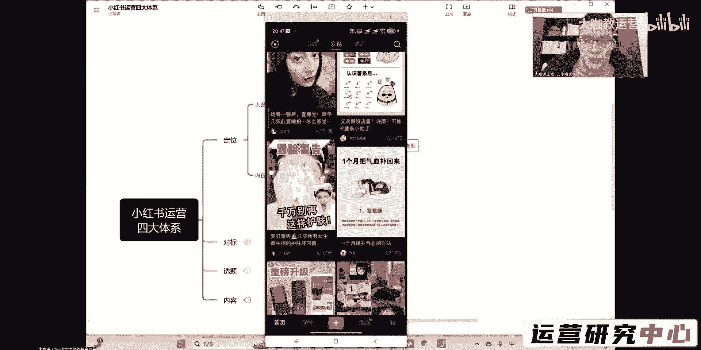

比如说冬天皮肤。

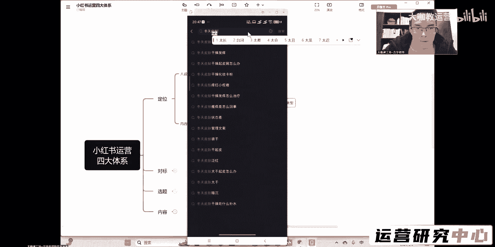

太干燥怎么办，我们来看一下吧。

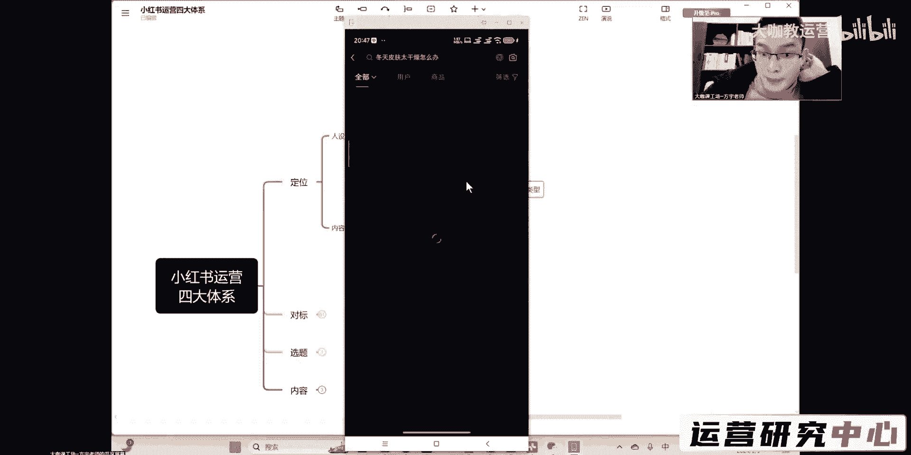

下边的话呢图文的笔记占比会给会要多一些，你们自己也可以在你们自己的小红书上面。

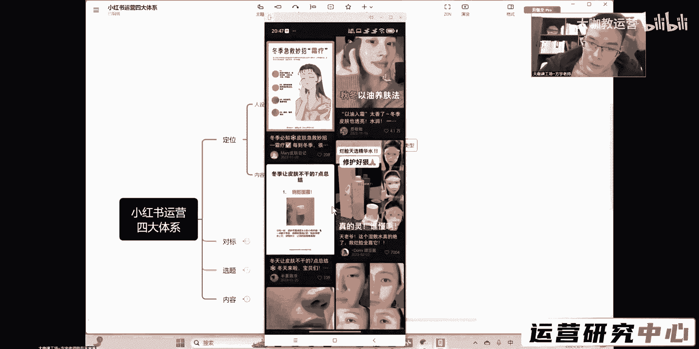

去搜一下图文，在这个搜索结果的占比上面。

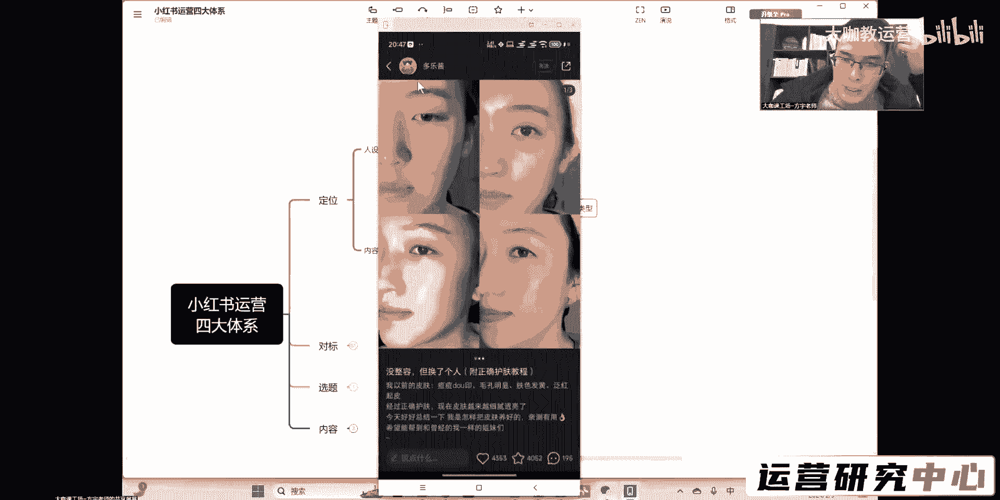

要比这个视频的占比要高一些，也就是说你想通过这一块去获取流量，持续的通过你报的这样的一个笔记去获取流量，那么图文笔记它得来的一个效果，会比视频类型的要高啊。

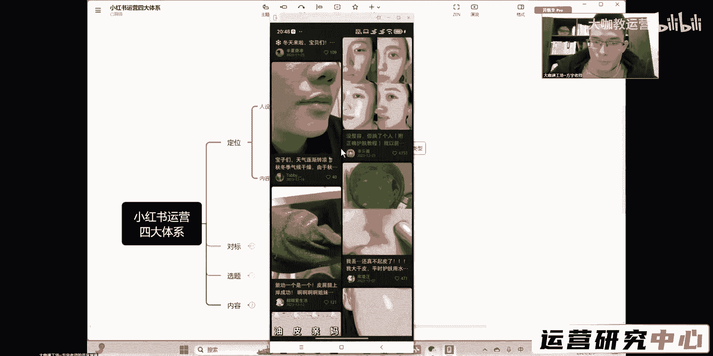

从你不要是你的账号，如果说你的账号关注过很多视频账号的话。

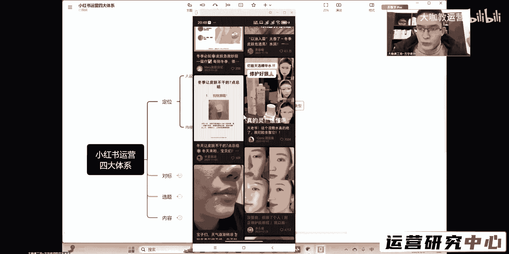

那么这个结果有可能就有一定的区别，但是对于很多刚开始，或者说这个在这个这个领域方面，使用这个小红书呃，不是特别重度的用户来讲，他们在搜索的结果当中，图文的占比会高很多好吧。

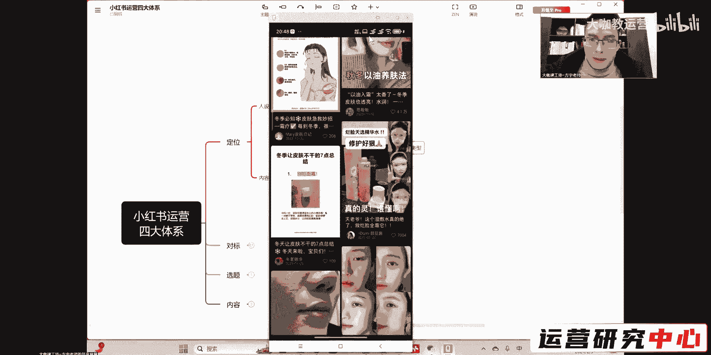

图文的占比会高很多，这就是在搜索排名这块，然后呢单篇笔记的一个流量爆点高，这也是它的一个特点，就是你做图文的话，图文笔记它就它的吸粉能力弱，但是他的这个流量爆发之后呢，就像我们之前讲的。

它会持续给你带来流量提升，这个一定要理解好吧，一定要理解，然后呢另外就是它的一个可复制性，那么我们做小红书，其实上一期我跟大家盘点过，你们做小红书其实最难的几个点是什么，就是你们不知道一开始做什么对吧。

比如说没有人去教你们怎么去打造人设，也没有人教你们去怎么去选择，对标账号到底怎么定，然后呢后期这个选题怎么做，就是没有人去教你这块的东西怎么弄，那么我们做图文笔记。

我们是实打实的把这每一个东西彻底落实下来，那么你后面你你你你觉得，就你把这个方向走下来之后，其实你对整个小红书的一个运营方向和逻辑，你是特别清晰的，那么你这个账号如果起来了之后，你去你再去复制一个账号。

复刻一个账号，你就能把这个东西研究的特别清楚，你的思路就特别清楚，你再起一个新的账号，你就知道第一步你该做什么，然后其中有哪些选题是你可以重复去去复制的，这是一个图文笔记这一块，它账号的可复制性高。

那么如果说是视频类型的，视频类型的，它的爆点有很多，可能是基于你个人的一个表现力，对吧啊，你个人的一个表现力也可能是基于什么呢，基于你的这个嗯怎么说呢，整个你你你的一个颜值或者说其他方面对吧。

那么这个时候呢就是你做视频，他报道的话呢，有一些因素你是不好去判断的，但是做笔记做这个图文类型的笔记，你就能够很清楚的，我当时做了哪些选题，我这个选题是参考的这个人的，然后我在什么时候发布的这个笔记。

这个你是非常清楚的，就是你可以去复制这个东西，那么这是图文笔记的一些优点和缺点，然后视频笔记的话就比较，就你就他的这个门槛呢会稍微高一点对吧，你的整体的它的一个制作周期长嘛，我们现在应该有同学。

我我看一下有多少同学，你们现在是主要做视频内容的啊，主要做视频内容的，有做这个视频账号的，不管是抖音还是小红书，给老师扣个一好吧，我看一下嗯，啊梦露同学，我知道你的这个抖音是做的还可以的，呃，就一个吗。

这一个做视频的是吧，其他的没有同学去平常拍一些视频嘛，给自己对吧，自拍一些视频，然后发一下朋友圈什么的，然后有时候配一些文字之类的，我记得应该还是有的呀，不止一个吧。

视频类型的他呢需要你你我你们剪辑的这一块，应该也是你们的弱项，对不对，剪辑这一块额，然后这这个点我给你们讲一下视频的制作，视频的选题方向和剪映这块，我们呃后面的课程会跟大家教。

我们会详细去教大家这个视频怎么去做，怎么去剪，然后别人是怎么拍出来的，这个你们先不要着急，就是这些东西我们会教给大家，那么你想在这一块把视频类型的内容做好，你后面这个这个内容呢你就要好好去学。

好好去听好吧，然后视频的话呢也要规划一个视频的脚本，这个脚本怎么弄，也是我们放在后边去讲的啊，这是它的一个难点，优点的话呢就是这两个吧啊，展现形式呢就比较好，就是通过图文的啊。

不通过你这样的一个视频的内容，可以把你的整个内容，更立体地展现给我们的观众，那么他的这个整个账号的一个呃，就是我们通过视频账号的一个吸粉的效果呢，比头文的要强啊，这是它的一个优点和缺点，那么你具体的。

我们所有的你现在制作视频能力一般，或者说比较紧凑的同学，你现在去做这个内容，就你开始落地实操的时候，你的内容呢图文和视频的比例你可以做三比一，这视频也要有，除非说你真的没有时间，你整个视频做不好。

你觉得拍不好，或者说自己不想出镜，那你只做图文，如果说你有能力做视频的呃，就你视频做的还可以的，那么你就拍视频，那如果说你可以做视频，但是呢你又没有那么多时间，就按照我说的这种图文和视频的比例。

三比一就K了，那么这是我们整个内容形式这一块的一个构造，一定要确定好好吧，一定要确定好，你去研究好自己的方向，你们自己想一下，你们到底是做图文还是做视频比较那个啊，视频的话我跟你讲，我们就是教给了大家。

整个视频的一个整体的一个剪辑，和你的视频的一些拍摄的方法，你的视频的制作难度也要远大于图文，好吧，也要远大于图文，所以说你你这块呃，你们要考虑一下到底做哪一个，根据你自己的时间和你想去制作的一个方向。

把这一块考虑好，就是马上起号的时候，你你就你你要确定好这个东西。

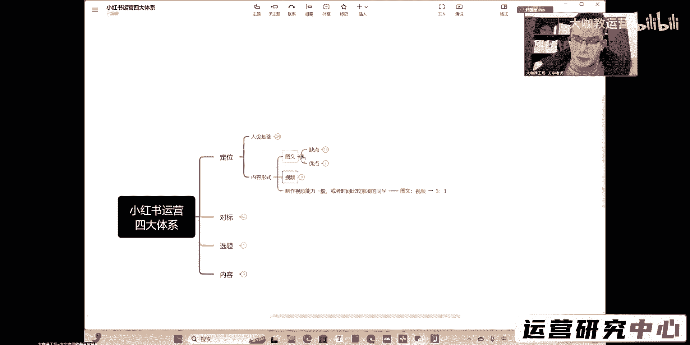