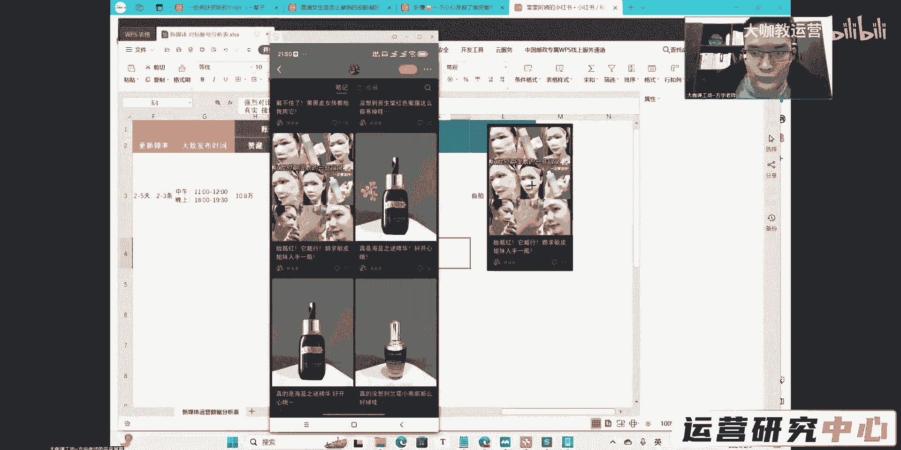

# 【新媒体运营】小红书笔记如何分析对标账号 - P1：3 - 大咖教运营 - BV1ui421Y73d

然后呢是我们的关键词搜索曝光了啊，关键词搜索曝光这个东西是什么呢。

它就是指我们在关键词这一块的一个，匹配度了啊，我们的账号的一个权重，还有我们笔记数据的互动量，也就是说我们正常的来讲对吧，你的这个观看我这个是因为这个数据太小了，这里看不了啊。

那么我们正常的我们每一个笔记，它的流量来源，就是一开始是搜索占据最大的一个流量来源，那么后面一开始是首页推荐啊，那么后面呢就是搜索的流量是最大的，后面呢就是搜索的流量是最大的。

也就是说你在后面你去发布的这个内容啊，呃它的主要流量可能就来源于别人，搜索过来看你了，是不是，那么搜索这块能得到多大的曝光量，就取决于我们刚才讲的关键词，SU这一块的行为。

也就是说你要把你的关键词在内容当中布局好，你的标题当中要包含好你的话题里，还有你的封面图片里边也要包含，就是你把这种基础的SU的行为我们给它做足，那么剩下的你的这个笔记，在搜索当中能有多少展现。

就取决于你的账号权重运营的怎么样，你的权重分到底有多高，然后的话呢你这个笔记的内容优化的质量，在曝光之后，用户点击了之后，能能不能给你带来短期内，快速的这种数据的互动。

OK这种就是我们影响关键词搜索曝光的一个嗯，呃影响我们曝光量的一个结果好吧，然后剩下的呢就跟发布时间有关了，我们的所谓的发布时间呢，其实你们只要关注这四个点就OK了，那么早上的7~8点对吧，中午的11：

30到12：30，我们正常的黄金时间呢，中午的11：30到11：50，那是一个非常不错的时间，然后下午的呢05：30到晚上08：30都是发笔记，不错的时间，OK啊，这个时间节点你们都可以关注一下。

其他的不用去太考虑什么特别细分的那些细节，那些都是噱头，没有用，你的笔记在这几个时间节点发，就是最佳的黄金曝光时间，O这就是我们的笔记曝光量，然后的话呢我们再跟大家讲一下。

成为爆款笔记的几个最核心的因素啊，最核心的因素，首先我们爆款笔记产生的一个核心啊，就是有两个，一个是呃基于平台的一个算法，就是我们要去研究平台，它到底爆款笔记产生的一个算法，到底是怎么样的。

就是我们前期研究的这些所有的东西，我们笔记的内容，还有我们待会要讲的权重，我们的选题SEO对标定位等等，这些都是平台算法得出来的，是不是，那么这个呢是我们前面讲的对吧，我们也给大家提过了封面和标题对吧。

它决定了你的一个曝光点击率是不是，然后笔记的质量，笔记有没有敏感词，它决定了我们这篇笔记是否会被平台收录，那么收录这个东西呢，你们应该大部分人都知道啊，收录就是代表着你在搜索这里。

去搜索你笔记的全部的名称啊，你笔记的名字标题不包含表情啊，符号可以带，那么你搜索全部的内容能够出现你的这篇笔记，那代表着你这篇笔记被收录了，有收录是代表着是你能够参与这个搜索流量的，一个特别重要的前提。

也就是说你先要有先要被平台收入，然后呢用户在搜索这个关键词的时候，你才有被展现给他的这个呃资格好吧，这个是收录，然后呢笔记排名对吧，笔记的数据决定了你的一个搜索排名，这个数据啊写的比较笼统啊。

这个数据呃除了数据上的碾压，还有我们刚才讲的什么呀，用户的对你形成的一些互动的一个行为，还有你这篇笔记跟这个关键词之间的一个，紧密的结合度，以及你这篇笔记它的一个数据产生的这个呃。

就正常用户的数据产生的这个数据的一个周期，时长好吧，这个是平台算法，然后呢关于数据这一块的分数，也跟跟跟我们刚才讲的评论和关注，是最大的对吧，这块呢是0。8，然后呢呃点赞收藏，0。1转发分享啊，0。

4啊，其实转发分享的话，他的这个权重也挺高的，但是我们正常的这个值呢，这个我们求不来小红书上面的转发，分享的这个这个这个这个这个互动率啊，它会远低于点赞和收藏，我们抓点赞收藏这个东西就可以了嗯。

我们来看一下这个账号，他是3万粉丝，99。6万的赞长，那么这个你们应该是可以发现，老师之前跟你们讲的一个点呃，我们图文类型的笔记呢，它吸粉确实要比这个正常的差一点，但是为什么这个账号他就能做得好。

因为所有的这种图文类型的笔记，它能给你带来持续源源不断的一个数据，你像这些赞藏，它的量很高，都是基于之前持续不断爆发的其他的笔记，它的一个这个数据来的，可能说关注的粉丝确实没有多，你像这个差距多大呀。

3万的粉丝对吧，然后呢，100万的赞藏是不是他的一个差距挺大的，然后像这些都是广告产品嘛对吧，现在呢应该是这个账号在这一块是可以做的。

相当相当厉害了，怎么老断你啊，嗯那么我来带你们分析一下，就是我们现在做这一类的笔记，我们做这一类的账号，比如说现在你去找了一个这样的一个对标账号，你怎么去分析它。

好吧，我们来看一下要分析哪些东西呃，首先我们先来看它的一个封面哈，看它的一个封面上面呃，它提供了哪些东西啊，这个是产品，这个是产品啊，这应该都是广告，这是报备了的，我们看一下这个，对吧。

这个是这个是图文类型的笔记，然后的话呢还有产品类型的。

我们来看一下这个。

嗯还有这些我们来看一下啊，首先这几个呃，第一个呢，这个这个笔记上面写的是SPA级卸妆体验，边卸边养，然后边卸边嫩，几十块钱不要命的好用卸妆界卷王，那么呢这个呢就是纯纯的一个分享好物了。

分享这种便宜的好物，那如果说你自己来做这一块的内容，你做这样的一个封面，做这样的一个笔记，你考虑做什么样的一个选题，能够吸引住别人的兴趣，然后呢还有这个啊，还有这种这种的话呢。

就是把你所有的这种整个时期的，相当于是记录类型的，呃，我们刚才不是看到有这种反差类型的嘛对吧，那这个呢其实就相当于记录类型的，从一开始怎么做，它的一个步骤，相当于是把它放在封面上了，我第一步做什么。

第二步做什么，第三步做什么，他相当于是把这个步骤放在封面上，一眼告诉你诶，我这个笔记其实就是告诉你，卸妆或者说护肤的这样的一个步骤，你通过这个封面你能看到这样的东西，你点进来你还能看到更多的内容是吧。

这个呢就是拼图嘛对吧，拼图把这个整个步骤放上去，或者说形成一个对比的，那么我后面还有一个账号，是跟这个比较类似的啊。

然后还有这个这个呢就是Q人群嘛，跨向点就是把这个不好的一面给他放出来，不好的一面放在封面上，然后再去讲解决方案，怎么去弄标题，就是写这个这个呢也是一样，呃，他的一个点黄糙皮护肤镜头，素颜底气十足。

其实广告的意味挺明显的，但是呢嗯你们觉得类似于这样的东西，你们会去点吗，就是假设说呃推荐给你的，你们会去点这样的内容吗，你们要考虑一下，他的这个整个好物分享的一个感觉啊，做的就是还是挺那个的啊。

还是挺那个的，但是我觉得正常的这种做的做的还是不太够啊，还是不太够，但是所有的这种类型你要考虑，如果说你做好物分享，或者说你去分享这一类的产品，像什么学生党是吧，学生我们刚才讲的学生党或者宝妈群体。

他们用什么样的东西，你你就得你就得考虑一下，这上面有一些有没有你结合的点，你可以去弄的，可以去放的，比如说他的这些关键的呃，用词红脸时期湿敷的一些记录，还有垮相脸，还有这个黄糙皮护肤镜头。

那这些点下面放两张脸的一个对比照片，让别人一下子看到是什么样的一个结果，但他这玩意还放小了，其实如果说正常来讲的话，把这个上下一张脸进行一个对比，就像我们刚才去那个我们刚才分析的那个账号。

反差比较明显的上下两张效果对比图，这个呢也是一个方向好吧，这个也是一个方向，这个图文的话呢，其实整体的呃思路并没有太那个作品，整体感觉目的性太强烈了对吧，那肯定的呀，人家现在有100万的赞呢。

他他他现在所有的都接到广告，他的这个账号的一个盈利，盈利的一个效果摆在这里了，就找人直接去带呀，所有的都是这样对吧，但是有什么办法呢，就是这样的内容他做起来之后呢，他确实他就是能够参与搜索排名。

他的笔记流量就是大。

然后呢商业价值也确实就是高。

