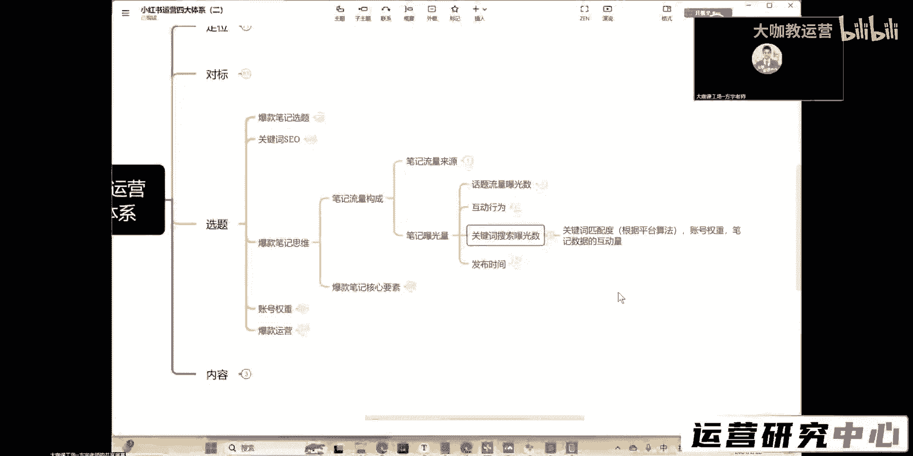
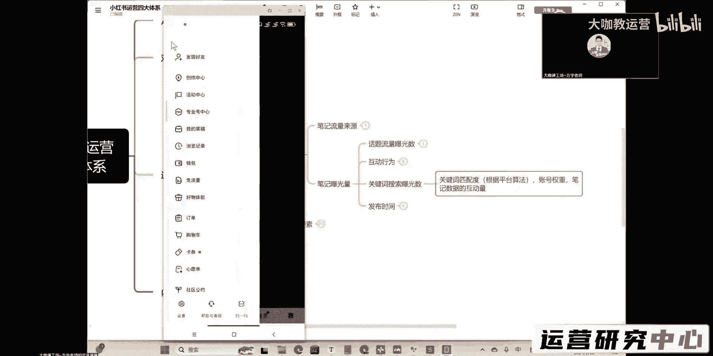
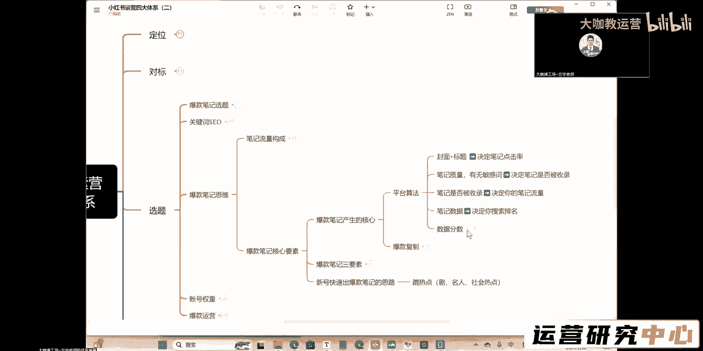
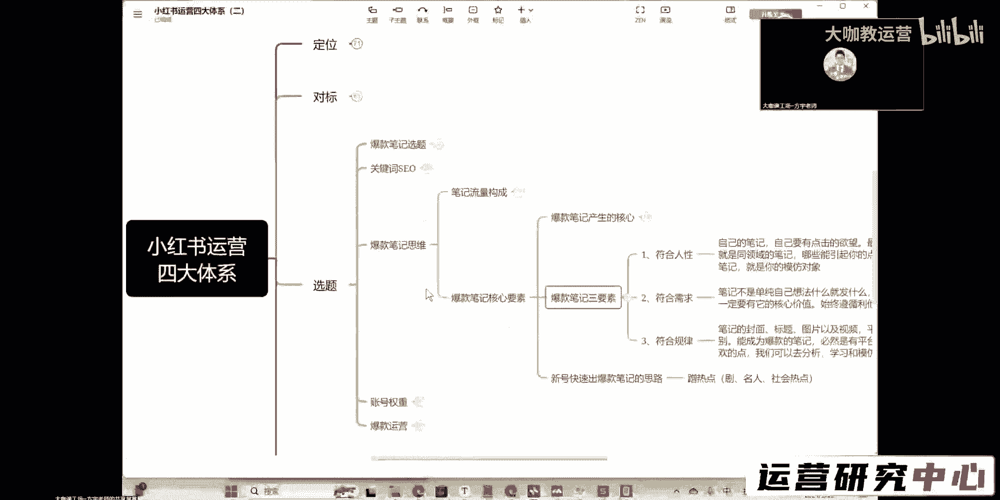
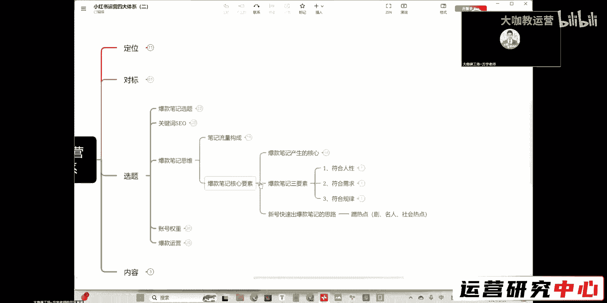

# 【新媒体运营】小红书笔记曝光关键词搜索技巧 - P1：2 - 大咖教运营 - BV1z1421b7Nq

然后呢是我们的关键词搜索曝光了啊，关键词搜索曝光这个东西是什么呢。

它就是指我们在关键词这一块的一个，匹配度了啊，我们的账号的一个权重，还有我们笔记数据的互动量，也就是说我们正常的来讲对吧，你的这个观看我这个是因为这个数据太小了，这里看不了啊。

那么我们正常的我们每一个笔记，它的流量来源，就是一开始是搜索占据最大的一个流量来源，那么后面一开始是首页推荐啊。

那么后面呢就是搜索的流量是最大的，后面呢就是搜索的流量是最大的，也就是说你在后面你去发布的这个内容啊，呃它的主要流量可能就来源于别人，搜索过来看你了，是不是，那么搜索这块能得到多大的曝光量。

就取决于我们刚才讲的关键词，SU这一块的行为，也就是说你要把你的关键词在内容当中布局好，你的标题当中要包含好你的话题里，还有你的封面图片里边也要包含，就是你把这种基础的SU的行为我们给它做足。

那么剩下的你的这个笔记，在搜索当中能有多少展现，就取决于你的账号权重运营的怎么样，你的权重分到底有多高，然后的话呢你这个笔记的内容优化的质量，在曝光之后，用户点击了之后，能能不能给你带来短期内。

快速的这种数据的互动，OK这种就是我们影响关键词搜索曝光的一个嗯，呃影响我们曝光量的一个结果好吧，然后剩下的呢就跟发布时间有关了，我们的所谓的发布时间呢，其实你们只要关注这四个点就OK了。

那么早上的7~8点对吧，中午的11：30到12：30，我们正常的黄金时间呢，中午的11：30到11：50，那是一个非常不错的时间，然后下午的呢05：30到晚上08：30都是发笔记，不错的时间，OK啊。

这个时间节点你们都可以关注一下，其他的不用去太考虑什么特别细分的那些细节，那些都是噱头，没有用，你的笔记在这几个时间节点发，就是最佳的黄金曝光时间，O这就是我们的笔记曝光量。

然后的话呢我们再跟大家讲一下，成为爆款笔记的几个最核心的因素啊，最核心的因素，首先我们爆款笔记产生的一个核心啊，就是有两个，一个是呃基于平台的一个算法，就是我们要去研究平台。

它到底爆款笔记产生的一个算法，到底是怎么样的，就是我们前期研究的这些所有的东西，我们笔记的内容，还有我们待会要讲的权重，我们的选题SEO对标定位等等，这些都是平台算法得出来的，是不是。

那么这个呢是我们前面讲的对吧，我们也给大家提过了封面和标题对吧，它决定了你的一个曝光点击率是不是，然后笔记的质量，笔记有没有敏感词，它决定了我们这篇笔记是否会被平台收录，那么收录这个东西呢。

你们应该大部分人都知道啊，收录就是代表着你在搜索这里，去搜索你笔记的全部的名称啊，你笔记的名字标题不包含表情啊，符号可以带，那么你搜索全部的内容能够出现你的这篇笔记，那代表着你这篇笔记被收录了。

有收录是代表着是你能够参与这个搜索流量的，一个特别重要的前提，也就是说你先要有先要被平台收入，然后呢用户在搜索这个关键词的时候，你才有被展现给他的这个呃资格好吧，这个是收录，然后呢笔记排名对吧。

笔记的数据决定了你的一个搜索排名，这个数据啊写的比较笼统啊，这个数据呃除了数据上的碾压，还有我们刚才讲的什么呀，用户的对你形成的一些互动的一个行为，还有你这篇笔记跟这个关键词之间的一个，紧密的结合度。

以及你这篇笔记它的一个数据产生的这个呃，就正常用户的数据产生的这个数据的一个周期，时长好吧，这个是平台算法，然后呢关于数据这一块的分数，也跟跟跟我们刚才讲的评论和关注，是最大的对吧，这块呢是0。8。

然后呢呃点赞收藏，0。1转发分享啊，0。4啊，其实转发分享的话，他的这个权重也挺高的，但是我们正常的这个值呢，这个我们求不来小红书上面的转发，分享的这个这个这个这个这个互动率啊，它会远低于点赞和收藏。

我们抓点赞收藏这个东西就可以了嗯。

嗯然后呢爆款笔记的一个三个要素，是不是啊，我们来看一下三个要素。

首先呢符合人性，符合需求，符合规律，是不是啊，所谓的符合人性呢，就是你的笔记呢，你最起码你自己你要有点击的欲望，对不对，就是你要了解一下，你站在用户的角度，你写的这篇笔记，你的封面和你的内容，到底用户。

他有没有可能去产生点击的一个兴趣和欲望，如果说你自己都觉得你这个笔记非常普通，那你就不要想着用户这个平台给你掉下来，这是什么非常不错的流量了啊，给你今天搞个99加，那是不太可能的事情。

哪怕讲究玄学和运气成分都这样，你都已经太堵了，我们正常的我们就要把这个东西控制好，我们就要保证我们每一篇笔记，具备所有的爆款因子啊，把这个东西不掌握好了，你才能够更好的去掌握流量，OK那么符合需求嘛。

是不是啊，这个也很能理解，我在第一课的时候就跟大家讲了，我们做笔记不要去想着自己去想什么，我们就去做什么，我们一定要站在用户的角度，我们要去考虑一下，我能够给他提供什么对吧。

我能够给他提供什么真正有价值有意义的东西，那么它才能够用户点击了之后，他才能对我的账这个内容形成一个数据，是不是我们先有点击，然后呢我们才能有这个笔记的数据，把这两点控制好了。

你的内容就是一定是能够做好的好吧，你的账号是一定能够做好的，然后呢是符合规律对吧，笔记的封面标题图片以及视频啊，要让平台都能识别对吧，我们成为爆款笔记，必须是有平台及用户喜欢的点K。

那么这个呢就是我们前面讲的好吧，这是我们要符合运营的一个规则啊，这个每一个里边讲究的细节点，从我们一开始讲定位，讲对标，将我们爆款笔记的选题以及我们关键词的SEO，还有呢我们爆款复刻啊。

我们的这个笔记的内容的一个构成等等，这些都是我们要去注意的点，好吧。

