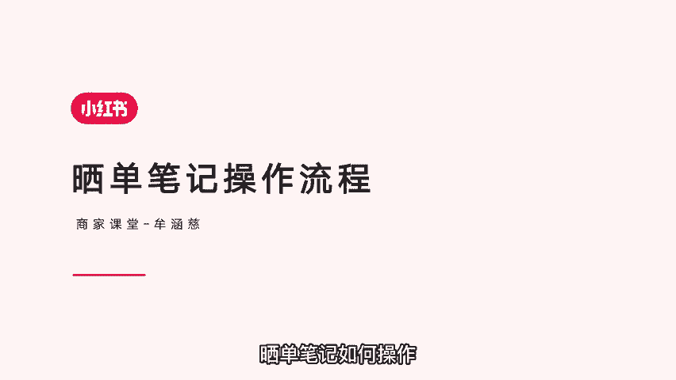
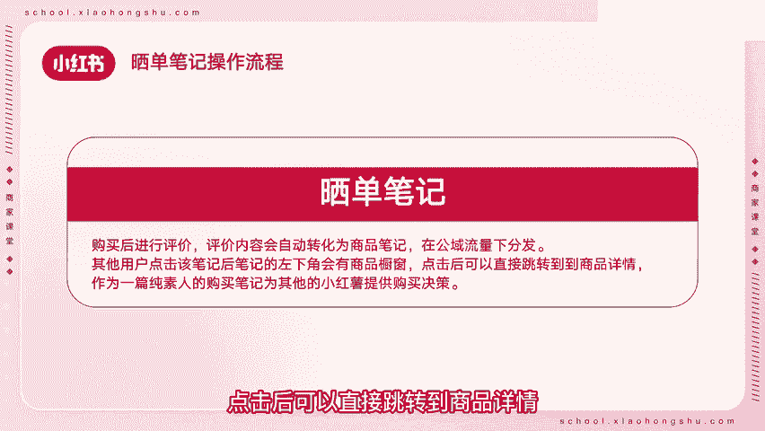
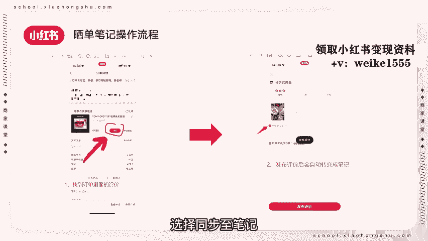
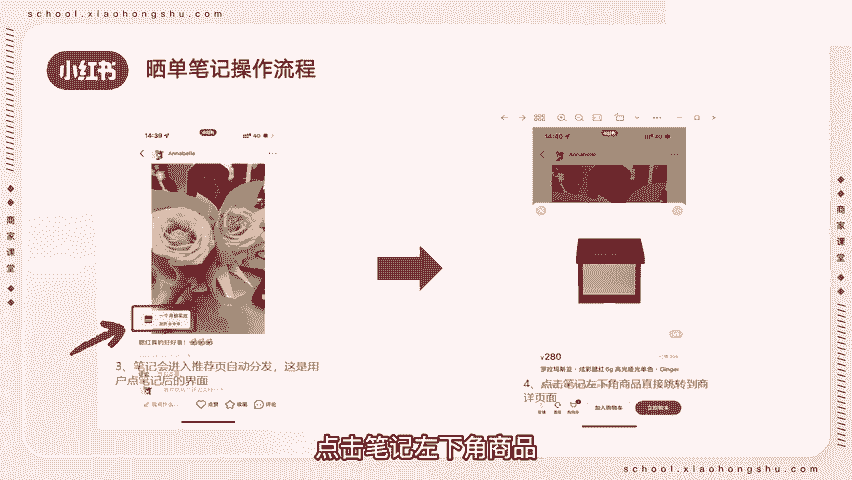

# 【新媒体运营】小红书运营全套课程 零基础进阶起号运营教程 小红书爆款笔记打造／ 商业变现／涨粉技巧／高效就业 完整版流量机制全套课程！ - P17：11.晒单笔记操作流程 - 红书运营小子 - BV17cY5eLEoo

商家朋友们好，欢迎来到本期商家课堂，很多商家朋友们都想知道晒单笔记如何操作。

今天教大家晒单笔记操作流程，那么什么是晒单笔记呢，晒单笔记是购买后进行评价，评价内容会自动转化为商品笔记，在公寓流量下分发其他用户，点击该笔记后，笔记的左下角会有商品橱窗，点击后可以直接跳转到商品详情。

作为一篇纯素人的购买笔记，为其他的小红书提供购买决策，消费者可以在订单详情里找到评价，填写好评价内容和图片后，选择同步至笔记。

点击发布评价笔记会进入推荐页，自动分发用户，点击进入笔记后，会看到消费者购买时间和评价星级，点击笔记左下角商品。

会直接跳转到商家详情页面，以上就是晒单笔记的操作，是不是非常简单，大家可以去发布自己的晒单笔记，分享购买体验，本期商家课堂到此结束。

