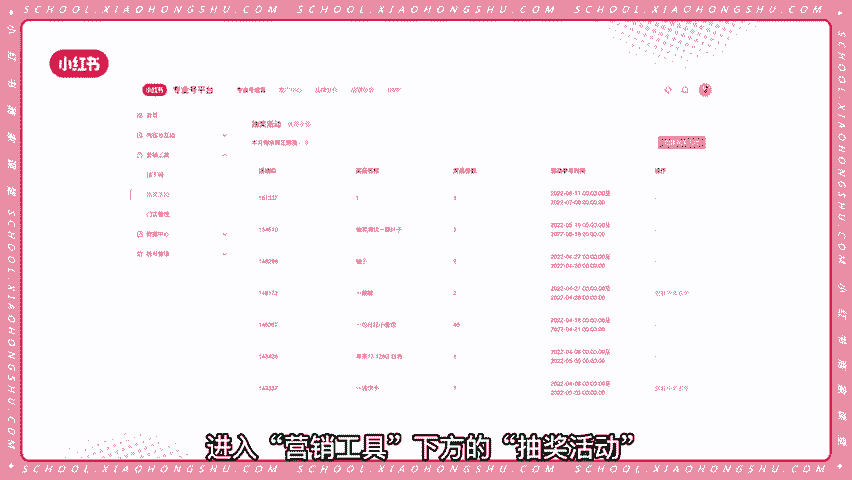
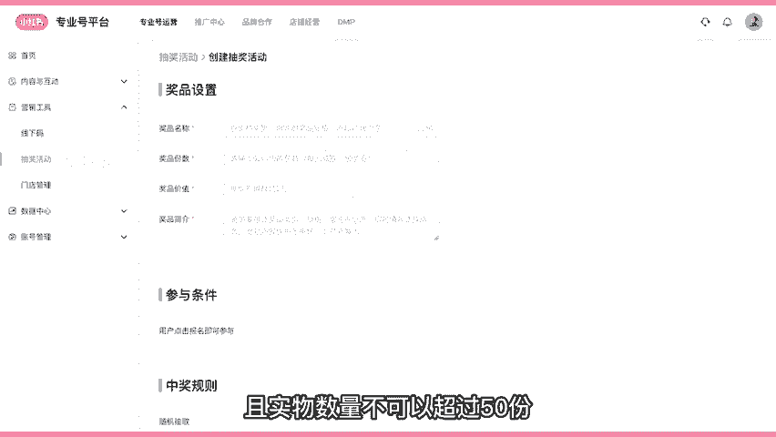
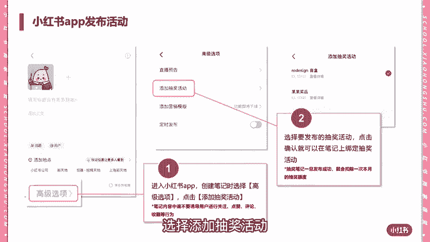

# 【新媒体运营】小红书运营全套课程 零基础进阶起号运营教程 小红书爆款笔记打造／ 商业变现／涨粉技巧／高效就业 完整版流量机制全套课程！ - P18：12.抽奖笔记玩法 - 红书运营小子 - BV17cY5eLEoo

各位商家朋友们大家好，如果你想增加店铺曝光率，促进成交率。

增加粉丝粘性，给店铺引流，那么一定不能错过本期商家课堂的主题。

抽奖笔记玩法，首先我们来了解一下如何创建抽奖活动。

第一步需要在电脑端登录专业号平台，点击开通抽奖功能，开通抽奖功能的条件，必须是专业号企业身份或者专业号个人身份，且粉丝量大于等于1000，专业号企业身份每月可创建三次抽奖笔记，专业号个人身份。

每月也有一次抽奖笔记的机会哦，开通完抽奖功能后，我们需要创建抽奖活动，进入营销工具下方的抽奖活动。

点击创建抽奖活动，接着填写这次抽奖活动的重点信息，包括奖品名称，奖品数量，奖品价值及奖品简介等，并设置活动参与时间与开奖时间，注意当前平台仅支持可寄送的食物，且食物数量不可以超过50份。

电脑后台配置之后，需要切换到手机app端来发布抽奖笔记，点击加号，选择封面，在发布笔记页面点击高级选择，选择添加抽奖活动。

点击确定后，你就完成抽奖活动的设置了，那么发布之后如何查看中奖名单呢，在专业号平台营销工具下方的抽奖活动页中，可查看中奖用户的收件地址与电话，也可以在这里看到，点击导出表格。

就能够下载中奖名单的收货信息表，填写表格之后，点击上传发货信息，上传表格，最后请大家不要出现抽奖活动的违规行为。

诱导刷单，恶意活动和用户信息滥用等行为是严重违规的，诱导互动，附加限制条件和抽奖规则，违规属于笔记，违规，不发奖品或超过30天发货，属于发奖，违规，商家必须在30天内填写发货单号。

今天的商家课堂到此结束。

