# 【新媒体运营】小红书运营全套课程 零基础进阶起号运营教程 小红书爆款笔记打造／ 商业变现／涨粉技巧／高效就业 完整版流量机制全套课程！ - P20：发货面单问题 - 夏季来临时 - BV1SnYjeuEQ3

OK跟大家讲一下今天关于呃发货面单的问题啊，怎么去解决，首先第一个点什么呢，就是你们一般去找拼多多商家，让他们帮你做代发的时候，很多商家觉得你现在这个量不大啊，很多他不是不给你接受，给你做代发的。

当你遇到这样子的商家，你怎么办呢，你一定要学会去给那些商家做画大饼，你就跟他讲说，我现在一个天的话呢出单量一两百单，我希望你给我做个代发，然后的话呢我希望你是能够给我发货的时候。

不要出现好评卡的这个事情，然后也不要有短信，然后的话呢你尽量的能给我手打单发货，手打单发货，现在拼多多的面单啊。

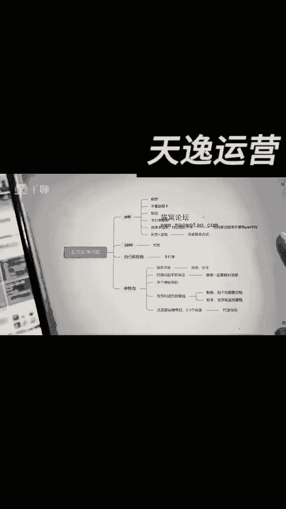

现在你去做发货啊，他的面单上的话呢是可以去选择，把这个拼多多的这个面单上的。

这个拼多多字样啊，给他去掉的，所以说你也可以跟商家说，我这个面单上我不想要带着拼多多的字样。

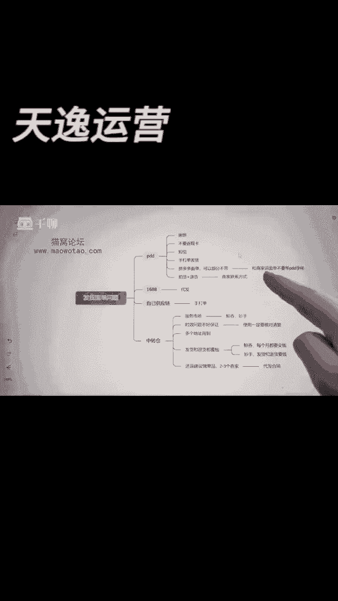

能不能去掉啊，你看看他能不能给你去掉。

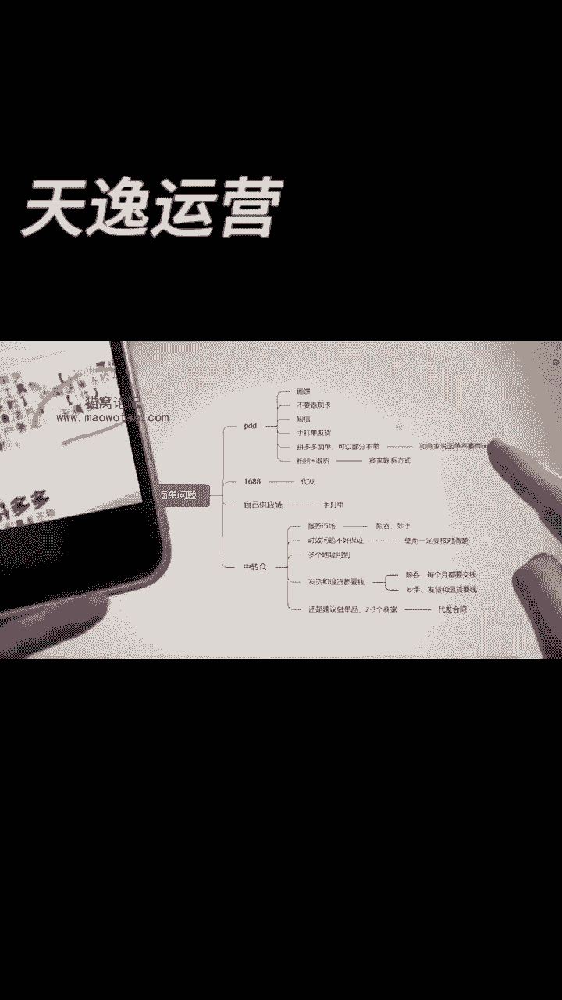

如果说你能去掉，基本上啊你就能直接用拼多多去发货好吧，但是你面单短信好评卡一定要去去掉啊，一定要跟那个商家提前说。

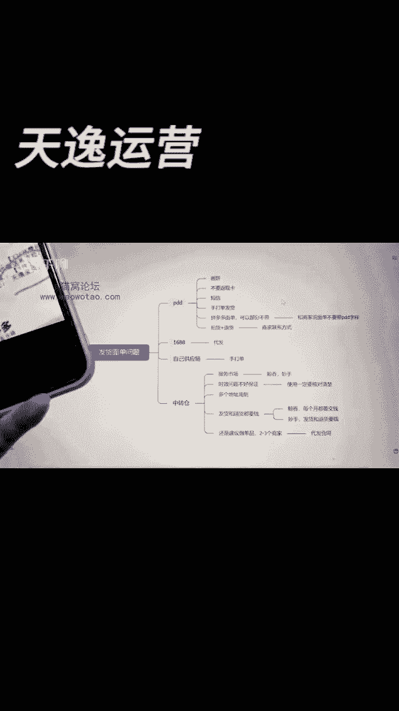

那很多人说了，我能不能直接要到这个商家的这个联系方式，那便于我之后下单的时候。

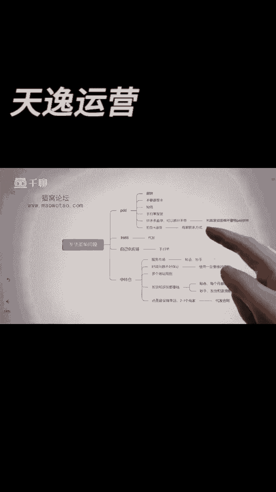

我找他，找他方便，那么一般的话你可以问客服，直接要，如果说有些客服他不给你。

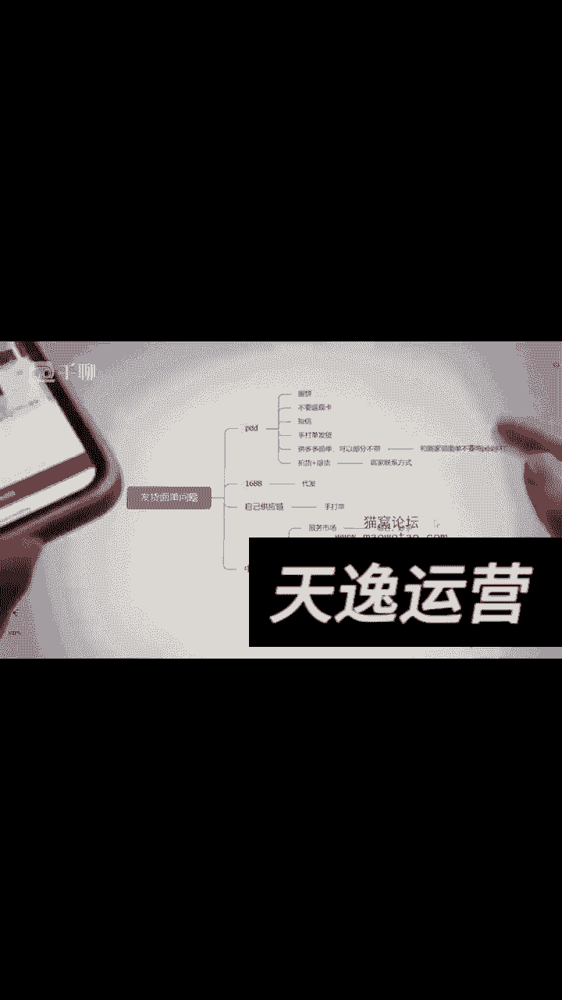

你怎么办呢，我教你个方法啊，顺藤摸瓜，就直接，比如今天你要卖这个货。

这个货里面的话，你就直接给我点击这个拼单去拼单，下个单，下单完之后。

你等他发货的时候，你再给我选择退货啊，可以不用到你手上，你就选择退货。

退货的时候他不是会给你自动选择，就是跳出那个退货地址的吗，客户那个商家信息的吗，这个时候你就可以顺藤摸瓜的要到。

要到他的联系方式，然后你就能联系到这个上面。

懂了吧，基本上那个上面退货信息啊。

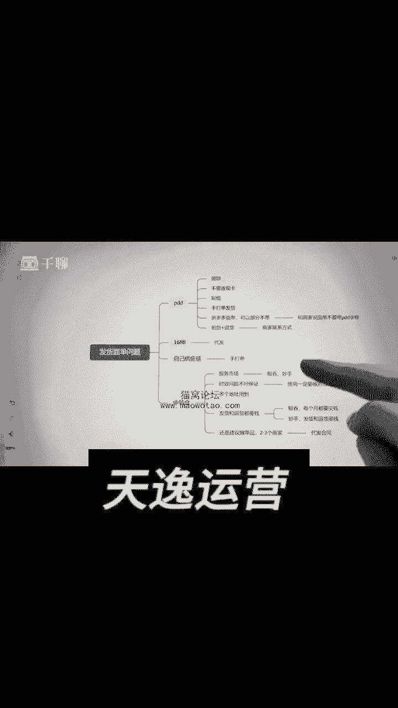

商家退货信息就会有，他会有这个联系方式，你就能找得到，这个基本上我跟你讲啊。

你就这么操作，你都能找到这个商家啊，哎这样的操作还是找不到中。

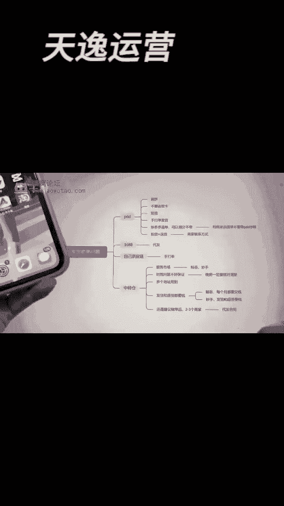

概率是非常非常小的，你怎么办呢，你实在是找不到，你可以换一家。

找一个同样的品，再换一个商家找嘛，要一个这样的联系方式不就行了吗。

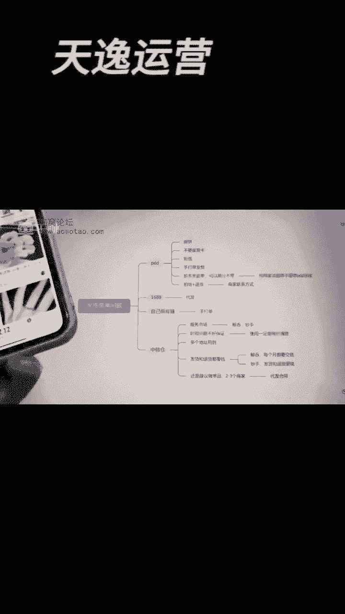

比如你今天是找168做代发的，你想打个比方啊，我们要卖这个手链。

你这个手链的话，你就找一个能够给你做一件代发的商家，然后的话这个地方基本上就是直接代一件代发。

立即下单就行了，如果说这个时候你不放心。

你怎么办呢，你先找这个客服，你跟客服说我这个产品啊的。

比如像这个产品给他发过去，你说我要去做无痕发货的啊。

不要显示电话信息，这么跟他讲，我要无痕。

发货可以吗。

不显示第三方信息。

等他回复。

你看可以，你下单和我说看到没有。

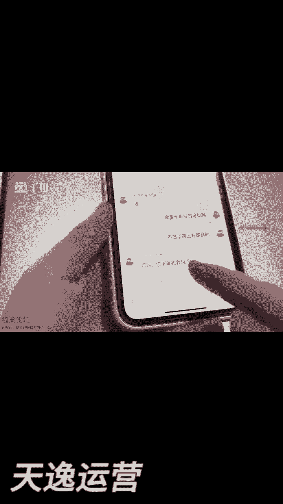

然后你在他这下完单之后，你不显示第三方就行了。

不发做代发，你们可以，如果说你拼多多上找不到你腰了，包上也可以去找，反正现在1688上的话，批发平台挺多的啊，产品也挺多，你放心去找就行了，但是我跟你讲，如果说有些很多人说啊，那我今天的话呢。

我用的是我我这的供应链，或者是你自己的供应链，那你一般做手套来发货来，如果说你们是多品的啊，你们担心被查无货源的。

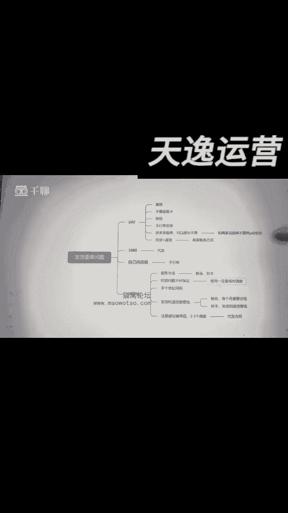

你怎么办呢，你可以通过中转仓，中转仓是在哪呢，小50的线翻，你打开打开之后。

全部工具里面这个下面看到没有，这地方有个电脑端，你先打开。

你先获取这个地址已经复制好了啊，然后你可以打开这个手机件，看到没有。

或者打开你的电脑都看你自己啊，再打个加号，把刚刚那个你复制粘贴上去并前往。

看到没有，就会自动跳出这个小红书网页版的啊。

电脑版的这个登录平台这个后台。

然后的话呢我们进到中档餐啊，我教你们怎么进啊，这个后台里面搜索这个鲸吞，看到没有，他就跳出这个鲸吞了，他会跳先跳到服务市场，然后你再搜索一遍鲸吞就跳出了吃鲸吞。

看到没有，然后你就直接前往获取，我们到时候会单独出一个课，关于这个中转仓啊，我们怎么玩，我给你单独讲一节课的啊，因为他这个玩法的一些呃思路啊，可能他要整一个带你们操作一遍。

然后你通过服务市场用鲸吞和妙手这两个。

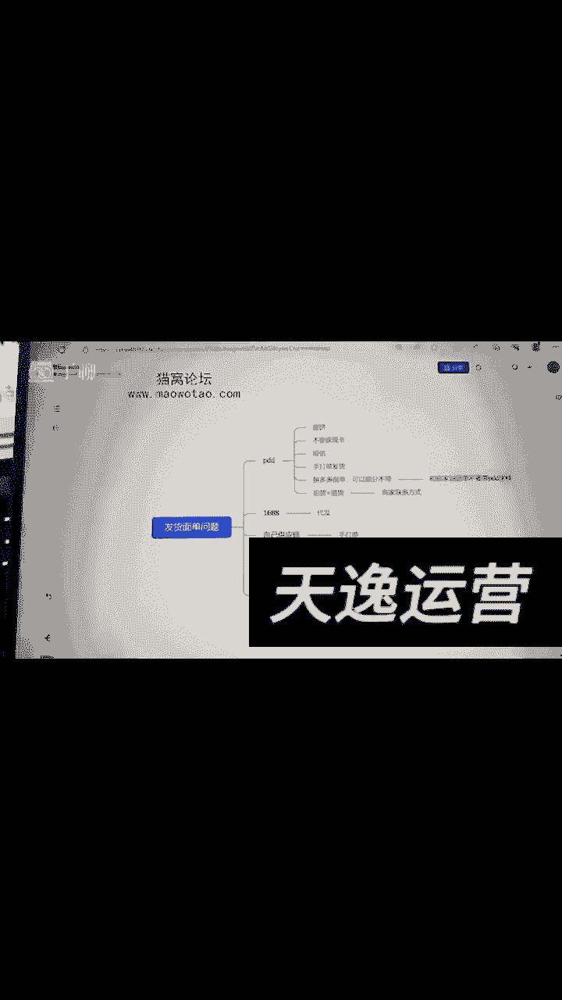

这两个都是可以去做中转仓发货的，但是你要记住啊，他有个问题就是京东和妙手，他们宁愿做发货会有个时效性的问题，因为你出单了之后，你要把这个货先给到他们鲸吞那边，然后通过金吞那边再把货发给你对应的买家。

所以说你记住啊，一定要跟他们核实清楚，核对清楚这个发货的一个时效性啊，你别到时候来不及发货，一般就是用到中转仓啊。

都是因为你地址太多，地址太多，你怕被抓，你才用到了中转仓，但是他们有个问题什么呢，就是你们找金通和妙手，他们去做发货，你的发货和退货，他要你钱的就是鲸吞，是你每个月要交一个月费。

然后你发货退货就让你一笔钱，但是妙手的话呢，那边的就是你出一单货啊，你发一单货，然后你要遇到退货的问题，他都要扣你钱。

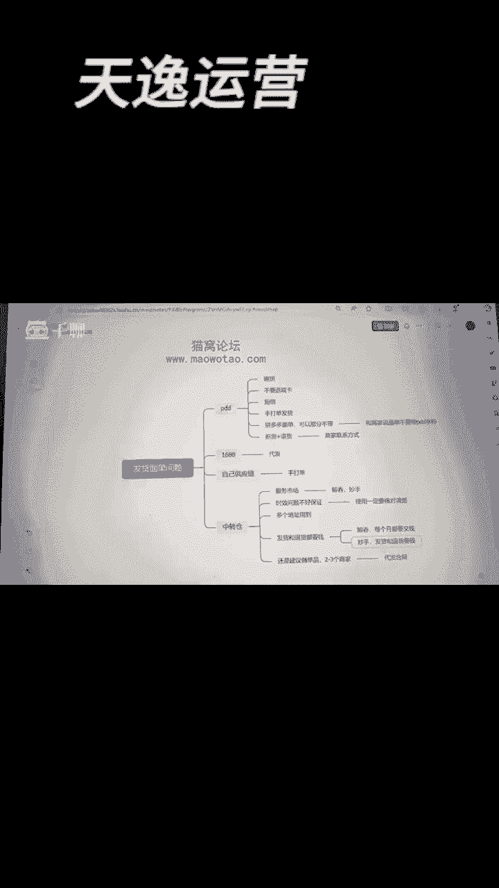

那具体扣你的钱的话，那很多是那种两块钱三块钱的情况啊，就看你自己的这个产品是什么产品了，所以说我一般都还是建议你去做单品，然后两到三个商家，那你要防止被抓，无货源的话，那你要么就搞个代发合同。

这样子会简单一点，但如果说你们实在是自己是搞不定的啊，那你就干脆就直接卖我们这边的货啊，你们课看完之后记得在群里说一声。

