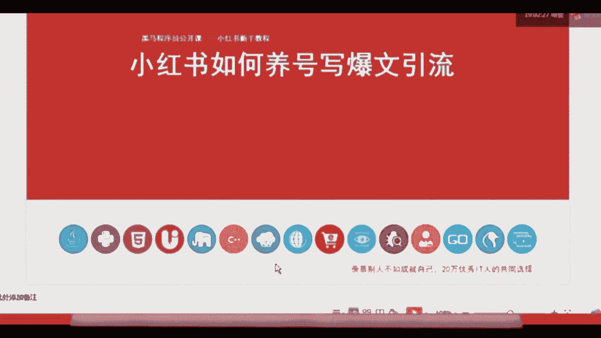
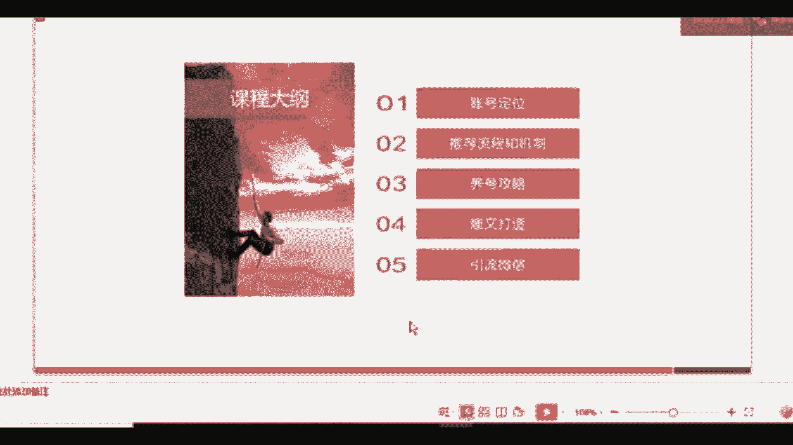

# 【新媒体运营】小红书运营全套课程 零基础进阶起号运营教程 小红书爆款笔记打造／ 商业变现／涨粉技巧／高效就业 完整版流量机制全套课程！ - P22：1.变现思路-小白入局新媒体 靠自己实现创作变现的基本盘思路 - 小恐龙游江南 - BV1M9pYexEFS

好，今天呢咱们就来讲一下这个小红书如何养号鞋豹纹引流的这个课程啊，刚刚给大家讲了新媒体现在主要功能。新媒体行业目前来讲呢，市场饱和度还不够。啊，到时候会发出来。对新媒体这个行业目前的市场饱和度还不够。

可能市场现在需要1200万以上的这个从业人员。但是真正能够进入到新媒体行业从业的，只有650万人。所以说新媒体行业目前还有很大的缺口。那么在整个新媒体的板块当中，小红书也占了一个很重要的一个位置。

所以今天咱们就讲一下，如何去运营小红书。

好，我们来看一下今天的课程内容，主要有5个板块。咱们今天的课程内容主要有5个板块。第一个呢是账号定位，账号定位是什么意思呢？就是像咱们打游戏之前，我们把所有的这个新媒体运营过程中的这种软件。

都当做游戏一样。那么在咱们打游戏之前，就首先要给自己一个角色，选择角色，就是选择定位。然后呢，第二个板块呢是推荐流程加机制。推荐流程跟机制是什么意思呢？就是平台的一个规则。我们只有了解了规则以后。

才能在这个规则体体制下玩的更好。那么三四就是咱们今天的核心内容，就是如何去玩小红书，如何把这个东西能玩的更出彩。最后一个我要简单的给大家讲一下，为什么要讲引流啊，咱们在营销当中呢。

会给大家讲到一个营销的本质。营销的本质是与用户建立链接。那么我们通过账户，通过小红书账户与我的粉丝建立的链接，相对来讲是一种弱关系。咱们通过弱关系的话，对于粉丝的影响力，或者对于你的用户群体。

他的影响力是有限的。那么现在相对来讲，影响力更深入的或者关系更强一点的就是微信。所以很多的企业或者品牌，包括大家去淘宝、天猫京京东去买东西的时候，企业都会要求啊员工去添加到消费者的微信。

因为可以对消费者进行强关系的影响。促使他产生下一次的购买行为。所以第5个，如果是做企业账户的小小伙伴，可以留意一下。

