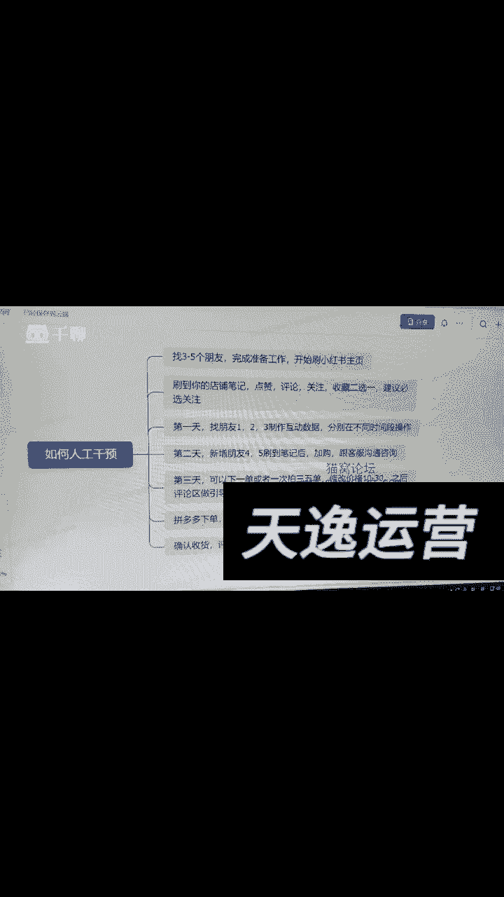
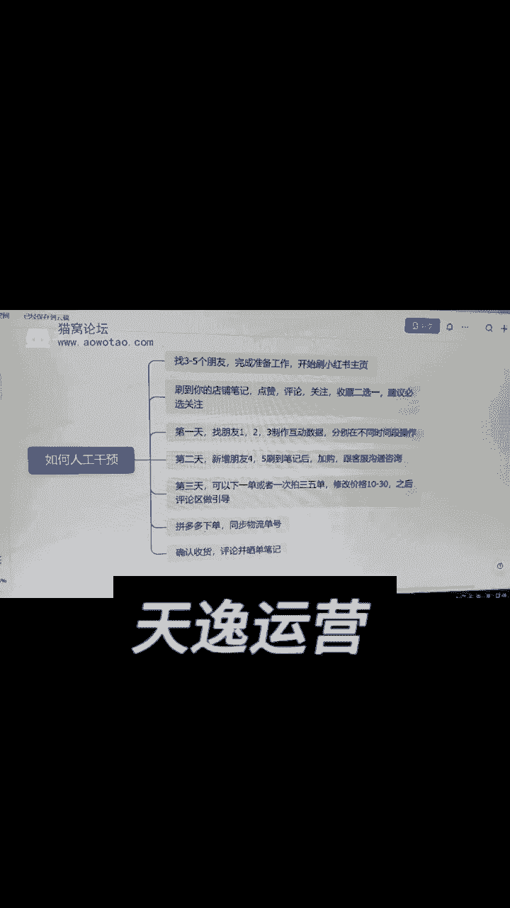
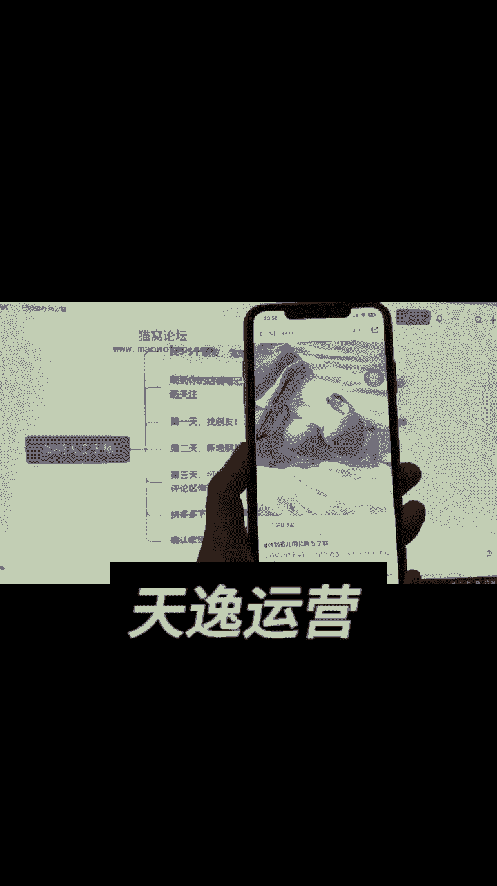
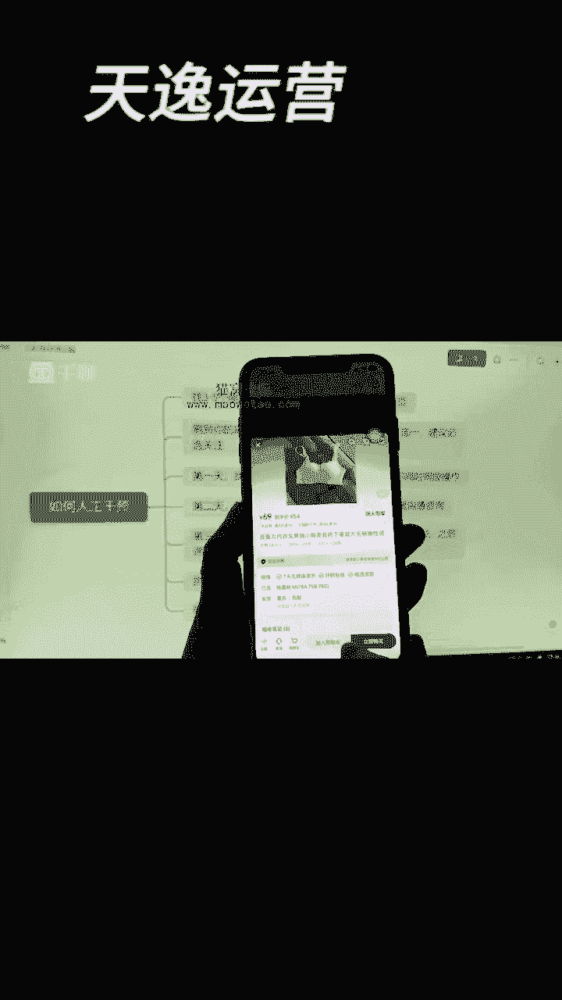

# 【新媒体运营】小红书运营全套课程 零基础进阶起号运营教程 小红书爆款笔记打造／ 商业变现／涨粉技巧／高效就业 完整版流量机制全套课程！ - P22：如何获得成交3 - 夏季来临时 - BV1SnYjeuEQ3

今天讲讲人工干预，具体的操作步骤是什么呢，首先我们要让自己的三五个好朋友，按照前面教的方式，提前一天去刷三次，早中晚各一次，每次10分钟，同类型的笔记刷完以后呢，进行点赞收藏，关注评论四选二。

同样一条笔记要么关注，要么评论，要么收藏，接下来我们要去做人工干预。

还是拿内衣来举例子，我们把这个内衣给他找出来，比如说这个内衣好。

那我们要去做人工干预的就是这个，首先的话我会把这个封面截图。

截完图之后，我先把它发给我的朋友，我得先让他知道这个封面长什么样子，这个标题是什么样的，让他呢就是告诉他我的店名是哪一个。

这样的话他刷到刷到我们的时候，第一时间能够找到我们的店铺，发给他之后，让他做个什么事呢。

让他去刷小说的首页，这样去刷刷刷，就比如说给大家看啊，点击首页就让他让他去刷哎。

点击首页让他这样去刷去刷，那按照正常的去刷，直到刷到刚才我给他发的那个店铺的截图。

大家能懂我的意思吗，那这个时候有的人会去说哎，我朋友的话在前面两天让他去做准备的时候，有没有可能刷到我的账号呢，这种可能性还是非常大的，所以说可以提前，在你的朋友开始去准备账号的时候。

你就告诉他你的账号叫什么名字，对不对，比如说你自己的店铺呢。

这个名字叫什么，我们来看一下啊，比如说你的店铺叫zero啊，那你就提前告诉他你的店铺的名字。

当他刷到的时候，你说要不要让他给你点个关注，当然要你的店千万不要等他刷到当天，你再把这个名字给他，你要让他提前帮你去做这个标签，然后呢你的朋友他在第一天做准备的时候，如果能刷到你的话，我告诉你啊。

啥都不让他去干。

你不要让他去给你点赞，不要让他给你点收藏，只要让他帮你干一件事，就要关注，听清楚了，点个关注就行，方便他后期再刷笔记的时候，能容易刷的到你好不好，你不要让他点赞，也不要让他去评论，只要点过个关注就行。

这样等到后面我们去做人工干预的时候，就会刷到你的账号，接下来的话呢我们要让朋友去刷了，那具体的话去刷一个嗯，具体那具体怎么样去刷这个互动的数据呢，一共的话分成几个步骤。

第一个呢第一天我们先找三个不同的朋友。

比如说123，先让他们在不同的时间点做一下互动出去，这个是啥意思，比如说我让他去刷这样一家店好。

我让他去刷这样的这样的一家店，正好呢咱们去做人工干预的。

正好是咱们要去做人工干预的这篇笔记，让他呢去点开，如果说是视频的，所有的视频看完。

如果说是图文呢，让他把所有的这些图文给他看完，然后看完之后做什么事呢。

进行一个点赞收藏评论或者关注四选二，千万不要一键三连，明白了吧，一般情况下关注是必须去做的。

所以说我们可以让他们去点个关注，加一个点赞，或者是关注加一个收藏，这样都可以不用去做评论啊，那如果说我们四选二，你们你不能全部都干啊，好那接下来的话呢视频看完之后。

图片看完之后，我们的话点击首页进入到他的这个账号里边来，嗯然后我们看到没有，他的粉丝数还是比较高的，然后你看他的数据。

点赞的数据哎，有的好有的不好，你看像这种他的点赞数据的话，是不是还是有的好。

有的不好，那么接下来去做什么呢，我们来看一下他的主页，这个的话比如说就是我自己的账号好，那我的话呢让他在我的主页里边浏览一圈。

正常的去看，随便看一下，我们再看一下啊，就是如果觉得好的话。

哎那这篇笔记我就给他点个赞，觉得下一篇笔记好，再给他去点个赞好，那这个时候的话呢点赞关注收藏评论。

反正就四选二，你第一天的话不要全去做，第一天的话呢这些数据帮我们全部做完了。

那第一天就找123这三个朋友，让他帮我们去做这种互动的数据啊，然后这个就可以同时去找三个人，但是一定要注意啊，你不能在同一个时间段让他们帮你去做，你们把这三个人的话，你要把时间段分开。

比如说早上中午或者晚上，比如说有的人在四点，有的人在五点，那你另外一个人呢，可以让他在你七点钟的时候做，或者九点多的时候，让你朋友来帮你去做这个互动，你要把这个时间给他分开。

第一天我们再去做互动数据的时候，主要的话就是做关注，点赞收藏或者留言主页，这是第一天，接下来第二天我们去做什么呢，第二天还可以去找昨天的这三个人，比如说123，你也可以找另外的两个新人，还是一样的。

来回去刷，刷的一定是同一篇笔记，记清楚了，咱们刷的话一定是同一篇笔记，这篇笔记的话一定是挂车的，一定是有加工数据的，按照我刚才教你们的标准去找这个笔记，那有的人会说，那如果这篇笔记我没有挂失怎么办。

我跟你讲。

没有挂车的笔记，你这时候做干预，人工干预没有任何意义，按照我教你的方式去做人工干预，基本上第一天已经做完了，是不是，那我们要先去看看你的播放量，看一看你的小眼睛能不能增加到200个左右，啥意思。

比如说前边你找到的1233个朋友，帮你做了互动数据，那至少这篇你的小眼睛要增加200，才能证明你知道笔记是OK的，如果说三个人给你做完互动数据之后，发现你的200个小眼睛都没有，那我告诉你算了。

抓紧时间换一条笔记，说明你这条笔记写的是真的不行，你换一条笔记。

重新再去做刚才的这个数据就行了，然后那如果说我们自己这个笔记呢，是有购物车的，我们的你做完三个人的互互动数据之后，是可以增加200个小眼睛的，那你第二天就继续再找两个新人，去做同样的一个人工干预。

第三天再找两个新人去做同样的干预，基本上这一块就完事了，后边的话呢，你这个小眼睛基本上就能干到2000多，没什么问题了。

那第二天的时候我们应该怎么去做，比如说这个来。

比如说这个是一个挂了购物车的笔记，我们的123。

前面这三个朋友，头一天已经帮我们做了互动数据，在这里呢我们可以让他点击加入购物车，对不对，那怎么样去加入购物车呢，你让123这三个朋友，直接通过他的关注页进到你的主页来。

因为他头一天已经刷过你这条笔记了，已经给你点赞了，大概率第二天他不会再刷到这条笔记。

一般情况下都会让123，第一天的这三个人通过他的关注页进到嗯，关注页进到你的主页，找到这个笔记，直接把它放到购物车，但是不要付款，第二天新找的这个朋友。

四和五通过刷首页进到你的页面，来进到你的店面来干嘛呢，也是同样的点击购物车。

然后的话呢去加购啊，然后但是放到购物车之后，依然不要去付款，加完购物车之后，这里是不是有一个客服，然后我们直接点一下客服，你直接去问一下什么时候发货，有没有颜色。

有没有尺码，质量怎么样，让你的朋友四和五去问一问就可以了，这个时候问完了之后呢，你也不要去买，第三天的时候再去买，因为你已经加入购物车了，第三天的话可以直接进行付款，这个是我们第二天找到的两个新朋友。

四和五的一个操作，接下来第三天该怎么去做呢，你可以让加购的，直接从自己的购物车里面进行下单就行，下单的时候注意去填他的地址，并且在评论区里边一定要加以引导。

什么叫做评论区的一个引导呢，我给你看一下啊，比如说这个我给大家打开看一下商品。

这个下边的话呢你们能不能去看得到，就是让他们买完东西之后呢。

在评论区里面去问一问，比如说的啊，你看啊已下单，坐等反馈，还有的话呢，很多人的话都会在这个评论区反会去说嗯，给你们看一下啊。

再来往下找一个，还有的人会就说好穿，然后呢或者是哎呀是买回来看看效果。

哎你看这里就有一个好穿，是不是好，就有很多人会去说已拍坐等收货。

类似于这样子的一些话，那么就是嗯我们买了之后呢，坐等收货，这样的一些话。

这些评论的话呢其实都可以的，就是你这样子评论下来，他有一个什么样的好处呢，第一个就是，为什么说你们有些人会出现这样的情况，访客加入购物车，但是他没有下单。

是因为当时别人刷到你这个笔记的时候，他想买，但是一查看已售就在这里啊。

大家看一下，点击下来诶，他想买，结果呢查看已售，这里是零单，对不对，一个都没卖出去。

那他就会有担心，我就会不信任你，如果说像这个打开这篇笔记好，人家一看这篇笔记一下子卖了1。6万单。

那你说销量这么多，那是不是就会很放心，直接进行购买，所以说人工干预的方式呢，其实就是让你的账号先去出个三五单，朋友买，亲戚买，拍完之后呢，第一个可以进行改价，你改成十块钱，30块钱都行，有些人说。

那我的这个产品的话卖四五百块钱，那就改到十块，30块也行，你像我们让他们买的时候呢，我们基本上是不改价的。

我们都是用真实的价格，比如说像这样的内衣卖到54块钱好，那就让你的这些。

那你就让前面的那几个人呢，他去拍个三单，三单的话呢大概也就一两百块钱对吧。

后边的话呢我们再把这个米给他转回去，那如果说的话没有那么多钱，那我们就去改价格，他们下单之后。

你先不要让他们去付款，先把订单提交上来，提交上来之后，你们看啊，在这个后台里。

在这个后台啊，大家能不能看得清楚，千帆好，在这个后台里边的话呢，它有一个全部订单。

点击全部订单好，然后这里的话有个代付款，你们进入到这个代付款之后。

这里边的话呢就会出现他刚才下的这个订单，提交上来之后，我们到小时候商家版这个后台。

你就能看到这个了啊，在这里的话呢你们就可以把价格给他改了，比如说你改到十块钱，30块钱，但是我不建议你们去改，比如说你资金有困难的话，你让他去改一下，没有问题，一般情况下的话呢，不排一单，下个三单。

五单都行，为什么呢，因为当他下了三单，下了五单之后。

第二天你这个商品它的这个地方的销量，就刚才的这个地方的销量啊。

这个地方的销量它就已经不再是零了，就已经不再是零了，那这个时候的话你下单呢，第二天可能会变成三单五单，今天拍的单子，明天会立马显示销量，明白这个意思了吧，这个地方如果说有了销量好。

那我们再看他的这个嗯评论区，你看啊，对不对，它会显示什么呢对吧，有很多人就会去说了，哎买了坐等收货，然后呢有的人会去说好穿，然后有的人的话呢会去说哎。

感觉很好穿，就类似的这个里边不是还有人说吗，什么已下单，坐等反馈，就类似于这样的，是不是，那我们在评论区呢，就能够看到这些评论区的引导数据。

买家看了之后他就会比较放心，我们有了销量，有了这个评论之后，其他人在刷到你这篇笔记的时候，是不是有很强的信任感，这样子的话呢你也容易进行出单，因为第一个别人看你有销量，第二个就是看到你的评论区。

有人说哎买了坐等收货呀，看看呐怎么样啊，或者是说好穿啊，比如说话你开了五单。

第二天的话它显示的就是五单，拍完之后，我们怎么样去发货呢，怎么去搞物流信息，其实很简单，你就是去拼多多上就可以找这种便宜的商品，比如说小镜子挂钩或者是一两块钱的这些东西，你正常去派单，这个商家就会发货。

你就把这个发货的快递单号，物流信息直接给他填进去就行，直接点发货，那我们就是正常的去发货，那整个派单的流程其实是非常简单的，到了第四步，最最重要就是当你们当他们确认了收货之后，你要让他们确认收货。

然后一定要让他们去写晒单笔记。

晒单笔记该怎么去写呢，很简单，这个时候你们去到淘宝的评论区去找买家秀，为什么说图片要去淘宝上去找呢，因为淘宝上有很多图片拍的是非常不错的，咱们去淘宝里边去找的时候。

记住了啊，你就找到评论区，然后呢我们来这个啊，依然拿它来举例子，比如说它这个品我们给它保存一下。

好保存进来点击，那接下来的话咱们打开淘宝。

打开给大家看一下啊，打开淘宝之后，我们来点击一下啊。

刚才的这个商品好，扫一扫出来之后，你看啊，这有5000单的。

卖了10万多笔的，找到一模一样的款式，比如说这个卖了1万单好，那你看他的这个评论区。

他这里边不是有一个评论区吗，哦我们点开，然后呢，这里边的话有很多的商家会去拍这些图片。

对不对，很多买家秀的图片，那我们的话再去拍这种买家秀，再去找这种图片的时候。

你可以去看一下，就是拍的比较好的这些图片，你们千万不要去选那种超级好看的。

一看就是专业摆拍的，比如说像内衣的话，你打开这个评论区，我们找到什么样子的呢，像这种我就不会要因为环境太差了。

一个床单背景太丑了，是不是你们可以找那种稍微来说拍的嗯。

好看一点的这种图片，然后我们的话呢再去做，你找的时候大家一定要有耐心啊。

那毕竟我们要是做这种看像这种图片还可以吧，然后呢这种真人出镜的就算了啊，这种真人出镜他还没有展示内衣。

比如说像这样这样的图片，你们稍微找一些好看一点的，或者是这种的。

你们也可以去找，然后把这种图片呢给它保存下来，那像这种图片也可以，你们就把它保存下来。

然后找一些这种图片的话，看起来不像专业摆拍的，看起来又不那么土的。

就比如说可能我喜欢这种，那么如果说你找那种环境不太好看的，那这种图片的话，你们就不要用了啊。

然后呢我们挑一些比较真实的，你看啊，像下边的给大家找找，你们找的时候可以多翻几家。

不一定说非得就可着一家去找，有很多像有一些图片的话，确实拍的不错的，你们的话就可以去看。

其实它这里边的图片一般般像这种的话就可以，其实这种图片的话，你拍起来没有那么丑，穿着看着这个衣服也不像是旧的，对不对，那你们挑一下，就找那种最真实的，然后把它直接保存。

保存之后呢，你通过你的地球号发给你的朋友，然后呢让他去做晒单笔记，什么叫做山蓝笔记呢，我给大家讲一下啊。

小红书画呢其实他的评论是不带图的，给你们打开看一下来，比如说我买了这个产品。

那我们的话呢打开这个评论区，你看下这个商品评价，他这块的话都不是带图片的。

全部都是一些文字，全部都是一些文字，对不对，甚至有很多人的话，他都不会在上面去做这样的一些嗯，就是评价是不是，那如果说我们的话呢想让大家去看到这些图片。

那怎么办呢，对吧，我们的话只能去发这种晒单笔记，看没看到就发这种的社团笔记。

什么叫做社团笔记，我来给大家看一下啊，比如说拿这个来举例子，我们就正常的话就这样子啊。

刚才的话什么叫社团笔记呢，你看啊，你点击进来好，然后打开这里就有个晒单笔记。

看到了没啊，然后的话如果说我现在的话想买这个产品，我可能首先的话会去看一下这里的评价。

看完评价之后，我还想看看他们买回去，到时候的真实图片是什么样子的，那我就可以看到这里了。

是不是这里边的话就会有了，关于小红书的这些东西，你们都可以去看得到，那么发这种晒单笔记呢可以是图文。

也可以去视视频，你只能去去去发这种这种晒单笔记，然后呢买家的话他可以去看得到。

比如说你看他咋说的，穿着很舒服，喜欢的可以下单，强烈推荐是不是。

然后再看下一个他怎么说的，舒服并且贴合很舒服，很柔软对吧，这个的话一定要去发真实的感受，比如说你说物美价廉或者超值，你想想你买完这个品。

你自己的话会去写什么样的评价，你们的评价千万不要夸的太刻意，如果说你们夸的太刻意。

那就假了，一看就是刷的，对不对，一看你这个数据就是假的，是不是，然后呢，我我们人家看到这种晒单笔记的时候。

人家看这个产品，那么他也会在这个晒单笔记里边看到这个产品，看没看到作者买过此产品。

然后这个产品你就可以点击立即购买了，看到没有，他要是发了这个晒单笔记。

这里的话就会给你个链接，看完链接之后，你一点击查看，直接能跳转到这个呃内衣的界面。

我们就可以直接购买，这种方式能大大增加你的购买率，如果说你能把下单笔记搞定十个。

那你的店铺基本上也包了，是不是，那干预的话要做多少次呢，大家一定要搞清楚，我们最终的目的的话，肯定是让为了让笔记的话能够有销量吧，做这种晒单笔记，我们的目的的话也是为了说去做破冰。

下单笔记当然是越多越好是吧，但是千万不要违规，这就是整个一个人工干预的流程。

你们如果说有什么问题的话，这节课可以反复去听一下。