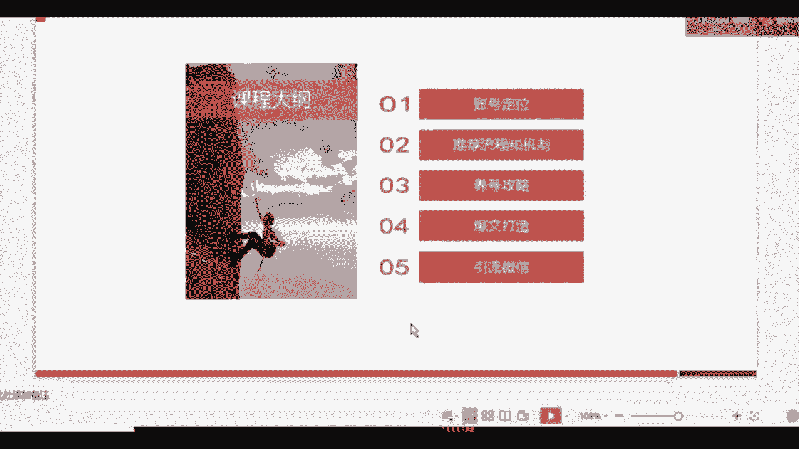
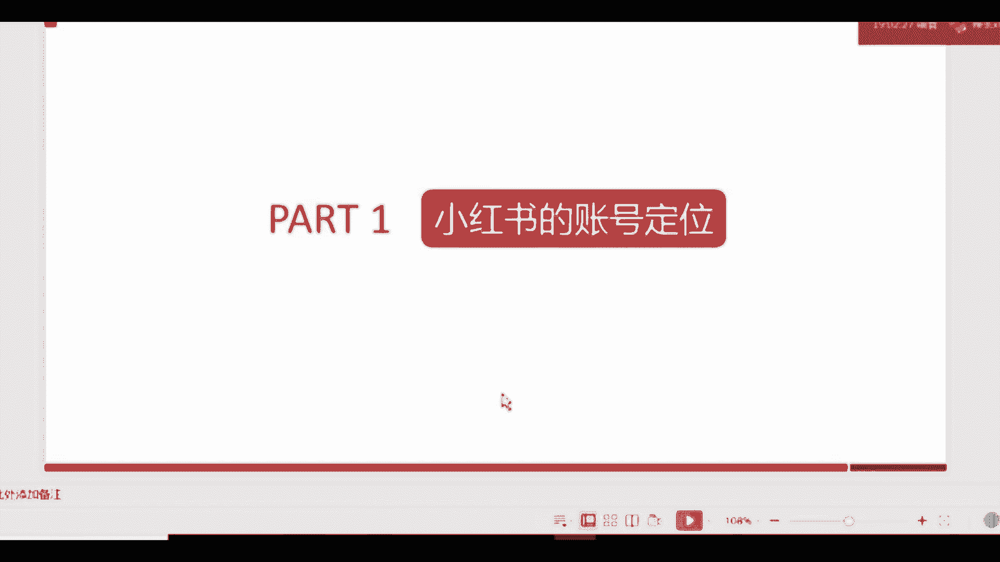
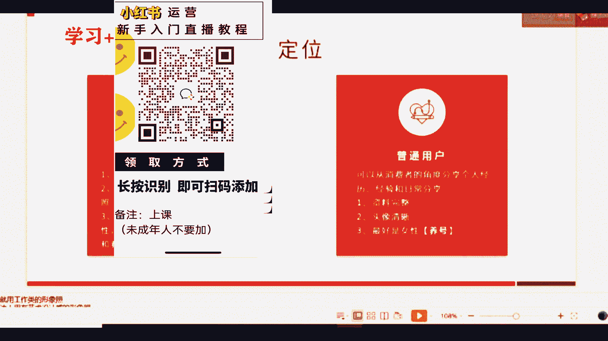
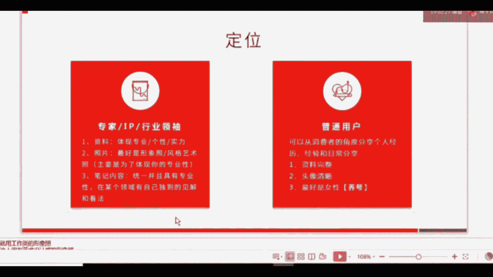
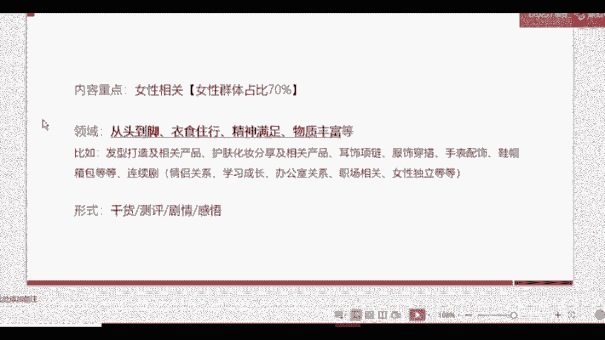
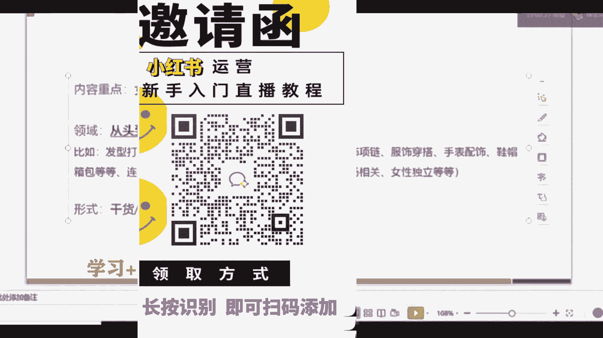
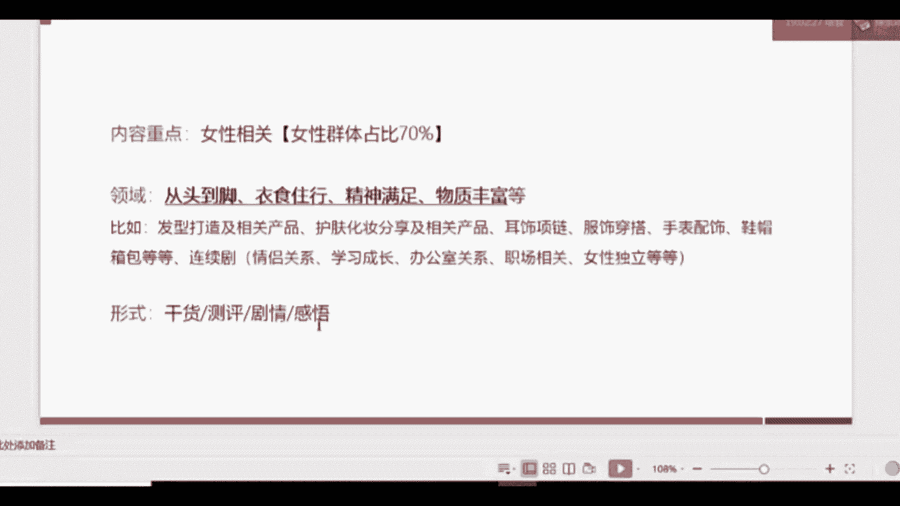
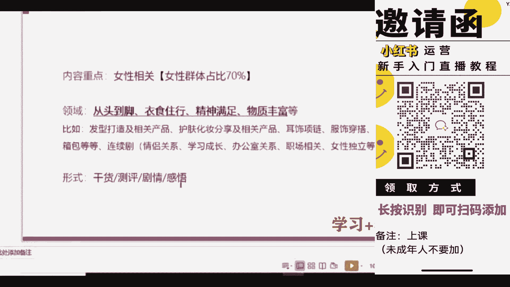
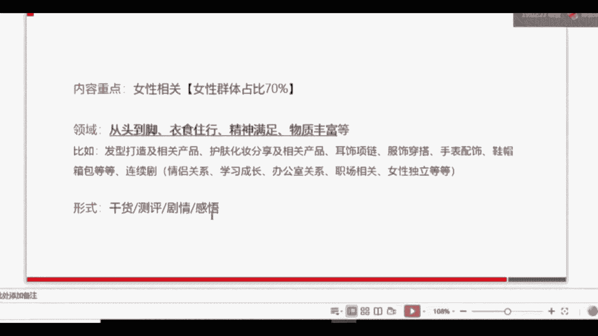

# 【新媒体运营】小红书运营全套课程 零基础进阶起号运营教程 小红书爆款笔记打造／ 商业变现／涨粉技巧／高效就业 完整版流量机制全套课程！ - P23：2.小红书的账号定位 - 小恐龙游江南 - BV1M9pYexEFS

好，我们首先来看一下第一个啊小红书的账号定位。首先来看一下小红书的账号定位，账号定位是什么意思？就是咱们刚才说过了嘛，就是你的角色选角色。那么在目前小红书的这个整个平台上，角色有两大类，有两大类。

第一类是专家IP和行业领袖。专家IP和行业领袖是什么意思呢？就是我通过我的专业去影响到一个群体。那如果你定位上。比如说你现在在某个专业上一定有一定的话语权，或者说你在某个专业上啊。

有自己独到的见解和认识的话，可以把自己的啊角色定位到专家或者IT或者行业领袖上。那么如果你要做专家和这个类型的定位的话，那么我们要注意三点，第一个是资料。

就是在我们填写小红书的资料的时候，一定要体现你的专业或者你的个性或者你的实力。

咱们待会儿会给大家举例子啊，第二个是照片，最好的话是形象照，最好是形象照，就是一些商务风格的形象照，或者是有一些艺术特点的艺术照。当然很多因为小红书现在面向的主要群体是女性。

所以很多像美妆博主、护护肤博主等等。他们就会用他们有艺术风格的照片。为什么能够更加影响用户，同时体现他的专业性。

第三个要注意的点是什么呢？是笔记内容。笔记内容呢主要是要统一，并且具有专业性。在某个领域，你要有自己独到的见解。如果你做不到这个点，那大家现就一定不要把自己定位成专家。第二个定位呢人群是什么？

普通用户我们大多数人啊目前定位在小红书里入驻以后，一般都是以普通用户的角色进入的。可以从通过我们自己的消费经历去分享一下我们的经验或日常的一些生活分享。那他要注意的还是三点。如果我们要帮企业养号的话。

也可以养一些像普通用户的账号。但是如果你要养普通用户的账号，一定要注意，最好是女性。最好是女性，因为你可以选择性别啊，最好是女性。好，我们来看一下这个演示啊。首先我们可以看一下啊，这三张图。

徐老师李佳琪和大嘴博士，他们的头像都是用的这种艺术照片的形式。

本身徐老师和李佳琪都已已已经具有一定的IP性质了。所以他们的这个头像。带有强烈的个性色彩。你一看头像就知道是徐老师和李佳琪。那么大嘴博士呢相对来讲他的IP属性比较弱，所以他走的路线是行业专家。

所以他的这个头像风格就是比较商务形象照的风格。好，我们来看一下，当我们选择好定位以后，如果是帮企业做的话，可以做行业领袖。比如说你要做护肤行业，你可以做护肤啊。

这个美美妆的博主或者做做一些护肤的医师等等都可以。如果帮企业做，既可以做专业账号，也可以做普通用户账号。如果是我们自己做给个人做，就做普通用户就可以了。好，那么选定好定位以后呢。

我们接下来就要考虑内容了。😊，我要发一些什么样的内容给我的用户才能更用户的可看性才能更高呢？我们目前来讲的话，分析了整个小红书上大量的内容以后，我们发现目前小红书的女性群体是占到70%以上的。

所以我建议大家发一些跟女性相关的一些内容，会更吸引你的用户。比如说什么呢？从头到脚咱咱们归总结了4个。

四子16个字，大家可以。认真记一下。第一个是什么呢？从头到脚，第二个是什么呢？衣食住行。第三个是什么呢？精神满足。第四个呢，物质丰富。从头到脚是什么意思？比如说从头发到鞋子。

整个女性身上所所有需要用到的一些物品，或者他们想要去了解的一些干货，你都可以去分享。衣食住行是什么呢？包括我们怎么穿搭，怎么呃买衣服，买哪些品牌，品牌的介绍，食物呢做一些美食。

住宿呢某些地方去旅行一些旅旅游攻略等等都可以。那么行呢就是旅行嘛，精神满足是什么？现在小红书上很多一些呃做剧情的，做电视剧类型的，他们的账号也很火。比如说做女性独立等等。为什么他们火呢？

是因为女性她有这种为什么像韩剧、日剧或者是一些综艺，他的针对群体也是女性呢？就是因为女性对于这种啊闲暇时间的打发，对于剧情的这种精神满足是有很强烈的需求的。然后另一方面是物质丰富。什么叫物质丰富呢？

就是我们在帮女性做一些，比如说你要怎么省钱。啊，在淘宝上怎么省钱？在别的那些机构有哪些隐藏优惠券。对于那些对于价格敏感的女性群体来说，这些内容是他们会用心费尽心思去找的一些内容。

那么对于这些能够提供这些内容的那些账号，他就会采取关注。或者对你说的。如果实践了以后，他觉得很好，她就会点赞收藏。那么比如说这些就是刚刚咱们已经讲过了的内容啊，那么我们采取的形式可以是什么样子呢？

第一类就是干货类，比如说如何打造一个日系卷发，这就是干货类，你能提供。比如说视频或比如说咱们说的今天说的图文笔记的类型都可以。第二类是什么？测评类。我把很多种产品放在一起做对比。比如说最近夏天到了嘛。

女性对于防晒的要求是很啊这个需求是很强烈的，可以做一期防晒产品大对比测评。那么在小红书上很火的，和抖音上一一样很火，叫老爸评测。这个大家应该有听过老爸评测，他们做测评类就做的很。很专业。

第三类就是剧情类。剧情类的话，大家可以关注一下小红书有个账号叫UCC啊，他也是做剧情类的，做的是什么？霸道总裁是女性去做总裁。那么对于一部分女性，她就会吸引力。因为他提供了一个营销上。

我们在营销手段叫描绘愿景，她就给这部分女性提供了精神满足。第四类就是感悟类，比如说你最近遭受了什么，然后类似于抖音的这种字节，就是字幕跳动的这种形式。

来提供一样的视频，或者你最近的一些读书笔记等等。这个在小红书上也是很火的，这四类都是很火。所以这一页很关键。

