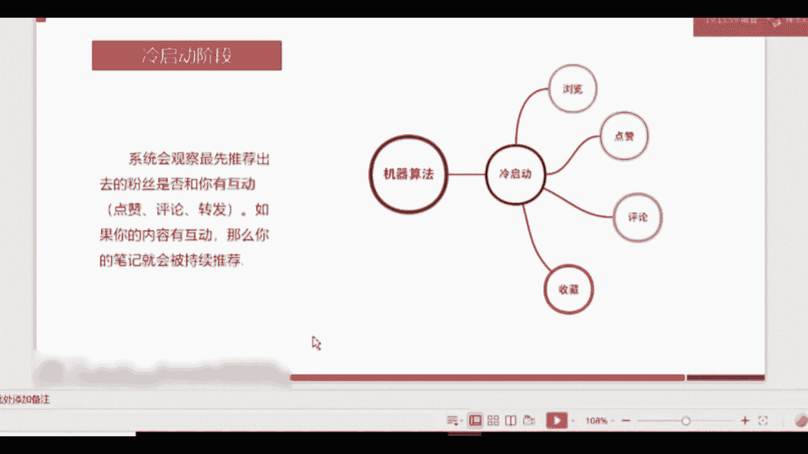

# 【新媒体运营】小红书运营全套课程 零基础进阶起号运营教程 小红书爆款笔记打造／ 商业变现／涨粉技巧／高效就业 完整版流量机制全套课程！ - P24：3.小红书的推荐流程和机制 - 小恐龙游江南 - BV1M9pYexEFS

好，咱们刚才讲了小红书的定位啊，这个很关键，定位和内容是很关键的。因为它决定了你在小红上要走哪个方向，要走哪个内容，针对的用户是哪些？接下来呢我们要了解一下啊，我的声音太小了吗？我调的我调的很大了啊。

我的声音还小吗？😊，那我声音再放大一点吧。咱们刚才讲了定位和内容以后呢，大家就了解了，我如果作为一个新人，我入驻了小红书，我应该从哪些方面去分析自己可以从哪些方面给用户提供内容。好。

第一个板块咱们就讲到这里。那么第二个板块呢是小红书的一些机制，也就是他怎么玩？它给你的规则是什么？

我们来看一下啊，首先呢这张图是一个比较全面的一个流程。就是当我们进驻小红书以后，发了笔记，第一步会跳到机器算法的推荐的这个步骤。跳到机器算法推荐。然后经过机器算法推荐以后呢，进入到冷启动的阶段。

经过冷启动后就会进入到热门。居于每每某一每一个环节它是什么意思呢？我们接下来看一下。好，第一个咱们刚才讲了，发了笔记以后就会进入到机器算法，对吧？机器算法是什么意思呢？就是现在每嗯每一个类似的这种平台。

比如说小红书，比如说抖音，比如说快手都是一样的啊，它的逻辑都是一样的。当我们发了新的东西以后呢，机器后台会根据你的内容去判断你的内容可能适用于哪些用户。😊。

然后他就会把这些内容分发给这些用户随机分发。如果你有粉丝，粉丝是定向的分发，就他们一定会看到你的内容。但对于你没有粉丝的情况下，就会随机分发。随机分发内容。好，随机分发内容了以后呢。

我们要讲一个小的知识点啊，就是一般的新用户。当我们作为新用户入驻的时候，你会看到你的首页也是会有信息流的。这时候这个信息流呢，它是根据所选的领域。我们在入入驻注册的时候，会需要去选择领域至少4个。

那么比如说我选择护肤美妆明星类。那么他推荐的内容就会跟护肤美妆和明星相关，并且是相对优质的内容。为什么？因为他开始我入驻的时候，他没有我的数据包，就我没有在他的这个平台上产生行为。所以他没有数据包。

他没有数据包的情况下呢，他就会推荐一些优质内容，以便于新用户留存。所以如果说你的内容能投放到新用户的平台上。那么你的曝光量会更高，用户会产生的行为可能会更多点。当然，基于你的内容要比较优质。能理解吗？

这就是第一点啊，机器算法。我们经过机器算法以后呢，就会进入到冷启动阶段。什么意思？什么叫冷启动阶段？刚开始嘛你把这个东西发出去了，对吧？你录了一个你写了一个这个图文的一个笔记发出去了。

机器给你随机分发到50个人。好，这50个人，他看了你的笔记以后，他会有这么几个行为，看了一眼关掉了，对吧？他也有可能会点赞会评论，会收藏，如果他对于你的笔记产生了点赞评论和收藏的行为，也就互动行为嘛。

有了互动行为以后，那么机器就会判断，觉得哎这个笔记应该还不错，那他就会对于你的这个笔记，进入到下一个阶段的推荐。😊。

这个阶段叫冷启动，就是用户要跟你产生互动。而这个阶段是我们能够影响的阶段。就是你可以先让自己周围的同事、同学、朋友、家人对于你的这个笔记进行一定的互动。来影响到积极后续的推荐行为。好。

经过了冷启动阶段以后呢，我们就会进入到第三个阶段。第三个阶段叫热门优质内容推荐。什么意思呢？就是相当于二次推荐。而这次推荐第一步，它会扩大它的推荐范围，让更多的人看到你。

那这个时候你的影响力就会变大，用户跟你产生互动的几率就会变大。同时他会有可能让官方的一些账号，官方的账号都有什么呢？有美食鼠啊，这个鼠就小红就是那个红薯的鼠啊，不是小红书的书。

美食鼠娱乐鼠、生活鼠等等等等。有很多官方的账号。如果我们的内容啊被大多数人认可以后，就有可能会被官方署。采纳采纳有什么好处呢？就是官方署会对你的内容进行稍微编辑以后，当然会对你内容进行简单的。

编辑以后帮你去推荐。他会收录在自己的笔记当中，并且帮你去推荐。能理解吗？所以内容一定要优质，而且前期的两个阶段一定要做好。同时还有一种可能性是什么？可能你觉得啊我的数据量可能还不是特别OK。

但是为什么获得了更多的人的浏览，就是因为系统本身它也会去考量你写的笔记怎么样，内容怎么样，质量怎么样。如果他判断你的内容会比较优质的话，他就会帮你去进行二次推荐。即便是你前期能启动阶段做的不是那么好。

能理解吗？所以最最核心的问题还是咱们的内容一定要把内容做好。

我们再回顾一下这个流程，其实相对来讲比较简单啊，就是小红书跟抖音的机制其实很类似，所以相对来讲比较简单一点。发了笔记以后，系统会先进行随机的分发。根据判断，后台的算法，随机分发，分发了以后呢就要。

已经接受到你的这个图文笔记的用户，会对你的笔记产生一定的互动。系统根据在这个互动情况去判断这个笔记是不是优质内容。如果是优质内容，那他就会进行二次推荐，或者放在热门区去展示，让更多的人去看到。

或者是收录到官方的一些账号当中，来帮你进行更多更大范围的推荐。

所以这就是它整个流程，相对来讲还是比较简单的。

