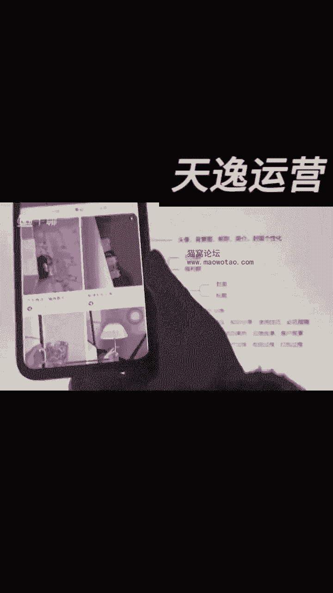
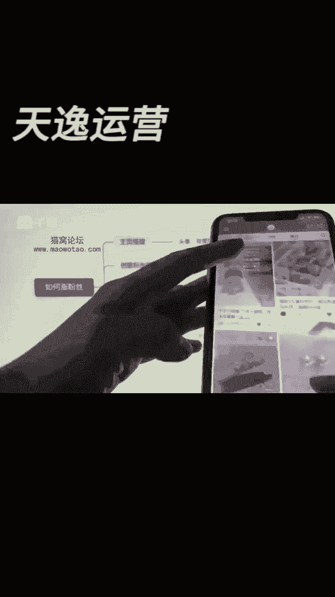

# 【新媒体运营】小红书运营全套课程 零基础进阶起号运营教程 小红书爆款笔记打造／ 商业变现／涨粉技巧／高效就业 完整版流量机制全套课程！ - P24：如何涨粉四大法宝 - 夏季来临时 - BV1SnYjeuEQ3

这节课给大家去讲讲小红书如何去涨粉啊，其实的话呢，我们大家平时经常会关注涨粉的这个问题，我首先跟大家讲一下，在小说啊，你的粉丝数多少，跟你是否变现，跟你赚多少钱没有任何关系。

我们在小说呢变现是跟粉丝没有一毛钱关系的，我给你们先看一下啊，像有一些账号的话呢，他确实粉丝数很少，但是在小说上呢，他们的变现能力确实还是非常不错的。

比如说你看像这样的账号，他的话呢一共有多少个粉丝。

这个账号的话一共就42个粉丝，那你说他有没有变现，已经变现了这个账号的话。

他已经在出单了，好这个账号出了40单，对不对，好，咱们再来看。

像还有一些这样的账号来给大家搜一下啊，包括我们看这种卖内裤的账号。

他的话呢这个账号一共的话多少个粉丝啊，一共700多个粉丝。

咱们点击他的店铺进来好，这一个品的话卖了多少单，这一个品的话卖了1。1万单。

所以说你们在小书上不用非得要去研究，说我涨到多少粉丝，我没粉丝怎么去变现，粉丝跟你的变现能力没有任何关系，那么我们如果说想在小红上涨粉丝，那涨粉丝有什么用呢，后期如果说你们粉丝有一两千。

你们可以考虑在小上去接广告，或者是有些人说我想成为一个买手，那就是赚佣金的那种方式，那你们的话呢也是需要满足1000个粉丝的，我们在场上需要怎么去涨这个1000粉丝呢，首先的话第一个啊。

你们先去把你的主页搭建做好，为什么你们想想一个问题，很多人来到你的账号上，他会看到你所有的视频，对不对，如果感兴趣，他会把你所有的视频看一遍好，那如果把你所有的视频看一遍，他就会进到你的主页。

然后呢再去想想哎，你这个搭建呐，你的名字啊，包括的话你的这个简介都是他感兴趣的，那这个时候的话呢他就会给你去点关注，如果说你的主页搭建的什么都不是，就比如说你爆了一条视频。

有的人为什么爆了一条视频不涨粉丝呢，其实的话就是因为你的主页搭建做的太烂了，你爆了一条视频，你为什么不涨粉丝啊，别人进到你的主页，发现你的视频发的全是朋友圈，全都是一些乱七八糟的东西。

你觉得他会给你涨粉丝吗，所以说我们要去把我们的主页，我们的背景图，我们的昵称，我们的封面，我们的简介给他做好，你看像这样的账号，比如说的话给你们看啊，像这个账号他当时的话就是火了，结果的话呢没有涨粉丝。

为什么你看他这个账号的话，你说他火没火过呢，他已经火过了呀，这个视频500多点赞，这条视频1000多点赞，但是你会发现这个账号其实并没有涨粉丝，为什么当你们进到他的主页来的时候，你会发现的话。

这个账号第一个主页搭建什么都没有，然后的话呢也不知道他这账号是干什么的，另外的话呢他其实有些视频的话，你看他拍的啊，其实也没有什么，就是特别感觉想让你想关注的这种欲望，那所以说大家如果说再去做的时候。

第一个你的主页，至少你的简介要凸出来，你是做什么的吧，你的头像，你的名字，你的背景图，你至少要跟你所卖的东西相匹配吧，对不对，然后呢你整体的视频的封面你要协调吧，有的人的视频封面发的就是乱七八糟的。

你看像他这种视频，明显就跟他卖货是没有关系的，对不对，本身是做这种家装博主的。

然后呢结果发了一个这样子的内容，其实的话呢这种东西就跟你的涨粉丝没有关系，如果说你们想要去做你的封面，要做的尽量的话呢就是风格统一，不一定说是同样的封面，但是你的风格要做成统一的，然后封面的话要吸引人。

第二个的话呢你的主页搭建你的简介，要让别人知道你是做什么的，然后的话你的头像，你的名字。

你的背景图要做成统一的，你不要天天的话去做的乱七八糟，就跟一个朋友圈的账号一样，那我进来当然没有关注你的必要，对不对，用户为什么会给你涨粉丝，首先的话他进来是对你有期待的，对不对。

那如果说他真的对你的后期的内容有期待，或者是他对你这个账号有期待，他就会给你点关注，第二个的话呢，就是咱们大家可以去创建一些粉丝群，粉丝群你们的话呢可以去做什么，可以去做引流，甚至是可以去拉福利。

比如说你看啊，像很多的账号，其实他们都会限你这样的粉丝群的，我们点开之后好看没看到这里有个立即加入，那你们这里的话呢新品品鉴，或者是你你会告诉粉丝给到他们一些福利，然后的话呢你给到他们一些新品的优惠。

或者是给到他们一些捡漏，还有一些的话呢，比如说他建立一个那种内衣群，叫什么秘密基地的，而且这种群的话呢，你们的话给他建立起来之后，粉丝的话呢他也会就是哎想要去贪这个小便宜。

他给你去点关注，然后去进群，那你们进了群之后呢，其实还有一个作用，就是你们可以给客户直接的话去，就是引流到私域，你们不是会会想要引流私域吗，其实你建群是一个很好的方式，在群里面发一些图片，然后去做引流。

你要是直接去做引流，小说，肯定会判罚你，对不对，那我们的话呢如果说担心小说的判罚，那你就赶紧的话，按照我们说的这种方式去试一试，而且的话呢小红书建群的话，咱们怎么建呢，我给大家说一下啊。

建群的话在这里有个消息，你点击进来，然后在这块儿看没看到。

发现群聊点击一下，你们就可以建群了，然后这个群的话你可以创建创建群聊。

这块呢给它去起一个名字，然后这里呢点击公开展示。

你只有点了公开展示，这个群呢才会在这个主页这个地方去展示，要不然的话这个群是不会展示的，然后你点击立即创建这个群呢，咱们就有了啊，你尽量的话呢去建一些这样的群，然后呢去增加粉丝的粘性。

这个也是我们去涨粉的一个必要，不然的话你的粉丝边涨边流食，边走边流食，那也没什么用了呀，好，那另外一个话呢就是咱们要想去把粉丝去做高，你们先要去有流量吧，如果连流量都没有，你怎么去涨粉丝，有流量的前提。

咱们也都知道小红书的流量公式，流量等于点击率乘以展现和曝光，那点击率是什么，点击率就是你的封面和你的标题。

对不对，咱们的话现在再去刷小红书的时候，比如说我现在这样这样刷小红书，那么这个账号的话，我点不点击不就是由封面和标题决定的吗，很多人经常跟我讲，老师啊，我的账号没流量啊，那你们的话如果说有你要嫌先涨粉。

你至少得先让别人看到你，你先有流量才能涨粉丝，那我的流量是怎么来的，不就是你的封面和你的标题吗。

所以说你们要先把你的封面做好，标题做好，你像这样的封面，像我前两天有些学员啊，他们的话去做的时候做清洁剂，我就让他们用这样的封面，为什么你看到这样的封面，你会不会点，大概率会点呢，你不知道他在卖什么。

点开之后哎结果是做清洁剂的，你说什么神奇，或者是你看卖光腿神器，别人做光腿神器都是中规中矩的啊，不是这不叫光腿神器，鲨鱼库好。

别人的光腿就呃鲨鱼裤都是中规中矩的，但是你打开之后，你看他的这个对不对，这个封面多有吸引力啊，男的穿上之后腿显得这么细，那如果是你，你会不会买，你会不会点，至少你先会点进去看一下吧，至少我是点了。

然后的话你看这有个笔记7000多个点赞，这种的话就是好的封面，你们先把你的封面做好，你的标题做好，如果你的封面和你的标题做不好。

你整体的笔记没有吸引力，你看就这种毛孩子，他就很有吸引力，大家就会去点，像这种鞋子，一看就很好看，你的笔记呢，你的封面要不然就是引发好奇博眼球，要不然就好看，要不然就可爱，这些点的话，只要你能站上。

你的流量不会特别差。

然后你有了流量再考虑涨粉的问题，如果你都没有流量，你谈什么涨粉，对不对，这是我们涨粉的另外一件事，那第三个第四个呢，你们如果说想要去涨粉，丝，笔记当中穿插一些干货，你们每天发笔记是不是建议发5~10条。

但是在这5~10条当中，咱们可以不全部都带产品，你们在这5~10条产品里边，5~10条笔记里边，你们可以偶尔穿插着一些什么呢，就是就是那种嗯，类似于像讲那种家庭家居的这种东西的，有没有看到有很多人的话。

做这种家居类的账号的，他不是条条视频都带货，有的时候的话呢，他反倒会去给你去讲一些生活里的实操啊，或者是讲一些生活里面的一些，嗯那种嗯小技巧啊，或者是生活里边的生活VLOG，甚至是你拍些这些东西。

你得讲一些知识类的东西，讲一些避坑类的东西，那这样的话呢他看到了之后诶，他就会觉得挺好的，他可能的话觉得你这个是账号呢还挺有期待的，他就会给你去点关注了，你们有没有发现有很多这样子的账号，对不对。

其实你你们如果说愿意去做的话，你在你的视频里面去穿插5~10条，这个笔记里边穿插个两三条或者是一两条，这种讲嗯那种知识的，或者是讲小技巧的，讲避坑的。

这样的话大家可能会就是给到你去点点关注，像他们有很多这样的账号啊。

来你们看就是嗯像他们这样的账号，这不是做家居好物的吗，你说你以为他所有的内容都会去带广带广告吗，你看他这种话就不是的，他这种的话他就是给你讲一些生活里边的，对不对，家里的这种色彩搭配好。

那那你看他有一些笔记呢。

他就是给你去做带货的，对不对，其所以说你们要去看的话。

你看像这种的，有一些的话呢，他可能就给你做带货的，对不对，他可能给你讲的是空调，对不对，空调看没看到这里有个空调循环扇，明显的话就是接接广告的。

但是有一些的话他就不是这里边的话，他又穿插着几条给你去讲的，就是一些可能讲的是一些家里边的装修技巧的。

那你说这种内容的话，它能不涨粉吗，就对不对，对不对。

他这种账号的话，他粉丝数就会去涨起来，你看像这种账号，他有1万多粉丝了。

他就不是完全的在带货的，懂吗好那还有一个的话呢，就是我们在分享干货的时候，可以有一些知识分享，然后呢穿搭技巧，避坑指南，使用技巧这些内容的话，如果说你们会的，你都可以去分享一下。

或者你看看别人是怎么分享的，在他的基础上，你把他的文案改改，改成三十四十%变成自己的，有的时候，你们的客户也会给你分享一些成功案例吧，你的客户可能也会分享一些就是故事吧，或者是你自己的创造了一个品牌。

你有品牌的一个故事，那你们都可以拿出来去讲一讲，对不对，小说哪怕说你不拍视频，就就把它变成图片的形式，大家话也会去去看的，甚至说你家里边有桃子，你们家里卖水果的，那你们有果园，你就展展示你的生产过程。

或者是你做那个毛衣工厂的，那么你们都可以去展示，你们这些衣服的生产过程，或者是你们展示打包的过程，报单的过程，是不是这些东西都可以去展示，而不是说你条条的话都一定是产品，那有的人的话。

他可能看到了你这些内容诶，喜欢你分享的这种风格，他也会去给你点关注，这些的话呢都是我们去涨粉丝的方法，但是大家千万不要再去用那种抖音上，你们用的什么抱一抱啊，什么活跃账号呀，互关互助涨粉丝的这种方法。

千万不要去用这些方法的话，只会影响到你的账号，对你的账号百百害无一利，很多人的话就用这样的方法去涨粉丝，我告诉你没有用的，你们在小红书上，其实咱们正常带货，涨不涨粉丝这件事情不是特别的重要。

你如果说后期打算说是接广告的，唉那你的话偶尔分享一些这样的干货的内容，那你会涨涨到粉丝的，就像我自己做的装修账号，我没有发几条作品，我的粉丝就已经几千个了，对不对，那你们的话也可以啊对吧。

其实分享干货在小说上涨粉是很快的，好不好，那这个就是在关于咱们涨粉丝的技巧，有问题的话呢。

