# 【新媒体运营】小红书运营全套课程 零基础进阶起号运营教程 小红书爆款笔记打造／ 商业变现／涨粉技巧／高效就业 完整版流量机制全套课程！ - P25：4.小红书的养号策略 - 小恐龙游江南 - BV1M9pYexEFS

了解了小红书的基础玩法以后，那么我们就要进行最最关键的两个板块的学习了。第一个板块，小红书的养号策略。如果我现在要做一个信号，我怎么养号呢？

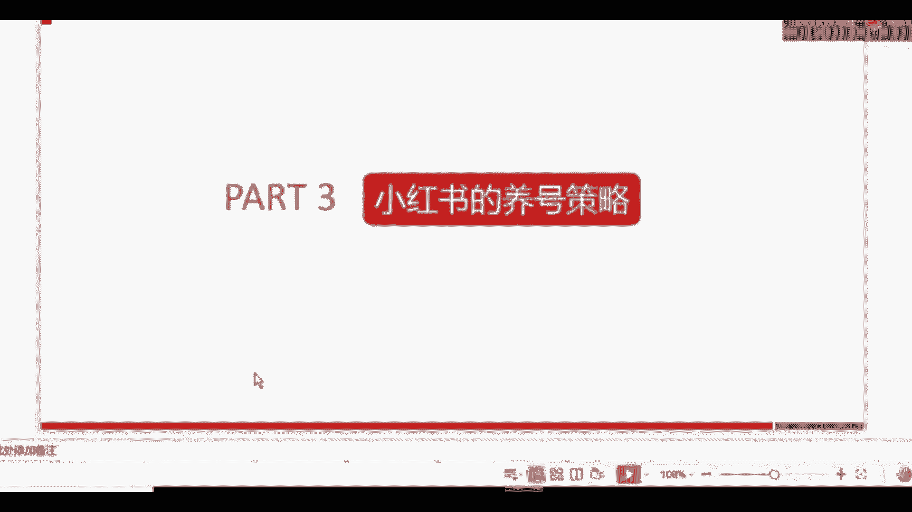

我们来看一下。我们的养号策略呢分为三个大的步骤。其中第一个叫完善注册资料。这个相信大家都知道，如果你们平时做一些别的平台，运营别的平台，或者说你在微信上或者抖音上你有过一一点运营经验的话。

就能了解到每一个平台，它对于资料，就这个账户主体，它的资料是否完善是有考核的。如果你的资料越完善，它就觉得你这个账户主体啊，这个相对来讲留存度留存率会更高一点，那他就会给你更多的这种推荐量。

第二个是什么呢？叫定时定向的浏览。什么意思呢？就是我们要在啊固定的时间。

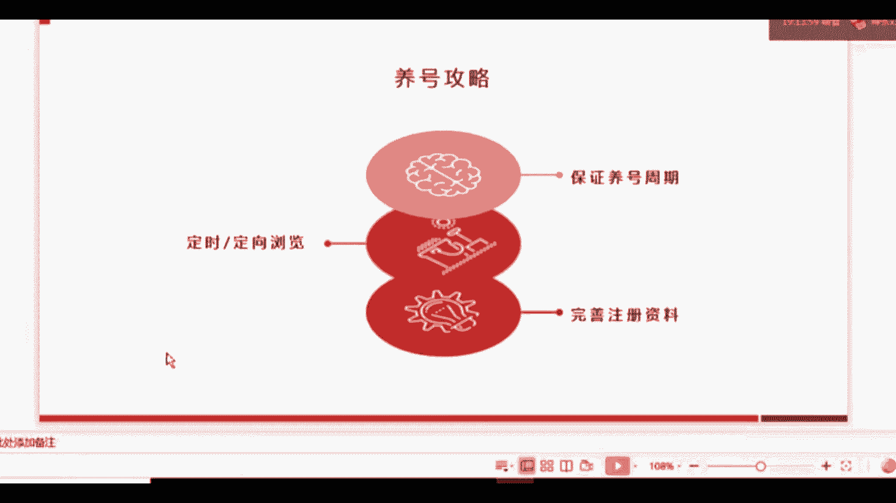

定向的去找一些信息，咱们一会会讲到。第三个是什么呢？叫保证养号周期。这三个关键步骤大家要记住。首先我们来看第一个啊，注册信息都有哪些呢？

这些小红书号、昵称、签名头像啊，常驻地等等，这些都有啊。这大家点到自己的小红书设置上就能看到你要填哪些信息。那么我要跟大家强调最关键的一点是什么呢？咱们的小红书号跟微信号是一模一样的，只能修改一次。

只能修改一次，这个要记住哦。小红书号很关键的原因是你可以把你的小红书号放在你要推广的一些素材当中。比如说你要做一张海报去推广你的小红书账号，那小红书账号就很关键。咱们只能修改一次。

所以改之前一定要慎重的考虑，能理解吗？那么完善注册信息有什么用处？刚刚我已经讲了，对于平台来说，他会根据这个去判断你是不是做的还不错。如果你完善了以后，平台就会觉得啊这个账户做的还行啊。

资料也填的很完整。那么呢他留存下来，就他在这个账户上进行后续的一系列动作的可能性就会很大。好，那就给他更多的一些流量，就会给你分配更多的一些流量，对平台来说是这个样子。那么对于用户来讲呢。

如果说你现在发了一篇比较好的文章，新引来了很多用户。那这些用户点进去一看，发现你只有一个头像，其他东西都没填，他可能就觉得这个是不是到别人的文章呀，就会对你的专业性产生质疑。

那么我们完善这个资料也是为了给用户展示你的相关信息，完善你的人设，展现你的专业度。

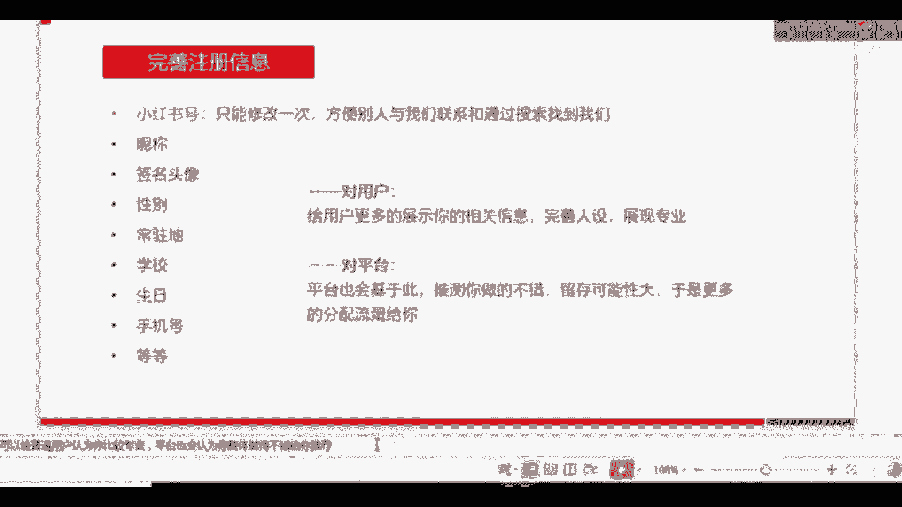

好。第二个，咱们刚才说过了，定时定向浏览。我入住了小红书以后哈，我先把资料填完了，然后怎么办呢？然后开始发文章吗？不千万不要千万不要完善了资料后就开始发文章。因为这个时候的权重还比较低。

这个是大家能学过别的运营，应该知道。或者说你单单纯单纯的从这个平台的后台人员想，如果我刚注册了一个账号就开始发文章。那后台账户对你的这这个账号还不了解的情况下，他不知道你的账号，目前是什么情况。

他可能就分配比较少的流量给你。所以大家千万不要一上来刚注册就开始发小红书，能理解吗？第二步咱们要进行的就是定时定向的浏览。什么意思呢？不管是你要做个人号，因为个人号现在也能变现，不管是你要做个人号。

还是要帮企业去养号。

写业养后是做什么？做营销嘛？这两种情况下，你都需要像正常的用户一样，但个人号就不用说了。我们本来就是正常用户。如果是企业养号，一次要做几十个账号的情况下怎么办呢？一定要像正常的用户一样。

在平台上产生足迹，就是你一定要像正常用户去刷一下小红书，每一个账号都要刷一下，这样平台才会认为你的那个账号比较活跃，然后就判断你的这个账号应该是真实的用户，就会给你正常的分配流量。

如果说你什么都不做的情况下，就去发小红书，平台任就会有可能认为你的账号是啊这个刷号啊，这个大规模的这种注册啊，这种假号，那他就不会给你正常分配流量了，那么你的曝光量就会低。

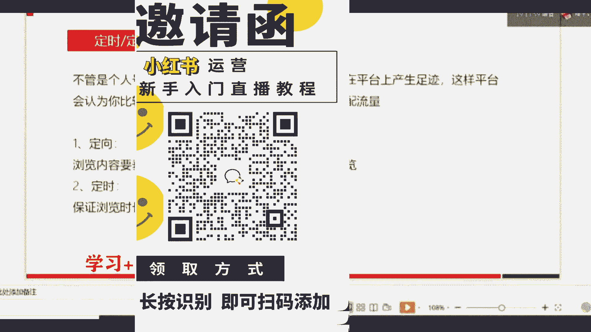

那咱们刚才说的定向和定时是什么意思？定向就是你的浏览内容一定要垂直。比如说你是做护肤的，你想做一个护肤类的账号，你想告诉别人怎么去护肤。那么你去浏览的内容就一定要是跟护肤相关的。

你可以搜跟护肤相关的一些关键词，然后去。在他的这个信息流界面，每一个都点进去看一下。定时是什么意思呢？就是一定要保证浏览时长，一不能看5分钟你就跳出来了啊，后台也是会记录到你的用户行为的。

所以我们一般推荐的是1到2个小时，上午跟下午都需要都需要去浏览，能理解吗？去保证用户的活跃度。

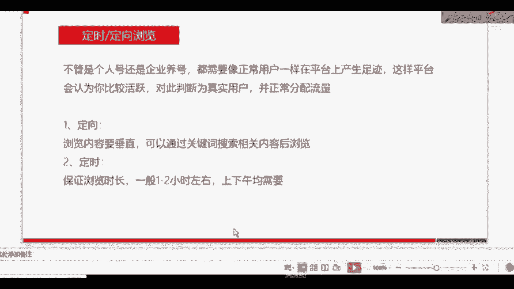

做完了第二步以后呢，我们接下来就要做第三步，什么意思呢？保证养号周期。我们可能在刚注册以后的5到7天之内都不会有啊这个发图文发笔记的这个行为。但是我们在这5到7天就一定要一直啊去浏览，去养号。

去做前面的一些动作。我们的养号周期一般是5到7天。如果是企业，我再说一下，如果是企业，如果你想养多个账号，就是即便是个人，你想养多个账号的话。

你也可以让你的员工或者你自己每一天在保证浏览时长的基础上积极的跟其他用户互动，互动，就是咱们前面刚说的冷启动阶段那三个行为点赞评论和收藏。当家分享转发也可以，你可以让啊我们一般情况下。

就是让你的这个账号的内容发到微博或者是微信上，也可以有这些行为。为什么要积极的跟其他用户互动的。这里我要说一下评论这个互动。评论啊，大家注册了小红书，应该会看到你随便点进去一个笔记，它的中间有一个评论。

那么评论为什么重要呢？因为如果你在比较热门的文章下评论的话，就很有可能会吸引到其他用户关注你。

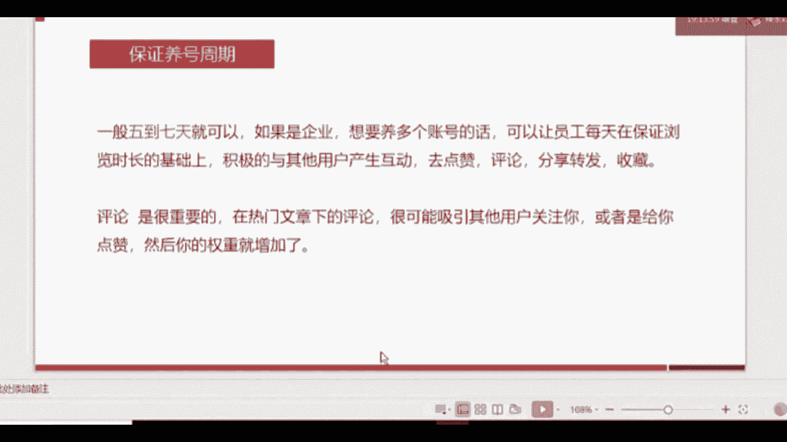

如果你对当前比如他分享一篇关于美白的文章啊，你在他分享的一些产品可能相对比较有限。那么你在底下回复一下关于你对美美白的一些简单理解，或者说你用过比较好用的一些美白的产品。

那么这个时候其他用户觉得哎你也比较专业。那他有可能会给你点赞，或者是点到你的主页以后去看。

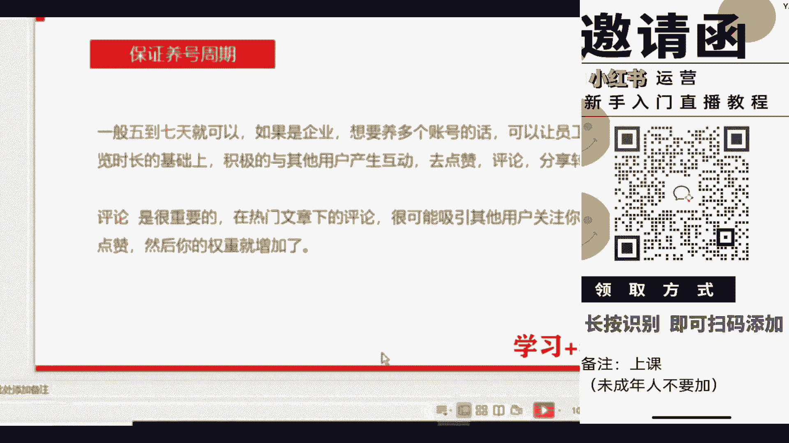

去看你的账号，或者先关注你，跟你产生一些互动和行为。能理解吗？所以评论是很重要的，特别重要。通过评论以后，用户给你产生了一些互动行为以后，你的权重就会自然而然的增加了。

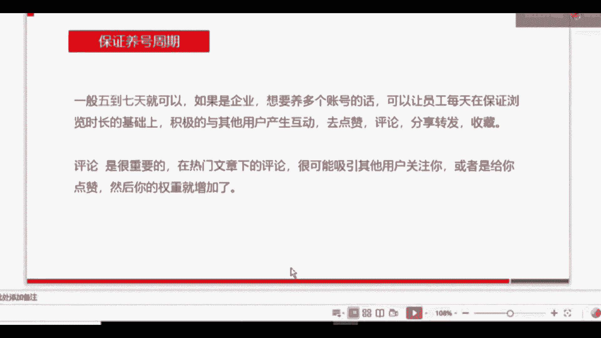

好，刚才咱们已经讲到了啊，关于这个养号策略的三个大的步骤，我们再回顾一下。第一个就是要完善注册资料。刚注册的时候一定要填写完整注册资料。第二个，定时定向的去浏览其他用户的信息。

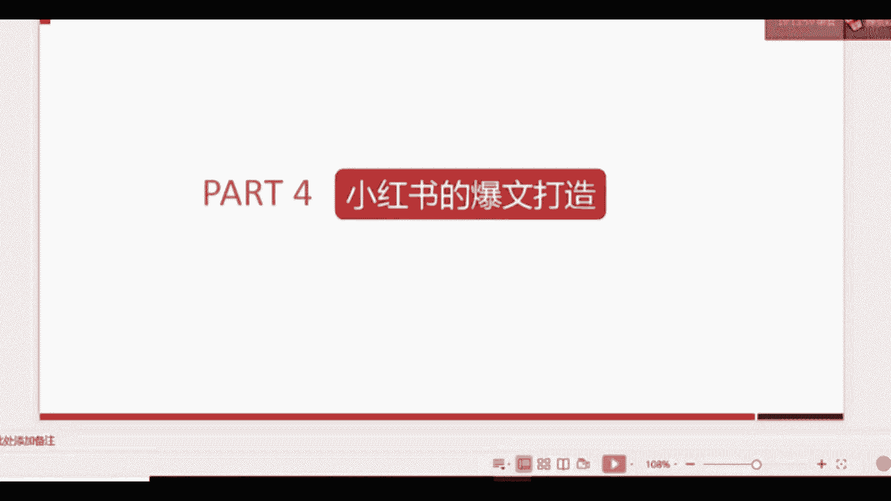

定时呢我们一般推荐是上午下午1到2个学习，11到2个小时。定向是什么意思？如果你要做护肤，那你就搜关键词跟护肤有关的关键词，定向的去浏览一些别人写的护肤的一些文章。那么系统就会给你分配。

跟护肤有关的一些流量。那么对于你后续发表图文，发表笔记，有一个很好的。一个作用。第三个呢是保证养号周期，咱们不要一注册账号就开始发。因为这个时候你的权重比较低，流量分配比较少，数据量不是很好。

系统没有办法判断一个账号到底是真的还是假的。所以我们一定要保证养号周期。

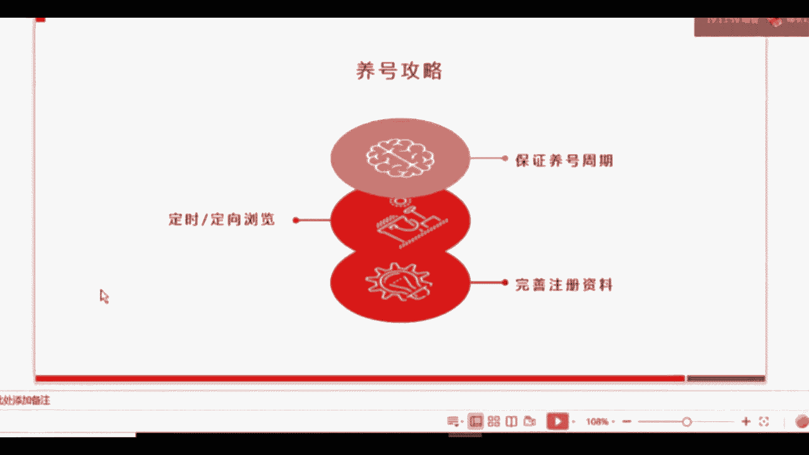

一般情况下5到7天就可以了。在这个养号周期当中，一定要积极的去跟别的用户产生互动行为。不仅仅是帮你吸粉，或者帮你去啊引导一些用户来关注你。同时是为了增加你的群众，以便咱们后边做内容的时候。

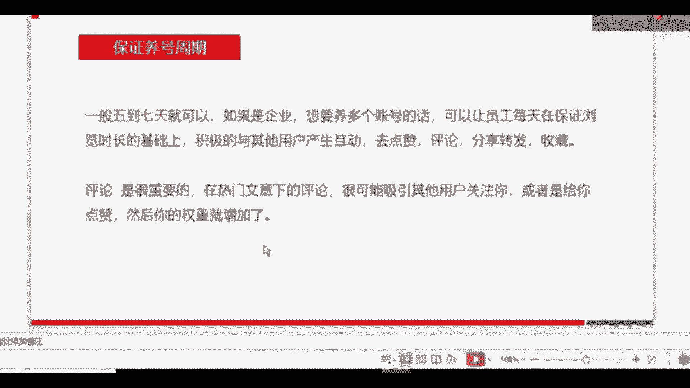

更好。