# 【新媒体运营】小红书运营全套课程 零基础进阶起号运营教程 小红书爆款笔记打造／ 商业变现／涨粉技巧／高效就业 完整版流量机制全套课程！ - P26：5.小红书爆款内容要求 - 小恐龙游江南 - BV1M9pYexEFS

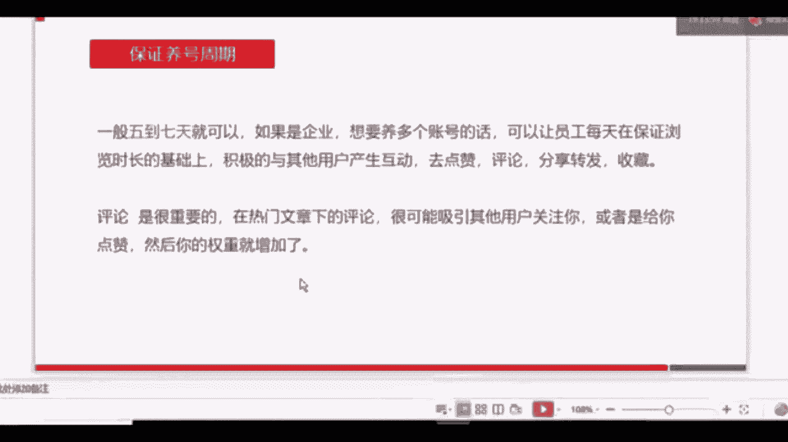

好，讲完了这个养号策略以后呢，咱们就简单的来讲一下豹文的打造。那么我如何写呢？如何发呢？我们来看一下。

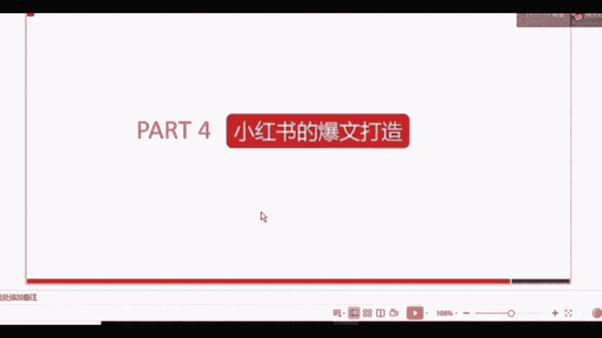

首先啊在小红书的这个平台上，以前在2017年的时候还可以发长图文，长图文就类似于微博的那种长图文。但是2017年之后就取消了。为什么？因为用户在看小红书的时候。

其实他已经是他没有那么长的时间会那么多的注意力放在小红书的平台上。他需要快速的满足。所以现在的形式主要有两种，第一个是图文，图会放9张图文，上面是图地下属，咱们一会会看到界面。第一种形式是图文。

第二种形式是短视频。那么关于短视频的内容呢，我们传出播客呢，也会有咱咱们新媒体专业，有专门的短视频课程，为期半个月左右。所以大家如果对短视频有兴趣的话，也可以来了解一下。咱们今天主要讲的是什么呢？

是关于图文笔记我如何去写。

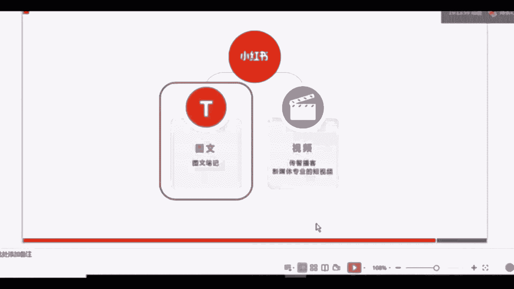

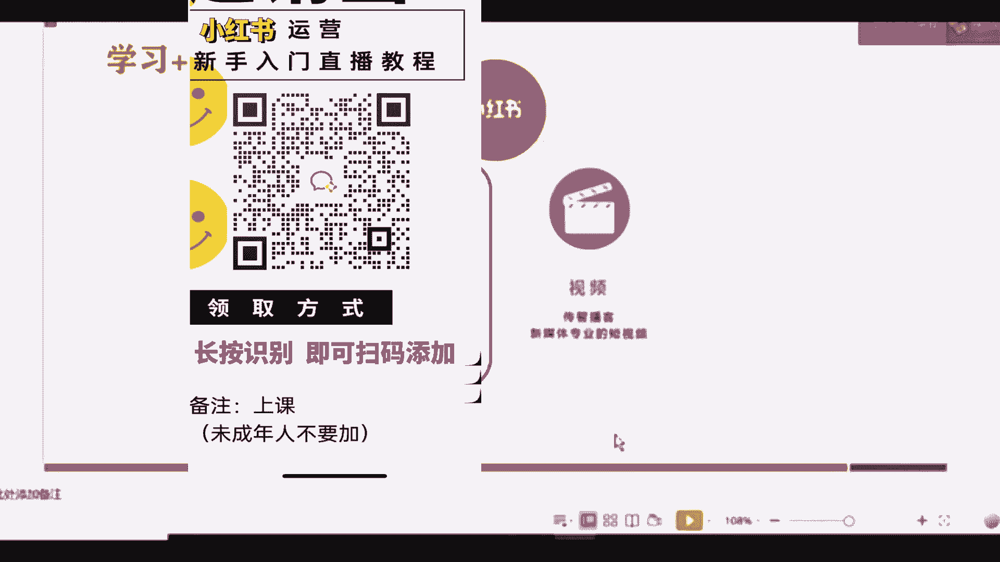

好，这是之前啊我放大给大家看一下啊，这是之前啊我发表的其中一个账号中的某一篇文章讲的是什么呢？那。讲的是什么呢？

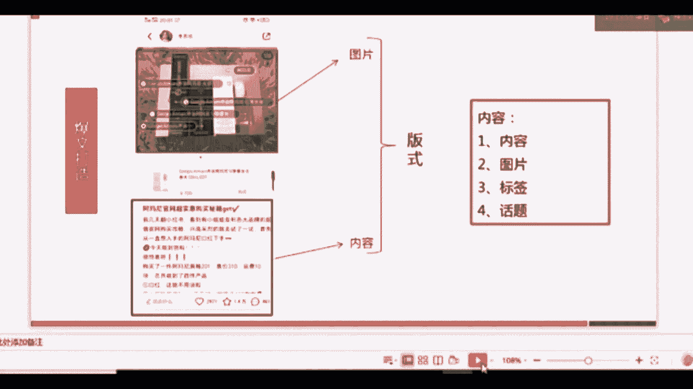

放大大家看一下啊，在这里看一下。这篇文章讲的是什么？讲的是在阿玛尼官网上如何去薅羊毛，大概就是这样意思，就是如何在阿玛尼官网上以比较低的价格买到超实惠的东西。那么在这篇图案上。

大家可以看到的上面这个板块9张图就是5。图片部分。小红书的版面相对来讲比较简单，没有像微信公众号那样，需要大家大家去排版呀，有编辑器啊等等。没有。所以大家了解一下它的版式就可以了。因为相对比较简单。

上面呢是图片，可以放9张，下面呢是文本，也就是内容。可以放1000字啊，这个后面也会挡到，可以放1000字。

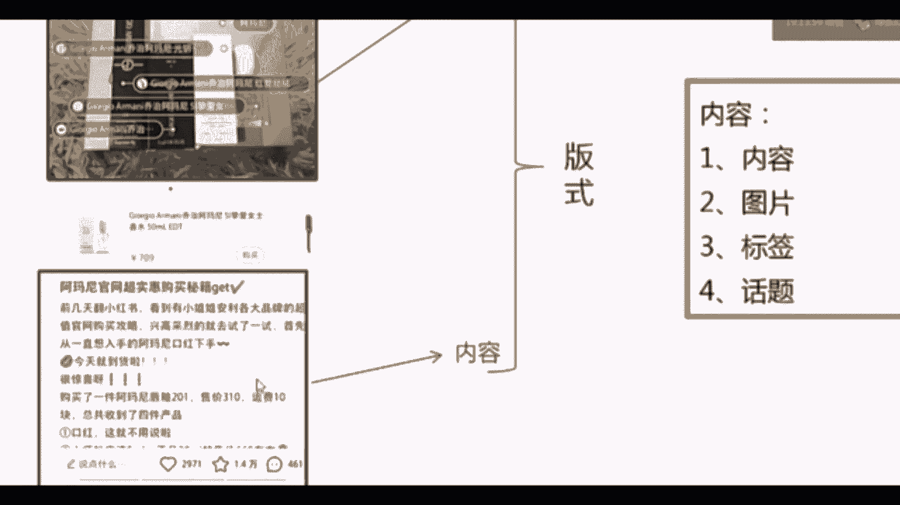

这就是板式有两个。那么关于元素呢，大家可以看上面有这些啊这些看起来圈圈圈圈呀这个产品啊这种这种类型啊，上面的这个部分是什么呢？它叫做标签，就包括我指的这些部分都叫做标签这里。

图片标签这里产品信息啊也在标签里可以打到这个地方叫做文章内部标签。三个标签，这个地方呢叫做话题，一篇文章只能添加一个话题。但一篇文章可以添加多个标签。能理解吗？大家能理解吗？是有延时吗？

我现我现在讲的这些内容大家可以理解吗？😊，因为这个图啊截的比较小，手机上的图。

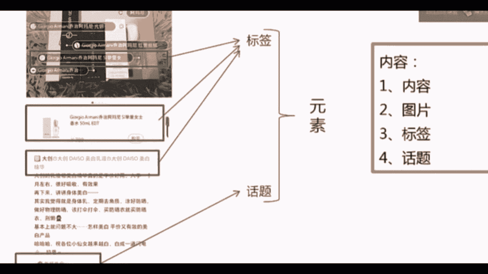

好，如果大家能理解的话，咱们就接下来讲后面的内容了，能理解吧？好吧，咱们接下来讲后面的内容。好。😊。

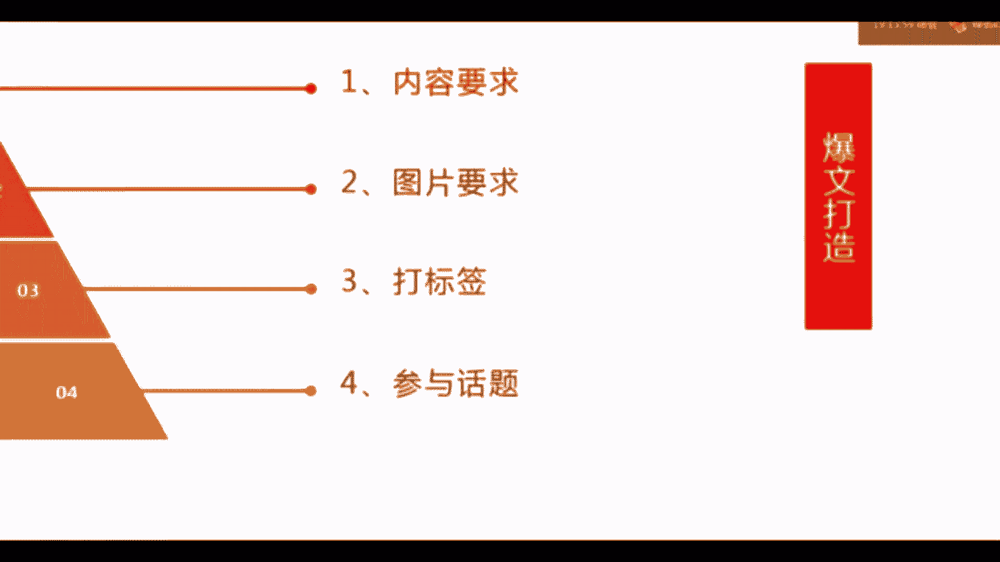

那么关于豹文打造，咱们就要针对于这四个部分。咱们刚才讲了四个部分啊，四个部分，图片内容，然后标签和话题有版式的两个内容，有元素的两个内容。咱们针对于这四个内容来讲的话，我们如何去做呢？

首先第一个大的板块就是内容要求。我们在写内容的时候，有些什么样的要求呢？大家来看一下。

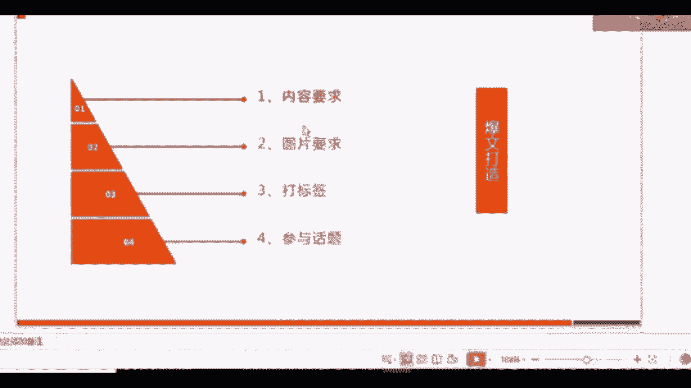

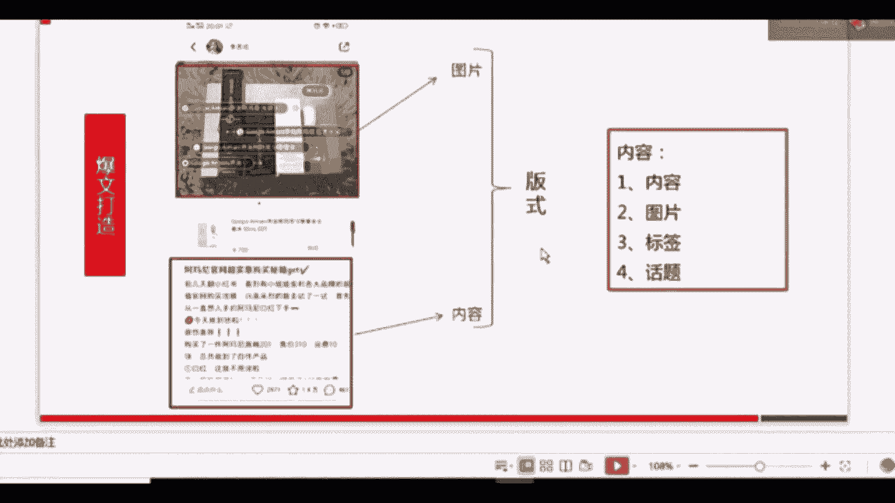

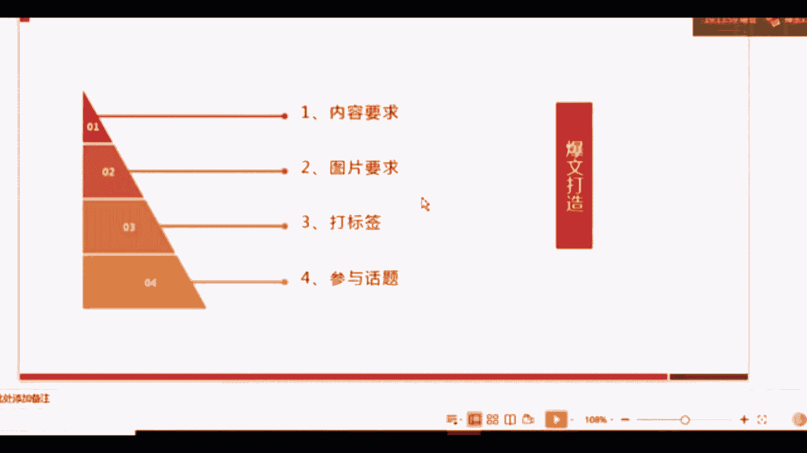

所以相对来讲比较简单，就是我们一定要逻辑清晰。

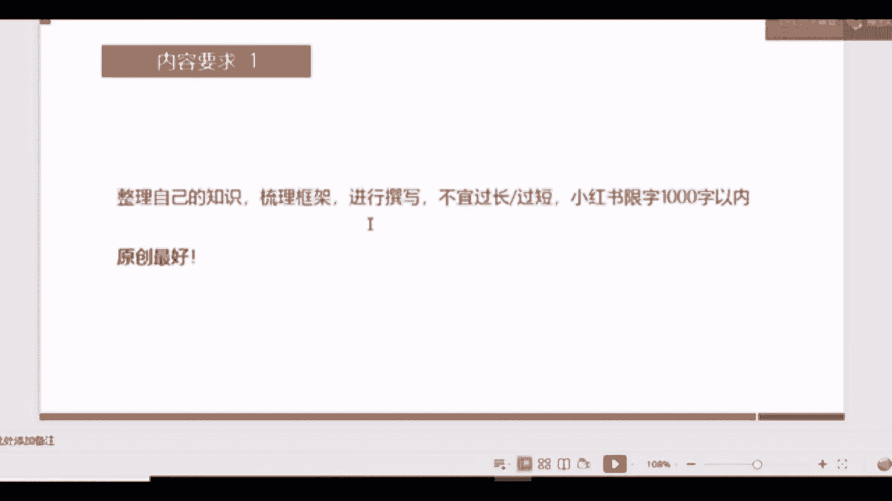

反式清楚，不不要太长，也不要太短。不要太长，也不要太短。因为小红书现在限字是1000字之内，但是我们肯定不希望大家写1000字，为什么太过于长，用户他的注意力集中的程度是有限的。

所以大家不要写1000字，就不要我贴着边，一定要写1000个字。

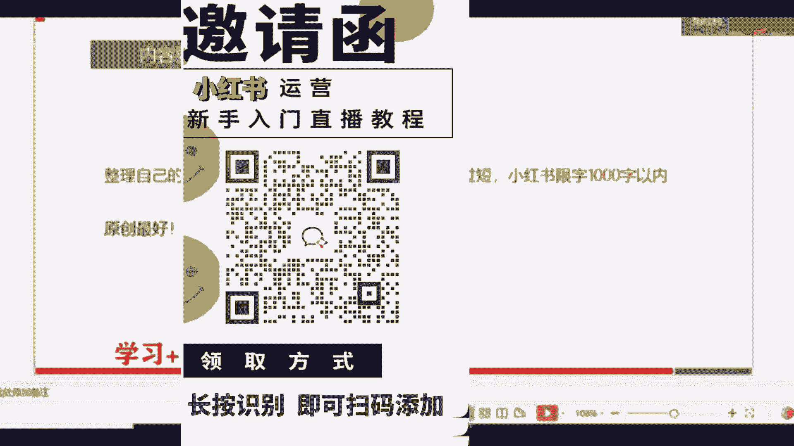

尽量在最短的字当中去阐述明白你要阐述的内容。也有同学说，那我要讲的东西太多了，我觉得1000字不够用怎么办？那这时咱们后边就会讲到啊，你要利用上图片的元素。好，先讲内容，内容最关键的就是第一不要太长。

不要太短，而且最好是原创。原创嘛各个平台对于原创都有一定的这种福利机制嘛，能理解吗？就对于原创，它的流量会分配的更多一点，它曝光量会高高一点，这都是很正常的事情。那么有的同学会说了。

老师比如说我进到一个护肤品行业。但是我从来没有接触过护肤品，我是一个男生，我可能之前从来没有了解护肤品的这些知识。那我怎么开始做呢？如果碰到这种情况，当然我们建议的肯定是原创为为主嘛。

如果碰到这种情况呢，咱们看第二个。方法怎么办呢？第一步，去小红书上搜关键词。比如说你要搜啊，你们的产品主要是以补水为主，咱们就搜补水，那可能会出来很多别人的文章。然后你按照热度去排序。排了序以后。

前几篇可能就是别人写的很好的那个。然后你点进去以后认真的阅读文章，并且要根据自己的理解。因为这也是你学习的一个过程，根据自己的理解去整理出来一份文章的知识框架。整理出来知识框架以后呢，你要根据你的观点。

或者你从别处学习到的一些知识，或者你们产品本身的一些信息。然后去理解理解了以后呢，再网上找寻到一些其他的素材，把自己的观点加进去再写一篇。啊，这就相对于刚才的原创来说是一个比较简单的方法。啊，第三个呢。

我们刚才讲了关于写文章，就是我怎么把它文字先写出来。那么如果我写出来了以后要注意什么呢？注意三点啊，第一个段落要清晰，布局要合理。什么意思呢？小红书没有排版，大家能看到的小红书有文章，它是没有排版的。

没有编辑器，没有帮你去做排版的一些内容。所以用户看到的几乎就是你原本写成的样子。

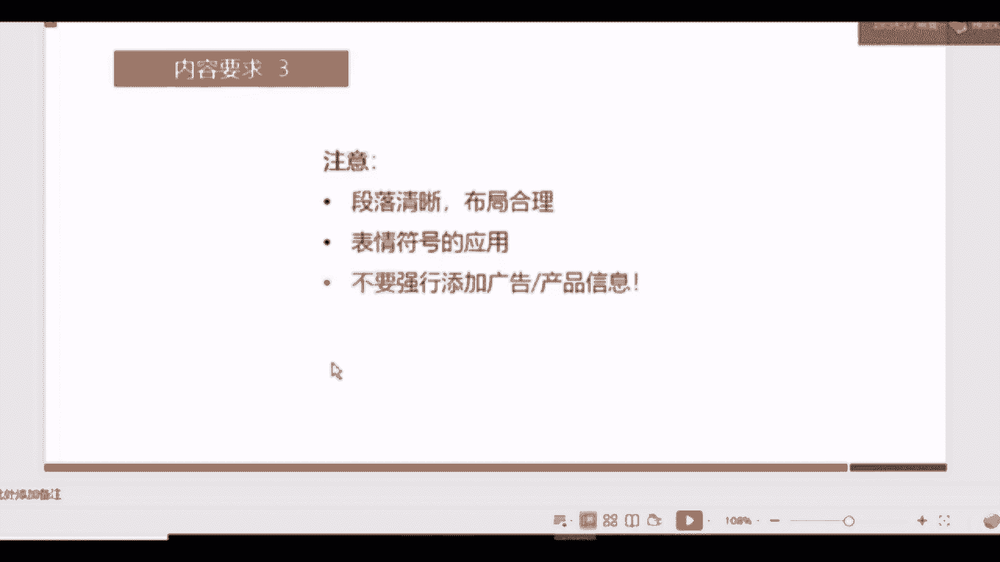

如果你是一堆文字扔上去，那么用户在看的过程中，他就会觉得很烦乱。不知道头绪，看着看着就不想看了，就会产生这样的情绪。那么对于你后续的转化是有问题的。

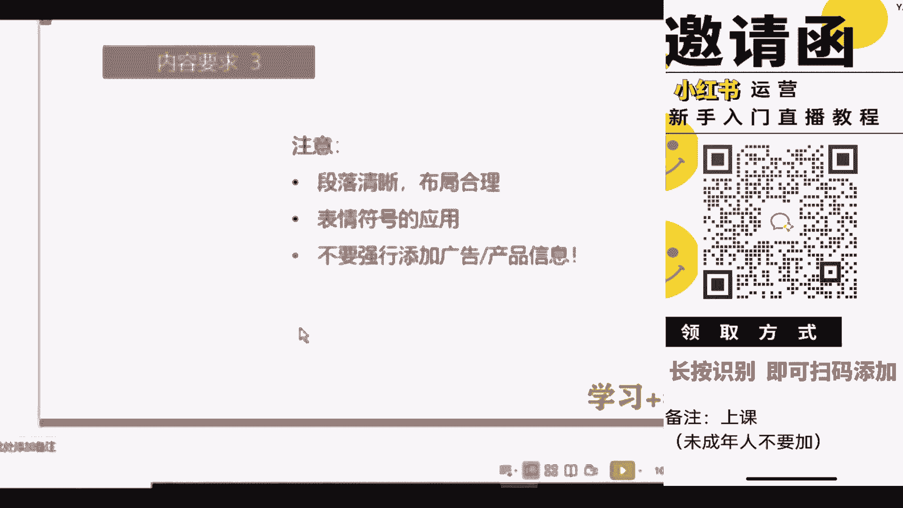

是受影响的。所以第一个要记住的就是我们写作的过程中就要把段落分清楚。我第一段写什么，第二段写什么，第三段写什么，而且要注意布局。可能你第一段是总总的告诉大家啊，我现在有什么用了什么产品。

我最近有什么问题，用了什么产品，我觉得还不错，总的去交代一下。那么中间可能是每一步怎么用，然后用户什么情况。把他们之间的间隔分开一点，布局要合理。我们一般都是总分总嘛，当然也可以去找一些文章。

你觉得比较好的。然后你去看别人是怎么布局的，去学习参考一下也可以。第二个关键点是什么？表情符号正是因为没有排版，所以可能我们需要一些小符号去帮助用户引导他去看某些。我们认为比较重要知识点。为什么？

因为它不像微信公众号一样，可以把重点字标红，或者把一些重点的内容突出，强调一下，它没有这个功能。所以我们用表情符号就是为了去强调某些部分，或者为了指引用户去看某些部分。能理解吧。第三个是什么呢？

就是不要强行的添加广告。当然我们刚才讲标歉已经说了啊，可以添加一些广告信息。但是什么叫强行呢？比如说在小红书目前的品牌号里。品牌号就已经入驻的品牌号里没有你们的产品，没有你们你们的品牌。

这个时候你大规模的去阐述你们品牌有什么影响力啊，你们品牌怎么样，你们这个产品怎么样，就有可能轻的轻则被限流被降权，重的情况下呢，就会被封号。因为小红书现在对于已经入驻的这些品牌，它有一定的保护机制。

所以如果你们的品牌还没有入驻小红书的话，那么我建议大家不要强行的添加很多硬的广告。好，关于内容呢，我们再分段啊具体来了解一下。刚才咱们说了三个要注意的因素。第一个呢叫做段落清晰，布局合理这个。啊。

这一页TPT上给大家展示了一个例子啊，就是一般情况下小红书的文案会怎么写？第一段呢简单的自我介绍背景介绍。比如说我现在给大家举一个例子啊，如果我要写一个关于护肤品的知识。比如说面膜好吧。第一段告诉大家。

你是啊这个干脾油皮混油皮混干皮，就你的肤质。然后你最近啊比如说出差或者你最近换季等等，因为一些某些因素产生了一些皮肤问题，比如说爆痘，比如说皲裂，比如说出红疹等等，产生了这个问题。

以后啊就简单的自我介绍，背景介绍了以后，你你当前的复质啊，你在什么地区介绍了以后，你被某些问题所困扰，产生了某些方面的需求。比如说我刚才说换季，你产生了这个暴痘的这种问题。

那你就产生了要把这个痘痘解决掉的问题，或者说产生了这个缺水的问题。产生了问题以后，第三段呢因为某些机缘巧合，朋友推荐啊、攻略啊、专家咨询啊等等。然后你了解到了哎某个产品。比如说哎刚好周围有朋友在做这个。

啊，微商吧啊这个比较直观一点，大多数微商也会在小红书上做嘛。比如说刚好有朋友在做微商，然后你跟他关系很好，他说哎呦，我送你哪片试试吧，你抱着对他信任的态度啊。第四个主要讲。你抱着对他吸任的态度，哎。

我试一试吧。然后你就可以讲，你睡了以后，你发现连敷了3天，哎，你发现这个效果特别好。很值得购买。然后你中间可以穿插一些打趣的性。比如说你觉得他送给你面膜就是为了让你买的，就是为了让你在他那产生消费的。

你觉得他比较黑心，什么什么。😊，塑料姐妹情等等。讲一些比较搞笑的啊一些话话术，可以引导用户去更有代入感。他会觉得你这个故事更真实。然后呢，你就会阐述一下，那怎么买呢？比如说你说哎我也不知道怎么买，哎呀。

我是我朋友是在这个微商，所以呢啊他直接送我的。你们要想要了解的话，可以怎么怎么样。看吧，你可以穿插一些产品的优点。比如说我用的过程中，这个精华液经常啊这个敷30分钟，它都不会干的。

我也觉得这个造成我很大困扰，我都不能认真的玩手机了。或者说我我我都不用注视着这个时间表，不用定闹铃。

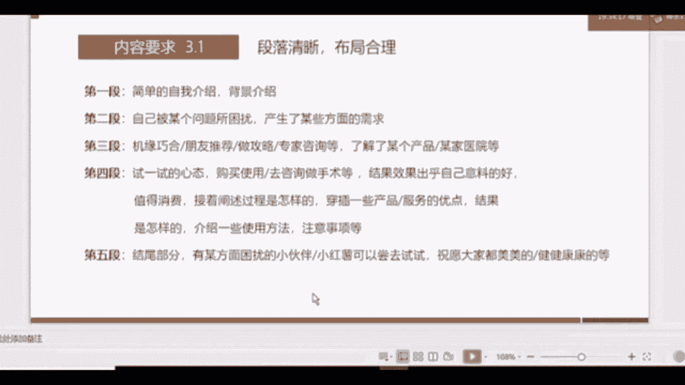

玩着我玩手机它也不会很干，不会让我的皮肤很干燥等等。

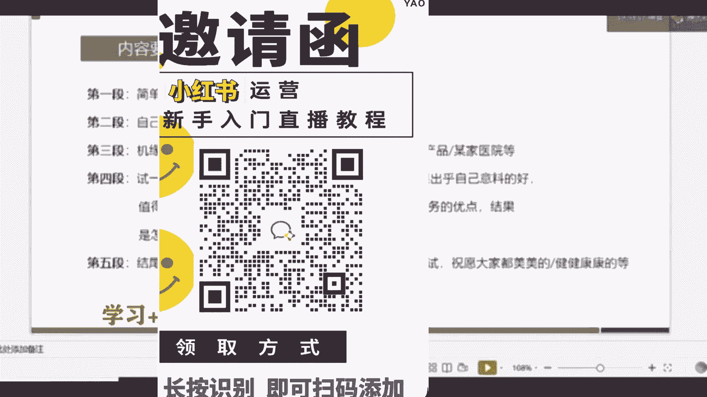

就会阐述一些这个产品的优点。然后呢，再结尾部分。然后你可以推荐哎，有某些，比如说你现在你可以写对于这个补水有困扰的小伙伴强烈推荐，你们一定要可以去试试，也不是很贵等等。祝愿大家都啊这个美美的啊。

健健康康的，就是最后的一些话术，一定要表达一些祝愿，或者去阐述一些态度就可以了。这一张呢是帮大家去简单的总结了一下，目前小红书上写的很多的一个文章架构。大家可以截屏保存一下。

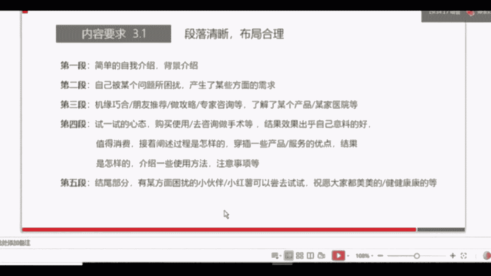

好，接下来呢是表情符号的应用啊，大家要注意一下，因为小红书没有排版，没有。这个对比就没有重点字突出等等，没有对比。所以用户在看的过程中很容易产生很乱，内容很乱，很烦躁。尤其是在你布局不清晰。

段落不明朗的情况下，产生这样的情况。那么我们就需要采取一些办法，目前来讲比较有效或者大字的比较多的办法就是使用表情符号。包括像这里它是蝴蝶结，它就对于它所阐述的产品进行了一个分类，相当于序列号。

但它比序列号更吸引人，引人注目一点。第二个是什么呢？就是这种右指箭头上上下左右指箭头。还有这种小表情。带一点语气，因为这里的表情能够表达出来你在讲这段话当时的一些状态，能够给用户传达到你当时的心理状态。

还有这里的点，这里的小星星，还有这里。一般我们在讲产品的时候，可能会对于它的某些功能进行测评跟行对比。那么这时候新形状。

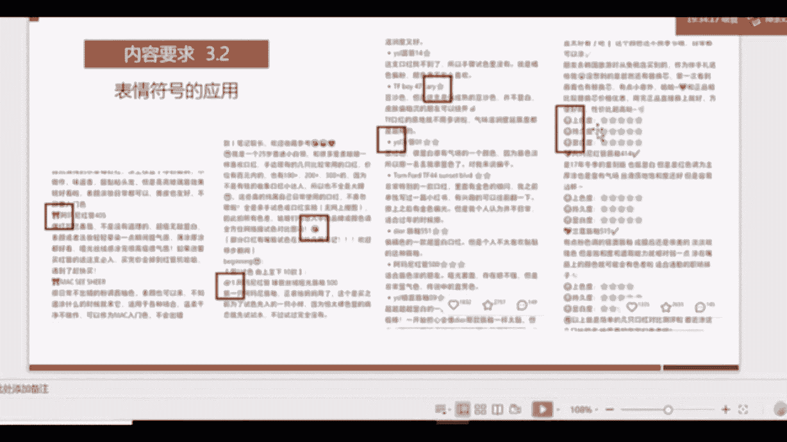

就用很多了。好，如果大家不知道怎么用的话，或者不知道哪里会有话。因为一般安卓自带的一些啊有这些输入法可能没有，大家可以去试着去下载一下搜狗讯飞。当苹果自带为都有啊，一毛表情，这个大家用的都很多了。

那么小红书平台它自己本身也会带一些表情符号，但也可以去选取。好，第三个就是内容要求的最后一个板块是什么呢？就是咱们刚才讲的。不要加广告，那么不要加广告，你文墨可以加什么呢？除了刚才咱们说到的。

可以加一些祝福语，也可以写成。这样子，因为这也是总结了以后啊，小红书上写的比较多的一些话术。比如说看到现在啊变得很漂亮的自己，用了这个产品以后，看到这样变很漂亮自己啊，也不会觉得闺蜜很坑人了。

或者突然觉得闺蜜很贴心等等。你中间可以加一些你自己的话术，跟前面的剧情要呼应就可以了。然后呢讲一下爱美是女孩子一辈子一辈子的事情，祝所有看到我分享的小仙女越长越好看等等。如果大家有什么问题的话。

可以评论或者私信我最后一句尽量加，为什么引导大家去评论或者私信你。😊。

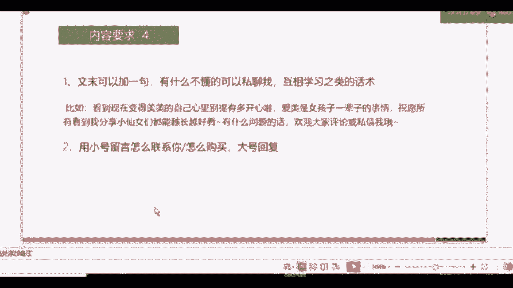

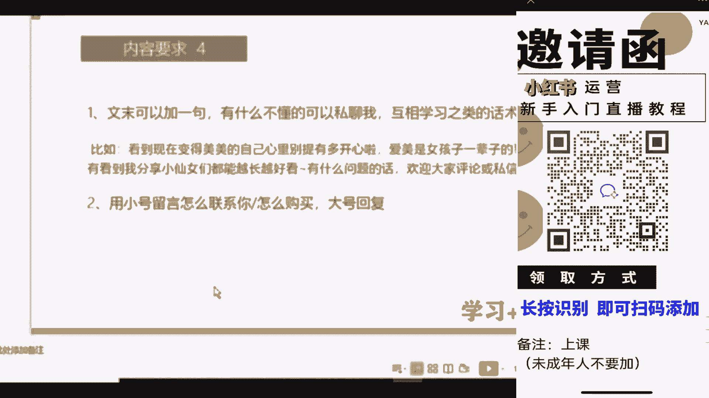

然后第二个办法是什么呢？就是我们在同时有很多个账号的情况下，可以互相去评论。互相去评论，怎么联系你啊，怎么购买呀，然后你再用你的主体账号去回复他们就可以了。

比如说之前啊我推了我帮一个企业做了一篇面膜的这个推广文案，底下有很多人留言说，哎怎么去购买呀，看不到购买信息啊，怎么怎么样。然后我就回复他们说啊，你们可以去这个京东自营店或者京东某个店铺去搜索就可以了。

直接购买。就引导用户去。购买或者联系你都可以。

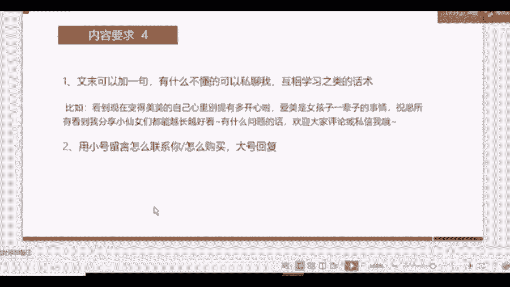