# 【新媒体运营】小红书运营全套课程 零基础进阶起号运营教程 小红书爆款笔记打造／ 商业变现／涨粉技巧／高效就业 完整版流量机制全套课程！ - P27：6.小红书爆款图片及其他要求 - 小恐龙游江南 - BV1M9pYexEFS

好，第二个呢就是关于图片的要求。咱们刚才讲的那些都是关于内容的要求。那么知道了关于内容的要求以后呢，我接下来就要看图片。

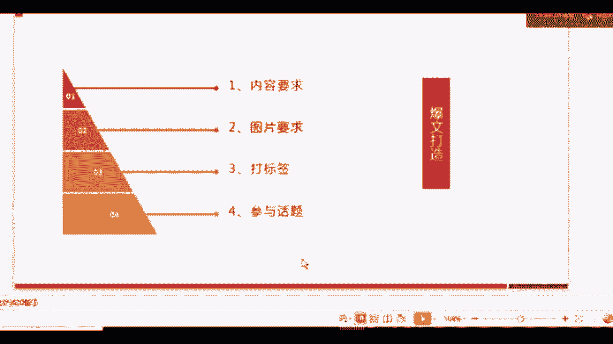

图片的要求主要有5点。第一个一定要清晰，一定要清晰。如果是你自己拍找像素高一点的相机、手机或者相机都可以。如果是你在网上找的话，不要找那种已经有这种马赛克或者有糊调的部分的图片一定要清晰。

第二个呢是要与文章的内容所对应，表达好它的主旨，与文章内容对应。因为如果你上面讲的是面膜啊，上面图片放的是面膜，底下你写的是关于美白的产品，图文不对的话，这是最基础最基础的错误，一定不能犯。

第三个是最好产生对比，这个咱们后边会有例子，因为它很关键。也是现在做小红书的账号上啊，这些用户他用的比较多的一个办法。第四个是什么呢？就尽量是成体系的图，风格要一致。

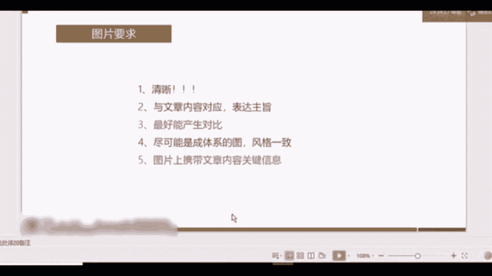

这个也很简单，字面意思大家理解一下就可以。第五个呢是图片上携带的文章内容关键信息，要体现出关键信息。三跟五相对来讲是现在大家做小红书的时候用的最多的办法。

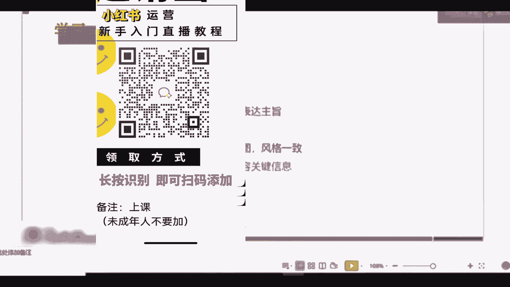

接下来我们要看一下例子啊，124都是比较简单的，大家字面理解一下就可以了。首先是三，这个就是一个对比图啊，在夏天到来的时候，很多的女生对于美白都有强烈的需求。那么这个时候很多的关于美白产品的一些。

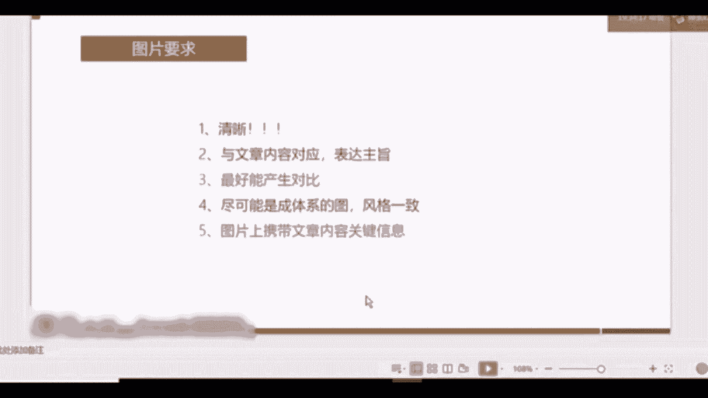

文章就会出应运而生。那么做的比较好的类型呢，他们都有一个特点，就是什么？就是把对比图放在了第一张图，也就是能展示出来的那个图上。大家可以看一下上面的这个。上面呢是大一上半年，下面是大一下半年。

然后3月份、4月份跟现在为什么要放对比图呢？我们在营销当中讲一个很关键的营销方式是什么？叫描绘愿景。杨慧愿景什么意思？告诉用户，你用了我的产品以后能怎么样？大家可以看宜家的画册啊，宜家出的一些画册。

上面不仅仅是放了宜家的产品，而是放了像比如说小孩子在沙发上躺着在看书。然后呃这个其他的。家人在一一块玩耍，在烘培。其乐融融，他会把他的产品融入到一个场景当中，那么就会给用户产生一种什么样的心理反应呢？

就是你买了我的产品以后，你就有可能会产生这样的场景。这就是帮助用户在描绘愿景。那么对比图它就是一种利用的这样一种特点。它首先描述了用户的痛点，就是我想要美白嘛，我有美白的需求。

其次呢他帮用户营造出了一种愿景。你用了我推荐的产品，或者你看了我的文章，你就可以达到这样美白的一种效果。那么用户点进去的概率就会增大，这是第一种办法。然后接下来咱们刚才讲了。

就是你的图片上要携带关键信息，这种情况是针对于什么呢？测评类会用的很多，为什么？因为咱们整个小红书的文章只能放1000个字。

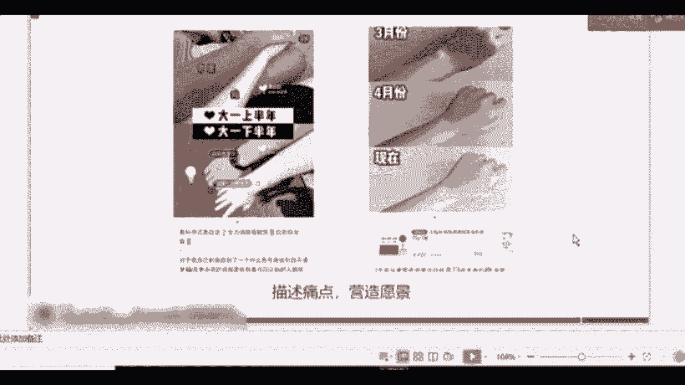

那么1000个字，如果你要测评，比如说8款、9款，像第一个啊，他可能要测十几款产品的话怎么办？那么1000字是肯定不够你用的。这个时候对于用户来讲。你打图片，把所有你拍到的产品图放在同一张图上。

标注好这个产品它的特点。对于用户来讲，第一，认知很简单，它的认知成本比较低，产品很直观。我知道我想买哪个，我针对于它的特点，我就知道我想买哪个可以买哪个对比很明显。那么对于用户来讲。

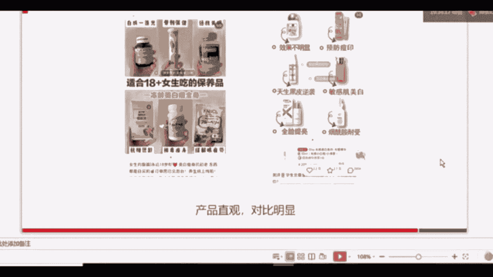

他看你的这篇文章的可能性就会增大，你的曝光量就会增大。

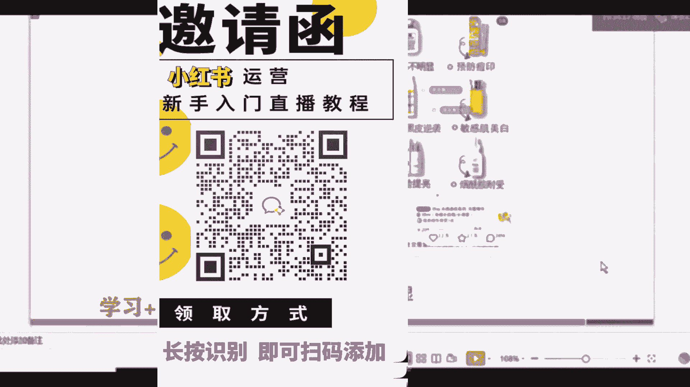

好，刚才讲了关于图片的5点，关于文章的几点。那么接下来咱们讲关于元素，刚刚讲关于版式的两个内容和图片。接下来咱们讲关于元素元素呢，小红书上目前两只有两个元素。第一个是标签，第二个是话题。

那么标签我们先来看一下标签。

刚才大家看到了，我的那个图片上就会有一堆很多的标签。有看到吧？关于图片上也就很多的标签，那么图片上现在能够打的标签有这么八大类，大家可以看一下啊，有这么八大类。首先呢前五类是直接展示在标签页上的。

就是你点一下图片，我们上传好图片以后，直接点一下图片，就可以看到标签。就可以看到啊这个我现在截图的这个页面。其中前5个是直接在标签页上的。如果你想放店铺信息，也就是你的产品现在已经入驻到小红书上了。

这是针对于企业来讲啊，如果你想放产品信息，同时店铺已经入驻到小红书了，那么你可以直接在搜索框去搜索你们的。品牌名称它就会出现你们的店铺，你就可以把店铺信息加入到标签当中。第七个是语音标签。在这个位置啊。

大家长按可以录制15秒的语音表签。但是相对来讲这是小红书目前啊用户反馈比较鸡肋的一个项目，比较鸡肋的一个功能啊。但大家也可以采用。如果你只是可以传达你的声音。第八类呢是自己创建的标签。在搜索框当中。

比如说我想搜索啊关于情人节的一些标签，可能它没有。比如说啊我爱某个品牌，你搜了这个名称以后，它没有这个标签怎么办？底下有一个添加符号，可以添加这个标签。可以自己创建我爱某个品牌。这就是关于标签。

那么我们搜到标签后怎么选择呢？只有一个就是选择热度最高的，或者跟你的话题相关性最高的。刚刚我选择的是啊如何美白。在文章当中打标签标签还有一类啊，刚刚是在这个图片上打标签。

那么标签还有一类是在文章当中打标签。那么文章当中打标签呢，它没有7和8，就没有语音标签，也不能自己去创建标签，只能够根据现有的一些标签去添加。

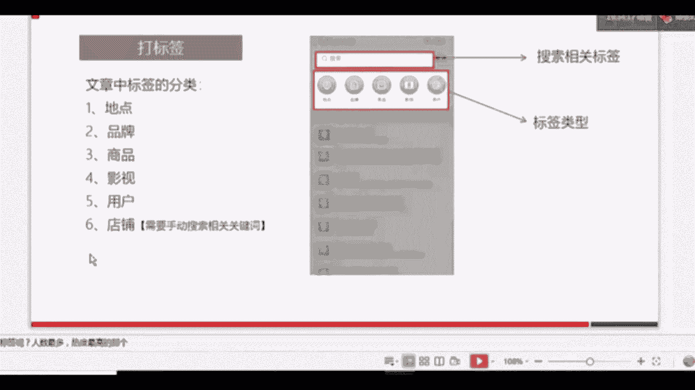

好，关于打标签呢，咱们就讲到这里。其实打标签很简单，你们真正进入到小红书操作的时候，你就会发现打标签就是选择的过程，选择别人已经写好的一些标签信息，添加到你的图片或者文章当中就可以了。

那么最后一个很关键的就是话题。

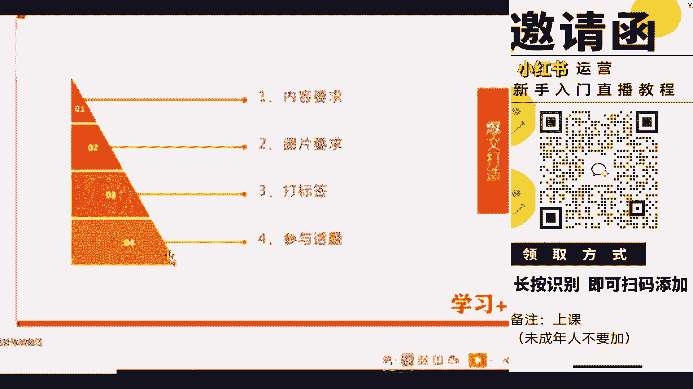

就是话题。

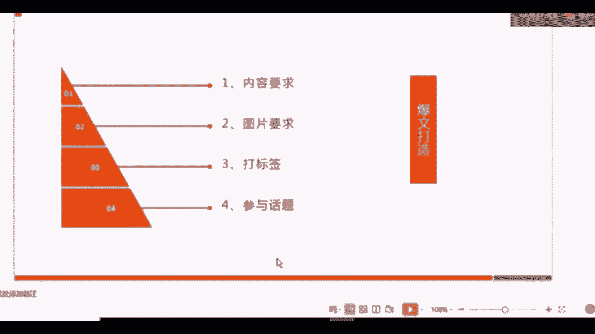

我们来看一下，这是我之前出的另外一篇文章。另外一篇文章，它的最后一个末尾的地方有一个蓝字。这个就叫话题。那么话题怎么添加了一篇文章，只能够添加。一个话题。一篇文章只能够添加一个话题，话题怎么添加呢？

我们再把我们的内容书写完整以后呢，在内容的下方有一个话题的选项。我们点进去以后就可以出现这样一个界面。然后你就可以去搜索你想要添加的话题。比如说我这天是关于美白的产品评测产品推荐。

那么我在底下就添加了怎样美白这样一个话题。在美白的这个话题里，怎样美白是排行最高的。一个话题，我把它添加进去以后，用户通过搜索怎样美白，他就可以看到。他就可以看到。啊，我的这个文章。

所以话题呢是一个很关键的因素。大家如果写文章，一定要把标签和话题添加进去，因为很关键。好，我们总结一下，除了版式和元素的技巧以外，就是刚刚咱们讲关于版式，就是内容和图片元素标签和话题。

除了这两个板块的技巧以外呢，一定要记住定时更新，保持活跃，多去浏览，多去刷别人的文章，而且保持自己定期的更新，这样才能增加你账号的权重，才能让系统给你分配更多的流量。这个在其他平台也是适用的。

比如说抖音啊都是一样的。

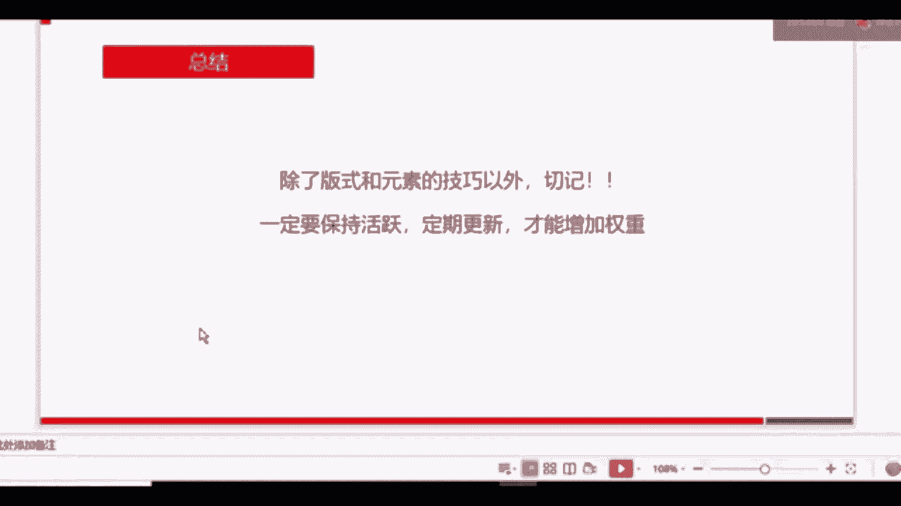