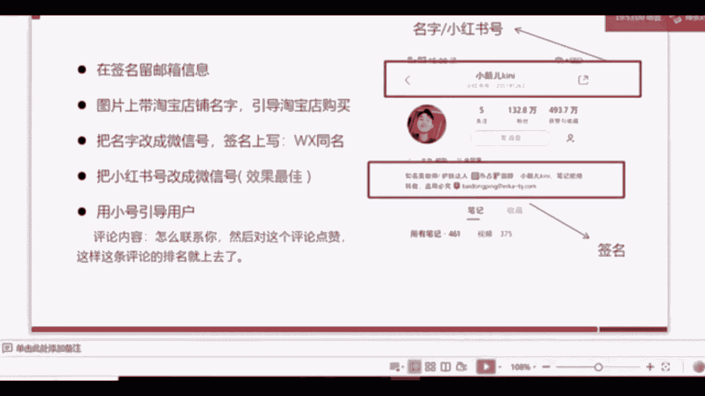
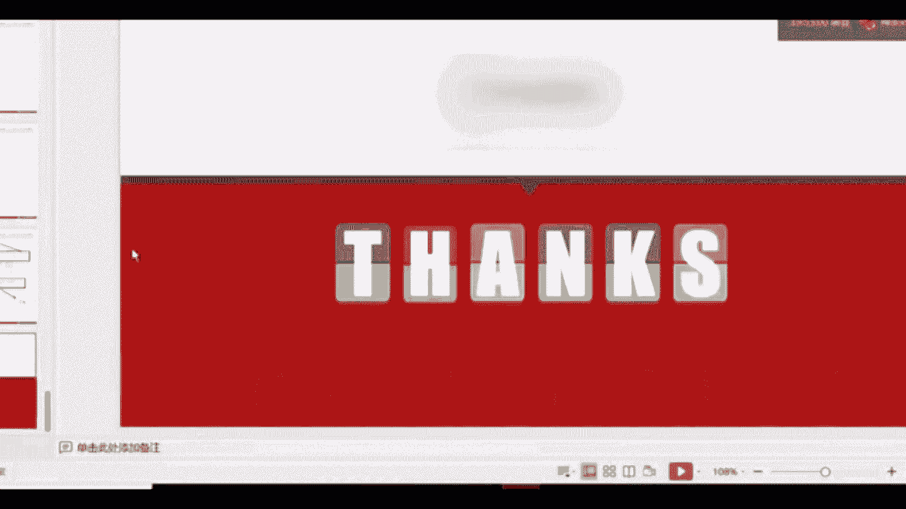
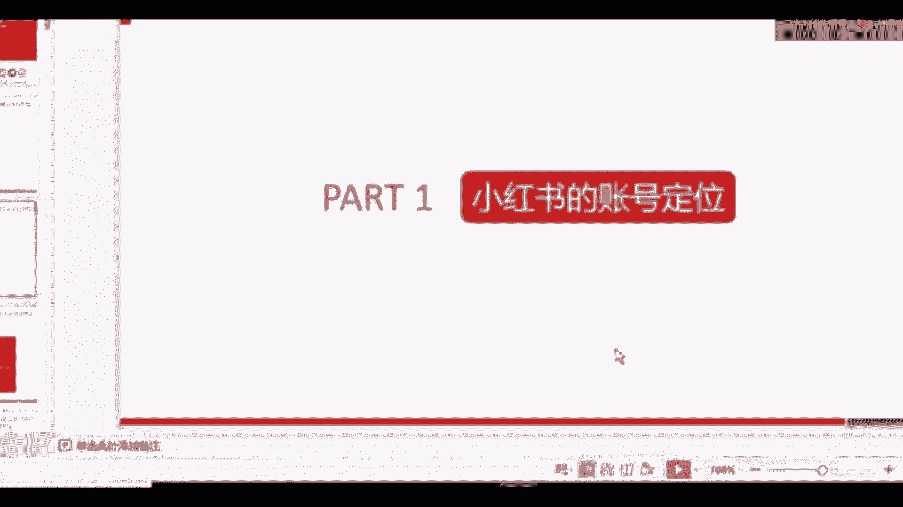
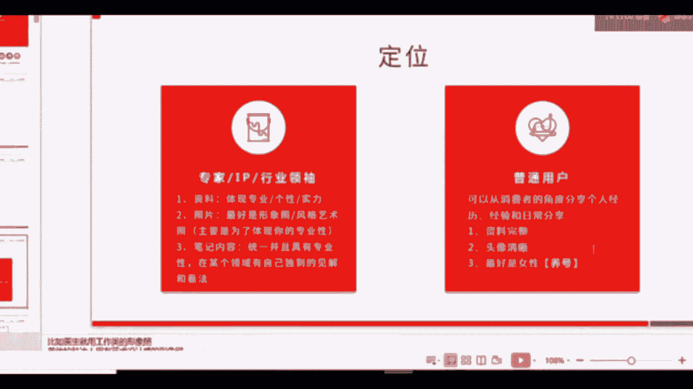
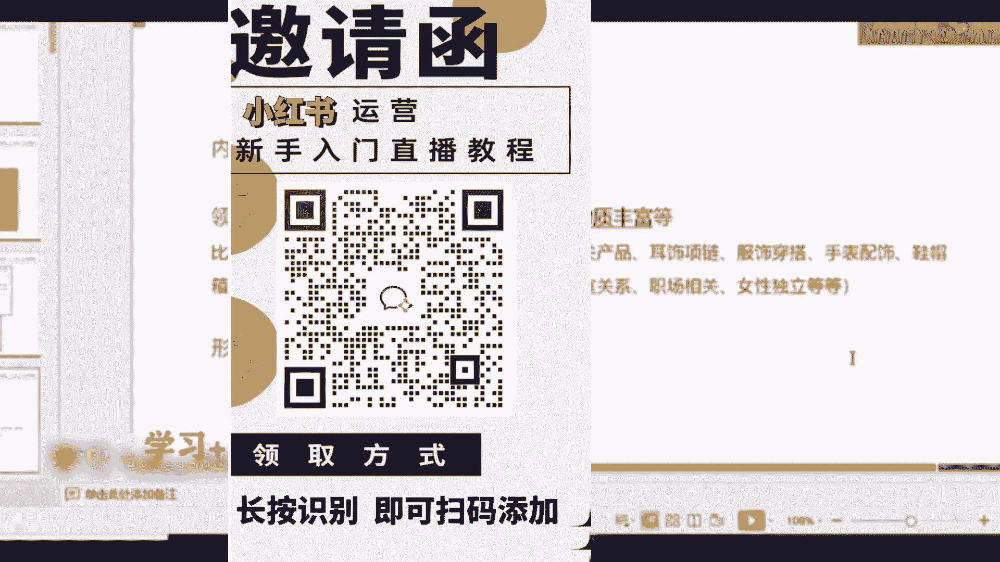
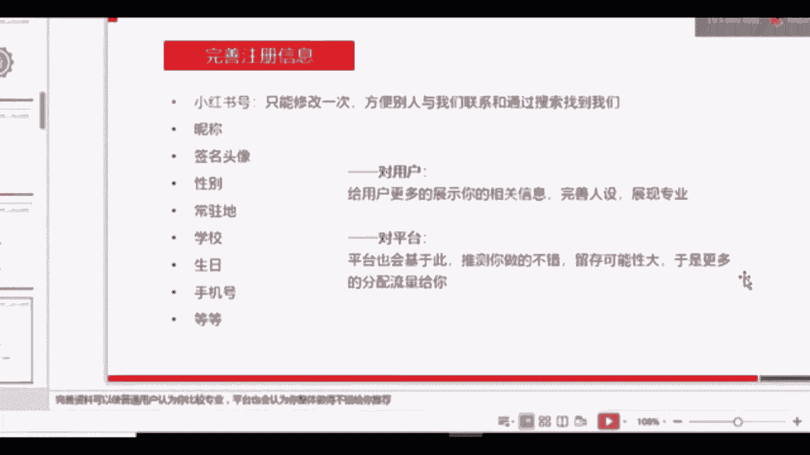

# 【新媒体运营】小红书运营全套课程 零基础进阶起号运营教程 小红书爆款笔记打造／ 商业变现／涨粉技巧／高效就业 完整版流量机制全套课程！ - P28：7.小红书引流微信 - 小恐龙游江南 - BV1M9pYexEFS

好，最后一个板块我们就给大家简单的讲一下小红书怎么样引流到微信上。我们刚才已经讲了小红书它的这个关系啊，我们账号主体跟粉丝的关系相对比较弱一点。那我想建立强关系怎么办？我想跟他建立微信关系。

直接跟他私聊这种情况怎么办？而且我想了解我的粉丝怎么办？好，我们来看一下，有这么5个办法。大家先来看一下，有这么5个办法，怎么引导用户去了解到你的微信号。因为你直接在文章当中去打你的微信号的话。

是有可能会被封号的。是有可能会被小红书封号的。所以我们有5个办法。第一个，在他的签名的地方，签名在这个位置，我们的设置当中有一个个性签名。他展示出来呢就会在页面的这个位置。

我们在这个位置呢就可以留你的邮箱信息。比如这这个小编，他是现在做的比较好的一个美妆博主啊，之前是医生先送美妆博主，他在这个地方呢就留了他的微那个邮箱，也留了他的这个微博等等。

我们就可以在签名部分留的留你的邮箱信息。第二个部分是什么？如果你有淘宝店铺，就是你们的这个品牌或者你个体有淘宝店铺的话，那你就可以直接在图片上啊留淘宝店铺的名字，直接留名字。能理解吗？

直接留你的淘宝店铺的名字，引导用户去你的淘宝店铺去购买，增加你淘宝店铺的人气。它只要产生购买行为就可以了。第三个是什么呢？就是在这个地方名字的这个地方。把名字改成你的微信号，然后签名上写的微信同名。

就是你的微信名字啊，微信号。我们的微信号也能改一次，对吧？所以你我把我的名字改成微信号，或者把小红书号改成微信号都可以。这两个地方都可以改成微信号。那么我们测试了以后，发现把小红书号改成微信号。

它的效果更好一点。为什么？因为在名字这个层号，其实我们更多的还想体现我的个性，或者跟你其他账号同名。就可以了。我们建议的是改你的小红书号。好，最后一个呢就是咱们之前刚刚讲内容的时候也讲过。

就是用你的小号用其他账号去引导用户，或者让你的朋友去帮你回复。在某一篇文章下啊去回复我怎么联系你啊，我觉得你内容很好，我怎么联系你啊。我觉得你的写的东西很好，我怎么去购买呀，然后对这个评论进行点赞。

就可以把这条评论刷到前面去了。当他说到前面以后，后续的长尾流量。😊，就后续别人通过话题啊，通过首页，通过等等其他途径看到你的文章后，他就能看到这个评论。他就有可能会选择联系你。大家能理解吗？好。

基本上咱们今天的课程呢。

啊，就是这样子，我带大家再回顾一下啊，带大家再回顾一下。

首先呢从最开始的时候，我们要了解小红书的账号定位，就是我现在是一个新号，或者我进了企业后，他们想做小红书，但是我从来没有做过，我怎么去定位呢？定位呢分两类，第一个是专家就是IP类专家类。

第二类是普通用户，专家可以通过自己的专业知识去分享关于某个领域它的一些内容。普通用户呢可以通过自己的亲身体验自己的经历去分享某些内容。所以，这就是目前最。啊，小红书的两大定位。

定位完以后，我们就要考虑内容。那么我们在小红书上做哪些内容比较好呢？大家只要记住一个关键点，就是跟女性相关就可以了。为什么？因为小红书目前来讲的话，它女性群体是占80%以上的。

占80%以上，所以只要跟女性相关。它就有很大的受关注的可能性。而且这百分之啊70%口误70%的啊女性，而且这70%的女性群体是年轻的、有消费能力的，对消费有需求的，可能只是不知道自己去买什么的用户。

能理解吗？就他已经具备了你去营销的所有特质，只是他不知道自己要买什么。所以对于这部分，只要是跟这女性相关的内容。你获得啊曝光的可能性就很高。那么都可能会包括哪些领域呢？如果你是做个人好。

或者企业现在没有想好自己要从哪方面入手的话，或者品品牌本身不是做产品类型的。那么可以从接下来这16个字入手。从头到脚衣食住行，精神满足和物质丰富。咱们刚才也讲了，这四个16个字是什么意思。

大家可以看一下底大例子，发型打造呀，从头到脚，发型护肤、耳饰穿搭、手手表配饰、鞋帽相包等等。这都是跟女性人就是整个她的打造有关系的。那么也可以从精神满足的角度去考虑，可以做一些连续剧啊，之前做的情侣。

什么七舅老爷，她做的情侣的。然后像柚子CC她做的女性啊，霸道总裁似的都可以。这种类型在小红书上也是很受欢迎的。我们可以采取的，我们把内容它的主要的领域确定好以后，那么它采取的形式有哪些呢？

第一个是干货的，就你直接去分享如何打造卷发，如何打造直发，男生如何打造发型等等。啊，如何穿搭，如何怎么样，如何穿搭日式风小清新等等都可以。第二类是测评类的。测评类是什么意思？

夏日美白产品大集点告诉你哪些雷霆，不要踩等等啊，这是我现想的一个标题。如果我要做美白类的产品，我就可以做测评类。我把我用过的所有关于美白的一些产品，我都放在一起去测评。第三个是剧情类。

就关于精神满足这块。如果你可以做剧情类。😊，拍这种小电影，拍电影啊等等，拍这个剧情或者悬疑片或者这种霸道总裁啊，柚子CC这种都可以。第四类是感悟类，就是你最近读书笔记啊，关于小红书最近其实很火。

还有一个类型，就是大家拍自己的。这个日常生活学习打卡，就是关于感悟类，我读了某些书，觉得啊这些书有这些好处等等。都可以写。那么关于内容确定好以后呢，咱们就要去了解小红书的推荐机制。其实很简单。

就是这张图，大家一定要把这张图记住就。就可以了。我们发布笔记以后呢，机器算法会根据啊随机推荐到一部分的群体当中，它的页面上进行展示。那么这部分群体会对我们的内容进行一部分的互动。这叫冷启动阶段。

经过冷启动阶段以后呢，会进入到。如果我们的互动量比较高的话，会进入到热门优质内容推荐的这个板块。好，接下来就是养号策略。三步骤记住就可以了。完善注册资料，定时定向浏览，保证养号的周期。

