# 【新媒体运营】小红书运营全套课程 零基础进阶起号运营教程 小红书爆款笔记打造／ 商业变现／涨粉技巧／高效就业 完整版流量机制全套课程！ - P29：小红书如何快速获取精准流量--截流 - 夏季来临时 - BV1SnYjeuEQ3

哈喽今天的话呢要跟大家去分享一下，关于小红书的一个截流啊，节奏这个东西的话呢就是我们要怎么去节流，然后的话呢我们的节流标准是什么。

首先我跟大家先讲一下节流的标准，这是一个小红书的一个主页啊。

然后的话呢我们首先先要去比如啊，我先举个例子搜索一个像是连衣裙。

然后我们在结合的时候的话，他不是说了吗，你要先去看他的发布时间。

所以说它的发布时间的话呢，最好是你像打个比方啊，像这种季节的衣服。

你总不能找那种发布的时间，是12月份的作品吧。

肯定不可能的嘛，所以说你们是这种近期的那种数据比较好的。

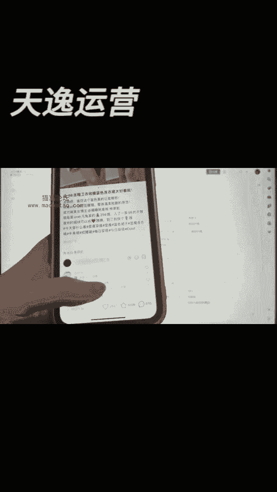

这肯定是我们第一个我们要去考虑的，就是发布时间呃，近近一点就是两个月内啊，一个月内啊，三个月内他都OK，特别是这种季节性的品，如果说它是这种什么嗯，只有8月份能够卖，那你肯定就是这个就专门找8月份的。

你像打个比方啊，如果说吃那个猕猴桃那种水果季。

那他的一个发布时间你肯定要看的。

这个是很关键的，那如果说你卖的是那种哦，呃一年到头他都卖的还可以的。

那他的一个就是发布时间，就相对来说没有这么的紧凑，所以说你们在看品的时候，每一个品的发布时间，它就是看它的一个最新的一个发布时间。

不都不大一样，但是如果说有要给一个标准的话呢，你们尽可能是三个月以内，那是最好的，或者是两四个月以内好吧。

然后的话呢我们再继续啊，除了这个发布时间之外的话呢，我们还要去学会去看粉丝数。

祝我最好，他是不要大于1万，如果说他是动大于1万的粉丝数。

因为小红书1万的粉丝，他已经算粉丝数还可以的了。

那你我建议你尽量不要考虑，那如果说真的真的就是你看到那个粉丝数挺高。

然后那个作品数据也挺好，而且的话呢他比打个比方啊。

就是他这个作品就是和其他的比哎，数据还就是比较高的。

然后他粉丝数比较大，嗯你也是可以考虑是否选用他的品，你打个比方，就是在这个博主里面，他发的作品。

比如二三十万的粉丝，然后他平均的点赞是50万的点赞，然后他突然有一条是1000万的点赞，那你说这东西要还是不要呢。

那你这是可以考虑，但是但是我一般都是建议你啊。

你们找节流对象的时候，低粉爆款那是最棒的。

那是最好的，好不好，如果说粉丝数比较大，然后的话呢点赞也很高。

可以考虑，不是说绝对不能考虑的好不好，最好是粉丝数不要大于1万的好吧，其次我们的节流还有什么呢。

我们要看到的评论区，就你要我再给你们看一个啊。

就是，随便再看一个。

你看像这个博主，这个博主你看啊，他是SARA新群与抱云。

就你像这种的啊，你像这种的看到没有，一定一定一定要学会看一个东西，就是他的评论区，但你看大家都来求货号。

这个叫做什么呢，他是个品，你根本就没法截流的，那个评论区里面人家要的不是什么。

网上的都知道是SARA，他干嘛到你这找呢，对不对，所以说我们的评论区一定要去看。

就是很多啊，我我再找一找啊，打个比方嗯。

求链接，看到没有，来，包包有链接吗，小米手环有链接吗。

其实我跟你讲啊，你们在节流的时候，你可以找到跟就是比如你要卖这款产品。

你就找到跟他发一样的博主，下面你去截流。

或者是还有一种是什么呢，或者是就是呃可能不是这个博主。

他可能不是要卖这件衣服，他要卖的是这个手机壳。

但是你是刚好是卖这件衣服的博主，博主你是不是这种的，也可以去截聊，这也是可以的好吧。

所以说他的评论区也是，你要不要去截留他的标准。

第三个是什么呢，它的售卖就是售卖分成两种，因为小红书平台它比较常见的。

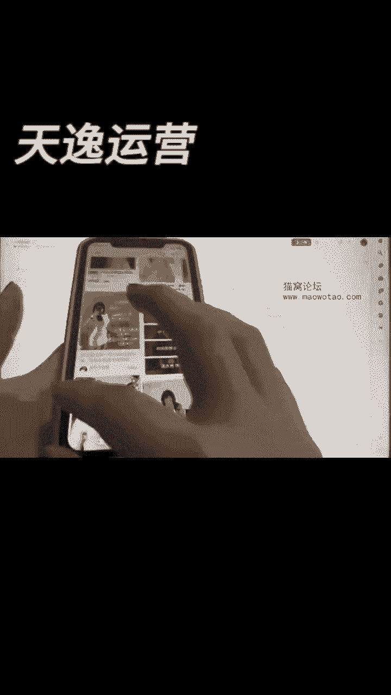

我经常讲过的，我听到的主页啊，你看到没有，小红书其实比较常见的就是有很多的一些博主。

他们会进行一些引流的行为，我再给你们找几个。

嗯稍微等一下啊。

看到没有，小红书会有很多这样子的博主，会进行这样子的引流行为。

他把这个透明度降低了吗，一般别人问他这东西哪里买。

他会让别人去哪里到，到什么淘宝啊，到什么京东啊。

到什么思域去购买，对不对，所以说如果说啊他售卖的情况，你看他是小红书闭环售卖。

还是引导到其他平台售卖，那引导到其他平台售卖的话。

那你基本上哦都是就是可以去考虑节流的，但是价格的话呢。

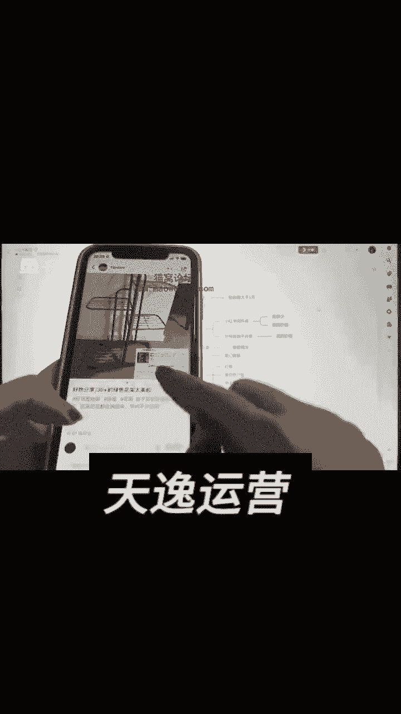

你可以也考虑考虑，如果说你的价格就是跟它比。

你没有很大的优势，我觉得你三思，如果说你价格跟他比哎。

你肯定有很大的优势，或者还有还有他也是引流到别的平台去卖的，你绝对可以去做的好不好。

反正你就记住啊，这些东西不是都绝对，但是一定是以这个为基准。

你去找会比较好一点，我再给你看个小红书闭环的啊。

小红书闭环可能比较难找，因为现在卖货的博主不是这么的多。

我找一找啊，呃我找一找。

我搜索一些关键词吧，来你看像这个博主。

他不是做小红书闭环的吗，对不对，来他购买同款，看到没有。

3000多的点赞，然后2000多的一个销量，像这个博主，我建议你们啊。

嗯你再考虑考虑，如果说他的粉丝数，你看3000多的粉丝已经卖了2000。

已经卖了2000多单了，所以说就是呃你如果说你的价格跟它比。

没有很大的优势，比如你他卖一百一百一十九。

对不对，可能你卖的你你能找到29块钱的，它的质量跟他一样啊。

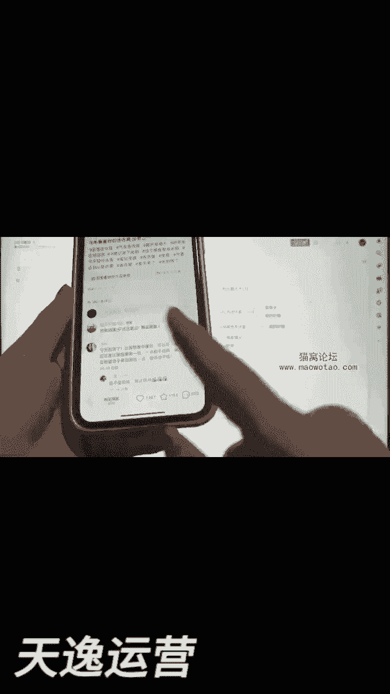

前提是啊，然后你能卖到59，那你的一个这个价格的优势。

你能打压的过的，他之外别的没有办法去做，所以你看到没有，所以说你看啊，像这个。

然后你们可能会问那老师，我看这个产品的销量，我要多少的V，就是他卖到多少。

我才能不去对标呢，这东西又要再讲一个，就是如果说这个博主只有他自己一个人。

办理千多单，没有别人做，那么我跟你讲。

你可以考虑你价格只要有优势，如果说比如现在网上大家都在卖。

然后卖的都是那种几万的，几10万的，我跟你讲，这东西叫做这个市场肯定做不久了。

因为大家都在做嘛，这市场肯定会很快就会瓜分掉的。

但是我跟你讲，如果说你看到诶他几百的粉丝。

那个人也几百的粉丝，但是他们卖的销量不是1000单，800单，500单，300单是不是几十单。

但是他点赞也很高，像这样子的品，你肯定也是可以去考虑的。

能明白不好吧，所以说其次啊我跟你讲啊，卖多少和卖多少的价格。

都是你去结合他的标准，还有一个是什么呢，就是你要去截流。

你得看你这个行业里面就是同行上。

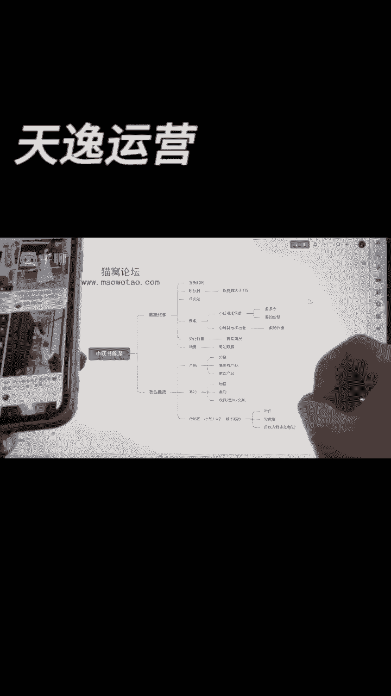

他到底售卖的一个情况是什么样子的，有些人就是大家都比如都在卖这款东西。

大家都在卖这款东西，然后销量都非常高的，那但是这个短暂的热度很快就会过去的，过去掉之后，你要么你现在你就能卖，然后的话你要么就是你现在就能梗。

紧跟这个热度，不然的话我告诉你啊，这个东西你就别考虑了，你就考虑什么呢。

弄低粉爆款的，就这种的书最简单就直接是低粉爆款，如果说哎你想要知道哎别人卖的怎么样。

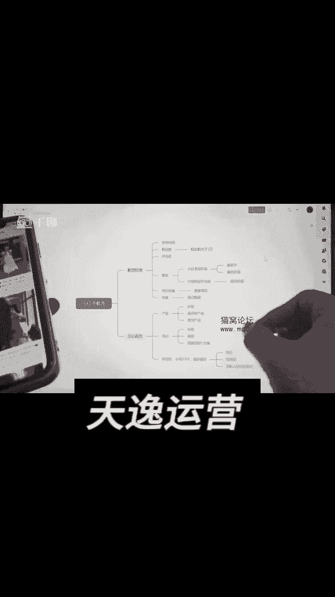

你就搜索关键词啊，你就找到就是比如地板清洁剂。

你就地板清洁剂，比如连衣裙，就连衣裙，比如什么穿戴甲就穿戴甲，随便你就是你能搜得到他的同款。

你能看到他的一个销量情况，你再去找就是决定你是否去卖。

反正你就记住了啊，你们今天去做这些节流的这些标准。

它不是绝对的，它只是相对的，因为产品的一个流量。

产品的一个大盘它不一样，你像打个比方。

卖衣服的大盘肯定会比嗯卖那个养生茶的大牌。

可能会就高很多，那可能你卖这个连衣裙的大牌，你可能会可比如打个比方啊。

像你看这种小粘碟这种的这种的大盘，那肯定会大很多的。

所以说这种东西是相对的，可能你少沾点，你这个博主能够卖到500单，能够卖到600已经不错了，但是他现在又有热度，你能不能做能做，但是我跟你讲啊，你记住，如果说今天你卖那个衣服卖了个五六百的。

他不算多的，很正常好吧，其次还有一个什么呢，就是笔记的热度很简单啦。

你看你在主页上什么6000的点赞，4000的点赞，2。3万的点赞。

像这样子的笔记热度，这都是都是还是可以的，能明白不。

你看像这种300来点赞就一般般，所以说就是呃主要你看上过千的点赞啊。

最好是能够达到上万的，那肯定是最好的，然后点赞数越高。

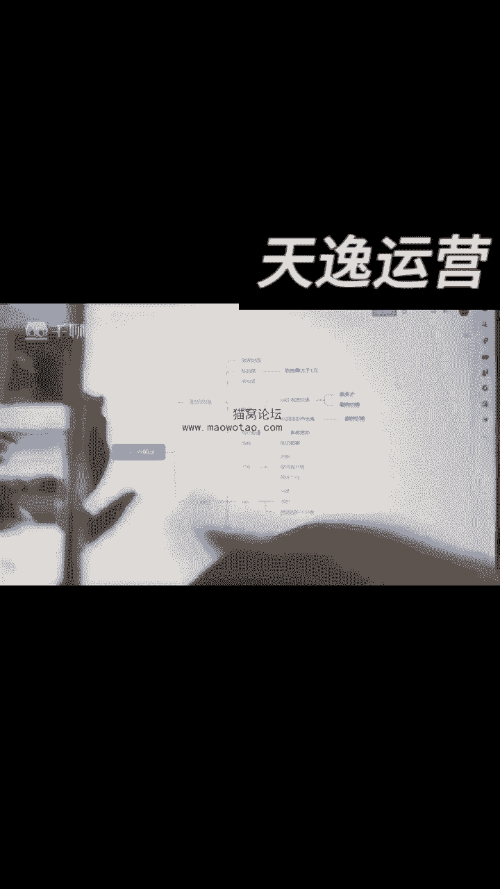

他没有卖，那对于我们来说去截流，那是最不错的，然后很多人可能就会问了，那老师，那这样子怎么去截流呢，首先你会要从产品上你去考虑它是否节流。

你打个比方，像这个小姐姐，她的这款产品。

你要是看看你有没有的，如果说我找一个就是有货的啊。

如果说你看啊像打个呃，用不用用用用用这个。

如果说像这个小姐姐她卖的这个产品，然后的话你要去截他的流量。

你得先去找过你的供应链呀，你的供应链上是否有这个价格优势。

如果我说你的供应链上，连这个价格优势你都没有，你咋截流。

对不对，人家看你啊，他卖100多，你卖300多，你说他到比买家到他那买。

还到你哪儿买，当然是到他那儿买了嘛，所以说你的价格要去了解过的。

然后的话呢，你要是找找看你的供应链是否能找到这款产品，你不要觉得这个东西你卖的挺好的，我也想去卖你的供应链里面不一定有，因为有些小红书上我跟你讲。

他有些真的有些产品的话呢，它真的是有些设计的。

或者是他真的就是有些博主他是拿过来改，自己出来，工厂上改过。

然后再去卖的，是有这种情况的，所以说一定要去优先先了解过你的产品。

然后的话呢还有一个还有一个是什么，更有产品的意思是什么意思呢，就比如你今天啊。

你比如你买这件衣服，这件衣服的话呢，它的一个款式，比如它是那种布料比较廉价的。

像那个聚酯纤维的那这种的这种的料子。

可是不是可能就是不是很好的啊，你像打个比方，就是你如果是我，我是一个就是比较有消费能力的，或者是我对于质感要求比较高的。

但是我特别喜欢这个款式，那我肯定会去找一些同款的，那我看他这个是聚酯纤维。

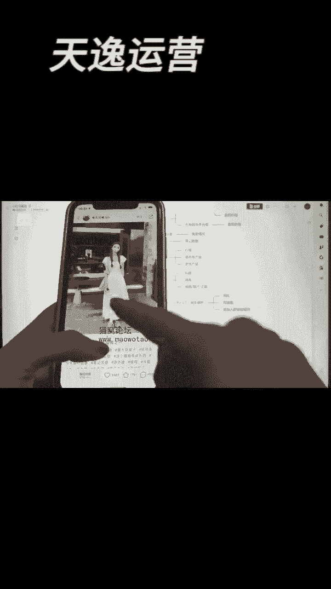

可能我会想再想找个棉的，所以说如果说你会有一个更好的产品。

可以代替它，你当然也是可以去截他的流量的，懂不懂啊。

然后的话当你确定好，OK这个产品咱们有了你节流，你就卖他这个产品能懂不。

各位再然后我们再去截流，我们还要去截他什么东西呢。

再来找一个养生茶的，比如像这个博主，这个博主点赞有1000多，你看到没有，购买同款。

156，就是他的流量还是可以的嘛，对不对，他的笔记我们该怎么去截流呢。

啊这个养生茶里面啊，这个笔记咱们这就截流来，看到没有，他的一个标题，看到没问爆了，像皮肤什么白到发光，什么早C晚A，然后给他们捋了。

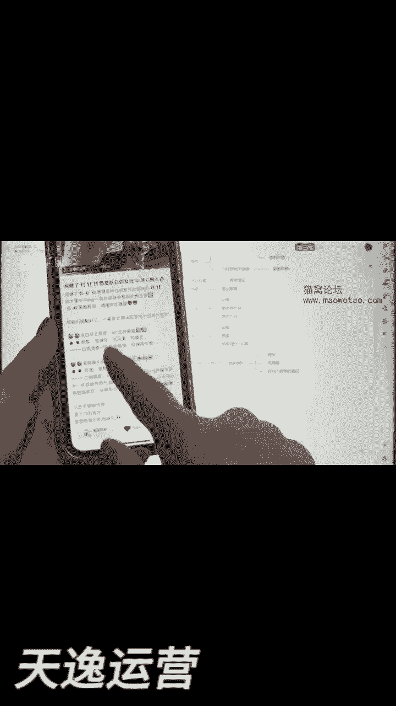

就有的时候你不是说了吗，哎呀老师，我这个东西我不知道怎么去写的。

你看人家怎么写的呀，你调整一下嘛，对不对，你看他的标题，他是不是就是特别的那种小红书的感觉了。

很多人我跟你讲啊，你们再去写标题的时候。

如果说你这东西不懂，你就这个笔记，你再去找一些你看一些花手的笔记。

你把它结合结合放在一块嘛。

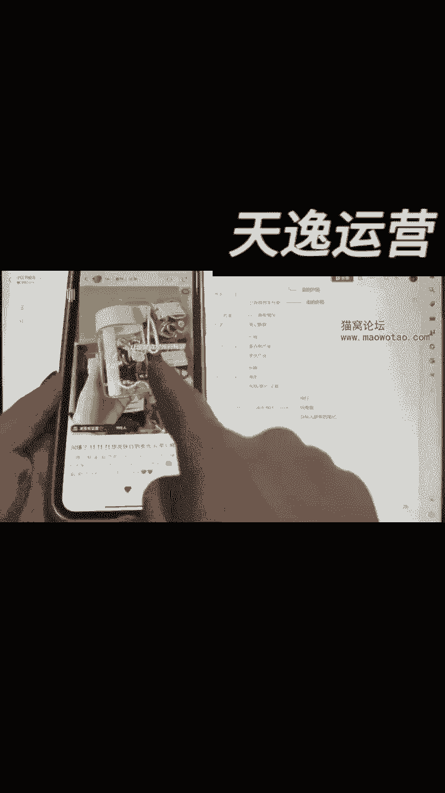

标题放在一块啊，里面的一些产品你肯定不是不行的，从那个标题到它一个内容。

你看到没有，他这个内容里面这个东西一篇一篇，它的一个排版。

什么东西都是很关键的，其次还有个什么，就除了他的一个叫做标题内容之外。

还有一个叫做它的画面，你自己看他的画面，其实到后面的话，一个排版这个主图的点击率是比较高的。

看到没有看到没有，他这个这些排版其实写的挺好的。

那如果说老师，那我没有这样的照片，我没有这张照片可以拍。

你不能拼图吗，你可以拼拼啊，把图片拼在一起，我给你找一个那种啊。

可以把图片拼在一起的那种效果啊，嗯我找找看能不能找得到。

你看像这个，他这个效果是不是。

就是这个小姐姐单独给他抠出来，然后另外再做了一个效果，其实你说白了这个效果和这个他肯定。

要么就是一张图片，然后一张图片下它后面是有背景图。

他把这背景靠扣掉了，扣掉以后用这个做就这么回事啊，或者说我们今天要做这样子的图片。

除了这种画面之外还有什么呢，还有有一些还有一些视频来。

我给你找几个视频的啊，哎这个视频的。

发现了一个小时的新用法，就是把它挂在我们的裤头上面。

里面的话可以带身份证。

银行卡跟口红取下来给大家看一下。

你们我我相信你们肯定会说的哇，这什么玩意儿啊，就这东西我就我我学它。

其实我跟你讲啊，这个博主其实他的视频当中是有槽点的。

你们各位一定就是你们可能刚开始做小红书。

你们做自媒体的时候，你一开始是没有网感的，你是找不到就是他为什么会火的原因。

你就我教你一个方法啊，你从他的评论去找原因，说为什么就这样的内容他能够火呢，这跟我爸把钥匙别在他裤子上有什么区别，这么多的点赞看到没有。

我跟你讲，他的一个流量高的原因就是这个裤头，所以说你们再去学他的时候。

你去截他流量的时候，你可以跟他去学习，然后的话呢，但是这个形容词库头这个东西。

你千万不要去改他的名字，因为这是他的流量密码，能懂不懂吗，跟我当年有异曲同工的之妙，就把东西别在这，别在这的意思踩下他这条笔记。

为什么火的原因，其实他这个产品我自己觉得一般啊，他这个产品挺一般的。

所以说就是你要找到人家为什么火的原因，如果说你前妻，你就是个小白。

咱什么东西不行，什么都不行，你就一比一模仿，然后的话呢稍微把中间的一些文案调一下，你要么就自己拍，就这个东西我跟你讲啊，就一定要去训练的，没有办法说说哎，今天我就是个小白啊，我啥也不懂的情况下啊。

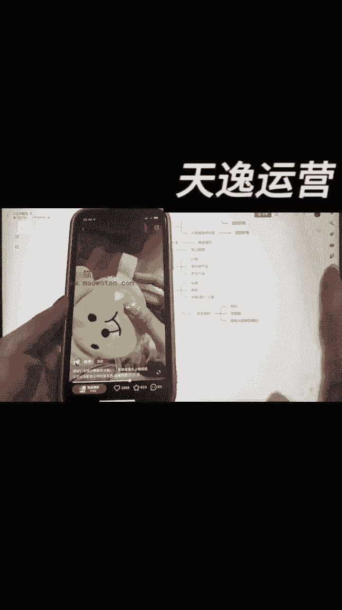

我就什么都都会了，不可能多练吧好吧，其次我跟你讲啊。

这种流，这种方法是你们可以就是偷懒的一个方法。

这个方法一定要好好听啊，这个是什么意思呢，就是我相信你们玩小红书。

你可能只有一个号或者两个号，建议你啊，咱们自从开始卖货之后。

多准备几个账号，四个号，五个号，为什么呢。

呃我找找看啊，就用这个花茶的教你们评论区怎么操作啊。

这个评论区操作的话呢，一般你看啊他在评论区里面，你看呃这个喝哪种博主。

是不是他这个博主是不是会回答，他告诉他该喝什么。

该喝什么，如果说你跟他一样，你是同行，你一定不要拿你的大号去发。

记住没有，一定要拿小号去发，很多人比如比如不是在群里，在这个评论区问吗。

来身上怎么怎么样怎么怎么样，你可以当成一个热心网友回答他。

但是你你记住啊，你们各位啊，如果说他是个卖家。

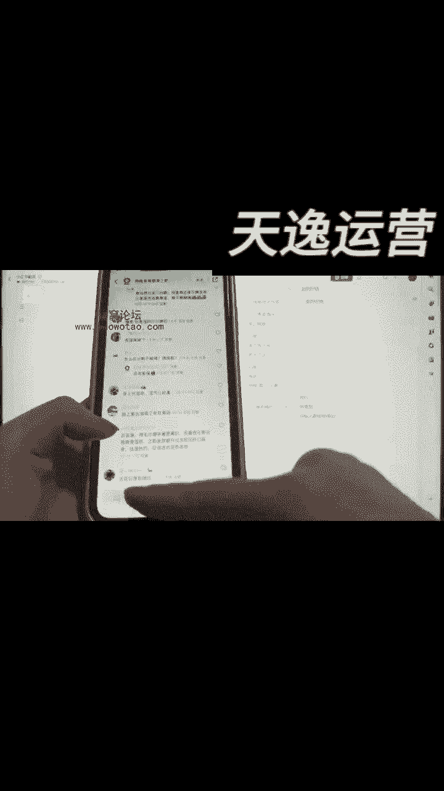

他肯定会对这东西很敏感的，所以说你们回答的时候一定一定不要涉及引流，然后让你就是要体现这些专业度的，同学说我这东西我不懂啊。

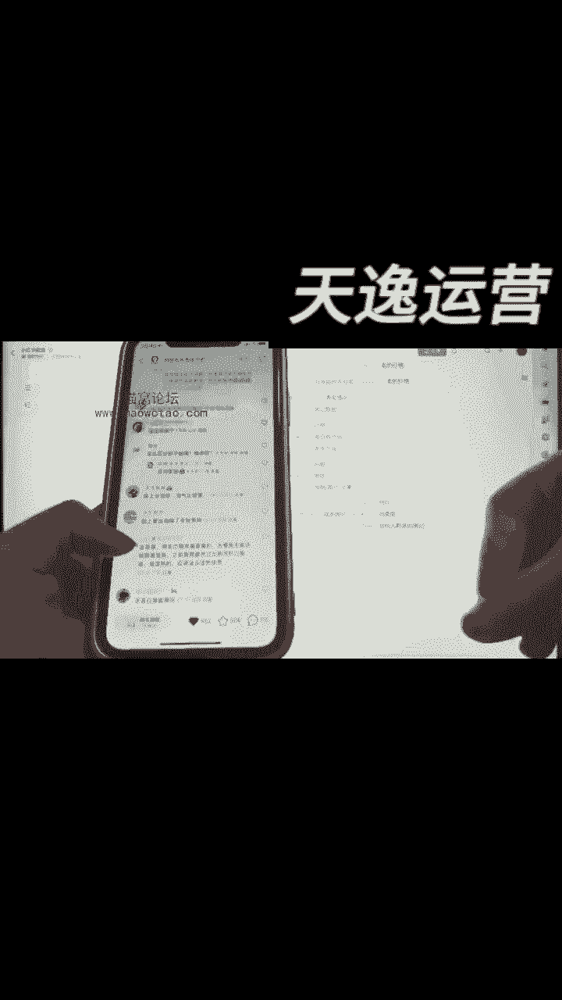

你网上抄不行吗，能懂你这个一话吗，所以说你回答了他，如果说他们真的有意向会跟你聊聊聊聊聊，我跟你讲就聊到聊到到你这买东西了，这是一个抖一个点。

就是你得从你同行评论区去评论，但是你不要每一条他问的问题。

你看到没有，全是意向客户，对不对，我便秘肚子大可以喝吗，这些全部都是对不对。

你不能都回答，你都回答，人家肯定会举报你的，你回答个一两条就够了，但是我跟你讲啊。

最简单的我跟你讲，同行这种东西比较就是你的同行容易过来。

就把你删掉，或者举报你的这东西我跟你讲嗯能做，但是呃有点风险啊。

但是我跟你讲，有一种是嗯没有风险的。

我们一定要去找什么呢，我再给你们打个比方啊，我们一定要找。

就是他就是个个人，他不是什么商家。

他不是你的竞争对手，他只是来分享他自己的一些呃生活的一些经验。

他可能就是一些博主，我打个比方啊，就就打个比方，他这个人他可能就是一个。

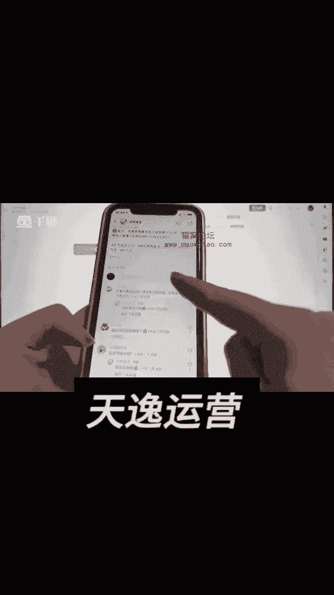

嗯在小红书上去分享，分享自己生活的，然后评论区会有很多人在这里面互动。

你看啊可以每天喝吗，玫瑰不要主巴拉巴拉，你看没有根闷。

放一放，你看这个人啊，如果说如果说这个人他有意向引流，他可以跟他一起沟通，一起沟通，你看到没有，这个人就会在评论区问他，然后问他问他。

他互动起来熟了之后，不就是就有机会去引流了吗，当你的这个东西我跟你讲啊。

回答的好，你到时候就是我跟你讲，精准流量到你的主页上是很多的，然后未来如果说你这个精准流量到你的主页上，然后你再去引流，该卖别的东西。

我跟你讲啊，这东西都很都都，反正就卖同类型的东西都还不错的，你看到没有。

我再给你看一下吧，有没有那种比较明显一点的。

来你看像这个博主。

他是曼曼子，对不对，他你看到没有，分享一个大学到现在用的一个洗衣液。

巨好闻，每次都是六七瓶，我是普通洗衣液，小红书，哪里能够买到正品。

看到没有，他的评论区里面就有很多，这样子的一个就是精准的用户的。

这个在哪个店买的哇，这个有点贵，如果说你看像这个博主。

他不是回答，他是在哪个哪个去家居日用品那买的吗，你可以去看看那边的价格，如果我说你这边能够找到比下价格更划算的，你作为一个就是就是就是一个，就是一个刷小红书的一个网，一个一个一个人，然后你就说了。

哎我发现小红书上有哪家店卖的，这个产品很便宜。

你艾特一下你的自己售卖的那家店铺，各位能明白吗，比如他这个人问爱吃哪家买的。

你说呃，我在，小红书上，买过，然后正品非常不错，非常不错。

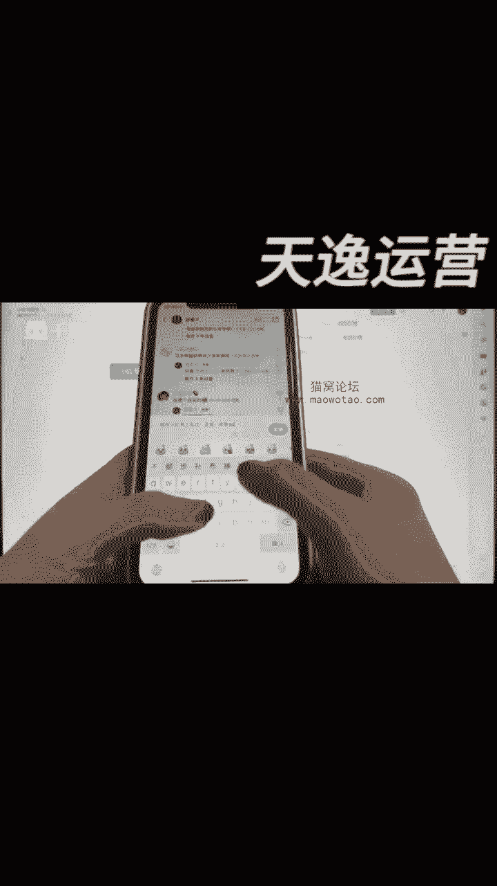

然后的话呢你顺便你艾特一下他，你艾特一下他就好了。

能明白这个意思吗，反正你就尽量的一个真实一点，真实点就好了好吧。

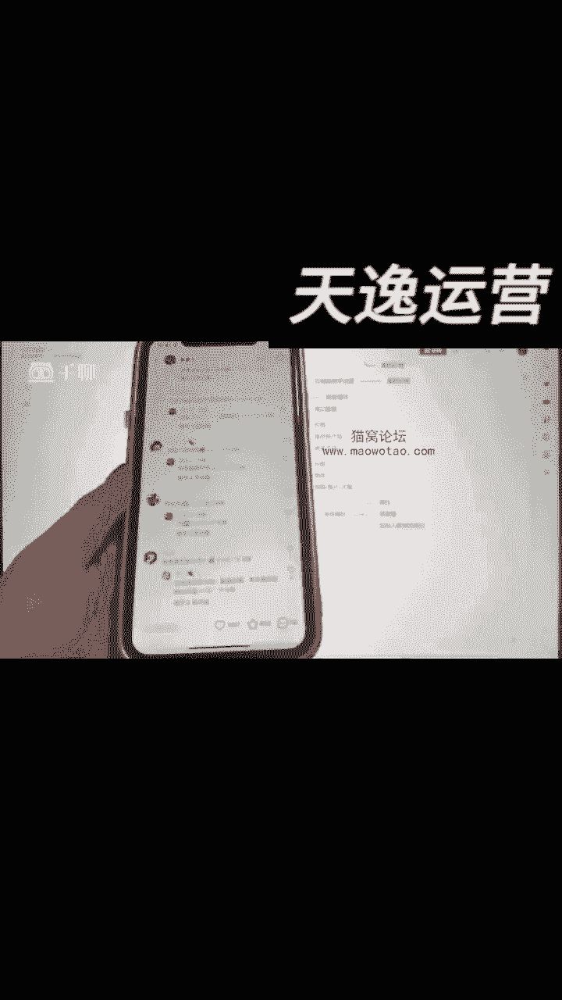

所以说你这样子的做个作品，你比如你刚好是卖这个产品的，这多好呀。

直接帮你引流精准客户，他不买，就我跟你讲。

小红书上很多人会去看这个评论区的，他不买，自然而就照样会有人买，如果说你想把你这个评论像他的这个评论，30一个点赞就能冲到首评，你说白了你找几个人点一点赞，你看其他的你看都八个点赞，几个点赞。

你找几个人点点赞。

你你直接到这个置顶评论上，你都可以做得到，或者是我跟你讲啊，你做不到找人这么多人给你点赞，你还有个什么方法呢，你就在这个最就是这个人，你看到30一个点赞，他是最高的点赞，对不对，你在他的下面你去评论。

然后的话你再找几个人给你点点赞，你肯定就是矮个，就是这个里面肯定你看这三个点赞。

一个点赞，你肯定往能往前面跑的嘛，这东西能理解吧。

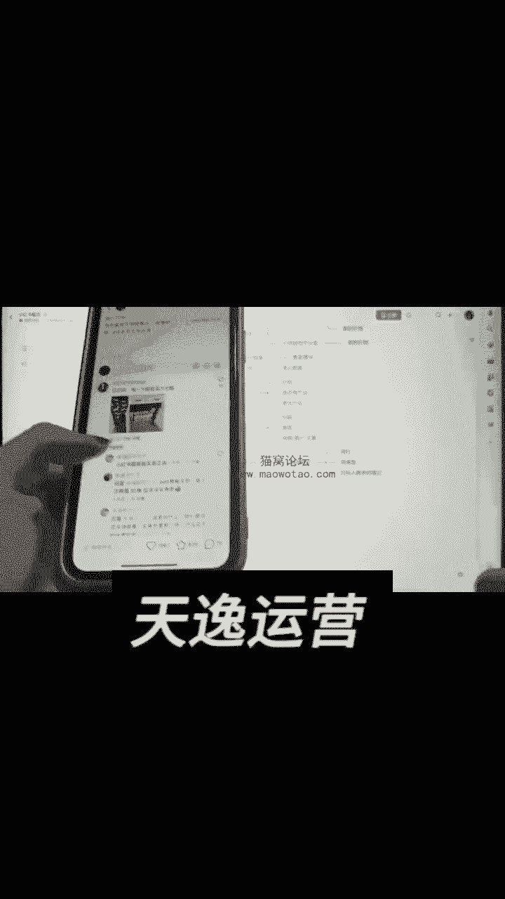

所以说很简单的啊，所以说你什么叫同类型，然后你目标人群多的笔记。

什么叫做目标人群多的笔记呢，我打个比方，就是你今天是一个卖比如是卖母婴用品的啊。

今天如果说你是个卖母婴用品的，就这啊备孕攻略里面。

我就问你哪一个，就这些人姐妹用单独吃复合维生素吗。

哎呦恭喜啊，龙宝宝接好运，叫就这这帮人全在那接好运，我就问你们这些人是不是你的意向客户，是不是吧。

你在这个里面我告诉你啊，你可以3~4个全都是你自己人，然后你就再说啊。

我跟你讲啊，比如他们有有，比如他们要就是想要想要促进生小孩。

你刚好有这个产品，你不就找几个找几个那种哦，那个人你在这个评论区评论。

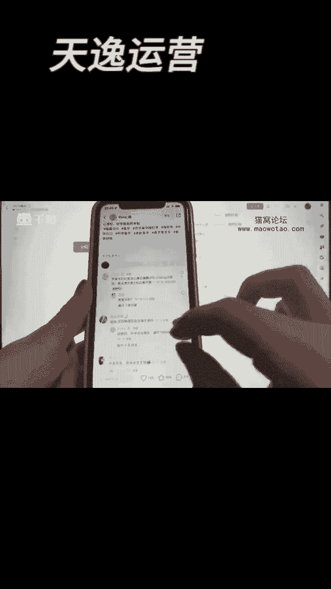

互相维护一下这个地方的精准用户跟你讲，不要大把能明白。

不只能在课里面跟你讲个大概，你们用我的方法。

你注意你刷小红书，你去留意你的同行里面绝对干这个事好不好，这就是怎么去截流的方法好吧，然后的话大家建议啊，嗯把我这个课反反复复多看几遍，反反复复多加多看几遍，如果真的有什么东西你不大理解的。

你到时候可以在我们的那个群里面问我们，老师啊，我有的时候我看到我也会回答你们的消息的。

好吧好，就今天就这样子啊。