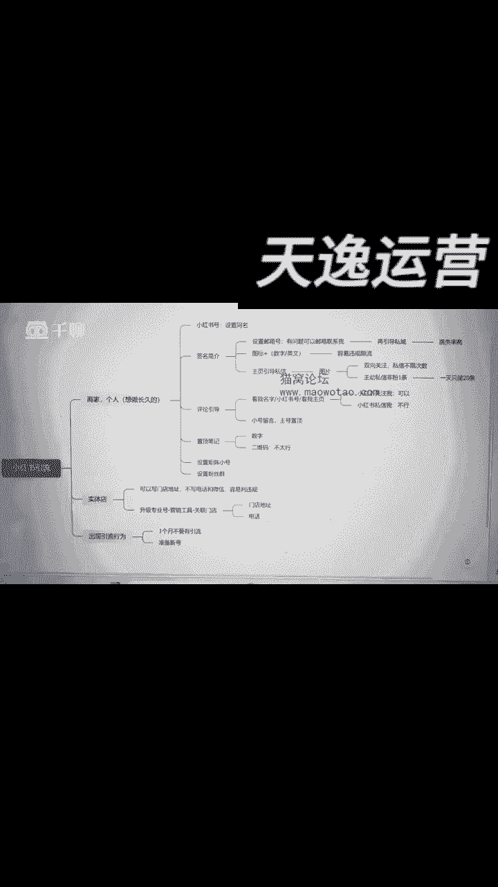
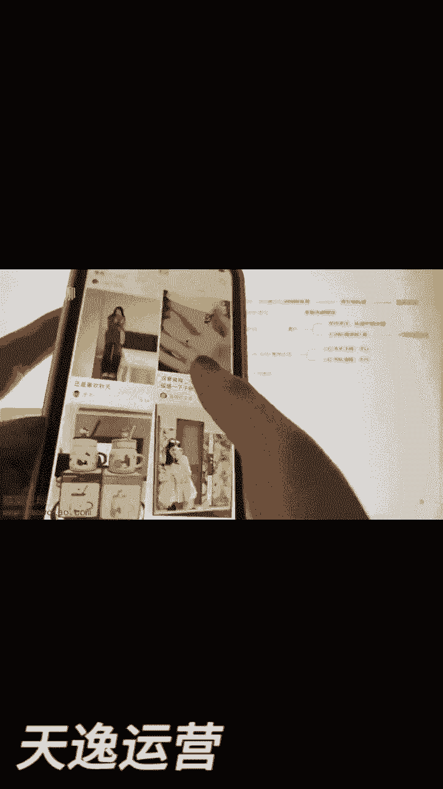
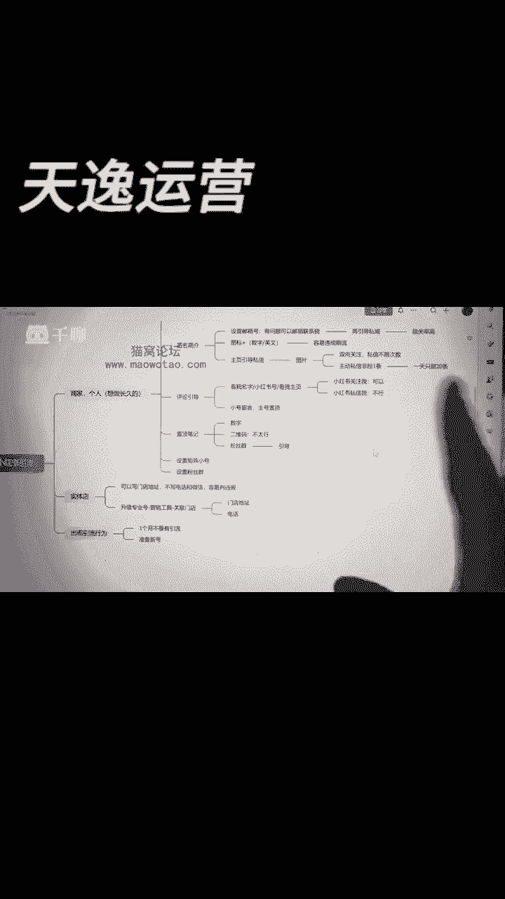
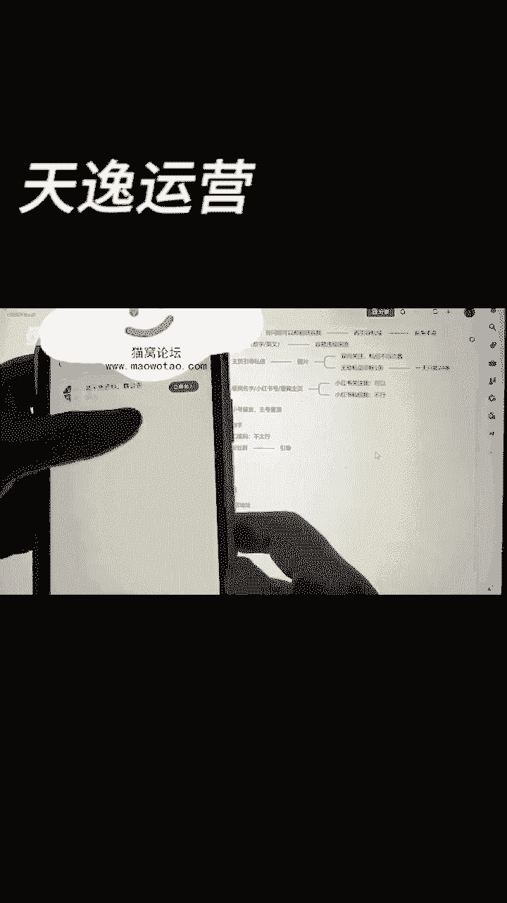
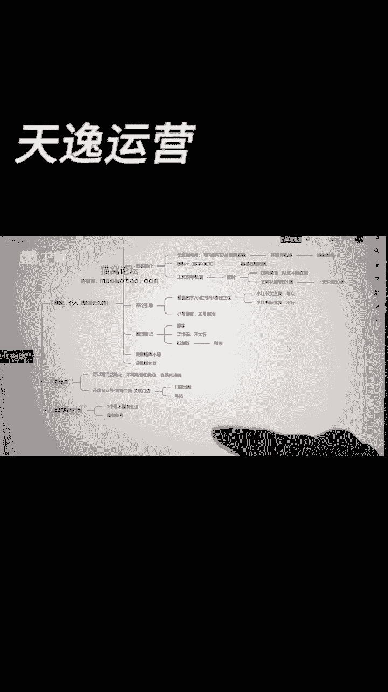

# 【新媒体运营】小红书运营全套课程 零基础进阶起号运营教程 小红书爆款笔记打造／ 商业变现／涨粉技巧／高效就业 完整版流量机制全套课程！ - P30：小红书引流 - 夏季来临时 - BV1SnYjeuEQ3

呃哈喽，今天给大家讲一下关于小红书的这个引流啊，引流是什么意思呢。

就是意思你就是沉淀私欲，沉淀私欲的意思就是这个啊。

在这儿我不能讲的太明白，就是这个意思或者是这个意思能懂吗，然后的话呢你们记住啊，今天如果说你要想要卖货，你要做长久一点，你要把你这个精准客户，未来沉淀到这个私域之后，你要去进行二次成交，三次成交。

这都是有可能的，那么这个私欲你该怎么去沉淀呢，你不能直接跟人家哎，你加我的，巴拉巴拉巴拉什么吧，这个如果说被任何一个比如平台发现，他都是不允许的，除非的是微信。

他自己本身微信，他肯定当然是乐意的咯，你所有的人都沉淀到我这儿懂不懂，所以说你们记住啊，如果说今天你是个个人想做长久，是个商家想做长久的啊，你们这个沉淀私域这个动动作是有必要去做的。

那我们如何去沉淀这样子的私欲呢，首先我们先给你举个案例啊。

然后的话呢呃这是小红书的一个首页。

首页上的话呢，我随便给你先刷一下啊，随便给你刷一下，像这个小姐姐这个的话呢。

是一个小姐姐的一个主页，这是她的一个小红书的主页。

主页上看到没有，这是他的名字，下面有个叫做小红书号的，看到没有，这个地方你要各位各位能看得清吗。

这个地方有个小红书账号，你这个小红书的这个账号上的这个数字。

小红书账号上的这个数字。

你是可以设置的跟他一模一样的，然后的话呢你之后再去暗示他们或者怎么样。

你去做这个事也是可以的。

能明白不啊，然后如果说有什么听不大懂的，你到时候也可以在我们的群里面学习。

群里面问我们好，不然后我们再其次是什么呢，其次这个就是我们那个叫做简介。

叫做签名简介，签名简介上有个特点，就这个东西这个邮箱啊。

小红书查的没有这么的严，所以说你们再去加这个邮箱的时候。

是上面前面这个地方加个图标，然后巴拉巴拉这个大家都能看得懂。

这是什么意思，你就直接去设置邮箱号，或者是有问题，你可以联系我，这个东西可能还好一点，就是你看到了处罚的几率没有这么的高好吧。

所以这个东西你是可以就是人家去啊，给你发了一个邮件之后。

你再回复人家的邮件，让人家去再你再去引导到思域。

就这个链路有个问题是什么呢，人家发你邮件，然后你回复人家的邮件，然后再引导到思域，这一步，我跟你讲，跳失率是很高的。

就干这事的人不多，不是说没有，就比例比较低，所以这个行为的话呢。

虽然说不怎么容易被判违规，但是实话实说。

你去转粉沉淀这东西挺难好吧，其次还有一个什么呢，叫做你的这个简介上。

你可以这么去写，就是他们有很多人的话呢。

我看看能不能找得到啊，呃可能找到的这个会比较难一点。

但是我尽量给你们找找，看能不能找得到啊，跟你讲啊，反正你就记住了。

就是我们在这个主页上，很多人是会搞那种图片，然后的话呢嗯加那种数字。

比如说一串数字。

这种一串数字加这种的，一般来说容易被处罚，被限流的没有几个能很安然无恙的，就是度过这个小红书的审查，你过不了啊，一般来说那有些可能是英文字母的。

纯英文字母呢可能还没有这么高的风险，但是你千万不要出现这个字，出现这个字你特别容易被处罚的。

好不好，对来OK我们在第三个他的简介上是这种情况的。

看到没有，像他他认为有问题。

巴拉巴拉帮你推荐什么，说白了这一个人就是肯定是跟你讲啊。

引导到他的一个粉丝群，看到没有这个地方，其他的粉丝群。

就你们之后如果说你要去做这种引导的动作，你可以建个粉丝群，然后让他们到粉丝群里面。

或者是直接私信你，但是你要注意啊，私信这个地方。

你可以直接给人家发图片或者是什么呢，或者是让人家看你的什么呢。

看你的这个你看他有个操作，这个东西等会给你们讲啊，反正就是让他们私信你。

但是你要记住啊，小红书有个私信有个问题，就是只有你跟他互相是回关的。

你们俩的聊天是不限次数的，但是如果说他是你的非粉丝。

他并没有关注你，他就主动给你找了一句话啊。

发了一句话我告诉你啊，或者是他在你的，比如上次他的一个评论区给你留言。

你留他留言了，你主动跟他聊。

你一天只能涨20，只能连20个人，一天最多多一个人聊一条。

你也一天只能聊20个人，所以说你们记住，尽量的让他们关注你。

然后你到时候如果说他有这个需求，他回你回关他，你跟他聊天，你还可以发图片。

而可以，而且私信聊天的这个东西都是不限次数的。

其次是什么呢，其次你注意看啊，就他应该是会在这个地方来来看到没有。

它会在它的主页的一个就是作品里面。

作品里面看到没有评论区哦，不是不是主页评论区这个地方你注意看。

看到没有，他有回复的，看到没有。

但是你们注意啊，这种的评论比较容易被小红书给吞掉。

所以说我一般我教你的方法是什么呢，呃我教你的方法就是用你的小号去留言。

然后你的主号的话，你给他置顶就好了，比如像他是你的小号。

他把这个东西发了之后，你给他置顶就行，还有其次其次一个方法是什么呢。

就你就直接看什么，看我的名字啊，你们有问题看我的名字，你有问题看我的主页。

一般有些人聪明的，他们就直接就知道怎么去找你了，那如果说真的有人很多人不不懂啊，你你直接说你私信我这个啊，这句话你提都不能提的啊，你提都不能提，你说你关注我啊，你要是哎你你如果说有更多的干货，哎你好奇。

你关注我。

欢迎你关注这东西，没关系的，记住啊，这个是一个叫做评论区引导。

第三个是什么呢，其实它的功能上你看到没有，它这个地方这个地方在哪里找。

他其实就已经跟你很明确的说了，领取粉丝福利。

说他这个东西是直接引导到他的公众号的，但是我跟你讲啊，你我们别搞这个搞公众号。

你要去维护你整个运营成本太高了，你可以怎么样呢。

你可以这样子这个置顶的视频，你留数字。

你我跟你讲啊，数字或者是直接让他进你的粉丝群二维码。

你不要弄啊，数字可以的，然后的话呢或者是这个粉丝群这个东西，各位如果说你真的有什么东西。

因为我没有办法说的太直接，直接说，可能我这个内容我没有办法审核通过。

所以说如果说你真的有什么听不懂的地方，你到时候可以问我们好吧，看到没有，请公告。

我说白了就是他在家的群公告上，肯定是有去做过什么呢。

有去做过，那他的一些就是一些那种引导的啊，这个东西就是你其实你留意的去看小红书，会看到很多这样子的现象，再然后的话呢你记住啊。

当你在设置完这个东西，我建议你们不要用你的这种大号。

因为你看像比如像他他3万的粉丝，他是个他算是个大号。

如果说你真的只在应进行引流行为，你的大号特别容易违规。

容易你一违规，我跟你讲，小小红书那边引流违规。

特别容易给你的作品笔记去限流的，这可是直接影响到你的笔记的抖音，你引流顶多抖音给你禁言啊，不能让你跟人家聊天，但是他不会限你作品的流量，但是小红书是会限你作品的流量的，各位记住了没有。

所以说我建议你啊，尽量的你可以去设置这个东西，设置这个东西，这个你的小号，然后你用你的小号去说这个话会安全一点。

好不好，然后其次我跟你讲，就粉丝群一定要去设，如果说今天你是搞实体店的。

实体店的话，有个好处，就是你记住啊，如果说你做实体店，你直接就去做个人店，其实我说实话啊，他是不会让你去写电话和微信的，直接给你很容易判罚的，也不说直接判罚，很容易被查到判罚。

但是你可以选门店地址，这东西没关系，但如果说你真的我今天就是开实体店。

我就要引流的，你怎么办呢，还有个解决方案，就是呃你把你的一个小红书账号。

你记住啊，就是咱们在开店的那个过程中。

不是有一个有一个有有一个步骤吗，有一个这个步骤就是开通专业号的这个地方。

有个步骤，这个步骤你给它开通起来，看到没有，升级专业号营销工具里面直接选择关联店铺，关于门店的地址和电话全部都可以留的，但是还是这个东西还是不能留的啊，这东西不能留，然后的话呢。

如果说你真的因为这个引流的行为，你被判罚了，你记住一个月之内绝对不要引流，你也不要讲任何的话，小号可以操作，大号不要动，不要引流，容易笔记限流的，其次你一定要准备型号，好吧。

