# 【新媒体运营】小红书运营全套课程 零基础进阶起号运营教程 小红书爆款笔记打造／ 商业变现／涨粉技巧／高效就业 完整版流量机制全套课程！ - P5：图文笔记爆款打造 - 红书运营小子 - BV17cY5eLEoo

商家朋友们好。

欢迎来到本期商家课堂，很多商家朋友们用心发布的商品笔记。

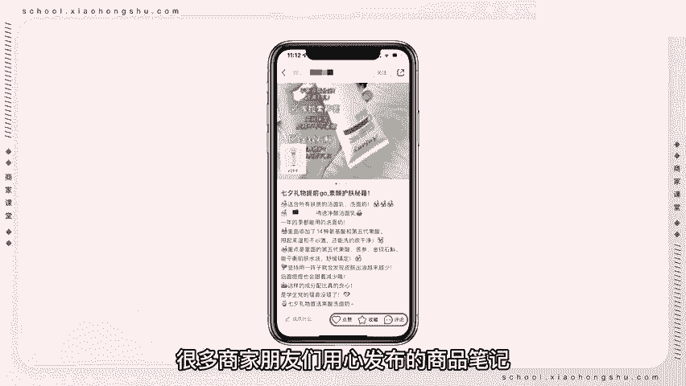

转化率总是不理想，笔记流量低，销量差，那么如何让图文笔记变成爆款呢，商品笔记的分发逻辑又是什么呢，今天院长来教大家图文笔记爆款打造。

商品笔记是一种强有力的带货形式。

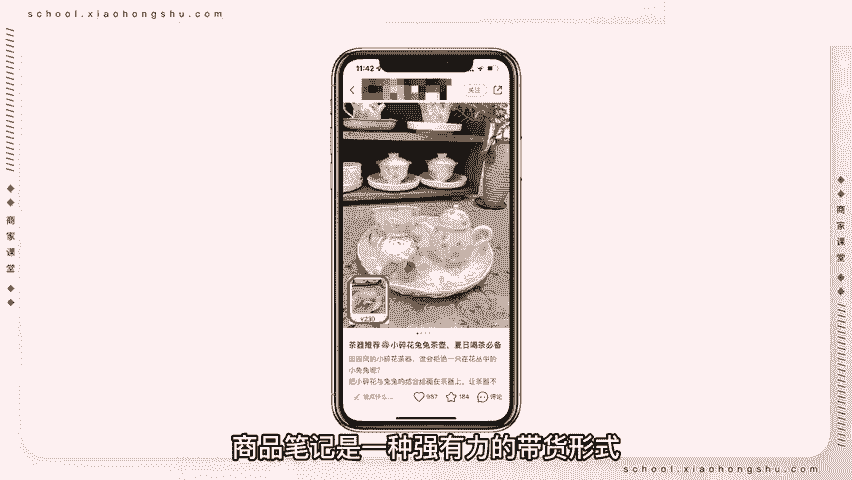

商家在图文笔记中添加商品链接，用户可以直接在小红书。

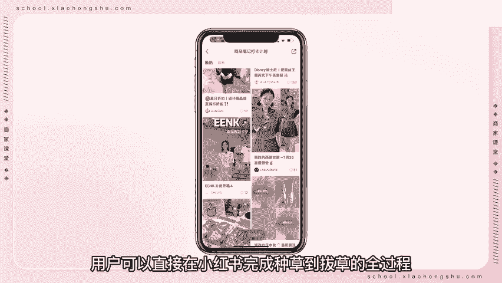

完成种草到拔草的全过程，商品笔记的分发逻辑以公域流量为主。

最后转化为私域流量，分为推荐浏览笔记转化主页转化三部分。

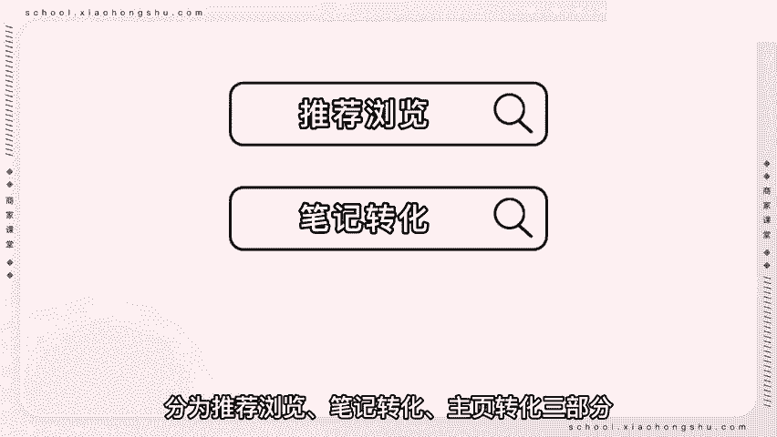

推荐浏览，用户通过搜索或者在主页推荐中看到笔记。

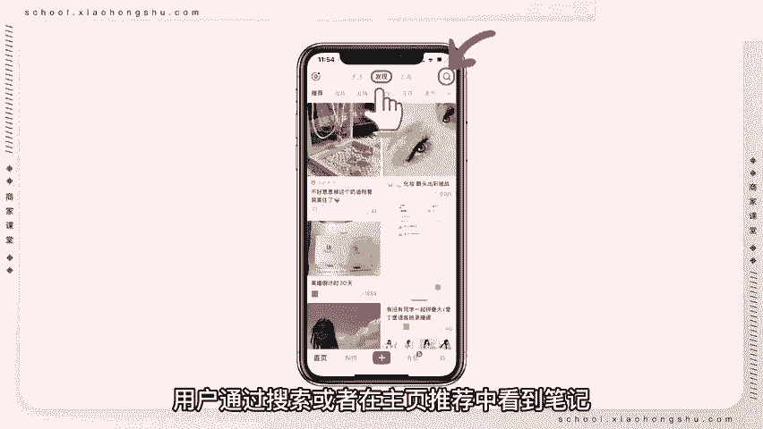

对该商品笔记感兴趣，则会点击进入笔记页面，笔记转化用户通过商品笔记中的商品链接。

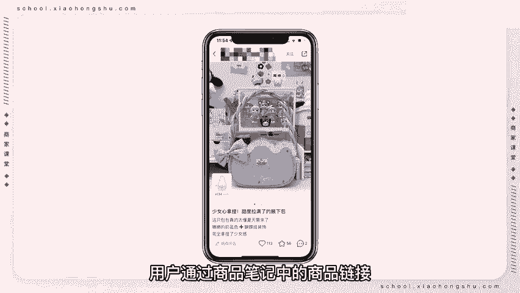

可以直接购买商品，增加商品销量，主页转化用户在阅读商品笔记后进入商家主页。

关注商家，提高商家粉丝量。

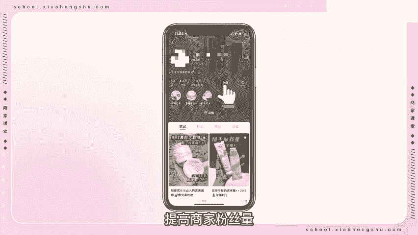

爆款图文笔记需要掌握两个核心指标，一互动价值包括商品笔记点击率。

点赞收藏分享评论等，点击率等于点击除以展现，通过发现页，关注页，附近页。

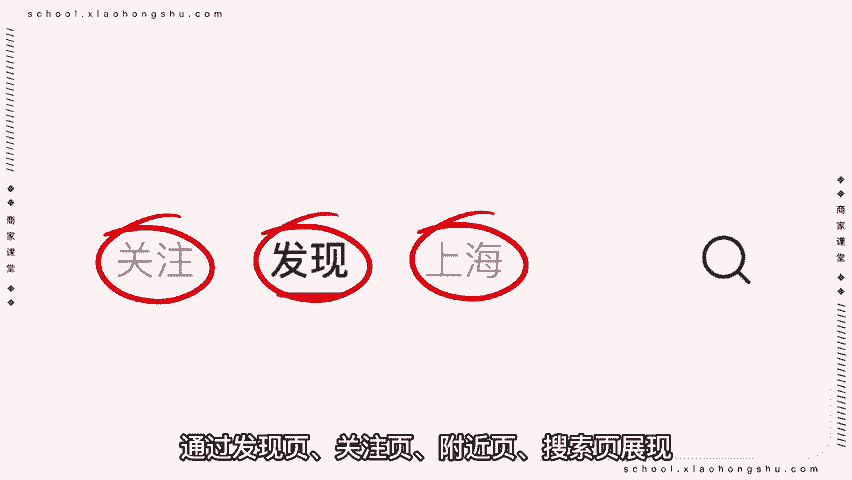

搜索页展现发现页是主要的流量来源，让图文笔记更容易在发现页被推荐。

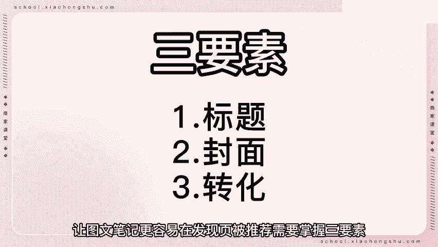

需要掌握三要素，标题关键词醒目加长尾关键词。

恰当地运用关键词，更容易让用户了解笔记内容，增强用户的好奇心，同时把标题数字化，借助热点话题吸引用户点击，笔记封面，封面的设计需要围绕笔记内容展开，可以添加对比图，步骤图，效果图等，捕捉用户的需求转化。

要突出产品的优点以及用户下单的理由。

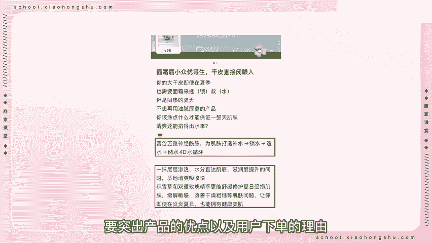

是否能够吸引用户种草转化。

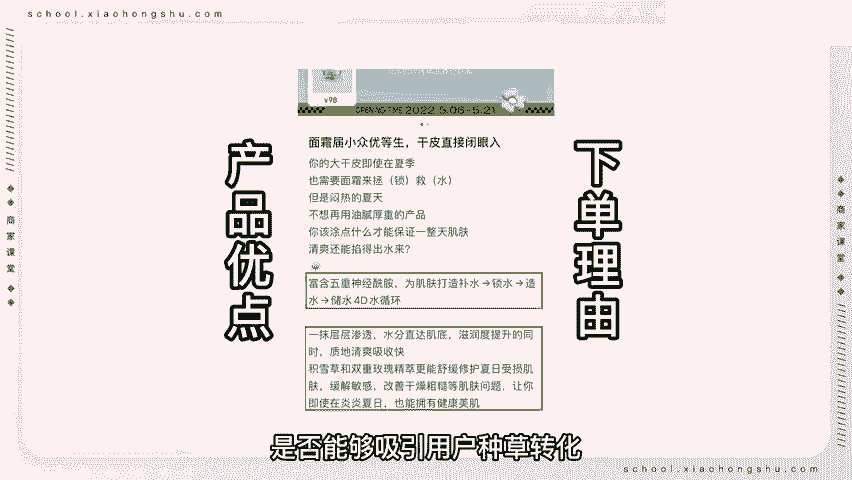

提高产品销量，二交易价值包括商品点击率，加购购买商品点击率能直接体现笔记内容质量。

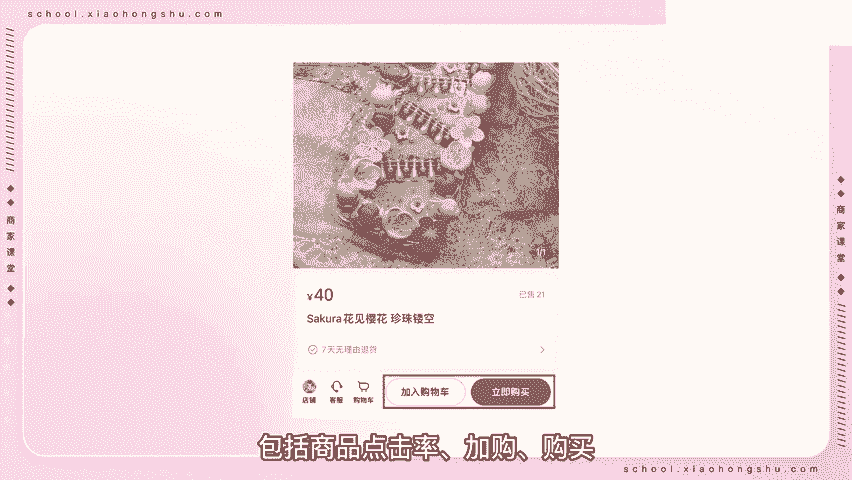

笔记内容要突出商品功能，卖点价值等，帮助消费者决策，缩短购物链路。

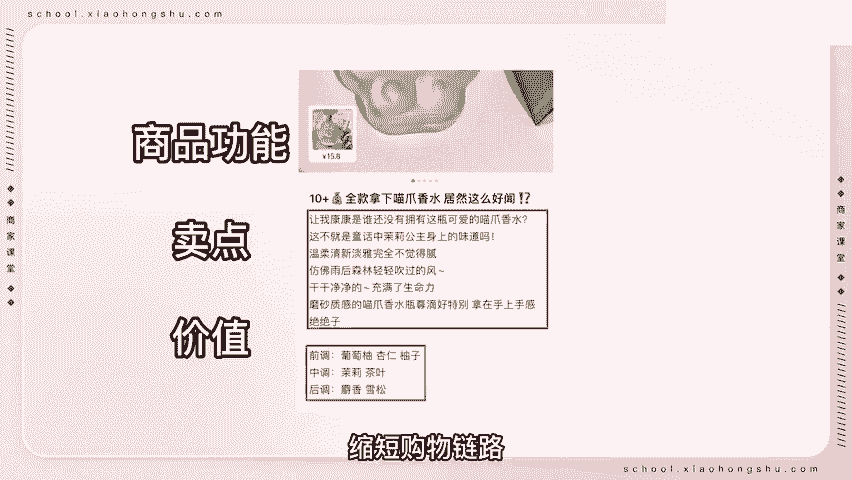

同时在评论区内积极回复用户问题，置顶购买路径及现在下单享受的购买福利，刺激用户下单，想要做好商品笔记，以上的技巧都需要用到，只做一个方法，可能会有小的爆点，整体提升才能够让商品笔记的流量更加稳定。

本期商家课堂到此结束。

