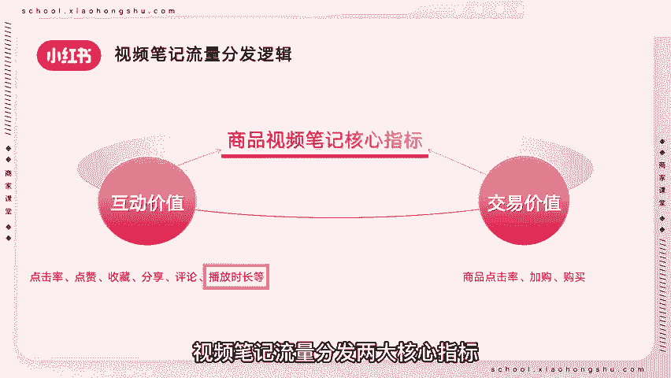
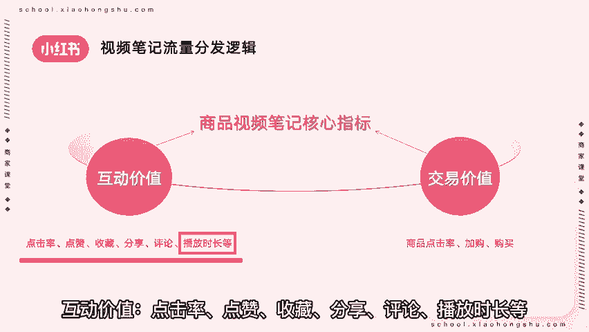
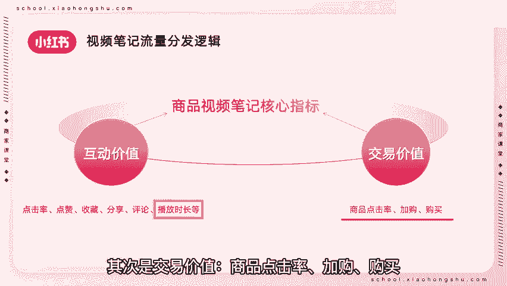
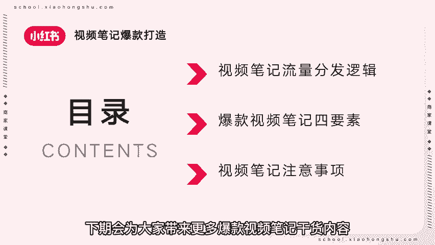

# 【新媒体运营】小红书运营全套课程 零基础进阶起号运营教程 小红书爆款笔记打造／ 商业变现／涨粉技巧／高效就业 完整版流量机制全套课程！ - P6：视频笔记爆款打造（上） - 红书运营小子 - BV17cY5eLEoo

商家朋友们好，欢迎来到本期商家课堂，上一期课程我们讲到爆款图文笔记打造。

今天来教大家爆款视频笔记打造一视频笔记。

流量分发逻辑，商品笔记是小红书强有力的带货形式，打通内容和交易，缩短链路，BC直连的方式，用户可以直接在小红书，完成种草到拔草的全过程，视频笔记流量分发两大核心指标。

互动价值，交易价值，互动价值，点击率，点赞收藏分享评论。

播放时长等，播放时长的多少，直接影响流量的多少，完播率越高，互动价值越高，下期视频会教大家如何提升视频笔记完播率，其次是交易价值，商品点击率加购购买。

用户观看视频后是否能够下单转化，决定着该视频笔记的交易价值，二爆款视频笔记四要素，视频笔记的观看前三秒需要引人入胜，想要打造成爆款视频笔记，需要掌握四要素，情趣用品情情感价值是否能够引起用户的共鸣。

用真实的语言让用户更加有代入感，去趣味性，视频类笔记往往时长较长，在视频笔记中可以添加花字，音效或表情等，提升视频的趣味性，用实用性，小红书平台偏于种草分享类，很多用户都期望在笔记中找到干货。

所以内容不能假大空，要多站在用户的角度去考虑，该笔记能够为用户带来什么品品味调性，发布的视频笔记要符合小红书平台调性，视频清晰度高，画面干净，美观度高，三视频笔记注意事项，保持内容垂直度，切记定位混乱。

需要为账号建立一个定位，比如玩具类账号，箱包类账号，课程类账号等，发布符合定位的作品后，平台将会识别账号垂直度，定向匹配精准粉丝，保持内容更新频率，切忌三天打鱼两天晒网，坚持内容持续输出。

能够激发用户内心的购买欲望和潜在需求，从而进行下单转化，视频笔记爆款打造还有很多内容，本期商家课堂讲解了视频笔记流量分发逻辑，爆款视频笔记四要素，以及视频笔记注意事项。

下期会为大家带来更多爆款视频笔记干货内容。

本期商家课堂到此结束。

